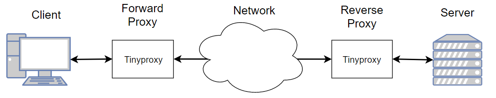
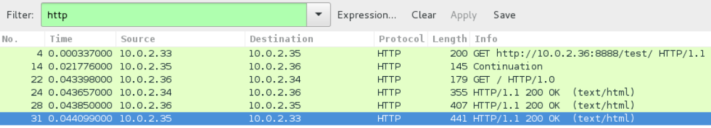

+++
title = 'TinyProxy forward and reverse proxy'
date = 2020-04-10 00:00:00 +0100
categories = ['debian', 'outils']
+++
## TinyProxy

[Tinyproxy](https://tinyproxy.github.io/) est un démon de proxy HTTP/HTTPS léger pour les systèmes d'exploitation POSIX, qui est [open source sur Github](https://github.com/tinyproxy/tinyproxy).

J'ai essayé cet outil pour mettre en place un proxy avant du côté client de la communication et un proxy arrière du côté serveur. Je voulais l'utiliser pour pouvoir faire des expériences sur le réseau entre le proxy avant et le proxy arrière, sans l'implication du client et du serveur.

Les reverse proxies sont surtout utilisés comme équilibreur de charge, où nous nous connectons avec un reverse proxy qui décide ensuite à quelle machine il doit envoyer la demande.

### Exigences

Les exigences suivantes représentent ce que j'ai utilisé dans mon expérience :

*    Une image avec une distribution de système d'exploitation Linux - j'ai utilisé une Debian GNU/Linux 8.9 (Jessie) ;
*    4 machines virtuelles pour servir de client, de proxy avant, de proxy arrière et de serveur - j'ai utilisé VirtualBox pour faire fonctionner ces machines, avec l'image du système d'exploitation Debian ;
*    Le serveur doit faire tourner un serveur web - j'ai utilisé le serveur HTTP Apache, pour renvoyer la page HTML par défaut en disant "Ça marche !
*    Le client doit avoir un navigateur ou un outil de ligne de commande installé, comme curl, pour effectuer des requêtes HTTP ;
*    Les machines avec proxy avant et arrière doivent avoir tinyproxy installé - Je vais ensuite montrer comment l'installer sur les machines Debian. La version que j'ai utilisée était la 1.8.3.

###Architecture de test

{:width="600"}  
Architecture de test pour l'expérience

J'ai créé le dépôt [isabelcosta/testing-tiny-proxy](https://github.com/isabelcosta/testing-tiny-proxy) sur Github avec les fichiers de configuration nécessaires pour faire fonctionner les deux rôles de proxy avant et arrière.

### Configuration du réseau

VirtualBox vous permet de configurer les paramètres réseau des machines virtuelles. J'ai utilisé le paramètre Nat Network qui m'a permis d'avoir toutes les machines dans le même réseau. Il s'agissait de l'IP assignée à chaque machine.

*    Client — 10.0.2.33
*    Forward Proxy — 10.0.2.35
*    Reverse Proxy — 10.0.2.36
*    Server — 10.0.2.34

Ces adresses IP seront importantes, car elles apparaîtront dans les exemples de test du système.

### Installer Tinyproxy

Pour installer Tinyproxy, vous devez taper la commande suivante dans le terminal des machines proxy avant et arrière :

    apt-get install tinyproxy

### Mise en place du système

Tinyproxy fonctionne selon les fichiers de configuration. J'ai écrit deux configurations, une pour le proxy avant et une autre pour le proxy arrière.

Fichiers de configuration du proxy avant et du proxy arrière :

**forward_proxy.conf**

```
## forwardproxy.conf -- tinyproxy daemon configuration file

User nobody
Group nogroup

Port 8888
Listen 10.0.2.35
BindSame yes

Timeout 600

DefaultErrorFile "/usr/share/tinyproxy/default.html"
StatFile "/usr/share/tinyproxy/stats.html"
Logfile "/var/log/tinyproxy/tinyproxy.log"
#Syslog On
LogLevel Info
PidFile "/var/run/tinyproxy/tinyproxy.pid"

# Comment to use only the forward proxy
# Uncomment to forward the traffic to the reverse proxy
#Upstream 10.0.2.36:8888

MaxClients 100
MinSpareServers 2
MaxSpareServers 5
StartServers 2
MaxRequestsPerChild 0

Allow 127.0.0.1
Allow 10.0.2.0/24

ViaProxyName "tinyproxy1"

ConnectPort 8888
ConnectPort 80

# The following two ports are used by SSL.
ConnectPort 443
ConnectPort 563
```

**reverse_proxy.conf**  

```
## tinyproxy.conf -- tinyproxy daemon configuration file

User nobody
Group nogroup

Port 8888
Listen 10.0.2.36

BindSame yes
Timeout 600

StatFile "/usr/share/tinyproxy/stats.html"
Logfile "/var/log/tinyproxy/tinyproxy.log"
#Syslog On
LogLevel Info
PidFile "/var/run/tinyproxy/tinyproxy.pid"

MaxClients 5
MinSpareServers 2
MaxSpareServers 5
StartServers 2

MaxRequestsPerChild 0

Allow 127.0.0.1
Allow 10.0.2.0/24
Allow 10.0.2.35

ViaProxyName "tinyproxy2"

ConnectPort 8888
ConnectPort 80

# The following two ports are used by SSL.
ConnectPort 443
ConnectPort 563

ReversePath "/test/" "http://10.0.2.34:80/"
#ReversePath "/" "http://10.0.2.34:80/"
ReversePath "/wired/" "http://www.wired.com/"

ReverseOnly Yes
ReverseMagic Yes
ReverseBaseURL "http://10.0.2.36:8888/"
```


Pour faire fonctionner la tinyproxy avec une configuration spécifique, il suffit de faire ce qui suit :

        tinyproxy -c <configuration-file>
    
Par exemple : `tinyproxy -c forwardproxy.conf`

### Tester le système

Assurez-vous d'abord que le serveur fonctionne correctement et que vous pouvez y accéder avec la commande suivante, depuis n'importe quelle machine, puisqu'elles font toutes partie du même réseau. Vous pouvez tester cela en utilisant l'outil en ligne de commande curl ou sur un navigateur :

    curl http://10.0.2.34:80/ 

Maintenant, pour tester l'ensemble du système, si vous voulez utiliser curl, vous pouvez taper ceci sur la console de la machine cliente :

    curl -v --proxy http://10.0.2.35:8888 http://10.0.2.36:8888/

C'est le résultat de la commande précédente :

```
root@debian:/home/debian# curl -v --proxy http://10.0.2.35:8888 http://10.0.2.36:8888
* Rebuilt URL to: http://10.0.2.36:8888/
* Hostname was NOT found in DNS cache
*   Trying 10.0.2.35...
* Connected to 10.0.2.35 (10.0.2.35) port 8888 (#0)
> GET http://10.0.2.36:8888/ HTTP/1.1
> User-Agent: curl/7.38.0
> Host: 10.0.2.36:8888
> Accept: */*
> Proxy-Connection: Keep-Alive
> 
< HTTP/1.1 200 OK
< Via: 1.0 tinyproxy2 (tinyproxy/1.8.3), 1.1 tinyproxy1 (tinyproxy/1.8.3)
< Last-Modified: Mon, 11 Jun 2007 18:53:14 GMT
< Date: Tue, 12 Dec 2017 23:01:37 GMT
< Content-Type: text/html
< ETag: "2d-432a5e4a73a80"
< Set-Cookie: yummy_magical_cookie=/; path=/
* Server Apache/2.4.29 (Unix) is not blacklisted
< Server: Apache/2.4.29 (Unix)
< Content-Length: 45
< Accept-Ranges: bytes
< 
<html><body><h1>It works!</h1></body></html>
* Connection #0 to host 10.0.2.35 left intact

```

Une autre façon de voir que cela fonctionne, c'est d'utiliser l'outil [Wireshark](https://www.wireshark.org/). Cet outil vous permet de voir le trafic du réseau. Avant de tester le système, lancez Wireshark. En testant sur un réseau local, vous pouvez voir l'ensemble du trafic du client au serveur. Après avoir demandé et reçu la réponse du serveur, si vous filtrez les captures de Wireshark par "http", vous devriez voir un résultat similaire à l'image suivante.


{:width="700"}  
Capture Wireshark de la communication entre le client et le serveur, en passant par les proxies.

Dans cette capture, vous pouvez voir le trafic dans les deux sens : client ↔ proxy avant ↔ proxy arrière ↔ serveur.

Pour vérifier le fichier journal et les proxies forward et reverse, vous pouvez taper ce qui suit sur l'une ou l'autre des machines :

    cat /var/log/tinyproxy/tinyproxy.log

Si vous voulez tester cela d'une autre manière, vous pouvez modifier les fichiers de configuration des proxies sur [isabelcosta/testing-tiny-proxy](https://github.com/isabelcosta/testing-tiny-proxy) repository.

### Conseils et notes

*    Si vous souhaitez mettre en place d'autres chemins, vous pouvez le faire avec le mot-clé "ReversePath". Par exemple : ReversePath "/test" "http://10.0.2.34:80/" - de cette façon, vous pouvez accéder au serveur en tapant "http://10.0.2.36:8888/test"
*    Je recevais toujours l'erreur 400 Bad Request, parce que j'utilisais cet outil de la mauvaise manière. J'utilisais curl pour me connecter au serveur comme point final au lieu du proxy inverse. Le reverse proxy ne fonctionne pas comme un forward proxy, donc n'utilisez pas le mot-clé "upstream" pour transférer le trafic vers le reverse proxy.


