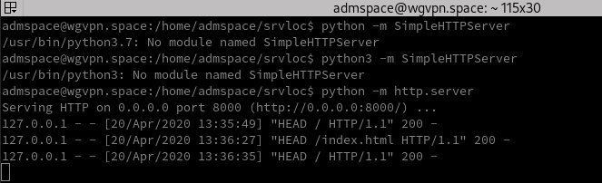

+++
title = 'TinyProxy'
date = 2020-04-20 00:00:00 +0100
categories = ['debian', 'outils']
+++
## TinyProxy

*Tinyproxy est un proxy web très léger.<https://tinyproxy.github.io/>*

### Installation

Debian

    sudo apt install tinyproxy

Pour l'arrêter, le démarrer et le redémarrer :

    sudo systemctl stop tinyproxy
    sudo systemctl start tinyproxy
    sudo systemctl restart tinyproxy

>Attention: Depuis la version 1.8.1, lorsque l'on veut faire tourner sur un port<1024, il faut spécifier `User root` 


### tinyproxy.conf

```
##
## tinyproxy.conf -- fichier de configuration du démon tinyproxy
##
## Cet exemple de fichier tinyproxy.conf contient des exemples de paramètres
## avec des explications en commentaires. Pour les descriptions de tous les
## paramètres, voir la page de manuel de tinproxy.conf(5).
##

#
# Utilisateur/Groupe : Cela vous permet de définir l'utilisateur et le groupe qui sera
# utilisé pour le tinyproxy après la fixation initiale au port
# en tant qu'utilisateur root. Soit le nom de l'utilisateur ou du groupe, soit l'UID ou le GID
# un nombre peut être utilisé.
#
User tinyproxy
Group tinyproxy

#
# Port : Précisez le port sur lequel le tinyproxy écoutera.  Veuillez noter que
# qui, si vous choisissez de fonctionner sur un port inférieur à 1024, vous aurez besoin
# de démarrer tinyproxy avec "root".
#
Port 8888

#
# Listen: Si vous disposez de plusieurs interfaces, cela vous permet de vous relier à
# Un seul. Si cela est commenté, la tinyproxy se liera à toutes les
# interfaces présentes.
#
#Listen 192.168.0.1

#
# Bind: Cela vous permet de spécifier quelle interface sera utilisée pour
# vos connexions sortantes.  Ceci est utile pour les machines multi-homes où
# vous voulez que tout le trafic apparaisse comme sortant d'une interface particulière.
#
#Bind 192.168.0.1

#
# BindSame: S'il est activé, le tinyproxy liera la connexion sortante 
# à l'adresse ip de la connexion entrante.
#
#BindSame yes

#
# Timeout: Le nombre maximum de secondes d'inactivité d'une connexion 
# qu'il est permis d'avoir avant la fermeture par tinyproxy.
#
Timeout 600

#
# ErrorFile: Définit le fichier HTML à envoyer lorsqu'une erreur HTTP donnée se produit.
# Vous devrez probablement adapter l'emplacement à votre installation particulière.  
# Les endroits habituels à vérifier sont :
#   /usr/local/share/tinyproxy
#   /usr/share/tinyproxy
#   /etc/tinyproxy
#
#ErrorFile 404 "/usr/share/tinyproxy/404.html"
#ErrorFile 400 "/usr/share/tinyproxy/400.html"
#ErrorFile 503 "/usr/share/tinyproxy/503.html"
#ErrorFile 403 "/usr/share/tinyproxy/403.html"
#ErrorFile 408 "/usr/share/tinyproxy/408.html"

#
# DefaultErrorFile: Le fichier HTML qui est envoyé 
# s'il n'y a pas de fichier HTML défini avec un mot-clé ErrorFile 
# pour l'erreur HTTP qui s'est produite.
#
DefaultErrorFile "/usr/share/tinyproxy/default.html"

#
# StatHost: Cela permet de configurer le nom d'hôte ou l'adresse IP 
# qui est traité comme l'hôte stat : chaque fois qu'une requête
# pour cet hôte est reçue, Tinyproxy renvoie une page de
# statistiques interne au lieu de transmettre la requête à cet hôte. 
# La valeur par défaut de StatHost est tinyproxy.stats.
#
#StatHost "tinyproxy.stats"
#

#
# StatFile: Le fichier HTML qui est envoyé lorsqu'une demande est faite
# pour la stathost.  Si ce fichier n'existe pas,
# une page de base est codée en dur par tinyproxy.
#
StatFile "/usr/share/tinyproxy/stats.html"

#
# LogFile: Vous permet de spécifier l'endroit où les informations doivent être enregistrées. 
# Si vous préférez vous connecter à syslog, désactivez cette option et activez la directive Syslog. 
# Ces directives sont mutuellement exclusives.
# Si ni Syslog ni LogFile ne sont spécifiés, la sortie se fait sur stdout.
#
LogFile "/var/log/tinyproxy/tinyproxy.log"

#
# Syslog: Dit à tinyproxy d'utiliser syslog au lieu d'un fichier journal. 
# Cette option ne doit pas être activée si la directive Logfile est utilisée.
# Ces deux directives sont mutuellement exclusives.
#
#Syslog On

#
# LogLevel: Warning
#
# Set the logging level. Allowed settings are:
#	Critical	(least verbose)
#	Error
#	Warning
#	Notice
#	Connect		(to log connections without Info's noise)
#	Info		(most verbose)
#
# Le LogLevel enregistre à partir du niveau fixé et au-delà. Par exemple, si le niveau de journalisation est réglé sur Warning, alors tous les messages de journalisation de Warning à Critical seront affichés, mais Notice et en dessous seront supprimés.
#
LogLevel Info

#
# PidFile : écrit le PID du fil principal de la tinyproxy dans ce fichier
# afin qu'il puisse être utilisé à des fins de signalisation.
# Si ce n'est pas spécifié, aucun pidfile ne sera écrit.
#
PidFile "/run/tinyproxy/tinyproxy.pid"

#
# XTinyproxy: Dit  à Tinyproxy d'inclure l'en-tête X-Tinyproxy, qui contient l'adresse IP du client.
#
#XTinyproxy Yes

#
# Upstream:
#
# Activation du support proxy en amont.
#
# Les règles en amont (upstream rules) vous permettent d'acheminer 
# de manière sélective les connexions en amont
# en fonction de l'hôte/domaine du site consulté.
#
# Syntaxe : upstream type (user:pass@)ip:port ("domain")
# Ou : upstream none "domain"
# Les parties en parenthèses sont facultatives.
# Les types possibles sont http, socks4, socks5, none
# Par exemple:
#  # la connexion au domaine de test passe par testproxy
#  upstream http testproxy:8008 ".test.domain.invalid"
#  upstream http testproxy:8008 ".our_testbed.example.com"
#  upstream http testproxy:8008 "192.168.128.0/255.255.254.0"
#
#  # upstream proxy utilisant une authentification de base
#  upstream http user:pass@testproxy:8008 ".test.domain.invalid"
#
#  # pas de proxy en amont (upstream proxy) pour les sites web internes et les hôtes non qualifiés
#  upstream none ".internal.example.com"
#  upstream none "www.example.com"
#  upstream none "10.0.0.0/8"
#  upstream none "192.168.0.0/255.255.254.0"
#  upstream none "."
#
#  # les connexions à ces boîtes passent par leurs pare-feux DMZ
#  upstream http cust1_firewall:8008 "testbed_for_cust1"
#  upstream http cust2_firewall:8008 "testbed_for_cust2"
#
#  # par défaut upstream est le pare-feu internet
#  upstream http firewall.internal.example.com:80
#
# Vous pouvez également utiliser des mandataires
# en amont (upstream proxies) de SOCKS4/SOCKS5 :
#  upstream socks4 127.0.0.1:9050
#  upstream socks5 socksproxy:1080
#
# The LAST matching rule wins the route decision.  As you can see, you
# can use a host, or a domain:
# La règle du DERNIER appariement remporte la décision sur l'itinéraire. 
# Comme vous pouvez le voir, vous pouvez utiliser un hôte ou un domaine :
#  name     matches host exactly
#  .name    matches any host in domain "name"
#  .        matches any host with no domain (in 'empty' domain)
#  IP/bits  matches network/mask
#  IP/mask  matches network/mask
#
#Upstream http some.remote.proxy:port

#
# MaxClients: C'est le nombre le plus élevé de fils (threads) qui seront créés.
# En d'autres termes, seul le nombre de clients MaxClients peut être connecté en même temps.
#
MaxClients 100

#
# MinSpareServers/MaxSpareServers : Ces paramètres fixent les limites supérieure et inférieure
# du nombre de serveurs de rechange qui doivent être disponibles.
# Si le nombre de serveurs de réserve est inférieur à celui des MinSpareServers,
# de nouveaux processus de serveur seront générés. 
# Si le nombre de serveurs dépasse MaxSpareServers, les serveurs supplémentaires seront supprimés.
#
MinSpareServers 5
MaxSpareServers 20

#
# StartServers: Le nombre de serveurs à démarrer initialement.
#
StartServers 10

#
# MaxRequestsPerChild: The number of connections a thread will handle before it is killed. In practise this should be set to 0, which disables thread reaping. If you do notice problems with memory leakage, then set this to something like 10000.
# MaxRequestsPerChild: Le nombre de connexions qu'un thread peut supporter avant d'être tué. En pratique, il devrait être fixé à 0, ce qui désactive la moisson des thread.
# Si vous remarquez des problèmes de fuite de mémoire, réglez ce paramètre sur environ 10000.
#
MaxRequestsPerChild 0

#
# Allow: Personnalisation des contrôles d'autorisation. S'il existe des mots-clés de contrôle d'accès, 
# l'action par défaut est DENY. Sinon, l'action par défaut est ALLOW. L'ordre des contrôles est important.
# Toutes les connexions entrantes sont testées par rapport aux contrôles basés sur l'ordre.
#
Allow 127.0.0.1
#Allow 192.168.0.0/16
#Allow 172.16.0.0/12
#Allow 10.0.0.0/8

# BasicAuth : HTTP "Basic Authentication" pour l'accès au proxy.
# Si des entrées sont spécifiées, l'accès n'est accordé qu'aux utilisateurs authentifiés.
#BasicAuth user password

#
# AddHeader : Ajoute les en-têtes spécifiés aux requêtes HTTP sortantes que Tinyproxy effectue.
# Notez que cette option ne fonctionnera pas pour le trafic HTTPS,
# car Tinyproxy n'a aucun contrôle sur les en-têtes échangés.
#
#AddHeader "X-My-Header" "Powered by Tinyproxy"

#
# ViaProxyName : L'en-tête "Via" est requis par la RFC HTTP, mais l'utilisation du vrai nom d'hôte
# est un problème de sécurité.  Si la directive suivante est activée, la chaîne fournie
# sera utilisée comme nom d'hôte dans l'en-tête "Via" ; sinon, le nom d'hôte du serveur sera utilisé.
#
ViaProxyName "tinyproxy"

#
# DisableViaHeader: Lorsque ce paramètre est défini sur oui, Tinyproxy n'ajoute PAS l'en-tête Via
# aux requêtes. Cela met virtuellement Tinyproxy en mode furtif. Notez que la RFC 2616 exige que
# les proxies définissent l'en-tête Via, donc en activant cette option, vous enfreignez la conformité.
# Ne désactivez pas l'en-tête Via à moins que vous ne sachiez ce que vous faites...
#
#DisableViaHeader Yes

#
# Filter: Cela vous permet de spécifier l'emplacement du fichier de filtrage.
#
#Filter "/etc/tinyproxy/filter"

#
# FilterURLs: Filtre basé sur les URL plutôt que sur les domaines.
#
#FilterURLs On

#
# FilterExtended: Utilisez des expressions régulières POSIX étendues plutôt que de base.
#
#FilterExtended On

#
# FilterCaseSensitive: Utilisez des expressions régulières sensibles à la casse.
#
#FilterCaseSensitive On

#
# FilterDefaultDeny : Changer la politique par défaut du système de filtrage.
# Si cette directive est commentée, ou est définie sur "Non", alors la
# politique par défaut est d'autoriser tout ce qui n'est pas spécifiquement refusé
# par le fichier de filtrage. Cependant, en fixant cette directive à "Oui",
# la politique par défaut devient de refuser tout ce qui n'est _pas_
# spécifiquement autorisé par le fichier de filtrage.
#
#FilterDefaultDeny Yes

#
# Anonymous : si un mot-clé Anonyme est présent, alors le proxy Anonymous est activé. 
# Les en-têtes énumérés sont autorisés à passer, tandis que tous les autres sont refusés.
# Si aucun mot-clé Anonymous n'est présent, tous les en-têtes sont autorisés à passer. 
# Vous devez inclure des guillemets autour des en-têtes.
# La plupart des sites exigent que les cookies soient activés pour fonctionner correctement,
# vous devrez donc autoriser les cookies si vous accédez à ces sites.
#
#Anonymous "Host"
#Anonymous "Authorization"
#Anonymous "Cookie"

#
# ConnectPort : Il s'agit d'une liste de ports autorisés par tinyproxy lorsque la méthode CONNECT est utilisée. 
# Pour désactiver complètement la méthode CONNECT, mettez la valeur à 0.
# Si aucune ligne ConnectPort n'est trouvée, tous les ports sont autorisés. 
#
# Les deux ports suivants sont utilisés par SSL.
#
ConnectPort 443
ConnectPort 563

#
# Configurer une ou plusieurs directives ReversePath pour activer
# la prise en charge du proxy inverse.
# Avec le reverse proxying, il est possible de faire apparaître un 
# certain nombre de sites comme s'ils faisaient partie d'un seul site.
#
# Si vous décommentez les deux directives suivantes et exécutez tinyproxy
# sur votre propre ordinateur au port 8888,
# vous pouvez accéder à Google en utilisant http://localhost:8888/google/ 
# et Wired News en utilisant http://localhost:8888/wired/news/.
# Aucune des deux ne fonctionnera réellement tant que vous n'aurez pas
# décommenté ReverseMagic car elles utilisent la liaison absolue.
#
#ReversePath "/google/"	"http://www.google.com/"
#ReversePath "/wired/"	"http://www.wired.com/"

#
# En cas d'utilisation de la tinyproxy comme mandataire inverse,
# il est FORTEMENT recommandé de désactiver le mandataire normal
# en décommentant la directive suivante.
#
#ReverseOnly Yes

#
# Utilisez un cookie pour suivre les cartographies de procuration inverse.
# Si vous avez besoin de sites reverse proxy qui ont des liens absolus, vous devez le décommenter.
#
#ReverseMagic Yes

#
# L'URL utilisée pour accéder à ce reverse proxy. L'URL est utilisée pour
# réécrire les redirections HTTP afin qu'elles n'échappent pas au proxy.
# Si vous avez une chaîne de reverse proxies,
# vous devrez mettre l'URL la plus éloignée ici (l'adresse que l'utilisateur final tape dans son navigateur).
#
# Si elle n'est pas activée, aucune réécriture n'a lieu.
#
#ReverseBaseURL "http://localhost:8888/"
```

## Reverse Proxy

*proxy inverse pour protéger l'accès à une application serveur de l'internet*

Configuration de test

* Un serveur VPS Debian Buster avec parefeu UFW ou Iptables (tester les 2)
* Une application serveur http python ultra simple, on affiche une page html

### Créer un serveur HTTP local simple

Le module **SimpleHTTPServer** de Python permet une mise en œuvre simple de cette solution.

Prérequis, python qui est installé par défaut sur toutes les distributions de type linux.

    python -V  # Python 2.7.16
    python3 -V # Python 3.7.3

Par défaut, debian utilise la version 2 de python, on le forcer à utiliser la version 3 dans notre session utilisateur

    echo 'alias python="/usr/bin/python3.7"' >> ~/.bashrc
    source ~/.bashrc
    python -V # Python 3.7.3

Créer un dossier dans lequel on placera les fichiers HTML.

    mkdir ~/srvloc
    cd ~/srvloc

Ecrire une page index.tml avec le nom de domaine par exemple

    echo "<html>wgvpn.space</html>" > index.html

Ouvrir un autre terminal via tmux

    tmux

Entrer la commande pour démarrer le serveur dans le dossier **~/srvloc**

    python -m http.server

```
Serving HTTP on 0.0.0.0 port 8000 (http://0.0.0.0:8000/) ...
```

Le serveur s'exécute ,pour sortir du terminal sans arrêter le serveur, Ctrl a puis d

Par défaut, le serveur est sur le port 8000. En saisissant le lien http://localhost:8000 , vous verrez le listing du dossier dans lequel le serveur tourne — cliquer le fichier HTML que vous voulez exécuter.

>Note : Si le port 8000 est occupé, vous pouvez choisir un autre port en spécifiant une autre valeur après la commande par exemple `http.server 7800` (Python 3.x). Vous pouvez maintenant accéder à votre contenu à l'adresse localhost:7800.

Vérification sur le serveur

    curl -I http://localhost:8000

```
HTTP/1.0 200 OK
Server: SimpleHTTP/0.6 Python/3.7.3
Date: Mon, 20 Apr 2020 11:36:35 GMT
Content-type: text/html
Content-Length: 25
Last-Modified: Mon, 20 Apr 2020 11:15:04 GMT
```

Réponse 200 , tout est parfait...

### Vérifier certificats let's encrypt 

si installés via acme

    .acme.sh --list

```
Main_Domain  KeyLength  SAN_Domains  Created                                    Renew
wgvpn.space  "ec-384"   no           samedi 11 avril 2020, 14:06:06 (UTC+0000)  mercredi 10 juin 2020, 14:06:06 (UTC+0000)
```

### Accès au site local par internet

Pour réaliser cette opération, on va utiliser un "reverse proxy"  et si le site possède des certificats let's encrypt ,la liaison se fera en https  

### Installer le reverse proxy TinyProxy

Sur debian

    sudo apt install tinyproxy

Configuration reverse

```
# Port d'entrée
Port 9200

# Ajouter un nombre quelconque de directives d'autorisation ou de refus
# utiliser des adresses IP, des plages ou des noms spécifiques
#Allow .internal
#Allow 196.168.0.123
#Allow 196.168.1.0/24

#  Appelant utilise un VPN 
Allow 10.15.0.0/24

#ReversePath "/ext-app/" "http://internal.host:8080/int-app/"
ReversePath "/" "http://localhost:8000/"
 
# Il est fortement recommandé de désactiver le proxy normal 
# lorsque vous utilisez TinyProxy comme proxy inverse
ReverseOnly Yes

# A utiliser si les sites proxy ont des liens absolus
ReverseMagic Yes
```

Lancement du proxy

    sudo systemctl start tinyproxy
    sudo systemctl status tinyproxy

```
● tinyproxy.service - Tinyproxy lightweight HTTP Proxy
   Loaded: loaded (/lib/systemd/system/tinyproxy.service; enabled; vendor preset: enabled)
   Active: active (running) since Mon 2020-04-20 13:45:02 CEST; 3h 58min ago
[...]
avril 20 13:45:02 wgvpn.space systemd[1]: Starting Tinyproxy lightweight HTTP Proxy...
avril 20 13:45:02 wgvpn.space systemd[1]: tinyproxy.service: Can't open PID file /run/tinyproxy/tinyproxy.pid (yet?
avril 20 13:45:02 wgvpn.space systemd[1]: Started Tinyproxy lightweight HTTP Proxy.
```

## Test sur le serveur

Nos tests se font sur le serveur vps wgvpn.space  
On va ouvrir le port tcp 9200 ,puis lancer **tcpdump** pour analyser le fonctionnement  
Installer tcpdump `sudo apt install tcpdump` 

Ouvrir le port 9200

    sudo ufw allow 9200/tcp

On va ouvrir tmux  pour vérifier si notre serveur local est en service

    tmux a

{:width="500"}

On sort `Ctrl b d` ,puis on ouvre un autre terminal : `tmux` et lancer tcpdump pour écouter sur le port 9200 de eth0

    sudo tcpdump -i eth0 port 9200 -w proxy-reverse-tiny.pcap

Pour l'analyse, on va monter le répertoire distant localement avec fuse