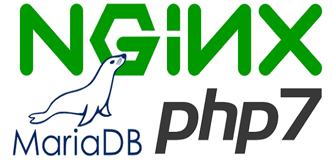
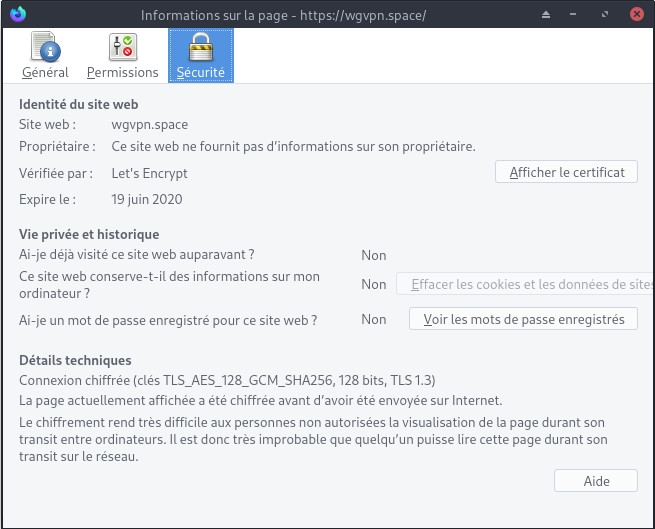

+++
title = 'Debian Buster, compilation Nginx + PHP7.4 + MariaDB + SSL/TLS1.3'
date = 2020-04-21 00:00:00 +0100
categories = ['serveur']
+++
{:width="150"}

## Nginx + PHP7.4 + MariaDB + SSL/TLS1.3

### Script

Ce script bash compile et installe nginx ,le  service  nginx (systemd) pour le démarrage, PHP7.4 et mariadb.  
Exécuter les instructions suivantes pour lancer la compilation

```bash
sudo -s             # Passer en mode super utilisateur (su ou sudo)  
wget -O compil.sh "https://yann.cinay.eu/files/debian10-compilation-nginx-tls1.3-php7.4-MariaDB.sh" # Télécharger le script
chmod +x compil.sh  # Rendre le script exécutable  
./compil.sh     # Exécuter le script
```

Patienter de 5 à 10 minutes...   
Résultat

```
Versions Nginx OpenSSL MariaDB et PHP
nginx version: nginx/1.16.1
OpenSSL 1.1.1d  10 Sep 2019
mysql  Ver 15.1 Distrib 10.3.22-MariaDB, for debian-linux-gnu (x86_64) using readline 5.2
Mot de passe MySql/MariaDB : /etc/mysql/mdp
PHP 7.4.4 (cli) (built: Mar 20 2020 14:30:40) ( NTS )
Copyright (c) The PHP Group
Zend Engine v3.4.0, Copyright (c) Zend Technologies
    with Zend OPcache v7.4.4, Copyright (c), by Zend Technologies
```

### Configuration nginx ssl (tls1.2 tls1.3) , Headers et OCSP

>**&rarr; IMPORTANT**  
&rarr; Remplacer **mondomaine.tld** par votre nom de domaine   
&rarr; Remplacer l'adresse IP 127.0.0.1 de **resolver 127.0.0.1;** avec celle qui est contenue dans **/etc/resolv.conf** (ex: **nameserver 80.67.169.12**).Dans notre exemple il faut remplacer 127.0.0.1 par 80.67.169.12 

{:width="100"}

[Serveur , installer et renouveler les certificats SSL Let's encrypt via Acme](https://yann.cinay.eu/2017/08/31/Acme-Certficats-Serveurs.html)  

Les liens pour les certificats SSL Let's encrypt , remplacer **utilisateur** par le votre

```
# domaine mondomaine.tld
sudo ln -s /home/utilisateur/.acme.sh/mondomaine.tld_ecc/fullchain.cer /etc/ssl/private/mondomaine.tld-fullchain.pem   # full chain certs
sudo ln -s /home/utilisateur/.acme.sh/mondomaine.tld_ecc/mondomaine.tld.key /etc/ssl/private/mondomaine.tld-key.pem     # cert key
sudo ln -s /home/utilisateur/.acme.sh/mondomaine.tld_ecc/mondomaine.tld.cer /etc/ssl/private/mondomaine.tld-chain.pem   # cert domain
sudo ln -s /home/utilisateur/.acme.sh/mondomaine.tld_ecc/ca.cer /etc/ssl/private/mondomaine.tld-ca.pem                 # intermediate CA cert
```


Générer une clé Diffie-Hellman : 

    sudo -s
    openssl dhparam -out /etc/ssl/private/dh2048.pem -outform PEM -2 2048

Regroupement dans le fichier  **/etc/nginx/ssl_dh_header_ocsp**

```
    ##
    # SSL Settings
    ##
    ssl_certificate /etc/ssl/private/mondomaine.tld-fullchain.pem;
    ssl_certificate_key /etc/ssl/private/mondomaine.tld-key.pem;
    ssl_session_timeout 1d;
    ssl_session_cache shared:MozSSL:10m;  # about 40000 sessions
    ssl_session_tickets off;

    ssl_dhparam /etc/ssl/private/dh2048.pem;

    # intermediate configuration
    ssl_protocols TLSv1.2 TLSv1.3;
    ssl_ciphers ECDHE-ECDSA-AES128-GCM-SHA256:ECDHE-RSA-AES128-GCM-SHA256:ECDHE-ECDSA-AES256-GCM-SHA384:ECDHE-RSA-AES256-GCM-SHA384:ECDHE-ECDSA-CHACHA20-POLY1305:ECDHE-RSA-CHACHA20-POLY1305:DHE-RSA-AES128-GCM-SHA256:DHE-RSA-AES256-GCM-SHA384;
    ssl_prefer_server_ciphers off;

    # Add headers to serve security related headers
    add_header X-Content-Type-Options nosniff;
    add_header X-XSS-Protection "1; mode=block";
    add_header X-Robots-Tag none;
    add_header X-Download-Options noopen;
    add_header X-Permitted-Cross-Domain-Policies none;
    add_header X-Frame-Options "SAMEORIGIN"; 
    add_header Strict-Transport-Security 'max-age=31536000; includeSubDomains;';
    add_header Referrer-Policy "no-referrer" always;


    # OCSP settings
    ssl_stapling on;
    ssl_stapling_verify on;
    ssl_trusted_certificate /etc/ssl/private/mondomaine.tld-fullchain.pem;
    #ssl_trusted_certificate /etc/ssl/private/ocsp-certs.pem;
    # resolver , voir /etc/resolv.conf
    resolver 127.0.0.1;
```


On change le dossier racine

```
sudo mkdir -p /var/www/default-www
sudo mv /var/www/{index.html,info.php} /var/www/default-www/
```

Configuration de base avec SSL et sécurité + letsencrypt (renouvellement)

    sudo nano /etc/nginx/conf.d/mondomaine.tld.conf

```
server {
    listen 80;
    listen [::]:80;

    ## redirect http to https ##
    server_name mondomaine.tld;
    return  301 https://$server_name$request_uri;
}

server {
    listen 443 ssl http2;
    listen [::]:443 ssl http2;
    server_name mondomaine.tld;

    ####    Locations
    # On cache les fichiers statiques
    location ~* \.(html|css|js|png|jpg|jpeg|gif|ico|svg|eot|woff|ttf)$ { expires max; }
    # On interdit les dotfiles
    location ~ /\. { deny all; }

    include ssl_dh_header_ocsp;

    root /var/www/default-www ;
    index index.php index.html index.htm;
        location ~ \.php$ {
           fastcgi_split_path_info ^(.+\.php)(/.+)$;
           fastcgi_pass unix:/run/php/php7.4-fpm.sock;   # PHP7.4
           fastcgi_index index.php;
           include fastcgi_params;
	   fastcgi_param SCRIPT_FILENAME $request_filename;
        }

    # if folder mondomaine.tld.d , uncomment the following directive
    #include conf.d/mondomaine.tld.d/*.conf;

    access_log /var/log/nginx/mondomaine.tld-access.log;
    error_log /var/log/nginx/mondomaine.tld-error.log;
}
```

Effacer ancien fichier de config

    sudo rm /etc/nginx/conf.d/default.conf

Vérifier 

    sudo nginx -t

```
nginx: the configuration file /etc/nginx/nginx.conf syntax is ok
nginx: configuration file /etc/nginx/nginx.conf test is successful
```

relancer nginx

    sudo systemctl restart nginx
    

A chaque rechargement de nginx , la mise en cache ocsp se fait au premier appel et on a un message d'erreur sur le navigateur  
{:width="400"}    
Créer un script pour la mise en cache OCSP

    sudo nano /usr/local/bin/ocsp_cache

```
#! /bin/sh

# ocsp_cache

# $1 domaine passé en paramètre
echo "Premier passage"
for fichier in /etc/nginx/conf.d/*$1.conf
do
    echo $(basename $fichier .${fichier##*.})
    openssl s_client -connect $(basename $fichier .${fichier##*.}):443 -status < /dev/null |grep -i ocsp
done
# pause de 1 seconde
sleep 1
echo "Second passage"
for fichier in /etc/nginx/conf.d/*$1.conf
do
    echo $(basename $fichier .${fichier##*.})
    openssl s_client -connect $(basename $fichier .${fichier##*.}):443 -status < /dev/null |grep -i ocsp
done
echo "Fin mise en cache nginx OCSP..."
```

Le rendre exécutable

    sudo chmod +x /usr/local/bin/ocsp_cache

Ce script devra être exécuté après le rechargement nginx 

    ocsp_cache > /dev/null 2>&1  # en mode sans affichage

Vérifier le lien <https://mondomaine.tld> , le tls 1.3

{:width="500"}


