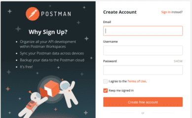
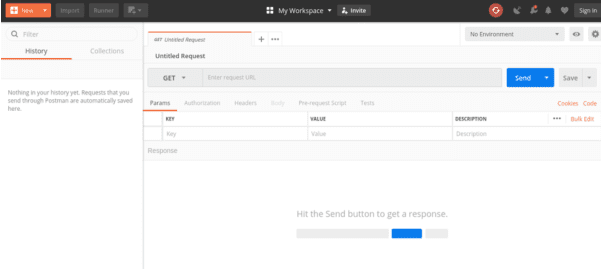
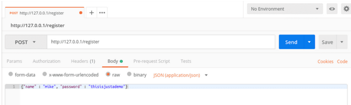
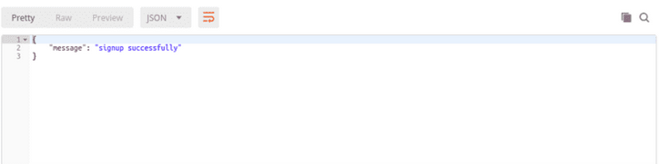
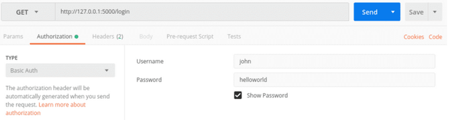
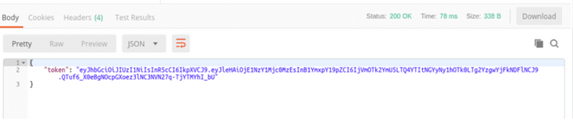
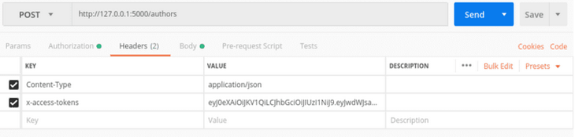
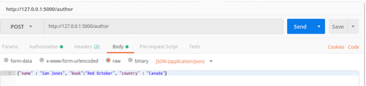
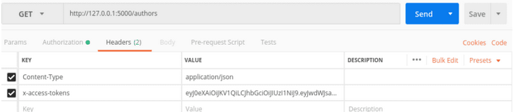
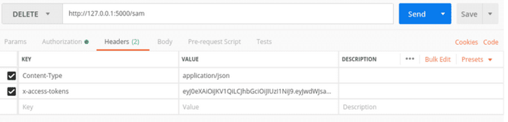

+++
title = 'Sécuriser une API REST Flask avec un jeton Web JSON (JWT)'
date = 2020-04-26 00:00:00 +0100
categories = json
+++
*Apprenons à sécuriser une API REST avec des jetons Web JSON pour empêcher les utilisateurs et les applications tierces d'en abuser*

{:width="50"}{:width="150"}

Nous allons créer un service de base de données à l'aide de SQLite et permettre aux utilisateurs d'y accéder via une API REST en utilisant des méthodes HTTP telles que POST et PUT.

De plus, nous apprendrons pourquoi les jetons Web JSON sont un moyen approprié de protéger l'API de repos au lieu du condensé et de l'authentification de base.  
Article original : [How to Secure a Flask REST API with JSON Web Token?](https://geekflare.com/securing-flask-api-with-jwt/)  

Avant de continuer, comprenons le terme jetons Web JSON, API REST et framework Flask.  

### Jetons Web JSON

Le jeton Web JSON, également appelé JWT , est le moyen sécurisé de transférer des jetons aléatoires entre deux parties ou entités. JSON est généralement composé de trois parties comme suit.

*    Charge utile
*    Entête
*    Signature

JSON utilise deux types de formulaires de structure lors du transfert de données ou d'informations entre deux parties.

*    Sérialisé
*    Désérialisé

Le formulaire sérialisé est utilisé lors du transfert de données vers le réseau via chaque demande et réponse tandis que le formulaire désérialisé est utilisé lors de la lecture et de l'écriture de données sur le jeton Web.

Dans le formulaire sérialisé, il y a trois composants.

*    Entête
*    Charge utile
*    Signature

Le composant d'en-tête définit les informations cryptographiques sur les jetons. Par exemple:

*    Est-il signé ou non signé JWT?
*    Définir des techniques d'algorithmes

Le formulaire désérialisé, contrairement au formulaire sérialisé, contient deux composants.

*    Charge utile
*    Entête

## API REST

L'API (interface de programmation d'application) permet la communication entre deux applications pour récupérer ou soumettre les données. Il existe deux types d'API populaires: l'API Web et l'API système.

Dans cet article, nous ne regarderons que l'API Web. Il existe deux types d'API Web.

*    Request - Response API: Rest, GraphQL, Remote Procedure Call (RPC)
*    API événementielle: WebHooks, Web Sockets, HTTP Streaming

L'API REST appartient à la catégorie demande-réponse. Il utilise des méthodes HTTP telles que GET, POST et PUT pour effectuer des opérations API.

Un exemple classique est lorsqu'un utilisateur envoie une méthode GET au service Web pour demander ou récupérer une ressource spécifique ou une collection de ressources. Le serveur renvoie ensuite la ressource ou la collection de ressources spécifique à l'utilisateur qui l'a demandée.

Cadre de flask (Flask Framework)

Flask est un framework basé sur python. Il s'agit d'un micro-framework utilisé par les développeurs de python pour construire l'API rest. On l'appelle un micro-framework car il permet aux développeurs, par exemple, d'ajouter une authentification personnalisée et tout autre système backend basé sur les préférences.

### Configurer un environnement virtuel à l'aide de virtualenv

Nous devons configurer un environnement virtuel pour nous assurer que certains packages n'entrent pas en conflit avec les packages système. Utilisons le virtualenv pour configurer un nouvel environnement virtuel.

En supposant que la pipcommande soit disponible sur votre système, exécutez la commande suivante via pip pour installer.

    pip install virtualenv

Si vous n'avez pas de pip sur votre machine, suivez cette [documentation](https://pypi.org/project/pip/) pour installer pip sur votre système.

Ensuite, créons un répertoire pour stocker ou conserver notre environnement virtuel. Utilisez la mkdircommande ci-dessous pour créer un répertoire

    mkdir flaskproject

Accédez au flaskprojectrépertoire à l'aide de la commande suivante

    cd flaskproject

Dans le flaskprojectrépertoire, utilisez l' virtualenvoutil pour créer un environnement virtuel comme indiqué ci-dessous:

    virtualenv flaskapi

Après avoir utilisé l' virtualenvoutil pour créer l'environnement virtuel, exécutez la cdcommande pour passer dans le flaskapirépertoire en tant qu'environnement virtuel et activez-le à l'aide de la commande ci-dessous.

    source bin/activate

Exécutez toutes les tâches liées à ce projet dans l'environnement virtuel.

### Installer des packages à l'aide de pip

Il est maintenant temps d'installer des packages tels que le framework flask et PyJWT que nous utiliserons pour construire l'API restante et d'autres packages nécessaires pour notre projet API.

Créez un fichier **requirements.txt** avec les packages suivants.

```
Flask
datetime
uuid
Flask-SQLAlchemy
PyJWT
```

Installez-les avec pip.

    pip install -r requirements.txt

### Créer une base de données

Installons SQLite.

    apt-get install sqlite3

Créez une base de données nommée bibliothèque. À l'intérieur de cette base de données, nous allons créer deux tables, à savoir la table *Users* et *Authors*.

Le tableau des utilisateurs contiendra les utilisateurs enregistrés. Seuls les utilisateurs enregistrés peuvent avoir accès au tableau des auteurs.

Le tableau des auteurs stockera les informations ou les détails des auteurs tels que le nom de l'auteur, le pays de naissance, etc. soumis par les utilisateurs enregistrés.

Créez la base de données à l'aide de la commande suivante:

    sqlite3 library.db

Vous pouvez vérifier si vous avez réussi à créer la base de données en utilisant la commande ci-dessous:

    .databases

Ouvrez un nouveau terminal et exécutez ce qui suit dans l'environnement virtuel que nous avons créé précédemment.

    touch app.py

Collez le code suivant dans le fichier nommé app.py

```
from flask import Flask, request, jsonify, make_response
from flask_sqlalchemy import SQLAlchemy
from werkzeug.security import generate_password_hash, check_password_hash
import uuid
import jwt
import datetime
from functools import wraps
```

La première ligne du code ci-dessus importe des packages tels que requestet jsonify. Nous allons utiliser requestpour garder une trace des données au niveau de la demande pendant une demande et utiliser jsonifypour produire des réponses au format JSON .

Sur la ligne suivante, nous avons importé SQLAlchemy flask_sqlalchemyafin d'intégrer des fonctionnalités SQLAlchemy dans le flacon.

De werkzeug.security, nous avons importé generate_password_hashpour générer un hachage de mot de passe pour les utilisateurs et check_password_hashpour vérifier le mot de passe de l'utilisateur lors de la comparaison du mot de passe soumis par les utilisateurs avec les mots de passe des utilisateurs stockés dans la base de données.

Enfin, nous avons uuid également importé des identifiants uniques universels pour générer des numéros d'identification aléatoires pour les utilisateurs.

Néanmoins, à l'intérieur du fichier **app.py**, implémentez les paramètres de configuration de l'API de bibliothèque à l'aide du code ci-dessous 

Placez le code suivant sous l'instruction d'importation.

```
app = Flask(__name__)

app.config['SECRET_KEY']='Th1s1ss3cr3t'
app.config['SQLALCHEMY_DATABASE_URI']='sqlite://///home/michael/geekdemos/geekapp/library.db'
app.config['SQLALCHEMY_TRACK_MODIFICATIONS'] = True

db = SQLAlchemy(app)
```

Créez maintenant deux modèles pour le tableau Utilisateurs et auteurs, comme indiqué ci-dessous. Copiez et collez le code dans le fichier app.py.

Placez le code ci-dessous juste en dessous de ce paramètre de base de données  `db = SQLAlchemy(app)`

```
class Users(db.Model):
     id = db.Column(db.Integer, primary_key=True)
     public_id = db.Column(db.Integer)
     name = db.Column(db.String(50))
     password = db.Column(db.String(50))
     admin = db.Column(db.Boolean)

class Authors(db.Model):
     id = db.Column(db.Integer, primary_key=True)
     name = db.Column(db.String(50), unique=True, nullable=False))
     book = db.Column(db.String(20), unique=True, nullable=False))
     country = db.Column(db.String(50), nullable=False))
     booker_prize = db.Column(db.Boolean)
```

### Générer des tableaux d'utilisateurs et d'auteurs

Sur le terminal, saisissez le code suivant dans l'environnement virtuel pour générer ou créer des tables pour les tables Users et Authors, comme indiqué ci-dessous

    from app import db
    db.create_all()

Ensuite, ouvrez app.py dans l'environnement virtuel et créez une autre fonction.

Cette fonction générera des jetons afin de permettre uniquement aux utilisateurs enregistrés d'accéder et d'effectuer un ensemble d'opérations d'API sur la table des auteurs.

Placez ce code sous le modèle de base de données de la table Authors

```
def token_required(f):
   @wraps(f)
   def decorator(*args, **kwargs):

      token = None

      if 'x-access-tokens' in request.headers:
         token = request.headers['x-access-tokens']

      if not token:
         return jsonify({'message': 'a valid token is missing'})

      try:
         data = jwt.decode(token, app.config[SECRET_KEY])
         current_user = Users.query.filter_by(public_id=data['public_id']).first()
      except:
         return jsonify({'message': 'token is invalid'})

        return f(current_user, *args, **kwargs)
   return decorator
```

### Créer des itinéraires pour la table des utilisateurs

Créons maintenant un itinéraire pour permettre aux utilisateurs de s'inscrire à l'API Authors via un nom d'utilisateur et un mot de passe, comme indiqué ci-dessous.

Ouvrez à nouveau le app.pyfichier dans l'environnement virtuel et collez le code suivant sous la fonctiontoken_required(f)

```
@app.route('/register', methods=['GET', 'POST'])
def signup_user():
 data = request.get_json()

 hashed_password = generate_password_hash(data['password'], method='sha256')

 new_user = Users(public_id=str(uuid.uuid4()), name=data['name'], password=hashed_password, admin=False)
 db.session.add(new_user)
 db.session.commit()

 return jsonify({'message': 'registered successfully'})
```

Dans l'environnement virtuel, créez un autre itinéraire dans le app.pyfichier pour permettre aux utilisateurs enregistrés de se connecter.

Lorsqu'un utilisateur se connecte, un jeton aléatoire est généré pour que l'utilisateur accède à l'API de bibliothèque.

Collez le code ci-dessous sous l'itinéraire précédent que nous avons créé.

```
@app.route('/login', methods=['GET', 'POST'])
def login_user():

  auth = request.authorization

  if not auth or not auth.username or not auth.password:
     return make_response('could not verify', 401, {'WWW.Authentication': 'Basic realm: "login required"'})

  user = Users.query.filter_by(name=auth.username).first()

  if check_password_hash(user.password, auth.password):
     token = jwt.encode({'public_id': user.public_id, 'exp' : datetime.datetime.utcnow() + datetime.timedelta(minutes=30)}, app.config['SECRET_KEY'])
     return jsonify({'token' : token.decode('UTF-8')})

  return make_response('could not verify',  401, {'WWW.Authentication': 'Basic realm: "login required"'})
```

Toujours, dans l'environnement virtuel, créez une autre route dans le app.pyfichier pour obtenir ou récupérer tous les utilisateurs enregistrés.

Ce code recherche tous les utilisateurs enregistrés dans la table Utilisateurs et renvoie le résultat final au format JSON.

Collez le code ci-dessous sous la route de connexion

```
@app.route('/users', methods=['GET'])
def get_all_users():

   users = Users.query.all()

   result = []

   for user in users:
       user_data = {}
       user_data['public_id'] = user.public_id
       user_data['name'] = user.name
       user_data['password'] = user.password
       user_data['admin'] = user.admin

       result.append(user_data)

   return jsonify({'users': result})
```

### Créer des itinéraires pour la table des auteurs 

Créons des itinéraires pour la table Authors pour permettre aux utilisateurs de récupérer tous les auteurs de la base de données, ainsi que de supprimer les auteurs.

Seuls les utilisateurs disposant de jetons valides peuvent effectuer ces opérations d'API.

Dans le fichier app.py, créez un itinéraire pour que les utilisateurs enregistrés créent de nouveaux auteurs.

Collez ce code sous l'itinéraire qui permet à un utilisateur de récupérer tous les utilisateurs enregistrés.

```
@app.route('/author', methods=['POST', 'GET'])
@token_required
def create_author(current_user):

   data = request.get_json()

   new_authors = Authors(name=data['name'], country=data['country'], book=data['book'], booker_prize=True, user_id=current_user.id)
   db.session.add(new_authors)
   db.session.commit()

   return jsonify({'message' : 'new author created'})
```

Ensuite, créez une autre route pour permettre à un utilisateur enregistré avec un jeton valide de récupérer tous les auteurs dans le tableau Authors, comme indiqué ci-dessous.

Collez ce code sous l'itinéraire qui permet à un utilisateur de créer un nouvel auteur.

```
@app.route('/authors', methods=['POST', 'GET'])
@token_required
def get_authors(current_user):

    authors = Authors.query.filter_by(user_id=current_user.id).all()

    output = []
    for author in authors:

           author_data = {}
           author_data['name'] = author.name
           author_data['book'] = author.book
           author_data['country'] = author.country
           author_data['booker_prize'] = author.booker_prize
           output.append(author_data)

     return jsonify({'list_of_authors' : output})
```

Enfin, toujours à l'intérieur du app.py , créez un itinéraire pour supprimer un auteur spécifié comme indiqué ci-dessous.

Collez ce code sous la route qui permet à un utilisateur de récupérer une liste d'auteurs.

```
@app.route('/authors/<author_id>', methods=['DELETE'])
@token_required
def delete_author(current_user, author_id):
    author = Author.query.filter_by(id=author_id, user_id=current_user.id).first()
    if not author:
       return jsonify({'message': 'author does not exist'})


    db.session.delete(author)
    db.session.commit()

    return jsonify({'message': 'Author deleted'})


if  __name__ == '__main__':
     app.run(debug=True)
```

Ensuite, enregistrez et fermez le fichier app.py dans l'environnement virtuel.

### Test de l'API de bibliothèque avec Postman

Dans cette section, nous utiliserons un outil Postman pour envoyer une demande aux services de base de données. Si vous n'avez pas de facteur sur votre machine, vous pouvez découvrir comment le télécharger et l'installer [ici](https://www.getpostman.com/downloads/) .

Outre le Postman, nous pouvons utiliser d'autres outils tels que Curl pour envoyer des requêtes au serveur.

Ouvrez un nouveau terminal et tapez ce qui suit:

    postman

La commande  postman entraînera l'affichage de la page ci-dessous par votre navigateur Web:



Vous pouvez décider de vous inscrire et de créer un compte gratuit, mais nous allons ignorer et obtenir un accès direct à l'application pour tester l'API de la bibliothèque, comme indiqué ci-dessous:



Dans cette section, nous autoriserons un utilisateur à s'inscrire à l'API de bibliothèque en fournissant un nom d'utilisateur et un mot de passe unique au format JSON à l'aide de la méthode POST en suivant les étapes ci-dessous:

*    Cliquez sur l'onglet intitulé Body
*    Sélectionnez ensuite le bouton brut et choisissez le format JSON
*    entrez un nom d'utilisateur et un mot de passe pour vous inscrire comme indiqué dans la capture d'écran
*    À côté du bouton d'envoi, insérez l'URL suivante http://127.0.0.1/register
*    Enfin, changez la méthode en POST et appuyez sur le bouton d'envoi.



Il affichera la sortie suivante comme indiqué ci-dessous:



Nous avons maintenant enregistré avec succès un utilisateur. Allons de l'avant pour permettre à l'utilisateur qui vient de s'inscrire de se connecter afin de générer un jeton aléatoire temporaire pour accéder à la table Authors en procédant comme suit:

*    Cliquez sur l'onglet autorisation.
*    Dans la section type, sélectionnez l'authentification de base.
*    Remplissez ensuite le formulaire de nom d'utilisateur et de mot de passe avec le nom d'utilisateur et le mot de passe avec lesquels vous vous êtes enregistré précédemment.
*    Enfin, appuyez sur le bouton d'envoi pour vous connecter et générer un jeton aléatoire.



Une fois que l'utilisateur s'est connecté avec succès, un jeton aléatoire est généré pour l'utilisateur, comme indiqué dans la capture d'écran.

Nous utiliserons le jeton aléatoire généré pour accéder à la table Authors.



Dans cette section, nous allons ajouter les informations d'un auteur à la table Authors via la méthode POST en utilisant les étapes suivantes:

*    Cliquez sur l'onglet en-têtes
*    Inclure les en-têtes HTTP suivants affichés dans la capture d'écran



*    Ensuite, cliquez sur l'onglet corps et entrez les détails du nouvel auteur
*    Appuyez ensuite sur le bouton d'envoi pour ajouter les détails de l'auteur au tableau des auteurs



Vous pouvez également récupérer les informations des auteurs dans le tableau Auteurs via les éléments suivants:

*    Assurez-vous que votre jeton généré se trouve dans la section des en-têtes. s'il n'est pas là, vous devez le remplir avec votre jeton.
*    À côté du bouton d'envoi, entrez cette URL http://127.0.0.1/authors
*    Ensuite, changez la méthode HTTP en GET et appuyez sur le bouton d'envoi pour récupérer les détails des auteurs.



Enfin, vous pouvez supprimer le ou les auteurs dans le tableau Auteurs via la DELETE méthode en procédant comme suit:

*    Assurez-vous que votre jeton est toujours dans la section des en-têtes. Vous pouvez vérifier l'onglet en-têtes pour vous assurer que les informations nécessaires sont en place.
*    À côté du bouton d'envoi, entrez cette URL http://127.0.0.1/sam
*    Appuyez ensuite sur le bouton d'envoi pour supprimer l'utilisateur que vous avez spécifié.



Vous pouvez trouver le [code source complet sur Github](https://github.com/Rev0kz/Flask-API-Token).   Vous pouvez le cloner et le vérifier sur votre machine.
