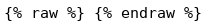

+++
title = 'Debian Ruby via les dépôts ou Rbenv + Jekyll (serveur statique)'
date = 2020-04-28 00:00:00 +0100
categories = ['serveur', 'markdown']
+++
# Ruby + jekyll

[{:width="100px"}](https://jekyllrb.com/) **Serveur statique Jekyll sur debian**    

## [How To Install Jekyll on Ubuntu 18.04 / Debian 10 Linux](https://computingforgeeks.com/how-to-install-jekyll-on-ubuntu-18-04/)

## Alternative A : Installer Ruby (via les dépôts)

[Getting started with Jekyll on Debian 9 Stretch Linux ](https://linuxconfig.org/getting-started-with-jekyll-on-debian-9-stretch-linux)  
*Bundler fournit un environnement cohérent pour les projets Ruby par le suivi et l'installation des "gems" exactes et les versions qui sont nécessaires.Bundler est une sortie de l'enfer de la dépendance, et s'assure que les "gems" dont vous avez besoin sont présents dans le développement, la mise en scène et la production.*

En mode su (root), installation Jekyll avec gems (source):

    sudo apt install build-essential ruby-full

## Alternative B : Installer Ruby en utilisant Rbenv (MEILLEUR CHOIX)

Si nécessaire désinstaller le ruby installé via les dépôts apt debian : `sudo apt remove ruby-full`

Rbenv est un outil léger de gestion des versions de Ruby qui vous permet de changer facilement de version de Ruby.

Par défaut, Rbenv ne gère pas l'installation des versions de Ruby. ruby-build est un outil qui vous aide à installer n'importe quelle version de Ruby dont vous pourriez avoir besoin. Il est disponible en tant que programme autonome et en tant que plugin pour rbenv.

Installez les dépendances nécessaires à l'outil ruby-build pour construire Ruby à partir des sources :

    sudo apt update
    sudo apt install git curl libssl-dev libreadline-dev zlib1g-dev autoconf bison build-essential libyaml-dev libreadline-dev libncurses5-dev libffi-dev libgdbm-dev

Ensuite, lancez la commande curl suivante pour installer les scripts rbenv et ruby-build :

    curl -sL https://github.com/rbenv/rbenv-installer/raw/master/bin/rbenv-installer | bash -

Si l'installation est réussie, le script imprimera quelque chose comme ceci :

```
Running doctor script to verify installation...
Checking for `rbenv' in PATH: not found
  You seem to have rbenv installed in `/home/dbsuser/.rbenv/bin', but that
  directory is not present in PATH. Please add it to PATH by configuring
  your `~/.bashrc', `~/.zshrc', or `~/.config/fish/config.fish'.
```

Avant de commencer à utiliser rbenv, nous devons ajouter $HOME/.rbenv/bin à notre PATH.

Si vous utilisez Bash, tapez :

    echo 'export PATH="$HOME/.rbenv/bin:$PATH"' >> ~/.bashrc
    echo 'eval "$(rbenv init -)"' >> ~/.bashrc
    source ~/.bashrc

Si vous utilisez le type Zsh :

    echo 'export PATH="$HOME/.rbenv/bin:$PATH"' >> ~/.zshrc
    echo 'eval "$(rbenv init -)"' >> ~/.zshrc
    source ~/.zshrc

Maintenant que rbenv est installé sur notre système, nous pouvons facilement installer la dernière version stable de Ruby et la définir comme version par défaut avec :

    rbenv install 2.6.5
    rbenv global 2.6.5

 Vérifiez que Ruby a été correctement installé en imprimant le numéro de version :

    ruby -v

ruby 2.6.5p114 (2019-10-01 revision 67812) [x86_64-linux]

### Managing versions

```
rbenv install -l 	        # List all available versions
rbenv install 2.2.1          # Install Ruby 2.2.1
rbenv uninstall 2.2.1 	    # Uninstall Ruby 2.2.1
rbenv versions 	            # See installed versions
rbenv version 	            # See current version
rbenv which <NAME> 	        # Display path to executable
rbenv rehash 	            # Re-write binstubs
```

# Site statique "wikistatic" avec Jekyll

## Installation dépendances + wikistatic

### Installer dépendances Rmagick sur Debian

    sudo apt install imagemagick libmagick++-dev ruby-rmagick # imagemagick-doc 

### Installation wikistatic

Ce **wikistatic** basé sur  **Jekyll** utilise le thème libre [dbyll](https://github.com/dbtek/dbyll)  

Création dossier

    sudo mkdir -p /srv     # création dossier

Les droits sur le dossier

    sudo chown   $USER. -R /srv/

Clonage wikistatic par git

```bash
sudo apt install git 
cd /srv
git clone https://gitea.cinay.eu/yann/wikistatic
cd wikistatic
```

Lancement "bundle" dans le dossier **/srv/wikistatic**  

    cd /srv/wikistatic
    bundle

```
...
Bundle complete! 5 Gemfile dependencies, 34 gems now installed.
Use `bundle info [gemname]` to see where a bundled gem is installed.
```

## Lancer manuellement le serveur pour des tests

On lance manuellement le serveur pour un test

### méthode A

Exécution , **lancement serveur pour test**

```bash
  bundle exec jekyll serve
```

```
[...]
 Auto-regeneration: enabled for '/srv/wikistatic'
Configuration file: /srv/wikistatic/_config.yml
    Server address: http://127.0.0.1:4000/
  Server running... press ctrl-c to stop.

```

### méthode B

Construction  

    jekyll build --source "/srv/wikistatic"

```
Configuration file: /srv/wikistatic/_config.yml
            Source: /srv/wikistatic
       Destination: /srv/wikistatic/_site
 Incremental build: disabled. Enable with --incremental
      Generating... 
                    done in 47.834 seconds.
 Auto-regeneration: disabled. Use --watch to enable.
```

### méthode C

Auto génération activée (--watch) + serveur  

    jekyll serve --watch

```bash
Configuration file: /srv/wikistatic/_config.yml
            Source: /srv/wikistatic
       Destination: /srv/wikistatic/_site
 Incremental build: disabled. Enable with --incremental
      Generating... 
                    done in 39.011 seconds.
 Auto-regeneration: enabled for '/srv/wikistatic'
```

>Le serveur est en local sur le port 4000 (<http://localhost:4000>) , on l'arrête par *Ctrl c*

### méthode D

Auto génération activée (--watch) SANS serveur  

    jekyll build --watch --source "/srv/wikistatic"

```
Configuration file: /srv/wikistatic/_config.yml
            Source: /srv/wikistatic
       Destination: /srv/wikistatic/_site
 Incremental build: disabled. Enable with --incremental
      Generating... 
                    done in 18.916 seconds.
 Auto-regeneration: enabled for '/srv/wikistatic'
```

## Serveur de production "wikistatic"

Le dossier *_site* est regénéré à chaque création, modification ou suppression d'un fichier de type *markdown* dans le dossier *_posts*  
Cette opération doit être lancée et en attente.  
>ATTENTION : Suivant le mode d'installation de ruby (compilation ou rvm), les méthodes sont différentes.

### Ruby via compilation &rarr; Service jekyll

On localise la version jekyll

    which jekyll
        /usr/local/bin/jekyll

Pour lancer le serveur Jekyll au démarrage , créer un bash sous **/srv/wikistatic**

    nano /srv/wikistatic/start_jekyll.sh

```
#!/bin/sh
# Accès dossier 
cd /srv/wikistatic/
# lancement jekyll en mode auto génération sans serveur
/usr/local/bin/bundle exec jekyll build --watch --source "/srv/wikistatic"
```

Droits sur le bash

```
sudo chown $USER. /srv/wikistatic/start_jekyll.sh
chmod +x /srv/wikistatic/start_jekyll.sh
```

>Pour lancer le serveur **Jekyll** au démarrage, utilisation d'un <u>service systemd</u>  
**ATTENTION!** , remplacer *utilisateur* par votre nom d'utilisateur (**echo $USER**)

Création d'un service jekyll sous systemd

    sudo nano /etc/systemd/system/jekyll.service

Contenu du fichier

```ini
[Unit]
Description=jekyll Service
After=network.target

[Service]
Type=simple
User=utilisateur
ExecStart=/bin/sh /srv/wikistatic/start_jekyll.sh
Restart=on-abort


[Install]
WantedBy=multi-user.target
```

Lancer le service  **jekyll** :

```bash
sudo systemctl daemon-reload
sudo systemctl start jekyll
#Vérifier:
sudo systemctl status jekyll
```


```
● jekyll.service - jekyll Service
   Loaded: loaded (/etc/systemd/system/jekyll.service; enabled; vendor preset: enabled)
   Active: active (running) since Wed 2018-08-29 18:47:45 CEST; 1 day 13h ago
 Main PID: 29680 (sh)
    Tasks: 5 (limit: 4915)
   CGroup: /system.slice/jekyll.service
           ├─29680 /bin/sh /srv/wikistatic/start_jekyll.sh
           └─29681 /usr/local/bin/jekyll build --watch
```

Valider le lancement du **service jekyll au démarrage**

```bash
sudo systemctl enable jekyll
```

### Ruby via rvm &rarr; Manuelle 

En cas d'ajout ou de modification d'un "post" ,il faut mettre à jour le site "statique" en le regénérant  
Il faut se connecter avec l'utilisateur qui est dans le groupe "rvm"  
Puis lancer la commande

	jekyll build --source "/srv/wikistatic"

Si on souhaite l'avoir en tâche de fond et en attente des modifications, on ouvre use session "tmux" 

	tmux

Puis on lance la commande de regénération avec attente

	jekyll build --watch --source "/srv/wikistatic"

On quitte la session tmux sans la détruire

	Ctrl b + d

>En cas de redémarrage du serveur , il faudra recréer une session tmux

## Serveur nginx avec ou sans proxy

La génération du site statique se fait avec ou sans serveur  
Dans le cas d'une génération avec serveur ,il faut utiliser un proxy  
Dans le cas contraire, le serveur pointe directement sur le dossier **_site**  

### Jekyll/Nginx AVEC Proxy

Sur un serveur Debian avec **nginx** installé, accès par proxy au serveur **jekyll**  

<u>Exemple avec un site</u> <http://static.domaine.tld>  
Utilisation **proxy** sur nginx pour accèder au serveur local **Jekyll** 

Créer une configuration nginx **jekyll.conf** sous **/etc/nginx/conf.d**


```nginx
server {
    listen 80;

    server_name static.domaine.tld;

	location / {
	    proxy_pass http://127.0.0.1:4000;
	}
    access_log /var/log/nginx/static-access.log;
    error_log /var/log/nginx/static-error.log;
}
```

Relancer le service nginx

    sudo systemctl restart nginx


### Jekyll/Nginx SANS Proxy

<u>Exemple avec un site</u> <http://static.domaine.tld>  

```nginx
server {
    listen 80;
    
    server_name static.domaine.tld;

    root /srv/wikistatic/_site/ ;

    access_log /var/log/nginx/static-access.log;
    error_log /var/log/nginx/static-error.log;
}
```

Relancer le service nginx

    sudo systemctl restart nginx

<u>Exemple sur un serveur web **yunohost** fonctionnel</u>  
Installer une application personnalisée **Multi custom webapp** <https://github.com/YunoHost-Apps/multi_webapp_ynh> domaine **static.domaine.tld**   
Redéfinir le "root" sur **/srv/wikistatic/_site/**  

    sudo rm -r /var/www/webapp_cinay/static.domaine.tld
    # Création lien avec le dossier **_site** généré par "jekyll"
    sudo ln -s /srv/wikistatic/_site /var/www/webapp_cinay/static.domaine.tld 

Le fichier de configuration nginx sous **/etc/nginx/conf.d/static.domaine.tld.d/webapp_static.domaine.tld_.conf**

```
location / {
	alias /var/www/webapp_cinay/static.domaine.tld/ ;
	if ($scheme = http) {
		rewrite ^ https://$server_name$request_uri? permanent;
	}
	index index.html index.php ;
	try_files $uri $uri/ index.php;
	location ~ [^/]\.php(/|$) {
		fastcgi_split_path_info ^(.+?\.php)(/.*)$;
		fastcgi_pass unix:/var/run/php5-fpm-webapp_static.domaine.tld.sock;
		fastcgi_index index.php;
		include fastcgi_params;
		fastcgi_param REMOTE_USER $remote_user;
		fastcgi_param PATH_INFO $fastcgi_path_info;
		fastcgi_param SCRIPT_FILENAME $request_filename;
	}

	# Include SSOWAT user panel.
	include conf.d/yunohost_panel.conf.inc;
}
```

Relancer le service nginx

    sudo systemctl restart nginx

## Rédaction des billets

* syntaxe markdown    
* le nom du fichier débute obligatoirement par la date au format *aaaa-mm-jj** , suffixe **.md**
* Ni espace , ni accents et ni caractères spéciaux dans le nom (exemple : 2106-04-21-synyaxe-ecriture-fichier.md)
* Entête du fichier (description):  

```
---
layout: article
title:  "Titre du billet qui s'affichera dans la liste"
ref: (falcutatif)
tags: [rubrique_mots_clés]
lang: fr
description: Brève description
---
```

**ATTENTION !** , respecter le format de la date **aaaa-mm-jj** , si plusieurs catégories et tags , ils sont séparés par une 'virgule'   
le code qui contient des doubles accolades {{ }} doit être précédé de **raw** et se terminer par **endraw**  

Lorsque le fichier **.md** est déposé dans le dossier **_posts** , il est validé automatiquement par jekyll 

# Personalisation thème, style et plugins

## favicon 

Image dans le répertoire "images"  
Modifier le fichier **_includes/default.html**  

[MIME TYPE]

   * GIF: image/gif
   * JPEG: image/jpeg
   * PNG: image/png
   * ICO: image/x-icon


```html

<link rel="icon" type="[MIME TYPE]" href="{{ site.BASE_PATH }}/images/{{ site.favicon_ico }}">  

```

exemple fichier .png  
Définir une constante pour le fichier image `favicon_ico: yak-happy-32x32.png` dans le fichier **_config.yml**  


```html

<link rel="icon" type="image/png" href="{{ site.BASE_PATH }}/images/{{ site.favicon_ico }}">  

```

## jekyll-toc 

[jekyll-toc](https://github.com/toshimaru/jekyll-toc) : Un plugin de filtrage pour **Jekyll** qui génère une table des matières.  

**Installation**  

Ajouter le plugin jekyll-toc dans le **Gemfile** de votre site.  

```ruby
sudo gem install jekyll-toc
```

Ajouter la ligne suivante au fichier Gemfile **dbyll/Gemfile** :  
`gem 'jekyll-toc'`  

Et ajouter le jekyll-toc au fichier **_config.yml** de votre site.

```yml
gems:
  - jekyll-toc
```

toc: true` dans vos publications (posts).

```yml
---
layout: article
title: "Welcome to Jekyll!"
toc: true
---
```

Ajouter au fichier **assets/css/style.css**


```css
.section-nav {
  background-color: #FFF;
  margin: 5px 0;
  padding: 10px 30px;
  border-radius: 3px;
}

.toc-entry.toc-h1 { list-style-type: none;}
.toc-entry.toc-h2 { padding-left: 15px; list-style-type: none;}
.toc-entry.toc-h3 { padding-left: 30px; list-style-type: none;}
.toc-entry.toc-h4 { padding-left: 45px; list-style-type: none;}
.toc-entry.toc-h5 { padding-left: 60px; list-style-type: none;}
.toc-entry.toc-h6 { padding-left: 75px; list-style-type: none;}
```


**Usage**  

Il y a trois filtres **liquid** disponibles aujourd'hui, qui devraient tous être appliqué à un contenu HTML, par exemple le contenu de la variable **liquid** disponible dans les modèles de Jekyll.


### Utilisation de base (A PRIVILEGIER)

**filtre toc**  


Remplacer  {{ content }}  par {{ content \| toc }} dans le fichier **_includes/post.html**  


Ce filtre met la table des matières directement au-dessus du contenu.  

Modifier la ligne 42 dans le fichier **_includes/post.html**  

```html

...
          <div class="article_body">
          <!-- {{ content | toc }} -->
          </div>

...
```


### Utilisation avancée

Si vous souhaitez séparer le TOC et son contenu, vous pouvez utiliser les filtres `toc_only` et `inject_anchors` .  

**filtre **`toc_only`

Génère le TOC lui-même comme décrit ci-dessous. Surtout utile dans les cas où la table des matières ne doit pas être placée immédiatement au-dessus du contenu, mais à un autre endroit de la page, à savoir un côté.

**filtre** `inject_anchors`  

Injecte les "ancres" HTML dans le contenu sans réellement créer la table des matières elle-même. Ils sont de la forme:  

``` html
<a id="heading11" class="anchor" href="#heading1-1" aria-hidden="true">
  <span class="octicon octicon-link"></span>
</a>
```

Ceci est seulement utile lorsque le TOC lui-même doit être placé à un autre endroit avec le filtre `toc_only`.


## CSS highlight


Fichier **zenburn.css** extrait du ZIP ,voir [pygments-css ,css files created from pygment's built-in styles](http://richleland.github.io/pygments-css/)  
On renomme le fichier  dans le dossier **assets/resources/syntax/zenburn-jekyll.css** puis on le modifie  

 1. Remplacer la classe   
`sudo sed -i 's/.codehilite/.highlight/g' zenburn-jekyll.css`
 2. Ajouter en première ligne du fichier **zenburn-jekyll.css**:  

```html

.highlight { background-color: #3f3f3f }

```

Modifier la ligne contenant **style.css** (à remplacer par **zenburn-jekyll.css**) dans le fichier **_includes/default.html**  

```html

<link href="{{ site.BASE_PATH }}/assets/resources/syntax/zenburn-jekyll.css" rel="stylesheet">`

```

Le contenu du fichier **zenburn-jekyll.css** après les modifications

```css
.highlight { background-color: #3f3f3f }
.highlight code, .highlight pre{color:#fdce93;background-color:#3f3f3f}
.highlight .hll{background-color:#222}
.highlight .c{color:#7f9f7f}
.highlight .err{color:#e37170;background-color:#3d3535}
.highlight .g{color:#7f9f7f}
.highlight .k{color:#f0dfaf}
.highlight .l{color:#ccc}
.highlight .n{color:#dcdccc}
.highlight .o{color:#f0efd0}
.highlight .x{color:#ccc}
.highlight .p{color:#41706f}
.highlight .cm{color:#7f9f7f}
.highlight .cp{color:#7f9f7f}
.highlight .c1{color:#7f9f7f}
.highlight .cs{color:#cd0000;font-weight:bold}
.highlight .gd{color:#cd0000}
.highlight .ge{color:#ccc;font-style:italic}
.highlight .gr{color:red}
.highlight .gh{color:#dcdccc;font-weight:bold}
.highlight .gi{color:#00cd00}
.highlight .go{color:gray}
.highlight .gp{color:#dcdccc;font-weight:bold}
.highlight .gs{color:#ccc;font-weight:bold}
.highlight .gu{color:purple;font-weight:bold}
.highlight .gt{color:#0040D0}
.highlight .kc{color:#dca3a3}
.highlight .kd{color:#ffff86}
.highlight .kn{color:#dfaf8f;font-weight:bold}
.highlight .kp{color:#cdcf99}
.highlight .kr{color:#cdcd00}
.highlight .kt{color:#00cd00}
.highlight .ld{color:#cc9393}
.highlight .m{color:#8cd0d3}
.highlight .s{color:#cc9393}
.highlight .na{color:#9ac39f}
.highlight .nb{color:#efef8f}
.highlight .nc{color:#efef8f}
.highlight .no{color:#ccc}
.highlight .nd{color:#ccc}
.highlight .ni{color:#c28182}
.highlight .ne{color:#c3bf9f;font-weight:bold}
.highlight .nf{color:#efef8f}
.highlight .nl{color:#ccc}
.highlight .nn{color:#8fbede}
.highlight .nx{color:#ccc}
.highlight .py{color:#ccc}
.highlight .nt{color:#9ac39f}
.highlight .nv{color:#dcdccc}
.highlight .ow{color:#f0efd0}
.highlight .w{color:#ccc}
.highlight .mf{color:#8cd0d3}
.highlight .mh{color:#8cd0d3}
.highlight .mi{color:#8cd0d3}
.highlight .mo{color:#8cd0d3}
.highlight .sb{color:#cc9393}
.highlight .sc{color:#cc9393}
.highlight .sd{color:#cc9393}
.highlight .s2{color:#cc9393}
.highlight .se{color:#cc9393}
.highlight .sh{color:#cc9393}
.highlight .si{color:#cc9393}
.highlight .sx{color:#cc9393}
.highlight .sr{color:#cc9393}
.highlight .s1{color:#cc9393}
.highlight .ss{color:#cc9393}
.highlight .bp{color:#efef8f}
.highlight .vc{color:#efef8f}
.highlight .vg{color:#dcdccc}
.highlight .vi{color:#ffffc7}
.highlight .il{color:#8cd0d3}
```


## Position des éléments "barre latéral gauche"

Contenu de la barre latérale alligné vers le haut (1% au lieu de 10%)  
Directive `.sidebar` , l'attribut `padding-top: 10%;` passe à `padding-top: 1%;` dans le fichier **assets/css/style.css**  


## Largeur des colonnes

Modifier la largeur en respectant la proportionnalité , fichier **_includes/default.html** dans les lignes suivantes  


```html

...
	<div class="col-sm-2 sidebar hidden-xs" style="background: url({{site.sidebar_background_image}}) no-repeat center center !important;">
		
	</div>

	<div class="col-sm-10 col-sm-offset-2"> 
...

```

## Haut de page (sur écran en bas à droite)

Dans le fichier **_includes/default.html**  insérer les lignes suivantes avant `<div class="col-sm-2 sidebar hidden-xs" ` de la modification précédente   

```html

...
   <!-- nav-menu-haut -->
   <div id="nav-haut-page">
   	<a href="#" title="Haut de Page"><i class="fa fa-arrow-circle-up fa-2x"></i></a>
   </div>
...

```

## Modifications autres

Fichier **tags.html**  
Ligne 4 -> **title: Etiquettes**  
Ligne 29 -> **Billets étiquettés**   

Fichier **_includes/default.html**  
Ligne 73 et 87 -> **Etiquettes**  remplace Mots clés

Fichier **categories.html**  
Ligne 3 -> **Catégories**  

# Champ de recherche

## Recherche sur le site statique jekyll (lunr.js)

[Jekyll search using lunr.js](http://jekyll.tips/jekyll-casts/jekyll-search-using-lunr-js/)

Pour construire la recherche, nous allons utiliser **lunr.js**, un moteur de recherche en texte intégral côté client.  
La recherche fonctionnera de la façon suivante:

 1. Envoyer le terme de recherche en tant que paramètre GET à **search.html**.
 2. **search.html** lit le paramètre GET et effectue la recherches via JSON qui contient les éléments concernés.
 3. **search.html** affiche une liste de résultats de recherche.

Nous allons d'abord créer le fichier de recherche JavaScript **/js/search.js** et télécharger **/js/lunr.min.js** [lunr.js](http://lunrjs.com/) .

### search.html

Maintenant, nous devons créer **/search.html** avec saisie des léléments de recherche, un espace réservé pour l'affichage des résultats, une sortie JSON de tout le contenu que nous voulons rechercher

```html

---
layout: search
---

<div class="page-header">
  <h1>{{ page.title }}  <small>{{ page.tagline }}</small></h1>
</div>
<p>
<form action="/search.html" method="get">
  <input type="text" id="search-box" name="query">
  <input type="submit" value="Chercher">
</form>
</p>
<ul id="search-results"></ul>

<script>
  window.store = {
    
      "{{ post.url | slugify }}": {
        "title": "{{ post.title | xml_escape }}",
        "tag": "{{ post.tag | xml_escape }}",
        "category": "{{ post.category | xml_escape }}",
        "content": {{ post.content | strip_html | strip_newlines | jsonify }},
        "url": "{{ post.url | xml_escape }}"
      }
      ,
    
  };
</script>
<script src="/js/lunr.min.js"></script>
<script src="/js/search.js"></script>

```

### search.js

Ensuite, nous devons écrire le JavaScript **/js/search.js** pour effectuer trois tâches:

 1. Obtenir le critère de recherche
 2. Effectuer la recherche
 3. Afficher les résultats

```js
(function() {
  function displaySearchResults(results, store) {
    var searchResults = document.getElementById('search-results');

    if (results.length) { // Are there any results?
      var appendString = '';

      for (var i = 0; i < results.length; i++) {  // Iterate over the results
        var item = store[results[i].ref];
        appendString += '<li><a href="' + item.url + '"><h3>' + item.title + '</h3></a>';
        appendString += '<p>' + item.content.substring(0, 150) + '...</p></li>';
      }

      searchResults.innerHTML = appendString;
    } else {
      searchResults.innerHTML = '<li>No results found</li>';
    }
  }

  function getQueryVariable(variable) {
    var query = window.location.search.substring(1);
    var vars = query.split('&');

    for (var i = 0; i < vars.length; i++) {
      var pair = vars[i].split('=');

      if (pair[0] === variable) {
        return decodeURIComponent(pair[1].replace(/\+/g, '%20'));
      }
    }
  }

  var searchTerm = getQueryVariable('query');

  if (searchTerm) {
    document.getElementById('search-box').setAttribute("value", searchTerm);

    // Initalize lunr with the fields it will be searching on. I've given title
    // a boost of 10 to indicate matches on this field are more important.
    var idx = lunr(function () {
      this.field('id');
      this.field('title', { boost: 10 });
      this.field('tag');
      this.field('category');
      this.field('content');
    });

    for (var key in window.store) { // Add the data to lunr
      idx.add({
        'id': key,
        'title': window.store[key].title,
        'tag': window.store[key].tag,
        'category': window.store[key].category,
        'content': window.store[key].content
      });

      var results = idx.search(searchTerm); // Get lunr to perform a search
      displaySearchResults(results, window.store); // We'll write this in the next section
    }
  }
})();
```

### ajouter une zone de recherche

Maintenant, nous pouvons ajouter une zone de recherche partout sur notre site en ajoutant un formulaire en lien avec **/search.html**.

```html
...
<form action="/search.html" method="get">
  <label for="search-box">Search</label>
  <input type="text" id="search-box" name="query">
  <input type="submit" value="search">
</form>
...
```

Ajouter le chemin du fichier de recherche **search.html** dans **_config.yml**  
`cherche_path : search.html`  
Sur **Jekyll/Dbyll** l'appel au formulaire de recherche se fait dans un menu déroulant (drop/down), fichier **_includes/default.html**  

```html

...
		<!-- Collect the nav links, forms, and other content for toggling -->
		<div class="collapse navbar-collapse" id="bs-example-navbar-collapse-1">
			<ul class="nav navbar-nav">
				<li class="active"><a href="{{ site.BASE_PATH }}/">Accueil</a></li>
				<li><a href="{{ site.BASE_PATH}}/{{ site.categories_path }}">Catégories</a></li>
				<li><a href="{{ site.BASE_PATH}}/{{ site.tags_path }}">Mots clés</a></li>
				<li><a href="{{ site.BASE_PATH}}/{{ site.cherche_path }}">Rechercher</a></li>
			</ul>
		</div><!-- /.navbar-collapse -->
	</nav>

	<!-- nav-menu-dropdown -->
	<div class="btn-group hidden-xs" id="nav-menu">
		<button type="button" class="btn btn-default dropdown-toggle" data-toggle="dropdown">
			<i class="fa fa-bars"></i>
		</button>
		<ul class="dropdown-menu" role="menu">
			<li><a href="{{ site.BASE_PATH}}/"><i class="fa fa-home"></i>Accueil</a></li>
			<li><a href="{{ site.BASE_PATH}}/{{ site.categories_path }}"><i class="fa fa-folder"></i>Catégories</a></li>
			<li><a href="{{ site.BASE_PATH}}/{{ site.tags_path }}"><i class="fa fa-tags"></i>Mots clés</a></li>
			<li><a href="{{ site.BASE_PATH}}/{{ site.cherche_path }}"><i class="fa fa-search"></i>Rechercher</a></li>
			<li class="divider"></li>
			<li><a href="#"><i class="fa fa-arrow-up"></i>Haut de Page</a></li>
		</ul>
	</div>
...

```

Cette technique ne se limite pas aux messages de blog, nous pourrions faire la même chose pour les collections, les fichiers de données ou même des fichiers statiques.


### Option sur l'emplacement de la fonction recherche

La zone de saisie est déplacée sur la bande latérale gauche qui est toujours visible

**search.html** ,suppression du formulaire de recherche

```html

---
layout: search
---

<div class="page-header">
  <h1>{{ page.title }}  <small>{{ page.tagline }}</small></h1>
</div>
<ul id="search-results"></ul>

<script>
  window.store = {
    
      "{{ post.url | slugify }}": {
        "title": "{{ post.title | xml_escape }}",
        "tag": "{{ post.tag | xml_escape }}",
        "category": "{{ post.category | xml_escape }}",
        "content": {{ post.content | strip_html | strip_newlines | jsonify }},
        "url": "{{ post.url | xml_escape }}"
      }
      ,
    
  };
</script>
<script src="/js/lunr.min.js"></script>
<script src="/js/search.js"></script>

```

**_includes/sidebar.html** 

```html

<!-- sidebar.html -->
<header class="sidebar-header" role="banner">
	<a href="{{ site.BASE_PATH }}/">
		
	</a>
	<h4 class="title">
        <a href="{{ site.BASE_PATH }}/">{{ site.title }}</a>
    </h4>
</header>


<div id="bio" class="text-center">
	{{ site.author.bio }}
</div>


<p>
<form action="/search.html" method="get" >
  <input type="text" placeholder="Rechercher" id="search-box" name="query" class="form-control">
  <!-- <span class="help-block">Zone de saisie pour la recherche</span> -->
  <!-- <button type="submit" class="btn btn-default">Chercher</button> -->
</form>
</p>

<!-- sidebar.html end -->

```

Traduction FR dans **js/search.js**

Ligne 16 : `searchResults.innerHTML = '<li>Aucun résultat trouvé</li>';`

On supprime **Rechercher** des listes déroulantes  
Lignes à supprimer dans le fichier **_includes/default.html** :  

```html

<!-- nav-menu-dropdown -->
<li><a href="{{ site.BASE_PATH}}/{{ site.cherche_path }}">Rechercher</a></li>
<li><a href="{{ site.BASE_PATH}}/{{ site.cherche_path }}"><i class="fa fa-search"></i>Rechercher</a></li>

```

On ajoute le formulaire de recherche pour les applications mobiles dans le fichier **_includes/default.html** 

```html

<body>
	<nav class="navbar navbar-default visible-xs" role="navigation">
		<!-- Brand and toggle get grouped for better mobile display -->
		<div class="navbar-header">
			<button type="button" class="navbar-toggle" data-toggle="collapse" data-target="#bs-example-navbar-collapse-1">
				<span class="sr-only">Toggle navigation</span>
				<span class="icon-bar"></span>
				<span class="icon-bar"></span>
				<span class="icon-bar"></span>
			</button>
			
			<a type="button" class="navbar-toggle nav-link" href="http://github.com/{{ site.author.github }}">
				<i class="fa fa-github"></i>
			</a>
			
			
			<a type="button" class="navbar-toggle nav-link" href="http://twitter.com/{{ site.author.twitter }}">
				<i class="fa fa-twitter"></i>
			</a>
			
			
			<a type="button" class="navbar-toggle nav-link" href="mailto:{{ site.author.email }}">
				<i class="fa fa-envelope"></i>
			</a>
			
			<form action="/search.html" method="get" class="navbar-toggle nav-link">
				<input type="text" placeholder="Rechercher" id="search-box" name="query" class="form-control">
			</form>
			<a class="navbar-brand" href="{{ site.BASE_PATH }}/">
				
				{{ site.title }}
			</a>
		</div>
[...]

```


## Recherche rapide avec fichier json  et lunr.js

<u>Actuellement</u> , à chaque recherche, il est généré des données indexées au format json qui représentent le contenu du site.Suivant le volume des données ,la durée de la génération peut être assez longue...   

### Fichier wikistatic.json

Pour rendre la recherche plus rapide , il faut utiliser un fichier json qui sera construit à chaque compilation.  
Créez un fichier **/wikistatic.json** à la racine de votre site Jekyll **/srv/wikistatic/**, et remplissez-le avec ce qui suit:


```
---
layout: null
---
[

  

    {
      "id": {{count}},
      "title": {{ post.title | jsonify }},
      "url":  {{ post.url | jsonify }},
      "tags": "{{ tag }}, ",
      "categories": "{{ category }}, ",
      "content"	 : {{post.content | strip_html | truncatewords: 100 | jsonify }}
    }
    ,
   
  
]
```


Chaque fois que vous exécutez le processus de compilation de Jekyll, Jekyll utilisera **/wikistatic.json** pour déterminer où chercher et ce qu'il faut saisir et il génèrera un fichier **_site/wikistatic.json**.

### Page html de recherche

**search.html** situé sous la racine **/srv/wikistatic/** du site statique

```html
---
layout: search
---

<div class="page-header">
  <h1>{{ page.title }}  <small>{{ page.tagline }}</small></h1>
</div>
<div class="form-group">
	<input placeholder="Rechercher" type="search" id="search" class="form-control input-lg">
</div>
<div id="results" class="all-posts results"></div>
<script type="text/javascript" src="{{ site.BASE_PATH }}/assets/resources/jquery/jquery.min.js"></script>
<!--
<script src="/js/lunr.min.js"></script>
<script src="/js/search.js"></script>
-->
<script src="{{ site.BASE_PATH }}/js/lunr.min.js"></script>
<script src="{{ site.BASE_PATH }}/js/searchplus.js"></script>
```

### Analyse json via lunr

Chargement et indexation du fichier pour la recherche , fichier javascript **searchplus.js** dans le dossier **js/**

```js
$(document).ready(function () {
var idx ;
var nbart = 0;
var fichier_json = 'wikistatic.json';

//http://www.pureexample.com/jquery/get-json.html
function executerRequete(callback) {
   if (nbart === 0) {
        /* set no cache */
        $.ajaxSetup({ cache: false });

			  idx = lunr(function () {
			    this.field('id');
			    this.field('title');
             this.field('content', { boost: 10 });
			    this.field('url');
			  });

           var html = [];

	  // Get the generated search_data.json file so lunr.js can search it locally.
	  datas = $.getJSON(fichier_json);
	  // Wait for the data to load and add it to lunr
	  datas.then(function(loaded_data){
		    $.each(loaded_data, function(index, d){
		             idx.add({
						    id: index,
						    title: d.title,
						    content: d.content,
						    url: d.url
						  });
						  nbart=nbart + 1;
						/*	//stockage item du fichier	
		                html.push("Titre : ", d.title, ", ",
		                          "URL : ", d.url, ", ", 
		                          "Catégorie : ", d.categories, "<br>");
		               // fin */
		    });
 				
  			  /* // affichage des items
            $("#div381").html(html.join('')).css("background-color", "orange");
            */
            // on lance la fonction de callback, le json est chargé et indexé pour la recherche
            callback();

        });
        $.error(function(jqXHR, textStatus, errorThrown){ /* assign handler */
            /* alert(jqXHR.responseText) */
            alert("error occurred!");
        });
    } else {
        // on lance la fonction de callback avec le json déjà récupéré précédemment
        callback();
    }
 }

 $('input#search').focus();
  
	  // Event when the key
	  $('input#search').on('keyup', function () {
	      //event.preventDefault();
	      //var query = $("input#search").val(); // Get the value for the text field
	      var query = $(this).val();
	      var results = idx.search(query); // Get lunr to perform a search
	      display_search_results(results); // Hand the results off to be displayed
	  });

	  /*  fonction affichage des résultats   */
	  function display_search_results(results) {
	    var $search_results = $("#results");
	    // Wait for data to load
	    datas.then(function(loaded_data) {
	
	      // Are there any results?
	      if (results.length) {
	        $search_results.empty(); // Clear any old results
	
	        // Iterate over the results
	        results.forEach(function(result) {
	          var item = loaded_data[result.ref];
/*
var appendString = ';
*/	
	          // Build a snippet of HTML for this result
	          //var appendString = '<li><a href="' + item.url + '">' + item.title + '</a>   ' + item.content + '</li>';
				 var appendString = '<div class="result"><div class="result-body"><a href="'+item.url+'" class="post-title">'+item.title+'</a><div class="post-date small">'+'</div><p>'+item.content+'</p></div>'
	          // Add the snippet to the collection of results.
	          $search_results.append(appendString);
	        });
	      } else {
	        // If there are no results, let the user know.
	        $search_results.html('<li>Aucun élément trouvé...</li>');
	      }
	    });
	  }
  function lecture() {
    //$("#nombre").html(nbart);
  }

 // on initialise la lecture au premier élément
 executerRequete(lecture);
   
});
```

### Autre solution de recherche

Recherche avec "Simple-Jekyll-Search"

* <https://christianfei.com/posts/Use-Simple-Jekyll-Search-on-your-blog-in-these-easy-steps/>
* <https://github.com/christian-fei/Simple-Jekyll-Search>


