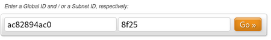

+++
title = 'Réseau privé ipv4 et ipv6 ,générateur adresses privées ipv6'
date = 2020-05-03 00:00:00 +0100
categories = ipv4ipv6
+++
*Un réseau privé est un réseau qui utilise les plages d'adressage IP définies par la  67611,2 « Address Allocation for Private Internets ». Ces adresses ne sont pas routées sur Internet. Un réseau privé peut être numéroté librement avec les plages d'adresses privées prévues à cet effet. Par opposition aux adresses publiques d'Internet, ces adresses ne sont pas uniques, plusieurs réseaux pouvant utiliser les mêmes adresses.*
 
## IPV4

### Utilisation des adresses privées

Les réseaux privés sont de pratique courante dans les réseaux locaux, car beaucoup d'utilisateurs et d'entreprises n'ont pas besoin de disposer d'une adresse IP mondialement unique pour chaque élément de leur réseau, ordinateur, imprimante, etc. Une autre raison de l'essor des réseaux privés provient de la pénurie d'adresses IP publiques. La norme IPv6 a été créée pour pallier cette pénurie, mais son usage n'est toujours que peu répandu.  
Afin de relier des réseaux privés à l'Internet, on utilise des points de traduction d'adresses **Network address translation (NAT)**. Un point de raccordement nécessite au moins une adresse publique et routera tout le trafic destiné à l'Internet, en remplaçant les adresses privées par une adresse publique avant la transmission sur l'Internet. 
L'utilisation d'adresses privées peut cependant s'avérer problématique pour l'interconnexion de deux réseaux d'entreprises avec des espaces d'adressage qui se chevauchent. 

Les plages d'adresse réservées aux réseaux privés sont donc : 

Préfixe | Plage IP | Nombre d'adresses 
--------|----------|------------------
10.0.0.0/8 | 10.0.0.0 – 10.255.255.255 | 2^32-8 = 16 777 216 
172.16.0.0/12 | 172.16.0.0 – 172.31.255.255 | 2^32-12 = 1 048 576 
192.168.0.0/16 | 192.168.0.0 – 192.168.255.255 | 2^32-16 = 65 536 

L'administrateur est libre de diviser ces plages en sous-réseaux selon ses besoins.  

### Charge des adresses privées sur les serveurs racine du DNS

Bien que les adresses privées ne puissent pas transiter par l'Internet, les serveurs racine du DNS reçoivent un nombre important de requêtes de résolution inverse relatives à des plages d'adresses privées.  
Pour réduire cette surcharge, le projet AS 1123 vise à déléguer les sous-domaines vers des serveurs distribués, via [anycast](https://fr.wikipedia.org/wiki/Anycast).   

Dans ce cadre, l'IANA a créé les délégations suivantes : 

```
10.in-addr.arpa.        86400   IN      NS      BLACKHOLE-1.IANA.ORG.
10.in-addr.arpa.        86400   IN      NS      BLACKHOLE-2.IANA.ORG.
BLACKHOLE-2.IANA.ORG.   3600    IN      A       192.175.48.42
BLACKHOLE-1.IANA.ORG.   3600    IN      A       192.175.48.6
```

Les deux adresses 192.175.48.42 et 192.175.48.6 ne sont pas uniques, et le serveur le plus proche du client répondra avec un NXDOMAIN ("Non-Existent Domain", "No Such Domain"). 

## IPV6

Un concept similaire existe en IPv6 avec les adresses locales uniques `fc00::/7`.   
Les adresses locales uniques ont le format suivant :   
Structure des adresses locales uniques   

champ | préfixe  | L | ID globale | Subnet | Interface 
------|----------|---|------------|--------|----------
**bits** | 7 | 1 | 40 | 16 | 64 

Ces adresses sont définies par la  RFC 4193. 

    • Le **préfixe** vaut `1111110` 
    • **L** vaut `1` pour les ID globales assignées localement. 
    • **ID globale** est un nombre pseudo-aléatoire choisi par l'organisation, de sorte qu'il est très improbable que deux organisations aient le même numéro. 
    • **Subnet** est le numéro du sous-réseau. 
    • **Interface** est l'identification de l'hôte dans le sous-réseau.

Le bloc `fd00::/8` est défini pour les préfixes `/48` , formés en définissant les <u>quarante bits</u> du préfixe suivant `fd` sur une chaîne de bits <u>générée aléatoirement</u>. Il en résulte le format `fdxx:xxxx:xxxx::` pour un préfixe dans cette plage. La RFC 4193 propose une suggestion pour générer l'identifiant aléatoire afin d'obtenir un résultat de qualité minimale si l'utilisateur n'a pas accès à une bonne source de nombres aléatoires.

**Exemple**  
Un préfixe de routage dans la plage `fd00::/8` peut être construit en générant une <u>chaîne hexadécimale aléatoire de 40 bits</u>, prise pour cet exemple comme `0xe48dba82e1`   
La chaîne est ajoutée au préfixe `fd00::/8` . Cela forme le préfixe de routage 48 bits `fde4:8dba:82e1::/48`  
Avec ce préfixe, 65 536 sous-réseaux de taille `/64` sont disponibles pour le réseau privé: `fde4:8dba:82e1::/64` à `fde4:8dba:82e1:ffff:/64` 

**Autre exemple**  
openssl rand -hex 5 (5x8bits) &rarr; 23a6d77fde
La chaîne est ajoutée au préfixe `fd00::/8`  &rarr;  fd23:a6d7:7fde::/48  
Avec ce préfixe, 65 536 sous-réseaux de taille / 64 sont disponibles pour le réseau privé: `fd23:a6d7:7fde::/64` à  `fd23:a6d7:7fde:ffff:/64` 

### Propriétés

Les préfixes de la plage `fd00::/8` ont des caractéristiques similaires à celles des plages d'adresses privées IPv4 : ils ne sont pas alloués par un registre d'adresses et peuvent être utilisés dans les réseaux par quiconque sans intervention extérieure. Ils ne sont pas garantis d'être uniques au monde. Les entrées DNS (Reverse Domain Name System ) (dans ip6.arpa) pour les ULA `fd00::/8` ne peuvent pas être déléguées dans le DNS global.  
Comme les ULA `fd00::/8` ne sont pas destinés à être routés en dehors de leur domaine administratif (site ou organisation), les administrateurs des réseaux d'interconnexion n'ont normalement pas à se soucier de l'unicité des préfixes ULA.  
Cependant, si les réseaux nécessitent un routage des ULA entre eux en cas de fusion, par exemple, le risque de collision d'adresse est faible si l'algorithme de sélection RFC 4193 a été utilisé. 

### Générateur d'adresses IPv6 locales

L'outil [Local IPv6 Range Generator](https://www.ultratools.com/tools/rangeGenerator) peut être utilisé pour générer des ID globaux, des ID de sous-réseau et la plage d'adresses IPv6 valide. L'ID global et l'ID de sous-réseau doivent toujours être remplis si vous opérez sur un réseau et un sous-réseau existants.

* Si vous déployez un réseau entièrement nouveau, vous aurez besoin d'un nouvel ID global et d'un nouvel ID de sous-réseau - <u>laissez les deux champs vides</u> et appuyez sur **"Go"**.
* Si vous déployez un nouveau sous-réseau sur un réseau existant, remplissez l'**ID global** et <u>laissez l'**ID de sous-réseau** vide</u> puis appuyez sur **"Go"**
* Si vous devez générer une nouvelle plage IPv6 locale pour un sous-réseau existant, <u>remplissez votre **ID global** et votre **ID de sous-réseau**</u>, et appuyez sur **"Go"**.  




