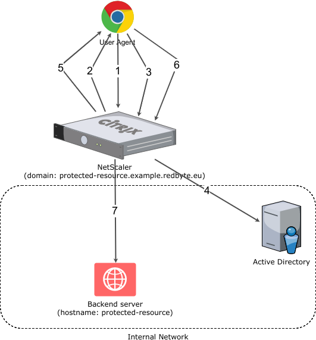
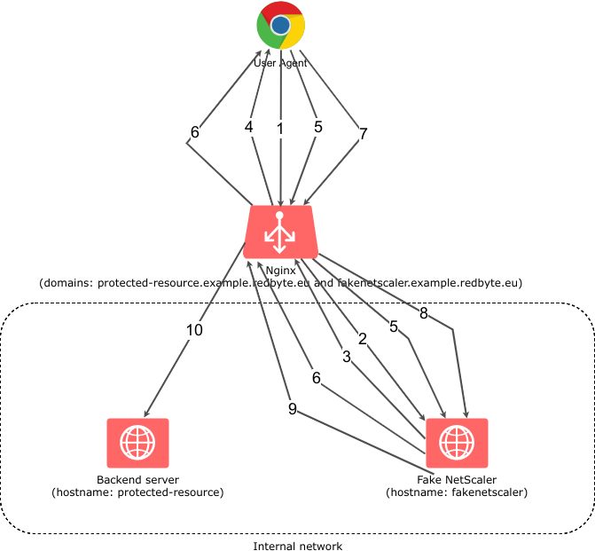

+++
title = 'Utilisation du module de demande d’authentification NGINX auth_request'
date = 2020-05-12 00:00:00 +0100
categories = nginx
+++
## nginx -Authentification basée sur le résultat de la sous-demande

### introduction

NGINX et NGINX Plus peuvent authentifier chaque demande sur votre site Web avec un serveur ou un service externe.  

- Pour effectuer l'authentification, NGINX effectue une sous-demande HTTP vers un serveur externe où la sous-demande est vérifiée. 
- Si la sous-demande renvoie un **code de réponse** :
     -  **2xx ** , l'accès est **autorisé**
     - s'il renvoie **401 ou 403**, l'accès est **refusé**. 

Un tel type d'authentification permet d'implémenter divers schémas d'authentification, tels que l'authentification multifactorielle, ou d'implémenter l'authentification LDAP ou OAuth.

Dans l'emplacement qui nécessite l'authentification de la demande, spécifiez la directive `auth_request` dans laquelle spécifiez un emplacement interne où une sous-demande d'autorisation sera transmise à:

```
location /private/ {
    auth_request /auth;
    #...
}
```

Ici, pour chaque demande à **/private** , une sous-demande à l' emplacement interne **/auth** sera effectuée.

Spécifiez un emplacement interne et la directive `proxy_pass` à l'intérieur de cet emplacement qui procurera des sous-demandes d'authentification à un serveur ou un service d'authentification:

```
location = /auth {
    internal;
    proxy_pass http://auth-server;
    #...
}

```

Comme le corps de la demande est rejeté pour les sous-demandes d'authentification, vous devrez définir la directive `proxy_pass_request_body` sur `off` et également définir l'en-tête `Content-Length` sur une chaîne nulle:

```
location = /auth {
    internal;
    proxy_pass              http://auth-server;
    proxy_pass_request_body off;
    proxy_set_header        Content-Length "";
    #...
}
```

Passez l'URI complet de la requête d'origine avec des arguments avec la directive `proxy_set_header`:

```
location = /auth {
    internal;
    proxy_pass              http://auth-server;
    proxy_pass_request_body off;
    proxy_set_header        Content-Length "";
    proxy_set_header        X-Original-URI $request_uri;
}
```

En option, vous pouvez définir une valeur variable en fonction du résultat de la sous-demande avec la directive `auth_request_set`:

```
location /private/ {
    auth_request        /auth;
    auth_request_set $auth_status $upstream_status;
}
```

### Exemple complet

Cet exemple résume les étapes précédentes en une configuration:

```
http {
    #...
    server {
    #...
        location /private/ {
            auth_request     /auth;
            auth_request_set $auth_status $upstream_status;
        }

        location = /auth {
            internal;
            proxy_pass              http://auth-server;
            proxy_pass_request_body off;
            proxy_set_header        Content-Length "";
            proxy_set_header        X-Original-URI $request_uri;
        }
    }
}
```

## Sécurisation des routes de l'API avec OAuth2 et nginx auth_request

Lorsqu'une API est construite en plusieurs parties, il est agréable de pouvoir créer des services sans avoir à intégrer des autorisations d'accès à l'intérieur de chacune d'entre elles. Cela permet une meilleure séparation des préoccupations. Dans ce schéma, les services appellent le serveur d'autorisation pour vérifier si l'utilisateur est autorisé à accéder aux services.

>**Nginx** permet de faire cela avec **auth_request**

Il faut ajouter deux lignes de configuration à n'importe quelle route que vous voulez sécuriser.

1.    Vérifier si la demande est autorisée avec **auth_request**
2.    Renvoyer le message d'erreur **auth_request** en autorisant cette demande sur un 401 et en affichant une page d'erreur personnalisée avec *error_page 401*

Les deux demandes sont effectuées sur une route /auth qui sert de proxy au serveur d'authentification.

### Autoriser la demande

**auth_request** vérifie le statut d'authentification et renvoie <u>401 non autorisés</u> ou <u>200 autorisés</u>.  
Nous devons passer l'en-tête Authorization pour que le jeton au porteur soit fourni au serveur d'authentification. Nous faisons cela avec :

```
proxy_pass_header Authorization;
proxy_set_header Authorization $http_authorization;
```

Nous n'avons probablement pas besoin de données de publication lors de la vérification de l'autorisation, donc nous ne transmettons pas ce contenu au serveur d'autorisation avec :

```
proxy_pass_request_body off;
proxy_set_header Content-Length "";
proxy_set_header X-Original-URI $request_uri;
```

### Réponse d'autorisation en retour

Si la réponse auth_request était un 401, le résultat de la requête /auth est affiché sous la forme d'une page d'erreur.

```
error_page 401 =401 /auth;
```

### La configuration complète de nginx (avec PHP-FPM)

```
server {
    listen      80 default_server;
    server_name _;    index index.php;
    rewrite_log on;
    root        /var/www/html/public;

    location / {
       auth_request /auth;
       error_page 401 =401 /auth;
       try_files $uri $uri/ /index.php?$query_string;
    }location ~ \.php$ {
        # With php7.4-fpm:
        fastcgi_index index.php;
        fastcgi_connect_timeout 3s;
        fastcgi_read_timeout 60s;
        fastcgi_pass unix:/var/run/php7.4-fpm.sock;
        fastcgi_param SCRIPT_NAME $fastcgi_script_name;
        fastcgi_param SCRIPT_FILENAME $document_root$fastcgi_script_name;
        include /etc/nginx/fastcgi_params;
    }location = /auth {
       proxy_pass http://api/v1/oauth2/user;
       proxy_pass_header  Authorization;
       proxy_set_header Authorization $http_authorization;
       proxy_pass_request_body off;
       proxy_set_header Content-Length "";
       proxy_set_header X-Original-URI $request_uri;
    }
}
```

## Utilisez nginx pour ajouter une authentification à n'importe quelle application 

Vous êtes-vous déjà trouvé à vouloir mettre une application derrière un formulaire de connexion, mais redoutant d'écrire tout ce code pour gérer OAuth 2.0 ou les mots de passe? Dans ce tutoriel, je vais vous montrer comment utiliser le auth_requestmodule nginx pour protéger toute application s'exécutant derrière votre serveur nginx avec OAuth 2.0, sans écrire de code! Vouch, un microservice écrit en Go, gère la danse OAuth pour un certain nombre de fournisseurs d'authentification différents afin que vous n'ayez pas à le faire.

### Pourquoi s'authentifier sur le serveur Web?

Imaginez que vous utilisez nginx pour exécuter un petit wiki privé pour votre équipe. Au début, vous commencez probablement par ajouter un compte utilisateur wiki pour chaque personne. Ce n'est pas trop mal, d'ajouter de nouveaux comptes pour les nouvelles embauches et de les supprimer lorsqu'ils partent.

Quelques mois plus tard, au fur et à mesure que votre équipe et votre entreprise commencent à grandir, vous ajoutez un logiciel de surveillance de serveur et vous souhaitez mettre cela derrière une connexion afin que seule votre entreprise puisse le voir. Comme ce n'est pas un logiciel très sophistiqué, la façon la plus simple de le faire est de créer un mot de passe unique pour tout le monde dans un fichier **.htpasswd** et de partager cet utilisateur avec le bureau.

Un autre mois s'écoule, et vous ajoutez un système d'intégration continue, et cela vient avec l'authentification GitHub en option, ce qui semble raisonnable puisque la plupart de votre équipe possède déjà des comptes GitHub.

À ce stade, lorsqu'une nouvelle personne rejoint, vous devez créer un compte wiki pour elle, l'ajouter à l'organisation GitHub et lui donner le mot de passe partagé pour l'autre système. Quand quelqu'un part, vous pouvez supprimer son compte wiki et le supprimer de GitHub, mais avouons-le, vous ne changerez probablement pas le mot de passe partagé pendant un certain temps car il est ennuyeux de devoir le distribuer à nouveau à tout le monde.

Il doit sûrement y avoir un meilleur moyen d'intégrer tous ces systèmes pour utiliser un système de connexion partagé commun! Le problème est que le wiki est écrit en PHP, le système de surveillance du serveur finit par publier un dossier de HTML statique et le système CI est écrit en Ruby qu'une seule personne de votre équipe se sent à l'aise d'écrire.

Si le serveur Web pouvait gérer l'authentification des utilisateurs, alors chaque système d'arrière-plan n'aurait pas à s'en soucier, car les seules requêtes qui pourraient le faire seraient déjà authentifiées!


### Utilisation du module nginx auth_request

Entrez dans le module nginx **auth_request**

Ce module est livré avec nginx, mais nécessite d'être activé lors de la compilation de nginx. Lorsque vous téléchargez la source nginx et compilez, incluez simplement le  drapeau `--with-http_auth_request_module` avec les autres que vous utilisez.

Le module **auth_request** se situe entre Internet et votre serveur principal sur lequel nginx transmet les demandes, et chaque fois qu'une demande arrive, il transmet d'abord la demande à un serveur distinct pour vérifier si l'utilisateur est authentifié, et utilise la réponse HTTP pour décider s'il doit autoriser la demande à continuer vers le backend.

  
Organigramme illustrant le module nginx auth_request  

Ce diagramme illustre une demande qui arrive pour le nom du serveur stats.avocado.lol. Tout d'abord, nginx lance une sous-demande à **login.avocado.lol(1)**, et si la **réponse (2)** à cette demande renvoie HTTP 200, il continue ensuite de transmettre la demande au backend **stats.avocado.lol** 

### Choix d'un proxy d'authentification

Étant donné que le module **auth_request** nginx n'a aucun concept d'utilisateurs ou comment authentifier qui que ce soit, nous avons besoin d'autre chose dans le mélange qui peut réellement gérer la connexion des utilisateurs. Dans le diagramme ci-dessus, cela est illustré par le nom du serveur **login.avocado.lol**

Ce serveur doit gérer une requête HTTP et renvoyer **HTTP 200 ou 401** selon que l'utilisateur est connecté.  
Si l'utilisateur n'est pas connecté, il doit savoir comment le faire, se connecter et définir un cookie de session.

Pour ce faire, nous utiliserons le projet open source « Vouch ». Vouch est écrit en Go, il est donc très facile à déployer. Tout peut être configuré via un seul fichier YAML. Vouch peut être configuré pour authentifier les utilisateurs via une variété de backends OAuth et OpenID Connect tels que GitHub, Google, Okta ou tout autre serveur personnalisé.

Nous reviendrons sur la configuration de Vouch dans quelques minutes, mais pour l'instant, continuons à configurer votre serveur protégé dans nginx.

### Configurez votre hôte nginx protégé

En commençant par un bloc serveur nginx typique, il vous suffit d'ajouter quelques lignes pour activer le module **auth_request**. Voici un exemple de bloc serveur qui devrait ressembler à votre propre configuration.  

Cet exemple ne sert qu'un dossier de fichiers HTML statiques, mais la même idée s'applique que vous passiez la demande à un backend fastcgi ou que vous utilisiez proxy_pass.

```
server {
  listen 443 ssl http2;
  server_name stats.avocado.lol;

  ssl_certificate /etc/letsencrypt/live/avocado.lol/fullchain.pem;
  ssl_certificate_key /etc/letsencrypt/live/avocado.lol/privkey.pem;

  root /web/sites/stats.avocado.lol;

  index index.html;
}
```

Ajoutez ce qui suit à votre bloc **server** existant :

```
# Any request to this server will first be sent to this URL
auth_request /vouch-validate;

location = /vouch-validate {
  # This address is where Vouch will be listening on
  proxy_pass http://127.0.0.1:9090/validate;
  proxy_pass_request_body off; # no need to send the POST body

  proxy_set_header Content-Length "";
  proxy_set_header X-Real-IP $remote_addr;
  proxy_set_header X-Forwarded-For $proxy_add_x_forwarded_for;
  proxy_set_header X-Forwarded-Proto $scheme;

  # these return values are passed to the @error401 call
  auth_request_set $auth_resp_jwt $upstream_http_x_vouch_jwt;
  auth_request_set $auth_resp_err $upstream_http_x_vouch_err;
  auth_request_set $auth_resp_failcount $upstream_http_x_vouch_failcount;
}

error_page 401 = @error401;

# If the user is not logged in, redirect them to Vouch's login URL
location @error401 {
  return 302 https://login.avocado.lol/login?url=https://$http_host$request_uri&vouch-failcount=$auth_resp_failcount&X-Vouch-Token=$auth_resp_jwt&error=$auth_resp_err;
}
```

Voyons ce qui se passe ici. La première ligne, `auth_request /vouch-validate;` c'est ce qui permet ce flux.  
Cela indique au module **auth_request** d'envoyer d'abord toute demande à cette URL avant de décider si elle est autorisée à continuer vers le serveur principal.

Le bloc `location = /vouch-validate` capture cette URL et la transmet par procuration au serveur Vouch qui écoutera sur le port 9090. Nous n'avons pas besoin d'envoyer le corps POST à ​​Vouch, car nous ne nous soucions vraiment que du cookie.

La ligne `error_page 401 = @error401;` indique à nginx ce qu'il faut faire si Vouch renvoie une réponse HTTP 401, qui est de la passer au bloc défini par `location @error401`.  
Ce bloc redirigera le navigateur de l'utilisateur vers l'URL de connexion de Vouch qui lancera le flux vers le véritable backend d'authentification.

### Configurer un bloc serveur pour Vouch

Ensuite, configurez un nouveau bloc serveur pour Vouch afin qu'il ait une URL accessible au public comme <https://login.avocado.lol>. Tout ce que cela doit faire est de proxy la demande au serveur backend Vouch.

```
server {
  listen 443 ssl;
  server_name login.avocado.lol;

  ssl_certificate /etc/letsencrypt/live/login.avocado.lol/fullchain.pem;
  ssl_certificate_key /etc/letsencrypt/live/login.avocado.lol/privkey.pem;

  # Proxy to your Vouch instance
  location / {
    proxy_set_header  Host  login.avocado.lol;
    proxy_set_header  X-Forwarded-Proto https;
    proxy_pass        http://127.0.0.1:9090;
  }
}
```

### Configurer et déployer Vouch

Vous devrez télécharger [Vouch](https://github.com/vouch/vouch-proxy) et compiler le binaire Go pour votre plateforme. Vous pouvez suivre les instructions du fichier README du projet.

Une fois que vous avez un binaire, vous devez créer le fichier de configuration pour définir la façon dont vous souhaitez que Vouch authentifie les utilisateurs.

Copier `config/config.yml_example` dans `config/config.yml` et lire les paramètres là - bas. La plupart des valeurs par défaut seront correctes, mais vous voudrez créer votre propre chaîne secrète JWT et remplacer la valeur d'espace réservé de `your_random_string`.

La façon la plus simple de configurer Vouch est de lui permettre d'autoriser tout utilisateur qui peut s'authentifier sur le serveur OAuth à accéder au backend. Cela fonctionne très bien si vous utilisez un serveur OAuth privé comme Okta pour gérer vos utilisateurs. Allez-y et paramétrez `allowAllUsers: true` pour activer ce comportement et commentez le `domains: chunk`.

Vous devrez choisir un fournisseur OAuth 2.0 à utiliser pour authentifier réellement les utilisateurs. Dans cet exemple, nous utiliserons Okta, car c'est le moyen le plus simple d'avoir un **serveur OAuth/OpenID Connect complet** et de pouvoir gérer tous vos comptes d'utilisateurs à partir d'un seul tableau de bord. Avant de terminer le remplissage du fichier de configuration, vous devez vous inscrire à un compte développeur Okta sur [developer.okta.com/](https://developer.okta.com/) . 
### Bonus: qui s'est connecté?

Si vous mettez une application Web dynamique derrière nginx et que vous vous souciez non seulement de savoir si quelqu'un a pu se connecter, mais aussi de qui il s'agit , il y a une autre astuce que nous pouvons utiliser.

Par défaut, Vouch extraira un ID utilisateur via OpenID Connect (ou GitHub ou Google si vous les avez configurés en tant que fournisseurs d'authentification), et inclura cet ID utilisateur dans un en-tête HTTP qui sera retransmis au serveur principal.

Dans votre bloc serveur principal, juste en dessous de la ligne `auth_request /vouch-validate;` qui active le module **auth_request**, ajoutez ce qui suit:

    auth_request_set $auth_user $upstream_http_x_vouch_user;

Cela prendra l'en-tête HTTP que Vouch définit `X-Vouch-User`, et l'affectera à la variable nginx `$auth_user`. Ensuite, selon que vous utilisez fastcgi ou proxy_pass, incluez l'une des deux lignes ci-dessous dans votre bloc serveur:

    fastcgi_param REMOTE_USER $auth_user;
    proxy_set_header Remote-User $auth_user;

Ceux-ci définiront un en-tête HTTP avec la valeur `$auth_user` que votre serveur d'arrière-plan peut lire afin de savoir qui s'est connecté.  
Par exemple, en PHP, vous pouvez accéder à ces données en utilisant:

```php
<?php
echo 'Hello, ' . $_SERVER['REMOTE_USER'] . '!';
```

Maintenant, vous pouvez être sûr que votre application interne n'est accessible qu'aux utilisateurs authentifiés!

### En savoir plus sur OAuth 2.0 et la gestion sécurisée des utilisateurs avec Okta

Pour plus d'informations et de didacticiels sur OAuth 2.0, consultez certains de nos autres articles de blog!

    Ajoutez l'authentification à votre application PHP en 5 minutes
    Quel est le type d'octroi de code d'autorisation OAuth 2.0?
    Qu'est-ce que le type de subvention implicite OAuth 2.0?


*    [Add Authentication to your PHP App in 5 Minutes](https://developer.okta.com/blog/2018/07/09/five-minute-php-app-auth)
*    [What is the OAuth 2.0 Authorization Code Grant Type?](https://developer.okta.com/blog/2018/04/10/oauth-authorization-code-grant-type)
 *   [What is the OAuth 2.0 Implicit Grant Type?](https://developer.okta.com/blog/2018/05/24/what-is-the-oauth2-implicit-grant-type)

## Utilisation du module de demande d’authentification NGINX auth_request

* [Using the NGINX Auth Request Module](https://redbyte.eu/en/blog/using-the-nginx-auth-request-module/)

Le client dispose d'une application Web existante hébergée dans un centre de données dédié ainsi que de toute l'infrastructure matérielle, y compris Citrix NetScaler , une appliance d'équilibrage de la charge et de proxy inverse dotée de quelques fonctionnalités supplémentaires.   
Une telle fonctionnalité est une passerelle d’authentification, c’est-à-dire que NetScaler autorise uniquement l’accès aux applications principales pour les utilisateurs authentifiés. L'application Web du client n'est toutefois qu'une des nombreuses applications qui, ensemble, forment un système complexe. Toutes les applications sont hébergées dans le même centre de données et partagent les mêmes utilisateurs du domaine. En d'autres termes, l'utilisateur du domaine peut accéder à chaque application avec une seule paire nom d'utilisateur / mot de passe. Dans chaque application, chaque utilisateur de domaine est mappé à un utilisateur d'application.   
La situation est illustrée schématiquement dans la figure suivante.  
{:width="400"}  
Schéma d'authentification NetScaler

Le processus d'authentification utilisateur simplifié comprend les étapes suivantes:

1.    HTTP GET https://protected-resource.example.redbyte.eu
2.    NetScaler détecte que l'utilisateur n'est pas authentifié et redirige (HTTP 302) vers la page de connexion
3.    POST HTTP demande de connexion à la page
4.    Authentification d'utilisateur sur Active Directory
5.    Rediriger (HTTP 302) vers la destination d'origine (https://protected-resource.example.redbyte.eu)
6.    HTTP GET https://protected-resource.example.redbyte.eu
7.    Proxy vers un serveur principal. Le serveur d'arrière-plan lit le nom d'utilisateur du domaine à partir de l'en-tête HTTP et identifie l'utilisateur de l'application correspondante. 

Le problème avec une telle configuration est sa testabilité. Le client dispose de plusieurs environnements de transfert et introduire NetScaler dans ces environnements serait excessif (sans compter la gestion de domaine pour tous les environnements). La demande du client était de "contourner" en quelque sorte NetScaler et toute la complexité de la configuration et de la gestion des utilisateurs sans modifier le code ou la configuration de l'application. Il devait ressembler et se comporter comme si NetScaler était là.

### Utiliser ngx_http_auth_request_module

Une solution consiste à utiliser le serveur HTTP [NGINX](https://nginx.org/) avec le module `ngx_http_auth_request_module`  
La documentation de ce module indique qu'elle implémente l'autorisation du client en fonction du résultat d'une sous-demande.   
Qu'est-ce que cela veut dire exactement?   
Le principe est assez simple, lorsque vous envoyez une requête HTTP à une URL protégée, NGINX effectue une sous-demande interne sur une URL d'autorisation définie.   

* Si le résultat de la sous-demande est HTTP 2xx, NGINX envoie la requête HTTP d'origine au serveur dorsal.   
* Si le résultat de la sous-demande est HTTP 401 ou 403, l'accès au serveur principal est refusé.   

En configurant NGINX, vous pouvez rediriger ces 401 ou 403 vers une page de connexion où l'utilisateur est authentifié puis redirigé vers la destination d'origine. L'ensemble du processus de sous-demande d'autorisation est ensuite répété, mais comme l'utilisateur est maintenant authentifié, la sous-demande renvoie HTTP 200 et la requête HTTP d'origine est envoyée par proxy au serveur principal.

Naturellement, NGINX fournit seulement un mécanisme pour y parvenir - le serveur d'autorisation doit être une construction personnalisée pour un cas d'utilisation spécifique. Dans notre cas, FakeNetscaler est le serveur d'autorisation - j'y reviendrai plus tard.   
Voyons maintenant comment fonctionne `ngx_http_auth_request_module`:  
{:width="400"}  
Système d'authentification utilisant NGINX et ngx_http_auth_request_module

1.    HTTP GET https://protected-resource.example.redbyte.eu
2.    NGINX envoie une demande d'autorisation à FakeNetScaler
3.    L'utilisateur n'est pas encore authentifié, donc FakeNetScaler renvoie le code HTTP 401
4.    NGINX redirige le navigateur (HTTP 302) vers la page de connexion
5.    L'utilisateur entre les informations de connexion et soumet le formulaire de connexion.
6.    Les identifiants de connexion sont valides, FakeNetScaler renvoie un cookie contenant «l'utilisateur dont l'identifiant est XXX est authentifié» et redirige le navigateur (HTTP 302) vers la destination d'origine.
7.    HTTP GET la destination d'origine
8.    NGINX envoie une demande d'autorisation à FakeNetScaler
9.    FakeNetscaler lit le contenu du cookie et s'aperçoit que l'utilisateur est authentifié. Renvoie donc HTTP 200 comme résultat de la sous-demande.
10.    NGINX envoie la requête à un serveur principal, ainsi qu'un en-tête HTTP avec le nom d'utilisateur du domaine. Le serveur backend lit l'en-tête HTTP du nom d'utilisateur du domaine et identifie l'utilisateur de l'application correspondante. 

À première vue, cela semble être encore plus complexe que le processus d’authentification NetScaler original, mais le fait est que je viens de le décrire en utilisant la méthode de la boîte blanche, où NetScaler était décrit comme une boîte noire (en particulier les points 3. , 4. et 5.).

Il devrait maintenant être clair comment fonctionne le `ngx_http_auth_request_module`  
Regardons le fichier de configuration NGINX du domaine protected-resource.example.redbyte.eu :

```
 1server {
 2  listen   443 ssl;
 3  server_name protected-resource.example.redbyte.eu;
 4
 5  # ssl and server configuration left out
 6
 7  location / {
 8    auth_request /auth;
 9    error_page 401 = @error401;
10
11    auth_request_set $user $upstream_http_x_forwarded_user;
12    proxy_set_header X-Forwarded-User $user;
13    proxy_pass http://protected-resource:8080;
14  }
15
16  location /auth {
17    internal;
18    proxy_set_header Host $host;
19    proxy_pass_request_body off;
20    proxy_set_header Content-Length "";
21    proxy_pass http://fakenetscaler:8888;
22  }
23
24  location @error401 {
25    add_header Set-Cookie "NSREDIRECT=$scheme://$http_host$request_uri;Domain=.example.redbyte.eu;Path=/";
26    return 302 https://fakenetscaler.example.redbyte.eu;
27  }
28
29}
```

Les lignes les plus importantes sont:

*    8 - nous disons ici que pour toutes les URL commençant par / NGINX, la sous-demande d'autorisation sera exécutée sur l'URL /auth
*    9 - que le code HTTP 401 sera redirigé vers la page de connexion
*    11 - Ici, nous définissons $ user variable sur la valeur envoyée par le serveur d'autorisations via l'en-tête HTTP X-Forwarded-User
*    12 - L'en-tête HTTP X-Forwarded-User est défini par NGINX sur la valeur de la variable $ user
*    16 - nous définissons ici la sous-demande d'autorisation. La sous-requête est transmise par proxy à http://fakenetscaler:8888 , qui est un hôte du réseau interne.
*    25 - Ici, nous définissons un cookie avec l'URL de destination d'origine
*    26 - une redirection HTTP 302 vers la page de connexion servie par le serveur d'autorisation. Dans ce cas, nous devons utiliser un nom de domaine complet car le navigateur n'est pas en mesure de résoudre les noms d'hôte internes. 

Fichier de configuration fakenetscaler.example.redbyte.eu domaine du serveur d'autorisation **fakenetscaler.example.redbyte.eu** :

```
1server {
 2  listen   443 ssl;
 3  server_name fakenetscaler.example.redbyte.eu;
 4
 5  # ssl and server configuration left out
 6
 7  location / {
 8        proxy_set_header Host $http_host;
 9        proxy_pass http://fakenetscaler:8888;
10  }
11}
```

Comme vous pouvez le constater, il s’agit d’un proxy inverse envoyé à un serveur principal exécutant le serveur d'autorisation HTTP d’ http://fakenetscaler:8888 .

### FakeNetScaler - serveur d'autorisation

Jusqu'ici, nous n'avons joué qu'avec la configuration du serveur NGINX.   
Regardons le **serveur d'autorisation** FakeNetscaler. Comme je l'ai mentionné précédemment, NGINX ne fournit qu'un cadre d'autorisation, le serveur d'autorisation doit être personnalisé et adapté aux exigences du client:

*    doit pouvoir répondre à la demande HTTP GET /auth et décider si l'utilisateur est authentifié ou non sur un cookie. Si c'est le cas, il répondra avec HTTP 200 s'il ne le fait pas, HTTP 401
*    HTTP GET / affiche la page de connexion
*    HTTP POST / soumettre le formulaire de connexion. Si un utilisateur a saisi le nom d'utilisateur et le mot de passe corrects, le cookie établit son authentification et le redirige vers la destination d'origine en fonction des informations stockées dans le cookie. Si l'utilisateur n'a pas saisi les informations de connexion correctes, la page de connexion avec la description de l'erreur s'affiche à nouveau.
*    doit pouvoir répondre à la demande HTTP GET /auth et, en fonction de la valeur du cookie, décider si l'utilisateur est connecté ou non. Si l'utilisateur est connecté, le code de réponse HTTP est 200, sinon 401.
* HTTP GET to / URL affiche la page de connexion.
* HTTP POST to / URL soumet le formulaire de connexion. Si l'utilisateur a entré un nom d'utilisateur et un mot de passe valides, un cookie de connexion est créé et le navigateur est redirigé vers la destination d'origine. Si l'utilisateur n'a pas saisi de nom d'utilisateur ou de mot de passe valide, la page de connexion avec le message d'erreur s'affiche. 

Cela devrait être un service très simple et nous allons l'implémenter en utilisant le langage de programmation Go . Go possède une bibliothèque standard riche comprenant un serveur HTTP très performant. Un serveur tiers n'est pas nécessaire (par exemple, comme dans la plupart des déploiements Java).

Jugez par vous-même, ceci est un code source complet du serveur FakeNetScaler:

```
1package main
  2
  3import (
  4	"flag"
  5	"fmt"
  6	"github.com/BurntSushi/toml"
  7	"github.com/codegangsta/negroni"
  8	"github.com/gorilla/securecookie"
  9	"github.com/julienschmidt/httprouter"
 10	"gopkg.in/unrolled/render.v1"
 11	"log"
 12	"net/http"
 13	"time"
 14)
 15
 16var (
 17	nsCookieName         = "NSLOGIN"
 18	nsCookieHashKey      = []byte("SECURE_COOKIE_HASH_KEY")
 19	nsRedirectCookieName = "NSREDIRECT"
 20	cfg                  config
 21)
 22
 23type config struct {
 24	// e.g. https://protected-resource.example.redbyte.eu
 25	DefaultRedirectUrl string
 26	// shared password
 27	Password string
 28	// shared domain prefix between protected resource and auth server
 29	// e.g. .example.redbyte.eu (note the leading dot)
 30	Domain string
 31}
 32
 33func main() {
 34
 35	// configuration
 36	port := flag.Int("port", 8888, "listen port")
 37	flag.Parse()
 38	var err error
 39	if cfg, err = loadConfig("config.toml"); err != nil {
 40		log.Fatal(err)
 41	}
 42
 43	// template renderer
 44	rndr := render.New(render.Options{
 45		Directory:     "templates",
 46		IsDevelopment: false,
 47	})
 48
 49	// router
 50	router := httprouter.New()
 51	router.GET("/", indexHandler(rndr))
 52	router.POST("/", loginHandler(rndr))
 53	router.GET("/auth", authHandler)
 54
 55	// middleware and static content file server
 56	n := negroni.New(negroni.NewRecovery(), negroni.NewLogger(),
 57		&negroni.Static{
 58			Dir:    http.Dir("public"),
 59			Prefix: ""})
 60	n.UseHandler(router)
 61
 62	n.Run(fmt.Sprintf(":%d", *port))
 63}
 64
 65func authHandler(w http.ResponseWriter, r *http.Request, _ httprouter.Params) {
 66	var s = securecookie.New(nsCookieHashKey, nil)
 67	// get the cookie from the request
 68	if cookie, err := r.Cookie(nsCookieName); err == nil {
 69		value := make(map[string]string)
 70		// try to decode it
 71		if err = s.Decode(nsCookieName, cookie.Value, &value); err == nil {
 72			// if if succeeds set X-Forwarded-User header and return HTTP 200 status code
 73			w.Header().Add("X-Forwarded-User", value["user"])
 74			w.WriteHeader(http.StatusOK)
 75			return
 76		}
 77	}
 78
 79	// otherwise return HTTP 401 status code
 80	http.Error(w, http.StatusText(http.StatusUnauthorized), http.StatusUnauthorized)
 81}
 82
 83func indexHandler(render *render.Render) httprouter.Handle {
 84	return func(w http.ResponseWriter, r *http.Request, p httprouter.Params) {
 85		// just render the login page
 86		render.HTML(w, http.StatusOK, "index", nil)
 87	}
 88}
 89
 90func loginHandler(render *render.Render) httprouter.Handle {
 91	return func(w http.ResponseWriter, r *http.Request, p httprouter.Params) {
 92		login := r.PostFormValue("login")
 93		passwd := r.PostFormValue("passwd")
 94
 95		var errorMessage = false
 96
 97		// nothing fancy here, it is just a demo so every user has the same password
 98		// and if it doesn't match render the login page and present user with error message
 99		if login == "" || passwd != cfg.Password {
100			errorMessage = true
101			render.HTML(w, http.StatusOK, "index", errorMessage)
102		} else {
103			var s = securecookie.New(nsCookieHashKey, nil)
104			value := map[string]string{
105				"user": login,
106			}
107
108			// encode username to secure cookie
109			if encoded, err := s.Encode(nsCookieName, value); err == nil {
110				cookie := &http.Cookie{
111					Name:    nsCookieName,
112					Value:   encoded,
113					Domain:  cfg.Domain,
114					Expires: time.Now().AddDate(1, 0, 0),
115					Path:    "/",
116				}
117				http.SetCookie(w, cookie)
118			}
119
120			// after successful login redirect to original destination (if it exists)
121			var redirectUrl = cfg.DefaultRedirectUrl
122			if cookie, err := r.Cookie(nsRedirectCookieName); err == nil {
123				redirectUrl = cookie.Value
124			}
125			// ... and delete the original destination holder cookie
126			http.SetCookie(w, &http.Cookie{
127				Name:    nsRedirectCookieName,
128				Value:   "deleted",
129				Domain:  cfg.Domain,
130				Expires: time.Now().Add(time.Hour * -24),
131				Path:    "/",
132			})
133
134			http.Redirect(w, r, redirectUrl, http.StatusFound)
135		}
136
137	}
138}
139
140// loads the config file from filename
141// Example config file content:
142/*
143defaultRedirectUrl = "https://protected-resource.example.redbyte.eu"
144password = "shared_password"
145domain = ".example.redbyte.eu"
146*/
147func loadConfig(filename string) (config, error) {
148	var cfg config
149	if _, err := toml.DecodeFile(filename, &cfg); err != nil {
150		return config{}, err
151	}
152	return cfg, nil
153}
```

Après avoir compilé le code Go, un binaire lié de manière statique, sans aucune autre dépendance d'exécution, est créé. Lorsque vous l'exécutez, vous obtenez un serveur HTTP à l'écoute sur le port 8888.

### Conclusion

Dans ce blog, nous avons montré comment utiliser NGINX et son ngx_http_auth_request_module , qui fournit un cadre de base pour la création d'une autorisation client personnalisée à l'aide de principes simples.  
En utilisant le langage de programmation Go, nous avons implémenté notre propre serveur d'autorisation, que nous utilisions avec NGINX. 


