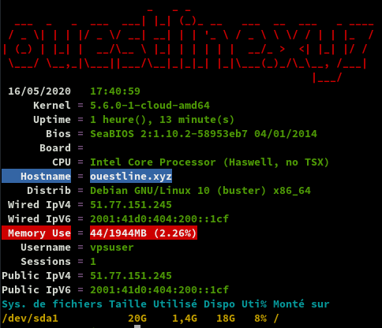
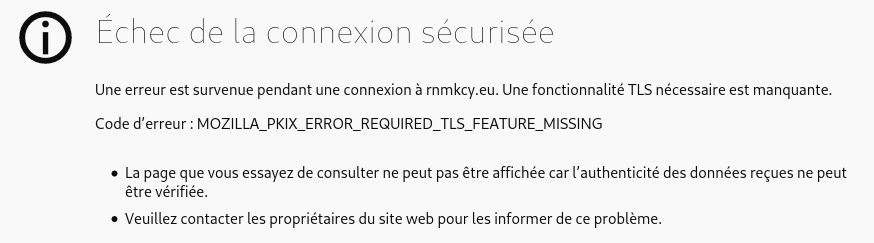

+++
title = 'vps789461 debian 10 - ouestline.xyz (INACTIF)'
date = 2020-05-26 00:00:00 +0100
categories = ['serveur', 'debian']
+++
*OVH vps789461 (1 vCore/2GoRam/20GoSSD) Debian Buster*


# vps789461 - Debian 10

{:width="50"}

{:width="100"}  
Debian 10 (Buster) (en version 64 bits)  
L'adresse IPv4 du VPS est : 51.77.151.245  
L'adresse IPv6 du VPS est : 2001:41d0:404:200::1cf  

Le nom du VPS est : vps789461.ovh.net

Le compte administrateur suivant a été configuré sur le VPS :
Nom d'utilisateur : root
Mot de passe :      YA4H0d3A

Connexion SSH en "root"

    ssh root@51.77.151.245

## Installer noyau 5.6

    echo "deb http://deb.debian.org/debian/ unstable main" | sudo tee /etc/apt/sources.list.d/unstable-wireguard.list
    printf 'Package: *\nPin: release a=unstable\nPin-Priority: 90\n' | sudo tee /etc/apt/preferences.d/limit-unstable
    apt update && apt upgrade
    # Vérifier s'il n'y a pas une image plus récente avec 'apt search linux-image-5.'
    apt install linux-image-5.6.0-1-cloud-amd64

## Réseau

{:width="50"}

Créer un bash pour désactiver l'initialisation réseau par le cloud sur le VPS OVH  

    nano initres.sh

```
#!/bin/bash
#
# To disable cloud-init's network configuration capabilities, write a file
# /etc/cloud/cloud.cfg.d/99-disable-network-config.cfg with the following:
# network: {config: disabled}
#
#Création du fichier **/etc/cloud/cloud.cfg.d/99-disable-network-config.cfg** en mode su
echo "network: {config: disabled}" > /etc/cloud/cloud.cfg.d/99-disable-network-config.cfg
#
# Effacerle fichier /etc/network/interfaces  
rm /etc/network/interfaces
# Recréer le fichier /etc/network/interfaces
cat > /etc/network/interfaces << EOF
auto lo
iface lo inet loopback

auto eth0
iface eth0 inet dhcp
iface eth0 inet6 static
 address 2001:41d0:404:200::01cf
 netmask 128
 post-up /sbin/ip -6 route add 2001:41d0:404:200::0001 dev eth0
 post-up /sbin/ip -6 route add default via 2001:41d0:404:200::1 dev eth0
 pre-down /sbin/ip -6 route del default via 2001:41d0:404:200::1 dev eth0
 pre-down /sbin/ip -6 route del 2001:41d0:404:200::1 dev eth0
EOF
#
# Configuration OVH à modifier /etc/cloud/cloud.cfg 
sed -i 's/preserve_hostname: false/preserve_hostname: true/g' /etc/cloud/cloud.cfg
sed -i 's/manage_etc_hosts: true/manage_etc_hosts: false/g' /etc/cloud/cloud.cfg
#
# Redémarrage de la machine
systemctl reboot

```

Droits et exécution

    chmod +x initres.sh && ./initres.sh

Patienter quelques minutes avant la reconnexion...

Se connecter en root via SSH  

    ssh root@51.77.151.245

Vérifier le réseau `ip a` 

```
1: lo: <LOOPBACK,UP,LOWER_UP> mtu 65536 qdisc noqueue state UNKNOWN group default qlen 1000
    link/loopback 00:00:00:00:00:00 brd 00:00:00:00:00:00
    inet 127.0.0.1/8 scope host lo
       valid_lft forever preferred_lft forever
    inet6 ::1/128 scope host 
       valid_lft forever preferred_lft forever
2: eth0: <BROADCAST,MULTICAST,UP,LOWER_UP> mtu 1500 qdisc pfifo_fast state UP group default qlen 1000
    link/ether fa:16:3e:42:5d:6d brd ff:ff:ff:ff:ff:ff
    inet 51.77.151.245/32 brd 51.77.151.245 scope global dynamic eth0
       valid_lft 86308sec preferred_lft 86308sec
    inet6 2001:41d0:404:200::1cf/128 scope global 
       valid_lft forever preferred_lft forever
    inet6 fe80::f816:3eff:fe42:5d6d/64 scope link 
       valid_lft forever preferred_lft forever
```

Vérifier la version du noyau : `uname -r` &rarr; **5.6.0-1-cloud-amd64**  
Version debian : `cat /etc/debian_version`  **10.4**  
Locales **fr UTF8** : `dpkg-reconfigure locales`  
Fuseau **Europe/Paris** : `dpkg-reconfigure tzdata` (facultatif car initialisé par défaut)

## domaine ouestline.xyz

{:width="50"}

Zone dns OVH

```
$TTL 3600
@	IN SOA dns20.ovh.net. tech.ovh.net. (2020022809 86400 3600 3600000 300)
        IN NS     ns20.ovh.net.
        IN NS     dns20.ovh.net.
        IN A      59.12.235.121
        IN AAAA   2010:3fc0:4dff:2400::afe5
```

Reverse DNS sur "server" IP 51.77.151.245 &rarr; ouestline.xyz

Hostname

    hostnamectl set-hostname ouestline.xyz
    hostnamectl

```
   Static hostname: ouestline.xyz
         Icon name: computer-vm
           Chassis: vm
        Machine ID: 0ef30511d74646618d92e464efb187ce
           Boot ID: 17e89f7d2a5d4349b1ca160b2d04df10
    Virtualization: kvm
  Operating System: Debian GNU/Linux 10 (buster)
            Kernel: Linux 5.6.0-1-cloud-amd64
      Architecture: x86-64
```
 
## Création utilisateur

Utilisateur **vpsuser**  

    useradd -m -d /home/vpsuser/ -s /bin/bash vpsuser

Mot de passe **vpsuser**  

    passwd vpsuser 

Visudo pour les accès root via utilisateur **vpsuser**  

```bash
apt install sudo  # sudo installé par défaut
echo "vpsuser     ALL=(ALL) NOPASSWD: ALL" >> /etc/sudoers
```

Changer le mot de passe root

    passwd root

## OpenSSH, clé et script

{:width="100"}  
**connexion avec clé**  
<u>sur l'ordinateur de bureau</u>
Générer une paire de clé curve25519-sha256 (ECDH avec Curve25519 et SHA2) nommé **kvm-cinay** pour une liaison SSH avec le serveur KVM.  

    ssh-keygen -t ed25519 -o -a 100 -f ~/.ssh/kvm-vps789461

Envoyer la clé publique sur le serveur KVM   

    scp ~/.ssh/kvm-vps789461.pub vpsuser@51.77.151.245:/home/vpsuser/

<u>sur le serveur KVM</u>
On se connecte  

    ssh vpsuser@51.77.151.245

Copier le contenu de la clé publique dans /home/$USER/.ssh/authorized_keys  

    cd ~

Sur le KVM ,créer un dossier .ssh  

    mkdir .ssh
    cat $HOME/kvm-vps789461.pub >> $HOME/.ssh/authorized_keys

et donner les droits  

    chmod 600 $HOME/.ssh/authorized_keys

effacer le fichier de la clé  

    rm $HOME/kvm-vps789461.pub

Modifier la configuration serveur SSH  

    sudo nano /etc/ssh/sshd_config # attention aux 2 dernières lignes

Modifier  

```
Port 55039
PasswordAuthentication no    # avant dernière ligne
PermitRootLogin no           # dernière ligne
```

<u>session SSH ne se termine pas correctement lors d'un "reboot" à distance</u>  
Si vous tentez de **redémarrer/éteindre** une machine distance par **ssh**, vous pourriez constater que votre session ne se termine pas correctement, vous laissant avec un terminal inactif jusqu'à l'expiration d'un long délai d'inactivité. Il existe un bogue 751636 à ce sujet. Pour l'instant, la solution de contournement à ce problème est d'installer :  

    sudo apt install libpam-systemd  # installé par défaut sur debian buster

cela terminera la session ssh avant que le réseau ne tombe.  
Veuillez noter qu'il est nécessaire que PAM soit activé dans sshd.  

Relancer openSSH  

    sudo systemctl restart sshd

Accès depuis le poste distant avec la clé privée  

    ssh -p 55039 -i ~/.ssh/kvm-vps789461 vpsuser@51.77.151.245

## Outils, scripts motd et ssh_rc_bash

Installer utilitaires

    sudo apt install rsync curl tmux jq figlet git dnsutils tree -y

Motd

    sudo rm /etc/motd && sudo nano /etc/motd

```
                 ____  ___  ___  _ _    __  _                
 __ __ _ __  ___|__  |( _ )/ _ \| | |  / / / |               
 \ V /| '_ \(_-<  / / / _ \\_, /|_  _|/ _ \| |               
  \_/ | .__//__/ /_/  \___/_/_/   |_| \___/|_|               
  ___ |_| _  ___  ___| |_ | |(_) _ _   ___    __ __ _  _  ___
 / _ \| || |/ -_)(_-<|  _|| || || ' \ / -_) _ \ \ /| || ||_ /
 \___/ \_,_|\___|/__/ \__||_||_||_||_|\___|(_)/_\_\ \_, |/__|
                                                    |__/     
```

Script ssh_rc_bash

>ATTENTION!!! Les scripts sur connexion peuvent poser des problèmes pour des appels externes autres que ssh

    wget https://yann.cinay.eu/files/ssh_rc_bash
    chmod +x ssh_rc_bash # rendre le bash exécutable
    ./ssh_rc_bash        # exécution



## Certificats Let's Encrypt

{:width="100"}

Installer acme: [Serveur , installer et renouveler les certificats SSL Let's encrypt via Acme](https://blog.cinay.xyz/2017/08/Acme-Certficats-Serveurs.html)  

    cd ~
    sudo apt install socat -y # prérequis
    git clone https://github.com/Neilpang/acme.sh.git
    cd acme.sh
    ./acme.sh --install # se déconnecter pour prise en compte
    # export des clé API OVH

Générer les certificats pour le domaine ouestline.xyz

    acme.sh --dns dns_ovh --issue --keylength ec-384 -d 'ouestline.xyz' -d '*.ouestline.xyz'

Au premier passage , un lien est généré pour valider les clés API OVH du style <https://eu.api.ovh.com/auth/?credentialToken=Aysxhefy> 
Relancer

    acme.sh --dns dns_ovh --issue --keylength ec-384 -d 'ouestline.xyz' -d '*.ouestline.xyz'

```
[samedi 16 mai 2020, 17:45:40 (UTC+0200)] Your cert is in  /home/vpsuser//.acme.sh/ouestline.xyz_ecc/ouestline.xyz.cer 
[samedi 16 mai 2020, 17:45:40 (UTC+0200)] Your cert key is in  /home/vpsuser//.acme.sh/ouestline.xyz_ecc/ouestline.xyz.key 
[samedi 16 mai 2020, 17:45:40 (UTC+0200)] The intermediate CA cert is in  /home/vpsuser//.acme.sh/ouestline.xyz_ecc/ca.cer 
[samedi 16 mai 2020, 17:45:40 (UTC+0200)] And the full chain certs is there:  /home/vpsuser//.acme.sh/ouestline.xyz_ecc/fullchain.cer 
```

Les liens avec **/etc/ssl/private** 

```
sudo ln -s /home/vpsuser//.acme.sh/ouestline.xyz_ecc/ouestline.xyz.cer /etc/ssl/private/ouestline.xyz-chain.pem  
sudo ln -s /home/vpsuser//.acme.sh/ouestline.xyz_ecc/ouestline.xyz.key /etc/ssl/private/ouestline.xyz-key.pem 
sudo ln -s /home/vpsuser//.acme.sh/ouestline.xyz_ecc/ca.cer /etc/ssl/private/ouestline.xyz-ca.pem 
sudo ln -s /home/vpsuser//.acme.sh/ouestline.xyz_ecc/fullchain.cer /etc/ssl/private/ouestline.xyz-fullchain.pem
```

## Parefeu UFW

{:width="100"}

*UFW, ou pare - feu simple , est une interface pour gérer les règles de pare-feu dans Arch Linux, Debian ou Ubuntu. UFW est utilisé via la ligne de commande (bien qu'il dispose d'interfaces graphiques disponibles), et vise à rendre la configuration du pare-feu facile (ou simple).*

Installation **Debian / Ubuntu**

    sudo apt-get install ufw

*Par défaut, les jeux de règles d'UFW sont vides, de sorte qu'il n'applique aucune règle de pare-feu, même lorsque le démon est en cours d'exécution.*   

Les règles 

    sudo ufw allow 55039/tcp  # port SSH , 55039
    sudo ufw allow http       # port 80
    sudo ufw allow https      # port 443
    sudo ufw allow DNS        # port 53

Activer le parefeu

    sudo ufw enable

```
Command may disrupt existing ssh connections. Proceed with operation (y|n)? y
Firewall is active and enabled on system startup
```

Status

     sudo ufw status verbose

```
Status: active
Logging: on (low)
Default: deny (incoming), allow (outgoing), disabled (routed)
New profiles: skip

To                         Action      From
--                         ------      ----
55039/tcp                  ALLOW IN    Anywhere                  
80/tcp                     ALLOW IN    Anywhere                  
443/tcp                    ALLOW IN    Anywhere                  
53 (DNS)                   ALLOW IN    Anywhere                  
55039/tcp (v6)             ALLOW IN    Anywhere (v6)             
80/tcp (v6)                ALLOW IN    Anywhere (v6)             
443/tcp (v6)               ALLOW IN    Anywhere (v6)             
53 (DNS (v6))              ALLOW IN    Anywhere (v6)       
```

## Sauvegarde BorgBackup


**Préparation de la machine à sauvegarder**  
On se connecte sur la machine et on passe en mode su  

    sudo -s
    apt update

Installer borgbackup

    apt install borgbackup

**<u>Créer un jeu de clé sur machine à sauvegarder (vps789461)</u>**  
Créer un utilisateur borg (sans home) dédié aux sauvegardes par BorgBackup :

    useradd -M borg

Générer un jeu de clé sur **/root/.ssh** 

    mkdir -p /root/.ssh
    ssh-keygen -t ed25519 -o -a 100 -f /root/.ssh/vps789461_ed25519

Le jeu de clé

    ls /root/.ssh
        vps789461_ed25519  vps789461_ed25519.pub

Autoriser utilisateur **borg** à exécuter */usr/bin/borg* uniquement

    echo "borg ALL=NOPASSWD: /usr/bin/borg" >> /etc/sudoers

**Ajout clé publique au serveur backup xoyaz.xyz**

>Pour une connexion via ssh vous devez ajouter la clé publique *vps789461_ed25519.pub* du **serveur client  vps789461** au fichier *~/.ssh/authorized_keys* du  **serveur backup xoyaz.xyz**  

Se connecter au **serveur backup xoyaz.xyz** depuis un terminal autorisé

	ssh usernl@5.2.79.107 -p 55036 -i /home/yannick/.ssh/OVZ-STORAGE-128 # connexion SSH serveur backup depuis PC1
	sudo -s # passer en super utilisateur
	cat >> /srv/data/borg-backups/.ssh/authorized_keys

Copier/coller le contenu du fichier du fichier de clef publique (fichier **/root/.ssh/vps789461_ed25519.pub** de la machine à sauvegarder **vps789461** ) dans ce terminal, et presser **[Ctrl]+[D]** pour valider.

Test depuis le serveur client **vps789461**  (c'est lui qui possède la clé privée).  
*Si parefeu avec les sorties bloquées sur **vps789461** , il faut ouvrir en sortie le port TCP 55036.*

**AU PREMIER passage une question est posée , saisir oui ou yes**

    sudo -s
    ssh -p 55036 -i /root/.ssh/vps789461_ed25519 borg@xoyaz.xyz

```
The authenticity of host '[xoyaz.xyz]:55036 ([2a04:52c0:101:7ae::7a5e]:55036)' can't be established.
ECDSA key fingerprint is SHA256:PDXQBhTh4oj0cSzgnjCun+J60JDUEk7VeLH2YHZbwMc.
Are you sure you want to continue connecting (yes/no)? yes
hosts.
Linux backup 2.6.32-042stab140.1 #1 SMP Thu Aug 15 13:32:22 MSK 2019 x86_64
  _               _                          
 | |__  __ _  __ | |__ _  _  _ __            
 | '_ \/ _` |/ _|| / /| || || '_ \           
 |_.__/\__,_|\__||_\_\ \_,_|| .__/           
 __ __ ___  _  _  __ _  ___ |_|_ __ _  _  ___
 \ \ // _ \| || |/ _` ||_ / _ \ \ /| || ||_ /
 /_\_\\___/ \_, |\__,_|/__|(_)/_\_\ \_, |/__|
            |__/                    |__/     
Last login: Sun Apr 12 19:33:05 2020 from 2001:41d0:404:200::1cf
$ 
```

saisir `exit` pour sortir

>NOTE : **/srv/data/borg-backups** est le home de l'utilisateur *borg* sur le serveur backup *xoyaz.xyz*

**Création dépôt et lancement des sauvegardes depuis la machine à sauvegarder**  

**<u>machine cliente vps789461</u>**  
On se connecte sur la machine et on passe en mode su  

    sudo -s

**Création du dépôt distant sur le serveur backup xoyaz.xyz (A FAIRE UNE SEULE FOIS)**

    export BORG_RSH='ssh -i /root/.ssh/vps789461_ed25519' # ce n'est pas la clé par défaut id_rsa
    borg init --encryption=repokey-blake2 ssh://borg@xoyaz.xyz:55036/srv/data/borg-backups/vps789461

```
Enter new passphrase: 
Enter same passphrase again: 
Do you want your passphrase to be displayed for verification? [yN]: 

By default repositories initialized with this version will produce security
errors if written to with an older version (up to and including Borg 1.0.8).

If you want to use these older versions, you can disable the check by running:
borg upgrade --disable-tam ssh://borg@xoyaz.xyz:55036/srv/data/borg-backups/vps789461

See https://borgbackup.readthedocs.io/en/stable/changes.html#pre-1-0-9-manifest-spoofing-vulnerability for details about the security implications.

IMPORTANT: you will need both KEY AND PASSPHRASE to access this repo!
Use "borg key export" to export the key, optionally in printable format.
Write down the passphrase. Store both at safe place(s).
```

Sauvegarder la "passphrase" dans un fichier pour une procédure automatique 

    mkdir -p /root/.borg
    nano /root/.borg/passphrase

**Générer une sauvegarde d'un dossier local vers le dépôt distant** pour test (facultatif)

    borg create ssh://borg@xoyize.xyz:55029/srv/ssd-two/borg-backups/vps789461::2019-01-11 /home/yanfi

```
Enter passphrase for key ssh://borg@xoyize.xyz:55029/srv/ssd-two/borg-backups/vps789461: 
```

**Automatiser la procédure de sauvegarde pour le client vps789461**  
script de sauvegarde (notez l'usage de borg prune pour supprimer les archives trop anciennes)  

    nano /root/.borg/borg-backup 

```
#!/bin/sh
#
# Script de sauvegarde.
#
# Envoie les sauvegardes sur un serveur distant, via le programme Borg.
# Les sauvegardes sont chiffrées
#
 
set -e
 
BACKUP_DATE=`date +%Y-%m-%d-%Hh%M`
LOG_PATH=/var/log/borg-backup.log
 
export BORG_PASSPHRASE="`cat ~root/.borg/passphrase`"
export BORG_RSH='ssh -i /root/.ssh/vps789461_ed25519'
BORG_REPOSITORY=ssh://borg@xoyaz.xyz:55036/srv/data/borg-backups/vps789461
BORG_ARCHIVE=${BORG_REPOSITORY}::${BACKUP_DATE}
 
borg create \
-v --progress --stats --compression lzma,9 \
--exclude-from /root/.borg/exclusions --exclude-caches \
$BORG_ARCHIVE \
/ \
>> ${LOG_PATH} 2>&1
 
# Nettoyage des anciens backups
# On conserve
# - une archive par jour les 7 derniers jours,
# - une archive par semaine pour les 4 dernières semaines,
# - une archive par mois pour les 6 derniers mois.
 
borg prune \
-v --list --stats --keep-daily=7 --keep-weekly=4 --keep-monthly=6 \
$BORG_REPOSITORY \
>> ${LOG_PATH} 2>&1
```

Le rendre exécutable

    chmod +x /root/.borg/borg-backup

Fichier **/root/.borg/exclusions** pour ne pas sauvegarder, entre autre,le point de montage ssfs "music" (si existant)

```
/dev
/proc
/sys
/tmp
/run
/mnt
/home/vpsuser/music
lost+found
```

Programmer la tâche à 2h50 du matin

    crontab -e

```
# Sauvegarde sur distant avec BorgBackup
40 02 * * * /root/.borg/borg-backup > /dev/null
```

## Nginx + PHP + MariaDb

{:width="100"}

[Debian Buster, compilation Nginx + PHP7.4 + MariaDB + SSL/TLS1.3](https://blog.cinay.xyz/2020/03/Compilation-Nginx(avec-modules-dynamiques)+TLSv1.3+PHP7.4+MariaDB-sur-DebianBuster.html)  
Télécharger le script

    sudo -s
    curl -o compil.sh https://yann.cinay.eu/files/debian10-compilation-nginx-tls1.3-php7.4-MariaDB.sh
    chmod +x compil.sh
    ./compil.sh         # Patienter quelques minutes (5 à 10 suivant CPU)

A la fin de la compilation

```
nginx version: nginx/1.18.0
OpenSSL 1.1.1d  10 Sep 2019
mysql  Ver 15.1 Distrib 10.3.22-MariaDB, for debian-linux-gnu (x86_64) using readline 5.2
Mot de passe MySql/MariaDB : /etc/mysql/mdp
PHP 7.4.6 (cli) (built: May 14 2020 10:03:28) ( NTS )
Copyright (c) The PHP Group
Zend Engine v3.4.0, Copyright (c) Zend Technologies
    with Zend OPcache v7.4.6, Copyright (c), by Zend Technologies
```

**ssl headers**  
Configuration nginx , ssl (tls1.2 tls1.3) , Diffie Hellman ,Headers et OCSP  
Diffie-Hellman , générer le fichier dh2048.pem (en mode su):  

    openssl dhparam -out /etc/ssl/private/dh2048.pem -outform PEM -2 2048

Si **DNS ubound** n'est pas installé , relever le résolveur utilisé `cat /etc/resolv.conf`

Regroupement dans un fichier **/etc/nginx/ssl_dh_headers_ocsp**

    nano /etc/nginx/ssl_dh_headers_ocsp

```
# /etc/nginx/ssl_dh_headers_ocsp

    ssl_certificate /etc/ssl/private/ouestline.xyz-fullchain.pem;
    ssl_certificate_key /etc/ssl/private/ouestline.xyz-key.pem;
    ssl_session_timeout 1d;
    ssl_session_cache shared:MozSSL:10m;  # about 40000 sessions
    ssl_session_tickets off;

    ssl_dhparam /etc/ssl/private/dh2048.pem;

    # intermediate configuration
    ssl_protocols TLSv1.2 TLSv1.3;
    ssl_ciphers ECDHE-ECDSA-AES128-GCM-SHA256:ECDHE-RSA-AES128-GCM-SHA256:ECDHE-ECDSA-AES256-GCM-SHA384:ECDHE-RSA-AES256-GCM-SHA384:ECDHE-ECDSA-CHACHA20-POLY1305:ECDHE-RSA-CHACHA20-POLY1305:DHE-RSA-AES128-GCM-SHA256:DHE-RSA-AES256-GCM-SHA384;
    ssl_prefer_server_ciphers off;

    # Add headers to serve security related headers
    add_header X-Content-Type-Options nosniff;
    add_header X-XSS-Protection "1; mode=block";
    add_header X-Robots-Tag none;
    add_header X-Download-Options noopen;
    add_header X-Permitted-Cross-Domain-Policies none;
    add_header X-Frame-Options "SAMEORIGIN"; 
    add_header Strict-Transport-Security 'max-age=31536000; includeSubDomains;';
    add_header Referrer-Policy "no-referrer" always;

    # OCSP settings
    ssl_stapling on;
    ssl_stapling_verify on;
    ssl_trusted_certificate /etc/ssl/private/ouestline.xyz-fullchain.pem; 
    #resolver 127.0.0.1; # si DNS Unbound installé
    resolver 213.186.33.99;
```

Configuration de base /etc/nginx/conf.d/ouestline.xyz.conf    
On va effacer le default.conf et créer ouestline.xyz.conf  

	rm /etc/nginx/conf.d/default.conf
	nano /etc/nginx/conf.d/ouestline.xyz.conf

```
# /etc/nginx/conf.d/ouestline.xyz.conf
##
# Virtual Host ouestline.xyz
##

server {
    listen 80;
    listen [::]:80;

    ## redirect http to https ##
    server_name ouestline.xyz;
    return  301 https://$server_name$request_uri;
}

server {
    listen 443 ssl http2;
    listen [::]:443 ssl http2;
    server_name ouestline.xyz;

    ####    Locations
    # On cache les fichiers statiques
    location ~* \.(html|css|js|png|jpg|jpeg|gif|ico|svg|eot|woff|ttf)$ { expires max; }

	location = /favicon.ico {
	  log_not_found off;
	}

    # On interdit les dotfiles
    location ~ /\. { deny all; }

    include ssl_dh_headers_ocsp;

    root /var/www/default-www/ ;
    index index.html index.php;

        location ~ \.php$ {
           fastcgi_split_path_info ^(.+\.php)(/.+)$;
           fastcgi_pass unix:/run/php/php7.4-fpm.sock;   # PHP7.4
           fastcgi_index index.php;
           include fastcgi_params;
    	   fastcgi_param SCRIPT_FILENAME $request_filename;
        }

    include /etc/nginx/conf.d/ouestline.xyz.d/*.conf;	
    access_log /var/log/nginx/ouestline.xyz-access.log;
    error_log /var/log/nginx/ouestline.xyz-error.log;
}
```

Vérifications et rechargement nginx

    nginx -t

```
nginx: the configuration file /etc/nginx/nginx.conf syntax is ok
nginx: configuration file /etc/nginx/nginx.conf test is successful
```

    systemctl reload nginx

Au premier accès sur le lien on une erreur

{:width="400"}  
Ce problème est lié à la mise en cache ocsp qui ne se fait qu'au premier accès après un rechargement du serveur nginx, on  exécuter un script après rechargement pour la mise en cache OCSP

    sudo nano /usr/local/bin/ocsp_cache

```
#! /bin/sh

# ocsp_cache

# $1 domaine passé en paramètre
echo "Premier passage"
for fichier in /etc/nginx/conf.d/*$1.conf
do
    echo $(basename $fichier .${fichier##*.})
    openssl s_client -connect $(basename $fichier .${fichier##*.}):443 -status < /dev/null |grep -i ocsp
done
# pause de 1 seconde
sleep 1
echo "Second passage"
for fichier in /etc/nginx/conf.d/*$1.conf
do
    echo $(basename $fichier .${fichier##*.})
    openssl s_client -connect $(basename $fichier .${fichier##*.}):443 -status < /dev/null |grep -i ocsp
done
echo "Fin mise en cache nginx OCSP..."
```

Le rendre exécutable

    sudo chmod +x /usr/local/bin/ocsp_cache

Exécution en mode sans affichage

    ocsp_cache > /dev/null 2>&1

Lien https://ouestline.xyz

## Go Node 

### Go

{:width="50"}

Go installation (Debian) , installer la dernière version de Go (https://golang.org/dl/)

    cd ~
    wget https://dl.google.com/go/go1.14.2.linux-amd64.tar.gz
    sudo tar -C /usr/local -xzf go1.14.2.linux-amd64.tar.gz
    rm go1.14.2.linux-amd64.tar.gz

Environnement de configuration

Bash: **~/.bashrc**  

    mkdir -p $HOME/go
    echo "export PATH=$PATH:/usr/local/go/bin:$HOME/go/bin" >> ~/.bashrc
    echo "export GOPATH=$HOME/go"  >> ~/.bashrc
    source ~/.bashrc

### Nodejs

{:width="50"}

Installer la version LTS de nodejs pour le frontend.

    sudo apt-get install curl software-properties-common -y
    curl -sL https://deb.nodesource.com/setup_12.x | sudo bash -

```
## Run `sudo apt-get install -y nodejs` to install Node.js 12.x and npm
## You may also need development tools to build native addons:
     sudo apt-get install gcc g++ make
## To install the Yarn package manager, run:
     curl -sL https://dl.yarnpkg.com/debian/pubkey.gpg | sudo apt-key add -
     echo "deb https://dl.yarnpkg.com/debian/ stable main" | sudo tee /etc/apt/sources.list.d/yarn.list
     sudo apt-get update && sudo apt-get install yarn
```

Nodejs

    sudo apt-get install -y nodejs
