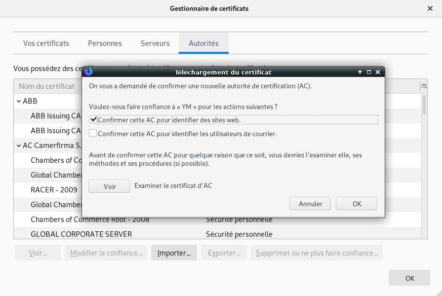
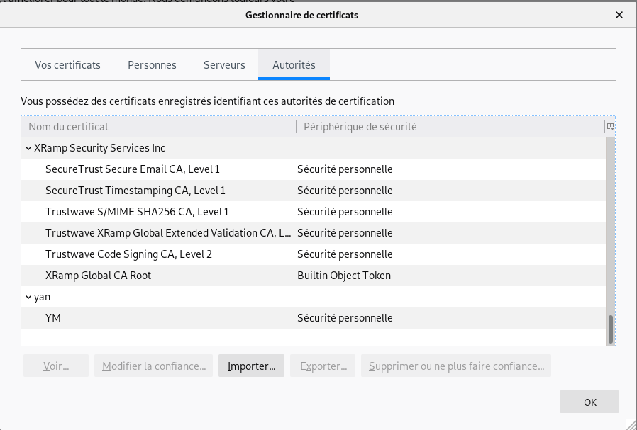

+++
title = 'Autorité de certification et authentification par certificat client (OpenSSL,nginx)'
date = 2020-05-28 00:00:00 +0100
categories = ['ssl']
+++
# Autorité de certification et certificats OpenSSL

* [Autorité de certification et certificats OpenSSL (article original)](https://www.admin-linux.fr/autorite-de-certification-et-certificats-openssl/)
* [Authentication using HTTPS client certificates](https://medium.com/@sevcsik/authentication-using-https-client-certificates-3c9d270e8326)


## Création d’une autorité de certification

Cette autorité de certification est la base de la chaine de certification. Il s’agit, ni plus ni moins, que d’un certificat x509 (auto signé) et d’une arborescence de gestion des certificats. Le certificat racine doit être protégé par un mot de passe et disposer d’une durée de validité non nulle.

La procédure de création d’une autorité de certification avec OpenSSL est grandement simplifiée par les scripts perl et bash « CA.XX » fournit dans les pacquages d’OpenSSL. En fonction des distributions, vous les trouverez dans « /usr/lib/ssl/misc/ », dans « /usr/local/ssl/misc/ », dans « **/etc/ssl/misc/** », ou dans « /etc/openssl/misc ». Ces scripts font la même choses, ils sont juste scriptés dans un langage différent.

Les paramètres de création de l’autorité de certification sont déclarées dans le script « CA.xx » et dans le fichier de configuration de « openssl.cnf ».

Par défaut, l’arborescence de l’autorité de certification est créée sous « ./demoCA » mais cela peut être changé dans le fichier de configuration et dans le script de création de l’autorité.

```bash
sudo -s
pwd
/etc/ssl
tree
.
|-- misc
|   |-- CA.pl
|   |-- CA.sh
|   |-- c_hash
|   |-- c_info
|   |-- c_issuer
|   `-- c_name
`-- openssl.cnf
 
1 directory, 7 files
```

Par exemple pour créer une autorité de certification basée sur un certificat ayant une durée de validité de 10 ans dont la racine est « /etc/ssl/CertificateAuthority » , modifier les variables  » CADAYS » et « CATOP » dans le fichier du script « **/etc/ssl/misc/CA.pl** » ou « CA.sh »   

```perl
my $CADAYS = "-days 3650";	# 10 years
my $CATOP = "/etc/ssl/CertificateAuthority";
```

ainsi que la valeur de « dir » dans « **/etc/ssl/openssl.cnf** »  

```
[ CA_default ]

dir		= /etc/ssl/CertificateAuthority		# Where everything is kept
```

avant de lancer « /chemin/vers/CA.xx -newca » :

    /etc/ssl/misc/CA.pl -newca

```bash
CA certificate filename (or enter to create)

Making CA certificate ...
====
openssl req  -new -keyout /etc/ssl/CertificateAuthority/private/cakey.pem -out /etc/ssl/CertificateAuthority/careq.pem 
Generating a RSA private key
....................................................+++++
.+++++
writing new private key to '/etc/ssl/CertificateAuthority/private/cakey.pem'
Enter PEM pass phrase:
Verifying - Enter PEM pass phrase:
-----
You are about to be asked to enter information that will be incorporated
into your certificate request.
What you are about to enter is what is called a Distinguished Name or a DN.
There are quite a few fields but you can leave some blank
For some fields there will be a default value,
If you enter '.', the field will be left blank.
-----
Country Name (2 letter code) [AU]:FR
State or Province Name (full name) [Some-State]:Pays-De-Loire
Locality Name (eg, city) []:SMM
Organization Name (eg, company) [Internet Widgits Pty Ltd]:yan
Organizational Unit Name (eg, section) []:dom
Common Name (e.g. server FQDN or YOUR name) []:YM
Email Address []:admin@cinay.xyz

Please enter the following 'extra' attributes
to be sent with your certificate request
A challenge password []:
An optional company name []:
==> 0
====
====
openssl ca  -create_serial -out /etc/ssl/CertificateAuthority/cacert.pem -days 3650 -batch -keyfile /etc/ssl/CertificateAuthority/private/cakey.pem -selfsign -extensions v3_ca  -infiles /etc/ssl/CertificateAuthority/careq.pem
Using configuration from /etc/ssl/openssl.cnf
Enter pass phrase for /etc/ssl/CertificateAuthority/private/cakey.pem:
Check that the request matches the signature
Signature ok
Certificate Details:
        Serial Number:
            7e:22:56:d6:e6:90:67:7e:0d:b5:80:f0:62:af:4e:20:e3:29:d9:f1
        Validity
            Not Before: Jul  3 14:02:53 2019 GMT
            Not After : Jun 30 14:02:53 2029 GMT
        Subject:
            countryName               = FR
            stateOrProvinceName       = Pays-De-Loire
            organizationName          = yan
            organizationalUnitName    = dom
            commonName                = YM
            emailAddress              = admin@cinay.xyz
        X509v3 extensions:
            X509v3 Subject Key Identifier: 
                61:D3:36:38:72:51:5C:D7:0F:53:D9:DB:3C:9F:BF:1B:02:F0:1A:73
            X509v3 Authority Key Identifier: 
                keyid:61:D3:36:38:72:51:5C:D7:0F:53:D9:DB:3C:9F:BF:1B:02:F0:1A:73

            X509v3 Basic Constraints: critical
                CA:TRUE
Certificate is to be certified until Jun 30 14:02:53 2029 GMT (3650 days)

Write out database with 1 new entries
Data Base Updated
==> 0
====
CA certificate is in /etc/ssl/CertificateAuthority/cacert.pem
```

Qui aura pour effet de créer l’arborescence suivante :

    tree /etc/ssl/CertificateAuthority/

```bash
/etc/ssl/CertificateAuthority/
├── cacert.pem
├── careq.pem
├── certs
├── crl
├── crlnumber
├── index.txt
├── index.txt.attr
├── index.txt.old
├── newcerts
│   └── 7E2256D6E690677E0DB580F062AF4E20E329D9F1.pem
├── private
│   └── cakey.pem
└── serial

4 directories, 9 files
```

Où :

* **cacert.pem** est la clé publique de votre autorité de certification ;
* **private/cakey.pem** est la clé privée ;
* **index.txt** est le fichier d’index conservant l’association certificat/propriétaire ;
* **index.txt.attr** est le fichier d’option des indexes ;
* **serial** est le numéro du prochain certificat créé ;
* **certs** est le répertoire des certificats signés et de leurs hash associé.

>**Note sur le répertoire « certs »**  
Afin de pouvoir vérifier une chaine de certification, on crée dans le répertoire « certs » un lien symbolique pointant vers les certificats signés par la chaine de certification. Ce lien à pour nom « hash.0 » où « hash » est le hachage du « DN » (Dir Name de la forme /C=FR/ST=Ile-De-France/L=Paris/O=Admin Linux/OU=Service Informatique/CN=Marc Dupond/emailAddress=marc.dupond@admin-linux.fr) du certificat.

Le « hash » du certificat est retourné par :

    openssl x509 -hash -noout -in certif.{pem,crt}

Dans l’exemple ci dessus nous obtenons :

    openssl x509 -hash -noout -in CertificateAuthority/cacert.pem 
        ecd697ae

et créons donc le lien « /etc/ssl/CertificateAuthority/certs/ecd697ae.0 » pointant vers « /etc/ssl/CertificateAuthority/cacert.pem »

    ln -s /etc/ssl/CertificateAuthority/cacert.pem /etc/ssl/CertificateAuthority/certs/ecd697ae.0

>**Note sur les informations des certificats**  
ATTENTION : Par défaut, la signature de plusieurs certificats créés avec EXACTEMENT LES MÊMES PARAMÈTRES de sujet (countryName, stateOrProvinceName, organizationName, organizationalUnitName, commonName, emailAddress) n’est pas autorisé !

Pour des certificats machine, il est d’usage que le « commonName » désigne le nom de la machine (souvent dans son entier nom.domaine) tandis que pour les utilisateurs ils désigne leurs « Prénom NOM ».

Si toutefois vous devez impérativement créer deux certificats ayant le même sujet (même DN), passez la valeur « unique_subject » à « no » dans le fichier « index.txt.attr » de votre autorité de certification.

Sans cette modification, vous obtiendrez l’erreur suivante au moment de signer le certificat :

```
Certificate is to be certified until Oct 21 15:36:37 2010 GMT (365 days)
Sign the certificate? [y/n]:y
 
failed to update database
TXT_DB error number 2
```

## Création d’un certificat

Dans le dossier /etc/ssl/CertificateAuthority en mode su

Pour générer une clé SSL utilisable par un service tel qu’Apache, nginx ou autre, deux alternatives (RSA ou ECC)

RSA -générer la clé privée:

    openssl genrsa -out admin-linux.key 4096

```
Generating RSA private key, 4096 bit long modulus
..................... . . . ...........++
..................... . . . .......................++
e is 65537 (0x10001)
```

Note : l’option « -des3 », « -aes128 », etc, lors de la génération de la clé privée permet de spécifier un mot de passe pour l’utilisation de la clé. Ce mot de passe sera demandé à chaque démarrage du service.

ECC -générer la clé privée  (OpenSSL >= 1.0.1g)

    openssl ecparam -out admin-linux.key -name prime256v1 -genkey 


A partir de cette clé, création de la demande de signature qui sera transmise à l’autorité de certification :

    openssl req -key admin-linux.key -new -out admin-linux.csr -days 365  # RSA
    openssl req -new -key admin-linux.key -out admin-linux.csr -sha256    # ECC

```
You are about to be asked to enter information that will be incorporated
into your certificate request.
What you are about to enter is what is called a Distinguished Name or a DN.
There are quite a few fields but you can leave some blank
For some fields there will be a default value,
If you enter '.', the field will be left blank.
-----
Country Name (2 letter code) [AU]:FR
State or Province Name (full name) [Some-State]:Pays-De-Loire
Locality Name (eg, city) []:SMM
Organization Name (eg, company) [Internet Widgits Pty Ltd]:yan
Organizational Unit Name (eg, section) []:Dom
Common Name (e.g. server FQDN or YOUR name) []:Yannick M      
Email Address []:yannick@cinay.xyz

Please enter the following 'extra' attributes
to be sent with your certificate request
A challenge password []:
An optional company name []:
```

Vérifier
     ls
        admin-linux.csr  admin-linux.key

Enfin, génération du certificat proprement dit :

    openssl req -x509 -in admin-linux.csr -key admin-linux.key > admin-linux.crt

Les informations du certificat peuvent être lues via la commande suivante :

    openssl x509 -text -in admin-linux.crt -noout

```
Certificate:
    Data:
        Version: 3 (0x2)
        Serial Number:
            19:6e:58:dc:31:00:26:af:a5:3b:80:f0:e9:e2:44:64:5a:1d:6f:10
        Signature Algorithm: ecdsa-with-SHA256
        Issuer: C = FR, ST = Pays-De-Loire, L = SMM, O = yan, OU = Dom, CN = Yannick M, emailAddress = yannick@cinay.xyz
        Validity
            Not Before: Jul  3 14:53:56 2019 GMT
            Not After : Aug  2 14:53:56 2019 GMT
        Subject: C = FR, ST = Pays-De-Loire, L = SMM, O = yan, OU = Dom, CN = Yannick M, emailAddress = yannick@cinay.xyz
        Subject Public Key Info:
            Public Key Algorithm: id-ecPublicKey
                Public-Key: (256 bit)
                pub:
                    04:8a:ba:14:06:d3:5b:62:ad:8e:01:af:ea:1d:f6:
                    d9:cf:58:33:62:6f:6d:c7:78:e4:53:9f:87:72:7c:
                    71:dc:cd:77:3b:11:1d:d5:d6:f6:cb:87:ff:3a:f8:
                    67:7d:cd:13:1d:2d:fd:85:c1:b1:a8:3c:16:a4:5d:
                    57:81:10:1c:e4
                ASN1 OID: prime256v1
                NIST CURVE: P-256
        X509v3 extensions:
            X509v3 Subject Key Identifier: 
                F2:B6:29:B4:B4:12:D0:78:CC:75:8D:06:78:23:B2:91:FB:31:E9:D8
            X509v3 Authority Key Identifier: 
                keyid:F2:B6:29:B4:B4:12:D0:78:CC:75:8D:06:78:23:B2:91:FB:31:E9:D8

            X509v3 Basic Constraints: critical
                CA:TRUE
    Signature Algorithm: ecdsa-with-SHA256
         30:46:02:21:00:e2:77:1c:93:94:30:d4:65:c9:6d:85:02:8e:
         bb:e6:a7:bd:d7:78:e2:dd:4d:b6:f9:bb:32:a5:05:e0:0f:67:
         1b:02:21:00:83:64:e2:62:bc:3c:99:06:6d:fe:a5:6b:b1:de:
         ab:dc:d7:45:3f:62:f4:f8:77:88:d9:f9:06:56:cd:e2:e4:71
```

## Signature d’un certificat

Récapitulons :

* dans un premier temps, nous avons créé une autorité de certification ;
* ensuite, nous avons généré un certificat SSL valide et prêt à être signé.

L’objectif est maintenant de signer le certificat avec l’autorité de certification précédemment créé. Pour cela lancer la commande suivante (en remplaçant par vos paramètres les paramètres de l’exemple) :

    openssl ca -policy policy_anything -out admin-linux.crt -infiles admin-linux.csr

```
Using configuration from /etc/ssl/openssl.cnf
Enter pass phrase for /etc/ssl/CertificateAuthority/private/cakey.pem:
Check that the request matches the signature
Signature ok
Certificate Details:
        Serial Number:
            7e:22:56:d6:e6:90:67:7e:0d:b5:80:f0:62:af:4e:20:e3:29:d9:f2
        Validity
            Not Before: Jul  3 15:01:37 2019 GMT
            Not After : Jul  2 15:01:37 2020 GMT
        Subject:
            countryName               = FR
            stateOrProvinceName       = Pays-De-Loire
            localityName              = SMM
            organizationName          = yan
            organizationalUnitName    = Dom
            commonName                = Yannick M
            emailAddress              = yannick@cinay.xyz
        X509v3 extensions:
            X509v3 Basic Constraints: 
                CA:FALSE
            Netscape Comment: 
                OpenSSL Generated Certificate
            X509v3 Subject Key Identifier: 
                F2:B6:29:B4:B4:12:D0:78:CC:75:8D:06:78:23:B2:91:FB:31:E9:D8
            X509v3 Authority Key Identifier: 
                keyid:61:D3:36:38:72:51:5C:D7:0F:53:D9:DB:3C:9F:BF:1B:02:F0:1A:73

Certificate is to be certified until Jul  2 15:01:37 2020 GMT (365 days)
Sign the certificate? [y/n]:y


1 out of 1 certificate requests certified, commit? [y/n]y
Write out database with 1 new entries
Data Base Updated
```

**Rappel :** si vous rencontrez à cette étape une erreur du type :

```
failed to update database
TXT_DB error number 2
```

C’est probablement que vous tentez de signer un certificat créé avec le même « Subject » (ou DN) qu’un autre. Voir Note sur les informations des certificats pour plus de détails.

OpenSSL demande le mot de passe de l’autorité de certification puis après vérification affiche le détail du certificat à signer. Le système nous avertis alors que le certificat va être validé pour une durée de 365 jours et demande confirmation. Une fois le certificat signé, il est ajouté à la base des certificats gérés par l’autorité de certification.

En jetant un œil aux fichiers d’index du CA, on peut lire le numéro correspondant aux certificats géré :

    cat /etc/ssl/CertificateAuthority/index.txt

```
V	290630140253Z		7E2256D6E690677E0DB580F062AF4E20E329D9F1	unknown	/C=FR/ST=Pays-De-Loire/O=yan/OU=dom/CN=YM/emailAddress=admin@cinay.xyz
V	200702150137Z		7E2256D6E690677E0DB580F062AF4E20E329D9F2	unknown	/C=FR/ST=Pays-De-Loire/L=SMM/O=yan/OU=Dom/CN=Yannick M/emailAddress=yannick@cinay.xyz
```

et constater que le certificat que nous venons de signer à bien été ajouté à la liste. De même, le numéro de série du prochain certificat à bien été incrémenté :

    cat /etc/ssl/CertificateAuthority/serial
        7E2256D6E690677E0DB580F062AF4E20E329D9F3

## Diffuser sa chaine d’authentification

Tous fonctionne pour le moment pour le mieux, mais lors de la connexion à un site utilisant un certificat auto signé ou signé par une autorité de certification non officielle, un avertissement sera affiché à l’utilisateur.

Cela est dû au fait que votre Autorité de Certification n’est pas connue par les navigateurs Web du marché (à moins que vous ne vous appeliez VeriSign ou quelque chose du genre).

Pour résoudre ce problème, vous pouvez diffuser votre chaîne de certification via un site internet. Copiez, ou vous le souhaitez sur votre site web le certificat « **cacert.pem** » en « **cacert.crt** ».

### Navigateur 

**Firefox**  
Préférences &rarr;Vie privée et sécurité &rarr; Certificats &rarr; Afficher les certificats  
Ongle "Autorités" et Importer

{:width="600"}

Dès que l’autorité de certification est ajoutée, le navigateur internet reconnais le certificat lors de son passage sur vos page. Les détails sur l’autorité de certification sont consultable via la liste des autorité racines comme présenté sur cette capture d’écran réalisée sous firefox 3.X :

{:width="600"}

**en ligne de commande**   
Les navigateurs Web comme Firefox, Chromium, Google Chrome, Vivaldi et même les clients de messagerie comme Mozilla Thunderbird n'utilisent pas le magasin de confiance du système d'exploitation, mais utilisent leur propre magasin de confiance de certificat. Ces magasins de clés de confiance sont des fichiers du répertoire utilisateur, nommés «cert8.db» et «cert9.db» (pour les versions plus récentes). Vous pouvez modifier les fichiers du magasin de clés certifiées à l'aide de l'outil «certutil».  
Pour installer **certutil** 

    sudo apt install libnss3-tools 

Ce petit script d'aide trouve les bases de données du magasin de confiance et importe le nouveau certificat racine dans celles-ci.

```
#!/bin/bash

### Script installs root.cert.pem to certificate trust store of applications using NSS
### (e.g. Firefox, Thunderbird, Chromium)
### Mozilla uses cert8, Chromium and Chrome use cert9

###
### Requirement: apt install libnss3-tools
###


###
### CA file to install (CUSTOMIZE!)
###

certfile="root.cert.pem"
certname="My Root CA"


###
### For cert8 (legacy - DBM)
###

for certDB in $(find ~/ -name "cert8.db")
do
    certdir=$(dirname ${certDB});
    certutil -A -n "${certname}" -t "TCu,Cu,Tu" -i ${certfile} -d dbm:${certdir}
done


###
### For cert9 (SQL)
###

for certDB in $(find ~/ -name "cert9.db")
do
    certdir=$(dirname ${certDB});
    certutil -A -n "${certname}" -t "TCu,Cu,Tu" -i ${certfile} -d sql:${certdir}
done
```

Après l'exécution de ce script, votre autorité de certification racine doit être connue de Firefox, Chrome, Chromium et d'autres navigateurs. 

### Sur un serveur Linux

Dans la plupart des cas, il n'est pas conseillé d'exécuter une propre autorité de certification (autorité de certification) sauf si vous souhaitez sécuriser des services internes et l'utilisation de votre propre autorité de certification peut être nécessaire.  
Le certificat racine doit être importé sur tous les serveurs qui utilisent l'accès par certificat client. 

Se connecter sur le serveur  
Importer le certificat (autorité de certification) extension .pem ou .crt (si .pem le renommer en .crt)  
Copier le fichier dans **/usr/local/share/ca-certificates/extra/** (extension .crt obligatoire)

```
sudo mkdir -p /usr/local/share/ca-certificates/extra
sudo mv *.crt /usr/local/share/ca-certificates/extra
sudo update-ca-certificates
```

Après ces étapes, la nouvelle autorité de certification est connue des utilitaires "système" comme curl et wget 


## Questions diverses

### Comment vérifier la signature d’un certificat ?

Afin de vérifier la validité du certificat, nous faisons appel à l’option « verify » d' »openssl » soit en lui précisant le la clé publique de l’autorité de certification :

    openssl verify -CAfile /etc/ssl/CertificateAuthority/cacert.pem /etc/ssl/CertificateAuthority/admin-linux.crt
        /etc/ssl/CertificateAuthority/admin-linux.crt: OK

ou le répertoire des hash de certificat :

    openssl verify -CApath /etc/ssl/CertificateAuthority/certs /etc/ssl/CertificateAuthority/admin-linux.crt
        /etc/ssl/CertificateAuthority/admin-linux.crt: OK

### Comment tester un certificat ?

Vous pouvez tester le certificat depuis généré et signé depuis un navigateur web avec l’option « s_server » d’OpenSSL :

```
sudo -s
cd /etc/ssl/CertificateAuthority/
cat admin-linux.crt > admin-linux.pem
cat admin-linux.key >> admin-linux.pem
# lancement serveur
openssl s_server -cert admin-linux.pem
```

puis, depuis un navigateur internet, rendez vous sur https://localhost:4433. Vous pouvez alors examiner le certificat qui vous est proposé via votre browser.

### Comment s’informer sur un certificat ?

Les différentes informations concernant un certificat peuvent être retrouvées via ses champs x509. Nous retrouvons ainsi :

ses dates de validité :

    openssl x509 -noout -dates -in /etc/ssl/CertificateAuthority/admin-linux.pem 

```
notBefore=Jul  3 15:01:37 2019 GMT
notAfter=Jul  2 15:01:37 2020 GMT
```

son DN (ou sujet) :

    openssl x509 -noout -subject -in /etc/ssl/CertificateAuthority/admin-linux.pem 
        subject=C = FR, ST = Pays-De-Loire, L = SMM, O = yan, OU = Dom, CN = Yannick M, emailAddress = yannick@cinay.xyz

l’autorité de certification l’ayant signé :

    openssl x509 -noout -issuer -in /etc/ssl/CertificateAuthority/admin-linux.pem 
        issuer=C = FR, ST = Pays-De-Loire, O = yan, OU = dom, CN = YM, emailAddress = admin@cinay.xyz

### Comment télécharger un certificat ?

Un certificat peut être récupéré via l’option « s_client » d’OpenSSL (comme dans cet exemple sur le webmail de Yahoo) :

    echo | openssl s_client -connect login.yahoo.com:443 2> /dev/null

```
CONNECTED(00000003)
---
Certificate chain
 0 s:C = US, ST = California, L = Sunnyvale, O = Oath Inc, CN = *.login.yahoo.com
   i:C = US, O = DigiCert Inc, OU = www.digicert.com, CN = DigiCert SHA2 High Assurance Server CA
 1 s:C = US, O = DigiCert Inc, OU = www.digicert.com, CN = DigiCert SHA2 High Assurance Server CA
   i:C = US, O = DigiCert Inc, OU = www.digicert.com, CN = DigiCert High Assurance EV Root CA
---
Server certificate
-----BEGIN CERTIFICATE-----
ThrsYuChLcs9s3Hc3WpJyeo/ldVl/wgvv9+z44zzCMsaqP45VAphRJfiSY968uwe
akegwmtcSPhrgijsHtGF1xQZFgMLJlTVM+ngbEsIoSg9HbPr7CEuW4EuPmyGedla
n7x5LU5rlsZ0gKwCpj29gZwcWpZLZQfiX3iSG1ua51uEpoVViLwsjqY4xnNDvNxZ
wg==
-----END CERTIFICATE-----
subject=C = US, ST = California, L = Sunnyvale, O = Oath Inc, CN = *.login.yahoo.com

issuer=C = US, O = DigiCert Inc, OU = www.digicert.com, CN = DigiCert SHA2 High Assurance Server CA

---
No client certificate CA names sent
Peer signing digest: SHA512
Peer signature type: RSA
Server Temp Key: ECDH, P-256, 256 bits
---
SSL handshake has read 4507 bytes and written 443 bytes
Verification: OK
---
New, TLSv1.2, Cipher is ECDHE-RSA-AES128-GCM-SHA256
Server public key is 2048 bit
Secure Renegotiation IS supported
Compression: NONE
Expansion: NONE
No ALPN negotiated
SSL-Session:
    Protocol  : TLSv1.2
    Cipher    : ECDHE-RSA-AES128-GCM-SHA256
    Session-ID: D773AED34239C252885A2BD79BC9898020F8E9CF9BBB9874E3F8A5A9711563E5
    Session-ID-ctx: 
    Master-Key: 6D1DFFA3BF1FA5B4E841AB5971EEB49F938670DB238726B536CC7CEE25C11442F36FCF0B7957A42CF9293026B89701CE
    PSK identity: None
    PSK identity hint: None
    SRP username: None
    TLS session ticket lifetime hint: 7200 (seconds)
    TLS session ticket:
    0000 - 5c e5 c3 c1 05 75 42 25-be c4 83 c0 f5 c7 ae 33   \....uB%.......3
    0010 - 69 ef 28 d3 cc 15 56 ab-63 27 82 74 21 f5 ad e5   i.(...V.c'.t!...
    0020 - 42 f3 7b 3e 55 7f 2f 90-ca 9b aa 32 16 28 0b 9d   B.{>U./....2.(..
    0030 - 0f ba 06 95 41 1b 77 52-d9 c8 86 08 46 11 7c db   ....A.wR....F.|.
    0040 - 5c c5 14 c3 5f 8c b0 98-3b 03 b3 ea 47 af 94 31   \..._...;...G..1
    0050 - b3 02 91 a7 09 72 7e 0d-a3 18 65 76 17 ca 30 d9   .....r~...ev..0.
    0060 - e8 c6 69 aa 90 d1 08 25-be 41 97 15 84 9c b2 d4   ..i....%.A......
    0070 - fd 19 2f 27 f0 b0 6d 30-37 71 9e 1b 0d 74 07 95   ../'..m07q...t..
    0080 - 2b 22 cf 84 58 19 d7 1c-e4 7d 41 6c c0 5e 30 95   +"..X....}Al.^0.
    0090 - 50 2c 9e e5 34 eb 6a 28-83 4c 64 4c ee 09 13 6d   P,..4.j(.LdL...m
    00a0 - d5 17 fe 95 43 a3 01 57-eb a7 2a 3c 62 86 a6 f7   ....C..W..*<b...
    00b0 - f8 c8 9f ef 8f 73 23 98-bc d2 0a 6f 55 3a 16 8b   .....s#....oU:..
    00c0 - 88 1c 0c 95 5a cb 7a 96-7a 13 b3 b5 bb cf 44 69   ....Z.z.z.....Di

    Start Time: 1562167944
    Timeout   : 7200 (sec)
    Verify return code: 0 (ok)
    Extended master secret: no
---
```

ou, juste pour obtenir le certificat :

    echo | openssl s_client -connect login.yahoo.com:443 2> /dev/null |sed -ne '/-BEGIN CERTIFICATE-/,/-END CERTIFICATE-/p'  > login.yahoo.com.crt
    openssl x509 -noout -dates -in login.yahoo.com.crt

```
notBefore=Apr 25 00:00:00 2019 GMT
notAfter=Oct 22 12:00:00 2019 GMT
```

### Comment révoquer un certificat ?

Dans la configuration par défaut, openssl conservera des copies de tous les certificats signés dans **/etc/ssl/CertificateAuthority/newcerts**, nommés par leur numéro d'index. Donc visualiser le fichier **/etc/ssl/CertificateAuthority/index.txt** pour obtenir le numéro de série de la clé à révoquer

    cat /etc/ssl/CertificateAuthority/index.txt

```
V	210316172023Z		6630E893DDE59EF7314A76C8E9BD19BA2CC3F610	unknown	/C=AU/ST=Some-State/O=Internet Widgits Pty Ltd/CN=CA_UN
V	210316172558Z		6630E893DDE59EF7314A76C8E9BD19BA2CC3F611	unknown	/C=AU/ST=Some-State/O=Internet Widgits Pty Ltd/CN=CA_DEUX
```

par exemple F610, puis exécuter la commande suivante :

    openssl ca -revoke /etc/ssl/CertificateAuthority/newcerts/6630E893DDE59EF7314A76C8E9BD19BA2CC3F610.pem

```
Using configuration from /usr/lib/ssl/openssl.cnf
Enter pass phrase for /etc/ssl/CertificateAuthority/private/cakey.pem: # Mot de passe à saisir
Revoking Certificate 6630E893DDE59EF7314A76C8E9BD19BA2CC3F610.
Data Base Updated
```

Dans le fichier **/etc/ssl/CertificateAuthority/index.txt** , la ligne débute par un R (revoked)

```
R	210316172023Z		6630E893DDE59EF7314A76C8E9BD19BA2CC3F610	unknown	/C=AU/ST=Some-State/O=Internet Widgits Pty Ltd/CN=CA_UN
```

>Les fichiers -keyfile et -cert mentionnés dans la [réponse de Nilesh](https://stackoverflow.com/a/9517132/321973) ne sont requis que si cela diffère de vos paramètres openssl.cnf.


# Authentification par certificat client

### Qu'est-ce qu'un certificat client?

Un certificat côté client est un mécanisme d'authentification de la couche de transport. il peut être utilisé pour vérifier un utilisateur avant la couche d'application. En termes d'application Web, cela se produit au niveau du «S» de «HTTPS»: le client est authentifié lors de l'établissement de la négociation TLS, et non au niveau de la couche HTTP tunnelée via la connexion sécurisée.

L' article de [Wikipedia sur TLS](https://en.wikipedia.org/wiki/Transport_Layer_Security#Client-authenticated_TLS_handshake) l' explique mieux que jamais. Mais la chose importante à comprendre est que, si elle est correctement effectuée, votre application peut supposer que les informations qu’elle reçoit proviennent d’une personne déjà authentifiée. Dans mon cas, l'application ne s'intéresse pas à cela: nous l'utilisons simplement pour nous assurer que seuls les périphériques que j'autorise peuvent accéder à l'application.

Pour cette raison, cet article ne couvre que la partie «l’appareil peut accéder à l’application ou site»; L'utilisation de cette méthode pour effectuer une authentification complète peut être traitée dans un article ultérieur.

## Opérations à réaliser sur un serveur linux
 
### Création de l'autorité de certification

Tout d'abord, vous devez créer une clé pour votre autorité de certification (CA); cette clé sera utilisée pour créer le certificat côté serveur et signera toutes les demandes de certificat client. C'est-à-dire: c'est le «mot de passe» principal pour tout le système. Générez-en un et protégez-le.

    openssl genrsa -des3 -out ca.key 4096
 

Vous serez invité à chiffrer la clé avec une phrase secrète. N'oubliez pas de le noter, car on vous le demandera chaque fois que vous créez un nouveau certificat ou signez une demande de certificat client.

### Créer un certificat de CA

Créez ensuite un certificat de CA. c'est le certificat côté serveur qui sera envoyé via le serveur TLS au client. Notez que ce certificat est spécifique aux certificats côté client et ne remplace pas votre certificat typique nécessaire à l'authentification HTTPS. nous y reviendrons plus tard.

```
# sign a certificate for 365 days; replace that number with whatever's
# suitable for your application
openssl req -new -x509 -days 365 -key ca.key -out ca.crt
```

On vous posera un certain nombre de questions. voici ce que j'ai trouvé:

*    Notez ce que vous avez entré pour Pays, État, Localité et Organisation; vous souhaiterez que ces éléments correspondent ultérieurement lorsque vous renouvelez le certificat.
*    N'entrez pas de nom commun (CN) pour le certificat; Je ne sais pas pourquoi, mais j'ai eu des problèmes quand je suis entré dans un.
*    Le courrier électronique peut être omis. 

Le renouvellement d'un certificat nécessite simplement d'exécuter la même commande. générer un nouveau certificat. Si vous avez besoin de voir ce que vous avez entré dans l'ancien certificat, vous pouvez exécuter:

    openssl x509 -in ca.crt -noout -text

Ceci listera toutes les informations sur le certificat, y compris les valeurs mentionnées ci-dessus.

### Création d'un certificat client

Ensuite, un certificat client sera créé. c'est à vous de décider comment vous souhaitez les gérer, mais souvenez-vous qu'il s'agit en réalité d'un mot de passe. Si vous souhaitez le «modifier», vous devez révoquer le certificat. Alors, réfléchissez à la manière dont vous souhaitez gérer votre authentification: par utilisateur, par périphérique?

Vous voudrez d’abord une clé client; ceci est généré de la même manière que la clé de certificat; vous pouvez même utiliser celui-là (mais pas). En règle générale, si vous avez plusieurs utilisateurs, les deux étapes suivantes sont celles que vous leur demandez de faire: créer une demande de signature de certificat pour vous signer.

### Utilisateurs: créer une clé et une demande de signature de certificat

Créez une clé RSA, si vous n'en avez pas déjà une:

    openssl genrsa -des3 -out user.key 4096

Ensuite, créez une demande de signature de certificat (CSR)

    openssl req -new -key user.key -out user.csr

Un certain nombre de questions seront posées. répondez à chacune d’elles, y compris le nom usuel et l’adresse électronique. Le CSR créé sera envoyé à l'autorité de certification (un administrateur, mais dans ce cas probablement aussi vous-même) pour signature.

### Signer un CSR

Un CSR doit maintenant être signé par le CA; c'est ce que dit le CA: "Je connais cette personne ou cet appareil: ils sont ce qu'ils prétendent être."

```
# sign the csr to a certificate valid for 365 days
openssl x509 -req -days 365 -in user.csr -CA ca.crt -CAkey ca.key -set_serial 01 -out user.crt
```

Vous voudrez généralement incrémenter le numéro de série à chaque signature. Une fois le certificat expiré, il n'est pas nécessaire de recréer un nouveau CSR. le même peut être signé, ce qui créera un nouveau certificat lié à cette clé publique.

Le certificat signé serait renvoyé à l'utilisateur avec le certificat de l'autorité de certification (pas la clé privée!), Pour installation sur leur appareil.

### Création d'un PKCS #12 (PFX)

Maintenant, le certificat signé doit pouvoir être installé sur un périphérique de manière à regrouper les clés client et le certificat. L’archive résultante est en réalité un mot de passe, elle doit donc être gardée aussi sûre que les autres clés privées.

Pour créer le pfx:

    openssl pkcs12 -export -out user.pfx -inkey user.key -in user.crt -certfile ca.crt

Il vous sera demandé de fournir un «mot de passe d'exportation». Il est fortement recommandé de le définir, car vous devrez souvent transférer l'archive PFX sur un périphérique tel que votre téléphone. vous ne voulez pas que cette séance dans votre email sans un mot de passe.

L'archive PFX peut maintenant être importée dans votre navigateur Web. C'est plutôt chouette! Vous pouvez voir comment un processus comme celui-ci peut être utilisé pour prouver l'identité et créer un accès valide pour un utilisateur, sans que l'administrateur (CA) ou l'utilisateur ne révèle sa clé privée à un autre.

Voyons maintenant comment configurer nginx pour l’authentification de certificat, avec un proxy inverse pour notre application non authentifiée.

## nginx - accès par certificat client

[Authentification par certificat client sur nginx](https://geekeries.org/2019/06/authentification-par-certificat-client-sur-nginx/)

### Limiter l’accès par certificat à certains utilisateurs

Un nginx.conf minimal pour accès par certificat client 

```
user www-data;
worker_processes auto;
pid /run/nginx.pid;
include /etc/nginx/modules-enabled/*.conf;

events {
	worker_connections 768;
}

http {
  server_names_hash_bucket_size 64;

	##
	# Basic Settings
	##

	sendfile on;
	tcp_nopush on;
	tcp_nodelay on;
	keepalive_timeout 65;
	types_hash_max_size 2048;
	# server_tokens off;

	include /etc/nginx/mime.types;
	default_type application/octet-stream;


	##
	# Logging Settings
	##

	access_log /var/log/nginx/access.log;
	error_log /var/log/nginx/error.log;

	##
	# Gzip Settings
	##

	gzip on;
	gzip_disable "msie6";

        ##
        # Authentification par certificat client
        # limité à certains utilisateurs
        ##

        map $ssl_client_s_dn $ssl_access {
            default 0;
            "~CN=Utilisateur A" 1;
	        "~CN=Utilisateur B" 1;
            "~CN=Jean Dupondt Stagiaire" 1;
            # etc.
        }

	##
	# Virtual Host Configs
	##

	include /etc/nginx/conf.d/*.conf;
}
```

Ajouter dans les fichiers de configuration des "Virtual Hosts" concernés

Modifier le chemin du fichier de l'autorité de certification `ssl_client_certificate /etc/ssl/CertificateAuthority/cacert.pem;` si besoin

```
# Certificat client 
ssl_client_certificate /etc/ssl/CertificateAuthority/cacert.pem; 
# rendre la vérification optionnelle
# afin de pouvoir afficher un message 403 
# à ceux qui échouent à l'authentification
ssl_verify_client optional;
    if ( $ssl_access = 0 ) {
        return 403 "<h2>Zone Interdite, absence de certificat client !!!</h2>" ; # => forbidden
    }
```


Désormais, lorsque vous visiterez le serveur nginx, votre navigateur sera invité à fournir son certificat client. sélectionnez le certificat que vous avez installé et vous devriez être mandaté par le serveur en amont. Si vous visitez un navigateur sans certificat client installé, vous devriez voir un 403 sans aucune sorte d'invite.

### Gérer des accès par zones

Dans la solution au dessus, on a un mode on/off. Mais dans le cas ou l’on souhaite gérer des accès sur plusieurs zones, cette solution est limité. Une bonne option trouvée sur StackOverFlow de gérer des accès par zone par certificat :

```
map $ssl_client_s_dn $ssl_access {
  default "";
  "~CN=Paul BISMUTH Entreprise"  -a-b-c-;
  "~CN=Jean Dupondt Stagiaire"  -b-e-; 
  # etc.
} 
server {
  [...]
  location /admin/ {
    if ($ssl_access !~ -a-) {
      return 403;
    }
  }
  [...]
  location /interns {
    if ($ssl_access !~ -b-) {
      return 403;
    }
  }
  [...] 
 }
```

Dans l’exemple, la zone « a » du site est accessible par les admins, la zone b par les stagiaires et les admins.


## Création certificat client (procédure complète)

```
sudo -s
cd /etc/ssl/CertificateAuthority/
openssl ecparam -out yannick.key -name prime256v1 -genkey
openssl req -new -key yannick.key -out yannick.csr -sha256    # Renseigner Common Name obligatoirement
openssl req -x509 -in yannick.csr -key yannick.key > admin-linux.crt
openssl ca -policy policy_anything -out yannick.crt -infiles yannick.csr # signature , mp cakey.pem
openssl pkcs12 -export -out yannick.pfx -inkey yannick.key -in yannick.crt -certfile cacert.pem # mp yannick
cp yannick.pfx /srv/nfs/
chmod 775 /srv/nfs/yannick.pfx
```