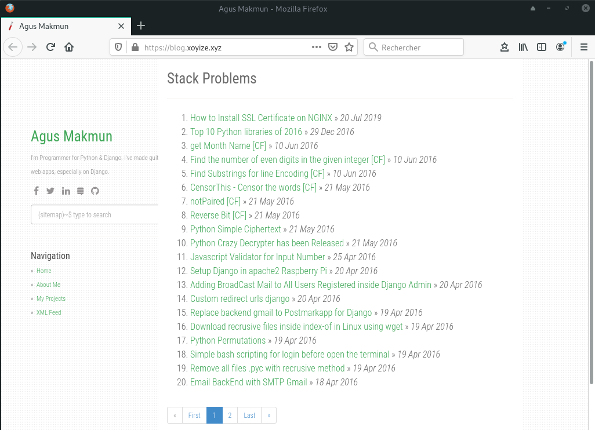

+++
title = 'Debian Ruby(rbenv)+Jekyll(générateur de site statique)'
date = 2020-07-05 00:00:00 +0100
categories = debian
+++
# Site statique avec ruby/jekyll

*ruby jekyll vhost xoyize.xyz* 

## Ruby

### Installer Ruby sur Debian en utilisant Rbenv

Rbenv est un outil léger de gestion des versions de Ruby qui vous permet de changer facilement de version de Ruby.

Par défaut, Rbenv ne gère pas l'installation des versions de Ruby. ruby-build est un outil qui vous aide à installer n'importe quelle version de Ruby dont vous pourriez avoir besoin. Il est disponible en tant que programme autonome et en tant que plugin pour rbenv.

Installez les dépendances nécessaires à l'outil ruby-build pour construire Ruby à partir des sources :

    sudo apt update
    sudo apt install git curl libssl-dev libreadline-dev zlib1g-dev autoconf bison build-essential libyaml-dev libreadline-dev libncurses5-dev libffi-dev libgdbm-dev

Ensuite, lancez la commande curl suivante pour installer les scripts rbenv et ruby-build :

    curl -sL https://github.com/rbenv/rbenv-installer/raw/master/bin/rbenv-installer | bash -

Si l'installation est réussie, le script imprimera quelque chose comme ceci :

```
Running doctor script to verify installation...
Checking for `rbenv' in PATH: not found
  You seem to have rbenv installed in `/home/dbsuser/.rbenv/bin', but that
  directory is not present in PATH. Please add it to PATH by configuring
  your `~/.bashrc', `~/.zshrc', or `~/.config/fish/config.fish'.
```

Avant de commencer à utiliser rbenv, nous devons ajouter $HOME/.rbenv/bin à notre PATH.

Si vous utilisez Bash, tapez :

    echo 'export PATH="$HOME/.rbenv/bin:$PATH"' >> ~/.bashrc
    echo 'eval "$(rbenv init -)"' >> ~/.bashrc
    source ~/.bashrc

Si vous utilisez le type Zsh :

    echo 'export PATH="$HOME/.rbenv/bin:$PATH"' >> ~/.zshrc
    echo 'eval "$(rbenv init -)"' >> ~/.zshrc
    source ~/.zshrc

Les dernières versions stables

    rbenv install -l

Maintenant que rbenv est installé sur notre système, nous pouvons facilement installer la dernière version stable de Ruby et la définir comme version par défaut avec :

    rbenv install 2.7.1
    rbenv global 2.7.1

 Vérifiez que Ruby a été correctement installé en imprimant le numéro de version :

    ruby -v

`ruby 2.7.1p83 (2020-03-31 revision a0c7c23c9c) [x86_64-linux]`

### Désinstaller ruby

Désinstallation complète de ruby 

    rbenv uninstall 2.7.1

Dans le fichier **~/.bashrc** , supprimer les 2 lignes suivantes

```
export PATH="$HOME/.rbenv/bin:$PATH"
eval "$(rbenv init -)"
```

Supprimer les dossiers

    sudo rm -r blog.dbs .bundle .gem .jekyll-cache .rbenv yanblog

## Jekyll

### Installer jekyll

* [How To Install Jekyll on Ubuntu 18.04 / Debian 10 Linux](https://computingforgeeks.com/how-to-install-jekyll-on-ubuntu-18-04/)

On va utiliser gem pour installer Jekyll et Bundler qui est un outil utilisé pour gérer les dépendances de Gem.

    which bundler

`/home/debadm/.rbenv/shims/bundler`

Installer jekyl

    gem install jekyll  # Patienter quelques minutes
    jekyll -v

`jekyll 4.1.1`

### Le dossier /srv/staticyan

Mise à jour Gemfile

    cd /srv/staticyan
    nano Gemfile  # ajout paginate ,toc ,last-modified et rouge

```
source 'https://rubygems.org'
gem "jekyll", github: "jekyll/jekyll"

group :jekyll_plugins do
  gem "pygments.rb"
  gem "jekyll-paginate"
  gem 'jekyll-toc'
  gem 'jekyll-last-modified-at'
  gem 'rouge'
end
```

Installation via bundle

    bundle install

```
...
Bundle complete! 2 Gemfile dependencies, 30 gems now installed.
Use `bundle info [gemname]` to see where a bundled gem is installed.
```

Le lancement de jekyll se fait via bundle

### La régénération progressive (Incremental regeneration)


>***WARNING : Incremental regeneration is still an experimental feature**  
 While incremental regeneration will work for the most common cases, it will not work correctly in every scenario. Please be extremely cautious when using the feature, and report any problems not listed below by [opening an issue on GitHub](https://github.com/jekyll/jekyll/issues/new).*


La régénération incrémentale permet de réduire le temps de construction en ne générant que les documents et les pages qui ont été mis à jour depuis la construction précédente. Pour ce faire, elle garde une trace des temps de modification des fichiers et des dépendances inter-documents dans le fichier de métadonnées **.jekyll-metadata**

Dans l'implémentation actuelle, la régénération incrémentielle ne génère un document ou une page que si celui-ci, ou l'une de ses dépendances, est modifié. Actuellement, les seuls types de dépendances suivis sont les includes (en utilisant la balise ) et les layouts. Cela signifie que les références simples à d'autres documents (par exemple, le cas courant d'itération sur **site.posts** dans une page de liste de messages) ne seront pas détectées comme une dépendance.

Pour remédier à certaines de ces lacunes, mettre `regenerate : true` dans le front-matter d'un document forcera Jekyll à le régénérer, qu'il ait été modifié ou non. Notez que cela ne générera que le document spécifié ; les références au contenu d'autres documents ne fonctionneront pas puisqu'ils ne seront pas re-rendus.

La régénération incrémentale peut être activée par le drapeau `--incremental` (-I en abrégé) depuis la ligne de commande ou en mettant `incremental: true` dans votre fichier de configuration.

Exemple de regénération non progressive  

    bundle exec jekyll build

```
Configuration file: /srv/basicblog/_config.yml
            Source: /srv/basicblog
       Destination: /srv/basicblog/_site
 Incremental build: enabled
      Generating... 
                    done in 23.422 seconds.
```

Exemple de regénération progressive 

    bundle exec jekyll build --incremental

```
Configuration file: /srv/basicblog/_config.yml
            Source: /srv/basicblog
       Destination: /srv/basicblog/_site
 Incremental build: enabled
      Generating... 
                    done in 0.861 seconds.
```


## Site statique

### Création d'un simple site 

Maintenant que tout est en place, nous allons ajouter un site pour Jekyll. Pour cela, nous allons utiliser la commande `jekyll new site` qui va lancer l'installation des dépendances nécessaires avec un thème Jekyll par défaut. Après une installation réussie, vous devriez voir une sortie comme :

    jekyll new blog.dbs

```
Running bundle install in /home/dbsuser/blog.dbs... 
  Bundler: Fetching gem metadata from https://rubygems.org/...........
  Bundler: Fetching gem metadata from https://rubygems.org/.
  Bundler: Resolving dependencies....
  Bundler: Using public_suffix 4.0.1
  Bundler: Using addressable 2.7.0
  Bundler: Using bundler 2.1.2
  Bundler: Using colorator 1.1.0
  Bundler: Using concurrent-ruby 1.1.5
  Bundler: Using eventmachine 1.2.7
  Bundler: Using http_parser.rb 0.6.0
  Bundler: Using em-websocket 0.5.1
  Bundler: Using ffi 1.11.3
  Bundler: Using forwardable-extended 2.6.0
  Bundler: Using i18n 1.7.0
  Bundler: Using sassc 2.2.1
  Bundler: Using jekyll-sass-converter 2.0.1
  Bundler: Using rb-fsevent 0.10.3
  Bundler: Using rb-inotify 0.10.0
  Bundler: Using listen 3.2.1
  Bundler: Using jekyll-watch 2.2.1
  Bundler: Using kramdown 2.1.0
  Bundler: Using kramdown-parser-gfm 1.1.0
  Bundler: Using liquid 4.0.3
  Bundler: Using mercenary 0.3.6
  Bundler: Using pathutil 0.16.2
  Bundler: Using rouge 3.14.0
  Bundler: Using safe_yaml 1.0.5
  Bundler: Using unicode-display_width 1.6.0
  Bundler: Using terminal-table 1.8.0
  Bundler: Using jekyll 4.0.0
  Bundler: Using jekyll-feed 0.13.0
  Bundler: Using jekyll-seo-tag 2.6.1
  Bundler: Using minima 2.5.1
  Bundler: Bundle complete! 6 Gemfile dependencies, 30 gems now installed.
  Bundler: Use `bundle info [gemname]` to see where a bundled gem is installed.
New jekyll site installed in /home/dbsuser/blog.dbs. 
```

Structure

    tree blog.dbs/

```
blog.dbs/
├── 404.html
├── about.markdown
├── _config.yml
├── Gemfile
├── Gemfile.lock
├── index.markdown
└── _posts
    └── 2019-12-21-welcome-to-jekyll.markdown
```

Pour démarrer le service web intégré de Jekyll, naviguez jusqu'au répertoire du site et démarrez le serveur web Jekyll à l'aide de la commande `jekyll serve` suivie de l'adresse IP de l'hôte à laquelle se lier.  


    # Auto génération activée (--watch) + serveur
    jekyll serve --host=0.0.0.0 --watch --source "/home/dbsuser/blog.dbs"

```
Configuration file: /home/dbsuser/blog.dbs/_config.yml
            Source: /home/dbsuser/blog.dbs
       Destination: /home/dbsuser/_site
 Incremental build: disabled. Enable with --incremental
      Generating... 
       Jekyll Feed: Generating feed for posts
                    done in 1.332 seconds.
 Auto-regeneration: enabled for '/home/dbsuser/blog.dbs'
    Server address: http://0.0.0.0:4000/
  Server running... press ctrl-c to stop.
```

Lorsque la commande jekyll serve est exécutée, Jekyll analyse la configuration et pousse les fichiers de contenu dans un répertoire appelé _site. Il sert alors le contenu de ce _site 

### Création site "yanblog" 

Créer un blog statique https://github.com/agusmakmun/agusmakmun.github.io

    cd ~
    git clone https://github.com/agusmakmun/agusmakmun.github.io.git yanblog
    cd yanblog
    rm Gemfile.lock
    bundle install

```
Fetching gem metadata from https://rubygems.org/...........
Fetching gem metadata from https://rubygems.org/.
Resolving dependencies.........................
[...]
Bundle complete! 1 Gemfile dependency, 85 gems now installed.
Use `bundle info [gemname]` to see where a bundled gem is installed.
```

Pour démarrer le service web intégré de Jekyll, naviguez jusqu'au répertoire du site et démarrez le serveur web Jekyll à l'aide de la commande `jekyll serve` suivie de l'adresse IP de l'hôte à laquelle se lier.  


    # Auto génération activée (--watch) + serveur
    bundle exec jekyll serve --host=0.0.0.0 --watch --source "/home/dbsuser/yanblog"

```
Configuration file: /home/dbsuser/yanblog/_config.yml
       Deprecation: The 'gems' configuration option has been renamed to 'plugins'. Please update your config file accordingly.
NOTE: Inheriting Faraday::Error::ClientError is deprecated; use Faraday::ClientError instead. It will be removed in or after version 1.0
Faraday::Error::ClientError.inherited called from /home/dbsuser/.rbenv/versions/2.6.5/lib/ruby/gems/2.6.0/gems/octokit-4.14.0/lib/octokit/middleware/follow_redirects.rb:14.
            Source: /home/dbsuser/yanblog
       Destination: /home/dbsuser/yanblog/_site
 Incremental build: disabled. Enable with --incremental
      Generating... 
                    done in 11.934 seconds.
 Auto-regeneration: enabled for '/home/dbsuser/yanblog'
    Server address: http://0.0.0.0:4000/
  Server running... press ctrl-c to stop.
```

Pour corriger l'erreur "Deprecation: The 'gems' configuration option has been renamed to 'plugins'" 

1.    Editer _config.yml 
2.    Chercher la ligne contenant "gems:"
3.    Remplacer "gems:" par "plugins:"

Relancer le serveur

    bundle exec jekyll serve --host=0.0.0.0 --watch --source "/home/dbsuser/yanblog"

## Serveur nginx

### Vhost sur xoyize.xyz

Pour atteindre le serveur sur la machine **dbs**, on va utiliser un proxy nginx  
Le serveur sera joignable sur le lien blog.cinay.xyz  

    sudo nano /etc/nginx/conf.d/blog.xoyize.xyz.conf

```
# /etc/nginx/conf.d/blog.xoyize.xyz.conf
	##
	# Virtual Host blog.xoyize.xyz (OpenMediaVault)
	##

	server {
	    listen 80;
	    listen [::]:80;
	
	    ## redirect http to https ##
	    server_name blog.xoyize.xyz;
	    return  301 https://$server_name$request_uri;
	}
	
	server {
	    listen 443 ssl http2;
	    listen [::]:443 ssl http2;
	    server_name blog.xoyize.xyz;
	
	    charset utf-8;
	    client_max_body_size 50M;
	
	    include ssl_dh_headers_ocsp;
	
	    location / {
	        proxy_set_header Host $http_host;
	        proxy_set_header X-Real-IP $remote_addr;
	        proxy_pass http://192.168.0.14:4000;
	        proxy_http_version 1.1;
	        proxy_set_header Upgrade $http_upgrade;
	        proxy_set_header Connection "upgrade";
	        proxy_next_upstream error timeout http_502 http_503 http_504;
	    }
	    
	    access_log /var/log/nginx/blogjs-access.log;
	    error_log /var/log/nginx/blogjs-error.log;
	}
```


Le site *blog.cinay.xyz*

{:width="600"}
