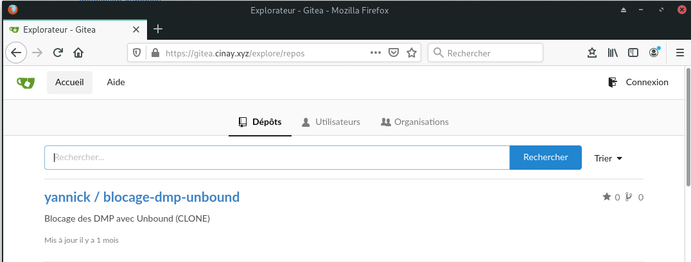
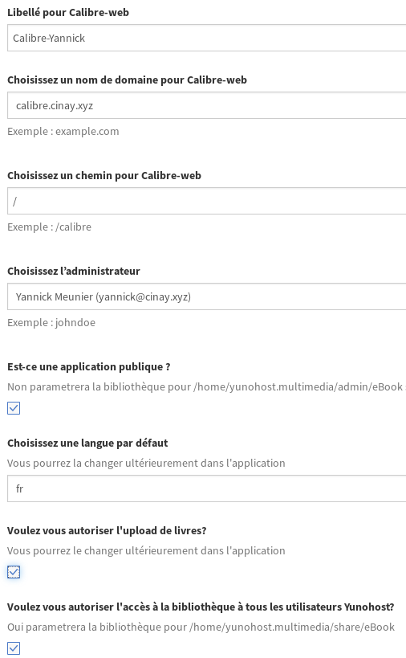
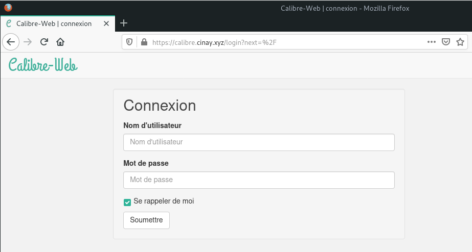
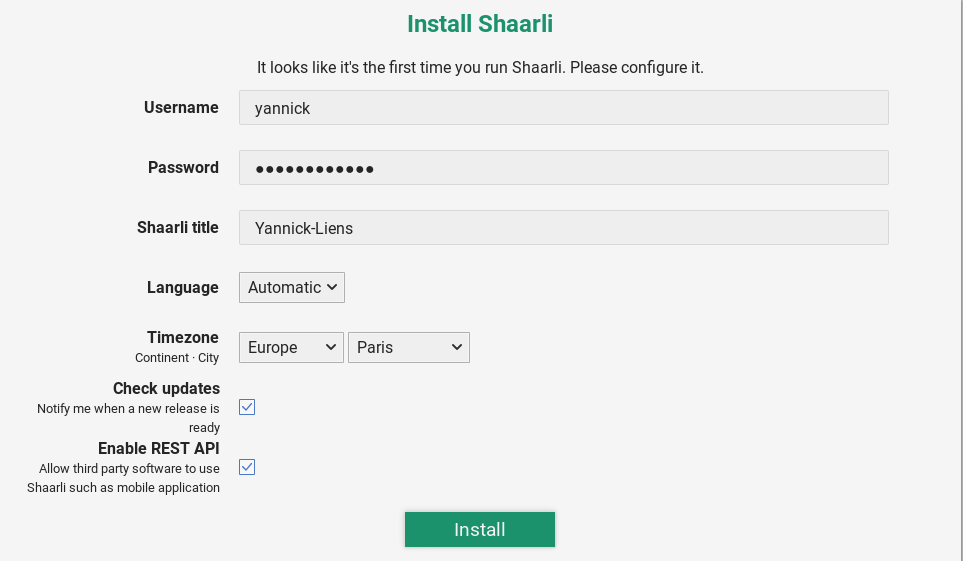
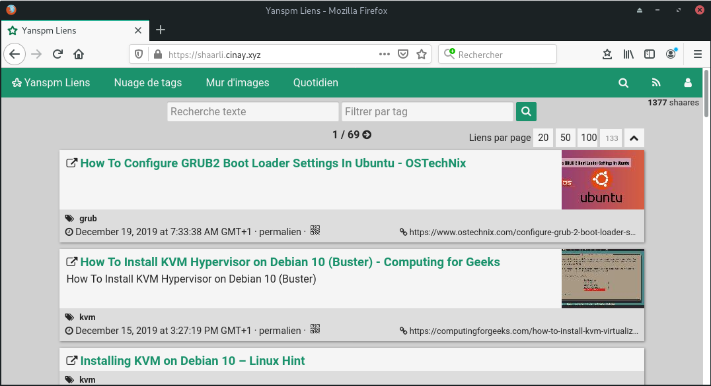
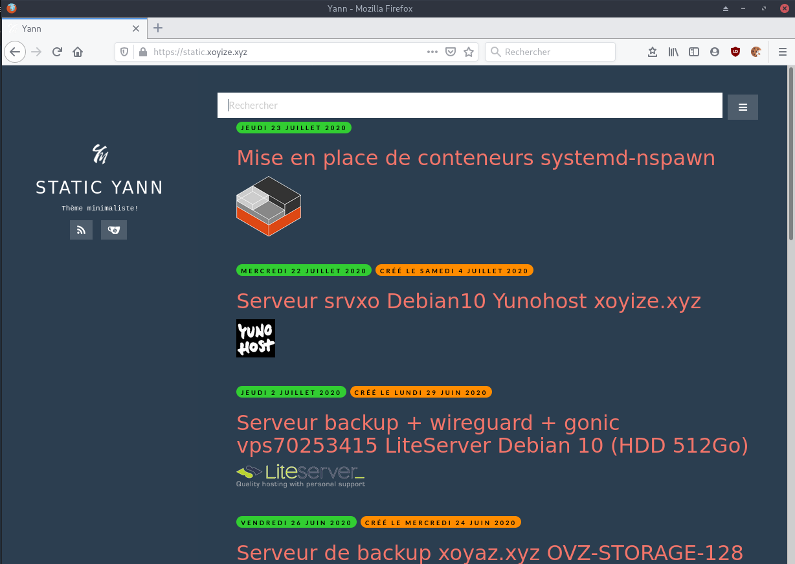
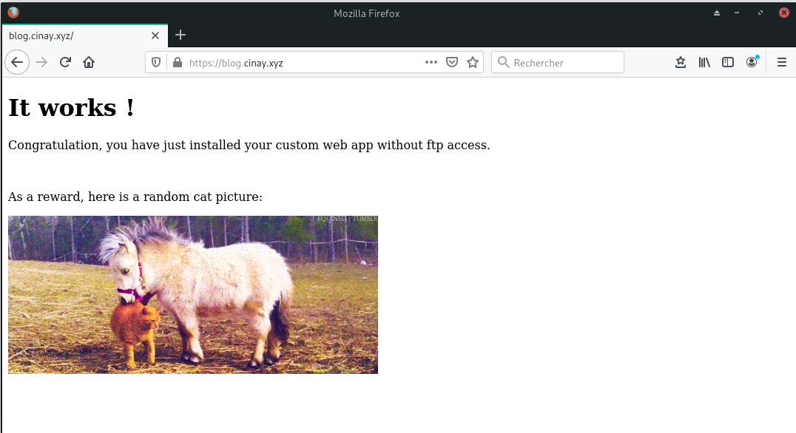
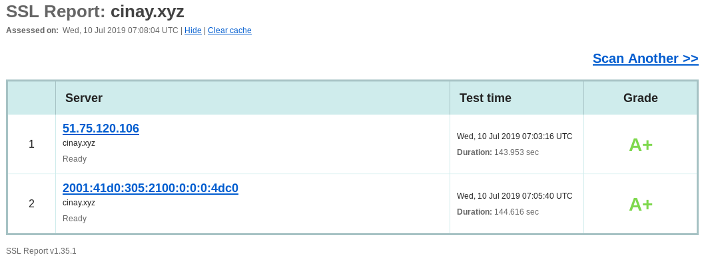
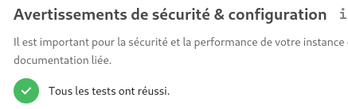

+++
title = 'vps591606 Debian 9 - Yunohost - cinay.xyz (INACTIF)'
date = 2020-07-21 00:00:00 +0100
categories = ['yunohost']
+++
## Yunohost Debian Stretch cinay.xyz

### VPS-KVM OVH
 
{:width="100px"}  
VPS 2018 SSD 3  

- 2 vCores  
- 8Go Ram  
- 80Go SSD   

Livraison : vps591606  51.75.120.106

* Domaine : cinay.xyz
* IPv4 du serveur : 51.75.120.106
* IPv6 du serveur : 2001:41d0:0305:2100:0:0:0:4dc0  (2001:41d0:305:2100::4dc0)
* IPV6 gateway    : 2001:41d0:0305:2100:0:0:0:1     (2001:41d0:305:2100::1)

### Debian Stretch

  


Connexion SSH sur "VPS 2018 SSD 3 (2 vCores/8GoRam/80GoSSD)"  

    ssh root@51.75.120.106

**Modification du réseau, ajout IPV6**  
Sur le VPS OVH il faut désactiver l'initialisation réseau par le cloud  

```
# To disable cloud-init's network configuration capabilities, write a file
# /etc/cloud/cloud.cfg.d/99-disable-network-config.cfg with the following:
# network: {config: disabled}
```

Création du fichier **/etc/cloud/cloud.cfg.d/99-disable-network-config.cfg** en mode su

    echo "network: {config: disabled}" > /etc/cloud/cloud.cfg.d/99-disable-network-config.cfg

Modifier le fichier **/etc/network/interfaces** 

```
# This file describes the network interfaces available on your system
# and how to activate them. For more information, see interfaces(5).

source /etc/network/interfaces.d/*

auto lo
iface lo inet loopback

auto ens3
iface ens3 inet dhcp
iface ens3 inet6 static
 address 2001:41d0:0305:2100:0:0:0:4dc0
 netmask 128
 post-up /sbin/ip -6 route add 2001:41d0:0305:2100:0:0:0:1 dev ens3
 post-up /sbin/ip -6 route add default via 2001:41d0:0305:2100:0:0:0:1 dev ens3
 pre-down /sbin/ip -6 route del default via 2001:41d0:0305:2100:0:0:0:1 dev ens3
 pre-down /sbin/ip -6 route del 2001:41d0:0305:2100:0:0:0:1 dev ens3
```

**Mise à jour de la distribution debian stretch**

    apt update && apt -y upgrade

>Redémarrer la machine `systemctl reboot` pour la prise en compte des modifications du réseau

Connexion SSH sur "VPS 2018 SSD 3 (2 vCores/8GoRam/80GoSSD)"  

    ssh root@51.75.120.106

Vérifier le réseau `ip addr` 

```
1: lo: <LOOPBACK,UP,LOWER_UP> mtu 65536 qdisc noqueue state UNKNOWN group default qlen 1
    link/loopback 00:00:00:00:00:00 brd 00:00:00:00:00:00
    inet 127.0.0.1/8 scope host lo
       valid_lft forever preferred_lft forever
    inet6 ::1/128 scope host 
       valid_lft forever preferred_lft forever
2: ens3: <BROADCAST,MULTICAST,UP,LOWER_UP> mtu 1500 qdisc pfifo_fast state UP group default qlen 1000
    link/ether fa:16:3e:07:c2:34 brd ff:ff:ff:ff:ff:ff
    inet 51.75.120.106/32 brd 51.75.120.106 scope global ens3
       valid_lft forever preferred_lft forever
    inet6 2001:41d0:305:2100::4dc0/128 scope global 
       valid_lft forever preferred_lft forever
    inet6 fe80::f816:3eff:fe07:c234/64 scope link 
       valid_lft forever preferred_lft forever
```

## Yunohost

{:width="50px"}

### Installation Yunohost

Lancer le bash et patienter

    bash <(wget -q -O- https://install.yunohost.org/)

Valider la "post-installation" ou lancer

    yunohost tools postinstall   

Main domain: cinay.xyz    
Mot de passe administrateur  

```
Success! YunoHost has been configured
Warning: The post-install is finished but YunoHost needs at least one user to work correctly, you should add one using 'yunohost user create' or the admin interface.
[INFO] Installation logs are available in /var/log/yunohost-installation_20181203_070221.log
[ OK ] YunoHost installation completed !
```

### Créer un utilisateur

    yunohost user create yannick

```
Mot de passe d'administration : 
Prénom : yannick
Nom : meunier
Adresse courriel : yannick@cinay.xyz
Mot de passe : 
Confirmez : mot de passe : 
Création du répertoire « /home/yannick ».
Succès ! La configuration de SSOwat a été générée
Succès ! L'utilisateur a été créé
fullname: yannick meunier
mail: yannick@cinay.xyz
username: yannick
```

### Installation des certificats

    yunohost domain cert-install

```
Info: Now attempting install of certificate for domain cinay.xyz!
Succès ! La configuration de SSOwat a été générée
Succès ! La configuration a été mise à jour pour le service « dnsmasq »
Info: Parsing account key...
Info: Parsing CSR...
Info: Registering account...
Info: Registered!
Info: Verifying cinay.xyz...
Info: cinay.xyz verified!
Info: Signing certificate...
Info: Certificate signed!
Succès ! Installation avec succès d’un certificat Let’s Encrypt pour le domaine cinay.xyz !
```

### Administration yunohost

Connexion administrateur yunohost <https://cinay.xyz/yunohost/admin>  
Vérifier le status des services <https://cinay.xyz/yunohost/admin/#/services>  
Récupérer les paramètres DNS du domaine cinay.xyz <https://cinay.xyz/yunohost/admin/#/domains/cinay.xyz/dns>

### Administration OVH (DNS et VPS)

Se connecter sur le manager OVH  

Modifier le reverse DNS du VPS vps591606.ovh.net (IPV4 er IPV6) : cinay.xyz  
Modifier la configuration DNS du domaine cinay.xyz


Se connecter en administrateur sur le site **cinay.xyz**  
Domaines &rarr; cinay.xyz &rarr; Configuration DNS # pour récupérer les paramètres  
Modifier la DNS du domaine cinay.xyz : 

```
$TTL 3600
@	IN SOA dns112.ovh.net. tech.ovh.net. (2018092426 86400 3600 3600000 300)
                    3600 IN NS     dns112.ovh.net.
                    3600 IN NS     ns112.ovh.net.
                    3600 IN MX 10  cinay.xyz.
                    3600 IN A      51.75.120.106
                    3600 IN AAAA   2001:41d0:305:2100::4dc0
                     600 IN TXT    "v=spf1 a mx ip4:51.75.120.106 ip6:2001:41d0:305:2100::4dc0 -all"
*                   3600 IN CNAME  cinay.xyz.
_dmarc                   IN TXT    ( "v=DMARC1; p=none;" )
_xmpp-client._tcp   3600 IN SRV    0 5 5222 cinay.xyz.
_xmpp-server._tcp   3600 IN SRV    0 5 5269 cinay.xyz.
mail._domainkey     3600 IN TXT    ( "v=DKIM1; k=rsa; h=sha256; p=MIGfMA0GCSqGSIb3DQEBAQUAA4GNADCBiQKBgQDOltTHam7WsBs1Fn26v7hSqe4bkNsruffIpinULglGcLHR8H0Cbks1jPuAZKuKLH1J7KxwelJ9F17mNqCuVDyPwGx1qLT8aEs3vD6L8tn9Aow1b2hEr2HQR6B6Ad90QYliI1BIVjrTjCpJyWYv3PUNow4QnUw/UhxX2bEK19apUwIDAQAB" )
muc                 3600 IN CNAME  cinay.xyz.
pubsub              3600 IN CNAME  cinay.xyz.
vjud                3600 IN CNAME  cinay.xyz.
```

### Sécurité

#### OpenSSH avec clés

  

**Créer un utilisateur debian**  
Il faut un utilisateur debian non ldap pour les connexions ssh  

    adduser debadm # création du home et saisie mot de passe

Visudo pour les accès root via utilisateur debadm

    echo "debadm     ALL=(ALL) NOPASSWD: ALL" >> /etc/sudoers

**Poste local**  
Génération d'une paire de clés 

    ssh-keygen -f ~/.ssh/kvm-vps591606 -t ed25519 -o -a 100

Le déploiement de la clé publiques .pub

    ssh-copy-id -i ~/.ssh/kvm-vps591606.pub debadm@51.75.120.106

**Serveur distant**

Se connecter au serveur distant depuis le poste local avec utilisateur debian

    ssh debadm@cinay.xyz

La clé publique est ajoutée au fichier distant **/home/debadm/.ssh/authorized_keys** du serveur   
Autre possibilité :

    mkdir /home/debadm/.ssh                 # créer un dossier .ssh
    nano /home/debadm/.ssh/authorized_keys  # Coller le contenu de la clé publique kvm-vps591606.pub
    chmod 600 /home/debadm/.ssh/authorized_keys # droits utilisateur

**Utiliser la clé publique**

Fichier **/etc/ssh/sshd_config** sur le serveur distant, liste des paramètres qui sont modifiés

```
Port 55031
PermitRootLogin no 
PasswordAuthentication no 
```

>On peut également modifier le port de connexion SSH  
Exemple remplacer port 22 par port 55031 :  
`Port 55031` # dans le fichier **/etc/ssh/sshd_config**  
NE PAS OUBLIER DE MODIFIER LE PAREFEU (FIREWALL) YUNOHOST :  
`yunohost firewall disallow TCP 22` # désactiver le port 22  
`yunohost firewall allow TCP 55031` # activer le port 55031  

Recharger le serveur ssh

    systemctl restart sshd

**Test de la connexion ssh par clé depuis le poste local**

    ssh -i ~/.ssh/kvm-vps591606 debadm@51.75.120.106 # port 22
    ssh -p 55031 -i ~/.ssh/kvm-vps591606 debadm@51.75.120.106 # port 55031
    ssh -p 55031 -i ~/.ssh/kvm-vps591606 debadm@cinay.xyz # port 55031 et DNS OK/Domaine

**Affichage à la connexion ssh**  

Exécuter un fichier *utilisateur* nommé **$HOME/.ssh/rc** si *présent (NON PRESENT)*  
Pour *tous les utilisateurs* exécuter un fichier nommé **/etc/ssh/sshrc** si *présent (NON PRESENT)*  
Installer les utilitaires *curl jq figlet tmux*  

    sudo apt install curl jq figlet 
    sudo apt install tmux p7zip     # outils supplémentaires

Créer le fichier **~/ssh_rc_bash** 

```
#!/bin/bash

#clear
PROCCOUNT=`ps -Afl | wc -l`  		# nombre de lignes
PROCCOUNT=`expr $PROCCOUNT - 5`		# on ote les non concernées
GROUPZ=`users`
ipinfo=$(curl -s ipinfo.io) 		# info localisation format json
publicip=$(echo $ipinfo | jq -r '.ip')  # extraction des données , installer préalablement "jq"
ville=$(echo $ipinfo | jq -r '.city')
pays=$(echo $ipinfo | jq -r '.country')
cpuname=`cat /proc/cpuinfo |grep 'model name' | cut -d: -f2 | sed -n 1p`
iplink=`ip link show |grep -m 1 "2:" | awk '{print $2}' | cut -d: -f1`

echo "\033[0m\033[1;31m"  
figlet "`hostname --fqdn`"
echo "\033[0m
\033[1;35m    \033[1;37mHostname \033[1;35m= \033[1;32m`hostname`
\033[1;35m  \033[1;37mWired IpV4 \033[1;35m= \033[1;32m`ip addr show $iplink | grep 'inet\b' | awk '{print $2}' | cut -d/ -f1`
\033[1;35m  \033[1;37mWired IpV6 \033[1;35m= \033[1;32m`ip addr show $iplink | grep -E 'inet6' |grep -E 'scope link' | awk '{print $2}' | cut -d/ -f1`
\033[1;35m      \033[1;37mKernel \033[1;35m= \033[1;32m`uname -r`
\033[1;35m      \033[1;37mDebian \033[1;35m= \033[1;32m`cat /etc/debian_version`
\033[1;35m      \033[1;37mUptime \033[1;35m= \033[1;32m`uptime | sed 's/.*up ([^,]*), .*/1/' | sed -e 's/^[ \t]*//'`
\033[1;35m         \033[1;37mCPU \033[1;35m= \033[1;32m`echo $cpuname`
\033[1;35m  \033[1;37mMemory Use \033[1;35m= \033[1;32m`free -m | awk 'NR==2{printf "%s/%sMB (%.2f%%)\n", $3,$2,$3*100/$2 }'`
\033[1;35m    \033[1;37mUsername \033[1;35m= \033[1;32m`whoami`
\033[1;35m    \033[1;37mSessions \033[1;35m= \033[1;32m`who | grep $USER | wc -l`
\033[1;35m \033[1;37mPublic IpV4 \033[1;35m= \033[1;32m`echo $publicip`
\033[1;35m \033[1;37mPublic IpV6 \033[1;35m= \033[1;32m`ip addr show $iplink | grep -m 1 'inet6\b'  | awk '{print $2}' | cut -d/ -f1`
\033[0m"
df -h /
#curl fr.wttr.in/$ville?0
```

Le rendre exécutable

    chmod +x ~/ssh_rc_bash

Recréer motd  

    sudo rm /etc/motd && sudo nano /etc/motd  

```
                 ___  ___  _   __   __    __ 
 __ __ _ __  ___| __|/ _ \/ | / /  /  \  / / 
 \ V /| '_ \(_-<|__ \\_, /| |/ _ \| () |/ _ \
  \_/ | .__//__/|___/ /_/ |_|\___/ \__/ \___/
      |_|                                    
  __ (_) _ _   __ _  _  _    __ __ _  _  ___ 
 / _|| || ' \ / _` || || | _ \ \ /| || ||_ / 
 \__||_||_||_|\__,_| \_, |(_)/_\_\ \_, |/__| 
                     |__/          |__/      
```

Déconnexion puis connexion  

#### Désactivation de l’API YunoHost

YunoHost est administrable via une API HTTP, servie sur le port 6787 par défaut (seulement sur localhost). Elle permet d’administrer une grande partie de votre serveur, et peut donc être utilisée à des fins malveillantes. La meilleure chose à faire si vous êtes habitués aux lignes de commande est de désactiver le service yunohost-api, et utiliser la ligne de commande en SSH.

    sudo systemctl disable yunohost-api
    sudo systemctl stop yunohost-api


## Applications Yunohost

### Nextcloud 

  
Installer **Nextcloud** avec l'administrateur web yunohost    
*Accéder au dossier personnel des utilisateurs depuis Nextcloud*

### Transmission

  
Installer **Transmission** avec l'administrateur web yunohost    

### Tiny Tiny RSS

  
Installer **Tiny Tiny RSS** avec l'administrateur web yunohost    
Thèmes

```
sudo -s
git clone https://github.com/levito/tt-rss-feedly-theme.git
cp -r tt-rss-feedly-theme/feedly* /var/www/ttrss/themes.local/
```

### Gitea (publique gitea.cinay.xyz)

  

1. Ajout domaine **gitea.cinay.xz**
2. Certificats Let's Encrypt pour le domaine
3. Installer l'application **Gitea**
    * domaine : gitea.cinay.xyz
    * Chemin : /
    * Administrateur : yannick
    * Site publique : Oui

{:width="400"}  
<https://gitea.cinay.xyz/>

### Calibre-Web (publique calibre.cinay.xyz)


1. Ajout domaine **calibre.cinay.xz**
2. Certificats Let's Encrypt pour le domaine
3. Installer l'application **Calibre-web**  
{:width="300"}  

Emplacement de la base de donnée Calibre : **/home/yunohost.multimedia/share/eBook/**  
Copie dossier CalibreTechnique du serveur backup xoyaz.xyz &rarr; cinay.xyz

    sudo -s
    rsync -avz -e "ssh -p 55036 -i .ssh/OVZ-STORAGE-128 -o StrictHostKeyChecking=no -o UserKnownHostsFile=/dev/null" --progress usernl@5.2.79.107:/home/usernl/backup/CalibreTechnique/* /home/yunohost.multimedia/share/eBook/

En mode admin , il faut redémarrer calibre-web  
Automatiser la synchronisation des dossiers 

    crontab -e   # ajouter la ligne suivante en fin de fichier

```
# Synchroniser le dossier "CalibreTechnique" entre le serveur de backup distant xoyaz.xyz  et le serveur local cinay.xyz
15 01 * * * /usr/bin/rsync -avz -e "ssh -p 55036 -i .ssh/OVZ-STORAGE-128 -o StrictHostKeyChecking=no -o UserKnownHostsFile=/dev/null" --progress usernl@5.2.79.107:/home/usernl/backup/CalibreTechnique/* /home/yunohost.multimedia/share/eBook/
```

{:width="400"}  
<https://calibre.cinay.xz>

### Dokuwiki

  
Installer **Dokuwiki** avec l'administrateur web yunohost    

**En cas de problème**

Le point le plus important et la prise en charge LDAP , le plugin **LDAP Auth Plugin** doit être actif (cas de transfert de dokuwiki ou après une mise à jour , perte de l'authentification LDAP !!!)  
La configuration spécifique à LDAP dans le fichier **/var/www/dokuwiki/conf/dokuwiki.php**  

```
/* Authentication Settings */
$conf['useacl']      = 1;                //Use Access Control Lists to restrict access?
$conf['openregister']= 0;
$conf['autopasswd']  = 1;                //autogenerate passwords and email them to user
$conf['authtype']    = 'authldap';      //which authentication backend should be used
$conf['passcrypt']   = 'sha1';           //Used crypt method (smd5,md5,sha1,ssha,crypt,mysql,my411)
$conf['defaultgroup']= 'user';           //Default groups new Users are added to
$conf['superuser']   = 'yannick';    //The admin can be user or @group or comma separated list user1,@group1,user2
$conf['manager']     = 'yannick';    //The manager can be user or @group or comma separated list user1,@group1,user2
$conf['profileconfirm'] = 1;             //Require current password to confirm changes to user profile
$conf['rememberme'] = 1;                 //Enable/disable remember me on login
$conf['disableactions'] = '';            //comma separated list of actions to disable
$conf['auth_security_timeout'] = 900;    //time (seconds) auth data is considered valid, set to 0 to recheck on every page view
$conf['securecookie'] = 1;               //never send HTTPS cookies via HTTP
$conf['remote']      = 0;                //Enable/disable remote interfaces
$conf['remoteuser']  = '!!not set !!';   //user/groups that have access to remote interface (comma separated)

/* LDAP Yunohost config */
$conf['plugin']['authldap']['server']      = 'localhost';
$conf['plugin']['authldap']['port']        = 389;
$conf['plugin']['authldap']['version']    = 3;
$conf['plugin']['authldap']['usertree']    = 'ou=users,dc=yunohost,dc=org';
$conf['plugin']['authldap']['userfilter']  = '(&(uid=%{user})(objectClass=posixAccount))';
# no groups
#$conf['plugin']['authldap']['grouptree']   = 'ou=Group, dc=server, dc=tld';
#$conf['plugin']['authldap']['groupfilter'] = '(&(objectClass=posixGroup)(|(gidNumber=%{gid})(memberUID=%{user})))'; 
```

**Structure et droits des dossiers dokuwiki**

```
root@cinay:/home/debadm# ls -la /var/www/dokuwiki/
total 124
drwxr-xr-x  9 root     root  4096 Nov  6 15:56 .
drwxr-xr-x  7 root     root  4096 Dec  3 09:30 ..
drwxr-xr-x  2 root     root  4096 May  3  2018 bin
drwxr-xr-x  2 dokuwiki root  4096 Nov  6 15:57 conf
-rw-r--r--  1 root     root 18092 May  3  2018 COPYING
drwxr-x--- 12 dokuwiki root  4096 Nov  6 15:56 data
drwxr-xr-x  2 root     root 12288 Sep  5 07:21 doc
-rw-r--r--  1 root     root  3547 Nov  6 15:56 doku.php
-rw-r--r--  1 root     root 19141 May  3  2018 feed.php
-rw-r--r--  1 root     root  1684 May  3  2018 .htaccess.dist
drwxr-xr-x  9 dokuwiki root  4096 Nov  6 15:56 inc
-rw-r--r--  1 root     root  2097 May  3  2018 index.php
-rw-r--r--  1 root     root 19233 May  3  2018 install.php
drwxr-xr-x  8 root     root  4096 May  3  2018 lib
-rw-r--r--  1 root     root   306 May  3  2018 README
drwxr-xr-x 12 root     root  4096 May  3  2018 vendor
-rw-r--r--  1 root     root    21 May  3  2018 VERSION
```


### Cartographie (publique map.cinay.xyz)

{:width="100px"}

**Yunohost mode administration web**  

créer le domaine **map.cinay.xyz** puis les certificats **Let's Encrypt**  
Installation de l'application "Multi webapp for YunoHost" sur le domaine  **map.cinay.xyz**

    yunohost app install https://github.com/YunoHost-Apps/multi_webapp_ynh

```
WARNING! Installing 3rd party applications may compromise the integrity and security of your system. You should probably NOT install it unless you know what you are doing. Are you willing to take that risk? [Y/N] : Y
Available domains:
- cinay.xyz
- map.cinay.xyz
- blog.cinay.xyz
- liens.cinay.xyz
- static.cinay.xyz
Choose a domain for your Webapp (default: cinay.xyz): map.cinay.xyz
Choose a path for your Webapp (default: /site): /
Available users:
- yannick
Choose the YunoHost user: yannick
Create a database? [yes | no] (default: no): 
Is it a public website ? [yes | no] (default: no): yes
Info: [....................] > Retrieve arguments from the manifest
Info: [#...................] > Check if the app can be installed
Info: [##..................] > Store settings from manifest
Info: [#####...............] > Setup SSOwat
Info: [######..............] > Create final path
Info: The directory /var/www/webapp_yannick already exist, do not recreate it.
Info: [#######.............] > Create a dedicated user
Info: [##########..........] > Configure php-fpm
Warning: Reload the service php7.0-fpm
Warning: Reload the service nginx
Info: [###########.........] > Configure nginx
Info: [############........] > Reload nginx
Info: [####################] > Installation completed
Success! The SSOwat configuration has been generated
Success! Installation complete
```

Le dossier par défaut de "Multi webapp for YunoHost" **/var/www/webapp_yannick/map.cinay.xyz_/**  

    sudo rm -r /var/www/webapp_yannick/map.cinay.xyz_/  # on supprime le dossier par défaut
    sudo ln -s /srv/osm-new /var/www/webapp_yannick/map.cinay.xyz_  # créer le lien


>Changer l'étiquette  par "Cartes" en utilisant l'administration web "Applications"

**Synchronisation locale des fichiers gpx**  

Les fichiers gpx du dossier **/srv/osm-new/file** ne peuvent pas être utilisés par nextcloud et map  pour une question de droits   
Pour une utilisation par une application nextcloud dans le dossier **/home/yannick/gpx** on va le synchroniser avec le dossier **/srv/osm-new/file/** par  lsyncd   

```
sudo -s
apt install lsyncd # installation
systemctl stop lsyncd  # arrêt du service pour modifier la configuration
mkdir /var/log/lsyncd
touch /var/log/lsyncd/lsyncd.{log,status}
# Configuration file goes on /etc/lsyncd:
mkdir /etc/lsyncd
# le fichier de configuration
echo '
settings = {
logfile = "/var/log/lsyncd/lsyncd.log",
statusFile = "/var/log/lsyncd/lsyncd.status"
}

sync {
default.rsync,
source = "/srv/osm-new/file/",
target = "/home/yannick/gpx",
}
' > /etc/lsyncd/lsyncd.conf.lua
# lancement du service
systemctl restart lsyncd
```

Vue du fichier lsyncd.log

```
Tue Dec 24 08:14:12 2019 Normal: recursive startup rsync: /srv/osm-new/file/ -> /home/yannick/gpx/
Tue Dec 24 08:14:14 2019 Normal: Startup of "/srv/osm-new/file/" finished.
```

Le contenu du dossier /home/yannick/gpx est synchronisé automatiquement avec le dossier /srv/osm-new/file/ 

>**IMPORTANT** : Cette synchronisation est imposée pour l'utilisation d'une application nextcloud nommée **gpxpod**  
<font color="red">L'application <b>gpxpod</b> ne sait pas traiter les noms de fichiers avec des espaces</font>, il faut exécuter dans le dossier **/home/yannick/gpx** , un bash `./remplacer-les-espaces-par_dans-les-noms-de-fichier.sh
` en mode su  
<font color="green"><b>LE PROBLEME EST RESOLU (DECEMBRE 2019)</b></font>

{:width="400px"}  
<https://map.cinay.xyz/>

### Shaarli (publique shaarli.cinay.xyz)

{:width="50px"}  
*Voulez-vous partager les liens que vous découvrez ? Shaarli est un gestionnaire de signets minimaliste et un service de partage de liens que vous pouvez installer sur votre propre serveur. Il est conçu pour être personnel (monoposte), rapide et pratique.*

1. Ajout domaine **shaarli.cinay.xz**
2. Certificats Let's Encrypt pour le domaine
3. Installer l'application **shaarli**
    * domaine : shaarli.cinay.xyz
    * Chemin : /
    * Site publique : Oui

>**ATTENTION!!!** PROBLEMES+
 de droits et d'installation  

En raison des problèmes évoqués, voici la procédure à suivre :

    sudo rm -r /var/www/shaarli # suppression appli web shaarli installée par yunohost

**Réinstaller shaarli**  
Télécharger la dernière version de Shaarli depuis la [page des versions](https://github.com/shaarli/Shaarli/releases) (Télécharger l'archive **shaarli-full** pour inclure les dépendances).

```
wget https://github.com/shaarli/Shaarli/releases/download/v0.11.1/shaarli-v0.11.1-full.tar.gz
unzip shaarli-v0.11.1-full.tar.gz
sudo mv Shaarli /var/www/shaarli
sudo chown shaarli:shaarli -R /var/www/shaarli
```

Ouvrir le lien https://shaarli.cinay.xyz pour le paramétrage 

{:width="500"}   
Après l'installation, se connecter en utilisateur/mot de passe   

{:width="400px"}  
<https://shaarli.cinay.xyz/>

### Wallabag (publique liens.cinay.xyz)

*wallabag est une application libre à héberger sur serveur permettant de sauvegarder des articles puis de les lire plus tard, sur n'importe quel appareil (navigateur, smartphone, tablette ou liseuse), que vous soyez connecté ou non.*

Création domaine liens.cinay.xyz et certificats SSL  
Installation de l'application "Wallabag for YunoHost" sur le domaine **liens.cinay.xyz**  

    yunohost app install https://github.com/YunoHost-Apps/wallabag2_ynh.git

```
WARNING! Installing 3rd party applications may compromise the integrity and security of your system. You should probably NOT install it unless you know what you are doing. Are you willing to take that risk? [Y/N] : Y
Available domains:
- cinay.xyz
- map.cinay.xyz
- blog.cinay.xyz
- gitea.cinay.xyz
- liens.cinay.xyz
- static.cinay.xyz
- calibre.cinay.xyz
- shaarli.cinay.xyz
Choose a domain for Wallabag (default: cinay.xyz): liens.cinay.xyz
Choose a path for Wallabag (default: /wallabag): /
Available users:
- yannick
Choose the Wallabag administrator: yannick
Info: Installing application wallabag2…
Info: [....................] > Validating installation parameters...
Info: [++++................] > Installing dependencies...
Info: [####................] > Creating a MySQL database...
Info: [####++..............] > Setting up source files...
Info: [######+.............] > Configuring nginx web server...
Info: [#######.............] > Configuring system user...
Info: [#######+............] > Configuring php-fpm...
Info: [########+++++++++++.] > Configuring wallabag...
Info: [###################.] > Configuring SSOwat...
Info: [###################.] > Reloading nginx web server...
Info: [####################] > Installation of wallabag2 completed
Success! The SSOwat configuration has been generated
Success! Installation complete
```

### Monitorix - (privée mon.cinay.xyz)

*Monitorix est un outil de surveillance de système gratuit, open source et léger, conçu pour surveiller le plus grand nombre possible de services et de ressources du système. Il a été créé pour être utilisé sous des serveurs Linux/UNIX de production, mais en raison de sa simplicité et de sa petite taille, il peut également être utilisé sur des appareils embarqués.*

Installer domaine et certificats 

    yunohost domain add mon.cinay.xyz
    yunohost domain cert-install mon.cinay.xyz

Installer une application

    yunohost app install https://github.com/YunoHost-Apps/monitorix_ynh

## Sites statiques (jekyll)

### Publique static.cinay.xyz 

{:width="150px"}

**Création domaine static.cinay.xyz**  
En mode administrateur ou en ligne de commande, créer un domaine static.cinay.xyz puis générer les certificats letsencrypt  

En ligne de commande (passer en root)

    yunohost domain add static.cinay.xyz 

```
Administration password: 
Success! Successfully installed a self-signed certificate for domain static.cinay.xyz!
Success! The configuration has been updated for service 'postfix'
Success! The configuration has been updated for service 'nginx'
Success! The configuration has been updated for service 'dnsmasq'
Success! The configuration has been updated for service 'metronome'
Success! The SSOwat configuration has been generated
Success! The domain has been created
```

    yunohost domain cert-install static.cinay.xyz

```
Info: Now attempting install of certificate for domain static.cinay.xyz!
Success! The SSOwat configuration has been generated
Success! The configuration has been updated for service 'dnsmasq'
Info: Parsing account key...
Info: Parsing CSR...
Info: Registering account...
Info: Already registered!
Info: Verifying static.cinay.xyz...
Info: static.cinay.xyz verified!
Info: Signing certificate...
Info: Certificate signed!
Success! Successfully installed Let's Encrypt certificate for domain static.cinay.xyz!
```

### rbenv gestion des versions ruby

Rbenv est un outil léger de gestion des versions de Ruby qui vous permet de changer facilement de version de Ruby.

Par défaut, Rbenv ne gère pas l'installation des versions de Ruby. ruby-build est un outil qui vous aide à installer n'importe quelle version de Ruby dont vous pourriez avoir besoin. Il est disponible en tant que programme autonome et en tant que plugin pour rbenv.

Installez les dépendances nécessaires à l'outil ruby-build pour construire Ruby à partir des sources :

    sudo apt update
    sudo apt install git curl libssl-dev libreadline-dev zlib1g-dev autoconf bison build-essential libyaml-dev libreadline-dev libncurses5-dev libffi-dev libgdbm-dev

Ensuite, lancez la commande curl suivante pour installer les scripts rbenv et ruby-build :

    curl -sL https://github.com/rbenv/rbenv-installer/raw/master/bin/rbenv-installer | bash -

Si l'installation est réussie, le script imprimera quelque chose comme ceci :

```
Running doctor script to verify installation...
Checking for `rbenv' in PATH: not found
  You seem to have rbenv installed in `/home/dbsuser/.rbenv/bin', but that
  directory is not present in PATH. Please add it to PATH by configuring
  your `~/.bashrc', `~/.zshrc', or `~/.config/fish/config.fish'.
```

Avant de commencer à utiliser rbenv, nous devons ajouter $HOME/.rbenv/bin à notre PATH.

    echo 'export PATH="$HOME/.rbenv/bin:$PATH"' >> ~/.bashrc
    echo 'eval "$(rbenv init -)"' >> ~/.bashrc
    source ~/.bashrc

Les dernières versions stables

    rbenv install -l

Maintenant que rbenv est installé sur notre système, nous pouvons facilement installer la dernière version stable de Ruby et la définir comme version par défaut avec :

    rbenv install 2.7.1
    rbenv global 2.7.1

 Vérifiez que Ruby a été correctement installé en imprimant le numéro de version :

    ruby -v

`ruby 2.7.1p83 (2020-03-31 revision a0c7c23c9c) [x86_64-linux]`

### Installer jekyll via gem et bundler

On va utiliser gem pour installer Jekyll et Bundler qui est un outil utilisé pour gérer les dépendances de Gem.

    which bundler

`/home/debadm/.rbenv/shims/bundler`

Installer jekyl

    gem install jekyll  # Patienter quelques minutes
    jekyll -v

`jekyll 4.1.1`


Cloner le dépôt staticyan

    git clone https://gitea.cinay.eu/yann/staticyan.git
    sudo mv staticyan /srv/
    sudo chown $USER.$USER -R /srv/staticyan
    cd /srv/staticyan/

Vérifier Gemfile

```
source 'https://rubygems.org'
gem "jekyll", github: "jekyll/jekyll"

group :jekyll_plugins do
  gem "pygments.rb"
  gem "jekyll-paginate"
  gem 'jekyll-toc'
  gem 'jekyll-last-modified-at'
  gem 'rouge'
end
```

Installer jekyll via bundle

    bundle install

Les dossiers *images* *files* et *_posts* du site statique sont synchronisés par nextcloud dans /home/yannick/statique , il faut créer des liens avec jekyll  

    tree -L 1 /home/yannick/statique/

```
/home/yannick/statique/
├── files
├── images
└── _posts
```


Création des liens

```
sudo rm -rf /srv/staticyan/{files,images,_posts} # suppression des dossiers existants
sudo ln -s /home/yannick/statique/_posts /srv/staticyan/_posts
sudo ln -s /home/yannick/statique/images /srv/staticyan/images
sudo ln -s /home/yannick/statique/files /srv/staticyan/files
```

Ce qui donne

    tree -L 1 /srv/staticyan/

```
/srv/staticyan/
├── 404.html
├── assets
├── categories.html
├── _config.yml
├── feed.xml
├── files -> /home/yannick/statique/files
├── Gemfile
├── Gemfile.lock
├── images -> /home/yannick/statique/images
├── _includes
├── index.html
├── _layouts
├── _posts -> /home/yannick/statique/_posts
├── README.md
├── _site
├── start.sh
├── tags.html
└── wikistatic.json
```

**Créer service staticyan**  

Pour lancer le serveur **staticyan** au démarrage, utilisation d'un <u>service systemd</u>  
**ATTENTION!** , remplacer *User=utilisateur* par votre nom d'utilisateur `echo $USER`  
Relever le chemin complet de bundle : `which bundle`

Création d'un service "staticyan" sous systemd

    sudo nano /etc/systemd/system/staticyan.service

Contenu du fichier

```ini
[Unit]
Description=service staticyan
After=network.target

[Service]
Type=simple
User=debadm
WorkingDirectory=/srv/staticyan
ExecStart=/home/debadm/.rbenv/shims/bundle exec jekyll build --watch
Restart=on-abort


[Install]
WantedBy=multi-user.target
```

Lancer le service  **staticyan** :

    sudo systemctl daemon-reload
    sudo systemctl start staticyan
    #Vérifier
    sudo systemctl status staticyan

```
● staticyan.service - jekyll Service
   Loaded: loaded (/etc/systemd/system/staticyan.service; disabled; vendor preset: enabled)
   Active: active (running) since Sun 2020-07-05 15:42:16 CEST; 16s ago
 Main PID: 31137 (bundle)
    Tasks: 1 (limit: 4915)
   CGroup: /system.slice/staticyan.service
           └─31137 /home/debadm/.rbenv/versions/2.7.1/lib/ruby/gems/2.7.0/bin/jekyll build --watch

Jul 05 15:42:16 cinay.xyz systemd[1]: Started jekyll Service.
Jul 05 15:42:18 cinay.xyz bundle[31137]: Configuration file: /srv/staticyan/_config.yml
Jul 05 15:42:18 cinay.xyz bundle[31137]:             Source: /srv/staticyan
Jul 05 15:42:18 cinay.xyz bundle[31137]:        Destination: /srv/staticyan/_site
Jul 05 15:42:18 cinay.xyz bundle[31137]:  Incremental build: disabled. Enable with --incremental
Jul 05 15:42:18 cinay.xyz bundle[31137]:       Generating...
```

Valider le lancement du service staticyan au démarrage

    sudo systemctl enable staticyan

>jekyll génére un dossier statique **/srv/staticyan/_site** 

Installation de l'application "Multi webapp for YunoHost" sur le domaine  **static.cinay.xyz**

    yunohost app install https://github.com/YunoHost-Apps/multi_webapp_ynh

```
WARNING! Installing 3rd party applications may compromise the integrity and security of your system. You should probably NOT install it unless you know what you are doing. Are you willing to take that risk? [Y/N] : Y
Available domains:
- cinay.xyz
- map.cinay.xyz
- blog.cinay.xyz
- liens.cinay.xyz
- static.cinay.xyz
Choose a domain for your Webapp (default: cinay.xyz): static.cinay.xyz
Choose a path for your Webapp (default: /site): /
Available users:
- yannick
Choose the YunoHost user: yannick
Create a database? [yes | no] (default: no): 
Is it a public website ? [yes | no] (default: no): yes
Info: [....................] > Retrieve arguments from the manifest
Info: [#...................] > Check if the app can be installed
Info: [##..................] > Store settings from manifest
Info: [#####...............] > Setup SSOwat
Info: [######..............] > Create final path
Info: The directory /var/www/webapp_yannick already exist, do not recreate it.
Info: [#######.............] > Create a dedicated user
Warning: Reload the service php7.0-fpm
Info: [##########..........] > Configure php-fpm
Info: [###########.........] > Configure nginx
Warning: Reload the service nginx
Info: [############........] > Reload nginx
Info: [####################] > Installation completed
Success! The SSOwat configuration has been generated
Success! Installation complete
```

Le dossier par défaut de "Multi webapp for YunoHost" **/var/www/webapp_yannick/static.cinay.xyz_/**  

    sudo rm -r /var/www/webapp_yannick/static.cinay.xyz_/  # on supprime le dossier par défaut
    sudo ln -s /srv/staticyan/_site /var/www/webapp_yannick/static.cinay.xyz_  # créer le lien

>Changer l'étiquette  par "Static" en utilisant l'administration web "Applications"  

{:width="400px"}  
Le site statique sur le lien <https://static.xoyize.xyz>  

#### Menu sur les "posts" (jekyll-toc)

Installer jekyll-toc : `gem install jekyll-toc`   
Ajouter `jekyll-toc` à la rubrique *plugins* du fichier **_config.yml**  
Modifier le fichier _includes/posts.html  : `content` &rarr; `content | toc `  

Le temps de génération du site est multiplié par 6 (on passe de 5 à 30 secondes ???)  
La solution est de passer en mode incrémental (seul le fichier modifié est regénéré)  

Modifier le service `sudo nano /etc/systemd/system/staticyan.service`  :   
Remplacer `ExecStart=/home/debadm/.rbenv/shims/bundle exec jekyll build --watch`    
Par `ExecStart=/home/debadm/.rbenv/shims/bundle exec jekyll build --watch --incremental`  
Recharger `sudo systemctl daemon-reload` et relancer `sudo systemctl start staticyan`

    

### Privée blog.cinay.xyz (FACULTATIF)

Essais &rarr; [Blog statique de type jekyll sur site cinay.xyz](https://blog.cinay.xyz/2019/12/Blog-statique-jekyll-Yunohost-cinay.xyz.html)

>Site statique de type jekyll identique dans la conception à static.cinay.xyz

Yunohost administrateur  

1. Ajout domaine **blog.cinay.xz**
2. Certificats Let's Encrypt pour le domaine
3. Installer l'application **Multi webapp for YunoHost**
    * domaine : blog.cinay.xyz
    * Chemin : /
    * Site publique : Non

{:width="400px"}  
Accès site blog/test <https://blog.cinay.xyz>

Le dossier par défaut de "Multi webapp for YunoHost" **/var/www/webapp_yannick/blog.cinay.xyz_/**  

    sudo rm -r /var/www/webapp_yannick/blog.cinay.xyz_/  # on supprime le dossier par défaut
    sudo ln -s /srv/basicblog/_site /var/www/webapp_yannick/blog.cinay.xyz_  # créer le lien

>MODIFICATION , ajout exclusion dossier **_posts/archives** dans le fichier de configuration **_config.yml**

**Modifications sur static et blog**

Le but recherché est un accès publique sur le site static.cinay.xyz et privé sur le site blog.cinay.xyz.   

* **static.cinay.xyz** accède au dossier  pour les billets **publiques**
* **blog.cinay.xyz** accède au dossier  pour les billets **publiques et privés**

Arrêt des services

    sudo systemctl stop jekyll
    sudo systemctl stop basicblog

**static.cinay.xyz**

Exclusions dans **static.cinay.xyz** (fichier de configuration **/srv/wikistatic/_config.yml**)

```
exclude:

  - .jekyll-cache
  - _posts/archives/
  - _posts/private/
```

Les liens

	ls -l /srv/wikistatic/ |grep ^l

```
lrwxrwxrwx  1 debadm debadm    28 Apr 12 10:25 files -> /home/yannick/statique/files
lrwxrwxrwx  1 debadm debadm    29 Apr 12 10:26 images -> /home/yannick/statique/images
lrwxrwxrwx  1 debadm debadm    29 Apr 12 10:27 _posts -> /home/yannick/statique/_posts
```

**blog.cinay.xyz**

Exclusions dans **blog.cinay.xyz** (fichier de configuration **/srv/basicblog/_config.yml**)

```
exclude:

  - .jekyll-cache
  - _posts/archives/
```

Modifier le  lien _posts

	ls -l /srv/basicblog/ |grep ^l

```
lrwxrwxrwx  1 debadm debadm    28 Dec 25 12:18 files -> /home/yannick/statique/files
lrwxrwxrwx  1 debadm debadm    29 Dec 25 12:18 images -> /home/yannick/statique/images
lrwxrwxrwx  1 debadm debadm    37 Apr 12 10:22 _posts -> /home/yannick/statique/_posts
```

**basicblog**  
Ajout affichage de la lettre P sur fond rouge , si le billet contient le tag `private: true`

**Redémarrer les services**

    sudo systemctl start jekyll
    sudo systemctl start basicblog

## Sauvegarde yunohost

Création d'une sauvegarde complète yunohost

    sudo -s
    yunohost backup create -n Backup-Yunohost-cinay.xyz

Sauvegarde automatique tous les jours

    sudo -s
    crontab -e

```
# Sauvegarde yunohost
15 01 * * * /bin/rm /home/yunohost.backup/archives/* && /usr/bin/yunohost backup create -n Backup-Yunohost-cinay.xyz > /dev/null
```


## Sauvegarde BorgBackup


### serveur client cinay.xyz

#### connexion SSH

>Pour une connexion via ssh vous devez ajouter la clé publique *cinay_ed25519* du **serveur client  cinay.xyz** au fichier *~/.ssh/authorized_keys* du  **serveur backup xoyaz.xyz**  

Procédure

	ssh usernl@5.2.79.107 -p 55036 -i /home/yannick/.ssh/OVZ-STORAGE-128 # connexion SSH serveur backup
	sudo -s # passer en super utilisateur
	cat >> /srv/data/borg-backups/.ssh/authorized_keys

Copier/coller le contenu du fichier du fichier de clef publique (fichier /root/.ssh/cinay_ed25519.pub de la machine à sauvegarder **cinay.xyz** ) dans ce terminal, et presser [Ctrl]+[D] pour valider.


Test depuis le serveur client  (c'est lui qui possède la clé privée)

>**AU PREMIER passage une question est posée , saisir oui ou yes**

```
sudo -s
ssh -p 55036 -i /root/.ssh/cinay_ed25519 borg@xoyaz.xyz
The authenticity of host '[xoyaz.xyz]:55036 ([2a04:52c0:101:7ae::7a5e]:55036)' can't be established.
ECDSA key fingerprint is SHA256:PDXQBhTh4oj0cSzgnjCun+J60JDUEk7VeLH2YHZbwMc.
Are you sure you want to continue connecting (yes/no)? yes
Warning: Permanently added '[xoyaz.xyz]:55036,[2a04:52c0:101:7ae::7a5e]:55036' (ECDSA) to the list of known hosts.
Linux backup 2.6.32-042stab134.3 #1 SMP Sun Oct 14 12:26:01 MSK 2018 x86_64
  _               _               
 | |__  __ _  __ | |__ _  _  _ __ 
 | '_ \/ _` |/ _|| / /| || || '_ \
 |_.__/\__,_|\__||_\_\ \_,_|| .__/
                            |_|   
$ pwd
/srv/data/borg-backups
$ 
# saisir exit pour sortir
```

#### Création du dépôt distant cinay.xyz (A FAIRE UNE SEULE FOIS)

Dans la terminologie borg, l’emplacement où les sauvegardes sont stockées est appelé le référentiel borg (dépôt).  

sudo -s

Créer un fichier avec la passphrase `nano /root/.borg/passphrase` et copier le résultat de la commande `< /dev/urandom tr -dc A-Za-z0-9 | head -c${1:-64};echo;` dans le fichier  

Initialisation dépôt

	export BORG_PASSPHRASE="`cat /root/.borg/passphrase`"
	export BORG_RSH='ssh -i /root/.ssh/cinay_ed25519'
	borg init --encryption=repokey-blake2 ssh://borg@xoyaz.xyz:55036/srv/data/borg-backups/cinay.xyz


```bash
Remote: Borg 1.0.9: exception in RPC call:
Remote: Traceback (most recent call last):
Remote:   File "/usr/lib/python3/dist-packages/borg/remote.py", line 108, in serve
Remote:     raise InvalidRPCMethod(method)
Remote: borg.remote.InvalidRPCMethod: get_free_nonce
Remote: Platform: Linux backup 2.6.32-042stab134.3 #1 SMP Sun Oct 14 12:26:01 MSK 2018 x86_64
Remote: Linux: debian 9.9 
Remote: Borg: 1.0.9  Python: CPython 3.5.3
Remote: PID: 18282  CWD: /srv/data/borg-backups
Remote: sys.argv: ['/usr/bin/borg', 'serve', '--umask=077']
Remote: SSH_ORIGINAL_COMMAND: None
Remote: 
Please upgrade to borg version 1.1+ on the server for safer AES-CTR nonce handling.

By default repositories initialized with this version will produce security
errors if written to with an older version (up to and including Borg 1.0.8).

If you want to use these older versions, you can disable the check by running:
borg upgrade --disable-tam ssh://borg@xoyaz.xyz:55036/srv/data/borg-backups/cinay.xyz

See https://borgbackup.readthedocs.io/en/stable/changes.html#pre-1-0-9-manifest-spoofing-vulnerability for details about the security implications.

IMPORTANT: you will need both KEY AND PASSPHRASE to access this repo!
Use "borg key export" to export the key, optionally in printable format.
Write down the passphrase. Store both at safe place(s).
```

#### Sauvegarde cinay.xyz &rarr; xoyaz.xyz

Le fichier des exclusions

    sudo nano /root/.borg/exclusions

```
/dev
/proc
/sys
/tmp
/run
/mnt
/media
lost+found
/home/yunohost.*
/opt
```

Créer un bash

    sudo -s
    nano /root/.borg/borg-backup

```
#!/bin/sh
#
# Script de sauvegarde.
#
# Envoie les sauvegardes sur un serveur distant, via le programme Borg.
# Les sauvegardes sont chiffrées
#
 
set -e
 
BACKUP_DATE=`date +%Y-%m-%d-%Hh%M`
LOG_PATH=/var/log/borg-backup.log
 
export BORG_PASSPHRASE="`cat ~root/.borg/passphrase`"
export BORG_RSH='ssh -i /root/.ssh/cinay_ed25519'
BORG_REPOSITORY=ssh://borg@xoyaz.xyz:55036/srv/data/borg-backups/cinay.xyz
BORG_ARCHIVE=${BORG_REPOSITORY}::${BACKUP_DATE}
 
borg create \
-v --progress --stats --compression lzma,9 \
--exclude-caches \
$BORG_ARCHIVE \
/home/yunohost.backup \
>> ${LOG_PATH} 2>&1
 
# Nettoyage des anciens backups
# On conserve
# - une archive par jour les 7 derniers jours,
# - une archive par semaine pour les 4 dernières semaines,
# - une archive par mois pour les 6 derniers mois.
 
borg prune \
-v --list --stats --keep-daily=7 --keep-weekly=4 --keep-monthly=6 \
$BORG_REPOSITORY \
>> ${LOG_PATH} 2>&1

exit 

# ancienne sauvegarde
borg create \
-v --stats --compression lzma,9 \
--exclude-from /root/.borg/exclusions.xoyaz.xyz --exclude-caches \
$BORG_ARCHIVE \
/ \
>> ${LOG_PATH} 2>&1
```

Le rendre exécutable

    chmod +x /root/.borg/borg-backup-xoyaz

On ajoute la sauvegarde des bases mariaDB sous forme SQL

    sudo nano /root/.borg/dumpmysql.sh

```
#!/bin/bash

# Configuration de base: datestamp e.g. YYYYMMDD
DATE=$(date +"%Y%m%d")

# Dossier où sauvegarder les backups (créez le d'abord!)
BACKUP_DIR="/srv/backup/mysql"

# Identifiants MySQL
MYSQL_USER="root"
MYSQL_PASSWORD=$(cat /etc/yunohost/mysql )
GZIP="$(which gzip)"

# Commandes MySQL (aucune raison de modifier ceci)
MYSQL="$(which mysql)"
MYSQLDUMP="$(which mysqldump)"

# Bases de données MySQL à ignorer
SKIPDATABASES="Database|information_schema|performance_schema|mysql"

# Nombre de jours à garder les dossiers (seront effacés après X jours)
RETENTION=14

# ---- NE RIEN MODIFIER SOUS CETTE LIGNE ------------------------------------------
#
# Create a new directory into backup directory location for this date
mkdir -p $BACKUP_DIR/$DATE

# Retrieve a list of all databases
databases=`$MYSQL -u$MYSQL_USER -p$MYSQL_PASSWORD -e "SHOW DATABASES;" | grep -Ev "($SKIPDATABASES)"`

# Dump the databases in seperate names and gzip the .sql file
for db in $databases; do
echo $db
$MYSQLDUMP --force --opt --user=$MYSQL_USER -p$MYSQL_PASSWORD --skip-lock-tables --events --databases $db | $GZIP > "$BACKUP_DIR/$DATE/$db.sql.gz"
done

# Remove files older than X days

find $BACKUP_DIR/* -mtime +$RETENTION -delete
```

Le rendre exécutable

    chmod +x /root/.borg/dumpmysql.sh


Programmer les tâches 

    crontab -e  # ajouter les ligne suivantes en fin de fichier

```
# Sauvegarde sur serveur de backup distant xoyaz.xyz avec BorgBackup
30 01 * * * /root/.borg/dumpmysql.sh > /dev/null
00 02 * * * /root/.borg/borg-backup-xoyaz > /dev/null
```


## Ajout d'une clé Diffie-Hellman et vérification par SSLlabs

### Ajout d'une clé Diffie-Hellman

*L’algorithme Diffie-Hellman est un algorithme d’échange de clés, utilisé notamment lors de l’ouverture d’une connexion à un site sécurisé via le protocole SSL/TLS.*

Exécuter les instructions suivantes

```
# passer en mode su
sudo -s
# Générer une clé Diffie Hellman (patienter quelques minutes)
openssl dhparam -out /etc/ssl/private/dh2048.pem -outform PEM -2 2048
# Enlever commentaire en début de ligne sur tous les fichiers de configuration nginx
find /etc/nginx/conf.d/ -name "*.conf" -exec sed -i 's/#ssl_dhparam/ssl_dhparam/g' {} \;
# Redémarrer nginx
systemctl restart nginx
# sortie su
exit
```

### Vérification par ssllabs

Ouvrir le lien <https://www.ssllabs.com/ssltest/analyze.html?d=cinay.xyz> sur un navigateur et patienter...

{:width="600"}

## Go Node 

### Go

{:width="50"}

Go installation (Debian) , installer la dernière version de Go (https://golang.org/dl/)

    cd ~
    wget https://dl.google.com/go/go1.14.2.linux-amd64.tar.gz
    sudo tar -C /usr/local -xzf go1.14.2.linux-amd64.tar.gz
    rm go1.14.2.linux-amd64.tar.gz

Environnement de configuration

Bash: **~/.bashrc**  

    mkdir -p $HOME/go
    echo "export PATH=$PATH:/usr/local/go/bin:$HOME/go/bin" >> ~/.bashrc
    echo "export GOPATH=$HOME/go"  >> ~/.bashrc
    source ~/.bashrc

### Nodejs

{:width="50"}

Installer la version LTS de nodejs pour le frontend.

    sudo apt-get install curl software-properties-common -y
    curl -sL https://deb.nodesource.com/setup_12.x | sudo bash -

```
## Run `sudo apt-get install -y nodejs` to install Node.js 12.x and npm
## You may also need development tools to build native addons:
     sudo apt-get install gcc g++ make
## To install the Yarn package manager, run:
     curl -sL https://dl.yarnpkg.com/debian/pubkey.gpg | sudo apt-key add -
     echo "deb https://dl.yarnpkg.com/debian/ stable main" | sudo tee /etc/apt/sources.list.d/yarn.list
     sudo apt-get update && sudo apt-get install yarn
```

Nodejs

    sudo apt-get install -y nodejs

## Serveur Audio Gonic (zic.cinay.xyz)

{:width="200"}  
*[Gonic](https://github.com/sentriz/gonic) écrit en go est une alternative à Subsonic.org, accessible par un proxy nginx  
La seule application qui accepte de fonctionner avec répertoires montés par FUSE.* 


### Caractéristiques

*    la navigation par dossier (en gardant votre arborescence complète intacte)
*    la navigation par balises (à l'aide de [taglib](https://taglib.org/) - supporte mp3, opus, flac, ape, m4a, wav, etc.)
*    transcodage et mise en cache audio à la volée (nécessite [ffmpeg](https://ffmpeg.org/)) (merci spijet)
*    balayage assez rapide (avec ma bibliothèque de ~27k pistes, le balayage initial prend environ 10m, et environ 5s après de manière incrémentielle)
*    plusieurs utilisateurs, chacun ayant ses propres préférences de transcodage, ses listes de lecture, ses meilleures pistes, ses meilleurs artistes, etc.
*    [last.fm](https://www.last.fm/) scrobbling
*    similarités entre les artistes et biographies de la dernière api.fm
*    une interface web pour la configuration (configurer last.fm, gérer les utilisateurs, lancer des analyses, etc.)
*    un support pour le tag album-artist, pour ne pas encombrer votre liste d'artistes avec des apparitions d'albums de compilation
*    écrit en go, donc léger et adapté à un pi framboise, etc.
*    plus récent sel et token auth
*    testé sur [dsub](https://f-droid.org/en/packages/github.daneren2005.dsub/), [jamstash](http://jamstash.com/), [musique sublime](https://gitlab.com/sumner/sublime-music/) et[ ondes sonores](https://apps.apple.com/us/app/soundwaves/id736139596)

### SSHFS fstab

Le dossier "musique" est distant (serveur xoyaz.xyz)  
Il faut créer une liaison réseau sécurisée entre **cinay.xyz &larr; &rarr; xoyaz.xyz**  
On va utiliser SSHFS (*Secure shell file system (ou SSHFS) permet le partage d'un système de fichiers de manière sécurisée en utilisant le protocole SFTP de SSH*) 

Créer un dossier "backup" local

    sudo mkdir -p /opt/backup


Installation

    sudo apt install sshfs

Autorisations

* Autorisations "utilisateur"
     * Exécuter `sshfs` (ou toute autre commande de montage FUSE) avec l’option `-o allow_other`
* Autoriser l’accès “root” des supports **fuse**
     * Ajouter `user_allow_other` au fichier **/etc/fuse.conf**
     * Exécuter `sshfs` (ou toute autre commande de montage FUSE) avec l’option `-o allow_root`

Clé privée **OVZ-STORAGE-128** pour accéder au serveur xoyaz.xyz

	chmod 600 //home/debadm/.ssh/OVZ-STORAGE-128

**Exécution manuelle** pour authentifier la clé avec utilisateur "debian"

    sudo -s
    sshfs -o allow_other usernl@5.2.79.107:/home/usernl/backup /opt/backup -C -p 55036 -oIdentityFile=//home/debadm/.ssh/OVZ-STORAGE-128

```
The authenticity of host '[5.2.79.107]:55036 ([5.2.79.107]:55036)' can't be established.
ECDSA key fingerprint is SHA256:PDXQBhTh4oj0cSzgnjCun+J60JDUEk7VeLH2YHZbwMc.
Are you sure you want to continue connecting (yes/no)? yes
```

>NOTE: Il est préférable de mettre l'adresse IP du serveur ,les domaines peuvent ne pas être "résolus"

Après vérification , `ls ~/music` , déconnexion `sudo fusermount -u /opt/gonic/music`

**Montage fstab**

ajouter la ligne suivante au fichier **/etc/fstab**

    usernl@5.2.79.107:/home/usernl/backup /opt/backup fuse.sshfs _netdev,identityfile=//home/debadm/.ssh/OVZ-STORAGE-128,allow_other,port=55036 0 0

Montage pour authentifier la clé avec utilisateur "root"

    sudo mount -a
    
Vérification    

    ls /opt/backup/musique/
    
>**ATTENTION!!! NE PAS OUBLIER D'EXCLURE `/opt/backup` DE TOUTE SAUVEGARDE (/root/.borg/exclusions.xoyaz.xyz)**

### Installation gonic

dans le répertoire utilisateur **$HOME**

    # les dépendances
    sudo apt install build-essential git sqlite libtag1-dev ffmpeg libasound2-dev pkg-config # for debian like
    cd $HOME/
    # cloner 
    git clone https://gitea.cinay.eu/yann/golang-subsonic.git
    cd golang-subsonic/

Construire l'exécutable "gonic" et le copier dans /usr/local/bin

    ./_do_build_server
    sudo cp gonic /usr/local/bin/   

### Créer le service gonic

Que fait le service ?

* Le dossier fuse "music" et monté au démarrage par fstab
* lancer le serveur "gonic" en écoute local sur le port 4747 avec les options `-music-path`, `-db-path` et `-proxy-prefix` 
* A l'arrêt,tuer la tâche "gonic" 

Tester le serveur

    /usr/local/bin/gonic -music-path /opt/backup/musique -db-path /opt/gonic/gonic.db -proxy-prefix /

```
2020/05/19 17:56:37 starting gonic v0.8.8
2020/05/19 17:56:37 provided config
2020/05/19 17:56:37     cache-path      /tmp/gonic_cache
2020/05/19 17:56:37     config-path     
2020/05/19 17:56:37     db-path         /opt/gonic/gonic.db
2020/05/19 17:56:37     jukebox-enabled false
2020/05/19 17:56:37     listen-addr     0.0.0.0:4747
2020/05/19 17:56:37     music-path      /opt/gonic/music
2020/05/19 17:56:37     proxy-prefix    /
2020/05/19 17:56:37     scan-interval   0
2020/05/19 17:56:37     version         false
2020/05/19 17:56:37 migration (1/7) '202002192100' finished
2020/05/19 17:56:37 migration (2/7) '202002192019' finished
2020/05/19 17:56:37 migration (3/7) '202002192222' finished
2020/05/19 17:56:37 migration (4/7) '202003111222' finished
2020/05/19 17:56:37 migration (5/7) '202003121330' finished
2020/05/19 17:56:37 migration (6/7) '202003241509' finished
2020/05/19 17:56:37 migration (7/7) '202004302006' finished
2020/05/19 17:56:37 starting job 'http'
```

Arrêt par Ctrl+C

Chaque service généré par systemd est configuré par un fichier .service qui se trouve dans le répertoire **/etc/systemd/system**

    sudo nano /etc/systemd/system/gonic.service

```
[Unit]
Description=Gonic audio server
After=network.target

[Service]
Type=simple

Restart=on-failure
RestartSec=10

ExecStart=/usr/local/bin/gonic -music-path /opt/backup/musique -db-path /opt/gonic/gonic.db -proxy-prefix /

[Install]
WantedBy=multi-user.target
```

Recharger `systemd` puis démarrer le service:

    sudo systemctl daemon-reload
    sudo systemctl start gonic.service
    sudo systemctl status gonic.service

```
● gonic.service - Gonic audio server
   Loaded: loaded (/etc/systemd/system/gonic.service; enabled; vendor preset: enabled)
   Active: active (running) since Mon 2020-07-06 12:23:53 CEST; 13s ago
 Main PID: 6431 (gonic)
    Tasks: 6 (limit: 4915)
   CGroup: /system.slice/gonic.service
           └─6431 /usr/local/bin/gonic -music-path /opt/backup/musique -db-path /opt/gonic/gonic.db -proxy-prefix 

Jul 06 12:23:53 cinay.xyz gonic[6431]: 2020/07/06 12:23:53     cache-path      /tmp/gonic_cache
Jul 06 12:23:53 cinay.xyz gonic[6431]: 2020/07/06 12:23:53     config-path
Jul 06 12:23:53 cinay.xyz gonic[6431]: 2020/07/06 12:23:53     db-path         /opt/gonic/gonic.db
Jul 06 12:23:53 cinay.xyz gonic[6431]: 2020/07/06 12:23:53     jukebox-enabled false
Jul 06 12:23:53 cinay.xyz gonic[6431]: 2020/07/06 12:23:53     listen-addr     0.0.0.0:4747
Jul 06 12:23:53 cinay.xyz gonic[6431]: 2020/07/06 12:23:53     music-path      /opt/backup/musique
Jul 06 12:23:53 cinay.xyz gonic[6431]: 2020/07/06 12:23:53     proxy-prefix    /
Jul 06 12:23:53 cinay.xyz gonic[6431]: 2020/07/06 12:23:53     scan-interval   0
Jul 06 12:23:53 cinay.xyz gonic[6431]: 2020/07/06 12:23:53     version         false
Jul 06 12:23:53 cinay.xyz gonic[6431]: 2020/07/06 12:23:53 starting job 'http'
```

Visualiser le journal

    sudo journalctl -t gonic
    
```
...
Jul 06 12:23:53 cinay.xyz gonic[6431]: 2020/07/06 12:23:53 starting gonic v0.8.8
Jul 06 12:23:53 cinay.xyz gonic[6431]: 2020/07/06 12:23:53 provided config
Jul 06 12:23:53 cinay.xyz gonic[6431]: 2020/07/06 12:23:53     cache-path      /tmp/gonic_cache
Jul 06 12:23:53 cinay.xyz gonic[6431]: 2020/07/06 12:23:53     config-path
Jul 06 12:23:53 cinay.xyz gonic[6431]: 2020/07/06 12:23:53     db-path         /opt/gonic/gonic.db
Jul 06 12:23:53 cinay.xyz gonic[6431]: 2020/07/06 12:23:53     jukebox-enabled false
Jul 06 12:23:53 cinay.xyz gonic[6431]: 2020/07/06 12:23:53     listen-addr     0.0.0.0:4747
Jul 06 12:23:53 cinay.xyz gonic[6431]: 2020/07/06 12:23:53     music-path      /opt/backup/musique
Jul 06 12:23:53 cinay.xyz gonic[6431]: 2020/07/06 12:23:53     proxy-prefix    /
Jul 06 12:23:53 cinay.xyz gonic[6431]: 2020/07/06 12:23:53     scan-interval   0
Jul 06 12:23:53 cinay.xyz gonic[6431]: 2020/07/06 12:23:53     version         false
Jul 06 12:23:53 cinay.xyz gonic[6431]: 2020/07/06 12:23:53 starting job 'http'

```
    
Si tout est en ordre , on active le service

	sudo systemctl enable gonic.service
	
### zic.cinay.xyz

En mode su  
Créer le domaine zic.cinay.xyz : `yunohost domain add zic.cinay.xyz`  
Les certificats : `yunohost domain cert-install zic.cinay.xyz`  

Installer l’application Multi web app sur le domaine zic.cinay.xyz   (accès publique)


### proxy nginx

*Gonic est un serveur local http sur le port 4747 et pour un accès externe il nous faut un proxy* 

**Proxy nginx** - configuration **/etc/nginx/conf.d/zic.cinay.xyz.d/webapp_zic.cinay.xyz_.conf**

```
#sub_path_only rewrite ^/$ / permanent;
location / {
    # Proxy zic server

      proxy_set_header        Host $host;
      proxy_set_header        X-Real-IP $remote_addr;
      proxy_set_header        X-Forwarded-For $proxy_add_x_forwarded_for;
      proxy_set_header        X-Forwarded-Proto $scheme;

      proxy_pass          http://localhost:4747;
      proxy_read_timeout  120;

	# Include SSOWAT user panel.
	include conf.d/yunohost_panel.conf.inc;
}
```

On vérifie et on relance le serveur nginx

    sudo nginx -t
    
En cas d'avertissement , modifier **/etc/nginx/nginx.conf**

```
nginx -t
nginx: [warn] could not build optimal proxy_headers_hash, you should increase either proxy_headers_hash_max_size: 512 or proxy_headers_hash_bucket_size: 64; ignoring proxy_headers_hash_bucket_size
nginx: [warn] could not build optimal proxy_headers_hash, you should increase either proxy_headers_hash_max_size: 512 or proxy_headers_hash_bucket_size: 64; ignoring proxy_headers_hash_bucket_size
nginx: the configuration file /etc/nginx/nginx.conf syntax is ok
nginx: configuration file /etc/nginx/nginx.conf test is successful
```

Ajouter au fichier **/etc/nginx/nginx.conf** , après `htpp {`     

     proxy_headers_hash_max_size 512;
     proxy_headers_hash_bucket_size 128; 

Rechargement 

    sudo systemctl reload nginx

Accès <https://zic.cinay.xyz>

{:width="400"}


## Diagrams.net

*Application en ligne qui permet de faire des schémas et du dessin vectoriel.*

    yunohost app install https://github.com/YunoHost-Apps/diagramsnet_ynh

```
Choose a domain name for Diagrams.net (default: cinay.xyz): 
Choose a path for Diagrams.net (default: /diagram): 
Is it a public application? [yes | no] (default: no): 
```

## LibreQR

*Un générateur de codes QR*

    yunohost app install https://code.antopie.org/miraty/qr_ynh

```
Choose a domain for LibreQR (default: cinay.xyz): 
Choose a path for LibreQR (default: /qr): 
Is it a public application? [yes | no] (default: yes): 
```

## Maintenance yunohost

### Ajout domaine cinay.eu (messagerie) -OBSOLETE

Ajout domaine **cinay.eu** et utilisateur **yann**  
Modification de la DNS OVH du domaine cinay.eu (**NE CONCERNE QUE LA PARTIE MESSAGERIE**)  
Les champs modifiés:

    IN MX  10 cinay.xyz.
    IN TXT "v=spf1 a mx ip4:51.75.120.106 ip6:2001:41d0:305:2100::4dc0 -all"
    IN TXT "v=DKIM1; h=sha256; k=rsa; p=MIGfMA0GCSqGSIb3DQEBAQUAA4GNADCBiQKBgQDTvvyg816px/VJY6XoyfyPpC8wtrziMU1IunI4AuMdP/WxnGr2HPR26ORn/n16PnNuyGdzC/AUG2917d2VJ88/oLQO8ZCePk4lcWFAqRyfPvyUc+nbnE8XhYbJ9udYzQ8zxsm/7LEfgFoOXKRi9DC7rgyf7F1sRUycS8MS6kIQxQIDAQAB"
    IN TXT "v=DMARC1; p=none"


### Nextcloud

Une mise à jour récente a déclenché un "upgrade" **nextcloud** de la version 15 à 18   
Pour info la version 15 utilise php7.0 qui est installé par défaut  
La version 18 utilise PHP7.3  

La mise à jour n'a pas posé de problème   
Par contre , des anomalies sont affichés lors de la consultation (en admin)  des *avertissements de sécutité*

**Anomalies**

```
Il est important pour la sécurité et la performance de votre instance que celle-ci soit correctement configurée. Afin de vous aider, votre instance Nextcloud effectue des vérifications automatiques. Pour de plus amples informations, veuillez consulter la documentation liée.
Il y a quelques avertissements concernant votre configuration.

    MySQL est utilisée comme base de données mais ne supporte pas les caractères codés sur 4 octets. Pour pouvoir manipuler les caractères sur 4 octets (comme les émoticônes) sans problème dans les noms de fichiers ou les commentaires par exemple, il est recommandé d'activer le support 4 octets dans MySQL. Pour plus de détails, lisez la [page de documentation à ce sujet](https://docs.nextcloud.com/server/18/go.php?to=admin-mysql-utf8mb4)

    La base de données a quelques index manquant. L'ajout d'index dans de grandes tables peut prendre un certain temps. Elles ne sont donc pas ajoutées automatiquement. En exécutant "occ db:add-missing-indices", ces index manquants pourront être ajoutés manuellement pendant que l'instance continue de tourner. Une fois les index ajoutés, les requêtes sur ces tables sont généralement beaucoup plus rapides.
        Index "twofactor_providers_uid" manquant dans la table "oc_twofactor_providers".
        Index "version" manquant dans la table "oc_whats_new".
        Index "cards_abid" manquant dans la table "oc_cards".
        Index "cards_prop_abid" manquant dans la table "oc_cards_properties".
        Index "calendarobject_calid_index" manquant dans la table "oc_calendarobjects_props".
        Index "schedulobj_principuri_index" manquant dans la table "oc_schedulingobjects".

Merci de consulter les [guides d'installation ↗](https://docs.nextcloud.com/server/18/go.php?to=admin-install) et de vérifier les erreurs ou avertissements des logs.

Vérifier la sécurité de votre Nextcloud grâce à notre [scan de sécurité ↗](https://scan.nextcloud.com/)	
```

**Corrections MariaDb/nextcloud**

* [Enabling MySQL 4-byte support](https://docs.nextcloud.com/server/18/go.php?to=admin-mysql-utf8mb4) 

Ouvrir 2 terminaux sur le site    
Respecter l'ordre des opérations  

**&rarr; PREMIER TERMINAL**

mysql -uroot -p$(cat /etc/yunohost/mysql )

```
Welcome to the MariaDB monitor.  Commands end with ; or \g.
Your MariaDB connection id is 76
Server version: 10.1.44-MariaDB-0+deb9u1 Debian 9.11

Copyright (c) 2000, 2018, Oracle, MariaDB Corporation Ab and others.

Type 'help;' or '\h' for help. Type '\c' to clear the current input statement.

MariaDB [(none)]> show variables like 'innodb_file_format';
+--------------------+----------+
| Variable_name      | Value    |
+--------------------+----------+
| innodb_file_format | Antelope |
+--------------------+----------+
1 row in set (0.01 sec)

MariaDB [nextcloud]> SET GLOBAL innodb_file_format=Barracuda;
Query OK, 0 rows affected (0.00 sec)

MariaDB [nextcloud]> show variables like 'innodb_file_per_table';
+-----------------------+-------+
| Variable_name         | Value |
+-----------------------+-------+
| innodb_file_per_table | ON    |
+-----------------------+-------+
1 row in set (0.00 sec)

MariaDB [(none)]> quit

```

**&rarr; SECOND TERMINAL**

ATTENTION /usr/bin/php7.3 est utilisé pour nextcloud  

On passe en mode maintenance

	cd /var/www/nextcloud
	sudo -u nextcloud /usr/bin/php7.3 occ maintenance:mode --on

Maintenance mode enabled

Redémarrer mysql suite aux manipulations effectuées dans le premier terminal

	systemctl restart mysqld

**&rarr; PREMIER TERMINAL**

	mysql -uroot -p$(cat /etc/yunohost/mysql )

```
MariaDB [(none)]> ALTER DATABASE nextcloud CHARACTER SET utf8mb4 COLLATE utf8mb4_general_ci;
Query OK, 1 row affected (0.00 sec)

MariaDB [(none)]> quit
```

Pour éviter l'ERREUR

```
An exception occurred while executing ‘ALTER TABLE [TABLE_NAME] CONVERT TO CHARACTER SET utf8mb4 COLLATE utf8mb4_bin;’:
SQLSTATE[42000]: Syntax error or access violation: 1071 Specified key was too long; max key length is 767 bytes
```

	mysql -uroot -p$(cat /etc/yunohost/mysql ) nextcloud

```
MariaDB [nextcloud]> set global innodb_large_prefix=on;
Query OK, 0 rows affected (0.00 sec)

MariaDB [nextcloud]> set global innodb_file_format=Barracuda;
Query OK, 0 rows affected (0.00 sec)

MariaDB [nextcloud]> quit
Bye
```

**&rarr; SECOND TERMINAL**

    sudo -u nextcloud /usr/bin/php7.3 occ config:system:set mysql.utf8mb4 --type boolean --value="true"    

```
Nextcloud is in maintenance mode - no apps have been loaded

System config value mysql.utf8mb4 set to boolean true
```

    sudo -u nextcloud /usr/bin/php7.3 occ maintenance:repair # patienter
    
désactiver la maintenance

	sudo -u nextcloud /usr/bin/php7.3 occ maintenance:mode --off

Maintenance mode disabled
	
**Correction tâche cron**

La tâche cron n'est jamais exécuté (normalement tous les 5 minutes) car elle n'existe pas

```
 Avertissements de sécurité & configuration

Il est important pour la sécurité et la performance de votre instance que celle-ci soit correctement configurée. Afin de vous aider, votre instance Nextcloud effectue des vérifications automatiques. Pour de plus amples informations, veuillez consulter la documentation liée.
Il y a quelques erreurs concernant votre configuration.

    Dernière tâche de fond a fonctionné il y a Il y a 1 heure. Quelque chose s'est mal passé. Vérifier les paramètres des tâches de fond

Merci de consulter les guides d'installation ↗ et de vérifier les erreurs ou avertissements des logs.

Vérifier la sécurité de votre Nextcloud grâce à notre scan de sécurité ↗	
```

Créer la tâche dans un "scheduleur" cron

    sudo -s
    crontab -u nextcloud -e

Ajouter

```
*/5 * * * * /usr/bin/php7.3 -f /var/www/nextcloud/cron.php > /dev/null 2>&1
```

Vérifier sur le site nextcloud 



### Passage public &rarr; private

En mode su  

Rechercher l'application concernée dans la liste des applications installées

    yunohost app list -i

```
...
  6: 
    description: Empty App without FTP access
    id: multi_webapp__5
    installed: True
    label: basicblog site statique
    license: GPL-3.0
    name: Multi custom webapp

...  
```

Basculer le flag `is_public: '1'` &rarr; `is_public: '0'` 

    sed -i "s/is_public: '1'/is_public: '0'/g" /etc/yunohost/apps/multi_webapp__5/settings.yml

Supprimer la ligne avec le flag `skipped_uris: /`

    sed -i "/^skipped_uris/d" /etc/yunohost/apps/multi_webapp__5/settings.yml

>**Note: **Pour passer de **private &rarr; public** , flag `is_public: '1'` et ajout d'une ligne `skipped_uris: /` en avant dernière ligne du fichier **/etc/yunohost/apps/multi_webapp__5/settings.yml**

Régénérer le fichier de configuratio

    yunohost app ssowatconf

### Désactiver overlay en bas écran

**overlay en bas écran**  
Ouvrir le fichier **/usr/share/ssowat/portal/assets/js/ynh_portal.js** et commenter la zone suivante

```
/*
  // Inject portal button
  var portalButton = document.createElement('a');
  portalButton.setAttribute('id', 'ynh-overlay-switch');
  portalButton.setAttribute('href', '/yunohost/sso/');
  portalButton.setAttribute('class', 'disableAjax');
  document.body.insertBefore(portalButton, null);
  // Make portal button draggable, for user convenience
  make_element_draggable('ynh-overlay-switch');
*/

```

Regénérer la configuration

    sudo yunohost app ssowatconf

**sur les applications web multi...**

Il faut éditer la configuration nginx qui se trouve dans **/etc/nginx/conf.d/domaine.tld.d/webapp_domaine.tld_.conf** et enlever cette ligne

```
# Include SSOWAT user panel.
include conf.d/yunohost_panel.conf.inc;
```

A noter que de façon alternative, il est techniquement possible de remplacer le script qui charge le logo par un autre script (par exemple pour afficher un menu, ou quelques chose de plus discret, sur l’ensemble des apps.

les fichiers concernés

```
/etc/nginx/conf.d/static.cinay.xyz.d/webapp_static.cinay.xyz_.conf 
/etc/nginx/conf.d/blog.cinay.xyz.d/webapp_blog.cinay.xyz_.conf 
/etc/nginx/conf.d/map.cinay.xyz.d/webapp_map.cinay.xyz_.conf 
```

Redémarrer nginx

    sudo systemctl restart nginx

### Désinstaller monitorix


Liste des applications installées

    sudo yunohost app list -i

```
apps: 
...
  4: 
    description: A monitoring tools
    id: monitorix
    installed: True
    label: Monitorix
    license: GPL-2.0
    name: Monitorix
...
```

    sudo yunohost app remove monitorix


### 27/04/2020 - Désactiver basicblog

Il n'existe plus qu'un seul site statique : static.cinay.xyz  
Dossier : /srv/wikistatic  
Les liens  
files -> /home/yannick/statique/files  
images -> /home/yannick/statique/images  
_posts -> /home/yannick/statique/_posts  


Désactivation basicblog  
`sudo systemctl stop basicblog`  
`sudo systemctl disable basicblog`  
Suppression dossier : `sudo rm -r /srv/basicblog`  
Désinstaller blog.cinay.xyz :`sudo yunohost app remove multi_webapp__5`  
Supprimer le service : `sudo rm /etc/systemd/system/basicblog.service && sudo systemctl daemon-reload`

3 sous-domaines non utilisés : blog liens et mon


### 13 juillet 2020 - Sauvegardes et synchronisations

* Suppression sauvegarde via **borg**
* On n'envoie pas systématiquement la sauvegarde yunohost
* Ajout sauvegarde complète via **rsync** avec exclusions

Le fichier du schéduleur **crontab**

```
# Synchroniser le dossier "CalibreTechnique" entre le serveur de backup distant xoyaz.xyz  et le serveur local cinay.xyz
15 01 * * * /usr/bin/rsync -avz -e "ssh -p 55036 -i .ssh/OVZ-STORAGE-128 -o StrictHostKeyChecking=no -o UserKnownHostsFile=/dev/null" --progress usernl@xoyaz.xyz:/home/usernl/backup/CalibreTechnique/* /home/yunohost.multimedia/share/eBook/
# Sauvegarde des bases mysql
00 01 * * * /root/.borg/dumpmysql.sh > /dev/null

# Sauvegarde complète via rsync
00 02 * * * cd /;/usr/bin/rsync -aAXv -e "ssh -p 55036 -i /home/debadm/.ssh/OVZ-STORAGE-128 -o StrictHostKeyChecking=no -o UserKnownHostsFile=/dev/null" --delete --progress --exclude={dev/*,proc/*,sys/*,tmp/*,run/*,mnt/*,media/*,opt/*,lost+found} / usernl@xoyaz.xyz:/home/usernl/backup/rsync-cinay.xyz/

# Sauvegarde yunohost
## 15 01 * * * /bin/rm /home/yunohost.backup/archives/* && /usr/bin/yunohost backup create -n Backup-Yunohost-cinay.xyz > /dev/null
# Sauvegarde sur distant avec BorgBackup
## 00 02 * * * /root/.borg/borg-backup > /dev/null
```

### 20 juillet 2020

Supprimer   

* **Calibre** : `yunohost app remove calibreweb`  `yunohost domain remove calibre.cinay.xyz`
* **Diagrams** : `yunohost app remove diagramsnet`
* **LibreQR** : `yunohost app remove qr`
* **shaarli** : `yunohost app remove shaarli`  `yunohost domain remove shaarli.cinay.xyz`
* **multi_webapp__2** `yunohost app remove multi_webapp__2`  `yunohost domain remove map.cinay.xyz`
* **transmission** : `yunohost app remove transmission`

### Nginx warning

En cas d'avertissement 

    sudo nginx -t

```
nginx: [warn] could not build optimal proxy_headers_hash, you should increase either proxy_headers_hash_max_size: 512 or proxy_headers_hash_bucket_size: 64; ignoring proxy_headers_hash_bucket_size
nginx: [warn] could not build optimal proxy_headers_hash, you should increase either proxy_headers_hash_max_size: 512 or proxy_headers_hash_bucket_size: 64; ignoring proxy_headers_hash_bucket_size
nginx: the configuration file /etc/nginx/nginx.conf syntax is ok
nginx: configuration file /etc/nginx/nginx.conf test is successful
```

Ajouter au fichier **/etc/nginx/nginx.conf** , après `htpp {`     

     proxy_headers_hash_max_size 512;
     proxy_headers_hash_bucket_size 128; 

Rechargement 

    sudo systemctl reload nginx
