+++
title = 'Module sans fil nRF24L01+PA-LNA 2.4Ghz et interface avec Arduino'
date = 2020-08-04 00:00:00 +0100
categories = ['arduino']
+++
# Module sans fil nRF24L01+PA-LNA

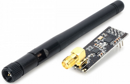

Le fait que deux cartes Arduino ou plus puissent communiquer entre elles sans fil à distance ouvre de nombreuses possibilités, telles que la surveillance à distance des données de capteurs, le contrôle des robots, la domotique, etc. Et lorsqu'il s'agit de solutions RF bidirectionnelles fiables et peu coûteuses, personne ne fait mieux que le module émetteur-récepteur nRF24L01 + de [Nordic Semiconductor](http://www.nordicsemi.com/) 

## Vue d'ensemble du matériel

### Fréquence radio

Le module d'émetteur-récepteur nRF24L01 + est conçu pour fonctionner dans la bande de fréquence ISM mondiale de 2,4 GHz et utilise la modulation GFSK pour la transmission de données. Le taux de transfert de données peut être l'un des 250 kbps, 1 Mbit/s et 2 Mbit/s. 

>**Quelle est la bande 2,4 GHz ISM?**  
La bande de 2,4 GHz est l'une des bandes industrielle, scientifique et médicale (ISM) réservées au niveau international pour l'utilisation d'appareils de faible puissance sans licence. Les exemples sont les téléphones sans fil, les périphériques Bluetooth, les périphériques de communication en champ proche (NFC) et les réseaux informatiques sans fil (WiFi) utilisent tous les fréquences ISM. 

### Consommation d'énergie

La tension de fonctionnement du module est comprise entre **1,9 et 3,6 V** , mais la bonne nouvelle est que les <u>broches logiques sont tolérantes à 5 V</u> , ce qui permet de le connecter facilement à un microcontrôleur Arduino ou à tout autre microprocesseur logique sans utiliser de convertisseur de niveau logique.

Le module prend en charge la puissance de sortie programmable, à savoir. 0 dBm, -6 dBm, -12 dBm ou -18 dBm et consomme incroyablement environ **12 mA pendant la transmission à 0 dBm**, ce qui est même inférieur à une seule LED. Et surtout, il consomme 26 µA en mode veille et 900 nA en mode veille. C'est pourquoi ils sont le périphérique sans fil de prédilection pour les applications à faible consommation. 

### Interface SPI

Le module émetteur-récepteur nRF24L01 + communique via une interface **SPI** (Serial Peripheral Interface) à 4 broches avec un débit binaire maximal de 10 Mbps . Tous les paramètres tels que le canal de fréquence (125 canaux sélectionnables), la puissance de sortie (0 dBm, -6 dBm, -12 dBm ou -18 dBm) et le débit de données (250kbps, 1Mbps ou 2Mbps) peuvent être configurés via l'interface SPI.

Le bus SPI utilise le concept de maître et d’esclave. Dans la plupart des applications, notre Arduino est le maître et le module émetteur-récepteur nRF24L01 + est l’esclave. Contrairement au bus I2C, le nombre d’esclaves sur le bus SPI est limité. Sur l’<u>Arduino Uno, vous pouvez utiliser un maximum de deux esclaves SPI</u>, c’est-à-dire deux modules émetteur-récepteur nRF24L01 +.

Spécification du module d'émetteur-récepteur nRF24L01 + : 

nRF24L01 + | spécification
--- | ---
Gamme de fréquences |	Bande ISM de 2,4 GHz
Débit de données aérien maximal |	2 Mb/s
Format de modulation |	GFSK
Max. Puissance de sortie |	0 dBm
Tension d'alimentation de fonctionnement |	1,9 V à 3,6 V
Max. Courant de fonctionnement |	13,5mA
Min. Courant (mode veille) |	26µA
Entrées logiques |	5V tolérant
Gamme de communication |	800+ m (ligne de mire)

Pour plus d'informations sur le nRF24L01 + IC, consultez la [fiche technique (pdf)](/files/nrf24L01+2.4ghz-transceiver-datasheet.pdf)

### nRF24L01+ module Vs nRF24L01+ PA/LNA module

Il existe toute une gamme de modules basés sur la puce nRF24L01 +. Voici les versions les plus populaires.

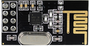  
*Module sans fil nRF24L01 +*   
La première version utilise une antenne intégrée. Cela permet une version plus compacte de l'évasion. Cependant, la petite antenne signifie également une plage de transmission inférieure. Avec cette version, vous pourrez communiquer sur une distance de 100 mètres . Bien sûr, c'est à l'extérieur dans un espace ouvert. Votre portée à l'intérieur, surtout à travers les murs, sera légèrement affaiblie.

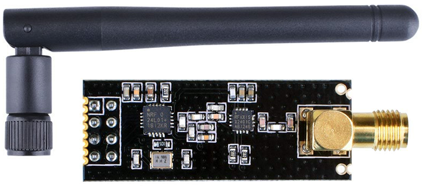  
*Module d'émetteur-récepteur sans fil LNA nRF24L01 + PA avec antenne externe*  
La deuxième version est livrée avec un connecteur SMA et une antenne canard, mais ce n'est pas la vraie différence. La vraie différence est qu’il est livré avec une puce spéciale RFX2401C qui intègre les circuits de commutation PA, LNA et émission-réception. Cette puce d'extension de portée, associée à une antenne de canard, aide le module à atteindre une portée de transmission considérablement plus grande, de l'ordre de 1000 m.

### Qu'est-ce que PA LNA?

Le PA signifie amplificateur de puissance . Il augmente simplement la puissance du signal transmis par la puce nRF24L01 +. Tandis que LNA signifie **amplificateur à faible bruit** . La fonction de la LNA est de prendre le signal extrêmement faible et incertain de l’antenne (généralement de l’ordre des microvolts ou inférieur à -100 dBm) et l’amplifier à un niveau plus utile (généralement entre 0,5 et 1V)  

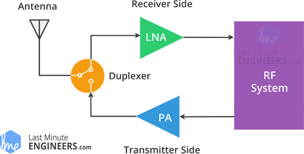  

L'amplificateur à faible bruit (LNA) du trajet de réception et l'amplificateur de puissance (PA) du trajet de transmission se connectent à l'antenne via un duplexeur, ce qui sépare les deux signaux et empêche la sortie relativement puissante du PA de surcharger l'entrée sensible du LNA. Pour plus d'informations, consultez cet [article sur digikey.com](https://www.digikey.com/en/articles/techzone/2013/oct/understanding-the-basics-of-low-noise-and-power-amplifiers-in-wireless-designs)

## Comment fonctionne le module émetteur-récepteur nRF24L01 +?

### Fréquence du canal RF

Le module émetteur-récepteur nRF24L01 + transmet et reçoit des données sur une certaine fréquence appelée canal . De plus, pour que deux ou plusieurs modules d'émetteur-récepteur puissent communiquer l'un avec l'autre, ils doivent se trouver sur le même canal. Ce canal peut être n’importe quelle fréquence dans la bande ISM à 2,4 GHz ou, plus précisément, entre 2 200 et 2 525 GHz (2 400 à 2 525 MHz).

Chaque canal occupe une largeur de bande inférieure à 1 MHz. Cela nous donne 125 canaux possibles avec un espacement de 1 MHz. Ainsi, le module peut utiliser 125 canaux différents, ce qui permet d’avoir un réseau de 125 modems fonctionnant de manière indépendante à un endroit.   
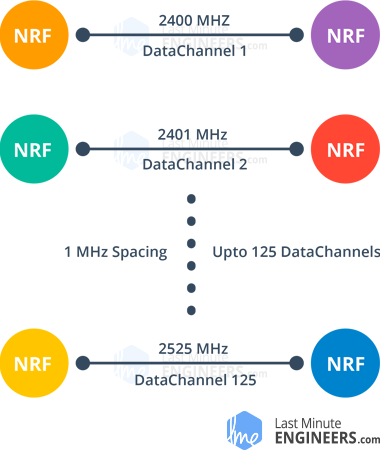  

>**REMARQUE : **  Le canal occupe une bande passante inférieure à 1 MHz à 250 kbps et à un débit binaire de 1 Mbps. Toutefois, à un débit binaire de 2 Mbits / s, une largeur de bande de 2 MHz est occupée (plus large que la résolution du paramètre de fréquence du canal RF). Ainsi, pour garantir des canaux ne se chevauchant pas et réduire la diaphonie en mode 2 Mbps, <u>vous devez conserver un espacement de 2 MHz entre deux canaux</u>. 

La fréquence de canal RF du canal sélectionné est définie selon la formule suivante:

    Freq(sélectionné) = 2400 + CH(sélectionné)

Par exemple, si vous sélectionnez 108 comme canal pour la transmission de données, la fréquence du canal RF de votre canal sera de 2508 MHz &rarr; (2400 + 108). 

### nRF24L01 + réseau multicouche

Le nRF24L01 + fournit une fonctionnalité appelée Multiceiver . C'est une abréviation pour plusieurs émetteurs, récepteur unique. Chaque canal RF est divisé logiquement en 6 canaux de données parallèles appelés canaux de données . En d'autres termes, un canal de données est un canal logique dans le canal RF physique. Chaque canal de données a sa propre adresse physique (adresse de canal de données) et peut être configuré. Ceci peut être illustré comme indiqué ci-dessous.   
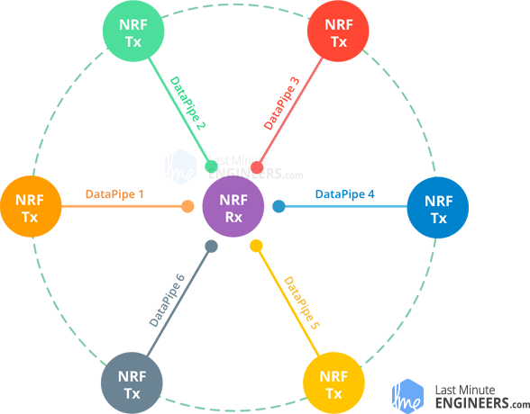  
Pour simplifier le diagramme ci-dessus, imaginez le récepteur principal agissant en tant que récepteur concentrateur collectant simultanément des informations de 6 nœuds d’émetteurs différents. Le récepteur pivot peut cesser d’écouter à tout moment et fait office d’émetteur. Mais cela ne peut être fait qu’un tuyau/noeud (pipe/node) à la fois.

### Protocole ShockBurst amélioré

Le module émetteur-récepteur nRF24L01 + utilise une structure de paquets appelée Enhanced ShockBurst. Cette structure de paquet simple est décomposée en 5 champs différents, illustrés ci-dessous.  
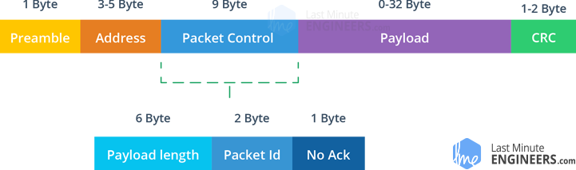  
La structure d'origine de ShockBurst ne comprenait que les champs Préambule, Adresse, Charge utile et Contrôle de redondance cyclique (CRC). ShockBurst amélioré a apporté une fonctionnalité accrue pour des communications améliorées utilisant un champ de commande de paquets (PCF) récemment introduit.

Cette nouvelle structure est excellente pour plusieurs raisons. Premièrement, il autorise les charges utiles de longueur variable avec un spécificateur de longueur de charge utile, ce qui signifie que les charges utiles peuvent varier de 1 à 32 octets.

Deuxièmement, il attribue à chaque paquet envoyé un identifiant de paquet, ce qui permet au périphérique récepteur de déterminer si un message est nouveau ou s'il a été retransmis (et peut donc être ignoré).

Enfin et surtout, chaque message peut demander l’envoi d’un accusé de réception lorsqu’il est reçu par un autre appareil. 

### nRF24L01 + Traitement automatique des paquets

Passons maintenant à trois scénarios pour mieux comprendre la façon dont deux modules nRF24L01 + se traitent.

**Transaction avec accusé de réception et interruption** 
Ceci est un exemple de scénario positif. Ici, l'émetteur commence une communication en envoyant un paquet de données au récepteur. Une fois que tout le paquet est transmis, il attend (environ 130 µs) la réception du paquet d'accusé de réception (paquet ACK). Lorsque le destinataire reçoit le paquet, il envoie un paquet ACK à l'émetteur. À la réception du paquet ACK, l'émetteur émet un signal d'interruption (IRQ) pour indiquer que les nouvelles données sont disponibles.  
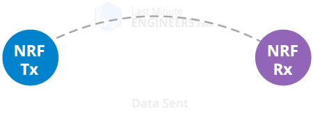  

**Transaction avec perte de paquet de données**  
Il s'agit d'un scénario négatif dans lequel une retransmission est nécessaire en raison de la perte du paquet transmis. Une fois le paquet transmis, l'émetteur attend la réception du paquet ACK. Si l'émetteur ne l'obtient pas dans le délai ARD (Auto-Retransmit-Delay), le paquet est retransmis. Lorsque le paquet retransmis est reçu par le récepteur, le paquet ACK est transmis, ce qui génère à son tour une interruption au niveau de l'émetteur.  
  

**Transaction avec accusé de réception perdu**  
Il s'agit à nouveau d'un scénario négatif dans lequel une retransmission est nécessaire en raison de la perte du paquet ACK. Ici, même si le destinataire reçoit le paquet lors de la première tentative, en raison de la perte du paquet ACK, l’émetteur pense que le destinataire n’a pas du tout reçu le paquet. Ainsi, une fois le délai de retransmission automatique écoulé, il retransmet le paquet. Désormais, lorsque le destinataire reçoit le paquet contenant le même identifiant de paquet que précédemment, il le rejette et envoie à nouveau le paquet ACK.  
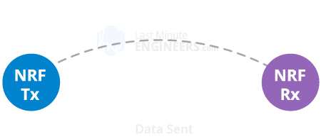  

## Brochage du module d'émetteur-récepteur nRF24L01 +

Examinons le brochage des deux versions du module émetteur-récepteur nRF24L01 +.   
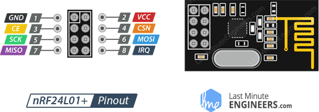  
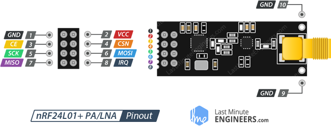  

* ***GND*** est la broche de terre. Il est généralement marqué en entourant la broche dans un carré afin de pouvoir être utilisé comme référence pour identifier les autres broches.
* ***VCC*** alimente le module. Cela peut être n'importe où de 1,9 à 3,9 volts. Vous pouvez le connecter à la sortie 3.3V de votre Arduino. N'oubliez pas que le connecter à une broche 5V détruira probablement votre module nRF24L01 +!
* ***CE*** (Chip Enable) est une broche active-HIGH. Lorsque sélectionné, le nRF24L01 transmettra ou recevra, selon le mode dans lequel il se trouve actuellement.
* ***CSN*** (Chip Select Not) est une broche active-LOW et est normalement maintenue à l'état HIGH. Lorsque cette broche devient faible, le nRF24L01 commence à écouter les données sur son port SPI et les traite en conséquence.
* ***SCK*** (Serial Clock) accepte les impulsions d'horloge fournies par le maître du bus SPI.
* ***MOSI*** (Master Out Slave In) est l'entrée SPI du nRF24L01.
* ***MISO*** (Master In Slave Out) est la sortie SPI du nRF24L01.
* ***IRQ*** est une broche d'interruption pouvant alerter le maître lorsque de nouvelles données sont disponibles pour traitement. 

## Arduino + émetteur-récepteur nRF24L01+

### Câblage - Connexion du module émetteur-récepteur nRF24L01+ à un Arduino UNO

Maintenant que nous comprenons parfaitement le fonctionnement du module émetteur-récepteur nRF24L01 +, nous pouvons commencer à le connecter à notre Arduino!

Pour commencer, connectez la broche VCC du module à 3,3 V sur l’Arduino et la broche GND à la terre. Les broches CSN et CE peuvent être connectées à n’importe quelle broche numérique de l’Arduino. Dans notre cas, il est connecté aux broches numériques n ° 8 et n ° 9 respectivement. Nous en sommes maintenant aux broches utilisées pour la communication SPI.

Le module émetteur-récepteur nRF24L01 + nécessitant beaucoup de transfert de données, il offrira les meilleures performances lorsqu'il est connecté aux broches SPI matérielles d'un microcontrôleur. Les broches SPI matérielles sont beaucoup plus rapides que le "bit-bang" du code d'interface à l'aide d'un autre ensemble de broches.

Notez que chaque carte Arduino a différentes broches SPI qui doivent être connectées en conséquence. Pour les cartes Arduino telles que UNO / Nano V3.0, ces broches sont numériques 13 (SCK), 12 (MISO) et 11 (MOSI).

Si vous avez un Mega, les pins sont différents! Vous voudrez utiliser les technologies numériques 50 (MISO), 51 (MOSI), 52 (SCK) et 53 (SS).  
Config. Broches SPI d’Arduino Uno, Arduino Nano et Arduino Mega  

_ |	MOSI | 	MISO |	SCK | SS
--- | --- | --- | --- | ---
Arduino Uno 	|11 |	12 |	13 | 10
Arduino Nano |	11 |	12 |	13 | 10
Arduino Mega |	51 |	50 |	52 | 53

Si vous utilisez une carte Arduino différente de celle mentionnée ci-dessus, il est conseillé de vérifier la [documentation officielle](https://www.arduino.cc/en/Reference/SPI) d'Arduino avant de poursuivre.  

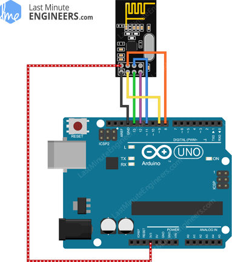  
*Câblage du module émetteur-récepteur sans fil nRF24L01 + sur Arduino UNO*

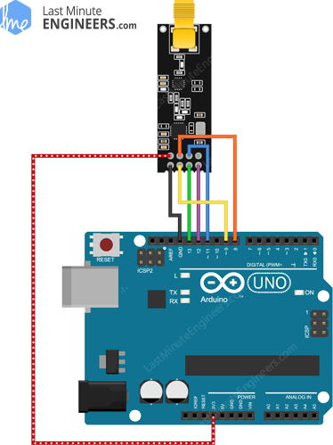  
*Câblage du module sans fil nRF24L01 + PA LNA à Arduino UNO*

>Vous devez faire deux de ces circuits. L'un agit comme émetteur et l'autre comme récepteur. Le câblage pour les deux est identique.

### RF24 Bibliothèque Arduino pour nRF24L01 + Module

L'interfaçage avec le module émetteur-récepteur nRF24L01 + est un travail fastidieux, mais heureusement pour nous, de nombreuses bibliothèques sont disponibles. [RF24](http://tmrh20.github.io/RF24/) est l’une des bibliothèques les plus populaires. Cette bibliothèque existe depuis plusieurs années. Il est simple à utiliser pour les débutants, mais offre encore beaucoup pour les utilisateurs avancés. Dans nos expériences, nous utiliserons la même bibliothèque.

Vous pouvez télécharger la dernière version de la bibliothèque sur le [fork du référentiel RF24 GitHub](https://github.com/nRF24/RF24) ou [télécharger le zip](https://lastminuteengineers.com/libraries/RF24-master.zip)  

Pour l'installer, ouvrez l'EDI Arduino, accédez à Esquisse> Inclure la bibliothèque> Ajouter une bibliothèque .ZIP, puis sélectionnez le fichier maître RF24 que vous venez de télécharger. Si vous avez besoin de plus de détails sur l’installation d’une bibliothèque, consultez ce [tutoriel sur l’installation d’une bibliothèque Arduino](https://www.arduino.cc/en/Guide/Libraries).

### Code Arduino - pour émetteur

Dans notre expérience, nous allons simplement envoyer un message traditionnel " Hello World " de l'émetteur au récepteur.

Voici le schéma que nous allons utiliser pour notre émetteur: 

```c
//Include Libraries
#include <SPI.h>
#include <nRF24L01.h>
#include <RF24.h>

//create an RF24 object
RF24 radio(9, 8);  // CE, CSN

//address through which two modules communicate.
const byte address[6] = "00001";

void setup()
{
  radio.begin();
  
  //set the address
  radio.openWritingPipe(address);
  
  //Set module as transmitter
  radio.stopListening();
}
void loop()
{
  //Send message to receiver
  const char text[] = "Hello World";
  radio.write(&text, sizeof(text));
  
  delay(1000);
}
```

L'esquisse commence par inclure les bibliothèques. La bibliothèque SPI.h gère la communication SPI tandis que nRF24L01.h et RF24.h contrôlent le module.

```c
//Include Libraries
#include <SPI.h>
#include <nRF24L01.h>
#include <RF24.h>
```

Ensuite, nous devons créer un objet RF24. L'objet prend deux numéros de broches en tant que paramètres auxquels les signaux CE et CSN sont connectés.

```c
//create an RF24 object
RF24 radio(9, 8);  // CE, CSN
```

Ensuite, nous devons créer un tableau d'octets qui représentera l'adresse du canal par lequel deux modules nRF24L01 + communiquent.

```c
//address through which two modules communicate.
const byte address[6] = "00001";
```

Nous pouvons modifier la valeur de cette adresse pour n’importe quelle chaîne de 5 lettres telle que «node1». L'adresse est nécessaire si vous avez quelques modules dans un réseau. Grâce à l'adresse, vous pouvez choisir un module particulier avec lequel vous souhaitez communiquer, de sorte que dans notre cas, nous aurons la même adresse pour l'émetteur et le récepteur.

Ensuite, dans la fonction de configuration: nous devons initialiser l'objet radio à l'aide de `radio.begin()` et en utilisant la fonction `radio.openWritingPipe()` , nous définissons l'adresse de l'émetteur. 

```c
//set the address
radio.openWritingPipe(address);
```

Enfin, nous utiliserons la fonction `radio.stopListening()` qui définit le module comme émetteur.

```c
//Set module as transmitter
radio.stopListening();
```

Dans la section de la boucle: nous créons un tableau de caractères auquel nous affectons le message «Hello World». En utilisant la fonction `radio.write()` , nous enverrons ce message au destinataire. Le premier argument ici est le message que nous voulons envoyer. Le deuxième argument est le nombre d'octets présents dans ce message.

```c
const char text[] = "Hello World";
radio.write(&text, sizeof(text));
```

Grâce à cette méthode, vous pouvez envoyer jusqu'à 32 octets à la fois. Parce que c’est la taille maximale d’un seul paquet que nRF24L01 + peut gérer. Si vous avez besoin d'une confirmation que le destinataire a reçu des données, la méthode `radio.write()` renvoie une valeur `bool` . S'il renvoie TRUE, les données sont parvenues au destinataire. S'il renvoie FALSE, les données ont été perdues.

>**REMARQUE :** la fonction `radio.write()` bloque le programme jusqu'à ce qu'il reçoive l'accusé de réception ou qu'il n'y ait plus aucune tentative de retransmission. 

### Code Arduino - Pour le récepteur

Voici le croquis que nous allons utiliser pour notre récepteur 

```c
//Include Libraries
#include <SPI.h>
#include <nRF24L01.h>
#include <RF24.h>

//create an RF24 object
RF24 radio(9, 8);  // CE, CSN

//address through which two modules communicate.
const byte address[6] = "00001";

void setup()
{
  while (!Serial);
    Serial.begin(9600);
  
  radio.begin();
  
  //set the address
  radio.openReadingPipe(0, address);
  
  //Set module as receiver
  radio.startListening();
}

void loop()
{
  //Read the data if available in buffer
  if (radio.available())
  {
    char text[32] = {0};
    radio.read(&text, sizeof(text));
    Serial.println(text);
  }
}
```

Ce programme ressemble beaucoup au programme de l'émetteur, à l'exception de quelques modifications.

Au début de la fonction de configuration, nous commençons la communication série. Ensuite, en utilisant la fonction `radio.setReadingPipe()` , nous définissons la même adresse que celle de l’émetteur, ce qui permet la communication entre l’émetteur et le récepteur. 

```c
  //set the address
  radio.openReadingPipe(0, address);
```

Le premier argument est le numéro du flux. Vous pouvez créer jusqu'à 6 flux qui répondent à différentes adresses. Nous avons créé uniquement l'adresse pour le numéro de flux 0. Le deuxième argument est l'adresse à laquelle le flux réagira pour collecter les données.

L'étape suivante consiste à définir le module en tant que récepteur et à commencer à recevoir des données. Pour ce faire, nous utilisons la fonction `radio.startListening()`. À partir de ce moment, le modem attend les données envoyées à l'adresse spécifiée. 

```c
//Set module as receiver
  radio.startListening();
```

Dans la fonction de boucle: L'esquisse vérifie si des données sont arrivées à l'adresse à l'aide de la méthode `radio.available()` . Cette méthode renvoie la valeur TRUE si des données sont disponibles dans la mémoire tampon.

```c
if (radio.available())
  {
    char text[32] = {0};
    radio.read(&text, sizeof(text));
    Serial.println(text);
  }

```

Si les données sont reçues, un tableau de 32 caractères rempli de zéros est créé (plus tard, le programme le remplira avec les données reçues). Pour lire les données, nous utilisons la méthode `radio.read (& text, sizeof (text))` . Cela va stocker les données reçues dans notre tableau de caractères.

À la fin, nous imprimons simplement le message reçu sur le moniteur série. Si vous avez tout fait correctement et qu'il n'y a pas d'erreur dans les connexions, vous devriez voir quelque chose comme ceci dans votre moniteur série.   
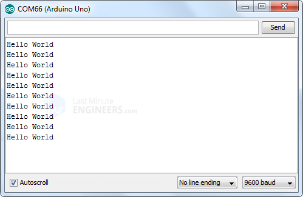  
*nRF24L01 + sortie de l'émetteur-récepteur sur le moniteur série*

## Amélioration de la portée du module émetteur-récepteur nRF24L01 +

Un paramètre clé pour un système de communication sans fil est la plage de communication. Dans de nombreux cas, c'est le facteur décisif pour choisir une solution RF. Discutons donc de ce que nous pouvons faire pour améliorer la portée de notre module.

### Réduire le bruit d'alimentation

Un circuit RF qui génère un signal RF est très sensible au bruit de l'alimentation. S'il n'est pas contrôlé, le bruit de l'alimentation peut réduire considérablement la portée que vous pouvez obtenir.

À moins que la source d'alimentation ne soit une batterie autonome, il y a de fortes chances pour qu'il y ait du bruit associé à la génération de l'énergie. Pour éviter que ce bruit ne pénètre dans le système, il est conseillé de placer un condensateur de filtrage de 10 µf sur la ligne d' alimentation , aussi près que possible du module nRF24L01 +.

Pour vous en sortir le plus facilement, utilisez un module d’adaptateur très économique pour nRF24L01.  
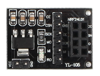  
*nRF24L01 + adaptateur*  
Le module adaptateur dispose d’un connecteur femelle à 8 broches pour vous permettre de brancher votre module nRF24L01. Il peut accueillir à la fois le module dont nous avons parlé précédemment, celui avec antenne intégrée et l’autre avec antenne externe (PA / LNA). Il possède également un connecteur mâle à 6 broches pour les connexions SPI et Interrupt et un connecteur à 2 broches pour l’alimentation.

Le module adaptateur possède son propre régulateur de tension de 3,3 volts et un ensemble de condensateurs de filtrage, ce qui vous permet de l’alimenter avec une alimentation de 5 volts. 

### Changer la fréquence de votre canal

L’environnement extérieur est une autre source potentielle de bruit pour un circuit RF, en particulier si vous avez des réseaux voisins fixés sur le même canal ou des interférences provenant d’autres composants électroniques.

Pour éviter que ces signaux ne causent des problèmes, nous vous suggérons d’<u>**utiliser les 25 canaux les plus élevés de votre module nRF24L01 +**</u>. La raison en est que le WiFi utilise la plupart des canaux inférieurs. 

### Taux de données inférieur

Le nRF24L01 + offre la plus haute sensibilité de récepteur à une vitesse de 250 Kbits/s, soit -94dBm. Cependant, à un débit de 2 Mbits/s, la sensibilité du récepteur chute à -82dBm. Si vous parlez cette langue, vous savez que le récepteur à 250 Kbps est près de 10 fois plus sensible que celui à 2 Mbps.  
Cela signifie que le récepteur peut décoder un signal 10 fois plus faible.

>**Que signifie sensibilité du récepteur (Rx)?**  
La sensibilité du récepteur est le niveau de puissance le plus bas auquel le récepteur peut détecter un signal RF. Plus la valeur absolue du nombre négatif est grande, meilleure est la sensibilité du récepteur. Par exemple, une sensibilité du récepteur de -94 dBm est préférable à une sensibilité du récepteur de -82 dBm sur 12 dB.

Donc, réduire le débit de données peut considérablement améliorer la portée que vous pouvez atteindre. En outre, pour la plupart de nos projets, une vitesse de 250 Kbps est plus que suffisante. 

### Puissance de sortie supérieure

Le réglage de la puissance de sortie maximale peut également améliorer la portée de communication. Le nRF24L01 + vous permet de choisir l’une des valeurs de puissance de sortie. 0 dBm, -6 dBm, -12 dBm ou -18 dBm. La sélection d’ une puissance de sortie de 0 dBm envoie un signal plus fort dans les airs. 


