+++
title = 'RPI3B - Raspbian Desktop Buster, client Wireguard, Kodi (INACTIF)'
date = 2020-08-16 00:00:00 +0100
categories = ['raspberry', 'vpn']
+++
*Le Raspberry Pi est un nano-ordinateur monocarte à processeur ARM*  

## {:width="30"}  Spécifications du Raspberry Pi 3 modèle B

{:width="300"}  
*Raspberry Pi 3B V1.2*

*    Un processeur ARMv8 quad-core 64 bits à 1,2 GHz
*    LAN sans fil 802.11n
*    Bluetooth 4.1
*    Bluetooth Low Energy (BLE)
*    1 Go de RAM
*    4 ports USB
*    40 broches GPIO
*    Port HDMI complet
*    port Ethernet
*    Prise audio 3,5 mm et vidéo composite combinées
*    Interface de caméra (CSI)
*    Interface d'affichage (DSI)
*    Emplacement pour carte Micro SD (maintenant push-pull plutôt que push-push)
*    Noyau graphique 3D VideoCore IV 


## Raspbian Desktop Buster

{:width="60"}

### SDcard

Sur un ordinateur , connecté une SDcard via un interface USB et relever son identification par `dmesg`  
[Télécharger le ZIP](https://www.raspberrypi.org/downloads/raspbian/) de la dernière image **Raspbian Buster with desktop** et vérifier le checksum  

Identifier le périphérique SDcard après insertion

    dmesg

```
[16890.577559] sd 5:0:0:0: [sde] Attached SCSI removable disk
```

La sdcard est attachée à /dev/sdf

Décompresser et "flasher" la SDcard avec le fichier zip téléchargé

    unzip -p 2020-05-27-raspios-buster-armhf.zip | sudo dd of=/dev/sdf bs=4M conv=fsync

>**ATTENTION !!!** Pas d'accès à la carte raspberry en mode terminal par la liaison série ou SSH  
*Les dernières versions de Raspbian nécessitent un écran et un clavier, car il n'est plus possible de se connecter directement par la liaison série ou en SSH au Raspberry par défaut.  

### Activer la liaison série et SSH

Cela nécessite 2 opérations

1. Activer le lancement de SSH au boot ,placer dans la partition **boot** de la carte SD un fichier nommé **ssh**, vide et sans extension.  
2. Activer la liaison série ,il faut ajouter `enable_uart=1` à la fin du fichier de configuration **config.txt**  et avant insertion de la SDcard dans le raspberry  

**Pour réaliser ces 2 opérations:**  
Retirer le lecteur USB/SDcard puis le réinsérer  
identifier le périphérique SDcard avec la commande `dmesg`

    dmesg

```
[11948.379238]  sde: sde1 sde2
[11948.383312] sd 5:0:0:0: [sde] Attached SCSI removable disk
```

On identifie 2 partitions sde1 et sde2  
Montage de la SDcard (sde1 qui correspond au **boot**) sur un dossier temporaire

```
mkdir -p /mnt/usb  # dossier temporaire
sudo mount /dev/sdf1 /mnt/usb # Montage de la SDcard (sde1 qui correspond au boot) sur un dossier temporaire
sudo touch /mnt/usb/ssh # Ajout du fichier ssh pour activer le lancement de SSH au boot
sudo su -c "echo 'enable_uart=1' >> /mnt/usb/config.txt" # Modifier le fichier config.txt pour activer la liaison série 
sudo umount /mnt/usb # Démontage et insertion SDcard dans le raspberry 
```

>Remplacer **sde** suivant le dmesg (sdb,sdc,sdd,etc...)

### Liaison USB/Série

**ATTENTION** , il faut utiliser une liaison USB/Série pour l'installation de raspian-lite   
{:width="150"}

|interface USB/Série|Raspberry|
| :----------------: | :-------:|
| GND | 6 |
| Rxd | 8 (Txd) |
| Txd | 10 (Rxd) |

Exécuter le logiciel de communication (minicom ou screen)  

    sudo minicom # Débit/Parité/Bits:115200 8N1,Contrôle de flux matériel:Non,Contrôle de flux logiciel:Non
        OU
    sudo screen /dev/ttyUSB0 115200

>**Insérer la SDCard dans le logement du Raspberry ,connecter le câble HDMI, le cordon réseau et la liaison série**  

### Alimenter la carte raspberry

brancher la micro-usb d'alimentation  sur la carte raspberry et enfin le DC-Pack sur le secteur  
patienter quelques minutes...  

Utilisateur : pi   
Mot de passe session raspbian : raspberry

### Mise à jour  firmware

    sudo rpi-update

```bash
 *** Raspberry Pi firmware updater by Hexxeh, enhanced by AndrewS and Dom                                                     
 *** Performing self-update                                                                                                   
 *** Relaunching after update                                                                                                 
 *** Raspberry Pi firmware updater by Hexxeh, enhanced by AndrewS and Dom                                                     
 *** We're running for the first time                                                                                         
 *** Backing up files (this will take a few minutes)                                                                          
 *** Backing up firmware                                                                                                      
 *** Backing up modules 4.19.118-v7+                                                                                          
#############################################################                                                                 
WARNING: This update bumps to rpi-5.4.y linux tree                                                                            
See: https://www.raspberrypi.org/forums/viewtopic.php?f=29&t=269769                                                           
                                                                                                                              
'rpi-update' should only be used if there is a specific                                                                       
reason to do so - for example, a request by a Raspberry Pi                                                                    
engineer or if you want to help the testing effort                                                                            
and are comfortable with restoring if there are regressions.                                                                  
                                                                                                                              
DO NOT use 'rpi-update' as part of a regular update process.                                                                  
                                                                                                                              
##############################################################                                                                
Would you like to proceed? (y/N)                                                                                              
 *** Downloading specific firmware revision (this will take a few minutes)                                                    
  % Total    % Received % Xferd  Average Speed   Time    Time     Time  Current                                               
                                 Dload  Upload   Total   Spent    Left  Speed                                                 
100   168  100   168    0     0   1217      0 --:--:-- --:--:-- --:--:--  1217  
100  115M  100  115M    0     0  1055k      0  0:01:52  0:01:52 --:--:-- 1258k                                                
 *** Updating firmware                                                                                                        
 *** Updating kernel modules                                                                                                  
 *** depmod 5.4.58-v7l+                                                                                                       
 *** depmod 5.4.58+                                                                                                           
 *** depmod 5.4.58-v7+                                                                                                        
 *** depmod 5.4.58-v8+                                                                                                        
 *** Updating VideoCore libraries                                                                                             
 *** Using HardFP libraries                                                                                                   
 *** Updating SDK                                                                                                             
 *** Running ldconfig                                                                                                         
 *** Storing current firmware revision                                                                                        
 *** Deleting downloaded files                                                                                                
 *** Syncing changes to disk                                                                                                  
 *** If no errors appeared, your firmware was successfully updated to 23141000a5eae7ddbe11d4ac283198afd3031263                
 *** A reboot is needed to activate the new firmware                                                                          
```

*Cette mise à jour passe à l'arbre linux rpi-5.4.y*  
Redémarrer le raspberry

### Mise à jour Raspbian

    sudo apt update && sudo apt dist-upgrade -y

Patienter de 2 à 10 minutes ...   

Relever l'adresse IP

    ip a

```
[...]
2: eth0: <BROADCAST,MULTICAST,UP,LOWER_UP> mtu 1500 qdisc pfifo_fast state UP group default qlen 1000
    link/ether b8:27:eb:54:7e:6a brd ff:ff:ff:ff:ff:ff
    inet 192.168.0.23/24 brd 192.168.0.255 scope global noprefixroute eth0
       valid_lft forever preferred_lft forever
[...]
3: wlan0: <NO-CARRIER,BROADCAST,MULTICAST,UP> mtu 1500 qdisc pfifo_fast state DOWN group default qlen 1000
    link/ether b8:27:eb:01:2b:3f brd ff:ff:ff:ff:ff:ff
```

Redémarrer le rpi

    sudo reboot

Se connecter au RPI via SSH

    ssh pi@192.168.0.23

Versions

    uname -a && cat /etc/debian_version

```bash
Linux raspberrypi 5.4.51-v7+ #1333 SMP Mon Aug 10 16:45:19 BST 2020 armv7l GNU/Linux
10.4
```

## Wireguard

{:width="40"}

L'étape suivante consiste à installer la seule condition préalable, les fichiers d'en-tête du noyau.

    sudo apt install raspberrypi-kernel-headers

>la version des en-têtes dépendra de la version du noyau du système d'exploitation

Ce processus est long, en particulier sur le Pi avec le BCM2835 SoC.  
Vérifiez que les versions du noyau et de l'en-tête du noyau correspondent.

    apt-cache policy raspberrypi-kernel*

```bash
raspberrypi-kernel:
  Installed: 1.20200811-1
  Candicreat: 1.20200811-1
  Version table:
 *** 1.20200811-1 500
        500 http://archive.raspberrypi.org/debian buster/main armhf Packages
        100 /var/lib/dpkg/status
raspberrypi-kernel-headers:
  Installed: 1.20200811-1
  Candicreat: 1.20200811-1
  Version table:
 *** 1.20200811-1 500
        500 http://archive.raspberrypi.org/debian buster/main armhf Packages
        100 /var/lib/dpkg/status
```

les instructions pour installer le paquet du dépôt de tests Raspbian

    echo "deb http://archive.raspbian.org/raspbian testing main" | sudo tee --append /etc/apt/sources.list.d/testing.list

On ne veut pas que les 367 (365 pour oldpi) paquets de la distribution stable actuelle soient remplacés par des versions du dépôt testing, baisser la priorité des paquets du dépôt testing à 50

    printf 'Package: *\nPin: release a=testing\nPin-Priority: 50\n' | sudo tee --append /etc/apt/preferences.d/limit-testing
    sudo apt update

les paquets WireGuard peuvent maintenant être installés.

    apt-cache policy wireguard*

```bash
wireguard-dkms:
  Installed: (none)
  Candicreat: 1.0.20200712-1
  Version table:
     1.0.20200712-1 50
         50 http://archive.raspbian.org/raspbian testing/main armhf Packages
wireguard-modules:
  Installed: (none)
  Candicreat: (none)
  Version table:
wireguard-tools:
  Installed: (none)
  Candicreat: 1.0.20200513-1
  Version table:
     1.0.20200513-1 50
         50 http://archive.raspbian.org/raspbian testing/main armhf Packages
wireguard:
  Installed: (none)
  Candicreat: 1.0.20200513-1
  Version table:
     1.0.20200513-1 50
         50 http://archive.raspbian.org/raspbian testing/main armhf Packages
```

Le package wireguard est un "métapackage" dont le but est d'installer des dkms et des outils wireguard.

    sudo apt install wireguard -y

 Vérification de la bonne installation de WireGuard toc

Il est maintenant possible de vérifier que les services de WireGuard ont été installés.

    which wg wg-quick

```bash
/usr/bin/wg
/usr/bin/wg-quick
```

Pour tester davantage l'installation, créons un fichier de configuration d'interface vide et affichons l'interface.

    sudo touch /etc/wireguard/wg0.conf
    sudo wg-quick up wg0

```bash
[#] ip link add wg0 type wireguard
[#] wg setconf wg0 /dev/fd/63
[#] ip link set mtu 1420 up dev wg0
```

La vérification montre que le module WireGuard a été chargé et que l'interface réseau est créée, et que le serveur est opérationnel et attend les paquets UDP entrants sur le port 40213. Le port peut être différent, car il est choisi au hasard, pour autant que je puisse le distinguer.

    lsmod | grep wire

```bash
wireguard             131072  0
ip6_udp_tunnel         16384  1 wireguard
udp_tunnel             16384  1 wireguard
ipv6                  450560  27 wireguard
```

Cependant, il est plutôt inutile de parler de l'interface car elle ne fera rien sans une configuration adéquate. Il est tout aussi facile de démonter l'interface et d'arrêter le serveur, mais notez que le module WireGuard reste chargé.

    sudo wg-quick down wg0

## raspi-config 

Configurer raspbin 

    sudo raspi-config

* Change User Password (pi49450)
* Localisation Options Set up language and regional settings to match your location
    *  Change Locale  &rarr; **fr_FR.UTF-8 UTF-8** 
    *  Change Timezone &rarr;  **Europe/Paris**
    *  Change Keyboard Layout
    *  Change Wi-fi Country &rarr; **FR-France**
* Interfacing Options  Configure connections to peripherals
    * Activer SSH
    * Activer VNC `Created symlink /etc/systemd/system/multi-user.target.wants/vncserver-x11-serviced.service → /usr/lib/systemd/system/vncserver-x11-serviced.service`

Redémarrer le RPI: `sudo systemctl reboot`

### OpenSSH, clé et script

{:width="100"}

**connexion avec clé**  
<u>sur l'ordinateur de bureau</u>
Générer une paire de clé curve25519-sha256 (ECDH avec Curve25519 et SHA2) nommé **kvm-cinay** pour une liaison SSH avec le RaspberryPI 3B.  

    ssh-keygen -t ed25519 -o -a 100 -f ~/.ssh/rpi-3b

Envoyer la clé publique sur le RaspberryPI 3B   

    scp ~/.ssh/rpi-3b.pub pi@192.168.0.23:/home/pi/

<u>sur le RaspberryPI 3B</u>
On se connecte  

    ssh pi@192.168.0.23

Copier le contenu de la clé publique dans /home/$USER/.ssh/authorized_keys  

    cd ~

Sur le KVM ,créer un dossier .ssh  

```bash
mkdir .ssh
cat $HOME/rpi-3b.pub >> $HOME/.ssh/authorized_keys
```

et donner les droits  

    chmod 600 $HOME/.ssh/authorized_keys

effacer le fichier de la clé  

    rm $HOME/rpi-3b.pub

Modifier la configuration serveur SSH  

    sudo nano /etc/ssh/sshd_config

Modifier

```conf
Port 55038
PasswordAuthentication no
```


<u>session SSH ne se termine pas correctement lors d'un "reboot" à distance</u>  
Si vous tentez de **redémarrer/éteindre** une machine distance par **ssh**, vous pourriez constater que votre session ne se termine pas correctement, vous laissant avec un terminal inactif jusqu'à l'expiration d'un long délai d'inactivité. Il existe un bogue 751636 à ce sujet. Pour l'instant, la solution de contournement à ce problème est d'installer :  

    sudo apt install libpam-systemd  # installé par défaut sur debian buster

cela terminera la session ssh avant que le réseau ne tombe.  
Veuillez noter qu'il est nécessaire que PAM soit activé dans sshd.  

Relancer openSSH  

    sudo systemctl restart sshd

Accès depuis le poste distant avec la clé privée  

    ssh -p 55038 -i ~/.ssh/rpi-3b pi@192.168.0.23

### Outils et bash

{:width="100"}

Installer utilitaires

    sudo apt install tmux figlet curl jq tree git -y

Motd

    sudo rm /etc/motd && sudo nano /etc/motd

```
  ___  ___  ___                                   
 | _ \| _ \|_ _|                                  
 |   /|  _/ | |                                   
 |_|_\|_| _|___|  _   __  ___     __     ___  ____
 / |/ _ \|_  )   / | / / ( _ )   /  \   |_  )|__ /
 | |\_, / / /  _ | |/ _ \/ _ \ _| () |_  / /  |_ \
 |_| /_/ /___|(_)|_|\___/\___/(_)\__/(_)/___||___/
```            

Script ssh_rc_bash

>ATTENTION!!! Les scripts sur connexion peuvent poser des problèmes pour des appels externes autres que ssh

    wget https://yann.cinay.eu/files/ssh_rc_bash
    chmod +x ssh_rc_bash # rendre le bash exécutable
    ./ssh_rc_bash        # exécution

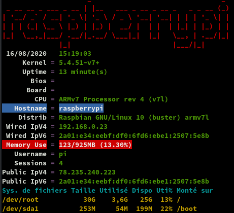

**journalctl** : Ajout utilisateur courant au groupe systemd-journal et adm

    sudo gpasswd -a $USER systemd-journal
    sudo gpasswd -a $USER adm

Lignes non tronquées ,ajouter au fichier ~/.bashrc

echo "export SYSTEMD_LESS=FRXMK journalctl" >> /home/$USER/.bashrc

**Historique de la ligne de commande**  
Ajoutez la recherche d’historique de la ligne de commande au terminal.
Tapez un début de commande précédent, puis utilisez shift + up (flèche haut) pour rechercher l’historique filtré avec le début de la commande.

```
# Global, tout utilisateur
echo '"\e[1;2A": history-search-backward' | sudo tee -a /etc/inputrc
echo '"\e[1;2B": history-search-forward' | sudo tee -a /etc/inputrc
```

Prise en compte après déconnexion/reconnexion

## Wifi

{:width="50"}

Le mot de passe peut être configuré soit en représentation ASCII, entre guillemets, soit en nombre hexadécimal pré-crypté de 32 octets. Vous pouvez utiliser l'utilitaire `wpa_passphrase` pour générer un PSK crypté. Cela prend le SSID et le mot de passe, et génère le PSK chiffré.  
Exemple ,générer le PSK avec `wpa_passphrase testing` ,on vous demandera le mot de passe du réseau WiFi 

    wpa_passphrase testing

```
# reading passphrase from stdin
kkauyhdhsdjhuhvuhj ndjnvbidjnbv45jjj
network={
	ssid="testing"
	#psk="kkauyhdhsdjhuhvuhj ndjnvbidjnbv45jjj"
	psk=4f1dafd234cd5ae9d90548c897c07b7ed7c301c7723d253ddee77d8d24628e41
}
```

Modifier le fichier **/etc/wpa_supplicant/wpa_supplicant.conf** avec le mot de passe encodé

## Trucs et astuces

* [14 trucs à connaître pour personnaliser Raspbian PIXEL](https://www.framboise314.fr/14-trucs-a-connaitre-pour-personnaliser-raspbian-pixel/)

### Supprimer la mise en veille

Ouvrez le fichier lightdm.conf: `sudo nano /etc/lightdm/lightdm.conf`  
Cherchez la section **[Seat:*]**, repérez la ligne `#xserver-command=X`  
Enlevez le # qui se trouve en début de ligne pour activer l’envoi de commandes au serveur X et modifier la ligne comme suit :   
`xserver-command=X -s 0 -dpms`

**DPMS** c’est **D**isplay **P**ower **M**anagement **S**ignaling = Gestion de l’alimentation du moniteur vidéo. Il faut lui dire qu’on ne veut pas de délai avant extinction du moniteur en cas d’inactivité du serveur X. C’est le rôle du **-s 0**, le **0** signifiant qu’on désactive la mise en veille du moniteur.

### Splash screen

Suppression , enlever le mot **splash** qui est celui qui suit **quiet** dans le fichier ** /boot/cmdline.txt**


### overclocking

*overclocker le Raspberry Pi 3 Model B*

La configuration inactive par défaut de la carte Raspberry Pi 3 est arm_freq = 600 et core_freq = 250. Le paramètre arm_freq ajoute encore de la chaleur à la carte lorsqu'il est poussé au-delà du maximum par défaut de 1,2 GHz, donc nous n'y touchons pas. Cela permet simplement à la carte Raspberry Pi 3 de fonctionner à des valeurs par défaut maximales qui sont arm_freq = 1200 et core_freq = 400. Pour ce faire, définissez simplement ces lignes dans votre **/bootconfig.txt**:

    force_turbo = 1 #Voide la garantie!
    boot_delay = 1 # aide à éviter la corruption de la carte SD lorsque force_turbo est activé.

### Raspberry Pi 3 allocation gpu_mem (1 Go de mémoire)

gpu_mem (mémoire GPU) est mesuré en mégaoctets et définit la répartition de la mémoire entre le CPU et le GPU; le CPU obtient la mémoire restante. La valeur minimale est de 16. Si vous utilisez par exemple le Raspberry Pi 3 comme émulateur de jeu, lecteur multimédia ou si vous utilisez un environnement de bureau (LXDE, XFCE, Maynard, etc.), vous voudrez augmenter gpu_mem à au moins 256. Activé d'autre part, si vous utilisez le Raspberry Pi en tant que serveur Web, pour construire un drone ou simplement un projet basé sur une console, vous devez réduire gpu_mem à 16. En d'autres termes, si vos besoins sont graphiques, augmentez la mémoire du GPU, sinon , abaissez-le au minimum.

par exemple. Serveur Web, point d'accès sans fil, pare-feu, station météo, etc.

    gpu_mem = 16 

ou pour une utilisation GUI, par exemple. OpenELEC, Raspbmc, RetroPie, XFCE, etc.

    gpu_mem = 320 

### les modifications du fichier config.txt

```
force_turbo=1 #Voids Warranty!
boot_delay=1  #helps to avoid sdcard corruption when force_turbo is enabled.

gpu_mem = 320 # utilisation GUI, Raspbian,  OpenELEC, Raspbmc, RetroPie, XFCE, $
disable_splash=1
```

### Bluetooth (DESACTIVE)

{:width="50"}

Désactiver

    systemctl stop bthelper@hci0.service
    systemctl disable bthelper@hci0.service
    systemctl stop bluetooth.service
    systemctl disable bluetooth.service

### Configuration client Wireguard

Les paramètres wg0.conf sont téléchargeables depuis le serveur wiregard wg.cinay.eu  
Lancer manuellement Wireguard

    sudo -s
    cd /etc/wireguard
    wg-quick up wg0

```
[#] ip link add wg0 type wireguard
[#] wg setconf wg0 /dev/fd/63
[#] ip -6 address add fd87:9aa8:e67c:5a80::5/128 dev wg0
[#] ip -4 address add 10.55.22.5/32 dev wg0
[#] ip link set mtu 1420 up dev wg0
[#] resolvconf -a wg0 -m 0 -x
Too few arguments.
Too few arguments.
[#] wg set wg0 fwmark 51820
[#] ip -6 route add ::/0 dev wg0 table 51820
[#] ip -6 rule add not fwmark 51820 table 51820
[#] ip -6 rule add table main suppress_prefixlength 0
[#] ip6tables-restore -n
[#] ip -4 route add 0.0.0.0/0 dev wg0 table 51820
[#] ip -4 rule add not fwmark 51820 table 51820
[#] ip -4 rule add table main suppress_prefixlength 0
[#] sysctl -q net.ipv4.conf.all.src_valid_mark=1
[#] iptables-restore -n
```

>NOTE : Si vous rencontrez l'erreur « Error: Unknown device type. », c'est que le module wireguard n'est pas chargé dans le noyau Linux.

Vérifier

    ip a

```
[...]
4: wg0: <POINTOPOINT,NOARP,UP,LOWER_UP> mtu 1420 qdisc noqueue state UNKNOWN group default qlen 1000
    link/none 
    inet 10.55.22.5/32 scope global wg0
       valid_lft forever preferred_lft forever
    inet6 fd87:9aa8:e67c:5a80::5/128 scope global 
       valid_lft forever preferred_lft forever
```

Pour un démarrage auto

    sudo systemctl enable wg-quick@wg0

## VNC

{:width="50"}

Il faut activer le service VNC via `raspi-config` &rarr; **5 Interfacing Options** &rarr; **P3 VNC**  

On peut également l'activer par systemd  

    systemctl start vncserver-x11-serviced
    systemctl enable vncserver-x11-serviced
    systemctl status vncserver-x11-serviced

```
● vncserver-x11-serviced.service - VNC Server in Service Mode daemon
   Loaded: loaded (/usr/lib/systemd/system/vncserver-x11-serviced.service; enabled; vendor preset: e
   Active: active (running) since Thu 2020-02-27 15:57:52 CET; 3min 58s ago
 Main PID: 29192 (vncserver-x11-s)
    Tasks: 5 (limit: 2200)
   Memory: 44.1M
   CGroup: /system.slice/vncserver-x11-serviced.service
           ├─29192 /usr/bin/vncserver-x11-serviced -fg
           ├─29193 /usr/bin/vncserver-x11-core -service
           ├─29202 /usr/bin/vncagent service 15
           ├─29210 /usr/bin/vncserverui service 16
           └─29227 /usr/bin/vncserverui -statusicon 5
```

### VNC Client

**Client VNC Viewer** [linux standalone x64](https://www.realvnc.com/fr/connect/download/viewer/linux/)  
vérifier le checksum : `sha256sum VNC-Viewer-*`    
Déplacer le fichier dans **/usr/local/bin** avec le nom souhaité : `sudo cp VNC-Viewer-* /usr/local/bin/realvnc`   
Ouvrir par Alt F2 :  `realvnc`

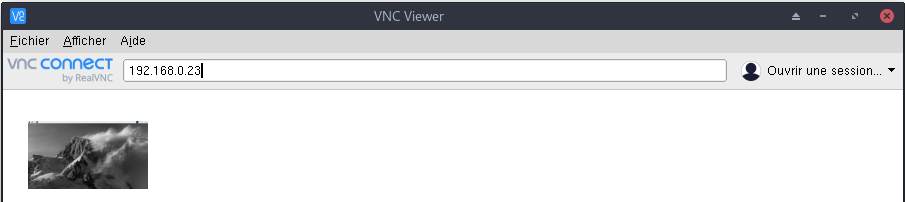{:width="400"}  
Saisir l'adresse ip 192.168.0.23

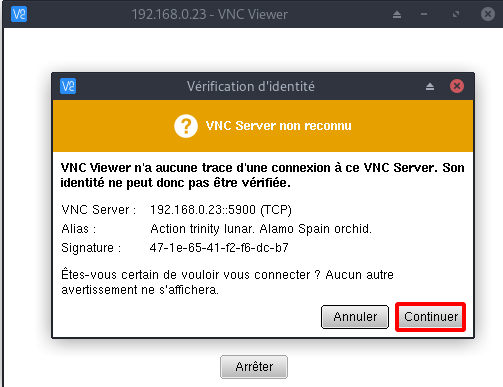{:width="400"}  
Cliquer sur Continuer

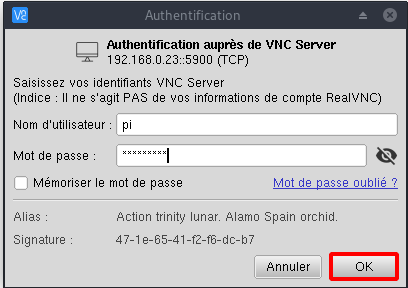{:width="400"}  
Saisir login/mot de passe

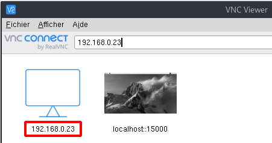{:width="400"}  

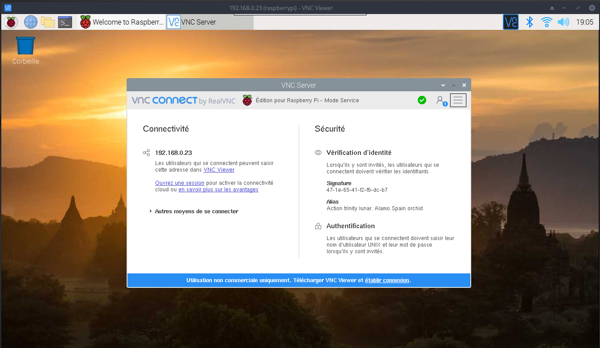{:width="600"}  

## Configuration bureau

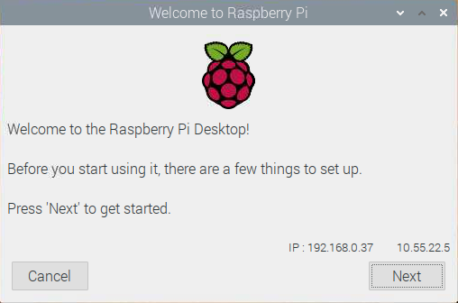{:width="300"} {:width="300"}   
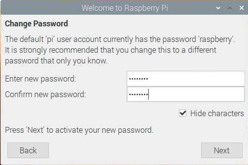{:width="300"} 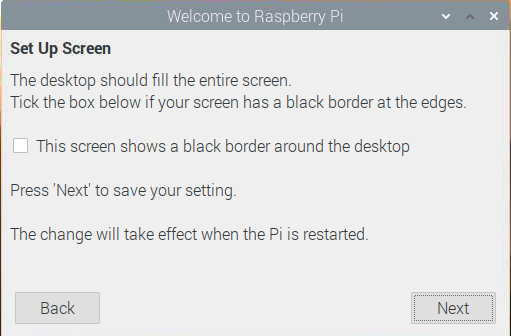{:width="300"}   
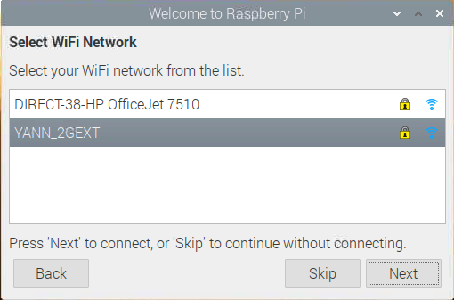{:width="300"} 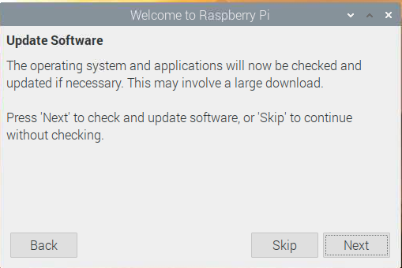{:width="300"}   
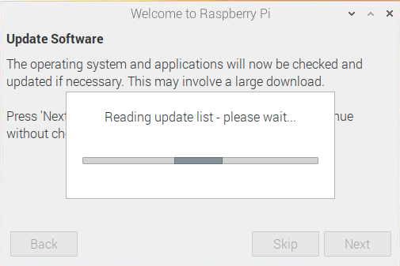{:width="300"} 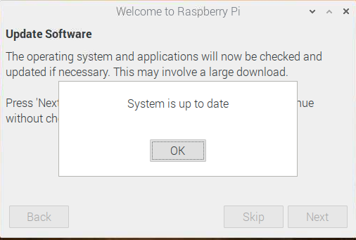{:width="300"}   

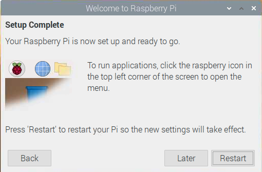{:width="300"}   

### Firefox

{:width="50"}

Par defaut , chromium est installé
On va ajouter firefox

Installation  
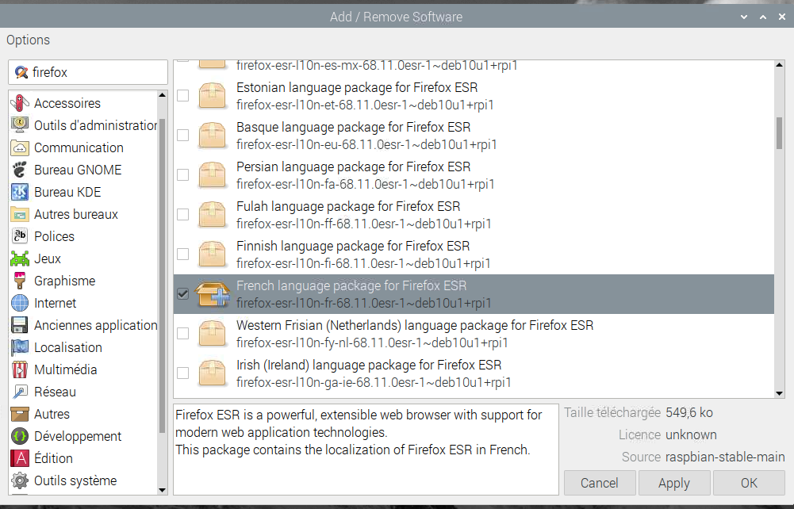{:width="400"}  
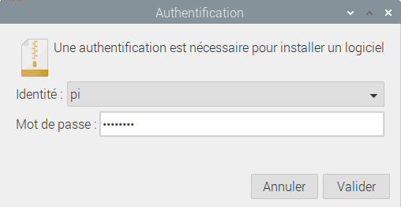{:width="200"} 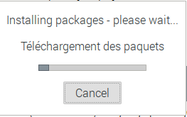{:width="200"}   

## Kodi

{:width="50"}

### Installation Kodi

    sudo apt update && sudo apt -y upgrade
    sudo apt-get install kodi kodi-peripheral-joystick kodi-pvr-iptvsimple kodi-inputstream-adaptive kodi-inputstream-rtmp

### Paramétrage Kodi

* [Comment bien configurer Kodi](https://box-android.tv/comment-bien-configurer-kodi-guide-complet/)

Clic sur le paramétrage ,"roue dentée" &rarr; Interfaces &rarr; Regional &rarr; Sélectionner "French" , Kodi va auusitôt passer en Français  
Disposition du clavier &rarr; French

### Kodi autostart

Pour le démarrage automatique de Kodi il y a 2 options

#### Option 1 (sans bureau)

Si vous voulez démarrer Kodi automatiquement au démarrage, allez dans rc-gui sur Raspbian desktop ou **raspi-config** sur un terminal virtuel,*Boot Options Configure options for start-up Desktop / CLI* et choisissez l'option de démarrage sur **CLI/console**.
Ensuite, copiez/collez ce qui suit dans un terminal virtuel pour créer un service systemd pour le démarrage automatique 

```
sudo tee -a /lib/systemd/system/kodi.service <<_EOF_
[Unit]
Description = Kodi Media Center
After = remote-fs.target network-online.target
Wants = network-online.target

[Service]
User = pi
Group = pi
Type = simple
ExecStart = /usr/bin/kodi-standalone
Restart = on-abort
RestartSec = 5

[Install]
WantedBy = multi-user.target
_EOF_
```

Activez ensuite le service 

    sudo systemctl enable kodi.service

Ensuite, redémarrez. Si vous souhaitez démarrer automatiquement Kodi au démarrage avec un utilisateur différent, modifiez les champs "Utilisateur" et "Groupe" ci-dessus en conséquence.

#### Option 2 (avec le bureau)

Si vous voulez que Kodi démarre automatiquement au démarrage mais que l'environnement de bureau reste en arrière-plan, il suffit d'éditer le fichier (avec sudo) **/etc/xdg/lxsession/LXDE-pi/autostart** et d'ajouter une ligne, de préférence au début du fichier avec :

    @kodi

Cette option est un peu plus gourmande en ressources car l'ED est chargé en arrière-plan.

### Kodi addons

*Kodi est un média incontournable pour les diffuseurs en direct et les observateurs occasionnels. Depuis son avènement, il est devenu extrêmement populaire auprès des coupe-câbles. Pour vous aider à apprécier tous les divertissements de Kodi, nous avons compilé un guide sur la manière de regarder des films,sports,tv series,football,anime etc avec les meilleurs kodi addons.*

[Meilleurs addons Kodi pour films et séries TV en 2020](https://www.vpnblog.net/meilleurs-addons-kodi/)

>Une fois que vous êtes protégé par un VPN, vous pouvez commencer à installer les Kodi Addons en toute confiance.   


#### Vstream

{:width="50"}

Pour installer la source Vstream, il vous faudra installer le repo suivant : [https://www.viphosting.site/depot/](https://www.viphosting.site/depot/) et accéder au repo "repository.vstream-0.0.3.zip"  
[Installer l'addon Vstream-Lien HS](/files/html/kodi-vstream.html).

#### Venom

{:width="50"}

Cet addon existe depuis plusieurs mois maintenant, et il est déjà bien connu dans la communauté Kodi. Comme vous pouvez l'imaginer, il y a une bonne raison à cela. C’est selon nous le meilleur Add-on du moment au niveau performances offertes et catalogue disponible.

Venom propose des films et des émissions de télévision, ainsi que toute une série de sous-catégories qui vous tiendrons en haleine. Ceux-ci vous permettent de filtrer le contenu disponible, de sorte que vous pouvez trier les films par genre, popularité et classement. Si vous avez un compte IMDb ou Trakt, vous pouvez facilement intégrer ces services avec Venom, vous pouvez donc créer vos propres listes et suivre ce que vous regardez.

Intéressé par Venom ? N'oubliez pas de le télécharger à partir de son dépôt officiel

Venom, disponible via ce repo : https://123venom.github.io/.

#### Exodus

{:width="50"}

Voici ici l'un des addons Kodi les plus populaires de tous les temps. Même si Exodus était hors ligne jusqu'à il y a quelques mois, il a été semble-t-il repris par un nouveau développeur. Cela signifie que vous devez mettre à jour ou installer la nouvelle version si vous avez déjà utilisé cette extension par le passé.

Vous pouvez trouver deux types de contenu ici - les films et les émissions de télévision. La chose la plus intéressante à propos des films est que de nombreuses options de filtrage sont disponibles comme sur toute bonne source. Vous pouvez parcourir différents genres, langues, acteurs, metteurs en scène, ...

Dans l'ensemble, une source vraiment complète pour Kodi. Voici comment installer Exodus via Kodil.

Utilisez le repo suivant : http://lazykodi.com

#### Elementum

{:width="50"}

Les fans des add-ons Pulsar & Quasar seront plus qu'heureux de découvrir cette "fork" de ces add-ons populaires. Elle utilise des torrents donc assurez-vous d'avoir une protection VPN si vous jugez ceci nécessaire. Vous devrez activer l'option "Autoriser la commande à distance depuis les applications sur d'autres paramètres" dans les paramètres de service.

Avec Elementum, vous devrez également définir un répertoire de téléchargement, et installer l'"Elementum Burst" depuis le dossier du programme dans le dépôt. Faites attention lorsque vous sélectionnez la version que vous installez et assurez vous d'avoir assez de mémoire interne !

Source : https://repo.gaiakodi.com

#### IT

IT est l'un des addons Kodi les plus tendance en ce moment. Il s’agit d’une « fork » du célèbre repo 13Clowns Video, de nombreux utilisateurs de Kodi ont commencé à utiliser IT en remplacement de l'addon précédemment populaire. Une fois que vous aurez installé et lancé cet addon, vous comprendrez rapidement la raison de sa popularité actuelle.

IT s'adresse aux fans de cinéma de la meilleure façon possible.

Vous trouverez de nombreuses façons de prévisualiser le contenu disponible, en plus d'une grande liste de catégories disponibles. Les films sont souvent diffusés aux formats 720p et 1080p, et il existe même une catégorie pour le contenu en 4K.

C’est sans aucun doute l'un des meilleurs addons de Kodi pour le cinéma à l'heure actuelle.

Source : https://t2k-cloud.co.uk/Repo

#### Exodus Redux

{:width="50"}

Exodus Redux est encore un autre clone de Exodus la version originale. Cependant, même si vous utilisez toujours l'addon d'origine, nous vous recommandons fortement d'installer celui-ci également. Exodus Redux utilise des scrapers de dernière génération, ce qui signifie que vous pourrez peut-être trouver des titres de films introuvables ailleurs.

Il convient également de mentionner que cet addon offre une navigation très intuitive.

Que vous souhaitiez vous plonger dans des films ou des émissions de télévision, vous aurez accès à différentes options de filtrage. De plus, Exodus Redux scanne le Web pour différents types de fichiers vidéo, ce qui vous permet de sélectionner une résolution vidéo avant le lancement de la lecture d'un film.
Source : https://i-a-c.github.io

#### Magic Dragon

{:width="70"}

Voici un autre addon incroyable avec une bibliothèque assez fournie comprenant des épisodes TV et de nombreux films pour votre expérience de divertissement. L'addon Magic Dragon est rapidement devenu le préféré de nombreux experts et utilisateurs de Kodi après sa sortie. Cet addon rapide et facile à utiliser vous donne accès à tout le contenu que vous recherchez, y compris les derniers films et émissions TV.

Propulsé par un ensemble de scrapers des plus efficaces, The Magic Dragon recueille les meilleurs flux du moment. Que vous aimiez regarder des films, des émissions, des documentaires, des émissions pour enfants, des vidéos sportives ou simplement écouter de la musique, The Magic Dragon vous intéressera. Vous pouvez installer Magic Dragon à partir du « Diamond Build Repo » en quelques minutes seulement.

Dépôt : Diamond Build Repo

Source : http://repo.rubyjewelwizard.com

[Comment installer le Magic Dragon Kodi Addon(en)](https://www.firesticktricks.com/magic-dragon-kodi-addon.html)

#### GAIA

{:width="50"}

Gaia est un excellent complément pour vos films et émissions de télévision préférées.

L'addon organise le contenu en catégories facilement navigables depuis son écran principal, y compris les films, les spectacles, les documentaires, le contenu pour enfants, etc. Lorsque vous lancez une lecture vidéo, Gaia collecte des douzaines de flux à partir de plusieurs serveurs.

Après avoir été fermé pendant un certain temps, Gaia est de nouveau opérationnel pour notre plus grand bonheur. La dernière version de l'addon (Gaia 4) vous apporte plusieurs améliorations par rapport à ses prédécesseurs.

Dépôt : Gaia

Source : https://repo.gaiakodi.com/
exodus redux

[Comment installer l'addon Gaia sur Kodi(en)](https://www.firesticktricks.com/gaia-kodi-addon.html)

#### Tempest

{:width="50"}

Tempest est le petit nouveau de notre sélection d'addons Kodi. Il marche particulièrement bien pour nous et offre des tonnes de liens de haute qualité, y compris des options 4k.

Pour cette raison nous venons de l'intégrer à notre sélection. Son seul défaut selon nos tests, vient du fait que certains liens sont parfois mal classés ou ne pointent pas vers le bon contenu.

Pour de meilleurs résultats, nous vous recommandons de l'utiliser avec un compte de débridage de type [Real Debrid](https://opportunites-digitales.com/offre/real-debrid). Cela vous permettra d'accéder à de nombreux liens de haute qualité, y compris des options de torrenting pour un streaming sans problème de mémoire tampon.

REMARQUE : Après avoir effectué des tests, nous avons constaté que Tempest inclut certains liens de torrent lorsque Real-Debrid est intégré. Si vous décidez d'utiliser cette option, un VPN est nécessaire pour garantir votre confidentialité.

Source : https://tempest0580.github.io/

#### cCloud 

est un addon Kodi qui vous permet de regarder la télévision en direct sur tous les appareils compatibles Kodi.  
[How to Install cCloud Kodi Addon](https://www.firesticktricks.com/ccloud-kodi-addon.html)


#### SportsDevil

Sports Addon pour les flux Kodi - Kodi Addons pour les sports en direct

Certains des sites de streaming dans SportsDevil sont organisés par sports.

Comme le nom l'indique, SportsDevil offre un moyen de diffuser, enfin, des sports. C'est un addon Kodi poids lourd qui existe depuis un certain temps et qui est l'un des meilleurs addons Kodi pour les sports et autres sports. Malheureusement, ses performances varient et la qualité du streaming est aléatoire. Néanmoins, il est largement utilisé et donc bien entretenu. C'est donc l'un des addons Kodi les plus recommandés pour le streaming universitaire.
Comment installer l'addon Kodi SportsDevil

Ajoutez d'abord la source de l'addon :

*    Sur la page d'accueil de Kodi, sélectionnez Réglages système
*    Sélectionnez Gestionnaire de fichiers et Ajouter une source.
*    Mettez en surbrillance "Aucun" et entrez http://dimitrology.com/repo, puis cliquez sur Ok.
*    Maintenant, dans la boîte de dialogue, entrez un nom pour cette source et cliquez sur Ok.

Ensuite, installez SportsDevil Addon sur Kodi :

*    Retournez à la page d'accueil, sélectionnez Extensions
*    Sélectionnez ensuite le navigateur et cliquez sur Installer à partir du fichier ZIP.
 *   Trouvez la source que vous venez d'ajouter, et cliquez sur repository.illuminati-x.x.x.zip.

Lorsque vous voyez la notification d'activation de l'addon, vous avez terminé l'installation de SportsDevil sur Kodi.