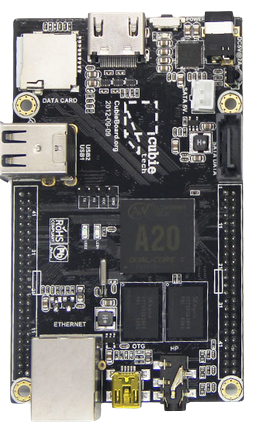
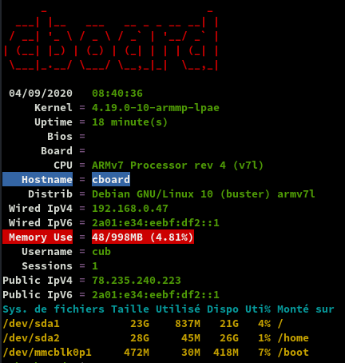
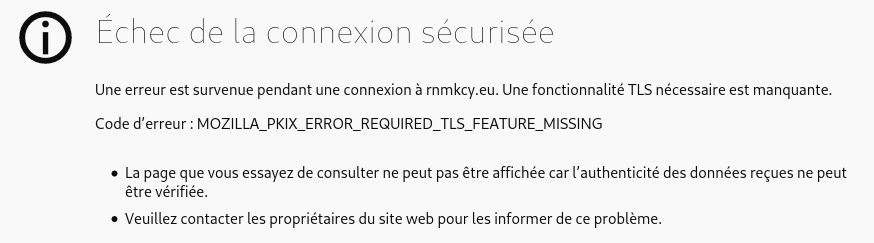

+++
title = 'Serveur IPV6 cubieboard2 (armhf) Debian 10 rnmkcy.eu'
date = 2020-09-03 00:00:00 +0100
categories = ['cubieboard']
+++
# Cubieboard2

<div class="item">
  <div class="item__image">
    
  </div>
  <div class="item__content">
    <div class="item__header">
      <h4>Matériel</h4>
    </div>
    <div class="item__description">
      <ul>
          <li>AllWinnerTech SOC A20，ARM® Cortex™-A7 Dual-Core ARM® Mali400 MP2 Complies with OpenGL ES 2.0/1.1</li>
          <li>1GB DDR3 @480M</li>
          <li>3.4GB internal NAND flash, up to 64GB on SD slot, up to 2T on 2.5 SATA disk</li>
          <li>5VDC input 2A or USB otg input</li>
          <li>1x 10/100 ethernet, support usb wifi</li>
          <li>2x USB 2.0 HOST, 1x mini USB 2.0 OTG, 1x micro sd</li>
          <li>1x HDMI 1080P display output</li>
          <li>1x IR, 1x line in, 1x line out</li>
          <li>96 extend pin interface, including I2C, SPI, RGB/LVDS, CSI/TS, FM-IN, ADC, CVBS, VGA, SPDIF-OUT, R-TP, and more</li>
      </ul>
    </div>
  </div>
</div>

## Debian Buster

{:width="100"}  
**SDcard**

SDcard créer avec les paquets debian armhf  
[Index of /debian/dists/buster/main/installer-armhf/current/images/netboot/SD-card-images/](http://ftp.uk.debian.org/debian/dists/buster/main/installer-armhf/current/images/netboot/SD-card-images/)  

1. Télécharger **firmware.Cubieboard2.img.gz** et **partition.img.gz** puis se rendre dans le répertoire contenant les fichiers 
2. Insérer le lecteur USB/SDcard, relever le périphérique par `dmesg` , ex /dev/sdf
3. Ecriture image sur la SDcard :  
`sudo -s` puis `zcat firmware.Cubieboard2.img.gz partition.img.gz > /dev/sdf`  

### Connexion liaison série

Utilisation module USB/Série **/dev/ttyUSB0** et **minicom**   
Insertion carte SD et mise sous tension Cubieboard2  
Installation :

* Language C
* Europe/France
* Hostname : **cboard**
* Domaine : 
* Miroir : France , deb.debian.org
* Http Proxy : 
* Root/mp : **root/ytreu49**
* Utilisateur/mp : **cub/cub49**
* Partionnement
    * SDcard /boot ext2 512M 
    * SSD 128GO &rarr; / root 25Go ext4, /home 30Go ext4 ,swap 4Go
* software to install : 
    * **SSH server**
    * **standard system utilities**

A la fin de l'installation,redémarrage  

Connexion utilisateur **cub** via liaison USB/Série et **minicom**  
Passage en super utilisateur  
`su`  

### Modifier sources.list

Ajout de `contrib non-free`

```bash
cat > /etc/apt/sources.list << EOF
# deb http://deb.debian.org/debian/ buster main

deb http://deb.debian.org/debian/ buster main contrib non-free
deb-src http://deb.debian.org/debian/ buster main contrib non-free

deb http://security.debian.org/debian-security buster/updates main contrib non-free
deb-src http://security.debian.org/debian-security buster/updates main contrib non-free

# buster-updates, previously known as 'volatile'
deb http://deb.debian.org/debian/ buster-updates main contrib non-free
deb-src http://deb.debian.org/debian/ buster-updates main contrib non-free
EOF
```


### Adressage ipv4/ipv6

{:width="70"}   
La carte n’est joignable de l’internet que par son adresse IPV6  
NextHop Freebox permet d’attribuer une adresse IPV6  

Prefixe : 2a01:e34:eebf:df2::/64  
Next Hop: fe80::c4:4ff:fe40:f0ff   
Passerelle IPV6 Box : fe80::224:d4ff:fea6:aa20  

Modifier interface réseau debian

    nano /etc/network/interfaces

```bash
# This file describes the network interfaces available on your system
# and how to activate them. For more information, see interfaces(5).

source /etc/network/interfaces.d/*

# The loopback network interface
auto lo
iface lo inet loopback

# The primary network interface
allow-hotplug eth0
iface eth0 inet static
 address 192.168.0.47
 netmask 255.255.255.0
 network 192.168.0.0
 broadcast 192.168.0.255
 gateway 192.168.0.254
	
# This is an autoconfigured IPv6 interface
#iface eth0 inet6 auto

iface eth0 inet6 static
  address 2a01:e34:eebf:df2::1
  netmask 64
  post-up ip -6 route add default via fe80::224:d4ff:fea6:aa20 dev eth0
```

### sudo

Installer **sudo** et modifier **/etc/sudoers** pour accès sans mot de passe à l’utilisateur cub

```
apt install sudo
echo "cub     ALL=(ALL) NOPASSWD: ALL" >> /etc/sudoers
```

Ereindre `systemctl poweroff` , redémarrer et se connecter en mode utilisateur via ssh

    ssh cub@192.168.0.47

on passe en su , `sudo -s`

### Adresses IP

Vérifier les adresses IP : `ip a`

```bash
1: lo: <LOOPBACK,UP,LOWER_UP> mtu 65536 qdisc noqueue state UNKNOWN group default qlen 1000
    link/loopback 00:00:00:00:00:00 brd 00:00:00:00:00:00
    inet 127.0.0.1/8 scope host lo
       valid_lft forever preferred_lft forever
    inet6 ::1/128 scope host 
       valid_lft forever preferred_lft forever
2: eth0: <BROADCAST,MULTICAST,UP,LOWER_UP> mtu 1500 qdisc mq state UP group default qlen 1000
    link/ether 02:c4:04:40:f0:ff brd ff:ff:ff:ff:ff:ff
    inet 192.168.0.47/24 brd 192.168.0.255 scope global eth0
       valid_lft forever preferred_lft forever
    inet6 2a01:e34:eebf:df2::1/64 scope global 
       valid_lft forever preferred_lft forever
    inet6 fe80::c4:4ff:fe40:f0ff/64 scope link 
       valid_lft forever preferred_lft forever
```

Version linux et debian: `uname -a`  
Linux cboard 4.19.0-10-armmp-lpae #1 SMP Debian 4.19.132-1 (2020-07-24) armv7l GNU/Linux
`cat /etc/debian_version`  
10.5

### Locales Timezone

**locales fr_FR.UTF-8**

	dpkg-reconfigure locales

```
Generating locales (this might take a while)...
  fr_FR.UTF-8... done
Generation complete.
```

**TimeZone** : Europe/Paris (facultatif car défini à l'installation de debian)

    dpkg-reconfigure tzdata

```bash
Generating locales (this might take a while)...
  fr_FR.UTF-8... done
Generation complete.
```

Machine : **cboard** , `hostnamectl` 

```
root@cboard:/home/cub# hostnamectl                                                                                            
   Static hostname: cboard                                                                                                    
         Icon name: computer                                                                                                  
        Machine ID: 60edd3b461654c7bac35d1ec6691c5d7                                                                          
           Boot ID: 29b596fd2a2d4b2293374674ffd60397                                                                          
  Operating System: 8;;https://www.debian.org/Debian GNU/Linux 10 (buster)8;;                                                 
            Kernel: Linux 4.19.0-10-armmp-lpae                                                                                
      Architecture: arm                                                                                  
```

Les points de montage  

```bash
/dev/sda1 on / type ext4 (rw,relatime,errors=remount-ro)
/dev/sda2 on /home type ext4 (rw,relatime)
/dev/mmcblk0p1 on /boot type ext2 (rw,relatime)
```

### Date et heure (timesyncd)

L'heure système est erronée, il faut la mettre à jour manuellement

    timedatectl set-time "2020-08-25 16:24:00"

Pour une mise à jour automatique

A-Vérifier 

    timedatectl                                                                                            


```bash
               Local time: Fri 2020-09-04 08:31:29 CEST                                                                       
           Universal time: Fri 2020-09-04 06:31:29 UTC                                                                        
                 RTC time: Fri 2020-09-04 06:31:30                                                                            
                Time zone: Europe/Paris (CEST, +0200)                                                                         
System clock synchronized: yes                                                                                                
              NTP service: active                                                                                             
          RTC in local TZ: no                                                                                                 
```

Tout est fonctionnel...

B-En cas de vérification non correcte

1-Retirer les services ntp (si installé)

    systemctl stop ntp.service
    systemctl disable ntp.service
    systemctl status ntp.service

```
    ● ntp.service - Network Time Service
    Loaded: loaded (/lib/systemd/system/ntp.service; disabled; vendor preset: enabled)
``` 

2-Configurer timesyncd pour utiliser un serveur de temps

    nano /etc/systemd/timesyncd.conf

```
[Time]  
NTP=  
FallbackNTP=0.fr.pool.ntp.org 1.fr.pool.ntp.org 2.fr.pool.ntp.org 3.fr.pool.ntp.org
```

3-Activer la synchro ntp

    timedatectl set-ntp true

4-Activer le service timesyncd :

    systemctl enable systemd-timesyncd.service
    systemctl start systemd-timesyncd.service
    systemctl status systemd-timesyncd.service

```
Active: active (running) since Tue 2020-08-25 17:42:51 CEST; 36s left
Status: "Synchronized to time server for the first time 51.77.12.38:123 (0.fr.pool.ntp.org)."
```

Si les erreurs suivantes apparaissent :

```
ConditionFileIsExecutable=!/usr/sbin/ntpd was not met  
Condition check resulted in Network Time Synchronization being skipped.  
```

Supprimer ntp : `apt remove ntp ntpdate`

5-Vérifier que tout est OK :

    timedatectl status

```
               Local time: mar. 2020-08-25 18:12:53 CEST
           Universal time: mar. 2020-08-25 16:12:53 UTC
                 RTC time: mar. 2020-08-25 16:12:53
                Time zone: Europe/Paris (CEST, +0200)
System clock synchronized: yes
              NTP service: active
          RTC in local TZ: no
```

### OpenSSH, clé et script

{:width="100"}

**connexion avec clé**  
<u>sur l'ordinateur de bureau</u>
Générer une paire de clé curve25519-sha256 (ECDH avec Curve25519 et SHA2) nommé **cubie-ed25519** pour une liaison SSH avec le serveur KVM.  

    ssh-keygen -t ed25519 -o -a 100 -f ~/.ssh/cubie-ed25519

Envoyer la clé publique sur le serveur KVM   

    scp ~/.ssh/cubie-ed25519.pub cub@192.168.0.47:/home/cub/

<u>sur le serveur KVM</u>
On se connecte  

    ssh cub@192.168.0.47

Copier le contenu de la clé publique dans /home/$USER/.ssh/authorized_keys  

    cd ~

Sur le KVM  

```bash
mkdir .ssh  # créer un dossier .ssh
cat $HOME/cubie-ed25519.pub >> $HOME/.ssh/authorized_keys  # copier le contenu de la clé
chmod 600 $HOME/.ssh/authorized_keys # et donner les droits
rm $HOME/cubie-ed25519.pub # effacer le fichier de la clé
```

Modifier la configuration serveur SSH **/etc/ssh/sshd_config** 

```bash
Port = 55035               # changement numéro port , facultatif  
PasswordAuthentication no  # Utilise la clé comme authentification
```

Relancer openSSH  

    sudo systemctl restart sshd

Accès depuis le poste distant avec la clé privée  

    ssh -p 55035 -i ~/.ssh/cubie-ed25519 cub@192.168.0.47

### Outils

{:width="100"}  
*motd, ssh_rc_bash , journalctl*

Installer utilitaires

    sudo apt install tmux figlet curl jq tree git gnupg -y

Motd

    sudo rm /etc/motd && sudo nano /etc/motd

```
            _     _       _                        _ 
  __  _  _ | |__ (_) ___ | |__  ___  __ _  _ _  __| |
 / _|| || || '_ \| |/ -_)| '_ \/ _ \/ _` || '_|/ _` |
 \__| \_,_||_.__/|_|\___||_.__/\___/\__,_||_|  \__,_|
  _ _  _ _   _ __  | |__ __  _  _     ___  _  _      
 | '_|| ' \ | '  \ | / // _|| || | _ / -_)| || |     
 |_|  |_||_||_|_|_||_\_\\__| \_, |(_)\___| \_,_|     
                             |__/                    
```            
Script ssh_rc_bash

>ATTENTION!!! Les scripts sur connexion peuvent poser des problèmes pour des appels externes autres que ssh

    wget https://static.xoyaz.xyz/files/ssh_rc_bash
    chmod +x ssh_rc_bash # rendre le bash exécutable
    ./ssh_rc_bash        # exécution



**journalctl** : Ajout utilisateur courant au groupe systemd-journal et adm

    sudo gpasswd -a $USER systemd-journal
    sudo gpasswd -a $USER adm

Lignes non tronquées ,ajouter au fichier **~/.bashrc**

    echo "export SYSTEMD_LESS=FRXMK journalctl" >> /home/$USER/.bashrc

**Historique de la ligne de commande**  
Ajoutez la recherche d’historique de la ligne de commande au terminal.
Tapez un début de commande précédent, puis utilisez shift + up (flèche haut) pour rechercher l’historique filtré avec le début de la commande.

```
# Global, tout utilisateur
echo '"\e[1;2A": history-search-backward' | sudo tee -a /etc/inputrc
echo '"\e[1;2B": history-search-forward' | sudo tee -a /etc/inputrc
```

Prise en compte après déconnexion/reconnexion

## Iptables

{:width="70"}

Créer le fichier le script **/sbin/iptables-firewall.sh**  
Nous sommes en configuration IPV6 pour les accès http https externes  

    sudo nano /sbin/iptables-firewall.sh

```
#!/bin/bash
# Configure iptables firewall

# Limit PATH
PATH="/sbin:/usr/sbin:/bin:/usr/bin"

# iptables configuration
firewall_start() {

###################
#      IPv4       #
###################

# refuser input ,forward et output par défaut 
iptables -t filter -P INPUT DROP
iptables -t filter -P FORWARD DROP
iptables -t filter -P OUTPUT DROP

# Autoriser loopback
iptables -t filter -A INPUT -i lo -j ACCEPT
iptables -t filter -A OUTPUT -o lo -j ACCEPT

# ICMP (Ping)
iptables -t filter -A INPUT -p icmp -j ACCEPT
iptables -t filter -A OUTPUT -p icmp -j ACCEPT

# maintenir les connexions établies
iptables -t filter -A INPUT -m state --state RELATED,ESTABLISHED -j ACCEPT
iptables -t filter -A OUTPUT -m state --state RELATED,ESTABLISHED -j ACCEPT

# SSH In/Out
iptables -t filter -A INPUT -p tcp --dport 55035 -j ACCEPT
iptables -t filter -A OUTPUT -p tcp --dport 55035 -j ACCEPT

# HTTP + HTTPS Out
iptables -t filter -A OUTPUT -p tcp --dport 80 -j ACCEPT
iptables -t filter -A OUTPUT -p tcp --dport 443 -j ACCEPT

# HTTP + HTTPS In
iptables -t filter -A INPUT -p tcp --dport 80 -j ACCEPT
iptables -t filter -A INPUT -p tcp --dport 443 -j ACCEPT

# DNS In/Out
iptables -t filter -A OUTPUT -p tcp --dport 53 -j ACCEPT
iptables -t filter -A OUTPUT -p udp --dport 53 -j ACCEPT
iptables -t filter -A INPUT -p tcp --dport 53 -j ACCEPT
iptables -t filter -A INPUT -p udp --dport 53 -j ACCEPT

# NFS
iptables -t filter -A INPUT -s 192.168.0.0/24 -p tcp -m multiport --ports 111,2049,32764:32769 -j ACCEPT -m comment --comment "NFS Server"
iptables -t filter -A INPUT -s 192.168.0.0/24 -p udp -m multiport --ports 111,2049,32764:32769 -j ACCEPT -m comment --comment "NFS Server"

# NTP Out
iptables -t filter -A OUTPUT -p udp --dport 123 -j ACCEPT

###################
#      IPv6       #
###################

# refuser input , forward et output par défaut 
ip6tables -t filter -P INPUT DROP
ip6tables -t filter -P FORWARD DROP
ip6tables -t filter -P OUTPUT DROP

# interface lo (loop) accessible
ip6tables -t filter -A INPUT -i lo -j ACCEPT
ip6tables -t filter -A OUTPUT -o lo -j ACCEPT

# maintenir les connexions établies
ip6tables -t filter -A INPUT -m state --state RELATED,ESTABLISHED -j ACCEPT
ip6tables -t filter -A OUTPUT -m state --state RELATED,ESTABLISHED -j ACCEPT

# NDP pour toute interface de type broadcast
ip6tables -t filter -A INPUT -p icmpv6 --icmpv6-type neighbour-solicitation -m hl --hl-eq 255 -j ACCEPT
ip6tables -t filter -A INPUT -p icmpv6 --icmpv6-type neighbour-advertisement -m hl --hl-eq 255 -j ACCEPT
ip6tables -t filter -A INPUT -p icmpv6 --icmpv6-type router-advertisement -m hl --hl-eq 255 -j ACCEPT

ip6tables -t filter -A OUTPUT -p icmpv6 --icmpv6-type neighbour-solicitation -j ACCEPT
ip6tables -t filter -A OUTPUT -p icmpv6 --icmpv6-type neighbour-advertisement -j ACCEPT
ip6tables -t filter -A OUTPUT -p icmpv6 --icmpv6-type router-solicitation -j ACCEPT

# accepter en entrée le ping (icmpv6), les
# connexions entrantes déjà établies et les connexions sur les ports nécessaires.
ip6tables -A INPUT -p icmpv6 --icmpv6-type echo-request -m conntrack --ctstate NEW -m limit --limit 1/s --limit-burst 1 -j ACCEPT
ip6tables -t filter -A OUTPUT -p icmpv6 --icmpv6-type echo-request -j ACCEPT

# SSH In/Out
ip6tables -t filter -A INPUT -p tcp --dport 55035 -j ACCEPT
ip6tables -t filter -A OUTPUT -p tcp --dport 55035 -j ACCEPT

# HTTP + HTTPS Out
ip6tables -t filter -A OUTPUT -p tcp --dport 80 -j ACCEPT
ip6tables -t filter -A OUTPUT -p tcp --dport 443 -j ACCEPT

# HTTP + HTTPS In
ip6tables -t filter -A INPUT -p tcp --dport 80 -j ACCEPT
ip6tables -t filter -A INPUT -p tcp --dport 443 -j ACCEPT

# DNS In/Out
ip6tables -t filter -A OUTPUT -p tcp --dport 53 -j ACCEPT
ip6tables -t filter -A OUTPUT -p udp --dport 53 -j ACCEPT
ip6tables -t filter -A INPUT -p tcp --dport 53 -j ACCEPT
ip6tables -t filter -A INPUT -p udp --dport 53 -j ACCEPT

# NTP Out
ip6tables -t filter -A OUTPUT -p udp --dport 123 -j ACCEPT

}

# clear iptables configuration
firewall_stop() {
  iptables -F
  iptables -X
  iptables -P INPUT   ACCEPT
  iptables -P FORWARD ACCEPT
  iptables -P OUTPUT  ACCEPT
  ip6tables -F
  ip6tables -X
  ip6tables -P INPUT   ACCEPT
  ip6tables -P FORWARD ACCEPT
  ip6tables -P OUTPUT  ACCEPT
}

# execute action
case "$1" in
  start|restart)
    echo "Starting firewall"
    firewall_stop
    firewall_start
    ;;
  stop)
    echo "Stopping firewall"
    firewall_stop
    ;;
esac
```

Les droits et exécutable

    sudo chown root:root /sbin/iptables-firewall.sh
    sudo chmod 750 /sbin/iptables-firewall.sh 

Créer le service systemd **iptables-firewall.service**

```
cat << EOF | sudo tee /etc/systemd/system/iptables-firewall.service
[Unit]
Description=iptables firewall service
After=network.target

[Service]
Type=oneshot
ExecStart=/sbin/iptables-firewall.sh start
RemainAfterExit=true
ExecStop=/sbin/iptables-firewall.sh stop
StandardOutput=journal

[Install]
WantedBy=multi-user.target
EOF
```

**Lancement et activation service**
Recharger systemd manager

    sudo systemctl daemon-reload

Lancer le service iptables et l'activer

    sudo systemctl start iptables-firewall
    sudo systemctl enable iptables-firewall


## NFS

{:width="40"}  
*NFS (Network File System) est un protocole qui permet d'accéder à des fichiers via le réseau. Il est basé sur le protocole RPC (Remote Procedure Call). Les clients montent la partition de la machine distante comme si c'était un disque local.*

En mode su

**Installation serveur NFS**

    apt install nfs-kernel-server

Vérification de l'installation

Exécuter rpcinfo pour confirmer que le serveur est lancé, et accepte les requêtes sur le port 2049 (UDP et TCP).  

    rpcinfo -p | grep nfs 

```
    100003    3   tcp   2049  nfs
    100003    4   tcp   2049  nfs
    100003    3   udp   2049  nfs
```

Vérifier que le système supporte effectivement NFS:  

    cat /proc/filesystems | grep nfs

```
nodev	nfs
```

Si la commande précédente ne renvoie rien, il se peut que le module NFS ne soit pas chargé, auquel cas, il faut le charger `modprobe nfs`   
Enfin, vérifions que portmap attend les instructions sur le port 111  

    rpcinfo -p | grep portmap

```
    100000    4   tcp    111  portmapper
    100000    3   tcp    111  portmapper
    100000    2   tcp    111  portmapper
    100000    4   udp    111  portmapper
    100000    3   udp    111  portmapper
    100000    2   udp    111  portmapper
```

**Configuration du partage**

indiquer au serveur les répertoires qui seront partagés, les machines qui y auront accès et les conditions de ce partage.  

	nano /etc/exports

Ajouter en fin de fichier **/etc/exports**  

```
/dossier                                   192.168.0.0/24(rw,sync,no_subtree_check,no_root_squash)
```

Exporter

    exportfs -ar

Pour vérifier que l'export a bien eu lieu, taper sur le serveur NFS la commande :

    showmount -e

### Sécuriser NFS

Le protocole RPC n'a pas la réputation d'être bien sécurisé, mais la version 4 de NFS entend corriger ce problème, elle est donc à privilégier. Il est déconseillé d'effectuer un partage NFS via internet, ou bien dans ce cas, opter pour un tunnel crypté.

* S'assurer que les partages sont réservés à certaines IP dans /etc/exports
* S'appuyer sur rpcbind (/etc/hosts.deny et /etc/hosts.allow) pour sécuriser l'accès au serveur NFS
* Configurer convenablement iptables

**hosts.deny , hosts.allow**  
Tout le monde est interdit, puis le LAN est autorisé:  

```bash
echo "rpcbind mountd nfsd statd lockd rquotad : ALL" | sudo tee -a /etc/hosts.deny
echo "rpcbind mountd nfsd statd lockd rquotad: 192.168.0." | sudo tee -a /etc/hosts.allow
```

**iptables (NFS)**  
Par défaut, les différents services NFS (lockd, statd, mountd, etc.) demandent des assignations de ports aléatoires à partir du portmapper (portmap/rpcbind), ce qui signifie que la plupart des administrateurs doivent ouvrir une gamme de ports dans leur base de règles de pare-feu pour que NFS fonctionne.  

Il va donc falloir fixer les ports de ces services afin de créer les règles iptables.  

```bash
echo 'STATDOPTS="--port 32765 --outgoing-port 32766"' | sudo tee -a /etc/default/nfs-common
echo 'RPCMOUNTDOPTS="-p 32767"' | sudo tee -a /etc/default/nfs-kernel-server
echo 'RPCRQUOTADOPTS="-p 32769"' | sudo tee -a /etc/default/quota
```

Relance sysctl  

	sudo sysctl --system

```bash
* Applying /etc/sysctl.d/90-transmission.conf ...
net.core.rmem_max = 4194304
net.core.wmem_max = 1048576
* Applying /etc/sysctl.d/99-sysctl.conf ...
* Applying /etc/sysctl.d/protect-links.conf ...
fs.protected_hardlinks = 1
fs.protected_symlinks = 1
* Applying /etc/sysctl.conf ...
```

Relancer le service  

	sudo systemctl restart nfs-kernel-server

Vérifier

    systemctl status nfs-kernel-server

```bash
● nfs-server.service - NFS server and services
   Loaded: loaded (/lib/systemd/system/nfs-server.service; enabled; vendor preset: enabled)
   Active: active (exited) since Fri 2020-09-04 08:51:34 CEST; 35s ago
  Process: 3471 ExecStartPre=/usr/sbin/exportfs -r (code=exited, status=0/SUCCESS)
  Process: 3472 ExecStart=/usr/sbin/rpc.nfsd $RPCNFSDARGS (code=exited, status=0/SUCCESS)
 Main PID: 3472 (code=exited, status=0/SUCCESS)
```

**NFS - iptables**

Ajout des règles firewall au fichier **/sbin/iptables-firewall.sh** 

```bash
# NFS
iptables -t filter -A INPUT -s 192.168.0.0/24 -p tcp -m multiport --ports 111,2049,32764:32769 -j ACCEPT -m comment --comment "NFS Server"
iptables -t filter -A INPUT -s 192.168.0.0/24 -p udp -m multiport --ports 111,2049,32764:32769 -j ACCEPT -m comment --comment "NFS Server"
```

Relancer le service iptables

    sudo systemctl restart iptables-firewall

Vérifier la prise en charge

    iptables -L

```bash
[...]
ACCEPT     tcp  --  192.168.0.0/24       anywhere             multiport ports sunrpc,nfs,32764:32769 /* NFS Server */
ACCEPT     udp  --  192.168.0.0/24       anywhere             multiport ports sunrpc,nfs,32764:32769 /* NFS Server */
[...]
```

## Domaine rnmkcy.eu

### DNS OVH

{:width="40"}  

Dns ovh domaine rnmkcy.eu

```
$TTL 3600
@	IN SOA dns110.ovh.net. tech.ovh.net. (2020081505 86400 3600 3600000 300)
        IN NS     dns110.ovh.net.
        IN NS     ns110.ovh.net.
        IN AAAA   2a01:e34:eebf:df2::1
```

### Certificats Let's Encrypt

{:width="100"}  

Installer acme: [Serveur , installer et renouveler les certificats SSL Let's encrypt via Acme](https://blog.cinay.xyz/2017/08/Acme-Certficats-Serveurs/)  

    cd ~
    sudo apt install socat -y # prérequis
    git clone https://github.com/Neilpang/acme.sh.git
    cd acme.sh
    ./acme.sh --install # se déconnecter pour prise en compte
    # export des clé API OVH

Générer les certificats pour le domaine rnmkcy.eu

    # s'identifier avec le lien fourni au premier lancement, puis relancer la même commande
    acme.sh --dns dns_ovh --ocsp --issue --keylength ec-384 -d 'rnmkcy.eu' 

```
[vendredi 4 septembre 2020, 08:56:34 (UTC+0200)] Your cert is in  /home/cub/.acme.sh/rnmkcy.eu_ecc/rnmkcy.eu.cer 
[vendredi 4 septembre 2020, 08:56:34 (UTC+0200)] Your cert key is in  /home/cub/.acme.sh/rnmkcy.eu_ecc/rnmkcy.eu.key 
[vendredi 4 septembre 2020, 08:56:34 (UTC+0200)] The intermediate CA cert is in  /home/cub/.acme.sh/rnmkcy.eu_ecc/ca.cer 
[vendredi 4 septembre 2020, 08:56:34 (UTC+0200)] And the full chain certs is there:  /home/cub/.acme.sh/rnmkcy.eu_ecc/fullchain.cer 
```

Les liens avec **/etc/ssl/private** 

```
sudo ln -s /home/cub/.acme.sh/rnmkcy.eu_ecc/rnmkcy.eu.cer /etc/ssl/private/rnmkcy.eu-chain.pem # cert
sudo ln -s /home/cub/.acme.sh/rnmkcy.eu_ecc/rnmkcy.eu.key /etc/ssl/private/rnmkcy.eu-key.pem # cert key 
sudo ln -s /home/cub/.acme.sh/rnmkcy.eu_ecc/ca.cer /etc/ssl/private/rnmkcy.eu-ca.pem # intermediate CA cert
sudo ln -s /home/cub/.acme.sh/rnmkcy.eu_ecc/fullchain.cer /etc/ssl/private/rnmkcy.eu-fullchain.pem #full chain certs
```

## Nginx

{:width="70"}  

En mode su

### Installer nginx nginx-extras

**Installation nginx** sur debian buster (nginx-extras pour fancyindex)

    apt update && apt -y install nginx nginx-extras

Version nginx et modules installés

    nginx -V

```
nginx version: nginx/1.14.2
built with OpenSSL 1.1.1d  10 Sep 2019
TLS SNI support enabled
configure arguments:
 --with-cc-opt='-g -O2 -fdebug-prefix-map=/build/nginx-5qcV7v/nginx-1.14.2=. -fstack-protector-strong -Wformat -Werror=format-security -fPIC -Wdate-time -D_FORTIFY_SOURCE=2'
 --with-ld-opt='-Wl,-z,relro -Wl,-z,now -fPIC'
 --prefix=/usr/share/nginx
 --conf-path=/etc/nginx/nginx.conf
 --http-log-path=/var/log/nginx/access.log
 --error-log-path=/var/log/nginx/error.log
 --lock-path=/var/lock/nginx.lock
 --pid-path=/run/nginx.pid
 --modules-path=/usr/lib/nginx/modules
 --http-client-body-temp-path=/var/lib/nginx/body
 --http-fastcgi-temp-path=/var/lib/nginx/fastcgi
 --http-proxy-temp-path=/var/lib/nginx/proxy
 --http-scgi-temp-path=/var/lib/nginx/scgi
 --http-uwsgi-temp-path=/var/lib/nginx/uwsgi
 --with-debug
 --with-pcre-jit
 --with-http_ssl_module
 --with-http_stub_status_module
 --with-http_realip_module
 --with-http_auth_request_module
 --with-http_v2_module
 --with-http_dav_module
 --with-http_slice_module
 --with-threads
 --with-http_addition_module
 --with-http_flv_module
 --with-http_geoip_module=dynamic
 --with-http_gunzip_module
 --with-http_gzip_static_module
 --with-http_image_filter_module=dynamic
 --with-http_mp4_module
 --with-http_perl_module=dynamic
 --with-http_random_index_module
 --with-http_secure_link_module
 --with-http_sub_module
 --with-http_xslt_module=dynamic
 --with-mail=dynamic
 --with-mail_ssl_module
 --with-stream=dynamic
 --with-stream_ssl_module
 --with-stream_ssl_preread_module
 --add-dynamic-module=/build/nginx-5qcV7v/nginx-1.14.2/debian/modules/http-headers-more-filter
 --add-dynamic-module=/build/nginx-5qcV7v/nginx-1.14.2/debian/modules/http-auth-pam
 --add-dynamic-module=/build/nginx-5qcV7v/nginx-1.14.2/debian/modules/http-cache-purge
 --add-dynamic-module=/build/nginx-5qcV7v/nginx-1.14.2/debian/modules/http-dav-ext
 --add-dynamic-module=/build/nginx-5qcV7v/nginx-1.14.2/debian/modules/http-ndk
 --add-dynamic-module=/build/nginx-5qcV7v/nginx-1.14.2/debian/modules/http-echo
 --add-dynamic-module=/build/nginx-5qcV7v/nginx-1.14.2/debian/modules/http-fancyindex
 --add-dynamic-module=/build/nginx-5qcV7v/nginx-1.14.2/debian/modules/nchan
 --add-dynamic-module=/build/nginx-5qcV7v/nginx-1.14.2/debian/modules/http-lua
 --add-dynamic-module=/build/nginx-5qcV7v/nginx-1.14.2/debian/modules/rtmp
 --add-dynamic-module=/build/nginx-5qcV7v/nginx-1.14.2/debian/modules/http-uploadprogress
 --add-dynamic-module=/build/nginx-5qcV7v/nginx-1.14.2/debian/modules/http-upstream-fair
 --add-dynamic-module=/build/nginx-5qcV7v/nginx-1.14.2/debian/modules/http-subs-filter
```

### Dossier web

**Création dossier web et fichier index/**

    mkdir -p /var/www/default-www
    echo "/>Site rnmkcy.eu</>" >  /var/www/default-www/index/

Modifier **/etc/nginx/nginx.conf**  
Mettre un commentaire à la ligne comme suit : `#include /etc/nginx/sites-enabled/*;`

### SSL Headers et OCSP

**ssl headers**  
Configuration nginx , ssl (tls1.2 tls1.3) , Diffie Hellman ,Headers et OCSP  
Diffie-Hellman , générer le fichier dh2048.pem (plus ou moins long suivant les ressources):  

    openssl dhparam -out /etc/ssl/private/dh2048.pem -outform PEM -2 2048 
    chmod 600 /etc/ssl/private/dh2048.pem

Si **DNS ubound** n'est pas installé , relever le résolveur utilisé `cat /etc/resolv.conf`

```bash
nameserver 1.1.1.1
nameserver 1.0.0.1
nameserver 80.67.169.12
nameserver 80.67.169.40
```

Regroupement dans un fichier **/etc/nginx/ssl_dh_headers_ocsp**

```
# /etc/nginx/ssl_dh_headers_ocsp

    ssl_certificate /etc/ssl/private/rnmkcy.eu-fullchain.pem;
    ssl_certificate_key /etc/ssl/private/rnmkcy.eu-key.pem;
    ssl_session_timeout 1d;
    ssl_session_cache shared:MozSSL:10m;  # about 40000 sessions
    ssl_session_tickets off;

    ssl_dhparam /etc/ssl/private/dh2048.pem;

    # intermediate configuration
    ssl_protocols TLSv1.2 TLSv1.3;
    ssl_ciphers ECDHE-ECDSA-AES128-GCM-SHA256:ECDHE-RSA-AES128-GCM-SHA256:ECDHE-ECDSA-AES256-GCM-SHA384:ECDHE-RSA-AES256-GCM-SHA384:ECDHE-ECDSA-CHACHA20-POLY1305:ECDHE-RSA-CHACHA20-POLY1305:DHE-RSA-AES128-GCM-SHA256:DHE-RSA-AES256-GCM-SHA384;
    ssl_prefer_server_ciphers off;

    # Add headers to serve security related headers
    add_header X-Content-Type-Options nosniff;
    add_header X-XSS-Protection "1; mode=block";
    add_header X-Robots-Tag none;
    add_header X-Download-Options noopen;
    add_header X-Permitted-Cross-Domain-Policies none;
    add_header X-Frame-Options "SAMEORIGIN"; 
    add_header Strict-Transport-Security 'max-age=31536000; includeSubDomains;';
    add_header Referrer-Policy "no-referrer" always;

    # OCSP settings
    ssl_stapling on;
    ssl_stapling_verify on;
    ssl_trusted_certificate /etc/ssl/private/rnmkcy.eu-fullchain.pem; 
    #resolver 127.0.0.1; # DNS Unbound installé
    resolver 80.67.169.12; # DNS Unbound NON installé
```

### Configurer virtual host

Configuration de base **/etc/nginx/conf.d/rnmkcy.eu.conf**  

```
# /etc/nginx/conf.d/rnmkcy.eu.conf
	##
	# Virtual Host rnmkcy.eu
	##

	server {
	    listen 80;
	    listen [::]:80;
	
	    ## redirect http to https ##
	    server_name rnmkcy.eu;
	    return  301 https://$server_name$request_uri;
	}
	
	server {
	    listen 443 ssl http2;
	    listen [::]:443 ssl http2;
	    server_name rnmkcy.eu;
	
	    ####    Locations
	    # On cache les fichiers statiques
	    location ~* \./|css|js|png|jpg|jpeg|gif|ico|svg|eot|woff|ttf)$ { expires max; }

		location = /favicon.ico {
		  log_not_found off;
		}

	    # On interdit les dotfiles
	    location ~ /\. { deny all; }
	
	    include ssl_dh_headers_ocsp;

	    root /var/www/default-www/ ;
	    index index/;

	}
```

Vérifications et rechargement nginx

    nginx -t

```
nginx: the configuration file /etc/nginx/nginx.conf syntax is ok
nginx: configuration file /etc/nginx/nginx.conf test is successful
```

    systemctl reload nginx

### Bash OCSP

Au premier accès sur le lien on une erreur

{:width="400"}  
Ce problème est lié à la mise en cache ocsp qui ne se fait qu'au premier accès après un rechargement du serveur nginx, on  exécuter un script après rechargement pour la mise en cache OCSP

    nano /usr/local/bin/ocsp

```
#! /bin/sh

# ocsp

# 
echo "Premier passage"
for fichier in /etc/nginx/conf.d/*.conf
do
    echo $(basename $fichier .${fichier##*.})
    openssl s_client -connect $(basename $fichier .${fichier##*.}):443 -status < /dev/null |grep -i ocsp
done
# pause de 1 seconde
sleep 1
echo "Second passage"
for fichier in /etc/nginx/conf.d/*.conf
do
    echo $(basename $fichier .${fichier##*.})
    openssl s_client -connect $(basename $fichier .${fichier##*.}):443 -status < /dev/null |grep -i ocsp
done
echo "Fin mise en cache nginx OCSP..."
```

Le rendre exécutable

    chmod +x /usr/local/bin/ocsp

Exécution en mode sans affichage

    ocsp > /dev/null 2>&1

Lien https://rnmkcy.eu


## PHP Composer

### PHP 7.3

Télécharger la clé GPG.

    sudo apt -y install lsb-release apt-transport-https ca-certificates 
    sudo wget -O /etc/apt/trusted.gpg.d/php.gpg https://packages.sury.org/php/apt.gpg

Ensuite ajoutez le dépôt PPA

    echo "deb https://packages.sury.org/php/ $(lsb_release -sc) main" | sudo tee /etc/apt/sources.list.d/php.list

Puis passez à l’installation de PHP 7.3 pour Debian

    sudo apt update

Si problème de clé publique `W: Erreur de GPG : https://packages.sury.org/php buster InRelease : Les signatures suivantes n'ont pas pu être vérifiées car la clé publique n'est pas disponible : NO_PUBKEY B188E2B695BD4743`  
Télécharger la clé manuellement et l'ajouter

    wget https://packages.sury.org/php/apt.gpg
    sudo apt-key add  apt.gpg
    sudo apt update

Installation PHP 7.3

    sudo apt install php7.3 php7.3-{common,bcmath,bz2,intl,gd,mbstring,mysql,zip,cli,fpm,json,pdo,mbstring,curl,xml,imagick,tidy,xmlrpc,dev,imap,opcache,soap}

Vous pouvez maintenant vérifier que la version est bien installée

    php -v

```
PHP 7.3.21-1+0~20200807.66+debian10~1.gbp18a1c2 (cli) (built: Aug  7 2020 14:56:47) ( NTS )
Copyright (c) 1997-2018 The PHP Group
Zend Engine v3.3.21, Copyright (c) 1998-2018 Zend Technologies
    with Zend OPcache v7.3.21-1+0~20200807.66+debian10~1.gbp18a1c2, Copyright (c) 1999-2018, by Zend Technologies
```

### Composer

Installation

    curl -sS https://getcomposer.org/installer | php
    sudo mv composer.phar /usr/local/bin/composer
    sudo chmod +x /usr/local/bin/composer

Version

    composer

```
   ______
  / ____/___  ____ ___  ____  ____  ________  _____
 / /   / __ \/ __ `__ \/ __ \/ __ \/ ___/ _ \/ ___/
/ /___/ /_/ / / / / / / /_/ / /_/ (__  )  __/ /
\____/\____/_/ /_/ /_/ .___/\____/____/\___/_/
                    /_/
Composer version 1.10.10 2020-08-03 11:35:19
```

## MariaDB

En mode su

Les prérequis

    apt-get install software-properties-common dirmngr
    apt-key adv --fetch-keys 'https://mariadb.org/mariadb_release_signing_key.asc'

Installer mariadb 

    apt update && apt install mariadb-server

Générer un mot de passe pour mysql

    echo $(head -c 12 /dev/urandom | openssl enc -base64) > /etc/mysql/mdp

fichier sql

```bash
cat > /tmp/mysql_secure.sql << EOF
GRANT ALL ON *.* TO 'admin'@'localhost' IDENTIFIED BY '$(cat /etc/mysql/mdp)' WITH GRANT OPTION;
FLUSH PRIVILEGES; /* Applique les changements effectués précédemment concernant la gestion des droits */
EOF
```
Exécuter la requête sql

    mysql -uroot < /tmp/mysql_secure.sql

Vesion

    mysql --version

mysql  Ver 15.1 Distrib 10.3.23-MariaDB, for debian-linux-gnueabihf (armv8l) using readline 5.2

---

## DNS Unbound

{:width="100"} 

Installer **unbound** et **resolvconf**  

    sudo apt install unbound resolvconf

>On garde la configuration par défaut de unbound, ajouter simplement le  [chargement manuel et auto des serveurs de nom racine](/posts/unbound-resolveur-DNS/)

Vérification de la résolution de nom à partir du serveur   

    dig @127.0.0.1 afnic.fr +short +dnssec

```bash
192.134.5.37
A 13 2 600 20200914125119 20200815040845 1528 afnic.fr. JC+2vA69riieHDGpXLmaeGH02dbJteDaoCRGm7h4a5M6gIgfR6Hq6i9k UjAuuWuYGuNIn/gLCnnW0QfFasDM0g==
```

La résolution fonctionne  
Maintenant, vous disposez de votre propre résolveur DNS.  


