+++
title = 'Virtualisation KVM/QEMU'
date = 2020-09-12 00:00:00 +0100
categories = ['virtuel']
+++
 -   

**KVM** est une bifurcation de **QEMU**. Le code KVM est modifié pour prendre en charge l'accélération matérielle lorsqu'elle est disponible (même architecture pour la VM hôte et la VM invitée).

La plupart du temps, la **QEMU** est utilisée pour émuler une autre architecture (par exemple, émuler ARM/Power arch. en utilisant un processeur x86. Exemple : faire tourner une image RaspberryPI qui fonctionne sur ARM dans un ordinateur équipé d'un processeur Intel)

Une différence entre les deux est que la **QEMU** fonctionne sur un processeur sans avoir besoin d'une extension de virtualisation matérielle (Intel VT/VT-d, AMD-V) alors que la **KVM** l'utilise. Les extensions de virtualisation matérielle vous permettent d'accéder directement au matériel sur la machine physique. L'inconvénient est que la base de code **KVM** ne peut pas émuler une autre architecture.

# KVM/Qemu

*Kernel-based Virtual Machine (KVM) est un module de virtualisation pour le noyau Linux qui le transforme en hyperviseur*

<u>Simuler une machine complète pour avoir son propre environnement d’exécution.</u>  
*Les avantages sont nombreux, isolations des processus, plusieurs environnements différents, etc...*  

La virtualisation matérielle est possible au moyen de ce que l’on appelle des hyperviseurs.  
**Il existe plusieurs types d’hyperviseurs, classés en 2 niveaux.**  

* Le niveau 1 est dit “natif”. 
    * **Natif** car les instructions processeurs du système virtuelle sont directement transmis aux hardware. Il faut donc vérifier la compatibilité entre les systèmes virtualisés et les composants matérielles.
* Le niveau 2 est dit “hosted”.
    * **Hosted** car la virtualisation s’effectue grâce à un logiciel installé sur un système d’exploitation. Donc la machine virtualisée n’interagit pas directement avec le Hardware.

**<u>KVM est un hyperviseur de type 1</u>**, il est intégré de manière native à beaucoup de distribution basées sur le noyau Linux. KVM pour Kernel-based Virtual Machine car il transforme le noyau linux sur lequel il est exécuté en hyperviseur, proxmox est basé dessus.
Il en existe d’autres.

On utilise **QEMU** (QuickEmulator) pour interagir avec **KVM**.

* <u>**Qemu** est de type 1 et 2</u>. 
    * Il peut simuler un environnement pour une machine totalement différente de la votre, par exemple une py sur un PC. Dans ce cas la il transforme les exécutions de processeurs pour les rendre compatibles avec le hardware, donc la il est de **type 2**. 
    * Mais quand il est utilise avec **KVM** dans ce cas la il fonctionne en **type 1** avec des performances bien meilleures.

> En clair **Qemu sert à manager les machines virtuels, c’est un client**.  
Et la liaison entre Qemu et KVM est faite via l’API libvirt ( management du réseau, stockages, clavier, souris, etc )

[libvirt](http://libvirt.org/) est une bibliothèque permettant d'interagir avec différentes solutions de virtualisation (cet article s'intéressera uniquement à KVM/QEMU, mais Xen, VirtualBox et d'autres sont aussi possibles)  
[Virtual Machine Manager](http://virt-manager.org/) est un ensemble d'applications permettant de gérer les machines virtuelles

En mode graphique :

*    **virt-viewer** est une interface graphique permettant de se connecter sur une machine virtuelle
*    **virt-manager** est une interface graphique permettant de gérer les machines virtuelles

En ligne de commande :

*    **virt-clone** permet de dupliquer une machine existante
*    **virt-convert** permet de convertir l'image d'une machine
*    **virt-image** permet de créer un nouvelle machine à partir d'une image
*    **virt-install** permet de créer une nouvelle machine ou d'importer une machine déjà créé ultérieurement avec qemu ou qemu-kvm

[QEMU](http://www.nongnu.org/qemu/) est une <u>solution d'émulation et de virtualisation</u> (avec kqemu un pilote permettant d'optimiser l'émulation lorsque qu'elle concerne la même architecture).QEMU peut utiliser KVM lors de l'exécution d'une architecture cible identique à l'architecture hôte. Par exemple, lorsque vous exécutez qemu-system-x86 sur un processeur compatible x86, vous pouvez profiter de l'accélération KVM - ce qui vous donne un avantage pour votre hôte et votre système invité.  

[KVM](http://www.linux-kvm.org/page/Main_Page) (*Kernel-based Virtual Machine*) est une <u>solution de virtualisation</u>, pour les processeurs disposant des capacités nécessaires, et intégré au noyau linux.Il supporte les processeurs Intel et AMD récents (x86 et x86_64), PPC 440, PPC 970, S/390, ARM (Cortex A15, AArch64), et les processeurs MIPS32.

<font color="red"><b>Vous ne pouvez pas utiliser KVM en même temps que VirtualBox. Il faudra en effet fermer KVM pour utiliser VirtualBox et vice versa. Ou désactiver le support de la virtualisation processeur dans VirtualBox</b></font>


### Debian

Vous pouvez utiliser KVM pour exécuter plusieurs systèmes d'exploitation tels que Windows, *BSD, distribution Linux en utilisant des machines virtuelles. Chaque machine virtuelle a son disque privé, sa carte graphique, une carte réseau et plus encore.

* Le serveur hôte situé dans le centre de données distant et c'est un serveur sans affichage.
* Toutes les commandes de ce tutoriel ont été tapées via une session **ssh**.
* Vous avez besoin d'un client vnc pour installer le système d'exploitation invité.
* Dans ce tutoriel, vous apprendrez comment installer le logiciel KVM sur le serveur Debian Linux 9.x et utiliser KVM pour configurer votre première VM invitée.

#### Installation sur serveur debian

On utilise ssh pour se connecter au serveur  
Installation, exécuter la commande suivante

    sudo apt install qemu-kvm libvirt-clients libvirt-daemon-system bridge-utils libguestfs-tools genisoimage virtinst libosinfo-bin

Chargez et activez le module vhost_net

    sudo modprobe vhost_net
    lsmod | grep vhost

```
vhost_net              24576  0
tun                    49152  1 vhost_net
vhost                  49152  1 vhost_net
tap                    28672  1 vhost_net
```

Pour que le module soit rechargé au prochain démarrage

    echo "vhost_net" | sudo tee -a /etc/modules

#### Ajout utilisateur au groupe libvirt

Si vous voulez que l'utilisateur normal/régulier puisse gérer les machines virtuelles. Ajouter l'utilisateur $USER à libvirt et libvirt-qemu en utilisant la commande *usermod*

    sudo adduser $USER libvirt
    sudo adduser $USER libvirt-qemu

Recharger l'adhésion à un groupe avec l'aide de la commande *newgrp*

    newgrp libvirt
    newgrp libvirt-qemu

Vérifiez votre appartenance à un groupe à l'aide de la commande *id*

    id

Veuillez noter que vous devez utiliser la commande suivante pour vous connecter au serveur KVM

    virsh --connect qemu:///system
    virsh --connect qemu:///system command
    virsh --connect qemu:///system list --all

#### kvm supporté par le CPU ?

Exécutez la commande *egrep* suivante pour vérifier que **Intel VMX** ou **AMD SVM** est supporté sur votre CPU 

    egrep --color 'vmx|svm' /proc/cpuinfo

vmx (Intel) ou svm (Amd) doit apparaître d'une autre couleur dans le résultat 

#### Service libvirtd

On vérifie qu'il est démarré et actif

    sudo systemctl status libvirtd

```
● libvirtd.service - Virtualization daemon
   Loaded: loaded (/lib/systemd/system/libvirtd.service; enabled; vendor preset: enabled)
   Active: active (running) since Sat 2019-11-30 09:11:26 CET; 13min ago
     Docs: man:libvirtd(8)
           https://libvirt.org
 Main PID: 31894 (libvirtd)
    Tasks: 17 (limit: 32768)
   Memory: 17.0M
   CGroup: /system.slice/libvirtd.service
           └─31894 /usr/sbin/libvirtd

nov. 30 09:11:26 xoyize.xyz systemd[1]: Starting Virtualization daemon...
nov. 30 09:11:26 xoyize.xyz systemd[1]: Started Virtualization daemon.
```

Dans le cas contraire

    sudo systemctl enable libvirtd
    sudo systemctl start libvirtd

#### Créer des machines virtuelles

Tous les fichiers de la machine virtuelle et les autres fichiers associés seront stockés sous **/var/lib/libvirt/**.  
Le chemin par défaut des images ISO est **/var/lib/libvirt/boot/**.  
On va créer un autre répertoire et lui donner des droits

    sudo mkdir /srv/data/virtuel
    sudo chown $USER.  /srv/data/virtuel
    mkdir -p /srv/data/virtuel/{boot,images}

#### Le réseau 

Avant toute chose, il faut activer le réseau   
On liste

    sudo virsh net-list --all

```
 Name      State      Autostart   Persistent
----------------------------------------------
 default   inactive   no          yes
```

On active

    sudo virsh net-start default

Network default started

On vérifie

    sudo virsh net-list --all

```
 Name      State    Autostart   Persistent
--------------------------------------------
 default   active   no          yes
```

créer et démarre automatiquement virbr0 au démarrage de l’hôte:

    sudo virsh net-autostart default

pour personnaliser sa configuration réseau :

    sudo virsh net-edit default

>Lors de l'utilisation du réseau par défaut de libvirt, libvirt va connecter l'interface de la machine virtuelle à un pont appelé virbr0. Il existe un processus dnsmasq géré par libvirt qui distribuera une adresse IP sur le sous-réseau 192.168.122.0/24, et libvirt a des règles iptables pour faire NAT pour les adresses IP sur ce sous-réseau.

#### Machine virtuelle

Voyons d'abord s'il existe des machines virtuelles. Pour afficher la liste des machines virtuelles disponibles, exécutez :

    sudo virsh list --all

```
 Id   Name   State
--------------------
```

Il n'y a pas de machine virtuelle disponible en ce moment.  
Créer une machine virtuelle **manjaro-xfce** avec 2000 Mo de RAM (2Go), 1 CPU core, 10 Go Hdd.

```
sudo virt-install --name manjaro-xfce-18 \
--ram=2000 \
--vcpus=1 \
--cpu host \
--network network=default \
--disk path=/srv/data/virtuel/images/manjaro-xfce-18-vm1,size=10 \
--cdrom /srv/data/virtuel/boot/manjaro-xfce-18.0.4-stable-x86_64.iso \
--graphics vnc

```

Veuillez vous assurer d'avoir manjaro-xfce-18 ISO image dans le chemin **/var/lib/libvirt/boot/** ou tout autre chemin que vous avez donné dans la commande ci-dessus.

Décomposons la commande ci-dessus et voyons ce que chaque option fait.

*    **-name** : Cette option définit le nom du nom virtuel. Dans notre cas, le nom de VM est Ubuntu-16.04.
*    **-ram=512** : Affecte 512 Mo de RAM à la VM.
*    **-vcpus=1** : Indique le nombre de cœurs CPU dans la VM.
*    **-cpu host** : Optimise les propriétés du CPU pour la VM en exposant la configuration du CPU de l'hôte à l'invité.
*    **-hvm** : Demande la virtualisation complète du matériel.(Non Utilisé)
*    **--network** : Réseau par défaut
*    **-disk path** : L'emplacement pour sauvegarder le hdd et la taille de la machine virtuelle. Dans notre exemple, j'ai alloué une taille de hdd de 8 Go.
*    **-cdrom** : L'emplacement de l'image ISO de l'installateur. Veuillez noter que vous devez avoir l'image ISO actuelle à cet endroit.
*    **-graphics vnc** : Permet à la VNC d'accéder à la VM depuis un client distant.

Le déroulement

```
WARNING  No operating system detected, VM performance may suffer. Specify an OS with --os-variant for optimal results.
WARNING  Unable to connect to graphical console: virt-viewer not installed. Please install the 'virt-viewer' package.
WARNING  No console to launch for the guest, defaulting to --wait -1

Starting install...
Allocating 'manjaro-xfce-18-vm1'                                            |  10 GB  00:00:00     
Domain installation still in progress. Waiting for installation to complete.
```

>**ATTENTION!!!**  
*Rien n'est apparu parce que vous avez lancé virt-install sur un terminal qui n'avait pas d'information d'affichage X disponible, donc il ne pouvait pas démarrer virt-viewer pour afficher la console de la machine virtuelle.  
Éventuellement, l'installation de la VM sera terminée et la VM s'éteindra. A ce stade, virt-install redémarrera la VM et quittera elle-même. Vous pouvez également appuyer sur Ctrl+C pour arrêter l'attente de l'installation virt-install. Comme la VM est toujours en cours d'exécution, l'installation se poursuivra, mais la VM restera éteinte à la fin, plutôt que de redémarrer dans le système nouvellement installé.  
Vous pouvez également utiliser virt-manager sur votre système local pour visualiser la console de la VM pendant l'installation, si virt-manager a la permission de gérer l'hyperviseur distant.*

#### Accès aux machines virtuelles via Virtual Manager + ssh

Client test

La boîte de dialogue de l'interface graphique du gestionnaire de virt n'a pas la possibilité de spécifier un port ssh autre que par défaut ou la clé privée à utiliser lors de la connexion au serveur distant, mais cela se fait facilement en démarrant virt-manager avec le paramètre '-c'.

    virt-manager -c 'qemu+ssh://myuser@192.168.1.139:2222/system?keyfile=id_rsa'

Dans l'exemple ci-dessus, nous nous connectons en tant que'myuser' au port d'écoute ssh non par défaut de 2222, et utilisons la clé privée trouvée dans le répertoire courant du fichier'id_rsa'.

virt-manager devrait vous demander immédiatement la phrase de chiffrement protégeant la clé privée (ce n'est pas le mot de passe de l'utilisateur !), et une fois que vous l'aurez entré, vous verrez virt-manager comme si vous étiez assis sur l'hôte KVM localement.

Notre configuration

    virt-manager -c 'qemu+ssh://admbust@xoyize.xyz:55035/system?keyfile=/home/yannick/.ssh/vbox-srvbust-ed25519'

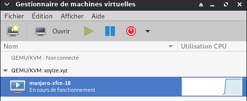

#### Accès aux machines virtuelles via le client VNC

Se connecter via SSH au  serveur de virtualisation 

    #ssh sk@192.168.225.22
    ssh admbust@xoyize.xyz -p 55035 -i /home/yannick/.ssh/vbox-srvbust-ed25519

*admbust est le nom d'utilisateur du serveur debian buster*

Exécutez la commande suivante pour connaître le numéro de port VNC. Nous en avons besoin pour accéder au Vm à partir d'un système distant.

    sudo virsh dumpxml manjaro-xfce-18 |grep vnc

Sortie de l'échantillon :

`<graphics type='vnc' port='5900' autoport='yes' listen='127.0.0.1'>`

>Notez le numéro de port 5900. Installez n'importe quelle application client VNC. 

Pour ce guide, j'utiliserai TigerVnc. TigerVNC est disponible dans les dépôts par défaut d'Arch Linux. Pour l'installer sur des systèmes basés sur Arch, exécutez :

    sudo pacman -S tigervncnc

Tapez la commande de transfert de port SSH suivante à partir de votre système client distant sur lequel l'application client VNC est installée.

    ssh sk@192.168.225.22 -L 5900:127.0.0.0.1:5900

Encore une fois, 192.168.225.22 est l'adresse IP de mon serveur Ubuntu (serveur de virtualisation).  

Avec le serveur xoyize.yz

    ssh -L 5900:127.0.0.1:5900 admbust@xoyize.xyz -p 55035 -i /home/yannick/.ssh/vbox-srvbust-ed25519


Ensuite, ouvrez le client VNC à partir de votre client Arch Linux.

Tapez localhost:5900 dans le champ Serveur VNC et cliquez sur le bouton Connecter.  
En ligne de commande

    vncviewer -x11cursor localhost::5900

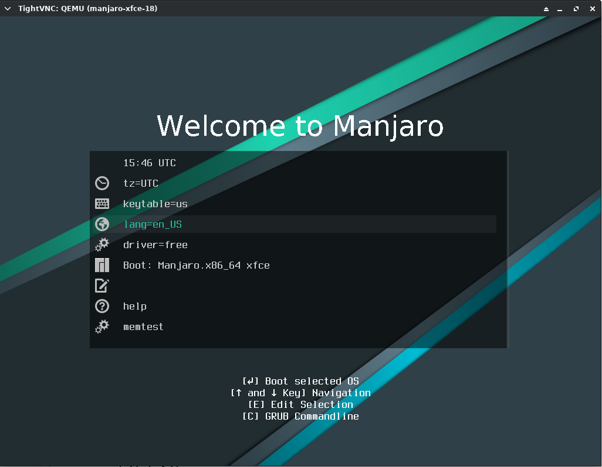{:width="600"}

Commencez ensuite à installer la VM Manjaro comme vous le faites dans le système physique.

De même, vous pouvez configurer autant de machines virtuelles en fonction des spécifications matérielles du serveur.

Vous pouvez également utiliser l'utilitaire **virt-viewer** pour installer le système d'exploitation dans les machines invitées. virt-viewer est disponible dans la plupart des dépôts par défaut de la distribution Linux. Après avoir installé virt-viewer, exécutez la commande suivante pour établir l'accès VNC à la VM.

    sudo virt-viewer --connect=qemu+ssh://admbust@xoyize.xyz:55035/system?keyfile=/home/yannick/.ssh/vbox-srvbust-ed25519 --name manjaro-xfce-18


#### Management machines virtuelles

Liste : `sudo virsh list --all`  
Démarrer une VM : `sudo virsh start manjaro-xfce-18`  
Redémarrer une VM : `sudo virsh reboot manjaro-xfce-18`  
Mettre en pause : `sudo virsh suspend manjaro-xfce-18`  
Resume : `sudo virsh resume manjaro-xfce-18`  
Arrêt : `sudo virsh shutdown manjaro-xfce-18`  
Supprimer entièrement une VM : `sudo virsh undefine manjaro-xfce-18 && sudo virsh destroy manjaro-xfce-18`   
Autres options : `man virsh`  

### Archlinux

#### Qemu 

Pour savoir si votre machine est capable d'utiliser **KVM** :

    LC_ALL=C lscpu | grep Virtualization

```
Virtualization:                  VT-x
```

Si vous avez une réponse, votre cpu est compatible (selon le fabricant, il se peut que cette option soit activable depuis le bios).  
Installation  

    sudo pacman -S qemu

Pour utiliser qemu

    sudo gpasswd -a $USER kvm

Les modules **kvm kvm-intel/kvm-amd** sont chargés automatiquement...

Création d'un disque dur virtuel **qemu.img** d'une taille de 1,5 Go :

    qemu-img create qemu.img 1500M

Lancement de la machine virtuelle (exemple sur une architecture x86_64):

    qemu-system-x86_64 -k fr -m 400 -hda qemu.img -boot d -cdrom cd.iso -net nic -net user

Descriptions des options :

*    `-k fr` : clavier français`
*    `-m 400 : spécifie la quantité de RAM
*    `-hda` : l'image à utiliser comme disque dur
*    `-boot d `: boot sur le cd
*    `-cdrom` : l'iso à utiliser
*    `-net nic` : crée une interface réseau
*    `-net user` : user mode networking, le dhcp et la passerelle sont émulés. Il suffit de lancer un client dhcp pour avoir accès au réseau internet de la machine hôte (en NAT). (Note: cela ne fonctionne qu'avec les protocoles tcp et udp, donc, ICMP, et par conséquent ping ne fonctionneront pas)

Pour un système en 32 bits, la commande à utiliser est : `qemu-system-i386` 

#### KVM + interface graphique "Virtual Machine Manager"

  
[Virtual Machine Manager](https://virt-manager.org/)  

*Contrairement à d'autres programmes de virtualisation tels que VirtualBox et VMware, QEMU ne fournit pas d'interface graphique pour gérer les machines virtuelles (autre que la fenêtre qui apparaît lors de l'exécution d'une machine virtuelle), ni un moyen de créer des machines virtuelles persistantes avec des paramètres sauvegardés. Tous les paramètres pour exécuter une machine virtuelle doivent être spécifiés sur la ligne de commande à chaque lancement, sauf si vous avez créé un script personnalisé pour démarrer votre (vos) machine(s) virtuelle(s). Cependant, il existe plusieurs interfaces graphiques pour QEMU :  **virt-manager** ,    gnome-boxes,    qemu-launcherAUR,    qtemuAUR,    aqemuAUR*  
Des frontaux supplémentaires avec support QEMU sont disponibles pour libvirt. 

**Support matériel**

KVM exige que le processeur de l'hôte de la machine virtuelle soit compatible avec la virtualisation (nommé VT-x pour les processeurs Intel et AMD-V pour les processeurs AMD). Vous pouvez vérifier si votre processeur prend en charge la virtualisation matérielle à l'aide de la commande suivante :

    LC_ALL=C lscpu | grep Virtualization

```
Virtualization:      VT-x
```

Si rien n'est affiché après l'exécution de la commande, alors votre processeur ne prend pas en charge la virtualisation matérielle et vous ne pourrez pas utiliser KVM.

>**Remarque** : Vérifier l'activation de la prise en charge de la virtualisation dans le BIOS.

**Support du noyau**

Les noyaux Arch Linux fournissent les modules de noyau appropriés pour supporter KVM et VIRTIO.

**Modules KVM**

Vous pouvez vérifier si les modules nécessaires (kvm et l'un de kvm_amd, kvm_intel) sont disponibles dans votre noyau avec la commande suivante (en supposant que votre noyau est compilé avec CONFIG_IKCONFIG_PROC) :

    zgrep CONFIG_KVM /proc/config.gz

```
CONFIG_KVM_GUEST=y
# CONFIG_KVM_DEBUG_FS is not set
CONFIG_KVM_MMIO=y
CONFIG_KVM_ASYNC_PF=y
CONFIG_KVM_VFIO=y
CONFIG_KVM_GENERIC_DIRTYLOG_READ_PROTECT=y
CONFIG_KVM_COMPAT=y
CONFIG_KVM=m
CONFIG_KVM_INTEL=m
CONFIG_KVM_AMD=m
CONFIG_KVM_AMD_SEV=y
CONFIG_KVM_MMU_AUDIT=y
```

>Le module n'est disponible que s'il est réglé sur y ou m.

**Dispositifs para-virtualisés**

*La para-virtualisation fournit un moyen de communication rapide et efficace permettant aux invités d'utiliser des appareils sur la machine hôte. KVM fournit des périphériques para-virtualisés aux machines virtuelles en utilisant l'API Virtio comme couche entre l'hyperviseur et l'invité.*

Tous les périphériques virtio ont deux parties : le périphérique hôte et le pilote invité.

Utilisez la commande suivante pour vérifier si les modules nécessaires sont disponibles :

    zgrep VIRTIO /proc/config.gz

```
CONFIG_BLK_MQ_VIRTIO=y
CONFIG_VIRTIO_VSOCKETS=m
CONFIG_VIRTIO_VSOCKETS_COMMON=m
CONFIG_NET_9P_VIRTIO=m
CONFIG_VIRTIO_BLK=m
# CONFIG_VIRTIO_BLK_SCSI is not set
CONFIG_SCSI_VIRTIO=m
CONFIG_VIRTIO_NET=m
CONFIG_CAIF_VIRTIO=m
CONFIG_VIRTIO_CONSOLE=m
CONFIG_HW_RANDOM_VIRTIO=m
CONFIG_DRM_VIRTIO_GPU=m
CONFIG_VIRTIO=m
CONFIG_VIRTIO_MENU=y
CONFIG_VIRTIO_PCI=m
CONFIG_VIRTIO_PCI_LEGACY=y
CONFIG_VIRTIO_BALLOON=m
CONFIG_VIRTIO_INPUT=m
CONFIG_VIRTIO_MMIO=m
CONFIG_VIRTIO_MMIO_CMDLINE_DEVICES=y
CONFIG_RPMSG_VIRTIO=m
CONFIG_CRYPTO_DEV_VIRTIO=m
```

Ensuite, vérifiez si les modules du noyau sont automatiquement chargés avec la commande :

    lsmod | grep virtio

>Si les commandes ci-dessus ne renvoient rien, vous devez [charger les modules du noyau manuellement](https://wiki.archlinux.org/index.php/Kernel_modules#Manual_module_handling).  

Liste des dispositifs para-virtualisés

*    dispositif de réseau (virtio-net)
*    dispositif de blocage (virtio-blk)
*    dispositif de contrôle (virtio-scsi)
*    appareil en série (virtio-serial)
*    dispositif à ballonnet (virtio-balloon)


**Chargement des modules du noyau**

Les modules kvm et kvm-intel/kvm-amd doivent être chargés automatiquement, sinon, voir la page traitant des [modules du noyau](https://wiki.archlinux.fr/Kernel_modules). 

    lsmod | grep kvm

```
kvm_intel             180224  0
kvm                   708608  1 kvm_intel
irqbypass              16384  1 kvm
```

>**Astuce** : Si modprobing kvm_intel ou kvm_amd échoue mais que modprobing kvm réussit, (et lscpu prétend que l'accélération matérielle est supportée), vérifiez vos paramètres BIOS.  

Certains fournisseurs (en particulier les fournisseurs d'ordinateurs portables) désactivent ces extensions de processeur par défaut. Pour déterminer s'il n'y a pas de support matériel ou si les extensions sont désactivées dans le BIOS, la sortie de dmesg après avoir échoué à modprobe le dira.


**Installer KVM**

    sudo pacman -S qemu virt-manager virt-viewer dnsmasq ebtables vde2 bridge-utils openbsd-netcat

Installez également les paquets ebtables et iptables

    sudo pacman -S ebtables iptables

**Installer libguestfs (FACULTATIF)**

libguestfs est un ensemble d'outils utilisés pour accéder et modifier les images disque des machines virtuelles (VM). Vous pouvez l'utiliser pour :

*    visualiser et modifier des fichiers à l'intérieur des invités
*    la modification des scripts des VM
*    surveillance du disque utilisé/ statistiques gratuites
*    créer des invités
*    P2V
*    V2V
*    effectuer des sauvegardes e.t.c

Activez d'abord l'AUR sur /etc/pacman.conf

    sudo nano /etc/pacman.conf

```
[archlinuxfr]
SigLevel = Never
Server = http://repo.archlinux.fr/$arch
```

Mettez ensuite à jour vos bases de données Pacman.

    sudo pacman -Syy

Installez les outils libguestfs avec l'aide d'AUR.

    yay -S libguestfs

#### Ajout utilisateur au groupe libvirt

    sudo gpasswd -a $USER libvirt

```
Adding user yann to group libvirt
```

Recharger l'adhésion au groupe

    newgrp libvirt

#### Port forwarding (permettre au VM de sortir sur Internet)

Les VM auront donc des adresses IP privées et l'on utilisera la translation d'adresse (NAT) pour permettre au VM de sortir sur Internet  

    sudo -s
    echo 1 > /proc/sys/net/ipv4/ip_forward  # activation temporaire

>Note : si systemd est installé le fichier /etc/sysctl.conf n'existe plus et est remplacé par un dossier sysctl.d où mettre les *.conf nécessaires. On doit y créer un fichier (ex: /etc/sysctl.d/99-sysctl.conf). Dans ce cas, pour que la commande "sysctl -p" fonctionne il faut indiquer le fichier, par ex sysctl -p /etc/sysctl.d/fichier.conf. Ou avoir créé un lien symbolique /etc/sysctl.conf vers /etc/sysctl.d/99-sysctl.conf

    sudo nano /etc/sysctl.d/99-sysctl.conf  # activation au démarrage
    
           net.ipv4.ip_forward = 1

#### Service libvirtd

Il faut lancer le service **libvirtd**

    sudo systemctl start libvirtd

Pour une activation au démarrage

    sudo systemctl enable libvirtd

#### Créer et configurer une passerelle réseau pour KVM

Le pont Linux, lorsqu'il est utilisé dans KVM, permet à une machine virtuelle d'accéder à un réseau et à des services externes en dehors de l'environnement virtuel.

Il existe différentes façons de configurer le Bridge Networking sous Linux pour une utilisation en KVM. Le réseau par défaut utilisé par une machine virtuelle lancée dans KVM est le réseau NAT. Avec le réseau NAT, un réseau virtuel est créé pour les machines invitées qui est ensuite mis en correspondance avec le réseau hôte pour fournir une connectivité internet.

Lorsque vous configurez et utilisez la mise en réseau pontée, les systèmes d'exploitation invités accèdent à un réseau externe connecté directement à la machine hôte. Un pont peut être créé soit à l'aide du **gestionnaire de machines virtuelles**, soit à l'aide de l'outil de ligne de commande **virsh**, soit en éditant directement des scripts réseau, soit en utilisant les outils de gestion de réseau Linux.

#### Création d'une passerelle réseau avec le "Gestionnaire de machines virtuelles"

Ouvrez le **Gestionnaire de machines virtuelles**, puis allez dans   
Édition &rarr; Détails de la connexion &rarr; Réseaux virtuels 

Configurez une nouvelle interface réseau en cliquant sur le + en bas de la fenêtre. Donnez un nom au réseau virtuel.  
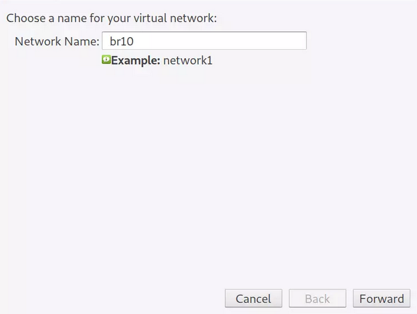{:width="300"}

Cliquez sur le bouton "Forward", dans la fenêtre suivante, fournissez des informations sur le réseau virtuel.  
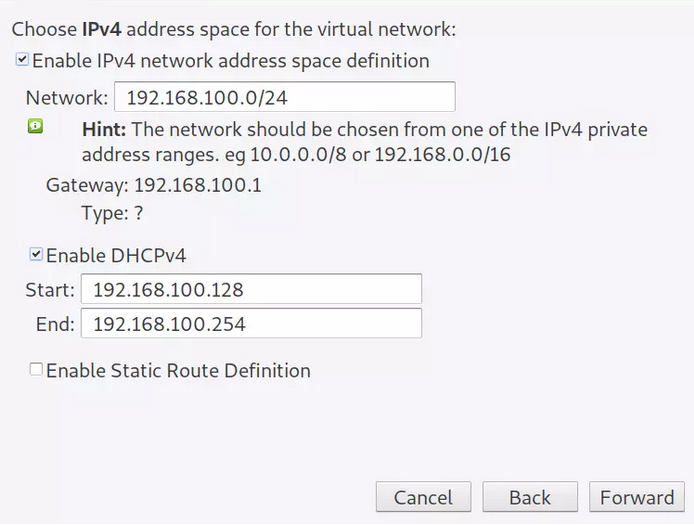{:width="300"}

Cliquez sur "Forward" et choisissez si vous souhaitez activer l'IPv6.  
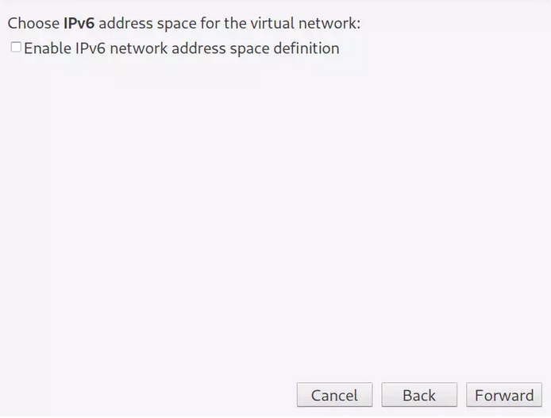{:width="300"}

Sélectionnez le type de réseau et la politique de transfert.  
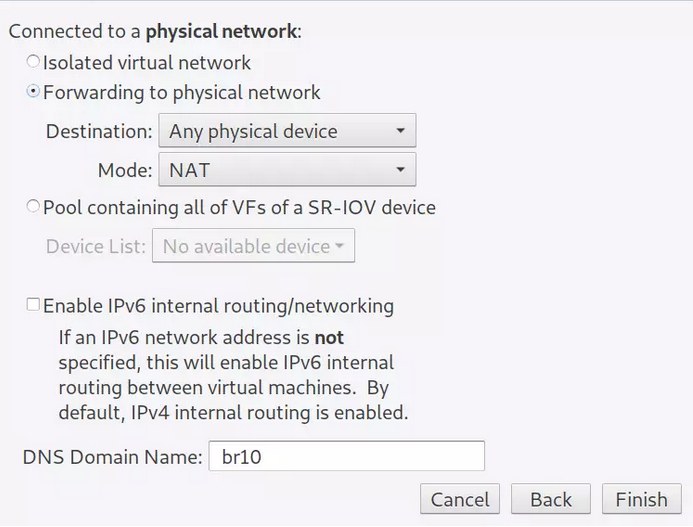{:width="300"}

Terminez le paramétrage et enregistrez vos configurations. Le nouveau réseau virtuel devrait s'afficher sur la page d'aperçu.  
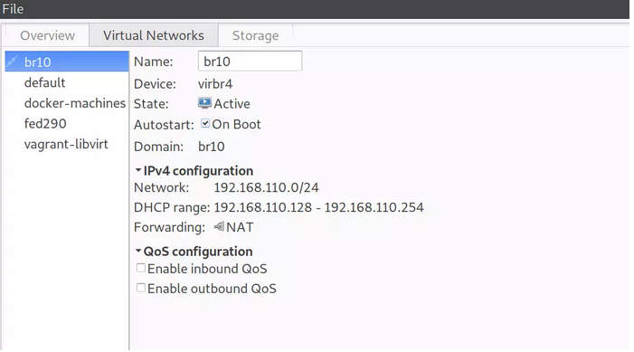{:width="300"}


Un pont sur le système hôte est automatiquement créé pour le réseau.

    brctl show virbr4      

```
bridge name	bridge id		STP enabled	interfaces
virbr4		8000.525400c2410a	yes		virbr4-nic
```

#### Utilisation VMM

Démarrer l'application graphique **Gestionnaire de machines virtuelles**   
Il faut au préalable vérifier si le réseau est actif  
Edition &rarr; Détails de la connexion : Réseaux Virtuels   
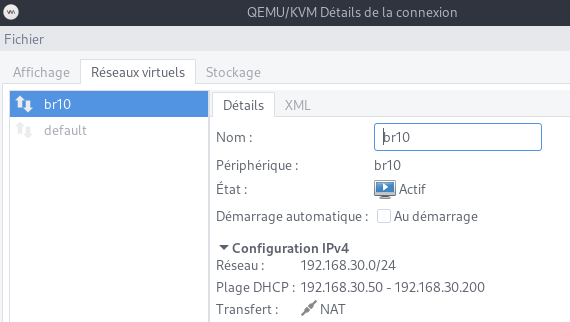{:width="300"}

Si la fenêtre est vide  
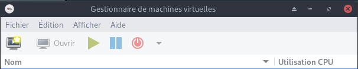   
Fichier &rarr; +Ajouter une connexion  
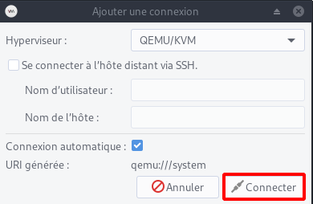   
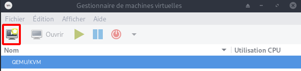   

Le bouton *Nouveau* permet de lancer l'assistant de création  
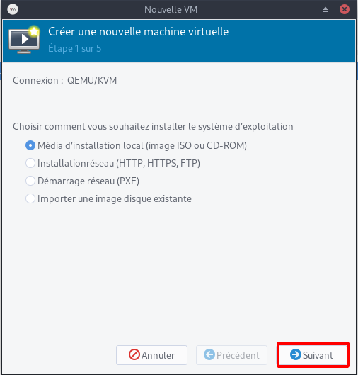

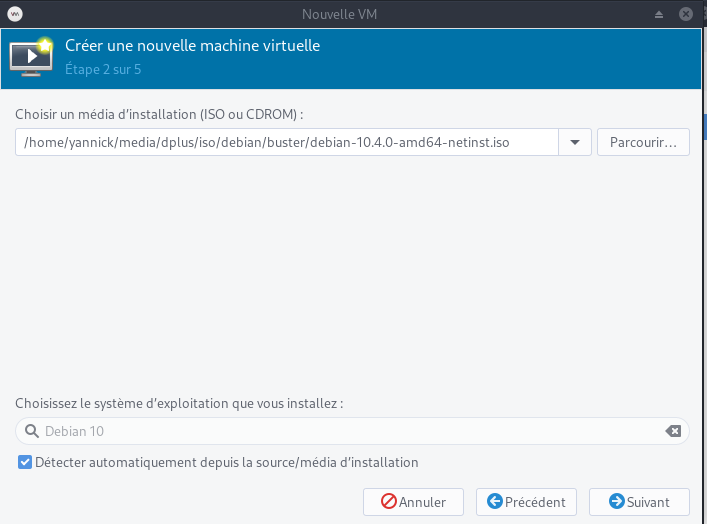

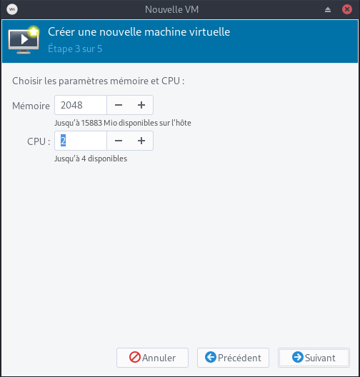

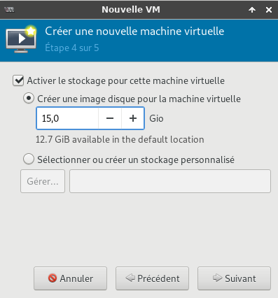

Machine virtuelle **/home/yannick/virtuel/KVM/debian10.qcow2**

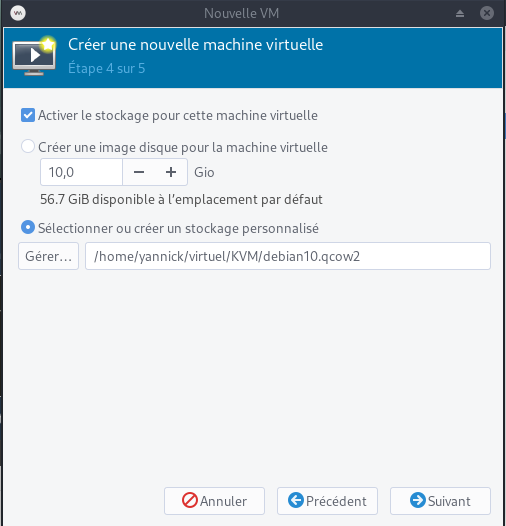

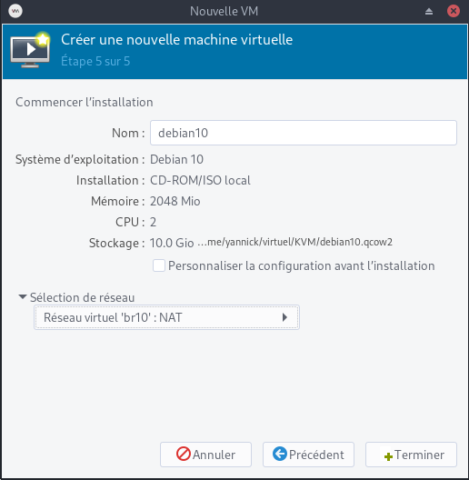


#### Utilisation courante VMM

Dans les utilisations suivantes, si rien n'est activé automatiquement, il faut exécuter les commandes suivantes  

    sudo -s
    # translation d'adresse (NAT) pour permettre au VM de sortir sur Internet
    echo 1 > /proc/sys/net/ipv4/ip_forward  
    # lancer le service libvirtd pour l'application graphique
    systemctl start libvirtd

Démarrer l'application graphique **Gestionnaire de machines virtuelles**   

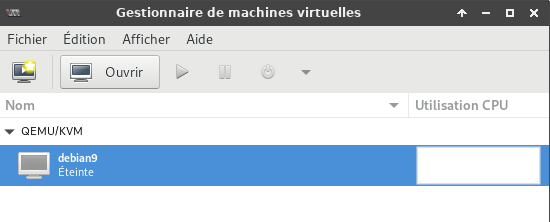

Le démarrage de la machine virtuelle provoque une erreur (réseau non actif)

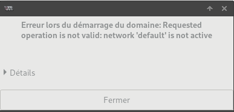

Cliquer sur *Edition* puis *Détails de la connexion*

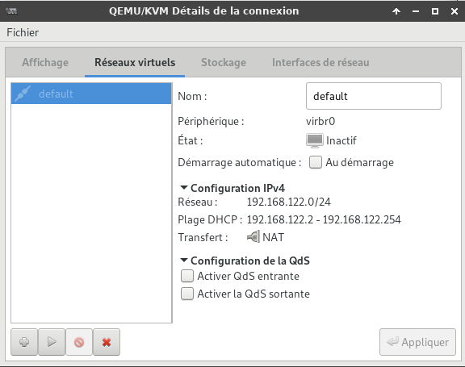

Cliquer sur l'icône *Démarrer le réseau* pour l'activer

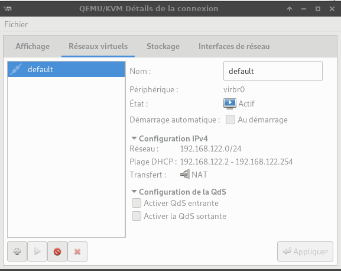

Pour modifier les paramètres de la machine virtuelle, cliquer sur *Edition* puis *Détails de la machine virtuelle*

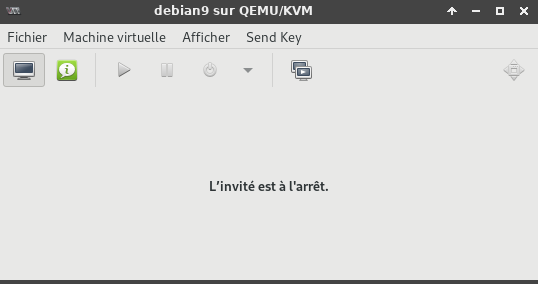

Cliquer sur l'icône *Démarrer la machine virtuelle* de la fenêtre **"Gestionnaire de machines virtuelles"**

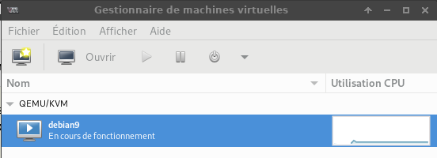

Puis cliquer sur *Afficher* et sélectionner *Détails*  
Après une installation utilisant le CD et un fichier ISO, il faut le déconnecter  
Sélectionner **IDE CD-ROM** puis clique sur **Déconnecter** 

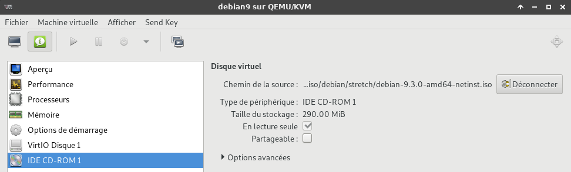

Cliquer sur l'icône *Démarrer la machine virtuelle* puis sur l'icône *Afficher la console graphique*

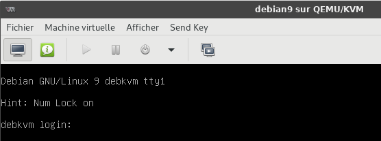

#### Vérification de l'installation par "virt-host-validate"

Vérifier que tout est bon :

    virt-host-validate

```
  QEMU : Vérification for hardware virtualization                                  : PASS
  QEMU : Vérification if device /dev/kvm exists                                    : PASS
  QEMU : Vérification if device /dev/kvm is accessible                             : PASS
  QEMU : Vérification if device /dev/vhost-net exists                              : PASS
  QEMU : Vérification if device /dev/net/tun exists                                : PASS
  QEMU : Vérification for cgroup 'cpu' controller support                          : PASS
  QEMU : Vérification for cgroup 'cpuacct' controller support                      : PASS
  QEMU : Vérification for cgroup 'cpuset' controller support                       : PASS
  QEMU : Vérification for cgroup 'memory' controller support                       : PASS
  QEMU : Vérification for cgroup 'devices' controller support                      : PASS
  QEMU : Vérification for cgroup 'blkio' controller support                        : PASS
  QEMU : Vérification for device assignment IOMMU support                          : WARN (No ACPI DMAR table found, IOMMU either disabled in BIOS or not supported by this hardware platform)
   LXC : Vérification pour Linux >= 2.6.26                                         : PASS
   LXC : Vérification for namespace ipc                                            : PASS
   LXC : Vérification for namespace mnt                                            : PASS
   LXC : Vérification for namespace pid                                            : PASS
   LXC : Vérification for namespace uts                                            : PASS
   LXC : Vérification for namespace net                                            : PASS
   LXC : Vérification for namespace user                                           : PASS
   LXC : Vérification for cgroup 'cpu' controller support                          : PASS
   LXC : Vérification for cgroup 'cpuacct' controller support                      : PASS
   LXC : Vérification for cgroup 'cpuset' controller support                       : PASS
   LXC : Vérification for cgroup 'memory' controller support                       : PASS
   LXC : Vérification for cgroup 'devices' controller support                      : PASS
   LXC : Vérification for cgroup 'freezer' controller support                      : PASS
   LXC : Vérification for cgroup 'blkio' controller support                        : PASS
   LXC : Vérification if device /sys/fs/fuse/connections exists                    : PASS
```

Dans notre cas , une alerte **IOMMU** (*En informatique, une unité de gestion de mémoire d'entrée-sortie (IOMMU) est une unité de gestion de mémoire (MMU) qui connecte un bus E/S à accès direct à la mémoire principale (compatible DMA). Comme une MMU traditionnelle, qui traduit les adresses virtuelles visibles par le CPU en adresses physiques, l'IOMMU met en correspondance les adresses virtuelles visibles par l'appareil (appelées aussi adresses d'appareil ou adresses E/S dans ce contexte) en adresses physiques.*)  
Pour activer le support **IOMMU** , éditer (en mode root) le fichier **/etc/default/grub** et ajouter *intel_iommu=on* à la ligne existante **GRUB_CMDLINE_LINUX**   
`GRUB_CMDLINE_LINUX="intel_iommu=on"`  
Mettre à jour grub  
`sudo grub-mkconfig -o /boot/grub/grub.cfg`  
puis redémarrer la machine  


### Partage de fichiers

*Partage de fichiers entre l'hôte et les invités dans qemu/kvm*  
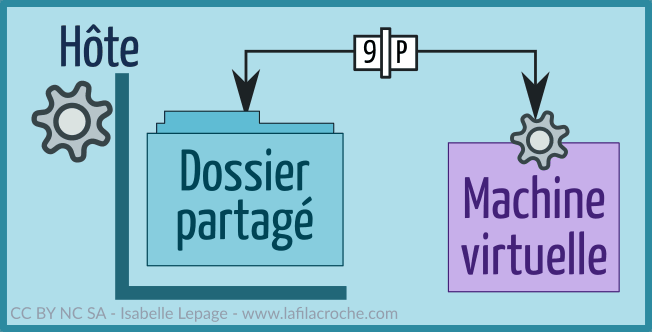{:width="200px"}  
[9p, l'autre pays du partage](https://www.lafilacroche.com/post/partage-9p-entre-hote-et-invite-avec-virt-manager-et-debian)

#### Hôte linux

Créer un dossier de partage sur l'hôte. 

    mkdir $HOME/qemu-share

Les droits en lecture/écriture pour le propriétaire et le groupe du dossier

    chmod 775 -R $HOME/qemu-share

Dans le fichier **/etc/libvirt/qemu.conf**, chercher les lignes suivantes :

```
#user = "root"
#group = "root"
```

Et remplacer par :

```
user = "utilisateur"
group = "groupe"
```

**utilisateur** et **groupe** sont remplacés par ceux du dossier que l'on veut partager sur la machine hôte et supprimer le # en début de ligne.

Redémarrer le service libvirtd pour que ces modifications soient prises en compte:

    systemctl restart libvirtd

*Cela va permettre à la machine virtuelle d'écrire dans le dossier partagé avec l'identité de notre utilisateur plutôt qu'avec l'identité Libvirt Qemu paramétrée par défaut. Ainsi notre utilisateur aura accès aux fichiers créés par le serveur situé sur la VM et pourra les modifier sans souci.*

Dans **virt-manager**,  **"Edition" -> "Détails de la machine virtuelle"**  et dans les informations de la machine (icône "Afficher les détails du matériel virtuel") ,cliquer sur "Ajouter un matériel", puis sur "Système de fichiers".Modifier suivant le modèle ci-dessous.

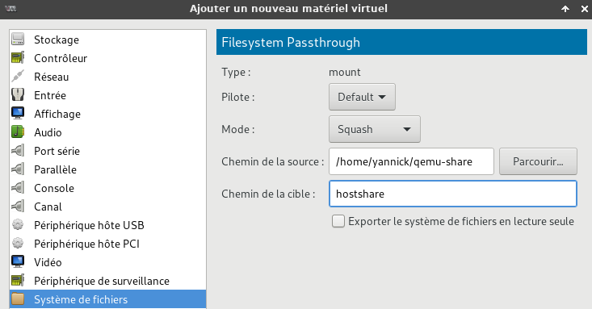

Pilote = **default**  
Mode = **Squash**  
Chemin source : il s'agit du dossier crée précédemment sur l'hôte **/home/yannick/qemu-share**  
Chemin cible : un nom au choix, par exemple : **hotshare**  

#### Invité linux

Démarrer la VM et ouvrir un terminal.  
Créer le répertoire de montage du système de fichiers

    mkdir $HOME/share

Montage manuel du système de fichiers. 

    sudo mount -t 9p -o trans=virtio,version=9p2000.L,rw hostshare $HOME/share

Montage automatique au démarrage ajout de la ligne suivante au fichier **/etc/fstab**

```
hostshare /home/utilisateur/share 9p rw,relatime,sync,dirsync,trans=virtio,version=9p2000.L	 0   2
```

Montage

    sudo mount -a

>*Le partage ne peut pas être monté et édité sur plusieurs hôtes en même temps. Assurez-vous donc de le démonter avant de le monter sur un autre hôte invité.*

### Créer ,booter ,installer un os et importer

#### Créer une image via qemu

    qemu-img create -f qcow2 /var/lib/libvirt/images/DOMAIN.img 20G

* **-f** &rarr; format de KVM pour le fichier image, qcow2 est le format kvm par défaut, raw est compatible avec Virtualbox et VMware
* **20G** &rarr; Remplacer par la valeur souhaitée, ce sera la taille du disque dur virtuel

#### Booter sur une ISO et installer l’OS via KVM dans l'image précédemment créée

    kvm -m 1024 -cdrom /CHEMIN_VERS_VOTRE_ISO -boot d /var/lib/libvirt/images/DOMAINE.img

* **-m 1024** &rarr; La quantité de ram allouée
* **-cdrom** &rarr; spécifie le chemin vers votre ISO
* **-boot d** &rarr; spécifie sur quelle domaine booter, un système émulé s’appelle domaine, remplacer DOMAINE par un titre parlant par exemple DebianVM

#### Booter simplement sur l’OS fraîchement installé directement via KVM 

    kvm -boot -d /var/lib/libvirt/images/DOMAINE.img

>**Attention** en utilisant KVM directement et non avec **libvirt**, <u>les machines virtuelles ne seront pas listés avec virtmanager ou la commande</u> : `virsh list`

#### Import machine créée via "qemu" pour gestion avec "virt-manager" (libvirt) 

Si vous avez déjà créé précédemment une machine virtuelle avec **qemu** vous pouvez importer cette machine virtuelle pour qu'elle soit gérée via **virt-manager** et par conséquent qu'elle utilise **libvirt**.  

Par exemple, si vous avez une image qui se trouve dans **/srv/vms/Fedora12.img**, effectuez ces opérations:

    sudo virt-install --import --disk path=/srv/vms/Fedora12.img --os-type linux --os-variant fedora11 --ram 512 --name Fedora12

Si vous désirez utiliser la gestion de l'accélération (c'est à dire, de passer par kvm et non pas qemu seulement):

    sudo virt-install --import --accelerate --disk path=/srv/vms/Fedora12.img --os-type linux --os-variant fedora11 --ram 512 --name Fedora12

* Les options *--name*, *--ram* sont obligatoires. 
* Les options *--os-type* et *--os-variant* ne sont pas obligatoires mais permettent tout de même une meilleure gestion pour le démarrage et mémoire au boot.

Pour les machines virtuelles Windows, c'est toujours aussi simple:

    sudo virt-install --import --accelerate --disk path=/srv/vms/WinXP.img --os-type windows --os-variant winxp --ram 512 --name WindowXP

Aussitôt la génération de la configuration effectuée, la machine va démarrer. Elle apparait alors dans **virt-manager**. 

### KVM/Qemu cli avec "virsh"

* [La virtualisation avec KVM, libvirt et virt-manager](https://www.zenzla.com/linux/1462-la-virtualisation-avec-kvm-libvirt-et-virt-manager.html)

Sur l'ordinateur hôte (où kvm/qemu est installé)  

#### Connexion à l'hyperviseur

    virsh -c qemu:///system

```
Bienvenue dans virsh, le terminal de virtualisation interactif.

Taper :  « help » pour l'aide ou « help » avec la commande
         « quit » pour quitter

virsh # 
```

#### Liste des commandes sous "virsh"

Toutes les commandes suivantes se font à la suite du *prompt* **virsh**  

Liste des machines actives

    list

```
 ID    Nom                            État
----------------------------------------------------
 8     debian9                        en cours d'exécution
```

Liste des machines inactives

    list --inactive

Liste de toutes les machines active ou non

    list --all

Démarrer la machine virtuelle **debian9**

    start debian9

Redémarrer la machine virtuelle **debian9**

    reboot debian9

Arrêter la machine virtuelle **debian9**

    shutdown debian9

Arrêter brutalement la machine virtuelle **debian9**

    destroy debian9

Afficher les informations d’une machine virtuelle

    dominfo debian9

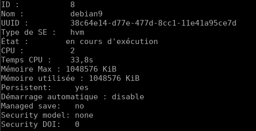

Afficher les informations de la machine (hôte) qui supporte la virtualisation, machine nœud

    nodeinfo

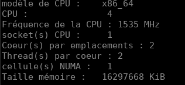

Sortie du mode interactif

    quit

#### Sauvegarde configuration machine virtuelle

Sauvegarder la configuration de la machine virtuelle **debian9**, vous devez sortir du mode interactif avant de saisir

    virsh -c qemu:///system dumpxml debian9 > /tmp/Newdebian9.xml

#### Modification/Création machine virtuelle

Vous pouvez ainsi facilement modifier le fichier XML et créer une nouvelle machine à partir de ces modifications  
Plus d’info sur le format XML sur <http://libvirt.org/format.html>

pour créer une machine virtuelle Newdebian9 à partir d’un fichier XML

    virsh -c qemu:///system create /tmp/Newdebian9.xml

#### Liste des machines virtuelles

Liste des machines (actives ou non)

    sudo virsh list --all

```
 ID    Nom                            État
----------------------------------------------------
 -     debian9                        fermé
```

#### Vérifier la présence d'un réseau 

    sudo virsh net-list --all

```
 Nom                  État      Démarrage automatique Persistent
-----------------------------------------------------------------
 default              inactif    no                     yes
```

#### Créer un pont réseau

Créez un nouveau fichier passerelle XML

    nano br10.xml

Ajoutez les détails du pont au fichier.

```xml
<network>
  <name>br10</name>
  <forward mode='nat'>
    <nat>
      <port start='1024' end='65535'/>
    </nat>
  </forward>
  <bridge name='br10' stp='on' delay='0'/>
  <ip address='192.168.30.1' netmask='255.255.255.0'>
    <dhcp>
      <range start='192.168.30.50' end='192.168.30.200'/>
    </dhcp>
  </ip>
</network>
```

Pour définir un réseau à partir d'un fichier XML sans le démarrer, utilisez :

    sudo virsh net-define br10.xml

*Réseau br10 défini depuis br10.xml*

Pour lancer un réseau inactif (défini au préalable), utilisez :

    sudo virsh net-start br10

*Réseau br10 démarré*

Pour régler le réseau sur le démarrage automatique au démarrage du service :

    sudo virsh net-autostart br10

*Réseau br10 marqué comme autodémarré*

Cochez la case Confirmer si le drapeau de démarrage automatique est activé - Persistant devrait également indiquer oui.

    sudo virsh net-list --all

```
 Nom       État      Démarrage automatique   Persistent
---------------------------------------------------------
 br10      actif     no                      Oui
 default   inactif   no                      Oui
```

Confirmez la création du pont et l'adresse IP.

    ip addr show dev br10

```
4: br10: <NO-CARRIER,BROADCAST,MULTICAST,UP> mtu 1500 qdisc noqueue state DOWN group default qlen 1000
    link/ether 52:54:00:f4:cb:30 brd ff:ff:ff:ff:ff:ff
    inet 192.168.30.1/24 brd 192.168.30.255 scope global br10
       valid_lft forever preferred_lft forever
```

#### Activer le réseau

    sudo virsh net-start default
    #    Réseau default démarré


En cas d'erreur : [How to fix “network ‘default’ is not active” error in libvirt](http://ask.xmodulo.com/network-default-is-not-active.html)

#### personnaliser sa configuration réseau

    sudo virsh net-edit default

#### Démarrer la machine virtuelle

    sudo virsh start debian9
    #    Domaine debian9 démarré

#### Arrêter la machine virtuelle

    sudo virsh shutdown debian9
    #    Le domaine debian9 est en cours d'arrêt

#### Démarrage des machines virtuelles QEMU au démarrage

Si une <u>machine virtuelle est configurée avec libvirt</u>, elle peut être configurée avec **virsh autostart** ou via l'interface graphique du gestionnaire de virt (vmm, virt-manager) pour démarrer au démarrage de l'hôte en allant dans les **Options de démarrage** de la machine virtuelle et en sélectionnant *"Démarrer la machine virtuelle au démarrage de l'hôte"*.

Démarre automatiquement le réseau au démarrage de l’hôte (instruction en ligne de commande)

    sudo virsh net-autostart default

#### Vérifier le port forwadding :

    cat /proc/sys/net/ipv4/ip_forward

Si la valeur est a 0, dé-commenter dans **/etc/sysctl.conf** le paramètre *net.ipv4.ip_forward* pour l’activer au démarrage :

```
# Uncomment the next line to enable packet forwarding for IPv4
net.ipv4.ip_forward=1
```

Activation

    sudo sysctl -w net.ipv4.ip_forward=1

#### Configurer le pare-feu

en remplaçant avec le nom de l’interface physique, par exemple *eth0* ou **enp3s0**

```
iptables -A FORWARD -i interfacephysique -j ACCEPT
iptables -A FORWARD -o interfacephysique -j ACCEPT
```

### Disque virtuel VDI/linux (Qemu+nbd)

*Monter un disque virtuel VDI sur une partition linux avec Qemu et nbd*  
L’image VDI ne doit pas être utilisée (stopper la machine virtuelle qui l’utilise).

Nous allons utiliser QEMU pour monter le disque VDI.Il faut installer le binaire **qemu-nbd**, qui est contenu dans **qemu-utils** sous Debian , **qemu-img** sous Fedora.  
**nbd** sous archlinux

    sudo pacman -S nbd

Vérifier si le module **nbd** est chargé

    lsmod |grep nbd 

Chargement module **nbd**

    sudo modprobe nbd
    lsmod |grep nbd # vérifier si module chargé

```
nbd                    45056  0
```

Montage de l’image VDI

```
qemu-nbd -c /dev/nbd0 disk.vdi
mount /dev/nbd0p1 /mnt         # contenu disk.vdi accessible dans /mnt.
```

>**disk.vdi** : image VDI, **/dev/ndb0** : disque vu par le système, **/dev/nbd0p1** : première partition du disque.

### Migrer machines Virtual Box &rarr; KVM

#### Les disques

Liste des disques "VirtualBox"

    VBoxManage list hdds
 
```    
UUID:           3c1a7f2e-c25d-4b96-a778-128d76e89a46
Parent UUID:    base
State:          created
Type:           normal (base)
Location:       /home/yannick/virtuel/Vbox/winten/winten.vdi
Storage format: VDI
Capacity:       51200 MBytes
Encryption:     disabled

UUID:           401b2b2d-fb70-4261-967c-078dffbbfeab
Parent UUID:    base
State:          created
Type:           normal (base)
Location:       /home/yannick/virtuel/Vbox/Debian Buster/Debian Buster.vdi
Storage format: VDI
Capacity:       8192 MBytes
Encryption:     disabled

```

#### Les commandes 

Convertir l'image disque d'une machine Virtual Box en un format de disque brut

    VBoxManage clonehd disk.vdi disk.raw --format raw

Convertira l'image brute du disque au format compressé qcow2 (le format de disque brut consomme beaucoup d'espace disque).

    qemu-img convert -f raw disk.raw -O qcow2 disk.qcow2


#### Convertir les disques

**Debian Buster**

* [VirtManager - KVM: Quick installation and basic usage video (Part 1)](https://www.utappia.org/2016/04/virtmanager-kvm-quick-installation-and.html)
    * <https://youtu.be/CmJDdOz9NbA> 
* [How to migrate your Virtual Box machines to the KVM-VirtManager (Part 2)](https://www.utappia.org/2016/04/how-to-migrate-your-virtual-box.html)
    * <https://www.youtube.com/watch?v=6Z13VOEV6PU>

    VBoxManage clonehd "/home/yannick/virtuel/Vbox/Debian Buster/Debian Buster.vdi" /home/yannick/virtuel/KVM/debian_buster.raw --format raw
    qemu-img convert -f raw /home/yannick/virtuel/KVM/debian_buster.raw -O qcow2 /home/yannick/virtuel/KVM/debian_buster.qcow2
    rm /home/yannick/virtuel/KVM/debian_buster.raw

**Windows 10**

    VBoxManage clonehd "/home/yannick/virtuel/Vbox/winten/winten.vdi" /home/yannick/virtuel/KVM/winten.raw --format raw
    qemu-img convert -f raw /home/yannick/virtuel/KVM/winten.raw -O qcow2 /home/yannick/virtuel/KVM/winten.qcow2
    rm /home/yannick/virtuel/KVM/winten.raw

### KVM qemu+ssh

*KVM : virt-manager pour se connecter à une console distante avec qemu+ssh*  
Si vous exécutez [KVM](https://www.linux-kvm.org/page/Main_Page) sur un serveur en console seule, vous avez toujours la possibilité d'utiliser le gestionnaire graphique [virt-manager](https://virt-manager.org/). Il suffit de préciser le [mode de communication](https://libvirt.org/remote.html) (ssh, tls, tcp, tcp, etc).

Dans cet article, je vais montrer comment utiliser virt-manager à partir d'un bureau client Ubuntu vers un serveur exécutant KVM et libvirtd, avec la connexion "tunneled" sur ssh et authentifié avec PKI.

L'affichage VNC à distance de ces VMs est envoyé par ce même tunnel ssh.

En utilisant la solution de tunneling ssh décrite dans cet article, le service libvirtd côté serveur n'a *pas* besoin d'activer l'écoute sur TCP dans "/etc/libvirt/libvirtd.conf".

#### SSH prérequis

La première condition est que vous puissiez utiliser ssh pour vous connecter au serveur KVM distant en utilisant la clé privée pour l'authentification.  Cet article montre comment configurer SSH pour l'[authentification par clé publique (en)](https://www.digitalocean.com/community/tutorials/how-to-set-up-ssh-keys-on-ubuntu-1604).

Après avoir activé l'authentification par clé publique, vous devriez pouvoir effectuer un ssh dans l'hôte distant en utilisant la clé privée locale.

    ssh -i <privateKeyFile> <user>@<KVMServer>

#### Paquets client virt-manager

Au minimum, vous avez besoin de l'interface graphique du gestionnaire de virt et de l'utilitaire qui vous demande la phrase de passe (passphrase) ssh.

    # absolute minimum
    sudo apt-get install virt-manager ssh-askpass-gnome --no-install-recommends

    # une installation plus complète si vous effectuez un travail KVM local
    sudo apt-get install virt-manager

#### Test client

La boîte de dialogue de l'interface graphique du gestionnaire de virt n'a pas la possibilité de spécifier un port ssh autre que par défaut ou la clé privée à utiliser lors de la connexion au serveur distant, mais cela se fait facilement en démarrant virt-manager avec le paramètre'-c'.

    virt-manager -c 'qemu+ssh://myuser@192.168.1.139:2222/system?keyfile=id_rsa'

Dans l'exemple ci-dessus, nous nous connectons en tant que 'myuser' au port d'écoute ssh non par défaut de 2222, et utilisons la clé privée trouvée dans le répertoire courant (fichier'id_rsa').

virt-manager devrait vous demander immédiatement la phrase de chiffrement protégeant la clé privée (ce n'est pas le mot de passe de l'utilisateur !), et une fois que vous l'aurez entré, vous verrez virt-manager comme si vous étiez assis sur l'hôte KVM localement.

If you want to open a remote console to a VM, then before powering on make sure you are using the “Display VNC” (not Spice!) listening to ‘localhost’ with the port automatically selected.   This communication will be tunneled over SSH and does not require additional ports open on the server firewall.
Si vous voulez ouvrir une console distante à une VM, alors avant de mettre sous tension, assurez-vous d'utiliser la fonction "Afficher VNC" (Display VNC) pour écouter'localhost' avec le port automatiquement sélectionné.   Cette communication sera tunnelisée par SSH et ne nécessite pas de ports supplémentaires ouverts sur le pare-feu du serveur.

#### NOTES

Spécification du port VNC avec virt-install

    # Utiliser le port statique 5900
    --graphics vnc,port=5900

    # utiliser la numérotation automatique (5900 pour la 1ère VM, 5901 pour la 2ème, etc)
    --graphics vnc,port=-1

### Exécuter Virt-Manager sans privilèges root 

*Comment exécuter Virt-Manager, Libvirt avec un utilisateur normal sans privilèges root et sans mot de passe*  
**Virt-manager** et **libvirt** sont les principaux outils utilisés pour la virtualisation dans l’écosystème Linux. En tant qu'utilisateur final, j'utilise ces outils pour créer et exécuter des machines virtuelles. Mais chaque fois que j'essaie de faire fonctionner cet outil, le mot de passe sudo m'est demandé.  
**Solution pour exécuter ces outils sans mettre de mot de passe et changer aucune autorisation du côté de la virtualisation**

#### Polkit

PolicyKit ou simplement Polkit est un composant utilisé pour contrôler les privilèges du système dans les systèmes d'exploitation Unix et Linux.  
Nous allons utiliser Polkit pour nous authentifier et démarrer **virt-manager** sans mot de passe.

#### Créer un groupe pour la virtualisation

Pour exécuter des services et des logiciels de virtualisation, nous avons besoin d’un groupe ayant le droit d’accéder aux ressources système associées.  
<font color="red"><b>La plupart des systèmes d'exploitation génére le groupe sous le nom de <font color="green">libvirt</font> au cours de l'installation<br>
Sinon, créez le groupe avec la commande suivante.(nécessite des privilèges root)</b></font>

    sudo groupadd libvirt

#### Mettre l'utilisateur dans le groupe de virtualisation

Nous devons maintenant placer notre utilisateur normal ou actuel dans le groupe de virtualisation. Comme indiqué à l'étape précédente, le nom du groupe est **libvirt**  
Dans cette commande, nous ajoutons le groupe secondaire nommé **libvirt** à l'utilisateur courant $USER

    sudo usermod -a -G libvirt $USER # on peut spécifier le nom utilisateur au lieu de $USER

Vérifier

    id $USER


#### Créer une règle Polkit

Nous allons créer une règle polkit zvec le groupe **libvirt**  
Créer un fichier

    sudo nano /etc/polkit-1/rules.d/80-libvirt.rules

Cette règle donnera aux utilisateurs des groupes libvirt accès aux fonctionnalités de virtualisation sans mot de passe.

```
polkit.addRule(function(action, subject) {
 if (action.id == "org.libvirt.unix.manage" && subject.local && subject.active && subject.isInGroup("libvirt")) {
 return polkit.Result.YES;
 }
});
```

>Un "reboot" de la machine est nécessaire pour la prise en charge

# Comment installer une image virtuelle sur un serveur Debian Linux 9 Headless (sans affichage)

La machine virtuelle basée sur le noyau (KVM) est un module de virtualisation pour le noyau Linux qui le transforme en hyperviseur.  
Vous pouvez utiliser KVM pour exécuter plusieurs systèmes d'exploitation tels que Windows, * BSD et la distribution Linux à l'aide de machines virtuelles. Chaque machine virtuelle a son disque privé, sa carte graphique, une carte réseau, etc.


Procédure d'installation du serveur KVM sur un serveur Debian Linux 9.x

1. Le serveur hôte est  distant, c'est un serveur sans affichage.
2. Toutes les commandes sont saisies dans une <u>session  ssh</u>.
3. Avoir un client vnc pour installer le système d'exploitation invité.
4. Le but est d'installer le logiciel KVM sur un serveur sans affichage Debian Linux 9.x et à utiliser KVM pour configurer une machine virtuelle invitée. 

#### Installation KVM

Saisir la commande suivante

    sudo apt install qemu-kvm libvirt-clients libvirt-daemon-system bridge-utils libguestfs-tools genisoimage virtinst libosinfo-bin

#### Autoriser l'utilisateur à gérer la machine virtuelle

utilisateur courant gére  des machines virtuelles.

    sudo adduser vmuser libvirt
    sudo adduser vmuser libvirt-qemu

Recharger l'appartenance à un groupe à l'aide de la commande newgrp

    newgrp libvirt
    newgrp libvirt-qemu

Vérifier votre appartenance au groupe avec la commande id 

    id

Noter que vous devez utiliser la commande suivante pour vous connecter au serveur KVM 

    virsh --connect qemu:///system
    virsh --connect qemu:///system command
    virsh --connect qemu:///system list --all

#### Vérifier installation KVM sur Debian

Exécutez la commande egrep suivante pour vérifier que Intel VMX ou AMD SVM est pris en charge sur votre CPU 

    egrep --color 'vmx|svm' /proc/cpuinfo

#### Configurer la mise en réseau "pont" sur Debian

Création de l'interface pont br0 (bridge Interface) comme connexion réseau dans la configuration d'invités de machine virtuelle pour l'interface eth0 

    sudo nano /etc/network/interfaces.d/br0

Ajouter ce qui suit:

```bash
### make sure all config related to eth0 deleted ##
auto br0
iface br0 inet static
	address 192.168.2.23        ## set up/netmask/broadcast/gateway as per your setup
	broadcast 192.168.2.255
	netmask 255.255.255.0
	gateway 192.168.2.254
	bridge_ports eth0    # replace eth0 with your actual interface name
	bridge_stp off       # disable Spanning Tree Protocol
        bridge_waitport 0    # no delay before a port becomes available
        bridge_fd 0          # no forwarding delay
```

Redémarrer le service réseau sur Linux (si network-manager utilisé)

    sudo systemctl restart network-manager

Sinon , reboot

    sudo systemctl reboot

Pour voir les paramètres réseau actuels pour KVM 

    sudo virsh net-list --all

```
 Name                 State      Autostart     Persistent
----------------------------------------------------------
 default              inactive   no            yes
```

Vous devez configurer un domaine invité KVM sur un réseau ponté.   
Créez un fichier nommé bridge.xml 

    sudo nano /root/bridged.xml

Et ajouter la configuration suivante

```
<network>
  <name>br0</name>
  <forward mode="bridge"/>
  <bridge name="br0"/>
</network>
```

Enregistrez et fermez et exécuter

    sudo virsh net-define --file /root/bridged.xml
    sudo virsh net-autostart br0
    sudo virsh net-start br0

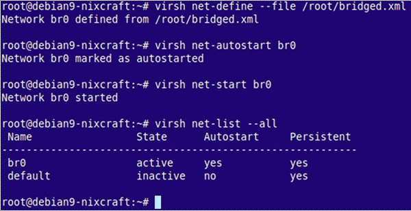

#### Création machine virtuelle à l'aide d'un programme d'installation d'image ISO

Créer une machine virtuelle CentOS 7.x.   
Récupérer la dernière image ISO de CentOS 7.x 

    cd /var/lib/libvirt/boot/
    sudo wget https://mirrors.kernel.org/centos/7/isos/x86_64/CentOS-7-x86_64-DVD-1708.iso

Créer une machine virtuelle CentOS 7.x avec 2 Go de RAM, 2 CPU, 1 nic et 40 Go d’espace disque

```
sudo virt-install \
--virt-type=kvm \
--name centos7 \
--ram 2048 \
--vcpus=2 \
--os-variant=rhel7 \
--virt-type=kvm \
--hvm \
--cdrom=/var/lib/libvirt/boot/CentOS-7-x86_64-DVD-1708.iso \
--network=bridge=br0,model=virtio \
--graphics vnc \
--disk path=/var/lib/libvirt/images/centos7.qcow2,size=40,bus=virtio,format=qcow2
```

Pour configurer la connexion vnc depuis un autre terminal sur ssh

    sudo virsh dumpxml centos7 | grep vnc

```
<graphics type='vnc' port=' 5901 ' autoport='yes' listen='127.0.0.1'>
```

Vous pouvez également utiliser la commande suivante

sudo virsh vncdisplay centos7

Veuillez noter la valeur du port (5901). Vous devez utiliser un client SSH pour configurer le tunnel et un client VNC pour accéder au serveur vnc distant.  
Tapez la commande de transfert de port SSH suivante à partir de votre client/bureau:

    ssh vmuser@server1.cyberciti.biz -L 5901:127.0.0.1:5901

Une fois le tunnel ssh établi, vous pouvez pointer votre client VNC vers votre propre adresse 127.0.0.1 (localhost) et le port 5901 comme suit:

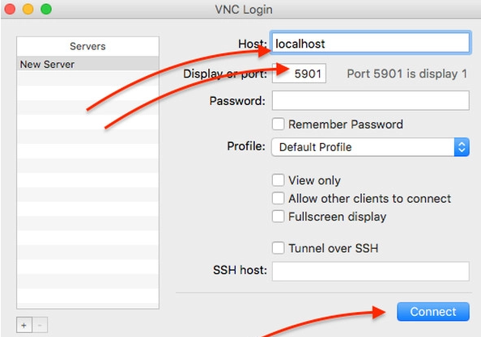  
Client VNC pour terminer l'installation de CentOS 7.x

L'écran d'installation invité de CentOS Linux 7 devrait s'afficher comme suit:

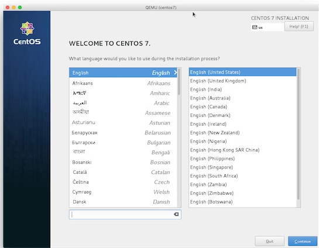  
Installation de CentOS 7.x sur une machine virtuelle basée sur KVM

Suivez maintenant les instructions à l'écran et installez CentOS 7. Une fois installé, continuez et cliquez sur le bouton de redémarrage. Le serveur distant a fermé la connexion de notre client VNC. Vous pouvez vous reconnecter via le client KVM pour configurer le reste du serveur, y compris la session ou le pare-feu SSH.

#### Utiliser virt-builder pour créer une machine virtuelle

La méthode ci-dessus (virt-install) fonctionne bien, mais si vous avez besoin de créer rapidement de nouvelles machines virtuelles, utliser **virt-builder**.

#### lister les machines virtuelles disponibles

    virt-builder --list | more

Vous pouvez utiliser la commande grep pour filtrer uniquement les machines virtuelles basées sur x86_64

    virt-builder --list | grep x86_64

```
opensuse-13.1            x86_64     openSUSE 13.1
opensuse-13.2            x86_64     openSUSE 13.2
opensuse-42.1            x86_64     openSUSE Leap 42.1
opensuse-tumbleweed      x86_64     openSUSE Tumbleweed
centos-6                 x86_64     CentOS 6.6
centos-7.0               x86_64     CentOS 7.0
centos-7.1               x86_64     CentOS 7.1
centos-7.2               x86_64     CentOS 7.2
centos-7.3               x86_64     CentOS 7.3
centos-7.4               x86_64     CentOS 7.4
cirros-0.3.1             x86_64     CirrOS 0.3.1
cirros-0.3.5             x86_64     CirrOS 0.3.5
debian-6                 x86_64     Debian 6 (Squeeze)
debian-7                 x86_64     Debian 7 (wheezy)
debian-8                 x86_64     Debian 8 (jessie)
debian-9                 x86_64     Debian 9 (stretch)
fedora-18                x86_64     Fedora® 18
fedora-19                x86_64     Fedora® 19
fedora-20                x86_64     Fedora® 20
fedora-21                x86_64     Fedora® 21 Server
fedora-22                x86_64     Fedora® 22 Server
fedora-23                x86_64     Fedora® 23 Server
fedora-24                x86_64     Fedora® 24 Server
fedora-25                x86_64     Fedora® 25 Server
fedora-26                x86_64     Fedora® 26 Server
fedora-27                x86_64     Fedora® 27 Server
freebsd-11.1             x86_64     FreeBSD 11.1
scientificlinux-6        x86_64     Scientific Linux 6.5
ubuntu-10.04             x86_64     Ubuntu 10.04 (Lucid)
ubuntu-12.04             x86_64     Ubuntu 12.04 (Precise)
ubuntu-14.04             x86_64     Ubuntu 14.04 (Trusty)
ubuntu-16.04             x86_64     Ubuntu 16.04 (Xenial)
```

Pour avoir des informations supplémentaires pour chaque système d'exploitation

    virt-builder --notes ubuntu-16.04
    virt-builder --notes debian-9

```
Debian 9 (stretch)
 
This is a minimal Debian install.
 
This image does not contain SSH host keys.  To regenerate them use:
 
    --firstboot-command "dpkg-reconfigure openssh-server"
 
This template was generated by a script in the libguestfs source tree:
    builder/templates/make-template.ml
Associated files used to prepare this template can be found in the
same directory.
```

#### Créer une machine virtuelle Debian 9.x

Créer une machine virtuelle Debian 9 avec 10 Go d’espace disque, 2 Go de RAM, 2 vCPU et un mot de passe aléatoire pour le compte root (commande `virt-builder`)

```
sudo virt-builder debian-9 \
--size=10G \
--format qcow2 -o /var/lib/libvirt/images/debian9-vm1.qcow2 \
--hostname debain9-vm1 \
--network \
--timezone Asia/Kolkata
```

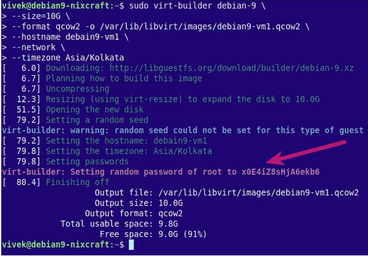  

Puis, importer une image avec la commande virt-install 

```
sudo virt-install --import --name debian9-vm1 \
--ram 2048 \
--vcpu 2 \
--disk path=/var/lib/libvirt/images/debian9-vm1.qcow2,format=qcow2 \
--os-variant debian9 \
--network=bridge=br0,model=virtio \
--noautoconsole
```

ce qui donne...

```
Starting install...
Creating domain...  
Domain creation completed.
```

Vous pouvez vous connecter à votre VM en utilisant le mot de passe x0E4iZ8sHjA6ekb6 pour le compte root  

    sudo virsh list --all
    virsh console debian9-vm1 

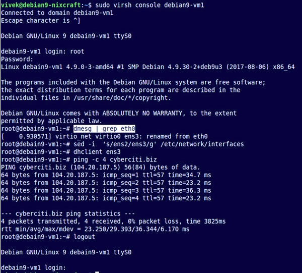  

Vous devez <u>désactiver le compte root pour la session SSH</u> et créer des clés SSH pour votre machine virtuelle . Connectez-vous comme ci-dessus:

```
sudo -s
dpkg-reconfigure openssh-server
useradd -r -m -d /home/vmuser -s /bin/bash vmuser
passwd vmuser
systemctl enable ssh
#### [ Disable root user login when using ssh ] ###
echo 'PermitRootLogin no' >> /etc/ssh/sshd_config
systemctl restart ssh
ip a s
```

Vérifiez que vous pouvez vous connecter en utilisant une adresse IP pour un utilisateur vmuser et utilisez 'su -' pour devenir un utilisateur root:

    ssh vmuser@192.168.2.132
    su -


### Commandes utiles

Trouver la liste des variantes de système d'exploitation acceptées

    osinfo-query os | less
    osinfo-query os | grep debian
    osinfo-query os | grep freebsd

Liste un vms/domaine en cours d'exécution

    sudo virsh list

Fermez un vms/domaine appelé debian9-vm1

    sudo virsh shutdown debian9-vm1

Démarrer un vms/domaine appelé debian9-vm1

    sudo virsh start debian9-vm1

Suspendre un vms/domaine appelé debian9-vm1

    sudo virsh suspend debian9-vm1

Redémarrez (redémarrage sécurisé et en douceur) un vms/domaine appelé debian9-vm1

    sudo virsh reboot debian9-vm1

Réinitialiser (réinitialisation matérielle / non sûre) un vms/domaine appelé debian9-vm1

    sudo virsh reset debian9-vm1

Supprimer un vms/domaine appelé debian9-vm1

    sudo virsh undefine debian9-vm1
    sudo virsh destroy debian9-vm1

Pour voir une liste complète du type de commande virsh

    virsh help | less
    virsh help | grep reboot

KVM Virtualisation full headless install and guest vm management

KVM Virtualisation production ready tested on :
online.net > pro-6-M dedicated

KVM Virtualisation full headless install and guest vm management

#### KVM install on ubuntu 16.04

    apt-get install qemu-kvm libvirt-bin virt-manager  virtinst bridge-utils cpu-checker libguestfs-tools libosinfo-bin

#### KVM install on ubuntu 18.04

    apt install qemu-kvm libvirt-clients libvirt-daemon-system bridge-utils virt-manager libguestfs-tools libosinfo-bin

nameserver for dedicated (if not exists)

nameserver 8.8.8.8  
nameserver 8.8.4.4

#### Forwarding network

**KVM VNC remote viewer**

https://www.realvnc.com/en/connect/download/viewer/linux/

    iptables -t nat -A PREROUTING -i eno1 -p tcp --dport 5900 -j DNAT --to 127.0.0.1:5900
    sysctl -w net.ipv4.ip_forward=1
    sysctl -p /etc/sysctl.conf

#### Forward Ports to guests with Iptables

https://aboullaite.me/kvm-qemo-forward-ports-with-iptables/

**accepting nat forwarding on nic for vm ip**  
do it for every libvirt bridge nat ip that need access incoming request from internet

    iptables -I FORWARD -o virbr0 -d  192.168.122.49 -j ACCEPT

*    onliner for all ip nat forwarding on nic for all vms
*    `virsh net-dhcp-leases default | grep 192.168 | awk '{print $5}' | cut -d \/ -f1 | while read ips; do iptables -I FORWARD -o virbr0 -d $ips -j ACCEPT; done; iptables-save | grep 192.168;`

**forward specific port to vm**

    iptables -t nat -I PREROUTING -p tcp --dport 9867 -j DNAT --to 192.168.122.36:22

**Forwaring all traffic for publich ip alias to vm**

    iptables -t nat -A  PREROUTING -d 212.83.147.148 -j DNAT --to-destination 192.168.122.49
    iptables -t nat -A POSTROUTING -s 192.168.122.49 -j SNAT --to-source 212.83.147.148

[Redirect all incoming traffic from a secondary public IP to an internal IP address using iptables — Server Fault](https://serverfault.com/questions/627608/redirect-all-incoming-traffic-from-a-secondary-public-ip-to-an-internal-ip-addre/627624)

#### VM create

```
Beispiel:
virt-install \
--virt-type=kvm \
--name debian8-11-1 \
--ram 2048 \
--vcpus=2 \
--os-type linux \
--os-variant generic \
--virt-type=kvm \
--hvm \
--cdrom=/var/lib/libvirt/boot/debian-8.11.0-amd64-netinst.iso \
--network=bridge=virbr0,model=virtio \
--graphics vnc \
--disk path=/var/lib/libvirt/images/debian-8-11-1amd64.qcow2,size=40,bus=virtio,format=qcow2
```

**vm stop delete**

    virsh destroy win10-1 && virsh undefine win10-1

**debian jessie :**

    virt-install --name debianJessie2 --ram=512 --vcpus=1 --cpu host --disk path=/var/lib/libvirt/images/debianVM2,size=8,bus=virtio,format=qcow2 --cdrom /var/lib/libvirt/boot/debian-8.11.0-amd64-netinst.iso --graphics vnc

**debian jessie with vnc custom port:**

    vmname="vm1-debian8"; virt-install --name $vmname --ram=512 --vcpus=1 --cpu host --disk path=/var/lib/libvirt/images/${vmname}.qcow2,size=8,bus=virtio,format=qcow2 --cdrom /var/lib/libvirt/isos/debian-8.11.0-amd64-netinst.iso --graphics=vnc,port=5951,password=!PASSWORD! --network=bridge=virbr0,model=virtio

**install linux without vnc on the console**

location parameter is needed for the console installation location links are image repo links from distro images

**preseed install debian**

```
OS="preesed-debian8";
virt-install --connect=qemu:///system --name=${OS} --ram=1024 --vcpus=2 --disk path=/var/lib/libvirt/images/$OS,size=8,bus=virtio,format=qcow2 --initrd-inject=preseed.cfg --location http://ftp.de.debian.org/debian/dists/jessie/main/installer-amd64 --os-type linux --os-variant debian8 --controller usb,model=none --graphics none --noautoconsole --network bridge=virbr0 --extra-args="auto=true hostname="${OS}" domain="vm1.yourserver.com" console=tty0 console=ttyS0,115200n8 serial"
```

**os variant list — os-variant**

    apt install libosinfo-bin
    osinfo-query os

**win10 install:**

    virt-install --os-type=windows --os-variant=win8.1 --name win10-9 --ram=2048 --vcpus=1 --cpu host --disk path=/var/lib/libvirt/images/win10-9,size=40,bus=virtio,format=qcow2 --disk /var/lib/libvirt/boot/win1064bit.iso,device=cdrom --disk /var/lib/libvirt/boot/virtIO-drivers.iso,device=cdrom  --graphics=vnc,port=5952,password=!PASSWORD! --check all=off

https://fedorapeople.org/groups/virt/virtio-win/direct-downloads/stable-virtio/virtio-win.iso

[KVM Guest Drivers for Windows project files : KVM Guest Drivers for Windows
](https://launchpad.net/kvm-guest-drivers-windows/+download)

#### add new nat network

*    Create a new libvirt network (other than your default 198.162.x.x) file:

    $ vim  newnetwork.xml 

```
  <network>
    <name>newnetwork-1</name>
    <uuid>d0e9964a-f91a-40c0-b769-a609aee41bf2</uuid>
    <forward mode='nat'>
      <nat>
        <port start='1' end='65535'/>
      </nat>
    </forward>
    <bridge name='virbr1' stp='on' delay='0' />
    <mac address='52:54:00:60:f8:6e'/>
    <ip address='192.168.142.1' netmask='255.255.255.0'>
      <dhcp>
        <range start='192.168.142.2' end='192.168.142.254' />
      </dhcp>
    </ip>
  </network>
```

*    Define the above network:

    $ virsh net-define newnetwork.xml

*    Start the network and enable it for “autostart”

    $ virsh net-start newnetwork-1
    $ virsh net-autostart newnetwork-1

*    List your libvirt networks to see if it reflects:

    $ virsh net-list

```
  Name                 State      Autostart     Persistent
  ----------------------------------------------------------
  default              active     yes           yes
  newnetwork-1         active     yes           yes
```

*    Optionally, list your bridge devices:

    $ brctl show

```
  bridge name     bridge id               STP enabled     interfaces
  virbr0          8000.5254003339b3       yes             virbr0-nic
  virbr1          8000.52540060f86e       yes             virbr1-nic
```

[link: create-a-new-libvirt-bridge](https://kashyapc.fedorapeople.org/virt/create-a-new-libvirt-bridge.txt)

#### network destroy

```
virsh net-list
virsh net-destroy default
virsh net-undefine default
service libvirtd restart
ifconfig
```

link ftp://libvirt.org/libvirt/virshcmdref/html/sect-net-dumpxml.html

#### get ip from guest vm

    virsh net-dhcp-leases default | grep testvm | awk '{ print $5}'

```
virsh domiflist vm5-debian

Interface  Type       Source     Model       MAC
-------------------------------------------------------
vnet1      network    default    rtl8139     52:54:00:45:87:e6
```

**get vm ip enstead of MAC list**

    arp -e192.168.122.194          ether   52:54:00:45:87:e6

**oneliner**

    vmname="vm5-debian"; arp -e | grep $(virsh domiflist $vmname| grep vnet | awk '{print $5}') | awk '{print $1}'

**or show vm ips from release pool output**

    cat /var/lib/libvirt/dnsmasq/virbr0.status

**Static ip for VM**

virsh  net-edit default

```
  ...
  <dhcp>
  <range start='192.168.122.100' end='192.168.122.254'/>
  <host mac='52:54:00:6c:3c:01' name='vm1' ip='192.168.122.11'/>
  ...
</dhcp>
```

*    reboot the VM or network from vm (ipdown eth0; ifup eth0)
*    if not works than
*    virsh net-destroy $NETWORK_NAME
*    virsh net-start $NETWORK_NAME
*    than restart vm dhcp client
*    if not works than
*    stop the libvirtd service
*    kill any dnsmasq processes that are still alive
*    start the libvirtd service
*    create accepting nat forwarding on nic for vm ips again
*    restart the vm(s)
*    `virsh net-destroy default && virsh net-undefine default && virsh net-define /etc/libvirt/networks/default.xml && virsh net-start default && virsh net-autostart default; /etc/init.d/libvirt-bin restart; COMMAND=shutdown; virsh list | grep vm | awk '{print $2}' | while read vmname; do virsh $COMMAND $vmname; sleep 3; done; watch 'virsh list'; COMMAND=start; virsh list --all | grep vm | awk '{print $2}' | while read vmname; do virsh $COMMAND $vmname; sleep 3; done; watch 'virsh list'`

**Stop & start all vms oneliner**

```
# shutdown
COMMAND=shutdown; virsh list | grep vm | awk '{print $2}' | while read vmname; do virsh $COMMAND $vmname; sleep 3; done; watch 'virsh list'

#start
COMMAND=start; virsh list --all | grep vm | awk '{print $2}' | while read vmname; do virsh $COMMAND $vmname; sleep 3; done; watch 'virsh list'
```

#### reset forgotten root password for Linux KVM qcow2 image/vm

```
apt install libguestfs-tools
virsh shutdown < vmname >
virsh dumpxml debian9-vm1 | grep 'source file'
   ...
   <source file='/var/lib/libvirt/images/debian9-vm1.qcow2'/>
   ...openssl passwd -1 newrootPasswordguestfish --rw -a /var/lib/libvirt/images/debian9-vm1.qcow2><fs>
>launch
>list-filesystems
>mount /dev/sda1 /
>vi /etc/shadow
>flush
>quit
```

**snapshot create & manage**

    virsh snapshot-create-as --domain vm-d8 --name vm-d8-snap --description "jessie base"
    virsh snapshot-list vm-d8
    virsh snapshot-revert webserver vm-d8-snap
    virsh snapshot-delete --domain vm-d8 --snapshotname vm-d8-snap

**RAM increasing**

    virsh shutdown <vm name>
    virsh setmaxmem <vm name> 16G --config
    virsh setmem <vm name> 16G --config

**CPU increasing**

```
virsh edit <vm name>
<vcpu placement='stait  virsh vcpuinfoc'>6</vcpu>
virsh vcpuinfo <vm name>
```

#### vm disk increasing /resize in two steps

1- step on the kvm

```
# show current info of vm disk
virsh domblklist <vm name> --details
qemu-img resize /var/lib/libvirt/images/VM-Name +4G
fdisk -l /var/lib/libvirt/images/VM-Name
```

2- step on the vm

```
# on the VM 
roo@vm:/ fdisk -l /dev/vdaCommand (m for help): p
Device     Boot    Start      End  Sectors Size Id Type
/dev/vda1  *        2048 33554432 33552385  16G 83 LinuxCommand (m for help): d
[1,2.5]: 1
#  delete the swap also and create it again as second primary, so start and en sector will set automaticly correctly. 
Command (m for help): d 
[1,2.5]: 2
Command (m for help): n
[primary ,extend]: p
partition number: 1
# WICHTIG: start sector take the value above showed!!
Command (m for help): t
# ext4
type: 83
Command (m for help): n
[primary ,extend]: p
partition number: 2
# start and  end sector select default 
 Command (m for help): w
roo@vm:/ resize2fs /dev/sda1 
roo@vm:/ reboot
```


# Liens

* [How to install KVM server on Debian Linux 9 Headless Server](https://www.cyberciti.biz/faq/install-kvm-server-debian-linux-9-headless-server/)  
* [La virtualisation avec KVM, libvirt et virt-manager](https://www.zenzla.com/linux/1462-la-virtualisation-avec-kvm-libvirt-et-virt-manager.html)
* [La virtualisation KVM avec libvirt](https://blog.seboss666.info/2013/11/la-virtualisation-kvm-avec-libvirt/)
* [Virtualisation matérielle libre sur Linux avec QEMU/KVM + virt-manager (graphique)](https://blog.hedilenoir.com/index.php/2018/10/21/virtualisation-materielle-libre-sur-debian-jessie/)
* [How to install Virtual Machine Manager (KVM) in Manjaro and Arch Linux](https://www.fosslinux.com/2484/how-to-install-virtual-machine-manager-kvm-in-manjaro-and-arch-linux.htm)
* [KVM,Qemu,libvirt en images](https://doc.fedora-fr.org/wiki/Virtualisation_:_KVM,_Qemu,_libvirt_en_images)  
* [Apprentissage de Qemu/LibVirt par l’exemple](https://blog.nicolargo.com/2012/02/apprentissage-de-qemulibvirt-par-lexemple.html)  
* [Virtualisation – Les types de connexion au réseau](https://www.it-connect.fr/virtualisation-les-types-de-connexion-au-reseau/)  
* [Etablir des ponts entre les connexions réseaux](https://wiki.debian.org/fr/BridgeNetworkConnections)
* [Official libvirt documentation on remote connections](https://libvirt.org/remote.html)
* [Ubuntu official virt-manager doc](https://help.ubuntu.com/community/KVM/VirtManager)
* [Specifying ‘-c’ to pass custom connection definition](https://www.michelebologna.net/2018/accessing-virt-manager-on-a-non-standard-ssh-port/)
* [Virtualisation](https://www.eslot.fr/virtualisation)
* [Réinitialiser le mot de passe root pour la machine virtuelle KVM Linux](https://www.cyberciti.biz/faq/how-to-reset-forgotten-root-password-for-linux-kvm-qcow2-image-vm/)
* [Cloner des images de machine virtuelle KVM existantes sous Linux](https://www.cyberciti.biz/faq/how-to-clone-existing-kvm-virtual-machine-images-on-linux/)
* [Réinitialiser une machine virtuelle clonée KVM avec virt-sysprep sous Linux](https://www.cyberciti.biz/faq/reset-a-kvm-clone-virtual-machines-with-virt-sysprep-on-linux/)
* [Ports de transfert KVM aux ordinateurs virtuels invités avec UFW sous Linux](https://www.cyberciti.biz/faq/kvm-forward-ports-to-guests-vm-with-ufw-on-linux/)
* [Créer une VM en utilisant le fichier image qcow2 dans KVM](https://www.cyberciti.biz/faq/create-vm-using-the-qcow2-image-file-in-kvm/) 
* [Setup Headless Virtualization Server Using KVM In Ubuntu 18.04 LTS](https://www.ostechnix.com/setup-headless-virtualization-server-using-kvm-ubuntu/)
* [Complete Installation of KVM, QEMU and Virt Manager on Arch Linux and Manjaro](https://computingforgeeks.com/complete-installation-of-kvmqemu-and-virt-manager-on-arch-linux-and-manjaro/)


