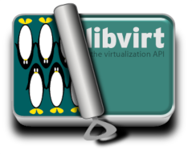
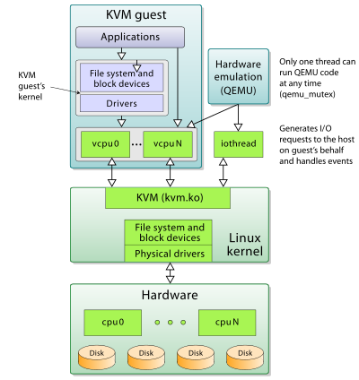
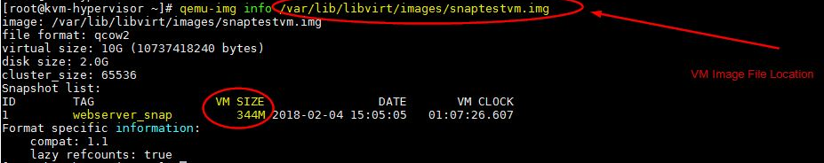

+++
title = 'KVM/QEMU Outils de virtualisation'
date = 2020-09-24 00:00:00 +0100
categories = ['virtuel']
+++
### QEMU  

[{:width="50"} QEMU](http://qemu.org/) est un émulateur et un virtualisateur de machine générique et open source. Lorsqu'il est utilisé comme émulateur, le QEMU peut exécuter des systèmes d'exploitation et des programmes conçus pour une machine (par exemple une carte ARM) sur une autre machine (par exemple votre propre PC x86_64). Lorsqu'elle est utilisée comme virtualisateur, la QEMU atteint des performances quasi natives en exécutant le code invité directement sur l'unité centrale hôte à l'aide de KVM.

### KVM  

[{:width="50"} KVM](http://www.linux-kvm.org/) (pour Kernel-based Virtual Machine) est une solution de virtualisation complète pour Linux sur du matériel contenant des extensions de virtualisation. Elle consiste en un module de noyau chargeable qui expose les API de virtualisation à l'espace utilisateur pour une utilisation par des applications telles que QEMU.


### Libvirt 

[{:width="50"} libvirt](http://libvirt.org/) est une bibliothèque et un démon fournissant une API open source stable pour la gestion des hôtes de virtualisation. Il cible plusieurs hyperviseurs, dont QEMU, KVM, LXC, Xen, OpenVZ, VMWare ESX, VirtualBox et bien d'autres.

### Libguestfs  

[{:width="50"} libguestfs](http://libguestfs.org/) est un ensemble d'outils permettant d'accéder et de modifier les images disque des machines virtuelles (VM). Vous pouvez l'utiliser pour visualiser et modifier des fichiers à l'intérieur des invités, pour scripter des modifications aux VM, pour surveiller les statistiques des disques utilisés / libres, pour créer des invités, P2V, V2V, pour effectuer des sauvegardes, cloner des VM, construire des VM, formater des disques, redimensionner des disques, et bien plus encore.

### virt-manager  

[{:width="50"} virt-manager](http://virt-manager.org/) est une interface utilisateur de bureau permettant de gérer des machines virtuelles via libvirt. Il vise principalement les VM KVM, mais gère également Xen et LXC. Il comprend également l'outil de provisionnement en ligne de commande virt-install.

### libosinfo  

[{:width="50"} libosinfo](http://libosinfo.org/) fournit une base de données d'informations sur les versions des systèmes d'exploitation afin d'aider à configurer le matériel de manière optimale lors du déploiement de machines virtuelles. Il comprend une bibliothèque C pour la recherche d'informations dans la base de données, qui est également accessible depuis n'importe quel langage supporté par GObject Introspection.

## Différences entre QEMU et KVM

>Traductation de l'article original "[What Is the Difference between QEMU and KVM? ](https://www.packetflow.co.uk/what-is-the-difference-between-qemu-and-kvm/) by [Rick Donato](https://www.packetflow.co.uk/author/rick/) on January 22, 2020"

### QEMU

<u>QEMU est un hyperviseur de type 2</u> (c'est-à-dire fonctionnant sur un système d'exploitation hôte) permettant d'effectuer une virtualisation matérielle (à ne pas confondre avec la virtualisation assistée par ordinateur), telle que disque, réseau, VGA, PCI, USB, ports série/parallèle, etc. Il est flexible en ce sens qu'il peut émuler des processeurs via une traduction binaire dynamique (DBT) permettant au code écrit pour un processeur donné d'être exécuté sur un autre (par exemple ARM sur x86, ou PPC sur ARM). Bien que la QEMU puisse fonctionner seule et émuler toutes les ressources de la machine virtuelle, comme toute l'émulation est effectuée dans un logiciel, elle est extrêmement lente.

### KVM

<u>KVM est un module du noyau Linux. C'est un hyperviseur de type 1</u> qui est une solution de virtualisation complète pour Linux sur du matériel x86 contenant des extensions de virtualisation (Intel VT ou AMD-V) (["Features/KVM - QEMU." 6 Feb. 2017](https://wiki.qemu.org/Features/KVM)).  
Mais qu'est-ce que la virtualisation complète, me direz-vous ?  
Lorsqu'une unité centrale est émulée (vCPU) par l'hyperviseur, celui-ci doit traduire les instructions destinées à la vCPU vers l'unité centrale physique. Comme vous pouvez l'imaginer, cela a un impact considérable sur les performances. Pour surmonter ce problème, les processeurs modernes prennent en charge des extensions de virtualisation, telles que Intel VT-x et AMD-V. Ces technologies permettent de faire correspondre directement une partie du processeur physique à l'unité centrale virtuelle. Ainsi, les instructions destinées à la vCPU peuvent être directement exécutées sur la tranche du CPU physique(["KVM & Qemu - saravananlinux." 20 Jul. 2015](http://saravananlinux.blogspot.com/2015/07/kvm-qemu.html)).

### Résumé

Comme mentionné précédemment, la QEMU peut fonctionner indépendamment, mais en raison de l'émulation entièrement réalisée dans le logiciel, elle est extrêmement lente. Pour surmonter ce problème, la QEMU permet d'utiliser la KVM comme accélérateur afin de pouvoir utiliser les extensions de virtualisation de l'unité centrale physique.  
Pour conclure : 

* Le QEMU est un hyperviseur de type 2 qui fonctionne dans l'espace utilisateur et effectue une émulation matérielle virtuelle
* KVM est un hyperviseur de type 1 qui fonctionne dans l'espace noyau, qui permet à un programme de l'espace utilisateur d'accéder aux fonctions de virtualisation matérielle de divers processeurs (["QEMU - Wikipedia." ](https://en.wikipedia.org/wiki/QEMU))

  
Aperçu de haut niveau de l'environnement de virtualisation KVM/QEMU (["Kernel-based Virtual Machine - Wikipedia."](https://en.wikipedia.org/wiki/Kernel-based_Virtual_Machine))

Enfin, il convient également de mentionner un peu d'histoire, qui, à mon avis, a entraîné une certaine confusion autour de la MVK/QEMU. Auparavant, KVM était une fourchette de QEMU, appelée qemu-kvm. Cependant, elle a maintenant été fusionnée avec l'UQEM en amont et la bifurcation a maintenant été supprimée. Ou en d'autres termes, comme pour Linux KVM,

>Le composant noyau de **KVM** est inclus dans le système Linux principal depuis la version 2.6.20.  
Le composant "userspace" de **KVM** est inclus dans le **QEMU** principal, à partir de la version 1.3 ([T"Linux KVM."](https://www.linux-kvm.org/page/Main_Page))


## VirtManager

### KVM - Vidéo d'installation

{:width="50"} Dans ce tutoriel vidéo, nous utiliserons un outil appelé virt-manager qui vous permet d'utiliser une interface graphique pour interagir avec une machine virtuelle basée sur le noyau (KVM) 
Habituellement, la plupart des personnes qui ont besoin d'un outil pour créer des machines virtuelles, utilisent probablement Virtual Box ou VMware. Il s'agit d'outils tiers qui fournissent leurs propres technologies de virtualisation pour une utilisation sous Linux.
Heureusement, vous n'avez pas vraiment besoin de ces outils car le noyau Linux a intégré une technologie de visualisation appelée KVM.
Dans la vidéo suivante, je vous montre comment le faire :

    • Vérifier si votre processeur a des capacités de virtualisation (99,99 %)
    • Installer Virt-Manager sur Ubuntu
    • Installer des dépendances
    • Créez un nouveau Disks pools dans votre dossier Home afin que nous puissions éviter d'utiliser la partition système (si vous avez séparé / et /home)
    • Créer une machine virtuelle, configurer la RAM et le CPU, créer un disque dur virtuel pour le système d'exploitation invité
    • Quelques options utiles (icône de la barre d'état système, mode plein écran, pause, reprise, etc.
    • Rattachement du fichier ISO à la VM pour pouvoir redémarrer à partir du support d'installation

[](https://www.youtube.com/watch?v=CmJDdOz9NbA)

Autre lien :

[](https://www.youtube.com/watch?v=Yh_3sgXtl0Q)

### migrer VM Virtual Box &rarr; Virt Manager 

Dans ce tutoriel vidéo, je vais vous montrer comment migrer vos machines Virtual Box vers le Virt Manager. 

Vous avez peut-être déjà quelques VM dans votre VirtualBox et après avoir regardé la vidéo de la première partie, vous avez peut-être commencé à considérer qu'il est temps de lancer le processus de migration vers la machine virtuelle basée sur le noyau.
Les commandes que j'utilise sont :

    VBoxManage clonehd disk.vdi disk.raw --format raw

qui convertira l'image disque des machines Virtual Box en un format de disque brut (raw)

    qemu-img convert -f raw disk.raw -O qcow2 disk.qcow2

qui convertira l'image disque brute en un format compressé qcow2. Nous faisons cela parce que le format de disque brut consomme beaucoup d'espace disque. Une fois que vous avez converti toutes les images virtuelles, vous pouvez supprimer complètement VirtualBox de votre système en toute sécurité

[](https://www.youtube.com/watch?v=6Z13VOEV6PU”)

## KVM - Instantané VM avec virsh

**Comment créer un instantané (snapshot) de machine virtuelle KVM avec la commande virsh ?**  
L'instantané de la machine virtuelle est une copie du disque de la machine virtuelle à un moment précis. En d'autres termes, on peut dire que l'instantané conserve ou préserve l'état et les données d'une machine virtuelle à un moment donné.

**Où pouvons-nous utiliser les instantanés de machines virtuelles ?**  
Si vous travaillez sur des hyperviseurs basés sur la technologie KVM, nous pouvons prendre des instantanés de machines virtuelles ou de domaines en utilisant la commande `virsh`  
L'instantané devient très utile dans une situation où vous avez installé ou appliqué les derniers correctifs sur la VM mais où, pour certaines raisons, l'application hébergée dans les VM devient instable et l'équipe chargée de l'application veut annuler tous les changements ou correctifs.  
Si vous avez pris l'instantané de la VM avant d'appliquer les correctifs, nous pouvons restaurer ou remettre la VM dans son état précédent en utilisant l'instantané.

>Note : <u>Nous pouvons seulement prendre l'instantané des VM dont le format de disque est Qcow2</u> , le format de disque brut n'est pas supporté par la commande kvm `virsh`  
Utiliser la commande ci-dessous pour convertir le format de disque brut en qcow2  
`# qemu-img convert -f raw -O qcow2 image-name.img image-name.qcow2`

### Créer une VM Instantané (Snapshot)

Je suppose que l'hyperviseur KVM est déjà configuré sur le boîtier Archlinux/Debian/CentOS 7/ RHEL 7 et que les VM fonctionnent dessus.   
Nous pouvons lister toutes les VMs de l'hyperviseur en utilisant la commande virsh ci-dessous,

    virsh list --all

```
 Id    Name                           State
----------------------------------------------------
 94    centos7.0                      running
 101   overcloud-controller           running
 102   overcloud-compute2             running
 103   overcloud-compute1             running
 114   webserver                      running
 115   Test-MTN                       running
```

Supposons que nous voulions créer un instantané de la VM "webserver", exécutez la commande ci-dessous,

Syntaxe : `virsh snapshot-create-as –domain {vm_name} –name {snapshot_name} –description  “enter description here”`

    virsh snapshot-create-as --domain webserver --name webserver_snap --description "snap before patch on 4Feb2018"

```
Domain snapshot webserver_snap created
```

Une fois que l'instantané est créé, nous pouvons lister les instantanés liés à la VM en utilisant la commande ci-dessous,

    virsh snapshot-list webserver

```
 Name                 Creation Time             State
------------------------------------------------------------
 webserver_snap       2018-02-04 15:05:05 +0530 running
```

Pour afficher les informations détaillées de l'instantané de VM, lancez la commande virsh ci-dessous,

    virsh snapshot-info --domain webserver --snapshotname webserver_snap

```
Name:           webserver_snap
Domain:         webserver
Current:        yes
State:          running
Location:       internal
Parent:         -
Children:       0
Descendants:    0
Metadata:       yes
```

Nous pouvons visualiser la taille de l'instantané en utilisant la commande qemu-img ci-dessous,

    qemu-img info /var/lib/libvirt/images/snaptestvm.img

{:width="700"}

### Restauration VM avec un instantané

Supposons que nous voulions revenir ou restaurer la VM du serveur web sur l'instantané que nous avons créé à l'étape précédente. Utilisez la commande virsh ci-dessous pour restaurer la VM du serveur web à son instantané "webserver_snap".

Syntaxe : `virsh snapshot-revert {vm_name} {snapshot_name}`

    virsh snapsh-revert webserver webserver_snap

### Supprimer les instantanés de la VM

Pour supprimer les instantanés de la machine virtuelle KVM, obtenez d'abord les détails de l'instantané de la VM en utilisant la commande "virsh snapshshot-list", puis utilisez la commande "virsh snapshshot-delete" pour supprimer l'instantané. Un exemple est présenté ci-dessous :

    virsh snapshot-list --domain webserver

```
 Name                 Creation Time             State
------------------------------------------------------------
 webserver_snap       2018-02-04 15:05:05 +0530 running
```

    virsh snapshot-delete --domain webserver --snapshotname webserver_snap

```
Domain snapshot webserver_snap deleted
```
