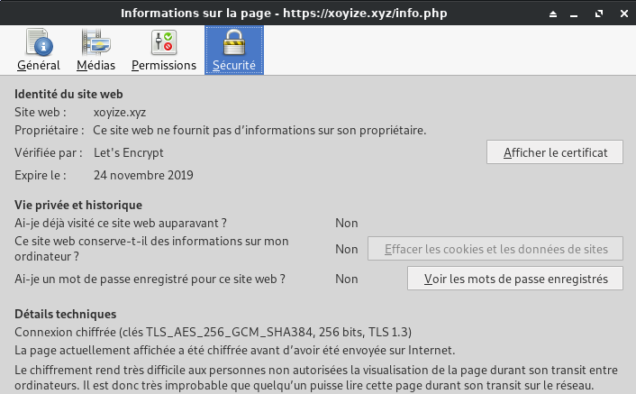

+++
title = 'Serveur Debian10'
date = 2020-09-24 00:00:00 +0100
categories = ['debian', 'serveur']
+++
## ASRock QC5000M Quad-Core APU

[ASRock QC5000M (pdf)]({{ site.url }}/files/QC5000M.pdf)


* Platform
    * Micro ATX Form Factor
    * Solid Capacitor design
    * High Density Glass Fabric PCB
* CPU
    * AMD FT3 Kabini A4-5050/5000 Quad-Core APU
* Memory
    * 2 x DDR3 DIMM Slots
    * Supports DDR3 1600/1333/1066 non-ECC, un-buffered memory
    * Max. capacity of system memory: 32GB (see CAUTION1)
* Expansion  Slot
    * 1 x PCI Express 2.0 x16 Slot (PCIE2: x4 mode)
    * 2 x PCI Express 2.0 x1 Slot
* Graphics 
    * Integrated AMD RadeonTM HD 8330 Graphics  
    * DirectX 11.1, Pixel Shader 5.0
    * Max. shared memory 2GB
    * Dual graphics output: support D-Sub and HDMI ports by independent display controllers (see CAUTION2)
    * Supports HDMI with max. resolution up to 4K × 2K (4096x2160) @ 24Hz or 4K × 2K (3840x2160) @ 30Hz
    * Supports D-Sub with max. resolution up to 2048x1536 @ 60Hz
    * Supports Auto Lip Sync, Deep Color (12bpc), xvYCC and HBR (High Bit Rate Audio) with HDMI Port (Compliant HDMI monitor is required)
    * Supports HDCP with HDMI Port
    * Supports Full HD 1080p Blu-ray (BD) playback with HDMI Port 
* Audio
    * 7.1 CH HD Audio (Realtek ALC887 Audio Codec)  * To configure 7.1 CH HD Audio, it is required to use an HD front panel audio module and enable the multi-channel audio feature through the audio driver.
    * Supports Surge Protection (ASRock Full Spike Protection)
    * ELNA Audio Caps
* LAN
    * PCIE x1 Gigabit LAN 10/100/1000 Mb/s
    * Rea ltek RTL 8111GR
    * S u p p o r t s   Wa k e - O n -WA N
    * Suppor t s Wa ke- On-L A N
    * Supports Lightning/ESD Protection (ASRock Full Spike Protection)
    * Supports LAN Cable Detection
    * Supports Energy Efficient Ethernet 802.3az
    * Supports PXE
* Rear Panel I/O  
    * 1 x PS/2 Mouse/Keyboard Port
    * 1 x Serial Port: COM1
    * 1 x D-Sub Port
    * 1 x HDMI Port
    * 4 x USB 2.0 Ports (Supports ESD Protection (ASRock Full Spike Protection))
    * 2 x USB 3.0 Ports (Supports ESD Protection (ASRock Full Spike Protection))
    * 1 x RJ-45 LAN Port with LED (ACT/LINK LED and SPEED LED)
    * HD Audio Jacks: Line in / Front Speaker / Microphone
* Storage
    * 2 x SATA3 6.0 Gb/s Connectors, support NCQ, AHCI and Hot Plug
* Connector
    * 1 x TPM Header
    * 1 x CPU Fan Connector (3-pin)
    * 2 x Chassis Fan Connectors (1 x 4-pin, 1 x 3-pin)
    * 1 x 24 pin ATX Power Connector
    * 1 x Front Panel Audio Connector 
    * 2 x USB 2.0 Headers (Support 4 USB 2.0 ports) (Supports ESD Protection (ASRock Full Spike Protection))
* BIOS Feature
    * 32Mb AMI UEFI Legal BIOS with multilingual GUI support
    * Supports “Plug and Play”
    * ACPI 1.1 compliance wake up events
    * SMBIOS 2.3.1 support
    * DRAM Voltage multi-adjustment
* HardwareMonitor  
    * CPU/Chassis temperature sensing
    * CPU/Chassis Fan Tachometer
    * CPU/Chassis Quiet Fan
    * CPU/Chassis Fan multi-speed control
    * Voltage monitoring: +12V, +5V, +3.3V, Vcore
* OS
    * Microsoft® Windows® 10 64-bit / 8.1 32-bit / 8.1 64-bit / 8 32-bit / 8 64-bit / 7 32-bit / 7 64-bit / XP 32-bit / XP 64-bit* 
    * USB 3.0 is not supported by Windows® XP* For the updated Windows® 10 driver, please visit ASRock's    website for details: http://www.asrock.com
* Certifica-tions
    * FCC, CE, WHQL
    * ErP/EuP ready (ErP/EuP ready power supply is required)

## Boot sur USB "partedmagic"

{:width="200"}

### Partitionnement du disque


* 2MB, type EF02 (BIOS partition). Utilisé par GRUB2/BIOS-GPT. (/dev/sda1)
* 512MB, type 8300 (Linux). Pour le boot linux /boot (/dev/sda2)
* 4GB, type 8200 (swap). Partition swap (en dehors de lvm). (/dev/sda3)
* Espace restant, type 8E00 (LVM). Pour le root / + /home et autres. (/dev/sda4).

Partitionnement du reste du disque SSD 120G GPT + LVM

    gdisk /dev/sda

On passe en mode expert : x  
On efface tout : z  
On relance gdisk  

    gdisk /dev/sda

```
GPT fdisk (gdisk) version 0.8.6
 
Partition table scan:
  MBR: not present
  BSD: not present
  APM: not present
  GPT: not present
 
Creating new GPT entries.
 
Command (? for help): o
This option deletes all partitions and creates a new protective MBR.
Proceed? (Y/N): y

Command (? for help): n
Partition number (1-128, default 1): 
First sector (34-937703054, default = 2048) or {+-}size{KMGTP}: 
Last sector (2048-937703054, default = 937703054) or {+-}size{KMGTP}: +2M
Current type is 8300 (Linux filesystem)
Hex code or GUID (L to show codes, Enter = 8300): ef02
Changed type of partition to 'BIOS boot partition'

Command (? for help): n
Partition number (2-128, default 2): 
First sector (34-937703054, default = 6144) or {+-}size{KMGTP}: 
Last sector (6144-937703054, default = 937703054) or {+-}size{KMGTP}: +512M
Current type is 8300 (Linux filesystem)
Hex code or GUID (L to show codes, Enter = 8300): 
Changed type of partition to 'Linux filesystem'

Command (? for help): n
Partition number (3-128, default 3): 
First sector (34-937703054, default = 1054720) or {+-}size{KMGTP}: 
Last sector (1054720-937703054, default = 937703054) or {+-}size{KMGTP}: +4G
Current type is 8300 (Linux filesystem)
Hex code or GUID (L to show codes, Enter = 8300): 8200
Changed type of partition to 'Linux swap'

Command (? for help): n
Partition number (4-128, default 4): 
First sector (34-937703054, default = 9443328) or {+-}size{KMGTP}: 
Last sector (9443328-937703054, default = 937703054) or {+-}size{KMGTP}: 
Current type is 8300 (Linux filesystem)
Hex code or GUID (L to show codes, Enter = 8300): 8e00
Changed type of partition to 'Linux LVM'
 
Command (? for help): w

Final checks complete. About to write GPT data. THIS WILL OVERWRITE EXISTING
PARTITIONS!!
 
Do you want to proceed? (Y/N): y
OK; writing new GUID partition table (GPT) to /dev/sda.
The operation has completed successfully.
```

CT480M

### Installation debian 10

* Installation effectuée à partir d'une clé USB bootable , fichier debian+firmware ISO : **firmware-10.4.0-amd64-netinst.iso**
* Choix "partitionnement manuel" 

{:width="100"}

* Serveur virtuel 64 bits VirtualBox : **Debian Buster** 
* machine : **srvct** 
* domaine :   
* root : **ytreu49** 
* Utilisateur : **ctuser** 
* Mot de passe : **ctuser49** 
* Adresse IP : **192.168.0.45**
* Accès 
    * SSH : **ssh bust@192.168.0.45**
    * <s>SSH + clé : **ssh -i ~/.ssh/vbox-vmbust-ed25519 bust@192.168.0.49**  (facultatif)</s>
    * <s>Transfert de fichier : **scp -P 55022 -i ~/.ssh/vbox-vmbust-ed25519 fichiera fichierb bust@192.168.0.49:/home/bust** (facultatif)</s>  

Partitionnement  

Partition | Taille | _ | Type | Commentaire| _ 
----------|--------|---|------|------------|--
n°1 |2.1 MB|K|biosgrub Bios|BIOS boot partition|  
n°2 |536.9 MB| |ext2|Linux filesys| /boot 
n°3 |4.3 GB| F|swap |Linux swap | swap 

Créer un volume de groupe vg-ct480 sur /dev/sda4  
Créer un volume logique lv-root de 35Go  
Créer la partition "root" avec le volume logique "lv-root"


Sélection des logiciels

* serveur SSH
* utilitaires usuels du système

Oter la clé après installation

### Connexion SSH

	ssh ctuser@192.168.0.45

Passer en root

	su 

Mise à jour

    apt update && apt upgrade -y

Installer les outils et sudo  

    apt install rsync curl tmux jq figlet tree git -y

Installer sudo

	apt install sudo

Visudo pour les accès root via utilisateur bust

	echo "ctuser     ALL=(ALL) NOPASSWD: ALL" >> /etc/sudoers

### Historique de la ligne de commande

Ajoutez la recherche d’historique de la ligne de commande au terminal.
Tapez un début de commande précédent, puis utilisez shift + up (flèche haut) pour rechercher l’historique filtré avec le début de la commande.

```
# Global, tout utilisateur
echo '"\e[1;2A": history-search-backward' | sudo tee -a /etc/inputrc
echo '"\e[1;2B": history-search-forward' | sudo tee -a /etc/inputrc
```

### OpenSSH, clé et script

{:width="100"}

**connexion avec clé**  
<u>sur l'ordinateur de bureau</u>
Générer une paire de clé curve25519-sha256 (ECDH avec Curve25519 et SHA2) nommé **srvct-ed25519** pour une liaison SSH avec le serveur KVM.  

    ssh-keygen -t ed25519 -o -a 100 -f ~/.ssh/srvct-ed25519

Envoyer la clé publique sur le serveur KVM   

    scp ~/.ssh/srvct-ed25519.pub ctuser@192.168.0.45:/home/ctuser/

<u>sur le serveur KVM</u>
On se connecte  

    ssh ctuser@192.168.0.45

Copier le contenu de la clé publique dans /home/$USER/.ssh/authorized_keys  

    cd ~

Sur le KVM ,créer un dossier .ssh  

```bash
mkdir .ssh
cat $HOME/srvct-ed25519.pub >> $HOME/.ssh/authorized_keys
```

et donner les droits  

    chmod 600 $HOME/.ssh/authorized_keys

effacer le fichier de la clé  

    rm $HOME/srvct-ed25519.pub

Modifier la configuration serveur SSH  

Port = 55035               # changement numéro port , facultatif  
PasswordAuthentication no  # Utilise la clé comme authentification
 

Exécuter les commande ci-dessous

```
sudo sed -i 's/#Port 22/Port 55035/g' /etc/ssh/sshd_config
sudo sed -i 's/#PasswordAuthentication yes/PasswordAuthentication no/g' /etc/ssh/sshd_config
```

Modifier


<u>session SSH ne se termine pas correctement lors d'un "reboot" à distance</u>  
Si vous tentez de **redémarrer/éteindre** une machine distance par **ssh**, vous pourriez constater que votre session ne se termine pas correctement, vous laissant avec un terminal inactif jusqu'à l'expiration d'un long délai d'inactivité. Il existe un bogue 751636 à ce sujet. Pour l'instant, la solution de contournement à ce problème est d'installer :  

    sudo apt-get install libpam-systemd  # Installé par défaut sur debian buster

cela terminera la session ssh avant que le réseau ne tombe.  
Veuillez noter qu'il est nécessaire que PAM soit activé dans sshd.  

Relancer openSSH  

    sudo systemctl restart sshd

Accès depuis le poste distant avec la clé privée  

    ssh -p 55035 -i ~/.ssh/srvct-ed25519 ctuser@192.168.0.45

### Hostname

Vérifier le nom 

    hostnamectl

```
   Static hostname: srvct
         Icon name: computer-desktop
           Chassis: desktop
        Machine ID: b65c705c91e04653ad975d9c29f50ed0
           Boot ID: 10aa2c2367a845a3acddb3d72ab7df3f
  Operating System: Debian GNU/Linux 10 (buster)
            Kernel: Linux 4.19.0-10-amd64
      Architecture: x86-64
```

### Journalctl

Ajout utilisateur courant au groupe systemd-journal et adm

	sudo gpasswd -a $USER systemd-journal
	sudo gpasswd -a $USER adm

Lignes non tronquées ,ajouter au fichier **~/.bashrc**  

    echo "export SYSTEMD_LESS=FRXMK journalctl" >> /home/$USER/.bashrc

Prise en compte après déconnexion/reconnexion

---

Logo ascii

	sudo nano /etc/motd

```
                                               
  ___ _ _ __ ____ __ ___                       
 (_-<| '_|\ V /\ \ // _ \                      
 /__/|_|   \_/ /_\_\\___/                      
 __ __ ___  _  _ (_) ___ ___    __ __ _  _  ___
 \ \ // _ \| || || ||_ // -_) _ \ \ /| || ||_ /
 /_\_\\___/ \_, ||_|/__|\___|(_)/_\_\ \_, |/__|
            |__/                      |__/     
```            

## NFS serveur

  
*NFS (pour Network File System, système de fichiers en réseau) est un protocole qui permet à un ordinateur d'accéder à des fichiers via un réseau.*

### Installation NFS

{:width="60"} 

on passe en mode su  

	sudo -s

Installation  

	apt install nfs-kernel-server

Vérification serveur  

	rpcinfo -p | grep nfs

```
    100003    3   tcp   2049  nfs
    100003    4   tcp   2049  nfs
    100003    3   udp   2049  nfs
```

Vérifier que le système supporte effectivement NFS  

	cat /proc/filesystems | grep nfs

```
nodev	nfsd
```

Si la commande précédente ne renvoie rien, il se peut que le module NFS ne soit pas chargé, auquel cas, il faut le charger `modprobe nfs`  
Enfin, vérifions que portmap attend les instructions sur le port 111  

	rpcinfo -p | grep portmap

```
    100000    4   tcp    111  portmapper
    100000    3   tcp    111  portmapper
    100000    2   tcp    111  portmapper
    100000    4   udp    111  portmapper
    100000    3   udp    111  portmapper
    100000    2   udp    111  portmapper
```

### Configuration du partage

Passage en su  

	sudo -s

indiquer au serveur les répertoires qui seront partagés, les machines qui y auront accès et les conditions de ce partage.  

	nano /etc/exports

Ajouter en fin de fichier **/etc/exports**  

```
/srv/data	192.168.0.0/24(rw,sync,no_subtree_check,no_root_squash)
/srv/nfs	192.168.0.0/24(rw,sync,no_subtree_check,no_root_squash)
```

Exporter

    exportfs -ar


### Sécurisation NFS

Passage en su  

	sudo -s

Le protocole RPC n'a pas la réputation d'être bien sécurisé, mais la version 4 de NFS entend corriger ce problème, elle est donc à privilégier. Il est déconseillé d'effectuer un partage NFS via internet, ou bien dans ce cas, opter pour un tunnel crypté.

* S'assurer que les partages sont réservés à certaines IP dans /etc/exports
* S'appuyer sur rpcbind (/etc/hosts.deny et /etc/hosts.allow) pour sécuriser l'accès au serveur NFS
* Configurer convenablement iptables

**hosts.deny , hosts.allow**  
Tout le monde est interdit, puis le LAN est autorisé:  

```
echo "rpcbind mountd nfsd statd lockd rquotad : ALL" >> /etc/hosts.deny
echo "rpcbind mountd nfsd statd lockd rquotad: 192.168.0." >> /etc/hosts.allow
```

**iptables (NFS)**  
Par défaut, les différents services NFS (lockd, statd, mountd, etc.) demandent des assignations de ports aléatoires à partir du portmapper (portmap/rpcbind), ce qui signifie que la plupart des administrateurs doivent ouvrir une gamme de ports dans leur base de règles de pare-feu pour que NFS fonctionne.  

Il va donc falloir fixer les ports de ces services afin de créer les règles iptables.  

```
echo 'STATDOPTS="--port 32765 --outgoing-port 32766"' >> /etc/default/nfs-common
echo 'RPCMOUNTDOPTS="-p 32767"' >> /etc/default/nfs-kernel-server
echo 'RPCRQUOTADOPTS="-p 32769"' >> /etc/default/quota
```

Relance sysctl  

	sysctl --system

```
* Applying /etc/sysctl.d/99-sysctl.conf ...
* Applying /etc/sysctl.d/protect-links.conf ...
fs.protected_hardlinks = 1
fs.protected_symlinks = 1
* Applying /etc/sysctl.conf ...
```

Relancer le service  

	systemctl restart nfs-kernel-server

Voici les règles à fixer dans le parefeu

```
iptables -A INPUT -s 192.168.0.0/24 -p tcp -m multiport --ports 111,2049,32764:32769 -j ACCEPT -m comment --comment "NFS Server"
iptables -A INPUT -s 192.168.0.0/24 -p udp -m multiport --ports 111,2049,32764:32769 -j ACCEPT -m comment --comment "NFS Server"
```

### Configurer le partage NFS avec SetGID

Maintenant que le serveur NFS est configuré avec le point de montage NFS de base /srv/nfs, nous devons configurer SetGID dans ce répertoire, comme indiqué ci-dessous.

    sudo chmod 2770 /srv/nfs

Cela a également défini les autorisations 770 sur le répertoire, de sorte que l'utilisateur racine et le groupe défini disposent d'autorisations complètes. Le 2 permet setgid.

Ensuite, nous créons un groupe appelé 'partage' et modifions le répertoire /srv/nfs afin que le propriétaire du groupe soit ce groupe 'partage'.  
Nous spécifions également manuellement le GID qui sera utilisé pour le groupe en tant que 9999; il doit s'agir d'un <u>numéro libre sur votre client et votre serveur</u>.

Exécuter `groupadd` sur le client et sur le serveur, et ajouter un utilisateur à ce groupe.

    sudo groupadd -g 9999 partage      # sur client et serveur
    sudo usermod -a -G partage $USER   # sur client et serveur
    sudo chgrp partage /srv/nfs        # serveur uniquement

>NE PAS OUBLIER DE SE DECONNECTER/CONNECTER

Nous pouvons confirmer que setgid est en place, comme indiqué ci-dessous, où le bit d'exécution pour les autorisations de groupe est une minuscule. Cela passera à une majuscule S si le groupe ne dispose pas de l'autorisation d'exécution et que seul setgid est en place.

    ls -la /srv/nfs/

drwxrws--- 5 root partage      4096 mars  16 07:57 .

Désormais, tous les fichiers ou répertoires créés dans /srv/nfs se verront automatiquement attribuer le propriétaire du groupe 'partage', ce qui permettra essentiellement la collaboration de groupe, car tout utilisateur appartenant au groupe 'partage' pourra désormais accéder aux fichiers créés par d'autres utilisateurs du groupe. même groupe dans le répertoire /srv/nfs.

## Samba client

Configuration du client SAMBA

Cela devrait fonctionner sans problème si vous installez **cifs-utils**

    sudo apt install cifs-utils smbclient

Utilsation

    smbclient -L <nom-de-l'ordinateur> (nécessite le paquet smbclient)

## Parefeu (iptables)

{:width=100"}  

### /sbin/iptables-firewall.sh

On utilise un service systemd  
Créer le fichier le script **/sbin/iptables-firewall.sh**

    sudo nano /sbin/iptables-firewall.sh

```
#!/bin/bash
# Configure iptables firewall

# Limit PATH
PATH="/sbin:/usr/sbin:/bin:/usr/bin"

# iptables configuration
firewall_start() {
###################
#      IPv4       #
###################

# refuser input et forward par défaut, accepter output
iptables -t filter -P INPUT DROP
iptables -t filter -P FORWARD DROP
iptables -t filter -P OUTPUT ACCEPT

# interface lo (loop) accessible
iptables -A INPUT -i lo -j ACCEPT
iptables -A OUTPUT -o lo -j ACCEPT

# maintenir les connexions établies
iptables -A INPUT -m state --state RELATED,ESTABLISHED -j ACCEPT
iptables -A OUTPUT -m state --state RELATED,ESTABLISHED -j ACCEPT

# accepter en entrée le ping (icmp), et les
# connexions sur les ports nécessaires.
iptables -A INPUT -p icmp --icmp-type echo-request -m conntrack --ctstate NEW -m limit --limit 1/s --limit-burst 1 -j ACCEPT
iptables -A INPUT -p tcp --dport 80 -j ACCEPT
iptables -A INPUT -p tcp --dport 443 -j ACCEPT
iptables -A INPUT -p tcp --dport 55035 -j ACCEPT

# NFSV4
iptables -A INPUT -s 192.168.0.0/24 -p tcp -m multiport --ports 111,2049,32764:32769 -j ACCEPT -m comment --comment "NFS Server"
iptables -A INPUT -s 192.168.0.0/24 -p udp -m multiport --ports 111,2049,32764:32769 -j ACCEPT -m comment --comment "NFS Server"

# accepter en sortie le ping, les requêtes HTTP(S), DNS,
# et les connexions sur les ports nécessaires.
iptables -A OUTPUT -p icmp --icmp-type echo-request -m conntrack --ctstate NEW -j ACCEPT
iptables -A OUTPUT -p tcp --dport 80 -j ACCEPT
iptables -A OUTPUT -p tcp --dport 443 -j ACCEPT
iptables -A OUTPUT -p udp --dport 53 -j ACCEPT
iptables -A OUTPUT -p tcp --dport 53 -j ACCEPT


###################
#      IPv6       #
###################

# refuser input et forward par défaut, accepter output
ip6tables -t filter -P INPUT DROP
ip6tables -t filter -P FORWARD DROP
ip6tables -t filter -P OUTPUT ACCEPT

# interface lo (loop) accessible
ip6tables -A INPUT -i lo -j ACCEPT
ip6tables -A OUTPUT -o lo -j ACCEPT

# maintenir les connexions établies
ip6tables -A INPUT -m state --state RELATED,ESTABLISHED -j ACCEPT
ip6tables -A OUTPUT -m state --state RELATED,ESTABLISHED -j ACCEPT

# NDP pour toute interface de type broadcast
ip6tables -A INPUT -p icmpv6 --icmpv6-type neighbour-solicitation -m hl --hl-eq 255 -j ACCEPT
ip6tables -A INPUT -p icmpv6 --icmpv6-type neighbour-advertisement -m hl --hl-eq 255 -j ACCEPT
ip6tables -A INPUT -p icmpv6 --icmpv6-type router-advertisement -m hl --hl-eq 255 -j ACCEPT

ip6tables -A OUTPUT -p icmpv6 --icmpv6-type neighbour-solicitation -j ACCEPT
ip6tables -A OUTPUT -p icmpv6 --icmpv6-type neighbour-advertisement -j ACCEPT
ip6tables -A OUTPUT -p icmpv6 --icmpv6-type router-solicitation -j ACCEPT

# accepter en entrée le ping (icmpv6), les
# connexions entrantes déjà établies et les connexions sur les ports nécessaires.
ip6tables -A INPUT -p icmpv6 --icmpv6-type echo-request -m conntrack --ctstate NEW -m limit --limit 1/s --limit-burst 1 -j ACCEPT
ip6tables -A INPUT -p tcp --dport 80 -j ACCEPT
ip6tables -A INPUT -p tcp --dport 443 -j ACCEPT
ip6tables -A INPUT -p tcp --dport 55035 -j ACCEPT
ip6tables -A INPUT -p udp --dport 55035 -j ACCEPT

# accepter en sortie le ping, les requêtes HTTP(S), DNS,
# et les connexions sur les ports nécessaires.
ip6tables -t filter -A OUTPUT -p icmpv6 --icmpv6-type echo-request -j ACCEPT
ip6tables -A OUTPUT -p tcp --dport 80 -j ACCEPT
ip6tables -A OUTPUT -p tcp --dport 443 -j ACCEPT
ip6tables -A OUTPUT -p udp --dport 53 -j ACCEPT
ip6tables -A OUTPUT -p tcp --dport 53 -j ACCEPT
}

# clear iptables configuration
firewall_stop() {
  iptables -F
  iptables -X
  iptables -P INPUT   ACCEPT
  iptables -P FORWARD ACCEPT
  iptables -P OUTPUT  ACCEPT
  ip6tables -F
  ip6tables -X
  ip6tables -P INPUT   ACCEPT
  ip6tables -P FORWARD ACCEPT
  ip6tables -P OUTPUT  ACCEPT
}

# execute action
case "$1" in
  start|restart)
    echo "Starting firewall"
    firewall_stop
    firewall_start
    ;;
  stop)
    echo "Stopping firewall"
    firewall_stop
    ;;
esac
```

Les droits et exécutable

    sudo chown root:root /sbin/iptables-firewall.sh
    sudo chmod 750 /sbin/iptables-firewall.sh 

### systemd - iptables-firewall.service

Créer le service systemd **iptables-firewall.service**

```
cat << EOF | sudo tee /etc/systemd/system/iptables-firewall.service
[Unit]
Description=iptables firewall service
After=network.target

[Service]
Type=oneshot
ExecStart=/sbin/iptables-firewall.sh start
RemainAfterExit=true
ExecStop=/sbin/iptables-firewall.sh stop
StandardOutput=journal

[Install]
WantedBy=multi-user.target
EOF
```

Recharger systemd manager

    sudo systemctl daemon-reload

Lancer le service iptables et l'activer

    sudo systemctl start iptables-firewall
    sudo systemctl enable iptables-firewall


## Sauvegardes et synchronisation

### BorgBackup

{:width=100"}

#### Machine qui stocke les sauvegardes &rarr; xoyize.xyz - 192.168.0.45 

**<u>Installation BorgBackup et ajout clé publique sur le serveur de sauvegarde xoyize.xyz</u>**  
On se connecte sur la machine et on passe en mode su  

    sudo -s

Installer borgbackup

    apt install borgbackup

Créer un utilisateur borg dédié aux sauvegardes par BorgBackup :

    useradd borg --create-home --home-dir /srv/data/borg-backups/

Vérifier le propriétaire des  dossiers "borg" , sinon modifier 

    chown borg.borg -R  /srv/data/borg-backups/

Cet utilisateur n'a pas de mot de passe, nous nous y connecterons uniquement avec une clef SSH ,ajout de la clé publique

    mkdir -p /srv/data/borg-backups/.ssh
    cat >> /srv/data/borg-backups/.ssh/authorized_keys

Copier/coller le contenu du fichier du fichier de clef publique (fichier /root/.ssh/yanspm_ed25519.pub de la machine à sauvegarder ) dans ce terminal, et presser [Ctrl]+[D] pour valider.

Autoriser utilisateur **borg** à exécuter */usr/bin/borg* uniquement

    echo "borg ALL=NOPASSWD: /usr/bin/borg" >> /etc/sudoers

#### Machines autorisés à effectuer leur backup

Le dossier de base pour les sauvegardes sur le serveur xoyize.xyz : **/srv/data/borg-backups/**   
Pour info les machines autorisés à effectuer leur backup sur cette machine :  
yannick-pc e6230

### Rsync 

{:width=100"}

Type |Source | Destination | Commentaire
--- | --- | --- | ---
rsync|`usernl@xoyaz.xyz:/srv/data/borg-backups/*` |`/srv/data/borg-backups/` (xoyize.xyz)|(rsync over ssh)
rsync|`/srv/data/music/* `(xoyize.xyz) |`usernl@xoyaz.xyz:/home/usernl/backup/musique/` |(rsync over ssh)
rsync|`/srv/data/CalibreTechnique/*` (xoyize.xyz) |`usernl@xoyaz.xyz:/home/usernl/backup/CalibreTechnique/` |(rsync over ssh)

#### Synchronisation dossier de sauvegarde borg entre 'xoyaz.xyz' et 'xoyize.xyz'

*Pour les serveurs yanspm.com yanfi.net et cinay.xyz ,les sauvegardes sont effectuées en utilisant le logiciel borg ,vers le serveur de backup xoyaz.xyz et on utilise rsync pour les transférer localement*

**connexion avec clé**  
<u>sur le serveur appelant srvxo (xoyize.xyz - 192.168.0.45)</u>
Générer une paire de clé curve25519-sha256 (ECDH avec Curve25519 et SHA2) nommé **xoyaz_ed25519** pour une liaison SSH avec le serveur KVM.  

    ssh-keygen -t ed25519 -o -a 100 -f ~/.ssh/xoyaz_ed25519

Ajouter la clé publique au fichier **~/.ssh/authorized_keys** du serveur de backup xoyaz.xyz    

Test connexion

    ssh -p 55036 -i /home/xoyi/.ssh/xoyaz_ed25519 -o StrictHostKeyChecking=no -o UserKnownHostsFile=/dev/null usernl@xoyaz.xyz

Créer la commande rsync avec son fichier d'exclusion

	nano .ssh/exclude-list.txt

```
.bash_logout
.bashrc
.profile
.ssh
```

Lancer la commande rsync dans une fenêtre terminal tmux en mode su

	tmux
	sudo -s
	rsync -avz --progress --stats --human-readable --exclude-from '/home/xoyi/.ssh/exclude-list.txt' --rsync-path="sudo rsync" -e "ssh -p 55036 -i /home/xoyi/.ssh/xoyaz_ed25519 -o StrictHostKeyChecking=no -o UserKnownHostsFile=/dev/null"  usernl@xoyaz.xyz:/srv/data/borg-backups/* /srv/data/borg-backups/

Paramétrer pour une exécution chaque jour à 2h30

    sudo crontab -e

```
# Synchro Backup entre serveur distant xoyaz.xyz (contient les backup des serveurs VPS) et le serveur local xoyize.xyz 
30 02 * * * rsync -avz --progress --stats --delete --human-readable --exclude-from '/home/xoyi/.ssh/exclude-list.txt' --rsync-path="sudo rsync" -e "ssh -p 55036 -i /home/xoyi/.ssh/xoyaz_ed25519 -o StrictHostKeyChecking=no -o UserKnownHostsFile=/dev/null"  usernl@xoyaz.xyz:/srv/data/borg-backups/* /srv/data/borg-backups/ ; if [ $? -eq 0 ]; then echo "Rsync usernl@xoyaz.xyz:/srv/data/borg-backups/* /srv/data/borg-backups/ : Synchronisation OK" | systemd-cat -t rsync-cron -p info ; else echo "Rsync usernl@xoyaz.xyz:/srv/data/borg-backups/* /srv/data/borg-backups/ : Synchronisation ERREUR" | systemd-cat -t rsync-cron -p emerg ; fi

```

**Explications sur la commande**  
On redirige le résultat de la commande ($?) vers le journal avec **systemd-cat**   
`if [ $? -eq 0 ]; then echo "Rsync usernl@xoyaz.xyz:/srv/data/borg-backups/* /srv/data/borg-backups/ : Synchronisation OK" | systemd-cat -t rsync-cron -p info ; else echo "Rsync usernl@xoyaz.xyz:/srv/data/borg-backups/* /srv/data/borg-backups/ : Synchronisation ERREUR" | systemd-cat -t rsync-cron -p emerg ; fi`  

la ligne de commande décortiquée:

```
if [ $? -eq 0 ]
 then
  echo "Rsync usernl@xoyaz.xyz:/srv/data/borg-backups/* /srv/data/borg-backups/ : Synchronisation OK" | systemd-cat -t rsync-cron -p info
 else
  echo "Rsync usernl@xoyaz.xyz:/srv/data/borg-backups/* /srv/data/borg-backups/ :Erreur Synchronisation" | systemd-cat -t rsync-cron -p emerg
fi
```
 
On peut lire le journal avec l'identifiant *rsync-cron* 

    journalctl -t rsync-cron

```
-- Logs begin at Thu 2019-08-29 11:07:55 CEST, end at Tue 2019-09-17 17:50:32 CEST. --
sept. 17 17:50:32 srvxo rsync-cron[11728]: Rsync usernl@xoyaz.xyz:/srv/data/borg-backups/* /srv/data/borg-backups/ : Synchronisation OK
```

#### Synchronisation dossiers music Calibre entre 'xoyize.xyz' et 'xoyaz.xyz'

Ajouter  au lanceur de tâches programmées

    sudo crontab -e

```
# Sauvegarde de dossiers /srv/data/{music,CalibreTechnique} sur serveur distant backup (nl) xoyaz.xyz
# Synchro music avec Backup
00 02 * * * rsync -avz --progress --stats --human-readable --delete --exclude-from '/home/xoyi/.ssh/exclude-list.txt' --rsync-path="sudo rsync" -e "ssh -p 55036 -i /home/xoyi/.ssh/xoyaz_ed25519 -o StrictHostKeyChecking=no -o UserKnownHostsFile=/dev/null"  /srv/data/music/* usernl@xoyaz.xyz:/home/usernl/backup/musique/ ; if [ $? -eq 0 ]; then echo "Rsync /srv/data/music/* usernl@xoyaz.xyz:/home/usernl/backup/musique/ : Synchronisation OK" | systemd-cat -t rsync-cron -p info ; else echo "Rsync /srv/data/music/* usernl@xoyaz.xyz:/home/usernl/backup/musique/ : Synchronisation ERREUR" | systemd-cat -t rsync-cron -p emerg ; fi

# Synchro CalibreTechnique avec Backup
10 02 * * * rsync -avz --progress --stats --human-readable --exclude-from '/home/xoyi/.ssh/exclude-list.txt' --rsync-path="sudo rsync" -e "ssh -p 55036 -i /home/xoyi/.ssh/xoyaz_ed25519 -o StrictHostKeyChecking=no -o UserKnownHostsFile=/dev/null"  /srv/data/CalibreTechnique/* usernl@xoyaz.xyz:/home/usernl/backup/CalibreTechnique/ ; if [ $? -eq 0 ]; then echo "Rsync /srv/data/CalibreTechnique/* usernl@xoyaz.xyz:/home/usernl/backup/CalibreTechnique/ : Synchronisation OK" | systemd-cat -t rsync-cron -p info ; else echo "Rsync /srv/data/CalibreTechnique/* usernl@xoyaz.xyz:/home/usernl/backup/CalibreTechnique/ : Synchronisation ERREUR" | systemd-cat -t rsync-cron -p emerg ; fi

```

#### Synchronisation dossier osm-new avec map.cinay.xyz

Tâche programmée

    sudo crontab -e

```
10 02 * * * rsync -avz --progress --stats --human-readable --rsync-path="sudo rsync" -e "ssh -p 55031 -i /home/xoyi/.ssh/kvm-vps591606 -o StrictHostKeyChecking=no -o UserKnownHostsFile=/dev/null"  /srv/data/devel/ouestline/osm-new/* debadm@cinay.xyz:/srv/osm-new/ ; if [ $? -eq 0 ]; then echo "Rsync /srv/data/devel/ouestline/osm-new/* debadm@cinay.xyz:/srv/osm-new/ : Synchronisation OK" | systemd-cat -t rsync-osm -p info ; else echo "Rsync /srv/data/devel/ouestline/osm-new/* debadm@cinay.xyz:/srv/osm-new/ : Synchronisation ERREUR" | systemd-cat -t rsync-osm -p emerg ; fi
```

## Unbound - DNS

{:width=100"}

*Unbound est un résolveur DNS validateur, cache, récursif développé par NLnet Labs, VeriSign Inc., Nominet, et Kirei. Le logiciel est distribué sous licence BSD.*

### Installer et configurer Unbound

* [Résolveur DNS Unbound](/posts/unbound-resolveur-DNS/)

Installer resolvconf

    sudo -s
    apt install resolvconf -y
    echo "nameserver 127.0.0.1" >> /etc/resolvconf/resolv.conf.d/head

>Une fois le paquet « resolvconf » installé, il ne faut plus modifier le fichier « /etc/resolv.conf », car le contenu de celui-ci sera automatiquement géré et remplacé par « resolvconf ».

### Blocage des DMP avec Unbound (NON IMPLANTE)

*Configuration nécessaire pour Unbound afin de bloquer certaines « Data Management Platforms » (DMP) utilisées par de plus en plus de sites (liberation.fr, oui.scnf, lemonde.fr, fnac.com...) et qui échappent – pour l'instant aux bloqueurs de traqueurs traditionnels (uBlock Origin ou uMatrix par exemple)<https://gitea.cinay.eu/yann/blocage-dmp-unbound>*

**Le cœur du problème**   
Dernièrement, une conjoncture d'éléments est venue semer le trouble chez nos aspirateurs :

* L'entrée en vigueur du RGPD en Europe
* La part de plus en plus grande d'internautes utilisant des bloqueurs de publicités
* La volonté des éditeurs de navigateurs web (Chrome et Firefox – et donc leurs dérivés) de bloquer par défaut les traqueurs ou les cookies tiers.

Un mouchard est dit tiers – ou 3rd-party quand on est disruptif – quand il n'est pas chargé depuis le domaine (ou un de ses sous domaines) que vous visitez. Par exemple quand on visite https://liberation.fr/, le script chargé depuis www.google-analytics.com est tiers. Si le même mouchard est chargé depuis un sous-domaine de liberation.fr, il est dit 1st-party (primaire a priori en bon français).
Le hic, pour nos amis start-uppers est que les mouchards/cookies tiers sont triviaux à bloquer. Ne pas charger les cookies tiers est d'ailleurs une option répandue dans les navigateurs depuis des années.

**La fourberie**  
La technique développée par les marketeux pour ne pas voir les juteuses données personnelles leur échapper est à la fois techniquement très simple et redoutable. Il suffit de transformer les crasses 3rd-party en 1st-party afin de les cacher sous le cyber-tapis pour reprendre l'expression de Reflets. Et pour se faire passer par le DNS et ses possiblités.

**Bloquer les indésirables avec Unbound**  
On entre dans la partie technique, pour faire court, on va décréter à Unbound que nous contrôlons les domaines indésirables (eulerian.net par exemple) afin de faire échouer la résolution DNS. La technique est [développée plus en détail sur un blog](https://www.shaftinc.fr/escalade-traque-eulerian/). 

Pour mémoire :

* On crée un fichier de zone (**blocked.zone**) où l'on met un enregistrement SOA.
* On l'associe à chaque domaine à bloquer dans la configuration d'Unbound (**adblock-war.conf**)

Cette technique sera valable, pour les versions d'Unbound supérieures à 1.7.0.

    /var/lib/unbound/blocked.zone

```
$TTL 10800
@	IN SOA localhost. nobody.invalid. (
	1
	3600
	1200
	604800
	10800
	)
```

    /etc/unbound/unbound.conf.d/adblock-war.conf

```
# À n'utiliser qu'avec une version d'Unbound supérieure à la 1.7.0
auth-zone:
	name: "eulerian.net."
	zonefile: "/var/lib/unbound/blocked.zone"
auth-zone:
	name: "eulerian.fr."
	zonefile: "/var/lib/unbound/blocked.zone"
auth-zone:
	name: "eulerian.com."
	zonefile: "/var/lib/unbound/blocked.zone"
auth-zone:
	name: "dnsdelegation.io."
	zonefile: "/var/lib/unbound/blocked.zone"
auth-zone:
	name: "a.20mn.fr."
	zonefile: "/var/lib/unbound/blocked.zone"
auth-zone:
	name: "at-o.net."
	zonefile: "/var/lib/unbound/blocked.zone"
auth-zone:
	name: "keyade.com."
	zonefile: "/var/lib/unbound/blocked.zone"
auth-zone:
	name: "storetail.io."
	zonefile: "/var/lib/unbound/blocked.zone"
auth-zone:
	name: "omtrdc.net."
	zonefile: "/var/lib/unbound/blocked.zone"
```

Redémarrer unbound

    systemctl restart unbound

Vérifier

    dig v.oui.sncf

```
; <<>> DiG 9.11.5-P4-5.1-Debian <<>> v.oui.sncf
;; global options: +cmd
;; Got answer:
;; ->>HEADER<<- opcode: QUERY, status: NXDOMAIN, id: 23289
;; flags: qr rd ra; QUERY: 1, ANSWER: 1, AUTHORITY: 1, ADDITIONAL: 1

;; OPT PSEUDOSECTION:
; EDNS: version: 0, flags:; udp: 4096
;; QUESTION SECTION:
;v.oui.sncf.			IN	A

;; ANSWER SECTION:
v.oui.sncf.		2822	IN	CNAME	voyages-sncf.eulerian.net.

;; AUTHORITY SECTION:
eulerian.net.		10021	IN	SOA	localhost. nobody.invalid. 1 3600 1200 604800 10800

;; Query time: 0 msec
;; SERVER: 127.0.0.1#53(127.0.0.1)
;; WHEN: ven. nov. 15 16:07:19 CET 2019
;; MSG SIZE  rcvd: 137
```

La requête n'est pas servie (NXDOMAIN)

## Autorité de certification + Certificats clients

{:width=100"}

### Création d’une autorité de certification

[Autorité de certification et authentification par certificat client (OpenSSL,nginx)](/posts/Autorite-de-certification-et-certificats-OpenSSL/)

On cherche le fichier CA.pl `sudo find / -type f -name "CA.pl"`  
/usr/lib/ssl/misc/CA.pl

Créer une autorité de certification basée sur un certificat ayant une durée de validité de 10 ans dont la racine est « /etc/ssl/CertificateAuthority » , modifier les variables » CADAYS » et « CATOP » dans le fichier du script **/usr/lib/ssl/misc/CA.pl**

```
my $CADAYS = "-days 3650";	# 10 years
my $CATOP = "/etc/ssl/CertificateAuthority";
```

ainsi que la valeur de « dir » dans « **/etc/ssl/openssl.cnf** »   

```
[ CA_default ]

dir		= /etc/ssl/CertificateAuthority		# Where everything is kept
```

Création

	/usr/lib/ssl/misc/CA.pl -newca # Répondre aux différentes questions ,une "passphrase" sera demandée pour le fichier cakey.pem (conserver la "passphrase")
	
A la fin ,la structure

	tree /etc/ssl/CertificateAuthority/

```
/etc/ssl/CertificateAuthority/
├── cacert.pem
├── careq.pem
├── certs
├── crl
├── crlnumber
├── index.txt
├── index.txt.attr
├── index.txt.old
├── newcerts
│   └── 0DDDBF9FF301DFEC10C1E57CEBB38DAD6E7A6251.pem
├── private
│   └── cakey.pem
└── serial
```

Le « hash » du certificat **cacert.pem** (hachage du DN) est retourné par :

	openssl x509 -hash -noout -in /etc/ssl/CertificateAuthority/cacert.pem 
	    ecd697ae

Créer le lien "/etc/ssl/CertificateAuthority/certs/ecd697ae.0" (.0, premier index) pointant vers "/etc/ssl/CertificateAuthority/cacert.pem"

	ln -s /etc/ssl/CertificateAuthority/cacert.pem /etc/ssl/CertificateAuthority/certs/ecd697ae.0

### Création certificat client

```
# Certificat client Yannick
sudo -s
cd /etc/ssl/CertificateAuthority/
openssl ecparam -out yannick.key -name prime256v1 -genkey
openssl req -new -key yannick.key -out yannick.csr -sha256    # Renseigner Common Name obligatoirement (Yannick)
openssl req -x509 -in yannick.csr -key yannick.key > admin-linux.crt
openssl ca -policy policy_anything -out yannick.crt -infiles yannick.csr # signature et valable 365 jours , mp cakey.pem demandé
openssl pkcs12 -export -out yannick.pfx -inkey yannick.key -in yannick.crt -certfile cacert.pem # il faut saisir un mot de passe d'exportation pour le certificat client (mp yannick)
cp yannick.pfx /srv/nfs/
chmod 775 /srv/nfs/yannick.pfx

# Certificat client Yann
sudo -s
cd /etc/ssl/CertificateAuthority/
openssl ecparam -out yann.key -name prime256v1 -genkey
openssl req -new -key yann.key -out yann.csr -sha256    # Renseigner Common Name obligatoirement (Yann)
openssl req -x509 -in yann.csr -key yann.key > admin-linux.crt
openssl ca -policy policy_anything -out yann.crt -infiles yann.csr # signature et valable 365 jours , mp cakey.pem demandé
openssl pkcs12 -export -out yann.pfx -inkey yann.key -in yann.crt -certfile cacert.pem # il faut saisir un mot de passe d'exportation pour le certificat client (mp yann)
cp yann.pfx /srv/nfs/
chmod 775 /srv/nfs/yann.pfx
```


## Nginx + PHP7.4 + MariaDB + SSL/TLS1.3

{:width="150"}

### Installation Nginx + PHP7.4 + MariaDB + SSL/TLS1.3

Ce script bash compile et installe nginx ,le  service  nginx (systemd) pour le démarrage, PHP7.4 et mariadb.  
Exécuter les instructions suivantes pour lancer la compilation

```bash
sudo -s             # Passer en mode super utilisateur (su ou sudo)  
wget -O compil.sh "https://yann.cinay.eu/files/debian10-compilation-nginx-tls1.3-php7.4-MariaDB.sh" # Télécharger le script
chmod +x compil.sh  # Rendre le script exécutable  
./compil.sh     # Exécuter le script
#******** Patienter **********
```

Patienter de 5 à 10 minutes...   
Résultat

```
Versions Nginx OpenSSL MariaDB et PHP
nginx version: nginx/1.16.1
OpenSSL 1.1.1d  10 Sep 2019
mysql  Ver 15.1 Distrib 10.3.22-MariaDB, for debian-linux-gnu (x86_64) using readline 5.2
Mot de passe MySql/MariaDB : /etc/mysql/mdp
PHP 7.4.3 (cli) (built: Feb 24 2020 18:39:14) ( NTS )
Copyright (c) The PHP Group
Zend Engine v3.4.0, Copyright (c) Zend Technologies
    with Zend OPcache v7.4.3, Copyright (c), by Zend Technologies
```

Les paramètres de compilation

    sudo nginx -V

```
nginx version: nginx/1.16.1
built by gcc 8.3.0 (Debian 8.3.0-6) 
built with OpenSSL 1.1.1d  10 Sep 2019
TLS SNI support enabled
configure arguments: \
 --with-cc-opt='-g -O2 -fdebug-prefix-map=/usr/src/nginx-custom/$stable_nginx=. -fstack-protector-strong -Wformat -Werror=format-security -Wdate-time -D_FORTIFY_SOURCE=2' \
 --with-ld-opt='-Wl,-z,relro -Wl,-z,now,-rpath,/usr/local/lib' \
 --prefix=/usr/share/nginx \
 --user=nginx \
 --group=nginx \
 --sbin-path=/usr/sbin/nginx \
 --conf-path=/etc/nginx/nginx.conf \
 --http-log-path=/var/log/nginx/access.log \
 --error-log-path=/var/log/nginx/error.log \
 --lock-path=/var/lock/nginx.lock \
 --pid-path=/run/nginx.pid \
 --modules-path=/usr/lib/nginx/modules \
 --http-client-body-temp-path=/var/lib/nginx/body \
 --http-fastcgi-temp-path=/var/lib/nginx/fastcgi \
 --http-proxy-temp-path=/var/lib/nginx/proxy \
 --http-scgi-temp-path=/var/lib/nginx/scgi \
 --http-uwsgi-temp-path=/var/lib/nginx/uwsgi \
 --with-debug \
 --with-pcre-jit \
 --with-http_ssl_module \
 --with-http_stub_status_module \
 --with-http_realip_module \
 --with-http_auth_request_module \
 --with-http_v2_module \
 --with-http_dav_module \
 --with-http_slice_module \
 --with-threads \
 --with-http_addition_module \
 --with-http_flv_module \
 --with-http_geoip_module=dynamic \
 --with-http_gunzip_module \
 --with-http_gzip_static_module \
 --with-http_image_filter_module=dynamic \
 --with-http_mp4_module \
 --with-http_perl_module=dynamic \
 --with-http_random_index_module \
 --with-http_secure_link_module \
 --with-http_sub_module \
 --with-http_xslt_module=dynamic \
 --with-mail=dynamic \
 --with-mail_ssl_module \
 --with-stream \
 --with-stream_ssl_module \
 --with-stream_ssl_preread_module \
 --with-http_ssl_module \
 --add-dynamic-module=../modules/nginx-auth-pam \
 --add-dynamic-module=../modules/ngx-fancyindex
```

On change le dossier racine

```
sudo mkdir -p /var/www/default-www
sudo mv /var/www/{index/,info.php} /var/www/default-www/
```

### Configuration nginx


#### **/etc/nginx/nginx.conf**

```
user www-data;
worker_processes auto;
pid /run/nginx.pid;
include /etc/nginx/modules-enabled/*.conf;

events {
	worker_connections 768;
}

http {
  server_names_hash_bucket_size 64;
		upstream php-handler {
	  		server unix:/run/php/php7.4-fpm.sock;
		}

	
	##
	# Basic Settings
	##

	sendfile on;
	tcp_nopush on;
	tcp_nodelay on;
	keepalive_timeout 65;
	types_hash_max_size 2048;
	# server_tokens off;

	include /etc/nginx/mime.types;
	default_type application/octet-stream;


	##
	# Logging Settings
	##

	access_log /var/log/nginx/access.log;
	error_log /var/log/nginx/error.log;

	##
	# Gzip Settings
	##

	gzip on;
	gzip_disable "msie6";

        ##
        # Authentification par certificat client
        # limité à certains utilisateurs
        ##

        map $ssl_client_s_dn $ssl_access {
            default 0;
            "~CN=Yannick" 1;
	    "~CN=Yann" 1;
            "~CN=Jean Dupondt Stagiaire" 1;
            # etc.
        }

	##
	# Virtual Host Configs
	##

	include /etc/nginx/conf.d/*.conf;
}
```

#### Diffie-Hellman, ssl (tls1.2 tls1.3) Headers OCSP, certificats clients

Diffie-Hellman   

    openssl dhparam -out /etc/ssl/private/dh2048.pem -outform PEM -2 2048

Regroupement dans le fichier  **/etc/nginx/ssl_dh_header_ocsp** &rarr; ssl (tls1.2 tls1.3) , Headers et OCSP  

```
    ##
    # SSL Settings
    ##
    ssl_certificate /etc/ssl/private/xoyize.xyz-fullchain.pem;
    ssl_certificate_key /etc/ssl/private/xoyize.xyz-key.pem;
    ssl_session_timeout 1d;
    ssl_session_cache shared:MozSSL:10m;  # about 40000 sessions
    ssl_session_tickets off;

    ssl_dhparam /etc/ssl/private/dh2048.pem;

    # intermediate configuration
    ssl_protocols TLSv1.2 TLSv1.3;
    ssl_ciphers ECDHE-ECDSA-AES128-GCM-SHA256:ECDHE-RSA-AES128-GCM-SHA256:ECDHE-ECDSA-AES256-GCM-SHA384:ECDHE-RSA-AES256-GCM-SHA384:ECDHE-ECDSA-CHACHA20-POLY1305:ECDHE-RSA-CHACHA20-POLY1305:DHE-RSA-AES128-GCM-SHA256:DHE-RSA-AES256-GCM-SHA384;
    ssl_prefer_server_ciphers off;

    # Add headers to serve security related headers
    add_header X-Content-Type-Options nosniff;
    add_header X-XSS-Protection "1; mode=block";
    add_header X-Robots-Tag none;
    add_header X-Download-Options noopen;
    add_header X-Permitted-Cross-Domain-Policies none;
    add_header X-Frame-Options "SAMEORIGIN"; 
    add_header Strict-Transport-Security 'max-age=31536000; includeSubDomains;';
    add_header Referrer-Policy "no-referrer" always;


    # OCSP settings
    ssl_stapling on;
    ssl_stapling_verify on;
    #ssl_trusted_certificate /etc/ssl/private/xoyize.xyz-fullchain.pem;
    ssl_trusted_certificate /etc/ssl/private/ocsp-certs.pem;
    resolver 127.0.0.1;
```

#### Accès par certificats clients

    /etc/nginx/auth_certificat_client

```
# Certificat client 
ssl_client_certificate /etc/ssl/CertificateAuthority/cacert.pem; 
# rendre la vérification optionnelle
# afin de pouvoir afficher un message 403 
# à ceux qui échouent à l'authentification
ssl_verify_client optional;
    if ( $ssl_access = 0 ) {
        return 403 "<h2>Zone Interdite, absence de certificat client !!!</h2>" ; # => forbidden
    }
```

>Pour activer le certificat client dans l'accès d'unsite ,il faut ajouter la directive `include auth_certificat_client;` dans le fichier de configuration .conf du vhost

## xoyize.xyz

### Configuration de base

Configuration de base avec SSL et sécurité + letsencrypt (renouvellement)

    sudo nano /etc/nginx/conf.d/xoyize.xyz.conf

```
server {
    listen 80;
    listen [::]:80;

    ## redirect http to https ##
    server_name xoyize.xyz;
    return  301 https://$server_name$request_uri;
}

server {
    listen 443 ssl http2;
    listen [::]:443 ssl http2;
    server_name xoyize.xyz;

    ####    Locations
    # On cache les fichiers statiques
    location ~* \./|css|js|png|jpg|jpeg|gif|ico|svg|eot|woff|ttf)$ { expires max; }
    # On interdit les dotfiles
    location ~ /\. { deny all; }

    

    root /var/www/default-www ;
    index index.php index/ index.htm;
        location ~ \.php$ {
           fastcgi_split_path_info ^(.+\.php)(/.+)$;
           fastcgi_pass unix:/run/php/php7.4-fpm.sock;   # PHP7.4
           fastcgi_index index.php;
           include fastcgi_params;
	   fastcgi_param SCRIPT_FILENAME $request_filename;
        }

    # if folder xoyize.xyz.d , uncomment the following directive
    #include conf.d/xoyize.xyz.d/*.conf;

    access_log /var/log/nginx/xoyize.xyz-access.log;
    error_log /var/log/nginx/xoyize.xyz-error.log;
}
```

Effacer ancien fichier de config

    sudo rm /etc/nginx/conf.d/default.conf

Vérifier 

    sudo nginx -t

```
nginx: the configuration file /usr/local/openresty/nginx/conf/nginx.conf syntax is ok
nginx: configuration file /usr/local/openresty/nginx/conf/nginx.conf test is successful
```

relancer nginx

    sudo systemctl restart nginx

Vérifier le lien <https://xoyize.xyz> , le tls 1.3

{:width="500"}

### Dévelopment - devel.xoyize.xyz

```
 ____                 _                                  _   
|  _ \  _____   _____| | ___  _ __  _ __ ___   ___ _ __ | |_ 
| | | |/ _ \ \ / / _ \ |/ _ \| '_ \| '_ ` _ \ / _ \ '_ \| __|
| |_| |  __/\ V /  __/ | (_) | |_) | | | | | |  __/ | | | |_ 
|____/ \___| \_/ \___|_|\___/| .__/|_| |_| |_|\___|_| |_|\__|
                             |_|                             
```


Accès dossier "développement" **/srv/data/devel/ouestline** partagé avec PC1   
Fichier de configuration nginx **/etc/nginx/conf.d/devel.xoyize.xyz.conf**

```
# /etc/nginx/conf.d/devel.xoyize.xyz.conf	
	##
	# Virtual Host devel.xoyize.xyz
	##

	server {
	    listen 80;
	    listen [::]:80;
	
	    ## redirect http to https ##
	    server_name devel.xoyize.xyz;
	    return  301 https://$server_name$request_uri;
	}
	
	server {
	    listen 443 ssl http2;
	    listen [::]:443 ssl http2;
	    server_name devel.xoyize.xyz;
	
	    ####    Locations
	    # On cache les fichiers statiques
	    location ~* \./|css|js|png|jpg|jpeg|gif|ico|svg|eot|woff|ttf)$ { expires max; }
	    # On interdit les dotfiles
	    location ~ /\. { deny all; }

	    include ssl_dh_header_ocsp;
	
	    include auth_certificat_client;	   
	
	    #autoindex on;
	    fancyindex on;              # Enable fancy indexes.
	    fancyindex_exact_size off;  # Output human-readable file sizes.
	
	    root /srv/data/devel/ouestline/ ;
	    index index.php index/ index.htm;
	        location ~ \.php$ {
	           fastcgi_split_path_info ^(.+\.php)(/.+)$;
	           fastcgi_pass unix:/run/php/php7.4-fpm.sock;   # php7.4
	           fastcgi_index index.php;
	           include fastcgi_params;
		   fastcgi_param SCRIPT_FILENAME $request_filename;
	        }
	
	    # if folder devel.xoyize.xyz.d , uncomment the following directive
	    #include conf.d/devel.xoyize.xyz.d/*.conf;
	
	    access_log /var/log/nginx/develop-access.log;
	    error_log /var/log/nginx/develop-error.log;
	}
```

Vérifier et relancer nginx

    sudo nginx -t
    sudo systemctl reload nginx

>Problème de compilation du module `--add-dynamic-module=../modules/lua-nginx-module`   
[NGINX as an OpenID Connect RP with WSO2 Identity Server — Part 2](https://medium.com/@technospace/nginx-as-an-openid-connect-rp-with-wso2-identity-server-part-2-492ab6bf5cc9)


### Airsonic (streaming audio) - sub.xoyize.xyz

{:width="150"}

*Airsonic, a Free and Open Source community driven media server, providing ubiquitous access to your music.*

* Installer openjdk version 8 &rarr; [OpenJDK 8 sur Debian 10 (Buster)](/posts/OpenJDK8-sur-Debian10(Buster)/)
* [Installer airsonic en standalone](https://airsonic.github.io/docs/install/war-standalone/)

On utilise **systemd**  
Pour aller un peu plus loin que le simple pilotage manuel de airsonic, on peut mettre en place une intégration avec Systemd. Systemd est un système init pour la plupart des systèmes linux. Il permet d'exécuter l'airsonic au démarrage. Les étapes ci-dessous ont été réalisées sur un hôte Fedora, mais les étapes devraient être similaires pour les autres distributions Linux.  

En suivant ces instructions de configuration de Systemd, Airsonic sera disponible sur http://localhost:4040/airsonic.

Configuration de l'utilisateur dédié à Airsonic :

    sudo useradd airsonic

Création des dossiers 

    sudo mkdir /var/airsonic
    sudo chown airsonic /var/airsonic

Télécharger le "war"

    sudo -s
    wget -4 https://github.com/airsonic/airsonic/releases/download/v10.5.0/airsonic.war  --output-document=/var/airsonic/airsonic.war

Créer le service systemd

```
wget -4 https://raw.githubusercontent.com/airsonic/airsonic/master/contrib/airsonic.service -O /etc/systemd/system/airsonic.service
wget -4 https://raw.githubusercontent.com/airsonic/airsonic/master/contrib/airsonic-systemd-env -O /etc/default/airsonic
```

Modifier le service

    nano /etc/systemd/system/airsonic.service

```
[...]
Environment="PORT=4040"
Environment="CONTEXT_PATH=/"
[...]
```

Lancer et activer

    systemctl daemon-reload
    systemctl start airsonic.service
    systemctl enable airsonic.service


Fichier de configuration nginx **/etc/nginx/conf.d/sub.xoyize.xyz.conf**

    sudo nano /etc/nginx/conf.d/sub.xoyize.xyz.conf

```
# /etc/nginx/conf.d/sub.xoyize.xyz.conf	
##
# Virtual Host sub.xoyize.xyz (Subsonic)
##

server {
    listen 80;
    listen [::]:80;
	
    ## redirect http to https ##
    server_name sub.xoyize.xyz;
    return  301 https://$server_name$request_uri;
}
	
server {
    listen 443 ssl http2;
    listen [::]:443 ssl http2;
    server_name sub.xoyize.xyz;

    include ssl_dh_header_ocsp;

    # Proxy to the Airsonic server
    location / {
        proxy_set_header X-Real-IP         $remote_addr;
        proxy_set_header X-Forwarded-For   $proxy_add_x_forwarded_for;
        proxy_set_header X-Forwarded-Proto https;
        proxy_set_header X-Forwarded-Host  $http_host;
        proxy_set_header Host              $http_host;
        proxy_max_temp_file_size           0;
        proxy_pass                         http://127.0.0.1:4040;
        proxy_redirect                     http:// https://;
    }
	
}
```

Redémarrer nginx , `sudo systemctl restart nginx`   
Accès https://sub.xoyize.xyz ,admin/admin   

* Changer le mot de passe administrateur
* Définir le répertoire media : /srv/data/Musique
* Changer le thème (facultatif)
* Valider l'option accès au dossier media par admin
* Scanner le dossier media

**DESINSTALLER**

```
sudo -s
systemctl stop airsonic
systemctl disable airsonic
rm /etc/systemd/system/airsonic.service
systemctl daemon-reload
rm /var/airsonic/airsonic.war
mv /etc/nginx/conf.d/sub.xoyize.xyz.conf /etc/nginx/conf.d/sub.xoyize.xyz.conf.sav
systemctl restart nginx
ocsp_cache
apt remove adoptopenjdk-8-hotspot
apt autoremove
# Ouvrir le fichier /etc/apt/sources.list 
# supprimer les 2 lignes qui contiennent 'https://adoptopenjdk.jfrog.io/adoptopenjdk/deb/'
apt update
```

### PhpMyadmin - sql.xoyize.xyz

{:width="150"}

*phpMyAdmin (PMA) est une application Web de gestion pour les systèmes de gestion de base de données MySQL réalisée principalement en PHP et distribuée sous licence GNU GPL.[Wikipedia](https://fr.wikipedia.org/wiki/PhpMyAdmin)*

* [PhpMyAdmin (gestionnaire bases mysql/mariadb)](/posts/PhpMyAdmin/)

Installation  
Prérequis : PHP mbstring zip et gd installés

	sudo -s
	# la dernière version en cours https://files.phpmyadmin.net/phpMyAdmin/
	wget -4 https://files.phpmyadmin.net/phpMyAdmin/5.0.1/phpMyAdmin-5.0.1-all-languages.zip
	unzip  phpMyAdmin-5.0.1-all-languages.zip
	mv phpMyAdmin-5.0.1-all-languages /usr/share/phpmyadmin
	#
	mkdir -p /var/lib/phpmyadmin/tmp
	chown -R www-data:www-data /var/lib/phpmyadmin
	cp /usr/share/phpmyadmin/config.sample.inc.php /usr/share/phpmyadmin/config.inc.php

Configurer **/usr/share/phpmyadmin/config.inc.php**  
La base mysql  

	mysql -uroot -p$(cat /etc/mysql/mdp) < /usr/share/phpmyadmin/sql/create_tables.sql
	mysql -uroot -p$(cat /etc/mysql/mdp) -e "GRANT SELECT, INSERT, UPDATE, DELETE ON phpmyadmin.* TO 'pma'@'localhost' IDENTIFIED BY 'qzbXEHio0lwq';"
	mysql -uroot -p$(cat /etc/mysql/mdp) -e "GRANT ALL PRIVILEGES ON *.* TO 'yanspm'@'localhost' IDENTIFIED BY 'DxShMzcc4v' WITH GRANT OPTION;" 
	ln -s /usr/share/phpmyadmin /var/www/default-www/rienavoir

Ajouter à **/usr/share/phpmyadmin/config.inc.php**

```
<?php
[...]
$cfg['Servers'][$i]['AllowRoot'] = false;
```

passerelle d’authentification  
Prérequis, le module nginx

	sudo sh -c "echo -n 'yanspm:' >> /etc/nginx/.pma_pass"
	sudo sh -c "openssl passwd -apr1 >> /etc/nginx/.pma_pass"  # même mot de passe yanspm
	mkdir -p /etc/nginx/conf.d/xoyize.xyz.d/ # créer le dossier si inexistant

Créer le fichier passerelle **/etc/nginx/conf.d//xoyize.xyz.d/phpadmin.conf**

```
location /rienavoir {
    auth_basic "Admin Login";
    auth_basic_user_file /etc/nginx/.pma_pass;

    location ~ \.php$ {
           fastcgi_split_path_info ^(.+\.php)(/.+)$;
           fastcgi_pass unix:/run/php/php7.3-fpm.sock;   # PHP7.3
           fastcgi_index index.php;
           include fastcgi_params;
	   fastcgi_param SCRIPT_FILENAME $request_filename;
        }

}
```

Vérifier et recharger nginx

	sudo nginx -t
	sudo systemctl reload nginx

Tester https://xoyize.xyz/rienavoir

Fichier de configuration nginx **/etc/nginx/conf.d/sql.xoyize.xyz.conf** avec accès clients autorisés

```
# /etc/nginx/conf.d/sql.xoyize.xyz.conf	
	##
	# Virtual Host sql.xoyize.xyz (PhpMyAdmin)
	##

	server {
	    listen 80;
	    listen [::]:80;
	
	    ## redirect http to https ##
	    server_name sql.xoyize.xyz;
	    return  301 https://$server_name$request_uri;
	}
	
	server {
	    listen 443 ssl http2;
	    listen [::]:443 ssl http2;
	    server_name sql.xoyize.xyz;
	
	    include ssl_dh_header_ocsp;
            # Authentification par certificat client
            include auth_certificat_client;

	    root /var/www/default-www/rienavoir/;
	    index index.php;

	
	        location ~ \.php$ {
	           fastcgi_split_path_info ^(.+\.php)(/.+)$;
	           fastcgi_pass unix:/run/php/php7.4-fpm.sock;   # PHP7.4
                   fastcgi_param SCRIPT_FILENAME $request_filename;
	           fastcgi_index index.php;
	           include fastcgi_params;
	        }
	
	
	    access_log /var/log/nginx/sql-access.log;
	    error_log /var/log/nginx/sql-error.log;
	}
```

Accès par https://sql.xoyize.xyz   
Refuser l'accès par https://xoyize.xyz/phpmyadmin  

    sudo nano /etc/nginx/conf.d/xoyize.xyz.d/phpmyadmin.conf

```
location /phpmyadmin {
  return 403; # => forbidden
}
```

## msmtp - envoi de message en ligne de commande

* [msmtp - envoi de message en ligne de commande](/posts/msmtp-EnvoiMail-en-ligne-de-commande/)
* [Utiliser GPG pour chiffrer-déchiffrer un mot de passe](/posts/Utiliser-GPG-pour-chiffrer-dechiffrer-un-mot-de-passe/)

### GPG - Chiffrer/Déchiffrer

On a notre paire de clés avec identifiant **900D4EF9** (les 8 derniers caractères)  et une adresse de messagerie ** xoyize-xyz@cinay.xyz**,on peut chiffrer et déchiffrer des documents   

**CHIFFRER**  
fichier de message chiffré avec la méthode suivante (aucune trace dans l'historique)

	gpg --encrypt -o .msmtp-xoyize-xyz.gpg -r xoyize-xyz@cinay.xyz - 

Saisir le mot de passe que l'on veut chiffrer puis tapez <Entrée> et enfin <Ctrl d> au clavier

Vérifier la présence du fichier

	ls .msmtp-xoyize-xyz.gpg

```
.msmtp-xoyize-xyz.gpg
```

**DECHIFFRER**  
Il faut saisir la phrase secrète de xoyize une fois

	gpg --no-tty -q -d .msmtp-xoyize-xyz.gpg

Une resaisie de la phrase secrètetous les 12 heures (gpg-agent)

### msmtp - configuration utilisateur ~/.msmtprc

Serveur smtp = cinay.xyz  
Compte = yannick   

On récupère l'empreinte du serveur smtp que l'on va utiliser

	msmtp --serverinfo --tls --tls-certcheck=off --host=cinay.xyz  
	
```
...
    Empreintes:
        SHA256: 20:D3:6B:CD:B5:DA:90:06:B2:FF:B8:9D:C1:57:2D:1B:B8:FC:5E:6B:DF:C9:41:0A:CC:2C:C5:61:D0:02:F9:61
...
```	

	nano ~/.msmtprc
	
```
# fichier de configuration utilisateur ~/.msmtprc

# Définissez les valeurs par défaut pour tous les comptes suivants.
defaults

# Utilisez le port de soumission du courrier 587 au lieu du port SMTP 25.
port 587

# Utilisez toujours le TLS.
tls on

# Un service de courrier électronique gratuit
account cinay-xyz

# Nom d'hôte du serveur SMTP
host cinay.xyz

# Comme alternative au tls_trust_file/tls_crl_file, vous pouvez utiliser tls_fingerprint
# pour épingler un seul certificat. Vous devez mettre à jour l'empreinte digitale lorsque le
# le certificat du serveur change, mais un attaquant ne peut pas vous piéger pour que vous acceptiez
# un certificat frauduleux. Obtenez l'empreinte digitale avec
# msmtp --serverinfo --tls --tls-certcheck=off --host=smtp.freemail.example
tls_fingerprint 20:D3:6B:CD:B5:DA:90:06:B2:FF:B8:9D:C1:57:2D:1B:B8:FC:5E:6B:DF:C9:41:0A:CC:2C:C5:61:D0:02:F9:61

# Enveloppe - à partir de l'adresse
from yannick@cinay.xyz

# Authentification. 
auth on
user yannick

# le mot de passe est dans un fichier crypté, indiquer à msmtp la commande à utiliser pour le décrypter.
# Cette commande est généralement utilisée avec GnuPG
# Habituellement, gpg-agent demande une fois le mot de passe de décryptage.
passwordeval gpg --no-tty -q -d ~/.msmtp-cinay-xyz.gpg

# Définir un compte par défaut
account default : cinay-xyz
```

### Test envoi message

L'option de compte ( `--account=,-a` ) indique quel compte utiliser comme expéditeur:

	echo "hello there username." | msmtp -a default username@domain.com

Ou, avec les adresses dans un fichier test.mail:

```
To: username@domain.com
From: user12@gmail.com
Subject: A test

Hello there.
```

	cat test.mail | msmtp -a default username@domain.com


## INFORMATION sur la structure

Opérations effectuées sur serveur srvxo avec une clé bootable "Pmagic"

``` 
# Transfert du home
mkdir -p /mnt/{home,homeOld}
mount /dev/ssd-vg/home /mnt/home
mount /dev/hdd-2g/home /mnt/homeOld/
rm -r /mnt/homeOld/lost+found/
rm -r /mnt/home/lost+found/
rsync -av /mnt/homeOld/*
umount /mnt/{home,homeOld} 
lvremove /dev/hdd-2g/home 
# Transfert data nfs su /srv
mkdir /mnt/srv 
mount /dev/mapper/hdd--2g-lvhdd /mnt/srv/
rm -r /mnt/srv/lost+found/
mkdir -p /mnt/srv/{data,nfs}
mv /mnt/srv/{borg-backups,CalibreTechnique,devel,dplus,Musique,playlists,podcasts,virtuel} /mnt/srv/data/
mkdir /mnt/nfs 
mount /dev/hdd-2g/nfs /mnt/nfs/
rsync -av /mnt/nfs/*
umount /mnt/srv 
umount /mnt/nfs 
# supprime /dev/hdd-2g/nfs
lvremove /dev/hdd-2g/nfs 
# Vérification avant augmentation capacité volume
e2fsck -f /dev/hdd-2g/lvhdd
lvresize -l +100%FREE
resize2fs /dev/hdd-2g/lvhdd 
# Modifier fstab et exports
mkdir /mnt/root 
mount /dev/ssd-vg/rootb /mnt/root
nano /mnt/root/etc/fstab 
nano /mnt/root/etc/exports 
```

Résultats

```
root@srvxo:/home/xoyi# pvs
  PV         VG     Fmt  Attr PSize    PFree  
  /dev/sda4  ssd-vg lvm2 a--  <107,29g <67,29g
  /dev/sdb1  hdd-2g lvm2 a--    <1,82t      0 

root@srvxo:/home/xoyi# vgs
  VG     #PV #LV #SN Attr   VSize    VFree  
  hdd-2g   1   1   0 wz--n-   <1,82t      0 
  ssd-vg   1   2   0 wz--n- <107,29g <67,29g

root@srvxo:/home/xoyi# lvs
  LV    VG     Attr       LSize  Pool Origin Data%  Meta%  Move Log Cpy%Sync Convert
  lvhdd hdd-2g -wi-ao---- <1,82t                                                    
  home  ssd-vg -wi-ao---- 20,00g                                                    
  rootb ssd-vg -wi-ao---- 20,00g                                                    

root@srvxo:/home/xoyi# cat /etc/fstab 
# /etc/fstab: static file system information.
#
# Use 'blkid' to print the universally unique identifier for a
# device; this may be used with UUID= as a more robust way to name devices
# that works even if disks are added and removed. See fstab(5).
#
# <file system> <mount point>   <type>  <options>       <dump>  <pass>
/dev/mapper/ssd--vg-rootb /               ext4    errors=remount-ro 0       1
# /boot was on /dev/sda2 during installation
UUID=6ff909c4-5117-4b17-a571-54bde94fd6b5 /boot           ext2    defaults        0       2
/dev/mapper/ssd--vg-home /home           ext4    defaults        0       2
# swap was on /dev/sda3 during installation
UUID=4afbc634-a79f-47c2-a15f-6ea17e62ceb7 none            swap    sw              0       0

/dev/mapper/hdd--2g-lvhdd     /srv    ext4    defaults        0       2

root@srvxo:/home/xoyi# cat /etc/exports 
# /etc/exports: the access control list for filesystems which may be exported
#		to NFS clients.  See exports(5).
#
# Example for NFSv2 and NFSv3:
# /srv/homes       hostname1(rw,sync,no_subtree_check) hostname2(ro,sync,no_subtree_check)
#
# Example for NFSv4:
# /srv/nfs4        gss/krb5i(rw,sync,fsid=0,crossmnt,no_subtree_check)
# /srv/nfs4/homes  gss/krb5i(rw,sync,no_subtree_check)
#
# exportfs -ar
#/srv/data	192.168.0.0/24(rw,sync,no_subtree_check,no_root_squash)
/srv	192.168.0.0/24(rw,sync,no_subtree_check,no_root_squash)

root@srvxo:/home/xoyi# df -h
Sys. de fichiers          Taille Utilisé Dispo Uti% Monté sur
udev                        3,7G       0  3,7G   0% /dev
tmpfs                       741M    8,7M  733M   2% /run
/dev/mapper/ssd--vg-rootb    20G    2,7G   16G  15% /
tmpfs                       3,7G       0  3,7G   0% /dev/shm
tmpfs                       5,0M       0  5,0M   0% /run/lock
tmpfs                       3,7G       0  3,7G   0% /sys/fs/cgroup
/dev/sda2                   504M     84M  395M  18% /boot
/dev/mapper/ssd--vg-home     20G    2,0G   17G  11% /home
/dev/mapper/hdd--2g-lvhdd   1,8T    324G  1,4T  19% /srv
tmpfs                       741M       0  741M   0% /run/user/1000
```

## Go Node 

### Go

{:width="50"}

Go installation (Debian) , installer la dernière version de Go (https://golang.org/dl/)

    cd ~
    wget https://dl.google.com/go/go1.14.2.linux-amd64.tar.gz
    sudo tar -C /usr/local -xzf go1.14.2.linux-amd64.tar.gz
    rm go1.14.2.linux-amd64.tar.gz

Environnement de configuration

Bash: **~/.bashrc**  

    mkdir -p $HOME/go
    echo "export PATH=$PATH:/usr/local/go/bin:$HOME/go/bin" >> ~/.bashrc
    echo "export GOPATH=$HOME/go"  >> ~/.bashrc
    source ~/.bashrc

### Nodejs

{:width="50"}

Installer la version LTS de nodejs pour le frontend.

    sudo apt install curl software-properties-common -y
    curl -sL https://deb.nodesource.com/setup_12.x | sudo bash -

```
## Run `sudo apt-get install -y nodejs` to install Node.js 12.x and npm
## You may also need development tools to build native addons:
     sudo apt-get install gcc g++ make
## To install the Yarn package manager, run:
     curl -sL https://dl.yarnpkg.com/debian/pubkey.gpg | sudo apt-key add -
     echo "deb https://dl.yarnpkg.com/debian/ stable main" | sudo tee /etc/apt/sources.list.d/yarn.list
     sudo apt-get update && sudo apt-get install yarn
```

Nodejs

    sudo apt-get install -y nodejs
