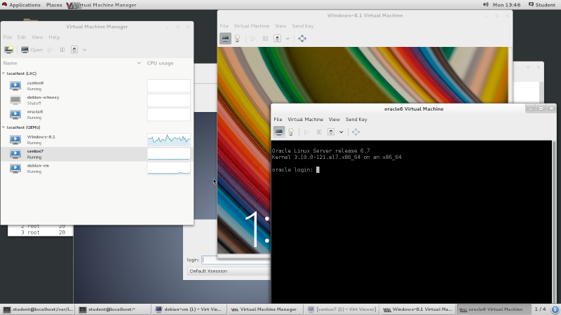
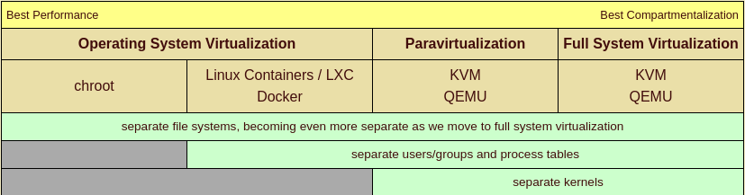
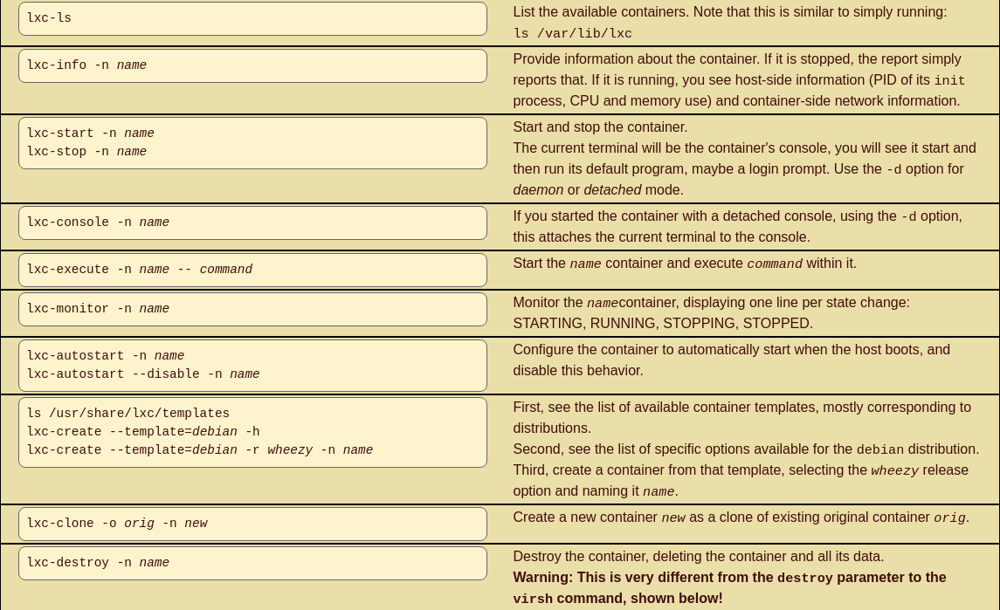
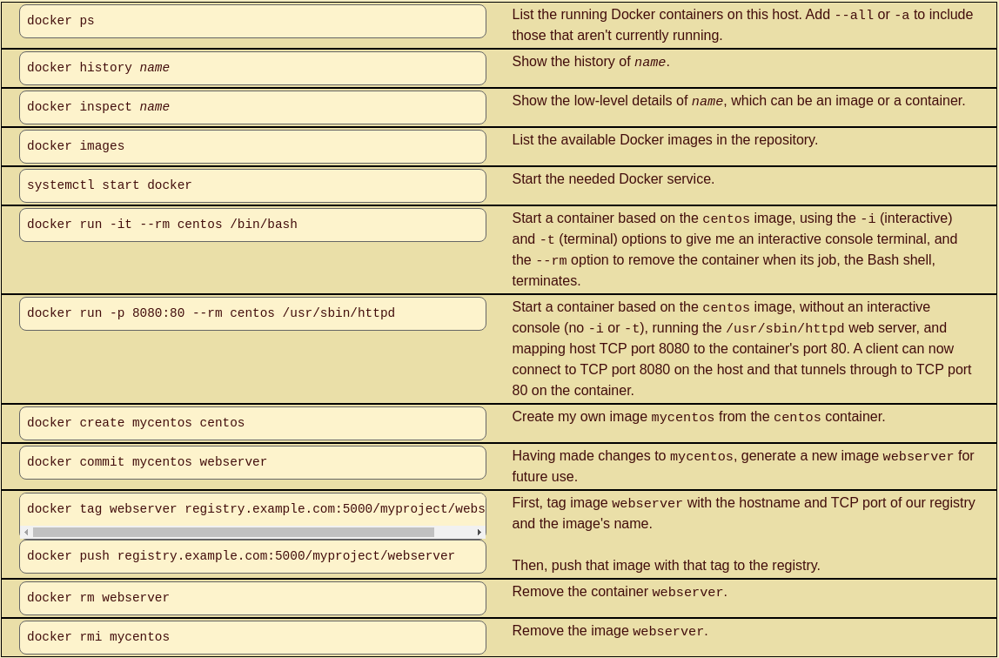
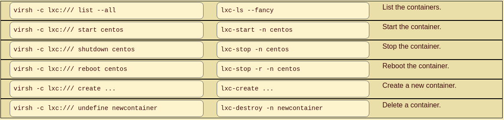
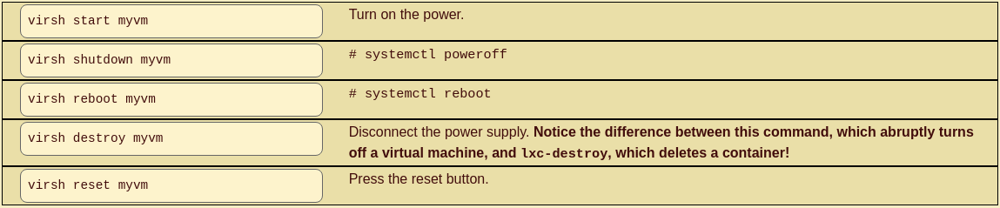
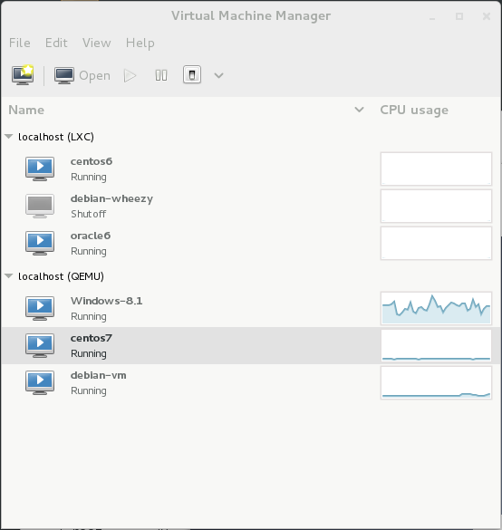

+++
title = 'Virtualisation Linux (chroot,lxc,docker,kvm qemu),libvirt et virsh'
date = 2020-10-03 00:00:00 +0100
categories = ['virtuel']
+++
# Virtualisation Linux

Regardez le mélange des environnements de systèmes d'exploitation visible à travers le bureau unique illustré ci-dessous. Il s'agit d'un système Red Hat Enterprise Linux fonctionnant en mode graphique, avec cinq systèmes virtualisés fonctionnant par-dessus, à la fois des conteneurs et des machines virtuelles complètes. La plus colorée est une machine virtuelle Windows 8.1. En face de celle-ci se trouve un système de conteneurs Oracle Linux en mode texte, comme il convient à un serveur. Un bureau graphique Debian se trouve à l'arrière. Un conteneur CentOS 6 et une machine virtuelle CentOS 7 sont également répertoriés comme fonctionnant dans le gestionnaire de machines virtuelles mais sans connexion à leurs consoles pour le moment.

Tout cela et bien d'autres choses encore constituent notre objectif. Nous voulons contrôler plusieurs systèmes d'exploitation fonctionnant selon plusieurs modes de fonctionnement, et ce, par le biais d'une interface commune.

Nous voulons pouvoir le faire dans un centre de données, où les conteneurs et les machines virtuelles sont répartis sur plusieurs plateformes physiques, mais nous pouvons facilement les contrôler tous à partir d'une console unique. De la ligne de commande pour l'efficacité et l'évolutivité par le biais de scripts, et d'une interface graphique pour une visibilité et un aperçu faciles.



Nous devons d'abord nous débarrasser de certains termes. Cela peut être un peu déroutant, mais si nous n'y parvenons pas, nous risquons de faire le contraire de ce que nous voulons.

La **virtualisation complète** fait que l'hyperviseur présente des unités centrales virtuelles, de la mémoire, une mise en réseau et bien plus encore, et le système d'exploitation invité est convaincu qu'il fonctionne sur du matériel réel. L'hyperviseur doit effectuer une traduction binaire dynamique pour y parvenir. Il prétend être le matériel réel, idéalement en temps réel, mais bien sûr avec une certaine latence supplémentaire.

La **paravirtualisation** consiste à ce que le système d'exploitation invité utilise des pilotes de périphériques personnalisés pour accéder au matériel virtualisé. Le système d'exploitation invité n'est pas seulement conscient qu'il fonctionne en plus de la virtualisation, il utilise des pilotes différents pour fonctionner un peu différemment. Voir les systèmes Linux fonctionnant sur des hyperviseurs Xen, par exemple. L'EC2 (ou Elastic Compute Cloud) d'Amazon Web Services est un système Linux sur Xen. Les périphériques de disque ne sont pas les habituels /dev/sd* mais plutôt /dev/xvd*, ainsi nommés par le pilote de périphérique de paravirtualisation pour les périphériques de disque virtualisés Xen.

La virtualisation complète peut fournir la plus grande compartimentation entre les machines virtuelles et entre les machines virtuelles et l'hôte. C'est-à-dire la plus grande séparation des systèmes de fichiers, des tables de processus et des identités ou des références UID/GID. L'hyperviseur peut même émuler différents matériels - peut-être que l'invité est Android sur ARM alors que l'hôte est Linux sur x86_64. Comme vous pouvez déjà l'imaginer, la virtualisation complète, en particulier des architectures étrangères, est plus lente.

La virtualisation assistée par le matériel (**Hardware-assisted virtualization**) est un jeu d'instructions étendu qui permet au processeur d'effectuer une partie du travail de virtualisation directement dans le matériel au lieu des processus de l'hyperviseur dans l'espace utilisateur. La virtualisation matérielle existe au moins depuis les systèmes IBM CP-40 des années 1960, mais l'architecture Intel/AMD x86 ne l'a ajoutée que vers 2005. Intel appelle sa version VT-x, AMD est AMD-V. Cherchez la fonctionnalité dans /proc/cpuinfo, la notion de CPU du noyau. Vous devriez trouver vmx sur les processeurs Intel et svm sur AMD. Vous en avez besoin car la virtualisation est beaucoup plus lente sans elle.

    egrep 'vmx|svm' /proc/cpuinfo 

Avec la virtualisation assistée par matériel, les performances peuvent atteindre 95 à 99 % de la vitesse du métal nu.

On parle de **virtualisation hybride** lorsque la virtualisation assistée par matériel prend en charge la paravirtualisation.

Enfin, la **virtualisation des systèmes d'exploitation** est devenue populaire sous Linux. Il y a un noyau unique partagé par le système hôte et les systèmes invités, mais un certain cloisonnement des processus, de la mémoire et du système de fichiers.   
Les **Linux Containers (LXC)** sont une technologie de virtualisation, tandis que **Docker** est un système de gestion et de déploiement efficace et évolutif pour LXC. Plus récemment, Docker a ajouté sa propre technologie de virtualisation pour améliorer les performances.

Nous pouvons les placer sur un spectre allant de la meilleure performance à la meilleure compartimentation   


**Chroot** existe depuis des lustres, mais ce n'est que récemment qu'il a été largement considéré comme une forme de virtualisation. Les **Linux Containers** ou **LXC** ont leur propre UID/GID et espace de processus, et **Docker** est un système permettant de gérer efficacement les conteneurs et de partager leur conception. **KVM** ou **Kernel-Based Virtual Machine** est une fonctionnalité fournie par le noyau, et **QEMU** est le mécanisme de l'espace utilisateur pour contrôler les machines virtuelles basées sur KVM. Les deux sont utilisées que vous fassiez de la paravirtualisation ou de la virtualisation complète du système, mais la QEMU est beaucoup plus manifestement impliquée dans la virtualisation complète, surtout lorsqu'il s'agit d'émuler des architectures étrangères.

## chroot

Vous devez exécuter chroot en tant que root de l'utilisateur. Vous pouvez simplement nommer le nouveau système de fichiers racine et il exécutera le programme /bin/sh en son sein :

    # chroot /var/chroots/myproject 

Vous pouvez spécifier d'autres références UID/GID non racine :

    # chroot --userspec=fred:wheel /var/chroots/myproject 

Vous pouvez nommer la racine du chroot et aussi le chemin d'accès au programme à exécuter à l'intérieur de celui-ci :

    # chroot /var/www /sbin/httpd 

Notez que ce qui précède implique que si `/var/www/sbin/httpd` existe, et qu'il s'agit soit d'un binaire lié statiquement, soit que `/var/www/lib` est peuplé des bibliothèques partagées nécessaires qui se trouvent généralement dans `/lib`. De plus, la racine web se trouvera sous le nouveau système de fichiers, donc les pages web dans `/var/www/var/www/htdocs/*`, les fichiers de log dans `/var/www/var/www/log/*`, et ainsi de suite. Et, très probablement, `/var/www/dev/` est partiellement peuplé de nœuds de périphériques, au moins avec `null` et `random`.

La famille UNIX a le chroot depuis des lustres, et ce n'est qu'avec l'intérêt récemment croissant pour la virtualisation basée sur Linux qu'elle a été considérée comme autre chose qu'une pure compartimentation.

## lxc

[LXC container driver](https://libvirt.org/drvlxc.html#usageConvert)

Les Linux Containers ou LXC sont un domaine qui évolue rapidement, et les commandes peuvent varier d'une plate-forme à l'autre. Par exemple, comparez lxc-ls sur Debian et Red Hat :

```bash
$ lxc-ls --version
1.0.7
$ lxc-ls --fancy
NAME        STATE    IPV4        IPV6  AUTOSTART
------------------------------------------------
container1  RUNNING  10.0.3.192  -     NO
container2  STOPPED  -           -     NO
$ lxc-info -n container1
Name:           container1
State:          RUNNING
PID:            4140
IP:             10.0.3.192
CPU use:        0.66 seconds
BlkIO use:      72.00 KiB
Memory use:     3.22 MiB
KMem use:       0 bytes
Link:           veth22AUQI
 TX bytes:      1.68 KiB
 RX bytes:      5.33 KiB
 Total bytes:   7.01 KiB
$ lxc-info -n container2
Name:           container2
State:          STOPPED 
```

C'est sur Debian, où /usr/bin/lxc-ls est un script Python de 15 958 octets. Sur Red Hat, il provient d'un paquet du même nom et de la même version, lxc et 1.0.7, mais c'est un script shell POSIX de 2 837 octets et la commande lxc-ls --version donne un rapport sur la version de ls !

Consultez les pages du manuel, essayez d'exécuter la commande avec les paramètres de juste -h et --help, et sachez qu'une autre syntaxe peut également être acceptée. Par exemple, au moins avec la version 1.0.7 sur Red Hat Enterprise Linux 7, ces trois commandes sont équivalentes et la seconde n'est pas mentionnée dans la page de manuel :

```bash
# lxc-info -n mycontainer
# lxc-info --name mycontainer
# lxc-info --name=mycontainer 
```

Le texte qui suit utilise la syntaxe -n la plus courte, et utilise le nom pour le nom du conteneur spécifié. La plupart des commandes ont plus d'options, ce qui suit en montre suffisamment pour vous aider à démarrer.

### Commandes LXC courantes



## Fichiers XML LXC

Un conteneur est défini par le fichier de configuration `/var/lib/lxc/name/config`, qui contient des commentaires (de "#" à la fin de la ligne) et des attributions de valeur pour les caractéristiques simples.

Le système libvirt, décrit ci-dessous, peut prendre en charge la conversion de la configuration native LXC en une description XML avec cette syntaxe. Là encore, cela dépend des capacités de la version que vous avez installée :

    # virsh -c lxc:///system domxml-from-native lxc-tools /var/lib/lxc/debian-10/config

Si tel est le cas, le résultat serait le suivant. Sinon, le fichier XML approprié peut être créé à la main :

```xml
<domain type='lxc'>
  <name>debian-10</name>
  <uuid>a29515e3-1f37-4de8-a004-40d3e3fcf9fd</uuid>
  <memory unit='KiB'>65536</memory>
  <currentMemory unit='KiB'>65536</currentMemory>
  <vcpu placement='static'>1</vcpu>
  <os>
    <type>exe</type>
    <init>/sbin/init</init>
  </os>
  <features>
    <capabilities policy='allow'/>
  </features>
  <clock offset='utc'/>
  <on_poweroff>destroy</on_poweroff>
  <on_reboot>restart</on_reboot>
  <on_crash>destroy</on_crash>
  <devices>
    <emulator>/usr/lib/libvirt/libvirt_lxc</emulator>
    <filesystem type='mount' accessmode='passthrough'>
      <source dir='dir:/var/lib/lxc/debian-10/rootfs'/>
      <target dir='/'/>
    </filesystem>
    <interface type='bridge'>
      <mac address='00:16:3e:a2:cd:45'/>
      <source bridge='lxcbr0'/>
      <link state='up'/>
    </interface>
  </devices>
</domain>

```

## Docker

[Docker](https://www.docker.com/) est un mécanisme de gestion et de partage des conteneurs. Il utilise l'[UnionFS](http://unionfs.filesystems.org/) pour utiliser très efficacement le stockage. Il a été initialement construit sur LXC, mais il utilise maintenant par défaut son propre mécanisme de virtualisation du système d'exploitation libcontainer. On s'attend à ce que vous utilisiez Docker pour créer des conteneurs légers dédiés à des tâches uniques spécialisées, c'est pourquoi il utilise le copy-on-write pour créer très rapidement ces nouveaux conteneurs.

Une image Docker est un modèle à partir duquel un conteneur peut être construit. Un registre est un point de distribution d'images, analogue à un dépôt ou un repo RPM ou APT. Elles peuvent être publiques, partagées avec l'Internet ou conservées dans la sphère privée de votre organisation. Vous pouvez extraire une image d'un registre et l'exécuter sur la machine locale. Si vous apportez des améliorations à ce conteneur, vous pouvez alors pousser votre nouvelle image vers un registre pour que d'autres puissent l'utiliser.

Disons que notre organisation a stocké une image appelée centos, un conteneur construit à partir d'une installation CentOS de base. Je pourrais l'intégrer à mon système et y apporter des modifications, en ajoutant le serveur web Apache et en mettant en place un système de journalisation supplémentaire, et ensuite pousser le résultat dans notre registre privé. Vous pourriez ensuite retirer mon image et ajouter une base de données en arrière-plan, puis pousser votre résultat dans le registre.

Un autre membre de notre organisation pourrait ensuite récupérer votre image et l'exécuter. Il semble que notre registre doive croître rapidement, avec trois images disponibles - l'original, l'original plus mon serveur web et la journalisation, et cela plus votre travail sur la base de données. Mais seule l'image initiale sera une image complète. Mes modifications, et vos modifications aux miennes, sont stockées comme les changements nécessaires pour construire l'image souhaitée.

### Commandes communes docker



Vous pouvez également utiliser un Dockerfile, analogue à un Makefile, pour spécifier comment créer une nouvelle image en modifiant et en démarrant une image existante.

```bash
# cat /path/to/source/directory/Dockerfile 

## Dockerfile to quickly generate a web server
##
## Start with this base image:
FROM centos
## Run this command before committing the image:
RUN yum -y install httpd
## Connect this shared volume on the host
## containing an Apache configuration and logs:
VOLUME ["/var/www"]
## Load a web site into the image file system:
ADD site1.tar.gz /var/www/htdocs
## Set an environment variable within the container:
ENV APACHE_HOME /var/www
## Run this command when starting the container:
CMD ["/usr/sbin/httpd"]  
```

Nous pourrions maintenant construire un conteneur basé sur ce Dockerfile. Nous lui donnerons un dépôt, un nom et une étiquette pleinement qualifiés et significatifs avec l'option -t. Dans cet exemple, il s'agit de la version 1.0 (ou tag), nommée serveur web dans le dépôt du projet.

    # docker build -t project/webserver:1.0 

## QEMU

QEMU est un émulateur de machine générique à source ouverte. Il effectue une virtualisation complète du système, où vous exécutez un noyau séparé sur la VM et ce noyau voit une plate-forme complète avec votre nombre spécialisé de processeurs, la quantité de RAM, les disques et les interfaces Ethernet, USB et audio. La QEMU peut émuler une architecture différente. Vous pouvez exécuter une commande QEMU sur votre plate-forme Linux/x86_64 et la faire émuler : un système ARM sur lequel vous exécutez Android, ou un UltraSPARC sur lequel vous exécutez Solaris, ou simplement une plate-forme x86_64 sur laquelle vous exécutez Windows.

Si vous êtes sur du matériel x86_64, le démarrage d'une machine virtuelle avec les commandes virsh ou virt-install décrites ci-dessous lance en fait un processus qemu-system-x86_64 pour émuler la plate-forme de la machine virtuelle.

Pour émuler une architecture différente, vous devez exécuter la commande qemu-system-* et les paramètres appropriés. Par exemple, disons que vous voulez exécuter Android sur un ARM émulé, et que vous voulez que le terminal dans lequel vous le démarrez soit connecté à une console série en plus de l'interface graphique Android qui apparaîtra dans une nouvelle fenêtre. Vous devez le faire :

Préciser la variante ARM spécifique et la quantité de RAM.
Transmettre le noyau et les fichiers d'image disque de la RAM initiale.
Spécifier le fichier contenant l'image disque, et indiquer qu'il doit apparaître sur une carte mémoire SD.
Préciser que la console Android est le premier port série, et que le port série est (virtuellement) connecté à votre terminal.
Assemblé, cela devient :

```bash
# qemu-system-arm -machine vexpress-a9 -m 1024\
	-kernel vmlinuz -initrd initrd.gz \
	-drive file=android-disk.qcow2,if=sd \
	-append "init=/init androidboot.console=ttyAMA0" -serial stdio 
```

Recherchez soigneusement les détails, et soyez conscient que les détails varient non seulement d'une architecture à l'autre mais aussi d'une version des outils de l'UEMQ à l'autre. [Cette page](https://people.debian.org/~aurel32/qemu/) montre comment une personne a réussi à faire fonctionner Fedora sur une grande variété d'architectures, dont AMD64, ARMel, ARMhf, i386, MIPS, PowerPC et SPARC, et fournit des images de disque téléchargeables au format [qcow2](https://en.wikipedia.org/wiki/Qcow).

## libvirt et virsh

[libvirt](https://libvirt.org/) est une boîte à outils permettant d'interagir avec les capacités de virtualisation de Linux. Elle comprend des outils en ligne de commande, une interface utilisateur graphique et une interface de [programmation d'applications ou API](https://libvirt.org/bindings.html) pour C/C++, C#, Java, Perl, Python, PHP, Ruby et OCaml afin que vous puissiez écrire vos propres outils en ligne de commande ou graphiques. libvirt peut contrôler une grande variété de technologies de virtualisation - KVM/QEMU, LXC, Xen, VirtualBox, OpenVZ, et plus encore.

libvirt fait référence aux hyperviseurs au format URI :
`scheme://[[utilisateur@]nom d'hôte]/[session][?option1=valeur1[&option2=valeur2]...]`
Par exemple :

```
lxc:///
xen:///
vmwareplayer:///session
qemu+ssh://root@somehostname/system
qemu+tls://somehostname/system
esx://somehostname/?transport=http
```

Dans ces URIs, la **session** se réfère généralement à l'accès de l'utilisateur à l'hyperviseur et du **system** à l'hyperviseur du système.

La commande `virsh` est une interface en ligne de commande de libvirt qui permet de tout faire. Utilisez   `-c URI` pour spécifier la connexion à l'hyperviseur. Par exemple, `list --all` énumérera toutes les machines virtuelles, en cours d'exécution ou non, connues de l'hyperviseur.

Cela signifie que nous avons deux manières équivalentes de manipuler les conteneurs :

### Opérations communes sur les conteneurs en virsh et lxc-*



Les conteneurs fonctionnent sous le noyau hôte, le "redémarrage" ou l'arrêt de ces derniers ne contrôle que les processus s'exécutant à l'intérieur du conteneur.

La virtualisation complète du système avec QEMU et KVM signifie un noyau séparé. Plusieurs commandes virsh ont des analogies avec les actions effectuées sur une machine physique :

### Analogies des commandes virsh



`virt-manager` est un bel outil graphique dans lequel vous pouvez surveiller, contrôler et créer des systèmes virtualisés. Utilisez le choix de menu `Fichier | Ajouter une connexion` pour ajouter des connexions à d'autres systèmes d'hyperviseur. Dans cette vue, `lxc:///` et `qemu:///system` sont utilisés.



>AVIS : Avec la sortie de RHEL 8, Red Hat a déprécié virt-manager au profit de l'interface de gestion basée sur le navigateur Cockpit qui écoute sur TCP/9090.

## Fichiers XML libvirt

Les machines virtuelles sont décrites par XML. Vous pouvez transférer la description XML vers une sortie standard avec `virsh dumpxml`

Vous pouvez enregistrer cette sortie XML dans un fichier, modifier le fichier pour changer le `name`, supprimer `uuid` et toutes les valeurs `adresse mac`, puis définir une nouvelle machine virtuelle avec avec `virsh define` 

```xml
<domain type='kvm'>
  <name>myvm</name>
  <uuid>8b9ad37b-9ecb-444f-9f28-298f0bbad29b</uuid>
  <memory unit='KiB'>524288</memory>
  <currentMemory unit='KiB'>524288</currentMemory>
  <vcpu placement='static'>1</vcpu>
  <os>
    <type arch='x86_64' machine='pc-i440fx-rhel7.0.0'>hvm</type>
    <boot dev='hd'/>
  </os>
  <features>
    <acpi/>
    <apic/>
    <pae/>
  </features>
  <clock offset='utc'/>
  <on_poweroff>destroy</on_poweroff>
  <on_reboot>restart</on_reboot>
  <on_crash>restart</on_crash>
  <devices>
    <emulator>/usr/libexec/qemu-kvm</emulator>
    <disk type='file' device='disk'>
      <driver name='qemu' type='qcow2' cache='none'/>
      <source file='/usr/local/containers/myvm.qcow2'/>
      <target dev='vda' bus='virtio'/>
      <address type='pci' domain='0x0000' bus='0x00' slot='0x05' function='0x0'/>
    </disk>
    <controller type='usb' index='0'>
      <address type='pci' domain='0x0000' bus='0x00' slot='0x01' function='0x2'/>
    </controller>
    <controller type='pci' index='0' model='pci-root'/>
    <controller type='virtio-serial' index='0'>
      <address type='pci' domain='0x0000' bus='0x00' slot='0x04' function='0x0'/>
    </controller>
    <interface type='network'>
      <mac address='52:54:00:7a:fe:26'/>
      <source network='default'/>
      <model type='virtio'/>
      <address type='pci' domain='0x0000' bux='0x00' slot='0x03' function='0x0'/>
    </interface>
    <serial type='pty'>
      <target port='0'/>
    </serial>
    <console type='pty'>
      <target type='serial' port='0'/>
    </console>
    <channel type='spicevmc'>
      <target type='virtio' name='com.redhat.spice.0'/>
      <address type='virtio-serial' controller='0' bus='0' port='1'/>
    </channel>
    <input type='tablet' bus='usb'/>
    <input type='mouse' bus='usb'/>
    <graphics type='spice' autoport='yes'/>
    <video>
      <model type='qxl' ram='65536' vram='65536' heads='1'/>
      <address type='pci' domain='0x0000' bus='0x00' slot='0x02' function='0x0'/>
    </video>
    <memballoon model='virtio'>
      <address type='pci' domain='0x0000' bus='0x00' slot='0x06' function='0x0'/>
    </memballoon>
  </devices>
</domain> 
```

## libvirt Réseau

Il existe une commande `virsh net-dumpxml` similaire, qui donne la définition XML d'un réseau virtuel.

```xml
<network>
  <name>default</name>
  <uuid>f37ba69f-6b2c-4775-82d4-6f03a392acb7</uuid>
  <forward mode='nat'>
    <nat>
      <port start='1024' end='65535'/>
    </nat>
  </forward>
  <bridge name='virbr0' stp='on' delay='0' />
  <ip address='192.168.122.1' netmask='255.255.255.0'>
    <dhcp>
      <range start='192.168.122.2' end='192.168.122.254' />
    </dhcp>
  </ip>
</network> 
```

Disons que nous n'avons jusqu'à présent qu'un seul réseau et un seul pont virtuel :

```bash
# virsh net-list --all 
 Name                 State      Autostart     Persistent
----------------------------------------------------------
 default              active     yes           yes
# brctl show
bridge name     bridge id               STP enabled      interfaces
docker0         8000.56847afe9799       no
virbr0          8000.000000000000       yes  
```

Nous pouvons transférer la description XML du réseau virtualisé dans un fichier, l'éditer et définir un nouveau réseau :

```bash
# virsh net-dumpxml default > /tmp/newnet.xml
# vim /tmp/newnet.xml
   [... change name from "default" to "newnet",
        virtual bridge name from "virbr0" to "virbr1",
	and IP address range to 192.168.123.0/24 ...]
# virsh net-define /tmp/newnet.xml 
Network newnet defined from /tmp/mynet.xml 

# virsh net-list --all 
 Name                 State      Autostart     Persistent
----------------------------------------------------------
 default              active     yes           yes
 newnet               inactive   no            yes
# brctl show
bridge name     bridge id               STP enabled      interfaces
docker0         8000.56847afe9799       no
virbr0          8000.000000000000       yes  
```

Le nouveau réseau est là, mais pas le nouveau pont virtuel. Nous devons lancer le nouveau réseau.

```bash
# virsh net-start newnet 
Network newnet started 

# virsh net-autostart newnet 
Network newnet marked as autostarted 

# virsh net-list --all 
 Name                 State      Autostart     Persistent
----------------------------------------------------------
 default              active     yes           yes
 newnet               active     yes           yes
# brctl show
bridge name     bridge id               STP enabled      interfaces
docker0         8000.56847afe9799       no
virbr0          8000.000000000000       yes
virbr1          8000.52540016cb49       yes              virbr1-nic  
```

