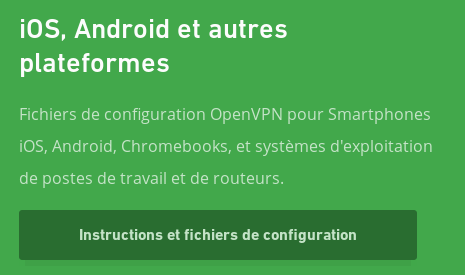
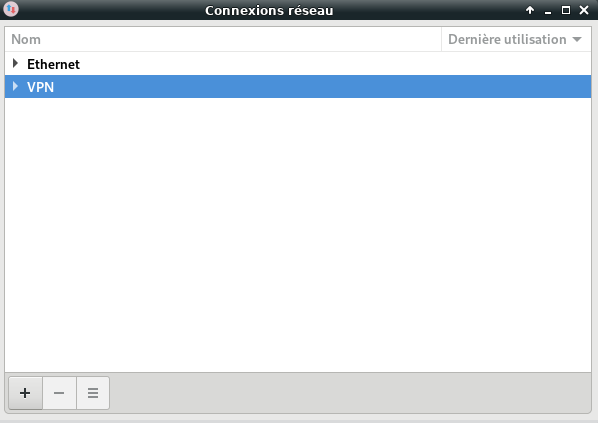
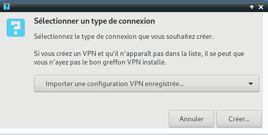
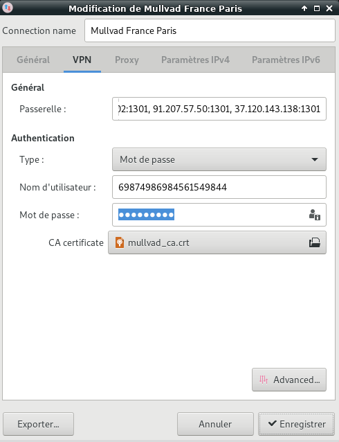
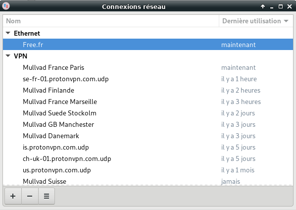
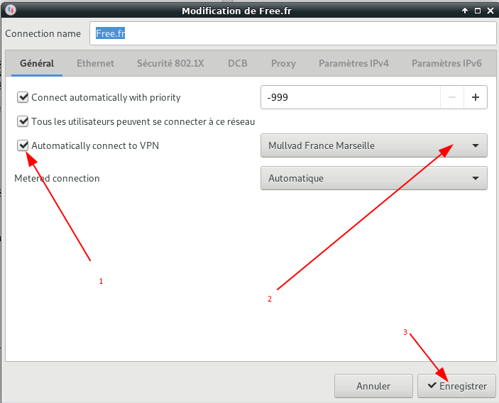
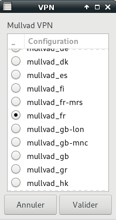

+++
title = 'Mullvad VPN (OBSOLETE)'
date = 2020-10-04 00:00:00 +0100
categories = vpn
+++
[{:width="300"}](https://mullvad.net/fr/)

*La confidentialité est un droit universel. Il s'agit d'un fondement d'une société fonctionnant bien, nous permettant de débattre et de nous confronter aux normes, à l'éthique, et aux lois de manière sûre. Ainsi, une société libre et ouverte ne peut pas prospérer et se développer, ni même exister, sans vie privée. C'est pour cette raison que nous vous fournissons un service VPN permettant de protéger l'aspect privé de vos activités en ligne, de votre identité, et de l'endroit où vous vous trouvez, et ce pour seulement 5 € / mois. Nous vous recommandons de payer de manière anonyme, en espèces, Bitcoin, ou Bitcoin Cash. Nous acceptons également les cartes de crédit, les virements bancaires, PayPal, ou encore Swish.*

Se connecter au site <https://mullvad.net/fr/>  
**Créer un compte** (5€/mois en janvier 2019)

## Téléchargement

Après avoir créer un compte , se connecter , puis **Télécharger l'application**   
{:width="300"}  
Choisir "Autres plate-formes", cliquer sur "Instructions et fichiers de configuration" et saisir les paramètres : 

* Numéro de compte : 1213456987458 
* Plateformelateforme : Linux ou Android
* Région : Tous
* Port : Par défaut (UDP)
* Utiliser des adresses IP : Oui

Puis cliquer sur **Télécharger le client**  
Les fichiers téléchargés sont **mullvad_config_linux_all.zip** ou **mullvad_config_android.zip**

## OpenVPN manuel

Ouvrir un terminal ,assurez-vous d'abord que les paquets **openvpn** et **openresolv** sont installés sinon `yay -S openvpn openresolv` ,décompressez le fichier téléchargé dans **/etc/openvpn/client/**.

    sudo unzip mullvad_config_linux_all.zip -d /etc/openvpn/client/

Le dossier *mullvad_config_linux_all* contient tous les fichiers de configuration par pays (**.conf**) , le certificat **mullvad_ca.crt** , le fichier qui contient log/mdp **mullvad_userpass.txt** et le script **update-resolv-conf**.   

Afin d'utiliser les serveurs de noms fournis par Mullvad, le script **update-resolv-conf** est appelé au démarrage et à l'arrêt de la connexion avec OpenVPN pour modifier resolv.conf afin d'inclure les bonnes adresses IP. Ce script est également inclus dans le fichier zip de configuration Mullvad, mais doit être déplacé vers **/etc/openvpn/** pour correspondre au chemin spécifié dans le fichier de configuration Mullvad :

    sudo cp /etc/openvpn/client/mullvad_config_linux_all/update-resolv-conf /etc/openvpn/
    sudo chmod 755 /etc/openvpn/update-resolv-conf  # droits d'accès en exécution

>Le script peut être mis à jour avec le script openvpn-update-resolv-conf, qui contient également une correction pour les fuites DNS.

**Configuration test en ligne de commande**

En plus de la copie du script **update-resolv-conf**  
Copier les fichiers suivants sous **/etc/openvpn/client/** :

    sudo cp /etc/openvpn/client/mullvad_config_linux_all/mullvad_ca.crt /etc/openvpn/client/
    sudo cp /etc/openvpn/client/mullvad_config_linux_all/mullvad_userpass.txt /etc/openvpn/client/


Pour faire des tests en ligne de commande , on va copier un fichier de configuration Mullvad

    sudo cp /etc/openvpn/client/mullvad_config_linux_all/mullvad_fr.conf /etc/openvpn/client/mullvad.conf
    sudo -s # on passe en super utilisateur
    cd /etc/openvpn/client/  # se rendre dans le dossier
    openvpn mullvad.conf # exécuter

A la fin de l'intialisation

```
[...]
Sun Jan 13 14:53:12 2019 /usr/bin/ip route add 128.0.0.0/1 via 10.9.0.1
Sun Jan 13 14:53:12 2019 add_route_ipv6(::/2 -> fdda:d0d0:cafe:1195:: metric -1) dev tun0
Sun Jan 13 14:53:12 2019 /usr/bin/ip -6 route add ::/2 dev tun0
Sun Jan 13 14:53:12 2019 add_route_ipv6(4000::/2 -> fdda:d0d0:cafe:1195:: metric -1) dev tun0
Sun Jan 13 14:53:12 2019 /usr/bin/ip -6 route add 4000::/2 dev tun0
Sun Jan 13 14:53:12 2019 add_route_ipv6(8000::/2 -> fdda:d0d0:cafe:1195:: metric -1) dev tun0
Sun Jan 13 14:53:12 2019 /usr/bin/ip -6 route add 8000::/2 dev tun0
Sun Jan 13 14:53:12 2019 add_route_ipv6(c000::/2 -> fdda:d0d0:cafe:1195:: metric -1) dev tun0
Sun Jan 13 14:53:12 2019 /usr/bin/ip -6 route add c000::/2 dev tun0
Sun Jan 13 14:53:12 2019 Initialization Sequence Completed
```

Ouvrir un second terminal et vérifier

    ip addr

```
[...]
8: tun0: <POINTOPOINT,MULTICAST,NOARP,UP,LOWER_UP> mtu 1500 qdisc fq_codel state UNKNOWN group default qlen 100
    link/none 
    inet 10.9.0.8/16 brd 10.9.255.255 scope global tun0
       valid_lft forever preferred_lft forever
    inet6 fdda:d0d0:cafe:1195::1006/64 scope global 
       valid_lft forever preferred_lft forever
    inet6 fe80::e9a4:8ac5:d68c:14d2/64 scope link stable-privacy 
       valid_lft forever preferred_lft forever
```

Sur le premier terminal, Ctrl C pour stopper l'exécution du vpn.

Après la configuration, la connexion VPN peut être gérée avec openvpn-client@mullvad.service. Si le service ne démarre pas avec une erreur comme Impossible d'ouvrir TUN/TAP dev /dev/net/tun : En l'absence d'un tel périphérique (errno=19), vous devrez peut-être redémarrer le système pour permettre à OpenVPN de créer le périphérique réseau approprié pour la tâche.

### gtkvpn (Mullvad + OpenVPN + Python GTK3)

*Gestionnaire des connexions vpn mullvad*  
<https://gitea.yanspm.com/yannick/gtkvpn>


## NetworkManager

### Configuration NetworkManager

Clic sur l'icône "Réseau" de la barre des tâches  &rarr; Connexion VPN &rarr; Configurer le VPN...  
{:width="300"}  
Sélection "VPN" et cliquer sur le "+"   
{:width="300"}  
Sélection "Importer une configuration VPN enregistrée" et cliquer sur "Créer"  
Avec l'explorateur de fichier, sélectionner un fichier de configuration .conf  
Dans la fenêtre qui s'ouvre ensuite,il faut modifier "Connection name" (facultatif) , saisir le nom d'utilisateur et le mot de passe  

{:width="300"}   
et pour terminer , cliquer sur "Enregistrer"

### Utiliser VPN Mullvad

Clic sur l'icône "Réseau" de la barre des tâches  &rarr; Connexion VPN &rarr; Cocher le VPN que vous souhaitez utiliser et après quelques secondes , l'icône réseau se modifie  avec le cadenas en plus

>Pour changer de VPN , il faut en premier lieu se déconnecter de celui sur lequel vous êtes avant d'en sélectionner un autre

### NetworkManager connexion auto sur VPN au démarrage

>**ATTENTION !!!** LA CONNEXION AUTO POSE PROBLEME SUR LES DERNIERES VERSIONS NETWORKMANAGER  


**Graphiquement**

Clic sur l'icône "Réseau" de la barre des tâches  &rarr; Modifier les connexions 

{:width="400"}  
Sélectionner la connexion Ethernet active ( ici Free.fr ) puis cliquer sur l'icône    

Dans l'onglet "Général"  
{:width="400"}

**NetworkManager dispatcher**

[Gnome developer NetworkManager](https://developer.gnome.org/NetworkManager/stable/NetworkManager.html)

Connexion automatique au VPN quand le réseau est établi ou la wifi sur les portables.  

<u>**Créer un fichier mot de passe**</u>   
Créer le dossier qui va contenir le fichier  

    sudo mkdir /etc/mdp

Le fichier mot de passe **vpn**

    sudo nano /etc/mdp/vpn

```
vpn.secrets.password:'mot_de_passe_connexion_vpn'
```

Les droits

    sudo chmod 600 /etc/mdp/vpn

**<u>Test de la connexion VPN avec NetworkManager cli</u>**  
On passe en super utilisateur

    sudo -s

Liste des connexions disponibles dans le dossier  **/etc/NetworkManager/system-connections/**  
Ordinateur de bureau

```
Free.fr	                   # connexion filaire			 
'Mullvad France Marseille' # VPN
'Mullvad France Paris'     # VPN
```

Liste des connexions disponibles dans le dossier  **/etc/NetworkManager/system-connections/**  
Ordinateur portable

```
Free.fr	                   # connexion filaire	
YANN_5GEXT                 # WIFI
'Mullvad France Paris'     # VPN
```

Lancement de la connexion

    nmcli connection up 'Mullvad France Paris' passwd-file /etc/mdp/vpn

```
Connexion activée (chemin D-Bus actif : /org/freedesktop/NetworkManager/ActiveConnection/29)
```

Arrêt de la connexion

    nmcli connection down 'Mullvad France Paris'

```
Connexion « Mullvad France Paris » désactivée (chemin D-Bus actif : /org/freedesktop/NetworkManager/ActiveConnection/29)
```


<u>**Ordinateur de bureau à liaison filaire (ethernet)**</u>,on va créer un fichier **/etc/NetworkManager/dispatcher.d/10-openvpn** qui va activer ou désactiver la configuration VPN  

```
#!/bin/bash
# le VPN sera activé après le démarrage du réseau 
# VPN_NAME le nom de la connexion VPN qui sera lancée
# CONNECTION_ID est la variable du réseau qui doit être actif

VPN_NAME="Mullvad France Paris" 
case "$2" in
  up)
    if [ "$CONNECTION_ID" == "Free.fr" ]; then
      nmcli con up id "$VPN_NAME" passwd-file /etc/mdp/vpn
    fi
  ;;
  down)
      if nmcli con show --active | grep "$VPN_NAME"; then
        nmcli con down id "$VPN_NAME"
      fi
  ;;
esac
```

<u>**Ordinateur portable Wifi**</u>, on veut se connecter automatiquement au VPN quelque soit le réseau Wifi utilisé, on va créer un fichier **/etc/NetworkManager/dispatcher.d/10-wifivpn** qui va activer ou désactiver la configuration VPN (*iwgetid* qui fournit le réseau wifi actif nécessite l'installation du paquet **wireless_tools**)  

    yay -S wireless_tools

```
#!/bin/sh
# iwgetid renvoie le SSID du réseau wifi actif
# VPN_NAME le nom de la connexion VPN qui sera lancée
# ESSID est le réseau wifi qui doit être actif
VPN_NAME="Mullvad France Paris"
ESSID="YANN_5GEXT"

interface=$1 
status=$2
case $status in
  up|vpn-down)
    if iwgetid | grep -qs ":\"$ESSID\""; then
      nmcli con up id "$VPN_NAME" passwd-file /etc/mdp/vpn
    fi
    ;;
  down)
    if iwgetid | grep -qs ":\"$ESSID\""; then
      if nmcli con show --active | grep "$VPN_NAME"; then
        nmcli con down id "$VPN_NAME"
      fi
    fi
    ;;
esac
```

Changer les droits  

    sudo chown root:root /etc/NetworkManager/dispatcher.d/10-openvpn
    sudo chmod 755 /etc/NetworkManager/dispatcher.d/10-openvpn

Afin que les scripts s'exécutent, il est nécessaire d'activer le dispatcher  

    sudo systemctl enable NetworkManager-dispatcher

Démarrer le service  

    sudo systemctl start NetworkManager-dispatcher.service

## OpenVPN + Zenity

>Nombreux problèmes avec **networkmanager-openvpn** , pas de possibilité de démarrer sur un VPN  

Désinstaller networkmanager-openvpn : `yay -Rsn networkmanager-openvpn`  

On va utiliser **openvpn** , **zenity** et **networkmanager-dispatch**  
Le répertoire de travail **/home/yannick/Private/MullvadVPN/mullvad_config_linux_all/**  

Les fichiers configuration, certificat et mot de passe dans **/etc/openvpn/client**  
mullvad.conf  mullvad_ca.crt  mullvad_userpass.txt

<u>Le bash qui permet de lancer la connexion VPN au démarrage</u> : **/etc/NetworkManager/dispatcher.d/99-openvpn** lorsque la connexion filaire est active

```
#!/bin/bash
DEVICE=$1
STATUS=$2
if [ "$DEVICE" == "enp0s31f6" ];then
 case "$STATUS" in
  up)
    if [ "$CONNECTION_ID" == "Free.fr" ]; then
	echo "up) Free.fr Actif"  
	/usr/bin/sleep 5
        systemctl start openvpn-client@mullvad.service
  
    fi
  ;;
 esac
fi
```

Afin que les scripts s'exécutent, il est nécessaire d'activer le dispatcher  

    sudo systemctl enable NetworkManager-dispatcher

Démarrer le service  

    sudo systemctl start NetworkManager-dispatcher.service

<u>Le script **mullvad.sh**
 associé à zenity pour changer de connexion vpn</u> 

```
#!/bin/bash

echo "On cherche le flag"
for file in $(find . -type f -name "*.flag")
  do 
   tempfile="${file##*/}"
   flag=${tempfile%.*}
   done
echo $flag

echo "Recherche des fichiers de configuration"
chaine=""
for file in $(find . -type f -name "*.conf" -print | sort)
  do 
   tempfile="${file##*/}"
   if [ "${tempfile%.*}" == "$flag" ]
   then
   	chaine=$chaine" TRUE ${tempfile%.*}"
   else
   	chaine=$chaine" FALSE ${tempfile%.*}"
   fi
  done
#echo $chaine
vpn=$(zenity --width=150 --height=700  --list  --title "VPN" --text "Mullvad VPN" --radiolist  --column "__" --column "Configuration" $chaine );
echo $vpn
   if [ "$vpn" == "" ]
   then
      echo "sortie sans modification"
      exit
   fi

echo "On arrête le VPN en cours"
sudo systemctl stop openvpn-client@mullvad.service
echo "On supprime le flag"
rm $flag".flag" > /dev/null
echo "Attendre 2 secondes"
sleep 2
echo "On copie la nouvelle configuration"
sudo cp $vpn".conf" /etc/openvpn/client/mullvad.conf
echo "Attendre 2 secondes"
sleep 2
echo "On démarre la nouvelle configuration"
sudo systemctl start openvpn-client@mullvad.service
echo "Création du flag"
touch $vpn".flag"
echo "Fin changement de configuration"
exit

```

<u>Lanceur XFCE de bureau **mullvad.desktop**</u>  en utilisant Editeur de menus (si “menulibre” installé) ou manuellement

```
[Desktop Entry]
Version=1.0
Type=Application
Name=Mullvad VPN
Comment=Sélection configuration
Icon=network-vpn
Exec=sh /home/yannick/Private/MullvadVPN/mullvad_config_linux_all/mullvad.sh
Path=/home/yannick/Private/MullvadVPN/mullvad_config_linux_all/
NoDisplay=false
Categories=Utility;
StartupNotify=false
Terminal=false
```

Copier lanceur XFCE :

    mkdir -p ~/.local/share/applications/  #création dossier **applications** si inexistant
    cp mullvad.desktop ~/.local/share/applications/menulibre-mullvad-vpn.desktop

Utilisation par simple clic sur "Mullpad VPN" du menu XFCE



**DESACTIVATION DES OPERATIONS PRECEDENTES**  
*En cas de changement de système de connexion aux serveurs VPN*

1. Stopper le service client openvpn en cours : `sudo systemctl stop openvpn-client@mullvad.service`
2. Désactiver le service client openvpn en cours : `sudo systemctl disable openvpn-client@mullvad.service`
1. Stopper le dispatcher : `sudo systemctl stop NetworkManager-dispatcher`
2. Désactiver le dispatcher : `sudo systemctl disable NetworkManager-dispatcher`
3. Supprimer le fichier : `sudo rm /etc/NetworkManager/dispatcher.d/99-openvpn`
* Désactiver "gtkvpn (gestion VPN)" dans session et démarrage


## Qomui

{:width="40"}  
[Qomui](https://github.com/corrad1nho/qomui)

### Description

Qomui (Qt OpenVPN Management UI) est un gui OpenVPN/WireGuard facile à utiliser pour GNU/Linux avec quelques fonctionnalités uniques telles que le support indépendant du fournisseur pour les connexions double saut. Qomui prend en charge plusieurs fournisseurs avec plus de commodité lorsque vous utilisez AirVPN, PIA, ProtonVPN, Windscribe ou Mullvad.

### Caractéristiques

* devrait travailler avec tous les fournisseurs VPN qui offrent des fichiers de configuration OpenVPN
* Fonction de téléchargement automatique pour Mullvad, Accès Internet privé, Windscribe, ProtonVPN et AirVPN
* prise en charge d'OpenVPN sur SSL et SSH pour AirVPN et d'OpenVPN sur SSL pour Windscribe (Stealth Mode)
* permet des connexions VPN à double saut (chaînes VPN) entre différents fournisseurs
* gui écrit en PyQt avec option pour minimiser l'application à la barre d'état système
* Séparation sécuritaire du gui et d'un service D-Bus qui gère les commandes qui nécessitent des privilèges root.
* protection contre les fuites DNS/ipv6
* pare-feu configurable et basé sur iptables qui bloque tout le trafic réseau sortant en cas de panne de la connexion VPN
* permettre aux applications de contourner le tunnel VPN, d'ouvrir un deuxième tunnel VPN ou d'utiliser le VPN uniquement pour des applications spécifiques
* support expérimental pour WireGuard
* interface de ligne de commande
* mises à jour hebdomadaires automatiques des configurations de serveur pour les fournisseurs pris en charge - expérimental

