+++
title = 'Flash BIOS avec un live-USB FreeDOS'
date = 2020-10-10 00:00:00 +0100
categories = outils
+++
*FreeDOS est un système d'exploitation complet, libre, et 100% compatible MS-DOS ([Comment créer un live-USB contenant FreeDOS](https://doc.ubuntu-fr.org/tutoriel/comment_creer_un_live_usb_freedos))  
Aujourd'hui, FreeDOS est idéal pour tous ceux qui veulent fournir une version du DOS sans avoir à payer des royalties pour pouvoir l'utiliser. FreeDOS fonctionnera aussi sur du vieux matériel, dans des émulateurs DOS et dans des systèmes embarqués.*

**Le présent tutoriel permet d'installer FreeDOS sur un support externe USB sur lequel les fichiers stockés seront accessibles depuis FreeDOS sur le lecteur A:**  
Il existe une méthode d'installation graphique utilisant UNetbootin mais cette méthode ne vous permettra pas d'accéder aux fichiers que vous aurez placé sur votre clé en vue d'une utilisation avec FreeDOS.

## Pré-requis 

Avant de suivre le tutoriel, vous devez :

* Disposer des droits d'administration 
* Savoir utiliser un terminal de commande 
* Savoir manipuler des partitions et système de fichiers
* Savoir si vous utilisez une architecture 32bits ou 64bits
* Avoir installé le paquet **qemu** ;
* Avoir téléchargé [FreeDOS](http://www.freedos.org/download/download/FD12CD.iso).

En fonction de l'architecture de votre système, la commande à utiliser diffère : 

* Pour un système 32bits, la commande à utiliser est **qemu-system-i386** 
* Pour un système 64bits, la commande à utiliser est **qemu-system-x86_64**.

## Création des partitions 

Tout d'abord, il vous faudra créer une partition au format FAT.

Le **FAT16** est recommandé car certaines anciennes carte-mères ne savent pas démarrer sur des partitions en **FAT32**. Si vous savez que votre carte mère arrivera à utiliser le format FAT32, vous êtes libre de choisir l'un des deux formats.

L'exemple suivant utilise le format **FAT16** sur le support **/dev/sde**. Votre périphérique doit être connecté mais les partitions ne doivent pas être montées.  
Si besoin, démontez-les en utilisant la commande `sudo umount /media/<nom_du_périphérique>`

* Ouvrez fdisk : `sudo fdisk /dev/sde`
* Supprimez les partitions existantes (touche **d**) ;
* Ajouter une partition (touche **n**) et validez les choix par défaut ;
* Définissez le format de partition (touche **t**) avec le code Hexa **6** ;
* Activez l'unique et nouvelle partition (touche **a**) sur l'emplacement **1** ;
* Contrôler les modifications avant écriture (touche **p**) ;
* Si les modifications sont correctes, écrivez la nouvelle table de partitions (touche **w**) ;
* Formatez votre support pour appliquer les modifications `sudo mkdosfs -F 16 -n FREEDOS /dev/sde1`

## FreeDOS

### Installer FreeDOS 

Identifiez l'emplacement de votre support externe (ex : /dev/sde) et de l'image ISO de FreeDOS que vous avez téléchargé (ex : ~/Téléchargements/FD12CD.iso). L'installation de FreeDOS est à effectuer avec **Qemu**. Pour libérer la souris et la clavier, utilisez la combinaison de touche ctrl+alt. Les commandes suivantes sont à adapter à votre configuration : 

* Exécutez la commande `sudo qemu-system-x86_64 -hda /dev/sde -cdrom ~/Téléchargements/FD12CD.iso -boot d`
* Choisissez la première entrée : **Install to harddisk**   
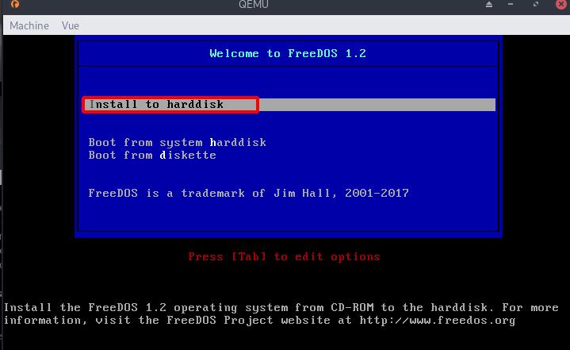{:width="400"}
* Choisissez votre langage et agencement de clavier : **French**  
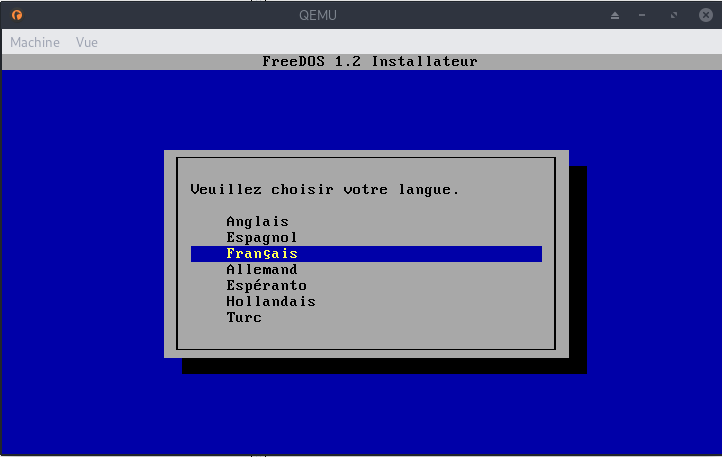{:width="400"}  
* Choisissez la première entrée : **Oui continuer l'installation**  
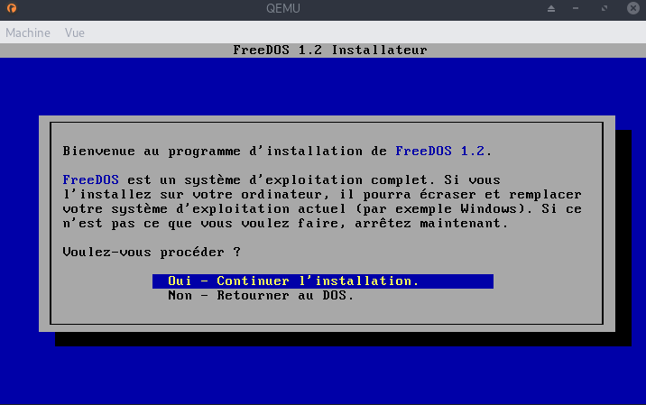{:width="400"}  
* Laissez vous guider   
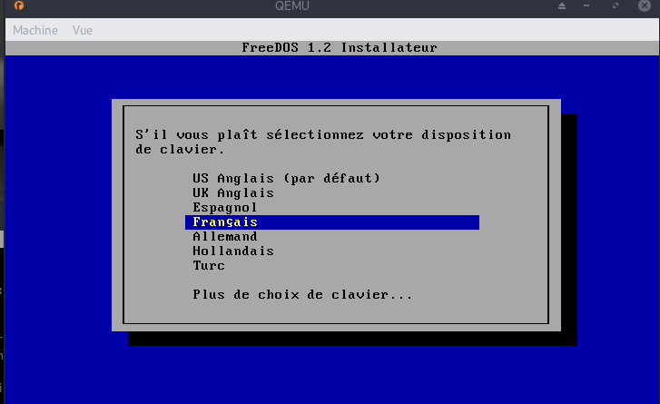{:width="400"}  
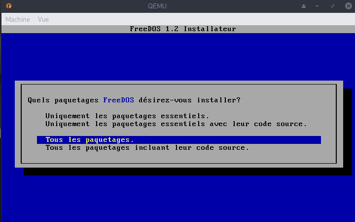{:width="400"}  
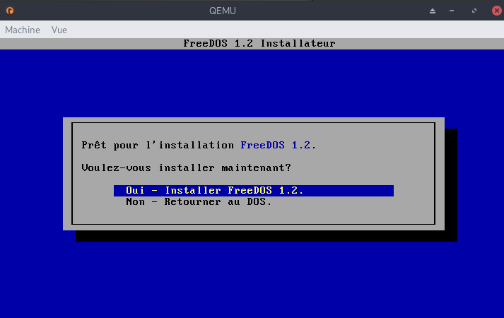{:width="400"}  
Patientez...  
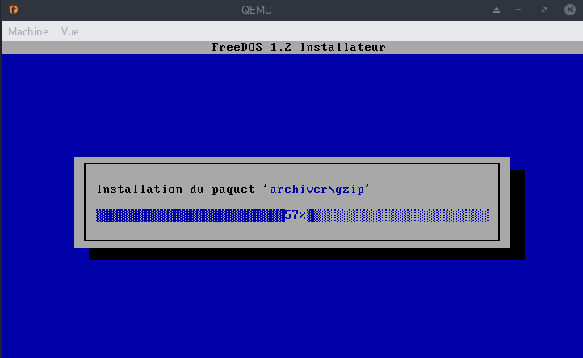{:width="400"}  

>**NE REDÉMARREZ PAS** (touche **N**) et suivez la suite du tutoriel.  
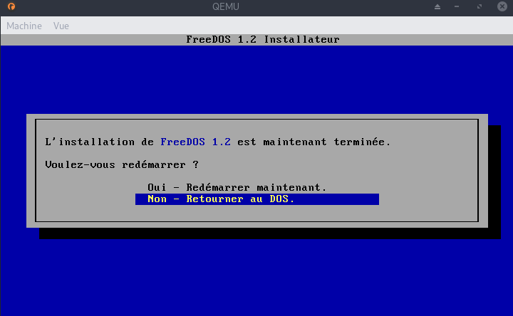{:width="400"}  

### Créez un secteur de d'amorçage 

Toujours dans Qemu que vous n'avez pas fermé, créez un secteur de d'amorçage : `fdisk /mbr 1`

### Modifiez le fichier fdconfig.sys 

Toujours dans Qemu : 

1. Retournez à la racine du lecteur `cd \`
1. Éditez le fichier fdconfig.sys `edit fdconfig.sys`
1. Ajouter **1234?** au début de la ligne n°22 commençant par **SHELLHIGH=C:\** pour obtenir un résultat similaire (peut varier selon les version de FreeDOS) **1234?SHELLHIGH=C:\FDOS\bin\command.com C:\FDOS\bin /E:1024 /P=C:\FDOS\fdauto.bat**  
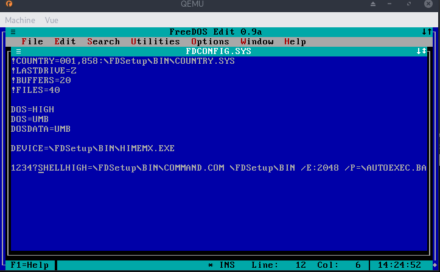{:width="400"}  
1. Sauvegardez le fichier avec la combinaison de touche **Ctrl+S** ;
1. Quittez l'édition avec la combinaison de touche **Alt+X** ;
1. Quittez Qemu.

### Vérification 

Avant de démarrer, vous pouvez tester votre clé avec Qemu : `sudo qemu-system-x86_64 -hda /dev/sde -boot c`  
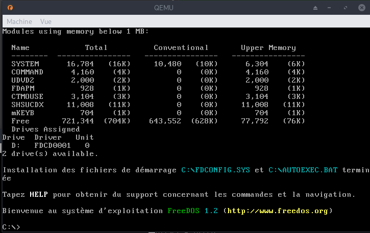{:width="400"}  
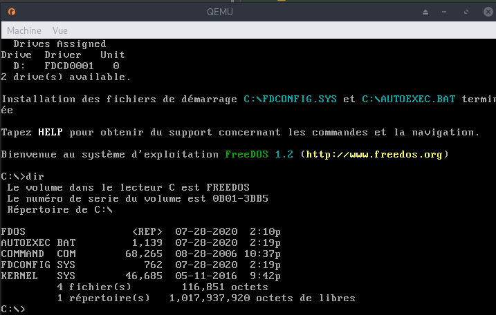{:width="400"}  

Les fichiers et dossiers que vous ajouterez sur votre clé seront accessibles dans le lecteur A: rendant possible, par exemple, la mise à jour d'un BIOS.

>Si lors du démarrage de FreeDOS en condition réelle (c-a-d pas avec Qemu mais sur le PC cible), vous avez une erreur du genre:
**Bad or missing Command Interpreter: C:\FDOS\bin\command.com C:\FDOS\bin /E:1024 /P=C:\autoexec.bat**
Il se peut que la clé USB soit montée lors du boot sur ce PC cible comme un lecteur A:\ alors que les commandes contenues dans FDCONFIG.SYS et AUTOEXEC.BAT pointent vers un lecteur C:\ inexistant. Pour corriger ce problème, il suffit de modifier ces 2 fichiers sur la clé USB (à l'aide de gedit par exemple) et de remplacer toutes les occurrences "C:\" par "A:\".

