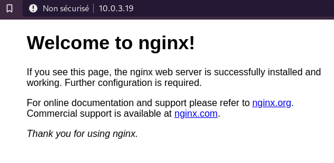

+++
title = 'Nginx reverse proxy + SSL (certbot)'
date = 2020-10-21 00:00:00 +0100
categories = nginx
+++
*Mise en place reverse proxy nginx +  SSL sous linux Debian*


## Reverse proxy nginx

Un proxy inverse est un serveur qui traite le trafic entrant et répond avec des données que ce proxy récupère à partir d'une ou plusieurs instances situées dans son propre réseau local.  
Considérez le reverse proxy comme le pont vers l'île qui est votre environnement applicatif.

*    Instance - un ordinateur optimisé fonctionnant généralement sous Linux et disponible dans le réseau local de votre environnement applicatif.

Utilisation

*    Équilibrage de la charge - distribuer le trafic entrant sur plusieurs ressources de serveur pour améliorer les performances.
*    Accélération Web - compression des données entrantes et sortantes, ainsi que mise en cache du contenu couramment demandé pour accélérer le flux de trafic.
*    Sécurité - protégez l'identité de vos machines dorsales. Configurez le SSL pour servir votre application web via HTTPS

Nous utiliserons nginx pour mettre en place notre reverse proxy sur une instance fonctionnant sous Linux Debian

Nous allons configurer un système de reverse proxy très simple. Notre environnement d'application fictif comporte deux instances importantes : l'instance de reverse proxy et l'instance cible qui exécute quelque chose (par exemple une application) sur le port 3000. Nous voulons pouvoir accéder à cette application via le reverse proxy lorsque nous naviguerons vers notre domaine fictif www.example.com. Commençons !

### 1-Installer nginx

Assurez-vous que l'instance que vous configurez pour agir comme mandataire inverse est configurée pour autoriser le trafic HTTP. SSH dans votre instance de reverse proxy et exécutez les commandes suivantes :

    sudo apt update
    sudo apt upgrade
    sudo apt install nginx

Lorsque vous naviguez vers l'adresse IP publique de l'instance de reverse proxy à l'aide de votre navigateur web, vous devriez voir un message de bienvenue comme celui-ci :  


Quelques commandes de fonctionnement de base

    sudo systemctl start nginx
    sudo systemctl stop nginx
    sudo systemctl restart nginx
    sudo systemctl status nginx

### 2-Configurer les routes

L'emplacement des fichiers de configuration nginx pour les sites: `/etc/nginx/sites-available/`

Les fichiers contenant les règles de routage vont dans le dossier `sites-available/`.   
Pour activer ces règles, vous devez créer un lien symbolique de ces fichiers vers le dossier `sites-enabled/`.  
Par défaut, cela a déjà été fait pour vous avec le fichier **default**. Ce fichier contient quelques exemples de règles de configuration. Nous n'en aurons pas besoin, alors n'hésitez pas à supprimer tout ce qui se trouve dans le fichier par défaut. Ajoutez les lignes suivantes au fichier **default** :

    /etc/nginx/sites-available/default

```
server {
    listen 80;
    listen [::]:80;    
    server_name example.com www.example.com;    
    location / {
        proxy_pass http://10.0.3.19:4000;
        proxy_http_version 1.1;
        proxy_set_header Upgrade $http_upgrade;
        proxy_set_header Connection 'upgrade';
        proxy_set_header Host $host;
        proxy_cache_bypass $http_upgrade;
    }
}
```

Vous pouvez ajouter plusieurs fichiers de configuration, un fichier de configuration peut contenir plusieurs blocs de `server {}`, un bloc de serveur peut contenir plusieurs blocs d'emplacement `{}`.

Remplacez les paramètres suivants par les vôtres :

*    **example.com www.example.com** ajouter tous les domaines qui devront être gérés
*    **10.0.3.19** insérer l'adresse IP locale de la machine vers laquelle les domaines que vous avez choisis doivent être redirigés
*    **4000** insérez le port où votre application sera exécutée

Testez votre configuration nginx et rechargez pour activer les changements.

    sudo nginx -t
    sudo systemctl reload nginx

>**Important** - N'oubliez pas de faire pointer les enregistrements A de votre domaine vers l'adresse IP publique du reverse proxy configuré. Selon votre fournisseur DNS, la mise à jour des enregistrements A peut prendre un certain temps.

Lorsque vous naviguez vers votre domaine, le proxy répondra avec l'application s'exécutant sur l'instance cible interne.

## Mettre en place un SSL nginx sur Linux

Le HTTPS est la voie à suivre pour les applications web de nos jours. Mais les tracas de la mise en place, du renouvellement, du paiement, ... cela peut être une véritable galère. Voici Let's Encrypt, une autorité de certification gratuite, automatisée et ouverte, fournie par l'Internet Security Research Group (ISRG). Elle héberge les membres du conseil d'administration/conseillers de plusieurs grandes entreprises de l'internet comme Google et Mozilla.

Dans ce guide, nous utiliserons certbot pour gérer automatiquement et gratuitement les certificats SSL nécessaires, sur le proxy inverse de notre guide précédent. Nous serons ainsi en mesure de servir l'ensemble de notre application web par HTTPS.

### 1. Installer certbot

    sudo apt-get install python-certbot-nginx -t stretch-backports

### 2. Demande de certificat

SSH dans le serveur sur lequel vous voulez activer le SSL, dans notre cas notre serveur de proxy inverse. Modifiez le fichier de configuration nginx pour votre domaine, dans notre cas :

    cd /etc/nginx/sites-available/
    sudo nano default 

http://www.example.com/.well-known est le lieu où Let's Encrypt cherchera les réponses à leurs défis.  
Ajoutez les lignes marquées en gras pour diriger les demandes vers cette url vers le bon chemin.

```
server {
    listen 80;
    listen [::]:80;
    server_name example.com www.example.com;
    
    location /.well-known {
        alias /var/www/example.com/.well-known;
    }

    # subsequent rules
}
``` 
    
Recharger nginx

    sudo systemctl reload nginx

Demander un certificat en utilisant certbot

    sudo certbot certonly --webroot -w /var/www/example.com/ -d example.com -d www.example.com
    
Les dossiers demandés sont dans `/etc/letsencrypt/live/example.com/`

### 3. Configurer nginx

Ajustez votre fichier de configuration nginx, dans notre cas `/etc/nginx/sites-available/default`

```
server {
    listen 443 ssl http2;
    listen [::]:443 ssl http2;
    server_name example.com www.example.com;
    ssl_certificate /etc/letsencrypt/live/example.com/fullchain.pem;
    ssl_certificate_key /etc/letsencrypt/live/example.com/privkey.pem;
    ssl_stapling on;
    ssl_stapling_verify on;
    add_header Strict-Transport-Security "max-age=31536000";
    access_log /var/log/nginx/sub.log combined;
    location /.well-known {
        alias /var/www/example.com/.well-known;
    }
    location / {
        # reverse proxy commands
    }
}
```

>Note - Nous avons utilisé le protocole http2 dans les deux premières lignes de configuration du serveur. Il nécessite la version nginx >= 1.9.5 ; si ce n'est pas le cas, vous pouvez remplacer http2 par http.

Testez votre configuration nginx et rechargez pour activer les changements.

    sudo nginx -t
    sudo systemctl reload nginx

### 4. Renouvelez automatiquement votre certificat

Nous allons utiliser un cronjob pour effectuer des contrôles quotidiens pour renouveler les certificats de plus de 60 jours. sudo nano /etc/crontab et ajouter la ligne suivante :

`20 4 * * * root certbot renew --quiet --renew-hook "systemctl reload nginx"`

Chaque jour à 04:20 cron, en tant qu'utilisateur root, dira à certbot de renouveler tous les certificats de plus de 60 jours et de recharger la configuration nginx lors du renouvellement.
Pour tester si le renouvellement fonctionnera, lancez ceci :

Pour forcer manuellement un renouvellement, exécutez ceci :

    sudo certbot --dry-run renew 

>Note - Soyez conscient des [limites du taux de renouvellement crypté](https://letsencrypt.org/docs/rate-limits/)

### 5. Rediriger HTTP vers HTTPS (facultatif)

Ajouter le bloc de serveur suivant avant le bloc de serveur actuel dans votre fichier de configuration nginx, dans notre cas `/etc/nginx/sites-available/default`

```
server {
    listen 80;
    listen [::]:80;
    server_name example.com;
    return 301 https://$host$request_uri;
}
```

Testez votre configuration nginx et rechargez pour activer les changements.

    sudo nginx -t
    sudo systemctl reload nginx

Lorsque vous naviguerez sur https://www.example.com, une connexion sécurisée sera établie et (en option) les requêtes HTTP seront redirigées vers HTTPS.
