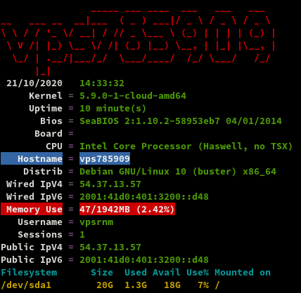
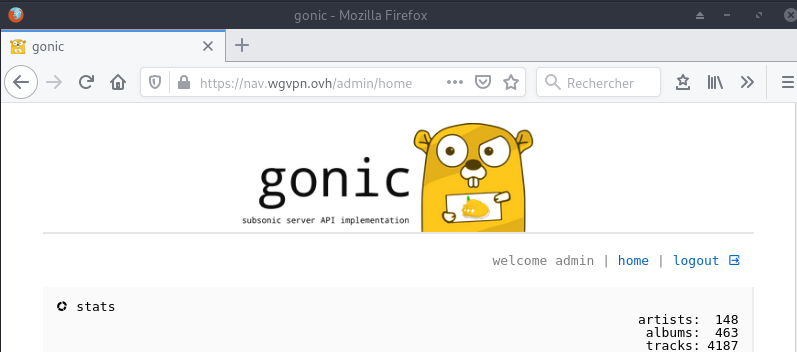
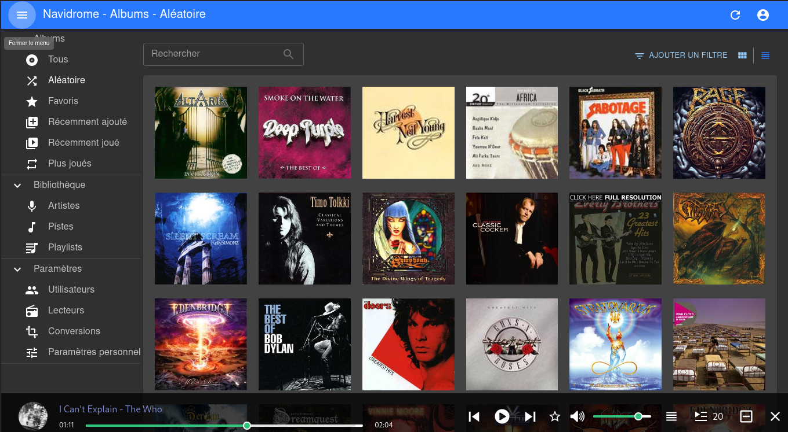
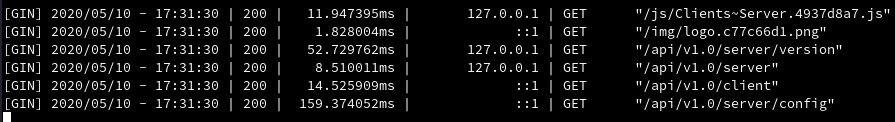
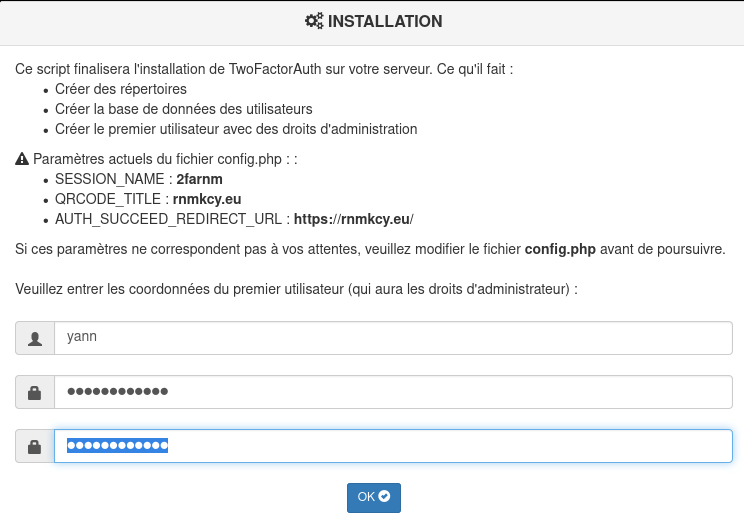
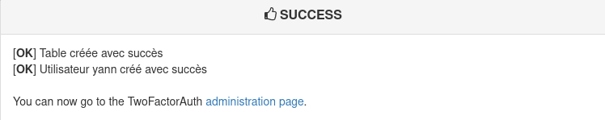
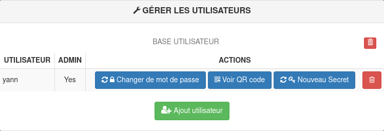
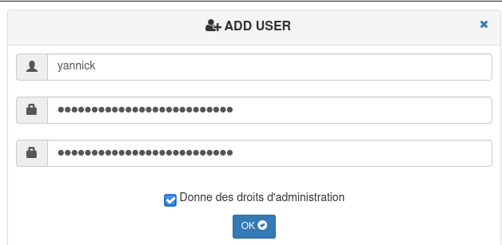
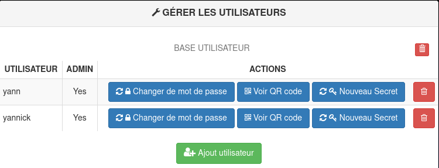
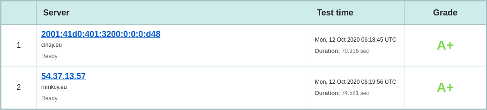

+++
title = 'vps785909 debian 10 - audio - wireguard - rnmkcy.eu (INACTIF)'
date = 2020-10-21 00:00:00 +0100
categories = vps serveur
+++
*OVH vps785909 (1 vCore/2GoRam/20GoSSD) Debian Buster*

# {:width="80"}  Serveur vps785909 

## {:width="100"} Debian 10

PARAMETRES D'ACCES:  
L'adresse IPv4 du VPS est : 54.37.13.57  
L'adresse IPv6 du VPS est : 2001:41d0:401:3200:0:0:0:d48  

Le nom du VPS est : vps785909.ovh.net  
Connexion SSH en "root" ( jHeW45mA )

    ssh root@54.37.13.57

### Installer noyau 5.6+

    echo "deb http://deb.debian.org/debian/ unstable main" | sudo tee /etc/apt/sources.list.d/unstable-wireguard.list
    printf 'Package: *\nPin: release a=unstable\nPin-Priority: 90\n' | sudo tee /etc/apt/preferences.d/limit-unstable
    apt update && apt upgrade

Rechercher l'image
    
    apt search linux-image-5
    apt install linux-image-5.8.0-2-cloud-amd64

### {:width="80"} Réseau 

Créer un bash pour désactiver l'initialisation réseau par le cloud sur le VPS OVH  

    nano initres.sh

```
#!/bin/bash
#
# To disable cloud-init's network configuration capabilities, write a file
# /etc/cloud/cloud.cfg.d/99-disable-network-config.cfg with the following:
# network: {config: disabled}
#
#Création du fichier **/etc/cloud/cloud.cfg.d/99-disable-network-config.cfg** en mode su
echo "network: {config: disabled}" > /etc/cloud/cloud.cfg.d/99-disable-network-config.cfg
#
# Effacerle fichier /etc/network/interfaces  
rm /etc/network/interfaces
# Recréer le fichier /etc/network/interfaces
cat > /etc/network/interfaces << EOF
auto lo
iface lo inet loopback

auto eth0
iface eth0 inet dhcp
iface eth0 inet6 static
 address 2001:41d0:401:3200:0:0:0:d48
 netmask 128
 post-up /sbin/ip -6 route add 2001:41d0:0401:3200:0000:0000:0000:0001 dev eth0
 post-up /sbin/ip -6 route add default via 2001:41d0:0401:3200:0000:0000:0000:0001 dev eth0
 pre-down /sbin/ip -6 route del default via 2001:41d0:0401:3200:0000:0000:0000:0001 dev eth0
 pre-down /sbin/ip -6 route del 2001:41d0:0401:3200:0000:0000:0000:0001 dev eth0
EOF
#
# Configuration OVH à modifier /etc/cloud/cloud.cfg 
sed -i 's/preserve_hostname: false/preserve_hostname: true/g' /etc/cloud/cloud.cfg
sed -i 's/manage_etc_hosts: true/manage_etc_hosts: false/g' /etc/cloud/cloud.cfg
#
# Redémarrage de la machine
systemctl reboot

```

Droits et exécution

    chmod +x initres.sh && ./initres.sh

Patienter quelques minutes avant la reconnexion...


```
54.37.13.57
2001:41d0:401:3200:0:0:0:d48
2001:41d0:0401:3200:0000:0000:0000:0001
```

Se connecter en root via SSH  

    ssh root@54.37.13.57

Vérifier le réseau `ip a` et noyau `uname -r`

```
1: lo: <LOOPBACK,UP,LOWER_UP> mtu 65536 qdisc noqueue state UNKNOWN group default qlen 1000
    link/loopback 00:00:00:00:00:00 brd 00:00:00:00:00:00
    inet 127.0.0.1/8 scope host lo
       valid_lft forever preferred_lft forever
    inet6 ::1/128 scope host 
       valid_lft forever preferred_lft forever
2: eth0: <BROADCAST,MULTICAST,UP,LOWER_UP> mtu 1500 qdisc pfifo_fast state UP group default qlen 1000
    link/ether fa:16:3e:61:4e:9a brd ff:ff:ff:ff:ff:ff
    inet 54.37.13.57/32 brd 54.37.13.57 scope global dynamic eth0
       valid_lft 86304sec preferred_lft 86304sec
    inet6 2001:41d0:401:3200::d48/128 scope global 
       valid_lft forever preferred_lft forever
    inet6 fe80::f816:3eff:fe61:4e9a/64 scope link 
       valid_lft forever preferred_lft forever
```

Linux vps785909 5.8.0-2-cloud-amd64 #1 SMP Debian 5.8.10-1 (2020-09-19) x86_64 GNU/Linux  
Fuseau **Europe/Paris** : `dpkg-reconfigure tzdata`  

### {:width="30"} Domaine rnmkcy.eu

Zone dns OVH

```
$TTL 3600
@	IN SOA dns20.ovh.net. tech.ovh.net. (2020022809 86400 3600 3600000 300)
        IN NS     ns20.ovh.net.
        IN NS     dns20.ovh.net.
        IN A      54.37.13.57
        IN AAAA   2001:41d0:401:3200:0:0:0:d48
```

Reverse DNS sur "server" , IP 54.37.13.57 &rarr; rnmkcy.eu 

Hostname

    hostnamectl set-hostname rnmkcy.eu

```
   Static hostname: rnmkcy.eu
         Icon name: computer-vm
           Chassis: vm
        Machine ID: 0ef30511d74646618d92e464efb187ce
           Boot ID: 324a20f68c0e450cb9a0cfba56ecb180
    Virtualization: kvm
  Operating System: Debian GNU/Linux 10 (buster)
            Kernel: Linux 5.8.0-2-cloud-amd64
      Architecture: x86-64
```


### Création utilisateur

Utilisateur **vpsrnm**  

    useradd -m -d /home/vpsrnm/ -s /bin/bash vpsrnm

Mot de passe **vpsrnm**  

    passwd vpsrnm 

Visudo pour les accès root via utilisateur **vpsrnm**  

    echo "vpsrnm     ALL=(ALL) NOPASSWD: ALL" >> /etc/sudoers

Changer le mot de passe root

    passwd root


### {:width=80"} OpenSSH, clé et script

**connexion avec clé**  
<u>sur l'ordinateur de bureau</u>
Générer une paire de clé curve25519-sha256 (ECDH avec Curve25519 et SHA2) nommé **kvm-cinay** pour une liaison SSH avec le serveur KVM.  

    ssh-keygen -t ed25519 -o -a 100 -f ~/.ssh/kvm-vps785909

Envoyer la clé publique sur le serveur KVM   

    scp ~/.ssh/kvm-vps785909.pub vpsrnm@54.37.13.57:/home/vpsrnm/

<u>sur le serveur KVM</u>
On se connecte  

    ssh vpsrnm@54.37.13.57

Copier le contenu de la clé publique dans /home/$USER/.ssh/authorized_keys  

    cd ~

Sur le KVM ,créer un dossier .ssh  

```bash
mkdir .ssh
cat $HOME/kvm-vps785909.pub >> $HOME/.ssh/authorized_keys
chmod 600 $HOME/.ssh/authorized_keys  # donner les droits
rm $HOME/kvm-vps785909.pub  # effacer le fichier de la clé  
```

Modifier la configuration serveur SSH  

    sudo nano /etc/ssh/sshd_config  # attention aux 2 dernières lignes

Modifier

```conf
Port 55034
PasswordAuthentication no    # avant dernière ligne
PermitRootLogin no           # dernière ligne
```

<u>session SSH ne se termine pas correctement lors d'un "reboot" à distance</u>  
Si vous tentez de **redémarrer/éteindre** une machine distance par **ssh**, vous pourriez constater que votre session ne se termine pas correctement, vous laissant avec un terminal inactif jusqu'à l'expiration d'un long délai d'inactivité. Il existe un bogue 751636 à ce sujet. Pour l'instant, la solution de contournement à ce problème est d'installer :  

    sudo apt install libpam-systemd  # installé par défaut sur debian buster

cela terminera la session ssh avant que le réseau ne tombe.  
Veuillez noter qu'il est nécessaire que PAM soit activé dans sshd.  

Relancer openSSH  

    sudo systemctl restart sshd

Accès depuis le poste distant avec la clé privée  

    ssh -p 55034 -i ~/.ssh/kvm-vps785909 vpsrnm@54.37.13.57


### Outils, scripts motd et ssh_rc_bash

Installer utilitaires  

    sudo apt install rsync curl tmux jq figlet git dnsutils tree -y


Motd

    sudo rm /etc/motd && sudo nano /etc/motd

```
                 ____  ___  ___  ___   __   ___  
 __ __ _ __  ___|__  |( _ )| __|/ _ \ /  \ / _ \ 
 \ V /| '_ \(_-<  / / / _ \|__ \\_, /| () |\_, / 
  \_/ | .__//__/ /_/ _\___/|___/ /_/  \__/  /_/  
  _ _ |_|__   _ __  | |__ __  _  _     ___  _  _ 
 | '_|| '  \ | '  \ | / // _|| || | _ / -_)| || |
 |_|  |_|_|_||_|_|_||_\_\\__| \_, |(_)\___| \_,_|
                              |__/               
```


Script **ssh_rc_bash**  
>**ATTENTION!!! Les scripts sur connexion peuvent poser des problèmes pour des appels externes autres que ssh**

    wget https://static.xoyaz.xyz/files/ssh_rc_bash
    chmod +x ssh_rc_bash # rendre le bash exécutable
    ./ssh_rc_bash        # exécution




### Certificats {:width="100"}

Installer acme: [Serveur , installer et renouveler les certificats SSL Let's encrypt via Acme](https://blog.cinay.xyz/2017/08/Acme-Certficats-Serveurs/)  

    cd ~
    sudo apt install socat -y # prérequis
    git clone https://github.com/Neilpang/acme.sh.git
    cd acme.sh
    ./acme.sh --install # se déconnecter pour prise en compte
    # export des clé API OVH

Générer les certificats pour le domaine rnmkcy.eu

    acme.sh --dns dns_ovh --ocsp --issue --keylength ec-384 -d 'rnmkcy.eu' -d 'wg.rnmkcy.eu' -d 'zic.rnmkcy.eu'

```
[dimanche 11 octobre 2020, 11:56:26 (UTC+0200)] Your cert is in  /home/vpsrnm//.acme.sh/rnmkcy.eu_ecc/rnmkcy.eu.cer 
[dimanche 11 octobre 2020, 11:56:26 (UTC+0200)] Your cert key is in  /home/vpsrnm//.acme.sh/rnmkcy.eu_ecc/rnmkcy.eu.key 
[dimanche 11 octobre 2020, 11:56:26 (UTC+0200)] The intermediate CA cert is in  /home/vpsrnm//.acme.sh/rnmkcy.eu_ecc/ca.cer 
[dimanche 11 octobre 2020, 11:56:26 (UTC+0200)] And the full chain certs is there:  /home/vpsrnm//.acme.sh/rnmkcy.eu_ecc/fullchain.cer 
```

Les liens avec **/etc/ssl/private** 

```
sudo ln -s /home/vpsrnm//.acme.sh/rnmkcy.eu_ecc/fullchain.cer /etc/ssl/private/rnmkcy.eu-fullchain.pem   # full chain certs
sudo ln -s /home/vpsrnm//.acme.sh/rnmkcy.eu_ecc/rnmkcy.eu.key /etc/ssl/private/rnmkcy.eu-key.pem     # cert key
sudo ln -s /home/vpsrnm//.acme.sh/rnmkcy.eu_ecc/rnmkcy.eu.cer /etc/ssl/private/rnmkcy.eu-chain.pem   # cert domain
sudo ln -s /home/vpsrnm//.acme.sh/rnmkcy.eu_ecc/ca.cer /etc/ssl/private/rnmkcy.eu-ca.pem                 # intermediate CA cert
```


### {:width="50"} Parefeu

*UFW, ou pare - feu simple , est une interface pour gérer les règles de pare-feu dans Arch Linux, Debian ou Ubuntu. UFW est utilisé via la ligne de commande (bien qu'il dispose d'interfaces graphiques disponibles), et vise à rendre la configuration du pare-feu facile (ou simple).*

Installation **Debian / Ubuntu**

    sudo apt-get install ufw

*Par défaut, les jeux de règles d'UFW sont vides, de sorte qu'il n'applique aucune règle de pare-feu, même lorsque le démon est en cours d'exécution.*   

Les règles 

    sudo ufw allow 55034/tcp  # port SSH , 55034
    sudo ufw allow http       # port 80
    sudo ufw allow https      # port 53
    sudo ufw allow DNS        # port 53
    sudo ufw allow 51820/udp  # wireguard

Activer le parefeu

    sudo ufw enable

```
Command may disrupt existing ssh connections. Proceed with operation (y|n)? y
Firewall is active and enabled on system startup
```

Status

     sudo ufw status verbose

```
Status: active
Logging: on (low)
Default: deny (incoming), allow (outgoing), disabled (routed)
New profiles: skip

To                         Action      From
--                         ------      ----
55034/tcp                  ALLOW IN    Anywhere                  
80/tcp                     ALLOW IN    Anywhere                  
443/tcp                    ALLOW IN    Anywhere                  
53 (DNS)                   ALLOW IN    Anywhere                  
51820/udp                  ALLOW IN    Anywhere                  
55034/tcp (v6)             ALLOW IN    Anywhere (v6)             
80/tcp (v6)                ALLOW IN    Anywhere (v6)             
443/tcp (v6)               ALLOW IN    Anywhere (v6)             
53 (DNS (v6))              ALLOW IN    Anywhere (v6)             
51820/udp (v6)             ALLOW IN    Anywhere (v6)             
```

### {:width="70"} Nginx + PHP + MariaDb

[Debian 10 Buster : installer et configurer la dernière version de Nginx et PHP 7.3 FPM](https://www.geek17.com/fr/content/debian-10-buster-installer-et-configurer-la-derniere-version-de-nginx-et-php-73-fpm-105)  

Debian Buster compilation **Nginx** 1.18 + TLSv1.3

```
sudo -s
curl -o compil.sh https://static.xoyaz.xyz/files/debian10-compilation-nginx-tls1.3.sh
chmod +x compil.sh
./compil.sh         # Patienter quelques minutes (5 à 10 suivant CPU)
```

A la fin de la compilation

{:width="60"}  nginx/1.18.0  
 1.1.1d  10 Sep 2019

Debian Buster **PHP 7.3**

```
curl -o compilphp.sh https://static.xoyaz.xyz/files/debian10-php7.3.sh
chmod +x compilphp.sh
./compilphp.sh
```

**ssl headers**  
Configuration nginx , ssl (tls1.2 tls1.3) , Diffie Hellman ,Headers et OCSP  
Diffie-Hellman , générer le fichier dh2048.pem (en mode su):  

    openssl dhparam -out /etc/ssl/private/dh2048.pem -outform PEM -2 2048

Si **DNS ubound** n'est pas installé , relever le résolveur utilisé `cat /etc/resolv.conf` : nameserver 213.186.33.99 


Regroupement dans un fichier **/etc/nginx/ssl_dh_headers_ocsp**

    nano /etc/nginx/ssl_dh_headers_ocsp

```
# /etc/nginx/ssl_dh_headers_ocsp

    ssl_certificate /etc/ssl/private/rnmkcy.eu-fullchain.pem;
    ssl_certificate_key /etc/ssl/private/rnmkcy.eu-key.pem;
    ssl_session_timeout 1d;
    ssl_session_cache shared:MozSSL:10m;  # about 40000 sessions
    ssl_session_tickets off;

    ssl_dhparam /etc/ssl/private/dh2048.pem;

    # intermediate configuration
    ssl_protocols TLSv1.2 TLSv1.3;
    ssl_ciphers ECDHE-ECDSA-AES128-GCM-SHA256:ECDHE-RSA-AES128-GCM-SHA256:ECDHE-ECDSA-AES256-GCM-SHA384:ECDHE-RSA-AES256-GCM-SHA384:ECDHE-ECDSA-CHACHA20-POLY1305:ECDHE-RSA-CHACHA20-POLY1305:DHE-RSA-AES128-GCM-SHA256:DHE-RSA-AES256-GCM-SHA384;
    ssl_prefer_server_ciphers off;

    # Add headers to serve security related headers
    add_header X-Content-Type-Options nosniff;
    add_header X-XSS-Protection "1; mode=block";
    add_header X-Robots-Tag none;
    add_header X-Download-Options noopen;
    add_header X-Permitted-Cross-Domain-Policies none;
    add_header X-Frame-Options "SAMEORIGIN"; 
    add_header Strict-Transport-Security 'max-age=31536000; includeSubDomains;';
    add_header Referrer-Policy "no-referrer" always;

    # OCSP settings
    ssl_stapling on;
    ssl_stapling_verify on;
    ssl_trusted_certificate /etc/ssl/private/rnmkcy.eu-fullchain.pem; 
    resolver 213.186.33.99; # 127.0.0.1 si DNS Unbound installé
```

Configuration de base **/etc/nginx/conf.d/rnmkcy.eu.conf**  
On va renommer le default.conf

    mv /etc/nginx/conf.d/default.conf /etc/nginx/conf.d/rnmkcy.eu.conf
    nano /etc/nginx/conf.d/rnmkcy.eu.conf

```
# /etc/nginx/conf.d/rnmkcy.eu.conf
	##
	# Virtual Host rnmkcy.eu
	##

	server {
	    listen 80;
	    listen [::]:80;
	
	    ## redirect http to https ##
	    server_name rnmkcy.eu;
	    return  301 https://$server_name$request_uri;
	}
	
	server {
	    listen 443 ssl http2;
	    listen [::]:443 ssl http2;
	    server_name rnmkcy.eu;
	
	    ####    Locations
	    # On cache les fichiers statiques
	    location ~* \./|css|js|png|jpg|jpeg|gif|ico|svg|eot|woff|ttf)$ { expires max; }

		location = /favicon.ico {
		  log_not_found off;
		}

	    # On interdit les dotfiles
	    location ~ /\. { deny all; }
	
	    include ssl_dh_headers_ocsp;

	    root /var/www/default-www/ ;
	    index index/ index.php;
	
	        location ~ \.php$ {
	           fastcgi_split_path_info ^(.+\.php)(/.+)$;
	           fastcgi_pass unix:/run/php/php7.4-fpm.sock;   # PHP7.4
	           fastcgi_index index.php;
	           include fastcgi_params;
	    	   fastcgi_param SCRIPT_FILENAME $request_filename;
	        }
	
	    include /etc/nginx/conf.d/rnmkcy.eu.d/*.conf;	
	    access_log /var/log/nginx/rnmkcy.eu-access.log;
	    error_log /var/log/nginx/rnmkcy.eu-error.log;
	}
```

Vérifications et rechargement nginx

    nginx -t

```
nginx: the configuration file /etc/nginx/nginx.conf syntax is ok
nginx: configuration file /etc/nginx/nginx.conf test is successful
```

    systemctl reload nginx

Au premier accès sur le lien on obtient une erreur

{:width="400"}  
Ce problème est lié à la mise en cache ocsp qui ne se fait qu'au premier accès après un rechargement du serveur nginx, on  exécuter un script après rechargement pour la mise en cache OCSP

    sudo nano /usr/local/bin/ocsp_cache

```
#! /bin/sh

# ocsp_cache

# $1 domaine passé en paramètre
echo "Premier passage"
for fichier in /etc/nginx/conf.d/*$1.conf
do
    echo $(basename $fichier .${fichier##*.})
    openssl s_client -connect $(basename $fichier .${fichier##*.}):443 -status < /dev/null |grep -i ocsp
done
# pause de 1 seconde
sleep 1
echo "Second passage"
for fichier in /etc/nginx/conf.d/*$1.conf
do
    echo $(basename $fichier .${fichier##*.})
    openssl s_client -connect $(basename $fichier .${fichier##*.}):443 -status < /dev/null |grep -i ocsp
done
echo "Fin mise en cache nginx OCSP..."
```

Le rendre exécutable

    sudo chmod +x /usr/local/bin/ocsp_cache

Exécution en mode sans affichage

    ocsp_cache > /dev/null 2>&1

Lien https://rnmkcy.eu

## Go Node Docker

### {:width="40"} Go

Go installation (Debian) , installer la dernière version de Go &rarr; <https://golang.org/dl/>

```bash
cd ~
wget https://golang.org/dl/go1.15.2.linux-amd64.tar.gz
sudo tar -C /usr/local -xzf go1.15.2.linux-amd64.tar.gz
echo "export PATH=$PATH:/usr/local/go/bin"  >> ~/.bashrc
source ~/.bashrc
```

Version

    go version

```
go version go1.15.2 linux/amd64
```

### {:width="40"} Nodejs

Installer la version LTS de nodejs pour le frontend &rarr; <https://github.com/nodesource/distributions#debinstall>

Version **Node.js v14.x** au 11 octobre 2020

```bash
# Using Debian, as root
sudo -s
curl -sL https://deb.nodesource.com/setup_14.x | bash -
apt-get install -y nodejs
```

Version **Node.js LTS (v12.x)** au 11 octobre 2020

```bash
# Using Debian, as root
sudo -s
curl -sL https://deb.nodesource.com/setup_lts.x | bash -
apt-get install -y nodejs
```

Versions

    node --version
        v14.13.1
    npm --version
        6.14.8

### {:width="60"} Docker (Facultatif) 

[Installer docker sur debian 10](/posts/Docker-Debian-Buster/)

Docker compose , version sur <https://github.com/docker/compose/releases>

    sudo curl -L https://github.com/docker/compose/releases/download/1.26.0-rc4/docker-compose-`uname -s`-`uname -m` -o /usr/local/bin/docker-compose
    sudo chmod +x /usr/local/bin/docker-compose
    docker-compose --version

*docker-compose version 1.26.0-rc4, build d279b7a8*

## {:width="50"} SSHFS fstab

Le dossier "musique" est distant (serveur xoyaz.xyz)  
Il faut créer une liaison réseau sécurisée entre **rnmkcy.eu &larr; &rarr; xoyaz.xyz**  
On va utiliser SSHFS (*Secure shell file system (ou SSHFS) permet le partage d'un système de fichiers de manière sécurisée en utilisant le protocole SFTP de SSH*) 

Installation

    sudo apt install sshfs

Autorisations

* Autorisations "utilisateur"
     * Exécuter `sshfs` (ou toute autre commande de montage FUSE) avec l’option `-o allow_other`
* Autoriser l’accès “root” des supports **fuse**
     * Ajouter `user_allow_other` au fichier **/etc/fuse.conf**
     * Exécuter `sshfs` (ou toute autre commande de montage FUSE) avec l’option `-o allow_root`

Clé privée **OVZ-STORAGE-128** pour accéder au serveur xoyaz.xyz

	chmod 600 /home/vpsrnm/.ssh/OVZ-STORAGE-128

**Exécution manuelle** pour authentifier la clé avec utilisateur "debian"

    sudo -s
    mkdir -p /opt/sshfs
    sshfs -o allow_other usernl@xoyaz.xyz:/home/usernl/backup /opt/sshfs -C -p 55036 -oIdentityFile=/home/vpsrnm/.ssh/OVZ-STORAGE-128

```bash
The authenticity of host '[xoyaz.xyz]:55036 ([2a04:52c0:101:82::73db]:55036)' can't be established.
ECDSA key fingerprint is SHA256:NuFqR5id10fVzRLsSTqJ4vBpFnNYi+APGsvPYth6PHw.
Are you sure you want to continue connecting (yes/no)? yes
```

>NOTE: Il faut mettre l'adresse IP du serveur , si les domaines peuvent ne pas être "résolus"

Après vérification , `ls /opt/sshfs` , déconnexion `fusermount -u /opt/sshfs`

**Montage fstab**

ajouter la ligne suivante au fichier **/etc/fstab**

    usernl@xoyaz.xyz:/home/usernl/backup /opt/sshfs fuse.sshfs _netdev,identityfile=/home/vpsrnm/.ssh/OVZ-STORAGE-128,allow_other,port=55036 0 0

Montage pour authentifier la clé avec utilisateur "root"

    sudo mount -a
    
Vérification    

    ls /opt/sshfs

```bash
CalibreTechnique  musique  yunohost.backup.cinay.xyz
```

## Serveur Audio 

### {:width="100"} Gonic

*[Gonic](https://github.com/sentriz/gonic) écrit en go est une alternative à Subsonic.org, accessible par un proxy nginx  
La seule application qui accepte de fonctionner avec répertoires montés par FUSE.* 


#### Caractéristiques

*    la navigation par dossier (en gardant votre arborescence complète intacte)
*    la navigation par balises (à l'aide de [taglib](https://taglib.org/) - supporte mp3, opus, flac, ape, m4a, wav, etc.)
*    transcodage et mise en cache audio à la volée (nécessite [ffmpeg](https://ffmpeg.org/)) (merci spijet)
*    balayage assez rapide (avec ma bibliothèque de ~27k pistes, le balayage initial prend environ 10m, et environ 5s après de manière incrémentielle)
*    plusieurs utilisateurs, chacun ayant ses propres préférences de transcodage, ses listes de lecture, ses meilleures pistes, ses meilleurs artistes, etc.
*    [last.fm](https://www.last.fm/) scrobbling
*    similarités entre les artistes et biographies de la dernière api.fm
*    une interface web pour la configuration (configurer last.fm, gérer les utilisateurs, lancer des analyses, etc.)
*    un support pour le tag album-artist, pour ne pas encombrer votre liste d'artistes avec des apparitions d'albums de compilation
*    écrit en go, donc léger et adapté à un pi framboise, etc.
*    plus récent sel et token auth
*    testé sur [dsub](https://f-droid.org/en/packages/github.daneren2005.dsub/), [jamstash](http://jamstash.com/), [musique sublime](https://gitlab.com/sumner/sublime-music/) et[ ondes sonores](https://apps.apple.com/us/app/soundwaves/id736139596)

#### Installation gonic

dans le répertoire utilisateur **$HOME**

    # les dépendances
    sudo apt install build-essential git sqlite libtag1-dev ffmpeg libasound2-dev pkg-config # for debian like
    cd $HOME/
    # cloner 
    git clone https://gitea.cinay.eu/yann/golang-subsonic.git
    cd golang-subsonic/

Construire l'exécutable "gonic" et le copier dans /usr/local/bin

    ./_do_build_server
    sudo mv gonic /usr/local/bin/   

Créer le dossier pour la base

    sudo mkdir -p /opt/gonic

#### Créer le service gonic

Que fait le service ?

* Le dossier fuse est monté au démarrage par fstab
* lancer le serveur "gonic" en écoute local sur le port 4747 avec les options `-music-path`, `-db-path` et `-proxy-prefix` 
* A l'arrêt,tuer la tâche "gonic" 

Tester le serveur

    sudo -s
    /usr/local/bin/gonic -music-path /opt/sshfs/musique -db-path /opt/gonic/gonic.db -proxy-prefix /

```
2020/10/11 15:26:37 starting gonic v0.11.0
2020/10/11 15:26:37 provided config
2020/10/11 15:26:37     cache-path      /tmp/gonic_cache
2020/10/11 15:26:37     config-path     
2020/10/11 15:26:37     db-path         /opt/gonic/gonic.db
2020/10/11 15:26:37     jukebox-enabled false
2020/10/11 15:26:37     listen-addr     0.0.0.0:4747
2020/10/11 15:26:37     music-path      /opt/sshfs/musique
2020/10/11 15:26:37     proxy-prefix    /
2020/10/11 15:26:37     scan-interval   0
2020/10/11 15:26:37     version         false
2020/10/11 15:26:37 migration (1/7) '202002192100' finished
2020/10/11 15:26:37 migration (2/7) '202002192019' finished
2020/10/11 15:26:37 migration (3/7) '202002192222' finished
2020/10/11 15:26:37 migration (4/7) '202003111222' finished
2020/10/11 15:26:37 migration (5/7) '202003121330' finished
2020/10/11 15:26:37 migration (6/7) '202003241509' finished
2020/10/11 15:26:37 migration (7/7) '202004302006' finished
2020/10/11 15:26:37 starting job 'session clean'
2020/10/11 15:26:37 starting job 'http'
```

Arrêt par Ctrl+C

Chaque service généré par systemd est configuré par un fichier .service qui se trouve dans le répertoire **/etc/systemd/system**

    sudo nano /etc/systemd/system/gonic.service

```
[Unit]
Description=Gonic audio server
After=network.target

[Service]
Type=simple

Restart=on-failure
RestartSec=10

ExecStart=/usr/local/bin/gonic -music-path /opt/sshfs/musique -db-path /opt/gonic/gonic.db -proxy-prefix /

[Install]
WantedBy=multi-user.target
```

Recharger `systemd` puis démarrer le service:

    sudo systemctl daemon-reload
    sudo systemctl start gonic.service

Visualiser le journal

    sudo journalctl -t gonic
    
```
-- Logs begin at Sun 2020-10-11 14:19:55 CEST, end at Sun 2020-10-11 15:27:54 CEST. --
oct. 11 15:27:41 rnmkcy.eu gonic[6432]: 2020/10/11 15:27:41 starting gonic v0.11.0
oct. 11 15:27:41 rnmkcy.eu gonic[6432]: 2020/10/11 15:27:41 provided config
oct. 11 15:27:41 rnmkcy.eu gonic[6432]: 2020/10/11 15:27:41     cache-path      /tmp/gonic_cache
oct. 11 15:27:41 rnmkcy.eu gonic[6432]: 2020/10/11 15:27:41     config-path
oct. 11 15:27:41 rnmkcy.eu gonic[6432]: 2020/10/11 15:27:41     db-path         /opt/gonic/gonic.db
oct. 11 15:27:41 rnmkcy.eu gonic[6432]: 2020/10/11 15:27:41     jukebox-enabled false
oct. 11 15:27:41 rnmkcy.eu gonic[6432]: 2020/10/11 15:27:41     listen-addr     0.0.0.0:4747
oct. 11 15:27:41 rnmkcy.eu gonic[6432]: 2020/10/11 15:27:41     music-path      /opt/sshfs/musique
oct. 11 15:27:41 rnmkcy.eu gonic[6432]: 2020/10/11 15:27:41     proxy-prefix    /
oct. 11 15:27:41 rnmkcy.eu gonic[6432]: 2020/10/11 15:27:41     scan-interval   0
oct. 11 15:27:41 rnmkcy.eu gonic[6432]: 2020/10/11 15:27:41     version         false
oct. 11 15:27:42 rnmkcy.eu gonic[6432]: 2020/10/11 15:27:42 starting job 'session clean'
oct. 11 15:27:42 rnmkcy.eu gonic[6432]: 2020/10/11 15:27:42 starting job 'http'
```
    
Si tout est en ordre , on active le service

	sudo systemctl enable gonic.service
	
#### dns OVH - CNAME zic

Il faut ajouter le CNAME zic au domaine rnmkcy.eu

```
zic        IN CNAME  rnmkcy.eu.
```

#### Proxy nginx zic.rnmkcy.eu

*Gonic est un serveur local http sur le port 4747 et pour un accès externe il nous faut un proxy* 

**Proxy nginx** - configuration	**/etc/nginx/conf.d/zic.rnmkcy.eu.conf**

```
# /etc/nginx/conf.d/zic.rnmkcy.eu.conf	
##
# Virtual Host zic.rnmkcy.eu
##

server {
    listen 80;
    listen [::]:80;
	
    ## redirect http to https ##
    server_name zic.rnmkcy.eu;
    return  301 https://$server_name$request_uri;
}
	
server {
    listen 443 ssl http2;
    listen [::]:443 ssl http2;
    server_name zic.rnmkcy.eu;

    include ssl_dh_headers_ocsp;

    access_log            /var/log/nginx/zic.rnmkcy.eu.log;

    proxy_request_buffering off;
    proxy_buffering off;
    proxy_buffer_size 4k;

    # Proxy audio gonic server
    location / {

      proxy_set_header        Host $host;
      proxy_set_header        X-Real-IP $remote_addr;
      proxy_set_header        X-Forwarded-For $proxy_add_x_forwarded_for;
      proxy_set_header        X-Forwarded-Proto $scheme;

      proxy_pass          http://localhost:4747;
      proxy_read_timeout  120;
    }
	
}
```

On vérifie et on relance le serveur nginx

    sudo nginx -t
    sudo systemctl reload nginx

Accès <https://zic.rnmkcy.eu>

{:width="400"}

### Navidrome

[Navidrome](https://www.navidrome.org/docs/installation/pre-built-binaries/)

Créer les répertoires

```
sudo install -d -o debian -g debian /opt/navidrome
sudo install -d -o debian -g debian /var/lib/navidrome
```

La [dernière version](https://github.com/deluan/navidrome/releases) 

```
wget https://github.com/deluan/navidrome/releases/download/v0.35.1/navidrome_0.35.1_Linux_x86_64.tar.gz -O Navidrome.tar.gz
sudo tar -xvzf Navidrome.tar.gz -C /opt/navidrome/
sudo chown -R debian:debian /opt/navidrome
```

Créer le fichier de configuration `/var/lib/navidrome/navidrome.toml`

    MusicFolder = "/opt/sshfs/musique"

Créer un service `/etc/systemd/system/navidrome.service`

```
[Unit]
Description=Navidrome Music Server and Streamer compatible with Subsonic/Airsonic
After=remote-fs.target network.target
AssertPathExists=/var/lib/navidrome

[Install]
WantedBy=multi-user.target

[Service]
User=debian
Group=debian
Type=simple
ExecStart=/opt/navidrome/navidrome --configfile "/var/lib/navidrome/navidrome.toml"
WorkingDirectory=/var/lib/navidrome
TimeoutStopSec=20
KillMode=process
Restart=on-failure

# See https://www.freedesktop.org/software/systemd/man/systemd.exec/
DevicePolicy=closed
NoNewPrivileges=yes
PrivateTmp=yes
PrivateUsers=yes
ProtectControlGroups=yes
ProtectKernelModules=yes
ProtectKernelTunables=yes
RestrictAddressFamilies=AF_UNIX AF_INET AF_INET6
RestrictNamespaces=yes
RestrictRealtime=yes
SystemCallFilter=~@clock @debug @module @mount @obsolete @reboot @setuid @swap
ReadWritePaths=/var/lib/navidrome

# You can uncomment the following line if you're not using the jukebox This
# will prevent navidrome from accessing any real (physical) devices
#PrivateDevices=yes

# You can change the following line to `strict` instead of `full` if you don't
# want navidrome to be able to write anything on your filesystem outside of
# /var/lib/navidrome.
ProtectSystem=full

# You can comment the following line if you don't have any media in /home/*.
# This will prevent navidrome from ever reading/writing anything there.
#ProtectHome=true

```

Démarrer le service

```
sudo systemctl daemon-reload
sudo systemctl start navidrome.service
```

Le status

    sudo systemctl status navidrome.service

```
● navidrome.service - Navidrome Music Server and Streamer compatible with Subsonic/Airsonic
   Loaded: loaded (/etc/systemd/system/navidrome.service; disabled; vendor preset: enabled)
   Active: active (running) since Sun 2020-10-11 16:19:57 CEST; 1s ago
 Main PID: 6676 (navidrome)
    Tasks: 5 (limit: 2312)
   Memory: 9.1M
   CGroup: /system.slice/navidrome.service
           └─6676 /opt/navidrome/navidrome --configfile /var/lib/navidrome/navidrome.toml

oct. 11 16:19:57 rnmkcy.eu navidrome[6676]: time="2020-10-11T16:19:57+02:00" level=info msg="Configuring Media Folder" name="Music Library" path=/opt/sshfs/musique
oct. 11 16:19:57 rnmkcy.eu navidrome[6676]: time="2020-10-11T16:19:57+02:00" level=info msg="Creating Image cache" maxSize="100 MB" path=cache/images
oct. 11 16:19:57 rnmkcy.eu navidrome[6676]: time="2020-10-11T16:19:57+02:00" level=info msg="Creating Transcoding cache" maxSize="100 MB" path=cache/transcoding
oct. 11 16:19:57 rnmkcy.eu navidrome[6676]: time="2020-10-11T16:19:57+02:00" level=warning msg="Running initial setup"
oct. 11 16:19:57 rnmkcy.eu navidrome[6676]: time="2020-10-11T16:19:57+02:00" level=warning msg="Creating JWT secret, used for encrypting UI sessions"
oct. 11 16:19:58 rnmkcy.eu navidrome[6676]: time="2020-10-11T16:19:58+02:00" level=info msg="Starting scanner" interval=1m0s
oct. 11 16:19:58 rnmkcy.eu navidrome[6676]: time="2020-10-11T16:19:58+02:00" level=info msg="Mounting routes" path=/rest
oct. 11 16:19:58 rnmkcy.eu navidrome[6676]: time="2020-10-11T16:19:58+02:00" level=info msg="Mounting routes" path=/app
oct. 11 16:19:58 rnmkcy.eu navidrome[6676]: time="2020-10-11T16:19:58+02:00" level=info msg="Login rate limit set" requestLimit=5 windowLength=20s
oct. 11 16:19:58 rnmkcy.eu navidrome[6676]: time="2020-10-11T16:19:58+02:00" level=info msg="Navidrome server is accepting requests" address="0.0.0.0:4533"
```

#### dns OVH - CNAME navi

Il faut ajouter le CNAME navi au domaine rnmkcy.eu

```
navi        IN CNAME  rnmkcy.eu.
```

#### Proxy nginx navi.rnmkcy.eu

*Navidrome est un serveur local http sur le port 4533 et pour un accès externe il nous faut un proxy* 

**Proxy nginx** - configuration	**/etc/nginx/conf.d/navi.rnmkcy.eu.conf**

```
# /etc/nginx/conf.d/navi.rnmkcy.eu.conf	
##
# Virtual Host navi.rnmkcy.eu
##

server {
    listen 80;
    listen [::]:80;
	
    ## redirect http to https ##
    server_name navi.rnmkcy.eu;
    return  301 https://$server_name$request_uri;
}
	
server {
    listen 443 ssl http2;
    listen [::]:443 ssl http2;
    server_name navi.rnmkcy.eu;

    include ssl_dh_headers_ocsp;

    access_log            /var/log/nginx/navi.rnmkcy.eu.log;

    proxy_request_buffering off;
    proxy_buffering off;
    proxy_buffer_size 4k;

    # Proxy audio gonic server
    location / {

      proxy_set_header        Host $host;
      proxy_set_header        X-Real-IP $remote_addr;
      proxy_set_header        X-Forwarded-For $proxy_add_x_forwarded_for;
      proxy_set_header        X-Forwarded-Proto $scheme;

      proxy_pass          http://localhost:4533;
      proxy_read_timeout  120;
    }
	
}
```

On vérifie et on relance le serveur nginx

    sudo nginx -t
    sudo systemctl reload nginx

Accès <https://navi.rnmkcy.eu>

{:width="400"}

## Wireguard

*WireGuard est un serveur VPN à code source ouvert, gratuit, moderne et rapide, doté d'une cryptographie de pointe. Il est plus rapide et plus simple que l'IPSec et l'OpenVPN*

### Installer wireguard

Wireguard est dans le noyau 5.6+

    apt install wireguard

**Générer une paire de clés**

On se positionne dans le dossier **/etc/wireguard/**  

    cd /etc/wireguard

WireGuard repose sur une authentification par clé publique/privée (cryptographie asymétrique), vous devez donc créer ces clés avec les sous-commandes wg genkey et wg pubkey  
La création de la clé privée se fait avec wg genkey et la clé publique est générée en la canalisant dans wg pubkey

    umask 077; wg genkey | tee vps785909-private.key | wg pubkey > vps785909-public.key

**Autoriser le serveur Wireguard à relayer les paquets **

Autoriser le serveur Wireguard à relayer les paquets venant de ces clients vers l'internet et de traiter les paquets retours (modifier **/etc/sysctl.conf**)

    sed -i 's/^#net.ipv4.ip_forward=1/net.ipv4.ip_forward=1/' /etc/sysctl.conf
    sed -i 's/^#net.ipv6.conf.all.forwarding=1/net.ipv6.conf.all.forwarding=1/' /etc/sysctl.conf
    sysctl -p # prise en compte immédiate


**Fichier de configuration /etc/wireguard/wg0.conf**

Récupérer le nom de la carte réseau `ip a` , dans notre cas **eth0**  

La première étape consiste à choisir une plage IPV4 privée qui sera utilisée par le serveur : **10.19.55.0/8**  

Pour une adresse IPV6 [Local IPv6 Address Generator](https://www.ultratools.com/tools/rangeGenerator)  : fd51:6547:3aa2:3ab6::/64  

Prefix/L|  fd
--------|--------
Global ID|  5165473aa2
Subnet ID|  3ab6
Combine/CID|  fd51:6547:3aa2:3ab6::/64
IPv6 addresses|  fd51:6547:3aa2:3ab6::/64:XXXX:XXXX:XXXX:XXXX
Start Range|  fd51:6547:3aa2:3ab6:0:0:0:0
End Range|  fd51:6547:3aa2:3ab6:ffff:ffff:ffff:ffff
No. of hosts|  18446744073709551616


Nous utiliserons 10.19.55.0/24 qui se trouve dans la plage 10.19.55.0/8 . Le serveur aura l'adresse IP suivante: 10.19.55.1 . Il est également nécessaire de choisir un port, qui sera exposé publiquement, pour que le serveur écoute.Le port de documentation standard est généralement 51820.

Créer le fichier **/etc/wireguard/wg0.conf**

    nano /etc/wireguard/wg0.conf

```
[Interface]
Address = 10.19.55.1/24
Address = fd51:6547:3aa2:3ab6::1/64
ListenPort = 51820
PostUp = iptables -A FORWARD -i wg0 -j ACCEPT; iptables -t nat -A POSTROUTING -o eth0 -j MASQUERADE; ip6tables -A FORWARD -i wg0 -j ACCEPT; ip6tables -t nat -A POSTROUTING -o eth0 -j MASQUERADE
PostDown = iptables -D FORWARD -i wg0 -j ACCEPT; iptables -t nat -D POSTROUTING -o eth0 -j MASQUERADE; ip6tables -D FORWARD -i wg0 -j ACCEPT; ip6tables -t nat -D POSTROUTING -o eth0 -j MASQUERADE
PrivateKey = 5Zsr0jQXiuCpHFkye325Zsr0jMUKinVEOPmk=
DNS = 10.19.55.1
DNS = fd51:6547:3aa2:3ab6::1
SaveConfig = true
```

**Address** , fixer l'adresse IP privée du serveur à l'intérieur du VPN.Les adresses du réseau VPN de 10.19.55.0 à 10.19.55.255 sont fixées par le masque **/24**  
**PostUp** , pour la mise en place des règles iptables de translation d'adresses à l'activation du VPN (autoriser le routage des paquets réseau venant des clients vers internet)  
**PostDown** , pour la suppression des règles iptables de translation d'adresses à l'arrêt du VPN  
**PrivateKey** , clé privée du serveur

Modification des droits (lecture uniquement par "root")

    chmod 600 /etc/wireguard/wg0.conf

### DNS Unbound

{:width="100"}

Un problème majeur avec beaucoup de configurations VPN est que le DNS n'est pas suffisant. Cela finit par une fuite de connexion client et de détails d'emplacement. Un bon moyen de tester cela est à travers le site <http://dnsleak.com/>

Nous allons sécuriser le trafic DNS avec la solution **unbound** qui offre les caractéristiques suivantes

* Léger et rapide
* Facile à installer et à configurer
* Orienté sécurité
* Prise en charge DNSSEC 

Nous allons le configurer de manière à contrer les fuites DNS, les attaques plus sophistiquées comme la fausse configuration de proxy, les routeurs escrocs et toutes sortes d'attaques MITM sur HTTPS et autres protocoles.

Nous installons unbound sur le serveur    
Passage en mode super utilisateur

    sudo -s # ou su

>ATTENTION : Le programme **resolvconf** est en général seulement nécessaire quand un système a plusieurs programmes qui ont besoin de modifier de façon dynamique les informations sur les serveurs de noms de domaine. Sur un système simple où les serveurs de noms de domaine ne changent pas souvent ou bien ne sont modifiés que par un programme, le <u>fichier de configuration **resolv.conf** est suffisant</u>.  
Il faut installer **resolvconf**, sinon on a une erreur **unbound-resolvconf**  
Une fois le paquet «  **resolvconf**  » installé, <u>il ne faut plus modifier le fichier</u> « **/etc/resolv.conf**  », car le contenu de celui-ci sera automatiquement géré et remplacé par «  **resolvconf**  ».

Installation des outils dns, des paquets Unbound et resolv :  

    apt install unbound unbound-host resolvconf -y

Téléchargement de la liste des serveurs DNS racines

    curl -o /var/lib/unbound/root.hints https://www.internic.net/domain/named.cache
    chown unbound:unbound /var/lib/unbound/root.hints

Ajout d'un fichier de configuration **dns-vps785909.conf**  

    /etc/unbound/unbound.conf.d/dns-vps785909.conf 
    
```    
server:
    num-threads: 4

    # enable logs
    verbosity: 0  # no verbosity,  only  errors

    # liste des serveurs DNS racine
    root-hints: "/var/lib/unbound/root.hints"

    # Répondre aux requêtes DNS sur toutes les interfaces
    interface: 0.0.0.0                          # 0.0.0.0 unbound sur plusieurs interfaces
    interface: ::0
    max-udp-size: 3072

    # IPs authorised to access the DNS Server
    access-control: 0.0.0.0/0                 refuse
    access-control: 127.0.0.0/8               allow
    access-control: 10.19.55.0/16             allow

    access-control: ::0/0                     refuse
    access-control: ::1                       allow
    access-control: ::ffff:127.0.0.1          allow
    access-control: fe80::/10                 allow
    access-control: fd51:6547:3aa2:3ab6::/48  allow

    local-zone: "19.10.in-addr.arpa." transparent

    #hide DNS Server info
    hide-identity: yes
    hide-version: yes

    # limit DNS fraud and use DNSSEC
    harden-glue: yes
    harden-dnssec-stripped: yes
    harden-referral-path: yes

    # add an unwanted reply threshold to clean the cache and avoid, when possible, DNS poisoning
    unwanted-reply-threshold: 10000000

    # have the validator print validation failures to the log
    val-log-level: 1

    # minimum lifetime of cache entries in seconds
    cache-min-ttl: 1800

    # maximum lifetime of cached entries in seconds
    cache-max-ttl: 14400
    prefetch: yes
    prefetch-key: yes

#include: /etc/unbound/unbound.conf.d/adslist.txt 
```

Droits

    chown -R unbound:unbound /var/lib/unbound

Pour vérifier si le fichier de configuration est valide

    unbound-checkconf /etc/unbound/unbound.conf.d/dns-vps785909.conf

*unbound-checkconf: no errors in /etc/unbound/unbound.conf.d/dns-vps785909.conf*  
Désactiver systemd-resolved (si utilisé)

    systemctl stop systemd-resolved
    systemctl disable systemd-resolved

Activer Unbound (ILS SONT ACTIFS DES LEUR INSTALLATION) 

    systemctl enable unbound-resolvconf
    systemctl enable unbound

Redémarrer le serveur

    systemctl reboot

Après redémarrage et connexion au serveur

    systemctl status unbound unbound-resolvconf resolvconf

```
● unbound.service - Unbound DNS server
   Loaded: loaded (/lib/systemd/system/unbound.service; enabled; vendor preset: enabled)
   Active: active (running) since Sun 2020-05-10 12:10:30 CEST; 18s ago
     Docs: man:unbound(8)
  Process: 562 ExecStartPre=/usr/lib/unbound/package-helper chroot_setup (code=exited, status=0/SUCCESS)
  Process: 601 ExecStartPre=/usr/lib/unbound/package-helper root_trust_anchor_update (code=exited, status=0/SUCC
 Main PID: 609 (unbound)
    Tasks: 4 (limit: 2313)
   Memory: 27.2M
   CGroup: /system.slice/unbound.service
           └─609 /usr/sbin/unbound -d

● unbound-resolvconf.service - Unbound DNS server via resolvconf
   Loaded: loaded (/lib/systemd/system/unbound-resolvconf.service; enabled; vendor preset: enabled)
   Active: active (exited) since Sun 2020-05-10 12:10:30 CEST; 18s ago
  Process: 613 ExecStart=/usr/lib/unbound/package-helper resolvconf_start (code=exited, status=0/SUCCESS)
 Main PID: 613 (code=exited, status=0/SUCCESS)

● resolvconf.service - Nameserver information manager
   Loaded: loaded (/lib/systemd/system/resolvconf.service; enabled; vendor preset: enabled)
   Active: active (exited) since Sun 2020-05-10 12:10:25 CEST; 23s ago
     Docs: man:resolvconf(8)
  Process: 197 ExecStartPre=/bin/mkdir -p /run/resolvconf/interface (code=exited, status=0/SUCCESS)
  Process: 203 ExecStartPre=/bin/touch /run/resolvconf/postponed-update (code=exited, status=0/SUCCESS)
  Process: 205 ExecStart=/sbin/resolvconf --enable-updates (code=exited, status=0/SUCCESS)
 Main PID: 205 (code=exited, status=0/SUCCESS)
```

#### Vérifications

Les commandes suivantes ne fonctionneront que si le paquet "dnsutils" est installé sur votre système Debian!

On teste en utilisant les serveurs DNS locaux

	dig @127.0.0.1 afnic.fr +short +dnssec

```
192.134.5.37
A 13 2 600 20200608204052 20200509084949 30435 afnic.fr. eVchVAseJD5n8W7U8okAz546Ix33hOCqRF7wLrhUV+sOTkwyXo7EwAut k/rN8wsPVpTnTpFyQLKdBTuOpx2UxA==
```

#### Mise à jour des serveurs DNS racines

Télécharger le script

    curl -o /etc/unbound/dnsunbound-update-root-dns.sh https://yann.cinay.eu/files/dnsunbound-update-root-dns.sh

Droits en exécution pour le bash **dnsunbound-update-root-dns.sh**

    chmod +x /etc/unbound/dnsunbound-update-root-dns.sh

Planification journalière

    crontab -e

Ajouter en fin de fichier

```
# Mise à jour automatique des serveurs DNS de la racine
10 02 * * * /etc/unbound/dnsunbound-update-root-dns.sh > /dev/null
```

### Wireguard UI

#### Gestion web wireguard

Création dossier application wev

    sudo mkdir -p /opt/appwg

Copier le git wg-gen-web

    cd ~
    git clone https://gitea.cinay.eu/yann/wg-gen-web.git

Construction du site

    cd /home/vpsrnm/wg-gen-web/cmd/wg-gen-web/
    go build -o deb-wg-gen-web
    cd ../../ui
    npm install
    npm run build
    sudo cp /home/vpsrnm/wg-gen-web/cmd/wg-gen-web/deb-wg-gen-web /opt/appwg
    sudo mkdir -p /opt/appwg/ui
    sudo cp -r /home/vpsrnm/wg-gen-web/ui/dist /opt/appwg/ui/


#### Proxy nginx - wg.rnmkcy.eu

configuration	**/etc/nginx/conf.d/wg.rnmkcy.eu.conf**

```
# /etc/nginx/conf.d/wg.rnmkcy.eu.conf	
##
# Virtual Host wg.rnmkcy.eu (wireguard UI)
##

server {
    listen 80;
    listen [::]:80;
	
    ## redirect http to https ##
    server_name wg.rnmkcy.eu;
    return  301 https://$server_name$request_uri;
}
	
server {
    listen 443 ssl http2;
    listen [::]:443 ssl http2;
    server_name wg.rnmkcy.eu;

    include ssl_dh_headers_ocsp;

    # Proxy deb-wg-gen-web
    location / {
      proxy_pass http://localhost:8080;
    }
	
}
```

On vérifie et on relance le serveur nginx

    sudo nginx -t
    sudo systemctl reload nginx
    ocsp_cache

#### Configuration .env

Créer le fichier  de configuration **.env** (pas de oath et messagerie) à partir du modèle

```
# IP address to listen to
SERVER=0.0.0.0
# port to bind
PORT=8080
# Gin framework release mode
GIN_MODE=release
# where to write all generated config files
WG_CONF_DIR=./wireguard
# WireGuard main config file name, generally <interface name>.conf
WG_INTERFACE_NAME=wg0.conf

# SMTP settings to send email to clients
SMTP_HOST=smtp.gmail.com
SMTP_PORT=587
SMTP_USERNAME=account@gmail.com
SMTP_PASSWORD=*************
SMTP_FROM=Wg Gen Web <account@gmail.com>

# example with gitlab, which is RFC implementation and no need any custom stuff
OAUTH2_PROVIDER_NAME=oauth2oidc
OAUTH2_PROVIDER=https://gitlab.com
OAUTH2_CLIENT_ID=
OAUTH2_CLIENT_SECRET=
OAUTH2_REDIRECT_URL=https://wg-gen-web-demo.127-0-0-1.fr

# example with google
OAUTH2_PROVIDER_NAME=google
OAUTH2_PROVIDER=
OAUTH2_CLIENT_ID=
OAUTH2_CLIENT_SECRET=
OAUTH2_REDIRECT_URL=

# example with github
OAUTH2_PROVIDER_NAME=github
OAUTH2_PROVIDER=https://github.com
OAUTH2_CLIENT_ID=
OAUTH2_CLIENT_SECRET=
OAUTH2_REDIRECT_URL=https://wg-gen-web-demo.127-0-0-1.fr

# set provider name to fake to disable auth, also the default
OAUTH2_PROVIDER_NAME=fake
```

Dans le cas ou l'autorisation à 2 facteurs n'est pas utilisée, le fichier **/opt/appwg/.env** se résume à remplir la zone correspondante SMTP de la messagerie et désactiver l'autorisation

    /opt/appwg/.env

```
# IP address to listen to
SERVER=0.0.0.0
# port to bind
PORT=8080
# Gin framework release mode
GIN_MODE=release
# where to write all generated config files
WG_CONF_DIR=./wireguard
# WireGuard main config file name, generally <interface name>.conf
WG_INTERFACE_NAME=wg0.conf

# SMTP settings to send email to clients
SMTP_HOST=smtp.gmail.com
SMTP_PORT=587
SMTP_USERNAME=account@gmail.com
SMTP_PASSWORD=*************
SMTP_FROM=Wg Gen Web <account@gmail.com>

# set provider name to fake to disable auth, also the default
OAUTH2_PROVIDER_NAME=fake
```  

#### Créer le service wgweb.service 

Tester manuellement le fonctionnement  
Ouvrir un terminal  

    sudo -s
    cd /opt/appwg/
    ./deb-wg-gen-web    # arrêt par Ctrl C

Ouvrir le lien https://wg.rnmkcy.eu   
Les échanges sont affichés dans la fenêtre du terminal

{:width="700"}

Créer un service systemd **wgweb** qui lance le serveur avec journalisation  

    sudo nano /etc/systemd/system/wgweb.service

```
[Unit]
Description=Gestion web wg
After=network.target

[Service]

Type=simple

Restart=on-failure
RestartSec=10

WorkingDirectory=/opt/appwg
ExecStart=/opt/appwg/deb-wg-gen-web

[Install]
WantedBy=multi-user.target
```

Recharger `systemd` puis démarrer le service:

    sudo systemctl daemon-reload
    sudo systemctl start wgweb.service
    sudo systemctl status wgweb.service

```
● wgweb.service - Gestion web wg
   Loaded: loaded (/etc/systemd/system/wgweb.service; enabled; vendor preset: enabled)
   Active: active (running) since Sun 2020-05-10 19:36:04 CEST; 8s ago
 Main PID: 30363 (deb-wg-gen-web)
    Tasks: 5 (limit: 2313)
   Memory: 8.7M
   CGroup: /system.slice/wgweb.service
           └─30363 /opt/appwg/deb-wg-gen-web

mai 10 18:01:13 rnmkcy.eu systemd[1]: Started Gestion web wg.
mai 10 18:01:15 rnmkcy.eu deb-wg-gen-web[30004]: time="2020-05-10T18:01:15+02:00" level=info msg="Lancement de la version Web de Wg Gen : yann"
mai 10 18:01:15 rnmkcy.eu deb-wg-gen-web[30004]: time="2020-05-10T18:01:15+02:00" level=warning msg="Oauth n'est pas utilisé, aucune authentification réelle ne sera effectuée"
```

Vérifier sur le lien https://wg.rnmkcy.eu  
Activer le service si tout fonctionne

    sudo systemctl enable wgweb.service

Pour suivre  dans le journal

    sudo journalctl -f -t deb-wg-gen-web

```
-- Logs begin at Sun 2020-05-10 12:10:25 CEST. --
mai 10 20:02:09 rnmkcy.eu deb-wg-gen-web[30457]: [GIN] 2020/05/10 - 20:02:09 | 200 |    27.49257ms |       127.0.0.1 | PATCH    "/api/v1.0/server"
mai 10 20:03:22 rnmkcy.eu deb-wg-gen-web[30457]: [GIN] 2020/05/10 - 20:03:22 | 200 |      243.07µs |             ::1 | GET      "/api/v1.0/client"
mai 10 20:03:22 rnmkcy.eu deb-wg-gen-web[30457]: [GIN] 2020/05/10 - 20:03:22 | 200 |     253.995µs |       127.0.0.1 | GET      "/api/v1.0/server"
mai 10 20:03:22 rnmkcy.eu deb-wg-gen-web[30457]: [GIN] 2020/05/10 - 20:03:22 | 200 |     860.702µs |             ::1 | GET      "/api/v1.0/server/config"
mai 10 20:05:19 rnmkcy.eu deb-wg-gen-web[30457]: [GIN] 2020/05/10 - 20:05:19 | 200 |     197.038µs |       127.0.0.1 | GET      "/api/v1.0/server"
mai 10 20:05:19 rnmkcy.eu deb-wg-gen-web[30457]: [GIN] 2020/05/10 - 20:05:19 | 200 |    2.758656ms |             ::1 | GET      "/api/v1.0/server/config"
mai 10 20:06:17 rnmkcy.eu deb-wg-gen-web[30457]: [GIN] 2020/05/10 - 20:06:17 | 200 |    1.287984ms |       127.0.0.1 | PATCH    "/api/v1.0/server"
```

#### Paramètres wireguard du serveur (wg0.conf et server.json)

Arrêt du service

    sudo systemctl stop wgweb.service

Modifier les fichiers existants pour être identique au paramétrage de wireguard **wg0.conf** situé sous **/etc/wireguard**

    /opt/appwg/wireguard/server.json 

```json
{
  "address": [
    "fd9f:6666::10:6:6:1/64",
    "10.6.6.1/24"
  ],
  "listenPort": 51820,
  "mtu": 0,
  "privateKey": "UEQCgh/6a2RQbF9+qqylVjqLCK/mRwqRPc/4vjRsYXg=",
  "publicKey": "0s1wsNpuU1RlKgj6AmoN0aKUeb+aESByhO3yTSnfTyE=",
  "endpoint": "wireguard.example.com:123",
  "persistentKeepalive": 16,
  "dns": [
    "fd9f::10:0:0:2",
    "10.0.0.2"
  ],
  "allowedips": [
    "0.0.0.0/0",
    "::/0"
  ],
  "preUp": "echo WireGuard PreUp",
  "postUp": "echo WireGuard PostUp",
  "preDown": "echo WireGuard PreDown",
  "postDown": "echo WireGuard PostDown",
  "updatedBy": "",
  "created": "2020-05-10T17:31:50.589913433Z",
  "updated": "2020-05-10T17:31:50.589913433Z"
```

    cat /opt/appwg/wireguard/wg0.conf 

```ini
# Updated: 2020-05-10 17:31:50.589913433 +0000 UTC / Created: 2020-05-10 17:31:50.589913433 +0000 UTC
[Interface]
Address = fd9f:6666::10:6:6:1/64
Address = 10.6.6.1/24
ListenPort = 51820
PrivateKey = UEQCgh/6a2RQbF9+qqylVjqLCK/mRwqRPc/4vjRsYXg=

PreUp = echo WireGuard PreUp
PostUp = echo WireGuard PostUp
PreDown = echo WireGuard PreDown
```

Après modifications, les <u>2 fichiers sont déplacés vers le dossier **/et/wireguard**</u>  
On modifie dans **/opt/appwg/.env** ,le paramètre WG_CONF_DIR=./wireguard &rarr; `WG_CONF_DIR=/etc/wireguard`  
On relance le service

    sudo systemctl start wgweb

#### Activation service wireguard wg-quick@wg0.service

Le gestionnaire web est à jour , on peut lancer le serveur wireguard

    sudo systemctl start wg-quick@wg0.service

Vérifier

    systemctl status wg-quick@wg0.service

```
● wg-quick@wg0.service - WireGuard via wg-quick(8) for wg0
   Loaded: loaded (/lib/systemd/system/wg-quick@.service; disabled; vendor preset: enabled)
   Active: active (exited) since Sun 2020-05-10 20:10:08 CEST; 10s ago
     Docs: man:wg-quick(8)
           man:wg(8)
           https://www.wireguard.com/
           https://www.wireguard.com/quickstart/
           https://git.zx2c4.com/wireguard-tools/about/src/man/wg-quick.8
           https://git.zx2c4.com/wireguard-tools/about/src/man/wg.8
  Process: 30521 ExecStart=/usr/bin/wg-quick up wg0 (code=exited, status=0/SUCCESS)
 Main PID: 30521 (code=exited, status=0/SUCCESS)

mai 10 20:10:07 rnmkcy.eu systemd[1]: Starting WireGuard via wg-quick(8) for wg0...
mai 10 20:10:07 rnmkcy.eu wg-quick[30521]: [#]
mai 10 20:10:07 rnmkcy.eu wg-quick[30521]: [#] ip link add wg0 type wireguard
mai 10 20:10:07 rnmkcy.eu wg-quick[30521]: [#] wg setconf wg0 /dev/fd/63
mai 10 20:10:07 rnmkcy.eu wg-quick[30521]: [#] ip -6 address add fd51:6547:3aa2:3ab6::1/64 dev wg0
mai 10 20:10:07 rnmkcy.eu wg-quick[30521]: [#] ip -4 address add 10.19.55.1/24 dev wg0
mai 10 20:10:07 rnmkcy.eu wg-quick[30521]: [#] ip link set mtu 1420 up dev wg0
mai 10 20:10:07 rnmkcy.eu wg-quick[30521]: [#] iptables -A FORWARD -i wg0 -j ACCEPT; iptables -t nat -A POSTROUT
mai 10 20:10:08 rnmkcy.eu systemd[1]: Started WireGuard via wg-quick(8) for wg0.
```

#### Appliquer automatiquement les modifications apportées à WireGuard

Utilisation de **systemd.path** monitor pour les changements dans le répertoire, voir [systemd doc](https://www.freedesktop.org/software/systemd/man/systemd.path/)

    /etc/systemd/system/wg-gen-web.path

```init
[Unit]
Description=Surveiller /etc/wireguard pour les changements

[Path]
PathModified=/etc/wireguard

[Install]
WantedBy=multi-user.target
```

Ce **wg-gen-web.path** activera le fichier de l'unité avec le même nom, **wg-gen-web.service**

    /etc/systemd/system/wg-gen-web.service

```
[Unit]
Description=Relancer WireGuard si changements
After=network.target

[Service]
Type=oneshot
ExecStart=/usr/bin/systemctl restart wg-quick@wg0.service

[Install]
WantedBy=multi-user.target
```

Ce qui permettra de relancer le service WireGuard

    sudo systemctl start wg-gen-web.path
    sudo systemctl status wg-gen-web.path

```
● wg-gen-web.path - Surveiller /etc/wireguard pour les changements
   Loaded: loaded (/etc/systemd/system/wg-gen-web.path; disabled; vendor preset: enabled)
   Active: active (waiting) since Sun 2020-05-10 21:04:50 CEST; 13s ago

mai 10 21:04:50 rnmkcy.eu systemd[1]: Started Surveiller /etc/wireguard pour les changements.
```

Activation

    sudo systemctl enable wg-gen-web.path

Pour suivre  dans le journal

    sudo journalctl -f -t wg-quick

```
-- Logs begin at Sun 2020-05-10 12:10:25 CEST. --
mai 10 20:25:41 rnmkcy.eu wg-quick[31291]: [#]
mai 10 20:25:41 rnmkcy.eu wg-quick[31291]: [#] ip link delete dev wg0
mai 10 20:25:42 rnmkcy.eu wg-quick[31291]: [#] iptables -D FORWARD -i wg0 -j ACCEPT; iptables -t nat -D POSTROUTING -o eth0 -j MASQUERADE; ip6tables -D FORWARD -i wg0 -j ACCEPT; ip6tables -t nat -D POSTROUTING -o eth0 -j MASQUERADE
mai 10 20:25:43 rnmkcy.eu wg-quick[31326]: [#]
mai 10 20:25:43 rnmkcy.eu wg-quick[31326]: [#] ip link add wg0 type wireguard
mai 10 20:25:43 rnmkcy.eu wg-quick[31326]: [#] wg setconf wg0 /dev/fd/63
mai 10 20:25:44 rnmkcy.eu wg-quick[31326]: [#] ip -6 address add fd51:6547:3aa2:3ab6::1/64 dev wg0
mai 10 20:25:44 rnmkcy.eu wg-quick[31326]: [#] ip -4 address add 10.19.55.1/24 dev wg0
mai 10 20:25:44 rnmkcy.eu wg-quick[31326]: [#] ip link set mtu 1420 up dev wg0
mai 10 20:25:44 rnmkcy.eu wg-quick[31326]: [#] iptables -A FORWARD -i wg0 -j ACCEPT; iptables -t nat -A POSTROUTING -o eth0 -j MASQUERADE; ip6tables -A FORWARD -i wg0 -j ACCEPT; ip6tables -t nat -A POSTROUTING -o eth0 -j MASQUERADE
```

### Authentification 2FA (facultatif)

Authentification à 2 facteurs pour créer un accès protégé au générateur web wireguard  
On passe en mode su   
Le dossier web par défaut : **/var/www/default-www/**

#### Installation, création de la base utilisateurs et ajout utlisateur  

Cloner le dépot "twofactorauth" dans /var/www/default-www/ et établir les droits

    git clone https://gitea.cinay.eu/yann/twofactorauth.git /var/www/default-www/twofactorauth
    chown www-data.www-data -R /var/www/default-www/twofactorauth

Vérifier si sqlit3 est installé en fonction de la version php utilisée

    php --version                   # PHP 7.4.5 dans le cas présent
    dpkg -l | grep php7.4 |grep sql # sqlite3 ?
    apt install php7.4-sqlite3      # installer sqlite3 si pas présent

Moddifier à votre convenance le fichier **config.php**

    define('QRCODE_TITLE','rnmkcy.eu');
    define('AUTH_SUCCEED_REDIRECT_URL','https://rnmkcy.eu/');
    define('SESSION_NAME','2farnm');

Installer l'authentification : https://rnmkcy.eu/twofactorauth/install/install.php , création de la base utilisateurs, ajout utlisateur  

{:width="400"}

{:width="400"}  
Scanner le code QR sur application android andOTP , puis fermer 

{:width="400"}  
Cliquer sur le lien

{:width="400"}  
Ajouter un utilisateur

{:width="400"}  

{:width="400"}  

{:width="400"}  
Liste des utilisateurs, fermer la page

#### Paramétrage nginx auth_request

Modifier la configuration existante **/etc/nginx/conf.d/rnmkcy.eu.conf**

```
map $request_uri $loggable {
    /submit/api/submit 1;
    default 0;
}

 log_format phpcookie '$remote_addr - $remote_user [$time_local]  '
 '"$request" $status $body_bytes_sent '
 '"$http_referer" "$http_user_agent" - "$http_cookie"';


# /etc/nginx/conf.d/rnmkcy.eu.conf
##
# Virtual Host rnmkcy.eu
##

server {
    listen 80;
    listen [::]:80;

    ## redirect http to https ##
    server_name rnmkcy.eu;
    return  301 https://$server_name$request_uri;
}
	
server {
    listen 443 ssl http2;
    listen [::]:443 ssl http2;
    server_name rnmkcy.eu;
	
	
    include ssl_dh_headers_ocsp;

    root /var/www/default-www/ ;
    index index.php;

	error_page 401 = @error401;
	
	location @error401 {
	    return 302 $scheme://$host/twofactorauth/login/login.php?from=$uri;
	}
	
	location = /twofactorauth/nginx/auth.php {
	    include /etc/nginx/fastcgi.conf;
	    fastcgi_param  CONTENT_LENGTH "";
	    fastcgi_pass unix:/run/php/php7.4-fpm.sock;
	}
	
	location /twofactorauth/ {
	index index.php;
	}
	
	location /twofactorauth/db/ {
	    deny all;
	}
	
	location = /twofactorauth/login/login.php {
	    allow all;
	    auth_request off;
	include /etc/nginx/fastcgi.conf;
	    fastcgi_pass unix:/run/php/php7.4-fpm.sock;
	}
	
	location ~ \.php {
		
	    include /etc/nginx/fastcgi.conf;
	    fastcgi_pass unix:/run/php/php7.4-fpm.sock;
	}
	
	
	location /static/ {
		alias /var/www//static/;
	}
	
	location / {
		#access_log /var/log/nginx/yann.log phpcookie if=$loggable;
		proxy_pass       https://rnmkcy.eu;
		auth_request /twofactorauth/nginx/auth.php;
		proxy_buffering off;
	}

	
}
```

Vérifier et relancer nginx

Aller sur le site https://rnmkcy.eu , vous serez invité à saisir un utilisateur , un mot de passe at le jeton correspondant

## Sauvegarde BorgBackup


**Préparation de la machine à sauvegarder**  
On se connecte sur la machine et on passe en mode su  

    sudo -s
    apt update

Installer borgbackup

    apt install borgbackup

**<u>Créer un jeu de clé sur machine à sauvegarder (rnmkcy.eu)</u>**  
Créer un utilisateur borg (sans home) dédié aux sauvegardes par BorgBackup :

    useradd -M borg

Générer un jeu de clé sur **/root/.ssh** 

    mkdir -p /root/.ssh
    ssh-keygen -t ed25519 -o -a 100 -f /root/.ssh/rnmkcy_eu_ed25519

Le jeu de clé

    ls /root/.ssh
        rnmkcy_eu_ed25519  rnmkcy_eu_ed25519.pub

Autoriser utilisateur **borg** à exécuter */usr/bin/borg* uniquement

    echo "borg ALL=NOPASSWD: /usr/bin/borg" >> /etc/sudoers

**Ajout clé publique au serveur backup xoyaz.xyz**

>Pour une connexion via ssh vous devez ajouter la clé publique *rnmkcy_eu_ed25519.pub* du **serveur client  rnmkcy.eu** au fichier *~/.ssh/authorized_keys* du  **serveur backup xoyaz.xyz**  

Se connecter au **serveur backup xoyaz.xyz** depuis un terminal autorisé

	ssh usernl@5.2.79.107 -p 55036 -i /home/yannick/.ssh/OVZ-STORAGE-128 # connexion SSH serveur backup depuis PC1
	sudo -s # passer en super utilisateur
	cat >> /srv/data/borg-backups/.ssh/authorized_keys

Copier/coller le contenu du fichier du fichier de clef publique (fichier **/root/.ssh/rnmkcy_eu_ed25519.pub** de la machine à sauvegarder **rnmkcy.eu** ) dans ce terminal, et presser **[Ctrl]+[D]** pour valider.

Test depuis le serveur client **rnmkcy.eu**  (c'est lui qui possède la clé privée).  
*Si parefeu avec les sorties bloquées sur **rnmkcy.eu** , il faut ouvrir en sortie le port TCP 55036.*

**AU PREMIER passage une question est posée , saisir oui ou yes**

    sudo -s
    ssh -p 55036 -i /root/.ssh/rnmkcy_eu_ed25519 borg@xoyaz.xyz

```
The authenticity of host '[xoyaz.xyz]:55036 ([2a04:52c0:101:7ae::7a5e]:55036)' can't be established.
ECDSA key fingerprint is SHA256:PDXQBhTh4oj0cSzgnjCun+J60JDUEk7VeLH2YHZbwMc.
Are you sure you want to continue connecting (yes/no)? yes
hosts.
Linux backup 2.6.32-042stab140.1 #1 SMP Thu Aug 15 13:32:22 MSK 2019 x86_64
  _               _                          
 | |__  __ _  __ | |__ _  _  _ __            
 | '_ \/ _` |/ _|| / /| || || '_ \           
 |_.__/\__,_|\__||_\_\ \_,_|| .__/           
 __ __ ___  _  _  __ _  ___ |_|_ __ _  _  ___
 \ \ // _ \| || |/ _` ||_ / _ \ \ /| || ||_ /
 /_\_\\___/ \_, |\__,_|/__|(_)/_\_\ \_, |/__|
            |__/                    |__/     
Last login: Sun Apr 12 19:33:05 2020 from 2001:41d0:404:200::1cf
$ 
```

saisir `exit` pour sortir

>NOTE : **/srv/data/borg-backups** est le home de l'utilisateur *borg* sur le serveur backup *xoyaz.xyz*

**Création dépôt et lancement des sauvegardes depuis la machine à sauvegarder**  

**<u>machine cliente rnmkcy.eu</u>**  
On se connecte sur la machine et on passe en mode su  

    sudo -s

**Création du dépôt distant sur le serveur backup xoyaz.xyz (A FAIRE UNE SEULE FOIS)**

    export BORG_RSH='ssh -i /root/.ssh/rnmkcy_eu_ed25519' # ce n'est pas la clé par défaut id_rsa
    borg init --encryption=repokey-blake2 ssh://borg@xoyaz.xyz:55036/srv/data/borg-backups/rnmkcy.eu

```
Enter new passphrase: 
Enter same passphrase again: 
Do you want your passphrase to be displayed for verification? [yN]: 

By default repositories initialized with this version will produce security
errors if written to with an older version (up to and including Borg 1.0.8).

If you want to use these older versions, you can disable the check by running:
borg upgrade --disable-tam ssh://borg@xoyaz.xyz:55036/srv/data/borg-backups/rnmkcy.eu

See https://borgbackup.readthedocs.io/en/stable/changes/#pre-1-0-9-manifest-spoofing-vulnerability for details about the security implications.

IMPORTANT: you will need both KEY AND PASSPHRASE to access this repo!
Use "borg key export" to export the key, optionally in printable format.
Write down the passphrase. Store both at safe place(s).
```

Sauvegarder la "passphrase" dans un fichier pour une procédure automatique 

    mkdir -p /root/.borg
    nano /root/.borg/passphrase

**Générer une sauvegarde d'un dossier local vers le dépôt distant** pour test (facultatif)

    borg create ssh://borg@xoyize.xyz:55029/srv/ssd-two/borg-backups/rnmkcy.eu::2019-01-11 /home/yanfi

```
Enter passphrase for key ssh://borg@xoyize.xyz:55029/srv/ssd-two/borg-backups/rnmkcy.eu: 
```

**Automatiser la procédure de sauvegarde pour le client rnmkcy.eu**  
script de sauvegarde (notez l'usage de borg prune pour supprimer les archives trop anciennes)  

    nano /root/.borg/borg-backup 

```
#!/bin/sh
#
# Script de sauvegarde.
#
# Envoie les sauvegardes sur un serveur distant, via le programme Borg.
# Les sauvegardes sont chiffrées
#
 
set -e
 
BACKUP_DATE=`date +%Y-%m-%d-%Hh%M`
LOG_PATH=/var/log/borg-backup.log
 
export BORG_PASSPHRASE="`cat ~root/.borg/passphrase`"
export BORG_RSH='ssh -i /root/.ssh/rnmkcy_eu_ed25519'
BORG_REPOSITORY=ssh://borg@xoyaz.xyz:55036/srv/data/borg-backups/rnmkcy.eu
BORG_ARCHIVE=${BORG_REPOSITORY}::${BACKUP_DATE}
 
borg create \
-v --progress --stats --compression lzma,9 \
--exclude-from /root/.borg/exclusions --exclude-caches \
$BORG_ARCHIVE \
/bin /boot /etc /home /lib /lib64 /opt /root /sbin /srv /usr /var \
>> ${LOG_PATH} 2>&1
 
# Nettoyage des anciens backups
# On conserve
# - une archive par jour les 7 derniers jours,
# - une archive par semaine pour les 4 dernières semaines,
# - une archive par mois pour les 6 derniers mois.
 
borg prune \
-v --list --stats --keep-daily=7 --keep-weekly=4 --keep-monthly=6 \
$BORG_REPOSITORY \
>> ${LOG_PATH} 2>&1
```

Le rendre exécutable

    chmod +x /root/.borg/borg-backup

Fichier **/root/.borg/exclusions** pour ne pas sauvegarder, entre autre,le point de montage ssfs "music" (si existant)

```
/dev
/proc
/sys
/tmp
/run
/mnt
/media
/home/vpsrnm/music
lost+found
```

Programmer la tâche à 2h50 du matin

    crontab -e

```
# Sauvegarde sur distant avec BorgBackup
50 02 * * * /root/.borg/borg-backup > /dev/null
```

## SSL Labs

<https://www.ssllabs.com/ssltest/analyze/?d=rnmkcy.eu>  

{:width="400"}

