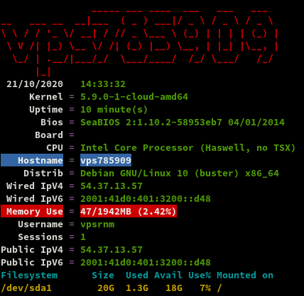

+++
title = 'vps785909 debian 10 - wgvpn.ovh (ARRET 04/02/2021)'
date = 2020-10-28 00:00:00 +0100
categories = vps serveur
+++
*OVH vps785909 (1 vCore/2GoRam/20GoSSD) Debian Buster*

# {:width="80"}  Serveur vps785909 

## {:width="100"} Debian 10 (21/10/2020)

PARAMETRES D'ACCES:  
L'adresse IPv4 du VPS est : 54.37.13.57  
L'adresse IPv6 du VPS est : 2001:41d0:401:3200:0:0:0:d48  

Le nom du VPS est : vps785909.ovh.net  
Connexion SSH en "root" ( 7ast3LBJ )

    ssh root@54.37.13.57

### {:width="80"} Réseau 

Créer un bash pour désactiver l'initialisation réseau par le cloud sur le VPS OVH  

    nano initres.sh

```
#!/bin/bash
#
# To disable cloud-init's network configuration capabilities, write a file
# /etc/cloud/cloud.cfg.d/99-disable-network-config.cfg with the following:
# network: {config: disabled}
#
#Création du fichier **/etc/cloud/cloud.cfg.d/99-disable-network-config.cfg** en mode su
echo "network: {config: disabled}" > /etc/cloud/cloud.cfg.d/99-disable-network-config.cfg
#
# Effacerle fichier /etc/network/interfaces  
rm /etc/network/interfaces
# Recréer le fichier /etc/network/interfaces
cat > /etc/network/interfaces << EOF
auto lo
iface lo inet loopback

auto eth0
iface eth0 inet dhcp
iface eth0 inet6 static
 address 2001:41d0:401:3200:0:0:0:d48
 netmask 128
 post-up /sbin/ip -6 route add 2001:41d0:0401:3200:0000:0000:0000:0001 dev eth0
 post-up /sbin/ip -6 route add default via 2001:41d0:0401:3200:0000:0000:0000:0001 dev eth0
 pre-down /sbin/ip -6 route del default via 2001:41d0:0401:3200:0000:0000:0000:0001 dev eth0
 pre-down /sbin/ip -6 route del 2001:41d0:0401:3200:0000:0000:0000:0001 dev eth0
EOF
#
# Configuration OVH à modifier /etc/cloud/cloud.cfg 
sed -i 's/preserve_hostname: false/preserve_hostname: true/g' /etc/cloud/cloud.cfg
sed -i 's/manage_etc_hosts: true/manage_etc_hosts: false/g' /etc/cloud/cloud.cfg
#
# Redémarrage de la machine
systemctl reboot

```

Droits et exécution

    chmod +x initres.sh && ./initres.sh

Patienter quelques minutes avant la reconnexion...


```
54.37.13.57
2001:41d0:401:3200:0:0:0:d48
2001:41d0:0401:3200:0000:0000:0000:0001
```

Se connecter en root via SSH  

    ssh root@54.37.13.57

Vérifier le réseau `ip a` et noyau `uname -r`

```
1: lo: <LOOPBACK,UP,LOWER_UP> mtu 65536 qdisc noqueue state UNKNOWN group default qlen 1000
    link/loopback 00:00:00:00:00:00 brd 00:00:00:00:00:00
    inet 127.0.0.1/8 scope host lo
       valid_lft forever preferred_lft forever
    inet6 ::1/128 scope host 
       valid_lft forever preferred_lft forever
2: eth0: <BROADCAST,MULTICAST,UP,LOWER_UP> mtu 1500 qdisc pfifo_fast state UP group default qlen 1000
    link/ether fa:16:3e:e8:26:8c brd ff:ff:ff:ff:ff:ff
    inet 54.37.13.57/32 brd 54.37.13.57 scope global dynamic eth0
       valid_lft 86323sec preferred_lft 86323sec
    inet6 2001:41d0:401:3200::d48/128 scope global 
       valid_lft forever preferred_lft forever
    inet6 fe80::f816:3eff:fee8:268c/64 scope link 
       valid_lft forever preferred_lft forever

```

### {:width="30"} Domaine wgvpn.ovh

Zone dns OVH

```
$TTL 3600
@	IN SOA dns111.ovh.net. tech.ovh.net. (2020102701 86400 3600 3600000 300)
           IN NS     dns111.ovh.net.
           IN NS     ns111.ovh.net.
           IN A      54.37.13.57
           IN AAAA   2001:41d0:401:3200:0:0:0:d48
wg         IN CNAME  wgvpn.ovh.
zic        IN CNAME  wgvpn.ovh.
```

Reverse DNS sur "server" , IP 54.37.13.57 &rarr; wgvpn.ovh 

Hostname

    hostnamectl	# set-hostname wgvpn.ovh

```
   Static hostname: vps785909
         Icon name: computer-vm
           Chassis: vm
        Machine ID: b75eed7f218c4263bd0662a52feba713
           Boot ID: fae504268fc745d5b23215d9486414f2
    Virtualization: kvm
  Operating System: Debian GNU/Linux 10 (buster)
            Kernel: Linux 5.9.0-1-cloud-amd64
      Architecture: x86-64
```


### Création utilisateur

Utilisateur **vpsrnm**  

    useradd -m -d /home/vpsrnm/ -s /bin/bash vpsrnm

Mot de passe **vpsrnm**  

    passwd vpsrnm 

Visudo pour les accès root via utilisateur **vpsrnm**  

    echo "vpsrnm     ALL=(ALL) NOPASSWD: ALL" >> /etc/sudoers

Changer le mot de passe root

    passwd root


### {:width=80"} OpenSSH, clé et script

**connexion avec clé**  
<u>sur l'ordinateur de bureau</u>
Générer une paire de clé curve25519-sha256 (ECDH avec Curve25519 et SHA2) nommé **kvm-cinay** pour une liaison SSH avec le serveur KVM.  

    ssh-keygen -t ed25519 -o -a 100 -f ~/.ssh/kvm-vps785909

Envoyer la clé publique sur le serveur KVM   

    scp ~/.ssh/kvm-vps785909.pub vpsrnm@54.37.13.57:/home/vpsrnm/

<u>sur le serveur KVM</u>
On se connecte  

    ssh vpsrnm@54.37.13.57

Copier le contenu de la clé publique dans /home/$USER/.ssh/authorized_keys  

    cd ~

Sur le KVM ,créer un dossier .ssh  

```bash
mkdir .ssh
cat $HOME/kvm-vps785909.pub >> $HOME/.ssh/authorized_keys
chmod 600 $HOME/.ssh/authorized_keys  # donner les droits
rm $HOME/kvm-vps785909.pub  # effacer le fichier de la clé  
```

Modifier la configuration serveur SSH  

    sudo nano /etc/ssh/sshd_config  # attention aux 2 dernières lignes

Modifier

```conf
Port 55034
PasswordAuthentication no    # avant dernière ligne
PermitRootLogin no           # dernière ligne
```

<u>session SSH ne se termine pas correctement lors d'un "reboot" à distance</u>  
Si vous tentez de **redémarrer/éteindre** une machine distance par **ssh**, vous pourriez constater que votre session ne se termine pas correctement, vous laissant avec un terminal inactif jusqu'à l'expiration d'un long délai d'inactivité. Il existe un bogue 751636 à ce sujet. Pour l'instant, la solution de contournement à ce problème est d'installer :  

    sudo apt install libpam-systemd  # installé par défaut sur debian buster

cela terminera la session ssh avant que le réseau ne tombe.  
Veuillez noter qu'il est nécessaire que PAM soit activé dans sshd.  

Relancer openSSH  

    sudo systemctl restart sshd

Accès depuis le poste distant avec la clé privée  

    ssh -p 55034 -i ~/.ssh/kvm-vps785909 vpsrnm@54.37.13.57


### Outils, scripts motd et ssh_rc_bash

Installer utilitaires  

    sudo apt install rsync curl tmux jq figlet git dnsutils tree -y


Motd

    sudo rm /etc/motd && sudo nano /etc/motd

```
                 ____  ___  ___  ___   __   ___    
 __ __ _ __  ___|__  |( _ )| __|/ _ \ /  \ / _ \   
 \ V /| '_ \(_-<  / / / _ \|__ \\_, /| () |\_, /   
  \_/ | .__//__/ /_/  \___/|___/ /_/  \__/  /_/    
 __ __|_| __ _ __ __ _ __  _ _      ___ __ __| |_  
 \ V  V // _` |\ V /| '_ \| ' \  _ / _ \\ V /| ' \ 
  \_/\_/ \__, | \_/ | .__/|_||_|(_)\___/ \_/ |_||_|
         |___/      |_|                            
```


Script **ssh_rc_bash**  
>**ATTENTION!!! Les scripts sur connexion peuvent poser des problèmes pour des appels externes autres que ssh**

    wget https://static.xoyaz.xyz/files/ssh_rc_bash
    chmod +x ssh_rc_bash # rendre le bash exécutable
    ./ssh_rc_bash        # exécution




### Certificats {:width="100"}

Installer acme: [Serveur , installer et renouveler les certificats SSL Let's encrypt via Acme](https://blog.cinay.xyz/2017/08/Acme-Certficats-Serveurs/)  

    cd ~
    sudo apt install socat -y # prérequis
    git clone https://github.com/Neilpang/acme.sh.git
    cd acme.sh
    ./acme.sh --install # se déconnecter pour prise en compte
    # export des clé API OVH

Générer les certificats pour le domaine wgvpn.ovh

    acme.sh --dns dns_ovh --ocsp --issue --keylength ec-384 -d 'wgvpn.ovh' -d 'wg.wgvpn.ovh' -d 'zic.wgvpn.ovh'

```
[Wed 21 Oct 2020 02:37:48 PM CEST] Your cert is in  /home/vpsrnm//.acme.sh/wgvpn.ovh_ecc/wgvpn.ovh.cer 
[Wed 21 Oct 2020 02:37:48 PM CEST] Your cert key is in  /home/vpsrnm//.acme.sh/wgvpn.ovh_ecc/wgvpn.ovh.key 
[Wed 21 Oct 2020 02:37:48 PM CEST] The intermediate CA cert is in  /home/vpsrnm//.acme.sh/wgvpn.ovh_ecc/ca.cer 
[Wed 21 Oct 2020 02:37:48 PM CEST] And the full chain certs is there:  /home/vpsrnm//.acme.sh/wgvpn.ovh_ecc/fullchain.cer 
```

Les liens avec **/etc/ssl/private** 

```
sudo ln -s /home/vpsrnm//.acme.sh/wgvpn.ovh_ecc/fullchain.cer /etc/ssl/private/wgvpn.ovh-fullchain.pem   # full chain certs
sudo ln -s /home/vpsrnm//.acme.sh/wgvpn.ovh_ecc/wgvpn.ovh.key /etc/ssl/private/wgvpn.ovh-key.pem     # cert key
sudo ln -s /home/vpsrnm//.acme.sh/wgvpn.ovh_ecc/wgvpn.ovh.cer /etc/ssl/private/wgvpn.ovh-chain.pem   # cert domain
sudo ln -s /home/vpsrnm//.acme.sh/wgvpn.ovh_ecc/ca.cer /etc/ssl/private/wgvpn.ovh-ca.pem                 # intermediate CA cert
```


### {:width="50"} Parefeu

*UFW, ou pare - feu simple , est une interface pour gérer les règles de pare-feu dans Arch Linux, Debian ou Ubuntu. UFW est utilisé via la ligne de commande (bien qu'il dispose d'interfaces graphiques disponibles), et vise à rendre la configuration du pare-feu facile (ou simple).*

Installation **Debian / Ubuntu**

    sudo apt install ufw

*Par défaut, les jeux de règles d'UFW sont vides, de sorte qu'il n'applique aucune règle de pare-feu, même lorsque le démon est en cours d'exécution.*   

Les règles 

    sudo ufw allow 55034/tcp  # port SSH , 55034
    sudo ufw allow http       # port 80
    sudo ufw allow https      # port 53
    sudo ufw allow DNS        # port 53

Activer le parefeu

    sudo ufw enable

```
Command may disrupt existing ssh connections. Proceed with operation (y|n)? y
Firewall is active and enabled on system startup
```

Status

     sudo ufw status verbose

```
Status: active
Logging: on (low)
Default: deny (incoming), allow (outgoing), disabled (routed)
New profiles: skip

To                         Action      From
--                         ------      ----
55034/tcp                  ALLOW IN    Anywhere                  
80/tcp                     ALLOW IN    Anywhere                  
443/tcp                    ALLOW IN    Anywhere                  
53 (DNS)                   ALLOW IN    Anywhere                  
55034/tcp (v6)             ALLOW IN    Anywhere (v6)             
80/tcp (v6)                ALLOW IN    Anywhere (v6)             
443/tcp (v6)               ALLOW IN    Anywhere (v6)             
53 (DNS (v6))              ALLOW IN    Anywhere (v6)             
```

## Wireguard

### Installer noyau 5.8+

*A partir du noyau 5.6 le module wireguard est intégré*

    echo "deb http://deb.debian.org/debian/ unstable main" | sudo tee /etc/apt/sources.list.d/unstable-wireguard.list
    printf 'Package: *\nPin: release a=unstable\nPin-Priority: 90\n' | sudo tee /etc/apt/preferences.d/limit-unstable
    apt update && apt upgrade

Rechercher l'image
    
    apt search linux-image-5

```
linux-image-5.9.0-1-cloud-amd64/buster-backports,buster-backports 5.8.10-1~bpo10+1 amd64
```

Installer le noyau

    apt install linux-image-5.9.0-1-cloud-amd64

>**REDEMARRER `sudo systemctl reboot`**

Connexion SSH 

Vérifications `uname -a`   
*Linux vps785909 5.9.0-1-cloud-amd64 #1 SMP Debian 5.9.1-1 (2020-10-17) x86_64 GNU/Linux*

Supprimer les images non utilisées

    sudo apt remove linux-image-4.19.0-11-cloud-amd64 

>**REDEMARRER `sudo systemctl reboot`**

### Wireguard - base

*WireGuard est un serveur VPN à code source ouvert, gratuit, moderne et rapide, doté d'une cryptographie de pointe. Il est plus rapide et plus simple que l'IPSec et l'OpenVPN*

Wireguard est dans le noyau 5.6+

    apt install wireguard

Si parefeu , ouvrir le port UDP 51820 ,avec UFW : `sudo ufw allow 51820/udp  # wireguard`

**Générer une paire de clés**

On se positionne dans le dossier **/etc/wireguard/**  

    cd /etc/wireguard

WireGuard repose sur une authentification par clé publique/privée (cryptographie asymétrique), vous devez donc créer ces clés avec les sous-commandes wg genkey et wg pubkey  
La création de la clé privée se fait avec wg genkey et la clé publique est générée en la canalisant dans wg pubkey

    umask 077; wg genkey | tee vps785909-private.key | wg pubkey > vps785909-public.key

**Autoriser le serveur Wireguard à relayer les paquets **

Autoriser le serveur Wireguard à relayer les paquets venant de ces clients vers l'internet et de traiter les paquets retours (modifier **/etc/sysctl.conf**)

```
sed -i 's/^#net.ipv4.ip_forward=1/net.ipv4.ip_forward=1/' /etc/sysctl.conf
sed -i 's/^#net.ipv6.conf.all.forwarding=1/net.ipv6.conf.all.forwarding=1/' /etc/sysctl.conf
sysctl -p # prise en compte immédiate
```

Résultat

```
net.ipv4.ip_forward = 1
net.ipv6.conf.all.forwarding = 1
```

**Fichier de configuration /etc/wireguard/wg0.conf**

Récupérer le nom de la carte réseau `ip a` , dans notre cas **eth0**  

La première étape consiste à choisir une plage IPV4 privée, [Random IPV4 Private Address Generator](https://www.fakeaddresstool.com/random-ipv4-private-generator/), qui sera utilisée par le serveur : **10.22.55.0/8**  

Pour une adresse IPV6 [Local IPv6 Address Generator](https://www.ultratools.com/tools/rangeGenerator)  : **fd80:4c53:98dc:9ea2::/64**  

Prefix/L|  fd
--------|--------
 Global ID|  804c5398dc
Subnet ID|  9ea2
Combine/CID|  fd80:4c53:98dc:9ea2::/64
IPv6 addresses|  fd80:4c53:98dc:9ea2::/64:XXXX:XXXX:XXXX:XXXX
Start Range|  fd80:4c53:98dc:9ea2:0:0:0:0
End Range|  fd80:4c53:98dc:9ea2:ffff:ffff:ffff:ffff
No. of hosts|  18446744073709551616 

Nous utiliserons 10.22.55.0/24 qui se trouve dans la plage 10.22.55.0/8 . Le serveur aura l'adresse IP suivante: 10.22.55.1 . Il est également nécessaire de choisir un port, qui sera exposé publiquement, pour que le serveur écoute.Le port de documentation standard est généralement 51820.

Créer le fichier **/etc/wireguard/wg0.conf**

    nano /etc/wireguard/wg0.conf

```
[Interface]
Address = 10.22.55.1/24
Address = fd80:4c53:98dc:9ea2::1/64
ListenPort = 51820
PostUp = iptables -A FORWARD -i wg0 -j ACCEPT; iptables -t nat -A POSTROUTING -o eth0 -j MASQUERADE; ip6tables -A FORWARD -i wg0 -j ACCEPT; ip6tables -t nat -A POSTROUTING -o eth0 -j MASQUERADE
PostDown = iptables -D FORWARD -i wg0 -j ACCEPT; iptables -t nat -D POSTROUTING -o eth0 -j MASQUERADE; ip6tables -D FORWARD -i wg0 -j ACCEPT; ip6tables -t nat -D POSTROUTING -o eth0 -j MASQUERADE
PrivateKey = 5Zsr0jQXiuCpHFkye325Zsr0jMUKinVEOPmk=
DNS = 10.22.55.1
DNS = fd80:4c53:98dc:9ea2::1
SaveConfig = true
```

**Address** , fixer l'adresse IP privée du serveur à l'intérieur du VPN.Les adresses du réseau VPN de 10.22.55.0 à 10.22.55.255 sont fixées par le masque **/24**  
**PostUp** , pour la mise en place des règles iptables de translation d'adresses à l'activation du VPN (autoriser le routage des paquets réseau venant des clients vers internet)  
**PostDown** , pour la suppression des règles iptables de translation d'adresses à l'arrêt du VPN  
**PrivateKey** , clé privée du serveur

Modification des droits (lecture uniquement par "root")

    chmod 600 /etc/wireguard/wg0.conf

### DNS Unbound

{:width="100"}

Un problème majeur avec beaucoup de configurations VPN est que le DNS n'est pas suffisant. Cela finit par une fuite de connexion client et de détails d'emplacement. Un bon moyen de tester cela est à travers le site <http://dnsleak.com/>

Nous allons sécuriser le trafic DNS avec la solution **unbound** qui offre les caractéristiques suivantes

* Léger et rapide
* Facile à installer et à configurer
* Orienté sécurité
* Prise en charge DNSSEC 

Nous allons le configurer de manière à contrer les fuites DNS, les attaques plus sophistiquées comme la fausse configuration de proxy, les routeurs escrocs et toutes sortes d'attaques MITM sur HTTPS et autres protocoles.

Nous installons unbound sur le serveur    
Passage en mode super utilisateur

    sudo -s # ou su

>ATTENTION : Le programme **resolvconf** est en général seulement nécessaire quand un système a plusieurs programmes qui ont besoin de modifier de façon dynamique les informations sur les serveurs de noms de domaine. Sur un système simple où les serveurs de noms de domaine ne changent pas souvent ou bien ne sont modifiés que par un programme, le <u>fichier de configuration **resolv.conf** est suffisant</u>.  
Il faut installer **resolvconf**, sinon on a une erreur **unbound-resolvconf**  
Une fois le paquet «  **resolvconf**  » installé, <u>il ne faut plus modifier le fichier</u> « **/etc/resolv.conf**  », car le contenu de celui-ci sera automatiquement géré et remplacé par «  **resolvconf**  ».

Installation des outils dns, des paquets Unbound et resolv :  

    apt install unbound unbound-host resolvconf -y

Téléchargement de la liste des serveurs DNS racines

    curl -o /var/lib/unbound/root.hints https://www.internic.net/domain/named.cache
    chown unbound:unbound /var/lib/unbound/root.hints

Ajout d'un fichier de configuration **dns-vps785909.conf**  

    /etc/unbound/unbound.conf.d/dns-vps785909.conf 
    
```    
server:
    num-threads: 4

    # enable logs
    verbosity: 0  # no verbosity,  only  errors

    # liste des serveurs DNS racine
    root-hints: "/var/lib/unbound/root.hints"

    # Répondre aux requêtes DNS sur toutes les interfaces
    interface: 0.0.0.0                          # 0.0.0.0 unbound sur plusieurs interfaces
    interface: ::0
    max-udp-size: 3072

    # IPs authorised to access the DNS Server
    access-control: 0.0.0.0/0                 refuse
    access-control: 127.0.0.0/8               allow
    access-control: 10.22.55.0/16             allow

    access-control: ::0/0                     refuse
    access-control: ::1                       allow
    access-control: ::ffff:127.0.0.1          allow
    access-control: fe80::/10                 allow
    access-control: fd80:4c53:98dc:9ea2::/48  allow

    local-zone: "22.10.in-addr.arpa." transparent

    #hide DNS Server info
    hide-identity: yes
    hide-version: yes

    # limit DNS fraud and use DNSSEC
    harden-glue: yes
    harden-dnssec-stripped: yes
    harden-referral-path: yes

    # add an unwanted reply threshold to clean the cache and avoid, when possible, DNS poisoning
    unwanted-reply-threshold: 10000000

    # have the validator print validation failures to the log
    val-log-level: 1

    # minimum lifetime of cache entries in seconds
    cache-min-ttl: 1800

    # maximum lifetime of cached entries in seconds
    cache-max-ttl: 14400
    prefetch: yes
    prefetch-key: yes

#include: /etc/unbound/unbound.conf.d/adslist.txt 
```

Droits

    chown -R unbound:unbound /var/lib/unbound

Pour vérifier si le fichier de configuration est valide

    unbound-checkconf /etc/unbound/unbound.conf.d/dns-vps785909.conf

*unbound-checkconf: no errors in /etc/unbound/unbound.conf.d/dns-vps785909.conf*  
Désactiver systemd-resolved (si utilisé)

    systemctl stop systemd-resolved
    systemctl disable systemd-resolved

Activer Unbound (ILS SONT ACTIFS DES LEUR INSTALLATION) 

    systemctl enable unbound-resolvconf
    systemctl enable unbound

>**Redémarrer le serveur `systemctl reboot`**

## Nginx-light

[Nginx-light](/posts/nginx-light/)

Installation `sudo apt install nginx-light`  

Modifier **/etc/nginx/nginx.conf**  

```
	ssl_protocols TLSv1.2 TLSv1.3;
	ssl_prefer_server_ciphers off;
```

[Serveur , installer et renouveler les certificats SSL Let’s encrypt via Acme](/posts/Acme-Certficats-Serveurs/)   

Modifier le fichier **/etc/nginx/sites-enabled/default**

```
server {
    listen 80;
    listen [::]:80;
    server_name wgvpn.ovh;
    return 301 https://$host$request_uri;
}
server {
    listen 443 ssl http2;
    listen [::]:443 ssl http2;
    server_name wgvpn.ovh;
    ssl_certificate /etc/ssl/private/wgvpn.ovh-fullchain.pem;
    ssl_certificate_key /etc/ssl/private/wgvpn.ovh-key.pem;

    root /var/www/;
    index index/ index.htm index.nginx-debian/;

    # TLS 1.3 only
    ssl_protocols TLSv1.3;
    ssl_prefer_server_ciphers off;
 
    # HSTS (ngx_http_headers_module is required) (63072000 seconds)
    add_header Strict-Transport-Security "max-age=63072000" always;
 
    # OCSP stapling
    ssl_stapling on;
    ssl_stapling_verify on;
 
    # verify chain of trust of OCSP response using Root CA and Intermediate certs
    ssl_trusted_certificate /etc/ssl/private/wgvpn.ovh-fullchain.pem;
 
    # replace with the IP address of your resolver
    resolver 127.0.0.1;

}

server {
    listen 80;
    listen [::]:80;
    server_name wg.wgvpn.ovh;
    return 301 https://$host$request_uri;
}
server {
    listen 443 ssl http2;
    listen [::]:443 ssl http2;
    server_name wg.wgvpn.ovh;
    ssl_certificate /etc/ssl/private/wgvpn.ovh-fullchain.pem;
    ssl_certificate_key /etc/ssl/private/wgvpn.ovh-key.pem;

    root /var/www/;
    index index/ index.htm index.nginx-debian/;

    # TLS 1.3 only
    ssl_protocols TLSv1.3;
    ssl_prefer_server_ciphers off;
 
    # HSTS (ngx_http_headers_module is required) (63072000 seconds)
    add_header Strict-Transport-Security "max-age=63072000" always;
 
    # OCSP stapling
    ssl_stapling on;
    ssl_stapling_verify on;
 
    # verify chain of trust of OCSP response using Root CA and Intermediate certs
    ssl_trusted_certificate /etc/ssl/private/wgvpn.ovh-fullchain.pem;
 
    # replace with the IP address of your resolver
    resolver 127.0.0.1;

}

server {
    listen 80;
    listen [::]:80;
    server_name zic.wgvpn.ovh;
    return 301 https://$host$request_uri;
}
server {
    listen 443 ssl http2;
    listen [::]:443 ssl http2;
    server_name zic.wgvpn.ovh;
    ssl_certificate /etc/ssl/private/wgvpn.ovh-fullchain.pem;
    ssl_certificate_key /etc/ssl/private/wgvpn.ovh-key.pem;

    root /var/www/;
    index index/ index.htm index.nginx-debian/;

    # TLS 1.3 only
    ssl_protocols TLSv1.3;
    ssl_prefer_server_ciphers off;
 
    # HSTS (ngx_http_headers_module is required) (63072000 seconds)
    add_header Strict-Transport-Security "max-age=63072000" always;
 
    # OCSP stapling
    ssl_stapling on;
    ssl_stapling_verify on;
 
    # verify chain of trust of OCSP response using Root CA and Intermediate certs
    ssl_trusted_certificate /etc/ssl/private/wgvpn.ovh-fullchain.pem;
 
    # replace with the IP address of your resolver
    resolver 127.0.0.1;

}


```


Déposer une image `wallpaper.jpg` dans le dossier **/var/www/**   
Créer un fichier `/var/www//index/`

```

```