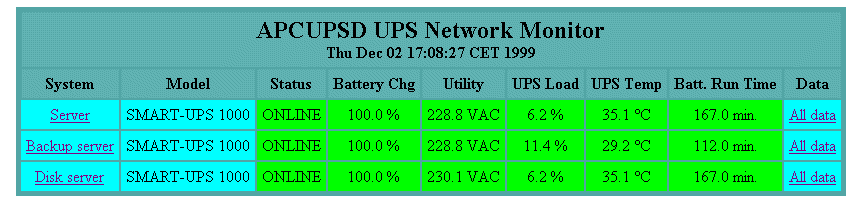
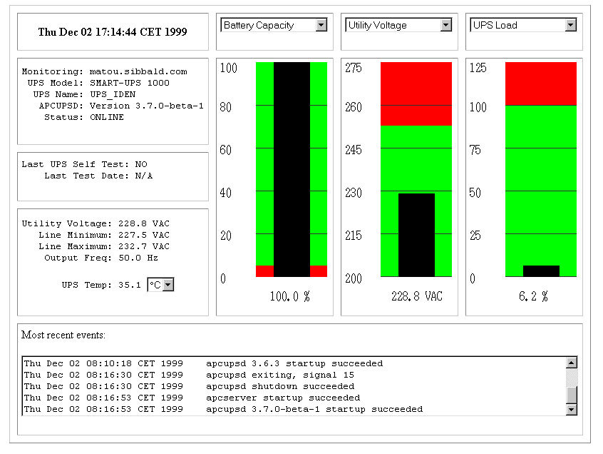

+++
title = 'UPS APC (apcupsd) - Onduleur "Eaton Protection Station 800 USB"'
date = 2020-11-04 00:00:00 +0100
categories = divers
+++
*L'APC UPS peut communiquer avec le système Linux via une connexion série RS-232 ou USB. En cas de panne de courant prolongée, si l'APC UPS perd la majeure partie de sa capacité de batterie, il peut demander au boîtier Linux d'effectuer un arrêt en toute sécurité.*

# Onduleur Eaton Protection Station 800 USB


* [Eaton Protection Station - 650/800 - Manuel d’installation et d’utilisation](http://lit.powerware.com/ll_download.asp?file=Eaton_Protection_Station_650_800_Installation_and_user_manual_FR.pdf&ctry=80)  
* Définitions
    * UPS = Uninterruptable Power System
    * ASI = Alimentation Sans Interruption
    * Le périphérique UPS **Eaton Protection Station 800 USB** à gérer est de type "HID"  


No | Eaton Protection Station - 650/800
--- | ---
7  | 4 prises filtrées.
8  | 4 prises secourues par batterie.
9  | Voyant allumé, protection anti-surtensions active sur les 8 prises.
10 | Voyant allumé, défaut de l'Alimentation Sans Interruption.
11 | Bouton de mise en service ou d'arrêt des prises secourues.
12 | Disjoncteur de protection.

Passer en mode su

	sudo -s

Connecter l'onduleur liaison USB sur un port disponible du serveur , vérifier par `dmesg`   

    dmesg | grep -i eaton

```
[24953.861513] usb 6-1: Manufacturer: EATON
[24956.055655] hid-generic 0003:0463:FFFF.0008: hiddev0,hidraw0: USB HID v10.10 Device [EATON Protection Station] on usb-0000:00:13.0-1/input0
```

    lsusb | grep -i ups

```
Bus 006 Device 010: ID 0463:ffff MGE UPS Systems UPS
```

Déterminer le numéro de série

     udevadm info --attribute-walk --name=/dev/usb/hiddev0 | egrep 'manufacturer|product|serial'

```
    ATTRS{product}=="Protection Station"
    ATTRS{manufacturer}=="EATON"
    ATTRS{serial}=="AN2E49008"
    ATTRS{manufacturer}=="Linux 4.19.0-8-amd64 ohci_hcd"
    ATTRS{product}=="OHCI PCI host controller"
    ATTRS{serial}=="0000:00:13.0"
```

# APC UPS (apcupsd)

* [How to Use APC UPS with Two or More Computers – apcupsd Master Slave Setup](https://www.pontikis.net/blog/apc-ups-master-slave-setup-apcupsd)
* [Installer et configurer un UPS APC avec Ubuntu](https://doc.ubuntu-fr.org/ups_apc)

## Installation


    sudo pacman -S apcupsd  # archlinux
    sudo apt install apcupsd # debian

## Configurer l'onduleur APC

Le fichier de configuration principal du démon APC UPS se trouve dans **/etc/apcupsd/apcupsd.conf** 
Les lignes de texte sont modifiées pour prendre en charge un câble de style USB:

Avant:

```
UPSCABLE smart

UPSTYPE smartups

DEVICE /dev/ttyS0
```

Après:

```
UPSCABLE usb

UPSTYPE usb
# For USB UPSes, leave the DEVICE directive blank.
DEVICE
```

## Tester

**archlinux** , activez et démarrez apcupsd.service

    sudo systemctl enable apcupsd.service && systemctl start apcupsd.service

**debian** , redémarrez apcupsd.service

    systemctl restart apcupsd.service

Ensuite, attendez environ une minute et vérifiez que le démon fonctionne et surveille correctement la batterie:

    apcaccess status

```
APC      : 001,028,0672
DATE     : 2020-03-30 08:20:43 +0200  
HOSTNAME : srvxo
VERSION  : 3.14.14 (31 May 2016) debian
UPSNAME  : srvxo
CABLE    : USB Cable
DRIVER   : USB UPS Driver
UPSMODE  : Stand Alone
STARTTIME: 2020-03-30 07:56:20 +0200  
MODEL    : Protection Station
STATUS   : ONLINE 
LOADPCT  : 25.0 Percent
BCHARGE  : 100.0 Percent
TIMELEFT : 10.7 Minutes
MBATTCHG : 5 Percent
MINTIMEL : 3 Minutes
MAXTIME  : 0 Seconds
OUTPUTV  : 230.0 Volts
DWAKE    : -1 Seconds
LOTRANS  : 184.0 Volts
HITRANS  : 264.0 Volts
ALARMDEL : 30 Seconds
NUMXFERS : 0
TONBATT  : 0 Seconds
CUMONBATT: 0 Seconds
XOFFBATT : N/A
STATFLAG : 0x05000008
SERIALNO : AN2E49008
END APC  : 2020-03-30 08:21:30 +0200  
```

Pour tester entièrement votre configuration:

1.    Modifiez TIMEOUT de 0 à 1 dans le fichier /etc/apcupsd/apcupsd.conf
2.    Coupez l'alimentation murale de l'onduleur.
3.    Observez que votre box Linux s'éteint rapidement.
4.    Rebranchez l'onduleur
5.    Allumez votre box Linux.
6.    Remplacez TIMEOUT de 1 à 0 dans le fichier /etc/apcupsd/apcupsd.conf

Il ne reste plus qu'à activer le service apcupsd


### Test de communication

À ce stade, vous devez vous assurer que *apcupsd* gère correctement la connexion à l'onduleur. Ce test suppose que vous disposez d'un onduleur qui parle le protocole apcsmart, via USB ou un port série. Si vous avez un onduleur de signalisation de tension à l'ancienne, veuillez passer à la section suivante ( test de panne de courant simulé ).

Quand apcupsd détecte un problème, il génère un ÉVÉNEMENT (EVENT), qui consiste à envoyer un message au journal système puis à appeler le script apccontrol (normalement dans **/etc/acpupsd/apccontrol**) pour gérer l'événement.

Pour créer un événement, retirez la fiche du port série à l'arrière de votre ordinateur ou à l'arrière de l'onduleur. Dans les 6 secondes, apcupsd devrait détecter le manque de communications du port série et diffuser un message mural indiquant que les communications du port série ont été perdues:

    Warning communications lost with UPS lost. # Communications d'avertissement perdues avec UPS perdu.

En même temps, il envoie le même message au journal système et au fichier EVENTS temporaire ( /etc/apcupsd/apcupsd.events ).

Rebranchez la prise du port série sur votre ordinateur et dans environ 12 secondes, apcupsd devrait rétablir les communications et diffuser et enregistrer le message suivant:

    Communications with UPS restored. # Les communications avec UPS ont été rétablies.

Si ces messages sont enregistrés mais ne sont pas diffusés, soit vous avez la permission de mesg définie sur no (voir '` man wall` ' ou ' `man mesg` '), soit il y a un problème avec apccontrol. Si vous exécutez un gestionnaire de fenêtres tel que GNOME et que vous n'avez pas de fenêtre de console ouverte, vous risquez de ne pas recevoir les messages du wall . Cependant, vous devez les trouver dans votre fichier journal système (normalement /var/log/messages ) et dans le fichier EVENTS temporaire, /etc/apcupsd/apcupsd.events . Par exemple, pour observer ces événements dans le fichier EVENTS temporaire, vous pouvez effectuer une

 tail -f /etc/apcupsd/apcupsd.events

>Remarque: si vous avez installé à partir du RPM, le fichier d'événements approprié peut être /var/log/apcupsd.events . Vous pouvez trouver le nom de fichier réel en vérifiant votre fichier apcupsd.conf avant d'exécuter le test.Si vous n'observez pas ces messages, vous devez corriger ce problème avant de procéder à des tests supplémentaires.

### Test de panne de courant simulé (Simulated Power Fail Test)

À ce stade, vous devez vérifier qu'en cas de panne de courant, apcupsd appelle correctement apccontrol. Ce test convient à tous les modèles d'onduleurs (intelligents ou muets).

Pour éviter la possibilité que apcupsd puisse arrêter votre système, localisez où réside apccontrol sur votre système (normalement, /etc/apcupsd/apccontrol. Déplacez ce script vers un autre emplacement, par exemple apccontrol.save et remplacez-le par le script trouvé dans examples / safe .apccontrol. Lorsque cela est fait, assurez-vous que la batterie de votre onduleur est complètement chargée et qu'il vous reste au moins 5 minutes d'autonomie sur les batteries. Cela peut être fait en examinant les valeurs des variables BATTCHG et TIMELEFT dans l'impression de  `apcaccess status`

Bien que cela ne soit pas nécessaire, par mesure de précaution supplémentaire, vous pouvez arrêter votre machine, retirer la fiche de l'onduleur que vous testez et brancher votre machine sur un autre onduleur ou directement dans le wall. Cela garantira que l'onduleur ne coupe pas l'alimentation de votre machine au mauvais moment. N'oubliez pas à la fin du test de rebrancher votre machine sur l'onduleur.

Vous pouvez également minimiser le risque d'un arrêt inattendu en utilisant un système de fichiers de journalisation tel que EXT3 de Linux. Tous les lecteurs de disque modernes se garent en toute sécurité lorsqu'ils s'éteignent, plutôt que de labourer de l'oxyde sur la surface d'enregistrement de votre disque. Ainsi, une puissance inattendue moindre doit frapper des fenêtres de synchronisation très étroites afin de jeter une transaction EXT3.

Pour commencer le test, retirez la fiche d'alimentation de l'onduleur. La première fois que vous faites cela, psychologiquement, ce ne sera pas facile, mais après avoir débranché la prise plusieurs fois, vous pourrez même en profiter. Si tout se passe bien, apcupsd devrait détecter la panne de courant et imprimer plusieurs messages d'avertissement. Le premier devrait apparaître après 5 à 6 secondes et lire:

     Warning power loss detected. # Avertissement: perte de puissance détectée.

Puis généralement 6 secondes plus tard, apcupsd est sûr que ce n'est pas un effet transitoire, il envoie donc:

    Power failure. Running on UPS batteries. # Panne électrique.  Fonctionnant sur batteries UPS.

Après quelques secondes de plus (au total environ 15 secondes), rebranchez le cordon d'alimentation et assurez-vous qu'apcupsd sait que l'alimentation est revenue. Il devrait imprimer:

    Power has returned... # Le pouvoir est revenu ...

Si vous n'observez pas les messages ci-dessus, veuillez corriger la situation avant de continuer. La cause la plus probable des problèmes est:

*    apcupsd ne reconnaît pas la panne de courant car les directives de configuration ne sont pas correctes. Par exemple, un mauvais câble.
*    Le fichier /etc/apcupsd/apccontrol n'existe pas ou n'est pas marqué comme exécutable. 

### Test d'arrêt du système (System Shutdown Test)

Il s'agit d'un test intermédiaire que vous pouvez effectuer pour tous les modèles d'onduleurs avant d'effectuer le test de mise hors tension complète. Modifiez d'abord le fichier **/etc/apcupsd/apccontrol** afin que dans le cas killpower , la ligne qui ré-exécute apcupsd avec l'option `--killpower` soit mise en commentaire. La ligne d'origine ressemble probablement à quelque chose comme:

    ${APCUPSD} --killpower

quand il est commenté, il ressemble à:

    #${APCUPSD} --killpower

Maintenant, lorsque vous débranchez la prise d'alimentation et que la minuterie expire ou que les piles sont épuisées (voir la section suivante pour plus de détails), le système doit être complètement arrêté.

Après avoir effectué ce test, assurez-vous de restaurer **/etc/apcupsd/apccontrol** à son état précédent.

### Test de mise hors tension totale (Full Power Down Test)

Pour terminer les tests, vous devez procéder à un arrêt en cas de panne de courant de votre système. Ce test est applicable à tous les modèles d'UPS. Veuillez faire une sauvegarde de votre système ou prendre d'autres précautions avant d'essayer pour éviter la possibilité de perte de données en raison d'un problème 

Avant de continuer, assurez-vous que votre script d'arrêt ou l'équivalent a été correctement mis à jour par le processus d'installation pour contenir la logique d'appeler `apcupsd --killpower` ou `apccontrol killpower` lorsqu'il détecte une situation de panne de courant (présence d'un fichier / etc / powerfail ). Consultez la section [Construction et installation d'apcupsd](#) de ce manuel ou les fichiers README pour plus de détails sur les modifications d'arrêt nécessaires.

Lorsque vous êtes prêt à faire le test, soit débranchez simplement la prise et attendez que les batteries soient épuisées, soit définissez la directive de configuration TIMEOUT sur quelque chose comme 60 afin que le système s'arrête avant que les batteries ne soient épuisées. Nous vous recommandons de faire l'arrêt complet sans utiliser TIMEOUT pour simuler correctement une véritable panne de courant, mais le choix vous appartient 

Si tout se passe bien, votre système doit être arrêté avant que les batteries ne soient complètement épuisées et l'onduleur doit être mis hors tension par apcupsd. Veuillez noter que si vous éteignez complètement, vous devez vous assurer que votre onduleur est totalement éteint. Sinon, il a peut-être reçu la commande de mise hors tension, mais en raison d'une longue période de grâce, il attend toujours. Si vous deviez redémarrer votre ordinateur pendant la période de grâce, l'onduleur pourrait alors soudainement couper l'alimentation (cela m'est arrivé). Pour éviter ce problème, attendez toujours que votre onduleur se mette hors tension ou éteignez-le manuellement avant de redémarrer votre ordinateur. Sur mon système, l'onduleur est configuré comme en usine pour avoir une période de grâce de 180 secondes avant de couper l'alimentation. Au cours de ce type de test, 180 secondes semblent être une éternité, alors prenez soin d'attendre ou d'éteindre manuellement votre onduleur. Pour déterminer quelle période de grâce est programmée dans votre UPS EEPROM, exécutez « apcaccess eprom » et regardez le ""Shutdown grace delay".

Si vous avez rencontré des problèmes avec les procédures de test ci-dessus, ou si vous portez apcupsd vers un autre système, ou si vous êtes simplement curieux, vous voudrez peut-être savoir exactement ce qui se passe pendant le processus d'arrêt. Si tel est le cas, veuillez consulter la section [Séquence d'arrêt](URL) de ce manuel.

### apctest

apctest est un programme qui vous permet de parler directement à votre onduleur et d'exécuter certains tests de bas niveau, d'ajuster divers paramètres tels que la date d'installation de la batterie et le comportement de l'alarme, et d'effectuer un étalonnage de l'autonomie de la batterie. Nous décrivons ici comment l'utiliser pour un SmartUPS utilisant le pilote apcsmart et la connexion série RS232. Les menus et les options pour les onduleurs USB, MODBUS et de signalisation simple sont différents mais pour la plupart explicites.

Arrêtez *apcupsd* s'il est en cours d'exécution. C'est important. Un seul programme peut communiquer avec l'onduleur à la fois et si apcupsd est en cours d'exécution, apctest ne parviendra pas à contacter l'onduleur.

Exécutez **apctest** en l'invoquant sans argument.

Il lira votre configuration **apcupsd.conf** installée (afin qu'il sache où trouver l'onduleur), puis il vous présentera la sortie suivante:

```
 2003-07-07 11:19:21 apctest 3.10.6 (07 juillet 2003) redhat
 Vérification de la configuration ...
 Attaché au pilote: apcsmart
 sharenet.type = DESACTIVER
 cable.type = CUSTOM_SMART

 Vous utilisez un type de câble SMART, donc j'entre en mode de test SMART
 mode.type = SMART
 Configuration du port série ...
 Création d'un fichier de verrouillage de port série ...
 Bonjour, voici le programme de test de câbles apcupsd.
 Cette partie d'apctest sert à tester les onduleurs intelligents.
 Veuillez sélectionner la fonction que vous souhaitez exécuter.

 1) Interrogez l'onduleur pour toutes les valeurs connues
 2) Effectuez un étalonnage de l'autonomie de la batterie
 3) Annuler l'étalonnage de la batterie
 4) Surveiller la progression de l'étalonnage de la batterie
 5) Programme EEPROM
 6) Entrer en mode TTY communiquant avec UPS
 7) Quittez

 Sélectionnez le numéro de fonction: 1

# 

2003-07-07 11:19:21 apctest 3.10.6 (07 July 2003) redhat
Checking configuration ...
Attached to driver: apcsmart
sharenet.type = DISABLE
cable.type = CUSTOM_SMART

You are using a SMART cable type, so I'm entering SMART test mode
mode.type = SMART
Setting up serial port ...
Creating serial port lock file ...
Hello, this is the apcupsd Cable Test program.
This part of apctest is for testing Smart UPSes.
Please select the function you want to perform.

1) Query the UPS for all known values
2) Perform a Battery Runtime Calibration
3) Abort Battery Calibration
4) Monitor Battery Calibration progress
5) Program EEPROM
6) Enter TTY mode communicating with UPS
7) Quit

Select function number: 1
```

1. va sonder l'onduleur pour toutes les valeurs connues de apcupsd et les présenter dans un format plutôt brut. Cette sortie peut être utile pour fournir une assistance technique si vous rencontrez des problèmes avec votre onduleur.
2. effectuera un étalonnage de l'autonomie de la batterie. Ce test ne sera effectué que si votre batterie est chargée à 100%. L'exécution du test entraînera la décharge des batteries à environ 30% de leur capacité. Le nombre exact dépend du modèle d'UPS. Dans tous les cas, apctest abandonnera le test s'il détecte que la charge de la batterie est de 20% ou moins.  
L'avantage de ce test est que l'onduleur pourra recalibrer le compteur d'exécution restant qu'il conserve dans son micrologiciel. À mesure que vos batteries vieillissent, elles ont tendance à tenir moins en charge, de sorte que le calibrage de la durée de fonctionnement peut ne pas être précis après plusieurs années.  
Nous recommandons d'effectuer un étalonnage de la batterie environ une fois par an. Vous ne devez pas effectuer cet étalonnage trop souvent car la décharge des batteries a tendance à raccourcir leur durée de vie.
3. peut être utilisé pour abandonner un étalonnage de la batterie en cours, si vous avez été déconnecté.
4. peut être utilisé pour redémarrer la surveillance d'un étalonnage de batterie si vous deviez vous déconnecter pendant le test.
5. est utilisé pour programmer l'EEPROM. Voir [Configuration Directives Used to Set the UPS EEPROM](http://www.apcupsd.org/manual/manual.html#configuration-directives-used-to-set-the-ups-eeprom)  
6. initiera une communication directe entre votre terminal et l'onduleur, auquel cas vous pourrez saisir des commandes brutes de l'onduleur. Veuillez noter que vous devez faire attention aux commandes que vous entrez car vous pouvez provoquer l'arrêt soudain de votre onduleur ou vous pouvez modifier l'EEPROM de manière à désactiver votre onduleur. Les détails des commandes brutes du mode Smart UPS se trouvent dans le chapitre APC Smart Protocol de ce manuel.
7. mettra fin à apctest.

## Surveillance et réglage de votre UPS (Monitoring and Tuning your UPS)

Après avoir vérifié que votre onduleur fonctionne correctement, vous souhaiterez probablement interroger occasionnellement son état de santé. Les outils que apcupsd vous offre pour ce faire incluent un utilitaire de ligne de commande (apcaccess) et une interface graphique que vous pouvez utiliser via un navigateur Web. Vous pouvez également utiliser apctest pour régler certains paramètres de l'onduleur lui-même.
apcaccess

apcaccess est un programme (normalement présent dans /sbin/apcaccess) qui vous permet d'imprimer l'état complet de votre onduleur.

apcaccess utilisera le Network Information Server pour obtenir les informations nécessaires. Vous pouvez spécifier un deuxième argument facultatif pour apcaccess sous la forme de host: port où :: port est facultatif. La valeur par défaut est localhost: 3551 . Veuillez noter que dans les versions antérieures à 3.10.6, le port NIS par défaut était 7000, donc si vous mélangez des versions, vous devrez faire très attention pour vous assurer que tous les composants utilisent le même port.

Pour activer le serveur d'informations réseau apcupsd, qui est normalement la valeur par défaut, vous définissez:

```
NETSERVER on
NISPORT 3551
```

dans votre fichier apcupsd.conf 

La forme complète de la commande apcaccess est:

    apcaccess status localhost:3551

où seul le statut apcaccess devrait normalement être nécessaire. localhost peut être remplacé par n'importe quel nom d'ordinateur, nom de domaine complet ou adresse IP, ce qui signifie qu'apcaccess peut accéder à n'importe quel onduleur sur le réseau exécutant le Network Information Server.

L'option de ligne de commande d' état d'apcaccess produira une impression complète de toutes les variables STATUS utilisées par apcupsd. Cela peut être très utile pour vérifier l'état de votre onduleur et savoir si apcupsd y est correctement connecté.

Veuillez noter que si vous appelez apcaccess dans les 30 premières secondes suivant le lancement d'apcupsd, vous obtiendrez probablement un message d'erreur tel que:

```
APCACCESS FATAL ERROR in apcaccess.c at line 336
tcp_open: cannot connect to server localhost on port 3551.
```

En effet, apcupsd est toujours en cours d'initialisation de l'onduleur. La solution consiste à attendre au moins 30 secondes après le démarrage d'apcupsd avant de lancer apcaccess.

Pour un SmartUPS 1000 apcaccess émettra la sortie suivante:

```
DATE     : Fri Dec 03 12:34:26 CET 1999
HOSTNAME : matou
RELEASE  : 3.7.0-beta-1
CABLE    : Custom Cable Smart
MODEL    : SMART-UPS 1000
UPSMODE  : Stand Alone
UPSNAME  : UPS_IDEN
LINEV    : 232.7 Volts
MAXLINEV : 236.6 Volts
MINLINEV : 231.4 Volts
LINEFREQ : 50.0 Hz
OUTPUTV  : 232.7 Volts
LOADPCT  :  11.4 Percent Load Capacity
BATTV    : 27.7 Volts
BCHARGE  : 100.0 Percent
MBATTCHG : 5 Percent
TIMELEFT : 112.0 Minutes
MINTIMEL : 3 Minutes
SENSE    : Low
DWAKE    : 060 Seconds
DSHUTD   : 180 Seconds
LOTRANS  : 204.0 Volts
HITRANS  : 253.0 Volts
RETPCT   : 050.0 Percent
STATFLAG : 0x08 Status Flag
STATUS   : ONLINE
ITEMP    : 29.2 C Internal
ALARMDEL : Low Battery
LASTXFER : U command or Self Test
SELFTEST : NO
STESTI   : 336
DLOWBATT : 02 Minutes
DIPSW    : 0x00 Dip Switch
REG1     : 0x00 Register 1
REG2     : 0x00 Register 2
REG3     : 0x00 Register 3
MANDATE  : 01/05/99
SERIALNO : GS9902009459
BATTDATE : 01/05/99
NOMOUTV  : 230.0
NOMBATTV :  24.0
HUMIDITY : N/A
AMBTEMP  : N/A
EXTBATTS : 0
BADBATTS : N/A
FIRMWARE : 60.11.I
APCMODEL : IWI
END APC  : Fri Dec 03 12:34:33 CET 1999
```

Pour les différents onduleurs USB APC plus petits et moins chers, tels que les CS, ES, ..., vous obtiendrez la plupart des informations présentées ci-dessus, mais pas toutes. Par exemple, vous n'obtiendrez pas MAXLINEV , MINLINEV , LINEFREQ , ... et en particulier, le LOADPCT sera nul lorsque vous utilisez le secteur. LOADPCT s'affiche lorsque l'onduleur est sur batteries. Vous devez vous rappeler que les non-SmartUPS sont beaucoup plus simples (et moins chers) et produisent donc moins d'informations.

## Notification et événements Apcupsd (Apcupsd Notification and Events)

Lorsqu'un événement majeur est généré dans apcupsd, le contrôle est passé au script apccontrol qui se trouve normalement dans /etc/apcupsd/apccontrol. Le nom de l'événement et un certain nombre d'autres paramètres importants sont transmis au script.

La fonction principale du script apccontrol est d'effectuer un arrêt du système (ainsi que l'opération killpower). De plus, une autre tâche majeure de ce script est de vous avertir par e-mail lorsque certains événements tels que PowerFail se produisent.

Comme apccontrol est un script, vous pouvez le personnaliser selon vos besoins en utilisant n'importe quel éditeur de texte. Pour ce faire, vous devez avoir une connaissance minimale de la programmation shell Unix. De plus, une autre fonctionnalité est que vous pouvez écrire vos propres scripts qui seront automatiquement appelés par apccontrol avant l'exécution de son propre code. Les détails des événements et la façon de les programmer sont contenus dans la section Rubriques avancées intitulée Personnalisation de la gestion des événements

## CGI

### Programmes de surveillance de réseau apcupsd (CGI) (apcupsd Network Monitoring (CGI) Programs)

Il existe quatre programmes CGI (**multimon.cgi upsstats.cgi upsfstats.cgi upsimage.cgi**). Pour les installer correctement, vous devez exécuter la commande ' ./configure ' avec --enable-cgi et vous devez spécifier un répertoire d'installation avec `--with-cgi-bin=` ou les charger manuellement. Le répertoire par défaut pour l'installation des programmes CGI est / etc / apcupsd , qui n'est pas vraiment là où vous les voulez si vous comptez les utiliser. Normalement, ils devraient aller dans le cgi-bin de votre serveur Web.

Une fois construits et chargés, ils vous donneront le statut de votre ou vos UPS via un navigateur Web.

Normalement, seul **multimon.cgi** est directement invoqué par l'utilisateur.  
Cependant, il est possible d'appeler directement **upsstats.cgi** et **upsfstats.cgi**  
<u>**upsimage.cgi** ne doit jamais être invoqué directement</u> car il est utilisé par upsstats.cgi pour produire les graphiques à barres.

### Configuration et test des programmes CGI

Avant d'utiliser multimon et les autres programmes CGI, assurez-vous d'abord que apcupsd est configuré pour exécuter le Network Information Server. Pour ce faire, définissez NETSERVER sur dans /etc/apcupsd/apcupsd.conf. Ce commutateur est activé par défaut.

Ensuite, vous devez modifier le fichier hosts /etc/apcupsd/hosts.conf et à la fin, ajouter le nom des hôtes que vous souhaitez surveiller et une chaîne d'étiquette pour eux.  
Par exemple:

```
MONITOR matou "Server"
MONITOR polymatou "Backup server"
MONITOR deuter  "Disk server"
```

matou, polymatou et deuter sont les noms de réseau des trois machines exécutant actuellement apcupsd. Veuillez noter que les noms de réseau peuvent être des adresses IP ou des noms de domaine complets. Le nom du réseau (ou l'adresse IP) peut éventuellement être suivi de : port , où le port est l'adresse du port NIS que vous souhaitez utiliser. Cela est utile si vous exécutez plusieurs copies d'apcupsd sur le même système ou si vous exécutez dans un environnement mixte de fournisseurs où les affectations de port NIS diffèrent.  
Un exemple pourrait être le suivant:

```
MONITOR matou "Server"
MONITOR polymatou "Backup server"
MONITOR deuter  "Disk server"
MONITOR polymatou:7001 "APC USB UPS"
```

où la copie USB d'apcupsd a été configurée pour utiliser le port 7001 en modifiant apcupsd.conf. Remarque, le port NIS par défaut est 3551 sur la plupart des plates-formes.

Pour tester multimon.cgi, vous pouvez l'exécuter en tant que non root directement à partir du répertoire de génération cgi source. Pour ce faire, entrez à l'invite du shell:

 ./multimon.cgi

Si tout est correctement configuré, il imprimera un tas de code HTML avec les valeurs des machines que vous avez placées dans le fichier hosts.conf. Il devrait ressembler à ce qui suit (notez que seule une petite partie de la sortie est reproduite ici):

Type de contenu: texte / html

```
<!DOCTYPE HTML PUBLIC "-//W3C//DTD HTML 4.0 Transitional//EN"
     "http://www.w3.org/TR/REC-html40/loose.dtd">
<HTML>
<HEAD><TITLE>Multimon: UPS Status Page</TITLE></HEAD>
<BODY BGCOLOR="#FFFFFF">
<TABLE BGCOLOR="#50A0A0" ALIGN=CENTER>
<TR><TD>
<TABLE CELLPADDING=5>
<TR>
<TH COLSPAN=10 BGCOLOR="#60B0B0">
<FONT SIZE="+2">APCUPSD UPS Network Monitor</FONT>
<BR>Sun Jan 16 12:07:27 CET 2000</TH>
</TR>
<TR BGCOLOR="#60B0B0">
<TH COLSPAN=1>System</TH>
<TH COLSPAN=1>Model</TH>
<TH COLSPAN=1>Status</TH>
...

```

Si vous n'obtenez pas de sortie similaire, vérifiez les autorisations du répertoire /etc/apcupsd et celles de /etc/apcupsd/hosts.conf pour vous assurer que votre serveur Web peut y accéder. Sur de nombreux sites, le serveur Apache ne s'exécute pas en tant que root, vous devez donc vous assurer que /etc/apcupsd/hosts.conf et /etc/apcupsd/multimon.conf sont lisibles par tous.

Pour appeler multimon dans votre navigateur Web, entrez:

http://your-site/cgi-bin/multimon.cgi

Vous devriez obtenir quelque chose de similaire à la capture d'écran ci-dessous.

Si vous souhaitez un contrôle supplémentaire sur les couleurs, les visages et les tailles de la sortie multimon, vous pouvez simplement modifier le fichier **apcupsd.css** pour spécifier les styles que vous préférez.

### multimon.cgi

Ce programme surveille plusieurs onduleurs en même temps. Une sortie typique de multimon.cgi telle qu'affichée dans votre navigateur Web peut ressembler à ceci:



Les machines surveillées ainsi que les valeurs et leurs en-têtes de colonne sont tous configurables (voir /etc/apcupsd/hosts.conf et /etc/apcupsd/multimon.conf)

### upsstats.cgi

En cliquant sur le nom du système dans l'affichage multimon.cgi, vous invoquerez upsstats.cgi pour le système spécifié, ce qui produira un affichage à barres de trois des valeurs surveillées. Par exemple,



Vous pouvez afficher différents graphiques à barres en sélectionnant différentes variables dans les menus déroulants en haut de chacun des trois graphiques à barres.

Comme avec multimon, si votre hôte local est configuré dans le fichier /etc/apcupsd/hosts.conf, vous pouvez l'exécuter à partir d'un shell Unix depuis le répertoire cgi source comme suit:

    ./upsstats.cgi

Comme pour multimon, quelques lignes html devraient alors être affichées.

### upsfstatus.cgi

Si vous souhaitez voir toutes les variables STATUS disponibles sur le réseau, cliquez sur le champ Données du système souhaité et votre navigateur affichera quelque chose comme ceci: 

```
APC      : 001,048,1109
DATE     : Thu Dec 02 17:27:21 CET 1999
HOSTNAME : matou.sibbald.com
RELEASE  : 3.7.0-beta-1
CABLE    : Custom Cable Smart
MODEL    : SMART-UPS 1000
UPSMODE  : Stand Alone
UPSNAME  : UPS_IDEN
LINEV    : 223.6 Volts
MAXLINEV : 224.9 Volts
MINLINEV : 222.3 Volts
LINEFREQ : 50.0 Hz
OUTPUTV  : 223.6 Volts
LOADPCT  :   6.2 Percent Load Capacity
BATTV    : 27.9 Volts
BCHARGE  : 100.0 Percent
MBATTCHG : 5 Percent
TIMELEFT : 167.0 Minutes
MINTIMEL : 3 Minutes
SENSE    : High
DWAKE    : 060 Seconds
DSHUTD   : 020 Seconds
LOTRANS  : 196.0 Volts
HITRANS  : 253.0 Volts
RETPCT   : 050.0 Percent
STATFLAG : 0x08 Status Flag
STATUS   : ONLINE
ITEMP    : 35.1 C Internal
ALARMDEL : Low Battery
LASTXFER : U command or Self Test
SELFTEST : NO
STESTI   : 336
DLOWBATT : 02 Minutes
DIPSW    : 0x00 Dip Switch
REG1     : 0x00 Register 1
REG2     : 0x00 Register 2
REG3     : 0x00 Register 3
MANDATE  : 01/11/99
SERIALNO : GS9903001147
BATTDATE : 01/11/99
NOMOUTV  : 230.0
NOMBATTV :  24.0
HUMIDITY : N/A
AMBTEMP  : N/A
EXTBATTS : 0
BADBATTS : N/A
FIRMWARE : 60.11.I
APCMODEL : IWI
END APC  : Thu Dec 02 17:27:25 CET 1999

```

Vous devriez obtenir à peu près la même sortie mélangée avec du html si vous exécutez upsfstats.cgi directement à partir d'un shell Unix dans le sous-répertoire cgi comme expliqué ci-dessus pour upsstats.cgi et multimon.cgi.

## Sécurité

### Les problèmes de sécurité:

*    apcupsd s'exécute en tant que root.
*    <font color="red">Si **NETSERVER** est **activé** dans votre fichier **apcupsd.conf** (qui est la valeur par défaut), sachez que toute personne sur le réseau peut lire l'état de votre onduleur.</font>   
Cela peut ou non poser un problème. Si vous ne considérez pas cette information comme privilégiée, comme c'est le cas pour beaucoup, il y a peu de risques. De plus, si vous disposez d'un pare-feu de périmètre ou d'un routeur NATting avec des paramètres typiques, seuls les utilisateurs de votre réseau local ont accès aux informations de votre onduleur. Vous pouvez également restreindre l'accès à l'aide des paramètres du pare-feu (voir ci-dessous)

### Paramètres du pare-feu

Si vous exécutez apcupsd en tant que serveur NIS, vous devrez vous assurer que les clients peuvent y accéder en ouvrant NISPORT (par défaut: TCP 3551) sur n'importe quel pare-feu exécuté sur le serveur. Vous souhaiterez peut-être configurer vos **pare-feu pour autoriser uniquement les connexions à partir de votre réseau local** ou spécifiquement à partir des maîtres, des esclaves et des serveurs selon les besoins.


## Annexe

### Status

Pour obtenir le status complet de l'UPS,  commande suivante 

    apcaccess status 

Et vous obtiendrez toutes les informations concernant l'UPS (exemple ci-dessous) :

```
APC      : 001,038,0930
DATE     : Thu Jan 26 11:04:36 CET 2006
HOSTNAME : nodearch2
RELEASE  : 3.10.17
VERSION  : 3.10.17 (18 March 2005) debian
UPSNAME  : nodearch2
CABLE    : USB Cable
MODEL    : Smart-UPS 2200 RM
UPSMODE  : Stand Alone
STARTTIME: Thu Jan 26 10:59:31 CET 2006
STATUS   : ONLINE
LINEV    : 224.6 Volts
LOADPCT  :  13.0 Percent Load Capacity
BCHARGE  : 100.0 Percent
TIMELEFT :  74.0 Minutes
MBATTCHG : 5 Percent
MINTIMEL : 3 Minutes
MAXTIME  : 0 Seconds
OUTPUTV  : 224.6 Volts
DWAKE    : -01 Seconds
DSHUTD   : 090 Seconds
LOTRANS  : 208.0 Volts
HITRANS  : 253.0 Volts
ITEMP    : 27.0 C Internal
ALARMDEL : Always
BATTV    : 55.4 Volts
LINEFREQ : 50.0 Hz
NUMXFERS : 0
TONBATT  : 0 seconds
CUMONBATT: 0 seconds
XOFFBATT : N/A
SELFTEST : NO
STATFLAG : 0x02000008 Status Flag
SERIALNO : JS0543013779
BATTDATE : 2005-10-19 
NOMBATTV :  48.0
FIRMWARE : 65.6.I USB FW:2.4
APCMODEL : Smart-UPS 2200 RM
END APC  : Thu Jan 26 11:04:37 CET 2006
```

Voici les informations d'état les plus intéressantes :

* `STATUS : ONLINE` indique l'état de la ligne secteur. `ONLINE` signifie que l'on fonctionne sur le secteur. `ONBATT` signifie que l'on fonctionne sur batterie et `CHARGING` indique que la batterie se recharge.
* `LOADPCT : 13.0 Percent Load Capacity` indique le pourcentage de charge de l'UPS. Dans ce cas, l'UPS nous indique qu'il est à `13%` de sa charge. Lorsqu'on ajoute des serveurs, cette charge augmente (et, fatalement, l'autonomie des batteries diminuera).
* `BCHARGE : 100.0 Percent` indique l'état de charge de la batterie.
* `TIMELEFT : 74.0 Minutes` indique une estimation du temps restant en considérant la charge de l'UPS et l'état de la batterie.
* `BATTDATE : 2005-10-19` indique la date de mise en place de la batterie (en général, on conseille de remplacer les batteries tous les 3 ans).
* `ITEMP : 27.0 C Internal` indique la température interne de l'UPS. (N'oubliez pas que la température a une grande influence sur les capacités de la batterie)

Voici les éléments à connaître (et à modifier suivant vos besoins) :

* `MBATTCHG : 5 Percent` : si la batterie descend sous ce seuil, le démon `apcupsd` demande l'arrêt du système.
* `MINTIMEL : 3 Minutes` : si l'estimation de temps restant descend sous ce seuil, le démon `apcupsd` demande l'arrêt du système.
* `MAXTIME : 0 Seconds` : si le système passe cette durée sur la batterie, le démon `apcupsd` demande l'arrêt du système. Une valeur de `0` désactive la fonctionnalité.  
*Remarque : Cette fonctionnalité est intéressante si vous n'avez pas de groupe électrogène. Les serveurs le moins critiques peuvent être éteint après 5 minutes sur batterie pour conserver de l'énergie afin que les serveurs critiques tiennent le plus longtemps possible sans courant secteur.*
* `DWAKE : -01 Seconds` : lorsque l'UPS est sans courant (secteur ou batterie) et que le courant secteur revient, l'UPS attendra cette valeur avant de provoquer l'allumage des serveurs.
* `DSHUTD : 090 Seconds` : délais de "grâce" entre le moment où le démon `apcupsd` demande l'arrêt et l'arrêt effectif.

Pour modifier ces éléments, vous devez modifier le fichier de configuration `/etc/apcupsd/apcupsd.conf` et ensuite lancer `sudo /sbin/apctest --configure` après avoir tué le démon `apcupsd` via la commande `sudo systemctl stop apcupsd`. Ne pas oublier de relancer le démon par la commande `udo systemctl start apcupsd`

### Personnalisation de la gestion des événements

Lorsque apcupsd détecte des anomalies sur votre onduleur, il prend des décisions qui entraînent généralement un ou plusieurs appels au script situé dans **/etc/apcupsd/apccontrol**.  
Le fichier **apccontrol** est un script shell qui agit sur le premier argument qui lui est transmis par *apcupsd*.  
Ces actions sont configurées par défaut pour un comportement sain dans toutes les situations que *apcupsd* est susceptible de détecter depuis l'onduleur.  
Cependant, vous pouvez modifier le comportement d'apccontrol pour chaque action.

Pour **personnaliser**, créez donc un fichier avec le même nom que l'action, qui est passé comme argument de ligne de commande. Mettez votre script dans le répertoire **/etc/apcupsd**

Ces événements sont envoyés au journal système, éventuellement envoyés au fichier d'événements temporaires ( /etc/apcupsd/apcupsd.events), et ils génèrent également un appel à **/etc/apcupsd/apccontrol** qui à son tour appellera tous les scripts que vous avez placés dans le répertoire **/etc/apcupsd**

Normalement, **/etc/apcupsd/apccontrol** est appelé uniquement par *apcupsd*.  
Par conséquent, <u>vous ne devez pas l'invoquer directement</u>.   
Cependant, il est important de comprendre son fonctionnement et, dans certains cas, vous souhaiterez peut-être modifier les messages qu'il imprime à l'aide de **wall**  
<u>Nous vous recommandons de le faire en écrivant votre propre script à appeler par **apccontrol**</u> plutôt qu'en modifiant directement apccontrol. Cela vous facilite la mise à niveau vers la prochaine version d'apcupsd

Dans d'autres cas, vous souhaiterez peut-être <u>écrire vos propres scripts shell qui seront appelés par **apccontrol**</u>.  
Par exemple, lorsqu'une panne de courant se produit, vous pouvez envoyer un e-mail à root.

<u>Pour écrire votre propre routine pour l'action **powerout**</u> , vous créez un script shell nommé **powerout** et le placez dans le répertoire lib (normalement **/etc/apcupsd**). Lorsque l'action de mise hors tension est invoquée par *apcupsd*, apccontrol donnera d'abord le contrôle de votre script. 

* Si vous souhaitez qu'apccontrol continue avec l'action par défaut, quittez simplement votre script avec un état de sortie de zéro. 
* Si vous ne souhaitez pas qu'apccontrol poursuive l'action par défaut, votre script doit se terminer avec le <u>code de sortie spécial 99</u>. Cependant, dans ce cas, sachez que vous devez assurer un arrêt correct de votre machine si nécessaire.

Certains exemples de scripts (onbattery et mainsback) qui envoient des messages de panne de courant par e-mail peuvent être trouvés dans /etc/apcupsd après une installation ou dans le répertoire platforms/etc du code source.

**Options de ligne de commande apccontrol**  
Quand *apcupsd* détecte un événement, il appelle le script **apccontrol** avec <u>quatre arguments</u> comme:

    apccontrol event ups-name connected powered

où:

argument | description
---------|------------
event | est l'événement qui s'est produit et il peut s'agir de l'une des valeurs décrites dans la section suivante. 
ups-name | est le nom de l'onduleur tel qu'il est spécifié dans le fichier de configuration (pas le nom dans l'EEPROM). 
connected | est 1 si apcupsd est connecté à l'onduleur via un port série (ou un port USB). Dans la plupart des configurations, ce sera le cas. Dans le cas d'une machine esclave où apcupsd n'est pas directement connecté à l'onduleur, cette valeur sera 0. 
powered | est 1 si l'ordinateur sur lequel apcupsd fonctionne est alimenté par l'onduleur et 0 sinon. Pour le moment, cette valeur n'est pas implémentée et toujours 0. 

Les noms d' événements suivants sont pris en charge:

Evénement | Description | Par défaut
----------|-------------|-----------
annoyme | Lorsqu'un arrêt est planifié et que l'heure spécifiée dans la directive ANNOYME dans le fichier apcupsd.conf expire, cet événement est généré. |  wall un message 
changeme | Lorsque apcupsd détecte que le secteur est sous tension, mais que la batterie ne fonctionne pas correctement, cet événement est généré. Il est répété toutes les x heures. |  wall un message 
commfailure | Cet événement est généré chaque fois que la ligne de communication avec l'ordinateur est coupée. Cet événement n'est pas détecté sur les onduleurs de signalisation muets. |  wall un message 
commok | Après l'émission d'un événement de défaillance, lorsque les communications avec l'ordinateur sont rétablies, cet événement sera généré. |  wall un message 
doreboot | Cet événement est amorti et ne doit pas être utilisé. |  arrête le système à l'aide de shutdown -h ou similaire 
doshutdown | Lorsque l'onduleur fonctionne sur batteries et qu'une des limites expire (durée, fonctionnement, charge), cet événement est généré pour provoquer l'arrêt de la machine. |  arrête le système à l'aide de shutdown -h ou similaire 
emergency | Appelé pour un arrêt d'urgence du système. (Ce qui déclenche un tel arrêt n'est pas clair ...) Après avoir terminé cet événement, apcupsd lancera immédiatement un événement doshutdown . |  wall un message 
failing | Cet événement est généré lorsque l'onduleur fonctionne sur batteries et que la batterie est épuisée. L'événement suivant celui-ci sera un arrêt. |  wall un message 
loadlimit | Cet événement est généré lorsque la charge de la batterie est inférieure à la limite inférieure spécifiée dans le fichier apcupsd.conf. Après avoir terminé cet événement, apcupsd lancera immédiatement un événement doshutdown . |  wall un message 
powerout | Cet événement est généré immédiatement lorsque apcupsd détecte que l'onduleur est passé aux batteries. Cela peut être dû à une panne de courant courte, à un autotest automatique de l'onduleur ou à une panne de courant plus longue. |  wall un message 
onbattery | Cet événement est généré 5 ou 6 secondes après la détection d'un défaut d'alimentation initial. Cela signifie que apcupsd considère définitivement l'onduleur comme étant sur batteries. Le début de cet événement peut être retardé par la directive de configuration ONBATTERYDELAY apcupsd.conf. |  wall un message 
offbattery | Cet événement est généré lorsque le réseau revient uniquement si l'événement onbattery a été généré. |  wall un message 
mainback | Cet événement est généré lorsque l'alimentation secteur revient après une condition de mise hors tension. L'événement d'arrêt peut ou non avoir été généré en fonction des paramètres que vous avez définis et de la durée de la panne de courant. |  rien 
remotedown | Cet événement est généré sur une machine esclave lorsqu'il détecte que le maître a été arrêté ou qu'une situation de batterie existe et que la ligne de communication a été coupée. |  wall un message 
runlimit | Cet événement est généré lorsque la valeur MINUTES définie dans le fichier apcupsd.conf expire en cas de panne de courant. Les MINUTES sont le temps d'exécution restant, calculé en interne par l'onduleur et surveillé par apcupsd. Après avoir terminé cet événement, apcupsd lancera immédiatement un événement doshutdown . |  wall un message 
timeout | Cet événement est généré lorsque la valeur TIMEOUT définie dans le fichier apcupsd.conf expire en cas de panne de courant. Il indique que la durée totale d'une panne de courant a été dépassée et que la machine doit être arrêtée. Après avoir terminé cet événement, apcupsd lancera immédiatement un événement doshutdown . |  wall un message 
startselftest | Cet événement est généré lorsque apcupsd détecte un auto-test par l'onduleur. Normalement, en raison du délai par défaut de 6 secondes du délai de la batterie, les événements d'autotest ne sont pas détectés. |  rien 
endselftest | Cet événement est généré lorsque la fin d'un autotest est détectée. |  rien 
battdetach | Cet événement est généré lorsque apcupsd détecte que la batterie de l'onduleur a été déconnectée. |  rien 
battattach | Cet événement est généré lorsque apcupsd détecte que la batterie de l'onduleur a été reconnectée après un événement battdetach. |  rien 


### Hiberner au lieu de fermer (Optionnel)

Vous pouvez mettre votre système en veille prolongée au lieu de l'arrêter. Tout d'abord, assurez-vous que le système hiberne correctement. Pour configurer la mise en veille prolongée, voir Gestion de l'alimentation / Suspension et mise en veille prolongée .

**Créer le script de mise en veille prolongée**

Créez ceci dans **/usr/local/bin/hibernate** tant que root:

```
#!/bin/bash
# Hibernate the system - designed to be called via symlink from /etc/apcupsd
# directory in case of apcupsd initiating a shutdown/reboot.  Can also be used
# interactively or from any script to cause a hibernate.

# Do the hibernate
/usr/bin/systemctl hibernate

# At this point system should be hibernated - when it comes back, we resume this script here

# On resume, tell controlling script (/etc/apcupsd/apccontrol) NOT to continue with default action (i.e. shutdown).
exit 99
```

Rendez-le exécutable en exécutant:

    chmod +x /usr/local/bin/hibernate

Créez un lien symbolique du répertoire /etc/apcupsd vers le script.  
Le résultat est que le script apccontrol d'apcupd, dans ce répertoire, appellera le script hibernate au lieu de faire l'action d'arrêt par défaut pour ces opérations.

    ln -s /usr/local/bin/hibernate /etc/apcupsd/doshutdown

**apcupsd en tant que client**  
Si vous exécutez apcupsd en tant que client sur une autre machine exécutant apcupsd en tant que serveur et que votre machine doit hiberner si le serveur est arrêté ou si la communication avec le serveur est perdue, vous pouvez également ajouter:

    ln -s /usr/local/bin/hibernate /etc/apcupsd/remotedown

**mettre l'onduleur hors tension**  
Une fois que le PC a hiberné avec succès, il est courant de mettre l'onduleur hors tension afin de conserver la charge de la batterie et d'empêcher la décharge complète de la batterie.  
Ceci peut être réalisé grâce à un événement de mise hors tension dans systemd.

Créez **/usr/lib/systemd/system-sleep/ups-kill** et mettez-y le contenu suivant:

```
#!/bin/bash

case $2 in

  # In the event the computer is hibernating.
  hibernate)
    case $1 in

       # Going into a hibernate state.
       pre)

         # See if this is a powerfail situation.
         if [ -f /etc/apcupsd/powerfail ]; then
           echo
           echo "ACPUPSD will now power off the UPS"
           echo
           /etc/apcupsd/apccontrol killpower
           echo
           echo "Please ensure that the UPS has powered off before rebooting"
           echo "Otherwise, the UPS may cut the power during the reboot!!!"
           echo
         fi
       ;;

       # Coming out of a hibernate state.
       post)

         # If there are remnants from a powerfail situation, remove them.
         if [ -f /etc/apcupsd/powerfail ]; then
           rm /etc/apcupsd/powerfail
         fi

         # This may also exist, need to remove it.
         if [ -f /etc/nologin ]; then
           rm /etc/nologin
         fi

	 # Restart the daemon; otherwise it may be unresponsive in a
         # second powerfailure situation.
	 systemctl restart apcupsd
       ;;
    esac
  ;;
esac
```

Rendez le script exécutable en faisant:

    chmod +x /usr/lib/systemd/system-sleep/ups-kill

Vous pouvez maintenant [tester](#tester) votre configuration

## Dépannage

L'environnement de bureau détectera également l'onduleur s'il est connecté par un câble USB  

Par exemple, le paramètre KDE par défaut est de mettre l'ordinateur en veille s'il a été sur batterie UPS pendant plus de 10 minutes et que la souris n'a pas bougé.  
Sur de nombreux ordinateurs, cela provoque un crash.  
Cela peut être modifié dans *Paramètres système KDE &rarr; Gestion de l'alimentation &rarr; Sur batterie* .

hid-generic: file d'attente de contrôle pleine (hid-generic : control queue full)

Si vous utilisez un initramfs basé sur systemd ([systemd-based initramfs](https://wiki.archlinux.org/index.php/Mkinitcpio#Common_hooks)), vous pouvez rencontrer le message de journal «file d'attente de contrôle pleine» qui se produit plusieurs fois par seconde. Vous voudrez ajouter **hid-generic** à vos modules et régénérer vos **initramfs**.

## Voir également

* [Apcupsd](http://www.apcupsd.org/)
* [Forcing hibernate](https://ubuntuforums.org/showthread.php?p=4302102)
* [apcupsd manual](http://www.apcupsd.com/manual/manual.html)

