+++
title = 'OVH vps506197 Debian 10 - yunohost (wireguard, audio navidrome et static) -cinay.eu'
date = 2020-11-04 00:00:00 +0100
categories = ['yunohost']
+++
{:width="60"}

*OVH KVM OpenStack vps506197 (1 vCore 2.4Ghz/4Go Ram/20Go SSD/Local Raid10/Strasbourg)*

## Noyau, réseau et domaine 

{:width="70"}  

Debian Buster  
PARAMETRES D'ACCES:  
L'adresse IPv4 du VPS est : 164.132.104.145  
L'adresse IPv6 du VPS est : 2001:41d0:0401:3200::06e7  

Le nom du VPS est : vps506197.ovh.net  
Connexion SSH en "root" ( H2eHmVmw )

    ssh root@164.132.104.145

#### Installer noyau 5.6+

*Le noyau 5.6 a le module wireguard intégré*

```bash
echo "deb http://deb.debian.org/debian/ unstable main" | sudo tee /etc/apt/sources.list.d/unstable-wireguard.list
printf 'Package: *\nPin: release a=unstable\nPin-Priority: 90\n' | sudo tee /etc/apt/preferences.d/limit-unstable
apt update && apt upgrade
apt install linux-image-5.6.0-2-cloud-amd64
```

#### Réseau

Créer un bash pour désactiver l'initialisation réseau par le cloud sur le VPS OVH  

    nano initres.sh

```bash
#!/bin/bash
#
# To disable cloud-init's network configuration capabilities, write a file
# /etc/cloud/cloud.cfg.d/99-disable-network-config.cfg with the following:
# network: {config: disabled}
#
#Création du fichier **/etc/cloud/cloud.cfg.d/99-disable-network-config.cfg** en mode su
echo "network: {config: disabled}" > /etc/cloud/cloud.cfg.d/99-disable-network-config.cfg
#
# Effacerle fichier /etc/network/interfaces  
rm /etc/network/interfaces
# Recréer le fichier /etc/network/interfaces
cat > /etc/network/interfaces << EOF
auto lo
iface lo inet loopback

auto eth0
iface eth0 inet dhcp
iface eth0 inet6 static
 address 2001:41d0:0401:3200::06e7
 netmask 128
 post-up /sbin/ip -6 route add 2001:41d0:0401:3200::1 dev eth0
 post-up /sbin/ip -6 route add default via 2001:41d0:0401:3200::1 dev eth0
 pre-down /sbin/ip -6 route del default via 2001:41d0:0401:3200::1 dev eth0
 pre-down /sbin/ip -6 route del 2001:41d0:0401:3200::1 dev eth0
EOF
#
# Configuration OVH à modifier /etc/cloud/cloud.cfg 
sed -i 's/preserve_hostname: false/preserve_hostname: true/g' /etc/cloud/cloud.cfg
sed -i 's/manage_etc_hosts: true/manage_etc_hosts: false/g' /etc/cloud/cloud.cfg
#
# Redémarrage de la machine
systemctl reboot

```

Droits et exécution

    chmod +x initres.sh && ./initres.sh

Patienter quelques minutes avant la reconnexion...

Se connecter en root via SSH  

    ssh root@164.132.104.145

Vérifier le réseau `ip a` et noyau `uname -r`

```bash
1: lo: <LOOPBACK,UP,LOWER_UP> mtu 65536 qdisc noqueue state UNKNOWN group default qlen 1000
    link/loopback 00:00:00:00:00:00 brd 00:00:00:00:00:00
    inet 127.0.0.1/8 scope host lo
       valid_lft forever preferred_lft forever
    inet6 ::1/128 scope host 
       valid_lft forever preferred_lft forever
2: eth0: <BROADCAST,MULTICAST,UP,LOWER_UP> mtu 1500 qdisc pfifo_fast state UP group default qlen 1000
    link/ether fa:16:3e:f1:2a:30 brd ff:ff:ff:ff:ff:ff
    inet 164.132.104.145/32 brd 164.132.104.145 scope global dynamic eth0
       valid_lft 86295sec preferred_lft 86295sec
    inet6 2001:41d0:401:3200::6e7/128 scope global 
       valid_lft forever preferred_lft forever
    inet6 fe80::f816:3eff:fef1:2a30/64 scope link 
       valid_lft forever preferred_lft forever
```

Noyau **5.6.0-2-cloud-amd64**  
Locales **fr UTF8** : `dpkg-reconfigure locales`  
Fuseau **Europe/Paris** : `dpkg-reconfigure tzdata`  

#### domaine cinay.eu

{:width="50"}


Zone dns OVH

Si vous utilisez des sous-domaines de type xxx.cinay.eu , vous devez renseigner chaque sous-domaine avec la directive `CNAME`
{: .prompt-warning }

Liste des sous-domaines (septembre 2020)

```
div.cinay.eu
gitea.cinay.eu
static.cinay.eu
wg.cinay.eu
zic.cinay.eu
```


```bash
$TTL 3600
@	IN SOA dns100.ovh.net. tech.ovh.net. (2020102803 86400 3600 3600000 300)
                         IN NS     ns100.ovh.net.
                         IN NS     dns100.ovh.net.
                         IN MX     10 cinay.eu.
                         IN A      164.132.104.145
                         IN AAAA   2001:41d0:401:3200::6e7
                         IN CAA    128 issue "letsencrypt.org"
                     600 IN TXT    "v=spf1 a mx -all"
_dmarc                   IN TXT    "v=DMARC1;p=none;"
_xmpp-client._tcp        IN SRV    0 5 5222 cinay.eu.
_xmpp-server._tcp        IN SRV    0 5 5269 cinay.eu.
mail._domainkey          IN TXT    ( "v=DKIM1;h=sha256;k=rsa;p=MIGfMA0GCSqGSIb3DQEBAQUAA4GNADCBiQKBgQDPZWCRYepm2ZXYhqkoJQSmKMBGrhKh08WVBfdMJD7mqKV3j8oNP1uLm9GVzVidFwyGnEntVrJJKajvHDwCQYFgWzA7y32VxYh74P0vEP6OzOjnCX0/57vp+Wjcxcc5pRAWCYFvUvIC55U0ows5zfdGYiA/ey8Toe68WOrd0YYubQIDAQAB;" )
muc                      IN CNAME  cinay.eu.
pubsub                   IN CNAME  cinay.eu.
vjud                     IN CNAME  cinay.eu.
xmpp-upload              IN CNAME  cinay.eu.
div                      IN CNAME  cinay.eu.
gitea                    IN CNAME  cinay.eu.
static                   IN CNAME  cinay.eu.
wg                       IN CNAME  cinay.eu.
zic                      IN CNAME  cinay.eu.
yanfi                    IN CNAME  login.tutanota.com.
```

Reverse DNS sur "server" , IP 164.132.104.145 &rarr; cinay.eu  
Reverse DNS sur "server" , 2001:41d0:401:3200::6e7 &rarr; cinay.eu 

Test reverse DNS : `dig -x 164.132.104.145` et `dig -x 2001:41d0:401:3200:0:0:0:6e7`

Hostname

    hostnamectl set-hostname cinay.eu
    hostnamectl

```bash
   Static hostname: cinay.eu
         Icon name: computer-vm
           Chassis: vm
        Machine ID: 0ef30511d74646618d92e464efb187ce
           Boot ID: 8c555dba579c417088eb060960c3c238
    Virtualization: kvm
  Operating System: Debian GNU/Linux 10 (buster)
            Kernel: Linux 5.6.0-2-cloud-amd64
      Architecture: x86-64
```

## Yunohost

[Alpha-stage testing for YunoHost 4.0 on Debian Buster (and migration shipped in Yunohost 3.8.5)](https://forum.yunohost.org/t/alpha-stage-testing-for-yunohost-4-0-on-debian-buster-and-migration-shipped-in-yunohost-3-8-5/11766)

{:width="50"}


### Installation

    apt install curl
    curl https://raw.githubusercontent.com/YunoHost/install_script/buster-unstable/install_yunohost | bash

Patienter...

```bash
[ OK ] YunoHost installation completed !
===============================================================================
You should now proceed with Yunohost post-installation. This is where you will
be asked for :
  - the main domain of your server ;
  - the administration password.

You can perform this step :
  - from the command line, by running 'yunohost tools postinstall' as root
  - or from your web browser, by accessing : 
    - https://164.132.104.145/ (global IP, if you're on a VPS)

If this is your first time with YunoHost, it is strongly recommended to take
time to read the administator documentation and in particular the sections
'Finalizing your setup' and 'Getting to know YunoHost'. It is available at
the following URL : https://yunohost.org/admindoc
===============================================================================
```

### Post-installation

    yunohost tools postinstall

```bash
Success! YunoHost is now configured
Warning: The post-install completed! To finalize your setup, please consider:
    - adding a first user through the 'Users' section of the webadmin (or 'yunohost user create <username>' in command-line);
    - diagnose potential issues through the 'Diagnosis' section of the webadmin (or 'yunohost diagnosis run' in command-line);
    - reading the 'Finalizing your setup' and 'Getting to know Yunohost' parts in the admin documentation: https://yunohost.org/admindoc.
```

### Créer un utilisateur (yunohost)

    yunohost user create yann

```bash
First name: yann
Last name: cinayeu
E-mail address: yann@cinay.eu
You are now about to define a new user password. The password should be at least 8 characters long—though it is good practice to use a longer password (i.e. a passphrase) and/or to a variation of characters (uppercase, lowercase, digits and special characters).
Password: 
Confirm password: 
Success! User created
fullname: yann cinayeu
mail: yann@cinay.eu
username: yann
```

### Administration

**Configuration DNS**

```bash
; Basic ipv4/ipv6 records
@ 3600 IN A 164.132.104.145
@ 3600 IN AAAA 2001:41d0:401:3200::6e7

; XMPP
_xmpp-client._tcp 3600 IN SRV 0 5 5222 cinay.eu.
_xmpp-server._tcp 3600 IN SRV 0 5 5269 cinay.eu.
muc 3600 IN CNAME @
pubsub 3600 IN CNAME @
vjud 3600 IN CNAME @
xmpp-upload 3600 IN CNAME @

; Mail
@ 3600 IN MX 10 cinay.eu.
@ 3600 IN TXT "v=spf1 a mx -all"
mail._domainkey 3600 IN TXT "v=DKIM1; h=sha256; k=rsa; p=MIGfMA0GCSqGSIb3DQEBAQUAA4GNADCBiQKBgQDPZWCRYepm2ZXYhqkoJQSmKMBGrhKh08WVBfdMJD7mqKV3j8oNP1uLm9GVzVidFwyGnEntVrJJKajvHDwCQYFgWzA7y32VxYh74P0vEP6OzOjnCX0/57vp+Wjcxcc5pRAWCYFvUvIC55U0ows5zfdGYiA/ey8Toe68WOrd0YYubQIDAQAB"
_dmarc 3600 IN TXT "v=DMARC1; p=none"

; Extra
* 3600 IN A 164.132.104.145
* 3600 IN AAAA 2001:41d0:401:3200::6e7
@ 3600 IN CAA 128 issue "letsencrypt.org"
```

**Certificats SSL**   
Installer un certificat Let's Encrypt en ligne de commande

    yunohost domain cert-install --no-checks

```bash
Info: Now attempting install of certificate for domain cinay.eu!
Success! Configuration updated for 'dnsmasq'
Warning: No diagnosis cache yet for category 'dnsrecords'
Warning: Subdomain 'xmpp-upload.cinay.eu' does not resolve to the same IP address as 'cinay.eu'. Some features will not be available until you fix this and regenerate the certificate.
Info: Parsing account key...
Info: Parsing CSR...
Info: Found domains: cinay.eu
Info: Getting directory...
Info: Directory found!
Info: Registering account...
Info: Registered!
Info: Creating new order...
Info: Order created!
Info: Verifying cinay.eu...
Info: cinay.eu verified!
Info: Signing certificate...
Info: Certificate signed!
Success! Configuration updated for 'nginx'
Success! Let's Encrypt certificate now installed for the domain 'cinay.eu'
```

### Utilisateur "debian"

Modifier le mot de passe de l'utilisateur existant **debian**  

    passwd debian 

Visudo pour les accès root via utilisateur **debian**  

    echo "debian     ALL=(ALL) NOPASSWD: ALL" >> /etc/sudoers

Changer le mot de passe root

    passwd root

### Historique de la ligne de commande

Ajoutez la recherche d’historique de la ligne de commande au terminal.
Tapez un début de commande précédent, puis utilisez shift + up (flèche haut) pour rechercher l’historique filtré avec le début de la commande.

```bash
# Global, tout utilisateur
echo '"\e[1;2A": history-search-backward' | sudo tee -a /etc/inputrc
echo '"\e[1;2B": history-search-forward' | sudo tee -a /etc/inputrc
exit
```

### OpenSSH, clé et script

{:width="100"}  
**connexion avec clé**  
<u>sur l'ordinateur de bureau</u>
Générer une paire de clé curve25519-sha256 (ECDH avec Curve25519 et SHA2) nommé **kvm-cinay** pour une liaison SSH avec le serveur KVM.  

    ssh-keygen -t ed25519 -o -a 100 -f ~/.ssh/kvm-vps506197

Envoyer la clé publique sur le serveur KVM   

    scp ~/.ssh/kvm-vps506197.pub debian@164.132.104.145:/home/debian/

<u>sur le serveur KVM</u>
On se connecte  

    ssh debian@164.132.104.145

Copier le contenu de la clé publique dans /home/$USER/.ssh/authorized_keys  

    cd ~

Sur le KVM ,créer un dossier .ssh  

    mkdir .ssh
    cat $HOME/kvm-vps506197.pub >> $HOME/.ssh/authorized_keys

et donner les droits  

    chmod 600 $HOME/.ssh/authorized_keys

effacer le fichier de la clé  

    rm $HOME/kvm-vps506197.pub

Modifier la configuration serveur SSH  

    sudo nano /etc/ssh/sshd_config # attention aux 2 dernières lignes

Modifier  

```bash
Port 55034
PasswordAuthentication no    # avant dernière ligne
PermitRootLogin no           # dernière ligne
```

<u>session SSH ne se termine pas correctement lors d'un "reboot" à distance</u>  
Si vous tentez de **redémarrer/éteindre** une machine distance par **ssh**, vous pourriez constater que votre session ne se termine pas correctement, vous laissant avec un terminal inactif jusqu'à l'expiration d'un long délai d'inactivité. Il existe un bogue 751636 à ce sujet. Pour l'instant, la solution de contournement à ce problème est d'installer :  

    sudo apt install libpam-systemd  # installé par défaut sur debian buster

cela terminera la session ssh avant que le réseau ne tombe.  
Veuillez noter qu'il est nécessaire que PAM soit activé dans sshd.  

Relancer openSSH  

    sudo systemctl restart sshd

Ouvrir le port 55034 et fermer le port 22

    sudo yunohost firewall allow TCP 55034
    sudo yunohost firewall disallow TCP 22

Accès depuis le poste distant avec la clé privée  

    ssh -p 55034 -i ~/.ssh/kvm-vps506197 debian@164.132.104.145

### Outils, scripts motd et ssh_rc_bash

Installer utilitaires

    sudo apt install rsync curl tmux jq figlet git dnsutils tree -y

Motd

    sudo rm /etc/motd && sudo nano /etc/motd

```bash
                 ___   __    __  _  ___  ____ 
 __ __ _ __  ___| __| /  \  / / / |/ _ \|__  |
 \ V /| '_ \(_-<|__ \| () |/ _ \| |\_, /  / / 
  \_/ | .__//__/|___/ \__/ \___/|_| /_/  /_/  
      |_|                                     
    __ (_) _ _   __ _  _  _     ___  _  _     
   / _|| || ' \ / _` || || | _ / -_)| || |    
   \__||_||_||_|\__,_| \_, |(_)\___| \_,_|    
                       |__/                   
```

Script ssh_rc_bash

>ATTENTION!!! Les scripts sur connexion peuvent poser des problèmes pour des appels externes autres que ssh

```bash
wget https://static.xoyaz.xyz/files/ssh_rc_bash
chmod +x ssh_rc_bash # rendre le bash exécutable
./ssh_rc_bash        # exécution
```

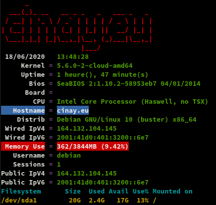


### Domaine yanfi.net

DNS OVH yanfi.net géré par le serveur cinay.eu   
Remplacer 51.75.120.106 &rarr; 164.132.104.145
Remplacer 2001:41d0:305:2100::4dc0 &rarr; 2001:41d0:401:3200::6e7

Administration Yunohost &rarr; ajout domaine yanfi.net  
Domaine yanfi.net **Configuration DNS** et ajuster le domaine yanfi.net sur OVH  

```bash
$TTL 3600
@	IN SOA dns110.ovh.net. tech.ovh.net. (2020072800 86400 3600 3600000 300)
                         IN NS     dns110.ovh.net.
                         IN NS     ns110.ovh.net.
                         IN MX     10 yanfi.net.
                         IN A      164.132.104.145
                         IN AAAA   2001:41d0:401:3200::6e7
                         IN CAA    128 issue "letsencrypt.org"
                     600 IN TXT    "v=spf1 a mx -all"
*                        IN CNAME  yanfi.net.
_dmarc                   IN TXT    "v=DMARC1; p=none"
_xmpp-client._tcp        IN SRV    0 5 5222 yanfi.net.
_xmpp-server._tcp        IN SRV    0 5 5269 yanfi.net.
mail._domainkey          IN TXT    ( "v=DKIM1;h=sha256;k=rsa;p=MIGfMA0GQ.......IDAQAB;" )
muc                      IN CNAME  yanfi.net.
pubsub                   IN CNAME  yanfi.net.
vjud                     IN CNAME  yanfi.net.
xmpp-upload              IN CNAME  yanfi.net.
```

Certificats en ligne de commande : `yunohost domain cert-install yanfi.net --no-checks`  

Paramétrage de la messagerie :   
Thunderbird , il faut passer par les serveurs IMAP et SMTP cinay.eu  
k-9mail android , il faut passer par les serveurs IMAP et SMTP yanfi.net

## Go Node Python

#### Go

{:width="50"}

Go installation (Debian) , installer la dernière version de Go (https://golang.org/dl/)

```bash
cd ~
wget https://golang.org/dl/go1.15.3.linux-amd64.tar.gz
sudo tar -C /usr/local -xzf go1.15.3.linux-amd64.tar.gz
rm go1.15.3.linux-amd64.tar.gz
```

Environnement de configuration

Bash: **~/.bashrc**  

```bash
mkdir -p $HOME/go
echo "export PATH=$PATH:/usr/local/go/bin:$HOME/go/bin" >> ~/.bashrc
echo "export GOPATH=$HOME/go"  >> ~/.bashrc
source ~/.bashrc
```

#### Nodejs

{:width="50"}

Installer la version LTS de nodejs pour le frontend.

    sudo apt-get install curl software-properties-common -y
    curl -sL https://deb.nodesource.com/setup_14.x | sudo bash -

```bash
## Run `sudo apt-get install -y nodejs` to install Node.js 14.x and npm
## You may also need development tools to build native addons:
     sudo apt-get install gcc g++ make
## To install the Yarn package manager, run:
     curl -sL https://dl.yarnpkg.com/debian/pubkey.gpg | sudo apt-key add -
     echo "deb https://dl.yarnpkg.com/debian/ stable main" | sudo tee /etc/apt/sources.list.d/yarn.list
     sudo apt-get update && sudo apt-get install yarn
```

Nodejs

    sudo apt-get install -y nodejs

#### Python version 3 par défaut

{:width="50"}

Pour changer la version de python à l’échelle du système, nous allons utiliser la commande update-alternatives en tant qu’utilisateur root.  
Pour visualiser toutes les alternatives disponibles de python :

    update-alternatives --list python

*update-alternatives: error: no alternatives for python*

Le message d’erreur ci-dessus indique qu’aucune alternative de python n’a été reconnue par update-alternatives.  
Pour cette raison, nous devons mettre à jour notre tableau des alternatives et inclure à la fois python2.7 et python3.7 :

    update-alternatives --install /usr/bin/python python /usr/bin/python2.7 1

*update-alternatives: using /usr/bin/python2.7 to provide /usr/bin/python (python) in auto mode*

    update-alternatives --install /usr/bin/python python /usr/bin/python3.7 2

*update-alternatives: using /usr/bin/python3.7 to provide /usr/bin/python (python) in auto mode*

L’option --install prend plusieurs arguments à partir desquels il sera capable de créer un lien symbolique. Le dernier argument spécifié défini la priorité, si aucune sélection manuelle alternative n’est donnée, l’option avec le numéro de priorité le plus élevé sera exécutée. Dans notre cas, nous avons défini une priorité 2 pour /usr/bin/python3.7 et de ce fait /usr/bin/python3.7 a été définie comme la version python par défaut par update-alternatives.

    python --version

*Python 3.7.3*

Installer pip3

    sudo apt install python3-pip

## SSHFS partage xoyaz.xyz

*Secure shell file system (ou SSHFS) permet le partage d'un système de fichiers de manière sécurisée en utilisant le protocole SFTP de SSH*

Le but, créer un accès réseau sur un autre serveur pour les gros volumes de fichiers (musique, livres, etc...)  
Le dossier local **/opt/sshfs/**

    sudo mkdir -p /opt/sshfs

Il faut créer une liaison réseau sécurisée entre **cinay.eu &larr; &rarr; xoyaz.xyz**  

    sudo apt install sshfs

Autorisations

* Autorisations "utilisateur"
     * Exécuter `sshfs` (ou toute autre commande de montage FUSE) avec l’option `-o allow_other`
* Autoriser l’accès “root” des supports **fuse**
     * Ajouter `user_allow_other` au fichier **/etc/fuse.conf**
     * Exécuter `sshfs` (ou toute autre commande de montage FUSE) avec l’option `-o allow_root`

#### Partage avec serveur xoyaz.xyz

Clé privée **OVZ-STORAGE-128** pour accéder au serveur xoyaz.xyz

	chmod 600 /home/debian/.ssh/OVZ-STORAGE-128

**Exécution manuelle** pour authentifier la clé avec utilisateur "debian"

    sudo -s
    sshfs -o allow_other usernl@xoyaz.xyz:/home/usernl/backup /opt/sshfs -C -p 55036 -oIdentityFile=/home/debian/.ssh/OVZ-STORAGE-128

```bash
The authenticity of host '[5.2.79.107]:55036 ([5.2.79.127]:55036)' can't be established.
ECDSA key fingerprint is SHA256:PDXQBhTh4oj0cSzgnjCun+J60JDUEk7VeLH2YHZbwMc.
Are you sure you want to continue connecting (yes/no)? yes
```

>NOTE: Il faut mettre l'adresse IP du serveur , si les domaines peuvent ne pas être "résolus"

Après vérification , `ls /opt/sshfs` , déconnexion `fusermount -u /opt/sshfs`

**Montage fstab**

ajouter les lignes suivantes au fichier **/etc/fstab**

    usernl@xoyaz.xyz:/home/usernl/backup /opt/sshfs fuse.sshfs _netdev,identityfile=/home/debian/.ssh/OVZ-STORAGE-128,allow_other,port=55036 0 0

Montage pour authentifier la clé avec utilisateur "root"

    sudo mount -a
    
Vérification    

    ls /opt/sshfs

```bash
CalibreTechnique  musique  yunohost.backup.cinay.xyz
```

## Wireguard

{:width="150"}

*WireGuard est un serveur VPN à code source ouvert, gratuit, moderne et rapide, doté d'une cryptographie de pointe. Il est plus rapide et plus simple que l'IPSec et l'OpenVPN*

### Installation

En mode su  

Wireguard est dans le noyau 5.6+ , les dépendances sont inutiles avec ce noyau

    apt install --no-install-recommends wireguard-tools

**Générer une paire de clés**

On se positionne dans le dossier **/etc/wireguard/**  

    cd /etc/wireguard

WireGuard repose sur une authentification par clé publique/privée (cryptographie asymétrique), vous devez donc créer ces clés avec les sous-commandes wg genkey et wg pubkey  
La création de la clé privée se fait avec wg genkey et la clé publique est générée en la canalisant dans wg pubkey

    umask 077; wg genkey | tee vps506197-private.key | wg pubkey > vps506197-public.key

**Copier le contenu des clés dans un gestionnaire de mot de passe puis effacer les 2 fichiers**

**Autoriser le serveur Wireguard à relayer les paquets **

Autoriser le serveur Wireguard à relayer les paquets venant de ces clients vers l'internet et de traiter les paquets retours (modifier **/etc/sysctl.conf**)

```bash
sed -i 's/^#net.ipv4.ip_forward=1/net.ipv4.ip_forward=1/' /etc/sysctl.conf
sed -i 's/^#net.ipv6.conf.all.forwarding=1/net.ipv6.conf.all.forwarding=1/' /etc/sysctl.conf
sysctl -p # prise en compte immédiate
```

### configuration /etc/wireguard/wg0.conf

Récupérer le nom de la carte réseau `ip a` , dans notre cas **eth0**  

La première étape consiste à choisir une plage IPV4 privée qui sera utilisée par le serveur : **10.55.22.0/8**  

Pour une adresse IPV6 [Local IPv6 Address Generator](https://www.ultratools.com/tools/rangeGenerator)  : fd87:9aa8:e67c:5a80::/64  

Prefix/L|  fd
--------|-----------
Global ID|  879aa8e67c
Subnet ID|  5a80
Combine/CID|  fd87:9aa8:e67c:5a80::/64
IPv6 addresses|  fd87:9aa8:e67c:5a80::/64:XXXX:XXXX:XXXX:XXXX
Start Range|  fd87:9aa8:e67c:5a80:0:0:0:0
End Range|  fd87:9aa8:e67c:5a80:ffff:ffff:ffff:ffff
No. of hosts|  18446744073709551616


Nous utiliserons 10.55.22.0/24 qui se trouve dans la plage 10.55.22.0/8 . Le serveur aura l'adresse IP suivante: 10.55.22.1 . Il est également nécessaire de choisir un port, qui sera exposé publiquement, pour que le serveur écoute.Le port de documentation standard est généralement 51820.

Créer le fichier **/etc/wireguard/wg0.conf**

    nano /etc/wireguard/wg0.conf

```conf
[Interface]
Address = 10.55.22.1/24
Address = fd87:9aa8:e67c:5a80::1/64
ListenPort = 51820
PostUp = iptables -A FORWARD -i wg0 -j ACCEPT; iptables -t nat -A POSTROUTING -o eth0 -j MASQUERADE; ip6tables -A FORWARD -i wg0 -j ACCEPT; ip6tables -t nat -A POSTROUTING -o eth0 -j MASQUERADE
PostDown = iptables -D FORWARD -i wg0 -j ACCEPT; iptables -t nat -D POSTROUTING -o eth0 -j MASQUERADE; ip6tables -D FORWARD -i wg0 -j ACCEPT; ip6tables -t nat -D POSTROUTING -o eth0 -j MASQUERADE
PrivateKey = 5Zsr0jQXiuCpHFkye325Zsr0jMUKinVEOPmk=
DNS = 10.55.22.1
DNS = fd87:9aa8:e67c:5a80::1
SaveConfig = true
```

**Address** , fixer l'adresse IP privée du serveur à l'intérieur du VPN.Les adresses du réseau VPN de 10.55.22.0 à 10.55.22.255 sont fixées par le masque **/24**  
**PostUp** , pour la mise en place des règles iptables de translation d'adresses à l'activation du VPN (autoriser le routage des paquets réseau venant des clients vers internet)  
**PostDown** , pour la suppression des règles iptables de translation d'adresses à l'arrêt du VPN  
**PrivateKey** , clé privée du serveur

Modification des droits (lecture uniquement par "root")

    chmod 600 /etc/wireguard/wg0.conf

### Ouvrir le port 51820

    yunohost firewall allow UDP 51820  # wireguard

### DNS - dnsmasq

Ajouter une configuration dnsmasq **wireguard** pour y ajouter les adresses ip du serveur `127.0.0.1,10.55.22.1,fd87:9aa8:e67c:5a80::1`

    sudo nano /etc/dnsmasq.d/wireguard

```bash
listen-address=127.0.0.1,10.55.22.1,fd87:9aa8:e67c:5a80::1
```

Relancer le service

    sudo systemctl restart dnsmasq

### Wireguard web (wg.cinay.eu)

#### Installation wg-gen-web

Création dossier application web

    sudo mkdir -p /opt/appwg

Copier le git wg-gen-web

    cd ~
    git clone https://gitea.cinay.eu/yann/wg-gen-web.git

Construction du site

```bash
sudo ln -s $HOME/wg-gen-web /usr/local/go/src/wg-gen-web
cd $HOME/wg-gen-web/cmd/wg-gen-web/
go build -o deb-wg-gen-web
cd ../../ui
npm install
npm run build
sudo cp $HOME/wg-gen-web/cmd/wg-gen-web/deb-wg-gen-web /opt/appwg
sudo mkdir -p /opt/appwg/ui
sudo cp -r $HOME/wg-gen-web/ui/dist /opt/appwg/ui/
```

#### Configuration fichier .env

Créer le fichier  de configuration **.env** (pas de oath et messagerie) à partir du modèle

Dans le cas ou l'autorisation à 2 facteurs n'est pas utilisée, le fichier **/opt/appwg/.env** se résume à remplir la zone correspondante SMTP de la messagerie et désactiver l'autorisation

    sudo nano /opt/appwg/.env

```env
# IP address to listen to
SERVER=0.0.0.0
# port to bind
PORT=8080
# Gin framework release mode
GIN_MODE=release
# where to write all generated config files
WG_CONF_DIR=/etc/wireguard
# WireGuard main config file name, generally <interface name>.conf
WG_INTERFACE_NAME=wg0.conf

# SMTP settings to send email to clients
SMTP_HOST=smtp.gmail.com
SMTP_PORT=587
SMTP_USERNAME=account@gmail.com
SMTP_PASSWORD=*************
SMTP_FROM=Wg Gen Web <account@gmail.com>

# set provider name to fake to disable auth, also the default
OAUTH2_PROVIDER_NAME=fake
```  

#### Création service wgweb 

Créer un service systemd **wgweb** qui lance le serveur avec journalisation  

    sudo nano /etc/systemd/system/wgweb.service

```ini
[Unit]
Description=Gestion web wg
After=network.target

[Service]

Type=simple

Restart=on-failure
RestartSec=10

WorkingDirectory=/opt/appwg
ExecStart=/opt/appwg/deb-wg-gen-web

[Install]
WantedBy=multi-user.target
```

Recharger `systemd` et activer le service

    sudo systemctl daemon-reload
    sudo systemctl enable wgweb.service

#### Paramètrage serveur (wg0.conf et server.json)

Créer le fichier **/etc/wireguard/server.json**

    sudo nano /etc/wireguard/server.json 

```json
{
  "address": [
    "fd87:9aa8:e67c:5a80::1/64",
    "10.55.22.1/24"
  ],
  "listenPort": 51820,
  "mtu": 0,
  "privateKey": "UEQCgh/6a2RQbF9+qqylVjqLCK/mRwqRPc/4vjRsYXg=",
  "publicKey": "0s1wsNpuU1RlKgj6AmoN0aKUeb+aESByhO3yTSnfTyE=",
  "endpoint": "164.132.104.145:51820",
  "persistentKeepalive": 16,
  "dns": [
    "fd87:9aa8:e67c:5a80::1",
    "10.55.22.1"
  ],
  "allowedips": [
    "0.0.0.0/0",
    "::/0"
  ],
  "preUp": "",
  "postUp": "iptables -A FORWARD -i wg0 -j ACCEPT; iptables -t nat -A POSTROUTING -o eth0 -j MASQUERADE; ip6tables -A FORWARD -i wg0 -j ACCEPT; ip6tables -t nat -A POSTROUTING -o eth0 -j MASQUERADE",
  "preDown": "",
  "postDown": "iptables -D FORWARD -i wg0 -j ACCEPT; iptables -t nat -D POSTROUTING -o eth0 -j MASQUERADE; ip6tables -D FORWARD -i wg0 -j ACCEPT; ip6tables -t nat -D POSTROUTING -o eth0 -j MASQUERADE",
  "updatedBy": "n",
  "created": "2020-05-17T21:00:00.589913433Z",
  "updated": "2020-05-17T21:05:00.466114026Z"
}
```

Démarrer le service

    sudo systemctl start wgweb.service
    sudo systemctl status wgweb.service

```bash
● wgweb.service - Gestion web wg
   Loaded: loaded (/etc/systemd/system/wgweb.service; enabled; vendor preset: enabled)
   Active: active (running) since Thu 2020-06-18 14:47:13 CEST; 13s ago
 Main PID: 20718 (deb-wg-gen-web)
    Tasks: 5 (limit: 4593)
   Memory: 6.8M
   CGroup: /system.slice/wgweb.service
           └─20718 /opt/appwg/deb-wg-gen-web

Jun 18 14:47:13 cinay.eu systemd[1]: Started Gestion web wg.
Jun 18 14:47:13 cinay.eu deb-wg-gen-web[20718]: time="2020-06-18T14:47:13+02:00" level=info msg="Lancement de la version Web de Wg Gen : yann"
Jun 18 14:47:13 cinay.eu deb-wg-gen-web[20718]: time="2020-06-18T14:47:13+02:00" level=warning msg="Oauth n'est pas utilisé, aucune authentification réelle ne sera effectuée"
```

Pour suivre  dans le journal

    sudo journalctl -f -t deb-wg-gen-web

```bash
-- Logs begin at Sun 2020-05-17 13:06:29 CEST. --
May 17 21:21:23 cinay.eu deb-wg-gen-web[30596]: time="2020-05-17T21:21:23+02:00" level=info msg="Lancement de la version Web de Wg Gen : yann"
May 17 21:21:23 cinay.eu deb-wg-gen-web[30596]: time="2020-05-17T21:21:23+02:00" level=warning msg="Oauth n'est pas utilisé, aucune authentification réelle ne sera effectuée"
```

#### Activation service wireguard wg-quick@wg0.service

Le gestionnaire web est à jour , on peut lancer le serveur wireguard

    sudo systemctl start wg-quick@wg0.service

Vérifier

    systemctl status wg-quick@wg0.service

```bash
● wg-quick@wg0.service - WireGuard via wg-quick(8) for wg0
   Loaded: loaded (/lib/systemd/system/wg-quick@.service; disabled; vendor preset: enabled)
   Active: active (exited) since Thu 2020-06-18 14:54:23 CEST; 8s ago
     Docs: man:wg-quick(8)
           man:wg(8)
           https://www.wireguard.com/
           https://www.wireguard.com/quickstart/
           https://git.zx2c4.com/wireguard-tools/about/src/man/wg-quick.8
           https://git.zx2c4.com/wireguard-tools/about/src/man/wg.8
  Process: 1404 ExecStart=/usr/bin/wg-quick up wg0 (code=exited, status=0/SUCCESS)
 Main PID: 1404 (code=exited, status=0/SUCCESS)

Jun 18 14:54:23 cinay.eu systemd[1]: Starting WireGuard via wg-quick(8) for wg0...
Jun 18 14:54:23 cinay.eu wg-quick[1404]: [#]
Jun 18 14:54:23 cinay.eu wg-quick[1404]: [#] ip link add wg0 type wireguard
Jun 18 14:54:23 cinay.eu wg-quick[1404]: [#] wg setconf wg0 /dev/fd/63
Jun 18 14:54:23 cinay.eu wg-quick[1404]: [#] ip -6 address add fd87:9aa8:e67c:5a80::1/64 dev wg0
Jun 18 14:54:23 cinay.eu wg-quick[1404]: [#] ip -4 address add 10.55.22.1/24 dev wg0
Jun 18 14:54:23 cinay.eu wg-quick[1404]: [#] ip link set mtu 1420 up dev wg0
Jun 18 14:54:23 cinay.eu wg-quick[1404]: [#] iptables -A FORWARD -i wg0 -j ACCEPT; iptables -t nat -A POSTROUTING -o eth0 -j MASQUERADE; ip6tables -A FORWARD -i wg0 -j ACCEPT; ip6tables -t nat -A POSTROUTING -o eth0 -j MASQUERADE
Jun 18 14:54:23 cinay.eu systemd[1]: Started WireGuard via wg-quick(8) for wg0.
```

Activer

    sudo systemctl enable  wg-quick@wg0.service

#### Modification automatique du paramétrage WireGuard

Utilisation de **systemd.path** monitor pour les changements dans le répertoire, voir [systemd doc](https://www.freedesktop.org/software/systemd/man/systemd.path.html)

    sudo nano /etc/systemd/system/wg-gen-web.path

```ini
[Unit]
Description=Surveiller /etc/wireguard pour les changements

[Path]
PathModified=/etc/wireguard

[Install]
WantedBy=multi-user.target
```

Ce **wg-gen-web.path** activera le fichier de l'unité avec le même nom, **wg-gen-web.service**

    sudo nano /etc/systemd/system/wg-gen-web.service

```ini
[Unit]
Description=Relancer WireGuard si changements
After=network.target

[Service]
Type=oneshot
ExecStart=/usr/bin/systemctl restart wg-quick@wg0.service

[Install]
WantedBy=multi-user.target
```

Ce qui permettra de relancer le service WireGuard

    sudo systemctl start wg-gen-web.path
    sudo systemctl status wg-gen-web.path

```bash
● wg-gen-web.path - Surveiller /etc/wireguard pour les changements
   Loaded: loaded (/etc/systemd/system/wg-gen-web.path; disabled; vendor preset: enabled)
   Active: active (waiting) since Thu 2020-06-18 14:56:46 CEST; 29ms ago

Jun 18 14:56:46 cinay.eu systemd[1]: Started Surveiller /etc/wireguard pour les changements.
```

Activation

    sudo systemctl enable wg-gen-web.path

Pour suivre  dans le journal

    sudo journalctl -f -t wg-quick

```bash
-- Logs begin at Thu 2020-06-18 14:50:27 CEST. --
Jun 18 14:54:23 cinay.eu wg-quick[1404]: [#]
Jun 18 14:54:23 cinay.eu wg-quick[1404]: [#] ip link add wg0 type wireguard
Jun 18 14:54:23 cinay.eu wg-quick[1404]: [#] wg setconf wg0 /dev/fd/63
Jun 18 14:54:23 cinay.eu wg-quick[1404]: [#] ip -6 address add fd87:9aa8:e67c:5a80::1/64 dev wg0
Jun 18 14:54:23 cinay.eu wg-quick[1404]: [#] ip -4 address add 10.55.22.1/24 dev wg0
Jun 18 14:54:23 cinay.eu wg-quick[1404]: [#] ip link set mtu 1420 up dev wg0
Jun 18 14:54:23 cinay.eu wg-quick[1404]: [#] iptables -A FORWARD -i wg0 -j ACCEPT; iptables -t nat -A POSTROUTING -o eth0 -j MASQUERADE; ip6tables -A FORWARD -i wg0 -j ACCEPT; ip6tables -t nat -A POSTROUTING -o eth0 -j MASQUERADE
```

#### Le site web wireguard (wg.cinay.eu)

Créer le domaine wg.cinay.eu et les certificats

    sudo -s
    yunohost domain add wg.cinay.eu
    yunohost domain cert-install wg.cinay.eu --no-checks

Installer application Multi web app

    sudo -s
    git clone https://gitea.cinay.eu/yann/multi_webapp_buster_ynh
    yunohost app install multi_webapp_buster_ynh/

```bash
DANGER! This app is not part of Yunohost's app catalog. Installing third-party apps may compromise the integrity and security of your system. You should probably NOT install it unless you know what you are doing. NO SUPPORT will be provided if this app doesn't work or breaks your system… If you are willing to take that risk anyway, type 'Yes, I understand': Yes, I understand
Available domains:
- cinay.eu
- wg.cinay.eu
Choose a domain for your Webapp (default: cinay.eu): wg.cinay.eu
Choose a path for your Webapp (default: /site): /
Available users:
- yann
Choose the YunoHost user: yann
Create a database? [yes | no] (default: no): 
Is it a public website ? [yes | no] (default: no): 
Info: Installing the app 'multi_webapp'…
Info: [+...................] > Retrieve arguments from the manifest
Info: [#+..................] > Check if the app can be installed
Info: [##+++...............] > Store settings from manifest
Info: [#####+..............] > Setup SSOwat
Info: [######+.............] > Create final path
Info: The directory /var/www/webapp_yann already exist, do not recreate it.
Info: [#######+++..........] > Create a dedicated user
Info: [##########+.........] > Configure php-fpm
Info: [###########+........] > Configure nginx
Info: [############+++++...] > Reload nginx
Info: [####################] > Installation completed
Success! Installation completed
```

**Proxy nginx**

    sudo mv /etc/nginx/conf.d/wg.cinay.eu.d/webapp_wg.cinay.eu_.conf /etc/nginx/conf.d/wg.cinay.eu.d/webapp_wg.cinay.eu_.conf.SAV
    sudo nano /etc/nginx/conf.d/wg.cinay.eu.d/webapp_wg.cinay.eu_.conf 

```nginx
#sub_path_only rewrite ^/$ / permanent;
location / {
  proxy_pass http://127.0.0.1:8080/;
    proxy_set_header            Host $host;
    proxy_buffering off;
    fastcgi_param REMOTE_USER   $remote_user;
    client_max_body_size        50M;
    more_set_input_headers      'Authorization: $http_authorization';
    proxy_set_header            Authorization $http_authorization;

	# Include SSOWAT user panel.
	include conf.d/yunohost_panel.conf.inc;
}
```

On vérifie et on relance le serveur nginx

    sudo nginx -t
    sudo systemctl reload nginx

Changer libellé (en mode administration) : **Wireguard Web Admin**  
Accès https://wg.cinay.eu

## Audio streaming

*Au choix Gonic ou Navidrome (pas les deux!)*

### Gonic (INACTIF)

{:width="100"}  
*[Gonic](https://github.com/sentriz/gonic) écrit en go est une alternative à Subsonic.org, accessible par un proxy nginx qui accepte de fonctionner avec répertoires montés par FUSE.* 

#### Installation gonic

dans le répertoire utilisateur **$HOME**

    # les dépendances
    sudo apt install build-essential git sqlite libtag1-dev ffmpeg libasound2-dev pkg-config # for debian like
    cd $HOME/
    # cloner 
    git clone https://gitea.cinay.eu/yann/golang-subsonic.git
    cd golang-subsonic/

Construire l'exécutable "gonic" et le copier dans /usr/local/bin

    ./_do_build_server
    sudo mv gonic /usr/local/bin/   

Créer le dossier pour la base

    sudo mkdir -p /opt/gonic

#### Créer le service gonic

Que fait le service ?

* Le dossier fuse est monté au démarrage par fstab
* lancer le serveur "gonic" en écoute local sur le port 4747 avec les options `-music-path`, `-db-path` et `-proxy-prefix` 
* A l'arrêt,tuer la tâche "gonic" 

Tester le serveur

    sudo -s
    /usr/local/bin/gonic -music-path /opt/sshfs/musique -db-path /opt/gonic/gonic.db -proxy-prefix /

```
2020/05/19 17:56:37 starting gonic v0.8.8
2020/05/19 17:56:37 provided config
2020/05/19 17:56:37     cache-path      /tmp/gonic_cache
2020/05/19 17:56:37     config-path     
2020/05/19 17:56:37     db-path         /opt/gonic/gonic.db
2020/05/19 17:56:37     jukebox-enabled false
2020/05/19 17:56:37     listen-addr     0.0.0.0:4747
2020/05/19 17:56:37     music-path      /opt/sshfs/musique
2020/05/19 17:56:37     proxy-prefix    /
2020/05/19 17:56:37     scan-interval   0
2020/05/19 17:56:37     version         false
2020/05/19 17:56:37 migration (1/7) '202002192100' finished
2020/05/19 17:56:37 migration (2/7) '202002192019' finished
2020/05/19 17:56:37 migration (3/7) '202002192222' finished
2020/05/19 17:56:37 migration (4/7) '202003111222' finished
2020/05/19 17:56:37 migration (5/7) '202003121330' finished
2020/05/19 17:56:37 migration (6/7) '202003241509' finished
2020/05/19 17:56:37 migration (7/7) '202004302006' finished
2020/05/19 17:56:37 starting job 'http'
```

Arrêt par Ctrl+C

Chaque service généré par systemd est configuré par un fichier .service qui se trouve dans le répertoire **/etc/systemd/system**

    sudo nano /etc/systemd/system/gonic.service

```
[Unit]
Description=Gonic audio server
After=network.target

[Service]
Type=simple

Restart=on-failure
RestartSec=10

ExecStart=/usr/local/bin/gonic -music-path /opt/sshfs/musique -db-path /opt/gonic/gonic.db -proxy-prefix /

[Install]
WantedBy=multi-user.target
```

Recharger `systemd` puis démarrer le service:

    sudo systemctl daemon-reload
    sudo systemctl start gonic.service

Visualiser le journal

    sudo journalctl -t gonic
    
```
-- Logs begin at Thu 2020-06-18 14:50:27 CEST, end at Thu 2020-06-18 15:26:43 CEST. --
Jul 19 17:47:22 cinay.eu gonic[636]: 2020/07/19 17:47:22 starting gonic v0.8.8
Jul 19 17:47:22 cinay.eu gonic[636]: 2020/07/19 17:47:22 provided config
Jul 19 17:47:22 cinay.eu gonic[636]: 2020/07/19 17:47:22     cache-path      /tmp/gonic_cache
Jul 19 17:47:22 cinay.eu gonic[636]: 2020/07/19 17:47:22     config-path
Jul 19 17:47:22 cinay.eu gonic[636]: 2020/07/19 17:47:22     db-path         /opt/gonic/gonic.db
Jul 19 17:47:22 cinay.eu gonic[636]: 2020/07/19 17:47:22     jukebox-enabled false
Jul 19 17:47:22 cinay.eu gonic[636]: 2020/07/19 17:47:22     listen-addr     0.0.0.0:4747
Jul 19 17:47:22 cinay.eu gonic[636]: 2020/07/19 17:47:22     music-path      /opt/sshfs/musique
Jul 19 17:47:22 cinay.eu gonic[636]: 2020/07/19 17:47:22     proxy-prefix    /
Jul 19 17:47:22 cinay.eu gonic[636]: 2020/07/19 17:47:22     scan-interval   0
Jul 19 17:47:22 cinay.eu gonic[636]: 2020/07/19 17:47:22     version         false
Jul 19 17:47:22 cinay.eu gonic[636]: 2020/07/19 17:47:22 starting job 'http'
```
    
Si tout est en ordre , on active le service

	sudo systemctl enable gonic.service

Pour une désactivation

    sudo systemctl stop gonic.service
    sudo systemctl disable gonic.service

### Navidrome

*[Navidrome](https://www.navidrome.org/docs/installation/pre-built-binaries/) est un serveur de collecte de musique et de streaming sur le web, à code source ouvert. Il vous donne la liberté d'écouter votre 
collection de musique à partir de n'importe quel navigateur ou appareil mobile. C'est comme votre Spotify personnel !*

#### Installation Navidrome

Créer les répertoires

```
sudo install -d -o debian -g debian /opt/navidrome
sudo install -d -o debian -g debian /var/lib/navidrome
```

La [dernière version](https://github.com/deluan/navidrome/releases) 

```
wget https://github.com/deluan/navidrome/releases/download/v0.35.1/navidrome_0.35.1_Linux_x86_64.tar.gz -O Navidrome.tar.gz
sudo tar -xvzf Navidrome.tar.gz -C /opt/navidrome/
sudo chown -R debian:debian /opt/navidrome
```

Créer le fichier de configuration `/var/lib/navidrome/navidrome.toml`

    MusicFolder = "/opt/sshfs/musique"

#### Créer le service navidrome

Créer un service `/etc/systemd/system/navidrome.service` en mode su

```
[Unit]
Description=Navidrome Music Server and Streamer compatible with Subsonic/Airsonic
After=remote-fs.target network.target
AssertPathExists=/var/lib/navidrome

[Install]
WantedBy=multi-user.target

[Service]
User=debian
Group=debian
Type=simple
ExecStart=/opt/navidrome/navidrome --configfile "/var/lib/navidrome/navidrome.toml"
WorkingDirectory=/var/lib/navidrome
TimeoutStopSec=20
KillMode=process
Restart=on-failure

# See https://www.freedesktop.org/software/systemd/man/systemd.exec.html
DevicePolicy=closed
NoNewPrivileges=yes
PrivateTmp=yes
PrivateUsers=yes
ProtectControlGroups=yes
ProtectKernelModules=yes
ProtectKernelTunables=yes
RestrictAddressFamilies=AF_UNIX AF_INET AF_INET6
RestrictNamespaces=yes
RestrictRealtime=yes
SystemCallFilter=~@clock @debug @module @mount @obsolete @reboot @setuid @swap
ReadWritePaths=/var/lib/navidrome

# You can uncomment the following line if you're not using the jukebox This
# will prevent navidrome from accessing any real (physical) devices
#PrivateDevices=yes

# You can change the following line to `strict` instead of `full` if you don't
# want navidrome to be able to write anything on your filesystem outside of
# /var/lib/navidrome.
ProtectSystem=full

# You can comment the following line if you don't have any media in /home/*.
# This will prevent navidrome from ever reading/writing anything there.
#ProtectHome=true

```

Démarrer le service

```
sudo systemctl daemon-reload
sudo systemctl start navidrome.service
```

Le status

    sudo systemctl status navidrome.service

```
● navidrome.service - Navidrome Music Server and Streamer compatible with Subsonic/Airsonic
   Loaded: loaded (/etc/systemd/system/navidrome.service; disabled; vendor preset: enabled)
   Active: active (running) since Mon 2020-10-12 16:40:15 CEST; 10s ago
 Main PID: 23957 (navidrome)
    Tasks: 5 (limit: 4593)
   Memory: 14.5M
   CGroup: /system.slice/navidrome.service
           └─23957 /opt/navidrome/navidrome --configfile /var/lib/navidrome/navidrome.toml

Oct 12 16:40:15 cinay.eu navidrome[23957]: time="2020-10-12T16:40:15+02:00" level=info msg="Configuring Media Folder" name="Music Library" path=/opt/sshfs/musique
Oct 12 16:40:15 cinay.eu navidrome[23957]: time="2020-10-12T16:40:15+02:00" level=info msg="Creating Transcoding cache" maxSize="100 MB" path=cache/transcoding
Oct 12 16:40:15 cinay.eu navidrome[23957]: time="2020-10-12T16:40:15+02:00" level=warning msg="Running initial setup"
Oct 12 16:40:15 cinay.eu navidrome[23957]: time="2020-10-12T16:40:15+02:00" level=warning msg="Creating JWT secret, used for encrypting UI sessions"
Oct 12 16:40:15 cinay.eu navidrome[23957]: time="2020-10-12T16:40:15+02:00" level=info msg="Starting scanner" interval=1m0s
Oct 12 16:40:15 cinay.eu navidrome[23957]: time="2020-10-12T16:40:15+02:00" level=info msg="Mounting routes" path=/rest
Oct 12 16:40:15 cinay.eu navidrome[23957]: time="2020-10-12T16:40:15+02:00" level=info msg="Mounting routes" path=/app
Oct 12 16:40:15 cinay.eu navidrome[23957]: time="2020-10-12T16:40:15+02:00" level=info msg="Login rate limit set" requestLimit=5 windowLength=20s
Oct 12 16:40:15 cinay.eu navidrome[23957]: time="2020-10-12T16:40:15+02:00" level=info msg="Navidrome server is accepting requests" address="0.0.0.0:4533"
```

Activer

    sudo systemctl enable  navidrome.service

Modier le binaire `navidrome`  qui est situé dans le dossier `/opt/navidrome/`

    sudo systemctl stop  navidrome.service
    # Remplacer le binaire `/opt/navidrome/navidrome` par une version plus récente
    sudo systemctl start  navidrome.service

### zic.cinay.eu - domaine et proxy

#### Créer le domaine zic.cinay.eu

Créer le domaine zic.cinay.eu et les certificats

    sudo -s
    yunohost domain add zic.cinay.eu
    yunohost domain cert-install zic.cinay.eu --no-checks

Installer l’application Multi web app sur le domaine zic.cinay.eu   

    sudo -s
    git clone https://gitea.cinay.eu/yann/multi_webapp_buster_ynh
    yunohost app install multi_webapp_buster_ynh/

```bash
[...]
Choose a domain for your Webapp (default: cinay.eu): zic.cinay.eu
Choose a path for your Webapp (default: /site): /
Available users:
- yann
Choose the YunoHost user: yann
Create a database? [yes | no] (default: no): 
Is it a public website ? [yes | no] (default: no): yes
[...]
Success! Installation completed
```

Voir <https://yunohost.org/#/groups_and_permissions>

    yunohost user permission list
    
```
permissions: 
  mail.main: 
    allowed: all_users
  multi_webapp.main: 
    allowed: all_users
  multi_webapp__2.main: 
    allowed: 
      - visitors
      - all_users
  xmpp.main: 
    allowed: all_users
```

On voit que `multi_webapp__2.main` (zic.cinay.eu) à un accès complet sans aucune autorisation  
Changer le libellé en **Zic Audio Server**  

    yunohost app change-label multi_webapp__2 'Zic Audio Server'

#### proxy nginx

*Gonic est un serveur local http sur le port 4747 , Navidrome est un serveur local http sur le port 4747* 

    sudo mv /etc/nginx/conf.d/zic.cinay.eu.d/webapp_zic.cinay.eu_.conf /etc/nginx/conf.d/zic.cinay.eu.d/webapp_zic.cinay.eu_.conf.SAV
    sudo nano /etc/nginx/conf.d/wg.cinay.eu.d/webapp_wg.cinay.eu_.conf 

**Proxy nginx** - configuration **/etc/nginx/conf.d/zic.cinay.eu.d/webapp_zic.cinay.eu_.conf**

    sudo nano /etc/nginx/conf.d/zic.cinay.eu.d/webapp_zic.cinay.eu_.conf

```
#sub_path_only rewrite ^/$ / permanent;
location / {
    # Proxy zic server

      proxy_set_header        Host $host;
      proxy_set_header        X-Real-IP $remote_addr;
      proxy_set_header        X-Forwarded-For $proxy_add_x_forwarded_for;
      proxy_set_header        X-Forwarded-Proto $scheme;
      # Gonic port 4747, Navidrome port 4533
      proxy_pass          http://localhost:4533;
      proxy_read_timeout  120;

	# Include SSOWAT user panel.
	include conf.d/yunohost_panel.conf.inc;
}
```

On vérifie et on relance le serveur nginx

    sudo nginx -t
    sudo systemctl reload nginx

Accès <https://zic.cinay.eu>

**Gonic**  
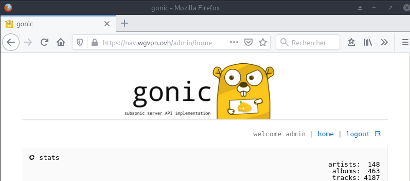{:width="400"}  

**Navidrome**  
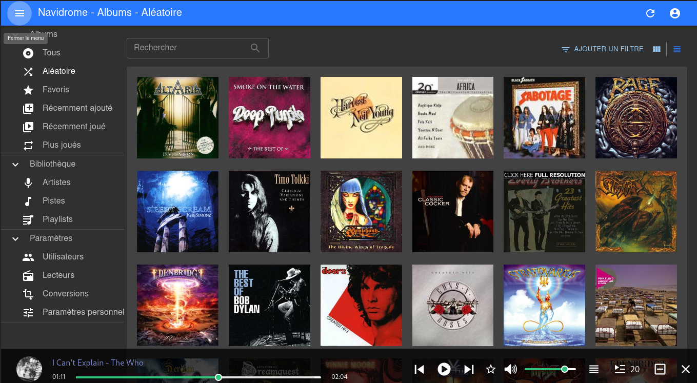{:width="400"}


## Applications

### Calibre Web (/tech /books)

#### Doc technique (cinay.eu/tech)

Installer l'application **Calibre-web**  

    yunohost app install https://github.com/YunoHost-Apps/calibreweb_ynh

```
Choose the domain where this app should be installed [cinay.eu | div.cinay.eu | gitea.cinay.eu | static.cinay.eu | wg.cinay.eu | zic.cinay.eu | yanfi.net] (default: cinay.eu): 
Choose the path where this app should be installed (default: /calibre): /tech
Choose an administrator user for this app [yann | claudine | yanfi] (default: yann): 
Should this app be exposed to anonymous visitors? [yes | no] (default: no): 
Select a default language [fr | en | es | de] (default: fr): 
Do you want to allow uploading of books? [yes | no] (default: no): 
Do you want to allow access to the library to all Yunohost users?  [yes | no] (default: yes): 
[...]
Success! Installation completed
```

Emplacement par défaut de la base de donnée Calibre : **/home/yunohost.multimedia/share/eBook/**  


Ouvrir l'application https://cinay.eu/tech et basculer en administration   
Editer la **Configuration principale** , modifier le dossier bibliothèque `/opt/sshfs/CalibreTechnique`

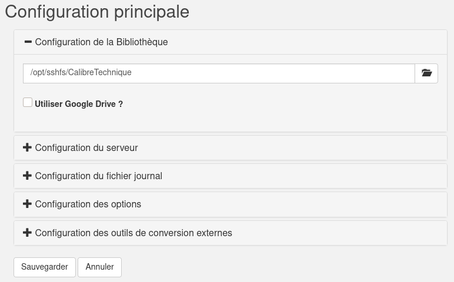{:width="600"}

Changer le nom de l'application calibre-web

    yunohost app change-label calibreweb 'Documentation Technique'

Accès documentation technique <https://cinay.eu/tech>

#### Livres et romans (cinay.eu/books)

Installer l'application **Calibre-web**  

    yunohost app install https://github.com/YunoHost-Apps/calibreweb_ynh

```
[...]
Choose a path for Calibre-web (default: /calibre): /books
[...]
Success! Installation completed
```

Emplacement par défaut de la base de donnée Calibre : **/home/yunohost.multimedia/share/eBook/**  


Ouvrir l'application https://cinay.eu/books et basculer en administration   
Editer la **Configuration principale** , dossier bibliothèque  : `/opt/sshfs/BiblioCalibre`   
Changer le nom de l'application calibre-web

    yunohost app change-label calibreweb__2 'Livres et romans'

Accès documentation 'Livres et romans' <https://cinay.eu/books>

### Shaarli (cinay.eu/shaarli)

{:width="50px"}  
*Shaarli est un logiciel libre permettant de sauvegarder, trier, synchroniser et partager des adresses web.*

Installation

    yunohost app install shaarli

```
Available domains:
- cinay.eu
- wg.cinay.eu
- zic.cinay.eu
- searx.cinay.eu
Choose a domain for your Shaarli (default: cinay.eu): 
Choose a path for your Shaarli (default: /shaarli): 
Is it a public Shaarli site ? [yes | no] (default: no): yes
Info: Installing the app 'shaarli'…
Info: Validating installation parameters...
Info: Storing installation settings...
Info: Installing dependencies...
Info: Setting up source files...
Info: Configuring nginx web server...
Info: Configuring system user...
Info: Configuring php-fpm...
Info: Configuring log rotation...
Info: Set permissions...
Info: Set rights...
Warning: Too many arguments ! "1" will be ignored.
Info: Add Fail2Ban configuration...
Warning: Too many arguments ! "1" will be ignored.
Info: Configuring SSOwat...
Warning: /!\ Packagers! This app is still using the skipped/protected/unprotected_uris/regex settings which are now obsolete and deprecated... Instead, you should use the new helpers 'ynh_permission_{create,urls,update,delete}' and the 'visitors' group to initialize the public/private access. Check out the documentation at the bottom of yunohost.org/groups_and_permissions to learn how to use the new permission mechanism.
Info: Reloading nginx web server...
Info: Installation of shaarli completed
Success! Installation completed
```

liens publiques cinay.eu/shaarli <https://cinay.eu/shaarli/?do=tagcloud>   

Ajout signet (cinay.eu/shaarli) 

```
javascript:(function(){            
    var%20url%20=%20location.href;            
    var%20title%20=%20document.title%20||%20url;
    var%20desc=document.getSelection().toString();
    if(desc.length>4000){              
        desc=desc.substr(0,4000)+'...';                
        alert('Le%20texte%20s%C3%A9lectionn%C3%A9%20est%20trop%20long,%20il%20sera%20tronqu%C3%A9.');
    }            
 window.open('https://cinay.eu/shaarli/?post='%20+%20encodeURIComponent(url)+              '&title='%20+%20encodeURIComponent(title)+              '&description='%20+%20encodeURIComponent(desc)+              '&source=bookmarklet','_blank','menubar=no,height=800,width=600,toolbar=no,scrollbars=yes,status=no,dialog=1');
})();
```

### Tiny Tiny RSS (/ttrss)

{:width="50px"}  
*Tiny Tiny RSS (ttrss) est un agrégateur de flux RSS et Atom libre sous licence libre GNU GPL v3*

Installation en mode de commande (su)

    yunohost app install ttrss

```
Available domains:
- cinay.eu
- yanfi.net
- wg.cinay.eu
- zic.cinay.eu
- searx.cinay.eu
Choose a domain for Tiny-Tiny-RSS (default: cinay.eu): 
Choose a path for Tiny-Tiny-RSS (default: /ttrss): 
Info: Installing the app 'ttrss'…
Info: [....................] > Validating installation parameters...
Info: [+...................] > Storing installation settings...
Info: [#++++...............] > Installing dependencies...
Info: [#####+..............] > Creating a MySQL database...
Info: [######++++..........] > Setting up source files...
Info: [##########..........] > Configuring nginx web server...
Info: [##########+.........] > Configuring system user...
Info: [###########+........] > Configuring php-fpm...
Info: [############+.......] > Configuring ttrss...
Info: [#############+......] > Configuring a systemd service...
Info: [##############+++...] > Initializing database...
Info: [#################...] > Starting ttrss...
Info: [#################+..] > Configuring SSOwat...
Warning: /!\ Packagers! This app is still using the skipped/protected/unprotected_uris/regex settings which are now obsolete and deprecated... Instead, you should use the new helpers 'ynh_permission_{create,urls,update,delete}' and the 'visitors' group to initialize the public/private access. Check out the documentation at the bottom of yunohost.org/groups_and_permissions to learn how to use the new permission mechanism.
Info: [##################+.] > Reloading nginx web server...
Success! Installation completed
```

Mise à jour

    yunohost app upgrade ttrss -u https://github.com/YunoHost-Apps/ttrss_ynh/tree/testing --debug


### Nextcloud (/nextcloud)

{:width="70"}

#### Installation

en ligne de commande

    yunohost app install nextcloud

```
Available domains:
- cinay.eu
- yanfi.net
- wg.cinay.eu
- zic.cinay.eu
- searx.cinay.eu
Choose a domain for Nextcloud (default: cinay.eu): 
Choose a path for Nextcloud (default: /nextcloud): 
Available users:
- yann
- claudine
- yanfi
Choose the Nextcloud administrator (must be an existing YunoHost user): yann
Access the users home folder from Nextcloud? [yes | no] (default: no): yes
Info: Installing the app 'nextcloud'…
Info: [....................] > Validating installation parameters...
Info: [....................] > Storing installation settings...
Info: [+...................] > Installing dependencies...
Warning: 
Warning: Creating config file /etc/samba/smb.conf with new version
Warning: Created symlink /etc/systemd/system/multi-user.target.wants/atd.service -> /lib/systemd/system/atd.service.
Warning: Load smb config files from /etc/samba/smb.conf
Warning: Loaded services file OK.
Warning: Server role: ROLE_STANDALONE
Warning: 
Info: [#+..................] > Creating a MySQL database...
Info: [##..................] > Setting up source files...
Info: [##..................] > Configuring nginx web server...
Info: [##+.................] > Configuring system user...
Info: [###++++++++.........] > Configuring php-fpm...
Warning: 
Warning: Creating config file /etc/php/7.3/mods-available/bz2.ini with new version
Warning: 
Warning: Creating config file /etc/php/7.3/mods-available/gmp.ini with new version
Warning: 
Warning: Creating config file /etc/php/7.3/mods-available/zip.ini with new version
Warning: 
Warning: Creating config file /etc/php/7.3/mods-available/imap.ini with new version
Info: [###########++++.....] > Installing nextcloud...
Info: [###############++...] > Configuring nextcloud...
Warning: warning: commands will be executed using /bin/sh
Warning: job 1 at Tue Jul 21 16:00:00 2020
Warning: 2020-07-21 15:51:00 URL:https://codeload.github.com/YunoHost-Apps/yunohost.multimedia/tar.gz/v1.2 [15921] -> "v1.2.tar.gz" [1]
Info: [#################+..] > Adding multimedia directories...
Info: [##################..] > Configuring log rotation...
Info: [##################+.] > Configuring fail2ban...
Info: The service fail2ban has correctly executed the action reload-or-restart.
Info: [###################.] > Configuring SSOwat...
Warning: /!\ Packagers! This app is still using the skipped/protected/unprotected_uris/regex settings which are now obsolete and deprecated... Instead, you should use the new helpers 'ynh_permission_{create,urls,update,delete}' and the 'visitors' group to initialize the public/private access. Check out the documentation at the bottom of yunohost.org/groups_and_permissions to learn how to use the new permission mechanism.
Warning: /!\ Packagers! This app is still using the skipped/protected/unprotected_uris/regex settings which are now obsolete and deprecated... Instead, you should use the new helpers 'ynh_permission_{create,urls,update,delete}' and the 'visitors' group to initialize the public/private access. Check out the documentation at the bottom of yunohost.org/groups_and_permissions to learn how to use the new permission mechanism.
Info: [###################.] > Reloading nginx web server...
Success! Installation completed
```

Dans les paramètres fichier de nextcloud , activer l'affichage des fichiers masqués  

#### Activer les applications

Activer les applications **Calendar**, **Contacts** et **Notes** sur nextcloud


#### Calendrier et contacts (android et thunderbird)

Paramétrage **OpenSync** android  
Connexion avec le lien https://cinay.eu/nextcloud/remote.php/dav (login+mdp)  
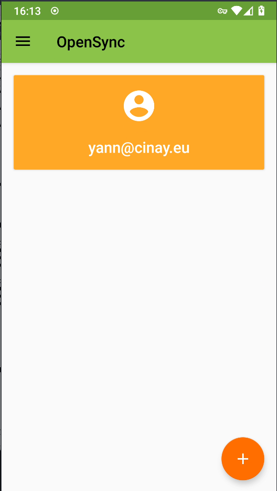{:height="300"} 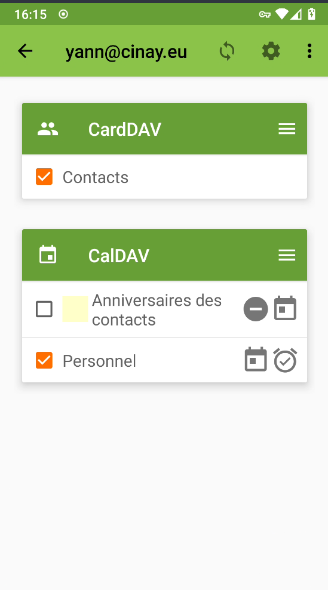{:height="300"}

Paramétrer les applications  qui utilisent le calendrier et les contacts  
**Contacts** , **acalendar**  et **Tâches**  
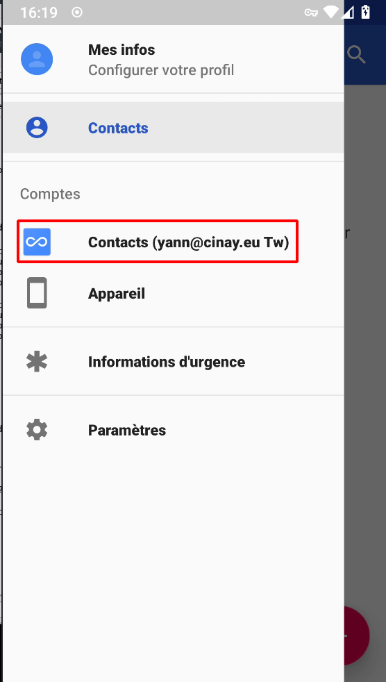{:height="300"} 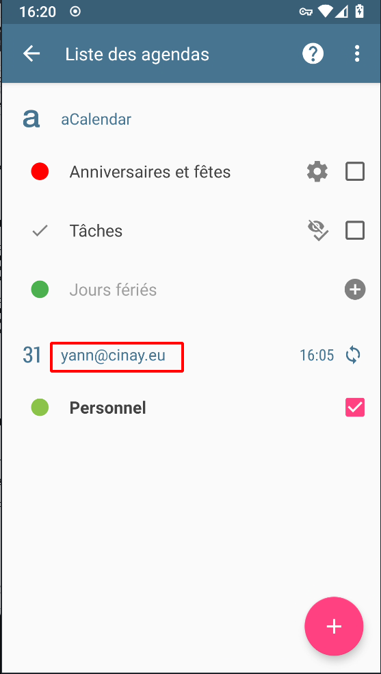{:height="300"} 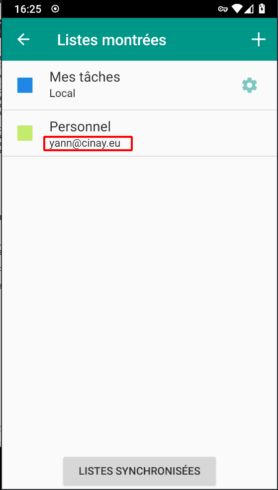{:height="300"}  

Paramétrage agenda **Thunderbird**  
{:width="300"} 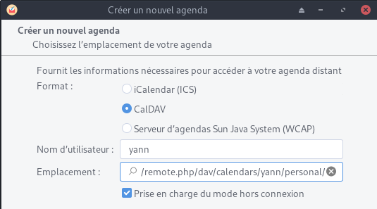{:width="300"}  
{:width="300"}  {:width="300"}
{:width="300"}  
Se désabonner de l'ancien agenda cinay.xyz

Paramétrage contacts **Thunderbird**  
Outils &rarr; Préférences des modules &rarr; TbSync   
Dans l'application  
Actions sur les comptes &rarr; Ajouter un nouveau compte &rarr; Caldav & Carddav  
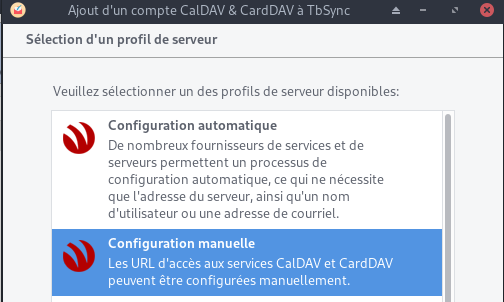{:width="300"} 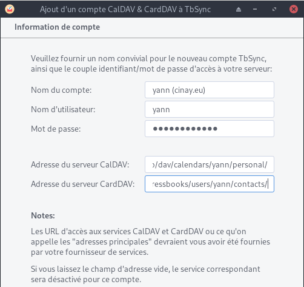{:width="300"}   
{:width="300"}   
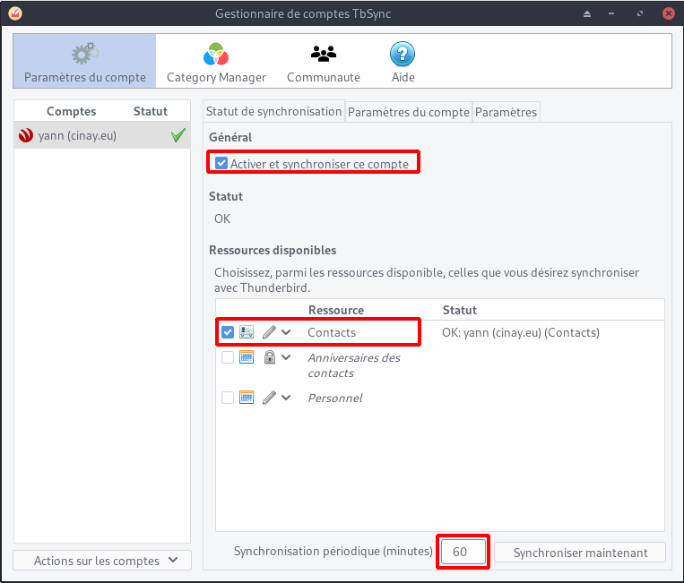{:width="300"}   
Synchronisation toutes les heures pour les contacts  


Liens caldav carddav sur thunderbird (yann)    
https://cinay.eu/nextcloud/remote.php/dav/calendars/yann/personal/  
https://cinay.eu/nextcloud/remote.php/dav/addressbooks/users/yann/contacts/  

#### Compte nextcloud sur les postes clients de type PC

Ajout du compte https://cinay.eu/nextcloud sur les clients nextcloud    
Synchronisations:

* ~/.keepassx &rarr; Home/.keepassx (créer le dossier)
* ~/media/Notes &rarr; Notes (créer le dossier)

#### Compte nextcloud sur android

Application nextcloud installée  
Se connecter https://cinay.eu/nextcloud et vérifier la création du compte  
{:height="300"}  

Synchroniser le fichier de mot de passe avec l'application keepass  
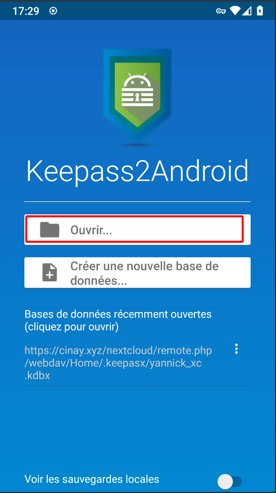{:height="300"}  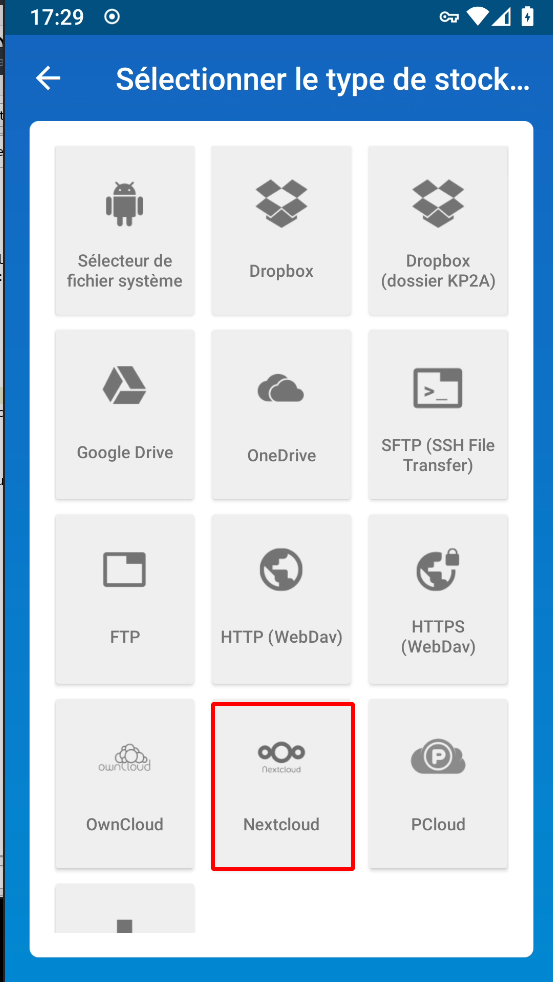{:height="300"}  
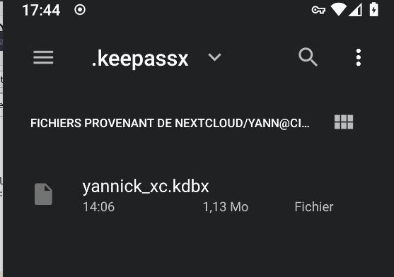{:width="200"}  


### Gitea (gitea.cinay.eu)

{:width="70"}

Ajout domaine et certificats gitea.cinay.eu

    yunohost domain add gitea.cinay.eu
    yunohost domain cert-install gitea.cinay.eu --no-checks

Installation à partir de github, on clône le dépôt

    git clone https://github.com/YunoHost-Apps/gitea_ynh.git

Blocage sur fail2ban à l'installation   
Commenter la mise en place FAIL2BAN 

    nano gitea_ynh/scripts/install

```
# SETUP FAIL2BAN
#ynh_script_progression --message="Configuring fail2ban..."
#ynh_add_fail2ban_config --logpath "/var/log/$app/gitea.log" --failregex ".*Failed authentication attempt for .* from <HOST>" --max_retry 5
```

Installer gitea

    yunohost app install gitea_ynh

Fail2ban , règle qui n'est pas ajouté

```
ynh_add_fail2ban_config --logpath /var/log/gitea/gitea.log --failregex '.*Failed authentication attempt for .* from <HOST>' --max_retry 5
```

Probème de mise à jour

    yunohost app upgrade gitea -u https://github.com/YunoHost-Apps/gitea_ynh

```
Warning: Reload the service fail2ban
Warning: ............................................................................................................................................................................................................................................................................................................The service fail2ban didn't fully started before the timeout.
Warning: -- Logs begin at Thu 2020-10-08 17:30:01 CEST, end at Fri 2020-10-09 11:17:21 CEST. --
Warning: Oct 09 10:21:56 cinay.eu fail2ban-client[26484]: OK
Warning: Oct 09 10:21:56 cinay.eu systemd[1]: Reloaded Fail2Ban Service.
Warning: Oct 09 10:28:15 cinay.eu systemd[1]: Reloading Fail2Ban Service.
Warning: Oct 09 10:28:15 cinay.eu fail2ban-client[27234]: OK
Warning: Oct 09 10:28:15 cinay.eu systemd[1]: Reloaded Fail2Ban Service.
Warning: Oct 09 10:52:39 cinay.eu systemd[1]: /lib/systemd/system/fail2ban.service:12: PIDFile= references path below legacy directory /var/run/, updating /var/run/fail2ban/fail2ban.pid → /run/fail2ban/fail2ban.pid; please update the unit file accordingly.
Warning: Oct 09 10:52:40 cinay.eu systemd[1]: /lib/systemd/system/fail2ban.service:12: PIDFile= references path below legacy directory /var/run/, updating /var/run/fail2ban/fail2ban.pid → /run/fail2ban/fail2ban.pid; please update the unit file accordingly.
Warning: Oct 09 10:52:57 cinay.eu systemd[1]: Reloading Fail2Ban Service.
Warning: Oct 09 10:52:57 cinay.eu fail2ban-client[32448]: OK
Warning: Oct 09 10:52:57 cinay.eu systemd[1]: Reloaded Fail2Ban Service.
Warning: Oct 09 10:57:21 cinay.eu systemd[1]: /lib/systemd/system/fail2ban.service:12: PIDFile= references path below legacy directory /var/run/, updating /var/run/fail2ban/fail2ban.pid → /run/fail2ban/fail2ban.pid; please update the unit file accordingly.
Warning: Oct 09 10:57:22 cinay.eu systemd[1]: /lib/systemd/system/fail2ban.service:12: PIDFile= references path below legacy directory /var/run/, updating /var/run/fail2ban/fail2ban.pid → /run/fail2ban/fail2ban.pid; please update the unit file accordingly.
Warning: Oct 09 10:57:36 cinay.eu systemd[1]: Reloading Fail2Ban Service.
Warning: Oct 09 10:57:36 cinay.eu fail2ban-client[5219]: OK
Warning: Oct 09 10:57:36 cinay.eu systemd[1]: Reloaded Fail2Ban Service.
Warning: Oct 09 11:12:33 cinay.eu systemd[1]: /lib/systemd/system/fail2ban.service:12: PIDFile= references path below legacy directory /var/run/, updating /var/run/fail2ban/fail2ban.pid → /run/fail2ban/fail2ban.pid; please update the unit file accordingly.
Warning: Oct 09 11:12:33 cinay.eu systemd[1]: /lib/systemd/system/fail2ban.service:12: PIDFile= references path below legacy directory /var/run/, updating /var/run/fail2ban/fail2ban.pid → /run/fail2ban/fail2ban.pid; please update the unit file accordingly.
Warning: Oct 09 11:12:48 cinay.eu systemd[1]: Reloading Fail2Ban Service.
Warning: Oct 09 11:12:48 cinay.eu fail2ban-client[10435]: OK
Warning: Oct 09 11:12:48 cinay.eu systemd[1]: Reloaded Fail2Ban Service.
Info: [###############.....] > Update permission...
Warning: Group 'visitors' already has permission 'gitea.main' enabled
Warning: This permission is currently granted to all users in addition to other groups. You probably want to either remove the 'all_users' permission or remove the other groups it is currently granted to.
Warning: The permission was not updated because the addition/removal requests already match the current state.
Warning: /usr/share/yunohost/helpers.d/utils: line 583: manifest: unbound variable
Info: [###############+....] > Protecting directory
Info: [################+...] > Configuring permissions...
Warning: Group 'visitors' already has permission 'gitea.main' enabled
Warning: This permission is currently granted to all users in addition to other groups. You probably want to either remove the 'all_users' permission or remove the other groups it is currently granted to.
Warning: The permission was not updated because the addition/removal requests already match the current state.
Warning: Start the service gitea
Info: [#################++.] > Starting gitea services...
Warning: ..The service gitea has correctly started.
sh: 0: getcwd() failed: No such file or directory
sh: 0: getcwd() failed: No such file or directory
Success! gitea upgraded
sh: 0: getcwd() failed: No such file or directory
sh: 0: getcwd() failed: No such file or directory
sh: 0: getcwd() failed: No such file or directory
Success! Upgrade complete
```

Redémarrer fail2ban

    systemctl restart fail2ban
    journalctl --unit=fail2ban

```
Oct 09 11:27:39 cinay.eu systemd[1]: Stopping Fail2Ban Service...
Oct 09 11:27:40 cinay.eu fail2ban-client[12316]: Shutdown successful
Oct 09 11:27:40 cinay.eu systemd[1]: fail2ban.service: Main process exited, code=killed, status=15/TERM
Oct 09 11:27:40 cinay.eu systemd[1]: fail2ban.service: Succeeded.
Oct 09 11:27:40 cinay.eu systemd[1]: Stopped Fail2Ban Service.
Oct 09 11:27:40 cinay.eu systemd[1]: Starting Fail2Ban Service...
Oct 09 11:27:40 cinay.eu systemd[1]: Started Fail2Ban Service.
Oct 09 11:27:40 cinay.eu fail2ban-server[12320]: Server ready
```

### static.cinay.eu

En mode su

Créer le domaine static.cinay.eu et les certificats

    yunohost domain add static.cinay.eu
    yunohost domain cert-install static.cinay.eu --no-checks

Installer l’application Multi web app sur le domaine static.cinay.eu   


    git clone https://gitea.cinay.eu/yann/multi_webapp_buster_ynh
    yunohost app install https://gitea.cinay.eu/yann/multi_webapp_buster_ynh

```
DANGER! This app is not part of Yunohost's app catalog. Installing third-party apps may compromise the integrity and security of your system. You should probably NOT install it unless you know what you are doing. NO SUPPORT will be provided if this app doesn't work or breaks your system… If you are willing to take that risk anyway, type 'Yes, I understand': Yes, I understand
Available domains:
- cinay.eu
- yanfi.net
- wg.cinay.eu
- zic.cinay.eu
- static.cinay.eu
- gitea.cinay.eu
- searx.cinay.eu
Choose a domain for your Webapp (default: cinay.eu): static.cinay.eu
Choose a path for your Webapp (default: /site): /
Available users:
- yann
- claudine
- yanfi
Choose the YunoHost user: yann
Create a database? [yes | no] (default: no): 
Is it a public website ? [yes | no] (default: no): yes
Success! Installation completed
```

`multi_webapp__3` (static.cinay.eu) à un accès complet sans aucune autorisation

Le dossier **/opt/yann/static/** contient le site statique qui est issu d'une synchronisation d'un conteneur debian sur un ordinateur archlinux avec jekyll comme générateur 

```bash
rm -r /var/www/webapp_yann/static.cinay.eu_  # supprimer dossier web 
ln -s /opt/yann/static /var/www/webapp_yann/static.cinay.eu_  # lien
```

Modifier l'étiquette `multi_webapp__3` (static.cinay.eu)

    yunohost app change-label multi_webapp__3 'Statique static.cinay.eu'

### div.cinay.eu

En mode su

Créer le domaine div.cinay.eu et les certificats

    yunohost domain add div.cinay.eu
    yunohost domain cert-install div.cinay.eu --no-checks

Installer l’application Multi web app sur le domaine div.cinay.eu   

    yunohost app install https://gitea.cinay.eu/yann/multi_webapp_buster_ynh

```
[...]
Choose a domain for your Webapp (default: cinay.eu): div.cinay.eu
Choose a path for your Webapp (default: /site): /
Available users:
- yann
- claudine
- yanfi
Choose the YunoHost user: yann
Create a database? [yes | no] (default: no): 
Is it a public website ? [yes | no] (default: no): yes
Success! Installation completed
```

Modifier l'étiquette `multi_webapp__4` 

    yunohost app change-label multi_webapp__4 'div.cinay.eu'

Le dossier correspondant : `/var/www/webapp_yann/div.cinay.eu_/`  
Créer des liens 

    sudo ln -s /opt/sshfs/diceware  /var/www/webapp_yann/div.cinay.eu_/diceware
    sudo ln -s /opt/sshfs/osm-new  /var/www/webapp_yann/div.cinay.eu_/osm-new
    sudo ln -s /opt/sshfs/htmldoc  /var/www/webapp_yann/div.cinay.eu_/htmldoc

Le site

    ls -la /var/www/webapp_yann/div.cinay.eu_/

```bash
total 24
drwxrwxr-x 4 yann   webapp_div.cinay.eu_ 4096 Sep 23 15:55 .
drwxr-xr-x 5 root   root                 4096 Sep 23 12:02 ..
drwxr-xr-x 6 debian debian               4096 Jun  6  2019 assets
lrwxrwxrwx 1 root   root                   19 Sep 23 15:55 diceware -> /opt/sshfs/diceware
drwxr-xr-x 4 debian debian               4096 Sep 23 14:17 images
-rw-r--r-- 1 debian debian               6922 Sep 23 15:49 index.html
lrwxrwxrwx 1 root   root                   18 Sep 23 15:55 osm-new -> /opt/sshfs/osm-new
```

### cinay.eu/site (cartes)

Installer l’application Multi web app 

    yunohost app install https://gitea.cinay.eu/yann/multi_webapp_buster_ynh

```
[...]
Choose the domain where this app should be installed [cinay.eu | div.cinay.eu | gitea.cinay.eu | static.cinay.eu | wg.cinay.eu | zic.cinay.eu | yanfi.net] (default: cinay.eu): 
Choose the path where this app should be installed (default: /site): 
Choose an administrator user for this app [yann | claudine | yanfi] (default: yann): 
Create a database? [yes | no] (default: no): 
Should this app be exposed to anonymous visitors? [yes | no] (default: no): yes
[...]
Success! Installation completed
```

Modifier l'étiquette `multi_webapp__5` 

    yunohost app change-label multi_webapp__5 '/site Cartes '

Le dossier correspondant : `/var/www/webapp_yann/cinay.eu_site/`  
Le lien

    sudo rm -r /var/www/webapp_yann/cinay.eu_site
    sudo ln -s /opt/sshfs/osm-new  /var/www/webapp_yann/cinay.eu_site

## Sauvegardes
 
#### yunohost

Création d'une sauvegarde complète yunohost

    sudo -s
    yunohost backup create -n Backup-Yunohost-cinay.eu

Sauvegarde automatique tous les jours

    sudo -s
    crontab -e

```
# Sauvegarde yunohost
00 02 * * * /usr/bin/rm /home/yunohost.backup/archives/* && /usr/bin/yunohost backup create -n Backup-Yunohost-cinay.eu > /dev/null
```

#### BorgBackup


**Préparation de la machine à sauvegarder**  
On se connecte sur la machine et on passe en mode su  

    sudo -s
    apt update

Installer borgbackup

    apt install borgbackup

**<u>Créer un jeu de clé sur machine à sauvegarder (cinay.eu)</u>**  
Créer un utilisateur borg (sans home) dédié aux sauvegardes par BorgBackup :

    useradd -M borg

Générer un jeu de clé sur **/root/.ssh** 

    mkdir -p /root/.ssh
    ssh-keygen -t ed25519 -o -a 100 -f /root/.ssh/cinay.eu_ed25519

Le jeu de clé

    ls /root/.ssh
        cinay.eu_ed25519  cinay.eu_ed25519.pub

Autoriser utilisateur **borg** à exécuter */usr/bin/borg* uniquement

    echo "borg ALL=NOPASSWD: /usr/bin/borg" >> /etc/sudoers

**Ajout clé publique au serveur backup xoyaz.xyz**

>Pour une connexion via ssh vous devez ajouter la clé publique *cinay.eu_ed25519.pub* du **serveur client  cinay.eu** au fichier *~/.ssh/authorized_keys* du  **serveur backup xoyaz.xyz**  

Se connecter au **serveur backup xoyaz.xyz** depuis un terminal autorisé

	ssh usernl@5.2.79.107 -p 55036 -i /home/yannick/.ssh/OVZ-STORAGE-128 # connexion SSH serveur backup depuis PC1
	sudo -s # passer en super utilisateur
	cat >> /srv/data/borg-backups/.ssh/authorized_keys

Copier/coller le contenu du fichier du fichier de clef publique (fichier **/root/.ssh/cinay.eu_ed25519.pub** de la machine à sauvegarder **cinay.eu** ) dans ce terminal, et presser **[Ctrl]+[D]** pour valider.

Test depuis le serveur client **cinay.eu**  (c'est lui qui possède la clé privée).  
*Si parefeu avec les sorties bloquées sur **cinay.eu** , il faut ouvrir en sortie le port TCP 55036.*

**AU PREMIER passage une question est posée , saisir oui ou yes**

    sudo -s
    ssh -p 55036 -i /root/.ssh/cinay.eu_ed25519 borg@xoyaz.xyz

```
The authenticity of host '[xoyaz.xyz]:55036 ([2a04:52c0:101:7ae::7a5e]:55036)' can't be established.
ECDSA key fingerprint is SHA256:PDXQBhTh4oj0cSzgnjCun+J60JDUEk7VeLH2YHZbwMc.
Are you sure you want to continue connecting (yes/no)? yes
hosts.
Linux vps70253415 4.19.0-9-amd64 #1 SMP Debian 4.19.118-2+deb10u1 (2020-06-07) x86_64
                 ____  __  ___  ___  ____ _ _   _  ___ 
 __ __ _ __  ___|__  |/  \|_  )| __||__ /| | | / || __|
 \ V /| '_ \(_-<  / /| () |/ / |__ \ |_ \|_  _|| ||__ \
  \_/ | .__//__/ /_/  \__//___||___/|___/  |_| |_||___/
    __|_|   ___    ____  ___    _  ___  ____           
   | __|   |_  )  |__  |/ _ \  / ||_  )|__  |          
   |__ \ _  / /  _  / / \_, /_ | | / /   / /           
   |___/(_)/___|(_)/_/   /_/(_)|_|/___| /_/ 
Last login: Wed Jun 10 15:34:07 2020 from 51.91.249.57
$ 
```

saisir `exit` pour sortir

>NOTE : **/srv/data/borg-backups** est le home de l'utilisateur *borg* sur le serveur backup *xoyaz.xyz*

**Création dépôt et lancement des sauvegardes depuis la machine à sauvegarder**  

**<u>machine cliente cinay.eu</u>**  
On se connecte sur la machine et on passe en mode su  

    sudo -s

**Création du dépôt distant sur le serveur backup xoyaz.xyz (A FAIRE UNE SEULE FOIS)**

    export BORG_RSH='ssh -i /root/.ssh/cinay.eu_ed25519' # ce n'est pas la clé par défaut id_rsa
    borg init --encryption=repokey-blake2 ssh://borg@xoyaz.xyz:55036/srv/data/borg-backups/cinay.eu

```
Enter new passphrase: 
Enter same passphrase again: 
Do you want your passphrase to be displayed for verification? [yN]: 

By default repositories initialized with this version will produce security
errors if written to with an older version (up to and including Borg 1.0.8).

If you want to use these older versions, you can disable the check by running:
borg upgrade --disable-tam ssh://borg@xoyaz.xyz:55036/srv/data/borg-backups/cinay.eu

See https://borgbackup.readthedocs.io/en/stable/changes.html#pre-1-0-9-manifest-spoofing-vulnerability for details about the security implications.

IMPORTANT: you will need both KEY AND PASSPHRASE to access this repo!
Use "borg key export" to export the key, optionally in printable format.
Write down the passphrase. Store both at safe place(s).
```

Sauvegarder la "passphrase" dans un fichier pour une procédure automatique 

    mkdir -p /root/.borg
    nano /root/.borg/passphrase

**Générer une sauvegarde d'un dossier local vers le dépôt distant** pour test (facultatif)

    borg create ssh://borg@xoyize.xyz:55029/srv/ssd-two/borg-backups/cinay.eu::2019-01-11 /home/yanfi

```
Enter passphrase for key ssh://borg@xoyize.xyz:55029/srv/ssd-two/borg-backups/cinay.eu: 
```

**Automatiser la procédure de sauvegarde pour le client cinay.eu**  
script de sauvegarde (notez l'usage de borg prune pour supprimer les archives trop anciennes)  

    nano /root/.borg/borg-backup 

```
#!/bin/sh
#
# Script de sauvegarde.
#
# Envoie les sauvegardes sur un serveur distant, via le programme Borg.
# Les sauvegardes sont chiffrées
#
 
set -e
 
BACKUP_DATE=`date +%Y-%m-%d-%Hh%M`
LOG_PATH=/var/log/borg-backup.log
 
export BORG_PASSPHRASE="`cat ~root/.borg/passphrase`"
export BORG_RSH='ssh -i /root/.ssh/cinay.eu_ed25519'
BORG_REPOSITORY=ssh://borg@xoyaz.xyz:55036/srv/data/borg-backups/cinay.eu
BORG_ARCHIVE=${BORG_REPOSITORY}::${BACKUP_DATE}
 
borg create \
-v --progress --stats --compression lzma,9 \
--exclude-from /root/.borg/exclusions --exclude-caches \
$BORG_ARCHIVE \
/ \
>> ${LOG_PATH} 2>&1
 
# Nettoyage des anciens backups
# On conserve
# - une archive par jour les 7 derniers jours,
# - une archive par semaine pour les 4 dernières semaines,
# - une archive par mois pour les 6 derniers mois.
 
borg prune \
-v --list --stats --keep-daily=7 --keep-weekly=4 --keep-monthly=6 \
$BORG_REPOSITORY \
>> ${LOG_PATH} 2>&1

root@cinay:/home/debian# nano /root/.borg/borg-backup 
root@cinay:/home/debian# cat /root/.borg/borg-backup 
#!/bin/sh
#
# Script de sauvegarde.
#
# Envoie les sauvegardes sur un serveur distant, via le programme Borg.
# Les sauvegardes sont chiffrées
#
 
set -e
 
BACKUP_DATE=`date +%Y-%m-%d-%Hh%M`
LOG_PATH=/var/log/borg-backup.log
 
export BORG_PASSPHRASE="`cat ~root/.borg/passphrase`"
export BORG_RSH='ssh -i /root/.ssh/cinay.eu_ed25519'
BORG_REPOSITORY=ssh://borg@xoyaz.xyz:55036/srv/data/borg-backups/cinay.eu
BORG_ARCHIVE=${BORG_REPOSITORY}::${BACKUP_DATE}
 
borg create \
-v --progress --stats --compression lzma,9 \
--exclude-caches --exclude-from /root/.borg/exclusions \
$BORG_ARCHIVE \
/ \
>> ${LOG_PATH} 2>&1
 
# Nettoyage des anciens backups
# On conserve
# - une archive par jour les 7 derniers jours,
# - une archive par semaine pour les 4 dernières semaines,
# - une archive par mois pour les 6 derniers mois.
 
borg prune \
-v --list --stats --keep-daily=7 --keep-weekly=4 --keep-monthly=6 \
$BORG_REPOSITORY \
>> ${LOG_PATH} 2>&1

exit 0
# Ancien backup
borg create \
-v --progress --stats --compression lzma,9 \
--exclude-from /root/.borg/exclusions --exclude-caches \
$BORG_ARCHIVE \
/ \
>> ${LOG_PATH} 2>&1
```

Le rendre exécutable

    chmod +x /root/.borg/borg-backup

Fichier **/root/.borg/exclusions** pour ne pas sauvegarder, entre autre,le point de montage ssfs "music" (si existant)

    nano /root/.borg/exclusions

```
/dev
/proc
/sys
/tmp
/run
/mnt
/media
lost+found
/home/yunohost.multimedia
/home/yunohost.backup
/home/yunohost.transmission
/home/yunohost.app
/opt/sshfs
```

Programmer la tâche à 2h40 du matin

    crontab -e

```
# Sauvegarde sur distant avec BorgBackup
40 02 * * * /root/.borg/borg-backup > /dev/null
```

## Tests sur le serveur

#### Vérifications DNS - wireguard

Les commandes suivantes ne fonctionneront que si le paquet "dnsutils" est installé sur votre système Debian!

On teste en utilisant les serveurs DNS locaux, les 3 commandes suivantes ont le même résultat

	dig @127.0.0.1 afnic.fr +short +dnssec
    dig @10.55.22.1 afnic.fr +short +dnssec 
    dig @fd87:9aa8:e67c:5a80::1 afnic.fr +short +dnssec

```
192.134.5.37
A 13 2 600 20200608204052 20200509084949 30435 afnic.fr. eVchVAseJD5n8W7U8okAz546Ix33hOCqRF7wLrhUV+sOTkwyXo7EwAut k/rN8wsPVpTnTpFyQLKdBTuOpx2UxA==
```

#### Propagation DNS

<https://www.whatsmydns.net>  
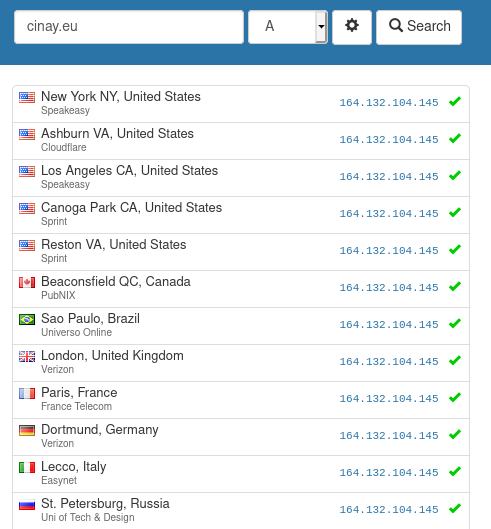{:width="400"}

#### Messagerie

Vérification messagerie <https://mecsa.jrc.ec.europa.eu/fr/>  
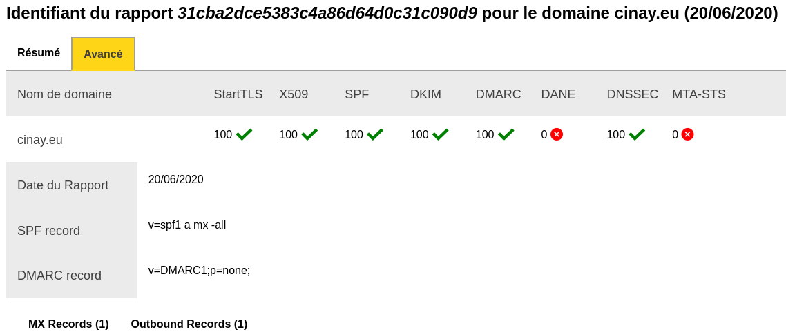{:width="600"}

#### DNS blacklisting

<https://www.dnsbl.info/dnsbl-database-check.php>  
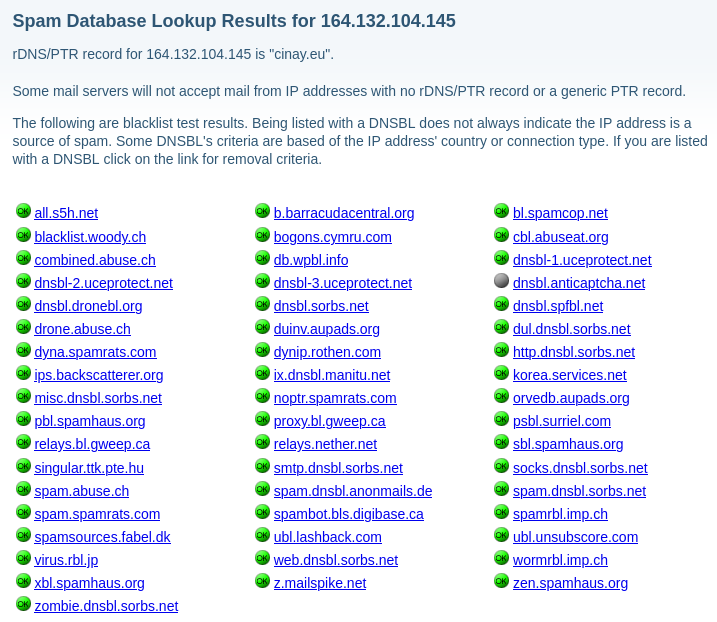{:width="600"}

#### Vulnérabilités

<https://www.ssllabs.com/ssltest/analyze.html>  

SSL Report: cinay.eu (164.132.104.145)  
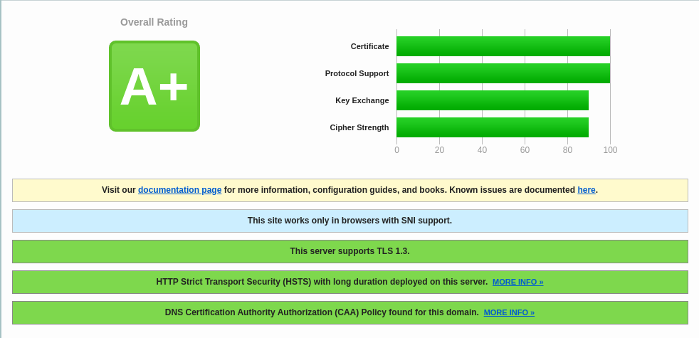{:width="500"}

SSL Report: cinay.eu (2001:41d0:401:3200:0:0:0:6e7)  
{:width="500"}


Vérifier les ports ouverts depuis un poste linux

    nmap 164.132.104.145

```
Starting Nmap 7.70 ( https://nmap.org ) at 2020-09-25 07:34 CEST
Nmap scan report for cinay.eu (164.132.104.145)
Host is up (0.018s latency).
Not shown: 990 filtered ports
PORT     STATE SERVICE
25/tcp   open  smtp
53/tcp   open  domain
80/tcp   open  http
443/tcp  open  https
587/tcp  open  submission
993/tcp  open  imaps
5222/tcp open  xmpp-client
5269/tcp open  xmpp-server
8083/tcp open  us-srv
8084/tcp open  unknown
```

On s'intéresse aux ports 8083 8084 , qui les utilise ?

```bash
root@cinay:/home/debian# netstat -ltnpu | grep -w '8083'
tcp        0      0 0.0.0.0:8083            0.0.0.0:*               LISTEN      722/python3         
tcp6       0      0 :::8083                 :::*                    LISTEN      722/python3         

root@cinay:/home/debian# ss -lptnu | grep -w '8083'
tcp   LISTEN 0      128                             0.0.0.0:8083        0.0.0.0:*                                                                                users:(("python3",pid=722,fd=5))                                               
tcp   LISTEN 0      128                                [::]:8083           [::]:*                                                                                users:(("python3",pid=722,fd=7))                                       

l affiche les sockets à l’écoute,
t affiche les connexions tcp,
u pour le protocole udp,
n permet l’affichage des adresses sous forme numérique,
p affiche les processus,
L’option -w de grep nous affiche la meilleure correspondance de la chaîne de caractères fournie.

root@cinay:/home/debian# lsof -i :8083
COMMAND PID       USER   FD   TYPE DEVICE SIZE/OFF NODE NAME
python3 722 calibreweb    5u  IPv4  23022      0t0  TCP *:8083 (LISTEN)
python3 722 calibreweb    7u  IPv6  23023      0t0  TCP *:8083 (LISTEN)

root@cinay:/home/debian# lsof -i :8084
COMMAND PID          USER   FD   TYPE DEVICE SIZE/OFF NODE NAME
python3 727 calibreweb__2    5u  IPv4  23016      0t0  TCP *:8084 (LISTEN)
python3 727 calibreweb__2    7u  IPv6  23017      0t0  TCP *:8084 (LISTEN)
```

