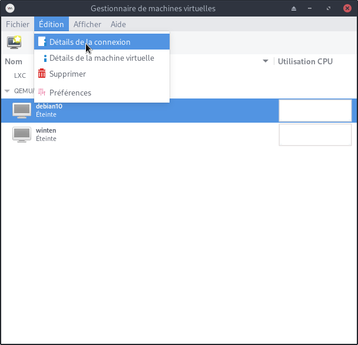
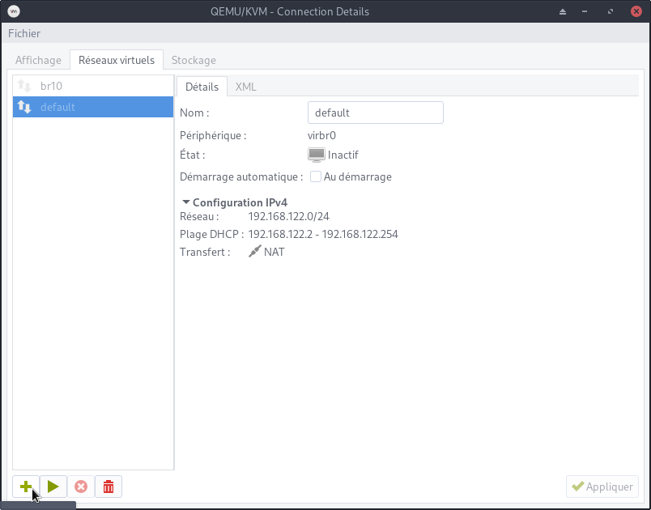
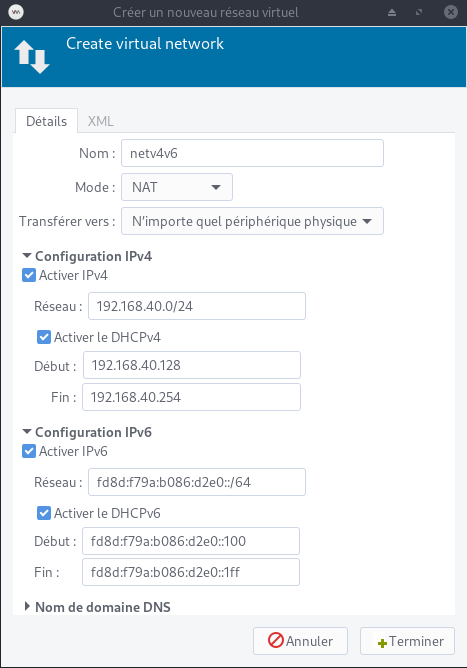
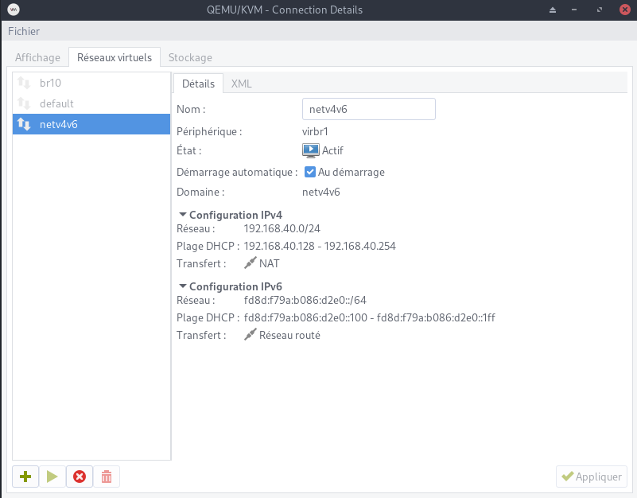

+++
title = 'KVM/QEMU - Réseau IPV4/IPV6 accessible depuis l'internet via box free.fr'
date = 2020-11-05 00:00:00 +0100
categories = ['virtuel']
+++
## RESEAU IPV4/IPV6 (cli)

{:width="80"}   
*Paramétrage réseau en ligne de commande*

Problématique :

* Un réseau local 192.168.0.0/24 derrière un routeur/box free.fr
* Un serveur **srv1** accessible depuis l'internet en IPV6 uniquement sur le domaine  <domaine-un.fr>      
* A l'intérieur de ce serveur , il y a une vm (qemu/kvm) nommée **vm1** accessible en IPV6 avec le domaine <domaine-deux-fr>

Solution :

* Une adresse IPV6 pour chaque domaine , gestion IPV6 par le HOP de la box Free
* Réseau vm , srv1 et vm1 dans la même plage IPV6

Liens :

https://wiki.gentoo.org/wiki/QEMU/KVM_IPv6_Support   
https://www.debian-fr.org/t/probleme-dacces-dune-machine-virtuelle-sous-kvm-qemu-vers-internet/78440/5  
https://www.linux.com/topic/networking/testing-ipv6-networking-kvm-part-2/  

### HOTE - srvxo (serveur-hote.tld)  

On va définir une adresse ipv6 pour l'interface **vibr0** dans la même zone que l'hôte  

    sudo -s

Copie sauvegarde du réseau par défaut

    cp /etc/libvirt/qemu/networks/default.xml /etc/libvirt/qemu/networks/netv4.xml

On arrête le réseau , on édite 

    virsh net-destroy default
    virsh net-edit default 

Ajouter les deux lignes suivantes au-dessus de la clôture existante `</network>`  
Utilisez votre propre /64 et créez votre propre extension de préfixe.  

```
  <ip family='ipv6' address='2bef:a51:ced9:fc3::2' prefix='96'>
  </ip>
```

Redémarrer le réseau

    virsh net-start default

Vérifier virbr0

    ip a

```
2: enp3s0: <BROADCAST,MULTICAST,UP,LOWER_UP> mtu 1500 qdisc pfifo_fast state UP group default qlen 1000
    link/ether 70:85:c2:53:cb:80 brd ff:ff:ff:ff:ff:ff
    inet 192.168.0.241/24 brd 192.168.0.255 scope global enp3s0
       valid_lft forever preferred_lft forever
    inet6 2bef:a51:ced9:fc3::1/64 scope global 
       valid_lft forever preferred_lft forever
    inet6 fe80::7285:c2ff:fe53:cb80/64 scope link 
       valid_lft forever preferred_lft forever
15: virbr0: <NO-CARRIER,BROADCAST,MULTICAST,UP> mtu 1500 qdisc noqueue state DOWN group default qlen 1000
    link/ether 52:54:00:06:87:ba brd ff:ff:ff:ff:ff:ff
    inet 192.168.55.1/24 brd 192.168.55.255 scope global virbr0
       valid_lft forever preferred_lft forever
    inet6 2bef:a51:ced9:fc3::2/96 scope global 
       valid_lft forever preferred_lft forever
    inet6 fe80::5054:ff:fe06:87ba/64 scope link 
       valid_lft forever preferred_lft forever
...
```

Notez que l'interface **virbr0** a acquis un /96 à partir de votre /64. C'est le nombre d'adresses IP qu'il y a dans tout l'espace d'adressage IPv4.

Vous avez également une adresse IP locale de liaison auto-attribuée, où fe80::5054:ff:fe06:87ba est liée à l'adresse MAC de virbr0.

C'est une très bonne idée de ne pas utiliser les adresses de 2bef:a51:ced9:fc3::/96 en dehors de virbr0 

2bef:a51:ced9:fc3::2


### VM - Adresse IPv6 et route par défaut

On démarre la machine vm (arrêt `virsh shutdown yunouest --mode acpi`)

    virsh start yunouest

On se connecte 

La configuration KVM IPv6 est statique. 

Choisissez une adresse IPv6 dans le préfixe 2bef:a51:ced9:fc3::/96 mais pas 2bef:a51:ced9:fc3::2 qui est virbr0 ni 2bef:a51:ced9:fc3::1 qui est srvxo  
On va prendre **2bef:a51:ced9:fc3::3**

Vous pouvez toujours utiliser dhcpcd pour IPv4 si vous le souhaitez.

    /etc/network/interfaces

```
# This file describes the network interfaces available on your system
# and how to activate them. For more information, see interfaces(5).

source /etc/network/interfaces.d/*

# The loopback network interface
auto lo
iface lo inet loopback

# The primary network interface
allow-hotplug enp1s0
iface enp1s0 inet dhcp
# This is IPv6 interface
iface enp1s0 inet6 static
 address 2bef:a51:ced9:fc3::3
 netmask 64
 post-up ip -6 route add default via fe80::5054:ff:fe06:87ba dev enp1s0

# fe80::224:d4ff:fea6:aa20   freebox
```

La route par défaut est un peu plus difficile. Il s'agit de l'adresse du lien virbr0. Vous pouvez découvrir qu'avec le ping tous les routeurs sont multicast.

    ping6 ff02::2 -I enp1s0

```
PING ff02::2(ff02::2) from fe80::5054:ff:fe74:51c5%enp1s0 enp1s0: 56 data bytes
64 bytes from fe80::5054:ff:fe06:87ba%enp1s0: icmp_seq=1 ttl=64 time=0.512 ms
64 bytes from fe80::5054:ff:fe06:87ba%enp1s0: icmp_seq=2 ttl=64 time=0.613 ms
64 bytes from fe80::5054:ff:fe06:87ba%enp1s0: icmp_seq=3 ttl=64 time=0.598 ms
...
```

En théorie, vous pouvez utiliser n'importe quel routeur qui répond (ici 1 seul).  
On utilisera **virbr0** comme route donc **fe80::5054:ff:fe06:87ba** 

```
 post-up ip -6 route add default via fe80::5054:ff:fe06:87ba dev enp1s0
```

Lorsque vous avez terminé, redémarrez la machine

### VM - Tester

Pour IPv4, testez avec :

    ping -4 google.com -c3

```
PING google.com (216.58.198.206) 56(84) bytes of data.
64 bytes from par10s27-in-f206.1e100.net (216.58.198.206): icmp_seq=1 ttl=53 time=11.8 ms
64 bytes from par10s27-in-f206.1e100.net (216.58.198.206): icmp_seq=2 ttl=53 time=12.1 ms
64 bytes from par10s27-in-f206.1e100.net (216.58.198.206): icmp_seq=3 ttl=53 time=14.2 ms

--- google.com ping statistics ---
3 packets transmitted, 3 received, 0% packet loss, time 2003ms
rtt min/avg/max/mdev = 11.843/12.748/14.239/1.069 ms
```

Pour IPv6, testez avec

    ping -6 google.com -c3

```
PING google.com(par21s04-in-x0e.1e100.net (2a00:1450:4007:811::200e)) 56 data bytes
64 bytes from par21s04-in-x0e.1e100.net (2a00:1450:4007:811::200e): icmp_seq=1 ttl=56 time=12.2 ms
64 bytes from par21s04-in-x0e.1e100.net (2a00:1450:4007:811::200e): icmp_seq=2 ttl=56 time=13.1 ms
64 bytes from par21s04-in-x0e.1e100.net (2a00:1450:4007:811::200e): icmp_seq=3 ttl=56 time=12.7 ms

--- google.com ping statistics ---
3 packets transmitted, 3 received, 0% packet loss, time 2002ms
rtt min/avg/max/mdev = 12.284/12.719/13.104/0.349 ms
```

Tout cela a l'air bien, mais ne fonctionne pas tout à fait comme il se doit.

### Nameservers

Vous ne disposez que de serveurs de noms IPv4 dans /etc/resolv.conf. Cela n'a peut-être pas d'importance, ils retourneront toujours les adresses IPv6 pour les hôtes qui en disposent. Cependant, un jour (pas bientôt), IPv4 sera désactivé et votre KVM ne pourra plus atteindre aucun serveur de noms ; /etc/resolv.conf peut contenir jusqu'à trois serveurs de noms IPv4 et trois serveurs de noms IPv6. Copiez les serveurs de noms IPv6 à partir des hôtes /etc/resolv.conf ou utilisez certains des serveurs de noms IPv6 publics. Google en possède un.

## RESEAU IPV4/IPV6 (gui)

{:width="80"}   
*Paramétrage réseau avec Virtual Manager*

Afin d'éviter l'erreur  

internal error: Check the host setup: enabling IPv6 forwarding with RA routes without accept_ra set to 2 is likely to cause routes loss. Interfaces to look at: enp0s31f6  {: .prompt-danger }

Dans les dernières versions de Libvirt, le paramètre `accept_ra` du noyau doit être fixé à `2` afin de créer des réseaux compatibles IPv6. Cela peut être réalisé avec la commande suivante (remplacer INTERFACE par le nom de l'interface indiqué dans le message d'erreur) :

    # echo 2 | sudo tee /proc/sys/net/ipv6/conf/INTERFACE/accept_ra
    echo 2 | sudo tee /proc/sys/net/ipv6/conf/enp0s31f6/accept_ra

Pour appliquer et rendre ce changement permanent, utilisez les commandes suivantes (n'oubliez pas de spécifier votre interface) :

    echo "net.ipv6.conf.enp0s31f6.accept_ra=2" | sudo tee -a "/etc/sysctl.conf"
    sudo sysctl -p

Ouvrir le "Gestionnaire de machines virtuelles" VMM

{:width="350"}

{:width="350"}  
Ajout réseau cliquer sur +

{:width="350"}  
Paramétrage

{:width="500"}  
Réseau en fonctionnement 

Voir en cli

    ip a

```
[...]
24: virbr1: <NO-CARRIER,BROADCAST,MULTICAST,UP> mtu 1500 qdisc noqueue state DOWN group default qlen 1000
    link/ether 52:54:00:04:8f:5d brd ff:ff:ff:ff:ff:ff
    inet 192.168.40.1/24 brd 192.168.40.255 scope global virbr1
       valid_lft forever preferred_lft forever
    inet6 fd8d:f79a:b086:d2e0::1/64 scope global 
       valid_lft forever preferred_lft forever
    inet6 fe80::5054:ff:fe04:8f5d/64 scope link 
       valid_lft forever preferred_lft forever
[...]
```

