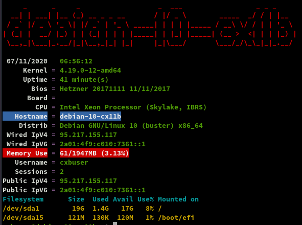
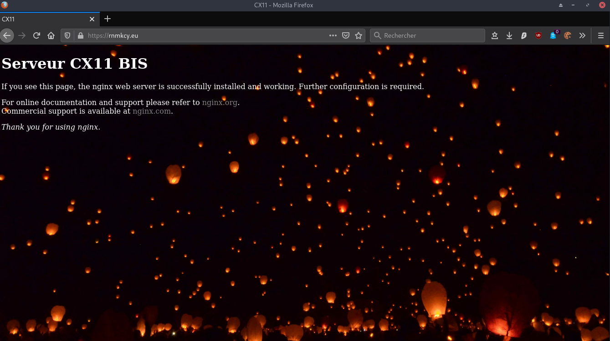
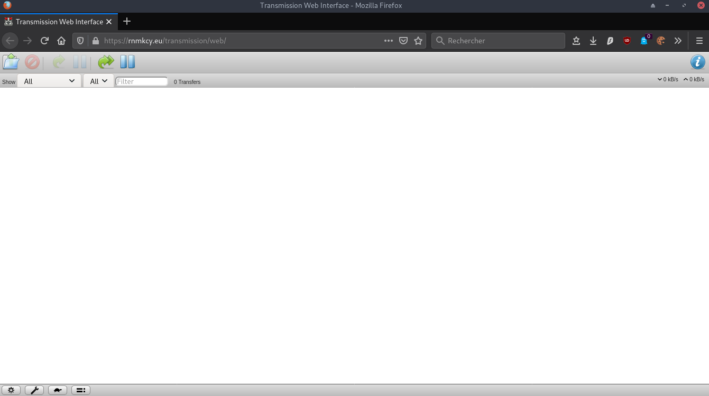

+++
title = 'HETZNER VPS CX11 Bis debian 10 yunohost'
date = 2020-11-10 00:00:00 +0100
categories = vps serveur
+++
[](https://www.hetzner.com/cloud-fr)*CX11 (1 vCore/2GoRam/20Go Nvme) Debian Buster*

# Serveur debian-10-cx11b 

## {:width="100"} Debian 10

PARAMETRES D'ACCES:  
L'adresse IPv4 du VPS est : 95.217.155.117  
L'adresse IPv6 du VPS est : 2a01:4f9:c010:7361::/64

Le nom du VPS est : debian-10-cx11b  
La clé publique **debian-10-cx11b.pub** est transmise au gestionnaire pour la construction du serveur
Connexion SSH en "root" avec clés SSH **debian-10-cx11b** sans mot de passe

    ssh -i .ssh/debian-10-cx11b root@95.217.155.117

Créer mot de passe  "root"

    passwd

Réseau

```
1: lo: <LOOPBACK,UP,LOWER_UP> mtu 65536 qdisc noqueue state UNKNOWN group default qlen 1000
    link/loopback 00:00:00:00:00:00 brd 00:00:00:00:00:00
    inet 127.0.0.1/8 scope host lo
       valid_lft forever preferred_lft forever
    inet6 ::1/128 scope host 
       valid_lft forever preferred_lft forever
2: eth0: <BROADCAST,MULTICAST,UP,LOWER_UP> mtu 1500 qdisc pfifo_fast state UP group default qlen 1000
    link/ether 96:00:00:7b:8e:df brd ff:ff:ff:ff:ff:ff
    inet 95.217.155.117/32 brd 95.217.155.117 scope global dynamic eth0
       valid_lft 86201sec preferred_lft 86201sec
    inet6 2a01:4f9:c010:7361::1/64 scope global 
       valid_lft forever preferred_lft forever
    inet6 fe80::9400:ff:fe7b:8edf/64 scope link 
       valid_lft forever preferred_lft forever
```

Noyau et OS : `uname -a`

Linux debian-10-cx11b 4.19.0-12-amd64 #1 SMP Debian 4.19.152-1 (2020-10-18) x86_64 GNU/Linux

Paramétrage fuseau **Europe/Paris** : `dpkg-reconfigure tzdata`  

```
Current default time zone: 'Europe/Paris'
Local time is now:      Sat Nov  7 06:22:11 CET 2020.
Universal Time is now:  Sat Nov  7 05:22:11 UTC 2020.
```

Hostname

    hostnamectl

```
   Static hostname: debian-10-cx11b
         Icon name: computer-vm
           Chassis: vm
        Machine ID: 772322b271ba4104a62fca6a7e5bb23e
           Boot ID: 75b66ce490b3442b88f5dbc243a7bf53
    Virtualization: kvm
  Operating System: Debian GNU/Linux 10 (buster)
            Kernel: Linux 4.19.0-12-amd64
      Architecture: x86-64
```

### Création utilisateur

Utilisateur **cxbuser**  

    useradd -m -d /home/cxbuser/ -s /bin/bash cxbuser

Mot de passe **cxbuser**  

    passwd cxbuser 

Visudo pour les accès root via utilisateur **cxbuser**  

    echo "cxbuser     ALL=(ALL) NOPASSWD: ALL" >> /etc/sudoers

### {:width=80"} OpenSSH, clé et script

**connexion avec clé**  

La clé publique a été transmise pour la construction du serveur, elle est est présente dans le fichier `/root/.ssh/authorized_keys`  
Créer le dossier `/home/cxbuser/.ssh` et déplacer le fichier vers ce dossier puis lui donner les droits de l'utilisateur  

    mkdir /home/cxbuser/.ssh
    mv /root/.ssh/authorized_keys /home/cxbuser/.ssh/
    chown cxbuser.cxbuser -R /home/cxbuser/.ssh/
    chmod 600 /home/cxbuser/.ssh/authorized_keys 

<u>sur le poste disposant de la clé privée</u>
On se connecte  

    ssh -i $HOME/.ssh/debian-10-cx11b cxbuser@95.217.155.117

Modifier la configuration serveur SSH  

    sudo nano /etc/ssh/sshd_config  

Modifier

```conf
Port 55117
PermitRootLogin no  
PasswordAuthentication no 
```

Relancer openSSH  

    sudo systemctl restart sshd

Accès depuis le poste distant avec la clé privée  

    ssh -p 55117 -i ~/.ssh/debian-10-cx11b cxbuser@95.217.155.117


### Outils, scripts motd et ssh_rc_bash

Installer utilitaires  

    sudo apt update 
    sudp apt upgrade # si mise à jour
    sudo apt -y install rsync curl tmux jq figlet git dnsutils socat tree


Motd

    sudo rm /etc/motd && sudo nano /etc/motd

```
     _       _     _                  _   __                 _  _  _    
  __| | ___ | |__ (_) __ _  _ _  ___ / | /  \  ___  __ __ __/ |/ || |__ 
 / _` |/ -_)| '_ \| |/ _` || ' \|___|| || () ||___|/ _|\ \ /| || || '_ \
 \__,_|\___||_.__/|_|\__,_||_||_|    |_| \__/      \__|/_\_\|_||_||_.__/
  ___  ___     ___  _  ____   _  ___  ___     _  _  ____                
 / _ \| __|   |_  )/ ||__  | / || __|| __|   / |/ ||__  |               
 \_, /|__ \ _  / / | |  / /_ | ||__ \|__ \ _ | || |  / /                
  /_/ |___/(_)/___||_| /_/(_)|_||___/|___/(_)|_||_| /_/                 
```


Script **ssh_rc_bash**  
>**ATTENTION!!! Les scripts sur connexion peuvent poser des problèmes pour des appels externes autres que ssh**

    wget https://static.xoyaz.xyz/files/ssh_rc_bash
    chmod +x ssh_rc_bash # rendre le bash exécutable
    ./ssh_rc_bash        # exécution



**Historique de la ligne de commande**  
Ajoutez la recherche d’historique de la ligne de commande au terminal.
Tapez un début de commande précédent, puis utilisez shift + up (flèche haut) pour rechercher l’historique filtré avec le début de la commande.

```
# Global, tout utilisateur
echo '"\e[1;2A": history-search-backward' | sudo tee -a /etc/inputrc
echo '"\e[1;2B": history-search-forward' | sudo tee -a /etc/inputrc
```

### {:width="30"} Domaine rnmkcy.eu

Zone dns OVH

[HETZNER network](https://console.hetzner.cloud/projects/585797/servers/8123736/network) : Reverse DNS sur "server" , IP 95.217.155.117 et 2a01:4f9:c010:7361::1 &rarr; rnmkcy.eu 

Domaine rnmkcy.eu

```
$TTL 3600
@	IN SOA dns110.ovh.net. tech.ovh.net. (2020103002 86400 3600 3600000 300)
             IN NS     dns110.ovh.net.
             IN NS     ns110.ovh.net.
             IN A      95.217.155.117
             IN AAAA   2a01:4f9:c010:7361::1
searx        IN CNAME  rnmkcy.eu.
wg           IN CNAME  rnmkcy.eu.
zic          IN CNAME  rnmkcy.eu.
```

### Certificats {:width="100"} rnmkcy.eu

Installer acme: [Serveur , installer et renouveler les certificats SSL Let's encrypt via Acme](https://blog.cinay.xyz/2017/08/Acme-Certficats-Serveurs/)  

    cd ~
    # sudo apt install socat -y # prérequis installé
    git clone https://github.com/Neilpang/acme.sh.git
    cd acme.sh
    ./acme.sh --install # se déconnecter pour prise en compte
    # export des clé API OVH

Générer les certificats pour le domaine rnmkcy.eu

        acme.sh --dns dns_ovh --ocsp --issue --keylength ec-384 -d 'rnmkcy.eu' -d 'wg.rnmkcy.eu' -d 'zic.rnmkcy.eu' -d 'searx.rnmkcy.eu'


```
[Sat 07 Nov 2020 07:09:04 AM CET] Your cert is in  /home/cxbuser/.acme.sh/rnmkcy.eu_ecc/rnmkcy.eu.cer 
[Sat 07 Nov 2020 07:09:04 AM CET] Your cert key is in  /home/cxbuser/.acme.sh/rnmkcy.eu_ecc/rnmkcy.eu.key 
[Sat 07 Nov 2020 07:09:04 AM CET] The intermediate CA cert is in  /home/cxbuser/.acme.sh/rnmkcy.eu_ecc/ca.cer 
[Sat 07 Nov 2020 07:09:04 AM CET] And the full chain certs is there:  /home/cxbuser/.acme.sh/rnmkcy.eu_ecc/fullcha
```

Les liens avec **/etc/ssl/private** 

```
sudo ln -s /home/cxbuser/.acme.sh/rnmkcy.eu_ecc/fullchain.cer /etc/ssl/private/rnmkcy.eu-fullchain.pem   # full chain certs
sudo ln -s /home/cxbuser/.acme.sh/rnmkcy.eu_ecc/rnmkcy.eu.key /etc/ssl/private/rnmkcy.eu-key.pem     # cert key
sudo ln -s /home/cxbuser/.acme.sh/rnmkcy.eu_ecc/rnmkcy.eu.cer /etc/ssl/private/rnmkcy.eu-chain.pem   # cert domain
sudo ln -s /home/cxbuser/.acme.sh/rnmkcy.eu_ecc/ca.cer /etc/ssl/private/rnmkcy.eu-ca.pem                 # intermediate CA cert
```


### {:width="50"} Parefeu

*UFW, ou pare - feu simple , est une interface pour gérer les règles de pare-feu dans Arch Linux, Debian ou Ubuntu. UFW est utilisé via la ligne de commande (bien qu'il dispose d'interfaces graphiques disponibles), et vise à rendre la configuration du pare-feu facile (ou simple).*

Installation **Debian / Ubuntu**

    sudo apt install ufw

*Par défaut, les jeux de règles d'UFW sont vides, de sorte qu'il n'applique aucune règle de pare-feu, même lorsque le démon est en cours d'exécution.*   

Les règles 

    sudo ufw allow 55117/tcp  # port SSH , 55117
    sudo ufw allow http       # port 80
    sudo ufw allow https      # port 53
    sudo ufw allow DNS        # port 53
    #sudo ufw allow 51820/udp  # wireguard

Activer le parefeu

    sudo ufw enable

```
Command may disrupt existing ssh connections. Proceed with operation (y|n)? y
Firewall is active and enabled on system startup
```

Status

     sudo ufw status verbose

```
Status: active
Logging: on (low)
Default: deny (incoming), allow (outgoing), disabled (routed)
New profiles: skip

To                         Action      From
--                         ------      ----
55117/tcp                  ALLOW IN    Anywhere                  
80/tcp                     ALLOW IN    Anywhere                  
443/tcp                    ALLOW IN    Anywhere                  
53 (DNS)                   ALLOW IN    Anywhere                  
55117/tcp (v6)             ALLOW IN    Anywhere (v6)             
80/tcp (v6)                ALLOW IN    Anywhere (v6)             
443/tcp (v6)               ALLOW IN    Anywhere (v6)             
53 (DNS (v6))              ALLOW IN    Anywhere (v6)             
```

## {:width="50"} DNS Unbound

Un problème majeur avec beaucoup de configurations VPN est que le DNS n'est pas suffisant. Cela finit par une fuite de connexion client et de détails d'emplacement. Un bon moyen de tester cela est à travers le site <http://dnsleak.com/>

Nous allons sécuriser le trafic DNS avec la solution **unbound** qui offre les caractéristiques suivantes

* Léger et rapide
* Facile à installer et à configurer
* Orienté sécurité
* Prise en charge DNSSEC 

Nous allons le configurer de manière à contrer les fuites DNS, les attaques plus sophistiquées comme la fausse configuration de proxy, les routeurs escrocs et toutes sortes d'attaques MITM sur HTTPS et autres protocoles.

Nous installons unbound sur le serveur    
Passage en mode super utilisateur

    sudo -s # ou su

>ATTENTION : Le programme **resolvconf** est en général seulement nécessaire quand un système a plusieurs programmes qui ont besoin de modifier de façon dynamique les informations sur les serveurs de noms de domaine. Sur un système simple où les serveurs de noms de domaine ne changent pas souvent ou bien ne sont modifiés que par un programme, le <u>fichier de configuration **resolv.conf** est suffisant</u>.  
Il faut installer **resolvconf**, sinon on a une erreur **unbound-resolvconf**  
Une fois le paquet «  **resolvconf**  » installé, <u>il ne faut plus modifier le fichier</u> « **/etc/resolv.conf**  », car le contenu de celui-ci sera automatiquement géré et remplacé par «  **resolvconf**  ».

Installation des outils dns, des paquets Unbound et resolv :  

    apt install unbound unbound-host resolvconf -y

Téléchargement de la liste des serveurs DNS racines

    curl -o /var/lib/unbound/root.hints https://www.internic.net/domain/named.cache
    chown unbound:unbound /var/lib/unbound/root.hints

Ajout d'un fichier de configuration **dns-cx11b.conf**  

    /etc/unbound/unbound.conf.d/dns-cx11b.conf 
    
```  
server:
    num-threads: 4

    # enable logs
    verbosity: 0  # no verbosity,  only  errors

    # liste des serveurs DNS racine
    root-hints: "/var/lib/unbound/root.hints"

    # Répondre aux requêtes DNS sur toutes les interfaces
    interface: 0.0.0.0                          # 0.0.0.0 unbound sur plusieurs interfaces
    interface: ::0
    max-udp-size: 3072

    # IPs authorised to access the DNS Server
    access-control: 0.0.0.0/0                 allow
    access-control: 127.0.0.0/8               allow

    access-control: ::0/0                     allow
    access-control: ::1                       allow

    #hide DNS Server info
    hide-identity: yes
    hide-version: yes

    # limit DNS fraud and use DNSSEC
    harden-glue: yes
    harden-dnssec-stripped: yes
    harden-referral-path: yes

    # add an unwanted reply threshold to clean the cache and avoid, when possible, DNS poisoning
    unwanted-reply-threshold: 10000000

    # have the validator print validation failures to the log
    val-log-level: 1

    # minimum lifetime of cache entries in seconds
    cache-min-ttl: 1800

    # maximum lifetime of cached entries in seconds
    cache-max-ttl: 14400
    prefetch: yes
    prefetch-key: yes

```

Droits

    chown -R unbound:unbound /var/lib/unbound

Pour vérifier si le fichier de configuration est valide

    unbound-checkconf /etc/unbound/unbound.conf.d/dns-cx11b.conf

*unbound-checkconf: no errors in /etc/unbound/unbound.conf.d/dns-cx11b.conf*  
Désactiver systemd-resolved (si utilisé)

    systemctl stop systemd-resolved
    systemctl disable systemd-resolved

Activer Unbound (ILS SONT ACTIFS DES LEUR INSTALLATION) 

    systemctl enable unbound-resolvconf
    systemctl enable unbound

**Redémarrer le serveur `systemctl reboot`**{: .prompt-warning }

Après redémarrage et connexion au serveur

    systemctl status unbound unbound-resolvconf resolvconf

```
● unbound.service - Unbound DNS server
   Loaded: loaded (/lib/systemd/system/unbound.service; enabled; vendor preset: enabled)
   Active: active (running) since Sat 2020-11-07 09:43:27 CET; 2min 54s ago
     Docs: man:unbound(8)
  Process: 775 ExecStartPre=/usr/lib/unbound/package-helper chroot_setup (code=exited, status=0/SUCCESS)
  Process: 785 ExecStartPre=/usr/lib/unbound/package-helper root_trust_anchor_update (code=exited, status=0/SUCCESS
 Main PID: 811 (unbound)
    Tasks: 4 (limit: 2296)
   Memory: 31.5M
   CGroup: /system.slice/unbound.service
           └─811 /usr/sbin/unbound -d

● unbound-resolvconf.service - Unbound DNS server via resolvconf
   Loaded: loaded (/lib/systemd/system/unbound-resolvconf.service; enabled; vendor preset: enabled)
   Active: active (exited) since Sat 2020-11-07 09:43:27 CET; 2min 54s ago
  Process: 816 ExecStart=/usr/lib/unbound/package-helper resolvconf_start (code=exited, status=0/SUCCESS)
 Main PID: 816 (code=exited, status=0/SUCCESS)

● resolvconf.service - Nameserver information manager
   Loaded: loaded (/lib/systemd/system/resolvconf.service; enabled; vendor preset: enabled)
   Active: active (exited) since Sat 2020-11-07 09:43:21 CET; 3min 0s ago
     Docs: man:resolvconf(8)
  Process: 278 ExecStartPre=/bin/mkdir -p /run/resolvconf/interface (code=exited, status=0/SUCCESS)
  Process: 301 ExecStartPre=/bin/touch /run/resolvconf/postponed-update (code=exited, status=0/SUCCESS)
  Process: 307 ExecStart=/sbin/resolvconf --enable-updates (code=exited, status=0/SUCCESS)
 Main PID: 307 (code=exited, status=0/SUCCESS)
```

**Vérifications**

Les commandes suivantes ne fonctionneront que si le paquet "dnsutils" est installé sur votre système Debian!

On teste en utilisant les serveurs DNS locaux

	dig @127.0.0.1 afnic.fr +short +dnssec

```
192.134.5.37
A 13 2 600 20201203030314 20201103093614 30435 afnic.fr. n7Zka3aUdWkWiT4sx+wjsdDvtZ8lD9Fyvkin9ZhlQrlcLXykiJK+73pf jcJ64CEhv6gQPn7Q4f8Ol+8HQabHSA==
```

**Mise à jour des serveurs DNS racines**

Télécharger le script

    curl -o /etc/unbound/dnsunbound-update-root-dns.sh https://static.xoyaz.xyz/files/dnsunbound-update-root-dns.sh

Droits en exécution pour le bash **dnsunbound-update-root-dns.sh**

    chmod +x /etc/unbound/dnsunbound-update-root-dns.sh

Planification journalière

    crontab -e

Ajouter en fin de fichier

```
# Mise à jour automatique des serveurs DNS de la racine
10 02 * * * /etc/unbound/dnsunbound-update-root-dns.sh > /dev/null
```

## {:width="50"}Nginx light

### Installation sur debian

[Debian installer nginx-light](/posts/nginx-light/)

Installer version light

    sudo apt install nginx-light

Version

    sudo nginx -v

nginx version: nginx/1.14.2

Modifier le fichier de configuration `/etc/nginx/nginx.conf` , on utilise TLS1.2 et TLS1.3  uniquement et ciphers "off"

```
user www-data;
worker_processes auto;
pid /run/nginx.pid;
include /etc/nginx/modules-enabled/*.conf;

events {
	worker_connections 768;
	# multi_accept on;
}

http {

	##
	# Basic Settings
	##

	sendfile on;
	tcp_nopush on;
	tcp_nodelay on;
	keepalive_timeout 65;
	types_hash_max_size 2048;
	# server_tokens off;

	# server_names_hash_bucket_size 64;
	# server_name_in_redirect off;

	include /etc/nginx/mime.types;
	default_type application/octet-stream;

	##
	# SSL Settings
	##

	ssl_protocols TLSv1.2 TLSv1.3;
	ssl_prefer_server_ciphers off;

	##
	# Logging Settings
	##

	access_log /var/log/nginx/access.log;
	error_log /var/log/nginx/error.log;

	##
	# Gzip Settings
	##

	gzip on;

	# gzip_vary on;
	# gzip_proxied any;
	# gzip_comp_level 6;
	# gzip_buffers 16 8k;
	# gzip_http_version 1.1;
	# gzip_types text/plain text/css application/json application/javascript text/xml application/xml application/xml+rss text/javascript;

	##
	# Virtual Host Configs
	##

	include /etc/nginx/conf.d/*.conf;
	include /etc/nginx/sites-enabled/*;
}

```

Vérification

    sudo nginx -t

```
nginx: the configuration file /etc/nginx/nginx.conf syntax is ok
nginx: configuration file /etc/nginx/nginx.conf test is successful
```

### Virtualhost default

Modifier le fichier `/etc/nginx/sites-enabled/default` 

Configuration par défaut

    sudo nano /etc/nginx/sites-enabled/default

```
server {
    listen 80;
    listen [::]:80;
    server_name rnmkcy.eu;
    return 301 https://$host$request_uri;
}
server {
    listen 443 ssl http2;
    listen [::]:443 ssl http2;
    server_name rnmkcy.eu;
    ssl_certificate /etc/ssl/private/rnmkcy.eu-fullchain.pem;
    ssl_certificate_key /etc/ssl/private/rnmkcy.eu-key.pem;

    root /var/www/;
    index index/ index.htm index.nginx-debian/;

    # TLS 1.3 only
    ssl_protocols TLSv1.3;
    ssl_prefer_server_ciphers off;
 
    # HSTS (ngx_http_headers_module is required) (63072000 seconds)
    add_header Strict-Transport-Security "max-age=63072000" always;
 
    # OCSP stapling
    ssl_stapling on;
    ssl_stapling_verify on;
 
    # verify chain of trust of OCSP response using Root CA and Intermediate certs
    ssl_trusted_certificate /etc/ssl/private/rnmkcy.eu-fullchain.pem;
 
    # replace with the IP address of your resolver
    resolver 127.0.0.1;

    include /etc/nginx/conf.d/rnmkcy.eu.d/*.conf;

}
```

Création dossier configuration

    sudo mkdir -p /etc/nginx/conf.d/rnmkcy.eu.d/

Vérification et relance

    sudo nginx -t
    sudo systemctl reload nginx

Image sur la page d'accueil (facultatif)  
Déposer une image dans le dossier `/var/www/`  
Créer un fichier `/var/www//index/`  

```hmtl
<!DOCTYPE/>
/>
<head>
 <meta charset="UTF-8"> 
 <title>CX11</title>
<style type="text/css" media="screen" >
html { 
  margin:0;
  padding:0;
  background: url(wallpaper.jpg) no-repeat center fixed; 
  -webkit-background-size: cover; /* pour anciens Chrome et Safari */
  background-size: cover; /* version standardisée */
}
body { color: white; }
a:link {
  color: grey;
  background-color: transparent;
  text-decoration: none;
}
a:hover {
  color: red;
  background-color: transparent;
  text-decoration: underline;
}

</style>

</head>
<body>

<h1>Serveur CX11 BIS</h1>
<p>If you see this page, the nginx web server is successfully installed and
working. Further configuration is required.</p>

<p>For online documentation and support please refer to
<a href="http://nginx.org/">nginx.org</a>.<br/>
Commercial support is available at
<a href="http://nginx.com/">nginx.com</a>.</p>

<p><em>Thank you for using nginx.</em></p>

</body>
</>
```

Lien https://rnmkcy.eu  
{:width="500"}

### {:width="30"}Transmission

*Transmission permet le téléchargement et la création de torrents. Ce logiciel supporte les technologies décentralisées sans tracker, tel que PEX, DHT et les liens magnets.*

Pour l'installation suivre ce lien :[Debian Transmission](/posts/debian-transmission-daemon/)  


Fichier de configuration **/etc/transmission-daemon/settings.json**

```json
{
    "alt-speed-down": 50,
    "alt-speed-enabled": false,
    "alt-speed-time-begin": 540,
    "alt-speed-time-day": 127,
    "alt-speed-time-enabled": false,
    "alt-speed-time-end": 1020,
    "alt-speed-up": 50,
    "bind-address-ipv4": "0.0.0.0",
    "bind-address-ipv6": "::",
    "blocklist-enabled": false,
    "blocklist-url": "http://www.example.com/blocklist",
    "cache-size-mb": 4,
    "dht-enabled": true,
    "download-dir": "/home/cx11buser/torrent",
    "download-limit": 100,
    "download-limit-enabled": 0,
    "download-queue-enabled": true,
    "download-queue-size": 5,
    "encryption": 1,
    "idle-seeding-limit": 30,
    "idle-seeding-limit-enabled": false,
    "incomplete-dir": "/var/lib/transmission-daemon/Downloads",
    "incomplete-dir-enabled": false,
    "lpd-enabled": false,
    "max-peers-global": 200,
    "message-level": 1,
    "peer-congestion-algorithm": "",
    "peer-id-ttl-hours": 6,
    "peer-limit-global": 200,
    "peer-limit-per-torrent": 50,
    "peer-port": 51413,
    "peer-port-random-high": 65535,
    "peer-port-random-low": 49152,
    "peer-port-random-on-start": false,
    "peer-socket-tos": "default",
    "pex-enabled": true,
    "port-forwarding-enabled": false,
    "preallocation": 1,
    "prefetch-enabled": true,
    "queue-stalled-enabled": true,
    "queue-stalled-minutes": 30,
    "ratio-limit": 2,
    "ratio-limit-enabled": false,
    "rename-partial-files": true,
    "rpc-authentication-required": true,
    "rpc-bind-address": "0.0.0.0",
    "rpc-enabled": true,
    "rpc-host-whitelist": "",
    "rpc-host-whitelist-enabled": false,
    "rpc-password": "{2f217a20225338209def1c9fa5587751c6a608d8Onz8WkP5",
    "rpc-port": 9091,
    "rpc-url": "/transmission/",
    "rpc-username": "yan",
    "rpc-whitelist": "127.0.0.1",
    "rpc-whitelist-enabled": false,
    "scrape-paused-torrents-enabled": true,
    "script-torrent-done-enabled": false,
    "script-torrent-done-filename": "",
    "seed-queue-enabled": false,
    "seed-queue-size": 10,
    "speed-limit-down": 100,
    "speed-limit-down-enabled": false,
    "speed-limit-up": 100,
    "speed-limit-up-enabled": false,
    "start-added-torrents": true,
    "trash-original-torrent-files": false,
    "umask": 18,
    "upload-limit": 100,
    "upload-limit-enabled": 0,
    "upload-slots-per-torrent": 14,
    "utp-enabled": true
}
```


**Proxy nginx**  
Créer un fichier de configuration **/etc/nginx/conf.d/rnmkcy.eu.d/transmission.conf** , ajouter ce qui suit avant le dernier `}`

```
location /transmission {
  proxy_pass        http://127.0.0.1:9091;
  proxy_redirect    off;
  proxy_set_header  Host $host;
  proxy_set_header  X-Real-IP $remote_addr;
  proxy_set_header  X-Forwarded-Proto $scheme;
  proxy_set_header  X-Forwarded-For $proxy_add_x_forwarded_for;
  proxy_set_header  X-Forwarded-Host $server_name;
  proxy_set_header  X-Forwarded-Port $server_port;
  
  proxy_http_version 1.1;
  proxy_set_header Upgrade $http_upgrade;
  proxy_set_header Connection "upgrade";

}
```

Tester et recharger nginx

    sudo nginx -t
    sudo systemctl reload nginx

Lien <https://rnmkcy.eu/transmission> (saisir utilisateur et mot de passe)  
{:width="500"}

### Python3 et environnement

```
root@debian-10-cx11b:/home/cxbuser# /usr/bin/python3 --version
Python 3.7.3
root@debian-10-cx11b:/home/cxbuser# /usr/bin/python2 --version
Python 2.7.16
```

Pour définir python 3.7 comme valeur par défaut, utilisez les scripts update-alternatives. Vous pouvez définir d'autres alternatives ; le dernier chiffre définit la priorité. Plus le nombre est élevé, plus la priorité est élevée.

```
update-alternatives --install /usr/bin/python python /usr/bin/python3.7 2
update-alternatives --install /usr/bin/python python /usr/bin/python2.7 1
```

Vérifier : `python --version` &rarr; Python 3.7.3  
Installer pip3 : `sudo apt install -y python3-pip`

Installer les modules flask et oath

    pip3 install flask

```
  The script flask is installed in '/home/cxbuser/.local/bin' which is not on PATH.
  Consider adding this directory to PATH or, if you prefer to suppress this warning, use --no-warn-script-location.
```

Pour le path on déplace le fichier

    sudo mv /home/cxbuser/.local/bin/flask /usr/local/bin/

Installer module **oath**

    pip3 install oath

