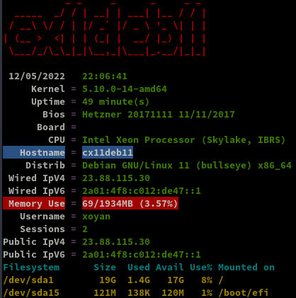
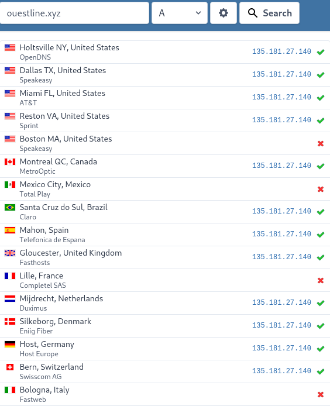
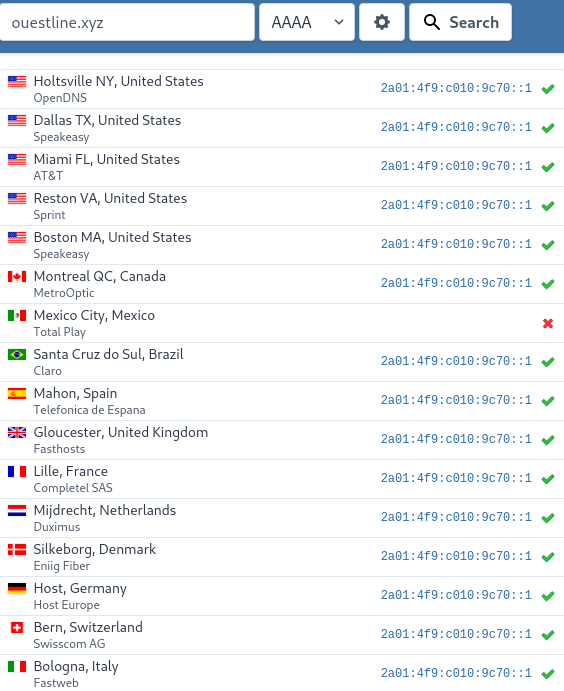
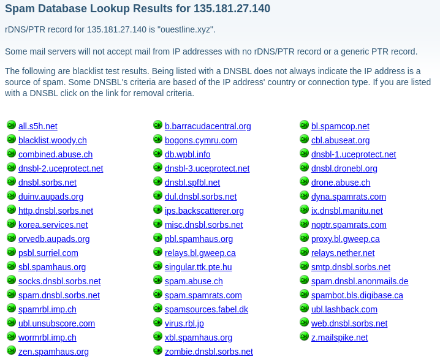
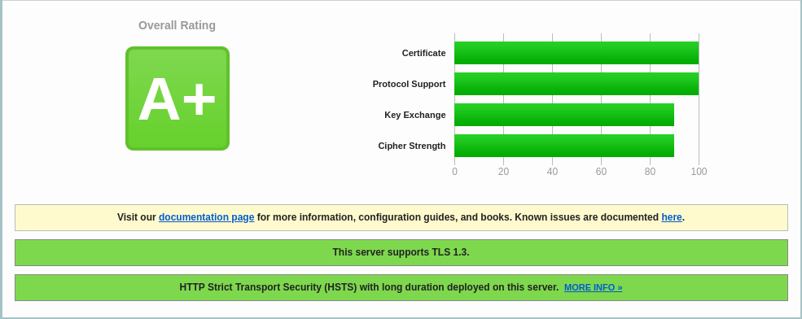
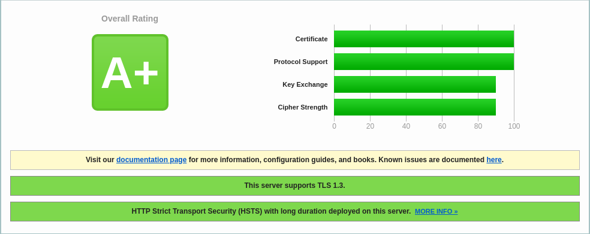
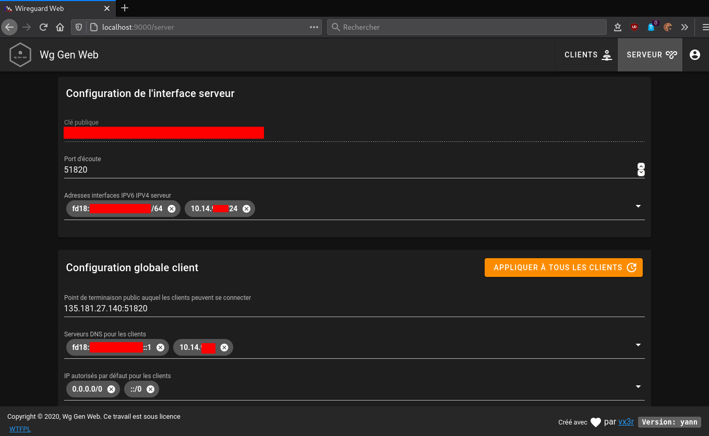
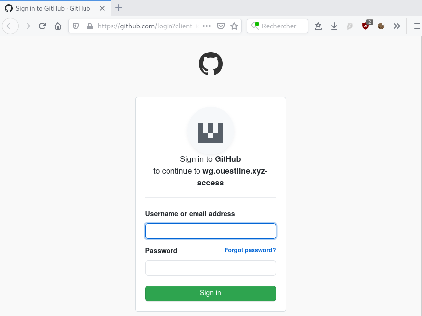
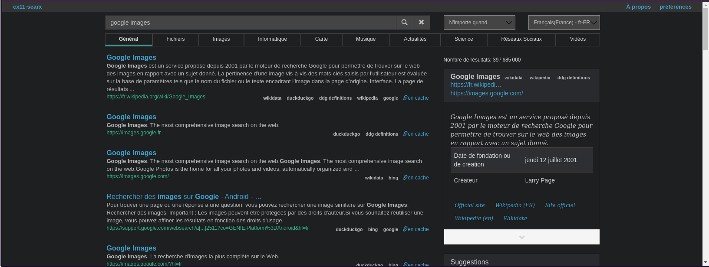

+++
title = 'HETZNER VPS CX11 debian 10 (wireguard et audio navidrome)'
date = 2020-11-10 00:00:00 +0100
categories = vps serveur
+++
[](https://www.hetzner.com/cloud-fr)*CX11 (1 vCore/2GoRam/20Go Nvme) Debian Buster*

# Serveur CX11 

## {:width="100"} Debian 10

PARAMETRES D'ACCES:  
L'adresse IPv4 du VPS est : 135.181.27.140  
L'adresse IPv6 du VPS est : 2a01:4f9:c010:9c70::/64  

Le nom du VPS est : debian-cx11  
Connexion SSH en "root" sans mot de passe

    ssh root@135.181.27.140

Créer mot de passe  "root"

    passwd

Réseau

```
1: lo: <LOOPBACK,UP,LOWER_UP> mtu 65536 qdisc noqueue state UNKNOWN group default qlen 1000
    link/loopback 00:00:00:00:00:00 brd 00:00:00:00:00:00
    inet 127.0.0.1/8 scope host lo
       valid_lft forever preferred_lft forever
    inet6 ::1/128 scope host 
       valid_lft forever preferred_lft forever
2: eth0: <BROADCAST,MULTICAST,UP,LOWER_UP> mtu 1500 qdisc pfifo_fast state UP group default qlen 1000
    link/ether 96:00:00:77:60:dc brd ff:ff:ff:ff:ff:ff
    inet 135.181.27.140/32 brd 135.181.27.140 scope global dynamic eth0
       valid_lft 84339sec preferred_lft 84339sec
    inet6 2a01:4f9:c010:9c70::1/64 scope global 
       valid_lft forever preferred_lft forever
    inet6 fe80::9400:ff:fe77:60dc/64 scope link 
       valid_lft forever preferred_lft forever
```

Noyau et OS : `uname -a`

Linux debian-cx11 4.19.0-12-amd64 #1 SMP Debian 4.19.152-1 (2020-10-18) x86_64 GNU/Linux

Noyau kernel

```
linux-image-4.19.0-12-amd64/stable,stable,now 4.19.152-1 amd64 [installed,automatic]
  Linux 4.19 for 64-bit PCs (signed)
```

Paramétrage fuseau **Europe/Paris** : `dpkg-reconfigure tzdata`  

```
Current default time zone: 'Europe/Paris'
Local time is now:      Tue Oct 20 13:01:37 CEST 2020.
Universal Time is now:  Tue Oct 20 11:01:37 UTC 2020.
```

### Création utilisateur

Utilisateur **cxuser**  

    useradd -m -d /home/cxuser/ -s /bin/bash cxuser

Mot de passe **cxuser**  

    passwd cxuser 

Visudo pour les accès root via utilisateur **cxuser**  

    echo "cxuser     ALL=(ALL) NOPASSWD: ALL" >> /etc/sudoers

### {:width=80"} OpenSSH, clé et script

**connexion avec clé**  
<u>sur l'ordinateur de bureau</u>
Générer une paire de clé curve25519-sha256 (ECDH avec Curve25519 et SHA2) nommé **cx11_ed25519** pour une liaison SSH avec le serveur KVM.  

    ssh-keygen -t ed25519 -o -a 100 -f ~/.ssh/cx11_ed25519

Envoyer la clé publique sur le serveur KVM   

    scp ~/.ssh/cx11_ed25519.pub cxuser@135.181.27.140:/home/cxuser/

<u>sur le serveur KVM</u>
On se connecte  

    ssh cxuser@135.181.27.140

Copier le contenu de la clé publique dans /home/$USER/.ssh/authorized_keys  

    cd ~

Sur le KVM ,créer un dossier .ssh  

```bash
mkdir .ssh
cat $HOME/cx11_ed25519.pub >> $HOME/.ssh/authorized_keys
chmod 600 $HOME/.ssh/authorized_keys  # donner les droits
rm $HOME/cx11_ed25519.pub  # effacer le fichier de la clé  
```

Modifier la configuration serveur SSH  

    sudo nano /etc/ssh/sshd_config  

Modifier

```conf
Port 55140
PermitRootLogin no  
PasswordAuthentication no 
```

<u>session SSH ne se termine pas correctement lors d'un "reboot" à distance</u>  
Si vous tentez de **redémarrer/éteindre** une machine distance par **ssh**, vous pourriez constater que votre session ne se termine pas correctement, vous laissant avec un terminal inactif jusqu'à l'expiration d'un long délai d'inactivité. Il existe un bogue 751636 à ce sujet. Pour l'instant, la solution de contournement à ce problème est d'installer :  

    sudo apt install libpam-systemd  # installé par défaut sur debian buster

cela terminera la session ssh avant que le réseau ne tombe.  
Veuillez noter qu'il est nécessaire que PAM soit activé dans sshd.  

Relancer openSSH  

    sudo systemctl restart sshd

Accès depuis le poste distant avec la clé privée  

    ssh -p 55140 -i ~/.ssh/cx11_ed25519 cxuser@135.181.27.140


### Outils, scripts motd et ssh_rc_bash

Installer utilitaires  

    sudo apt install rsync curl tmux jq figlet git dnsutils tree -y


Motd

    sudo rm /etc/motd && sudo nano /etc/motd

```
       _       _     _                           _  _         
    __| | ___ | |__ (_) __ _  _ _  ___  __ __ __/ |/ |        
   / _` |/ -_)| '_ \| |/ _` || ' \|___|/ _|\ \ /| || |        
   \__,_|\___||_.__/|_|\__,_||_||_|    \__|/_\_\|_||_|    _   
  ___  _  _  ___  ___| |_ | |(_) _ _   ___     _ _   ___ | |_ 
 / _ \| || |/ -_)(_-<|  _|| || || ' \ / -_) _ | ' \ / -_)|  _|
 \___/ \_,_|\___|/__/ \__||_||_||_||_|\___|(_)|_||_|\___| \__|
```


Script **ssh_rc_bash**  
>**ATTENTION!!! Les scripts sur connexion peuvent poser des problèmes pour des appels externes autres que ssh**

    wget https://static.xoyaz.xyz/files/ssh_rc_bash
    chmod +x ssh_rc_bash # rendre le bash exécutable
    ./ssh_rc_bash        # exécution



**Historique de la ligne de commande**  
Ajoutez la recherche d’historique de la ligne de commande au terminal.
Tapez un début de commande précédent, puis utilisez shift + up (flèche haut) pour rechercher l’historique filtré avec le début de la commande.

```
# Global, tout utilisateur
echo '"\e[1;2A": history-search-backward' | sudo tee -a /etc/inputrc
echo '"\e[1;2B": history-search-forward' | sudo tee -a /etc/inputrc
```

### Hostname

    hostnamectl 

```
   Static hostname: debian-cx11
         Icon name: computer-vm
           Chassis: vm
        Machine ID: 4d2c7b3c5f0449e5beb2c07529923b2f
           Boot ID: 49aecdc33f204c81a24164b17e982b76
    Virtualization: kvm
  Operating System: Debian GNU/Linux 10 (buster)
            Kernel: Linux 5.8.0-0.bpo.2-amd64
      Architecture: x86-64
```

### {:width="30"} Domaine ouestline.xyz

Zone dns OVH

```
$TTL 3600
@	IN SOA dns111.ovh.net. tech.ovh.net. (2020102003 86400 3600 3600000 300)
        IN NS     dns111.ovh.net.
        IN NS     ns111.ovh.net.
        IN A      135.181.27.140
        IN AAAA   2a01:4f9:c010:9c70::1
wg      IN CNAME  ouestline.xyz.
zic     IN CNAME  ouestline.xyz.
```

[HETZNER network](https://console.hetzner.cloud/projects/585797/servers/8123736/network) : Reverse DNS sur "server" , IP 135.181.27.140 et 2a01:4f9:c010:9c70::1 &rarr; ouestline.xyz 

Domaine rnmkcy.eu

```
$TTL 3600
@	IN SOA dns110.ovh.net. tech.ovh.net. (2020101109 86400 3600 3600000 300)
            IN NS     dns110.ovh.net.
            IN NS     ns110.ovh.net.
            IN A      135.181.27.140
            IN AAAA   2a01:4f9:c010:9c70::1
wg          IN CNAME  rnmkcy.eu.
zic         IN CNAME  rnmkcy.eu.
```


### Certificats {:width="100"} ouestline.xyz

Installer acme: [Serveur , installer et renouveler les certificats SSL Let's encrypt via Acme](https://blog.cinay.xyz/2017/08/Acme-Certficats-Serveurs/)  

    cd ~
    sudo apt install socat -y # prérequis
    git clone https://github.com/Neilpang/acme.sh.git
    cd acme.sh
    ./acme.sh --install # se déconnecter pour prise en compte
    # export des clé API OVH

Générer les certificats pour le domaine ouestline.xyz

        acme.sh --dns dns_ovh --ocsp --issue --keylength ec-384 -d 'ouestline.xyz' -d 'wg.ouestline.xyz' -d 'zic.ouestline.xyz' -d 'searx.ouestline.xyz'


```
[Tue 20 Oct 2020 01:39:02 PM CEST] Your cert is in  /home/cxuser//.acme.sh/ouestline.xyz_ecc/ouestline.xyz.cer 
[Tue 20 Oct 2020 01:39:02 PM CEST] Your cert key is in  /home/cxuser//.acme.sh/ouestline.xyz_ecc/ouestline.xyz.key 
[Tue 20 Oct 2020 01:39:02 PM CEST] The intermediate CA cert is in  /home/cxuser//.acme.sh/ouestline.xyz_ecc/ca.cer 
[Tue 20 Oct 2020 01:39:02 PM CEST] And the full chain certs is there:  /home/cxuser//.acme.sh/ouestline.xyz_ecc/fullchain.cer 
```

Les liens avec **/etc/ssl/private** 

```
sudo ln -s /home/cxuser//.acme.sh/ouestline.xyz_ecc/fullchain.cer /etc/ssl/private/ouestline.xyz-fullchain.pem   # full chain certs
sudo ln -s /home/cxuser//.acme.sh/ouestline.xyz_ecc/ouestline.xyz.key /etc/ssl/private/ouestline.xyz-key.pem     # cert key
sudo ln -s /home/cxuser//.acme.sh/ouestline.xyz_ecc/ouestline.xyz.cer /etc/ssl/private/ouestline.xyz-chain.pem   # cert domain
sudo ln -s /home/cxuser//.acme.sh/ouestline.xyz_ecc/ca.cer /etc/ssl/private/ouestline.xyz-ca.pem                 # intermediate CA cert
```


### {:width="50"} Parefeu

*UFW, ou pare - feu simple , est une interface pour gérer les règles de pare-feu dans Arch Linux, Debian ou Ubuntu. UFW est utilisé via la ligne de commande (bien qu'il dispose d'interfaces graphiques disponibles), et vise à rendre la configuration du pare-feu facile (ou simple).*

Installation **Debian / Ubuntu**

    sudo apt-get install ufw

*Par défaut, les jeux de règles d'UFW sont vides, de sorte qu'il n'applique aucune règle de pare-feu, même lorsque le démon est en cours d'exécution.*   

Les règles 

    sudo ufw allow 55140/tcp  # port SSH , 55140
    sudo ufw allow http       # port 80
    sudo ufw allow https      # port 53
    sudo ufw allow DNS        # port 53
    sudo ufw allow 51820/udp  # wireguard

Activer le parefeu

    sudo ufw enable

```
Command may disrupt existing ssh connections. Proceed with operation (y|n)? y
Firewall is active and enabled on system startup
```

Status

     sudo ufw status verbose

```
Status: active
Logging: on (low)
Default: deny (incoming), allow (outgoing), disabled (routed)
New profiles: skip

To                         Action      From
--                         ------      ----
55140/tcp                  ALLOW IN    Anywhere                  
80/tcp                     ALLOW IN    Anywhere                  
443/tcp                    ALLOW IN    Anywhere                  
53 (DNS)                   ALLOW IN    Anywhere                  
51820/udp                  ALLOW IN    Anywhere                  
55140/tcp (v6)             ALLOW IN    Anywhere (v6)             
80/tcp (v6)                ALLOW IN    Anywhere (v6)             
443/tcp (v6)               ALLOW IN    Anywhere (v6)             
53 (DNS (v6))              ALLOW IN    Anywhere (v6)             
51820/udp (v6)             ALLOW IN    Anywhere (v6)             
```

## Go + Node

### {:width="40"} Go

Go installation (Debian) , installer la dernière version de Go &rarr; <https://golang.org/dl/>

```bash
cd ~
wget https://golang.org/dl/go1.15.2.linux-amd64.tar.gz
sudo tar -C /usr/local -xzf go1.15.2.linux-amd64.tar.gz
echo "export PATH=$PATH:/usr/local/go/bin"  >> ~/.bashrc
source ~/.bashrc
```

Version

    go version

```
go version go1.15.2 linux/amd64
```

### {:width="40"} Nodejs

Installer la version LTS de nodejs pour le frontend &rarr; <https://github.com/nodesource/distributions#debinstall>

Version **Node.js v14.x** au 11 octobre 2020

```bash
# Using Debian, as root
sudo -s
curl -sL https://deb.nodesource.com/setup_14.x | bash -
apt-get install -y nodejs
```

Version **Node.js LTS (v12.x)** au 11 octobre 2020

```bash
# Using Debian, as root
sudo -s
curl -sL https://deb.nodesource.com/setup_lts.x | bash -
apt-get install -y nodejs
```

Versions

    node --version
        v14.14.0
    npm --version
        6.14.8

## {:width="50"} SSHFS 

Le dossier "musique" est distant (serveur xoyaz.xyz)  
Il faut créer une liaison réseau sécurisée entre **cx11 &larr; &rarr; xoyaz.xyz**  
On va utiliser SSHFS (*Secure shell file system (ou SSHFS) permet le partage d'un système de fichiers de manière sécurisée en utilisant le protocole SFTP de SSH*) 

Installation

    sudo apt install sshfs

Autorisations

* Autorisations "utilisateur"
     * Exécuter `sshfs` (ou toute autre commande de montage FUSE) avec l’option `-o allow_other`
* Autoriser l’accès “root” des supports **fuse**
     * Ajouter `user_allow_other` au fichier **/etc/fuse.conf**
     * Exécuter `sshfs` (ou toute autre commande de montage FUSE) avec l’option `-o allow_root`

Clé privée **OVZ-STORAGE-128** pour accéder au serveur xoyaz.xyz

	nano $HOME/.ssh/OVZ-STORAGE-128 # copier la clé privée
	chmod 600 $HOME/.ssh/OVZ-STORAGE-128

**Exécution manuelle** pour authentifier la clé avec utilisateur "debian"

    sudo -s
    mkdir -p /opt/sshfs
    sshfs -o allow_other usernl@xoyaz.xyz:/home/usernl/backup /opt/sshfs -C -p 55036 -oIdentityFile=/home/cxuser/.ssh/OVZ-STORAGE-128

```bash
The authenticity of host '[xoyaz.xyz]:55036 ([2a04:52c0:101:82::73db]:55036)' can't be established.
ECDSA key fingerprint is SHA256:NuFqR5id10fVzRLsSTqJ4vBpFnNYi+APGsvPYth6PHw.
Are you sure you want to continue connecting (yes/no)? yes
```

>NOTE: Il faut mettre l'adresse IP du serveur , si les domaines peuvent ne pas être "résolus"

Après vérification , `ls /opt/sshfs` , déconnexion `fusermount -u /opt/sshfs`

### Montage fstab

ajouter la ligne suivante au fichier `/etc/fstab`

    usernl@xoyaz.xyz:/home/usernl/backup /opt/sshfs fuse.sshfs _netdev,identityfile=/home/cxuser/.ssh/OVZ-STORAGE-128,allow_other,port=55036 0 0

Montage pour authentifier la clé avec utilisateur "root"

    sudo mount -a
    
Vérification    

    ls /opt/sshfs

## Tests sur le serveur

#### Vérifications DNS - wireguard

Les commandes suivantes ne fonctionneront que si le paquet "dnsutils" est installé sur votre système Debian!

On teste en utilisant les serveurs DNS locaux, les 3 commandes suivantes ont le même résultat

    dig @127.0.0.1 afnic.fr +short +dnssec
    dig @10.14.94.1 afnic.fr +short +dnssec 
    dig @fd18:2941:0ae9:7d96::1 afnic.fr +short +dnssec

```
192.134.5.37
A 13 2 600 20200608204052 20200509084949 30435 afnic.fr. eVchVAseJD5n8W7U8okAz546Ix33hOCqRF7wLrhUV+sOTkwyXo7EwAut k/rN8wsPVpTnTpFyQLKdBTuOpx2UxA==
```

#### Propagation DNS

<https://www.whatsmydns.net>  
{:width="300"} {:width="300"}

#### DNS blacklisting

<https://www.dnsbl.info/dnsbl-database-check.php>  
{:width="600"}

#### Vulnérabilités

<https://www.ssllabs.com/ssltest/analyze/>  

SSL Report: ouestline.xyz (135.181.27.140)  
{:width="500"}

SSL Report: ouestline.xyz (2a01:4f9:c010:9c70::1)  
{:width="500"}


Vérifier les ports ouverts depuis un poste linux

    nmap ouestline.xyz

```
Starting Nmap 7.70 ( https://nmap.org ) at 2020-10-26 14:37 CET
Nmap scan report for ouestline.xyz (135.181.27.140)
Host is up (0.023s latency).
Other addresses for ouestline.xyz (not scanned): 2a01:4f9:c010:9c70::1
Not shown: 997 filtered ports
PORT    STATE SERVICE
53/tcp  open  domain
80/tcp  open  http
443/tcp open  https
```

## Wireguard

### Installer noyau 5.8+

*A partir du noyau 5.6 le module wireguard est intégré*

    echo "deb http://deb.debian.org/debian/ unstable main" | sudo tee /etc/apt/sources.list.d/unstable-wireguard.list
    printf 'Package: *\nPin: release a=unstable\nPin-Priority: 90\n' | sudo tee /etc/apt/preferences.d/limit-unstable
    apt update && apt upgrade

Rechercher l'image
    
    apt search linux-image-5

```
linux-image-5.8.0-0.bpo.2-amd64/buster-backports,buster-backports 5.8.10-1~bpo10+1 amd64
  Linux 5.8 for 64-bit PCs (signed)
```

Installer le noyau

    apt install linux-image-5.8.0-0.bpo.2-amd64

>**REDEMARRER `sudo systemctl reboot`**

Connexion SSH 

Vérifications `uname -a`   
*Linux debian-cx11 5.8.0-0.bpo.2-amd64 #1 SMP Debian 5.8.10-1~bpo10+1 (2020-09-26) x86_64 GNU/Linux*

Supprimer les images non utilisées

    sudo apt remove linux-image-4.19.0-1x-amd64 

### Wireguard - base

*WireGuard est un serveur VPN à code source ouvert, gratuit, moderne et rapide, doté d'une cryptographie de pointe. Il est plus rapide et plus simple que l'IPSec et l'OpenVPN*

Wireguard est dans le noyau 5.6+

    apt install wireguard

**Générer une paire de clés**

On se positionne dans le dossier **/etc/wireguard/**  

    cd /etc/wireguard

WireGuard repose sur une authentification par clé publique/privée (cryptographie asymétrique), vous devez donc créer ces clés avec les sous-commandes wg genkey et wg pubkey  
La création de la clé privée se fait avec wg genkey et la clé publique est générée en la canalisant dans wg pubkey

    umask 077; wg genkey | tee cx11-private.key | wg pubkey > cx11-public.key

**Autoriser le serveur Wireguard à relayer les paquets **

Autoriser le serveur Wireguard à relayer les paquets venant de ces clients vers l'internet et de traiter les paquets retours (modifier **/etc/sysctl.conf**)

```
sed -i 's/^#net.ipv4.ip_forward=1/net.ipv4.ip_forward=1/' /etc/sysctl.conf
sed -i 's/^#net.ipv6.conf.all.forwarding=1/net.ipv6.conf.all.forwarding=1/' /etc/sysctl.conf
sysctl -p # prise en compte immédiate
```

Résultat

```
net.ipv4.ip_forward = 1
net.ipv6.conf.all.forwarding = 1
```

**Fichier de configuration /etc/wireguard/wg0.conf**

Récupérer le nom de la carte réseau `ip a` , dans notre cas **eth0**  

La première étape consiste à choisir une plage IPV4 privée, [Random IPV4 Private Address Generator](https://www.fakeaddresstool.com/random-ipv4-private-generator/), qui sera utilisée par le serveur : **10.14.94.0/8**  

Pour une adresse IPV6 [Local IPv6 Address Generator](https://www.ultratools.com/tools/rangeGenerator)  : **fd18:2941:0ae9:7d96::/64**  

Prefix/L|  fd
--------|--------
 Global ID|  1829410ae9
Subnet ID|  7d96
Combine/CID|  fd18:2941:0ae9:7d96::/64
IPv6 addresses|  fd18:2941:0ae9:7d96::/64:XXXX:XXXX:XXXX:XXXX
Start Range|  fd18:2941:0ae9:7d96:0:0:0:0
End Range|  fd18:2941:0ae9:7d96:ffff:ffff:ffff:ffff
No. of hosts|  18446744073709551616 

Nous utiliserons 10.14.94.0/24 qui se trouve dans la plage 10.14.94.0/8 . Le serveur aura l'adresse IP suivante: 10.14.94.1 . Il est également nécessaire de choisir un port, qui sera exposé publiquement, pour que le serveur écoute.Le port de documentation standard est généralement 51820.

Créer le fichier **/etc/wireguard/wg0.conf**

    nano /etc/wireguard/wg0.conf

```
[Interface]
Address = 10.14.94.1/24
Address = fd18:2941:0ae9:7d96::1/64
ListenPort = 51820
PostUp = iptables -A FORWARD -i wg0 -j ACCEPT; iptables -t nat -A POSTROUTING -o eth0 -j MASQUERADE; ip6tables -A FORWARD -i wg0 -j ACCEPT; ip6tables -t nat -A POSTROUTING -o eth0 -j MASQUERADE
PostDown = iptables -D FORWARD -i wg0 -j ACCEPT; iptables -t nat -D POSTROUTING -o eth0 -j MASQUERADE; ip6tables -D FORWARD -i wg0 -j ACCEPT; ip6tables -t nat -D POSTROUTING -o eth0 -j MASQUERADE
PrivateKey = 5Zsr0jQXiuCpHFkye325Zsr0jMUKinVEOPmk=
DNS = 10.14.94.1
DNS = fd18:2941:0ae9:7d96::1
SaveConfig = true
```

**Address** , fixer l'adresse IP privée du serveur à l'intérieur du VPN.Les adresses du réseau VPN de 10.14.94.0 à 10.14.94.255 sont fixées par le masque **/24**  
**PostUp** , pour la mise en place des règles iptables de translation d'adresses à l'activation du VPN (autoriser le routage des paquets réseau venant des clients vers internet)  
**PostDown** , pour la suppression des règles iptables de translation d'adresses à l'arrêt du VPN  
**PrivateKey** , clé privée du serveur

Modification des droits (lecture uniquement par "root")

    chmod 600 /etc/wireguard/wg0.conf

### DNS Unbound

{:width="100"}

Un problème majeur avec beaucoup de configurations VPN est que le DNS n'est pas suffisant. Cela finit par une fuite de connexion client et de détails d'emplacement. Un bon moyen de tester cela est à travers le site <http://dnsleak.com/>

Nous allons sécuriser le trafic DNS avec la solution **unbound** qui offre les caractéristiques suivantes

* Léger et rapide
* Facile à installer et à configurer
* Orienté sécurité
* Prise en charge DNSSEC 

Nous allons le configurer de manière à contrer les fuites DNS, les attaques plus sophistiquées comme la fausse configuration de proxy, les routeurs escrocs et toutes sortes d'attaques MITM sur HTTPS et autres protocoles.

Nous installons unbound sur le serveur    
Passage en mode super utilisateur

    sudo -s # ou su

>ATTENTION : Le programme **resolvconf** est en général seulement nécessaire quand un système a plusieurs programmes qui ont besoin de modifier de façon dynamique les informations sur les serveurs de noms de domaine. Sur un système simple où les serveurs de noms de domaine ne changent pas souvent ou bien ne sont modifiés que par un programme, le <u>fichier de configuration **resolv.conf** est suffisant</u>.  
Il faut installer **resolvconf**, sinon on a une erreur **unbound-resolvconf**  
Une fois le paquet «  **resolvconf**  » installé, <u>il ne faut plus modifier le fichier</u> « **/etc/resolv.conf**  », car le contenu de celui-ci sera automatiquement géré et remplacé par «  **resolvconf**  ».

Installation des outils dns, des paquets Unbound et resolv :  

    apt install unbound unbound-host resolvconf -y

Téléchargement de la liste des serveurs DNS racines

    curl -o /var/lib/unbound/root.hints https://www.internic.net/domain/named.cache
    chown unbound:unbound /var/lib/unbound/root.hints

Ajout d'un fichier de configuration **dns-cx11.conf**  

    /etc/unbound/unbound.conf.d/dns-cx11.conf 
    
```    
server:
    num-threads: 4

    # enable logs
    verbosity: 0  # no verbosity,  only  errors

    # liste des serveurs DNS racine
    root-hints: "/var/lib/unbound/root.hints"

    # Répondre aux requêtes DNS sur toutes les interfaces
    interface: 0.0.0.0                          # 0.0.0.0 unbound sur plusieurs interfaces
    interface: ::0
    max-udp-size: 3072

    # IPs authorised to access the DNS Server
    access-control: 0.0.0.0/0                 refuse
    access-control: 127.0.0.0/8               allow
    access-control: 10.14.94.0/16             allow

    access-control: ::0/0                     refuse
    access-control: ::1                       allow
    access-control: ::ffff:127.0.0.1          allow
    access-control: fe80::/10                 allow
    access-control: fd18:2941:0ae9:7d96::/48  allow

    local-zone: "14.10.in-addr.arpa." transparent

    #hide DNS Server info
    hide-identity: yes
    hide-version: yes

    # limit DNS fraud and use DNSSEC
    harden-glue: yes
    harden-dnssec-stripped: yes
    harden-referral-path: yes

    # add an unwanted reply threshold to clean the cache and avoid, when possible, DNS poisoning
    unwanted-reply-threshold: 10000000

    # have the validator print validation failures to the log
    val-log-level: 1

    # minimum lifetime of cache entries in seconds
    cache-min-ttl: 1800

    # maximum lifetime of cached entries in seconds
    cache-max-ttl: 14400
    prefetch: yes
    prefetch-key: yes

#include: /etc/unbound/unbound.conf.d/adslist.txt 
```

Droits

    chown -R unbound:unbound /var/lib/unbound

Pour vérifier si le fichier de configuration est valide

    unbound-checkconf /etc/unbound/unbound.conf.d/dns-cx11.conf

*unbound-checkconf: no errors in /etc/unbound/unbound.conf.d/dns-cx11.conf*  
Désactiver systemd-resolved (si utilisé)

    systemctl stop systemd-resolved
    systemctl disable systemd-resolved

Activer Unbound (ILS SONT ACTIFS DES LEUR INSTALLATION) 

    systemctl enable unbound-resolvconf
    systemctl enable unbound

>**Redémarrer le serveur `systemctl reboot`**

Après redémarrage et connexion au serveur

    systemctl status unbound unbound-resolvconf resolvconf

```
● unbound.service - Unbound DNS server
   Loaded: loaded (/lib/systemd/system/unbound.service; enabled; vendor preset: enabled)
   Active: active (running) since Wed 2020-10-21 09:22:55 CEST; 1min 12s ago
     Docs: man:unbound(8)
  Process: 784 ExecStartPre=/usr/lib/unbound/package-helper chroot_setup (code=exited, status=0/SUCCESS)
  Process: 798 ExecStartPre=/usr/lib/unbound/package-helper root_trust_anchor_update (code=exited, status=0/SUCCESS)
 Main PID: 805 (unbound)
    Tasks: 4 (limit: 2289)
   Memory: 38.7M
   CGroup: /system.slice/unbound.service
           └─805 /usr/sbin/unbound -d

● unbound-resolvconf.service - Unbound DNS server via resolvconf
   Loaded: loaded (/lib/systemd/system/unbound-resolvconf.service; enabled; vendor preset: enabled)
   Active: active (exited) since Wed 2020-10-21 09:22:55 CEST; 1min 12s ago
  Process: 809 ExecStart=/usr/lib/unbound/package-helper resolvconf_start (code=exited, status=0/SUCCESS)
 Main PID: 809 (code=exited, status=0/SUCCESS)

● resolvconf.service - Nameserver information manager
   Loaded: loaded (/lib/systemd/system/resolvconf.service; enabled; vendor preset: enabled)
   Active: active (exited) since Wed 2020-10-21 09:22:49 CEST; 1min 18s ago
     Docs: man:resolvconf(8)
  Process: 228 ExecStartPre=/bin/mkdir -p /run/resolvconf/interface (code=exited, status=0/SUCCESS)
  Process: 248 ExecStartPre=/bin/touch /run/resolvconf/postponed-update (code=exited, status=0/SUCCESS)
  Process: 253 ExecStart=/sbin/resolvconf --enable-updates (code=exited, status=0/SUCCESS)
 Main PID: 253 (code=exited, status=0/SUCCESS)
```

**Vérifications**

Les commandes suivantes ne fonctionneront que si le paquet "dnsutils" est installé sur votre système Debian!

On teste en utilisant les serveurs DNS locaux

	dig @127.0.0.1 afnic.fr +short +dnssec

```
192.134.5.37
A 13 2 600 20201117093213 20201018100839 30435 afnic.fr. aEOBkWup4MhF1n9W95DBJ/WVgWEiFucH5E3dPxf8FwZlolGLqGDUtM9A RrAkqfxtcGSUDEOXBIyqvEDCrej9YQ==
```

**Mise à jour des serveurs DNS racines**

Télécharger le script

    curl -o /etc/unbound/dnsunbound-update-root-dns.sh https://static.xoyaz.xyz/files/dnsunbound-update-root-dns.sh

Droits en exécution pour le bash **dnsunbound-update-root-dns.sh**

    chmod +x /etc/unbound/dnsunbound-update-root-dns.sh

Planification journalière

    crontab -e

Ajouter en fin de fichier

```
# Mise à jour automatique des serveurs DNS de la racine
10 02 * * * /etc/unbound/dnsunbound-update-root-dns.sh > /dev/null
```

### Gestion web wireguard (wgweb.service)

Création dossier application web

    sudo mkdir -p /opt/appwg

Copier le git wg-gen-web

    cd ~
    git clone https://gitea.cinay.eu/yann/wg-gen-web.git
    sudo mkdir -p /usr/local/go/src/wg-gen-web
    sudo cp -r wg-gen-web/{api,auth,core,util,version,model,storage,template} /usr/local/go/src/wg-gen-web/

Construction du site

    cd $HOME/wg-gen-web/cmd/wg-gen-web/
    go build -o deb-wg-gen-web
    cd ../../ui
    npm install  # + npm audit fix si nécessaire
    npm run build
    sudo cp $HOME/wg-gen-web/cmd/wg-gen-web/deb-wg-gen-web /opt/appwg
    sudo mkdir -p /opt/appwg/ui
    sudo cp -r $HOME/wg-gen-web/ui/dist /opt/appwg/ui/

**Configuration .env**

l'autorisation à 2 facteurs n'est pas utilisée, le fichier **/opt/appwg/.env** se résume à remplir la zone correspondante SMTP de la messagerie et désactiver l'autorisation

    /opt/appwg/.env

```
# IP address to listen to
SERVER=127.0.0.1
# port to bind
PORT=8080
# Gin framework release mode
GIN_MODE=release
# where to write all generated config files
WG_CONF_DIR=/etc/wireguard
# WireGuard main config file name, generally <interface name>.conf
WG_INTERFACE_NAME=wg0.conf

# SMTP settings to send email to clients
SMTP_HOST=smtp.gmail.com
SMTP_PORT=587
SMTP_USERNAME=account@gmail.com
SMTP_PASSWORD=*************
SMTP_FROM=Wg Gen Web <account@gmail.com>

# set provider name to fake to disable auth, also the default
OAUTH2_PROVIDER_NAME=fake
```  

>On modifie dans **/opt/appwg/.env** ,le paramètre WG_CONF_DIR=./wireguard &rarr; `WG_CONF_DIR=/etc/wireguard`  


**Créer le service wgweb.service **

Créer un service systemd **wgweb** qui lance le serveur avec journalisation  

    sudo nano /etc/systemd/system/wgweb.service

```
[Unit]
Description=Wireguard web
After=network.target

[Service]

Type=simple

Restart=on-failure
RestartSec=10

WorkingDirectory=/opt/appwg
ExecStart=/opt/appwg/deb-wg-gen-web

[Install]
WantedBy=multi-user.target
```

**wireguard (wg0.conf et server.json)**

Modifier les fichiers existants pour être identique au paramétrage de wireguard **wg0.conf** situé sous **/etc/wireguard**

    /etc/wireguard/server.json 

```json
{
 "address": [
    "fd18:2941:0ae9:7d96::1/64",
    "10.14.94.1/24"
  ],
  "listenPort": 51820,
  "mtu": 0,
  "privateKey": "UEQCgh/6a2RQbF9+qqylVjqLCK/mRwqRPc/4vjRsYXg=",
  "publicKey": "0s1wsNpuU1RlKgj6AmoN0aKUeb+aESByhO3yTSnfTyE=",
  "endpoint": "xoyaz.xyz:51820",
  "persistentKeepalive": 16,
  "dns": [
    "fd18:2941:0ae9:7d96::1",
    "10.14.94.1"
  ],
  "allowedips": [
    "0.0.0.0/0",
    "::/0"
  ],
  "preUp": "",
  "postUp": "iptables -A FORWARD -i wg0 -j ACCEPT; iptables -t nat -A POSTROUTING -o eth0 -j MASQUERADE; ip6tables -A FORWARD -i wg0 -j ACCEPT; ip6tables -t nat -A POSTROUTING -o eth0 -j MASQUERADE",
  "preDown": "",
  "postDown": "iptables -D FORWARD -i wg0 -j ACCEPT; iptables -t nat -D POSTROUTING -o eth0 -j MASQUERADE; ip6tables -D FORWARD -i wg0 -j ACCEPT; ip6tables -t nat -D POSTROUTING -o eth0 -j MASQUERADE",
  "updatedBy": "Unknown",
  "created": "2020-10-21T12:31:50.589913433Z",
  "updated": "2020-10-21T12:31:50.589913433Z"
```

Recharger `systemd` puis démarrer le service:

    sudo systemctl daemon-reload
    sudo systemctl start wgweb.service
    sudo systemctl status wgweb.service

```
● wgweb.service - Wireguard web
   Loaded: loaded (/etc/systemd/system/wgweb.service; disabled; vendor preset: enabled)
   Active: active (running) since Wed 2020-10-21 10:46:58 CEST; 43s ago
 Main PID: 1426 (deb-wg-gen-web)
    Tasks: 5 (limit: 2289)
   Memory: 5.0M
   CGroup: /system.slice/wgweb.service
           └─1426 /opt/appwg/deb-wg-gen-web

Oct 21 10:46:58 debian-cx11 systemd[1]: Started Wireguard web.
Oct 21 10:46:58 debian-cx11 deb-wg-gen-web[1426]: time="2020-10-21T10:46:58+02:00" level=info msg="Lancement de la version Web de Wg Gen : yann"
Oct 21 10:46:58 debian-cx11 deb-wg-gen-web[1426]: time="2020-10-21T10:46:58+02:00" level=warning msg="Oauth n'est pas utilisé, aucune authentification réelle ne sera effectuée"
```

### Accès page Web Wireguard 

On utilise la redirection port SSH

Vérification,ouvrir un terminal sur le client linux qui dispose des clés ssh et lancer la commande

    ssh -L 9000:localhost:8080 cxuser@135.181.27.140 -p 55140 -i /home/yannick/.ssh/cx11_ed25519

Ouvrir un navigateur sur le client et saisir `localhost:9000` pour afficher le gestionnaire web de wireguard

{:width="600"}

Activer le service si tout fonctionne

    sudo systemctl enable wgweb.service

### Activer service wg-quick@wg0

Le gestionnaire web est à jour , on peut lancer le serveur wireguard

    sudo systemctl start wg-quick@wg0.service

Vérifier

    systemctl status wg-quick@wg0.service

```
● wg-quick@wg0.service - WireGuard via wg-quick(8) for wg0
   Loaded: loaded (/lib/systemd/system/wg-quick@.service; disabled; vendor preset: enabled)
   Active: active (exited) since Wed 2020-10-21 10:57:22 CEST; 52s ago
     Docs: man:wg-quick(8)
           man:wg(8)
           https://www.wireguard.com/
           https://www.wireguard.com/quickstart/
           https://git.zx2c4.com/wireguard-tools/about/src/man/wg-quick.8
           https://git.zx2c4.com/wireguard-tools/about/src/man/wg.8
  Process: 1480 ExecStart=/usr/bin/wg-quick up wg0 (code=exited, status=0/SUCCESS)
 Main PID: 1480 (code=exited, status=0/SUCCESS)
```

Activer

    sudo systemctl enable wg-quick@wg0.service

### Configuration automatique

Utilisation de **systemd.path** monitor pour les changements dans le répertoire, voir [systemd doc](https://www.freedesktop.org/software/systemd/man/systemd.path/)

    /etc/systemd/system/wg-gen-web.path

```init
[Unit]
Description=Surveiller /etc/wireguard pour les changements

[Path]
PathModified=/etc/wireguard

[Install]
WantedBy=multi-user.target
```

Ce **wg-gen-web.path** activera le fichier de l'unité avec le même nom, **wg-gen-web.service**

    /etc/systemd/system/wg-gen-web.service

```
[Unit]
Description=Relancer WireGuard si changements
After=network.target

[Service]
Type=oneshot
ExecStart=/usr/bin/systemctl restart wg-quick@wg0.service

[Install]
WantedBy=multi-user.target
```

Ce qui permettra de relancer le service WireGuard

    sudo systemctl start wg-gen-web.path
    sudo systemctl status wg-gen-web.path

```
● wg-gen-web.path - Surveiller /etc/wireguard pour les changements
   Loaded: loaded (/etc/systemd/system/wg-gen-web.path; disabled; vendor preset: enabled)
   Active: active (waiting) since Wed 2020-10-21 11:00:47 CEST; 20ms ago

Oct 21 11:00:47 debian-cx11 systemd[1]: Started Surveiller /etc/wireguard pour les changements.
```

Activation

    sudo systemctl enable wg-gen-web.path

Pour suivre  dans le journal

    sudo journalctl -f -t wg-quick

```
-- Logs begin at Wed 2020-10-21 09:22:49 CEST. --
Oct 21 10:57:22 debian-cx11 wg-quick[1480]: [#]
Oct 21 10:57:22 debian-cx11 wg-quick[1480]: [#] ip link add wg0 type wireguard
Oct 21 10:57:22 debian-cx11 wg-quick[1480]: [#] wg setconf wg0 /dev/fd/63
Oct 21 10:57:22 debian-cx11 wg-quick[1480]: [#] ip -6 address add fd18:2941:0ae9:7d96::1/64 dev wg0
Oct 21 10:57:22 debian-cx11 wg-quick[1480]: [#] ip -4 address add 10.14.94.1/24 dev wg0
Oct 21 10:57:22 debian-cx11 wg-quick[1480]: [#] ip link set mtu 1420 up dev wg0
Oct 21 10:57:22 debian-cx11 wg-quick[1480]: [#] iptables -A FORWARD -i wg0 -j ACCEPT; iptables -t nat -A POSTROUTING -o eth0 -j MASQUERADE; ip6tables -A FORWARD -i wg0 -j ACCEPT; ip6tables -t nat -A POSTROUTING -o eth0 -j MASQUERADE
```

## Audio server

### Navidrome

Création des répertoires

```
sudo install -d -o cxuser -g cxuser /opt/navidrome
sudo install -d -o cxuser -g cxuser /var/lib/navidrome
```

Installation

```
wget https://github.com/deluan/navidrome/releases/download/v0.35.1/navidrome_0.35.1_Linux_x86_64.tar.gz -O Navidrome.tar.gz
sudo tar -xvzf Navidrome.tar.gz -C /opt/navidrome/
sudo chown -R cxuser:cxuser /opt/navidrome
```

Créer le fichier de configuration `/var/lib/navidrome/navidrome.toml` avec le paramètre suivant

    MusicFolder = "/opt/sshfs/musique"

### Service navidrome

Créer le service navidrome `/etc/systemd/system/navidrome.service`

```
[Unit]
Description=Navidrome Music Server and Streamer compatible with Subsonic/Airsonic
After=remote-fs.target network.target
AssertPathExists=/var/lib/navidrome

[Install]
WantedBy=multi-user.target

[Service]
User=cxuser
Group=cxuser
Type=simple
ExecStart=/opt/navidrome/navidrome --configfile "/var/lib/navidrome/navidrome.toml"
WorkingDirectory=/var/lib/navidrome
TimeoutStopSec=20
KillMode=process
Restart=on-failure

# See https://www.freedesktop.org/software/systemd/man/systemd.exec/
DevicePolicy=closed
NoNewPrivileges=yes
PrivateTmp=yes
PrivateUsers=yes
ProtectControlGroups=yes
ProtectKernelModules=yes
ProtectKernelTunables=yes
RestrictAddressFamilies=AF_UNIX AF_INET AF_INET6
RestrictNamespaces=yes
RestrictRealtime=yes
SystemCallFilter=~@clock @debug @module @mount @obsolete @reboot @setuid @swap
ReadWritePaths=/var/lib/navidrome

# You can uncomment the following line if you're not using the jukebox This
# will prevent navidrome from accessing any real (physical) devices
#PrivateDevices=yes

# You can change the following line to `strict` instead of `full` if you don't
# want navidrome to be able to write anything on your filesystem outside of
# /var/lib/navidrome.
ProtectSystem=full

# You can comment the following line if you don't have any media in /home/*.
# This will prevent navidrome from ever reading/writing anything there.
ProtectHome=true
```

### Activer service navidrome

Démarrer le service

    sudo systemctl daemon-reload
    sudo systemctl start navidrome.service

Le status

    sudo systemctl status navidrome.service

```
● navidrome.service - Navidrome Music Server and Streamer compatible with Subsonic/Airsonic
   Loaded: loaded (/etc/systemd/system/navidrome.service; disabled; vendor preset: enabled)
   Active: active (running) since Wed 2020-10-21 13:20:29 CEST; 8s ago
 Main PID: 6361 (navidrome)
    Tasks: 5 (limit: 2289)
   Memory: 10.2M
   CGroup: /system.slice/navidrome.service
           └─6361 /opt/navidrome/navidrome --configfile /var/lib/navidrome/navidrome.toml

Oct 21 13:20:29 debian-cx11 navidrome[6361]: time="2020-10-21T13:20:29+02:00" level=info msg="Configuring Media
Oct 21 13:20:29 debian-cx11 navidrome[6361]: time="2020-10-21T13:20:29+02:00" level=info msg="Creating Transcod
Oct 21 13:20:29 debian-cx11 navidrome[6361]: time="2020-10-21T13:20:29+02:00" level=warning msg="Running initia
Oct 21 13:20:29 debian-cx11 navidrome[6361]: time="2020-10-21T13:20:29+02:00" level=warning msg="Creating JWT s
Oct 21 13:20:29 debian-cx11 navidrome[6361]: time="2020-10-21T13:20:29+02:00" level=info msg="Starting scanner"
Oct 21 13:20:29 debian-cx11 navidrome[6361]: time="2020-10-21T13:20:29+02:00" level=info msg="Mounting routes" 
Oct 21 13:20:29 debian-cx11 navidrome[6361]: time="2020-10-21T13:20:29+02:00" level=info msg="Mounting routes" 
Oct 21 13:20:29 debian-cx11 navidrome[6361]: time="2020-10-21T13:20:29+02:00" level=info msg="Login rate limit 
Oct 21 13:20:29 debian-cx11 navidrome[6361]: time="2020-10-21T13:20:29+02:00" level=info msg="Navidrome server 
Oct 21 13:20:31 debian-cx11 navidrome[6361]: time="2020-10-21T13:20:31+02:00" level=warning msg="No admin user 
```

Activer

    sudo systemctl enable navidrome.service

### Accès page Web Navidrome 

On utilise la redirection port SSH

Vérification,ouvrir un terminal sur le client linux qui dispose des clés ssh et lancer la commande

    ssh -L 9000:localhost:4533 cxuser@135.181.27.140 -p 55140 -i /home/yannick/.ssh/cx11_ed25519

Ouvrir un navigateur sur le client et saisir `localhost:9000` pour afficher le gestionnaire web de wireguard

{:width="600"}   
Il faut créer un administrateur  
Paramétrer la langue dans "Settings"  "Personal"  

## Nginx light

[Debian installer nginx-light](/posts/nginx-light/)

Installer version light

    sudo apt install nginx-light

Version

    sudo nginx -v

nginx version: nginx/1.14.2

Modifier le fichier de configuration `/etc/nginx/nginx.conf` , on utilise TLS1.2 et TLS1.3  uniquement

```
user www-data;
worker_processes auto;
pid /run/nginx.pid;
include /etc/nginx/modules-enabled/*.conf;

events {
	worker_connections 768;
	# multi_accept on;
}

http {

	##
	# Basic Settings
	##

	sendfile on;
	tcp_nopush on;
	tcp_nodelay on;
	keepalive_timeout 65;
	types_hash_max_size 2048;
	# server_tokens off;

	# server_names_hash_bucket_size 64;
	# server_name_in_redirect off;

	include /etc/nginx/mime.types;
	default_type application/octet-stream;

	##
	# SSL Settings
	##

	ssl_protocols TLSv1.2 TLSv1.3;
	ssl_prefer_server_ciphers off;

	##
	# Logging Settings
	##

	access_log /var/log/nginx/access.log;
	error_log /var/log/nginx/error.log;

	##
	# Gzip Settings
	##

	gzip on;

	# gzip_vary on;
	# gzip_proxied any;
	# gzip_comp_level 6;
	# gzip_buffers 16 8k;
	# gzip_http_version 1.1;
	# gzip_types text/plain text/css application/json application/javascript text/xml application/xml application/xml+rss text/javascript;

	##
	# Virtual Host Configs
	##

	include /etc/nginx/conf.d/*.conf;
	include /etc/nginx/sites-enabled/*;
}

```

Vérification

    sudo nginx -t

```
nginx: the configuration file /etc/nginx/nginx.conf syntax is ok
nginx: configuration file /etc/nginx/nginx.conf test is successful
```

Configuration par défaut

    sudo nano /etc/nginx/sites-enabled/default

```
server {
    listen 80;
    listen [::]:80;
    server_name ouestline.xyz;
    return 301 https://$host$request_uri;
}
server {
    listen 443 ssl http2;
    listen [::]:443 ssl http2;
    server_name ouestline.xyz;
    ssl_certificate /etc/ssl/private/ouestline.xyz-fullchain.pem;
    ssl_certificate_key /etc/ssl/private/ouestline.xyz-key.pem;

    root /var/www/;
    index index/ index.htm index.nginx-debian/;

    # TLS 1.3 only
    ssl_protocols TLSv1.3;
    ssl_prefer_server_ciphers off;
 
    # HSTS (ngx_http_headers_module is required) (63072000 seconds)
    add_header Strict-Transport-Security "max-age=63072000" always;
 
    # OCSP stapling
    ssl_stapling on;
    ssl_stapling_verify on;
 
    # verify chain of trust of OCSP response using Root CA and Intermediate certs
    ssl_trusted_certificate /etc/ssl/private/ouestline.xyz-fullchain.pem;
 
    # replace with the IP address of your resolver
    resolver 127.0.0.1;

}
```

Vérification et relance

    sudo nginx -t
    sudo systemctl reload nginx

Image sur la page d'accueil (facultatif)  
Déposer une image dans le dossier `/var/www/`  
Créer un fichier `/var/www//index/`  

```hmtl
<!DOCTYPE/>
/>
<head>
 <meta charset="UTF-8"> 
 <title>CX11</title>
<style type="text/css" media="screen" >
html { 
  margin:0;
  padding:0;
  background: url(wallpaper.jpg) no-repeat center fixed; 
  -webkit-background-size: cover; /* pour anciens Chrome et Safari */
  background-size: cover; /* version standardisée */
}
body { color: white; }
a:link {
  color: grey;
  background-color: transparent;
  text-decoration: none;
}
a:hover {
  color: red;
  background-color: transparent;
  text-decoration: underline;
}

</style>

</head>
<body>

<h1>Serveur CX11</h1>
<p>If you see this page, the nginx web server is successfully installed and
working. Further configuration is required.</p>

<p>For online documentation and support please refer to
<a href="http://nginx.org/">nginx.org</a>.<br/>
Commercial support is available at
<a href="http://nginx.com/">nginx.com</a>.</p>

<p><em>Thank you for using nginx.</em></p>

</body>
</>
```

Lien https://ouestline.xyz

### Nginx Reverse proxy navidrome

Fichier de configuration `/etc/nginx/conf.d/zic.ouestline.xyz.conf`

```
server {
    listen 443 ssl http2;
    listen [::]:443 ssl http2;
    server_name zic.ouestline.xyz;
    ssl_certificate /etc/ssl/private/ouestline.xyz-fullchain.pem;
    ssl_certificate_key /etc/ssl/private/ouestline.xyz-key.pem;

    # TLS 1.3 only
    ssl_protocols TLSv1.3;
    ssl_prefer_server_ciphers off;
 
    # HSTS (ngx_http_headers_module is required) (63072000 seconds)
    add_header Strict-Transport-Security "max-age=63072000" always;
 
    # OCSP stapling
    ssl_stapling on;
    ssl_stapling_verify on;
 
    # verify chain of trust of OCSP response using Root CA and Intermediate certs
    ssl_trusted_certificate /etc/ssl/private/ouestline.xyz-fullchain.pem;
 
    # replace with the IP address of your resolver
    resolver 127.0.0.1;

    # Proxy audio navidrome server
    location / {
    	  #//normal proxy configuration
	  proxy_http_version 1.1;
	  proxy_pass_request_headers on;
	  proxy_set_header Host $host;
	  proxy_set_header X-Real-IP $remote_addr;
	  proxy_set_header X-Forwarded-For $proxy_add_x_forwarded_for;
	  proxy_set_header Accept-Encoding "";
	
	  proxy_pass http://localhost:4533;
	  proxy_redirect default;
    }	
}
```

Vérification et relance

    sudo nginx -t
    sudo systemctl reload nginx

Lien https://zic.ouestline.xyz

### Nginx Reverse proxy wireguard (INACTIF)

*L'accès web wireguard n'est pas sécurisé par un login/mot de passe*

Si l'on possède un compte github,vous pouvez créer et enregistrer une application OAuth sous votre compte personnel ou sous toute organisation à laquelle vous avez un accès administratif. Lorsque vous créez votre application OAuth, n'oubliez pas de protéger votre vie privée en utilisant uniquement les informations que vous considérez comme publiques.

>Note : Un utilisateur ou une organisation peut posséder jusqu'à 100 applications OAuth.

Après création d'une application OAuth, il faut modifier le fichier  de configuration  de l'application wireguard web `/opt/appwg/.env`

En fin de fichier

```
[...]
# set provider name to fake to disable auth, also the default
#OAUTH2_PROVIDER_NAME=fake
OAUTH2_PROVIDER_NAME=github
OAUTH2_PROVIDER=https://github.com
OAUTH2_CLIENT_ID=b00eb256845555899e
OAUTH2_CLIENT_SECRET=544df8a3c888bf45687455128822da455
OAUTH2_REDIRECT_URL=https://wg.ouestline.xyz
```

Relancer le service `sudo systemctl restart wgweb.service`

Fichier de configuration `/etc/nginx/conf.d/wg.ouestline.xyz.conf`

```
server {
    listen 443 ssl http2;
    listen [::]:443 ssl http2;
    server_name wg.ouestline.xyz;
    ssl_certificate /etc/ssl/private/ouestline.xyz-fullchain.pem;
    ssl_certificate_key /etc/ssl/private/ouestline.xyz-key.pem;

    # TLS 1.3 only
    ssl_protocols TLSv1.3;
    ssl_prefer_server_ciphers off;
 
    # HSTS (ngx_http_headers_module is required) (63072000 seconds)
    add_header Strict-Transport-Security "max-age=63072000" always;
 
    # OCSP stapling
    ssl_stapling on;
    ssl_stapling_verify on;
 
    # verify chain of trust of OCSP response using Root CA and Intermediate certs
    ssl_trusted_certificate /etc/ssl/private/ouestline.xyz-fullchain.pem;
 
    # replace with the IP address of your resolver
    resolver 127.0.0.1;

    location / {
    	  #//normal proxy configuration
	  proxy_http_version 1.1;
	  proxy_pass_request_headers on;
	  proxy_set_header Host $host;
	  proxy_set_header X-Real-IP $remote_addr;
	  proxy_set_header X-Forwarded-For $proxy_add_x_forwarded_for;
	  proxy_set_header Accept-Encoding "";
	
	  proxy_pass http://localhost:8080;
	  proxy_redirect default;
    }	
}

```

Recharger nginx `sudo systemctl reload nginx`

Accès <https://wg.ouestline.xyz>  
{:width="500"}

## Métamoteur Searx

### Searx - Docker 

Les procédures d'installation, voir le lien [Searx (métamoteur de recherche libre)](/posts/Searx-Metamoteur-Recherche-Libre/)

L'image du docker est [searx/searx](https://hub.docker.com/r/searx/searx) (basée sur [github.com/searx/searx](https://github.com/searx/searx)).  

    docker pull searx/searx
    docker images

```
REPOSITORY          TAG                 IMAGE ID            CREATED             SIZE
searx/searx         latest              933b0039140b        24 hours ago        168MB
```

La méthode la plus simple pour déployer un conteneur en tant que service consiste à créer le conteneur s'il n'existe pas avec un nom donné et ensuite de mapper chacune des opérations de docker (démarrage et arrêt) aux commandes de service du système.

Une fois que nous avons créé ce conteneur, nous pouvons le démarrer, l'arrêter et le redémarrer en utilisant les commandes habituelles du docker en indiquant le nom du conteneur (`docker stop searx`, `docker start searx`, `docker restart searx`).

Créer un nouveau fichier d'unité systemd `searx.service` avec la description du service dans `/etc/systemd/system/`. 

    /etc/systemd/system/searx.service

```
[Unit]
Description=searx container
After=docker.service
Wants=network-online.target docker.socket
Requires=docker.socket
 
[Service]
Restart=always
ExecStartPre=/bin/bash -c "/usr/bin/docker container inspect searx 2> /dev/null || /usr/bin/docker run --name searx --rm -d -v /home/cxuser/searx:/etc/searx -p 8089:8080 -e BASE_URL=http://localhost:8089/ searx/searx"
ExecStart=/usr/bin/docker start -a searx
ExecStop=/usr/bin/docker stop -t 10 searx
 
[Install]
WantedBy=multi-user.target
```

Recharger les services

    sudo systemctl daemon-reload

Le fichier d'unité crée un nouveau service et associe les commandes de démarrage et d'arrêt du docker aux séquences de démarrage et d'arrêt du service.

Le fichier unit décrit comme des dépendances la cible réseau en ligne et la prise docker, si la prise docker ne démarre pas ce service ne le fera pas non plus. Il ajoute également une dépendance à docker.service, de sorte que ce service ne fonctionnera pas tant que docker.service n'aura pas démarré.

Nous pouvons maintenant démarrer/arrêter le service en émettant la commande correspondante :
	
    sudo systemctl start searx
    sudo systemctl stop searx

Nous pouvons également installer le service pour qu'il fonctionne au démarrage en courant :

    sudo systemctl enable searx

Vérifier localement

    curl --location --verbose --head --insecure localhost:8089

```
[...]
*   Trying 127.0.0.1...
* TCP_NODELAY set
* Expire in 200 ms for 4 (transfer 0x555ec9e93f50)
* Connected to localhost (127.0.0.1) port 8089 (#0)
> HEAD / HTTP/1.1
> Host: localhost:8089
> User-Agent: curl/7.64.0
> Accept: */*
> 
< HTTP/1.1 200 OK
HTTP/1.1 200 OK
[...]
```

Modifier le fichier de configuration

    sudo nano ${PWD}/searx/settings.yml

```
general:

    instance_name : "cx11-searx" # displayed name

server:
    secret_key : "546c29de2eaeb051edf87ab74d22c8f608b6e6a2ba55d3e10f818154e8c3b179" # change this!
    base_url : False # Set custom base_url. Possible values: False or "https://your.custom.host/lo
cation/"

ui:

    default_theme : oscar # ui theme

    theme_args :
        oscar_style : logicodev-dark # default style of oscar

# supprimer la ligne 'disabled : True' des éléments ci dessous

  - name : ddg definitions
    engine : duckduckgo_definitions
    shortcut : ddd
    weight : 2

  - name : duckduckgo
    engine : duckduckgo
    shortcut : ddg

  - name : duckduckgo images
    engine : duckduckgo_images
    shortcut : ddi
    timeout: 3.0

```

Relever ID pour un redémarrage

    docker ps

```
CONTAINER ID        IMAGE               COMMAND                  CREATED             STATUS              PORTS                    NAMES
2b661e674108        searx/searx         "/sbin/tini -- /usr/…"   17 minutes ago      Up 17 minutes       0.0.0.0:8089->8080/tcp   upbeat_cori
```

    docker restart 2b661e674108

Exécuter sur un poste distant

    ssh -L 9000:localhost:8089 cxuser@135.181.27.140 -p 55140 -i /home/yannick/.ssh/cx11_ed25519  

Sur le même poste , ouvrir le navigateur avec un lien <http://localhost:9000>

{:width="600"}

### Searx - Proxy nginx

Fichier de configuration `/etc/nginx/conf.d/searx.ouestline.xyz.conf`

```
server {
    listen 443 ssl http2;
    listen [::]:443 ssl http2;
    server_name searx.ouestline.xyz;
    ssl_certificate /etc/ssl/private/ouestline.xyz-fullchain.pem;
    ssl_certificate_key /etc/ssl/private/ouestline.xyz-key.pem;

    # TLS 1.3 only
    ssl_protocols TLSv1.3;
    ssl_prefer_server_ciphers off;
 
    # HSTS (ngx_http_headers_module is required) (63072000 seconds)
    add_header Strict-Transport-Security "max-age=63072000" always;
 
    # OCSP stapling
    ssl_stapling on;
    ssl_stapling_verify on;
 
    # verify chain of trust of OCSP response using Root CA and Intermediate certs
    ssl_trusted_certificate /etc/ssl/private/ouestline.xyz-fullchain.pem;
 
    # replace with the IP address of your resolver
    resolver 127.0.0.1;

    location / {
    	  #//normal proxy configuration
	  proxy_http_version 1.1;
	  proxy_pass_request_headers on;
	  proxy_set_header Host $host;
	  proxy_set_header X-Real-IP $remote_addr;
	  proxy_set_header X-Forwarded-For $proxy_add_x_forwarded_for;
	  proxy_set_header Accept-Encoding "";
	
	  proxy_pass http://localhost:8089;
	  proxy_redirect default;
    }	
}

```

Recharger nginx `sudo systemctl reload nginx`

Accès <https://searx.ouestline.xyz>  
{:width="500"}

## Sauvegarde BorgBackup


Machine à sauvegarder : ouestline.xyz  (135.181.27.140)
Serveur de backup : xoyaz.xyz  (5.2.79.127)

### Installer borgbackup
On se connecte sur la machine (si non local) et on passe en mode su  

    #ssh utilisateur@ouestline.xyz
    ssh cxuser@ouestline.xyz -p 55140 -i /home/yannick/.ssh/cx11_ed25519
    sudo -s
    apt update

Installer borgbackup

    apt install borgbackup  # Debian

**<u>Créer un jeu de clé sur machine à sauvegarder (ouestline.xyz)</u>**  
Créer un utilisateur borg (sans home) dédié aux sauvegardes par BorgBackup :

    useradd -M borg

Générer un jeu de clé sur **/root/.ssh** 

    mkdir -p /root/.ssh
    ssh-keygen -t ed25519 -o -a 100 -f /root/.ssh/cx11_borg_ed25519

Le jeu de clé

    ls /root/.ssh
        cx11_borg_ed25519  cx11_borg_ed25519.pub

Autoriser utilisateur **borg** à exécuter */usr/bin/borg* uniquement

    echo "borg ALL=NOPASSWD: /usr/bin/borg" >> /etc/sudoers

### Clés SSH borgbackup

>Pour une connexion via ssh vous devez ajouter la clé publique *cx11_borg_ed25519.pub* du **serveur client  ouestline.xyz** au fichier *~/.ssh/authorized_keys* du  **serveur backup xoyaz.xyz**  

Se connecter au **serveur backup xoyaz.xyz** depuis un terminal autorisé

	ssh usernl@xoyaz.xyz -p 55036 -i ~/.ssh/OVZ-STORAGE-128 # connexion SSH serveur backup depuis PC1
	sudo -s # passer en super utilisateur
	cat >> /srv/data/borg-backups/.ssh/authorized_keys

Copier/coller le contenu du fichier du fichier de clef publique (fichier **/root/.ssh/cx11_borg_ed25519.pub** de la machine à sauvegarder **ouestline.xyz** ) dans ce terminal, et presser **[Ctrl]+[D]** pour valider.

Test depuis le serveur client **ouestline.xyz**  (c'est lui qui possède la clé privée).  
*Si parefeu avec les sorties bloquées sur **ouestline.xyz** , il faut ouvrir en sortie le port TCP 55036.*

**AU PREMIER passage une question est posée , saisir oui ou yes**

    sudo -s
    ssh -p 55036 -i /root/.ssh/cx11_borg_ed25519 borg@xoyaz.xyz

```
The authenticity of host '[xoyaz.xyz]:55036 ([2a04:52c0:101:7ae::7a5e]:55036)' can't be established.
ECDSA key fingerprint is SHA256:PDXQBhTh4oj0cSzgnjCun+J60JDUEk7VeLH2YHZbwMc.
Are you sure you want to continue connecting (yes/no)? yes
Warning: Permanently added '[xoyaz.xyz]:55036,[2a04:52c0:101:7ae::7a5e]:55036' (ECDSA) to the list of known hosts.
Linux backup 2.6.32-042stab140.1 #1 SMP Thu Aug 15 13:32:22 MSK 2019 x86_64
  _               _               
 | |__  __ _  __ | |__ _  _  _ __ 
 | '_ \/ _` |/ _|| / /| || || '_ \
 |_.__/\__,_|\__||_\_\ \_,_|| .__/
                            |_|   
Last login: Sun Sep 15 15:13:35 2019 from 2a01:e34:eef2:570:2c83:bd30:365a:ff54
$ 
```

saisir `exit` pour sortir

>NOTE : **/srv/data/borg-backups** est le home de l'utilisateur *borg* sur le serveur backup *xoyaz.xyz*

### Création dépôt et sauvegarde

**<u>machine cliente ouestline.xyz</u>**  
On se connecte sur la machine et on passe en mode su  

    sudo -s

**Création du dépôt distant sur le serveur backup xoyaz.xyz (A FAIRE UNE SEULE FOIS)**

    export BORG_RSH='ssh -i /root/.ssh/cx11_borg_ed25519' # ce n'est pas la clé par défaut id_rsa
    borg init --encryption=repokey-blake2 ssh://borg@xoyaz.xyz:55036/srv/data/borg-backups/ouestline.xyz

```
Enter new passphrase: 
Enter same passphrase again: 
Do you want your passphrase to be displayed for verification? [yN]: 

By default repositories initialized with this version will produce security
errors if written to with an older version (up to and including Borg 1.0.8).

If you want to use these older versions, you can disable the check by running:
borg upgrade --disable-tam ssh://borg@xoyaz.xyz:55036/srv/data/borg-backups/ouestline.xyz

See https://borgbackup.readthedocs.io/en/stable/changes/#pre-1-0-9-manifest-spoofing-vulnerability for details about the security implications.

IMPORTANT: you will need both KEY AND PASSPHRASE to access this repo!
Use "borg key export" to export the key, optionally in printable format.
Write down the passphrase. Store both at safe place(s).
```

Sauvegarder la "passphrase" dans un fichier pour une procédure automatique 

    mkdir -p /root/.borg
    nano /root/.borg/passphrase

**Générer une sauvegarde d'un dossier local vers le dépôt distant** pour test (facultatif)

    borg create ssh://borg@xoyize.xyz:55029/srv/ssd-two/borg-backups/ouestline.xyz::2019-01-11 /home/yanfi

```
Enter passphrase for key ssh://borg@xoyize.xyz:55029/srv/ssd-two/borg-backups/ouestline.xyz: 
```

**Automatiser la procédure de sauvegarde pour le client ouestline.xyz**  
script de sauvegarde (notez l'usage de borg prune pour supprimer les archives trop anciennes)  

    nano /root/.borg/borg-backup 

```
#!/bin/sh
#
# Script de sauvegarde.
#
# Envoie les sauvegardes sur un serveur distant, via le programme Borg.
# Les sauvegardes sont chiffrées
#
 
set -e
 
BACKUP_DATE=`date +%Y-%m-%d-%Hh%M`
LOG_PATH=/var/log/borg-backup.log
 
export BORG_PASSPHRASE="`cat ~root/.borg/passphrase`"
export BORG_RSH='ssh -i /root/.ssh/cx11_borg_ed25519'
BORG_REPOSITORY=ssh://borg@xoyaz.xyz:55036/srv/data/borg-backups/ouestline.xyz
BORG_ARCHIVE=${BORG_REPOSITORY}::${BACKUP_DATE}
 
borg create \
-v --stats --compression lzma,9 \
$BORG_ARCHIVE \
/bin /boot /etc /home /lib /lib64 /opt/appwg /opt/navidrome /root /sbin /srv /usr /var \
>> ${LOG_PATH} 2>&1
 
# Nettoyage des anciens backups
# On conserve
# - une archive par jour les 7 derniers jours,
# - une archive par semaine pour les 4 dernières semaines,
# - une archive par mois pour les 6 derniers mois.
 
borg prune \
-v --list --stats --keep-daily=7 --keep-weekly=4 --keep-monthly=6 \
$BORG_REPOSITORY \
>> ${LOG_PATH} 2>&1
```

Le rendre exécutable

    chmod +x /root/.borg/borg-backup

### Sauvegarde journalière

Programmer la tâche à 3h50 du matin

    crontab -e

```
# Sauvegarde sur distant avec BorgBackup
50 03 * * * /root/.borg/borg-backup > /dev/null
```

