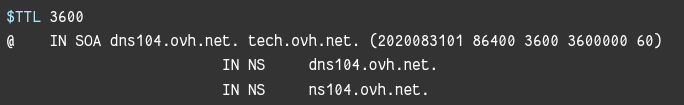
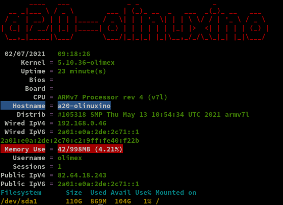
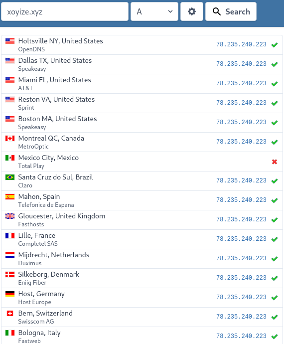
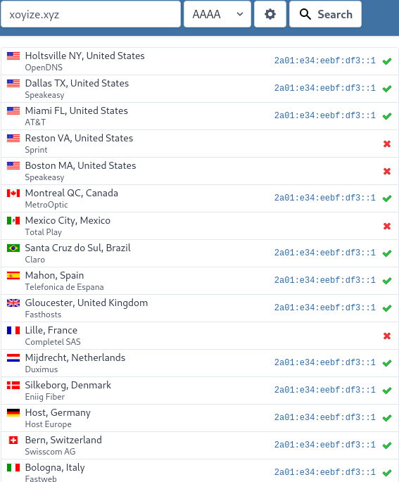
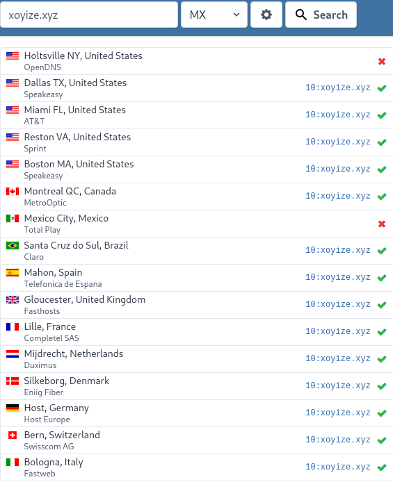
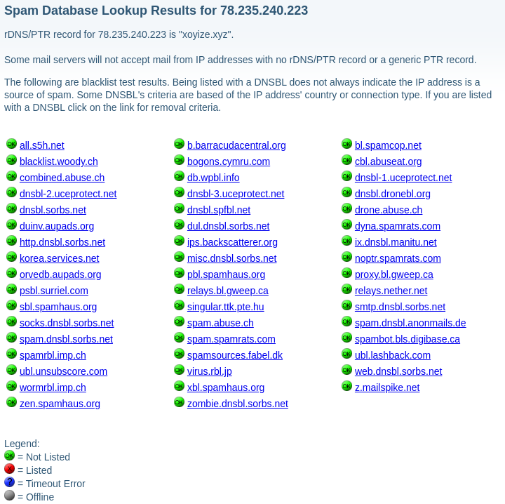
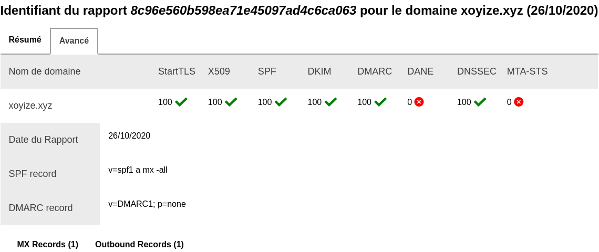
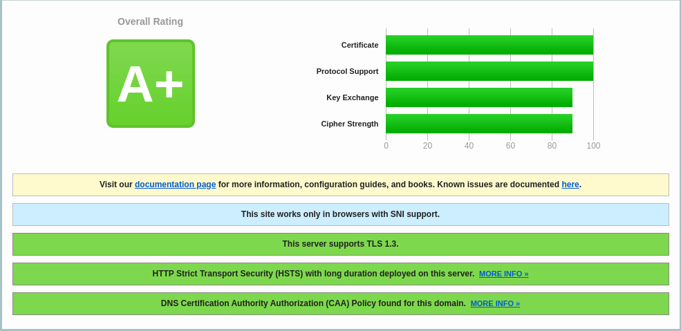
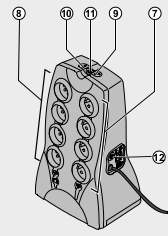

+++
title = 'Serveur Debian A20-OLinuXino-buster-minimal Yunohost xoyize.xyz'
date = 2020-11-16 00:00:00 +0100
categories = ['olimex', 'yunohost']
+++
# Olimex A20-olinuxino-Micro

[Documentation olimex](https://www.olimex.com/Products/olino/A20/A20-olinuxino-Micro-4GB/resources/A20-olinuxino-Micro.pdf)   
{:width="400"}

{:width="300"}  

## Installation A20-OLinuXino-buster-minimal

{:width="100"}

**Matériel**

* Carte olimex [A20-olinuxino-Micro ](https://www.olimex.com/Products/olino/A20/A20-olinuxino-Micro-4GB/)
* Bloc Alimentation 10V 1A
* Dongle Wifi/USB RT5370
* Carte micro SD 4GO
* SSD 128GO
* Batterie Li-ion 3.7v 5000mAh

**SDcard**

SDcard créer avec les paquets debian armhf  
[Index of /release/a20](http://images.olimex.com/release/a20/)  

1. Télécharger **A20-OLinuXino-buster-minimal-20201105-143953.img.7z** (image du 06/11/2020) puis se rendre dans le répertoire contenant les fichiers 
2. Décompresser le fichier 
2. Insérer le lecteur USB/SDcard, relever le périphérique par `dmesg` , ex /dev/sde
3. Ecriture image sur la SDcard :  
`sudo dd if=A20-OLinuXino-buster-minimal-20201105-143953.img of=/dev/sde bs=4M`  

**Connexion liaison série**

Utilisation module USB/Série **/dev/ttyUSB0** et lancer **minicom** en root  
Insertion carte SD et mise sous tension A20-olinuxino-Micro   
L'image "debian" est prête à l'emploi sur la carte SD  

La connexion "root/olimex"

```
Linux a20-olinuxino 5.8.18-olimex #140443 SMP Thu Nov 5 14:05:55 UTC 2020 armv7l

The programs included with the Debian GNU/Linux system are free software;
the exact distribution terms for each program are described in the
individual files in /usr/share/doc/*/copyright.

Debian GNU/Linux comes with ABSOLUTELY NO WARRANTY, to the extent
permitted by applicable law.
```

Relever l' adresse mac eth0 : `ip link eth0`   
Activer la **DMZ de la Box internet** sur IP 192.168.0.46  
Ajout dans les baux statique de la box : **A20-olinuxino-micro** avec l'adresse IP 192.168.0.46 avec l'adresse mac `02:c2:09:40:f2:2b`
{: .prompt-info }


### Préparer disque /dev/sda

    fdisk /dev/sda

Effacer les partitions existantes ,option "d"  
 Créer une nouvelle partition primaire en tapant « n » puis « p ». Laisser par défaut la taille maximale. Sauvegarder les modifications en tapant « w ».

formater la partition du SSD sous le format .ext4

    mkfs.ext4 /dev/sda1

### Transfert des données

Le disque est formaté,  on va copier les données de la carte SD sur le SSD

    mkdir /tmp/ssd
    mount /dev/sda1 /tmp/ssd
    rsync -av --exclude 'tmp/*' --exclude 'boot' --exclude 'proc/*' --exclude 'sys/*' --exclude 'mnt/*'--exclude 'run/*' / /tmp/ssd/

Patienter plusieurs minutes...
{: .prompt-info }

Après transfert

    ls /tmp/ssd/

```
bin  etc   lib         media  opt   root  sbin  sys  uboot.env  var
dev  home  lost+found  mnt    proc  run   srv   tmp  usr
```

Démpontage /tmp/ssd/

    umount /tmp/ssd/

### Modifier le boot

boot à rediriger sur le disque `/dev/sda1`   

1. Ajouter `root=/dev/sda1` en fin du fichier `/boot/uEnv.txt`  &rarr; `echo "root=/dev/sda1" >> /boot/uEnv.txt`
2. Remplacer `root=PARTUUID=${partuuid}` par `root=${root}` dans le fichier `/boot/boot.cmd` &rarr; `sed -i s/root=PARTUUID=\$\{partuuid\}/root=\$\{root\}/g /boot/boot.cmd`

Compilation **boot.cmd** en **boot.scr**  
*u-boot-tools installé par défaut sinon : `apt install u-boot-tools`*

    mkimage -C none -A arm -T script -d /boot/boot.cmd /boot/boot.scr

```
Image Name:   
Created:      Wed Nov 11 13:27:51 2020
Image Type:   ARM Linux Script (uncompressed)
Data Size:    2210 Bytes = 2.16 KiB = 0.00 MiB
Load Address: 00000000
Entry Point:  00000000
Contents:
   Image 0: 2202 Bytes = 2.15 KiB = 0.00 MiB
```

Redémarrer : `reboot`   
Se connecter et vérifier avec `df-h` que sda1 est bien la partition principale

```
Filesystem      Size  Used Avail Use% Mounted on
udev            448M     0  448M   0% /dev
tmpfs           100M  5.1M   95M   6% /run
/dev/sda1       117G  606M  111G   1% /
tmpfs           499M     0  499M   0% /dev/shm
tmpfs           5.0M     0  5.0M   0% /run/lock
tmpfs           499M     0  499M   0% /sys/fs/cgroup
tmpfs           100M     0  100M   0% /run/user/0
```

Mise à jour : `apt update`

Problème lors de l'utilisation de curl

curl https://curl.haxx.se/ca/cacert.pem curl: (60) SSL certificate problem: unable to get local issuer certificate More details here: https://curl.haxx.se/docs/sslcerts.html
{: .prompt-danger }

Correction issue du forum IBM [curl: (60) SSL certificate problem](https://www.ibm.com/mysupport/s/question/0D50z00005q4FheCAE/curl-60-ssl-certificate-problem-unable-to-get-local-issuer-certificate?language=fr)

```
This is the type of error you will get if your trusted CA list is out of date. Consult your operating system vendor and see if they have a solution like a CA updating utility. If you cannot find this information or if you really just want to do things the long manual way, do the following:
Find your new SSL

The commands below will output the SSL version that is found in your $PATH and report the version and the configuration directory.

openssl version 
   OpenSSL 1.1.1d  10 Sep 2019
openssl version -d 
   OPENSSLDIR: "/usr/lib/ssl"

Update the trusted certificate directoryDownload the certificate pem file

 https://curl.haxx.se/ca/cacert.pem 

Copy the file or the contents of the file to the certificate directory directory.

cd /usr/lib/ssl/certs 
cp /tmp/cacert.pem .

Update the certificates directory so OpenSSL can use them

c_rehash /usr/lib/ssl/certs

That's it now it should be working as expected. If you have two ssl installations and you're not sure which certificate directory is in use you might want to do this to both of them.
```

**Adressage ipv4/ipv6**

{:width="70"}   

NextHop Freebox permet d’attribuer une adresse IPV6  

Prefixe : 2a01:e0a:2de:2c71::/64  
Next Hop: fe80::c2:9ff:fe40:f22b  (fe80::7285:c2ff:fe53:cb80 carte ASRock QC5000M)  
Passerelle IPV6 Box : fe80::224:d4ff:fea6:aa20  

Modifier interface réseau debian pour l'adressage ip static sur IP V4 et V6

    nano /etc/network/interfaces.d/eth0

```bash
allow-hotplug eth0
iface eth0 inet dhcp

iface eth0 inet6 static
  address 2a01:e0a:2de:2c71::1
  netmask 64
```

Configurer la zone Europe/Paris

    timedatectl set-timezone Europe/Paris

Vérifier l'heure

    timedatectl status

```
               Local time: Wed 2020-11-11 18:36:43 CET
           Universal time: Wed 2020-11-11 17:36:43 UTC
                 RTC time: Wed 2020-11-11 17:36:44
                Time zone: Europe/Paris (CET, +0100)
System clock synchronized: yes
              NTP service: active
          RTC in local TZ: no
```

**sudo** est installé par défaut sinon : `apt install sudo`  

Dans la configuration ssh **/etc/ssh/sshd_config** , en fin de fichier on ajoute la directive  `PermitRootLogin yes`  

    echo "PermitRootLogin yes" >> /etc/ssh/sshd_config

Redémarrer : `reboot` , <u>se connecter via SSH en root</u>
{: .prompt-warning }


Vérifier les adresses IP : `ip a`

```bash
1: lo: <LOOPBACK,UP,LOWER_UP> mtu 65536 qdisc noqueue state UNKNOWN group default qlen 1000
    link/loopback 00:00:00:00:00:00 brd 00:00:00:00:00:00
    inet 127.0.0.1/8 scope host lo
       valid_lft forever preferred_lft forever
    inet6 ::1/128 scope host 
       valid_lft forever preferred_lft forever
2: dummy0: <BROADCAST,NOARP> mtu 1500 qdisc noop state DOWN group default qlen 1000
    link/ether 0e:75:b6:b0:86:dc brd ff:ff:ff:ff:ff:ff
3: eth0: <BROADCAST,MULTICAST,UP,LOWER_UP> mtu 1500 qdisc mq state UP group default qlen 1000
    link/ether 02:c2:09:40:f2:2b brd ff:ff:ff:ff:ff:ff
    inet 192.168.0.46/24 brd 192.168.0.255 scope global dynamic eth0
       valid_lft 43160sec preferred_lft 43160sec
    inet6 2a01:e0a:2de:2c71::1/64 scope global 
       valid_lft forever preferred_lft forever
    inet6 2a01:e34:eebf:df0:c2:9ff:fe40:f22b/64 scope global dynamic mngtmpaddr 
       valid_lft 86356sec preferred_lft 86356sec
    inet6 fe80::c2:9ff:fe40:f22b/64 scope link 
       valid_lft forever preferred_lft forever
```

Version linux et debian: `uname -a`  
Linux a20-olinuxino 5.8.18-olimex #140443 SMP Thu Nov 5 14:05:55 UTC 2020 armv7l GNU/Linux

Version debian : `cat /etc/debian_version`  
10.6

Afficher les erreurs, le journal des logs

    journalctl -p err

```
-- Logs begin at Wed 2020-11-11 15:05:43 CET, end at Wed 2020-11-11 15:07:02 CET. --
Nov 11 15:05:43 a20-olinuxino kernel: /cpus/cpu@0 missing clock-frequency property
Nov 11 15:05:43 a20-olinuxino kernel: /cpus/cpu@1 missing clock-frequency property
Nov 11 15:05:43 a20-olinuxino kernel: sun4i-usb-phy 1c13400.phy: Couldn't request ID GPIO
```

Les erreurs ne sont pas critiques (pas de solution)
{: .prompt-warning }

### Utilisateur olimex

Par défaut , dans l'image debian buster minimal, il y a un utilisateur nommé "olimex"  
Changer le mot de passe : `passwd olimex`  

## Yunohost 4.0

{:width="50"}   

### Installation

Une fois que vous avez accès à votre serveur (directement ou par SSH)  
vous pouvez installer YunoHost en exécutant cette commande en tant que root :

    apt update
    apt install curl
    curl https://install.yunohost.org | bash 

```bash
[...]
===============================================================================
You should now proceed with Yunohost post-installation. This is where you will
be asked for :
  - the main domain of your server ;
  - the administration password.

You can perform this step :
  - from the command line, by running 'yunohost tools postinstall' as root
  - or from your web browser, by accessing : 
    - https://192.168.0.46/ (local IP, if self-hosting at home)

If this is your first time with YunoHost, it is strongly recommended to take
time to read the administator documentation and in particular the sections
'Finalizing your setup' and 'Getting to know YunoHost'. It is available at
the following URL : https://yunohost.org/admindoc
===============================================================================
```

### Post-installation

    yunohost tools postinstall

```
Main domain: xoyize.xyz
You are now about to define a new administration password. The password should be at least 8 characters long—though it is good practice to use a longer password (i.e. a passphrase) and/or to use a variation of characters (uppercase, lowercase, digits and special characters).
New administration password: 
Confirm new administration password: 
Info: Installing YunoHost...

[...]
Warning: The ssh configuration has been manually modified, but you need to explicitly specify category 'ssh' with --force to actually apply the changes.
Success! YunoHost is now configured
Warning: The post-install completed! To finalize your setup, please consider:
    - adding a first user through the 'Users' section of the webadmin (or 'yunohost user create <username>' in command-line);
    - diagnose potential issues through the 'Diagnosis' section of the webadmin (or 'yunohost diagnosis run' in command-line);
    - reading the 'Finalizing your setup' and 'Getting to know Yunohost' parts in the admin documentation: https://yunohost.org/admindoc.
```

>Le mot de passe root remplacé par celui de l'admin yunohost


### DNS OVH

{:width="50"} {:width="50"}


Configuration de base yunohost

    yunohost domain dns-conf xoyize.xyz

```
; Basic ipv4/ipv6 records
@ 3600 IN A 78.235.240.223
@ 3600 IN AAAA 2a01:e0a:2de:2c71::1

; XMPP
_xmpp-client._tcp 3600 IN SRV 0 5 5222 xoyize.xyz.
_xmpp-server._tcp 3600 IN SRV 0 5 5269 xoyize.xyz.
muc 3600 IN CNAME @
pubsub 3600 IN CNAME @
vjud 3600 IN CNAME @
xmpp-upload 3600 IN CNAME @

; Mail
@ 3600 IN MX 10 xoyize.xyz.
@ 3600 IN TXT "v=spf1 a mx -all"
mail._domainkey 3600 IN TXT "v=DKIM1; h=sha256; k=rsa; p=MIGfMA0GCSqGSIb3DQEBAQUAA4GNADCBiQKBgQDTW80bz/xSlfwExhOVlTdSHjuhTCVfYW9/cHkVZEtKAWIOl/zPcvRJFGhMUy/HkJWqiDeoVTBJQxjqG5FJSIgqWU31r70vZkb0dKuat+ve8LVciahDenE7qTw5Qpwz7OLQWAzasrV8j1eG6DvUrM7eCZoSy++PZpiq4iUUlzeQuwIDAQAB"
_dmarc 3600 IN TXT "v=DMARC1; p=none"

; Extra
* 3600 IN A 78.235.240.223
* 3600 IN AAAA 2a01:e0a:2de:2c71::1
@ 3600 IN CAA 128 issue "letsencrypt.org"
```

Se connecter à l'espace client du site OVH : **Web cloud &rarr; Domaines &rarr; xoyize.xyz &rarr; Zone DNS**  
Cliquer sur **"Modifier en mode textuel"**, garder les 4 premières lignes :  
{:width="600"}  
puis effacer tout ce qu'il y a en-dessous, et le remplacer par la configuration donnée par votre serveur ( `yunohost domain dns-conf`)

### Certificats SSL

Installer un certificat Let's Encrypt en ligne de commande

    yunohost domain cert-install --no-checks

```
[...]
Success! Configuration updated for 'dnsmasq'
Warning: No diagnosis cache yet for category 'dnsrecords'
Warning: Subdomain 'xmpp-upload.xoyize.xyz' does not resolve to the same IP address as 'xoyize.xyz'. Some features will not be available until you fix this and regenerate the certificate.
[...]
Info: Certificate signed!
Success! Configuration updated for 'nginx'
Success! Let's Encrypt certificate now installed for the domain 'xoyize.xyz'
```

### Créer un utilisateur (yunohost)

Accès administration web <https://xoyize.xyz/yunohost/admin/#/login> avec message de sécurité (certificats SSL auto signés)   
En ligne de commande

    yunohost user create yak

```
First name: yak
Last name: xoyi
E-mail address: yak@xoyize.xyz
You are now about to define a new user password. The password should be at least 8 characters long—though it is good practice to use a longer password (i.e. a passphrase) and/or to a variation of characters (uppercase, lowercase, digits and special characters).
Password: 
Confirm password: 
Success! User created
fullname: yak xoyi
mail: yak@xoyize.xyz
username: yak
```

Déconnexion puis connexion en admin via ssh

### OpenSSH - clés

{:width="100"}

On va utiliser **admin** pour les connexions SSH
{: .prompt-info }

**connexion avec clé**  
<u>sur l'ordinateur de bureau</u>
Générer une paire de clé curve25519-sha256 (ECDH avec Curve25519 et SHA2) nommé **xoyize-ed25519** pour une liaison SSH avec le serveur KVM.  

    ssh-keygen -t ed25519 -o -a 100 -f ~/.ssh/xoyize-ed25519

Envoyer la clé publique sur le serveur KVM   

    scp ~/.ssh/xoyize-ed25519.pub admin@192.168.0.46:/home/admin/

<u>sur le serveur KVM</u>
On se connecte  

    ssh admin@192.168.0.46

Copier le contenu de la clé publique dans /home/$USER/.ssh/authorized_keys  

    cd ~

Sur le KVM ,créer un dossier .ssh  

```bash
mkdir -p .ssh
cat $HOME/xoyize-ed25519.pub >> $HOME/.ssh/authorized_keys
```

et donner les droits  

    chmod 600 $HOME/.ssh/authorized_keys

effacer le fichier de la clé  

    rm $HOME/xoyize-ed25519.pub

Modifier la configuration serveur SSH **/etc/ssh/sshd_config** 

Port = 55035               # changement numéro port , facultatif  
PermitRootLogin no  
PasswordAuthentication no  # Utilise la clé comme authentification
 
Relancer openSSH  

    sudo systemctl restart sshd

Modifier le parefeu, ouvrir le port 55035 et fermer le port 22

    sudo yunohost firewall allow TCP 55035
    sudo yunohost firewall disallow TCP 22


Accès depuis le poste distant avec la clé privée  

    ssh -p 55035 -i ~/.ssh/xoyize-ed25519 admin@192.168.0.46

### Outils, motd, ssh_rc_bash , journalctl

{:width="100"}

Installer utilitaires

    sudo apt install tmux figlet dnsutils net-tools tree -y

Motd

    sudo rm /etc/motd && sudo nano /etc/motd

```
       _  _                                     
  ___ | |(_) _ __   ___ __ __  __ _  _ _  _ __  
 / _ \| || || '  \ / -_)\ \ / / _` || '_|| '  \ 
 \___/|_||_||_|_|_|\___|/_\_\ \__,_||_|  |_|_|_|
 __ __ ___  _  _ (_) ___ ___    __ __ _  _  ___ 
 \ \ // _ \| || || ||_ // -_) _ \ \ /| || ||_ / 
 /_\_\\___/ \_, ||_|/__|\___|(_)/_\_\ \_, |/__| 
            |__/                      |__/      
```            
Script ssh_rc_bash

>ATTENTION!!! Les scripts sur connexion peuvent poser des problèmes pour des appels externes autres que ssh

    wget https://static.xoyaz.xyz/files/ssh_rc_bash
    chmod +x ssh_rc_bash # rendre le bash exécutable
    ./ssh_rc_bash        # exécution



**journalctl** : Ajout utilisateur courant au groupe systemd-journal et adm

    sudo gpasswd -a $USER systemd-journal
    sudo gpasswd -a $USER adm

Lignes non tronquées ,ajouter au fichier ~/.bashrc

echo "export SYSTEMD_LESS=FRXMK journalctl" >> $HOME/.bashrc

**Historique de la ligne de commande**  
Ajoutez la recherche d’historique de la ligne de commande au terminal.
Tapez un début de commande précédent, puis utilisez shift + up (flèche haut) pour rechercher l’historique filtré avec le début de la commande.

```
# Global, tout utilisateur
echo '"\e[1;2A": history-search-backward' | sudo tee -a /etc/inputrc
echo '"\e[1;2B": history-search-forward' | sudo tee -a /etc/inputrc
```

Prise en compte après déconnexion/reconnexion

## NFS

{:width="50"}  
*NFS (Network File System) est un protocole qui permet d'accéder à des fichiers via le réseau. Il est basé sur le protocole RPC (Remote Procedure Call). Les clients montent la partition de la machine distante comme si c'était un disque local.*

En mode su

### Serveur

**Installation serveur NFS**

    sudo -s
    apt install nfs-kernel-server

Vérification de l'installation

Exécuter rpcinfo pour confirmer que le serveur est lancé, et accepte les requêtes sur le port 2049 (UDP et TCP).  

    rpcinfo -p | grep nfs 

```
    100003    3   tcp   2049  nfs
    100003    4   tcp   2049  nfs
    100003    3   udp   2049  nfs
```

Vérifier que le système supporte effectivement NFS:  

    cat /proc/filesystems | grep nfs

```
nodev	nfs
```

Si la commande précédente ne renvoie rien, il se peut que le module NFS ne soit pas chargé, auquel cas, il faut le charger `modprobe nfs`   
Enfin, vérifions que portmap attend les instructions sur le port 111  

    rpcinfo -p | grep portmap

```
    100000    4   tcp    111  portmapper
    100000    3   tcp    111  portmapper
    100000    2   tcp    111  portmapper
    100000    4   udp    111  portmapper
    100000    3   udp    111  portmapper
    100000    2   udp    111  portmapper
```


**Sécurisation NFS**

{:width="40"} 

Le protocole RPC n'a pas la réputation d'être bien sécurisé, mais la version 4 de NFS entend corriger ce problème, elle est donc à privilégier. Il est déconseillé d'effectuer un partage NFS via internet, ou bien dans ce cas, opter pour un tunnel crypté.

* S'assurer que les partages sont réservés à certaines IP dans /etc/exports
* S'appuyer sur rpcbind (/etc/hosts.deny et /etc/hosts.allow) pour sécuriser l'accès au serveur NFS
* Configurer convenablement iptables

**hosts.deny , hosts.allow**  
Tout le monde est interdit, puis le LAN est autorisé:  

```bash
echo "rpcbind mountd nfsd statd lockd rquotad : ALL" >> /etc/hosts.deny
echo "rpcbind mountd nfsd statd lockd rquotad: 192.168.0." >> /etc/hosts.allow
```

**iptables (NFS)**  
Par défaut, les différents services NFS (lockd, statd, mountd, etc.) demandent des assignations de ports aléatoires à partir du portmapper (portmap/rpcbind), ce qui signifie que la plupart des administrateurs doivent ouvrir une gamme de ports dans leur base de règles de pare-feu pour que NFS fonctionne.  

Il va donc falloir fixer les ports de ces services afin de créer les règles iptables.  

```bash
echo 'STATDOPTS="--port 32765 --outgoing-port 32766"' >> /etc/default/nfs-common
echo 'RPCMOUNTDOPTS="-p 32767"' >> /etc/default/nfs-kernel-server
echo 'RPCRQUOTADOPTS="-p 32769"' >> /etc/default/quota
```

Relance sysctl  

	sysctl --system

```bash
* Applying /etc/sysctl.d/99-sysctl.conf ...
* Applying /etc/sysctl.d/protect-links.conf ...
fs.protected_hardlinks = 1
fs.protected_symlinks = 1
* Applying /etc/sysctl.conf ...
```

Relancer le service  

	systemctl restart nfs-kernel-server

**NFS - iptables**

Ajout des règles firewall en utilisant le "hook" yunohost `post_iptable_rules`


```bash
mkdir -p /etc/yunohost/hooks.d/post_iptable_rules
touch /etc/yunohost/hooks.d/post_iptable_rules/95-nfs-iptables
chmod +x /etc/yunohost/hooks.d/post_iptable_rules/95-nfs-iptables
```

Bash pour ajout des régles iptables

    nano /etc/yunohost/hooks.d/post_iptable_rules/95-nfs-iptables

Voici les règles à fixer dans le parefeu

```bash
#!/bin/bash
iptables -A INPUT -s 192.168.0.0/24 -p tcp -m multiport --ports 111,2049,32764:32769 -j ACCEPT -m comment --comment "NFS Server"
iptables -A INPUT -s 192.168.0.0/24 -p udp -m multiport --ports 111,2049,32764:32769 -j ACCEPT -m comment --comment "NFS Server"
exit 0
```

Vérifier la création du hook

    yunohost hook list post_iptable_rules

```
hooks: nfs-iptables
```

Droits

    chmod +x /etc/yunohost/hooks.d/post_iptable_rules/95-nfs-iptables

Exécution manuelle du hook et vérification 

    /etc/yunohost/hooks.d/post_iptable_rules/95-nfs-iptables
    iptables -L

```bash
[...]
ACCEPT     tcp  --  192.168.0.0/24       anywhere             multiport ports sunrpc,nfs,32764:32769 /* NFS Server */
ACCEPT     udp  --  192.168.0.0/24       anywhere             multiport ports sunrpc,nfs,32764:32769 /* NFS Server */
[...]
```

### Autofs

En mode su

Installer **autofs** pour un accès aux dossiers de la machine *yannick-pc*  

    apt install autofs

Déclarer *yannick-pc* dans `/etc/hosts` , en ajoutant au fichier

    192.168.0.28	yannick-pc

Les partages disponibles 

    showmount -e yannick-pc

```
Export list for yannick-pc:
/srv/hdd2g/data/devel        192.168.0.0/24
/srv/hdd2g/data/borg-backups 192.168.0.0/24
/home/yannick/Partage        192.168.0.0/24
```

Déclaration des répertoires parents de montages et de leur types

    nano /etc/auto.master

Oter le commentaire de la ligne suivante

    /net    -hosts

Redémarrer le service

    systemctl restart autofs

---

Créer un groupe *utilisateurs* avec id 985 (équivalent au groupe *users* sous archlinux)

    sudo groupadd --gid 985 utilisateurs

Visualiser, par exemple, le dossier partage de *yannick-pc*

    ls /net/yannick-pc/home/yannick/Partage

---

## SetGID partage

**Configurer le partage NFS avec SetGID**

Créer un dossier qui sera partagé sur le réseau local : 

    sudo mkdir -p /xoyipart

Nous devons configurer SetGID dans ce répertoire, comme indiqué ci-dessous.

    sudo chmod 2775 /xoyipart

Cela a également défini les autorisations 775 sur le répertoire, de sorte que l'utilisateur racine et le groupe défini disposent d'autorisations complètes. Le 2 permet setgid.

Ensuite, nous créons un groupe appelé 'local' et modifions le répertoire /xoyipart afin que le propriétaire du groupe soit ce groupe 'local'.  
Nous spécifions également manuellement le GID qui sera utilisé pour le groupe en tant que 9999; il doit s'agir d'un <u>numéro libre sur votre client et votre serveur</u>.

Exécuter `groupadd` sur le client et sur le serveur, et ajouter un (ou plusieurs) utilisateur à ce groupe.

```bash
sudo groupadd -g 9999 local      # sur client et serveur
# ajout utilisateur au groupe
sudo usermod -a -G local $USER   # sur client et serveur
sudo chgrp local /xoyipart           # serveur uniquement
```


**Droits ACL**  
Donner les droits ACL en lecture,écriture et exécution à l'utilisateur admin et au groupe local

    setfacl -Rm u:admin:rwx,g:local:rwx /xoyipart/

Désormais, tous les fichiers ou répertoires créés dans `/xoyipart` se verront automatiquement attribuer le propriétaire du groupe *'local*, ce qui permettra essentiellement la collaboration de groupe, car tout utilisateur appartenant au groupe *local* pourra désormais accéder aux fichiers créés par d'autres utilisateurs du même groupe dans le répertoire `/xoyipart`
{: .prompt-info }

>NE PAS OUBLIER DE SE DECONNECTER/CONNECTER

Nous pouvons confirmer que setgid est en place, comme indiqué ci-dessous, où le bit d'exécution pour les autorisations de groupe est une minuscule. Cela passera à une majuscule S si le groupe ne dispose pas de l'autorisation d'exécution et que seul setgid est en place.

    ls -la /xoyipart/  # signe + pour les acl

```
[...]
drwxrwsr-x+  2 root   local 4096 Nov 12 10:09 .
[...]
```

**Partager /xoyipart/**


indiquer au serveur les répertoires qui seront partagés, les machines qui y auront accès et les conditions de ce partage.  

	sudo nano /etc/exports

Ajouter en fin de fichier **/etc/exports**  

```
/xoyipart                                   192.168.0.0/24(rw,sync,no_subtree_check,no_root_squash)
```

Exporter

    sudo exportfs -ar

Pour vérifier que l'export a bien eu lieu, taper sur le serveur NFS la commande :

    sudo showmount -e

```
Export list for xoyize.xyz:
/xoyipart 192.168.0.0/24
```

## Batterie

La carte dispose d'une batterie LiIon en cas de coupure de l'alimentation secteur  
Pour voir les détails

    find /sys/class/power_supply/axp20x-battery/ -type f | xargs -tn1 cat

Pour résumer

    cat /sys/class/power_supply/axp20x-battery/uevent 

Batterie en charge 

```bash
POWER_SUPPLY_NAME=axp20x-battery
POWER_SUPPLY_PRESENT=1
POWER_SUPPLY_ONLINE=1
POWER_SUPPLY_STATUS=Charging
POWER_SUPPLY_VOLTAGE_NOW=4202000
POWER_SUPPLY_CURRENT_NOW=209000
POWER_SUPPLY_CONSTANT_CHARGE_CURRENT=1200000
POWER_SUPPLY_CONSTANT_CHARGE_CURRENT_MAX=1200000
POWER_SUPPLY_HEALTH=Good
POWER_SUPPLY_VOLTAGE_MAX_DESIGN=4200000
POWER_SUPPLY_VOLTAGE_MIN_DESIGN=2900000
POWER_SUPPLY_CAPACITY=99
```

Batterie chargée

```bash
POWER_SUPPLY_NAME=axp20x-battery
POWER_SUPPLY_PRESENT=1
POWER_SUPPLY_ONLINE=1
POWER_SUPPLY_STATUS=Not charging
POWER_SUPPLY_VOLTAGE_NOW=4141000
POWER_SUPPLY_CURRENT_NOW=0
POWER_SUPPLY_CONSTANT_CHARGE_CURRENT=1200000
POWER_SUPPLY_CONSTANT_CHARGE_CURRENT_MAX=1200000
POWER_SUPPLY_HEALTH=Good
POWER_SUPPLY_VOLTAGE_MAX_DESIGN=4200000
POWER_SUPPLY_VOLTAGE_MIN_DESIGN=2900000
POWER_SUPPLY_CAPACITY=98
```

En cas de coupure  
Batterie en décharge 


    cat /sys/class/power_supply/axp20x-battery/uevent 

```bash
POWER_SUPPLY_NAME=axp20x-battery
POWER_SUPPLY_PRESENT=1
POWER_SUPPLY_ONLINE=1
POWER_SUPPLY_STATUS=Discharging
POWER_SUPPLY_VOLTAGE_NOW=3862000
POWER_SUPPLY_CURRENT_NOW=523000
POWER_SUPPLY_CONSTANT_CHARGE_CURRENT=1200000
POWER_SUPPLY_CONSTANT_CHARGE_CURRENT_MAX=1200000
POWER_SUPPLY_HEALTH=Good
POWER_SUPPLY_VOLTAGE_MAX_DESIGN=4200000
POWER_SUPPLY_VOLTAGE_MIN_DESIGN=2900000
POWER_SUPPLY_CAPACITY=82
```

## Tests sur le serveur

#### Vérifications DNS - wireguard

Les commandes suivantes ne fonctionneront que si le paquet "dnsutils" est installé sur votre système Debian!

On teste en utilisant les serveurs DNS locaux, les 3 commandes suivantes ont le même résultat

	dig @127.0.0.1 afnic.fr +short +dnssec
    dig @10.55.22.1 afnic.fr +short +dnssec 
    dig @fd87:9aa8:e67c:5a80::1 afnic.fr +short +dnssec

```
192.134.5.37
A 13 2 600 20200608204052 20200509084949 30435 afnic.fr. eVchVAseJD5n8W7U8okAz546Ix33hOCqRF7wLrhUV+sOTkwyXo7EwAut k/rN8wsPVpTnTpFyQLKdBTuOpx2UxA==
```

#### Propagation DNS

<https://www.whatsmydns.net>  
{:width="300"} {:width="300"} {:width="300"}  

#### Messagerie

Vérification messagerie <https://mecsa.jrc.ec.europa.eu/fr/>  
{:width="600"}

#### DNS blacklisting

<https://www.dnsbl.info/dnsbl-database-check.php>  
{:width="600"}

#### Vulnérabilités

<https://www.ssllabs.com/ssltest/analyze.html>  

SSL Report: xoyize.xyz (78.235.240.223)  
{:width="500"}

SSL Report: xoyize.xyz (2a01:e0a:2de:2c71::1)  
{:width="500"}


Vérifier les ports ouverts depuis un poste linux

    nmap xoyize.xyz

```
Starting Nmap 7.70 ( https://nmap.org ) at 2020-10-26 14:15 CET
Nmap scan report for xoyize.xyz (78.235.240.223)
Host is up (0.099s latency).
Other addresses for xoyize.xyz (not scanned): 2a01:e0a:2de:2c71::1
Not shown: 991 filtered ports
PORT     STATE  SERVICE
25/tcp   open   smtp
53/tcp   open   domain
80/tcp   open   http
443/tcp  open   https
587/tcp  open   submission
993/tcp  open   imaps
5222/tcp open   xmpp-client
5269/tcp open   xmpp-server
9091/tcp closed xmltec-xmlmail
```

## Gestion onduleur USB

### Matériel

<div class="item">
  <div class="item__image">
    <br>
    
  </div>
  <div class="item__content">
    <div class="item__header">
      <h4>Eaton Protection Station 800 USB</h4>
    </div>
    <div class="item__description">
		<table>
		<thead>
		<tr>
		<th>No</th>
		<th>Eaton Protection Station - 650/800</th>
		</tr>
		</thead>
		<tbody>
		<tr>
		<td>7</td>
		<td>4 prises filtrées.</td>
		</tr>
		<tr>
		<td>8</td>
		<td>4 prises secourues par batterie.</td>
		</tr>
		<tr>
		<td>9</td>
		<td>Voyant allumé, protection anti-surtensions active sur les 8 prises.</td>
		</tr>
		<tr>
		<td>10</td>
		<td>Voyant allumé, défaut de l'Alimentation Sans Interruption.</td>
		</tr>
		<tr>
		<td>11</td>
		<td>Bouton de mise en service ou d'arrêt des prises secourues.</td>
		</tr>
		<tr>
		<td>12</td>
		<td>Disjoncteur de protection.</td>
		</tr>
		</tbody>
		</table>
    </div>
  </div>
</div>

[Supervision d'un onduleur](https://blog.garamotte.net/posts/2020/11/01/fr-monitoring-an-ups.html)

Passer en mode su

	sudo -s

Connecter l'onduleur liaison USB sur un port disponible du serveur , vérifier par `dmesg`   

    dmesg | grep -i eaton

```
[2746558.690022] usb 4-1: Manufacturer: EATON
[2746560.889094] hid-generic 0003:0463:FFFF.0002: hiddev0,hidraw0: USB HID v10.10 Device [EATON Protection Station] on usb-1c1c400.usb-1/input0
```

    lsusb | grep -i ups

```
Bus 004 Device 003: ID 0463:ffff MGE UPS Systems UPS
```

Déterminer le numéro de série

     udevadm info --attribute-walk --name=/dev/usb/hiddev0 | egrep 'manufacturer|product|serial'

```
    ATTRS{serial}=="AN2E49008"
    ATTRS{manufacturer}=="EATON"
    ATTRS{product}=="Protection Station"
    ATTRS{serial}=="1c1c400.usb"
    ATTRS{product}=="Generic Platform OHCI controller"
    ATTRS{manufacturer}=="Linux 4.19.0-11-armmp-lpae ohci_hcd"
```

### APC UPS (apcupsd)

Installation

    sudo apt install apcupsd # debian
    sudo systemctl stop apcupsd.service # arrêt pour paramétrer

### Serveur

Configurer APC - apcupsd.conf

Le fichier de configuration principal du démon APC UPS se trouve dans `/etc/apcupsd/apcupsd.conf` 
Les lignes de texte sont modifiées pour prendre en charge un câble de style USB:

    sudo nano /etc/apcupsd/apcupsd.conf

```
## apcupsd.conf v1.1 ##
# 
UPSCABLE usb
UPSTYPE usb
DEVICE

[...]

# If during a power failure, the remaining battery percentage
# (as reported by the UPS) is below or equal to BATTERYLEVEL, 
# apcupsd will initiate a system shutdown.
BATTERYLEVEL 15

# If during a power failure, the remaining runtime in minutes 
# (as calculated internally by the UPS) is below or equal to MINUTES,
# apcupsd, will initiate a system shutdown.
MINUTES 5

[...]

# NETSERVER [ on | off ] on enables, off disables the network
#  information server. If netstatus is on, a network information
#  server process will be started for serving the STATUS and
#  EVENT data over the network (used by CGI programs).
NETSERVER on

# NISIP <dotted notation ip address>
#  IP address on which NIS server will listen for incoming connections.
#  This is useful if your server is multi-homed (has more than one
#  network interface and IP address). Default value is 0.0.0.0 which
#  means any incoming request will be serviced. Alternatively, you can
#  configure this setting to any specific IP address of your server and 
#  NIS will listen for connections only on that interface. Use the
#  loopback address (127.0.0.1) to accept connections only from the
#  local machine.
NISIP 192.168.0.46
```

Le fichier `/etc/apcupsd/hosts.conf` contient les ordinateurs protégés par cet onduleur

```
# Network UPS Tools - hosts.conf
#
# This file does double duty - it lists the systems that multimon will
# monitor, and also specifies the systems that upsstats is allowed to 
# watch.  It keeps people from feeding random addresses to upsstats,
# among other things.  upsimage also uses this file to know who it 
# may speak to. upsfstats too.
#
# Usage: list systems running upsd that you want to monitor
#
# MONITOR <address> "<host description>"
#
MONITOR 127.0.0.1 "Local Host"
MONITOR 192.168.0.46 "Serveur xoyize.xyz"
MONITOR 10.0.3.19    "Container LXC Debian"
MONITOR 192.168.0.28 "Poste archlinux"
```

Le fichier `/etc/default/apcupsd`

```
# Defaults for apcupsd initscript (unused with systemd as init).
# Set to "yes" to enable startup of apcupsd.
ISCONFIGURED=yes
```

**debian** , démarrez apcupsd.service

    sudo systemctl start apcupsd.service

Ensuite, attendez environ une minute et vérifiez que le démon fonctionne et surveille correctement la batterie:

    sudo apcaccess status

```
APC      : 001,028,0683
DATE     : 2020-11-10 16:07:39 +0100  
HOSTNAME : xoyize.xyz
VERSION  : 3.14.14 (31 May 2016) debian
UPSNAME  : xoyize.xyz
CABLE    : USB Cable
DRIVER   : USB UPS Driver
UPSMODE  : Stand Alone
STARTTIME: 2020-11-02 14:18:32 +0100  
MODEL    : Protection Station
STATUS   : ONLINE 
LOADPCT  : 22.0 Percent
BCHARGE  : 100.0 Percent
TIMELEFT : 12.2 Minutes
MBATTCHG : 15 Percent
MINTIMEL : 5 Minutes
MAXTIME  : 0 Seconds
OUTPUTV  : 230.0 Volts
DWAKE    : -1 Seconds
LOTRANS  : 184.0 Volts
HITRANS  : 264.0 Volts
ALARMDEL : 30 Seconds
NUMXFERS : 0
TONBATT  : 0 Seconds
CUMONBATT: 0 Seconds
XOFFBATT : N/A
STATFLAG : 0x05000008
SERIALNO : AN2E49008
END APC  : 2020-11-02 14:19:00 +0100  
```

Pour tester l'onduleur

1.    Modifiez TIMEOUT de 0 à 1 dans le fichier `/etc/apcupsd/apcupsd.conf`
2.    Coupez l'alimentation murale de l'onduleur.
3.    Observez que votre box Linux s'éteint rapidement.
4.    Rebranchez l'onduleur
5.    Allumez votre box Linux.
6.    Remplacez TIMEOUT de 1 à 0 dans le fichier /etc/apcupsd/apcupsd.conf


### Règles iptables

Pour le client puisse communiquer , il faut ouvrir le port 3351 uniquement pour le réseau local

    sudo nano /etc/yunohost/hooks.d/post_iptable_rules/96-apcups-iptables

Voici les règles à fixer dans le parefeu

```bash
#!/bin/bash
iptables -A INPUT -s 192.168.0.0/24 -p tcp --dport 3551 -j ACCEPT -m comment --comment "APCUPS"
exit 0
```

Droits en exécution

    sudo chmod +x /etc/yunohost/hooks.d/post_iptable_rules/96-apcups-iptables

Vérifier la création du hook

    sudo yunohost hook list post_iptable_rules

```
hooks: 
  - nfs-iptables
  - apcups-iptables
```

Exécution manuelle du hook et vérification 

    sudo -s
    /etc/yunohost/hooks.d/post_iptable_rules/96-apcups-iptables
    iptables -L

```bash
[...]
ACCEPT     tcp  --  192.168.0.0/24       anywhere             tcp dpt:3551 /* APCUPS */
[...]
```

### Poste Client

Accès onduleur (connecté sur le **serveur**) depuis un poste **client** sur le réseau  
Installer apcupsd sur le client

    sudo apt install apcupsd
    systemctl stop apcupsd.service # pour configurer

Edition fichier `/etc/apcupsd/apcupsd.conf`

```
UPSCABLE usb
UPSTYPE net
# The default port for apcupsd is 3551
DEVICE 192.168.1.46:3551

[...]

# POLLTIME <int>
#   Interval (in seconds) at which apcupsd polls the UPS for status. This
#   setting applies both to directly-attached UPSes (UPSTYPE apcsmart, usb, 
#   dumb) and networked UPSes (UPSTYPE net, snmp). Lowering this setting
#   will improve apcupsd's responsiveness to certain events at the cost of
#   higher CPU utilization. The default of 60 is appropriate for most
#   situations.
POLLTIME 10

[...]

# If during a power failure, the remaining battery percentage
# (as reported by the UPS) is below or equal to BATTERYLEVEL, 
# apcupsd will initiate a system shutdown.
BATTERYLEVEL 15 

[...]

# If during a power failure, the remaining runtime in minutes 
# (as calculated internally by the UPS) is below or equal to MINUTES,
# apcupsd, will initiate a system shutdown.
MINUTES 5

[...]

# NETSERVER [ on | off ] on enables, off disables the network
NETSERVER on

# NISIP <dotted notation ip address>
NISIP 0.0.0.0  
```

Le fichier `/etc/default/apcupsd`

```
# Defaults for apcupsd initscript (unused with systemd as init).
# Set to "yes" to enable startup of apcupsd.
ISCONFIGURED=yes
```

Démarrez apcupsd.service

    systemctl start apcupsd.service

Status depuis le client "debian-10"

    apcaccess

```
APC      : 001,018,0452
DATE     : 2020-11-02 14:33:58 +0100  
HOSTNAME : debian-10
VERSION  : 3.14.14 (31 May 2016) debian
UPSNAME  : debian-10
CABLE    : Ethernet Link
DRIVER   : NETWORK UPS Driver
UPSMODE  : Net Slave
STARTTIME: 2020-11-02 14:32:07 +0100  
STATUS   : COMMLOST 
MBATTCHG : 15 Percent
MINTIMEL : 5 Minutes
MAXTIME  : 0 Seconds
NUMXFERS : 0
TONBATT  : 0 Seconds
CUMONBATT: 0 Seconds
XOFFBATT : N/A
STATFLAG : 0x05000100
END APC  : 2020-11-02 14:33:58 +0100  
```

### Redirection (NON INSTALLE)

Ajoutez un lien sur votre panneau d'utilisateur redirigeant vers une autre page ou application.

Il peut s'agir d'une redirection invisible, d'un lien externe, d'une autre application sur votre réseau local, d'un reverse proxy vers une application ou un conteneur Docker...  
Certaines applications peuvent même être protégées derrière votre panneau (ce qui signifie que vous devrez vous connecter pour y accéder).

>Cette application ajoute seulement un fichier de configuration Nginx avec une règle de redirection ou de proxy_pass, et une tuile YunoHost. Rien de plus.

Installation

    yunohost app install https://github.com/YunoHost-Apps/redirect_ynh

```
Available domains:
- xoyize.xyz
- dev.xoyize.xyz
- test.xoyize.xyz
- searx.xoyize.xyz
Choose a domain for your redirect (default: xoyize.xyz): 
Choose a path for your redirect (default: /redirect): /prox
Redirect destination path (default: http://127.0.0.1): 
Redirect type [public_302 | public_301 | public_proxy | private_proxy] (default: public_302): 
Info: Installing redirect...
Warning: /!\ Packagers! This app is still using the skipped/protected/unprotected_uris/regex settings which are now obsolete and deprecated... Instead, you should use the new helpers 'ynh_permission_{create,urls,update,delete}' and the 'visitors' group to initialize the public/private access. Check out the documentation at the bottom of yunohost.org/groups_and_permissions to learn how to use the new permission mechanism.
Success! Installation completed
```

>**IMPORTANT :** le fichier redirect.conf peut avoir besoin d'être mis à jour en fonction de votre situation !  
**ATTENTION :** de nombreuses applications ne supportent pas d'être redirigées vers un chemin différent à cause des liens relatifs ! Cela signifie que certaines applications hébergées par exemple sur http://127.0.0.1:5050/app/ DOIVENT être redirigées vers http://domain.tld/app/ et NON http://domain.tld/someotherapp/  
**Exemple concret :** le conteneur Odoo Docker fonctionne sur http://127.0.0.1:8069/. Vous ne pourrez pas le rediriger vers http://domain.tld/odoo/ ! Vous devez le rediriger vers la racine, donc par exemple http://odoo.domain.tld/

## Rsync

Script de récupération des sauvegardes effectuées sur le serveur backup xoyaz.xyz

    nano /home/admin/srvxoyaz.sh

```bash
#!/bin/sh -x
echo "-----------------------------------------------
Récupération des sauvegardes du serveur xoyaz.xyz" 
rsync -avz --delete --rsync-path="sudo rsync" -e "ssh -p 55036 -i /home/admin/.ssh/OVZ-STORAGE-128 -o StrictHostKeyChecking=no -o UserKnownHostsFile=/dev/null" \
 usernl@xoyaz.xyz:/srv/data/borg-backups/* /home/admin/serveur_backup/  >/dev/null 2>&1 ; \
 if [ $? -eq 0 ]; then \
 echo "Récupération des sauvegardes du serveur Backup xoyaz.xyz -> OK" | systemd-cat -t rsync_xoyaz -p info ; \
 else \
 echo "Récupération des sauvegardes du serveur Backup xoyaz.xyz -> ERREUR" | systemd-cat -t rsync_xoyaz -p emerg ; \
 fi
```

Les sauvegardes sont stockées sous `/home/admin/serveur_backup/`
Droits en exécution

    chmod +x srvxoyaz.sh

Lancement de la procédure à 3h10

    sudo crontab -e

```bash
# Récupération des sauvegardes du serveur Backup xoyaz.xyz
10 03 * * * /home/admin/srvxoyaz.sh > /dev/null
```
