+++
title = 'PC1 Ordinateur Bureau ArchLinux xfce'
date = 2020-11-17 00:00:00 +0100
categories = ['archlinux']
+++
# Ordinateur PC1 

## Matériel

### Carte mère ASUS H110M-A/M.2

{:width="150"}

[Carte mère ASUS H110M-A/M.2](/files/F11483_H110M-A_M_2_UM_WEB.pdf)

**CPU**

* Intel® Socket 1151 for 7th/6th Generation Core™ i7/Core™ i5/Core™ i3/Pentium®/Celeron® Processors
* Supports Intel® 14 nm CPU
* Supports Intel® Turbo Boost Technology 2.0
    * The Intel® Turbo Boost Technology 2.0 support depends on the CPU types.
    * Refer to [www.asus.com](http://www.asus.com/) for CPU support list
* Chipset
* Intel® H110

**Réseau**

* Contrôleur Gigabit Intel 1219v compatible avec LANGuard

**Memory**

* 2 x DIMM, Max. 32GB, DDR4 2400/2133 MHz Non-ECC, Un-buffered Memory
* Supports Intel® Extreme Memory Profile (XMP)
    * Hyper DIMM support is subject to the physical characteristics of individual CPUs. 
    * Refer to www.asus.com for the Memory QVL (Qualified Vendors Lists).
    * Due to Intel® chipset limitation, DDR4 2400MHz memory frequency is only supported by 7th Generation Intel® processors. Higher memory modules will run at the maximum transfer rate of DDR4 2400MHz.
    * Due to Intel® chipset limitation, DDR4 2133MHz and higher memory modules on 6th Generation Intel® processors will run at the maximum transfer rate of DDR4 2133MHz.

**Graphic**

* Integrated Graphics Processor- Intel® HD Graphics support
* Multi-VGA output support : HDMI/DVI-D/RGB ports
    - Supports HDMI  with max. resolution 4096 x 2160 @ 24 Hz / 2560 x 1600 @ 60 Hz
    - Supports DVI-D with max. resolution 1920 x 1200 @ 60 Hz
    - Supports RGB   with max. resolution 1920 x 1200 @ 60 Hz
* Maximum shared memory of 1024 MB
* Supports up to 2 displays simultaneously

**Expansion Slots**

* 1 x PCIe 3.0/2.0 x16 (x16 mode)
* 2 x PCIe 2.0 x1

**Storage**

* Intel® H110 chipset :
* 1 x M.2 Socket 3, with M key, type 2242/2260/2280 storage devices support (both SATA & PCIE mode)*2
* 4 x SATA 6Gb/s port(s),
* Intel® Rapid Storage Technology supports*1
* LAN
* Intel® I219V

**Audio**

* Realtek® ALC887 8-Channel High Definition Audio CODEC *2
    - Supports : Jack-detection, Front Panel Jack-retasking

    **Audio Feature :**

    - LED-illuminated design - Brighten up your build with the gorgeous illuminated audio trace path.
    - Audio Shielding: Ensures precision analog/digital separation and greatly reduced multi-lateral interference
    - Dedicated audio PCB layers: Separate layers for left and right channels to guard the quality of the sensitive audio signals
    - Premium Japanese audio capacitors: Provide warm, natural and immersive sound with exceptional clarity and fidelity

**USB Ports**

* Intel® H110 chipset :
* 4 x USB 3.1 Gen 1 port(s) (2 at back panel, blue, 2 at mid-board)
* Intel® H110 chipset :
* 6 x USB 2.0/1.1 port(s) (4 at back panel, black, 2 at mid-board)

**Special Features**

* ASUS 5X Protection II :
    - ASUS LANGuard - 2.5X higher surge tolerance
    - ASUS DIGI+ VRM - 5 Phase digital power design
    - ASUS DRAM Overcurrent Protection - Prevents damage from short circuits
    - ASUS Stainless-Steel Back I/O - 3X corrosion-resistance for greater durability
    - ASUS ESD Guards - Electrostatic discharge protection
* ASUS EPU :
    - EPU
* ASUS Exclusive Features :
    - AI Suite 3
    - Ai Charger
    - Low EMI Solution
    - USB 3.0 Boost
    - Mobo Connect
    - PC Cleaner
* ASUS Quiet Thermal Solution :
    - Stylish Fanless Design Heat-sink solution
    - ASUS Fan Xpert
* ASUS EZ DIY :
    - ASUS CrashFree BIOS 3
    - ASUS EZ Flash 3
    - ASUS UEFI BIOS EZ Mode
    - Push Notice
* ASUS Q-Design :
    - ASUS Q-Slot
    - ASUS Q-DIMM

**Back I/O Ports**

* 1 x PS/2 keyboard (purple)
* 1 x PS/2 mouse (green)
* 1 x DVI-D
* 1 x D-Sub
* 1 x HDMI
* 1 x LAN (RJ45) port(s)
* 2 x USB 3.1 Gen 1 (blue)
* 4 x USB 2.0
* 3 x Audio jack(s)

**Internal I/O Ports**

* 1 x USB 3.1 Gen 1 connector(s) support(s) additional 2 USB 3.1 Gen 1 port(s)
* 1 x USB 2.0 connector(s) support(s) additional 2 USB 2.0 port(s)
* 1 x M.2 Socket 3
* 1 x COM port(s) connector(s)
* 4 x SATA 6Gb/s connector(s)
* 1 x CPU Fan connector(s) (1 x 4 -pin)
* 1 x Chassis Fan connector(s) (1 x 4 -pin)
* 1 x S/PDIF out header(s)
* 1 x 24-pin EATX Power connector(s)
* 1 x 4-pin ATX 12V Power connector(s)
* 1 x Front panel audio connector(s) (AAFP)
* 1 x Clear CMOS jumper(s)
* 1 x System panel connector

**Accessories**

* User's manual
* I/O Shield
* 2 x SATA 3Gb/s cable(s)
* 1 x M.2 Screw Package
* 1 x Supporting DVD

**BIOS**

* 128 Mb Flash ROM, UEFI AMI BIOS, PnP, DMI 3.0, WfM2.0, SM BIOS 3.0, ACPI 5.0, Multi-language BIOS, ASUS EZ Flash 3, ASUS CrashFree BIOS 3, My Favorites, Quick Note, Last Modified Log, F12 PrintScreen function, and ASUS DRAM SPD (Serial Presence Detect) memory information

**Manageability**

* WfM 2.0, DMI 3.0, WOL by PME, PXE

**Form Factor**

* mATX Form Factor
* 8.9 inch x 7.3 inch ( 22.6 cm x 18.5 cm )

### Processeur, Mémoire et Alimentation

**Intel Core i3-6100 (3.7 GHz)**   
Processeur Dual Core Socket 1151 Cache L3 3 Mo Intel HD Graphics 530 0.014 micron (version boîte - garantie Intel 3 ans)   
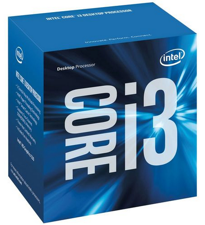{:width="10%"}  

**CPU UPGRADE** [ASUS H110M-A/M.2 processor support and specifications](http://www.cpu-upgrade.com/mb-ASUS/H110M-A_M.2/) (*list des CPU compatibles avec la carte mère*) 

**Processeur [Intel Core i5-7500 CPU](http://www.cpu-upgrade.com/CPUs/Intel/Core_i5/i5-7500/) mis en place le 20/02/2020**

```
General specs 
        Microarchitecture:	Kaby Lake
        Core Name:	Kaby Lake-S
        Manufacturing Process:	0.014 micron
        Socket Type:	Socket 1151
        The Number of Cores:	4
        The Number of Threads:	4
        Multiprocessing:	Not supported
        Frequency:	3.4 GHz
        Maximum Turbo Frequency:	3.8 GHz
        L1 Cache:	128 KB (code)
        128 KB (data)
        L2 Cache:	1 MB
        L3 Cache:	6 MB
        Thermal Design Power:	65 Watt
        Integrated GPU:	Intel HD 630
        Supported memory:	DDR3L-1333 / DDR3L-1600 / DDR4-2133 / DDR4-2400

Instructions and Technologies
        Execute Disable Bit?	Yes
        64-bit Support?	Yes
        Hyper-Threading technology?	No
        Turbo Boost?	Yes
        Virtualization?	Yes
        Enhanced SpeedStep?	Yes
        Instruction Set Extensions:	AES
            AVX
            AVX2
            F16C
            FMA3
            MMX
            SSE
            SSE2
            SSE3
            SSE4
            Supplemental SSE3
```


**Cooler Master Hyper TX3i**   
Ventilateur pour processeur (pour socket Intel 775 / 1150 / 1151 / 1155 / 1156)   
{:width="10%"}

**Kingston ValueRAM 16 Go DDR4 2133 MHz CL15 DR X8**   
RAM DDR4 PC4-17000 - KVR21N15D8/16 (garantie 10 ans par Kingston)   
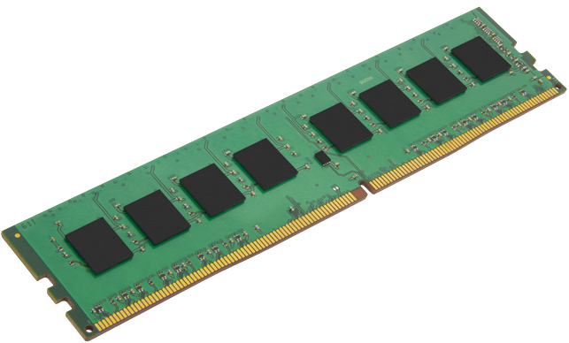{:width="10%"}

**Zalman ZM500-GV 80PLUS Bronze**   
Alimentation 500W ATX 12V v2.3 80PLUS Bronze   
{:width="20%"}

**Western Digital Red 4 To SATA 3"5 6Gb/s**  
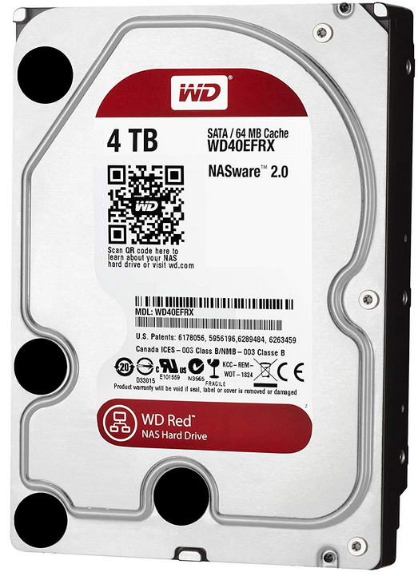{:width="10%"}  
*Spécifiquement conçus pour les systèmes NAS de 1 à 8 baies, les disques durs Western Digital Red sont faits pour tourner 24h/24 et 7j/7, et destinés aux particuliers et aux petites structures de travail. Ces disques durs au format 3.5" sont construits autour de 64 à 256 Mo de cache  sur un bus SATA III. Leur compatibilité est assurée avec la plupart des serveurs NAS de grandes marques .*

**Western Digital Caviar GP WD5000AACS 500GB 5400 to 7200 RPM 16MB Cache SATA 3.0Gb/s 3.5" Internal Hard Drive Bare Drive 3"5**  
{:width="10%"}  

**Crucial SSD C300-CTFDDAC064M  64Go**  
**Crucial SSD CT512MX1  512Go**  
{:width="10%"}

### BIOS ASUS H110M-A/M.2

**Mise à jour du bios**

* [Update BIOS ASUS H110M-A/M.2](/files/E12583_BIOS_Update_EM_V3_WEB_20170614.pdf)  
* [BIOS H110M-A-M-2 (download)](https://www.asus.com/fr/Motherboards/H110M-A-M-2/HelpDesk_Download/) 
    * **Version 3408 2017/07/21**  Mise à jour BIOS effectuée le 13/10/2017  
    * **Version 4202 2019/03/15**  Mise à jour BIOS effectuée le 
 
**Intel Virtualization Technology (BIOS)**

Après mise à jour du BIOS , il faut activer **Intel Virtualization Technology**  

1. Accès au BIOS (F2)
2. Advanced Mode (F7)
   - Onglet *Advanced* 
   - Faire défiler le champ *Cpu configuration* jusqu'au paramètre  **Intel Virtualization Technology**
   - Activer **Intel Virtualization Technology  Enabled**
   - Onglet *Exit* 
3. **Save changes & reset**


## ArchLinux


Boot sur clé USB contenant image ISO archlinux (format **aaaa.mm.jj-dual.iso**)  

	loadkeys fr # en est en qwerty , il faut saisir 'loqdkeys'

### Partitionnement du disque

Partitionnement du reste du disque SSD 120G GPT + LVM

    gdisk /dev/sda

On passe en mode expert : x  
On efface tout : z  

On lance fdisk

    fdisk /dev/sda

o créer une table de partition DOS  
n ajouter une partition  
Tout le disque est utilisé  
Type LVM (8e)

### LVM


```
# Volume Physique (Physical Volume)  
pvcreate /dev/sda1  
# Groupe de Volume (Volume Group)  
vgcreate ssd-vga /dev/sda1  
# Volume Logiques (logical Volume)  
lvcreate -L 60G -n root ssd-vga
```

On utilise le volume physique ssd-512 pour le home   
Reste du lvm pour homeb  

    lvcreate -l 81136 -n homeb ssd-512


### Système de fichiers

Type de fichier **ext4** pour les autres partitions  

    mkfs.ext4 /dev/ssd-vga/root
    mkfs.ext4 /dev/ssd-512/homeb

### Archlinux ,installation de base

Points de montage  

```bash
mount /dev/ssd-vga/root /mnt  
mkdir /mnt/home
mount /dev/ssd-512/homeb /mnt/home
```

modifier le fichier **/etc/pacman.d/mirrorlist** pour ne garder qu’un seul miroir (facultatif)  
passer la commande suivante avant la première ligne pacstrap :  

    export LANG=C

installation  

    pacstrap /mnt base base-devel

NOTE : Il est possible de se connecter en ssh pour la suite de l'installation:  

 * Modifier le mot de passe root : `passwd`  
 * Relever l'adresse IP :`ip addr`  
 * Lancer sshd : `systemctl start sshd.socket`  
 * Depuis le poste distant : `ssh root@adresseIP`  

Paquets supplémentaires  

     pacstrap /mnt zip unzip p7zip alsa-utils lsb-release mc mtools dosfstools ntfs-3g exfat-utils bash-completion

* exfat-utils pour la prise en charge des cartes SD de grande capacité 
* ntfs-3g pour les disques formatés en ntfs
* mc ,explorateur de fichiers en ligne de commande 
 

générer le fichier **/etc/fstab** qui liste les partitions présentes avec les UUID des partitions  

    genfstab -U -p /mnt >> /mnt/etc/fstab

chargeur de démarrage Grub2/Bios . Le paquet os-prober est indispensable pour un double démarrage.  

    pacstrap /mnt grub os-prober

Passage en chroot  

	arch-chroot /mnt

Clavier en mode texte, créer le fichier /etc/vconsole.conf.  


	nano /etc/vconsole.conf

Ajouter  

```
KEYMAP=fr-latin9
FONT=eurlatgr
```

localisation française, le fichier /etc/locale.conf doit contenir la bonne valeur pour LANG  

	nano /etc/locale.conf

Ajouter  

```
LANG=fr_FR.UTF-8
LC_COLLATE=C
```

Il faut supprimer le **#** au début de la ligne fr_FR.UTF-8 UTF-8 dans le fichier **/etc/locale.gen**  

	nano /etc/locale.gen

puis exécuter:  

	locale-gen

spécifier la locale pour la session courante  

	export LANG=fr_FR.UTF-8

fuseau horaire de Paris  

	ln -sf /usr/share/zoneinfo/Europe/Paris /etc/localtime

on a une machine en mono-démarrage sur Archlinux, et on peut demander à ce que l’heure appliquée soit UTC  

	hwclock --systohc --utc

modifier le fichier */etc/mkinitcpio.conf*  

	nano /etc/mkinitcpio.conf

ajouter `lvm2` entre `block` et `filesystems` dans les **HOOKS**  
puis exécuter **mkinitcpio** qui est un script shell utilisé pour créer un environnement qui se chargé en premier en mémoire :  

	mkinitcpio -p linux  # linux-lts si vous voulez le noyau lts

générer le fichier de configuration grub  

	grub-mkconfig -o /boot/grub/grub.cfg

>*si vous avez une « hurlante » contenant « /run/lvm/lvmetad.socket: connect failed » ou quelque chose d’approchant, ce n’est pas un bug. C’est une alerte sans conséquence*

Installation grub en mode bios  

	grub-install --no-floppy --recheck /dev/sda

nom de la machine /etc/hostname  

	echo "yannick-pc" > /etc/hostname

mot de passe root   

	passwd root

Réseau networkmanager (pour ensuite installer un environnement graphique xfce,gnome,kde,etc...)  

	pacman -Syy networkmanager
	systemctl enable NetworkManager  

Créer un utilisateur 'yannick' avec la commande suivante  

```bash
useradd -m -g users -c 'yannick archlinux' -s /bin/bash yannick
passwd yannick
```

Créer un groupe 'yannick'

    groupadd yannick

Modifier sudoers pour accès sudo sans mot de passe à l'utilisateur 

	echo "yannick     ALL=(ALL) NOPASSWD: ALL" >> /etc/sudoers

On peut maintenant quitter tout, démonter proprement les partitions et redémarrer.  

```
exit
umount -R /mnt
reboot # Redémarrage 
# oter la clé USB
```

On se connecte en utilisateur  

### Openssh


Installation et lancement  

	pacman -S openssh 

Validation  

	systemctl enable sshd.socket

Lancement SSH  

	systemctl start sshd.socket

On peut se connecter en utilisateur d'un autre poste

### Xorg

{:width="100"}

Toutes les commandes en mode su (sudo -s)

Lancer `alsamixer` avec la commande du même nom, pour configurer le niveau sonore et `alsactl store` pour la sauvegarde

Pour l’exécution de la ligne suivante, il est demandé de choisir un support pour OpenGL. Pour le moment, on choisit **MesaGL**. La modification correspondant à votre matériel sera faite lors de l’installation de Xorg. Ainsi que la version « libx264 » proposé en premier choix.

    sudo pacman -S gst-plugins-{base,good,bad,ugly} gst-libav # gst-libav prend en charge tout ce qui est x264 et apparenté.

Installation de Xorg. Le paquet xf86-input-evdev est obsolète depuis début janvier 2017, à cause du passage à xorg-server 1.19.

    sudo pacman -S xorg-{server,xinit,apps} xf86-input-libinput xdg-user-dirs

Pilote carte graphique intel

    sudo pacman -S xf86-video-intel

Installation des polices.  

    sudo pacman -S ttf-{bitstream-vera,liberation,freefont,dejavu} freetype2


### Outils et applications

On commence par tout ce qui est graphique : gimp, cups (gestion de l’imprimante) et hplip (si vous avez une imprimante scanner Hewlett Packard). Le paquet python-pyqt5 est indispensable pour l’interface graphique de HPLIP. Webkigtk2 étant indispensable pour la lecture de l’aide en ligne de Gimp. outil rsync, Retext éditeur markdown, firefox fr, thunderbird, libreoffice, gdisk  

	sudo pacman -S cups gimp gimp-help-fr hplip python-pyqt5 rsync firefox-i18n-fr git libreoffice-fresh-fr thunderbird-i18n-fr gptfdisk wget usbutils
	sudo pacman -S qt5-webkit retext

installer Yay (écrit en go) pour compléter Pacman  

Yay : 

    git clone https://aur.archlinux.org/yay
    cd yay
    makepkg -sri
    cd ..
    sudo rm -r yay


On ne supprime pas la dépendance Go (très long en téléchargement !!!)

```
vérification des dépendances…

Paquets (1) go-2:1.11-1

Taille totale supprimée :  415,51 MiB

:: Voulez-vous désinstaller ces paquets ? [O/n] n
```

Yaourt :

il permet de modifier avant installation le PKGBUILD et install  
Prérequis : **base-devel** er **git**  

```
git clone https://aur.archlinux.org/package-query.git
cd package-query
makepkg -si
cd ..
git clone https://aur.archlinux.org/yaourt.git
cd yaourt
makepkg -si
cd ..
```

Autre alternative, Trizen (écrit en perl)

Trizen :

```bash
git clone https://aur.archlinux.org/trizen
cd trizen
makepkg -sri
cd ..
sudo rm -r trizen
```

Yay (Utiliser la version précompilée, il faut au minimun **yaourt** déjà installé) : 

    yaourt -S yay-bin

Cette version précompilée de yay est beaucoup plus rapide à installer et à maintenir...

#### Applications supplémentaires

	yay -S youtube-dl calibre bluefish viking android-tools bind-tools

>**Applications facultatives** *makemkv mkvtoolnix-gui sound-juicer wireshark-gtk tigervnc radiotray*  
et la série des paquets foomatic qui permet d’avoir le maximum de pilotes pour l’imprimante  
`sudo pacman -S foomatic-{db,db-ppds,db-gutenprint-ppds,db-nonfree,db-nonfree-ppds} gutenprint`

#### tmux

Fichier des paramètres **tmux** **$HOME/.tmux.conf**

```
#Configuration de tmux
#Origine : http://denisrosenkranz.com
#Yannick juin 2017
# Copier/Coller par la souris se fait avec la touche "Shift" appuyée
 
##################################
#Changements des raccourcis claviers
##################################
#On change Control +b par Control +x
#set -g prefix C-x
#unbind C-b
#bind C-x send-prefix
 
#On utilise control + flèches pour naviguer entre les terminaux
bind-key -n C-right next
bind-key -n C-left prev
 
#on utilise alt + flèches our naviguer entre les panels
bind-key -n M-left select-pane -L
bind-key -n M-right select-pane -R
bind-key -n M-up select-pane -U
bind-key -n M-down select-pane -D
 
#On change les raccourcis pour faire du split vertical et horizontal
#On utilise la touche "|" (pipe) pour faire un split vertical
bind | split-window -h
#Et la touche "-" pour faire un split horizontal
bind - split-window -v
 
##################################
#Changements pratiques
##################################
#On permet l'utilisation de la souris pour changer de terminal et de panel
set -g mouse on
 
#Les fenêtres commencent par 1 et non par 0
set -g base-index 1
 
##################################
#Changements visuels
##################################
#On met les panneaux non actif en gris
set -g pane-border-fg colour244
set -g pane-border-bg default
 
#On met le panneau actif en rouge
set -g pane-active-border-fg colour124
set -g pane-active-border-bg default
 
#On met la barre de status en gris
set -g status-fg colour235
set -g status-bg colour250
set -g status-attr dim
 
# On surligne les fenêtres actives dans la barre de status en gris foncés
set-window-option -g window-status-current-fg colour15
set-window-option -g window-status-current-bg colour0
```

#### udisks

*udisks fournit un démon udisksd, qui implémente les interfaces D-Bus utilisées pour interroger et manipuler les périphériques de stockage, et un outil en ligne de commande **udisksctl**, utilisé pour interroger et utiliser le démon*

    udisksctl status

```
MODEL                     REVISION  SERIAL               DEVICE
--------------------------------------------------------------------------
CT120BX300SSD1            M2CR010   1745E1065D62         sda     
Crucial_CT512MX100SSD1    MU01      15100EE439E5         sdb     
WDC WD40EFRX-68WT0N0      82.00A82  WD-WCC4E4RXRNAV      sdc     
LITEONIT LCT-128M3S       VQDC      TW0K11MF5508528S3714 sdd     
ST2000LM007-1R8174        SBK2      WDZGGVZA             sdf     
```

Créer le dossier

    sudo mkdir /media

Par défaut, udisks2 monte les disques amovibles (sde dans la liste) sous le répertoire contrôlé par ACL /run/media/$USER/. Si vous souhaitez monter sur /media à la place, utilisez cette règle :

    sudo nano /etc/udev/rules.d/99-udisks2.rules

```
# UDISKS_FILESYSTEM_SHARED
# ==1: mount filesystem to a shared directory (/media/VolumeName)
# ==0: mount filesystem to a private directory (/run/media/$USER/VolumeName)
# See udisks(8)
ENV{ID_FS_USAGE}=="filesystem|other|crypto", ENV{UDISKS_FILESYSTEM_SHARED}="1"
```

Puisque /media, contrairement à /run, n'est pas monté par défaut en tmpfs, vous pouvez également créer un extrait de tmpfiles.d pour nettoyer les points de montage obsolètes à chaque démarrage :

    sudo nano /etc/tmpfiles.d/media.conf

```
D /media 0755 root root 0 -
```

#### exFAT

*L'exFAT (ou FAT64) est le dernier système de fichier de Microsoft (donc propriétaire) pour les mémoires flash.
Il a surtout permis de dépasser la limite de 4 Gio par fichier du FAT32*

Pour la portabilité d'une unité de stockage amovible la plus universelle possible , il faut choisir le bon système de fichiers

Système de fichiers |Windows XP |Windows 7/8/10 |macOS (10.6.4 et antérieures) |macOS (10.6.5 et ultérieures) |Linux |Playstation 4 |Xbox 360/One
------|----|----|----------|----------|----|---|------
NTFS  |Oui |Oui |Lecture Seul |Lecture Seul |Oui |Non |Non/Oui
FAT32 |Oui |Oui |Oui |Oui |Oui |Oui |Oui/Oui
exFAT |Oui |Oui |Non |Oui |Oui (avec paquet ExFAT) |Oui (avec MBR, pas GUID) |Non/Oui
HFS+ |Non |(Lecture Seul avec Boot Camp) |Oui |Oui |Oui |Non |Oui
APFS |Non |Non |Non |Oui (macOS 10.13 ou sup) |Non |Non |Non
EXT 2, 3, 4 |Non |Oui (avec logiciel tierce) |Non |Non |Oui |Non |Oui

L'unité externe présente , disque USB3/2 To système de fichiers extFAT   

    yay -S exfat-utils


#### CryFS (Facultatif)

Chiffrer les dossiers avant dépôt sur Nextcloud

* [Chiffrement CryFs](/posts/CryFS-Chiffrement/)

Installer CryFS

    yay -S cryfs

Créer un dossier **cryfs-chiffre** qui sera chiffré et accessible dans Nextcloud

    mkdir -p ~/media/dplus/statique/cryfs-chiffre

Créer le dossier "mount" **.chiffre** avec le contenu de **cryfs-chiffre** après déchiffrage

    mkdir -p ~/.chiffre

Montage et démontage manuel

    cryfs ~/media/dplus/statique/cryfs-chiffre ~/.chiffre # montage :  saisir le mot de passe
    cryfs-unmount "~/.chiffre"                            # démontage


Montage automatique à l'ouverture d'une session utilisateur, créer un bash "~/scripts/cryfs-autostart"

    nano ~/scripts/cryfs-autostart

```
#!/bin/bash
export CRYFS_FRONTEND=noninteractive
export CRYFS_NO_UPDATE_CHECK=noninteractive
BASE_DIR="${HOME}/media/dplus/statique/cryfs-chiffre"
MOUNT_DIR="${HOME}/.chiffre"
PASSWORD="Mot-de-Passe"
if [ ! -d "$MOUNT_DIR" ]; then
  mkdir $MOUNT_DIR
fi
echo $PASSWORD | cryfs $BASE_DIR $MOUNT_DIR &>/dev/null 
```

    chmod +x ${HOME}/scripts/cryfs-autostart 
    sudo ln -s ${HOME}/scripts/cryfs-autostart /usr/local/bin/cryfs-autostart

On place l'unit propre à un utilisateur dans le dossier **~/.config/systemd/user**, créer le dossier

    mkdir -p ~/.config/systemd/user

Le fichier unit **cryfs-autostart.service**

    nano ~/.config/systemd/user/cryfs-autostart.service

```
[Unit]
Description=CryFS mount.

[Service]
ExecStart=/usr/local/bin/cryfs-autostart
ExecStop=cryfs-unmount "${HOME}/.chiffre"
Type=forking
Restart=always

[Install]
WantedBy=default.target
```

Une fois ce fichier placé au bon endroit, il suffit de reloader systemd pour ensuite démarrer le service:

    systemctl --user daemon-reload
    systemctl start --user cryfs-autostart.service
    systemctl enable --user cryfs-autostart.service
    systemctl status --user cryfs-autostart.service

### timedatectl (synchro serveur de temps)

* [systemd-timesyncd](https://wiki.archlinux.org/index.php/Systemd-timesyncd)

Avant synchronisation  

	timedatectl

```
               Local time: jeu. 2018-09-27 08:13:11 CEST
           Universal time: jeu. 2018-09-27 06:13:11 UTC
                 RTC time: jeu. 2018-09-27 06:13:12
                Time zone: Europe/Paris (CEST, +0200)
System clock synchronized: no
              NTP service: inactive
          RTC in local TZ: no
```

Editer du fichier de configuration timesyncd.conf :  

	sudo nano /etc/systemd/timesyncd.conf

Définir les serveurs de temps :  

```
[Time]
NTP=
FallbackNTP=0.arch.pool.ntp.org 1.arch.pool.ntp.org 2.arch.pool.ntp.org 3.arch.pool.ntp.org
RootDistanceMaxSec=5
PollIntervalMinSec=32
PollIntervalMaxSec=2048
```

Activer et lancer la synchronisation   

    sudo systemctl enable systemd-timesyncd
    sudo systemctl start systemd-timesyncd

Après synchronisation (attendre 1 minute avant d'exécuter la commande suivante)  

    timedatectl

```
               Local time: jeu. 2018-09-27 08:18:23 CEST
           Universal time: jeu. 2018-09-27 06:18:23 UTC
                 RTC time: jeu. 2018-09-27 06:18:23
                Time zone: Europe/Paris (CEST, +0200)
System clock synchronized: yes
              NTP service: active
          RTC in local TZ: no
```


### Services à activer

```
#systemctl enable syslog-ng@default          # gestion des fichiers d’enregistrement d'activité
#systemctl enable cronie                     # pour les tâches récurrentes
#systemctl enable bluetooth                  # uniquement si on a du matériel bluetooth
sudo systemctl enable avahi-daemon               # dépendance de Cups
sudo systemctl enable avahi-dnsconfd             # autre dépendance de Cups
sudo systemctl enable org.cups.cupsd             # cups pour les imprimantes
```

### Historique ligne de commande

Ajoutez la recherche d'historique de la ligne de commande au terminal.  
Tapez un début de commande précédent, puis utilisez shift + up (flèche haut) pour rechercher l'historique filtré avec le début de la commande.  

    sudo -s

```
# Global, tout utilisateur
echo '"\e[1;2A": history-search-backward' | sudo tee -a /etc/inputrc
echo '"\e[1;2B": history-search-forward' | sudo tee -a /etc/inputrc
exit
```

## XFCE

{:width="100"}

### Bureau XFCE + applications

Gérer des périphériques utilisant MTP (tablettes sous android par exemple), il vous faut rajouter les deux paquets gvfs-mtp et mtpfs (**facultatif**) : `sudo pacman -S gvfs-{afc,goa,google,gphoto2,mtp,nfs,smb}`  

Installer Xfce avec vlc (vidéo), pulseaudio, etc... 

	sudo pacman -S xfce4 xfce4-goodies gvfs vlc xarchiver galculator evince ffmpegthumbnailer xscreensaver system-config-printer python2-pyinotify pavucontrol pulseaudio pulseaudio-alsa # pulseaudio-bluetooth 

**network-manager-applet** pour la gestion des connexions réseau ,**keepassxc** pour la gestion des mots de passe  

	sudo pacman -S gedit keepassxc terminator filezilla nmap minicom iw network-manager-applet zenity tmux #cheese  menulibre

Installation  **lightdm** et du gestionnaire graphique  

    sudo pacman -S lightdm-gtk-greeter-settings  # Installation de lightdm lightdm-gtk-greeter lightdm-gtk-greeter-settings

Pour avoir le bon agencement clavier dès la saisie du premier caractère du mot de passe, il faut entrer la commande suivant avant de lancer pour la première fois lightdm :  

	sudo localectl set-x11-keymap fr

Pour lancer Xfce, il faut entrer dans un premier temps :  

	sudo systemctl start lightdm # A saisir sur l'ordinateur ,pas sur la console SSH

Sélectionner l'utilisateur et saisir son mot de passe, et si tout se passe bien, on peut valider :  

	sudo systemctl enable lightdm

#### LVM 

*Logical Volume Manager, ou gestionnaire de volumes logiques en français*

**Volumes physiques**  
*Un volume physique ou « PV » pour « physical volume » est tout simplement un disque ou une partition*  

```
  PV         VG         Fmt  Attr PSize    PFree  
  /dev/sda1  ssd-vga    lvm2 a--  <111,79g <51,79g
  /dev/sdb1  ssd-512    lvm2 a--  <476,94g      0 
  /dev/sdc3  vg-nas-one lvm2 a--    <3,64t   2,00t
```

**Groupes de volumes**  
*Un groupe de volumes ou « VG » pour « volume group » est, comme son nom l'indique, un ensemble de volumes physiques*  

```
  VG         #PV #LV #SN Attr   VSize    VFree  
  ssd-512      1   2   0 wz--n- <476,94g      0 
  ssd-vga      1   1   0 wz--n- <111,79g <51,79g
  vg-nas-one   1   2   0 wz--n-   <3,64t   2,00t
```

**Volumes logiques**  
*Un volume logique ou « LV » pour « logical volume » est ce que nous allons utiliser au final*  

```
  LV      VG         Attr       LSize    Pool Origin Data%  Meta%  Move Log Cpy%Sync Convert
  homea   ssd-512    -wi-ao----  160,00g                                                    
  homeb   ssd-512    -wi-ao---- <316,94g                                                    
  root    ssd-vga    -wi-ao----   60,00g                                                    
  virtuel vg-nas-one -wi-ao----    1,15t                                                    
  yanplus vg-nas-one -wi-ao----  500,00g                                                    
```

#### Dossiers de partage, fstab et liens

    sudo chown $USER.users -R /mnt
    sudo mkdir -p /srv/{video,serie,savlocal,virtuel}
    sudo chown $USER.users -R /srv/{video,serie,savlocal,virtuel}

Modification /etc/fstab   

    sudo nano /etc/fstab

```
# /dev/mapper/ssd--vga-root
UUID=a6f5dd58-3970-4209-8412-6bfbf1356a03	/         	ext4      	rw,relatime	0 1

# /dev/mapper/ssd--512-homeb
UUID=a3271162-298f-45d9-82f2-e30478991079	/home     	ext4      	rw,relatime	0 2

# 
#UUID=c6ab468e-ed7b-491e-b7c3-010a70816d0c
/dev/mapper/vg--nas--one-yanplus	/home/yannick/media		ext4    defaults	0       2

# 
#UUID=bfb64d50-9590-49e5-b3ef-afb8c9baba90
/dev/mapper/vg--nas--one-virtuel		/srv/virtuel    ext4    defaults	0	2
#
```

Montage

    sudo mount -a

Créer les liens media &rarr; /mnt , Sauvegarde-Locale &rarr; /srv/savlocal , virtuel &rarr; /srv/virtuel

    sudo ln -s /mnt /home/$USER/media
    sudo ln -s /srv/savlocal $HOME/Sauvegarde-Locale
    sudo ln -s /srv/virtuel $HOME/virtuel

#### Personnaliser XFCE

Au choix :

* Icônes "faenza" et thème "numix" : `sudo pacman -S faenza-icon-theme numix-gtk-theme`  
* Icônes et thème "numix" : `yay -S numix-gtk-theme-git numix-circle-icon-theme-git #numix-gtk-theme`  
* Icônes et thème "matcha" : `yay -S matcha-gtk-theme`

Choix *Icônes et thème "numix"*

[Xfce4 Desktop Environment Customization](https://github.com/NicoHood/NicoHood.github.io/wiki/Xfce4-Desktop-Environment-Customization)

Menu &rarr; Paramètres &rarr; Gestionnaire d'alimentation

{:width="300px"} 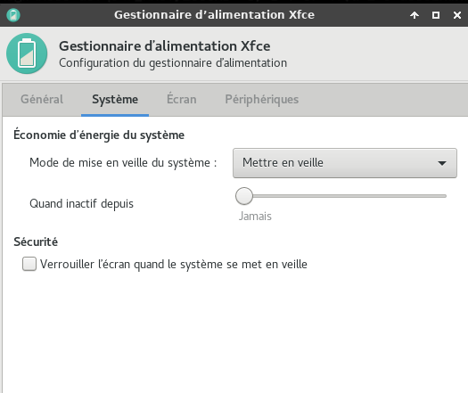{:width="300px"}

{:width="300px"}

Menu &rarr; Paramètres &rarr; Affichage , Double écran , Sharp à gauche de Essential  

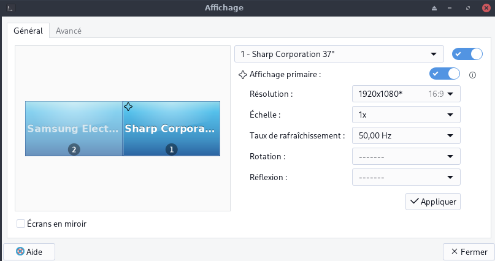{:width="300px"}

Menu &rarr; Paramètres &rarr; Apparence  

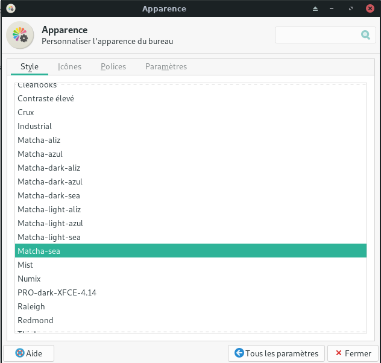{:width="300px"}  
{:width="300px"}  
{:width="300px"}  

Menu Paramètres &rarr; Gestionnaire de fenêtres 

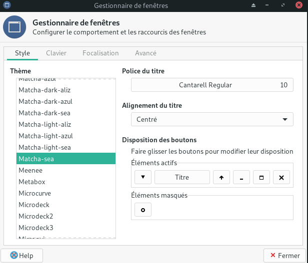{:width="300px"}

Modification du **tableau de bord** , clic-droit &rarr; Tableau de bord &rarr; Préférences de tableau de bord  
Tableau de bord 1  

  * Onglet *Eléments* 
      * Ajouter des éléments (+) --> **Menu whisker** (icône *yannick-green.png*)  ,**Mise à jour météo** ,**Greffon PulseAudio** ,**Afficher le bureau**, **Captures d'écran**  
      * Supprimer Menu des applications 
      * **Horloge** Affichage date et heure, *format personnalisé* : %e %b %Y %R  
      * **Changeur d'espace de travail** ,*Paramètres des espaces de travail* à 2 , décocher *Changer d'espace...*
      * **Boutons d'action** idem dans apparence , actions `Déconnexion`  
  * Onglet *Affichage*
      * Verrouiller tableau de bord
      * Masquer automatiquement le tableau de bord **Jamais**  
      * Taille d'une ligne (pixels) **25**  

Après validation tableau de bord, clic droit sur icône capture écran puis  Propriétés -> Zone à capturer : Sélectionner une zone

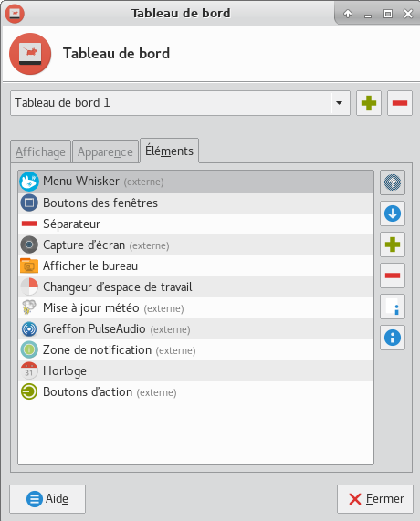{:width="300px"}

Tableau de bord 2  
Pour le déplacer le *Tableau de bord 2* vers écran Essential **1.___72** , décocher *Verrouiller tableau de bord*  

  * Onglet *Affichage*
      * Verrouiller tableau de bord
      * Masquer automatiquement le tableau de bord **Toujours**  
      * Taille d'une ligne (pixels) **40**  
  * Onglet *Eléments*  tableau de bord 2
      * Emulateur de Terminal : /usr/bin/terminator , icône *terminator*

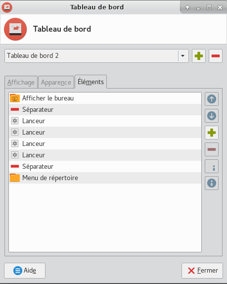{:width="300px"}

Menu &rarr; Paramètres &rarr; Applications favorites

  * Utilitaires -> Emulateur de terminal : **/usr/bin/terminator "%s"** 

Menu Paramètres --> Bureau  

  * Fonds d'écran image **/usr/share/backgrounds/**   
  * Onglet *Icônes*
      * Tout décocher dans **Icônes par défaut**  

Gestionnaire de fichier **Thunar**

  * Edition --> Préférence ,ongle **Comportement** *Ouvrir le dossier dans un nouvel onglet*

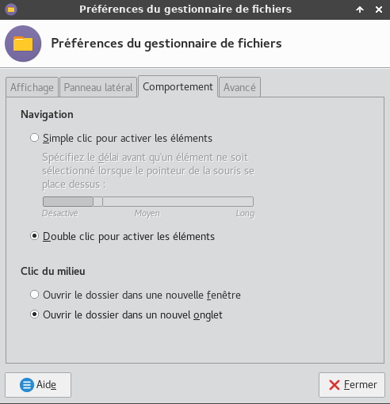{:width="300px"}

Fonction recherche ,installer les logiciels

    sudo pacman -S catfish mlocate

  * Edition --> Configurer les actions personnalisées ,ajouter (+)

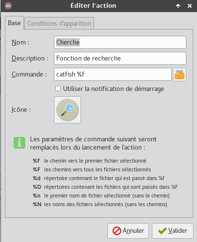{:width="300px"}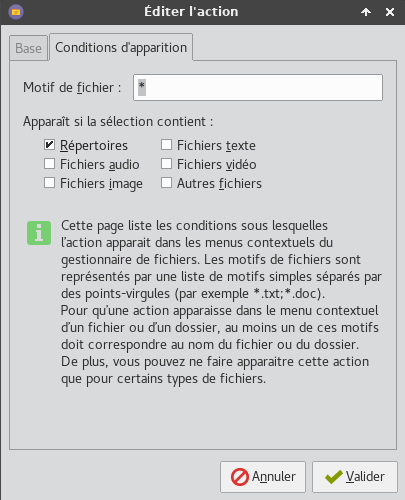{:width="300px"}

#### Client Nextcloud

Installation client nextcloud

    yay -S nextcloud-client   # opération compilation "longue" en durée , patienter!!!
    sudo pacman -S gnome-keyring libgnome-keyring

Démarrer le client owncloud , après avoir renseigné l'url ,login et mot de passe pour la connexion  
Il faut renseigner "le mot de passe du nouveau trousseau de clés" , mettre le même mot de passe que celui de l'ouverture de session.

Les dossiers synchronisés <https://cinay.xyz/nextcloud> :

*  Créer le dossier 	`mkdir -p $HOME/{.keepassx}` , Home/.keepassx --> ~/.keepassx


#### keepassxc

Ouvrir menu xfce et lancer **KeePassXC**  
Base ~/.keepassx/yannick_xc.kdbx  
Clé ~/.ssh/yannick_keepassxc.key  

#### Liens scripts (/usr/local/bin) 

```bash
#Créer des liens sur /usr/local/bin pour les scripts  
sudo ln -s $HOME/scripts/ssh-manager.sh /usr/local/bin/sshm
sudo ln -s $HOME/scripts/savlog.sh /usr/local/bin/savlog
sudo ln -s $HOME/scripts/tmux-ssd.sh /usr/local/bin/tmuxssh
sudo ln -s /home/yannick/scripts/generer-code-2fa-vers-presse-papier-toutes-les-30s.sh /usr/local/bin/otp
#sudo ln -s $HOME/scripts/virtuel /usr/local/bin/virtuel
#droits en exécution
#chmod +x $HOME/scripts/{ssh-manager.sh,savlog.sh,tmux-ssd.sh,virtuel}
```


#### Dossier Private  (ecryptfs)

{:width="100"}  
*Ecryptfs est un outil pour créer un dossier privé (~/Private), chiffré et inaccessible aux autres utilisateurs, il est destiné à contenir tous les fichiers "sensibles"*

Installer le paquet ecryptfs-utils.

	sudo pacman -S ecryptfs-utils

Copier les dossiers *.Private Private et .ecryptfs* du répertoire de sauvegarde vers $HOME  

	sudo cp -a /srv/savlocal/yannick-pc/{.Private,Private,.ecryptfs} $HOME

Une fois ces paquets installés, vous devez charger le module ecryptfs (archlinux/manjaro)

	sudo modprobe ecryptfs

Configuration PAM

Vérifier ou créer (touch) les fichiers **~/.ecryptfs/auto-mount, ~/.ecryptfs/auto-umount et ~/.ecryptfs/wrapped-passphrase** (créer avec utilitaire ecryptfs-setup-private).  
Ajouter ecryptfs au pam exactement comme ce qui suit pour que la login passphrase ne soit plus demandée :  
Ouvrir /etc/pam.d/system-auth  

    sudo nano /etc/pam.d/system-auth

```
#%PAM-1.0

auth      required  pam_unix.so     try_first_pass nullok
auth      required  pam_ecryptfs.so unwrap
auth      optional  pam_permit.so
auth      required  pam_env.so

account   required  pam_unix.so
account   optional  pam_permit.so
account   required  pam_time.so

password  optional  pam_ecryptfs.so
password  required  pam_unix.so     try_first_pass nullok sha512 shadow
password  optional  pam_permit.so

session   required  pam_limits.so
session   required  pam_unix.so
session   optional  pam_ecryptfs.so
session   optional  pam_permit.so
```

>Les lignes ajoutées sont celles qui contiennent **pam_ecryptfs**

Sauvegarde , déconnexion ,reconnexion et vérifier la sortie du `mount` qui doit contenir une ligne du type **/home/yannick/.Private on /home/yannick/Private type ecryptfs (rw,nosuid...**

#### SSHFS

sshfs ,FUSE client based on the SSH File Transfer Protocol  

    sudo pacman -S sshfs

Création des partages utilisés par sshfs  

```bash
sudo mkdir -p /media/{cinay.pw,cinay.xyz,yanfi.net}
sudo chown $USER.users /media/{cinay.pw,cinay.xyz,yanfi.net}
```

#### Veille écran

Installer par défaut sur archlinux (xscreensaver)   

Création d'un script pour **Activer/Désactiver** le programme de mise en veille **xscreensaver**  
Prérequis : **zenity** ,installé par défaut sous Manjaro  
Le script **~/scripts/veille.sh**  

```bash
#!/bin/bash
# veille.sh


# Détecter si xscreensaver est actif
if [ "$(pidof -s xscreensaver)" ]; then
    arret=false
    zenity --question --title "veille" --ok-label="Oui" --cancel-label="Non" --text "Economiseur Ecran ACTIF\n\n DESACTIVER ?"
    if [ $? = 0 ]
    then
            echo "ARRET daemon xscreensaver ..."
            xscreensaver-command -exit
            sleep 3
    fi
else
    arret=true
    zenity --question --title "veille" --ok-label="Oui" --cancel-label="Non" --text "Economiseur Ecran NON ACTIF\n\n ACTIVER ?"
    if [ $? = 0 ]
    then
            echo "DEPART daemon xscreensaver ..."
            xscreensaver -nosplash &
            sleep 3
    fi
fi
```

Création lanceur XFCE en utilisant **Editeur de menus** (si "menulibre" installé ou manuellement :  

```bash
mkdir -p ~/.local/share/applications/  #création dossier **applications** si inexistant
nano ~/.local/share/applications/menulibre-veille-ecran.desktop
```

Contenu :

```ini
[Desktop Entry]
Version=1.0
Type=Application
Name=Activer/Désactiver veille écran
Comment=Veille active ou pas par simple clic
Icon=preferences-desktop-screensaver
Exec=sh /home/yannick/scripts/veille.sh
Path=/home/yannick/scripts
NoDisplay=false
Categories=Utility;X-XFCE;X-Xfce-Toplevel;
StartupNotify=false
Terminal=false
```

>Les icônes sont situés sous /usr/share/icons , il suffit de mettre le nom de l'icône choisi sans extension ni chemin pour le paramètre **Icon**

#### Son

Lancement

	pulseaudio --start
	sudo usermod -aG audio $USER

Ouvrir pavucontrol  
Audio interne DigitalStéréo (HDMI)  
Port : HDMI/DisplayPort (plugged in)  

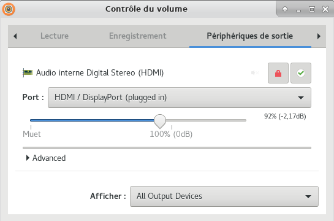{:width="300px"} {:width="300px"}

{:width="300px"} {:width="300px"}

Commuter la sortie audio entre HDMI et analogique par un clic, chercher l'expression "sortie audio hdmi" dans le champ recherche du site

#### Impression

Si l’imprimante est connectée directement à votre système ou si vous avez accès à une imprimante réseau IPP, un serveur CUPS local est utilisé.
Vérifier que les 3 services suivants sont **enabled** et **active (running)** 

    systemctl status {avahi-daemon,avahi-dnsconfd,org.cups.cupsd}

Sinon 

```
sudo systemctl enable avahi-daemon               # dépendance de Cups
sudo systemctl enable avahi-dnsconfd             # autre dépendance de Cups
sudo systemctl enable org.cups.cupsd             # cups pour les imprimantes
sudo systemctl start avahi-daemon               # dépendance de Cups
sudo systemctl start avahi-dnsconfd             # autre dépendance de Cups
sudo systemctl start org.cups.cupsd             # cups pour les imprimantes
```

Installation du scanner  
Coté logiciel il vous faudra **sane** et son interface graphique **xsane**, ainsi qu’éventuellement xsane-gimp le plugin pour gimp.

	yay -S sane xsane xsane-gimp 

Imprimante réseau HP 

Lancer "HP Device Manager"  

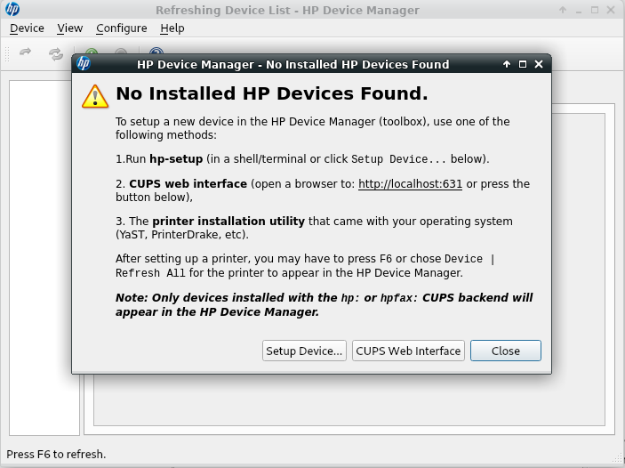{:width="400px"}

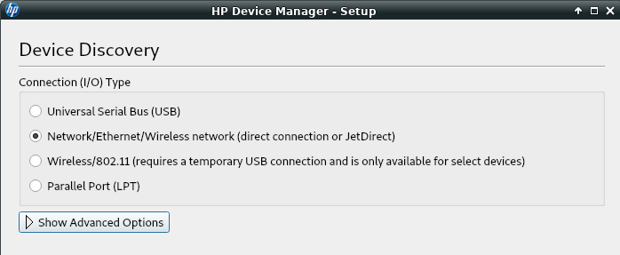{:width="400px"}

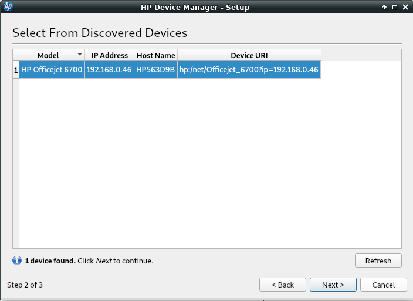{:width="400px"}

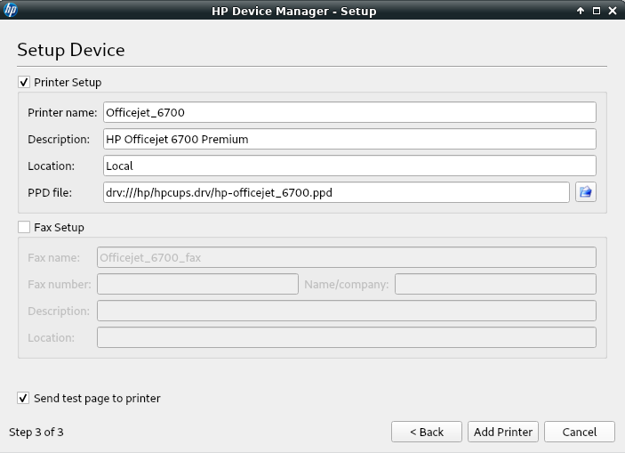{:width="400px"}

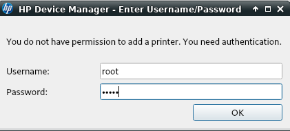{:width="300px"}

#### Journalctl

Ajout utilisateur courant au groupe systemd-journal et adm

	sudo gpasswd -a $USER systemd-journal
	sudo gpasswd -a $USER adm

Lignes non tronquées ,ajouter au fichier **~/.bashrc**  

    echo "export SYSTEMD_LESS=FRXMK journalctl" >> /home/$USER/.bashrc

Prise en compte après déconnexion/reconnexion

**Rendre persistant journalctl**  
Par défaut `journalctl` affiche les logs du dernier boot. En cas de freeze de votre serveur, il peut être intéressant de comprendre ce qui s’est passé juste avant le plantage…Du coup nous allons rendre journalctl persistant. 

    sudo nano /etc/systemd/journald.conf

Oter le commentaire (#) à la ligne Storage=auto et remplacer *auto* par *persistent* 

Réinitialiser le journal

```
sudo mkdir /var/log/journal
sudo systemd-tmpfiles --create --prefix /var/log/journal
sudo systemctl restart systemd-journald
```

Maintenant vous pouvez voir les différents boots

    sudo journalctl --list-boots

```
 0 518f818d328145f692098062be9056cb Thu 2019-08-29 11:07:55 CEST—Thu 2019-08-29 12:03:50 CEST
```

#### VirtualBox (Facultatif)

* [VirtualBox](/posts/VirtualBox/)

Installation 

```bash
sudo pacman -S linux-headers  # utiliser par DKMS
sudo pacman -S virtualbox 
```

Sélectionner **1** : **virtualbox-host-dkms**   
Après installation, entrez la commande suivante pour ajouter le module Virtualbox au noyau :  

```bash
sudo modprobe vboxdrv
```

ajouter le compte utilisateur personnel au groupe d'utilisateurs vbox :  

```bash
sudo gpasswd -a $USER vboxusers
```

Création du dossier Partage  

```bash
mkdir -p ~/Partage
```


>**Impératif, vous devez maintenant redémarrer votre système pour que les modifications prennent effet.**  

#### Images (fond écran,connexion et grub)

les images de fond d'écran **/usr/share/backgrounds/xfce**   

	sudo cp ~/media/dplus/images/Fonds/Linux-Arch* /usr/share/backgrounds/xfce/     # fond écran sharp
	sudo cp ~/media/dplus/images/yannick/yannick-green.png /usr/share/pixmaps/      #

Ecran et logo pour lightdm de la page de connexion

	sudo cp ~/media/dplus/images/Fonds/archlinux-lightdm.png /usr/share/backgrounds/
	sudo cp ~/media/dplus/images/yannick/yannick53x64.png /usr/share/pixmaps/


#### Ecran connexion (lightDM)

Ecran et logo pour **lightdm**  de la page de connexion    
Accès aux paramètres lightDM en mode graphique (mot de passe root)

* Menu --> Paramètres --> LightDM GTK+ Paramètres d'Apparence

{:width="300px"}


#### Ecran de boot (grub)

Ecran de la page de démarrage **grub**  

    sudo cp ~/media/dplus/images/Fonds/archlinux1024x600.png /usr/share/backgrounds/xfce/
	sudo nano /etc/default/grub

```
GRUB_BACKGROUND="/usr/share/backgrounds/xfce/archlinux1024x600.png"  
```

Reconfigurer grub pour la prise en charge de l'image  

	sudo grub-mkconfig -o /boot/grub/grub.cfg

### Les applications supplémentaires

* **Menulibre** pour éditer les .desktop xfce : `yay -S menulibre`
* **Nmap** : `yay -S nmap`
* Gestionnaire de fichiers à 2 fenêtres `yay -S doublecmd-gtk2`
* **Edition, développement, conversion** 
    *  [Wing Personal Python IDE](https://wingware.com/downloads/wing-personal) 
        * Télécharger et décompresser la version linux (ex wing-personal-7.1.2.0-linux-x64.tar.bz2)
        * En mode su , `cd wing-personal-7.1.2.0-linux-x64` , `./wing-install.py --winghome /opt/wing-personal --bin-dir /usr/local/bin`
    * **KiCad** est une suite logicielle libre de conception pour l'électronique pour le dessin de schémas électroniques et la conception de circuits imprimés. KiCad est publié sous licence GNU GPL: `sudo pacman -S kicad`
* **Torrent**
    *  **qbittorent**  `sudo pacman -S qbittorrent`

#### Copie d'écran (Flameshot)

**[Flameshot](https://github.com/lupoDharkael/flameshot)** c’est un peu THE TOOL pour faire des captures d’écrans

    sudo pacman -S flameshot

Paramétrage "tableau de bord"  
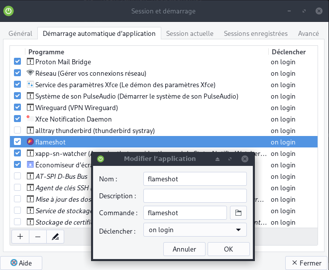{:width="600"}  

#### QR code

* [QR Code (code-barres) définition, encodage et décodage](/posts/QR-Code-barres-definition-encodage-decodage/)

*La première chose à faire va être d’installer deux petites applications, à savoir QRencode pour la partie création, et ZBar pour la partie scan/lecture*  
Sur Archlinux

    sudo pacman -S qrencode zbar


### Trucs et astuces

#### Calibre

*Calibre facilite la gestion de votre bibliothèque de livres électroniques. Ce programme intuitif et complet vous permet de visionner vos ebooks, de les trier selon différents critères, de les convertir (individuellement ou par lot), d'éditer leurs méta-données et de récupérer des informations à partir d'Internet.*

Premier lancement ,bibliothèque sous **~/media/BiblioCalibre**

#### Paramétrer minicom

Paramétrage de l'application terminale

     sudo minicom -s

>Seul les paramètres à modifier sont cités

Configuration du port série  
A -                             Port série : **/dev/ttyUSB0**   
F -              Contrôle de flux matériel : **Non**  
Echap  
Enregistrer config. sous dfl  
Sortir de Minicom  

#### Pacman

* Ignorer la mise à jour d’un paquet sous archlinux ,mettre le paquet dans *IgnorePkg* du **/etc/pacman.conf**  

#### Nano comme éditeur par défaut

Attribution immédiate

    export EDITOR=/usr/bin/nano

Attribution permanente

    echo "export EDITOR=/usr/bin/nano" >> ~/.bashrc

## Borg sauvegarde home PC1


* [Archlinux : Sauvegarde des données avec BORG](https://wiki.archlinux.fr/Sauvegarde_des_donn%C3%A9es_avec_BORG)

Installation normale  
Le paquet borg étant dans les dépôts Community il suffit de:

    sudo pacman -S borg

Optionnels recommandés :

    sudo pacman -S fuse python-llfuse


**Sauvegarde PC1 "local" sur unité "sav"**

* *La sauvegarde sera exécutée avec l'utilisateur borg sous root pour les dossiers et fichiers systèmes*
* **/root/.borg** : dossier des fichiers (script, passphrase et exclusions)
* **/srv/sav/borg-backups** (lien ~/media/sav/borg-backups) : dossier des dépôts

Créer les dossiers

    sudo mkdir -p /srv/sav/borg-backups /root/.borg
    sudo chown $USER.$USER -R  /srv/sav/borg-backups

Création d'un fichier **passphrase** ( ex: qui contient 6 mots aléatoires séparés par un espace) qui servira à automatiser la procédure de sauvegarde sauvegarde (**/root/.borg/passphrase**)

    sudo nano /root/.borg/passphrase # contient la "phrase de passe"

Création d'un fichier **exclusions** qui contient toutes les exclusions de dossiers et fichiers , une exclusion par ligne (**/root/.borg/exclusions**)

    sudo nano /root/.borg/exclusions

```
/home/yannick/Bureau
/home/yannick/Modèles
/home/yannick/Partage
/home/yannick/Public
/home/yannick/Téléchargements
/home/yannick/Vidéos
/home/yannick/temp
/home/yannick/vps
/home/yannick/media
/home/yannick/VirtualBox\ VMs
```

**Initialisation dépôt** "yannick-pc" de sauvegarde chiffré, la "phrase de passe" sera demandée 

```bash
sudo -s
export BORG_PASSPHRASE="`cat /root/.borg/passphrase`"
BORG_REPOSITORY=/srv/sav/borg-backups/yannick-pc
borg init --encryption=repokey-blake2 /srv/sav/borg-backups/yannick-pc
```

**Création du script borg-backup**

*Borg a la déduplication, le contrôle de cohérence, le cryptage, est configurable par des variables d'environnement, la récupération des fichiers avec FUSE pour le montage des dépôts. En utilisant borg prune, on peut avoir une haute fréquence de sauvegardes avec une gestion du cycle des repo : 6 heures, 7 jours, 4 semaines, et 6 mois.*

Le fichier script **/root/.borg/borg-backup**

    sudo nano /root/.borg/borg-backup

```
#!/bin/bash

set -e
 
# Vérifier si utilisateur est root
if [ $(id -u) != "0" ]; then
    echo "Erreur : Vous devez être root pour exécuter ce script !"
    exit 1
fi

BORG_REPOSITORY=/mnt/lacie/data/borg-backups/yannick-pc
BACKUP_DATE=`date +%Y-%m-%d-%Hh%M`
echo "Exécution borg-backup yannick-pc $BACKUP_DATE" 
export BORG_PASSPHRASE="`cat /root/.borg/passphrase`"
BORG_ARCHIVE=${BORG_REPOSITORY}::${BACKUP_DATE}

# Sauvegarde de tout /home à l'exception de quelques répertoires et fichiers exclus
borg create \
-v --stats --compression lzma,9 \
--exclude-from /root/.borg/exclusions --exclude-caches \
$BORG_ARCHIVE \
/home/yannick 

# En cas d'erreur de sauvegarde, réinitialiser le mot de passe et quitter.
if [ "$?" = "1" ] ; then
    export BORG_PASSPHRASE=""
    exit 1
fi

# Prune la repo de sauvegardes supplémentaires
borg prune \
-v --list --stats --keep-daily=7 --keep-weekly=4 --keep-monthly=6 \
$BORG_REPOSITORY 
 
# Inclure espace occupé dans le journal.
echo 'Espace occupé : ' $(df -h |egrep '/dev/mapper/vg--nas--one-sav' |awk '{print $5}')
 
borg list $BORG_ARCHIVE
 
# réinitialiser le mot de passe
export BORG_PASSPHRASE=""
echo "Fin exécution borg-backup" 
exit 0
```

Droits en exécution

    sudo chmod +x /root/.borg/borg-backup

**Utiliser Borg avec SystemD service + timer**  
Pour une automatisation en utilisant systemd :

* vous devez créer un fichier **borg-backup.service** et le mettre dans le dossier */etc/systemd/system/system/*
* Pour une exécution régulière (parce que ce n'est pas un processus "daemon"), un fichier **borg-backup.timer** , dans le même dossier que **borg-backup.service** 
* Le nom de fichier avant le suffixe  ".service" et ".timer" doit correspondre pour que systemd reconnaisse ce qu'il doit faire. 

**Service : /etc/systemd/system/borg-backup.service**

```
[Unit]
Description=Borg Backup Service
After=network-online.target
 
[Service]
Type=simple
ExecStart=/bin/bash /root/.borg/borg-backup 
StandardError=journal
# TimeoutStartSec= configure le délai d'attente pour attendre le démarrage du service.
TimeoutStartSec=600

[Install]
# niveau d'exécution multi utilisateur
WantedBy=multi-user.target
```

Adapter User= et Group= dans le fichier borg-backup.service pour un utilisateur qui a les droits sur la sauvegarde. Exécuter le service par défaut mettrait la propriété root:root sur la sauvegarde.

Il est possible de tester le service avec un simple

    sudo systemctl daemon-reload         # on vient de créer un nouveau service
    sudo systemctl start borg-backup.service

l'état de votre système de sauvegarde 

    systemctl status borg-backup

Le journal

    journalctl   -u borg-backup 

Valider le service *borg-backup.service* 

    sudo systemctl enable borg-backup

**Timer : /etc/systemd/system/borg-backup.timer**

```
[Unit]
Description=Borg Backup Timer
 
[Timer]
#
OnBootSec=15min
OnUnitActiveSec=1d
Unit=borg-backup.service
 
[Install]
WantedBy=timers.target
```

* **Install** va créer la dépendance pour que votre “timer” soit bien exécuté et pris en compte par systemd.
* **OnActiveSec=** définit une minuterie par rapport au moment où la minuterie elle-même est activée.  
* **OnBootSec=** définit une temporisation relative au démarrage de la machine.  
* **OnStartupSec=** définit une minuterie relative à la date du premier démarrage de systemd.  
* **OnUnitActiveSec=** définit une minuterie relative à l'unité dans laquelle la minuterie est utilisée.a été activée pour la dernière fois.   
* **OnUnitInactiveSec=** définit une temporisation relative à lorsque l'unité que la minuterie est en train d'activer a été désactivée pour la dernière fois.  

>Plusieurs directives peuvent être combinées du même type et de types différents. Pour par exemple, en combinant OnBootSec= et OnUnitActiveSec=, il est possible de définir une minuterie qui s'écoule à intervalles réguliers et active un service spécifique à chaque fois du temps.  

Les arguments des directives sont des intervalles de temps configurés en secondes.    
Exemple : "OnBootSec=50" signifie 50 s après le démarrage. L'argument peut aussi inclure le temps unités.    
Exemple : "OnBootSec=5h 30min" signifie 5 heures et 30 minutes après que boot-up.  

**Activation et démarrage du timer**

Ensuite, pour qu'il soit actif, il faut prévenir systemd

    sudo systemctl enable borg-backup.timer
    sudo systemctl start borg-backup.timer

Vous pouvez vérifier quand votre prochaine sauvegarde se déclenchera à l'aide des minuteries

    systemctl list-timers 

```
NEXT                         LEFT     LAST                         PASSED       UNIT                         AC>
Wed 2019-12-11 13:15:52 CET  23h left Tue 2019-12-10 13:15:52 CET  8s ago       borg-backup.timer            bo>
```

**Débloquer un dépôt BORG verrouillé**

Exemple , déblocage du dépôt **yannick-pc**  

```
export BORG_PASSPHRASE="`cat ~root/.borg/passphrase`"
export BORG_RSH='ssh -i /root/.ssh/yannick-pc_ed25519'
BORG_REPOSITORY=ssh://borg@xoyaz.xyz:55036/srv/data/borg-backups/yannick-pc
borg break-lock $BORG_REPOSITORY
```

## NFS 

#### AutoFS/PC1 (NFS)

*AutoFS contrôle les opérations des démons d'automount. Les démons d'automount montent automatiquement des systèmes de fichiers quand ils sont employés et les démontent après une période d'inactivité.*

Vérifier ou installer nfs-utils

    sudo pacman -S nfs-utils 

Installer AutoFS

    sudo pacman -S autofs

Reconnaissance auto des montages NFS  
Modifier **/etc/hosts** pour ajouter une ligne avec IP serveur NFS et un nom "dns" ,**xoyize** 

    192.168.0.46	xoyize

**AutoFS** utilise des fichiers de modèles pour la configuration qui sont situés dans */etc/autofs* Le modèle principal est appelé **auto.master**, qui peut pointer vers un ou plusieurs autres modèles pour des types de médias spécifiques. 

    sudo nano /etc/autofs/auto.master

```
# This is a 'master' automounter map and it has the following format:
# mount-point [map-type[,format]:]map [options]
# For details of the format look at auto.master(5).
#
## /misc	/etc/autofs/auto.misc
#
# NOTE: mounts done from a hosts map will be mounted with the
#	"nosuid" and "nodev" options unless the "suid" and "dev"
#	options are explicitly given.
#
/net	-hosts
```

>NOTE: "--timeout=60" est facultatif

Démarrer le service autofs

    sudo systemctl start autofs

Vérifier la reconnaissance des montages NFS qui correspond au showmount  

    ls -l /net/xoyize/data/

```
total 16
drwx------ 2 yannick yannick 16384 11 août  16:56 lost+found
```

Activer le service autofs

    sudo systemctl enable autofs

#### Dossiers partagés par PC1

Dossiers partagés NFS serveur/PC1 (yannick-pc : 192.168.0.28)

Pour configurer archlinux en serveur NFS , il faut activer le service et le lancer

    sudo systemctl enable nfs-server.service
    sudo systemctl start nfs-server.service

Créer des partages NFS sur archlinux

    sudo nano /etc/exports

```
# Use `exportfs -arv` to reload.
/home/yannick/Partage           192.168.0.0/24(rw,sync,no_subtree_check,no_root_squash)
/mnt/lacie/data/borg-backups    192.168.0.0/24(rw,sync,no_subtree_check,no_root_squash)
/mnt/lacie/data/devel           192.168.0.0/24(rw,sync,no_subtree_check,no_root_squash)
```

Puis recharger

    sudo exportfs -arv

```
exporting 192.168.0.0/24:/home/yannick/Partage
```

Visualiser

    showmount -e

```bash
Export list for yannick-pc:
/mnt/lacie/data/devel        192.168.0.0/24
/mnt/lacie/data/borg-backups 192.168.0.0/24
/home/yannick/Partage        192.168.0.0/24
```

Relancer le serveur si erreur `clnt_create: RPC: Program not registered`

    sudo systemctl restart nfs-server.service


## XFCE - Client Nextcloud

#### Démarrage automatique nextcloud-client avec gnome-keyring

Installez le paquet **gnome-keyring** et **libsecret** pour permettre aux applications d'utiliser vos trousseaux de clés  

    sudo pacman -S gnome-keyring libsecret

Aussitôt l'installation terminée, une fenêtre s'ouvre

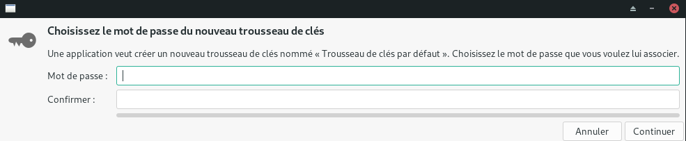{:width="400"}

>Remarque:  
Pour utiliser le déverrouillage automatique, le <u>même mot de passe pour le compte d'utilisateur et le trousseau de clés</u> doivent être définis.  

Lorsque vous utilisez un gestionnaire d'affichage, le trousseau de clés fonctionne immédiatement pour la plupart des cas. Les gestionnaires d'affichage suivants déverrouillent automatiquement le trousseau de clés une fois connecté:

*    GDM
*    LightDM
*    LXDM
*    SDDM 

>Pour GDM et LightDM, notez que le trousseau de clés doit être nommé **login** pour être automatiquement déverrouillé.

Vérifier ou ajouter les lignes qui contiennent *pam_gnome_keyring.so* dans le fichier **/etc/pam.d/lightdm**

```
#%PAM-1.0
auth        include     system-login
-auth       optional    pam_gnome_keyring.so
account     include     system-login
password    include     system-login
session     include     system-login
-session    optional    pam_gnome_keyring.so auto_start
```

**A la prochaine ouverture de session , il faudra saisir le mot de passe du trousseau de clés et cocher la case pour ne plus le resaisir.**

{:width="40"}   
[FS#62140 - [lightdm] gkr-pam: unable to locate daemon control file ](https://bugs.archlinux.org/task/62140)

#### BUG Répétition messages dans le journal (SPAM)

Le journal système est "pollué" sans interruption par des messages 

```
déc. 17 15:29:17 yannick-pc gnome-keyring-daemon[733]: asked to register item /org/freedesktop/secrets/collection/Trousseau_5fde_5fcl_c3_a9s_5fpar_5fd_c3_a9faut/1, but it's already registered
déc. 17 15:29:17 yannick-pc gnome-keyring-daemon[733]: asked to register item /org/freedesktop/secrets/collection/Trousseau_5fde_5fcl_c3_a9s_5fpar_5fd_c3_a9faut/1, but it's already registered
```

#### Correctif messages dans le journal (SPAM) 

Apparemment, les clients construits avec la version v0.9.1 (dernière version décembre 2019) de la bibliothèque Qtkeychain ont tendance à s'appuyer sur **libgnome-keyring** même si nous les avons construits avec **libsecret**. Le passage au maître semble résoudre le problème en raison des récentes corrections apportées à Qtkeychain.

J'ai donc créé une nouvelle version quotidienne d'AppImage du Client, contenant également la correction #1646, construite avec la branche maître de Qtkeychain au lieu de v0.9.1 et l'ai testée avec succès sur Fedora 30 et 31.

Veuillez suivre les étapes suivantes pour vérifier si cela fonctionne aussi pour vous :

    Téléchargez et exécutez la nouvelle AppImage :
    https://download.nextcloud.com/desktop/daily/Linux/Nextcloud-2.7.0.20191130-daily-x86_64.AppImage
    Le Client ne doit vous demander le mot de passe qu'une seule fois, en vous reconnectant.
    Redémarrez le système et vérifiez le résultat

1. Télécharger l'image "nextcloud-client" &rarr; <https://download.nextcloud.com/desktop/daily/Linux/Nextcloud-2.7.0.20191130-daily-x86_64.AppImage>
2. Copier le .appimage dans /usr/local/bin   
`sudo cp Nextcloud-2.7.0.20191130-daily-x86_64.AppImage /usr/local/bin/Nextcloud-client.AppImage`
3. Le rendre exécutable   
`sudo chmod +x /usr/local/bin/Nextcloud-client.AppImage`
4. Créer un nextcloud-client.desktop dans **~/.local/share/applications/** 

    nano ~/.local/share/applications/nextcloud-client.desktop

```
[Desktop Entry]
Categories=Utility; 
Type=Application
Exec=/usr/local/bin/Nextcloud-client.AppImage
Name=Nextcloud appimage sync client 
Comment=Nextcloud appimage synchronization client
Icon=Nextcloud
# Translations
Comment[fr]=Synchronisation avec un serveur Nextcloud
GenericName[fr]=Synchronisation de dossier
Name[fr]=Client de synchronisation Nextcloud
Icon[fr]=Nextcloud
```

Ouvrir le nextcloud-client.desktop  
Paraméter pour un lancement du client nextcloud au démarrage de session  
Ajouter les dossiers à synchroniser  
Si tout est OK  

>Désinstaller nextcloud-client AUR si nécessaire : `yay -R nextcloud-client`  

#### Test nextcloud-client (janvier 2020)

On installe (libcloudproviders-0.3.0-4  qtkeychain-0.10.0-1  nextcloud-client-2.6.2-1)

    yay -S nextcloud-client

Arrêt de la version en cours (appimage)

## Economiseur écran - xscreensaver

*Remplacer économiseur écran xfce4-screensaver par xscreensaver*

Désinstaller

    sudo pacman -R xfce4-screensaver

Installer 

    yay -S xscreensaver

Dans les environnements Xfce, LXDE et LXQt, XScreenSaver démarre automatiquement s'il est disponible - aucune autre action n'est nécessaire.

Dans le menu xfce ,ouvrir "Economiseur d'écran"  
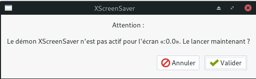{:width="300"}  
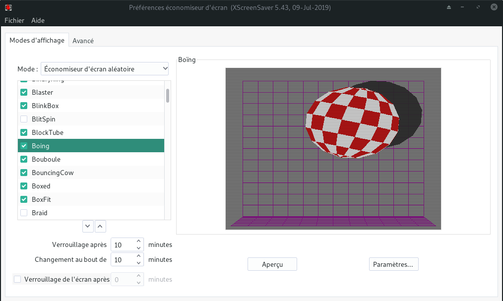{:width="500"}  

Création d'un script pour **Activer/Désactiver** le programme de mise en veille **xscreensaver**  
Prérequis : **zenity** ,installé par défaut sous Manjaro  
Le script **~/scripts/veille.sh**  

```bash
#!/bin/bash
# veille.sh


# Détecter si xscreensaver est actif
if [ "$(pidof -s xscreensaver)" ]; then
    arret=false
    zenity --question --title "veille" --ok-label="Oui" --cancel-label="Non" --text "Economiseur Ecran ACTIF\n\n DESACTIVER ?"
    if [ $? = 0 ]
    then
            echo "ARRET daemon xscreensaver ..."
            xscreensaver-command -exit
            sleep 3
    fi
else
    arret=true
    zenity --question --title "veille" --ok-label="Oui" --cancel-label="Non" --text "Economiseur Ecran NON ACTIF\n\n ACTIVER ?"
    if [ $? = 0 ]
    then
            echo "DEPART daemon xscreensaver ..."
            xscreensaver -nosplash &
            sleep 3
    fi
fi
```

Création lanceur XFCE en utilisant **Editeur de menus** (si "menulibre" installé ou manuellement :  

```bash
mkdir -p ~/.local/share/applications/  #création dossier **applications** si inexistant
nano ~/.local/share/applications/menulibre-veille-ecran.desktop
```

Contenu :

```ini
[Desktop Entry]
Version=1.0
Type=Application
Name=Activer/Désactiver veille écran
Comment=Veille active ou pas par simple clic
Icon=preferences-desktop-screensaver
Exec=sh /home/yannick/scripts/veille.sh
Path=/home/yannick/scripts
NoDisplay=false
Categories=Utility;X-XFCE;X-Xfce-Toplevel;
StartupNotify=false
Terminal=false
```

>Les icônes sont situés sous /usr/share/icons , il suffit de mettre le nom de l'icône choisi sans extension ni chemin pour le paramètre **Icon**

Lancer menu , "Activer/Désactiver veille écran"  
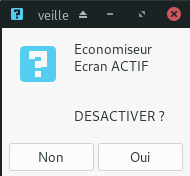{:width="150"}  


## Noyaux linux linux-lts

#### linux-lts

En cas de problème avec les "kernel" , il faut pouvoir se rabattre sur un noyau confirmé (lts)  

Installation noyau lts et entêtes

    sudo pacman -S linux-lts linux-lts-headers

#### Grub 

Il faut modifier le fichier grub pour la prise encharge des 2 noyaux (linux et linux-lts)  

Le fichier de configuration grub

    sudo nano /etc/default/grub

Les lignes modifiées

```
GRUB_DEFAULT=saved
GRUB_TIMEOUT=10 # en secondes ,augmenter temps affichage menu
GRUB_SAVEDEFAULT="true"
```

Pour éviter l'erreur grub **Disk filter writes are not supported** (se produit en présence d'un raid ou d'une partition LVM)   
Solution temporaire à ce problème, éditer **/etc/grub.d/10_linux**  
Remplacer `quick_boot="1"` par `quick_boot="0"`  


Regénérer grub

    sudo grub-mkconfig -o /boot/grub/grub.cfg

```
Found background: /usr/share/backgrounds/xfce/archlinux1024x600.png
Found linux image: /boot/vmlinuz-linux-lts
Found initrd image: /boot/initramfs-linux-lts.img
Found fallback initrd image(s) in /boot: initramfs-linux-lts-fallback.img
Found linux image: /boot/vmlinuz-linux
Found initrd image: /boot/initramfs-linux.img
Found fallback initrd image(s) in /boot: initramfs-linux-fallback.img
done
```

Regénérer la configuration

    sudo grub-mkconfig -o /boot/grub/grub.cfg

**Utilitaire graphique grub-customizer**  

    yay -S grub-customizer

#### Grub default et kernel options (Intel core I3-6100 3.7G)

**Modifier manuellement le choix par défaut de grub**  
Le fichier **/etc/grub.d/10_linux_proxy** contient la définition de tous les noyaux ou OS "bootables"

```
#!/bin/sh
#THIS IS A GRUB PROXY SCRIPT
'/etc/grub.d/proxifiedScripts/linux' | /etc/grub.d/bin/grubcfg_proxy "+*
+#text
+'Arch Linux'~f94e93cefcefc6629826bbcbaa6299f8~
+'SUBMENU' as 'Advanced options for Arch Linux'{+'Advanced options for Arch Linux'/*, +'Advanced options for Arch Linux'/'Arch Linux, with Linux linux-lts'~ac96326cd118f95b94f9e6d2002a4e52~, +'Advanced options for Arch Linux'/'Arch Linux, with Linux linux'~558934a46c603a6862d45f6123412d19~, +'Advanced options for Arch Linux'/'Arch Linux, with Linux linux-lts (fallback initramfs)'~aba62540761441f37733ce7a1148356c~, +'Advanced options for Arch Linux'/'Arch Linux, with Linux linux (fallback initramfs)'~82f47dbd51022daeaf6ae7e84ef921a1~}
```

Pour modifier le "boot" par défaut de grub , éditer la ligne **GRUB_DEFAULT** du fichier **/etc/default/grub ** , on veut démarrer sur le noyau linux-ts ou linux   

    # linux-lts
    GRUB_DEFAULT="Advanced options for Arch Linux>Arch Linux, with Linux linux-lts"
    # linux
    GRUB_DEFAULT="Advanced options for Arch Linux>Arch Linux, with Linux linux"

Pour ajouter des options au noyau kernel , éditer la ligne **GRUB_CMDLINE_LINUX_DEFAULT** du fichier **/etc/default/grub **   
On ajoute `intel_idle.max_cstate=1 i915.enable_dc=0` , pour éviter le [GPU hangs Intel skylake i915](https://bbs.archlinux.org/viewtopic.php?pid=1885271#p1885271)

    GRUB_CMDLINE_LINUX_DEFAULT="loglevel=3 quiet intel_idle.max_cstate=1 i915.enable_dc=0"

Regénérer le grub

    sudo grub-mkconfig -o /boot/grub/grub.cfg

**09/02/2020** , suite au blocage complet ordinateur PC1 avec erreur `[drm:intel_pipe_update_end [i915]] *ERROR* Atomic update failure on pipe A` [Intel microcode & Atomic update failure](https://www.dedoimedo.com/computers/intel-microcode-atomic-update/),modifier les options kernel dans le grub, ajouter `i915.enable_psr=0`.  
Editer la ligne **GRUB_CMDLINE_LINUX_DEFAULT** du fichier **/etc/default/grub **   

    GRUB_CMDLINE_LINUX_DEFAULT="loglevel=3 quiet intel_idle.max_cstate=1 i915.enable_dc=0 i915.enable_psr=0"

Regénérer le grub

    sudo grub-mkconfig -o /boot/grub/grub.cfg

#### Grub default et kernel options (Intel core I5-7500 3.4 GHz)

Pour modifier le "boot" par défaut de grub , éditer la ligne **GRUB_DEFAULT** du fichier **/etc/default/grub ** , on veut démarrer sur le noyau linux-ts ou linux   

    # linux-lts
    GRUB_DEFAULT="Advanced options for Arch Linux>Arch Linux, with Linux linux-lts"
    # linux
    GRUB_DEFAULT="Advanced options for Arch Linux>Arch Linux, with Linux linux"

Pour ajouter des options au noyau kernel , éditer la ligne **GRUB_CMDLINE_LINUX_DEFAULT** du fichier **/etc/default/grub **   

    GRUB_CMDLINE_LINUX_DEFAULT="loglevel=3 quiet"

Regénérer le grub

    sudo grub-mkconfig -o /boot/grub/grub.cfg

## Virtualisation

* [ KVM/QEMU + VMM sur archlinux XFCE](/posts/KVM-QEMU-virtualisation-linux-Virtual-Machine-Manager-VMM-virsh-montage-disque-VDI/#archlinux)
* [PC1 ArchLinux - Machines virtuelles](/posts/KVM-QEMU-PC1-ArchLinux-Machines-Virtuelles/)

### Réseau (Network)

>Les commandes se font en mode su

Après installation on liste les réseaux

    virsh net-list --all

```
 Nom       État      Démarrage automatique   Persistent
---------------------------------------------------------
 br10      actif     no                      Oui
 netv4v6   inactif   no                      Oui
```

Supprimer les configurations réseau 

    virsh net-destroy br10 # si active
    virsh net-undefine br10
    virsh net-undefine netv4v6

Vérifier

    virsh net-list --all

```
 Nom   État   Démarrage automatique   Persistent
--------------------------------------------------
```


### NetworkManager, créer Network Bridge

**Créer un pont réseau (Network Bridge) sur archlinux xfce avec NetworkManager cli**

[NetworkManager - Créer un pont réseau (Network Bridge)](/posts/KVM-QEMU-Network-Bridge-(Pont-reseau)/#avec-networkmanager)


On utilise NetworkManager en ligne de commande avec l'outils `nmcli` 

Création d'un pont avec [STP](https://en.wikipedia.org/wiki/Spanning_Tree_Protocol) désactivé (pour éviter que le pont ne soit annoncé sur le réseau) :

    nmcli connection add type bridge ifname br0 stp no

Faire de l'interface **enp0s31f6** un esclave du pont :

    nmcli connection add type bridge-slave ifname enp0s31f6 master br0

En mettant la connexion existante en position basse (relever le nom de la connexion

    nmcli connection show

```
NAME                  UUID                                  TYPE      DEVICE 
bridge-br0              53443390-8158-41d2-b0f9-084be6e23de2  bridge    br0       
Connexion filaire 1     5af7fd83-74f4-3993-8203-1093967f5377  ethernet  enp0s31f6 
lxcbr0                  7c689de1-d2a2-4af5-93d5-61edd12b67a2  bridge    lxcbr0    
bridge-slave-enp0s31f6  4c351d7a-3aa2-48c6-ba6a-587d7420f627  ethernet  --        
```

Dans notre cas 'Connexion filaire 1'

    nmcli connection down 'Connexion filaire 1'

Mise en place du nouveau pont :

    nmcli connection up bridge-br0

Vérifications

    nmcli connection show

```
NAME                    UUID                                  TYPE      DEVICE    
bridge-br0              53443390-8158-41d2-b0f9-084be6e23de2  bridge    br0       
lxcbr0                  7c689de1-d2a2-4af5-93d5-61edd12b67a2  bridge    lxcbr0    
bridge-slave-enp0s31f6  4c351d7a-3aa2-48c6-ba6a-587d7420f627  ethernet  enp0s31f6 
Connexion filaire 1     5af7fd83-74f4-3993-8203-1093967f5377  ethernet  --        
```

Adresses IP

    ip a

```
1: lo: <LOOPBACK,UP,LOWER_UP> mtu 65536 qdisc noqueue state UNKNOWN group default qlen 1000
    link/loopback 00:00:00:00:00:00 brd 00:00:00:00:00:00
    inet 127.0.0.1/8 scope host lo
       valid_lft forever preferred_lft forever
    inet6 ::1/128 scope host 
       valid_lft forever preferred_lft forever
2: enp0s31f6: <BROADCAST,MULTICAST,UP,LOWER_UP> mtu 1500 qdisc fq_codel master br0 state UP group default qlen 1000
    link/ether 38:d5:47:7c:a0:6c brd ff:ff:ff:ff:ff:ff
3: lxcbr0: <BROADCAST,MULTICAST,UP,LOWER_UP> mtu 1500 qdisc noqueue state UP group default qlen 1000
    link/ether 00:16:3e:00:00:00 brd ff:ff:ff:ff:ff:ff
    inet 10.0.3.1/24 brd 10.0.3.255 scope global lxcbr0
       valid_lft forever preferred_lft forever
    inet6 fe80::216:3eff:fe00:0/64 scope link 
       valid_lft forever preferred_lft forever
4: wg0: <POINTOPOINT,NOARP,UP,LOWER_UP> mtu 1420 qdisc noqueue state UNKNOWN group default qlen 1000
    link/none 
    inet 10.67.125.215/32 scope global wg0
       valid_lft forever preferred_lft forever
    inet6 fc00:bbbb:bbbb:bb01::4:7dd6/128 scope global 
       valid_lft forever preferred_lft forever
5: veth4BXuuW@if2: <BROADCAST,MULTICAST,UP,LOWER_UP> mtu 1500 qdisc noqueue master lxcbr0 state UP group default qlen 1000
    link/ether fe:d5:23:38:7e:46 brd ff:ff:ff:ff:ff:ff link-netnsid 0
    inet6 fe80::fcd5:23ff:fe38:7e46/64 scope link 
       valid_lft forever preferred_lft forever
12: br0: <BROADCAST,MULTICAST,UP,LOWER_UP> mtu 1500 qdisc noqueue state UP group default qlen 1000
    link/ether 1a:87:ed:b7:a5:67 brd ff:ff:ff:ff:ff:ff
    inet 192.168.0.43/24 brd 192.168.0.255 scope global dynamic noprefixroute br0
       valid_lft 43139sec preferred_lft 43139sec
    inet6 2a01:e34:eebf:df0:d71d:1ea9:253:7bf0/64 scope global dynamic noprefixroute 
       valid_lft 86341sec preferred_lft 86341sec
    inet6 fe80::777c:a682:5969:f15/64 scope link noprefixroute 
       valid_lft forever preferred_lft forever
```

**KVM déclarer et activer le pont réseau (Network Bridge)**

Déclarer le pont (bridge) à KVM.  
Créer un fichier de définition de réseau au format XML :

    nano host-bridge.xml

```xml
<network>
  <name>host-bridge</name>
  <forward mode="bridge"/>
  <bridge name="br0"/>
</network>
```

Appliquer la configuration :

    virsh net-define host-bridge.xml
    virsh net-start host-bridge
    virsh net-autostart host-bridge

Tout fonctionne ?

    virsh net-list --all

```
 Nom           État    Démarrage automatique   Persistent
-----------------------------------------------------------
 host-bridge   actif   Oui                     Oui
```

## MAINTENANCE

### PC1 boot UEFI (février 2020)

* [Installer Arch Linux (UEFI LVM)-Lien HS](/files//Installer Arch Linux (UEFI LVM).htm)

#### Boot UEFI sur Disque 120Go

```
[root@yannick-pc yannick]# gdisk /dev/sda
GPT fdisk (gdisk) version 1.0.5

Partition table scan:
  MBR: protective
  BSD: not present
  APM: not present
  GPT: present

Found valid GPT with protective MBR; using GPT.

Command (? for help): p
Disk /dev/sda: 234441648 sectors, 111.8 GiB
Model: CT120BX300SSD1  
Sector size (logical/physical): 512/4096 bytes
Disk identifier (GUID): 2E7D3E67-A473-499C-9193-414E47C07873
Partition table holds up to 128 entries
Main partition table begins at sector 2 and ends at sector 33
First usable sector is 34, last usable sector is 234441614
Partitions will be aligned on 2048-sector boundaries
Total free space is 2925 sectors (1.4 MiB)

Number  Start (sector)    End (sector)  Size       Code  Name
   1            2048         1050623   512.0 MiB   EF00  efi
   2         1050624         1638399   287.0 MiB   8300  boot
   3         1638400       234440703   111.0 GiB   8300  lvm-partition
```

#### GRUB UEFI

* [Ordinateur Bureau PC1 démarrage UEFI (GPT)](404/)

**Rappel installation GRUB UEFI**   
Créer le répertoire /boot/efi/EFI

    mkdir -p /boot/efi/EFI

Installez l’application UEFI GRUB dans /boot/efi/EFI/arch_grub et ses modules dans /boot/grub/x86_64-efi à l’aide de :

    grub-install --target=x86_64-efi --efi-directory=/boot/efi --bootloader-id=arch_grub --recheck

Générer le fichier de configuration principal

    grub-mkconfig -o /boot/grub/grub.cfg

### Problèmes et solutions


#### wireguard

* [Wireguard (archwiki)](https://wiki.archlinux.org/index.php/WireGuard)
* [NetworkManager (archwiki)](https://wiki.archlinux.org/index.php/NetworkManager)
* La gestion wireguard se fait au niveau du noyau kernel , inutile d'installer wireguard-dkms
* Si l'on utilise systemd-network pour gérer le réseau , plus besoin du paquet wireguard-tools


Par contre , il y a des problèmes avec NetworkManager

**NetworkManager - Les itinéraires (routes) sont périodiquement remis à zéro**

Les utilisateurs de NetworkManager doivent s'assurer qu'il ne gère pas les interfaces WireGuard.  
Créer le fichier de configuration suivant

    /etc/NetworkManager/conf.d/unmanaged.conf

```
[keyfile]
unmanaged-devices=interface-name:wg*
```

**NetworkManager - Résolution DNS brisée**

Lorsque l'on fait passer tout le trafic par une interface WireGuard, la connexion peut sembler perdue au bout d'un certain temps ou lors d'une nouvelle connexion.   
Cela peut être dû au fait qu'un gestionnaire de réseau ou un client DHCP écrase le fichier /etc/resolv.conf.

Par défaut, **wg-quick** utilise **resolvconf** pour enregistrer de nouvelles entrées DNS (à partir du mot-clé DNS dans le fichier de configuration).  
Cela causera des problèmes avec les gestionnaires de réseau (NetworkManager,DHCP,etc...) et les clients DHCP qui n'utilisent pas resolvconf, car ils écraseront /etc/resolv.conf, supprimant ainsi les serveurs DNS ajoutés par wg-quick.  

><font color="red">Les utilisateurs doivent savoir que **NetworkManager** n'utilise pas **resolvconf** par défaut.</font>  

* Il est recommandé d'utiliser **systemd-resolvconf**
* Sinon installer **openresolv** et configurez NetworkManager pour qu'il l'utilise


**NetworkManager - Utiliser le résolveur openresolv (ATTENTION DANGER !!!)**

Si openresolv a un abonné pour votre résolveur DNS local (mullvad wireguard utilise **openresolv**), configurez l'abonné et configurez NetworkManager pour utiliser **openresolv**.  

To configure NetworkManager to use openresolv, set main.rc-manager=resolvconf with a configuration file in /etc/NetworkManager/conf.d/:
Pour configurer NetworkManager afin qu'il utilise **openresolv**, définissez `main.rc-manager=resolvconf` avec un fichier de configuration dans **/etc/NetworkManager/conf.d/** :

    /etc/NetworkManager/conf.d/rc-manager.conf

```
[main]
rc-manager=resolvconf
```

Redémarrer le service

    sudo systemctl restart NetworkManager

Test

    dig cinay.xyz |grep -i SERVER

```
;; SERVER: 80.67.169.12#53(80.67.169.12)
```

**Failed to start WireGuard via wg-quick(8) for wg/quick@Aucune.**

Dans le journal

```
mai 04 06:22:52 yannick-pc systemd[1]: Starting WireGuard via wg-quick(8) for wg/quick@Aucune...
mai 04 06:22:52 yannick-pc wg-quick[731]: wg-quick: `wg-quick@Aucune' does not exist
mai 04 06:22:52 yannick-pc systemd[1]: wg-quick@wg-quick@Aucune.service: Main process exited, code=exited, status=1/FAILURE
mai 04 06:22:52 yannick-pc systemd[1]: wg-quick@wg-quick@Aucune.service: Failed with result 'exit-code'.
mai 04 06:22:52 yannick-pc systemd[1]: Failed to start WireGuard via wg-quick(8) for wg/quick@Aucune.
```

Il y a un service `wg-quick@wg-quick@Aucune.service` actif (enabled) qui ne correspond à rien

    systemctl status wg-quick@wg-quick@Aucune.service

```
● wg-quick@wg-quick@Aucune.service - WireGuard via wg-quick(8) for wg/quick@Aucune
     Loaded: loaded (/usr/lib/systemd/system/wg-quick@.service; enabled; vendor preset: disabled)
     Active: failed (Result: exit-code) since Mon 2020-05-04 06:22:52 CEST; 26min ago
   Main PID: 731 (code=exited, status=1/FAILURE)
```

On désactive ce service

    systemctl disable wg-quick@wg-quick@Aucune.service

```
Removed /etc/systemd/system/multi-user.target.wants/wg-quick@wg-quick@Aucune.service.
```

Vérification

    ls /etc/systemd/system/multi-user.target.wants/

```
NetworkManager.service	avahi-daemon.service	borg-backup.service  lxc-net.service  nfs-server.service   remote-fs.target  wg-quick@wg0.service
autofs.service		avahi-dnsconfd.service	mariadb.service  org.cups.cupsd.path  sshd.service
```


#### Failed to load plugin "tumbler-raw-thumbnailer.so

journal

```
mai 04 06:23:48 yannick-pc tumblerd[1220]: Failed to load plugin "tumbler-raw-thumbnailer.so": libopenrawgnome.so.7: cannot open shared object file: No such file or directory
```

Ce plugin est destiné à l'affichage de vignettes de fichiers RAW, et vous devez avoir installé **libopenraw** pour qu'il fonctionne (ce paquet fournit le fichier manquant "libopenrawgnome.so.7", et est listé comme une dépendance optionnelle de tumbler).

#### gnome-keyring-daemon Unsupported or unknown SSH key algorithm ssh-ed25519

Journal

```
mai 04 06:23:50 yannick-pc gnome-keyring-daemon[1000]: Unsupported or unknown SSH key algorithm: ssh-ed25519
mai 04 06:23:50 yannick-pc gnome-keyring-daemon[1000]: Unsupported or unknown SSH key algorithm: ssh-ed25519
mai 04 06:23:50 yannick-pc gnome-keyring-daemon[1000]: Unsupported or unknown SSH key algorithm: ssh-ed25519
mai 04 06:23:50 yannick-pc gnome-keyring-daemon[1000]: Unsupported or unknown SSH key algorithm: ssh-ed25519
```

Supprimer le lancement de gnome-keyring ssh

    sudo rm /etc/xdg/autostart/gnome-keyring-ssh.desktop

#### gnome-keyring-daemon already registered

Journal

```
mai 04 06:23:50 yannick-pc gnome-keyring-daemon[1000]: asked to register item /org/freedesktop/secrets/collection/Trousseau_5fde_5fcl_c3_a9s_5fpar_5fd_c3_a9faut/1, but it's already registered
```

Supprimer le lancement de gnome-keyring ssh

    sudo rm /etc/xdg/autostart/gnome-keyring-ssh.desktop

### Systemd Path Unit (DESACTIVE)

[Systemd Path Unit pour surveiller les fichiers et les répertoires](/posts/Systemd_Path_Unit_pour_surveiller_les_fichiers_et_les_repertoire/)

Les dossiers locaux et distants à synchroniser

Type |Local PC1 | xoyize (paratge NFS)
--- |--- | ---
lsync | ~/media/dplus 	|/srv/data/dplus
lsync | ~/media/devel 	|/srv/data/devel

Créer un script de `/home/yannick/scripts/synchro_local_dplus_vers_srvxo.sh`

```bash
#!/bin/bash
rsync -avz --progress --stats --human-readable  /home/yannick/media/dplus/* /net/srvxo/srv/data/dplus/  
```

Créer un script de `/home/yannick/scripts/synchro_local_devel_vers_srvxo.sh`

```bash
#!/bin/bash
rsync -avz --progress --stats --human-readable  /home/yannick/media/devel/* /net/srvxo/srv/data/devel/  
```

Créer un script de `/home/yannick/scripts/synchro_statique_vers_srvxo.sh`

```bash
#!/bin/bash
rsync -avz --progress --stats --human-readable  /home/yannick/media/dplus/statique/* /net/srvxo/srv/data/dplus/statique/  
```

Rendre les script exécutables  

    chmod +x /home/yannick/scripts/synchro_local_dplus_vers_srvxo.sh
    chmod +x /home/yannick/scripts/synchro_local_devel_vers_srvxo.sh
    chmod +x /home/yannick/scripts/synchro_statique_vers_srvxo.sh

Créer un fichier d'unité de service pour exécuter le script

L'unité de service sera responsable de l'exécution du script lorsque l'unité de chemin observe les modifications dans le dossier local sur le fichier feed.xml

    sudo nano /etc/systemd/system/synchro_dplus.service

```ini
[Unit] 
Description="synchro dplus"
After=network.target

[Service]
ExecStart=/home/yannick/scripts/synchro_local_dplus_vers_srvxo.sh
```

    sudo nano /etc/systemd/system/synchro_devel.service

```ini
[Unit] 
Description="synchro devel"
After=network.target

[Service]
ExecStart=/home/yannick/scripts/synchro_local_devel_vers_srvxo.sh
```

    sudo nano /etc/systemd/system/synchro_statique.service

```ini
[Unit] 
Description="synchro dplus/statique"
After=network.target

[Service]
ExecStart=/home/yannick/scripts/synchro_statique_vers_srvxo.sh
```

Le dernier fichier nécessaire pour terminer notre configuration est le fichier d'unité de chemin lui-même. Le fichier d'unité doit être créé dans le même répertoire que son fichier de service correspondant, /etc/systemd/systemdans ce cas. Il doit également avoir le même nom, mais avec une extension .path.

    sudo nano /etc/systemd/system/synchro_dplus.path

```ini
[Unit]
Description=Modification dossier local dplus

[Path]
PathModified=/home/yannick/media/dplus
Unit=synchro_dplus.service

[Install]
WantedBy=multi-user.target
```

    sudo nano /etc/systemd/system/synchro_devel.path

```ini
[Unit]
Description=Modification dossier local devel

[Path]
PathModified=/home/yannick/media/devel
Unit=synchro_devel.service

[Install]
WantedBy=multi-user.target
```

    sudo nano /etc/systemd/system/synchro_statique.path

```ini
[Unit]
Description=Modification dossier local statique

[Path]
PathModified=/home/yannick/media/dplus/statique
Unit=synchro_statique.service

[Install]
WantedBy=multi-user.target
```

les changements dans le dossier system

    sudo systemctl daemon-reload

Démarrer unité de chemin systemd  

Le démarrer et activer avec systemctl, tout comme un service normal.

    sudo systemctl start synchro_dplus.path
    sudo systemctl enable synchro_dplus.path
    sudo systemctl start synchro_devel.path
    sudo systemctl enable synchro_devel.path
    sudo systemctl start synchro_statique.path
    sudo systemctl enable synchro_statique.path

Vérifier l'état 

    sudo systemctl status synchro_dplus.path

```
● synchro_dplus.path - Modification dossier local dplus
     Loaded: loaded (/etc/systemd/system/synchro_dplus.path; enabled; vendor preset: disabled)
     Active: active (waiting) since Sat 2020-08-08 15:40:09 CEST; 2min 31s ago
   Triggers: ● synchro_dplus.service

août 08 15:40:09 yannick-pc systemd[1]: Started Modification dossier local dplus.
```

    sudo systemctl status synchro_devel.path

```
● synchro_devel.path - Modification dossier local devel
     Loaded: loaded (/etc/systemd/system/synchro_devel.path; enabled; vendor preset: disabled)
     Active: active (waiting) since Sat 2020-08-08 15:40:09 CEST; 3min 3s ago
   Triggers: ● synchro_devel.service

août 08 15:40:09 yannick-pc systemd[1]: Started Modification dossier local devel.
```

    sudo systemctl status synchro_statique.path

```
● synchro_statique.path - Modification dossier local statique
     Loaded: loaded (/etc/systemd/system/synchro_statique.path; enabled; vendor preset: disabled)
     Active: active (waiting) since Sat 2020-08-08 16:18:24 CEST; 48s ago
   Triggers: ● synchro_statique.service

août 08 16:18:24 yannick-pc systemd[1]: Started Modification dossier local statique.
```

Dans un premier temps , on synchronise uniquement dplus/statique  
On désactive les services

    sudo systemctl stop synchro_dplus.path
    sudo systemctl disable synchro_dplus.path
    sudo systemctl stop synchro_devel.path
    sudo systemctl disable synchro_devel.path

Observation des changements sur dplus/statique

    journalctl -f -u synchro_statique.path

On désactive TOUS les services **.path** car la notion de modification de répertoire n'est pas claire
{: .prompt-warning }

    sudo systemctl stop synchro_dplus.path
    sudo systemctl disable synchro_dplus.path
    sudo systemctl stop synchro_devel.path
    sudo systemctl disable synchro_devel.path
    sudo systemctl stop synchro_statique.path
    sudo systemctl disable synchro_statique.path

### Unité sauvegarde /srv/sav

Disponibilités  
L'unité de volume LVM  vg-nas-one  dispose de 3,15To  

Créer un volume logique **sav** au format ext4

    sudo lvcreate -L 500G -n sav vg-nas-one
    sudo mkfs.ext4 /dev/vg-nas-one/sav
    sudo blkid |grep "sav"

```bash
# UUID sav
/dev/mapper/vg--nas--one-sav: UUID="c5b9eefc-1daa-4a0d-8a72-6169b3c8c91f" BLOCK_SIZE="4096" TYPE="ext4"
```

Créer un point de montage local **/srv/sav** et un lien

    sudo mkdir /srv/sav
    sudo ln -s /srv/sav $HOME/sav

Modifier **/etc/fstab** , ajouter ce qui suit

```
# /dev/mapper/vg--nas--one-sav
UUID=c5b9eefc-1daa-4a0d-8a72-6169b3c8c91f       /srv/sav    ext4            defaults        0 2
```

Remontage `sudo mount -a`  et les droits `sudo chown $USER.$USER -R /srv/sav/`  

### Disque USB3 "LaCie"(DESACTIVE)

Vérifier la présence du disque "LaCie"

    lsusb |if grep -q "LaCie"  ;then echo "OK" ;else echo "KO" ;fi

Vérifier si le disque est monté ou pas sur `/mnt/usb3`

    mountpoint /mnt/usb3
    # /mnt/usb3 n'est pas un point de montage

Le disque externe contient un volume physique LVM **hdd-2g** et un volume logique **lvhdd** au format ext4 

    ls /dev/mapper/ |grep 'lvhdd'

hdd--2g-lvhdd

Montage manuel volume logique **lvhdd**

    sudo mount /dev/mapper/hdd--2g-lvhdd /mnt/usb3

Vérifier le point de montage 

    mountpoint /mnt/usb3
    # /mnt/usb3 est un point de montage

**Créer un bash pour monter le disque externe "LaCie"**  
Bash `~/scripts/disque_externe_usb_lacie.sh`

```bash
#!/bin/bash    

# disque_externe_usb_lacie.sh
if [ $# -eq 0 ]
  then
    echo "Syntaxe de la commande : $0 /répertoire_de_montage [-u]"
    echo "-u , démontage"
    exit
fi

# vérifier présence disque externe usb "LaCie"
lsusb |if grep -q "LaCie"  ;then 
    # Disque externe usb présent"
	# vérifier si disque est monté sur "%1"
	if ! mountpoint -q "$1"; then
	    # pas un point de montage
	    # on monte
	    echo "Montage hdd--2g-lvhdd sur $1" &> /dev/null
	    sudo mount /dev/mapper/hdd--2g-lvhdd "$1" 
	    exit 0
	else
	    # si paramètre -u , on démonte
	    if [ "$2" == "-u" ] ;then
	      echo "Démontage $1" &> /dev/null
	      sudo umount "$1"
	    else
	      echo "hdd--2g-lvhdd est déjà monté sur $1" &> /dev/null
	    fi  
	    exit 0
	fi
else
 echo "pas de disque !" &> /dev/null
 exit 1
fi
```

Créer un lien nommé `usbext`

    sudo ln -s /home/yannick/scripts/disque_externe_usb_lacie.sh /usr/local/bin/usbext

Le montage `usbext /mnt/lacie` est utilisé par borg pour la sauvegarde

**Systemd utilisateur "LaCie"**  
*Systemd offre la possibilité d'utiliser des unités dans l'espace de l'utilisateur en lui permettant de démarrer, d'arrêter, d'activer ou de désactiver une unité.*

Créer un service systemd utilisateur pour monter le disque externe USB3 "LaCie", si connecté.   
On fait le montage sur `/mnt/lacie`

Le but est de lancer l'image virtuelle au démarrage de la machine  
Création d'un service utilisateur  

    $ mkdir -p ~/.config/systemd/user
    $ nano ~/.config/systemd/user/mount-lacie.service

```
[Unit]
Description=Montage disque usb lacie

[Service]
Type=oneshot
RemainAfterExit=yes
ExecStart=/usr/local/bin/usbext /mnt/lacie
ExecStop=/usr/local/bin/usbext /mnt/lacie -u

[Install]
WantedBy=default.target
```


*    **ExecStart** permet d'indiquer la commande à exécuter au lancement du service. <u>Ce paramètre est obligatoire</u> pour tout les types de service.
*    **ExecStop** permet d'indiquer une commande a exécuter pour arrêter le service. <u>Ce paramètre est facultatif</u>.
*    **RemainAfterExit** à la valeur "yes" permet d'indiquer que quand la commande de lancement (ExecStart) est terminée, le service est considéré comme toujours lancé. Ce paramètre est très utile pour les services de type "oneshot" qui exécutent une commande à leur lancement (ExecStart) sans qu'il y ait un processus spécifique qui reste en exécution.

Relancer systemd utilisateur

    $ systemctl --user daemon-reload

Démarrer le service

    $ systemctl --user start mount-lacie.service

Status

    $ systemctl --user status mount-lacie.service

```
● mount-lacie.service - Montage disque usb lacie
     Loaded: loaded (/home/yannick/.config/systemd/user/mount-lacie.service; disabled; vendor preset: enabled)
     Active: active (exited) since Thu 2020-08-13 14:21:32 CEST; 11s ago
    Process: 5072 ExecStart=/usr/local/bin/usbext /mnt/lacie (code=exited, status=0/SUCCESS)
   Main PID: 5072 (code=exited, status=0/SUCCESS)

août 13 14:21:32 yannick-pc systemd[924]: Starting Montage disque usb lacie...
août 13 14:21:32 yannick-pc systemd[924]: Finished Montage disque usb lacie.
```

Activation

    $ systemctl --user enable mount-lacie.service

**Les liens "LaCie"**  
Créer les liens avec "LaCie"

```
sudo ln -s /mnt/lacie/data/devel /home/yannick/media/devel
sudo ln -s /mnt/lacie/data/dplus /home/yannick/media/dplus
sudo ln -s /mnt/lacie/data/BiblioCalibre /home/yannick/media/BiblioCalibre
sudo ln -s /mnt/lacie/data/CalibreTechnique /home/yannick/media/CalibreTechnique
sudo ln -s /mnt/lacie/data/music /home/yannick/media/music
```

Liste des liens $HOME/media/

    ls -la $HOME/media/ |grep ^l |awk '{print $9,$10,$11;}'

```bash
BiblioCalibre -> /mnt/lacie/data/BiblioCalibre
CalibreTechnique -> /mnt/lacie/data/CalibreTechnique
devel -> /mnt/lacie/data/devel
dplus -> /mnt/lacie/data/dplus
music -> /mnt/lacie/data/music
```

#### Rsync LaCie Backup

On rend accessible le dossier data : `sudo chown $USER.$USER /mnt/lacie/data/`  
Les scripts de synchronisation entre le disque USB3 "LaCie" et backup xoyaz.xyz  

    nano /mnt/lacie/data/music_backup.sh

```bash
# Synchro music avec Backup - music_backup.sh
rsync -avz --progress --stats --human-readable --delete --rsync-path="sudo rsync" -e "ssh -p 55036 -i /home/yannick/.ssh/OVZ-STORAGE-128 -o StrictHostKeyChecking=no -o UserKnownHostsFile=/dev/null"  /mnt/lacie/data/music/* usernl@xoyaz.xyz:/home/usernl/backup/musique/ 
```

    chmod +x /mnt/lacie/data/music_backup.sh
    nano /mnt/lacie/data/CalibreTechnique_backup.sh

```bash
# Synchro CalibreTechnique avec Backup - CalibreTechnique_backup.sh
rsync -avz --progress --stats --human-readable --delete --rsync-path="sudo rsync" -e "ssh -p 55036 -i /home/yannick/.ssh/OVZ-STORAGE-128 -o StrictHostKeyChecking=no -o UserKnownHostsFile=/dev/null"  /mnt/lacie/data/CalibreTechnique/* usernl@xoyaz.xyz:/home/usernl/backup/CalibreTechnique/ 
```

    chmod +x /mnt/lacie/data/CalibreTechnique_backup.sh
    nano /mnt/lacie/data/BiblioCalibre_backup.sh

```bash
# Synchro BiblioCalibre avec Backup - BiblioCalibre_backup.sh
rsync -avz --progress --stats --human-readable --delete --rsync-path="sudo rsync" -e "ssh -p 55036 -i /home/yannick/.ssh/OVZ-STORAGE-128 -o StrictHostKeyChecking=no -o UserKnownHostsFile=/dev/null"  /mnt/lacie/data/BiblioCalibre/* usernl@xoyaz.xyz:/home/usernl/backup/BiblioCalibre/ 
```

    chmod +x /mnt/lacie/data/BiblioCalibre_backup.sh
    nano /mnt/lacie/data/osm-new_backup.sh

```bash
# Synchro osm-new avec Backup - osm-new_backup.sh
rsync -avz --progress --stats --human-readable --delete --rsync-path="sudo rsync" -e "ssh -p 55036 -i /home/yannick/.ssh/OVZ-STORAGE-128 -o StrictHostKeyChecking=no -o UserKnownHostsFile=/dev/null"  /mnt/lacie/data/devel/ouestline/osm-new/* usernl@xoyaz.xyz:/home/usernl/backup/osm-new/ 
```

    chmod +x /mnt/lacie/data/osm-new_backup.sh
    nano /mnt/lacie/data/ouestline-xoyize.xyz.sh

```bash
# synchro ouestline avec xoyize.xyz - ouestline-xoyize.xyz.sh
rsync -avz --progress --stats --human-readable --delete /mnt/lacie/data/devel/ouestline/* /net/xoyize/data/ouestline/
```

### Conteneur LXC Debian10

[Archlinux conteneur LXC debian 10 (buster) + Jekyll](/posts/Archlinux_conteneur_LXC_debian_10_(buster)/)

### Wireguard(GtkWg)/Mullvad

Désactiver wireguard

    sudo systemctl stop wg-quick@wg0
    sudo systemctl disable wg-quick@wg0

xfce: "Menu -> Paramètres -> Session et démarrage", Démarrage automatique d'applications  
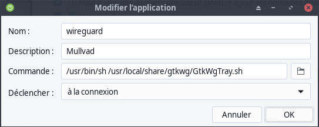{:width="400"}


Soit on installe **mullvad** desktop ou on réactualise **wiregard/mullvad**

#### Mullvad

**Alternative A - Installation binaire**  

[Connexions VPN fournisseur Mullvad](/posts/Mullvad-VPN-IPV4-IPV6/) 

Installation binaire

    yay -S mullvad-vpn-bin openvpn openresolv

Après l’installation, vous devez activer et démarrer le service systemd

    sudo systemctl enable mullvad-daemon.service 
    sudo systemctl start mullvad-daemon.service


**Alternative B - Installation via dépôt deb**   

**desktop**  
Télécharger le .deb depuis le site <https://mullvad.net/fr/download/>  
Le convertir : `debtap -Q MullvadVPN-2020.3_amd64.deb`  
L'installer : `sudo pacman -U mullvad-vpn-2020.3.0-1-x86_64.pkg.tar.xz`

Des liens sont créés

```
/etc/systemd/system/multi-user.target.wants/mullvad-daemon.service -> '/opt/Mullvad VPN/resources/mullvad-daemon.service'
/etc/systemd/system/mullvad-daemon.service -> '/opt/Mullvad VPN/resources/mullvad-daemon.service'
```

Structure dossier **/opt/Mullvad VPN/**

```
[yannick@yannick-pc ~]$ tree -L 2 /opt/Mullvad\ VPN/
/opt/Mullvad VPN/
├── LICENSE.electron.txt
├── LICENSES.chromium/
├── chrome_100_percent.pak
├── chrome_200_percent.pak
├── icudtl.dat
├── libEGL.so
├── libGLESv2.so
├── libffmpeg.so
├── locales
│   ├── en-GB.pak
│   ├── en-US.pak
│   └── fr.pak
├── mullvad-gui
├── mullvad-vpn
├── natives_blob.bin
├── resources
│   ├── CHANGELOG.md
│   ├── api_root_ca.pem
│   ├── app.asar
│   ├── ca.crt
│   ├── libtalpid_openvpn_plugin.so
│   ├── mullvad-daemon
│   ├── mullvad-daemon.conf
│   ├── mullvad-daemon.service
│   ├── mullvad-problem-report
│   ├── openvpn
│   ├── relays.json
│   └── sslocal
├── resources.pak
├── snapshot_blob.bin
├── swiftshader
│   ├── libEGL.so
│   ├── libGLESv2.so
│   └── libvk_swiftshader.so
└── v8_context_snapshot.bin
```

#### GtkWg - Wiregard/Mullvad

[Générateur de fichier de configuration WireGuard](https://mullvad.net/fr/account/#/wireguard-config/?platform=linux)

{:width="400"}   
Clé publique **h7hl1V9H0cC66XBS7uzWBxiouQS77M+Nabq38VkFoho=**

>REMARQUE Nous n'avons jamais accès à votre clé privée, seule la clé publique nous est envoyée. La clé privée est stockée localement dans votre navigateur afin que vous puissiez créer plusieurs fichiers à partir de la même clé et dès que vous quittez cette page, elle est supprimée.

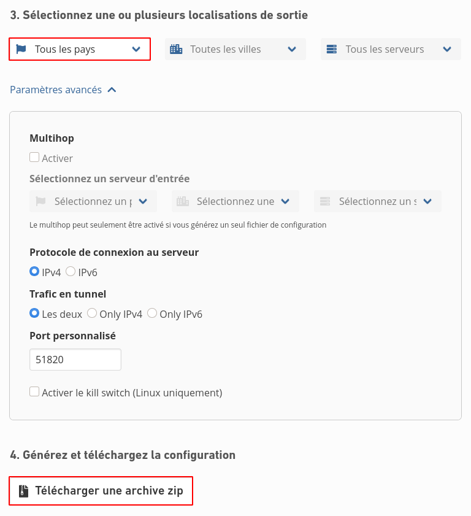{:width="400"}  
Télécharger l'archive ZIP **mullvad_wireguard_linux_all_all.zip** dans le dossier `/home/yannick/Private/` et décompresser l'archive  
Effacer les anciennes configurations : `rm /usr/local/share/gtkwg/mullvad_config_linux_all/*.conf`  
Copier les nouvelles configurations : `cp /home/yannick/Private/mullvad/*.conf /usr/local/share/gtkwg/mullvad_config_linux_all/`

Vérifier la configuration serveur existante

    cat /usr/local/share/gtkwg/data/wg-config.json |jq

```json
{
  "gtkwg_version": "1.1",
  "gtkwg_date": "19/06/2020",
  "wg_client_service": "wg-quick@wg0",
  "chemin_path_conf_wg": "mullvad_config_linux_all/",
  "chemin_path_flag": "flags/",
  "wg_chemin_json": "data/",
  "wg0_conf": "/etc/wireguard/wg0.conf",
  "wg_actif_conf": "mullvad-fr7",
  "wg_actif_pays": "France",
  "wg_actif_flag": "fr.png"
}
```

Réactualiser la configuration serveur

    sudo cp /usr/local/share/gtkwg/mullvad_config_linux_all/mullvad-fr7.conf /etc/wireguard/wg0.conf

Si mullvad desktop est installé : `yay -R mullvad-bin`  
Réactiver wireguard

    sudo systemctl start wg-quick@wg0
    sudo systemctl enable wg-quick@wg0

xfce: "Menu -> Paramètres -> Session et démarrage", Démarrage automatique d'applications  
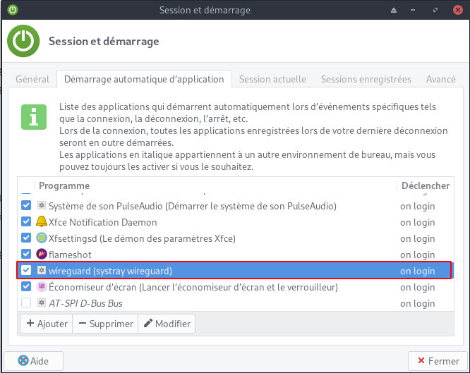{:width="400"}

Fermer la session puis la réouvrir

## BOX Internet (Free)

Paramètres - Réseau Local &rarr; DHCP

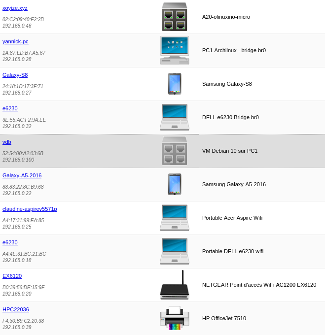{:width=450}  
Baux statiques


Paramètres - Connexion Internet &rarr; Configuration IPV6

Attention si vous configurez un Next Hop pour le premier subnet, il ne sera plus annoncé par la Freebox sur votre réseau. Cela empêchera les appareils dépendant d’IPv6 de fonctionner sans un routeur tiers qui gère ce subnet.{: .prompt-warning }

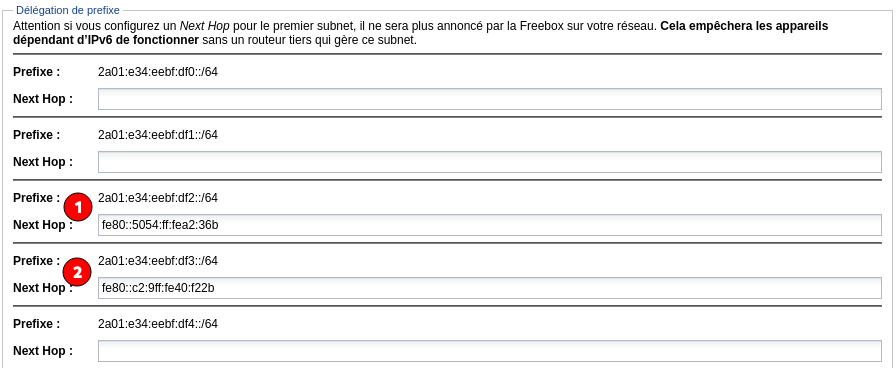{:width=600}  


|N°| Désignation       | domaine | Réseau | Mac Address | IPV4 | IPV6 | Next Hop|
|-|-------------------|---------|--------|-------------|------|------|---------|
|1| VM Debian10/PC1 | | enp1s0 | 52:54:00:a2:03:6b |192.168.0.100/24|2a01:e34:eebf:df2::1/64|fe80::5054:ff:fea2:36b/64|
|2|A20-Olinuxino-Micro| xoyize.xyz|  eth0| 02:c2:09:40:f2:2b| 192.168.0.46/24| 2a01:e34:eebf:df3::1/64| fe80::c2:9ff:fe40:f22b/64|

Adresse IPV6 lien local : fe80::224:d4ff:fea6:aa20

## SYNTHESE  - 06//11/2020

#### Paramétrage XFCE


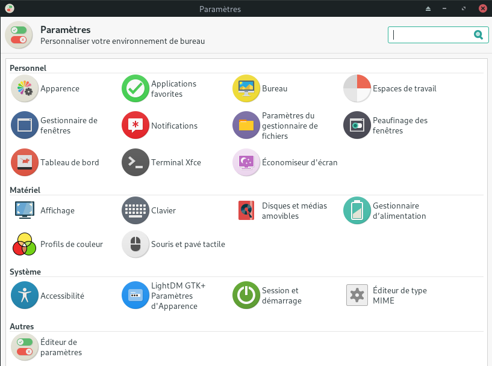{:width="400"}  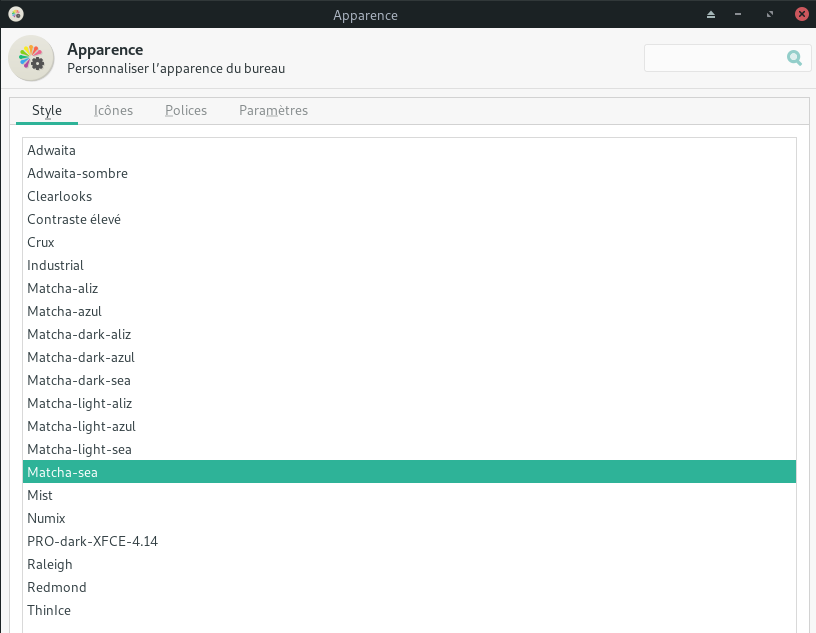{:width="400"}  
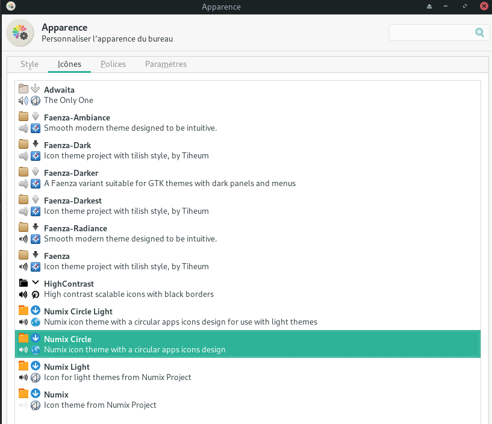{:width="400"}  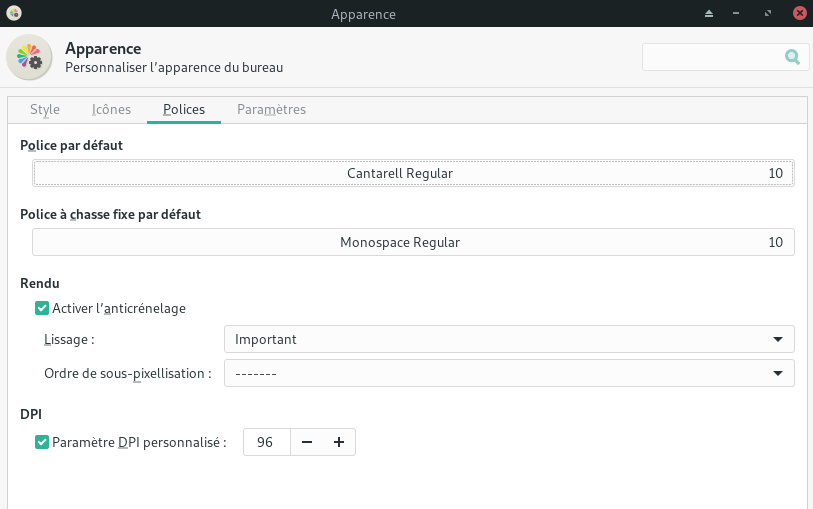{:width="400"}  
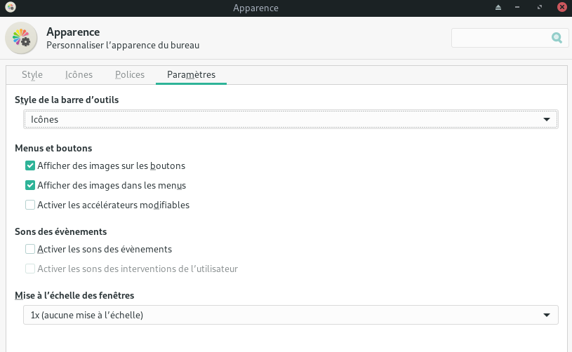{:width="400"}  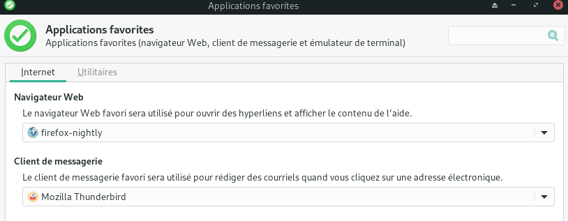{:width="400"}  
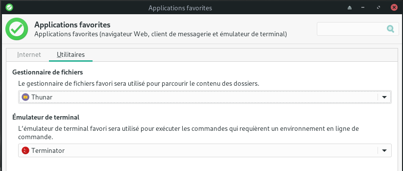{:width="400"}  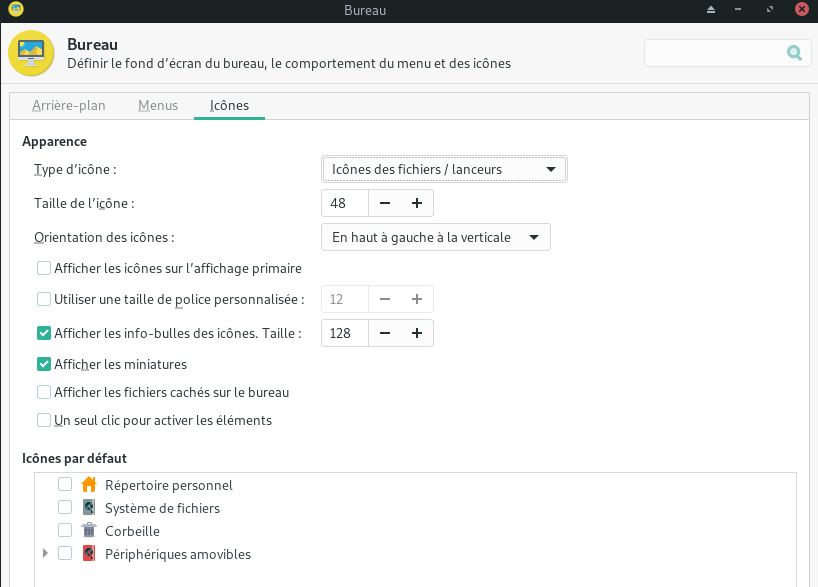{:width="400"}  
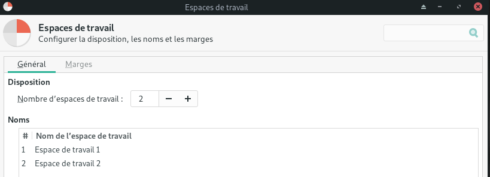{:width="400"}  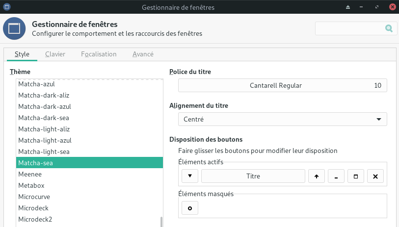{:width="400"}  
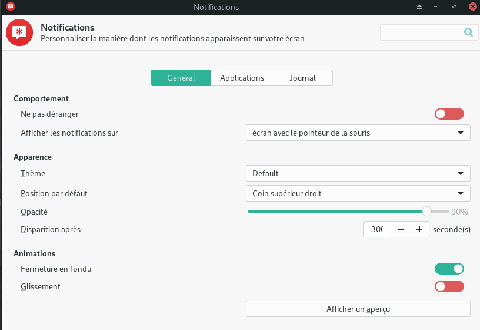{:width="400"}  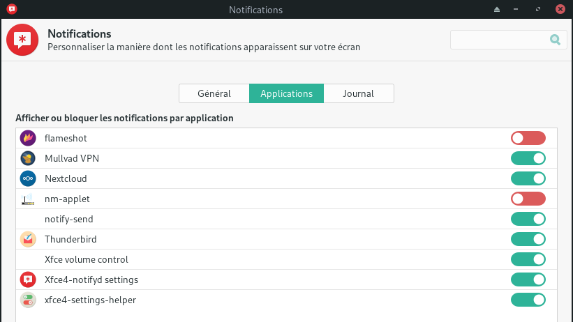{:width="400"}  
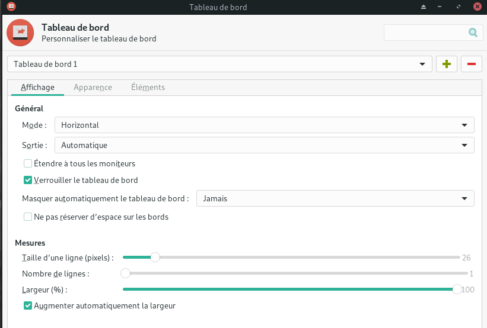{:width="400"}  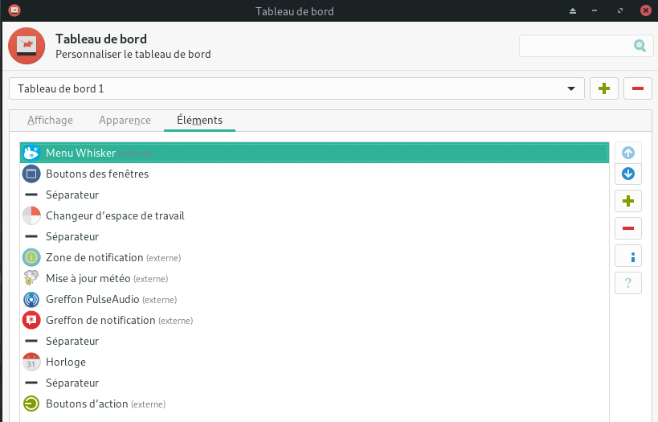{:width="400"}  
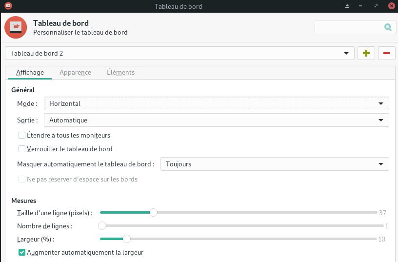{:width="400"}  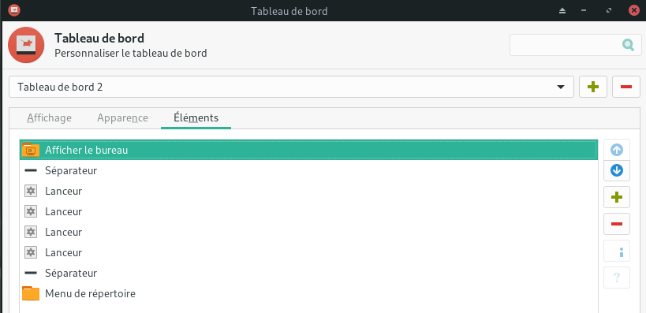{:width="400"}  
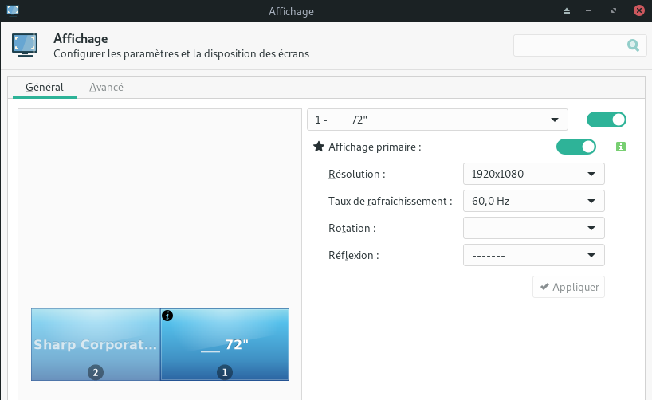{:width="400"}  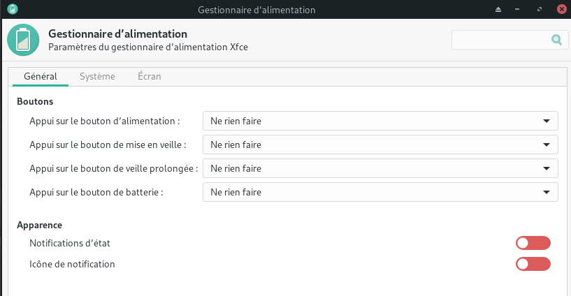{:width="400"}  
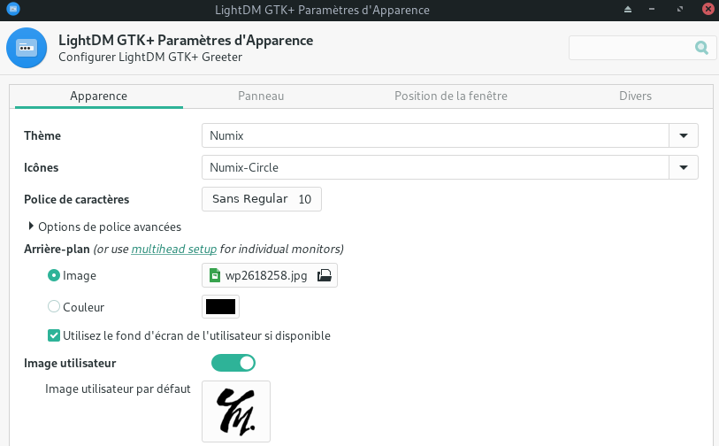{:width="400"}  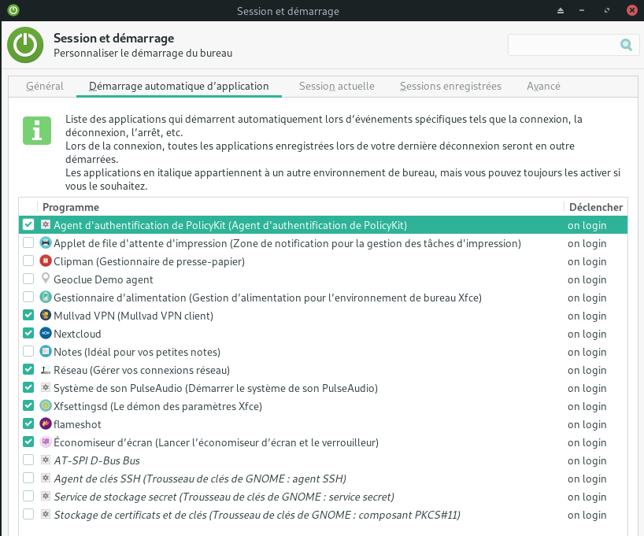{:width="400"}  


#### LVM (pvs vgs et lvs)

```
[root@yannick-pc yannick]# pvs
  PV         VG         Fmt  Attr PSize    PFree
  /dev/sda3  ct120bx    lvm2 a--  <111,01g    0 
  /dev/sdb1  ssd-512    lvm2 a--  <476,94g    0 
  /dev/sdc3  vg-nas-one lvm2 a--    <3,64t 2,66t
  /dev/sdd1  hdd-2g     lvm2 a--    <1,82t    0 
[root@yannick-pc yannick]# vgs
  VG         #PV #LV #SN Attr   VSize    VFree
  ct120bx      1   1   0 wz--n- <111,01g    0 
  hdd-2g       1   1   0 wz--n-   <1,82t    0 
  ssd-512      1   1   0 wz--n- <476,94g    0 
  vg-nas-one   1   2   0 wz--n-   <3,64t 2,66t
[root@yannick-pc yannick]# lvs
  LV      VG         Attr       LSize    Pool Origin Data%  Meta%  Move Log Cpy%Sync Convert
  root    ct120bx    -wi-ao---- <111,01g                                                    
  lvhdd   hdd-2g     -wi-ao----   <1,82t                                                    
  virtuel ssd-512    -wi-ao---- <476,94g                                                    
  sav     vg-nas-one -wi-ao----  500,00g                                                    
  yanplus vg-nas-one -wi-ao----  500,00g             
```

#### /etc/fstab, fdisk , lsblk

```
[root@yannick-pc yannick]# cat /etc/fstab
# /dev/mapper/ct120bx-root
UUID=1cb72c0a-defd-407d-9a74-3e6f6f2e8ca2	/         	ext4      	rw,relatime	0 1

# /dev/sda2
UUID=c34e370e-0bef-4b1b-847a-72516bc116dd	/boot     	ext2      	rw,relatime,stripe=4	0 2

# /dev/sda1
UUID=3D7B-0416      	/boot/efi 	vfat      	rw,relatime,fmask=0022,dmask=0022,codepage=437,iocharset=iso8859-1,shortname=mixed,utf8,errors=remount-ro	0 2

# /dev/mapper/vg--nas--one-yanplus
UUID=c6ab468e-ed7b-491e-b7c3-010a70816d0c	/home/yannick/media	ext4    	defaults	0 2

# 
# /dev/mapper/ssd--512-virtuel
UUID=84bc1aa9-23ac-4530-b861-bc33171b7b42	/srv/virtuel    ext4    	defaults	0 2

# /dev/mapper/vg--nas--one-sav
UUID=c5b9eefc-1daa-4a0d-8a72-6169b3c8c91f       /srv/sav    ext4            defaults        0 2

# Montage disque mobile hdd 2G
UUID=1fa41668-dfd3-476b-8bf9-387d172c7db5	/srv/hdd2g	ext4	defaults	0 2

# Montage pour le conteneur debian-10
/srv/hdd2g/data/devel /var/lib/lxc/debian-10/rootfs/home/lxcdeb/devel  none bind 0 0
# dossier data du serveur xoyize.xyz
# dossiers _posts ,images et files
/home/yannick/media/statique /var/lib/lxc/debian-10/rootfs/home/lxcdeb/statique  none bind 0 0
```

fdisk

```
[root@yannick-pc yannick]# fdisk -l |grep "Disque /dev"
Disque /dev/sda : 111,79 GiB, 120034123776 octets, 234441648 secteurs
Disque /dev/sdb : 476,94 GiB, 512110190592 octets, 1000215216 secteurs
Disque /dev/sdc : 3,64 TiB, 4000787030016 octets, 7814037168 secteurs
Disque /dev/sdd : 1,82 TiB, 2000398934016 octets, 3907029168 secteurs
Disque /dev/mapper/ct120bx-root : 111,01 GiB, 119193731072 octets, 232800256 secteurs
Disque /dev/mapper/ssd--512-virtuel : 476,94 GiB, 512107741184 octets, 1000210432 secteurs
Disque /dev/mapper/vg--nas--one-yanplus : 500 GiB, 536870912000 octets, 1048576000 secteurs
Disque /dev/mapper/vg--nas--one-sav : 500 GiB, 536870912000 octets, 1048576000 secteurs
Disque /dev/mapper/hdd--2g-lvhdd : 1,82 TiB, 2000393601024 octets, 3907018752 secteurs
```


lsblk

```
NAME                     MAJ:MIN RM   SIZE RO TYPE MOUNTPOINT
sda                        8:0    0 111,8G  0 disk 
├─sda1                     8:1    0   512M  0 part /boot/efi
├─sda2                     8:2    0   287M  0 part /boot
└─sda3                     8:3    0   111G  0 part 
  └─ct120bx-root         254:0    0   111G  0 lvm  /
sdb                        8:16   0 476,9G  0 disk 
└─sdb1                     8:17   0 476,9G  0 part 
  └─ssd--512-virtuel     254:1    0 476,9G  0 lvm  /srv/virtuel
sdc                        8:32   0   3,6T  0 disk 
├─sdc1                     8:33   0    50M  0 part 
└─sdc3                     8:35   0   3,6T  0 part 
  ├─vg--nas--one-yanplus 254:2    0   500G  0 lvm  /home/yannick/media
  └─vg--nas--one-sav     254:3    0   500G  0 lvm  /srv/sav
sdd                        8:48   0   1,8T  0 disk 
└─sdd1                     8:49   0   1,8T  0 part 
  └─hdd--2g-lvhdd        254:4    0   1,8T  0 lvm  /srv/hdd2g
```

#### Liste des liens (/usr/local/bin/) et alias

    ls -l /usr/local/bin/ |grep '^l' | awk '{print $9, " ", $10, $11;}'

```
allsync   -> /home/yannick/scripts/all-synchro.sh
borglist   -> /home/yannick/scripts/borglist
pdfdim   -> /home/yannick/scripts/compress
postman   -> /opt/Postman/Postman
usbext   -> /home/yannick/scripts/disque_externe_usb_lacie.sh
wing-personal7.1   -> ../../../opt/wing-personal/wing-personal
```

Alias

```
[yannick@yannick-pc ~]$ alias
alias audio='youtube-dl --extract-audio --audio-format m4a --audio-quality 0 --output "~/Musique/%(title)s.%(ext)s"'
alias audiomp3='youtube-dl --extract-audio --audio-format m4a --audio-quality 0 --output "~/Musique/%(title)s.%(ext)s"'
alias cryfs-autostart='/home/yannick/scripts/cryfs-autostart'
alias dnsleak='/home/yannick/scripts/dnsleaktest.sh'
alias ls='ls --color=auto'
alias nmapl='sudo nmap -T4 -sP 192.168.0.0/24'
alias odt/='/home/yannick/Documents/odt/+index/_odt/+index'
alias otp='/home/yannick/scripts/generer-code-2fa-vers-presse-papier-toutes-les-30s.sh'
alias posturl='/home/yannick/scripts/posturl'
alias rename='/home/yannick/scripts/remplacer-les-espaces-accents-dans-une-expression.sh'
alias sshm='/home/yannick/scripts/ssh-manager.sh'
alias sshsyn='/home/yannick/scripts/synchro-ssh-xoyize.xyz.sh'
alias sslxc='/home/yannick/scripts/sslxc'
alias ssvbox='/home/yannick/scripts/ssvbox'
alias static='sshm lxcdeb exe '\''sudo journalctl -f -u yannstatic.service'\'''
alias synchro='sshm lxcdeb exe '\''sudo journalctl -f -u synchro_site.service'\'''
alias tmuxssh='/home/yannick/scripts/tmux-ssd.sh'
alias traduc='/home/yannick/scripts/traduction-page-internet'
alias wgkey='/home/yannick/scripts/generer_jeu_cle_wireguard.sh'
alias youtube='youtube-dl -f "bestvideo[ext=mp4]+bestaudio[ext=m4a]/best[ext=mp4]/best" --output "~/Vidéos/%(title)s.%(ext)s" --ignore-errors'
```

### Applis dépot aur

```
birdtray
brave-bin
firefox-nightly-fr
freetube-bin
tor-browser
yay-bin
```

