+++
title = 'OVH vps506197 Debian 10 - REINSTALL yunohost nextcloud static ttrss -cinay.eu'
date = 2020-11-18 00:00:00 +0100
categories = ['yunohost']
+++
{:width="60"}

*OVH KVM OpenStack vps506197 (1 vCore 2.4Ghz/4Go Ram/20Go SSD/Local Raid10/Strasbourg)*

## réseau et domaine 

{:width="70"}  

Debian Buster  
PARAMETRES D'ACCES:  
L'adresse IPv4 du VPS est : 164.132.104.145  
L'adresse IPv6 du VPS est : 2001:41d0:0401:3200::06e7  

Le nom du VPS est : vps506197.ovh.net  
Connexion SSH en "root" ( H2eHmVmw )

    ssh root@164.132.104.145


#### Réseau

Créer un bash pour désactiver l'initialisation réseau par le cloud sur le VPS OVH  

    nano initres.sh

```bash
#!/bin/bash
#
# To disable cloud-init's network configuration capabilities, write a file
# /etc/cloud/cloud.cfg.d/99-disable-network-config.cfg with the following:
# network: {config: disabled}
#
#Création du fichier **/etc/cloud/cloud.cfg.d/99-disable-network-config.cfg** en mode su
echo "network: {config: disabled}" > /etc/cloud/cloud.cfg.d/99-disable-network-config.cfg
#
# Effacerle fichier /etc/network/interfaces  
rm /etc/network/interfaces
# Recréer le fichier /etc/network/interfaces
cat > /etc/network/interfaces << EOF
auto lo
iface lo inet loopback

auto eth0
iface eth0 inet dhcp
iface eth0 inet6 static
 address 2001:41d0:0401:3200::06e7
 netmask 128
 post-up /sbin/ip -6 route add 2001:41d0:0401:3200::1 dev eth0
 post-up /sbin/ip -6 route add default via 2001:41d0:0401:3200::1 dev eth0
 pre-down /sbin/ip -6 route del default via 2001:41d0:0401:3200::1 dev eth0
 pre-down /sbin/ip -6 route del 2001:41d0:0401:3200::1 dev eth0
EOF
#
# Configuration OVH à modifier /etc/cloud/cloud.cfg 
sed -i 's/preserve_hostname: false/preserve_hostname: true/g' /etc/cloud/cloud.cfg
sed -i 's/manage_etc_hosts: true/manage_etc_hosts: false/g' /etc/cloud/cloud.cfg
#
# Redémarrage de la machine
systemctl reboot

```

Droits et exécution

    chmod +x initres.sh && ./initres.sh

Patienter quelques minutes avant la reconnexion...

Se connecter en root via SSH  

    ssh root@164.132.104.145

Vérifier le réseau `ip a` et noyau `uname -r`

```bash
1: lo: <LOOPBACK,UP,LOWER_UP> mtu 65536 qdisc noqueue state UNKNOWN group default qlen 1000
    link/loopback 00:00:00:00:00:00 brd 00:00:00:00:00:00
    inet 127.0.0.1/8 scope host lo
       valid_lft forever preferred_lft forever
    inet6 ::1/128 scope host 
       valid_lft forever preferred_lft forever
2: eth0: <BROADCAST,MULTICAST,UP,LOWER_UP> mtu 1500 qdisc pfifo_fast state UP group default qlen 1000
    link/ether fa:16:3e:f1:2a:30 brd ff:ff:ff:ff:ff:ff
    inet 164.132.104.145/32 brd 164.132.104.145 scope global dynamic eth0
       valid_lft 86295sec preferred_lft 86295sec
    inet6 2001:41d0:401:3200::6e7/128 scope global 
       valid_lft forever preferred_lft forever
    inet6 fe80::f816:3eff:fef1:2a30/64 scope link 
       valid_lft forever preferred_lft forever
```

1: lo: <LOOPBACK,UP,LOWER_UP> mtu 65536 qdisc noqueue state UNKNOWN group default qlen 1000
    link/loopback 00:00:00:00:00:00 brd 00:00:00:00:00:00
    inet 127.0.0.1/8 scope host lo
       valid_lft forever preferred_lft forever
    inet6 ::1/128 scope host 
       valid_lft forever preferred_lft forever
2: eth0: <BROADCAST,MULTICAST,UP,LOWER_UP> mtu 1500 qdisc pfifo_fast state UP group default qlen 1000
    link/ether fa:16:3e:71:fa:d6 brd ff:ff:ff:ff:ff:ff
    inet 164.132.104.145/32 brd 164.132.104.145 scope global dynamic eth0
       valid_lft 86144sec preferred_lft 86144sec
    inet6 2001:41d0:401:3200::6e7/128 scope global 
       valid_lft forever preferred_lft forever
    inet6 fe80::f816:3eff:fe71:fad6/64 scope link 
       valid_lft forever preferred_lft forever


#### domaine cinay.eu

{:width="50"}


Zone dns OVH

Si vous utilisez des sous-domaines de type xxx.cinay.eu , vous devez renseigner chaque sous-domaine avec la directive `CNAME`
{: .prompt-warning }

Liste des sous-domaines (novembre 2020)

```
  - cinay.eu
  - yanfi.net
  - wg.cinay.eu
  - div.cinay.eu
  - zic.cinay.eu
  - gitea.cinay.eu
  - static.cinay.eu
```

Zone DNS OVH

```
$TTL 3600
@	IN SOA dns100.ovh.net. tech.ovh.net. (2020111200 86400 3600 3600000 300)
                         IN NS     dns100.ovh.net.
                         IN NS     ns100.ovh.net.
                         IN MX     10 cinay.eu.
                         IN A      164.132.104.145
                         IN AAAA   2001:41d0:401:3200::6e7
                         IN CAA    128 issue "letsencrypt.org"
                     600 IN TXT    "v=spf1 a mx -all"
*                        IN A      164.132.104.145
*                        IN AAAA   2001:41d0:401:3200::6e7
_dmarc                   IN TXT    "v=DMARC1;p=none;"
_xmpp-client._tcp        IN SRV    0 5 5222 cinay.eu.
_xmpp-server._tcp        IN SRV    0 5 5269 cinay.eu.
div                      IN CNAME  cinay.eu.
gitea                    IN CNAME  cinay.eu.
gitlab                   IN CNAME  cinay.eu.
mail._domainkey          IN TXT    ( "v=DKIM1;h=sha256;k=rsa;p=MIGfMA0GCSqGSIb3DQEBAQUAA4GNADCBiQKBgQC8NXuslInklnSY2NdkXQcAUtaXjIDKBfiEmXJbWNlALRKs/dY5aE9u08IHaoqp8NpnwpL9DR5jlyhihah6eDQxGa704WPf7Talv4VVfMhvfapSJ0xQhyiOoZys/FP+iqL2gdlG+mwDAyE3iSQoLZi9LBniRRdojdefPACyiUGkeQIDAQAB;" )
muc                      IN CNAME  cinay.eu.
pubsub                   IN CNAME  cinay.eu.
static                   IN CNAME  cinay.eu.
vjud                     IN CNAME  cinay.eu.
wg                       IN CNAME  cinay.eu.
xmpp-upload              IN CNAME  cinay.eu.
yanfi                    IN CNAME  login.tutanota.com.
zic                      IN CNAME  cinay.eu.
```

Reverse DNS sur "server" , IP 164.132.104.145 &rarr; cinay.eu  
Reverse DNS sur "server" , 2001:41d0:401:3200::6e7 &rarr; cinay.eu 

Test reverse DNS : `dig -x 164.132.104.145` et `dig -x 2001:41d0:401:3200:0:0:0:6e7`

Hostname

    hostnamectl set-hostname cinay.eu
    hostnamectl

```bash
   Static hostname: cinay.eu
         Icon name: computer-vm
           Chassis: vm
        Machine ID: 0ef30511d74646618d92e464efb187ce
           Boot ID: 8c555dba579c417088eb060960c3c238
    Virtualization: kvm
  Operating System: Debian GNU/Linux 10 (buster)
            Kernel: Linux 5.6.0-2-cloud-amd64
      Architecture: x86-64
```

## Yunohost

Une fois que vous avez accès à votre serveur (directement ou par SSH), vous pouvez installer YunoHost en exécutant cette commande en tant que root :

    curl https://install.yunohost.org | bash

Post-installation

    yunohost tools postinstall

```bash
Success! YunoHost is now configured
Warning: The post-install completed! To finalize your setup, please consider:
    - adding a first user through the 'Users' section of the webadmin (or 'yunohost user create <username>' in command-line);
    - diagnose potential issues through the 'Diagnosis' section of the webadmin (or 'yunohost diagnosis run' in command-line);
    - reading the 'Finalizing your setup' and 'Getting to know Yunohost' parts in the admin documentation: https://yunohost.org/admindoc.
```

### Créer un utilisateur (yunohost)

    yunohost user create yann

```bash
First name: yann
Last name: cinayeu
E-mail address: yann@cinay.eu
You are now about to define a new user password. The password should be at least 8 characters long—though it is good practice to use a longer password (i.e. a passphrase) and/or to a variation of characters (uppercase, lowercase, digits and special characters).
Password: 
Confirm password: 
Success! User created
fullname: yann cinayeu
mail: yann@cinay.eu
username: yann
```

Ajout des alias messagerie

    yunohost user update yann --add-mailalias discord@cinay.eu wg@cinay.eu vps@cinay.eu vpn@cinay.eu

```
Success! User info changed
firstname: yann
fullname: yann cinayeu
lastname: cinayeu
mail: yann@cinay.eu
mail-aliases: 
  - root@cinay.eu
  - admin@cinay.eu
  - webmaster@cinay.eu
  - postmaster@cinay.eu
  - boproyan@cinay.eu
  - discord@cinay.eu
  - wg@cinay.eu
  - vps@cinay.eu
  - vpn@cinay.eu
mailbox-quota: 
  limit: No quota
  use: 143.0K
username: yann
```

### Administration

**Configuration DNS**

    yunohost domain cinay.eu dnsconf

```bash
; Basic ipv4/ipv6 records
@ 3600 IN A 164.132.104.145
@ 3600 IN AAAA 2001:41d0:401:3200::6e7

; XMPP
_xmpp-client._tcp 3600 IN SRV 0 5 5222 cinay.eu.
_xmpp-server._tcp 3600 IN SRV 0 5 5269 cinay.eu.
muc 3600 IN CNAME @
pubsub 3600 IN CNAME @
vjud 3600 IN CNAME @
xmpp-upload 3600 IN CNAME @

; Mail
@ 3600 IN MX 10 cinay.eu.
@ 3600 IN TXT "v=spf1 a mx -all"
mail._domainkey 3600 IN TXT "v=DKIM1; h=sha256; k=rsa; p=MIGfMA0GCSqGSIb3DQEBAQUAA4GNADCBiQKBgQC8NXuslInklnSY2NdkXQcAUtaXjIDKBfiEmXJbWNlALRKs/dY5aE9u08IHaoqp8NpnwpL9DR5jlyhihah6eDQxGa704WPf7Talv4VVfMhvfapSJ0xQhyiOoZys/FP+iqL2gdlG+mwDAyE3iSQoLZi9LBniRRdojdefPACyiUGkeQIDAQAB"
_dmarc 3600 IN TXT "v=DMARC1; p=none"

; Extra
* 3600 IN A 164.132.104.145
* 3600 IN AAAA 2001:41d0:401:3200::6e7
@ 3600 IN CAA 128 issue "letsencrypt.org"
```

Se connecter à l'espace client du site OVH : **Web cloud &rarr; Domaines &rarr; xoyize.xyz &rarr; Zone DNS**  
Cliquer sur **"Modifier en mode textuel"**, garder les 4 premières lignes :  
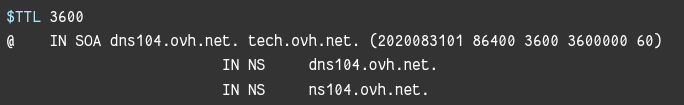{:width="600"}  
puis effacer tout ce qu'il y a en-dessous, et le remplacer par la configuration donnée par votre serveur ( `yunohost domain dns-conf`)

**Certificats SSL**   
Installer un certificat Let's Encrypt en ligne de commande

    yunohost domain cert-install --no-checks

```bash
Info: Now attempting install of certificate for domain cinay.eu!
Success! Configuration updated for 'dnsmasq'
Warning: No diagnosis cache yet for category 'dnsrecords'
Warning: Subdomain 'xmpp-upload.cinay.eu' does not resolve to the same IP address as 'cinay.eu'. Some features will not be available until you fix this and regenerate the certificate.
Info: Parsing account key...
Info: Parsing CSR...
Info: Found domains: cinay.eu
Info: Getting directory...
Info: Directory found!
Info: Registering account...
Info: Registered!
Info: Creating new order...
Info: Order created!
Info: Verifying cinay.eu...
Info: cinay.eu verified!
Info: Signing certificate...
Info: Certificate signed!
Success! Configuration updated for 'nginx'
Success! Let's Encrypt certificate now installed for the domain 'cinay.eu'
```

### Utilisateur "debian"

Modifier le mot de passe de l'utilisateur existant **debian**  

    passwd debian 

Visudo pour les accès root via utilisateur **debian**  

    echo "debian     ALL=(ALL) NOPASSWD: ALL" >> /etc/sudoers

Le mot de passe root idem admin yunohost


### Historique de la ligne de commande

Ajoutez la recherche d’historique de la ligne de commande au terminal  
Se connecter en utilisateur debian  
Tapez un début de commande précédent, puis utilisez shift + up (flèche haut) pour rechercher l’historique filtré avec le début de la commande.

```bash
# Global, tout utilisateur
echo '"\e[1;2A": history-search-backward' | sudo tee -a /etc/inputrc
echo '"\e[1;2B": history-search-forward' | sudo tee -a /etc/inputrc
exit
```

### OpenSSH, clé et script

{:width="100"}  
**connexion avec clé**  
<u>sur l'ordinateur de bureau</u>
Générer une paire de clé curve25519-sha256 (ECDH avec Curve25519 et SHA2) nommé **kvm-cinay** pour une liaison SSH avec le serveur KVM.  

    ssh-keygen -t ed25519 -o -a 100 -f ~/.ssh/kvm-vps506197

Envoyer la clé publique sur le serveur KVM   

    scp ~/.ssh/kvm-vps506197.pub debian@164.132.104.145:/home/debian/

<u>sur le serveur KVM</u>
On se connecte  

    ssh debian@164.132.104.145

Copier le contenu de la clé publique dans /home/$USER/.ssh/authorized_keys  

    cd ~

Sur le KVM ,créer un dossier .ssh  

    mkdir .ssh
    cat $HOME/kvm-vps506197.pub >> $HOME/.ssh/authorized_keys

et donner les droits  

    chmod 600 $HOME/.ssh/authorized_keys

effacer le fichier de la clé  

    rm $HOME/kvm-vps506197.pub

Modifier la configuration serveur SSH  

    sudo nano /etc/ssh/sshd_config # attention aux 2 dernières lignes

Modifier  

```bash
Port 55034
PasswordAuthentication no    # avant dernière ligne
PermitRootLogin no           # dernière ligne
```

<u>session SSH ne se termine pas correctement lors d'un "reboot" à distance</u>  
Si vous tentez de **redémarrer/éteindre** une machine distance par **ssh**, vous pourriez constater que votre session ne se termine pas correctement, vous laissant avec un terminal inactif jusqu'à l'expiration d'un long délai d'inactivité. Il existe un bogue 751636 à ce sujet. Pour l'instant, la solution de contournement à ce problème est d'installer :  

    sudo apt install libpam-systemd  # installé par défaut sur debian buster

cela terminera la session ssh avant que le réseau ne tombe.  
Veuillez noter qu'il est nécessaire que PAM soit activé dans sshd.  

Relancer openSSH  

    sudo systemctl restart sshd

Ouvrir le port 55034 et fermer le port 22

    sudo yunohost firewall allow TCP 55034
    sudo yunohost firewall disallow TCP 22

Accès depuis le poste distant avec la clé privée  

    ssh -p 55034 -i ~/.ssh/kvm-vps506197 debian@164.132.104.145

### Outils, scripts motd et ssh_rc_bash

Installer utilitaires

    sudo apt install rsync curl tmux jq figlet git dnsutils tree -y

Motd

    sudo rm /etc/motd && sudo nano /etc/motd

```bash
                 ___   __    __  _  ___  ____ 
 __ __ _ __  ___| __| /  \  / / / |/ _ \|__  |
 \ V /| '_ \(_-<|__ \| () |/ _ \| |\_, /  / / 
  \_/ | .__//__/|___/ \__/ \___/|_| /_/  /_/  
      |_|                                     
    __ (_) _ _   __ _  _  _     ___  _  _     
   / _|| || ' \ / _` || || | _ / -_)| || |    
   \__||_||_||_|\__,_| \_, |(_)\___| \_,_|    
                       |__/                   
```

Script ssh_rc_bash

>ATTENTION!!! Les scripts sur connexion peuvent poser des problèmes pour des appels externes autres que ssh

```bash
wget https://static.xoyaz.xyz/files/ssh_rc_bash
chmod +x ssh_rc_bash # rendre le bash exécutable
./ssh_rc_bash        # exécution
```

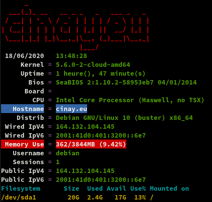


### Domaine yanfi.net

DNS OVH yanfi.net géré par le serveur cinay.eu   
Remplacer 51.75.120.106 &rarr; 164.132.104.145
Remplacer 2001:41d0:305:2100::4dc0 &rarr; 2001:41d0:401:3200::6e7

Administration Yunohost &rarr; ajout domaine yanfi.net  

    yunohost domain add yanfi.net

Les paramètres

    yunohost domain dns-conf yanfi.net

Domaine yanfi.net **Configuration DNS** et ajuster le domaine yanfi.net sur OVH  

```bash
$TTL 3600
@	IN SOA dns110.ovh.net. tech.ovh.net. (2020072800 86400 3600 3600000 300)
                         IN NS     dns110.ovh.net.
                         IN NS     ns110.ovh.net.
                         IN MX     10 yanfi.net.
                         IN A      164.132.104.145
                         IN AAAA   2001:41d0:401:3200::6e7
                         IN CAA    128 issue "letsencrypt.org"
                     600 IN TXT    "v=spf1 a mx -all"
*                        IN CNAME  yanfi.net.
_dmarc                   IN TXT    "v=DMARC1; p=none"
_xmpp-client._tcp        IN SRV    0 5 5222 yanfi.net.
_xmpp-server._tcp        IN SRV    0 5 5269 yanfi.net.
mail._domainkey          IN TXT    ( "v=DKIM1;h=sha256;k=rsa;p=MIGfMA0GQ.......IDAQAB;" )
muc                      IN CNAME  yanfi.net.
pubsub                   IN CNAME  yanfi.net.
vjud                     IN CNAME  yanfi.net.
xmpp-upload              IN CNAME  yanfi.net.
```

Certificats en ligne de commande : `yunohost domain cert-install yanfi.net --no-checks`  

Paramétrage de la messagerie :   
Thunderbird , il faut passer par les serveurs IMAP et SMTP cinay.eu  
k-9mail android , il faut passer par les serveurs IMAP et SMTP yanfi.net

## Nextcloud (/nextcloud)

{:width="70"}

#### Installation

PB Téléchargement ...  
en ligne de commande

    sudo -s
    git clone https://github.com/YunoHost-Apps/nextcloud_ynh.git
    # Changer le lien de téléchargement nextcloud : nano nextcloud_ynh/conf/app.src.default
    # REMPLACER SOURCE_URL=https://download.nextcloud.com/server/releases/nextcloud-__VERSION__.tar.bz2
    # PAR       SOURCE_URL=http://xoyaz.xyz/nextcloud-__VERSION__.tar.bz2
    # Installer
    yunohost app install nextcloud_ynh/ --debug

```
[...]
Choose a domain for Nextcloud (default: cinay.eu): 
Choose a path for Nextcloud (default: /nextcloud): 

Choose the Nextcloud administrator (must be an existing YunoHost user): yann
Access the users home folder from Nextcloud? [yes | no] (default: no): yes
[...]
```

Dans les paramètres fichier de nextcloud , activer l'affichage des fichiers masqués  

#### Activer les applications

Activer les applications **Calendar**, **Contacts** et **Notes** sur nextcloud


#### Calendrier et contacts (android et thunderbird)

Paramétrage **OpenSync** android  
Connexion avec le lien https://cinay.eu/nextcloud/remote.php/dav (login+mdp)  
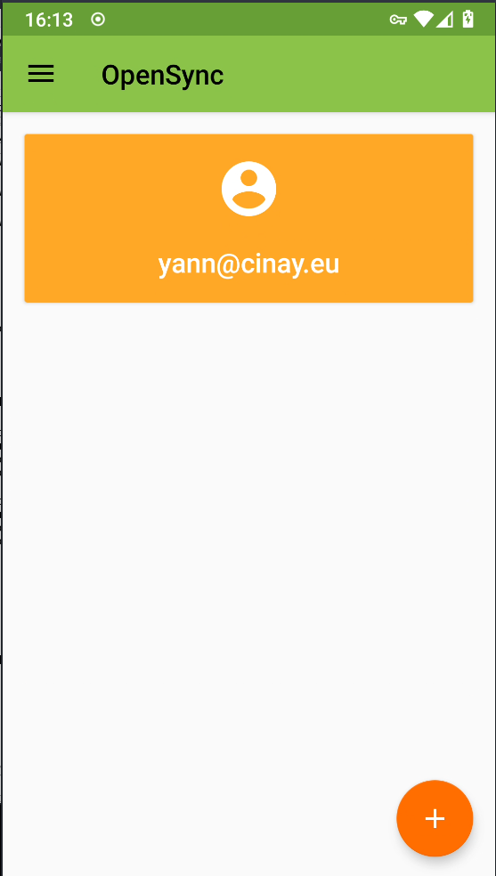{:height="300"} {:height="300"}

Paramétrer les applications  qui utilisent le calendrier et les contacts  
**Contacts** , **acalendar**  et **Tâches**  
{:height="300"} 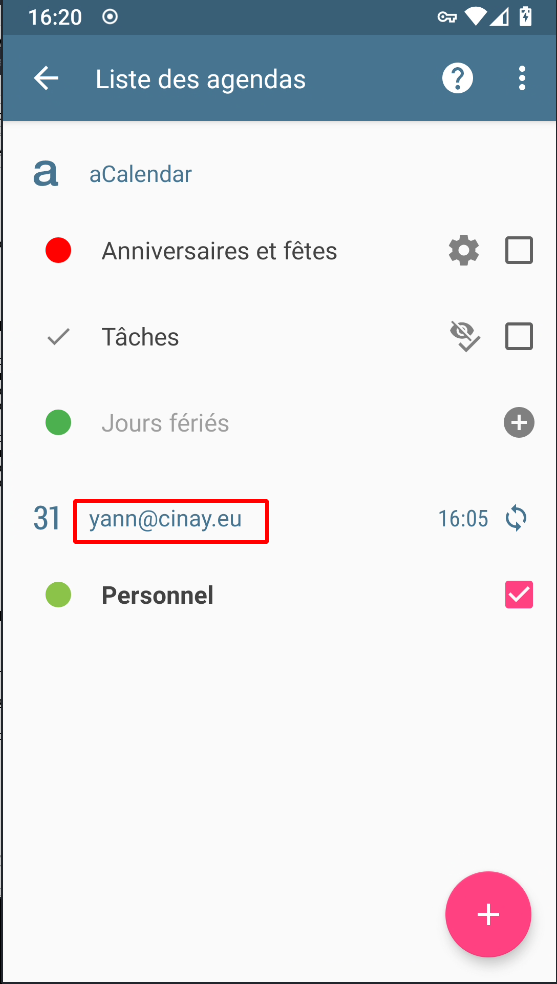{:height="300"} 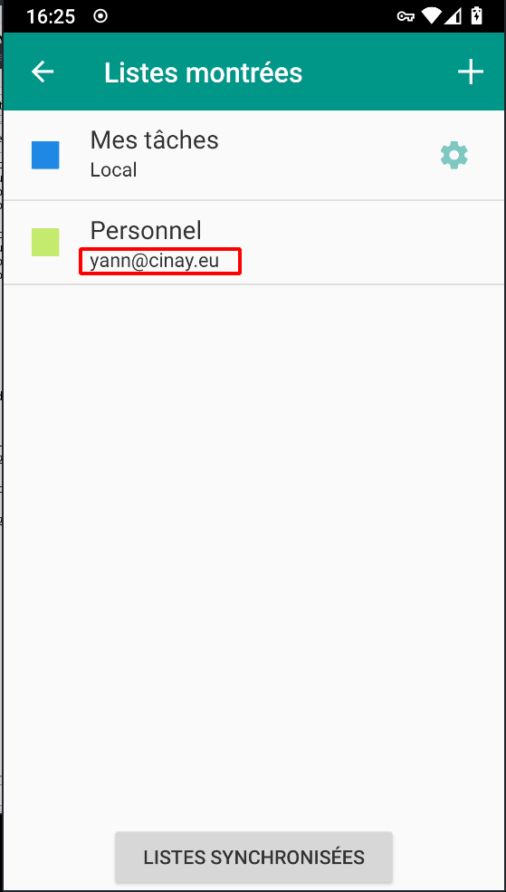{:height="300"}  

Paramétrage agenda **Thunderbird**  
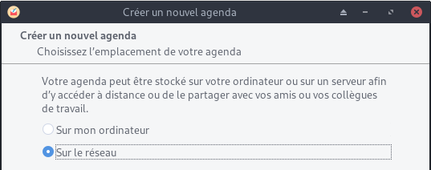{:width="300"} {:width="300"}  
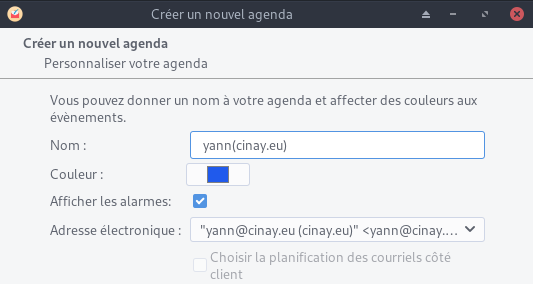{:width="300"}  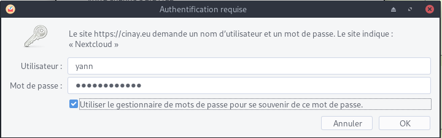{:width="300"}
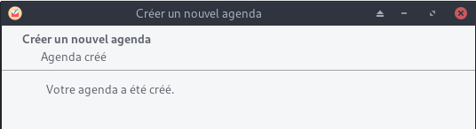{:width="300"}  
Se désabonner de l'ancien agenda cinay.xyz

Paramétrage contacts **Thunderbird**  
Outils &rarr; Préférences des modules &rarr; TbSync   
Dans l'application  
Actions sur les comptes &rarr; Ajouter un nouveau compte &rarr; Caldav & Carddav  
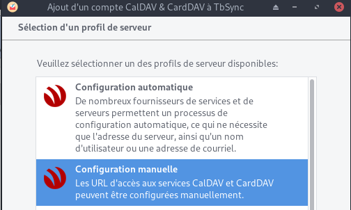{:width="300"} {:width="300"}   
{:width="300"}   
{:width="300"}   
Synchronisation toutes les heures pour les contacts  


Liens caldav carddav sur thunderbird (yann)    
https://cinay.eu/nextcloud/remote.php/dav/calendars/yann/personal/  
https://cinay.eu/nextcloud/remote.php/dav/addressbooks/users/yann/contacts/  

#### Compte nextcloud sur les postes clients de type PC

Ajout du compte https://cinay.eu/nextcloud sur les clients nextcloud    
Synchronisations:

* ~/.keepassx &rarr; Home/.keepassx (créer le dossier)
* ~/media/Notes &rarr; Notes (créer le dossier)

#### Compte nextcloud sur android

Application nextcloud installée  
Se connecter https://cinay.eu/nextcloud et vérifier la création du compte  
{:height="300"}  

Synchroniser le fichier de mot de passe avec l'application keepass  
{:height="300"}  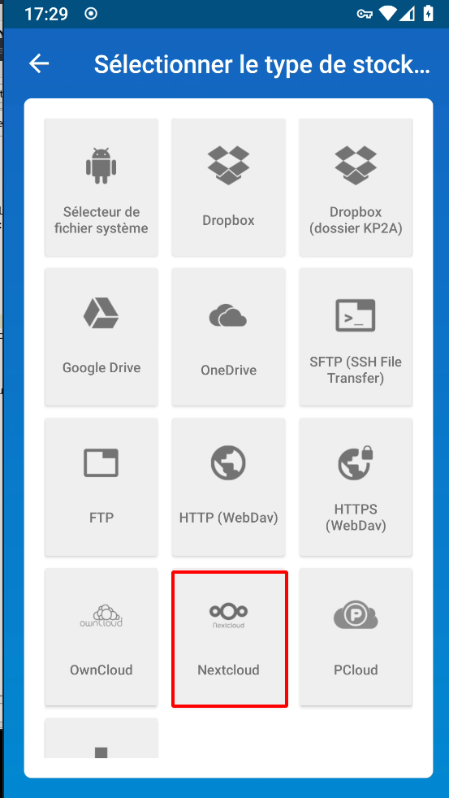{:height="300"}  
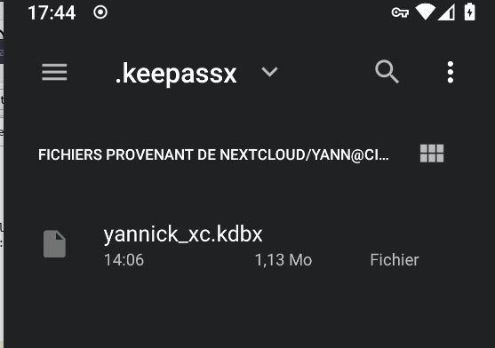{:width="200"}  

## SSHFS partage xoyaz.xyz

*Secure shell file system (ou SSHFS) permet le partage d'un système de fichiers de manière sécurisée en utilisant le protocole SFTP de SSH*

Le but, créer un accès réseau sur un autre serveur pour les gros volumes de fichiers (musique, livres, etc...)  
Le dossier local **/opt/sshfs/**

    sudo mkdir -p /opt/sshfs

Il faut créer une liaison réseau sécurisée entre **cinay.eu &larr; &rarr; xoyaz.xyz**  

    sudo apt install sshfs

Autorisations

* Autorisations "utilisateur"
     * Exécuter `sshfs` (ou toute autre commande de montage FUSE) avec l’option `-o allow_other`
* Autoriser l’accès “root” des supports **fuse**
     * Ajouter `user_allow_other` au fichier **/etc/fuse.conf**
     * Exécuter `sshfs` (ou toute autre commande de montage FUSE) avec l’option `-o allow_root`

#### Partage avec serveur xoyaz.xyz

Clé privée **OVZ-STORAGE-128** pour accéder au serveur xoyaz.xyz

	chmod 600 /home/debian/.ssh/OVZ-STORAGE-128

**Exécution manuelle** pour authentifier la clé avec utilisateur "debian"

    sudo -s
    sshfs -o allow_other usernl@xoyaz.xyz:/home/usernl/backup /opt/sshfs -C -p 55036 -oIdentityFile=/home/debian/.ssh/OVZ-STORAGE-128

```bash
The authenticity of host '[5.2.79.107]:55036 ([5.2.79.127]:55036)' can't be established.
ECDSA key fingerprint is SHA256:PDXQBhTh4oj0cSzgnjCun+J60JDUEk7VeLH2YHZbwMc.
Are you sure you want to continue connecting (yes/no)? yes
```

>NOTE: Il faut mettre l'adresse IP du serveur , si les domaines peuvent ne pas être "résolus"

Après vérification , `ls /opt/sshfs` , déconnexion `fusermount -u /opt/sshfs`

**Montage fstab**

ajouter les lignes suivantes au fichier **/etc/fstab**

    usernl@xoyaz.xyz:/home/usernl/backup /opt/sshfs fuse.sshfs _netdev,identityfile=/home/debian/.ssh/OVZ-STORAGE-128,allow_other,port=55036 0 0

Montage pour authentifier la clé avec utilisateur "root"

    sudo mount -a
    
Vérification    

    ls /opt/sshfs

```bash
CalibreTechnique  musique  yunohost.backup.cinay.xyz
```

## Applications Yunohost

### Tiny Tiny RSS (/ttrss)

{:width="50px"}  
*Tiny Tiny RSS (ttrss) est un agrégateur de flux RSS et Atom libre sous licence libre GNU GPL v3*

Installation en mode de commande (su)

    yunohost app install ttrss

```
Choose a domain for Tiny-Tiny-RSS (default: cinay.eu): 
Choose a path for Tiny-Tiny-RSS (default: /ttrss): 
Success! Installation completed
```

Mise à jour

    yunohost app upgrade ttrss -u https://github.com/YunoHost-Apps/ttrss_ynh/tree/testing --debug

### static.cinay.eu

En mode su

Créer le domaine static.cinay.eu et les certificats

    yunohost domain add static.cinay.eu
    yunohost domain cert-install static.cinay.eu --no-checks

Installer l’application `Custom web app` sur le domaine static.cinay.eu   

    yunohost app install https://github.com/YunoHost-Apps/my_webapp_ynh/tree/testing --debug

Domaine : static.cinay.eu  
Racine : /  
Utilisateur : yann  
Create a database: no  
Site publique: yes
SFTP : yes + mot de passe
```

Accès au site 

```
Access your site

You can access to your site - e.g. to put content, change this wonderful page - using SFTP. You can use a client application for that such as FileZilla. Here are the SFTP connection details:

Domain
    static.cinay.eu
Port
    22 (or the port you defined if you change the ssh port)
User
    my_webapp
Password
    the one you set at installation 
```


Le dossier **/opt/sshfs/static/** contient le site statique qui est issu d'une synchronisation d'un conteneur debian sur un ordinateur archlinux avec jekyll comme générateur 

```bash
rm -r /var/www/my_webapp/www/  # supprimer dossier web 
chown my_webapp.my_webapp -R /var/www/my_webapp
ln -s /opt/sshfs/static /var/www/my_webapp/www  # lien et droits my_webapp
```

Modifier l'étiquette `my_webapp` (static.cinay.eu)

    yunohost app change-label my_webapp 'Statique static.cinay.eu'

### Gitea (gitea.cinay.eu)

{:width="70"}

Ajout domaine et certificats gitea.cinay.eu

    yunohost domain add gitea.cinay.eu
    yunohost domain cert-install gitea.cinay.eu --no-checks

Installation à partir de github, on clône le dépôt

    git clone https://github.com/YunoHost-Apps/gitea_ynh.git

Blocage sur fail2ban à l'installation   
Commenter la mise en place FAIL2BAN 

    nano gitea_ynh/scripts/install

```
# SETUP FAIL2BAN
#ynh_script_progression --message="Configuring fail2ban..."
#ynh_add_fail2ban_config --logpath "/var/log/$app/gitea.log" --failregex ".*Failed authentication attempt for .* from <HOST>" --max_retry 5
```

Installer gitea

    yunohost app install gitea_ynh

Fail2ban , règle qui n'est pas ajouté

```
ynh_add_fail2ban_config --logpath /var/log/gitea/gitea.log --failregex '.*Failed authentication attempt for .* from <HOST>' --max_retry 5
```

### Shaarli

Installation

    sudo yunohost app install shaarli

Basculer l'application de privée en publique 

    sudo sed -i "s/is_public\: '0'/is_public\: '1'/g" /etc/yunohost/apps/shaarli/settings.yml

Regénérer la configuration

    yunohost app ssowatconf

## Go Node 

#### Go

{:width="50"}

Go installation (Debian) , installer la dernière version de Go (https://golang.org/dl/)

```bash
cd ~
wget https://golang.org/dl/go1.15.3.linux-amd64.tar.gz
sudo tar -C /usr/local -xzf go1.15.3.linux-amd64.tar.gz
rm go1.15.3.linux-amd64.tar.gz
```

Environnement de configuration

Bash: **~/.bashrc**  

```bash
mkdir -p $HOME/go

echo "export PATH=$PATH:/usr/local/go/bin" >> ~/.bashrc
source ~/.bashrc
```

Se déconnecter puis se reconnecter

    go version

go version go1.15.3 linux/amd64


#### Nodejs

{:width="50"}

Installer la version LTS de nodejs pour le frontend.

    sudo apt-get install curl software-properties-common -y
    curl -sL https://deb.nodesource.com/setup_14.x | sudo bash -

```bash
## Run `sudo apt-get install -y nodejs` to install Node.js 14.x and npm
## You may also need development tools to build native addons:
     sudo apt-get install gcc g++ make
## To install the Yarn package manager, run:
     curl -sL https://dl.yarnpkg.com/debian/pubkey.gpg | sudo apt-key add -
     echo "deb https://dl.yarnpkg.com/debian/ stable main" | sudo tee /etc/apt/sources.list.d/yarn.list
     sudo apt-get update && sudo apt-get install yarn
```

Nodejs

    sudo apt-get install -y nodejs

### Navidrome

*[Navidrome](https://www.navidrome.org/docs/installation/pre-built-binaries/) est un serveur de collecte de musique et de streaming sur le web, à code source ouvert. Il vous donne la liberté d'écouter votre 
collection de musique à partir de n'importe quel navigateur ou appareil mobile. C'est comme votre Spotify personnel !*

#### Installation Navidrome

Créer les répertoires

```
sudo install -d -o debian -g debian /opt/navidrome
sudo install -d -o debian -g debian /var/lib/navidrome
```

La [dernière version](https://github.com/deluan/navidrome/releases) 

```
wget https://github.com/deluan/navidrome/releases/download/v0.37.0/navidrome_0.37.0_Linux_x86_64.tar.gz -O Navidrome.tar.gz
sudo tar -xvzf Navidrome.tar.gz -C /opt/navidrome/
sudo chown -R debian:debian /opt/navidrome
```

Créer le fichier de configuration `/var/lib/navidrome/navidrome.toml`

    MusicFolder = "/opt/sshfs/musique"

#### Créer le service navidrome

Créer un service `/etc/systemd/system/navidrome.service` en mode su

```
[Unit]
Description=Navidrome Music Server and Streamer compatible with Subsonic/Airsonic
After=remote-fs.target network.target
AssertPathExists=/var/lib/navidrome

[Install]
WantedBy=multi-user.target

[Service]
User=debian
Group=debian
Type=simple
ExecStart=/opt/navidrome/navidrome --configfile "/var/lib/navidrome/navidrome.toml"
WorkingDirectory=/var/lib/navidrome
TimeoutStopSec=20
KillMode=process
Restart=on-failure

# See https://www.freedesktop.org/software/systemd/man/systemd.exec.html
DevicePolicy=closed
NoNewPrivileges=yes
PrivateTmp=yes
PrivateUsers=yes
ProtectControlGroups=yes
ProtectKernelModules=yes
ProtectKernelTunables=yes
RestrictAddressFamilies=AF_UNIX AF_INET AF_INET6
RestrictNamespaces=yes
RestrictRealtime=yes
SystemCallFilter=~@clock @debug @module @mount @obsolete @reboot @setuid @swap
ReadWritePaths=/var/lib/navidrome

# You can uncomment the following line if you're not using the jukebox This
# will prevent navidrome from accessing any real (physical) devices
#PrivateDevices=yes

# You can change the following line to `strict` instead of `full` if you don't
# want navidrome to be able to write anything on your filesystem outside of
# /var/lib/navidrome.
ProtectSystem=full

# You can comment the following line if you don't have any media in /home/*.
# This will prevent navidrome from ever reading/writing anything there.
#ProtectHome=true

```

Démarrer le service

```
sudo systemctl daemon-reload
sudo systemctl start navidrome.service
```

Le status

    sudo systemctl status navidrome.service

```
● navidrome.service - Navidrome Music Server and Streamer compatible with Subsonic/Airsonic
   Loaded: loaded (/etc/systemd/system/navidrome.service; disabled; vendor preset: enabled)
   Active: active (running) since Sat 2020-11-07 22:04:05 CET; 11s ago
 Main PID: 4407 (navidrome)
    Tasks: 6 (limit: 4603)
   Memory: 32.0M
   CGroup: /system.slice/navidrome.service
           └─4407 /opt/navidrome/navidrome --configfile /var/lib/navidrome/navidrome.toml
```

Activer

    sudo systemctl enable  navidrome.service

Test application par redirection

    ssh -L 9500:localhost:4533 debian@cinay.eu -p 55034 -i /home/yannick/.ssh/kvm-vps506197

### Proxy Navidrome

Ajout domaine et certificats zic.cinay.eu

    yunohost domain add zic.cinay.eu
    yunohost domain cert-install zic.cinay.eu --no-checks

Installer application yunohost proxy **redirect**

	yunohost app install https://github.com/YunoHost-Apps/redirect_ynh

```
Available domains:
- cinay.eu
- yanfi.net
- zic.cinay.eu
- static.cinay.eu
Choose a domain for your redirect (default: cinay.eu): zic.cinay.eu
Choose a path for your redirect (default: /redirect): /
Redirect destination path (default: http://127.0.0.1): http://127.0.0.1:4533
Redirect type [public_302 | public_301 | public_proxy | private_proxy] (default: public_302): public_proxy
Info: Installing redirect...
Warning: /!\ Packagers! This app is still using the skipped/protected/unprotected_uris/regex settings which are now obsolete and deprecated... Instead, you should use the new helpers 'ynh_permission_{create,urls,update,delete}' and the 'visitors' group to initialize the public/private access. Check out the documentation at the bottom of yunohost.org/groups_and_permissions to learn how to use the new permission mechanism.
Success! Installation completed
```

Modifier l'étiquette `redirect` (zic.cinay.eu)

    yunohost app change-label redirect 'Audio zic.cinay.eu'

Accès lien <https://zic.cinay.eu>

## Sauvegardes

Toutes les sauvegardes se font sur un serveur distant relié en réseau SSHFS  
*Secure shell file system permet le partage d'un système de fichiers de manière sécurisée en utilisant le protocole SFTP de SSH.*

Le dossier de sauvegarde : `/opt/sshfs/cinay.eu`

Scripts `~/sauvegarde.sh` 

```
#!/bin/bash

BACKUPREP="/opt/sshfs/cinay.eu"

# Vérifier le point de montage 
if [ ! -d "$BACKUPREP" ];then
 echo "ERREUR, point de montage SSHFS $BACKUPREP inexistant !" | systemd-cat -t backup -p emerg ;
 exit 1
fi

# Dossier mysql
if [ ! -d "$BACKUPREP/mysql" ];then
 echo "Création du dossier  $BACKUPREP/mysql"
 mkdir "$BACKUPREP/mysql"
fi

#################################################
# Sauvegarde des bases mysql 
#################################################

# Configuration de base: datestamp e.g. YYYYMMDD
DATE=$(date +"%Y%m%d")

# Dossier où sauvegarder les backups (créez le d'abord!)
BACKUP_DIR="$BACKUPREP/mysql"

# Identifiants MySQL
MYSQL_USER="root"
MYSQL_PASSWORD=$(cat /etc/yunohost/mysql )
GZIP="$(which gzip)"

# Commandes MySQL (aucune raison de modifier ceci)
MYSQL="$(which mysql)"
MYSQLDUMP="$(which mysqldump)"

# Bases de données MySQL à ignorer
SKIPDATABASES="Database|information_schema|performance_schema|mysql"

# Nombre de jours à garder les dossiers (seront effacés après X jours)
RETENTION=7

# ---- NE RIEN MODIFIER SOUS CETTE LIGNE ------------------------------------------
#
# Create a new directory into backup directory location for this date
mkdir -p "$BACKUP_DIR/$DATE"

# Retrieve a list of all databases
databases=`$MYSQL -u$MYSQL_USER -p$MYSQL_PASSWORD -e "SHOW DATABASES;" | grep -Ev "($SKIPDATABASES)"`

# Dump the databases in seperate names and gzip the .sql file
for db in $databases; do
echo $db
$MYSQLDUMP --force --opt --user=$MYSQL_USER -p$MYSQL_PASSWORD --skip-lock-tables --events --databases $db | $GZIP > "$BACKUP_DIR/$DATE/$db.sql.gz"
echo "OK Mysql Dump $BACKUP_DIR/$DATE/$db.sql.gz" | systemd-cat -t backup -p info ;
done

# Remove files older than X days

find $BACKUP_DIR/* -mtime +$RETENTION -delete

# Sauvegarde complète 
#rsync -aAXv  --fake-super --delete --exclude={"/opt/sshfs/*","/dev/*","/proc/*","/sys/*","/tmp/*","/run/*","/mnt/*","/media/*","/home/*","/lost+found"} / "$BACKUPREP"
```

#### BorgBackup


**Préparation de la machine à sauvegarder**  
On se connecte sur la machine et on passe en mode su  

    sudo -s
    apt update

Installer borgbackup

    apt install borgbackup

**<u>Créer un jeu de clé sur machine à sauvegarder (cinay.eu)</u>**  
Créer un utilisateur borg (sans home) dédié aux sauvegardes par BorgBackup :

    useradd -M borg

Générer un jeu de clé sur **/root/.ssh** 

    mkdir -p /root/.ssh
    ssh-keygen -t ed25519 -o -a 100 -f /root/.ssh/cinay.eu_ed25519

Le jeu de clé

    ls /root/.ssh
        cinay.eu_ed25519  cinay.eu_ed25519.pub

Autoriser utilisateur **borg** à exécuter */usr/bin/borg* uniquement

    echo "borg ALL=NOPASSWD: /usr/bin/borg" >> /etc/sudoers

**Ajout clé publique au serveur backup xoyaz.xyz**

>Pour une connexion via ssh vous devez ajouter la clé publique *cinay.eu_ed25519.pub* du **serveur client  cinay.eu** au fichier *~/.ssh/authorized_keys* du  **serveur backup xoyaz.xyz**  

Se connecter au **serveur backup xoyaz.xyz** depuis un terminal autorisé

	ssh usernl@5.2.79.107 -p 55036 -i /home/yannick/.ssh/OVZ-STORAGE-128 # connexion SSH serveur backup depuis PC1
	sudo -s # passer en super utilisateur
	cat >> /srv/data/borg-backups/.ssh/authorized_keys

Copier/coller le contenu du fichier du fichier de clef publique (fichier **/root/.ssh/cinay.eu_ed25519.pub** de la machine à sauvegarder **cinay.eu** ) dans ce terminal, et presser **[Ctrl]+[D]** pour valider.

Test depuis le serveur client **cinay.eu**  (c'est lui qui possède la clé privée).  
*Si parefeu avec les sorties bloquées sur **cinay.eu** , il faut ouvrir en sortie le port TCP 55036.*

**AU PREMIER passage une question est posée , saisir oui ou yes**

    sudo -s
    ssh -p 55036 -i /root/.ssh/cinay.eu_ed25519 borg@xoyaz.xyz

```
The authenticity of host '[xoyaz.xyz]:55036 ([2a04:52c0:101:7ae::7a5e]:55036)' can't be established.
ECDSA key fingerprint is SHA256:PDXQBhTh4oj0cSzgnjCun+J60JDUEk7VeLH2YHZbwMc.
Are you sure you want to continue connecting (yes/no)? yes
hosts.
Linux vps70253415 4.19.0-9-amd64 #1 SMP Debian 4.19.118-2+deb10u1 (2020-06-07) x86_64
                 ____  __  ___  ___  ____ _ _   _  ___ 
 __ __ _ __  ___|__  |/  \|_  )| __||__ /| | | / || __|
 \ V /| '_ \(_-<  / /| () |/ / |__ \ |_ \|_  _|| ||__ \
  \_/ | .__//__/ /_/  \__//___||___/|___/  |_| |_||___/
    __|_|   ___    ____  ___    _  ___  ____           
   | __|   |_  )  |__  |/ _ \  / ||_  )|__  |          
   |__ \ _  / /  _  / / \_, /_ | | / /   / /           
   |___/(_)/___|(_)/_/   /_/(_)|_|/___| /_/ 
Last login: Wed Jun 10 15:34:07 2020 from 51.91.249.57
$ 
```

saisir `exit` pour sortir

>NOTE : **/srv/data/borg-backups** est le home de l'utilisateur *borg* sur le serveur backup *xoyaz.xyz*

**Création dépôt et lancement des sauvegardes depuis la machine à sauvegarder**  

**<u>machine cliente cinay.eu</u>**  
On se connecte sur la machine et on passe en mode su  

    sudo -s

**Création du dépôt distant sur le serveur backup xoyaz.xyz (A FAIRE UNE SEULE FOIS)**

    export BORG_RSH='ssh -i /root/.ssh/cinay.eu_ed25519' # ce n'est pas la clé par défaut id_rsa
    borg init --encryption=repokey-blake2 ssh://borg@xoyaz.xyz:55036/srv/data/borg-backups/cinay.eu

```
Enter new passphrase: 
Enter same passphrase again: 
Do you want your passphrase to be displayed for verification? [yN]: 

By default repositories initialized with this version will produce security
errors if written to with an older version (up to and including Borg 1.0.8).

If you want to use these older versions, you can disable the check by running:
borg upgrade --disable-tam ssh://borg@xoyaz.xyz:55036/srv/data/borg-backups/cinay.eu

See https://borgbackup.readthedocs.io/en/stable/changes.html#pre-1-0-9-manifest-spoofing-vulnerability for details about the security implications.

IMPORTANT: you will need both KEY AND PASSPHRASE to access this repo!
Use "borg key export" to export the key, optionally in printable format.
Write down the passphrase. Store both at safe place(s).
```

Sauvegarder la "passphrase" dans un fichier pour une procédure automatique 

    mkdir -p /root/.borg
    nano /root/.borg/passphrase

**Générer une sauvegarde d'un dossier local vers le dépôt distant** pour test (facultatif)

    borg create ssh://borg@xoyize.xyz:55029/srv/ssd-two/borg-backups/cinay.eu::2019-01-11 /home/yanfi

```
Enter passphrase for key ssh://borg@xoyize.xyz:55029/srv/ssd-two/borg-backups/cinay.eu: 
```

**Automatiser la procédure de sauvegarde pour le client cinay.eu**  
script de sauvegarde (notez l'usage de borg prune pour supprimer les archives trop anciennes)  

    nano /root/.borg/borg-backup 

```
#!/bin/sh
#
# Script de sauvegarde.
#
# Envoie les sauvegardes sur un serveur distant, via le programme Borg.
# Les sauvegardes sont chiffrées
#
 
set -e
 
BACKUP_DATE=`date +%Y-%m-%d-%Hh%M`
LOG_PATH=/var/log/borg-backup.log
 
export BORG_PASSPHRASE="`cat ~root/.borg/passphrase`"
export BORG_RSH='ssh -i /root/.ssh/cinay.eu_ed25519'
BORG_REPOSITORY=ssh://borg@xoyaz.xyz:55036/srv/data/borg-backups/cinay.eu
BORG_ARCHIVE=${BORG_REPOSITORY}::${BACKUP_DATE}
 
borg create \
-v --progress --stats --compression lzma,9 \
--exclude-from /root/.borg/exclusions --exclude-caches \
$BORG_ARCHIVE \
/ \
>> ${LOG_PATH} 2>&1
 
# Nettoyage des anciens backups
# On conserve
# - une archive par jour les 7 derniers jours,
# - une archive par semaine pour les 4 dernières semaines,
# - une archive par mois pour les 6 derniers mois.
 
borg prune \
-v --list --stats --keep-daily=7 --keep-weekly=4 --keep-monthly=6 \
$BORG_REPOSITORY \
>> ${LOG_PATH} 2>&1

root@cinay:/home/debian# nano /root/.borg/borg-backup 
root@cinay:/home/debian# cat /root/.borg/borg-backup 
#!/bin/sh
#
# Script de sauvegarde.
#
# Envoie les sauvegardes sur un serveur distant, via le programme Borg.
# Les sauvegardes sont chiffrées
#
 
set -e
 
BACKUP_DATE=`date +%Y-%m-%d-%Hh%M`
LOG_PATH=/var/log/borg-backup.log
 
export BORG_PASSPHRASE="`cat ~root/.borg/passphrase`"
export BORG_RSH='ssh -i /root/.ssh/cinay.eu_ed25519'
BORG_REPOSITORY=ssh://borg@xoyaz.xyz:55036/srv/data/borg-backups/cinay.eu
BORG_ARCHIVE=${BORG_REPOSITORY}::${BACKUP_DATE}
 
borg create \
-v --progress --stats --compression lzma,9 \
--exclude-caches --exclude-from /root/.borg/exclusions \
$BORG_ARCHIVE \
/ \
>> ${LOG_PATH} 2>&1
 
# Nettoyage des anciens backups
# On conserve
# - une archive par jour les 7 derniers jours,
# - une archive par semaine pour les 4 dernières semaines,
# - une archive par mois pour les 6 derniers mois.
 
borg prune \
-v --list --stats --keep-daily=7 --keep-weekly=4 --keep-monthly=6 \
$BORG_REPOSITORY \
>> ${LOG_PATH} 2>&1

exit 0
# Ancien backup
borg create \
-v --progress --stats --compression lzma,9 \
--exclude-from /root/.borg/exclusions --exclude-caches \
$BORG_ARCHIVE \
/ \
>> ${LOG_PATH} 2>&1
```

Le rendre exécutable

    chmod +x /root/.borg/borg-backup

Fichier **/root/.borg/exclusions** pour ne pas sauvegarder, entre autre,le point de montage ssfs "music" (si existant)

    nano /root/.borg/exclusions

```
/dev/*
/proc/*
/sys/*
/tmp/*
/run/*
/mnt/*
/media/*
lost+found
/home/yunohost.multimedia
/home/yunohost.backup
/home/yunohost.transmission
/home/yunohost.app
/opt/sshfs
```

Programmer la tâche à 2h40 du matin

    crontab -e

```
# Sauvegarde sur distant avec BorgBackup
40 02 * * * /root/.borg/borg-backup > /dev/null
```
