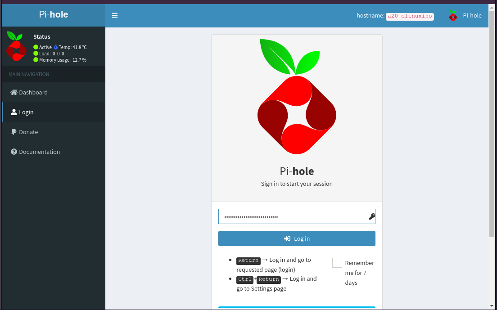
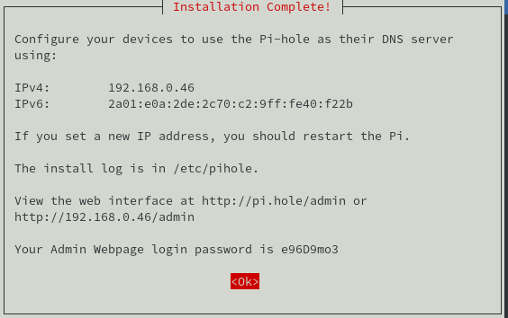
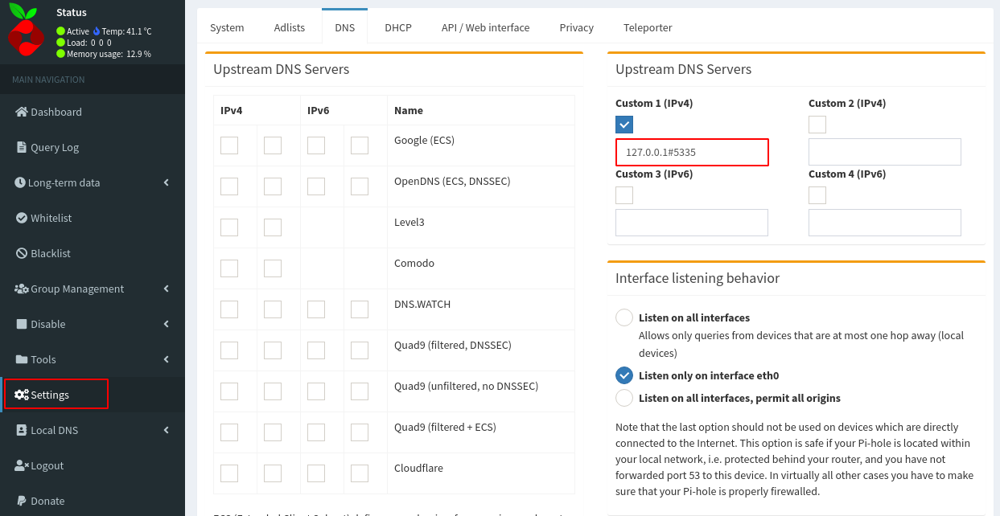
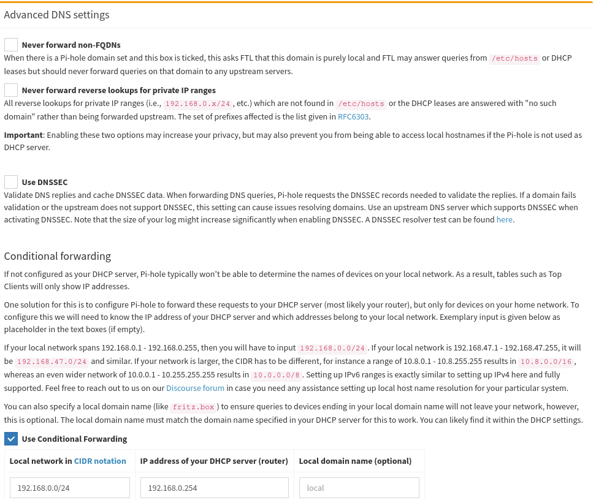

+++
title = 'Serveur Debian A20-OLinuXino-buster-minimal + Pihole + Unbound'
date = 2021-01-01 00:00:00 +0100
categories = ['olimex']
+++
# Olimex A20-olinuxino-Micro

[Documentation olimex](https://www.olimex.com/Products/olino/A20/A20-olinuxino-Micro-4GB/resources/A20-olinuxino-Micro.pdf)   
{:width="400"}

{:width="300"}  

## Installation A20-OLinuXino-buster-minimal

{:width="100"}

**Matériel**

* Carte olimex [A20-olinuxino-Micro ](https://www.olimex.com/Products/OLinuXino/A20/A20-OLinuXino-MICRO/open-source-hardware)
* Bloc Alimentation 10V 1A
* Dongle Wifi/USB RT5370
* Carte micro SD 4GO
* SSD 128GO
* Batterie Li-ion 3.7v 5000mAh

**SDcard**

SDcard créer avec les paquets debian armhf  
[Index of /release/a20](http://images.olimex.com/release/a20/)  

1. Télécharger **A20-OLinuXino-buster-minimal-20201217-194545.img.7z** (image du 06/11/2020) puis se rendre dans le répertoire contenant les fichiers 
2. Décompresser le fichier 
2. Insérer le lecteur USB/SDcard, relever le périphérique par `dmesg` , ex /dev/sdd
3. Ecriture image sur la SDcard :  
`sudo dd if=A20-OLinuXino-buster-minimal-20201217-194545.img of=/dev/sdd bs=4M`  

**Connexion liaison série**

Utilisation module USB/Série **/dev/ttyUSB0** et lancer **minicom** en root  
Insertion carte SD et mise sous tension A20-olinuxino-Micro   
L'image "debian" est prête à l'emploi sur la carte SD  

La connexion "root/olimex"

```
Linux a20-olinuxino 5.8.18-olimex #122632 SMP Wed Dec 16 12:27:58 UTC 2020 armvl
                                                                                
The programs included with the Debian GNU/Linux system are free software;       
the exact distribution terms for each program are described in the              
individual files in /usr/share/doc/*/copyright.                                 

Debian GNU/Linux comes with ABSOLUTELY NO WARRANTY, to the extent
permitted by applicable law.
```

Relever l' adresse mac eth0 : `ip link eth0`   
Activer la **DMZ de la Box internet** sur IP 192.168.0.46  
Ajout dans les baux statique de la box : **A20-olinuxino-micro** avec l'adresse IP 192.168.0.46 avec l'adresse mac `02:c2:09:40:f2:2b`
{: .prompt-info }


## Basculer SDcard vers SSD

### Préparer SSD /dev/sda

    fdisk /dev/sda

Effacer les partitions existantes ,option "d"  
 Créer une nouvelle partition primaire en tapant « n » puis « p ». Laisser par défaut la taille maximale. Sauvegarder les modifications en tapant « w ».

formater la partition du SSD sous le format .ext4

    mkfs.ext4 /dev/sda1

### Transfert SDcard &rarr; SSD

Le disque est formaté,  on va copier les données de la carte SD sur le SSD

    mkdir /tmp/ssd
    mount /dev/sda1 /tmp/ssd
    rsync -av --exclude 'tmp/*' --exclude 'boot' --exclude 'proc/*' --exclude 'sys/*' --exclude 'mnt/*'--exclude 'run/*' / /tmp/ssd/

Patienter plusieurs minutes...
{: .prompt-info }

Après transfert

    ls /tmp/ssd/

```
bin  etc   lib         media  opt   root  sbin  sys  uboot.env  var
dev  home  lost+found  mnt    proc  run   srv   tmp  usr
```

Démpontage /tmp/ssd/

    umount /tmp/ssd/

### Modifier le boot

boot à rediriger sur le disque `/dev/sda1`   

1. Ajouter `root=/dev/sda1` en fin du fichier `/boot/uEnv.txt`  &rarr; `echo "root=/dev/sda1" >> /boot/uEnv.txt`
2. Remplacer `root=PARTUUID=${partuuid}` par `root=${root}` dans le fichier `/boot/boot.cmd` &rarr; `sed -i s/root=PARTUUID=\$\{partuuid\}/root=\$\{root\}/g /boot/boot.cmd`

Compilation **boot.cmd** en **boot.scr**  
*u-boot-tools installé par défaut sinon : `apt install u-boot-tools`*

    mkimage -C none -A arm -T script -d /boot/boot.cmd /boot/boot.scr

```
Image Name:   
Created:      Tue Dec 29 07:34:52 2020
Image Type:   ARM Linux Script (uncompressed)
Data Size:    2197 Bytes = 2.15 KiB = 0.00 MiB
Load Address: 00000000
Entry Point:  00000000
Contents:
   Image 0: 2189 Bytes = 2.14 KiB = 0.00 MiB
```

Redémarrer : `reboot`
{: .prompt-info }

Se connecter et vérifier avec `df-h` que sda1 est bien la partition principale

```
Filesystem      Size  Used Avail Use% Mounted on
udev            448M     0  448M   0% /dev
tmpfs           100M   11M   90M  11% /run
/dev/sda1       7.9G  646M  6.8G   9% /
tmpfs           499M     0  499M   0% /dev/shm
tmpfs           5.0M     0  5.0M   0% /run/lock
tmpfs           499M     0  499M   0% /sys/fs/cgroup
tmpfs           100M     0  100M   0% /run/user/0
```

**Freebox**  
NextHop Freebox permet d’attribuer une adresse IPV6  

Prefixe : 2a01:e0a:2de:2c71::/64  
Next Hop: fe80::c2:9ff:fe40:f22b  (fe80::7285:c2ff:fe53:cb80 carte ASRock QC5000M)  
Passerelle IPV6 Box : fe80::224:d4ff:fea6:aa20  

Pour une adresse IPV4 fixe relever Hwaddr adresse mac : `ip link`  
Ajout adresse ip 192.168.0.46 et Hwaddr : 02:c2:09:40:f2:2b dans les baux statiques  

**Adressage ipv4/ipv6**

{:width="70"}   

Modifier interface réseau debian pour l'adressage ip static sur IP V4 et V6

    nano /etc/network/interfaces.d/eth0

```bash
allow-hotplug eth0
iface eth0 inet dhcp

iface eth0 inet6 static
  address 2a01:e0a:2de:2c71::1
  netmask 64
```

**Date et heure serveur**  
Modifier le fichier `/etc/systemd/timesyncd.conf`

```
[Time]
NTP=145.238.203.14 145.238.203.10
```

Configurer la zone Europe/Paris et le ntp

    timedatectl set-timezone Europe/Paris
    timedatectl set-ntp true

Relancer le service

    systemctl daemon-reload
    systemctl restart systemd-timesyncd.service

Vérifier la zone et l'heure

    timedatectl status

```
               Local time: Sun 2021-01-17 11:12:32 CET
           Universal time: Sun 2021-01-17 10:12:32 UTC
                 RTC time: Sun 2021-01-17 10:12:33
                Time zone: Europe/Paris (CET, +0100)
System clock synchronized: yes
              NTP service: active
          RTC in local TZ: no
```

**Utilisateur olimex**  
Par défaut , dans l'image debian buster minimal, il y a un utilisateur nommé "olimex"  
Changer le mot de passe : `passwd olimex`  
Accès sudo `echo "olimex    ALL=(ALL) NOPASSWD: ALL" >> /etc/sudoers`  


Redémarrer : `reboot`
{: .prompt-info }

### Premier boot

On se connecte en utilisateur 

    ssh olimex@192.168.0.46

Vérifier les adresses IP : `ip a`

```bash
1: lo: <LOOPBACK,UP,LOWER_UP> mtu 65536 qdisc noqueue state UNKNOWN group default qlen 1000
    link/loopback 00:00:00:00:00:00 brd 00:00:00:00:00:00
    inet 127.0.0.1/8 scope host lo
       valid_lft forever preferred_lft forever
    inet6 ::1/128 scope host 
       valid_lft forever preferred_lft forever
2: dummy0: <BROADCAST,NOARP> mtu 1500 qdisc noop state DOWN group default qlen 1000
    link/ether 9e:d3:c1:c1:29:7a brd ff:ff:ff:ff:ff:ff
3: eth0: <BROADCAST,MULTICAST,UP,LOWER_UP> mtu 1500 qdisc mq state UP group default qlen 1000
    link/ether 02:c2:09:40:f2:2b brd ff:ff:ff:ff:ff:ff
    inet 192.168.0.46/24 brd 192.168.0.255 scope global eth0
       valid_lft forever preferred_lft forever
    inet6 2a01:e0a:2de:2c71::1/64 scope global 
       valid_lft forever preferred_lft forever
    inet6 fe80::c2:9ff:fe40:f22b/64 scope link 
       valid_lft forever preferred_lft forever
```

Version linux et debian: `uname -a`  
Linux a20-olinuxino 5.8.18-olimex #122632 SMP Wed Dec 16 12:27:58 UTC 2020 armv7l GNU/Linux

Version debian : `cat /etc/debian_version`  
10.7

**Historique de la ligne de commande**  
Ajoutez la recherche d’historique de la ligne de commande au terminal.
Tapez un début de commande précédent, puis utilisez shift + up (flèche haut) pour rechercher l’historique filtré avec le début de la commande.

    echo '"\e[1;2A": history-search-backward' >> /etc/inputrc
    echo '"\e[1;2B": history-search-forward' >> /etc/inputrc

**Hostname**

    hostnamectl

```
   Static hostname: a20-olinuxino
         Icon name: computer
        Machine ID: 8014255ca19340b5b45bcfd9f9c836dc
           Boot ID: e3444e6b87b5491281079d20fae656df
  Operating System: Debian GNU/Linux 10 (buster)
            Kernel: Linux 5.8.18-olimex
      Architecture: arm
```

Afficher les erreurs, le journal des logs

    sudo journalctl -p err

```
-- Logs begin at Tue 2020-12-29 08:49:10 CET, end at Tue 2020-12-29 08:52:21 CET. --
Dec 29 08:49:11 a20-olinuxino kernel: /cpus/cpu@0 missing clock-frequency property
Dec 29 08:49:11 a20-olinuxino kernel: /cpus/cpu@1 missing clock-frequency property
Dec 29 08:49:11 a20-olinuxino kernel: sun4i-usb-phy 1c13400.phy: Couldn't request ID GPIO
```

Les erreurs ne sont pas critiques (pas de solution)
{: .prompt-warning }

### {:width=80"} OpenSSH, clé et script

**connexion avec clé**  
<u>sur un poste linux du réseau</u>
Générer une paire de clé curve25519-sha256 (ECDH avec Curve25519 et SHA2) nommé **xoyize-ed25519** pour une liaison SSH avec le serveur KVM.  

    ssh-keygen -t ed25519 -o -a 100 -f ~/.ssh/xoyize-ed25519

Envoyer la clé publique sur le serveur KVM   

    scp ~/.ssh/xoyize-ed25519.pub olimex@192.168.0.46:/home/olimex/

<u>sur le serveur "olinuxino"</u>

Copier le contenu de la clé publique dans /home/$USER/.ssh/authorized_keys  

    cd ~

Sur le KVM ,créer un dossier .ssh  

```bash
mkdir -p .ssh
cat $HOME/xoyize-ed25519.pub >> $HOME/.ssh/authorized_keys
```

et donner les droits  

    chmod 600 $HOME/.ssh/authorized_keys

effacer le fichier de la clé  

    rm $HOME/xoyize-ed25519.pub

Modifier la configuration serveur SSH **/etc/ssh/sshd_config** 

    Port = 55035               # changement numéro port , facultatif  
    PasswordAuthentication no  # Utilise la clé comme authentification
 
Relancer openSSH  

    sudo systemctl restart sshd

Tester la connexion ssh depuis le poste linux sur le réseau

    ssh olimex@192.168.0.46 -p 55035 -i /home/yann/.ssh/xoyize-ed25519

Installer utilitaires et compléments 

    sudo apt install tmux figlet dnsutils net-tools tree lvm2 git curl jq -y

Motd

    sudo rm /etc/motd && sudo nano /etc/motd

```
        ___  __             _  _                  _            
  __ _ |_  )/  \  ___  ___ | |(_) _ _  _  _ __ __(_) _ _   ___ 
 / _` | / /| () ||___|/ _ \| || || ' \| || |\ \ /| || ' \ / _ \
 \__,_|/___|\__/      \___/|_||_||_||_|\_,_|/_\_\|_||_||_|\___/
       __ __ ___  _  _ (_) ___ ___    __ __ _  _  ___          
       \ \ // _ \| || || ||_ // -_) _ \ \ /| || ||_ /          
       /_\_\\___/ \_, ||_|/__|\___|(_)/_\_\ \_, |/__|          
                  |__/                      |__/               
```            

Script ssh_rc_bash

>ATTENTION!!! Les scripts sur connexion peuvent poser des problèmes pour des appels externes autres que ssh

    wget https://static.xoyaz.xyz/files/ssh_rc_bash
    chmod +x ssh_rc_bash # rendre le bash exécutable
    ./ssh_rc_bash        # exécution


### {:width="30"} Domaine xoyize.xyz

Zone dns OVH

```
$TTL 3600
@	IN SOA dns106.ovh.net. tech.ovh.net. (2020122301 86400 3600 3600000 300)
              IN NS     dns106.ovh.net.
              IN NS     ns106.ovh.net.
              IN MX     10 xoyize.xyz.
              IN A      82.64.18.243
              IN AAAA   2a01:e0a:2de:2c71::1
              IN CAA    128 issue "letsencrypt.org"
              IN TXT    "v=spf1 a mx -all"
*             IN A      82.64.18.243
*             IN AAAA   2a01:e0a:2de:2c71::1
_dmarc        IN TXT    "v=DMARC1; p=none"
```

### curl

**Problème lors de l'utilisation de curl**  
curl https://curl.haxx.se/ca/cacert.pem curl: (60) SSL certificate problem: unable to get local issuer certificate More details here: https://curl.haxx.se/docs/sslcerts/
{: .prompt-danger }

Correction issue du forum IBM [curl: (60) SSL certificate problem](https://www.ibm.com/mysupport/s/question/0D50z00005q4FheCAE/curl-60-ssl-certificate-problem-unable-to-get-local-issuer-certificate?language=fr)


This is the type of error you will get if your trusted CA list is out of date. Consult your operating system vendor and see if they have a solution like a CA updating utility. If you cannot find this information or if you really just want to do things the long manual way, do the following:  
Find your new SSL  
The commands below will output the SSL version that is found in your $PATH and report the version and the configuration directory.  
openssl version &rarr; `OpenSSL 1.1.1d  10 Sep 2019`   
openssl version -d &rarr; `OPENSSLDIR: "/usr/lib/ssl"`  

Update the trusted certificate directoryDownload the certificate pem file <https://curl.haxx.se/ca/cacert.pem>  
Copy the file or the contents of the file to the certificate directory directory.

```bash
sudo -s
cd /usr/lib/ssl/certs 
#cp /tmp/cacert.pem .
wget https://curl.haxx.se/ca/cacert.pem
```

Update the certificates directory so OpenSSL can use them

    c_rehash /usr/lib/ssl/certs

That's it now it should be working as expected. If you have two ssl installations and you're not sure which certificate directory is in use you might want to do this to both of them.

### {:width="100"}Certificats xoyize.xyz

Installer acme: [Serveur , installer et renouveler les certificats SSL Let's encrypt via Acme](https://blog.cinay.xyz/2017/08/Acme-Certficats-Serveurs/)  

    cd ~
    sudo apt install socat -y # prérequis
    git clone https://github.com/Neilpang/acme.sh.git
    cd acme.sh
    ./acme.sh --install # se déconnecter pour prise en compte
    # export des clé API OVH

Générer les certificats pour le domaine xoyize.xyz

        acme.sh --dns dns_ovh --ocsp --issue --keylength ec-384 -d 'xoyize.xyz'

```
[Tue 29 Dec 09:11:49 CET 2020] Your cert is in  /home/olimex/.acme.sh/xoyize.xyz_ecc/xoyize.xyz.cer 
[Tue 29 Dec 09:11:49 CET 2020] Your cert key is in  /home/olimex/.acme.sh/xoyize.xyz_ecc/xoyize.xyz.key 
[Tue 29 Dec 09:11:49 CET 2020] The intermediate CA cert is in  /home/olimex/.acme.sh/xoyize.xyz_ecc/ca.cer 
[Tue 29 Dec 09:11:49 CET 2020] And the full chain certs is there:  /home/olimex/.acme.sh/xoyize.xyz_ecc/fullchain.cer 
```

Les liens

```bash
sudo ln -s /home/olimex/.acme.sh/xoyize.xyz_ecc/fullchain.cer /etc/ssl/private/xoyize.xyz-fullchain.pem   # full chain certs
sudo ln -s /home/olimex/.acme.sh/xoyize.xyz_ecc/xoyize.xyz.key /etc/ssl/private/xoyize.xyz-key.pem     # cert key
sudo ln -s /home/olimex/.acme.sh/xoyize.xyz_ecc/xoyize.xyz.cer /etc/ssl/private/xoyize.xyz-chain.pem   # cert domain
sudo ln -s /home/olimex/.acme.sh/xoyize.xyz_ecc/ca.cer /etc/ssl/private/xoyize.xyz-ca.pem                 # intermediate CA cert
```

### {:width="50"} Parefeu UFW

*UFW, ou pare - feu simple , est une interface pour gérer les règles de pare-feu dans Arch Linux, Debian ou Ubuntu. UFW est utilisé via la ligne de commande (bien qu'il dispose d'interfaces graphiques disponibles), et vise à rendre la configuration du pare-feu facile (ou simple).*

Installation **Debian / Ubuntu**

    sudo apt install ufw

*Par défaut, les jeux de règles d'UFW sont vides, de sorte qu'il n'applique aucune règle de pare-feu, même lorsque le démon est en cours d'exécution.*   

Les règles 

    sudo ufw allow 55035/tcp  # port SSH , 55035
    sudo ufw allow http       # port 80
    sudo ufw allow https      # port 443
    sudo ufw allow DNS        # port 53

Activer le parefeu

    sudo ufw enable

```
Command may disrupt existing ssh connections. Proceed with operation (y|n)? y
Firewall is active and enabled on system startup
```

Status

     sudo ufw status verbose

```
Status: active
Logging: on (low)
Default: deny (incoming), allow (outgoing), disabled (routed)
New profiles: skip

To                         Action      From
--                         ------      ----
55035/tcp                  ALLOW IN    Anywhere                  
80/tcp                     ALLOW IN    Anywhere                  
443/tcp                    ALLOW IN    Anywhere                  
53 (DNS)                   ALLOW IN    Anywhere                  
55035/tcp (v6)             ALLOW IN    Anywhere (v6)             
80/tcp (v6)                ALLOW IN    Anywhere (v6)             
443/tcp (v6)               ALLOW IN    Anywhere (v6)             
53 (DNS (v6))              ALLOW IN    Anywhere (v6)    
```

## {:width="50"} NFS

*NFS (Network File System) est un protocole qui permet d'accéder à des fichiers via le réseau. Il est basé sur le protocole RPC (Remote Procedure Call). Les clients montent la partition de la machine distante comme si c'était un disque local.*

En mode su

    sudo -s


### NFS - Serveur

**Installation serveur NFS**

    apt install nfs-kernel-server

Vérification de l'installation

Exécuter rpcinfo pour confirmer que le serveur est lancé, et accepte les requêtes sur le port 2049 (UDP et TCP).  

    rpcinfo -p | grep nfs 

```
    100003    3   tcp   2049  nfs
    100003    4   tcp   2049  nfs
    100003    3   udp   2049  nfs
```

Vérifier que le système supporte effectivement NFS:  

    cat /proc/filesystems | grep nfs

```
nodev	nfs
nodev	nfs4
nodev	nfsd
```

Si la commande précédente ne renvoie rien, il se peut que le module NFS ne soit pas chargé, auquel cas, il faut le charger `modprobe nfs`   
Enfin, vérifions que portmap attend les instructions sur le port 111  

    rpcinfo -p | grep portmap

```
    100000    4   tcp    111  portmapper
    100000    3   tcp    111  portmapper
    100000    2   tcp    111  portmapper
    100000    4   udp    111  portmapper
    100000    3   udp    111  portmapper
    100000    2   udp    111  portmapper
```


**Sécurisation NFS**

{:width="40"} 

Le protocole RPC n'a pas la réputation d'être bien sécurisé, mais la version 4 de NFS entend corriger ce problème, elle est donc à privilégier. Il est déconseillé d'effectuer un partage NFS via internet, ou bien dans ce cas, opter pour un tunnel crypté.

* S'assurer que les partages sont réservés à certaines IP dans /etc/exports
* S'appuyer sur rpcbind (/etc/hosts.deny et /etc/hosts.allow) pour sécuriser l'accès au serveur NFS
* Configurer convenablement iptables

**hosts.deny , hosts.allow**  
Tout le monde est interdit, puis le LAN est autorisé:  

```bash
echo "rpcbind mountd nfsd statd lockd rquotad : ALL" >> /etc/hosts.deny
echo "rpcbind mountd nfsd statd lockd rquotad: 192.168.0." >> /etc/hosts.allow
```

**iptables (NFS)**  
Par défaut, les différents services NFS (lockd, statd, mountd, etc.) demandent des assignations de ports aléatoires à partir du portmapper (portmap/rpcbind), ce qui signifie que la plupart des administrateurs doivent ouvrir une gamme de ports dans leur base de règles de pare-feu pour que NFS fonctionne.  

Il va donc falloir fixer les ports de ces services afin de créer les règles iptables.  

```bash
echo 'STATDOPTS="--port 32765 --outgoing-port 32766"' >> /etc/default/nfs-common
echo 'RPCMOUNTDOPTS="-p 32767"' >> /etc/default/nfs-kernel-server
echo 'RPCRQUOTADOPTS="-p 32769"' >> /etc/default/quota
```

Relance sysctl  

	sysctl --system

```bash
* Applying /etc/sysctl.d/99-sysctl.conf ...
* Applying /etc/sysctl.d/protect-links.conf ...
fs.protected_hardlinks = 1
fs.protected_symlinks = 1
* Applying /etc/sysctl.conf ...
```

Relancer le service  

	systemctl restart nfs-kernel-server

**NFS - Ajout des règles parefeu**

Voici les règles à fixer dans le parefeu

    ufw allow from 192.168.0.0/24 to any port 111,2049,32764:32769 proto tcp
    ufw allow from 192.168.0.0/24 to any port 111,2049,32764:32769 proto udp

Vérification 

    ufw status

```bash
Status: active

To                         Action      From
--                         ------      ----
55035/tcp                  ALLOW       Anywhere                  
80/tcp                     ALLOW       Anywhere                  
443/tcp                    ALLOW       Anywhere                  
DNS                        ALLOW       Anywhere                  
111,2049,32764:32769/tcp   ALLOW       192.168.0.0/24            
111,2049,32764:32769/udp   ALLOW       192.168.0.0/24            
55035/tcp (v6)             ALLOW       Anywhere (v6)             
80/tcp (v6)                ALLOW       Anywhere (v6)             
443/tcp (v6)               ALLOW       Anywhere (v6)             
DNS (v6)                   ALLOW       Anywhere (v6)   
```

### NFS - partage

* [Les Access Control List : Gestion avancée des droits sous linux](https://doc.ubuntu-fr.org/acl)

Installer acl

    apt install acl

>si la partition concernée par le partage est de type ext4 le support des acl est actif par défaut: l'option de montage "acl" a été remplacée par "noacl", qui devient donc celle à utiliser si on veut… désactiver le support des acl.

**Configurer le partage NFS avec SetGID**

*Quand un répertoire est «setgidé », le comportement observé change. On ne parle alors plus de droits d’exécution mais d’appartenance. En effet, tous les fichiers ou sous-répertoires qui seraient créés dans un tel répertoire, appartiendraient automatiquement au groupe auquel appartient le dossier. Si plusieurs utilisateurs peuvent et/ou doivent travailler dans un même répertoire par exemple, on peut positionner le droit SETGID sur ce répertoire afin que tous les utilisateurs puissent accéder à son contenu sans restrictions liées au propriétaire qui a créé le fichier ou le sous-répertoire.*

Créer un dossier qui sera partagé sur le réseau local 

    mkdir -p /xoyipart

Montage de la partition 2 du disque SSD /dev/sda

    blkid | grep "/dev/sda2"   # relever uuid 
    
```
/dev/sda2: UUID="6f822502-3dfb-4668-b8c2-df2dc1b04f4f" TYPE="ext4" PARTUUID="23e01047-02"
```

Ajout au fichier fstab

    nano /etc/fstab

```
# /dev/sda2
UUID=6f822502-3dfb-4668-b8c2-df2dc1b04f4f /xoyipart         ext4    defaults                                                   0        2
```        

Montage manuel

    mount -a

**Partager /xoyipart/**


indiquer au serveur les répertoires qui seront partagés, les machines qui y auront accès et les conditions de ce partage.  

	nano /etc/exports

Ajouter en fin de fichier **/etc/exports**  

```
/xoyipart                                   192.168.0.0/24(rw,sync,no_subtree_check,no_root_squash)
```

Exporter

    exportfs -ar

Pour vérifier que l'export a bien eu lieu, taper sur le serveur NFS la commande :

    showmount -e 192.168.0.46

```
Export list for xoyize.xyz:
/xoyipart 192.168.0.0/24
```

Nous devons configurer SetGID dans ce répertoire, comme indiqué ci-dessous.

    chmod 2775 /xoyipart

Cela a également défini les autorisations 775 sur le répertoire, de sorte que l'utilisateur racine et le groupe défini disposent d'autorisations complètes. Le 2 permet setgid.

Ensuite, nous créons un groupe appelé 'local' et modifions le répertoire /xoyipart afin que le propriétaire du groupe soit ce groupe 'local'.  
Nous spécifions également manuellement le GID qui sera utilisé pour le groupe en tant que 9999; il doit s'agir d'un <u>numéro libre sur votre client et votre serveur</u>.

Exécuter `groupadd` sur le client et sur le serveur, et ajouter un (ou plusieurs) utilisateur à ce groupe.

```bash
sudo groupadd -g 9999 local      # sur client et serveur
# ajout utilisateur au groupe
sudo usermod -a -G local $USER   # sur client et serveur
sudo chgrp local /xoyipart           # serveur uniquement
```

**Droits ACL**  
Donner les droits ACL en lecture,écriture et exécution à l'utilisateur $USER et au groupe local

    sudo setfacl -Rm u:$USER:rwx,g:local:rwx /xoyipart/

Désormais, tous les fichiers ou répertoires créés dans `/xoyipart` se verront automatiquement attribuer le propriétaire du groupe *'local*, ce qui permettra essentiellement la collaboration de groupe, car tout utilisateur appartenant au groupe *local* pourra désormais accéder aux fichiers créés par d'autres utilisateurs du même groupe dans le répertoire `/xoyipart`
{: .prompt-info }

>**NE PAS OUBLIER DE SE DECONNECTER/CONNECTER**

Nous pouvons confirmer que setgid est en place, comme indiqué ci-dessous, où le bit d'exécution pour les autorisations de groupe est une minuscule. Cela passera à une majuscule S si le groupe ne dispose pas de l'autorisation d'exécution et que seul setgid est en place.

    ls -la /xoyipart/  # signe + pour les acl

```
[...]
drwxrwsr-x+  3 root local  4096 Dec 26 18:07 .
[...]
```

### NFS - Client

[Partage de disques en réseau avec NFS](https://doc.fedora-fr.org/wiki/Partage_de_disques_en_r%C3%A9seau_avec_NFS)  

Installer nfs-utils avec la commande

    sudo pacman -S nfs-utils    # archlinux
    sudo apt install nfs-common # debian

Créer un point de montage NFS

    sudo mkdir -p /mnt/xoyipart

Le partage NFS (`/etc/hosts` contient la définition du serveur : `192.168.0.46 xoyize.xyz`)

    sudo showmount -e xoyize.xyz

```
Export list for xoyize.xyz:
/xoyipart 192.168.0.0/24
```

Montage automatique à la demande avec timeout via fstab et x-systemd

    sudo nano /etc/fstab

```
xoyize.xyz:/xoyipart /mnt/xoyipart/	nfs4	x-systemd.automount,x-systemd.idle-timeout=300,async	0 0
```

Montage manuel

    sudo mount -a

## Pi-hole + Unbound

* [Pi-hole Ad-Blocking + Unbound DNS + WireGuard VPN](https://github.com/notasausage/pi-hole-unbound-wireguard)

### Pi-hole

[Pi-hole](https://pi-hole.net/) assure le blocage des publicités au niveau du réseau, ce qui signifie que non seulement vous empêchez les publicités de parvenir à l'un des appareils de votre réseau, mais vous bloquez également les demandes inutiles de ces publicités sur le réseau et réduisez ainsi l'utilisation de la bande passante. Le Pi-hole s'associe parfaitement à un réseau privé virtuel (VPN), ce qui vous permet de vous connecter à distance tout en profitant du blocage des publicités depuis l'extérieur de votre réseau.

    sudo curl -sSL https://install.pi-hole.net | bash

Pendant l'installation, sélectionnez OK pour les premiers écrans, puis sélectionnez soit eth0 pour ethernet (câblé), soit wlan0 pour le sans fil (wifi) dans l'écran Choisir une interface. Ensuite, sélectionnez n'importe quel fournisseur de DNS en amont, car nous utiliserons notre propre serveur Unbound plus tard. Choisissez les listes de blocage que vous souhaitez utiliser, ou laissez-les toutes cochées par défaut. Choisissez à la fois IPv4 et IPv6 dans l'écran Sélectionner les protocoles. Utilisez les paramètres réseau actuels sur l'écran suivant, en supposant que vous avez donné à votre a20-olinuxino une adresse IP statique plus tôt. Décidez ensuite si vous voulez installer l'interface Web pour Pi-hole (et lighthttpd pour le servir), que vous voudrez généralement garder à l'œil pour surveiller votre trafic et les requêtes bloquées (et pour effectuer des modifications de configuration supplémentaires) dans un navigateur Web.

Enfin, décidez comment vous voulez enregistrer les requêtes et quel niveau de confidentialité vous voulez pour FTL (Faster Than Light). L'installation sera terminée et le service DNS Pi-hole sera lancé.

{:width="400"}

Changer le mot de passe

    pihole -a -p

Accés à l'interface Web Pi-hole dans votre navigateur en allant  http://192.168.46/admin  
Allez sur Login, puis entrez le nouveau mot de passe que vous avez défini pour l'interface  
Vous ne verrez pas encore grand-chose sur le tableau de bord puisque rien sur votre réseau n'utilise Pi-hole.

{:width="400"}

**Pi-hole comme serveur DNS (si l'on n'utilise pas DNS Unbound)**  
Pour vous assurer que le Pi-hole fonctionne, vous pouvez configurer un seul appareil pour l'utiliser comme son service DNS ou vous pouvez faire pointer le routeur de votre réseau vers lui pour forcer (presque) tous les appareils de votre réseau à utiliser le Pi-hole comme son service DNS.  
La plupart des routeurs ont un réglage pour le DNS primaire et secondaire, et vous voudrez faire pointer le serveur DNS primaire vers l'adresse IP statique de votre a20-olinuxino (192.168.0.46) et le serveur DNS secondaire vers un service DNS tiers comme Google (8. 8.8.8) ou Cloudflare (1.1.1.1) au cas où votre serveur Pi-hole tombe en panne pour une raison quelconque et que vous ne voulez pas perdre toute connectivité avec le monde extérieur.

## DNS Unbound

Unbound est un résolveur de DNS validant, récursif, et mettant en cache. Il est conçu pour être rapide et simple et intègre des fonctionnalités modernes basées sur des normes ouvertes.   
La configuration de Unbound DNS avec votre installation Pi-hole nous permet d'exploiter notre propre petit serveur DNS récursif au lieu de dépendre (et d'envoyer des données à) de grands acteurs comme Google ou Cloudflare.

Pour installer Unbound 

    sudo apt install unbound

>Note : Si vous avez installé Pi-hole en premier et ensuite Unbound, il y aura des erreurs lors de l'installation de ce dernier, en particulier *Process: 16832 ExecStart=/usr/sbin/unbound -d $DAEMON_OPTS (code=exited, status=1/FAILURE)*.  
Poursuivre ou voir [Pi-hole guide to setting up Unbound](https://docs.pi-hole.net/guides/unbound/#setting-up-pi-hole-as-a-recursive-dns-server-solution)

Ensuite, nous devrons télécharger un fichier `root.hints` pour remplacer les hints intégrés :

    wget https://www.internic.net/domain/named.root -qO- | sudo tee /var/lib/unbound/root.hints

**Configurer le DNS Unbound**  
Unbound comprend de nombreuses options de configuration différentes que vous pouvez ajuster et essayer. N'hésitez pas à consulter la [documentation du fichier de configuration de Unbound (en)](https://www.nlnetlabs.nl/documentation/unbound/unbound.conf/) pour obtenir des détails sur chaque option.

Pour commencer, éditez le fichier de configuration Unbound pour Pi-hole :

    sudo nano /etc/unbound/unbound.conf.d/pi-hole.conf

et supprimer le contenu du fichier (il n'y a probablement encore rien) avant de copier et coller le contenu du fichier de configuration pi-hole.conf type dans ce dépôt. Lorsque vous avez terminé, quittez et enregistrez le fichier.

```
server:
    # Si aucun fichier journal n'est spécifié, syslog est utilisé
    # logfile: "/var/log/unbound/unbound.log"
    verbosity: 0

    interface: 0.0.0.0
    port: 5335
    do-ip4: yes
    do-udp: yes
    do-tcp: yes

    # Peut être réglé sur oui si vous disposez d'une connectivité IPv6
    do-ip6: no

    # Vous voulez laisser cela à non, à moins d'avoir *l'IPv6 natif*. Avec 6to4 et
    # Les tunnels Terredo votre navigateur web devrait favoriser IPv4 pour les mêmes raisons
    prefer-ip6: no

    # N'utilisez ceci que lorsque vous avez téléchargé la liste des serveurs racine primaires !
    # Si vous utilisez le paquet dns-root-data par défaut, unbound le trouvera automatiquement
    root-hints: "/var/lib/unbound/root.hints"

    # Trust glue only if it is within the server's authority
    # Ne faire confiance à la colle que si elle est sous l'autorité du serveur
    harden-glue: yes

    # IPs authorisés à accéder au serveur DNS
    access-control: 0.0.0.0/0 refuse
    access-control: 127.0.0.1 allow
    access-control: 192.168.0.0/24 allow

```

**Détails de la configuration**  
Le port par défaut pour Unbound est 53 mais nous le changeons ici en 5335. N'hésitez pas à le changer pour ce que vous voulez, mais vous devrez vous en souvenir plus tard lorsque nous indiquerons à Pi-hole où envoyer les requêtes DNS en amont :

    port : 5335

Cela pointe vers le fichier `root.hints` que vous venez de télécharger :

```
# N'utilisez ce fichier que lorsque vous avez téléchargé la liste des serveurs racine primaires !
root-hints : "/var/lib/unbound/root.hints"
```

Ici, nous refusons les connexions à toutes les interfaces, puis nous autorisons tout ce qui provient de cet appareil et tout ce qui provient de notre sous-réseau local  192.168.0.0  

```
# IPs autorisées à accéder au serveur DNS
access-control: 0.0.0.0/0 refuse
access-control: 127.0.0.1 allow
access-control: 192.168.0.0/24 allow
```

Si votre routeur crée un "réseau invité" avec un SSID et une plage DHCP séparés comme le mien (Apple Time Capsule), les appareils se connectant à ce réseau sans fil ne pourront pas se connecter à l'internet à moins que vous n'accordiez l'accès à ce sous-réseau. Décommentez l'une des lignes ci-dessous ou ajoutez la vôtre en fonction de la plage DHCP de votre réseau invité :

```
# Si vous avez un réseau invité avec une plage DHCP distincte
#access-control : 172.16.1.0/24 allow
#access-control : 10.0.0.0/24 allow
```

>Remarque : les appareils connectés à un réseau invité AirPort ne pourront pas utiliser Pi-hole

Lorsque Pi-hole faisait du DNS, il a créé cet enregistrement personnalisé pour http://pi.hole afin que nous puissions facilement accéder à l'interface Web sans avoir à taper l'adresse IP statique du Pi de la framboise. Maintenant que Unbound est notre DNS, nous devons créer cet enregistrement personnalisé dans le fichier de configuration de Unbound. Veillez à remplacer 192.168.x.x par l'adresse IP statique de votre a20-olinuxino :

```
# Créer un enregistrement DNS pour l'interface Web Pi-hole
#private-domain: "pi.hole"
#local-zone: "pi.hole" static
#local-data: "pi.hole IN A 192.168.x.x"
```

### Modifier Interface réseau

Pour tenir compte de la résolution DNS Unbound qui est accessible via 127.0.0.1

    sudo nano /etc/network/interfaces.d/eth0 

```
allow-hotplug eth0
iface eth0 inet dhcp
  address 192.168.0.46
  netmask 255.255.255.0
  gateway 192.168.0.254
  dns-nameservers 127.0.0.1 9.9.9.9

iface eth0 inet6 static
  address 2a01:e0a:2de:2c71::1
  netmask 64
```

Pour la prise en compte ,redémarrer...

### Unbound vérification

Une fois le fichier de configuration enregistré, démarrez le serveur DNS Unbound :

    systemctl status unbound unbound-resolvconf

```
[...]
Dec 31 17:31:34 a20-olinuxino systemd[1]: Starting Unbound DNS server...
Dec 31 17:31:40 a20-olinuxino package-helper[1138]: /var/lib/unbound/root.key has content
Dec 31 17:31:40 a20-olinuxino package-helper[1138]: success: the anchor is ok
Dec 31 17:31:40 a20-olinuxino unbound[1142]: [1609432300] unbound[1142:0] error: Could not open logfile /var/log/unbound/unbound.log: No such fi
Dec 31 17:31:40 a20-olinuxino unbound[1142]: [1609432300] unbound[1142:0] info: start of service (unbound 1.9.0).
Dec 31 17:31:40 a20-olinuxino systemd[1]: Started Unbound DNS server.

[...]
Dec 31 17:31:40 a20-olinuxino systemd[1]: Started Unbound DNS server via resolvconf.
```


Et testez pour vous assurer que le DNS Unbound fonctionne (assurez-vous d'utiliser le port que vous avez défini ci-dessus) :

    dig pi-hole.net @127.0.0.1 -p 5335

Qui devrait renvoyer certaines informations, notamment une SECTION QUESTION et une SECTION RÉPONSE qui comprend pi-hole.net et une adresse IP.

```
; <<>> DiG 9.11.5-P4-5.1+deb10u2-Debian <<>> pi-hole.net @127.0.0.1 -p 5335
;; global options: +cmd
;; Got answer:
;; ->>HEADER<<- opcode: QUERY, status: NOERROR, id: 19820
;; flags: qr rd ra; QUERY: 1, ANSWER: 1, AUTHORITY: 0, ADDITIONAL: 1

;; OPT PSEUDOSECTION:
; EDNS: version: 0, flags:; udp: 4096
;; QUESTION SECTION:
;pi-hole.net.			IN	A

;; ANSWER SECTION:
pi-hole.net.		3600	IN	A	192.124.249.118

;; Query time: 365 msec
;; SERVER: 127.0.0.1#5335(127.0.0.1)
;; WHEN: Thu Dec 31 17:34:17 CET 2020
;; MSG SIZE  rcvd: 56
```

**Tester la validation DNSSEC**

Exécutez la commande suivante :

    dig sigfail.verteiltesysteme.net @127.0.0.1 -p 5335

Ce qui devrait retourner un statut de SERVFAIL et aucune SECTION RÉPONSE :

```
;; ->>HEADER<<- opcode: QUERY, status: SERVFAIL, id: 36591
```

Et ensuite, exécutez cette commande :

    dig sigok.verteiltesysteme.net @127.0.0.1 -p 5335

Qui devrait retourner un statut de NOERROR et une SECTION RÉPONSE :

```
;; ->>HEADER<<- opcode: QUERY, status: NOERROR, id: 64444
```

### Autoriser Pi-hole à utiliser le DNS Unbound

Maintenant que votre résolveur DNS récursif Unbound fonctionne localement, nous allons forcer Pi-hole à l'utiliser pour le DNS plutôt qu'une source extérieure comme Google (8.8.8.8) ou Cloudflare (1.1.1.1) et à garder tout notre trafic réseau contenu. Tout le trafic sur votre réseau sera envoyé à Pi-hole, qui utilisera à son tour Unbound pour la résolution DNS avant de bloquer les domaines appropriés et de renvoyer les données.

Tout d'abord, ouvrez l'interface web de Pi-hole dans un navigateur web sur votre réseau local : http://192.168.0.46/admin

Ensuite, allez dans Paramètres > DNS et décochez les serveurs DNS en amont tiers que vous aviez sélectionnés lors de l'installation. À l'entrée Serveurs DNS en amont personnalisés 1 (IPv4), ajoutez :

127.0.0.1#5353

Où 127.0.0.1 pointe le serveur Pi-hole (a20-olinuxino) vers lui-même sur le port 5353. Si vous avez changé le port dans votre fichier de configuration Unbound, utilisez plutôt ce port ici.


{:width="600"}

Ensuite, décochez les cases *Never forward non-FQDNs* et *Never forward reverse lookups for private IP ranges* et cochez *Use Conditional Forwarding* et saisissez l'adresse IP de votre routeur (généralement quelque chose comme x.x.x.1 sur votre sous-réseau), ainsi que le nom de domaine (celui-ci peut être défini sur votre routeur, généralement sous les paramètres DHCP, à quelque chose comme la maison).  

{:width="600"}

>Enfin, ne cochez pas la case *Use DNSSEC* car Pi-hole va utiliser votre DNS Unbound, qui active déjà les DNSSEC (Domain Name System Security Extensions).

Lorsque vous avez terminé, n'oubliez pas de sauvegarder vos paramètres.

### Vérifier les signatures DNSSEC

Pour vous assurer que Unbound est correctement configuré, visitez [DNSSEC Resolver Test](https://dnssec.vs.uni-due.de/) dans un navigateur web en utilisant un appareil qui se trouve actuellement dans votre réseau et en utilisant votre *a20-olinuxino (192.168.0.46)* comme serveur DNS. Utilisez le bouton "Start test" et ce site web vous indiquera si Unbound valide ou non les signatures DNSSEC.

## {:width="50"} Nginx light

Passer en mode su : `sudo -s`
{: .prompt-info }

Arrêter et désactiver le service lighttpd (utilisé par pi-hole)

    systemctl stop lighttpd && systemctl disable lighttpd 

Vérifier installation PHP : `php --version`

```
PHP 7.3.19-1~deb10u1 (cli) (built: Jul  5 2020 06:46:45) ( NTS )
Copyright (c) 1997-2018 The PHP Group
Zend Engine v3.3.19, Copyright (c) 1998-2018 Zend Technologies
    with Zend OPcache v7.3.19-1~deb10u1, Copyright (c) 1999-2018, by Zend Technologies
```

Installer le module fpm `php7.3-fpm` : `apt install php7.3-fpm`

**Installer nginx version light** ([Debian installer nginx-light](/posts/nginx-light/))  


    apt install nginx-light

Version `nginx -v` : *nginx version: nginx/1.14.2*

La résolution dns unbound ,voir `/etc/resolv.conf`

```
# Dynamic resolv.conf(5) file for glibc resolver(3) generated by resolvconf(8)
#     DO NOT EDIT THIS FILE BY HAND -- YOUR CHANGES WILL BE OVERWRITTEN
nameserver 127.0.0.1
```

### xoyize.xyz

Configuration par défaut

    rm /etc/nginx/sites-enabled/default # effacer la config par défaut

Créer un dossier et un fichier de configuration avec le nom du domaine et le dossier racine web

    mkdir -p /etc/nginx/conf.d/xoyize.xyz.d
    touch /etc/nginx/conf.d/xoyize.xyz.conf
    mkdir -p /var/www/default

Le fichier de configuration web `xoyize.xyz.conf`

    nano /etc/nginx/conf.d/xoyize.xyz.conf

```
server {
    listen 80;
    listen [::]:80;
    server_name xoyize.xyz;
    return 301 https://$host$request_uri;
}
server {
    listen 443 ssl http2;
    listen [::]:443 ssl http2;
    server_name xoyize.xyz;
    ssl_certificate /etc/ssl/private/xoyize.xyz-fullchain.pem;
    ssl_certificate_key /etc/ssl/private/xoyize.xyz-key.pem;

    root /var/www/default;
    index index/;

    # TLS 1.3 only
    ssl_protocols TLSv1.3;
    ssl_prefer_server_ciphers off;
 
    # HSTS (ngx_http_headers_module is required) (63072000 seconds)
    add_header Strict-Transport-Security "max-age=63072000" always;
 
	# Virtual Host Configs
	include /etc/nginx/conf.d/xoyize.xyz.d/*.conf;

    # OCSP stapling
    ssl_stapling on;
    ssl_stapling_verify on;
 
    # verify chain of trust of OCSP response using Root CA and Intermediate certs
    ssl_trusted_certificate /etc/ssl/private/xoyize.xyz-fullchain.pem;
 
    # replace with the IP address of your resolver
    resolver 127.0.0.1;

}
```

Vérification et relance

    nginx -t
    systemctl start nginx

Image sur la page d'accueil (facultatif)  
Déposer une image (https://unsplash.com) dans le dossier `/var/www/default`  
Créer un fichier `/var/www/default/index/`  

```hmtl
<!DOCTYPE/>
/>
<head>
 <meta charset="UTF-8"> 
 <title>a20-olinuxino</title>
<style type="text/css" media="screen" >
html { 
  margin:0;
  padding:0;
  background: url(wallpaper.jpg) no-repeat center fixed; 
  -webkit-background-size: cover; /* pour anciens Chrome et Safari */
  background-size: cover; /* version standardisée */
}
body { color: white; }
a:link {
  color: grey;
  background-color: transparent;
  text-decoration: none;
}
a:hover {
  color: red;
  background-color: transparent;
  text-decoration: underline;
}

</style>

</head>
<body>

<h1>a20-olinuxino</h1>
<p>If you see this page, the nginx web server is successfully installed and
working. Further configuration is required.</p>

<p>For online documentation and support please refer to
<a href="http://nginx.org/">nginx.org</a>.<br/>
Commercial support is available at
<a href="http://nginx.com/">nginx.com</a>.</p>

<p><em>Thank you for using nginx.</em></p>

</body>
</>
```

Lien https://xoyize.xyz

### hole.xoyize.xyz

Installer les outils apache : `sudo apt install apache2-utils`  
Valider le sous-domaine "hole" chez le fournisseur OVH  
Ajout domaine hole.xoyize.xyz aux certificats Let's Encrypt  

Créer le fichier de configuration pi-hole nginx : `/etc/nginx/conf.d/hole.xoyize.xyz.conf`

    sudo nano /etc/nginx/conf.d/hole.xoyize.xyz.conf

```
server {
    listen 80;
    listen [::]:80;
    server_name hole.xoyize.xyz;
    return 301 https://$host$request_uri;
}
server {
    listen 443 ssl http2;
    listen [::]:443 ssl http2;
    server_name hole.xoyize.xyz;
    ssl_certificate /etc/ssl/private/xoyize.xyz-fullchain.pem;
    ssl_certificate_key /etc/ssl/private/xoyize.xyz-key.pem;

    # TLS 1.3 only
    ssl_protocols TLSv1.3;
    ssl_prefer_server_ciphers off;
 
    # HSTS (ngx_http_headers_module is required) (63072000 seconds)
    add_header Strict-Transport-Security "max-age=63072000" always;
 
    # OCSP stapling
    ssl_stapling on;
    ssl_stapling_verify on;
 
    # verify chain of trust of OCSP response using Root CA and Intermediate certs
    ssl_trusted_certificate /etc/ssl/private/xoyize.xyz-fullchain.pem;
 
    # replace with the IP address of your resolver
    resolver 127.0.0.1;

    root /var/www/;
    server_name _;
    autoindex off;

    index pihole/index.php index.php index/ index.htm;

    location / {
        expires max;
        try_files $uri $uri/ =404;
    }

    location ~ \.php$ {
        include fastcgi_params;
        fastcgi_param SCRIPT_FILENAME $document_root/$fastcgi_script_name;
        fastcgi_pass unix:/run/php/php7.3-fpm.sock;
        fastcgi_param FQDN true;
        auth_basic "Restricted"; # For Basic Auth
        auth_basic_user_file /etc/nginx/.htpasswd; # For Basic Auth
    }

    location /*.js {
        index pihole/index.js;
        auth_basic "Restricted"; # For Basic Auth
        auth_basic_user_file /etc/nginx/.htpasswd; # For Basic Auth
    }

    location /admin {
        root /var/www/;
        index index.php index/ index.htm;
        auth_basic "Restricted"; # For Basic Auth
        auth_basic_user_file /etc/nginx/.htpasswd; # For Basic Auth
    }

    location ~ /\.ht {
        deny all;
    }


}
```

Passer en mode su

    sudo -s

Créer un nom d'utilisateur pour l'authentification de l'administrateur - nous ne voulons pas que d'autres personnes de notre réseau modifient notre liste noire et blanche ;)

    htpasswd -c /etc/nginx/.htpasswd olimex

Changer la propriété du répertoire/ en utilisateur nginx

    chown -R www-data:www-data /var/www/

Assurez-vous que le répertoire/ est accessible en écriture

    chmod -R 755 /var/www/

Autoriser le panel d'administration à accéder à la base de données gravitationnelle

    usermod -aG pihole www-data

Démarrer le démon php7.3-fpm

    systemctl restart php7.3-fpm

Démarrer le serveur web nginx

    systemctl restart nginx 


---

## Wireguard - base

* [Installer un VPN Wireguard sur sa raspberry [tuto]](https://tutox.fr/2020/02/07/installer-un-vpn-wireguard-sur-sa-raspberry-tuto/)

*WireGuard est un serveur VPN à code source ouvert, gratuit, moderne et rapide, doté d'une cryptographie de pointe. Il est plus rapide et plus simple que l'IPSec et l'OpenVPN*

A partir du noyau 5.6 le module wireguard est intégré

    echo "deb http://deb.debian.org/debian/ unstable main" | sudo tee /etc/apt/sources.list.d/unstable-wireguard.list
    printf 'Package: *\nPin: release a=unstable\nPin-Priority: 90\n' | sudo tee /etc/apt/preferences.d/limit-unstable
    sudo apt update && sudo apt upgrade

Installer wireguard

    sudo apt install wireguard

Si parefeu , ouvrir le port UDP 51820 ,avec UFW

    sudo ufw allow 51820/udp  # wireguard

Copiez le fichier nommé wg0.conf que vous avez déjà téléchargé de Mullvad. Utilisez scp ou toute autre méthode que vous préférez puis déplacez-le vers `/etc/wireguard/wg0.conf`  

Définissez les permissions du fichier de conf afin que seul root puisse le lire

    sudo chown root:root -R /etc/wireguard/*.conf && sudo chmod 600 -R /etc/wireguard/*.conf

Activer le routage des paquets IP sur le *a20-olinuxino*  
Autoriser le serveur Wireguard à relayer les paquets venant de ces clients vers l’internet et de traiter les paquets retours 

```bash
sudo -s
sed -i 's/^#net.ipv4.ip_forward=1/net.ipv4.ip_forward=1/' /etc/sysctl.conf
sed -i 's/^#net.ipv6.conf.all.forwarding=1/net.ipv6.conf.all.forwarding=1/' /etc/sysctl.conf
sysctl -p # prise en compte immédiate
```

Affichez l'interface Wireguard sur le Pi et activez le démarrage au démarrage :

    sudo wg-quick up wg0 

```
[#] ip link add wg0 type wireguard
[#] wg setconf wg0 /dev/fd/63
[#] ip -4 address add 10.70.88.91/32 dev wg0
[#] ip -6 address add fc00:bbbb:bbbb:bb01::7:585a/128 dev wg0
[#] ip link set mtu 1420 up dev wg0
[#] resolvconf -a tun.wg0 -m 0 -x
[#] wg set wg0 fwmark 51820
[#] ip -6 route add ::/0 dev wg0 table 51820
[#] ip -6 rule add not fwmark 51820 table 51820
[#] ip -6 rule add table main suppress_prefixlength 0
[#] ip6tables-restore -n
[#] ip -4 route add 0.0.0.0/0 dev wg0 table 51820
[#] ip -4 rule add not fwmark 51820 table 51820
[#] ip -4 rule add table main suppress_prefixlength 0
[#] sysctl -q net.ipv4.conf.all.src_valid_mark=1
[#] iptables-restore -n
```

    sudo systemctl enable wg-quick@wg0.service

Le tunnel VPN entre *a20-olinuxino* et le serveur VPN devrait maintenant être opérationnel. Vous pouvez le confirmer en vérifiant l'IP publique sur le Pi à l'aide des commandes suivantes :

    curl ifconfig.co  # 193.32.126.213
    curl https://am.i.mullvad.net/ # 193.32.126.213

---
