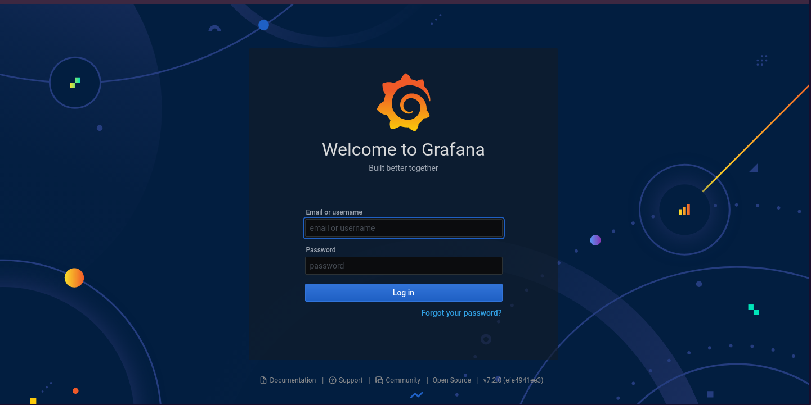
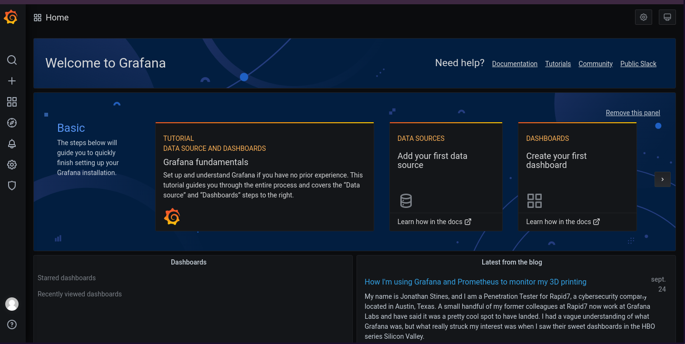
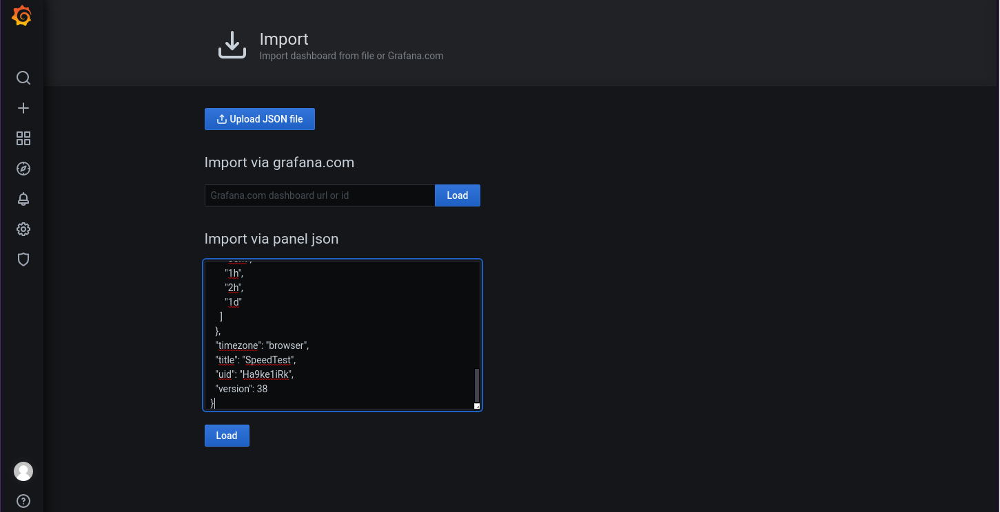
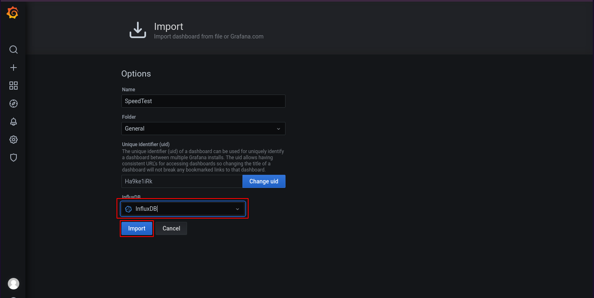
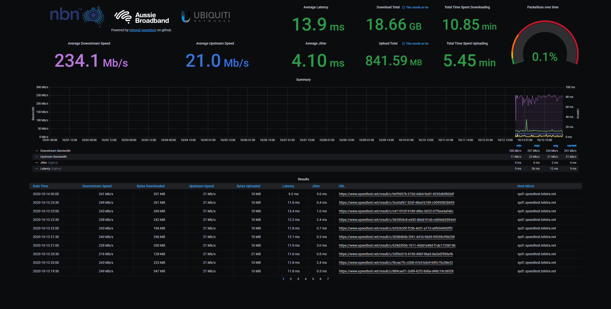

+++
title = 'InfluxDB Telegraf Grafana NEW'
date = 2021-01-18 00:00:00 +0100
categories = ['application']
+++
## Telegraf + InfluxDB + Grafana


En root

### Grafana


```bash
apt-get install -y apt-transport-https
apt-get install -y software-properties-common wget
wget -q -O - https://packages.grafana.com/gpg.key | apt-key add -

echo "deb https://packages.grafana.com/oss/deb stable main" > /etc/apt/sources.list.d/grafana.list

apt-get update
apt-get install grafana
systemctl daemon-reload
systemctl start grafana-server
systemctl status grafana-server
systemctl enable grafana-server
```

*Désactiver les enregistrements*

    nano /etc/grafana/grafana.ini

```
...
[users]
# disable user signup / registration
allow_sign_up = false
...
```

Pour activer les changements, redémarrez Grafana :

    systemctl restart grafana-server

Vérifiez que tout fonctionne en vérifiant le statut service de Grafana :

    systemctl status grafana-server

l’interface d’administration de Grafana est accessible à l’URL <http://127.0.0.1:3000>   
{:width="700"}  
A la première connexion, seul un compte "admin" est créé, avec le mot de passe "admin".  
{:width="700"}   
Créer le nouveau mot de passe

Pour créer les dashboards, vous pouvez récupérer des [dashboards de la communauté Grafana](https://grafana.com/dashboards) ou créer vos propres dashboards.


### InfluxDB + Telegraf


```
curl -sL https://repos.influxdata.com/influxdb.key | apt-key add -

echo "deb https://repos.influxdata.com/debian buster stable" | sudo tee /etc/apt/sources.list.d/influxdb.list

apt update
apt install influxdb telegraf
```

Si non actif (enabled)

    sudo systemctl enable --now influxdb

Par défaut, InfluxDB utilise les ports réseau suivants :  

* Le port TCP 8086 est utilisé pour la communication client-serveur via l'API HTTP d'InfluxDB
* Le port TCP 8088 est utilisé pour le service RPC pour la sauvegarde et la restauration

Créez ensuite un utilisateur avec un mot de passe d'authentification :

    curl -XPOST "http://localhost:8086/query" --data-urlencode "q=CREATE USER username WITH PASSWORD 'strongpassword' WITH ALL PRIVILEGES"

Remplacer :

- **username** par votre propre nom d'utilisateur
- **strongpassword** avec votre propre mot de passe (notez que le mot de passe nécessite des guillemets simples)

On va créer 2 utilisateurs dans **influxDB** : *admin* et *telegraf*  
{: .prompt-info }

Maintenant, chaque fois que vous devez exécuter des commandes influxdb sur le terminal, vous devez spécifier le nom d'utilisateur en utilisant les options `-username` et mot de passe en utilisant `-password`.

    influx -username 'username' -password 'password'

Pour le curl, utilisez `-u` pour spécifier le nom d'utilisateur et le mot de passe séparés par deux points.

    curl -G http://localhost:8086/query -u username:password --data-urlencode "q=SHOW DATABASES"

On peut créer les utilisateurs avec influx en mode cli

```
$ influx
Connected to http://localhost:8086 version 1.7.7
InfluxDB shell version: 1.7.7

> CREATE USER admin WITH PASSWORD 'password' WITH ALL PRIVILEGES
> SHOW USERS

user   admin
----   -----
admin  true
```

## Débit Internet (Speedtest)

### Speedtest by Ookla

Installer le CLI officiel du **SpeedTest** depuis **[SpeedTest.net](https://www.speedtest.net/apps/cli)**   

```bash
sudo apt-get install gnupg apt-transport-https dirmngr
export INSTALL_KEY=379CE192D401AB61
sudo apt-key adv --keyserver keyserver.ubuntu.com --recv-keys 379CE192D401AB61
echo "deb https://ookla.bintray.com/debian generic main" | sudo tee  /etc/apt/sources.list.d/speedtest.list
sudo apt-get update
# Other non-official binaries will conflict with Speedtest CLI
# Example how to remove using apt-get
# sudo apt-get remove speedtest-cli
sudo apt-get install speedtest
```

La commande `speedtest` sera exécutée avec les options et arguments suivants :

*    `-f json`: spécifie le format de retour à json, nous facilitant l’extraction par la suite
*    `--accept-license`: pour accepter en non interactif la license d’utilisation speedtest/Ookla
*    `--accept-gdpr`: pour accepter en non interactif les conditions de conservation/utilisation des résultats par speedtest/Ookla

Où est situé `speedtest`

    which speedtest

/usr/bin/speedtest

Effectuer un test de vitesse avec les arguments pour accepter la licence

    /usr/bin/speedtest --accept-license --accept-gdpr

```
License acceptance recorded. Continuing.


   Speedtest by Ookla

     Server: fdcservers.net - Paris (id = 6027)
        ISP: Free SAS
    Latency:    36.33 ms   (1.89 ms jitter)
   Download:     5.86 Mbps (data used: 6.6 MB)                               
     Upload:     0.87 Mbps (data used: 883.3 kB)                               
Packet Loss:     0.0%
 Result URL: https://www.speedtest.net/result/c/c2afe835-66f4-49cf-842b-243d1bf73714
```

Test en json

    /usr/bin/speedtest --accept-license --accept-gdpr -f json-pretty

```json
{
    "type": "result",
    "timestamp": "2021-01-17T13:13:04Z",
    "ping": {
        "jitter": 4.4880000000000004,
        "latency": 35.834000000000003
    },
    "download": {
        "bandwidth": 718477,
        "bytes": 3960280,
        "elapsed": 5501
    },
    "upload": {
        "bandwidth": 104646,
        "bytes": 857216,
        "elapsed": 8712
    },
    "packetLoss": 0,
    "isp": "Free SAS",
    "interface": {
        "internalIp": "192.168.0.46",
        "name": "eth0",
        "macAddr": "02:C2:09:40:F2:2B",
        "isVpn": false,
        "externalIp": "82.64.18.243"
    },
    "server": {
        "id": 16476,
        "name": "Naitways",
        "location": "Paris",
        "country": "France",
        "host": "speedtest.naitways.net",
        "port": 8080,
        "ip": "185.175.150.6"
    },
    "result": {
        "id": "3752ae3d-5625-4d7b-b986-d8491fd4be61",
        "url": "https://www.speedtest.net/result/c/3752ae3d-5625-4d7b-b986-d8491fd4be61"
    }
}

```

La définition de quelques champs du résultat

*    *result_id*: l’id unique du test chez Speedtest/Ookla
*    *ping_latency*: la latence du ping en millisecondes
*    *download_bandwidth*: le débit descendant de notre connexion internet en bytes par secondes
*    *upload_bandwidth*: le débit montant de notre connexion internet en bytes par secondes

### Speedtest telegraf

Ajouter la configuration `speedtest.conf` dans **telegraf**  sous `/etc/telegraf/telegraf.d`  
OU copier la configuration et l'ajouter à votre `telegraf.conf`

    sudo nano /etc/telegraf/telegraf.d/speedtest.conf

```
[[inputs.exec]]
#commands = ["/usr/bin/speedtest -s 2629 -f json-pretty --accept-license --accept-gdpr"] #Specified Telstra Sydney
commands = ["/usr/bin/speedtest -f json-pretty --accept-license --accept-gdpr"]
name_override = "Speedtest"
timeout = "2m"
interval = "30m"
data_format = "json"
json_string_fields = [  "timestamp",
                        "download_bandwidth",
                        "download_bytes",
                        "upload_bandwidth",
                        "upload_bytes",
                        "ping_latency",
                        "ping_jitter",
                        "server_name",
                        "server_host",
                        "result_url" ]


[[outputs.influxdb]]
  urls = ["http://localhost:8086"] # required
  database = "telegraf" # required
  retention_policy = ""
  write_consistency = "any"
  timeout = "15s"
  username = "telegraf"
  password = "xxxxxxxxxxxxxxxxxxxxxxxx"
  #user_agent = "telegraf"
```

Redémarrer le télégraphe `sudo systemctl restart telegraf`

>p.s. Ne fixez pas l'intervalle trop court ou vous risquez de vous faire interdire...

### Speedtest InfluxDB

Un regard sur les données capturées

    influx -username 'telegraf' -password 'xxxxx'

```bash
Connected to http://localhost:8086 version 1.8.3
InfluxDB shell version: 1.8.3
> SHOW DATABASES;
name: databases
name
----
_internal
telegraf
> USE telegraf;
Using database telegraf
> SHOW measurements;
name: measurements
name
----
Speedtest
cpu
disk
diskio
kernel
mem
processes
swap
system
> SELECT * FROM Speedtest;
name: Speedtest
time                download_bandwidth download_bytes download_elapsed host          interface_externalIp packetLoss        ping_jitter ping_latency result_url                                                              server_host                     server_id server_ip              server_location server_name    server_port upload_bandwidth upload_bytes upload_elapsed
----                ------------------ -------------- ---------------- ----          -------------------- ----------        ----------- ------------ ----------                                                              -----------                     --------- ---------              --------------- -----------    ----------- ---------------- ------------ --------------
1610890238000000000 472399             5613896        13510            a20-olinuxino 82.64.18.243         9.701492537313433 6.231       110.508      https://www.speedtest.net/result/c/d0486818-3173-43a2-8b86-fd30f4b5a68a speedtest.maasaki.fr            37297     51.178.108.168         Paris           Ineside France 8080        49359            562240       11522
1610891134000000000 369545             3246416        9102             a20-olinuxino 82.64.18.243         0                 9.994       89.355       https://www.speedtest.net/result/c/5805c1be-a02c-4da4-ac3e-d3a6bfc3abe8 speedtest.naitways.net          16476     185.175.150.6          Paris           Naitways       8080        31767            470600       15012
1610892042000000000 598953             7574400        15002            a20-olinuxino 2a01:e0a:2de:2c71::1 0                 4.037       109.277      https://www.speedtest.net/result/c/5f110bc3-7616-44f3-a1c7-1a9f15353e04 montsouris3.speedtest.orange.fr 24215     2a01:cb04:2004:4001::3 Paris           ORANGE FRANCE  8080        53554            751680       15009
>QUIT
```

### Speedtest grafana

Pour vous connecter a l’interface web de Grafana, rendez vous à l’url <http://localhost:3000/>  
Saisir le mot de passe de l'utilisateur **admin**  

[telegraf-speedtest](https://github.com/risb0r/telegraf-speedtest) et copier le json <https://raw.githubusercontent.com/risb0r/telegraf-speedtest/master/Speedtest.net-metrics.json>  
Dans le menu survolez le + (Create) puis sélectionnez “Import”.
collez le dans la zone “Import via panel json”  
{:width="700"}  
puis chargez le (bouton “Load”).  
{:width="700"}  
Sélection InfluxDB et Cliquer sur "Import"  

{:width="700"}  

