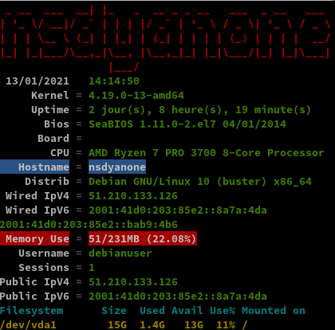

+++
title = 'Hostnamaste VPS KVM-256 debian 10 - nsdyanone'
date = 2021-01-30 00:00:00 +0100
categories = vps serveur
+++
[](https://www.hostnamaste.com/)*256 MB RAM, 15 GB Storage, 256 GB Bandwidth, 1 x vCPU Core, 1 x IPv4 Address*

**KVM-256**

```
Hostname : nsdyanone
nsy1,nsy2

256 MB RAM
256 vSwap RAM
15 GB Storage
256 GB Bandwidth
1 x vCPU Core
1 x IPv4 Address 51.210.133.126
1 x IPv6 Address 2001:41d0:203:85e2::bab9:4b6
Multiple OSes
Complete Root Access
KVM + SolusVM Access
```

## {:width="100"} Debian 10

Connexion ssh

    ssh root@51.210.133.126

Mise à jour et reboot

    apt update && apt -y upgrade
    apt install sudo
    reboot

Reconnexion via ssh

**Réseau**

    ip a

```
1: lo: <LOOPBACK,UP,LOWER_UP> mtu 65536 qdisc noqueue state UNKNOWN group default qlen 1000
    link/loopback 00:00:00:00:00:00 brd 00:00:00:00:00:00
    inet 127.0.0.1/8 scope host lo
       valid_lft forever preferred_lft forever
    inet6 ::1/128 scope host 
       valid_lft forever preferred_lft forever
2: eth0: <BROADCAST,MULTICAST,UP,LOWER_UP> mtu 1500 qdisc pfifo_fast state UP group default qlen 1000
    link/ether 02:00:00:fb:a1:c1 brd ff:ff:ff:ff:ff:ff
    inet 51.210.133.126/32 brd 51.210.133.126 scope global eth0
       valid_lft forever preferred_lft forever
    inet6 2001:41d0:203:85e2::8a7a:4da/64 scope global 
       valid_lft forever preferred_lft forever
    inet6 2001:41d0:203:85e2::bab9:4b6/64 scope global 
       valid_lft forever preferred_lft forever
    inet6 fe80::ff:fefb:a1c1/64 scope link 
       valid_lft forever preferred_lft forever
```

**Disques**

    df -h

```
Filesystem      Size  Used Avail Use% Mounted on
udev            102M     0  102M   0% /dev
tmpfs            24M  840K   23M   4% /run
/dev/vda1        15G  1.3G   13G  10% /
tmpfs           116M     0  116M   0% /dev/shm
tmpfs           5.0M     0  5.0M   0% /run/lock
tmpfs           116M     0  116M   0% /sys/fs/cgroup
tmpfs            24M     0   24M   0% /run/user/0
```

**Versions noyau et debian**  

Linux nsdyanone 4.19.0-13-amd64 #1 SMP Debian 4.19.160-2 (2020-11-28) x86_64 GNU/Linux  
10.7

Mot de passe sur utilisateur existant "debianuser"

    passwd debianuser

Installer sudo  `apt install sudo`  
Visudo pour les accès root via utilisateur **debianuser**  

    echo "debianuser     ALL=(ALL) NOPASSWD: ALL" >> /etc/sudoers

Fermer la connexion root ssh

### {:width=80"} OpenSSH, clé et script

**connexion avec clé**  
<u>sur l'ordinateur de bureau</u>
Générer une paire de clé curve25519-sha256 (ECDH avec Curve25519 et SHA2) nommé **kvm-256-1** pour une liaison SSH avec le serveur KVM.  

    ssh-keygen -t ed25519 -o -a 100 -f ~/.ssh/kvm-256-1

Envoyer la clé publique sur le serveur KVM   

    scp ~/.ssh/kvm-256-1.pub debianuser@51.210.133.126:/home/debianuser/

<u>sur le serveur KVM</u>
On se connecte  

    ssh debianuser@51.210.133.126

Copier le contenu de la clé publique dans /home/$USER/.ssh/authorized_keys  

    cd ~

Sur le KVM ,créer un dossier .ssh  

```bash
mkdir .ssh
cat $HOME/kvm-256-1.pub >> $HOME/.ssh/authorized_keys
chmod 600 $HOME/.ssh/authorized_keys  # donner les droits
rm $HOME/kvm-256-1.pub  # effacer le fichier de la clé  
```

Modifier la configuration serveur SSH  

    sudo nano /etc/ssh/sshd_config  

Modifier

```conf
Port 55126
PermitRootLogin no  
PasswordAuthentication no 
```

<u>session SSH ne se termine pas correctement lors d'un "reboot" à distance</u>  
Si vous tentez de **redémarrer/éteindre** une machine distance par **ssh**, vous pourriez constater que votre session ne se termine pas correctement, vous laissant avec un terminal inactif jusqu'à l'expiration d'un long délai d'inactivité. Il existe un bogue 751636 à ce sujet. Pour l'instant, la solution de contournement à ce problème est d'installer :  

    sudo apt install libpam-systemd  # installé par défaut sur debian buster

cela terminera la session ssh avant que le réseau ne tombe.  
Veuillez noter qu'il est nécessaire que PAM soit activé dans sshd.  

Relancer openSSH  

    sudo systemctl restart sshd

Accès depuis le poste distant avec la clé privée  

    ssh -p 55126 -i ~/.ssh/kvm-256-1 debianuser@51.210.133.126

### Outils, scripts motd et ssh_rc_bash

Installer utilitaires  

    sudo apt install rsync curl tmux jq figlet git dnsutils tree -y


Motd

    sudo rm /etc/motd && sudo nano /etc/motd

```
               _                                         
  _ _   ___ __| | _  _  __ _  _ _   ___  _ _   ___       
 | ' \ (_-</ _` || || |/ _` || ' \ / _ \| ' \ / -_)      
 |_||_|/__/\__,_| \_, |\__,_||_||_|\___/|_||_|\___|      
  ___  _     ___  |__/__     _  ____ ____    _  ___   __ 
 | __|/ |   |_  )/ | /  \   / ||__ /|__ /   / ||_  ) / / 
 |__ \| | _  / / | || () |_ | | |_ \ |_ \ _ | | / / / _ \
 |___/|_|(_)/___||_| \__/(_)|_||___/|___/(_)|_|/___|\___/
```


Script **ssh_rc_bash**  
>**ATTENTION!!! Les scripts sur connexion peuvent poser des problèmes pour des appels externes autres que ssh**

    wget https://static.xoyaz.xyz/files/ssh_rc_bash
    chmod +x ssh_rc_bash # rendre le bash exécutable
    ./ssh_rc_bash        # exécution



## {:width=50"} Wireguard

* <https://www.wireguard.com/quickstart/>  
* <https://wiki.archlinux.org/index.php/WireGuard>
* [Procedure: Ubuntu 20.04 set up WireGuard VPN server](https://www.cyberciti.biz/faq/ubuntu-20-04-set-up-wireguard-vpn-server/)
* [Alpine Linux set up WireGuard VPN server](https://www.cyberciti.biz/faq/how-to-set-up-wireguard-vpn-server-on-alpine-linux/)

### Installer noyau 5.8+

*A partir du noyau 5.6 le module wireguard est intégré*

    echo "deb http://deb.debian.org/debian/ unstable main" | tee /etc/apt/sources.list.d/unstable-wireguard.list
    printf 'Package: *\nPin: release a=unstable\nPin-Priority: 90\n' | tee /etc/apt/preferences.d/limit-unstable
    apt update && apt upgrade

Rechercher l'image
    
    apt search linux-image-5

```
linux-image-5.10.0-1-amd64/unstable 5.10.4-1 amd64
  Linux 5.10 for 64-bit PCs (signed)
linux-headers-5.10.0-1-amd64/unstable 5.10.4-1 amd64
  Header files for Linux 5.10.0-1-amd64
```

Installer le noyau

    apt install linux-image-5.10.0-1-amd64

>**REDEMARRER `systemctl reboot`**

Connexion SSH 

Vérifications `uname -a`   
*Linux nsdyanone 5.10.0-1-amd64 #1 SMP Debian 5.10.4-1 (2020-12-31) x86_64 GNU/Linux*

Supprimer les images non utilisées

    sudo apt remove 4.19.0-13-amd64 

### Wireguard - base

*WireGuard est un serveur VPN à code source ouvert, gratuit, moderne et rapide, doté d'une cryptographie de pointe. Il est plus rapide et plus simple que l'IPSec et l'OpenVPN*  

>**Toutes les commandes suivantes , en mode su**

Wireguard est dans le noyau 5.6+

    apt install wireguard

**Autoriser le serveur Wireguard à relayer les paquets **

Autoriser le serveur Wireguard à relayer les paquets venant de ces clients vers l'internet et de traiter les paquets retours (modifier **/etc/sysctl.conf**)

```
sed -i 's/^#net.ipv4.ip_forward=1/net.ipv4.ip_forward=1/' /etc/sysctl.conf
sed -i 's/^#net.ipv6.conf.all.forwarding=1/net.ipv6.conf.all.forwarding=1/' /etc/sysctl.conf
sysctl -p # prise en compte immédiate
```

Résultat

```
net.ipv4.ip_forward = 1
net.ipv6.conf.all.forwarding = 1
```

**Générer une paire de clés**

On se positionne dans le dossier **/etc/wireguard/**  

    cd /etc/wireguard

WireGuard repose sur une authentification par clé publique/privée (cryptographie asymétrique), vous devez donc créer ces clés avec les sous-commandes wg genkey et wg pubkey  
La création de la clé privée se fait avec wg genkey et la clé publique est générée en la canalisant dans wg pubkey

    umask 077; wg genkey | tee wgnsd.key | wg pubkey > wgnsd.pub

**Générer des clés pour chaque "peer"**

    umask 077; wg genkey | tee peer_B.key | wg pubkey > peer_B.pub
    umask 077; wg genkey | tee peer_C.key | wg pubkey > peer_C.pub
    umask 077; wg genkey | tee peer_D.key | wg pubkey > peer_D.pub

On peut également générer une clé pré-partagée pour ajouter une couche supplémentaire de cryptographie à clé symétrique qui sera mélangée à la cryptographie à clé publique déjà existante, pour une résistance post-quantique. Une clé pré-partagée doit être générée pour chaque paire de pairs et ne doit pas être réutilisée. Par exemple, trois pairs interconnectés, A, B, C et D, auront besoin de duatre clés pré-partagées distinctes, une pour chaque paire de pairs.

Le pair A écoutera sur le port UDP 51871 et acceptera la connexion des pairs B, C et D. 

Générez une clé pré-partagée pour chaque paire de pairs en utilisant la commande suivante : 

    umask 077; wg genpsk > wgnsd-peer_B.psk
    umask 077; wg genpsk > wgnsd-peer_C.psk
    umask 077; wg genpsk > wgnsd-peer_D.psk

**Fichier de configuration /etc/wireguard/wg0.conf**

Récupérer le nom de la carte réseau `ip a` , dans notre cas **eth0**  

La première étape consiste à choisir une plage IPV4 privée, [Random IPV4 Private Address Generator](https://www.fakeaddresstool.com/random-ipv4-private-generator/), qui sera utilisée par le serveur : **10.22.1.0/8**  

Pour une adresse IPV6 [Local IPv6 Address Generator](https://www.ultratools.com/tools/rangeGenerator)  : **fd5c:ecbe:9c7c:dd5e::/64**  

Prefix/L|  fd
--------|--------
Global ID|  5cecbe9c7c
Subnet ID|  dd5e
Combine/CID|  fd5c:ecbe:9c7c:dd5e::/64
IPv6 addresses|  fd5c:ecbe:9c7c:dd5e::/64:XXXX:XXXX:XXXX:XXXX
Start Range|  fd5c:ecbe:9c7c:dd5e:0:0:0:0
End Range|  fd5c:ecbe:9c7c:dd5e:ffff:ffff:ffff:ffff
No. of hosts|  18446744073709551616


Le serveur aura l'adresse IP suivante: 10.22.1.1 . Il est également nécessaire de choisir un port, qui sera exposé publiquement, pour que le serveur écoute.Le port de documentation standard est généralement 51820.

Créer le fichier **/etc/wireguard/wg0.conf** serveur wgnsd

    /etc/wireguard/wg0.conf

```
[Interface]
Address = 10.22.1.1/24, fd5c:ecbe:9c7c:dd5e::/64
ListenPort = 52201
PostUp = iptables -A FORWARD -i wg0 -j ACCEPT; iptables -t nat -A POSTROUTING -o eth0 -j MASQUERADE; ip6tables -A FORWARD -i wg0 -j ACCEPT; ip6tables -t nat -A POSTROUTING -o eth0 -j MASQUERADE
PostDown = iptables -D FORWARD -i wg0 -j ACCEPT; iptables -t nat -D POSTROUTING -o eth0 -j MASQUERADE; ip6tables -D FORWARD -i wg0 -j ACCEPT; ip6tables -t nat -D POSTROUTING -o eth0 -j MASQUERADE
# wgnsd_PRIVATE_KEY
PrivateKey = 5Z........................................mk=
DNS = 10.22.1.1, fd5c:ecbe:9c7c:dd5e::1

[Peer]
# PEER_B_PUBLIC_KEY peer_B.pub
PublicKey = X8............................................=
# wgnsd-PEER_B-PRESHARED_KEY wgnsd-peer_B.psk
PresharedKey = bf.......................................Ug= 
AllowedIPs = 10.22.1.2/32, fd5c:ecbe:9c7c:dd5e::2/128

[Peer]
# PEER_C_PUBLIC_KEY peer_C.pub
PublicKey = Gl..........................................30=
# wgnsd-PEER_C-PRESHARED_KEY wgnsd-peer_C.psk
PresharedKey = +I9.......................................A=
AllowedIPs = 10.22.1.3/32, fd5c:ecbe:9c7c:dd5e::3/128

[Peer]
# PEER_D_PUBLIC_KEY peer_D.pub
PublicKey = if..........................................Q4=
# wgnsd-PEER_D-PRESHARED_KEY wgnsd-peer_D.psk
PresharedKey = WG.......................................CE=
AllowedIPs = 10.22.1.4/32, fd5c:ecbe:9c7c:dd5e::4/128
```

**Address** , fixer l'adresse IP privée du serveur à l'intérieur du VPN.Les adresses du réseau VPN de 10.22.1.0 à 10.22.1.255 sont fixées par le masque **/24** et fd5c:ecbe:9c7c:dd5e::1 à fd5c:ecbe:9c7c:dd5e::ffff sont fixées par le masque **/128**  
**PostUp** , pour la mise en place des règles iptables de translation d'adresses à l'activation du VPN (autoriser le routage des paquets réseau venant des clients vers internet)  
**PostDown** , pour la suppression des règles iptables de translation d'adresses à l'arrêt du VPN  
**PrivateKey** , clé privée du serveur (wgnsd.key)  
**DNS =** Pour utiliser un pair comme serveur DNS, définissez DNS = wireguard_internal_ip_address_of_peer dans la section [Interface]. Les domaines de recherche sont également définis avec l'option DNS =. Séparez toutes les valeurs dans la liste par des virgules.
**AllowedIPs =** Pour acheminer tout le trafic du tunnel vers un pair spécifique, ajoutez l'itinéraire par défaut (0.0.0.0/0 pour IPv4 et ::/0 pour IPv6) à AllowedIPs. Par exemple, AllowedIPs = 0.0.0.0/0, ::/0. wg-quick se chargera automatiquement de configurer le routage correct et fwmark [5] pour que le réseau fonctionne toujours.

Les fichiers des pairs (peers)

    /etc/wireguard/wg0.conf # peer_B

```
[Interface]
Address = 10.22.1.2/32, fd5c:ecbe:9c7c:dd5e::2/128
PrivateKey = PEER_B_PRIVATE_KEY
DNS = 10.22.1.1, fd5c:ecbe:9c7c:dd5e::1

[Peer]
PublicKey = wgnsd_PUBLIC_KEY
PresharedKey = wgnsd-PEER_B-PRESHARED_KEY
AllowedIPs = 0.0.0.0/0, ::/0
Endpoint = 51.210.133.126:52201
```

    /etc/wireguard/wg0.conf # peer_C

```
[Interface]
Address = 10.22.1.3/32, fd5c:ecbe:9c7c:dd5e::3/128
PrivateKey = PEER_B_PRIVATE_KEY
DNS = 10.22.1.1, fd5c:ecbe:9c7c:dd5e::1

[Peer]
PublicKey = wgnsd_PUBLIC_KEY
PresharedKey = wgnsd-PEER_B-PRESHARED_KEY
AllowedIPs = 0.0.0.0/0, ::/0
Endpoint = 51.210.133.126:52201
```

    /etc/wireguard/wg0.conf # peer_D

```
[Interface]
Address = 10.22.1.4/32, fd5c:ecbe:9c7c:dd5e::4/128
PrivateKey = PEER_B_PRIVATE_KEY
DNS = 10.22.1.1, fd5c:ecbe:9c7c:dd5e::1

[Peer]
PublicKey = wgnsd_PUBLIC_KEY
PresharedKey = wgnsd-PEER_B-PRESHARED_KEY
AllowedIPs = 0.0.0.0/0, ::/0
Endpoint = 51.210.133.126:52201
```

Modifier les droits des fichiers **wg0.conf** (lecture uniquement par "root")

    chmod 600 /etc/wireguard/wg0.conf

### DNS Unbound

{:width="100"}

Un problème majeur avec beaucoup de configurations VPN est que le DNS n'est pas suffisant. Cela finit par une fuite de connexion client et de détails d'emplacement. Un bon moyen de tester cela est à travers le site <http://dnsleak.com/>

Nous allons sécuriser le trafic DNS avec la solution **unbound** qui offre les caractéristiques suivantes

* Léger et rapide
* Facile à installer et à configurer
* Orienté sécurité
* Prise en charge DNSSEC 

Nous allons le configurer de manière à contrer les fuites DNS, les attaques plus sophistiquées comme la fausse configuration de proxy, les routeurs escrocs et toutes sortes d'attaques MITM sur HTTPS et autres protocoles.

Nous installons unbound sur le serveur    
Passage en mode super utilisateur

    sudo -s # ou su

>ATTENTION : Le programme **resolvconf** est en général seulement nécessaire quand un système a plusieurs programmes qui ont besoin de modifier de façon dynamique les informations sur les serveurs de noms de domaine. Sur un système simple où les serveurs de noms de domaine ne changent pas souvent ou bien ne sont modifiés que par un programme, le <u>fichier de configuration **resolv.conf** est suffisant</u>.  
Il faut installer **resolvconf**, sinon on a une erreur **unbound-resolvconf**  
Une fois le paquet «  **resolvconf**  » installé, <u>il ne faut plus modifier le fichier</u> « **/etc/resolv.conf**  », car le contenu de celui-ci sera automatiquement géré et remplacé par «  **resolvconf**  ».

Installation des outils dns, des paquets Unbound et resolv :  

    apt install unbound unbound-host resolvconf -y

Téléchargement de la liste des serveurs DNS racines

    curl -o /var/lib/unbound/root.hints https://www.internic.net/domain/named.cache
    chown unbound:unbound /var/lib/unbound/root.hints

Ajout d'un fichier de configuration **dns-KVM-256.conf**  

    /etc/unbound/unbound.conf.d/dns-KVM-256.conf 
    
```    
server:
    num-threads: 4

    # enable logs
    verbosity: 0  # no verbosity,  only  errors

    # liste des serveurs DNS racine
    root-hints: "/var/lib/unbound/root.hints"

    # Répondre aux requêtes DNS sur toutes les interfaces
    interface: 0.0.0.0                          # 0.0.0.0 unbound sur plusieurs interfaces
    interface: ::0
    max-udp-size: 3072

    # IPs authorised to access the DNS Server
    access-control: 0.0.0.0/0                 refuse
    access-control: 127.0.0.0/8               allow
    access-control: 10.22.1.0/16             allow

    access-control: ::0/0                     refuse
    access-control: ::1                       allow
    access-control: fe80::/10                 allow
    access-control: fd5c:ecbe:9c7c:dd5e::/48  allow

    local-zone: "22.10.in-addr.arpa." transparent

    #hide DNS Server info
    hide-identity: yes
    hide-version: yes

    # limit DNS fraud and use DNSSEC
    harden-glue: yes
    harden-dnssec-stripped: yes
    harden-referral-path: yes

    # add an unwanted reply threshold to clean the cache and avoid, when possible, DNS poisoning
    unwanted-reply-threshold: 10000000

    # have the validator print validation failures to the log
    val-log-level: 1

    # minimum lifetime of cache entries in seconds
    cache-min-ttl: 1800

    # maximum lifetime of cached entries in seconds
    cache-max-ttl: 14400
    prefetch: yes
    prefetch-key: yes

#include: /etc/unbound/unbound.conf.d/adslist.txt 
```

Droits

    chown -R unbound:unbound /var/lib/unbound

Pour vérifier si le fichier de configuration est valide

    unbound-checkconf /etc/unbound/unbound.conf.d/dns-KVM-256.conf

*unbound-checkconf: no errors in /etc/unbound/unbound.conf.d/dns-KVM-256.conf*  
Désactiver systemd-resolved (si utilisé)

    systemctl stop systemd-resolved
    systemctl disable systemd-resolved

Activer Unbound (ILS SONT ACTIFS DES LEUR INSTALLATION) 

    systemctl enable unbound-resolvconf
    systemctl enable unbound

>**Redémarrer le serveur `systemctl reboot`**

Après redémarrage et connexion au serveur

    systemctl status unbound unbound-resolvconf resolvconf

```
● unbound.service - Unbound DNS server
   Loaded: loaded (/lib/systemd/system/unbound.service; enabled; vendor preset: enabled)
   Active: active (running) since Wed 2021-01-13 14:58:41 EST; 30s ago
     Docs: man:unbound(8)
  Process: 437 ExecStartPre=/usr/lib/unbound/package-helper chroot_setup (code=exited, status=0/SUCC
  Process: 443 ExecStartPre=/usr/lib/unbound/package-helper root_trust_anchor_update (code=exited, s
 Main PID: 448 (unbound)
    Tasks: 4 (limit: 230)
   Memory: 24.8M
   CGroup: /system.slice/unbound.service
           └─448 /usr/sbin/unbound -d

Jan 13 14:58:39 nsdyanone systemd[1]: Starting Unbound DNS server...
Jan 13 14:58:41 nsdyanone package-helper[443]: /var/lib/unbound/root.key has content
Jan 13 14:58:41 nsdyanone package-helper[443]: success: the anchor is ok
Jan 13 14:58:41 nsdyanone systemd[1]: Started Unbound DNS server.
Jan 13 14:58:41 nsdyanone unbound[448]: [448:0] info: start of service (unbound 1.9.0).

● unbound-resolvconf.service - Unbound DNS server via resolvconf
   Loaded: loaded (/lib/systemd/system/unbound-resolvconf.service; enabled; vendor preset: enabled)
   Active: active (exited) since Wed 2021-01-13 14:58:41 EST; 30s ago
  Process: 453 ExecStart=/usr/lib/unbound/package-helper resolvconf_start (code=exited, status=0/SUC

Jan 13 14:58:41 nsdyanone systemd[1]: Started Unbound DNS server via resolvconf.

● resolvconf.service - Nameserver information manager
   Loaded: loaded (/lib/systemd/system/resolvconf.service; enabled; vendor preset: enabled)
   Active: active (exited) since Wed 2021-01-13 14:58:36 EST; 35s ago
     Docs: man:resolvconf(8)
  Process: 169 ExecStartPre=/bin/mkdir -p /run/resolvconf/interface (code=exited, status=0/SUCCESS)
  Process: 177 ExecStartPre=/bin/touch /run/resolvconf/postponed-update (code=exited, status=0/SUCCE
  Process: 190 ExecStart=/sbin/resolvconf --enable-updates (code=exited, status=0/SUCCESS)
 Main PID: 190 (code=exited, status=0/SUCCESS)

Jan 13 14:58:36 nsdyanone systemd[1]: Started Nameserver information manager.
Warning: Journal has been rotated since unit was started. Log output is incomplete or unavailable.
```

**Créer un lien**  

    rm /etc/resolv.conf
    ln -s /etc/resolvconf/run/resolv.conf /etc/resolv.conf

**Vérifications**

Les commandes suivantes ne fonctionneront que si le paquet "dnsutils" est installé sur votre système Debian!

On teste en utilisant les serveurs DNS locaux

	dig @127.0.0.1 afnic.fr +short +dnssec

```
192.134.5.37
A 13 2 600 20210205065724 20210106120632 31668 afnic.fr. TaZQ2+Sm2ujp+uTqGyxz2EXMo2/UnZsqVUnsiH5/sXixeqJJ/rczjDlu wrFJ/hRuHFoPowssiGjVhOvzk61SPQ==
```

**Mise à jour des serveurs DNS racines**

Télécharger le script

    curl -o /etc/unbound/dnsunbound-update-root-dns.sh https://static.xoyaz.xyz/files/dnsunbound-update-root-dns.sh

Droits en exécution pour le bash **dnsunbound-update-root-dns.sh**

    chmod +x /etc/unbound/dnsunbound-update-root-dns.sh

Planification journalière

    crontab -e

Ajouter en fin de fichier

```
# Mise à jour automatique des serveurs DNS de la racine
10 02 * * * /etc/unbound/dnsunbound-update-root-dns.sh > /dev/null
```

### {:width="50"} Parefeu

*UFW, ou pare - feu simple , est une interface pour gérer les règles de pare-feu dans Arch Linux, Debian ou Ubuntu. UFW est utilisé via la ligne de commande (bien qu'il dispose d'interfaces graphiques disponibles), et vise à rendre la configuration du pare-feu facile (ou simple).*

Installation **Debian / Ubuntu**

    sudo apt install ufw

*Par défaut, les jeux de règles d'UFW sont vides, de sorte qu'il n'applique aucune règle de pare-feu, même lorsque le démon est en cours d'exécution.*   

Les règles 

    sudo ufw allow 55126/tcp  # port SSH
    sudo ufw allow DNS        # port 53
    sudo ufw allow 52201/udp  # wireguard

Activer le parefeu

    sudo ufw enable

```
Command may disrupt existing ssh connections. Proceed with operation (y|n)? y
Firewall is active and enabled on system startup
```

Status

     sudo ufw status verbose

```
Status: active
Logging: on (low)
Default: deny (incoming), allow (outgoing), disabled (routed)
New profiles: skip

To                         Action      From
--                         ------      ----
55126/tcp                  ALLOW IN    Anywhere                  
53 (DNS)                   ALLOW IN    Anywhere                  
52201/udp                  ALLOW IN    Anywhere                  
55126/tcp (v6)             ALLOW IN    Anywhere (v6)             
53 (DNS (v6))              ALLOW IN    Anywhere (v6)             
52201/udp (v6)             ALLOW IN    Anywhere (v6)             
```

### Tester wireguard

Sur le serveur et le client wireguard (en mode su)

    cd /etc/wireguard

**Serveur wireguard**

Lancement wireguard

    wg-quick up wg0

```
[#] ip link add wg0 type wireguard
[#] wg setconf wg0 /dev/fd/63
[#] ip -4 address add 10.22.1.1/24 dev wg0
[#] ip -6 address add fd5c:ecbe:9c7c:dd5e::1/64 dev wg0
[#] ip link set mtu 1420 up dev wg0
[#] resolvconf -a tun.wg0 -m 0 -x
[#] iptables -A FORWARD -i wg0 -j ACCEPT; iptables -t nat -A POSTROUTING -o eth0 -j MASQUERADE; ip6tables -A FORWARD -i wg0 -j ACCEPT; ip6tables -t nat -A POSTROUTING -o eth0 -j MASQUERADE
```

Vérifications

    wg show

```
interface: wg0
  public key: 92piUz90FvUS+OfiE1X8iha3vEKQ2LN25rP9UghtN1M=
  private key: (hidden)
  listening port: 51955

peer: XAYXu2DHOieEU7BmUlYx3eDqTCHJNGwlf/dg8VTTT3U=
  preshared key: (hidden)
  allowed ips: 10.22.1.2/32, fd5c:ecbe:9c7c:dd5e::2/128

peer: qlVrUX4ON5xwXl/TgH7S+6dWIIdWB89rQ9xYxwqSMhA=
  preshared key: (hidden)
  allowed ips: 10.22.1.3/32, fd5c:ecbe:9c7c:dd5e::3/128

peer: TqTt+KQTuGsRBAPf49hBCO5ylxkt43kqJliXh8CGmEU=
  preshared key: (hidden)
  allowed ips: 10.22.1.4/32, fd5c:ecbe:9c7c:dd5e::4/128
```

**Client wireguard**  
Après avoir copié le fichier de configuration /etc/wireguard/wg0.conf  
Lancement wireguard

    wg-quick up wg0

```
[#] ip link add wg0 type wireguard
[#] wg setconf wg0 /dev/fd/63
[#] ip -4 address add 10.22.1.2/32 dev wg0
[#] ip -6 address add fd5c:ecbe:9c7c:dd5e::2/128 dev wg0
[#] ip link set mtu 1420 up dev wg0
[#] resolvconf -a wg0 -m 0 -x
[#] wg set wg0 fwmark 51820
[#] ip -6 route add ::/0 dev wg0 table 51820
[#] ip -6 rule add not fwmark 51820 table 51820
[#] ip -6 rule add table main suppress_prefixlength 0
[#] ip6tables-restore -n
[#] ip -4 route add 0.0.0.0/0 dev wg0 table 51820
[#] ip -4 rule add not fwmark 51820 table 51820
[#] ip -4 rule add table main suppress_prefixlength 0
[#] sysctl -q net.ipv4.conf.all.src_valid_mark=1
[#] iptables-restore -n
```

Vérifications

    ip a show wg0

```
9: wg0: <POINTOPOINT,NOARP,UP,LOWER_UP> mtu 1420 qdisc noqueue state UNKNOWN group default qlen 1000
    link/none 
    inet 10.22.1.2/32 scope global wg0
       valid_lft forever preferred_lft forever
    inet6 fd5c:ecbe:9c7c:dd5e::2/128 scope global 
       valid_lft forever preferred_lft forever
```

DNS V4 V6

Les commandes `dig @10.22.1.1 afnic.fr +short +dnssec` et `dig @fd5c:ecbe:9c7c:dd5e::1 afnic.fr +short +dnssec` donnent le résultat suivant

```
A 13 2 600 20210120124535 20201221100316 31668 afnic.fr. HZhLWz7CHV/aeLoxBVrqFM1mWQHPBt+OOMEJtJod7r7lKxEbGGT2+WB2 W1FZ3D4jT1K+1dyRpTJXgmo13u8P0Q==
```

**Activer wireguard**  
Pour une activation permanente de wireguard serveur et client

    sudo systemctl start wg-quick@wg0.service
    sudo systemctl enable wg-quick@wg0.service

### Wireguard web manager

Prérequis :  

- [Debian installer Go + Node](/posts/Debian_installer_Go+Node/)  
- Installer la version compilée de wg-gen-web &rarr; `/opt/appwg/`

Arrêter wg-quick : `sudo systemctl stop wg-quick@wg0.service`  
Déplacer le dossier `/etc/wireguard` &rarr; `~/wireguard.sav`

Créer le dossier wireguard et copier le fichier `wg0.conf`

    sudo mkdir /etc/wireguard
    sudo cp ~/wireguard.sav/wg0.conf /etc/wireguard/

Créer un fichier `/etc/wireguard/server.json` à l'identique du fichier wg0.conf

```json
{
 "address": [
    "fd18:2941:0ae9:7d96::1/64",
    "10.14.94.1/24"
  ],
  "listenPort": 51820,
  "mtu": 0,
  "privateKey": "UEQCgh/6a2RQbF9+qqylVjqLCK/mRwqRPc/4vjRsYXg=",
  "publicKey": "0s1wsNpuU1RlKgj6AmoN0aKUeb+aESByhO3yTSnfTyE=",
  "endpoint": "xoyaz.xyz:51820",
  "persistentKeepalive": 16,
  "dns": [
    "fd18:2941:0ae9:7d96::1",
    "10.14.94.1"
  ],
  "allowedips": [
    "0.0.0.0/0",
    "::/0"
  ],
  "preUp": "",
  "postUp": "iptables -A FORWARD -i wg0 -j ACCEPT; iptables -t nat -A POSTROUTING -o eth0 -j MASQUERADE; ip6tables -A FORWARD -i wg0 -j ACCEPT; ip6tables -t nat -A POSTROUTING -o eth0 -j MASQUERADE",
  "preDown": "",
  "postDown": "iptables -D FORWARD -i wg0 -j ACCEPT; iptables -t nat -D POSTROUTING -o eth0 -j MASQUERADE; ip6tables -D FORWARD -i wg0 -j ACCEPT; ip6tables -t nat -D POSTROUTING -o eth0 -j MASQUERADE",
  "updatedBy": "Unknown",
  "created": "2020-10-21T12:31:50.589913433Z",
  "updated": "2020-10-21T12:31:50.589913433Z"
}
```

Configuration .env

l’autorisation à 2 facteurs n’est pas utilisée, le fichier /opt/appwg/.env se résume à remplir la zone correspondante SMTP de la messagerie et désactiver l’autorisation

    /opt/appwg/.env


```
# IP address to listen to
SERVER=127.0.0.1
# port to bind
PORT=8080
# Gin framework release mode
GIN_MODE=release
# where to write all generated config files
WG_CONF_DIR=/etc/wireguard
# WireGuard main config file name, generally <interface name>.conf
WG_INTERFACE_NAME=wg0.conf

# SMTP settings to send email to clients
SMTP_HOST=smtp.gmail.com
SMTP_PORT=587
SMTP_USERNAME=account@gmail.com
SMTP_PASSWORD=*************
SMTP_FROM=Wg Gen Web <account@gmail.com>

# set provider name to fake to disable auth, also the default
OAUTH2_PROVIDER_NAME=fake
```

Créer un service systemd wgweb qui lance le serveur avec journalisation

    sudo nano /etc/systemd/system/wgweb.service

```
[Unit]
Description=Wireguard web
After=network.target

[Service]

Type=simple

Restart=on-failure
RestartSec=10

WorkingDirectory=/opt/appwg
ExecStart=/opt/appwg/deb-wg-gen-web

[Install]
WantedBy=multi-user.target
```

Recharger systemd puis démarrer le service:

    sudo systemctl daemon-reload
    sudo systemctl start wgweb.service
    sudo systemctl status wgweb.service

Relancer le service wireguard

    sudo systemctl start wg-quick@wg0.service

**Configurer automatiquement wireguard après création ou modification des clients ou du paramétrage serveur**

Utilisation de **systemd.path** monitor pour les changements dans le répertoire, voir [systemd doc](https://www.freedesktop.org/software/systemd/man/systemd.path/)

    /etc/systemd/system/wg-gen-web.path

```init
[Unit]
Description=Surveiller /etc/wireguard pour les changements

[Path]
PathModified=/etc/wireguard

[Install]
WantedBy=multi-user.target
```

Ce **wg-gen-web.path** activera le fichier de l'unité avec le même nom, **wg-gen-web.service**

    /etc/systemd/system/wg-gen-web.service

```
[Unit]
Description=Relancer WireGuard si changements
After=network.target

[Service]
Type=oneshot
ExecStart=/usr/bin/systemctl restart wg-quick@wg0.service

[Install]
WantedBy=multi-user.target
```

Ce qui permettra de relancer le service WireGuard

    sudo systemctl start wg-gen-web.path
    sudo systemctl status wg-gen-web.path

```
● wg-gen-web.path - Surveiller /etc/wireguard pour les changements
   Loaded: loaded (/etc/systemd/system/wg-gen-web.path; disabled; vendor preset: enabled)
   Active: active (waiting) since Wed 2020-10-21 11:00:47 CEST; 20ms ago

Oct 21 11:00:47 debian-cx11 systemd[1]: Started Surveiller /etc/wireguard pour les changements.
```

Activation

    sudo systemctl enable wg-gen-web.path

Pour suivre  dans le journal

    sudo journalctl -f -t wg-quick

```
Jan 30 07:48:24 nsdyanone wg-quick[1825]: [#]
Jan 30 07:48:24 nsdyanone wg-quick[1825]: [#] ip link add wg0 type wireguard
Jan 30 07:48:24 nsdyanone wg-quick[1825]: [#] wg setconf wg0 /dev/fd/63
Jan 30 07:48:24 nsdyanone wg-quick[1825]: [#] ip -6 address add fd5c:ecbe:9c7c:dd5e::1/64 dev wg0
Jan 30 07:48:24 nsdyanone wg-quick[1825]: [#] ip -4 address add 10.22.1.1/24 dev wg0
Jan 30 07:48:24 nsdyanone wg-quick[1825]: [#] ip link set mtu 1420 up dev wg0
Jan 30 07:48:24 nsdyanone wg-quick[1825]: [#] iptables -A FORWARD -i wg0 -j ACCEPT; iptables -t nat -A POSTROUTING -o eth0 -j MASQUERADE; ip6tables -A FORWARD -i wg0 -j ACCEPT; ip6tables -t nat -A POSTROUTING -o eth0 -j MASQUERADE
```

### Web Wireguard via SSH

On utilise la redirection port SSH  
Vérification,ouvrir un terminal sur le client linux qui dispose des clés ssh et lancer la commande

    ssh -L 9000:localhost:8080 debianuser@51.210.133.126 -p 55126 -i /home/yann/.ssh/kvm-256-1

Ouvrir un navigateur sur le client et saisir localhost:9000 pour afficher le gestionnaire web de wireguard 
Activer le service si tout fonctionne

    sudo systemctl enable wgweb.service

