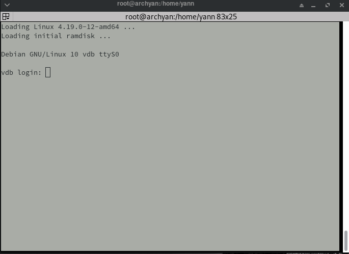
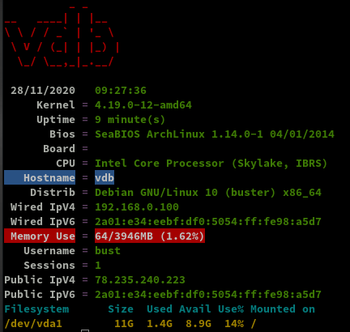
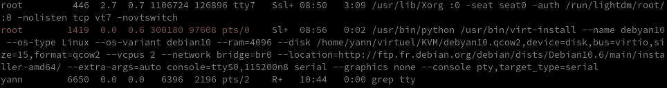
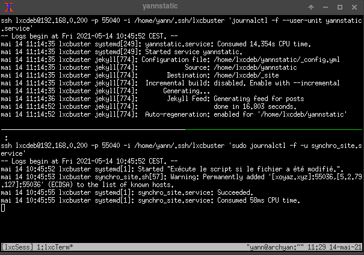

+++
title = 'PC1 ArchLinux - VM Debian 10 vdb (jekyll-statique)'
date = 2021-02-02 00:00:00 +0100
categories = ['virtuel']
+++
## VM Debian 10

{:width="100"}  

### Créer Machine Virtuelle Debian

En mode su

Création réseau **host-bridge**

    virsh net-define host-bridge.xml

```
<network>
  <name>host-bridge</name>
  <forward mode='bridge'/>
  <bridge name='br0'/>
</network>
```

Avant la création d'une machine virtuelle, le réseau doit être actif

    sudo virsh net-start host-bridge    # virsh net-autostart host-bridge

Configurer le réseau pour un lancement au démarrage du serveur

    sudo virsh net-autostart host-bridge    # Network host-bridge marked as autostarted

Liste des réseaux déclarés

    virsh net-list --all

```
 Nom           État      Démarrage automatique   Persistent
-------------------------------------------------------------
 default       inactif   no                      Oui
 host-bridge   actif     Oui                     Oui
```

### Création VM en mode console

Créer la machine virtuelle debian buster : **debyan10**

Machine Virtuelle : debyan10  
Processeurs : 2  
Mémoire : 4096 Mo
Disque dur SATA : /home/yann/virtuel/KVM/debyan10.qcow2  15Go  
CDROM SATA      : /home/yann/media/dplus/iso/debian/buster/debian-10.4.0-amd64-netinst.iso  
NIC Réseau : Réseau virtuel 'host-bridge'  

Installation en mode console , il faut aller chercher le lien debian sur le site <http://ftp.fr.debian.org/debian/dists/> 

```
virt-install \
  --name debyan10 \
  --os-type Linux \
  --os-variant debian10 \
  --ram=4096 \
  --disk /home/yann/virtuel/KVM/debyan10.qcow2,device=disk,bus=virtio,size=15,format=qcow2 \
  --vcpus 2 \
  --network bridge=br0 \
  --location="http://ftp.fr.debian.org/debian/dists/buster/main/installer-amd64/" \
  --extra-args="auto console=ttyS0,115200n8 serial" \
  --graphics none \
  --console pty,target_type=serial
```

Renseignements durant l'installation

Machine (hostname) : vdb  
root : ytreu49  
utilisateur: bust  
Mot de passe : bust49  
Disque entier, 1 seule partition  
Choix : "SSH Server" et "standard system utilities"

A la fin de l'installation ,reboot

{:width=400}  

Mofifier le réseau pour un adressage ip fixe : `nano /etc/network/interfaces`  

```
# This file describes the network interfaces available on your system
# and how to activate them. For more information, see interfaces(5).

source /etc/network/interfaces.d/*

# The loopback network interface
auto lo
iface lo inet loopback

# The primary network interface
allow-hotplug enp1s0
#iface enp1s0 inet dhcp
iface enp1s0 inet static
 address 192.168.0.100
 netmask 255.255.255.0
 gateway 192.168.0.254
# This is an autoconfigured IPv6 interface
iface enp1s0 inet6 auto
```

On redémarre la machine virtuelle

    systemctl reboot

Accès root via ssh

    ssh root@192.168.0.100

Réseau

    ip a

```
[...]
2: enp1s0: <BROADCAST,MULTICAST,UP,LOWER_UP> mtu 1500 qdisc pfifo_fast state UP gro
up default qlen 1000
    link/ether 52:54:00:98:a5:d7 brd ff:ff:ff:ff:ff:ff
    inet 192.168.0.100/24 brd 192.168.0.255 scope global enp1s0
       valid_lft forever preferred_lft forever
    inet6 2a01:e34:eebf:df0:5054:ff:fe98:a5d7/64 scope global dynamic mngtmpaddr 
       valid_lft 86358sec preferred_lft 86358sec
    inet6 fe80::5054:ff:fe98:a5d7/64 scope link 
       valid_lft forever preferred_lft forever
```

Installer sudo : `apt install sudo`    
Les accès root utilisateur **bust**  : `echo "bust     ALL=(ALL) NOPASSWD: ALL" >> /etc/sudoers`   
Connexion SSH avec clés , ajout clé publique dans `mkdir ~/.ssh , ~/.ssh/authorized_keys` + droits `chmod 600 -R ~/.ssh`  
Configuration `/etc/ssh/sshd_config` : `Port 55100` ,`PasswordAuthentication no`   
Redémarrer le service : `sudo systemctl restart sshd`

Test liaison SSH : 

    ssh bust@192.168.0.100 -p 55100 -i /home/yann/.ssh/kvm-vdb-ed25519

Installer utilitaires : `sudo apt install rsync curl tmux jq figlet git dnsutils tree socat`  
Bannière `/etc/motd`

```
 __   __ __  __      _       _     _              _   __  
 \ \ / /|  \/  |  __| | ___ | |__ (_) __ _  _ _  / | /  \ 
  \ V / | |\/| | / _` |/ -_)| '_ \| |/ _` || ' \ | || () |
  _\_/__|_|__|_| \__,_|\___||_.__/|_|\__,_||_||_||_|_\__/ 
 / |/ _ \|_  )   / | / / ( _ )   /  \   / | /  \  /  \    
 | |\_, / / /  _ | |/ _ \/ _ \ _| () |_ | || () || () |   
 |_| /_/ /___|(_)|_|\___/\___/(_)\__/(_)|_| \__/  \__/    
```

Bash  `wget -4 https://static.xoyaz.xyz/files/ssh_rc_bash && chmod +x ssh_rc_bash && ./ssh_rc_bash`



Pour des raisons de conformité avec archlinux, modifier ID groupe "users"

    sudo groupmod -g 985 users

### Partage xoyize

Installer **autofs** pour un accès aux dossiers de la machine *xoyize.xyz* 192.168.0.46   

    sudo apt install autofs

Déclarer *xoyize* dans `/etc/hosts` , en ajoutant au fichier

    192.168.0.46	xoyize

Les partages disponibles 

    sudo showmount -e xoyize

```
Export list for xoyize:
/xoyipart 192.168.0.0/24
```

Déclaration des répertoires parents de montages et de leur types

    sudo nano /etc/auto.master

Oter le commentaire de la ligne suivante

    /net    -hosts

Redémarrer le service

    sudo systemctl restart autofs

Le dossier

    ls /net/xoyize/xoyipart

Créer un groupe *partage* avec id 9999

    sudo groupadd --gid 9999 partage

### SSHFS - Partage "statique"

{:width="50"}

Le dossier "statique" est sur l'hôte PC1 (archyan) 
Il faut créer une liaison réseau sécurisée entre **vdb &larr; &rarr; archyan**  
On va utiliser SSHFS (*Secure shell file system (ou SSHFS) permet le partage d'un système de fichiers de manière sécurisée en utilisant le protocole SFTP de SSH*) 

Installation

    sudo apt install sshfs

Autorisations

* Autorisations "utilisateur"
     * Exécuter `sshfs` (ou toute autre commande de montage FUSE) avec l’option `-o allow_other`
* Autoriser l’accès “root” des supports **fuse**
     * Ajouter `user_allow_other` au fichier **/etc/fuse.conf**
     * Exécuter `sshfs` (ou toute autre commande de montage FUSE) avec l’option `-o allow_root`

>PC1 : Clé publique pc1-archyan.pub ajoutée au fichier authorized_keys : `cat .ssh/pc1-archyan.pub >> .ssh/authorized_keys`

Clé privée **pc1-archyan** pour accéder à PC1 archyan (192.168.1.43)

	nano $HOME/.ssh/pc1-archyan # copier la clé privée
	chmod 600 $HOME/.ssh/pc1-archyan

**Exécution manuelle** pour authentifier la clé avec utilisateur "bust"

    mkdir -p $HOME/statique
    sshfs -oIdentityFile=/home/bust/.ssh/pc1-archyan yann@192.168.0.43:/home/yann/media/statique /home/bust/statique 


```bash
The authenticity of host '[192.168.1.43]:55036 ([2a04:52c0:101:82::73db]:55036)' can't be established.
ECDSA key fingerprint is SHA256:NuFqR5id10fVzRLsSTqJ4vBpFnNYi+APGsvPYth6PHw.
Are you sure you want to continue connecting (yes/no)? yes
```

>NOTE: Il faut mettre l'adresse IP du serveur , si les domaines peuvent ne pas être "résolus"

Après vérification , `ls $HOME/statique` , déconnexion `fusermount -u $HOME/statique`

#### Montage fstab

Le générateur de site statique utilise les dossiers _posts, images et files présents sur l'ordinateur hôte PC1  
On va créer montage de chaque dossier sur la machine virtuelle debian

ajouter les lignes suivantes au fichier `/etc/fstab`

```bash
yann@192.168.0.43:/home/yann/media/statique/_posts /home/bust/yannstatic/_posts fuse.sshfs _netdev,identityfile=/home/bust/.ssh/pc1-archyan,allow_other,port=22 0 0
yann@192.168.0.43:/home/yann/media/statique/files /home/bust/yannstatic/files fuse.sshfs _netdev,identityfile=/home/bust/.ssh/pc1-archyan,allow_other,port=22 0 0
yann@192.168.0.43:/home/yann/media/statique/images /home/bust/yannstatic/images fuse.sshfs _netdev,identityfile=/home/bust/.ssh/pc1-archyan,allow_other,port=22 0 0
```

Montage pour authentifier la clé avec utilisateur "root"

    sudo mount -a

```
The authenticity of host '192.168.0.43 (192.168.0.43)' can't be established.
ECDSA key fingerprint is SHA256:BxrhdNWnJS6934RvGgZs8XxGkUnlkIWu8KgU2goxnB0.
Are you sure you want to continue connecting (yes/no)? yes
```

Vérification    

    ls $HOME/yannstatic/{images,files,_posts}

### Sortie du mode console

La combinaison `Ctrl + ]` ne focntionne pas  
On recherche le PID de la console pour la supprimer

    ps aux | grep tty



Correspondance avec le pid 1419 , supprimer le processus : `sudo kill 1419`

### VM autostart

**Sur l'hôte PC1**  
Démarrer la machine virtuelle au boot  

    sudo virsh autostart debyan10  

*Domaine debyan10 marqué pour le démarrage automatique*

## Jekyll générateur site statique

{:width="150px"}  
*Générer un site statique via jekyll*

**Rbenv (gestionnaire version ruby)** est un outil léger de gestion des versions de Ruby qui vous permet de changer facilement de version de Ruby.

Par défaut, Rbenv ne gère pas l'installation des versions de Ruby. ruby-build est un outil qui vous aide à installer n'importe quelle version de Ruby dont vous pourriez avoir besoin. Il est disponible en tant que programme autonome et en tant que plugin pour rbenv.

Installez les dépendances nécessaires à l'outil ruby-build pour construire Ruby à partir des sources :

    sudo apt update
    sudo apt install git curl libssl-dev libreadline-dev zlib1g-dev autoconf bison build-essential libyaml-dev libreadline-dev libncurses5-dev libffi-dev libgdbm-dev

Ensuite, lancez la commande curl suivante pour installer les scripts rbenv et ruby-build :

    curl -sL https://github.com/rbenv/rbenv-installer/raw/master/bin/rbenv-installer | bash -

Si l'installation est réussie, le script imprimera quelque chose comme ceci :

```
Running doctor script to verify installation...
Checking for `rbenv' in PATH: not found
  You seem to have rbenv installed in `/home/dbsuser/.rbenv/bin', but that
  directory is not present in PATH. Please add it to PATH by configuring
  your `~/.bashrc', `~/.zshrc', or `~/.config/fish/config.fish'.
```

Avant de commencer à utiliser rbenv, nous devons ajouter $HOME/.rbenv/bin à notre PATH.

    echo 'export PATH="$HOME/.rbenv/bin:$PATH"' >> ~/.bashrc
    echo 'eval "$(rbenv init -)"' >> ~/.bashrc
    source ~/.bashrc

Les dernières versions stables

    rbenv install -l

Maintenant que rbenv est installé sur notre système, nous pouvons facilement installer la dernière version stable de Ruby et la définir comme version par défaut avec :

    rbenv install 2.7.2 # patientez de 3 à 8 minutes

```
Downloading ruby-2.7.2.tar.bz2...
-> https://cache.ruby-lang.org/pub/ruby/2.7/ruby-2.7.2.tar.bz2
Installing ruby-2.7.2...
Installed ruby-2.7.2 to /home/xoyi/.rbenv/versions/2.7.2
```
    
    rbenv global 2.7.2

 Vérifiez que Ruby a été correctement installé en imprimant le numéro de version :

    ruby -v

`ruby 2.7.2p137 (2020-10-01 revision 5445e04352) [x86_64-linux]`

Ajout du chemin bin $HOME/.rbenv/versions/2.7.2/bin/  

    echo 'export PATH="$HOME/.rbenv/versions/2.7.2/bin:$PATH"' >> ~/.bashrc
    source ~/.bashrc


### yannstatic

    cd $HOME

Cloner le dépôt

    cd ~
    git clone https://gitea.cinay.eu/yann/yannstatic.git yannstatic
    cd yannstatic

Bundle lit le fichier **Gemfile**

    bundle install # Patientez ...

```
Bundle complete! 3 Gemfile dependencies, 43 gems now installed.
Use `bundle info [gemname]` to see where a bundled gem is installed.
```

Info sur jekyll et créer un lien

    bundle info jekyll

```
  * jekyll (4.1.1)
	Summary: A simple, blog aware, static site generator.
	Homepage: https://jekyllrb.com
	Path: /home/bust/.rbenv/versions/2.7.2/lib/ruby/gems/2.7.0/gems/jekyll-4.1.1
```


**Génération dossier '_site' Manuellement**  
Création du dossier **_site**

    jekyll build

```
Configuration file: /home/bust/yannstatic/_config.yml
            Source: /home/bust/yannstatic
       Destination: /home/bust/yannstatic/_site
 Incremental build: disabled. Enable with --incremental
      Generating... 
       Jekyll Feed: Generating feed for posts
                    done in 49.398 seconds.
 Auto-regeneration: disabled. Use --watch to enable.
```

`yannstatic.service`** - Service yannstatic, génération '_site' en cas de modification**  
Pour lancer le serveur **yannstatic** au démarrage, utilisation d'un <u>service systemd</u>  
**ATTENTION!** , remplacer *User=utilisateur* par votre nom d'utilisateur `echo $USER`  
Relever le chemin complet de jekyll : `which jekyll` &rarr; **/home/bust/.rbenv/shims/jekyll**

Création d'un service "yannstatic" sous systemd

    sudo nano /etc/systemd/system/yannstatic.service

Contenu du fichier

```ini
[Unit]
Description=service yannstatic
After=network.target

[Service]
Type=simple
User=bust
WorkingDirectory=/home/bust/yannstatic
ExecStart=/home/bust/.rbenv/shims/bundle exec jekyll build --watch
Restart=on-abort


[Install]
WantedBy=multi-user.target
```

Activer et lancer le service  **yannstatic** :

    sudo systemctl daemon-reload
    sudo systemctl enable yannstatic
    sudo systemctl start yannstatic

`synchro_site.{path,service}`** - En cas de modification du dossier '_site', synchronisation locale &rarr; distante xoyaz.xyz**  
*Avec les unités de chemin, vous pouvez surveiller les fichiers et les répertoires pour certains événements. Si un événement spécifique se produit, une unité de service est exécutée, et elle porte généralement le même nom que l'unité de chemin.*  

Nous allons surveiller le fichier **sitemap.xml** du dossier *_site/*. Chaque fois que le fichier est fermé après une écriture, un script spécifique démarrera.

Dans le répertoire `/etc/systemd/system/` nous créons une unité de cheminement **synchro_site.path**

    sudo nano /etc/systemd/system/synchro_site.path

```ini
[Unit]
Description=Surveiller le fichier pour les changements

[Path]
PathChanged=/home/bust/yannstatic/_site/sitemap.xml
Unit=synchro_site.service

[Install]
WantedBy=multi-user.target
```

Dans la section `[Path]`, `PathChanged=` indique le chemin absolu du fichier à surveiller, tandis que `Unit=` indique l'unité de service à exécuter si le fichier change. Cette unité (**synchro_site.path**) doit être lancée lorsque le système est en mode multi-utilisateur.

Ensuite, nous créons l'unité de service correspondante, **synchro_site.service**, dans le répertoire `/etc/systemd/system/`    
Si le fichier **sitemap.xml** change (c'est-à-dire qu'il est à la fois écrit et fermé), l'unité de service suivante sera appelée pour exécuter le script spécifié :

    sudo nano /etc/systemd/system/synchro_site.service

```ini
[Unit] 
Description="/home/bust/yannstatic/_site/sitemap.xml a été modifié."

[Service]
ExecStart=/home/bust/yannstatic/synchro_site.sh

[Install]
WantedBy=multi-user.target
```

Le script **/home/bust/yannstatic/synchro_site.sh** lance une synchronisation locale distante via rsync ssh  

```bash
#!/bin/bash

# Synchronisation locale distante du dossier _site
rsync -avz --progress --stats --human-readable --delete --rsync-path="sudo rsync" -e "ssh -p 55036 -i /home/bust/.ssh/OVZ-STORAGE-128 -o StrictHostKeyChecking=no -o UserKnownHostsFile=/dev/null"  /home/bust/yannstatic/_site/* usernl@xoyaz.xyz:/home/usernl/backup/static/  > /dev/null
 if [ $? -eq 0 ]; then \
 echo "Synchronisation dossier _site entre vdb et xoyayz -> OK" | systemd-cat -t vdbsync -p info ; \
 else \
 echo "Synchronisation dossier _site entre vdb et xoyayz -> ERREUR" | systemd-cat -t vdbsync -p emerg ; \
 fi
```

**Activation des services**  
Activer et lancer le service  **yannstatic** :

    sudo systemctl daemon-reload
    sudo systemctl enable yannstatic
    sudo systemctl start yannstatic

Les unités `synchro_site.{path,service}` doivent être activées

    sudo systemctl daemon-reload
    sudo systemctl enable synchro_site.{path,service}
    sudo systemctl start synchro_site.path

Vérifications

    sudo journalctl -f -u yannstatic.service

```
nov. 29 14:02:31 vdb jekyll[2139]:       Regenerating: 2 file(s) changed at 2020-11-29 14:02:31
nov. 29 14:02:31 vdb jekyll[2139]:                     _posts/2020-11-27-ArchLinux-KVM_QEMU-VM-debian10-vdb-statique.md
nov. 29 14:02:31 vdb jekyll[2139]:                     _posts/.2020-11-27-ArchLinux-KVM_QEMU-VM-debian10-vdb-statique.md.LOyEEU
nov. 29 14:02:31 vdb jekyll[2139]:        Jekyll Feed: Generating feed for posts
nov. 29 14:02:45 vdb jekyll[2139]:                     ...done in 14.660143584 seconds.
nov. 29 14:02:45 vdb jekyll[2139]:    
```

    sudo journalctl -f -u synchro_site.service

```
nov. 29 14:02:45 vdb systemd[1]: Started "/home/bust/yannstatic/_site/sitemap.xml a été modifié.".
nov. 29 14:02:45 vdb synchro_site.sh[2635]: Warning: Permanently added '[xoyaz.xyz]:55036,[2a04:52c0:101:82::73db]:55036' (ECDSA) to the list of known hosts.
nov. 29 14:02:47 vdb systemd[1]: synchro_site.service: Succeeded.
```

**VM - Dossiers _posts, images et files**   
On ne peut pas traiter la modification de dossier avec systemd.path dans la machine virtuelle car les dossiers sont "liés" (ln).
Créer dossiers `/home/bust/yannstatic/{_posts,images,files}`  

    mkdir -p /home/bust/yannstatic/{_posts,images,files}

### PC1 - Synchroniser les dossiers _posts, images et files

en cas de modification, il faut mettre à jour les dossiers _posts, images et files de la VM par rsync avec le script `/home/yann/scripts/synchro-dossiers_posts-images-files_PC1_vers_vdb`

```bash

#!/bin/bash    

# COLUMNSxROWS+X+Y -> xterm -geometry 400x200+100+350
# xterm -geometry 100x30+100+350 -T yannstatic -e '/home/yann/scripts/tmux-vdb.sh'
# On supprime la session "VdbSess" si existante                         
 
if [[ `tmux list-sessions | grep 'VdbSess' | wc -l` != 0 ]]
   then  
       # On ferme la session active
       tmux kill-session -t VdbSess
fi


# Créer une bannière dans /etc/motd sur chaque serveur
# Nom du domaine en ascii voir lien http://patorjk.com/software/taag/#p=display&h=1&f=Small
echo "fin fi"
# Créer session + terminal 
tmux new  -d -s VdbSess -n VdbTerm
# Séparation horizontale en 2/3 1/3 du terminal
tmux split-window -v -p 33
# | 0         |
# |   2/3     |
# |           |
# |-----------|
# | 1   1/3   |
# Sélection terminal HAUT
tmux selectp -t 0
# Séparation horizontale en 1/2 du terminal 0
tmux split-window -v -p 50

# Sélection terminal HAUT
tmux selectp -t 0
tmux send-keys -t VdbSess "sshm vdb exe 'sudo journalctl -f -u yannstatic.service'" C-m
# Sélection terminal MILIEU
tmux selectp -t 1
#tmux send-keys -t VdbSess "sudo journalctl -f -u rsync_statique.service" C-m
tmux send-keys -t VdbSess "sudo journalctl -f -t vdbsync --since today" C-m
tmux selectp -t 2
#tmux send-keys -t VdbSess "sshm vdb exe 'sudo journalctl -f -u synchro_site.service'" C-m
tmux send-keys -t VdbSess "sshm vdb exe 'sudo journalctl -f -t vdbsync --since today'" C-m
# Sélection terminal BAS
# Afficher la session 
tmux a -t VdbSess
#
# Tuer la session
# tmux kill-session -t VdbSess
```

Dans la section `[Path]`, `PathModified=` indique le chemin absolu du fichier à surveiller, 
 `PathModified=` est utilisé pour surveiller un fichier ou un répertoire et activer l'unité configurée chaque fois qu'elle change. Il activé lors de simples écritures sur le fichier/dossier surveillé.

tandis que `Unit=` indique l'unité de service à exécuter si le fichier change. Cette unité (**rsync_statique.path**) doit être lancée lorsque le système est en mode multi-utilisateur.

Ensuite, nous créons l'unité de service correspondante, **rsync_statique.service**, dans le répertoire `/etc/systemd/system/`    
Si le dossier **/home/yann/media/statique/_posts** est modifié , l'unité de service **rsync_statique.service** sera appelé pour exécuter le script spécifié :

    sudo nano /etc/systemd/system/rsync_statique.service

```ini
[Unit] 
Description="/home/yann/media/statique/_posts a été modifié"

[Service]
ExecStart=/home/yann/scripts/synchro-dossiers_posts-images-files_PC1_vers_vdb

[Install]
WantedBy=multi-user.target
```

Les unités `rsync_statique.{path,service}` doivent être activées

    sudo systemctl daemon-reload
    sudo systemctl enable rsync_statique.{path,service}
    sudo systemctl start rsync_statique.path

Vérification

    sudo journalctl -f -u rsync_statique.service

```
-- Logs begin at Mon 2020-11-23 16:54:55 CET. --
nov. 29 14:17:01 archyan synchro-dossiers_posts-images-files_PC1_vers_vdb[15264]: Warning: Permanently added '[192.168.0.100]:55100' (ECDSA) to the list of known hosts.
nov. 29 14:17:01 archyan systemd[1]: rsync_statique.service: Succeeded.
```

### Surveillance depuis l'hôte (PC1)

Créer un script `/home/yann/scripts/tmux-vdb.sh`  

```bash
#!/bin/bash    

# COLUMNSxROWS+X+Y -> xterm -geometry 400x200+100+350
# xterm -geometry 100x30+100+350 -T yannstatic -e '/home/yann/scripts/tmux-vdb.sh'
# On supprime la session "VdbSess" si existante                         
 
if [[ `tmux list-sessions | grep 'VdbSess' | wc -l` != 0 ]]
   then  
       # On ferme la session active
       tmux kill-session -t VdbSess
fi


# Créer une bannière dans /etc/motd sur chaque serveur
# Nom du domaine en ascii voir lien http://patorjk.com/software/taag/#p=display&h=1&f=Small
echo "fin fi"
# Créer session + terminal 
tmux new  -d -s VdbSess -n VdbTerm
# Séparation horizontale en 2 du terminal
tmux split-window -v -p 50
# | 0         |
# |           |
# |-----------|
# | 1         |
# |           |
# Sélection terminal HAUT
tmux selectp -t 0
# 
tmux send-keys -t VdbSess "sshm vdb exe 'sudo journalctl -f -u yannstatic.service'" C-m
# Sélection terminal BAS
tmux selectp -t 1
#  
tmux send-keys -t VdbSess "sshm vdb exe 'sudo journalctl -f -u synchro_site.service'" C-m

# Afficher la session 
tmux a -t VdbSess
#
# Tuer la session
# tmux kill-session -t VdbSess
```

Installer **xterm** : `sudo pacman -S xterm`  
Créer un alias **tmuxvdb** pour visualiser la construction et la synchro du site statique

    nano ~/.bashrc

```bash
alias tmuxvdb="xterm -geometry 100x30+100+350 -T yannstatic -e '/home/yann/scripts/tmux-vdb.sh'"
```

Voir : `tmuxvdb`

{:width="500"}

### DESACTIVATION site statique

Pour rendre inactif le générateur de site statique

```
sudo systemctl stop yannstatic
sudo systemctl disable yannstatic
sudo systemctl stop synchro_site.path
sudo systemctl disable synchro_site.path
sudo systemctl stop synchro_site.service
sudo systemctl disable synchro_site.service
```

## NFS xoyipart

Installer client NFS

    sudo apt install nfs-common

Montage dossier `xoyipart` du serveur xoyize.xyz 192.168.0.46   

    mkdir $HOME/xoyipart    

partage NFS avec les membres d’un groupe 

    sudo groupadd -g 9999 partage
    sudo usermod -a -G  partage $USER


Montage dans fichier `/etc/fstab`

    192.168.0.46:/xoyipart  /home/bust/xoyipart nfs     _netdev,nodev,noexec	0	0

Validation

    sudo mount -a


## Construire Navidrome

<https://www.navidrome.org/docs/installation/build-from-source/>  
*Création d'un binaire navidrome issu d'une compilation en language go*

[Installer Go version 15](/posts/go/)   
Vérifier les chemins ajoutés au fichier `~/.bashrc`  

```
export PATH=$PATH:/usr/local/go/bin
export GOPATH="$HOME/go_projects"
export GOBIN="$GOPATH/bin"
```

Pour actualiser : `source ~/.bashrc` si vous avez modifié le fichier   

Copier un binaire

    sudo cp $HOME/go_projects/bin/go-bindata /usr/local/go/bin/

[Installer nodejs version 14](/posts/Archlinux-Debian-Node.js-Nvm-Npm-Yarn/)  
Dépendances :`sudo apt install libtag1-dev build-essential pkg-config`   
Cloner le projet : `git clone https://github.com/deluan/navidrome`  

1. Aller dans le dossier : `cd navidrome/`  
2. Installer les dépendances de construction : `make setup`    
3. pour la langue :
    1. ajouter le fichier `ui/src/i18n/fr.json` 
    2. modifier provider.js `sed -i "s#'./en.json'#'./fr.json'#g" ui/src/i18n/provider.js`  
4. Construire : `make buildall`
5. Si OK, le fichier exécutable `navidrome` est généré
6. Il est nécessaire d'installer le paquet libtag1-dev : `sudo apt install libtag1-dev`

