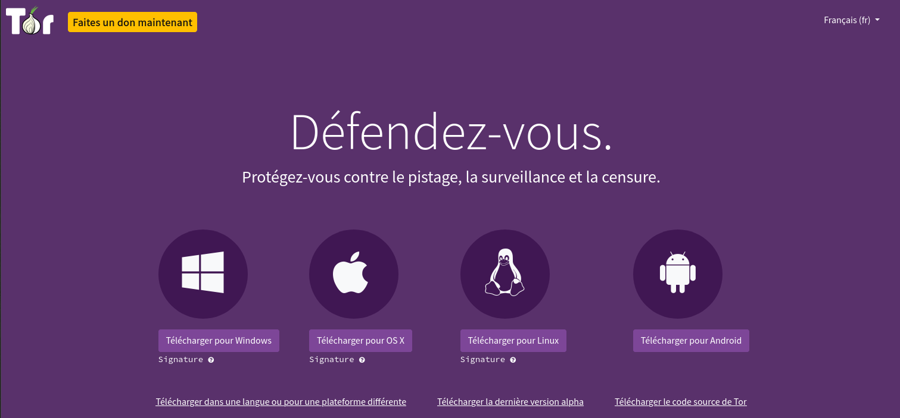
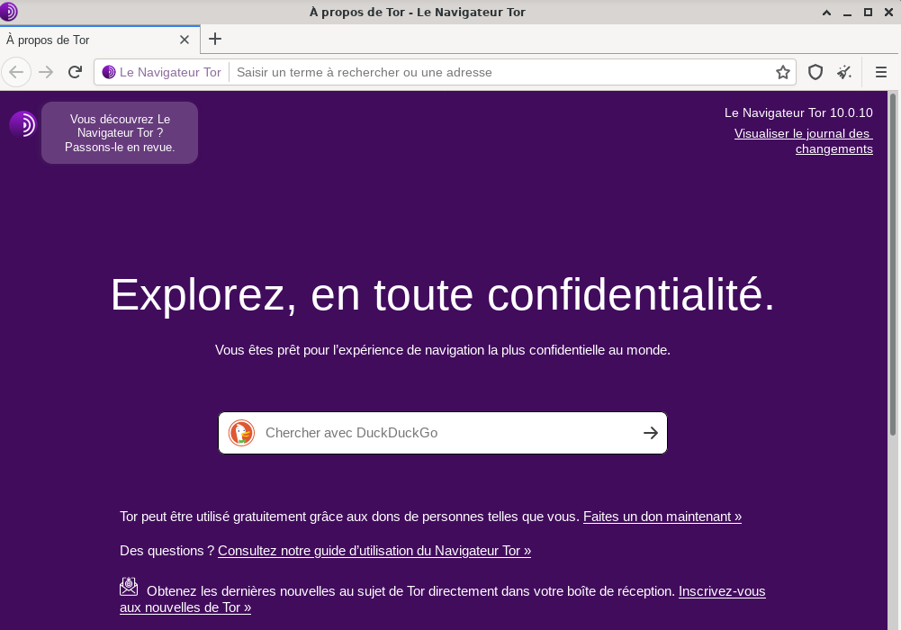

+++
title = 'Le navigateur Tor (fr) avec linux'
date = 2021-02-12 00:00:00 +0100
categories = ['tor']
+++
  
[Tor fr](https://www.torproject.org/fr/)

*Le pistage, la surveillance et la censure sont très répandus sur Internet.
AVEC TOR, RÉAPPROPRIEZ-VOUS INTERNET*

## Qu'est-ce que Tor?

Dans les discours informels, nous utilisons indifféremment les termes «Internet» et «Web». Mais en réalité, le Web et Internet sont deux choses très différentes. Si les sites Web étaient des locaux - des magasins, des usines, des centres de divertissement - Internet serait les routes et les autoroutes les reliant.

Internet prend en charge de nombreux services. Le World Wide Web n’est que l’un d’entre eux. D'autres services tels que la messagerie électronique, RDP , DNS , NNTP sont fournis sur Internet, et aucun de ceux-ci n'est un site Web.

Les réseaux superposés utilisent également Internet. Le réseau Tor ( The Onion Router ) est l'un de ces réseaux superposés. Il fournit l'anonymat et la confidentialité aux utilisateurs. Avec Tor, si vous l'utilisez efficacement, personne ne pourra retracer votre activité à votre adresse IP.

Le trafic qui passe sur le réseau Tor est crypté. Bien que cela aide à préserver l'anonymat des personnes qui l'utilisent, le cryptage pose un problème de réseau. Les éléments de routage et de commutation classiques d’Internet ne peuvent pas fonctionner avec le trafic réseau Tor.

Un réseau de relais Tor, hébergé et géré par des volontaires, effectue la commutation et le routage à la place. Les relais Tor renvoient intentionnellement votre connexion entre plusieurs relais, même si cet itinéraire n'est pas nécessaire pour atteindre votre destination. Ce «rebond» est une autre raison pour laquelle Tor rend virtuellement impossible l'arrière-piste et l'identification de la personne à l'extrémité distante.

C’est la force de cet anonymat qui a conduit le réseau Tor à héberger de nombreux sites Web se livrant à des activités criminelles. Le réseau Tor constitue une grande partie de la toile sombre . Cependant, toutes les activités sur le réseau Tor ne sont pas illégales. Les dissidents des régimes répressifs, des sources de presse anonymes, des lanceurs d'alerte, des activistes et les militaires utilisent tous Tor pour des raisons légitimes.

Les services cachés dans Tor ont des adresses se terminant par le suffixe «.onion». Ils ne s'affichent pas sur Google et ne peuvent pas être visualisés ni consultés à l'aide d'un navigateur Internet normal. Vous devez utiliser le navigateur Tor pour visiter ces sites, mais vous pouvez également l'utiliser pour accéder à des sites Web normaux avec un anonymat supplémentaire.

CONNEXES: [How to Access .onion Sites (Also Known as Tor Hidden Services)](https://www.howtogeek.com/272049/how-to-access-.onion-sites-also-known-as-tor-hidden-services/)


## Tor-browser-fr

Lien de téléchargement <https://www.torproject.org/fr/download/>  
{:width="600"}  
Sélectionnez l'icône de téléchargement Linux  

Quel que soit le navigateur, il est d’abord préférable d’enregistrer le fichier avant de poursuivre. Cliquez sur le bouton Enregistrer.    
Une fois que le téléchargement est terminé, allez dans votre dossier Téléchargements. Clic-droit sur le fichier `tor-browser-linux*_fr.tar.xz`, extraire ici.  

Ouvrir un terminal et se rendre dans le dossier Téléchargements

    cd ~/Téléchargements

Déplacer le dossier  `tor-browser_fr` dans /opt/   

    sudo mv tor-browser_fr /opt/

ouvrir le dossier /opt/tor-browser_fr et exécuter `start-tor-browser.desktop`   

    cd /opt/tor-browser_fr/
    ./start-tor-browser.desktop --register-app

```
Launching './Browser/start-tor-browser --detach --register-app'...
Tor Browser has been registered as a desktop app for this user in ~/.local/share/applications/
```


Cliquer sudr l'icône {:width="80"} pour lancer le navigateur tor  

{:width="600"}  


