+++
title = 'VPN Surfshark'
date = 2021-02-16 00:00:00 +0100
categories = ['vpn']
+++
  
[VPN Surfshark](https://surfshark.com/fr/), offre du 17 août 2020 : **1.69€/mois** &rarr; 40.56€ HT tous les 24 mois (48.67€ TTC)  
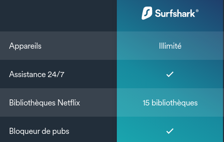{:width="200"}  

## Surfshark

*Comment configurer le module complémentaire du navigateur Surfshark sur Firefox ?*

Installer et utiliser le module complémentaire VPN de **Surfshark** pour les navigateurs **Firefox**.

Il s'agit d'un moyen rapide et pratique d'utiliser **Surfshark VPN** sans avoir à installer l'application de bureau.  
Il convient de mentionner que le module complémentaire pour navigateur Surfshark ne couvre que le trafic du navigateur.  
En d'autres termes, les autres navigateurs et applications en dehors de Firefox utiliseront votre connexion réseau habituelle.

Pour suivre les instructions, vous aurez besoin d'un ordinateur équipé d'un navigateur Mozilla Firefox et d'un abonnement VPN Surfshark actif.

## Surfshark Firefox 

Pour commencer, trouvez l'extension Surfshark sur le magasin d'extensions de Firefox. Vous le trouverez [ici](https://surfshark.com/fr/download/firefox).

Cliquez sur Add to Firefox.  
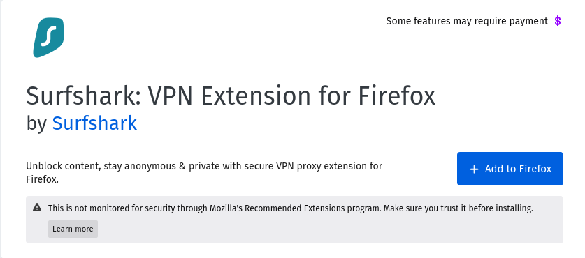{:width="400"}  

Une fenêtre pop-up vous demandera de confirmer l'installation.  

Cliquez sur Ajouter.  
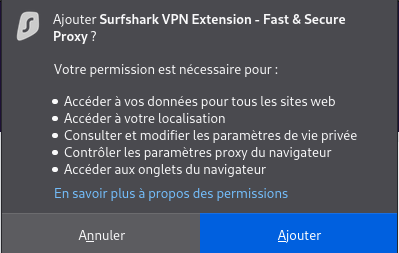{:width="300"}  

Le logo Surfshark apparaîtra désormais sur votre barre d'outils dans le coin supérieur droit de votre navigateur.  
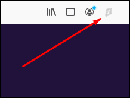{:width="300"}  

### Connectez-vous à l'add-on

Cliquez sur l'icône Surfshark en haut à droite de votre navigateur.  
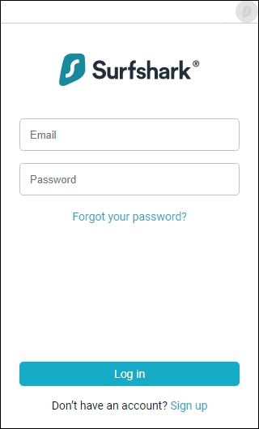{:height="300"}  

Saisissez l'adresse électronique que vous avez utilisée lors de votre inscription et votre mot de passe. Cliquez sur Connexion.  
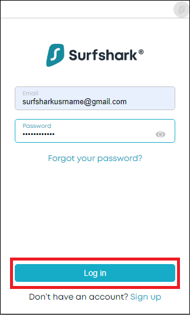{:height="300"}  


### Se connecter à un VPN

Juste après vous être connecté, vous verrez la page d'accueil du module complémentaire du navigateur Surfshark. Elle indique l'état de la connexion, les emplacements récemment utilisés et le bouton "Connexion rapide"(Quick connect).

Appuyez sur le bouton **Connexion rapide** et le module complémentaire Surfshark se connectera instantanément au serveur le plus rapide disponible.

{:height="300"}

Dès que vous vous connectez, le statut de la connexion passe à CONNECTÉ (CONNECTED).  
Vous pouvez vous déconnecter rapidement en appuyant sur le bouton Déconnecter.

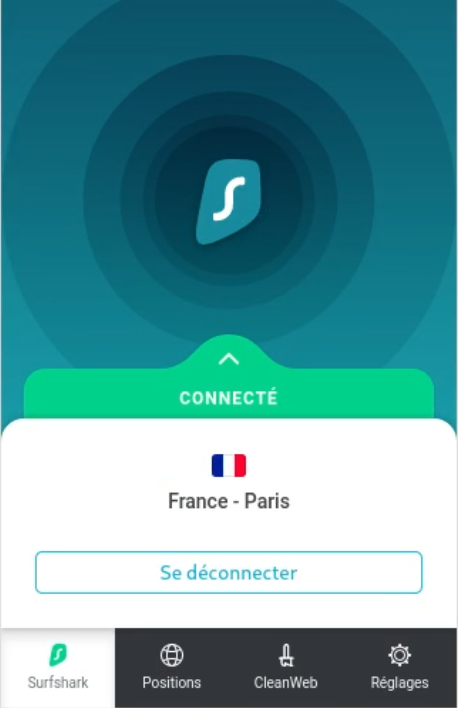{:height="300"}

### Choisir et gérer les lieux

Plus de 1700 serveurs dans plus de 63 pays sont disponibles sur Surfshark. Vous pouvez vous connecter à l'endroit de votre choix.

Allez dans l'onglet **"Positions"** (Locations) de votre module complémentaire Surfshark.  
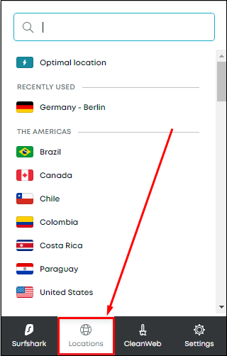{:height="300"}

Utilisez la barre de recherche en haut ou faites simplement défiler la liste jusqu'à ce que vous trouviez votre pays préféré.

Il y a plusieurs lieux disponibles dans certains pays. Vous trouverez la liste complète des lieux dans un pays spécifique en cliquant sur l'icône du drapeau du pays choisi.  
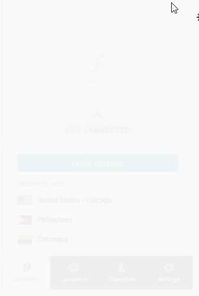{:height="300"}

Cliquez sur l'icône du drapeau et le module complémentaire se connectera instantanément à l'endroit que vous avez choisi.

### Gérer les fonctionnalités et les paramètres

Le troisième onglet concerne **"CleanWeb"**, une fonction intelligente qui bloque les publicités et les sites malveillants avant qu'ils ne puissent vous nuire. Utilisez le bouton de basculement pour activer cette fonction.  
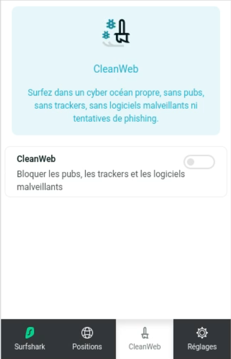{:height="300"}

Le dernier onglet est celui des **Réglages**(Settings).

Vous pouvez y trouver les détails de votre abonnement, modifier le mot de passe ou définir votre langue préférée pour l'extension. Cliquez sur Aide pour trouver les réponses aux questions les plus courantes ou contactez l'équipe d'assistance de Surfshark.  
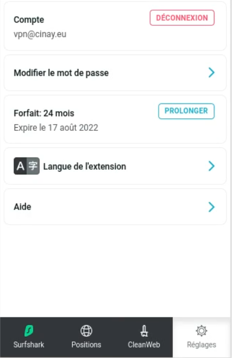{:height="300"}


>Vous avez installé et configuré avec succès votre module complémentaire **VPN Surfshark** !  
Désormais, votre emplacement est privé et vos données sensibles sont sécurisées, tant que vous êtes connecté.

Si vous avez d'autres questions, notre équipe chargée de la réussite des clients est là pour vous aider 24 heures sur 24, 7 jours sur 7, par le biais d'un chat en direct ou d'un e-mail.

## Surfshark Android 

*avoir un appareil Android fonctionnant sous OS 5.0 ou supérieur et un abonnement actif à Surfshark*

Pour cela, il vous suffit d'avoir un appareil Android fonctionnant sous OS 5.0 ou plus récent et un abonnement actif à Surfshark. Pas encore d'abonnement ? Pas de soucis, vous pouvez l'obtenir ici.

### Installer l'application Surfshark

Option A : Télécharger l'application depuis le site et installation  `adb install Surfshark.apk`

Option B : Commencez par trouver l'application **Play Store** sur votre appareil et ouvrez-la.
Tapez Surfshark dans la barre de recherche et choisissez le premier résultat qui apparaît dans la liste.  
La page de l'application VPN Surfshark s'ouvrira. Cliquez sur Télécharger ou Installer et l'installation sera terminée dans quelques instants.

### Connectez-vous à l'application

Une fois l'installation terminée, recherchez l'application 

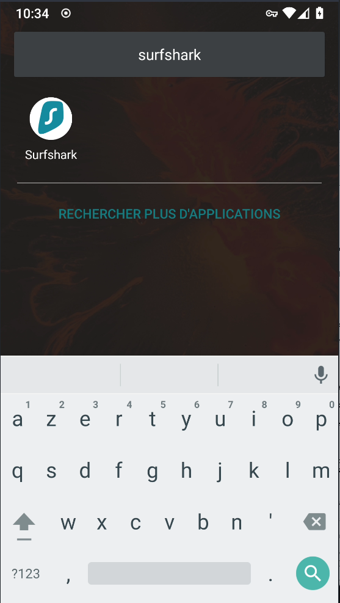{:height="400"}

Ouvrez l'application.

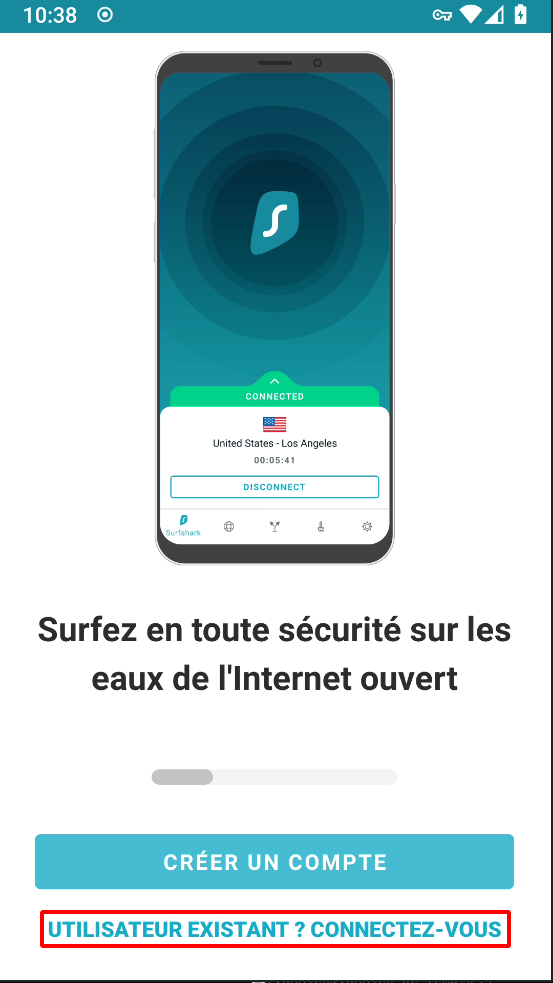{:height="400"}  

* Si vous avez déjà acheté votre abonnement VPN Surfshark, connectez-vous en tant qu'**utilisateur existant**.
* Si vous n'avez pas encore d'abonnement, n'hésitez pas à vous inscrire pour un essai gratuit de 7 jours.

Connectez-vous ou démarrez une période d'essai gratuite.  
Saisissez l'adresse électronique que vous avez utilisée lors de votre inscription et votre mot de passe.  
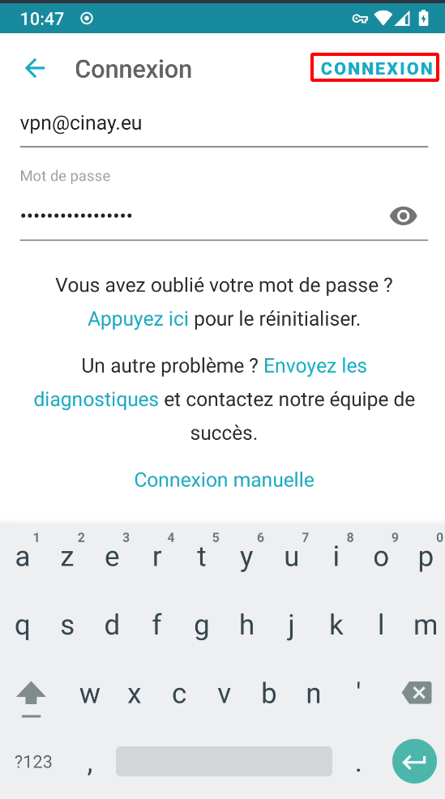{:height="400"}  
Cliquez sur Connexion.

### Se connecter à un VPN

Dès que vous vous connectez, vous verrez la page d'accueil de votre application Surfshark. Elle indique l'état de la connexion VPN.

Il ne vous reste plus qu'à vous connecter aux serveurs de Surfshark. Cliquez sur le bouton bleu "CONNECTER" et votre application se connectera au serveur le plus rapide disponible.  
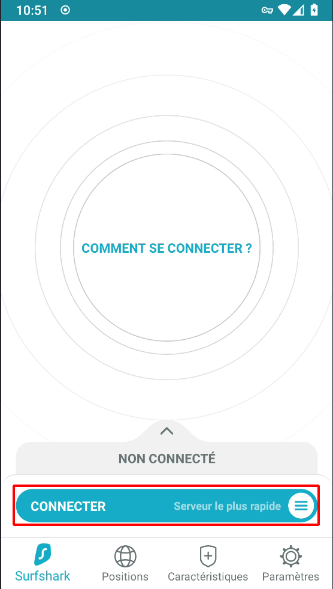{:height="400"}    
Vous pouvez régler votre connexion VPN par défaut sur le serveur le plus rapide ou sur le pays le plus proche. Pour ce faire, cliquez sur le bouton comme dans l'image ci-dessous.


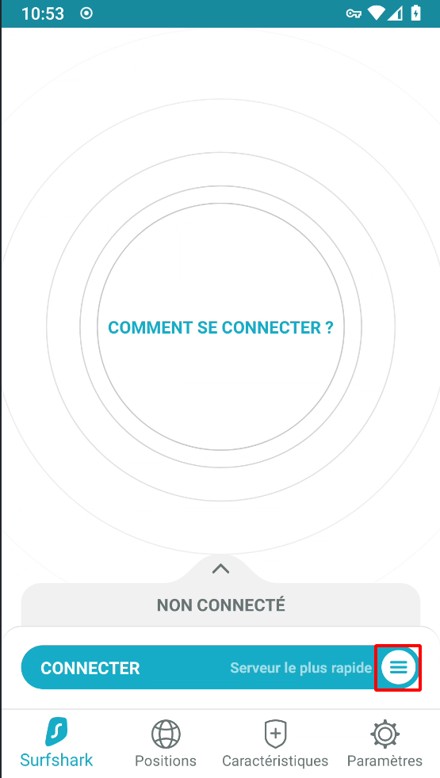{:height="400"}    
Cliquez sur ce bouton pour modifier votre emplacement par défaut.

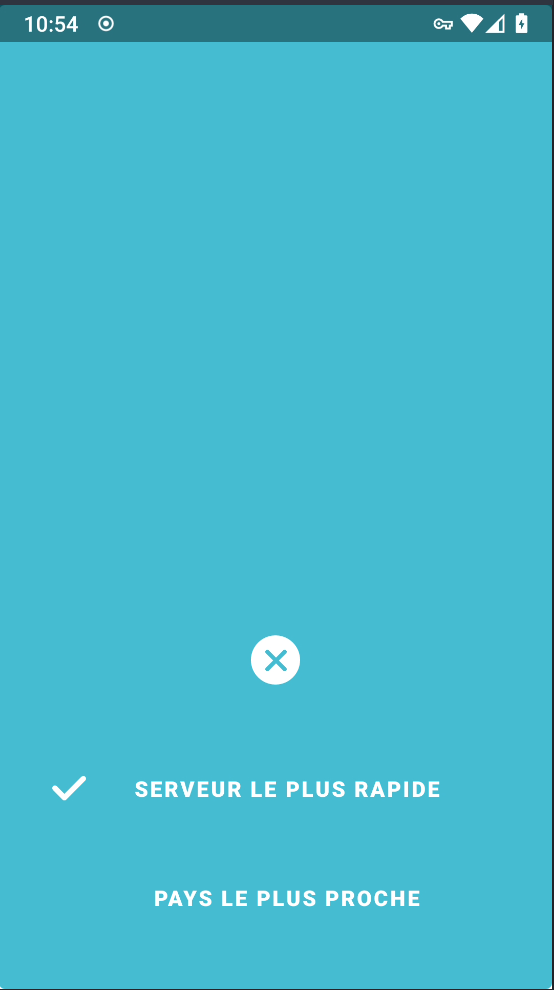{:height="400"}    
Choisissez **serveur le plus rapide** ou le **pays le plus proche**  

Une fois que vous aurez cliqué sur le bouton de connexion, il vous sera demandé d'autoriser Surfshark VPN à établir une connexion VPN.  
Cela est nécessaire pour que Surfshark puisse créer et gérer le tunnel VPN.  
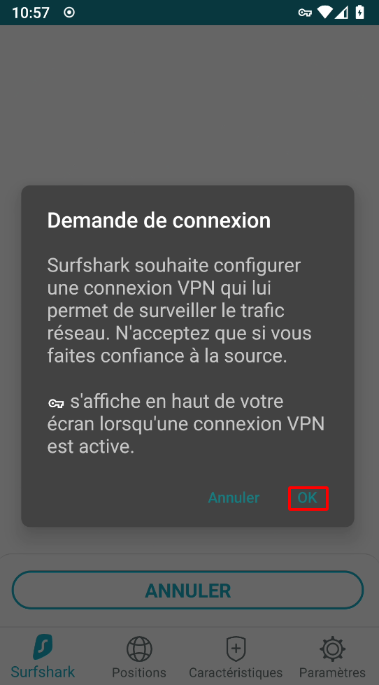{:height="400"}    
Cliquez sur OK.  

Lorsque votre application se connecte avec succès à un VPN, vous verrez l'état de la connexion sur l'écran principal.  
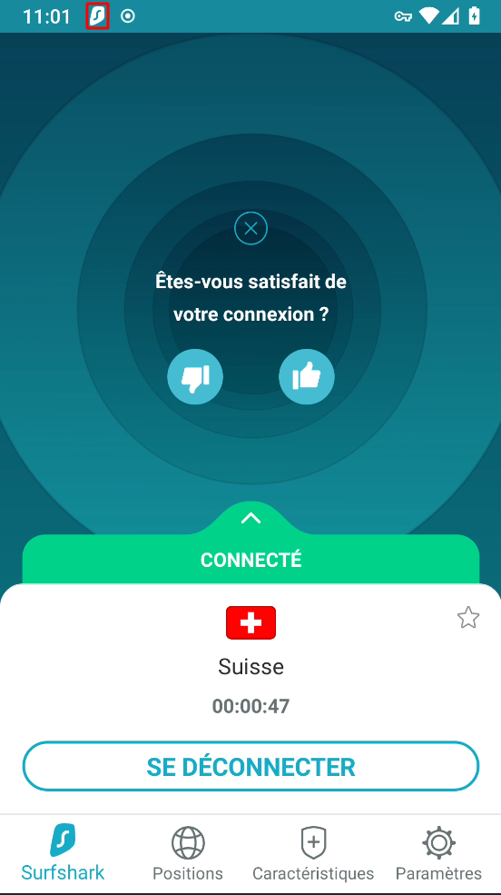{:height="400"}    
Vous pouvez également remarquer un logo Surfshark et l'icône d'une clé en haut de votre écran. Cela indique que vous êtes toujours connecté au VPN Surfshark.  
Pour vous déconnecter du VPN, cliquez sur le bouton **Se Déconnecter**.  

Appuyez sur la flèche blanche de la barre d'état verte pour obtenir des informations détaillées sur votre connexion VPN.  
Vous pouvez y voir votre nouvelle adresse IP, la quantité de données transférées en toute sécurité et une option permettant d'activer la fonction **Kill Switch**.  
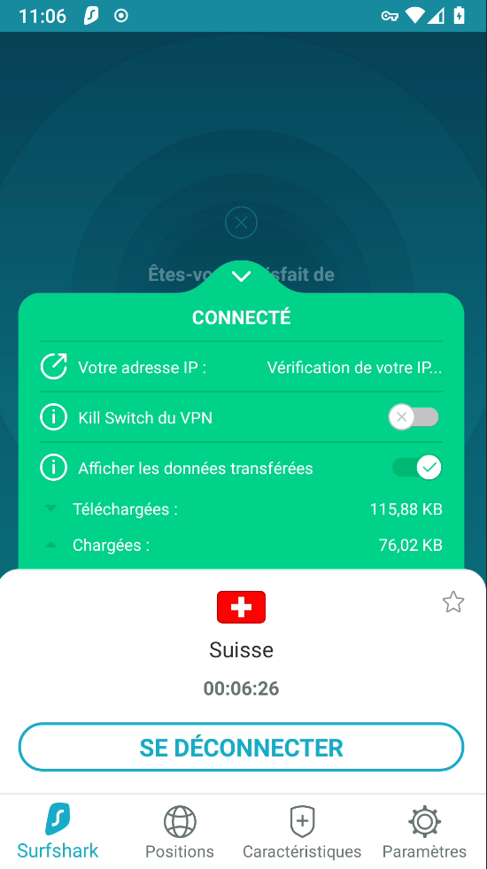{:height="400"}    

### Choisir et gérer les lieux

Vous souhaitez vous connecter à un lieu spécifique ? Surfshark dispose de plus de 1700 serveurs dans plus de 60 pays, et vous pouvez vous connecter à n'importe lequel d'entre eux.

Rendez-vous dans la section **Positions** de votre application Surfshark et choisissez n'importe quel lieu.

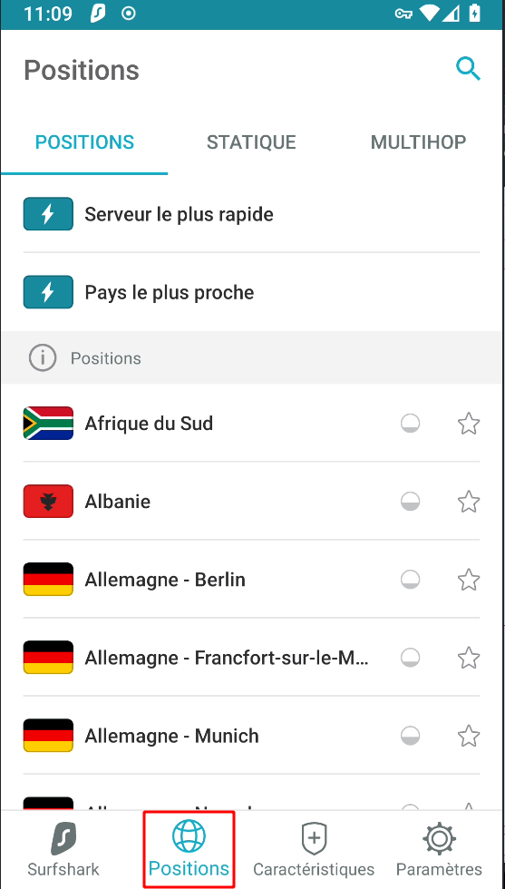{:height="400"}    

Appuyez sur l'icône du drapeau de votre pays préféré et l'application se connectera instantanément à cet endroit.

L'icône en forme de bulle à côté de l'étoile indique le niveau de charge des serveurs Surfshark dans un endroit spécifique, en d'autres termes, combien de personnes sont connectées aux serveurs dans cet endroit.

La première bulle sur cette image indique que les serveurs de Surfshark en France sont plus sollicités que ceux de la deuxième bulle Grèce  
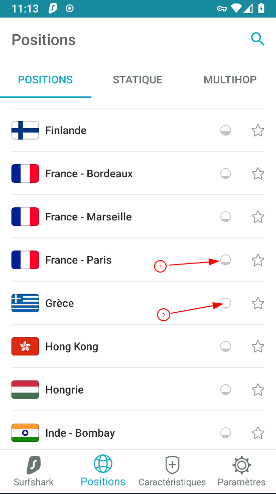{:height="400"}    

Vous avez peut-être remarqué les onglets **STATIQUE** et **MULTIHOP** en haut de votre application Surfshark.  
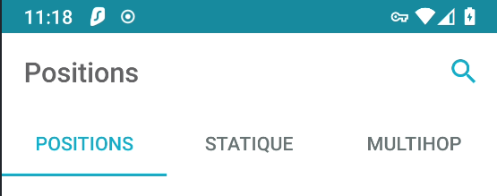{:height="90"}    
**IP STATIQUE** - vous obtenez la même adresse IP chaque fois que vous vous connectez  
**MULTIHOP** - vous vous connecterez via deux serveurs VPN différents dans des pays différents et ajouterez une couche de sécurité supplémentaire

Si vous voulez que Surfshark se souvienne de vos endroits préférés, appuyez sur l'étoile sur le côté droit. Ce serveur apparaîtra alors dans la liste de vos serveurs préférés.

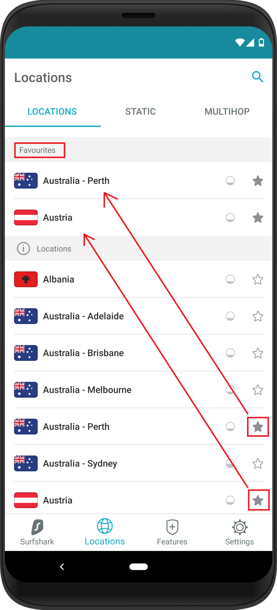{:height="400"}    

### Gérer les fonctionnalités de Surfshark

Ouvrez la section **"Caractéristiques"** dans votre application Surfshark. Vous y trouverez 4 fonctionnalités :

**CleanWeb** - c'est une fonctionnalité intelligente qui bloque les publicités et les sites malveillants sur le web. Pour en savoir plus, cliquez ici.

**Whitelister** - il vous permet de choisir les applications ou les sites web à exclure de la connexion via le tunnel VPN, et vice versa - ceux à faire passer par celui-ci. Pour savoir comment l'utiliser, cliquez ici.

**HackLock** - envoie des alertes en temps réel lorsque vos e-mails et mots de passe risquent d'être piratés. Apprenez comment l'utiliser ici.

**BlindSearch** - un outil de navigation qui vous permet d'effectuer des recherches sur le web en toute confidentialité, sans publicité, sans journal, sans historique et sans traqueur. Apprenez à l'utiliser ici.

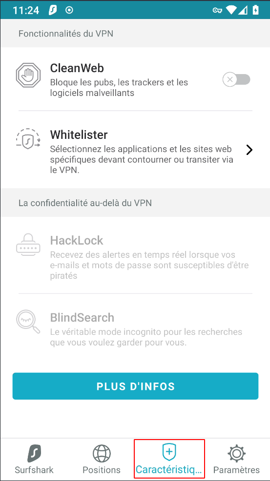{:height="400"}    

### Gérer les paramètres de Surfshark

Vous pouvez adapter votre application Surfshark à vos préférences personnelles. Vous pouvez trouver tous les paramètres nécessaires qui vous permettent de personnaliser et de dépanner votre connexion VPN.

Ouvrez la page des **paramètres** de l'application Surfshark.  
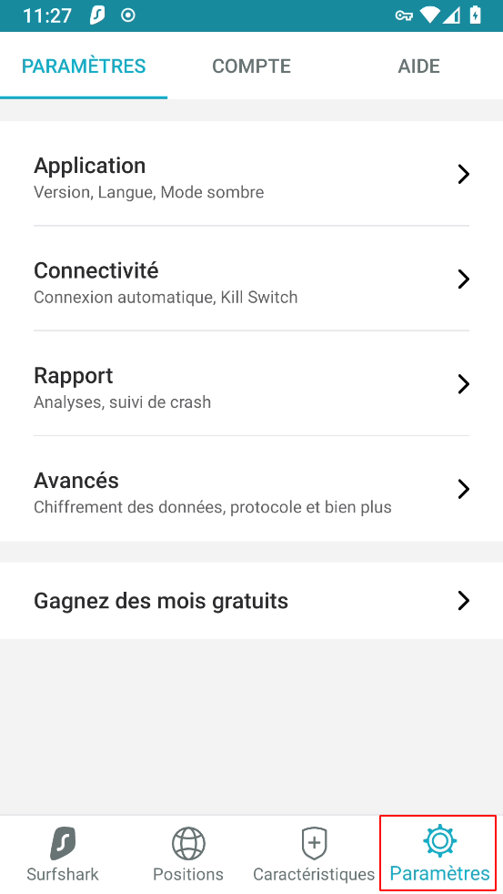{:height="400"}  

Dans l'onglet **Application**, vous pouvez voir la version de votre application Surfshark, changer la langue de l'application et activer et désactiver le mode Dark.   
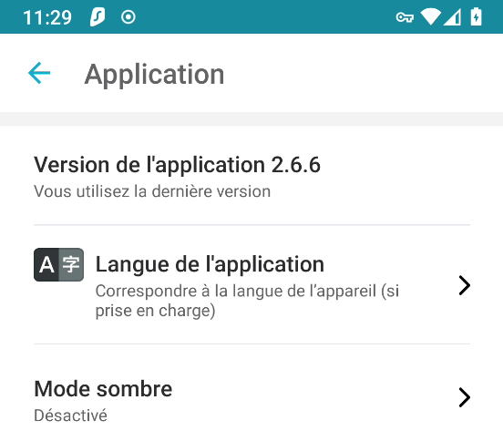{:height="200"}  

Allez à l'onglet **Connectivité** pour activer et définir les préférences de la connexion automatique. Vous pouvez choisir sur quels réseaux Surfhsark doit se connecter automatiquement à un VPN. Vous pouvez également y activer et désactiver la fonction KillSwitch. KillSwitch est une fonction de sécurité qui vous déconnectera d'internet si la connexion VPN tombe inopinément.  
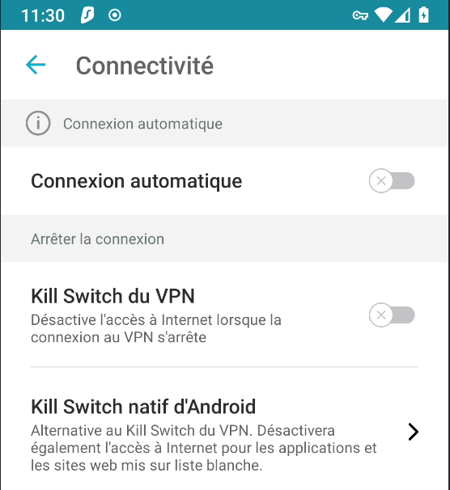{:height="250"}  

Dans l'onglet **Rapports**, vous pouvez décider si vous souhaitez fournir à nos développeurs des données anonymes sur les performances techniques de votre application Surfshark et les aider à l'améliorer plus efficacement.  
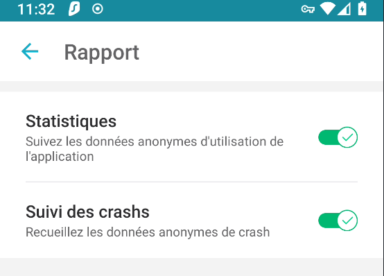{:height="170"}  

L'onglet **Paramètres avancés** est l'endroit où vous pouvez dépanner et ajuster les performances de Surfshark VPN. Vous pouvez le trouver ici :

**Cryptage des données** - déterminez si vous souhaitez utiliser un cryptage plus ou moins lourd pour protéger vos données. Un cryptage plus léger (ChaCha20Poly1305) devrait permettre d'obtenir une meilleure vitesse.

**Protocole** - choisissez le protocole que vous souhaitez utiliser pour vous connecter au VPN. En savoir plus sur ce qu'est un protocole et sur les différences entre les protocoles.

**Mode "NoBorders" **- il permet de contourner les restrictions de l'internet dans les pays où une forte censure est en place.

**Override GPS location **- une fonction unique à Surfshark qui vous permet de faire correspondre votre position GPS à l'emplacement de votre connexion VPN. Pour en savoir plus, cliquez ici.

**Invisible pour les appareils** - activez cette fonction si vous souhaitez que votre appareil soit invisible pour les autres appareils du même réseau.

**Utilisez de petits paquets** - allumez-le et vos données seront transférées en plus petits morceaux. Cela peut se traduire par une meilleure vitesse de connexion.

L'onglet Gagner des mois gratuits vous permet d'obtenir des mois gratuits de Surfshark en le recommandant à vos amis ou à toute personne que vous connaissez. Ouvrez-le pour obtenir un lien unique vous permettant de partager ou d'en savoir plus sur les récompenses. En savoir plus sur la façon de rejoindre le programme de parrainage de Surfshark.

Passez à l'onglet **COMPTE**.  
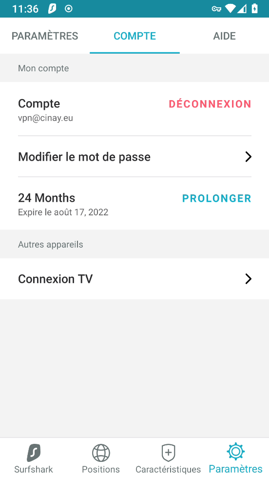{:height="400"}  
Vous trouverez ici les détails de votre abonnement, une option pour changer le mot de passe et un identifiant de télévision qui vous aidera à vous connecter facilement à l'application Surfshark sur votre télévision.

Le dernier onglet est destiné à l'**AIDE**.  
{:height="400"}  
Dans cet onglet, vous pouvez gérer vos précédentes interactions avec les agents de support de Surfshark, nous fournir des diagnostics à partir de votre application Surfhark si quelque chose ne fonctionne pas correctement, et consulter les conditions d'utilisation de Surfshark et notre politique de confidentialité.

## Application Surfshark Linux

**Via paquet AUR**  
[How to set up Surfshark VPN on Debian/Ubuntu Linux?](https://support.surfshark.com/hc/en-us/articles/360017418334#h_0e104abc-1b39-447b-b32f-5414752ebf74)

Archlinux

    yay -S surfshark-vpn

**Se connecter au VPN**

Pour lancer le VPN Surfshark, tapez cette commande dans le Terminal :

    sudo surfshark-vpn # entrer le mot de passe de l'utilisateur root de votre ordinateur, ceci est nécessaire pour que Surfshark puisse créer et gérer le tunnel VPN. 

*Surfshark aimerait envoyer des rapports d'erreur aux serveurs de Surfshark afin d'améliorer notre service et l'expérience des utilisateurs. Pour désactiver les rapports d'erreur, saisissez le mot ("NO") et appuyez sur la touche ENTRÉE.*

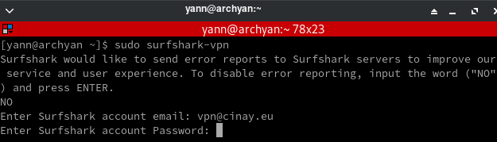  
Ensuite, saisissez l'adresse électronique que vous avez utilisée lors de votre inscription et cliquez sur "Entrée". Ensuite, saisissez votre mot de passe et appuyez à nouveau sur Entrée.

Vous trouverez la liste complète des sites de Surfshark.  Un numéro identifie chaque emplacement.  
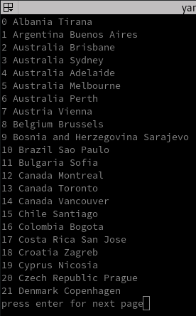 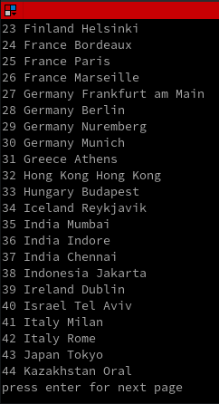  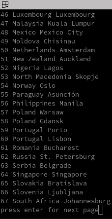  
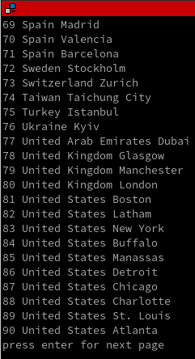 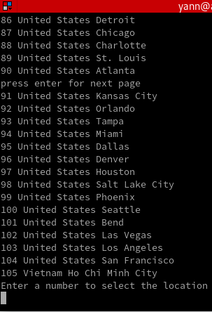  
Pour sélectionner un lieu, tapez le numéro à côté de celui-ci sur le terminal et appuyez sur la touche Entrée.  
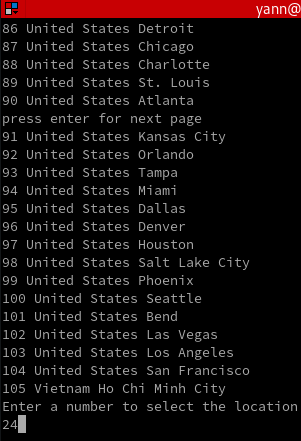  

Surfshark pour Linux utilise le protocole OpenVPN. Vous pouvez choisir entre deux options : UDP et TCP. Nous recommandons UDP pour de meilleures vitesses et il est suggéré par défaut, vous pouvez donc continuer en appuyant sur Entrée.

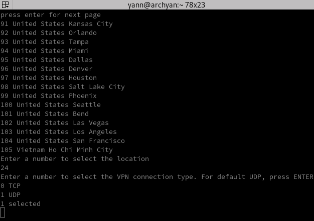

Succès, vous êtes maintenant connectés ! Vous pouvez voir l'état de la connexion et votre nouvelle adresse IP.

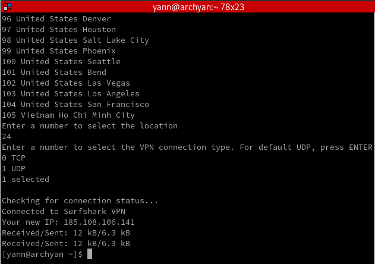

Vous pouvez maintenant fermer le terminal ou le réduire au minimum. Il n'est pas nécessaire qu'il soit ouvert pour que Surfshark fonctionne en arrière-plan.

Pour vous déconnecter, ouvrez le terminal et entrez cette commande :

    sudo surfshark-vpn down

Les commandes qui vous permettront de contrôler votre client Surfshark : 

Utilisez cette commande pour imprimer toutes les commandes de Surfshark dans le terminal :

    sudo surfshark-vpn help

Vérifiez votre état de connectivité :

    sudo surfshark-vpn status

Déconnectez-vous du VPN de Surfshark :

    sudo surfshark-vpn down

Connexion rapide à votre emplacement Optimal :

    sudo surfshark-vpn attack

Pour se déconnecter du client :

    sudo surfshark-vpn forget

Pour se connecter à un site MultiHop :

    sudo surfshark-vpn multi

Pour désinstaller Surfshark :

    sudo apt-get remove surfshark-vpn

## OpenVPN Surfshark

[How to set up manual OpenVPN connection using Linux Terminal?](https://support.surfshark.com/hc/en-us/articles/360011051133-How-to-set-up-OpenVPN-using-Linux-Terminal)

**Comment établir une connexion OpenVPN manuelle à l'aide d'un terminal Linux ?**

Dans ce tutoriel, vous apprendrez comment établir une connexion OpenVPN sur votre appareil Linux. Il s'agit d'une autre façon de se connecter aux serveurs Surfshark qui s'avérera pratique si l'application VPN Surfshark ne peut pas être installée sur votre appareil ou si elle ne fonctionne pas comme prévu.  
Vous aurez besoin d'un appareil fonctionnant avec le système d'exploitation Linux et d'un abonnement Surfshark actif.

**les paramètres**  
Vous aurez besoin des identifiants du service Surfshark pour vous connecter au VPN en utilisant une connexion manuelle OpenVPN. Ne les confondez pas avec vos identifiants habituels, à savoir votre adresse électronique et votre mot de passe.

Voici comment vous pouvez obtenir les identifiants du service Surfshark :

1. Allez sur [cette page](https://my.surfshark.com/vpn/manual-setup/main) où sont stockées toutes les informations nécessaires pour une connexion manuelle.  
Vous devrez peut-être vous connecter avant de passer à cette page. Dans ce cas, saisissez votre adresse électronique et votre mot de passe, puis cliquez sur Connexion.
2. Cliquez sur l'onglet "Identifiants". Vous y trouverez les références du service Surfshark.  
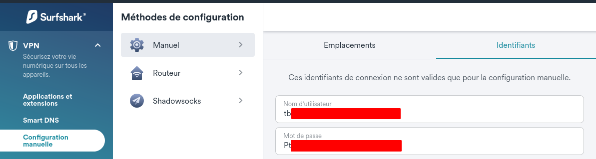{:width="400"}  
Il est conseillé de garder cette page ouverte pour l'instant. Vous en aurez besoin un peu plus tard.

**Installer le paquet OpenVPN**  
Ouvrez la fenêtre du terminal.Vous pouvez le faire en appuyant sur les touches Ctrl+Alt+T ou en y accédant dans le menu de vos applications.   
Entrez la commande suivante pour installer tous les paquets nécessaires :

    sudo apt-get install openvpn unzip # debian/ubuntu
    sudo pacman -S openvpn unzip # archlinux/manjaro

*Vous devrez peut-être entrer le mot de passe de votre ordinateur pour confirmer ce processus. Dans ce cas, entrez le mot de passe et appuyez sur la touche Entrée.*

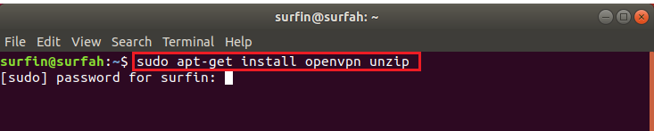{:width="400"}  

**Télécharger les fichiers de configuration surfshark**  

En mode su

    sudo -s

Naviguez vers le répertoire OpenVPN. Vous pouvez le faire en entrant cette commande :

    cd /etc/openvpn/client

Téléchargez la configuration de Surfshark OpenVPN en entrant la commande suivante :

    wget https://my.surfshark.com/vpn/api/v1/server/configurations

Décompresser le fichier configurations.zip en entrant cette commande :

    unzip configurations

Entrez la commande suivante pour voir la liste de tous les serveurs disponibles :

    ls

```
es-bcn.prod.surfshark.com_tcp.ovpn	  uk-lon-st002.prod.surfshark.com_udp.ovpn
es-bcn.prod.surfshark.com_udp.ovpn	  uk-lon-st003.prod.surfshark.com_tcp.ovpn
es-mad.prod.surfshark.com_tcp.ovpn	  uk-lon-st003.prod.surfshark.com_udp.ovpn
es-mad.prod.surfshark.com_udp.ovpn	  uk-lon-st004.prod.surfshark.com_tcp.ovpn
es-vlc.prod.surfshark.com_tcp.ovpn	  uk-lon-st004.prod.surfshark.com_udp.ovpn
es-vlc.prod.surfshark.com_udp.ovpn	  uk-lon-st005.prod.surfshark.com_tcp.ovpn
fi-hel.prod.surfshark.com_tcp.ovpn	  uk-lon-st005.prod.surfshark.com_udp.ovpn
fi-hel.prod.surfshark.com_udp.ovpn	  uk-man.prod.surfshark.com_tcp.ovpn
fr-bod.prod.surfshark.com_tcp.ovpn	  uk-man.prod.surfshark.com_udp.ovpn
fr-bod.prod.surfshark.com_udp.ovpn	  us-atl.prod.surfshark.com_tcp.ovpn
fr-mrs.prod.surfshark.com_tcp.ovpn	  us-atl.prod.surfshark.com_udp.ovpn
fr-mrs.prod.surfshark.com_udp.ovpn	  us-bdn.prod.surfshark.com_tcp.ovpn
fr-par.prod.surfshark.com_tcp.ovpn	  us-bdn.prod.surfshark.com_udp.ovpn
fr-par.prod.surfshark.com_udp.ovpn	  us-bos.prod.surfshark.com_tcp.ovpn
gr-ath.prod.surfshark.com_tcp.ovpn	  us-bos.prod.surfshark.com_udp.ovpn
```
 
**Connexion au VPN**  
Choisir un serveur dans la liste et copiez le nom d'hôte (clic-droit - copier)  
Connectez-vous au serveur de votre choix en entrant cette commande : `sudo openvpn <coller le nom du serveur ici>`  
Par exemple, si vous souhaitez vous connecter au serveur fr-bod, voici la commande :

    openvpn fr-bod.prod.surfshark.com_udp.ovpn

    connect_to_this_server.png

    Avant de pouvoir vous connecter au serveur, vous devez saisir les informations d'identification du service Surfshark.

    Saisissez les informations d'identification que vous avez recueillies dans la partie "Obtenez vos informations d'identification", puis appuyez sur la touche Entrée.

```
[root@archyan client]# openvpn fr-bod.prod.surfshark.com_udp.ovpn
2021-02-16 15:11:58 DEPRECATED OPTION: --cipher set to 'AES-256-CBC' but missing in --data-ciphers (AES-256-GCM:AES-128-GCM). Future OpenVPN version will ignore --cipher for cipher negotiations. Add 'AES-256-CBC' to --data-ciphers or change --cipher 'AES-256-CBC' to --data-ciphers-fallback 'AES-256-CBC' to silence this warning.
2021-02-16 15:11:58 OpenVPN 2.5.0 [git:makepkg/a73072d8f780e888+] x86_64-pc-linux-gnu [SSL (OpenSSL)] [LZO] [LZ4] [EPOLL] [PKCS11] [MH/PKTINFO] [AEAD] built on Nov  6 2020
2021-02-16 15:11:58 library versions: OpenSSL 1.1.1i  8 Dec 2020, LZO 2.10
🔐 Enter Auth Username: 
🔐 Enter Auth Password: ************************

[...]
2021-02-16 15:13:25 TUN/TAP device tun0 opened
2021-02-16 15:13:25 net_iface_mtu_set: mtu 1500 for tun0
2021-02-16 15:13:25 net_iface_up: set tun0 up
2021-02-16 15:13:25 net_addr_v4_add: 10.8.8.7/24 dev tun0
2021-02-16 15:13:25 net_route_v4_add: 185.108.106.144/32 via 192.168.0.254 dev [NULL] table 0 metric -1
2021-02-16 15:13:25 net_route_v4_add: 0.0.0.0/1 via 10.8.8.1 dev [NULL] table 0 metric -1
2021-02-16 15:13:25 net_route_v4_add: 128.0.0.0/1 via 10.8.8.1 dev [NULL] table 0 metric -1
2021-02-16 15:13:25 Initialization Sequence Completed
```

Si vous pouvez voir la ligne "Initialization Sequence Completed" sur votre terminal, c'est que vous avez réussi à vous connecter à Surfshark !

Pour vous déconnecter de la connexion OpenVPN, ouvrez le terminal et appuyez sur Ctrl + C.  
Vous avez configuré avec succès la connexion manuelle d'OpenVPN ! Tant que vous êtes connecté, votre emplacement est privé et vos données sensibles sont sécurisées.

**Vérifications**  
Adresse IP <https://surfshark.com/what-is-my-ip>  
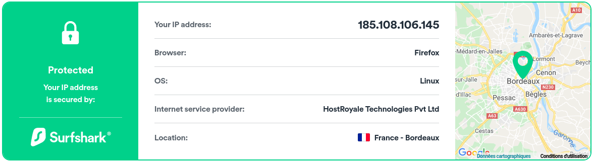{:width="600"}  

DNS leaks <https://surfshark.com/dns-leak-test>  
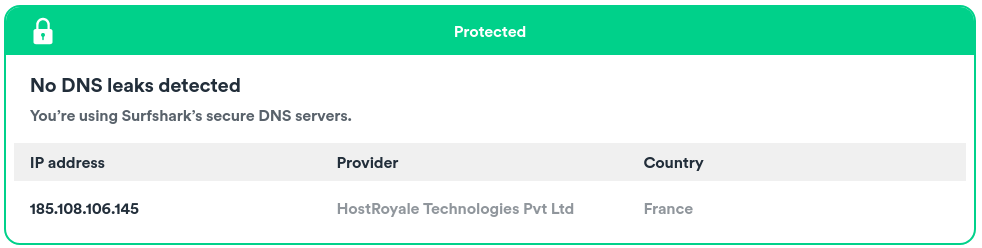{:width="600"}  

<https://ipleak.net/>  
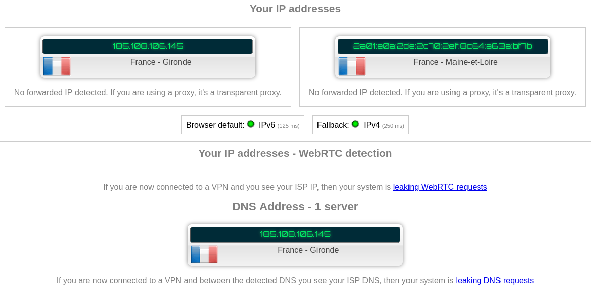{:width="600"}  

## Options d'assistance

**Assistance technique et liée aux produits**  
Si vous avez des questions techniques ou concernant les produits, vous pouvez contacter Surfshark en utilisant les informations suivantes :

* Adresse e-mail : <support@surfshark.com>
* Online Contact Form: <https://account.surfshark.com/contact>
* Online Faqs: <https://support.surfshark.com/hc/en-us/categories/360000185553-FAQ>

**Assistance relative au paiement et aux commandes**  
Si vous avez des questions concernant le paiement ou une commande, veuillez contacter le [service client cleverbridge](https://www.cleverbridge.com/1622/?scope=cuseco&id=7YozGA1ibD&cfg=surfshark). 