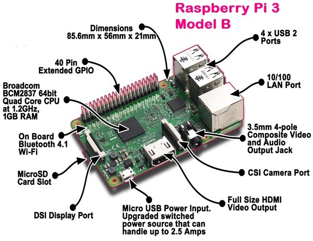
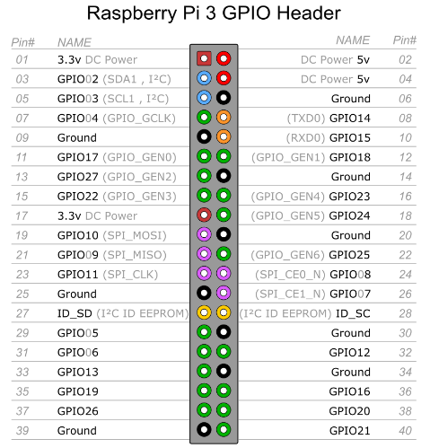
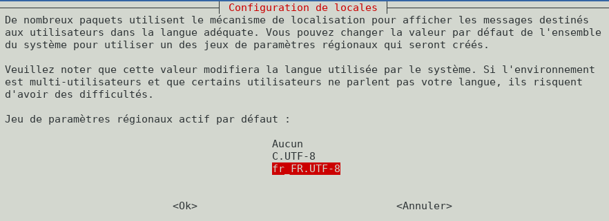
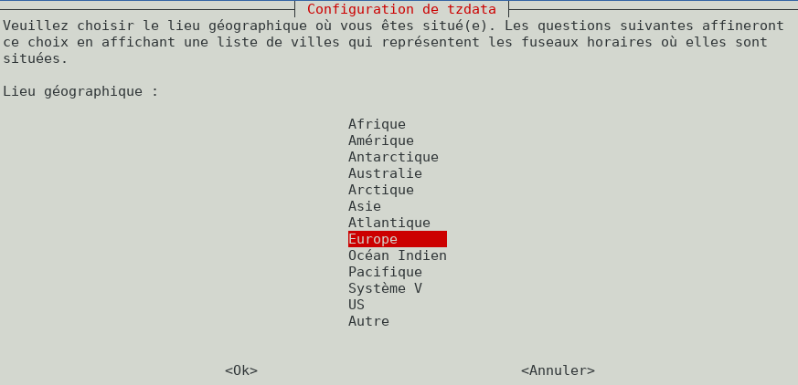
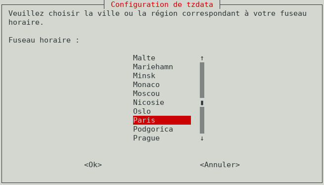

+++
title = 'Raspberry Pi OS (USB/Flash)'
date = 2021-02-26 00:00:00 +0100
categories = ['raspberry']
+++
## Raspberry PI 3

{:width="400px"}

* Processeur Quad Core Broadcom 2837 ARMv8 64bit
* Vitesse du processeur : 1,2 GHz
* 1 GB RAM
* BCM43143 WiFi intégré
* Bluetooth Low Energy (BLE) intégré
* 40 broches d'extension GPIO
* 4 ports USB2
* Sortie vidéo et stéréo
* Port caméra CSI pour connecter la caméra Raspberry Pi
* Port d'affichage DSI pour connecter l'écran tactile Raspberry Pi
* Lecteur de carte Micro SD pour charger votre système d'exploitation et stocker vos données
* Source d'alimentation Micro USB, supporte maintenant jusqu'à 2,5A

{:width="300px"} 

[SPI0 SPI1 Pin Out](https://fr.pinout.xyz/pinout/spi#)

## Raspberry Pi OS Lite

{:width="100px"}  
[Raspberry Pi OS (anciennement Raspberry Pi OS)](https://raspberry-pi.fr/telechargements/)  

### Samsung USB 3.0 Flash Drive FIT 32GB

[Booter un Raspberry sur une clé USB ou un Disque Dur](https://domotique-home.fr/booter-un-raspberry-sur-une-cle-usb-ou-un-disque-dur/)

Choix d'une clé **Samsung USB 3.0 Flash Drive FIT 32GB**  
{:width="100px"}

**Raspberry Pi 3,3B**  
La possibilité de booter sur un stockage USB externe est vérifiable après boot sur une carte SD par la commande `vcgencmd otp_dump | grep 17:` qui doit afficher  **17:3020000a**  
Dans le cas contraire, éditer le fichier `/boot/config.txt` de la SDcard et ajouter à la fin du fichier la ligne suivante `program_usb_boot_mode=1` puis redémarrer le PI et vérifier par la commande `vcgencmd`   
*Après modification, le boot est total sur le Flash Drive USB ,la SDcard n'est plus utilisée*

**Raspberry Pi 1 et 2**  
Modifier le fichier  `/boot/cmdline.txt` de la SDcard , remplacer `root=PARTUUID=188891eb-02` qui est la partion 2 de la SDcard par `root=/dev/sda2` qui est la partition 2 du Flash Drive USB  
*On utilise la SDcard uniquement pour le boot*

Insérer la clé **Samsung USB 3.0 Flash Drive FIT 32GB** sur un des connecteurs USB de l'ordinateur linux   
Repérer sur quel périphérique  

    dmesg

```
[ 3420.876497] sd 4:0:0:0: [sdd] 62652416 512-byte logical blocks: (32.1 GB/29.9 GiB)
[ 3420.877074] sd 4:0:0:0: [sdd] Write Protect is off
[ 3420.877081] sd 4:0:0:0: [sdd] Mode Sense: 43 00 00 00
[ 3420.877653] sd 4:0:0:0: [sdd] Write cache: enabled, read cache: enabled, doesn't support DPO or FUA
[ 3420.884367]  sdd: sdd1 sdd2
[ 3420.886547] sd 4:0:0:0: [sdd] Attached SCSI removable disk
```

La "Clé USB" est sur le périphérique système /dev/sdd  

Aller dans le dossier contenant l'image de Raspberry Pi OS

    sudo dd bs=4M if=2021-01-11-raspios-buster-armhf-lite.img of=/dev/sdd conv=fsync

```
445+0 enregistrements lus
445+0 enregistrements écrits
1866465280 octets (1,9 GB, 1,7 GiB) copiés, 145,811 s, 12,8 MB/s
```

>**ATTENTION !!!** Pas d'accès à la carte raspberry en mode terminal par la liaison série ou SSH  
Les dernières versions de Raspberry Pi OS nécessitent un écran et un clavier, car il n'est plus possible de se connecter directement par la liaison série ou SSH au Raspberry par défaut.  
- Pour réactiver le lancement de SSH au boot ,placer dans la partition boot de la carte SD un fichier nommé **ssh**, vide et sans extension.  
- Pour la liaison série ,il faut modifier le fichier de configuration **config.txt ** avant insertion de la "Clé USB" dans le raspberry  

Identifier le périphérique

    dmesg

```
[ 3420.877074] sd 4:0:0:0: [sdd] Write Protect is off
[ 3420.877081] sd 4:0:0:0: [sdd] Mode Sense: 43 00 00 00
[ 3420.877653] sd 4:0:0:0: [sdd] Write cache: enabled, read cache: enabled, doesn't support DPO or FUA
[ 3420.884367]  sdd: sdd1 sdd2
[ 3420.886547] sd 4:0:0:0: [sdd] Attached SCSI removable disk
[ 3664.644705]  sdd: sdd1 sdd2
```

Montage de la "Clé USB" (sdd1 qui correspond au boot) sur un dossier temporaire :  

    sudo mkdir -p /mnt/temp        #Créer un dossier de montage temporaire
    sudo mount /dev/sdd1 /mnt/temp #montage de la partition boot sur /mnt/temp

Modifier le fichier **temp/config.txt **  

    sudo nano /mnt/temp/config.txt

ajouter en fin de fichier pour activer la liasion série   

    enable_uart=1

Sauvegarde Crtl x y ou o Entrée  
fichier ssh vide dans la partition boot

    sudo touch /mnt/temp/ssh

Démontage et insertion "Clé USB" dans le raspberry :   

    sudo umount /mnt/temp

Après avoir inséré la "Clé USB" dans son logement ,connecté le cordon réseau et la liaison série puis 
brancher la micro-usb d'alimentation  sur la carte raspberry et enfin le DC-Pack sur le secteur.  
On peut se connecter soit par la liaison série (A) ou SSH (B)

A - **minicom** ou **screen** et un adatateur USB/Série

|Interface USB/Série|Raspberry|
| ----------------- | ------- |
| GND | 6 (GND)|
| Rxd | 8 (Txd) |
| Txd | 10 (Rxd) |

lancer le logiciel de communication (minicom ou screen)  

    sudo minicom # Débit/Parité/Bits:115200 8N1,Contrôle de flux matériel:Non,Contrôle de flux logiciel:Non  
	sudo screen /dev/ttyUSB0 115200

B - Trouver l'adresse avec **nmap**  et utiliser **ssh**

    sudo nmap -T4 -sP 192.168.0.0/24

```
[...]
Nmap scan report for 192.168.0.5
Host is up (0.00037s latency).
MAC Address: B8:27:EB:54:7E:6A (Raspberry Pi Foundation)
[...]
```

### Liens

*    [Assign static IP address and configure Networking](https://peppe8o.com/assign-static-ip-and-manage-networking-in-raspberry-pi-os-lite/)
*    [Change timezone to display correct local time](https://peppe8o.com/change-timezone-in-raspberry-pi-os-lite-from-terminal/)
*    [Fix slow SSH session from remote terminal](https://peppe8o.com/fix-slow-ssh-remote-terminal-issue-in-raspberry-pi-os/)
*    [Add 2 factor authentication](https://peppe8o.com/how-to-add-2-factor-authentication-2fa-in-raspbian-buster-lite-with-google-authenticator-for-ssh-login/)
*    [Read a Serial port from USB](https://peppe8o.com/reading-a-serial-usb-port-from-raspbian-buster-lite-with-python-from-terminal/)
*    [Use USB Microphone](https://peppe8o.com/use-usb-microphone-with-raspberry-pi-and-raspbian-buster-lite/)
*    [Migrate to larger SD Card](https://peppe8o.com/raspberry-pi-migrating-to-larger-sd-card-with-windows-step-by-step-guide/)
*    [free Raspberry PI remote access and management tools](https://peppe8o.com/raspberry-pi-remote-management-and-access-tools/)
*    [Set Raspberry PI Swap Memory](https://peppe8o.com/set-raspberry-pi-swap-memory/)
*    [Manage Raspberry PI GPU Memory Split](https://peppe8o.com/manage-raspberry-pi-gpu-memory-split/)

### Connexion ssh et mise à jour

Connexion SSH

    ssh pi@192.168.0.5

login/motde passe : pi/raspberry  

Mise à jour des paquets

	sudo apt update && sudo apt -y upgrade

Installer utilitaires

    sudo apt install rsync curl tmux jq figlet git dnsutils tree -y


### IPV4-V6 statiques Raspberry PI OS Lite

De nombreux projets impliquant des installations sans bureau nécessitent de le rendre disponible toujours avec la même adresse IP. Cette condition peut être réalisée en gérant la mise en réseau dans les paramètres de Raspberry PI OS Lite depuis la console du terminal.

**Comportement par défaut**  
Raspberry Pi utilise le démon dhcpcd pour configurer TCP/IP sur toutes ses interfaces réseau. Cela comprend l'attribution d'une adresse IP à chaque interface, la définition de masques de réseau et la configuration de serveurs de noms de résolution DNS.

Par défaut, Raspberry Pi OS tente de configurer automatiquement toutes les interfaces réseau par DHCP, en revenant à des adresses privées automatiques dans la plage 169.254.0.0/16 en cas d'échec du DHCP.

Les versions précédentes de Raspberry Pi OS utilisaient le fichier /etc/network/interfaces pour la configuration des interfaces réseau. Si une interface est répertoriée dans ce fichier, tous les paramètres qui y figurent auront la priorité sur ce qui se trouve dans le fichier /etc/dhcpcd.conf.

Raspberry PI OS liste généralement 2 interfaces (pour les modèles SANS interface physique ethernet) ou 3 interfaces (tous les autres modèles) :

* wlan0 : pour la connexion au réseau WiFi
* eth0 : pour une connexion de réseau câblé Ethernet
* lo : interface de bouclage utilisée par le système d'exploitation pour s'identifier (avec l'adresse IP 127.0.0.1)

Vous pouvez lister toutes ces interfaces et leur statut avec la commande de terminal suivante :

    ip a

**Gérer correctement les configurations de mise en réseau**

**IPV4 :** On définit l'adresse statique `192.168.0.46`

**IPV6 :** On définit l'adresse statique `2a01:e0a:2de:2c72::1`  

La carte sera joignable de l’internet que par son adresse IPV6  
Modifier la FreeBox : Paramètres de la Freebox &rarr; Configuration IPV6   
NextHop Freebox permet d’attribuer une adresse IPV6  

Prefixe : 2a01:e0a:2de:2c72:://64  
Next Hop: fe80::49e0:245b:b415:76  &rarr; Adresse inet6 scope link  
Adresse IPV6 lien local : fe80::8e97:eaff:fe39:66d6  


éditer le fichier dhcpcd.conf :

    sudo nano /etc/dhcpcd.conf

La configuration par défaut (sans paramètres d'interface) utilise le DHCP pour configurer les interfaces eth0 et wlan0.

Pour rendre votre adresse IP d'interface ethernet statique, veuillez ajouter ces lignes à la fin du fichier

```
interface eth0
static ip_address=192.168.0.48/24
static ip6_address=2a01:e0a:2de:2c72::1/64
static routers=192.168.0.254
static domain_name_servers=192.168.0.46 192.168.0.254 fe80::8e97:eaff:fe39:66d6
```

Modifier le mot de passe `pi`

    sudo passwd pi

Redémarrer le raspberry...

Connexion **pi/raspberry** via SSH  

    ssh pi@192.168.0.48

Vérifier les adresses IP

    ip a

```
1: lo: <LOOPBACK,UP,LOWER_UP> mtu 65536 qdisc noqueue state UNKNOWN group default qlen 1000
    link/loopback 00:00:00:00:00:00 brd 00:00:00:00:00:00
    inet 127.0.0.1/8 scope host lo
       valid_lft forever preferred_lft forever
    inet6 ::1/128 scope host 
       valid_lft forever preferred_lft forever
2: eth0: <BROADCAST,MULTICAST,UP,LOWER_UP> mtu 1500 qdisc pfifo_fast state UP group default qlen 1000
    link/ether b8:27:eb:54:7e:6a brd ff:ff:ff:ff:ff:ff
    inet 192.168.0.48/24 brd 192.168.0.255 scope global noprefixroute eth0
       valid_lft forever preferred_lft forever
    inet6 2a01:e0a:2de:2c70:eed1:b8ac:1f76:88ed/64 scope global dynamic mngtmpaddr noprefixroute 
       valid_lft 86225sec preferred_lft 86225sec
    inet6 2a01:e0a:2de:2c72::1/64 scope global noprefixroute 
       valid_lft forever preferred_lft forever
    inet6 fe80::49e0:245b:b415:76/64 scope link 
       valid_lft forever preferred_lft forever
3: wlan0: <BROADCAST,MULTICAST> mtu 1500 qdisc noop state DOWN group default qlen 1000
    link/ether b8:27:eb:01:2b:3f brd ff:ff:ff:ff:ff:ff
```

### Locals

    export   LC_ALL=C
    sudo dpkg-reconfigure locales
  

{:width="600px"}  

### Paramètres régionaux

    sudo dpkg-reconfigure tzdata

{:width="600px"}  

{:width="600px"}  


    timedatectl

```
               Local time: Thu 2021-02-25 20:26:08 CET
           Universal time: Thu 2021-02-25 19:26:08 UTC
                 RTC time: n/a
                Time zone: Europe/Paris (CET, +0100)
System clock synchronized: yes
              NTP service: active
          RTC in local TZ: no
```

### Clavier fr

    sudo nano /etc/default/keyboard

```
# KEYBOARD CONFIGURATION FILE

# Consult the keyboard(5) manual page.

XKBMODEL="pc105"
XKBLAYOUT="fr"
XKBVARIANT=""
XKBOPTIONS=""

BACKSPACE="guess"
```

### SSH + Clés

<u>sur l'ordinateur de bureau</u>  
Générer une paire de clé curve25519-sha256 (ECDH avec Curve25519 et SHA2) nommé xs35v2 pour une liaison SSH avec le serveur KVM.

    ssh-keygen -t ed25519 -o -a 100 -f ~/.ssh/rpi3b-ed25519

Envoyer la clé publique sur le serveur KVM

    scp ~/.ssh/rpi3b-ed25519.pub pi@192.168.0.48:/home/pi/

<u>sur le Raspberry PI 3</u>  
Copier le contenu de la clé publique dans /home/$USER/.ssh/authorized_keys

    $ cd ~

Sur le KVM ,créer un dossier .ssh

    mkdir -p .ssh
    cat /home/$USER/rpi3b-ed25519.pub >> /home/$USER/.ssh/authorized_keys

et donner les droits

    chmod 600 /home/$USER/.ssh/authorized_keys

effacer le fichier de la clé

    rm /home/$USER/rpi3b-ed25519.pub

Modifier la configuration serveur SSH

    sudo nano /etc/ssh/sshd_config

Modifier

    Port = 55029                # si souhaité sinon 22
    PasswordAuthentication no

Relancer openSSH

    sudo systemctl restart ssh

Accès depuis le poste distant avec la clé privée

    ssh -p 55029 -i ~/.ssh/rpi3b-ed25519 pi@192.168.0.48

### Domaine et certificats rnmkcy.eu

{:width="30"}   
**Zone dns OVH**

```
$TTL 3600
@	IN SOA dns110.ovh.net. tech.ovh.net. (2021021700 86400 3600 3600000 300)
             IN NS     dns110.ovh.net.
             IN NS     ns110.ovh.net.
             IN AAAA   2a01:e0a:2de:2c72::1
domotic     IN CNAME  rnmkcy.eu.
```

**Certificats Let's Encrypt** 
Installer acme: [Serveur , installer et renouveler les certificats SSL Let's encrypt via Acme](https://blog.cinay.xyz/2017/08/Acme-Certficats-Serveurs.html)  

    cd ~
    sudo apt -y install socat git # prérequis
    git clone https://github.com/Neilpang/acme.sh.git
    cd acme.sh
    ./acme.sh --install # se déconnecter pour prise en compte
    # export des clé API OVH

Générer les certificats pour le domaine rnmkcy.eu

        acme.sh --dns dns_ovh --ocsp --issue --keylength ec-384 -d 'domotic.rnmkcy.eu'

```
[vendredi 26 février 2021, 07:40:46 (UTC+0100)] Your cert is in  /home/pi/.acme.sh/domotic.rnmkcy.eu_ecc/domotic.rnmkcy.eu.cer 
[vendredi 26 février 2021, 07:40:46 (UTC+0100)] Your cert key is in  /home/pi/.acme.sh/domotic.rnmkcy.eu_ecc/domotic.rnmkcy.eu.key 
[vendredi 26 février 2021, 07:40:47 (UTC+0100)] The intermediate CA cert is in  /home/pi/.acme.sh/domotic.rnmkcy.eu_ecc/ca.cer 
[vendredi 26 février 2021, 07:40:47 (UTC+0100)] And the full chain certs is there:  /home/pi/.acme.sh/domotic.rnmkcy.eu_ecc/fullchain.cer 
```

Les liens

```bash
sudo ln -s /home/pi/.acme.sh/domotic.rnmkcy.eu_ecc/fullchain.cer /etc/ssl/private/domotic.rnmkcy.eu-fullchain.pem   # full chain certs
sudo ln -s /home/pi/.acme.sh/domotic.rnmkcy.eu_ecc/domotic.rnmkcy.eu.key /etc/ssl/private/domotic.rnmkcy.eu-key.pem     # cert key
sudo ln -s /home/pi/.acme.sh/domotic.rnmkcy.eu_ecc/domotic.rnmkcy.eu.cer /etc/ssl/private/domotic.rnmkcy.eu-chain.pem   # cert domain
sudo ln -s /home/pi/.acme.sh/domotic.rnmkcy.eu_ecc/ca.cer /etc/ssl/private/domotic.rnmkcy.eu-ca.pem                 # intermediate CA cert
```

## Nginx light (OPTION)

Installer version light

    sudo apt install nginx-light

Version

    sudo nginx -v

nginx version: nginx/1.14.2

Modifier le fichier de configuration `/etc/nginx/nginx.conf` , on utilise TLS1.2 et TLS1.3  uniquement + ciphers off

```
[...]
	##
	# SSL Settings
	##

	ssl_protocols TLSv1.2 TLSv1.3;
	ssl_prefer_server_ciphers off;

[...]
```

Modifier la configuration par défaut pour test

    sudo nano /etc/nginx/sites-available/default 

```
server {
    listen 443 ssl http2;
    listen [::]:443 ssl http2;
    server_name domotic.rnmkcy.eu;
    ssl_certificate /etc/ssl/private/domotic.rnmkcy.eu-fullchain.pem;
    ssl_certificate_key /etc/ssl/private/domotic.rnmkcy.eu-key.pem;

    # TLS 1.3 only
    ssl_protocols TLSv1.3;
    ssl_prefer_server_ciphers off;
 
    # HSTS (ngx_http_headers_module is required) (63072000 seconds)
    add_header Strict-Transport-Security "max-age=63072000" always;
 
    # OCSP stapling
    ssl_stapling on;
    ssl_stapling_verify on;
 
    # verify chain of trust of OCSP response using Root CA and Intermediate certs
    ssl_trusted_certificate /etc/ssl/private/domotic.rnmkcy.eu-fullchain.pem;
 
    # replace with the IP address of your resolver
    resolver 192.168.0.46;

	root /var/www/html;

	# Add index.php to the list if you are using PHP
	index index.html index.htm index.nginx-debian.html;

	location / {
		# First attempt to serve request as file, then
		# as directory, then fall back to displaying a 404.
		try_files $uri $uri/ =404;
	}

}
```

Vérification et relance

    sudo nginx -t
    sudo systemctl reload nginx

Lien https://domoticz.rnmkcy.eu
