+++
title = 'PC1 Ordinateur Bureau ArchLinux xfce (NEW)'
date = 2021-03-03 00:00:00 +0100
categories = ['archlinux']
+++
# Ordinateur PC1 

## Matériel

### Carte mère ASUS H110M-A/M.2

{:width="150"}

[Carte mère ASUS H110M-A/M.2](/files/F11483_H110M-A_M_2_UM_WEB.pdf)

**CPU**

* Intel® Socket 1151 for 7th/6th Generation Core™ i7/Core™ i5/Core™ i3/Pentium®/Celeron® Processors
* Supports Intel® 14 nm CPU
* Supports Intel® Turbo Boost Technology 2.0
    * The Intel® Turbo Boost Technology 2.0 support depends on the CPU types.
    * Refer to [www.asus.com](http://www.asus.com/) for CPU support list
* Chipset
* Intel® H110

**Réseau**

* Contrôleur Gigabit Intel 1219v compatible avec LANGuard

**Memory**

* 2 x DIMM, Max. 32GB, DDR4 2400/2133 MHz Non-ECC, Un-buffered Memory
* Supports Intel® Extreme Memory Profile (XMP)
    * Hyper DIMM support is subject to the physical characteristics of individual CPUs. 
    * Refer to www.asus.com for the Memory QVL (Qualified Vendors Lists).
    * Due to Intel® chipset limitation, DDR4 2400MHz memory frequency is only supported by 7th Generation Intel® processors. Higher memory modules will run at the maximum transfer rate of DDR4 2400MHz.
    * Due to Intel® chipset limitation, DDR4 2133MHz and higher memory modules on 6th Generation Intel® processors will run at the maximum transfer rate of DDR4 2133MHz.

**Graphic**

* Integrated Graphics Processor- Intel® HD Graphics support
* Multi-VGA output support : HDMI/DVI-D/RGB ports
    - Supports HDMI  with max. resolution 4096 x 2160 @ 24 Hz / 2560 x 1600 @ 60 Hz
    - Supports DVI-D with max. resolution 1920 x 1200 @ 60 Hz
    - Supports RGB   with max. resolution 1920 x 1200 @ 60 Hz
* Maximum shared memory of 1024 MB
* Supports up to 2 displays simultaneously

**Expansion Slots**

* 1 x PCIe 3.0/2.0 x16 (x16 mode)
* 2 x PCIe 2.0 x1

**Storage**

* Intel® H110 chipset :
* 1 x M.2 Socket 3, with M key, type 2242/2260/2280 storage devices support (both SATA & PCIE mode)*2
* 4 x SATA 6Gb/s port(s),
* Intel® Rapid Storage Technology supports*1
* LAN
* Intel® I219V

**Audio**

* Realtek® ALC887 8-Channel High Definition Audio CODEC *2
    - Supports : Jack-detection, Front Panel Jack-retasking

    **Audio Feature :**

    - LED-illuminated design - Brighten up your build with the gorgeous illuminated audio trace path.
    - Audio Shielding: Ensures precision analog/digital separation and greatly reduced multi-lateral interference
    - Dedicated audio PCB layers: Separate layers for left and right channels to guard the quality of the sensitive audio signals
    - Premium Japanese audio capacitors: Provide warm, natural and immersive sound with exceptional clarity and fidelity

**USB Ports**

* Intel® H110 chipset :
* 4 x USB 3.1 Gen 1 port(s) (2 at back panel, blue, 2 at mid-board)
* Intel® H110 chipset :
* 6 x USB 2.0/1.1 port(s) (4 at back panel, black, 2 at mid-board)

**Special Features**

* ASUS 5X Protection II :
    - ASUS LANGuard - 2.5X higher surge tolerance
    - ASUS DIGI+ VRM - 5 Phase digital power design
    - ASUS DRAM Overcurrent Protection - Prevents damage from short circuits
    - ASUS Stainless-Steel Back I/O - 3X corrosion-resistance for greater durability
    - ASUS ESD Guards - Electrostatic discharge protection
* ASUS EPU :
    - EPU
* ASUS Exclusive Features :
    - AI Suite 3
    - Ai Charger
    - Low EMI Solution
    - USB 3.0 Boost
    - Mobo Connect
    - PC Cleaner
* ASUS Quiet Thermal Solution :
    - Stylish Fanless Design Heat-sink solution
    - ASUS Fan Xpert
* ASUS EZ DIY :
    - ASUS CrashFree BIOS 3
    - ASUS EZ Flash 3
    - ASUS UEFI BIOS EZ Mode
    - Push Notice
* ASUS Q-Design :
    - ASUS Q-Slot
    - ASUS Q-DIMM

**Back I/O Ports**

* 1 x PS/2 keyboard (purple)
* 1 x PS/2 mouse (green)
* 1 x DVI-D
* 1 x D-Sub
* 1 x HDMI
* 1 x LAN (RJ45) port(s)
* 2 x USB 3.1 Gen 1 (blue)
* 4 x USB 2.0
* 3 x Audio jack(s)

**Internal I/O Ports**

* 1 x USB 3.1 Gen 1 connector(s) support(s) additional 2 USB 3.1 Gen 1 port(s)
* 1 x USB 2.0 connector(s) support(s) additional 2 USB 2.0 port(s)
* 1 x M.2 Socket 3
* 1 x COM port(s) connector(s)
* 4 x SATA 6Gb/s connector(s)
* 1 x CPU Fan connector(s) (1 x 4 -pin)
* 1 x Chassis Fan connector(s) (1 x 4 -pin)
* 1 x S/PDIF out header(s)
* 1 x 24-pin EATX Power connector(s)
* 1 x 4-pin ATX 12V Power connector(s)
* 1 x Front panel audio connector(s) (AAFP)
* 1 x Clear CMOS jumper(s)
* 1 x System panel connector

**Accessories**

* User's manual
* I/O Shield
* 2 x SATA 3Gb/s cable(s)
* 1 x M.2 Screw Package
* 1 x Supporting DVD

**Manageability**

* WfM 2.0, DMI 3.0, WOL by PME, PXE

**Form Factor**

* mATX Form Factor
* 8.9 inch x 7.3 inch ( 22.6 cm x 18.5 cm )

**BIOS**

* 128 Mb Flash ROM, UEFI AMI BIOS, PnP, DMI 3.0, WfM2.0, SM BIOS 3.0, ACPI 5.0, Multi-language BIOS, ASUS EZ Flash 3, ASUS CrashFree BIOS 3, My Favorites, Quick Note, Last Modified Log, F12 PrintScreen function, and ASUS DRAM SPD (Serial Presence Detect) memory information

Mise à jour du bios

* [Update BIOS ASUS H110M-A/M.2](/files/E12583_BIOS_Update_EM_V3_WEB_20170614.pdf)  
* [BIOS H110M-A-M-2 (download)](https://www.asus.com/fr/Motherboards/H110M-A-M-2/HelpDesk_Download/) 
    * **Version 3408 2017/07/21**  Mise à jour BIOS effectuée le 13/10/2017  
    * **Version 4202 2019/03/15**  Mise à jour BIOS effectuée le 
 


Après mise à jour du BIOS , il faut activer **Intel Virtualization Technology**  

1. Accès au BIOS (F2)
2. Advanced Mode (F7)
   - Onglet *Advanced* 
   - Faire défiler le champ *Cpu configuration* jusqu'au paramètre  **Intel Virtualization Technology**
   - Activer **Intel Virtualization Technology  Enabled**
   - Onglet *Exit* 
3. **Save changes & reset**


### Processeur Refroidisseur Mémoire Alimentation

**Intel Core i3-6100 (3.7 GHz)**   
Processeur Dual Core Socket 1151 Cache L3 3 Mo Intel HD Graphics 530 0.014 micron (version boîte - garantie Intel 3 ans)   
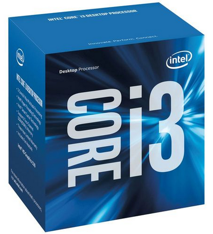{:width="10%"}  

**CPU UPGRADE** [ASUS H110M-A/M.2 processor support and specifications](http://www.cpu-upgrade.com/mb-ASUS/H110M-A_M.2/) (*list des CPU compatibles avec la carte mère*) 

**Processeur [Intel Core i5-7500 CPU](http://www.cpu-upgrade.com/CPUs/Intel/Core_i5/i5-7500/) mis en place le 20/02/2020**

```
General specs 
        Microarchitecture:	Kaby Lake
        Core Name:	Kaby Lake-S
        Manufacturing Process:	0.014 micron
        Socket Type:	Socket 1151
        The Number of Cores:	4
        The Number of Threads:	4
        Multiprocessing:	Not supported
        Frequency:	3.4 GHz
        Maximum Turbo Frequency:	3.8 GHz
        L1 Cache:	128 KB (code)
        128 KB (data)
        L2 Cache:	1 MB
        L3 Cache:	6 MB
        Thermal Design Power:	65 Watt
        Integrated GPU:	Intel HD 630
        Supported memory:	DDR3L-1333 / DDR3L-1600 / DDR4-2133 / DDR4-2400

Instructions and Technologies
        Execute Disable Bit?	Yes
        64-bit Support?	Yes
        Hyper-Threading technology?	No
        Turbo Boost?	Yes
        Virtualization?	Yes
        Enhanced SpeedStep?	Yes
        Instruction Set Extensions:	AES
            AVX
            AVX2
            F16C
            FMA3
            MMX
            SSE
            SSE2
            SSE3
            SSE4
            Supplemental SSE3
```


**Cooler Master Hyper TX3i**   
Ventilateur pour processeur (pour socket Intel 775 / 1150 / 1151 / 1155 / 1156)   
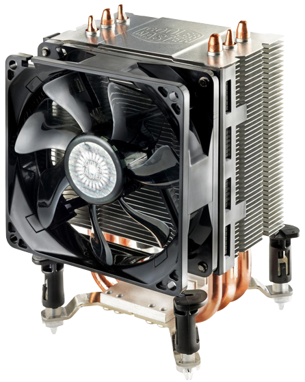{:width="10%"}

**Kingston ValueRAM 16 Go DDR4 2133 MHz CL15 DR X8**   
RAM DDR4 PC4-17000 - KVR21N15D8/16 (garantie 10 ans par Kingston)   
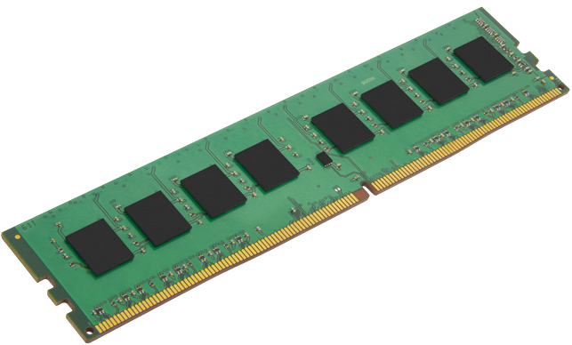{:width="10%"}

**Zalman ZM500-GV 80PLUS Bronze**   
Alimentation 500W ATX 12V v2.3 80PLUS Bronze   
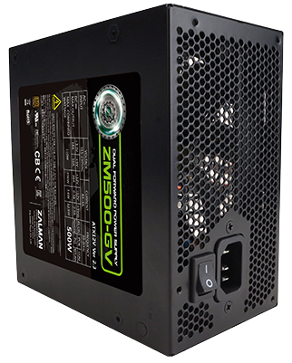{:width="20%"}

**Western Digital Red 4 To SATA 3"5 6Gb/s**  
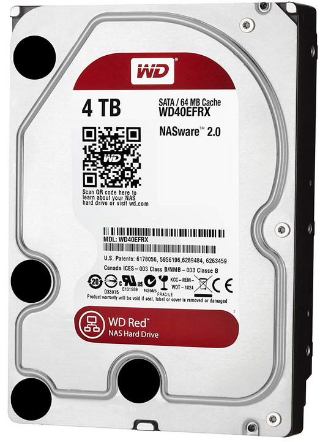{:width="10%"}  
*Spécifiquement conçus pour les systèmes NAS de 1 à 8 baies, les disques durs Western Digital Red sont faits pour tourner 24h/24 et 7j/7, et destinés aux particuliers et aux petites structures de travail. Ces disques durs au format 3.5" sont construits autour de 64 à 256 Mo de cache  sur un bus SATA III. Leur compatibilité est assurée avec la plupart des serveurs NAS de grandes marques .*

**Western Digital Caviar GP WD5000AACS 500GB 5400 to 7200 RPM 16MB Cache SATA 3.0Gb/s 3.5" Internal Hard Drive Bare Drive 3"5**  
{:width="10%"}  

**Crucial SSD C300-CTFDDAC064M  64Go**  
**Crucial SSD CT512MX1  512Go**  
{:width="10%"}

## ArchLinux


Boot sur clé USB en UEFI contenant image ISO archlinux (format **aaaa.mm.jj-dual.iso**)  

	loadkeys fr # en est en qwerty , il faut saisir 'loqdkeys'

### Partitionnement du disque

Partitionnement du disque SSD 120G GPT + LVM

    gdisk /dev/sda

On passe en mode expert : x  
On efface tout : z  

Après partitionnement

    gdisk -l /dev/sda

```
GPT fdisk (gdisk) version 1.0.5

Partition table scan:
  MBR: protective
  BSD: not present
  APM: not present
  GPT: present

Found valid GPT with protective MBR; using GPT.
Disk /dev/sda: 234441648 sectors, 111.8 GiB
Model: CT120BX300SSD1  
Sector size (logical/physical): 512/4096 bytes
Disk identifier (GUID): 2E7D3E67-A473-499C-9193-414E47C07873
Partition table holds up to 128 entries
Main partition table begins at sector 2 and ends at sector 33
First usable sector is 34, last usable sector is 234441614
Partitions will be aligned on 2048-sector boundaries
Total free space is 2925 sectors (1.4 MiB)

Number  Start (sector)    End (sector)  Size       Code  Name
   1            2048         1050623   512.0 MiB   EF00  efi
   2         1050624         1638399   287.0 MiB   8300  boot
   3         1638400       234440703   111.0 GiB   8300  lvm-partition
```

Les partitions logiques lvm

```
  roota   ct120bx    -wi-ao----   40,00g                                                    
  home    vg-nas-one -wi-ao----  100,00g          
```

On utilise le volume physique vg-nas-one pour le home   


### Système de fichiers

Type de fichier **ext4** pour les autres partitions  

    mkfs.fat -F32 /dev/sda1
    mkfs.ext4 /dev/sda2
    mkfs.ext4 /dev/ct120bx/roota
    mkfs.ext4 /dev/vg-nas-one/home

### Archlinux ,installation de base

Points de montage  

```bash
mount /dev/ct120bx/roota /mnt  
mkdir /mnt/home
mount /dev/vg-nas-one/home /mnt/home
mkdir -p /mnt/boot/efi
mount /dev/sda2 /mnt/boot
mount /dev/sda1 /mnt/boot/efi
```

modifier le fichier **/etc/pacman.d/mirrorlist** pour ne garder qu’un seul miroir (facultatif)  
passer la commande suivante avant la première ligne pacstrap :  

    export LANG=C

installation  

    pacstrap /mnt base base-devel linux linux-firmware nano dhcpcd lvm2

NOTE : Il est possible de se connecter en ssh pour la suite de l'installation:  

 * Modifier le mot de passe root : `passwd`  
 * Relever l'adresse IP :`ip addr`  
 * Lancer sshd : `systemctl start sshd.socket`  
 * Depuis le poste distant : `ssh root@adresseIP`  

générer le fichier **/etc/fstab** qui liste les partitions présentes avec les UUID des partitions  

    genfstab -U -p /mnt >> /mnt/etc/fstab

Passage en chroot  

	arch-chroot /mnt

Fuseau horaire Europe/Paris 

    timedatectl set-timezone Europe/Paris

Activer la synchronisation ntp

    timedatectl set-ntp true
    timedatectl

```
               Local time: jeu. 2020-12-17 11:09:44 CET
           Universal time: jeu. 2020-12-17 10:09:44 UTC
                 RTC time: jeu. 2020-12-17 10:09:44    
                Time zone: Europe/Paris (CET, +0100)   
System clock synchronized: yes                         
              NTP service: active                      
          RTC in local TZ: no                          
```

Clavier en mode texte, créer le fichier /etc/vconsole.conf.  

	echo "KEYMAP=fr" > /etc/vconsole.conf

localisation française, le fichier /etc/locale.conf doit contenir la bonne valeur pour LANG  

	nano /etc/locale.conf

Ajouter  

```
LANG=fr_FR.UTF-8
LC_COLLATE=C
```

Il faut supprimer le **#** au début de la ligne fr_FR.UTF-8 UTF-8 dans le fichier **/etc/locale.gen**  

	nano /etc/locale.gen

puis exécuter:  

	locale-gen

spécifier la locale pour la session courante  

	export LANG=fr_FR.UTF-8

on a une machine en mono-démarrage sur Archlinux, et on peut demander à ce que l’heure appliquée soit UTC  

	hwclock --systohc --utc

modifier le fichier */etc/mkinitcpio.conf*  

	nano /etc/mkinitcpio.conf

ajouter `lvm2` entre `block` et `filesystems` dans les **HOOKS**  
puis exécuter **mkinitcpio** qui est un script shell utilisé pour créer un environnement qui se chargé en premier en mémoire :  

	mkinitcpio -p linux  # linux-lts si vous voulez le noyau lts

nom de la machine /etc/hostname  

	echo "archyan" > /etc/hostname

Créer fichier hosts

    nano /etc/hosts

```
127.0.0.1	localhost
::1		localhost
127.0.1.1	archyan
```

mot de passe root   

	passwd root

Assurez-vous que vous utilisez toujours de la racine d'arche. Installez les paquets nécessaires :

    pacman -S grub efibootmgr

Créez le répertoire si inexistant où la partition EFI sera montée :

    mkdir -p /boot/efi

Maintenant, vérifiez ou montez la partition ESP 

    mount /dev/sda1 /boot/efi

Installez grub comme ceci :

    grub-install --target=x86_64-efi --bootloader-id=GRUB --efi-directory=/boot/efi

Un dernier pas :

    grub-mkconfig -o /boot/grub/grub.cfg

Créer un utilisateur 'yann' avec la commande suivante  

	useradd -m -g users -G power,storage,wheel  -s /bin/bash yann
	passwd yannick

Modifier sudoers pour accès sudo sans mot de passe à l'utilisateur 

	echo "yann     ALL=(ALL) NOPASSWD: ALL" >> /etc/sudoers

On peut maintenant quitter tout, démonter proprement les partitions et redémarrer.  

```
exit
umount -R /mnt
reboot # Redémarrage 
# oter la clé USB
```

On se connecte en utilisateur  

### Openssh


Installation et lancement  

	pacman -S openssh 

Validation  

	systemctl enable sshd.socket

Lancement SSH  

	systemctl start sshd.socket

On peut se connecter en utilisateur d'un autre poste

### Outils et applications

On commence par tout ce qui est graphique : gimp, cups (gestion de l’imprimante) et hplip (si vous avez une imprimante scanner Hewlett Packard). Le paquet python-pyqt5 est indispensable pour l’interface graphique de HPLIP. Webkigtk2 étant indispensable pour la lecture de l’aide en ligne de Gimp. outil rsync, Retext éditeur markdown, firefox fr, thunderbird, libreoffice, gdisk  

    sudo pacman -S cups system-config-printer gimp hplip rsync firefox-i18n-fr git libreoffice-fresh-fr thunderbird-i18n-fr wget jq figlet bind-tools

installer Yay (écrit en go) pour compléter Pacman  

Yay : 

    git clone https://aur.archlinux.org/yay
    cd yay
    makepkg -sri
    cd ..
    sudo rm -r yay


On supprime la dépendance Go !!!)  
Yay (Utiliser la version précompilée, il faut au minimun **yay** déjà installé) : 

    yay -S yay-bin

Cette version précompilée de yay est beaucoup plus rapide à installer et à maintenir (il supprime l'installation de yay précédente)...


### Historique de la ligne de commande

Ajoutez la recherche d'historique de la ligne de commande au terminal.  
Tapez un début de commande précédent, puis utilisez shift + up (flèche haut) pour rechercher l'historique filtré avec le début de la commande.  

    sudo -s

```
# Global, tout utilisateur
echo '"\e[1;2A": history-search-backward' | sudo tee -a /etc/inputrc
echo '"\e[1;2B": history-search-forward' | sudo tee -a /etc/inputrc
exit
```

### Fix "invalid or corrupted package (PGP signature)" Error In Arch Linux

    sudo pacman -S archlinux-keyring

### Xorg

{:width="100"}

Toutes les commandes en mode su (sudo -s)

Installation de Xorg.

    sudo pacman -S xorg

## XFCE

{:width="100"}


Installation

    sudo pacman -S xfce4 xfce4-goodies

Valider tout par défaut

Thèmes et icônes

    yay -S matcha-gtk-theme numix-circle-icon-theme-git numix-gtk-theme-git zuki-themes

**Liens sur les autres unités**

```
sudo ln -s /srv/hdd2g/data/BiblioCalibre $HOME/media/BiblioCalibre
sudo ln -s /srv/hdd2g/data/CalibreTechnique $HOME/media/CalibreTechnique
sudo ln -s /srv/hdd2g/data/devel $HOME/media/devel
sudo ln -s /srv/hdd2g/data/dplus $HOME/media/dplus
sudo ln -s /srv/hdd2g/data/music $HOME/media/music
sudo ln -s /srv/hdd2g $HOME/srv_hdd2g 
sudo ln -s /srv/virtuel $HOME/virtuel 
```

Gérer des périphériques utilisant MTP (tablettes sous android par exemple), il vous faut rajouter les deux paquets gvfs-mtp et mtpfs (**facultatif**) :  `sudo pacman -S gvfs-{afc,goa,google,gphoto2,mtp,nfs,smb}`

**Installer suite Xfce** avec vlc (vidéo), pulseaudio, etc... 

    sudo pacman -S gvfs mtpfs vlc xarchiver galculator evince ffmpegthumbnailer xscreensaver pavucontrol pulseaudio pulseaudio-alsa
    sudo pacman -S gedit keepassxc terminator filezilla nmap minicom zenity tmux 
    yay -S menulibre

>ATTENTION : NE PAS INSTALLER le paquet **xfce4-screensaver** , pour vérifier si présent `pacman -Q xfce4-screensaver` et `sudo pacman -R xfce4-screensaver` pour l'éliminer 


### lightdm

Installation  **lightdm** et du gestionnaire graphique  

    sudo pacman -S lightdm-gtk-greeter-settings  # Installation de lightdm lightdm-gtk-greeter lightdm-gtk-greeter-settings

Pour avoir le bon agencement clavier dès la saisie du premier caractère du mot de passe, il faut entrer la commande suivant avant de lancer pour la première fois lightdm :  

	sudo localectl set-x11-keymap fr

Pour lancer Xfce, il faut entrer dans un premier temps :  

	sudo systemctl start lightdm # A saisir sur l'ordinateur ,pas sur la console SSH

Sélectionner l'utilisateur et saisir son mot de passe, et si tout se passe bien, on peut valider :  

	sudo systemctl enable lightdm

Dans le cas d'une configuration multi écran, il faut sélectionnner un écran sur lequel s'affichera la fenêtre de "login"  
Ouvrir le fichier `/etc/lightdm/lightdm-gtk-greeter.conf` et ajouter `active-monitor=0` sous `[greeter]`  

```
[greeter]
active-monitor=0
```

### Personnaliser XFCE

Au choix :

* Icônes "faenza" et thème "numix" : `sudo pacman -S faenza-icon-theme numix-gtk-theme`  
* Icônes et thème "numix" : `yay -S numix-gtk-theme-git numix-circle-icon-theme-git zuki-themes`  
* Icônes et thème "matcha" : `yay -S matcha-gtk-theme`

Modification du **tableau de bord** , clic-droit &rarr; Tableau de bord &rarr; Préférences de tableau de bord  
Tableau de bord 1  

  * Onglet *Eléments* 
      * Ajouter des éléments (+) --> **Menu whisker** (icône *yannick-green.png*)  ,**Mise à jour météo** ,**Greffon PulseAudio** ,**Afficher le bureau**, **Captures d'écran**  
      * Supprimer Menu des applications 
      * **Horloge** Affichage date et heure, *format personnalisé* : %e %b %Y %R  
      * **Changeur d'espace de travail** ,*Paramètres des espaces de travail* à 2 , décocher *Changer d'espace...*
      * **Boutons d'action** idem dans apparence , actions `Déconnexion`  
  * Onglet *Affichage*
      * Verrouiller tableau de bord
      * Masquer automatiquement le tableau de bord **Jamais**  
      * Taille d'une ligne (pixels) **25**  

Choix *Icônes et thème "numix"*

[Xfce4 Desktop Environment Customization](https://github.com/NicoHood/NicoHood.github.io/wiki/Xfce4-Desktop-Environment-Customization)

Menu &rarr; Paramètres &rarr; Gestionnaire d'alimentation

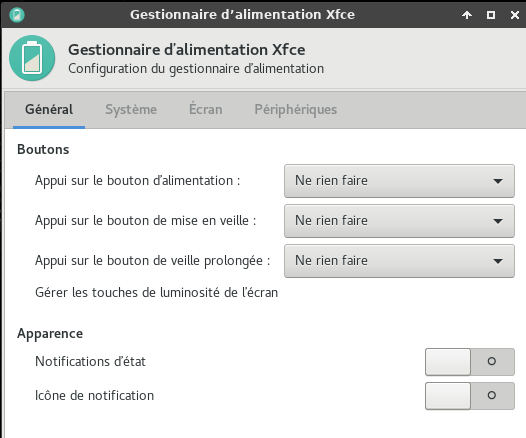{:width="300px"} {:width="300px"}

{:width="300px"}

Menu &rarr; Paramètres &rarr; Affichage , Double écran , Sharp à gauche de Essential  

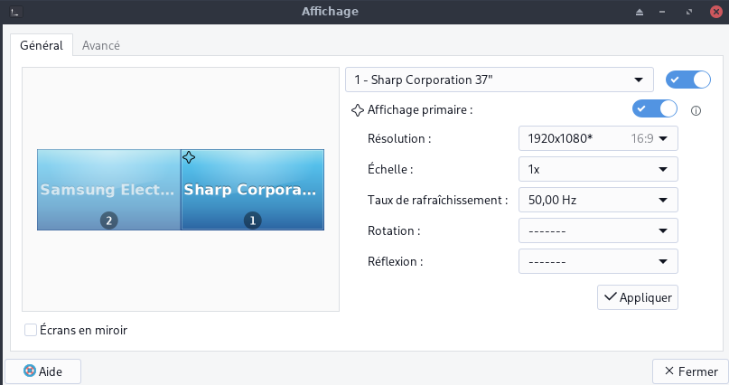{:width="300px"}

Menu &rarr; Paramètres &rarr; Apparence  

{:width="300px"}  
{:width="300px"}  
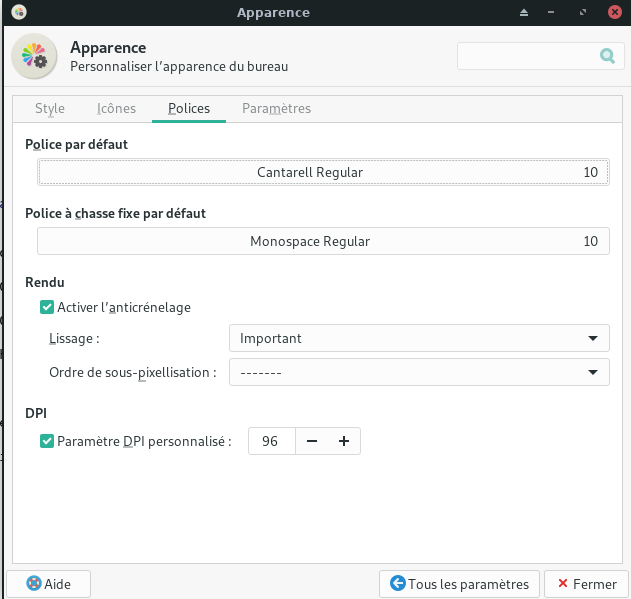{:width="300px"}  

Menu Paramètres &rarr; Gestionnaire de fenêtres 

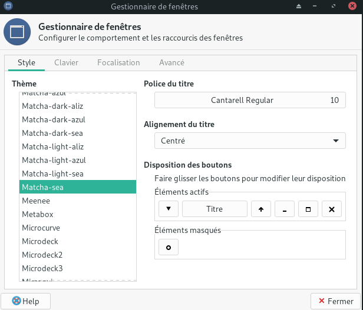{:width="300px"}

Après validation tableau de bord, clic droit sur icône capture écran puis  Propriétés -> Zone à capturer : Sélectionner une zone

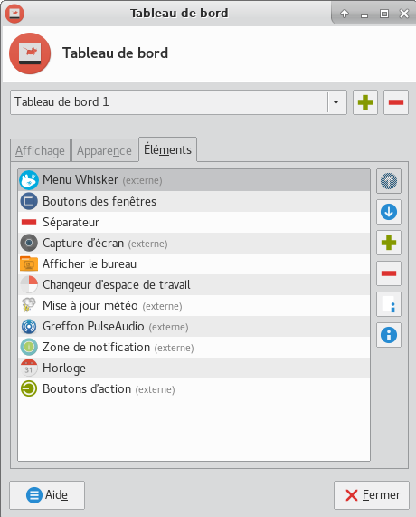{:width="300px"}

Tableau de bord 2  
Pour le déplacer le *Tableau de bord 2* vers écran Essential **1.___72** , décocher *Verrouiller tableau de bord*  

  * Onglet *Affichage*
      * Verrouiller tableau de bord
      * Masquer automatiquement le tableau de bord **Toujours**  
      * Taille d'une ligne (pixels) **40**  
  * Onglet *Eléments*  tableau de bord 2
      * Emulateur de Terminal : /usr/bin/terminator , icône *terminator*

{:width="300px"}

Menu &rarr; Paramètres &rarr; Applications favorites

  * Utilitaires -> Emulateur de terminal : **/usr/bin/terminator "%s"** 

Menu Paramètres --> Bureau  

  * Fonds d'écran image **/usr/share/backgrounds/**   
  * Onglet *Icônes*
      * Tout décocher dans **Icônes par défaut**  

### Son

Lancement

	pulseaudio --start
	sudo usermod -aG audio $USER

Ouvrir pavucontrol  
Audio interne DigitalStéréo (HDMI)  
Port : HDMI/DisplayPort (plugged in)  

{:width="300px"} 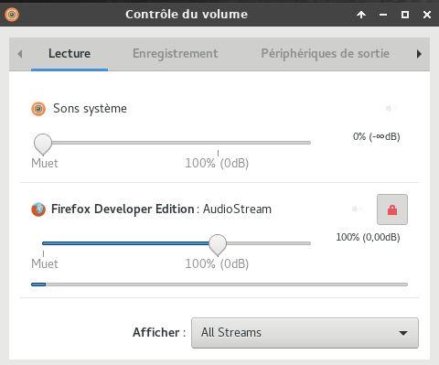{:width="300px"}

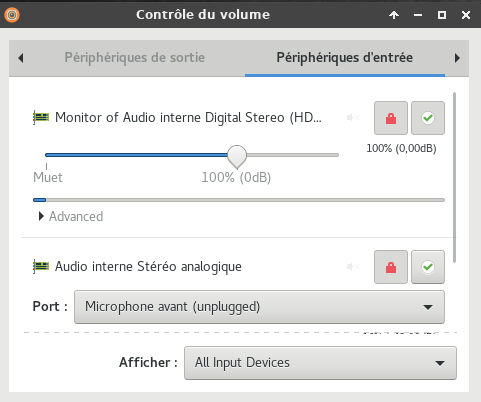{:width="300px"} 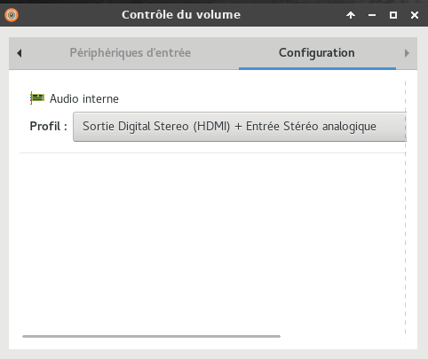{:width="300px"}

Commuter la sortie audio entre HDMI et analogique par un clic, chercher l'expression "sortie audio hdmi" dans le champ recherche du site

### Client Nextcloud

Installation client nextcloud

    yay -S nextcloud-client libgnome-keyring gnome-keyring  

Démarrer le client nextcloud , après avoir renseigné l'url ,login et mot de passe pour la connexion  

### AllTray

Installer l'utilitaire AllTray compatible avec Gnome, KDE, et Xfce ([Voir cet excellent tutorial](https://saravananthirumuruganathan.wordpress.com/2010/04/21/alltray-minimize-any-program-into-the-system-tray/)) pour minimiser n'importe quelle application dans le systray

    sudo pacman -S alltray

Ajout **Thunderbird**  dans le systray   
**Paramètres** &rarr; **Session et démarrage** , onglet *Démarrage automatique d'application*  
Ajout ,clic sur le +  
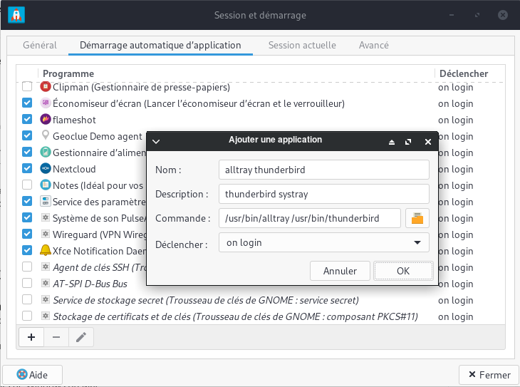{:width="400"}

### Applications

#### Retext

**[Retext](https://github.com/retext-project/retext) , éditeur markdown**  

    sudo pacman -S retext qt5-webkit

#### keepassxc

Créer le dossier 	`mkdir -p $HOME/{.keepassx}` , Home/.keepassx --> ~/.keepassx  
Ouvrir menu xfce et lancer **KeePassXC**  
Base ~/.keepassx/yannick_xc.kdbx  
Clé ~/.ssh/yannick_keepassxc.key  

#### Calibre

*Calibre facilite la gestion de votre bibliothèque de livres électroniques. Ce programme intuitif et complet vous permet de visionner vos ebooks, de les trier selon différents critères, de les convertir (individuellement ou par lot), d'éditer leurs méta-données et de récupérer des informations à partir d'Internet.*

    sudo pacman -S calibre

Premier lancement ,bibliothèques sous **~/media/BiblioCalibre** et **~/media/CalibreTechnique**

#### Flameshot

**Copie écran (flameshot)**  
**[Flameshot](https://github.com/lupoDharkael/flameshot)** c’est un peu THE TOOL pour faire des captures d’écrans

    sudo pacman -S flameshot

Paramétrage "tableau de bord"  
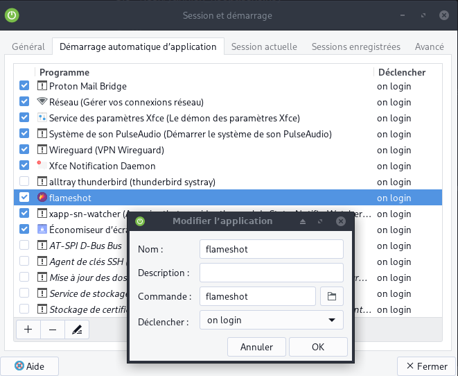{:width="600"}  

#### Flatpak

{:width=50}
Par Matthias Clasen — <a rel="nofollow" class="external free" href="https://github.com/flatpak/flatpak/blob/master/flatpak.png">https://github.com/flatpak/flatpak/blob/master/flatpak.png</a>, <a href="https://creativecommons.org/licenses/by-sa/4.0" title="Creative Commons Attribution-Share Alike 4.0">CC BY-SA 4.0</a>, <a href="https://commons.wikimedia.org/w/index.php?curid=49741329">Lien</a>  
*Flatpak (anciennement xdg-app) est un système de virtualisation d’application pour les distributions GNU/Linux de bureau.*

[Flatpak (archlinux)](https://wiki.archlinux.org/index.php/Flatpak)  
Installation

    sudo pacman -S flatpak

Ajout du dépôt officiel, [Flathub repository](https://flathub.org/) 

    flatpak remote-add --if-not-exists flathub https://dl.flathub.org/repo/flathub.flatpakrepo

Liste des dépôts

    flatpak remotes

```
Name    Options
flathub system
```

Pour effacer un dépôt : `flatpak remote-delete name`  

Recherche

    flatpak update # mise à jour dépôt
    flatpak search signal

```
Name                       Description                                                                                   Application ID                                               Version           Branch        Remotes
Signal Desktop             Private messenger                                                                             org.signal.Signal                                            1.38.2            stable        flathub
```

Installer un runtime ou une application : `flatpak install remote name`  
où *remote* est le nom du dépôt distant, et *name* est le nom de l'application ou du runtime à installer. 

Installer signal

    flatpak install flathub signal

Le fichier `~/.local/share/applications/signal-desktop.desktop`

```
[Desktop Entry]
Type=Application
Name=Signal
Comment=Signal Private Messenger for Linux
Icon=signal-desktop
Exec=/usr/bin/flatpak run signal
Terminal=false
Categories=Network;InstantMessaging;
StartupWMClass=Signal
```

#### tmuxssd

Configuration par défaut de tmux `$HOME/.tmux.conf`

```bash
#Configuration de tmux
#Origine : http://denisrosenkranz.com
#Yannick juin 2017
# Copier/Coller par la souris se fait avec la touche "Shift" appuyée
 
##################################
#Changements des raccourcis claviers
##################################
#On change Control +b par Control +x
#set -g prefix C-x
#unbind C-b
#bind C-x send-prefix
 
#On utilise control + flèches pour naviguer entre les terminaux
bind-key -n C-right next
bind-key -n C-left prev
 
#on utilise alt + flèches our naviguer entre les panels
bind-key -n M-left select-pane -L
bind-key -n M-right select-pane -R
bind-key -n M-up select-pane -U
bind-key -n M-down select-pane -D
 
#On change les raccourcis pour faire du split vertical et horizontal
#On utilise la touche "|" (pipe) pour faire un split vertical
bind | split-window -h
#Et la touche "-" pour faire un split horizontal
bind - split-window -v
 
##################################
#Changements pratiques
##################################
#On permet l'utilisation de la souris pour changer de terminal et de panel
set -g mouse on

# Sélection zone par clic gauche souris (texte sélectionné sur fond jaune)
# Après relachement du clic , le texte sélectionné est copié dans le presse-papier 
# Le fond jaune disparaît
set-option -s set-clipboard off
# For emacs copy mode bindings
# Il faut installer l'utilitaire 'xclip' (sudo pacman -S xclip)
bind-key -T copy-mode MouseDragEnd1Pane send-keys -X copy-pipe-and-cancel "xclip -selection clipboard -i"

#Les fenêtres commencent par 1 et non par 0
set -g base-index 1
 
##################################
#Changements visuels
##################################
#On met les panneaux non actif en gris
#set -g pane-border-fg colour244
#set -g pane-border-bg default
 
#On met le panneau actif en rouge
#set -g pane-active-border-fg colour124
#set -g pane-active-border-bg default
 
#On met la barre de status en gris
set -g status-fg colour235
set -g status-bg colour250
#set -g status-attr dim
 
# On surligne les fenêtres actives dans la barre de status en gris foncés
#set-window-option -g window-status-current-fg colour15
#set-window-option -g window-status-current-bg colour0
```

Visualisation en terminal des VPS avec terminator et tmux  
Le script : `/home/yann/scripts/tmux-ssd.sh`
Le .desktop : `/home/yann/.local/share/applications/menulibre-tmuxssd.desktop` 

```
[Desktop Entry]
Version=1.1
Type=Application
Name=Serveurs VPS
Comment=multi fenêtres
Icon=utilities-terminal-symbolic
Exec=terminator --geometry=1900x900+20+100 -e '/home/yann/scripts/tmux-ssd.sh'
Actions=
Categories=Utility;
```

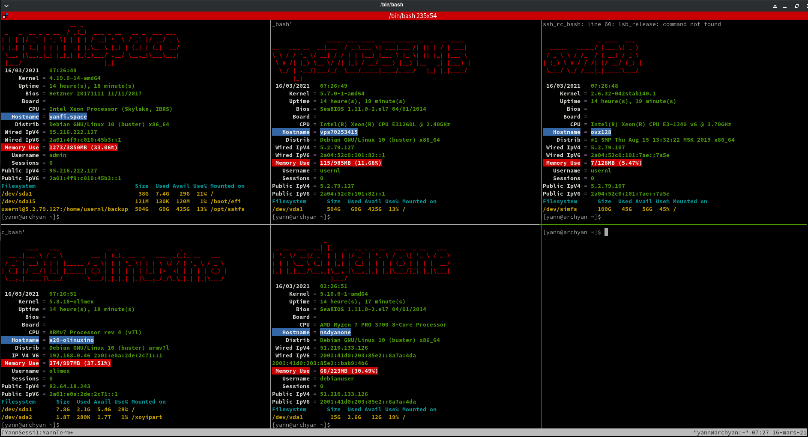{:width=600}

#### tmuxvdb

Surveillance construction site statique et synchronisation avec le serveur xoyaz sur la machine virtuelle debian

Le bash `/home/yann/scripts/tmux-vdb.sh`

```bash
#!/bin/bash    

# COLUMNSxROWS+X+Y -> xterm -geometry 400x200+100+350
# xterm -geometry 100x30+100+350 -T yannstatic -e '/home/yannick/scripts/tmux-lxc.sh'
# On supprime la session "vdbSess" si existante                         
 
if [[ `tmux list-sessions | grep 'vdbSess' | wc -l` != 0 ]]
   then  
       # On ferme la session active
       tmux kill-session -t vdbSess
fi


# Créer une bannière dans /etc/motd sur chaque serveur
# Nom du domaine en ascii voir lien http://patorjk.com/software/taag/#p=display&h=1&f=Small
echo "fin fi"
# Créer session + terminal 
tmux new  -d -s vdbSess -n vdbTerm
# Séparation horizontale en 2 du terminal
tmux split-window -v -p 50
# | 0         |
# |           |
# |-----------|
# | 1         |
# |           |
# Sélection terminal HAUT
tmux selectp -t 0
# 
tmux send-keys -t vdbSess 'static' C-m
# Sélection terminal BAS
tmux selectp -t 1
#  
tmux send-keys -t vdbSess "synchro" C-m

# Afficher la session 
tmux a -t vdbSess
#
# Tuer la session
# tmux kill-session -t vdbSess
```

Le desktop

```
[Desktop Entry]
Version=1.1
Type=Application
Name=Static-synchro
Comment=multi fenêtres
Icon=final-term
Exec=xterm -geometry 100x30+100+350 -T yannstatic -e '/home/yann/scripts/tmux-vdb.sh'
Actions=
Categories=Utility;
Path=
Terminal=false
StartupNotify=false
```

#### Applications via dépôts AUR

**Applications...**  

    yay -S scrcpy-git radiotray-python3-git tutanota-desktop-bin menulibre yay-bin 


    sudo pacman -S android-tools

**scrcpy**  <https://github.com/Genymobile/scrcpy/>  
Bureau `/home/yann/.local/share/applications/menulibre-scrcpy-(android).desktop`

```
[Desktop Entry]
Version=1.1
Type=Application
Name=ScrCpy (Android)
Comment=Votre smartphone sur le bureau
Icon=smartphone-connected
Exec=/usr/bin/scrcpy
Path=/home/yann
Actions=
Categories=Utility;X-XFCE;X-Xfce-Toplevel;
```


**firefox-nightly-fr**   

    wget https://archive.mozilla.org/pub/firefox/nightly/latest-mozilla-central-l10n/firefox-85.0a1.fr.linux-x86_64.tar.bz2
    sudo tar -xvf firefox-85.0a1.fr.linux-x86_64.tar.bz2
    sudo mv firefox /opt/firefox-nightly
    rm firefox-85.0a1.fr.linux-x86_64.tar.bz2

Desktop /home/yann/.local/share/applications/firefox-nightly.desktop

```
[Desktop Entry]
Version=1.0
Name=Firefox Nightly
GenericName=Web Browser
GenericName[fr]=Navigateur web
Comment=Browse the Web
Comment[fr]=Naviguer sur le Web
Exec=/opt/firefox-nightly/firefox %u
Icon=firefox-nightly
Terminal=false
Type=Application
MimeType=text/;text/xml;application//+xml;application/vnd.mozilla.xul+xml;text/mml;x-scheme-handler/http;x-scheme-handler/https;
StartupNotify=true
StartupWMClass=Nightly
Categories=Network;WebBrowser;
Keywords=web;browser;internet;
Actions=new-window;new-private-window;

[Desktop Action new-window]
Name=New Window
Name[fr]=Nouvelle fenêtre
Exec=/opt/firefox-nightly/firefox --new-window %u

[Desktop Action new-private-window]
Name=New Private Window
Name[fr]=Nouvelle fenêtre de navigation privée
Exec=/opt/firefox-nightly/firefox --private-window %u
```

### Images, alias , liens

**Images fond d'écran + logo ym**  

    sudo cp /srv/hdd2g/data/dplus/images/yannick/plouzane-nb.jpg /usr/share/backgrounds/  # écran 2
    sudo cp /srv/hdd2g/data/dplus/images/yannick/Linux-Arch-1920x1080.jpg /usr/share/backgrounds/xfce/ # écran 1
    sudo cp /srv/hdd2g/data/dplus/images/yannick/yannick-green.png /usr/share/pixmaps/


**Alias fichier .bashrc**  

    nano ~/.bashrc

```bash
#
# ~/.bashrc
#

# If not running interactively, don't do anything
[[ $- != *i* ]] && return

alias ls='ls --color=auto'
PS1='[\u@\h \W]\$ '

alias youtube='youtube-dl -f "bestvideo[ext=mp4]+bestaudio[ext=m4a]/best[ext=mp4]/best" --output "~/Vidéos/%(title)s.%(ext)s" --ignore-errors' 
alias audio='youtube-dl --extract-audio --audio-format m4a --audio-quality 0 --output "~/Musique/%(title)s.%(ext)s"' 
alias audiomp3='youtube-dl --extract-audio --audio-format mp3 --audio-quality 0 --output "~/Musique/%(title)s.%(ext)s"'
alias cryfs-autostart="$HOME/scripts/cryfs-autostart"
alias dnsleak="$HOME/scripts/dnsleaktest.sh"
alias nmapl="sudo nmap -T4 -sP 192.168.0.0/24"
alias odt/="$HOME/Documents/odt/+index/_odt/+index"
alias otp="$HOME/scripts/generer-code-2fa-vers-presse-papier-toutes-les-30s.sh"
alias posturl="$HOME/scripts/posturl"
alias rename="$HOME/scripts/remplacer-les-espaces-accents-dans-une-expression.sh"
alias sshm="$HOME/scripts/ssh-manager.sh"
alias sshsyn="$HOME/scripts/synchro-ssh-xoyize.xyz.sh"
alias sslxc="$HOME/scripts/sslxc"
alias ssvbox="$HOME/scripts/ssvbox"
alias synchro="sshm lxcdeb exe 'sudo journalctl -f -u synchro_site.service'"
alias static="sshm lxcdeb exe 'sudo journalctl -f -u yannstatic.service'"
alias tmuxssh="$HOME/scripts/tmux-ssd.sh"
alias vnc="$HOME/scripts/sshvnc.sh"
alias traduc="$HOME/scripts/traduction-page-internet"
alias wgkey="$HOME/scripts/generer_jeu_cle_wireguard.sh"
```


**Liens scripts (/usr/local/bin)**  

```bash
# NE PAS CREER LES LIENS !!!!!!!!!!!!!!!!
# ----------------------------------------
#Créer des liens sur /usr/local/bin pour les scripts  

$HOME/scripts/compress /usr/local/bin/pdfdim
$HOME/scripts/all-synchro.sh /usr/local/bin/allsync
$HOME/scripts/borglist /usr/local/bin/borglist
/opt/Postman/Postman /usr/local/bin/postman

sudo ln -s $HOME/scripts/tmux-ssd.sh /usr/local/bin/tmuxssh
sudo ln -s $HOME/scripts/generer-code-2fa-vers-presse-papier-toutes-les-30s.sh /usr/local/bin/otp
#sudo ln -s $HOME/scripts/virtuel /usr/local/bin/virtuel
#droits en exécution
#chmod +x $HOME/scripts/{ssh-manager.sh,savlog.sh,tmux-ssd.sh,virtuel}
```

**Liens "statique"**  
les liens pour la rédaction des posts

    sudo ln -s /home/yann/media/statique/images /images
    sudo ln -s /home/yann/media/statique/files /files


### Partages SSHFS (vps)

sshfs ,FUSE client based on the SSH File Transfer Protocol  

    sudo pacman -S sshfs

Création des partages utilisés par sshfs  

    mkdir -p ~/vps/{cx21,cx11,xoyaz.xyz,autre,lxc,xoyize.xyz}

### Veille écran

Installer par défaut sur archlinux (xscreensaver)   

Création d'un script pour **Activer/Désactiver** le programme de mise en veille **xscreensaver**  
Prérequis : **zenity**   
Le script **~/scripts/veille.sh**  

```bash
#!/bin/bash
# veille.sh


# Détecter si xscreensaver est actif
if [ "$(pidof -s xscreensaver)" ]; then
    arret=false
    zenity --question --title "veille" --ok-label="Oui" --cancel-label="Non" --text "Economiseur Ecran ACTIF\n\n DESACTIVER ?"
    if [ $? = 0 ]
    then
            echo "ARRET daemon xscreensaver ..."
            xscreensaver-command -exit
            sleep 3
    fi
else
    arret=true
    zenity --question --title "veille" --ok-label="Oui" --cancel-label="Non" --text "Economiseur Ecran NON ACTIF\n\n ACTIVER ?"
    if [ $? = 0 ]
    then
            echo "DEPART daemon xscreensaver ..."
            xscreensaver -nosplash &
            sleep 3
    fi
fi
```

Création lanceur XFCE en utilisant **Editeur de menus** (si "menulibre" installé ou manuellement :  

```bash
mkdir -p ~/.local/share/applications/  #création dossier **applications** si inexistant
nano ~/.local/share/applications/menulibre-veille-ecran.desktop
```

Contenu :

```ini
[Desktop Entry]
Version=1.0
Type=Application
Name=Activer/Désactiver veille écran
Comment=Veille active ou pas par simple clic
Icon=preferences-desktop-screensaver
Exec=sh /home/yann/scripts/veille.sh
Path=/home/yann/scripts
NoDisplay=false
Categories=Utility;X-XFCE;X-Xfce-Toplevel;
StartupNotify=false
Terminal=false
```

>Les icônes sont situés sous /usr/share/icons , il suffit de mettre le nom de l'icône choisi sans extension ni chemin pour le paramètre **Icon**

### Paramétrer minicom

Paramétrage de l'application terminale

     sudo minicom -s

>Seul les paramètres à modifier sont cités

Configuration du port série  
A -                             Port série : **/dev/ttyUSB0**   
F -              Contrôle de flux matériel : **Non**  
Echap  
Enregistrer config. sous dfl  
Sortir de Minicom  

### Nano comme éditeur par défaut

Attribution immédiate

    export EDITOR=/usr/bin/nano

Attribution permanente

    echo "export EDITOR=/usr/bin/nano" >> ~/.bashrc

### Impression

Prérequis , paquets cups, system-config-printer, et hplip installés (Pilotes HP pour DeskJet, OfficeJet, Photosmart, Business Inkjet et quelques modèles de LaserJet aussi bien qu'un certain nombre d'imprimantes Brother)...   

On démarre le service cups

    sudo systemctl start cups.service  # lancement cups
    sudo systemctl enable cups.service  # activation cups

Vérifier le fonctionnement du service : http://localhost:631/  

Installation du scanner  
Coté logiciel il vous faudra **sane** et son interface graphique **xsane**, ainsi qu’éventuellement xsane-gimp le plugin pour gimp.

	yay -S xsane xsane-gimp 

Paramétrage imprimante HP (su)
Lancer "HP Device Manager"  : `hp-setup`  

{:width="400px"}

{:width="400px"}

{:width="400px"}

{:width="400px"}

Vérifier si le scaner est reconnu : `sudo scanimage -L`

    device `hpaio:/net/OfficeJet_7510_series?ip=192.168.0.39' is a Hewlett-Packard OfficeJet_7510_series all-in-one

Test

    scanimage --device hpaio:/net/OfficeJet_7510_series?ip=192.168.0.39 --format=png > test.png

### Journalctl

Ajout utilisateur courant au groupe systemd-journal et adm

	sudo gpasswd -a $USER systemd-journal
	sudo gpasswd -a $USER adm

Lignes non tronquées ,ajouter au fichier **~/.bashrc**  

    echo "export SYSTEMD_LESS=FRXMK journalctl" >> /home/$USER/.bashrc

Prise en compte après déconnexion/reconnexion

**Rendre persistant journalctl**  
Par défaut `journalctl` affiche les logs du dernier boot. En cas de freeze de votre serveur, il peut être intéressant de comprendre ce qui s’est passé juste avant le plantage…Du coup nous allons rendre journalctl persistant. 

    sudo nano /etc/systemd/journald.conf

Oter le commentaire (#) à la ligne Storage=auto et remplacer *auto* par *persistent* 

Réinitialiser le journal

```
sudo mkdir /var/log/journal
sudo systemd-tmpfiles --create --prefix /var/log/journal
sudo systemctl restart systemd-journald
```

Maintenant vous pouvez voir les différents boots

    sudo journalctl --list-boots

```
 0 518f818d328145f692098062be9056cb Thu 2019-08-29 11:07:55 CEST—Thu 2019-08-29 12:03:50 CEST
```

### Openjdk - jre

    sudo pacman -S jre-openjdk

### Images (fond écran,connexion et grub)

les images de fond d'écran **/usr/share/backgrounds/xfce**   

	sudo cp ~/media/dplus/images/Fonds/Linux-Arch-1920x1080.jpg /usr/share/backgrounds/xfce/ 
	sudo cp ~/media/dplus/images/yannick/yannick-green.png /usr/share/pixmaps/ 

Ecran et logo pour lightdm de la page de connexion

	sudo cp ~/media/dplus/images/Fonds/archlinux-lightdm.png /usr/share/backgrounds/
	sudo cp ~/media/dplus/images/yannick/yannick53x64.png /usr/share/pixmaps/


### Ecran connexion (lightDM)

Ecran et logo pour **lightdm**  de la page de connexion    
Accès aux paramètres lightDM en mode graphique (mot de passe root)

* Menu --> Paramètres --> LightDM GTK+ Paramètres d'Apparence

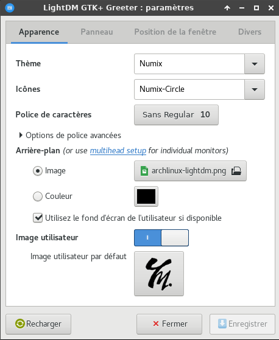{:width="300px"}


### Ecran de boot (grub)

Ecran de la page de démarrage **grub**  

    sudo cp ~/media/dplus/images/Fonds/wp2618243.jpg /usr/share/backgrounds/xfce/
	sudo nano /etc/default/grub

```
GRUB_BACKGROUND="/usr/share/backgrounds/xfce/wp2618243.jpg"  
```

Reconfigurer grub pour la prise en charge de l'image  

	sudo grub-mkconfig -o /boot/grub/grub.cfg

### Instantané Paramétrage XFCE


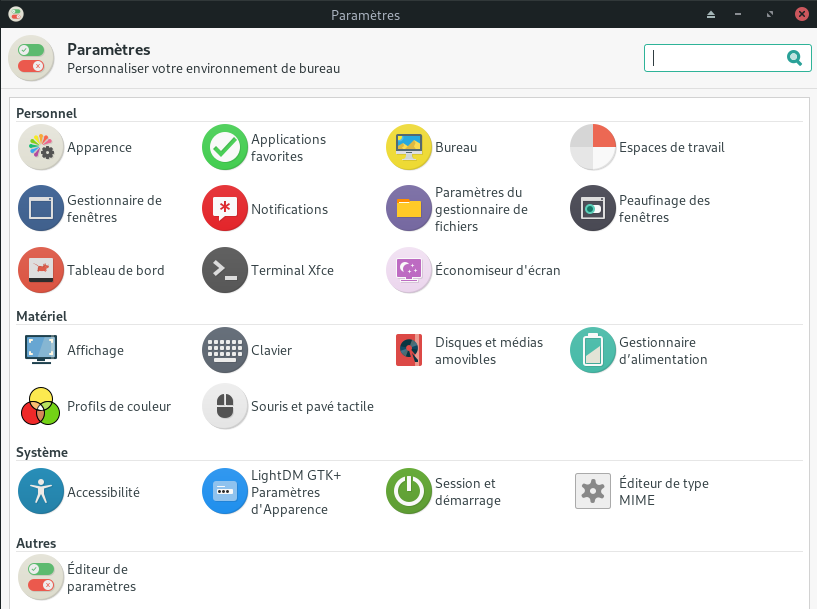{:width="400"}  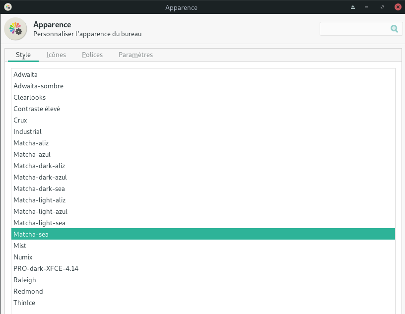{:width="400"}  
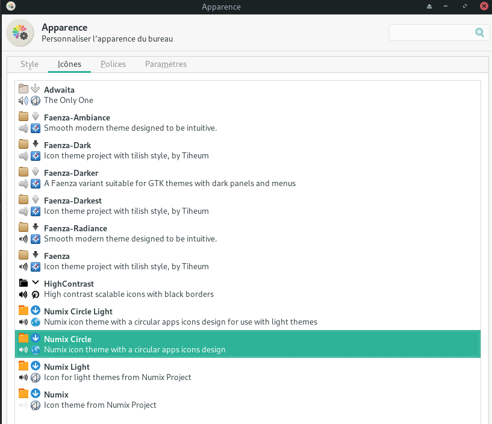{:width="400"}  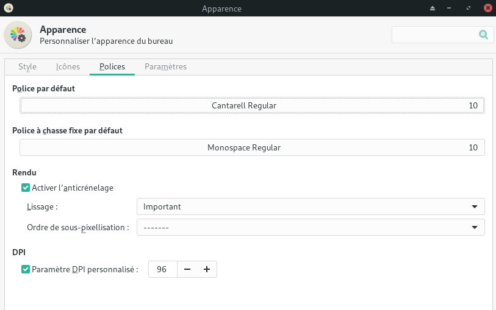{:width="400"}  
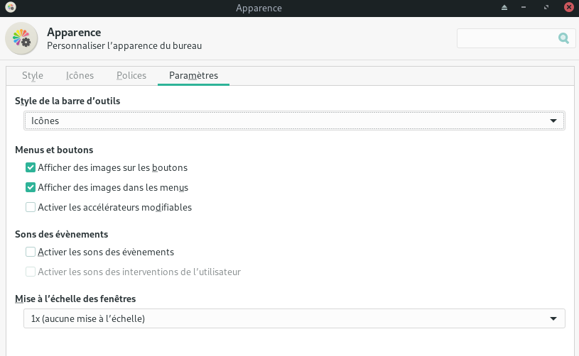{:width="400"}  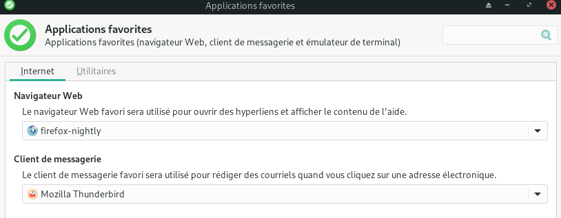{:width="400"}  
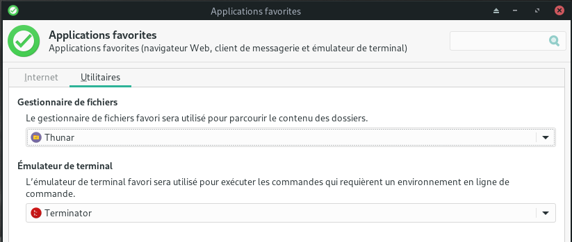{:width="400"}  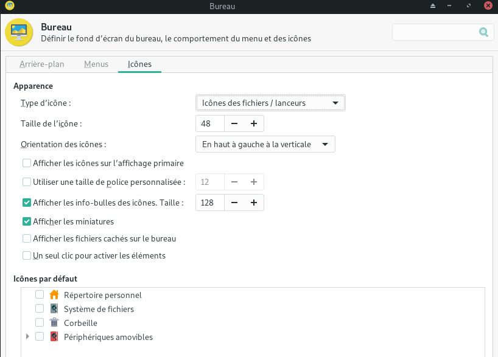{:width="400"}  
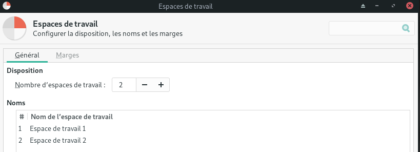{:width="400"}  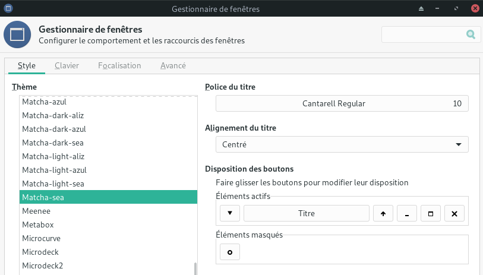{:width="400"}  
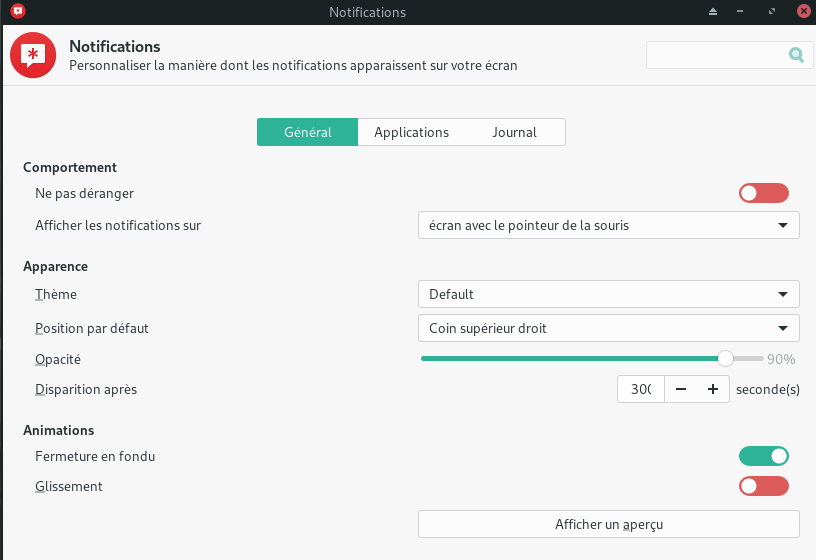{:width="400"}  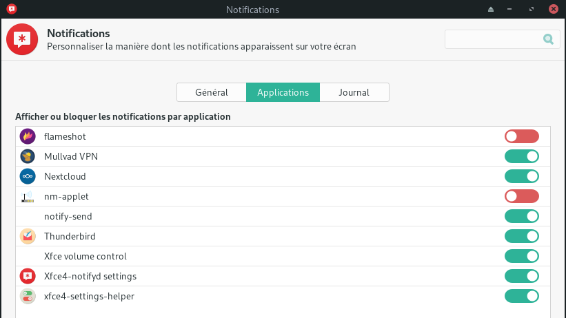{:width="400"}  
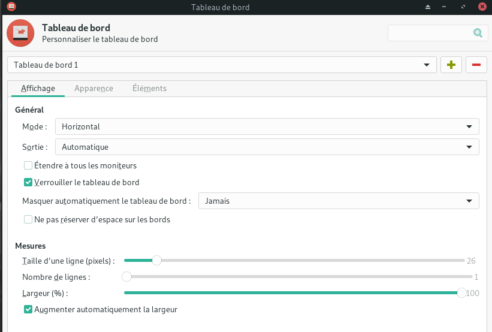{:width="400"}  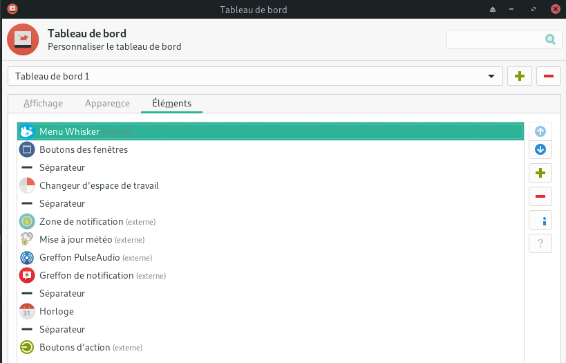{:width="400"}  
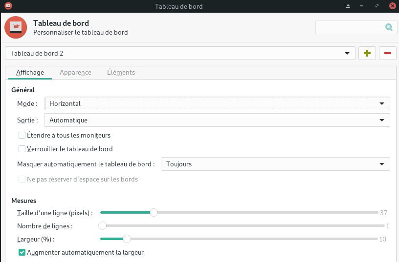{:width="400"}  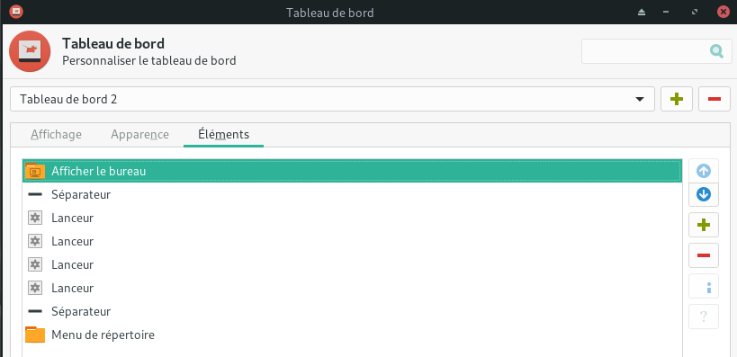{:width="400"}  
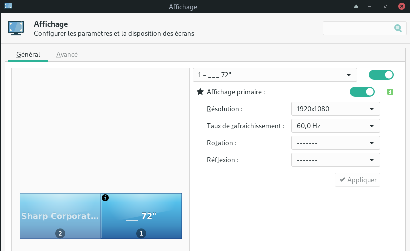{:width="400"}  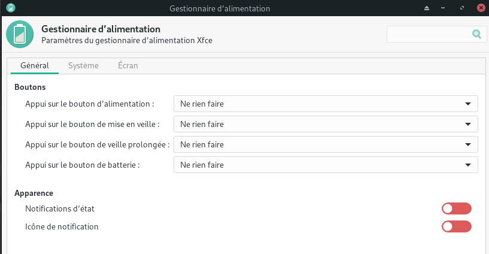{:width="400"}  
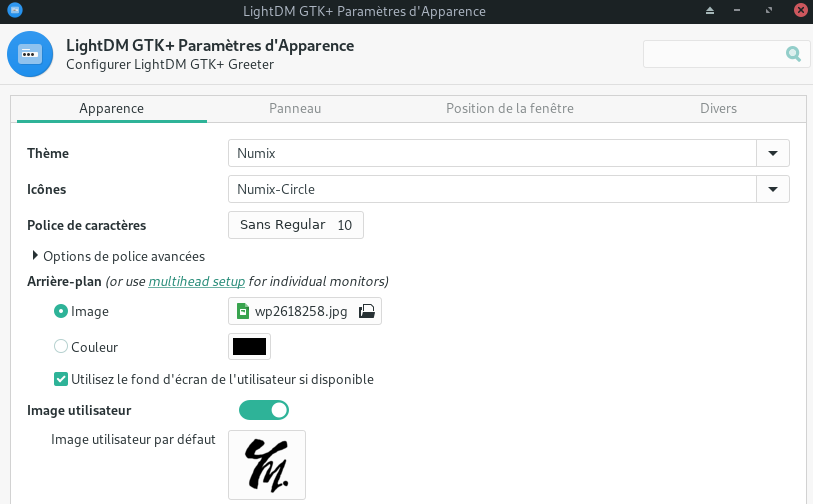{:width="400"}  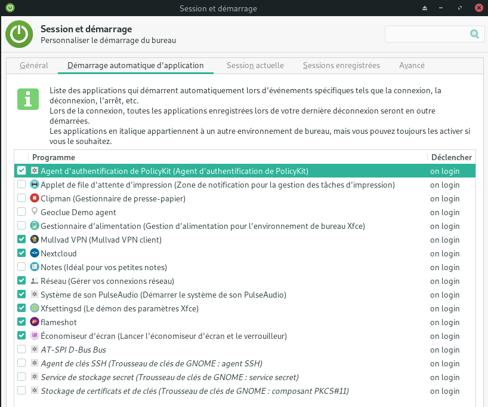{:width="400"}  

### Les applications supplémentaires 

#### Wing Personal Python IDE

**[Wing Personal Python IDE](https://wingware.com/downloads/wing-personal)**   
1- Télécharger la version linux (ex wing-personal-7.2.7.0-linux-x64.tar.bz2 au 24/11/2020)  
2- décompresser `tar -zxvf wingpro-7.2.7.0-linux-x64.tar.gz`  
3- En mode su , `cd wing-personal-7.1.2.0-linux-x64` , `./wing-install.py --winghome /opt/wing-personal --bin-dir /usr/local/bin`

```
Done installing.  Make sure that /usr/local/bin is in your path and type
     "wing-personal7.2" to start Wing Personal.
```

#### Xournal

**Xournal** https://github.com/xournalpp/xournalpp : `yay -S xournal`  
*Xournal++ est un logiciel de prise de notes manuscrites, surtout destiné à prendre des notes sur des documents PDF et à les annoter*  


**[QR Code (code-barres) définition, encodage et décodage](/posts/QR-Code-barres-definition-encodage-decodage/) (NON INSTALLE)**  
*La première chose à faire va être d’installer deux petites applications, à savoir QRencode pour la partie création, et ZBar pour la partie scan/lecture*  
Sur Archlinux

    sudo pacman -S qrencode zbar

#### KiCad (NON INSTALLE)

**KiCad (NON INSTALLE)** est une suite logicielle libre de conception pour l'électronique pour le dessin de schémas électroniques et la conception de circuits imprimés. KiCad est publié sous licence GNU GPL: `sudo pacman -S kicad`

#### qbittorent (NON INSTALLE)

**qbittorent (NON INSTALLE)**  `sudo pacman -S qbittorrent`  

#### Wireguard

Installation

    sudo pacman -S wireguard-tools openresolv

Dossier /etc /wireguard   
Configuration serveur wireguard wg.ouestline.xyz (cx11)  
Lancement configuration  

    sudo -s
    cd /etc/wireguard

Pour démarrer un tunnel avec un fichier de configuration

**wg-quick**

    # wg-quick up <nom de l'interface>
    wg-quick up wg0 # lancement

```
[#] ip link add wg0 type wireguard
[#] wg setconf wg0 /dev/fd/63
[#] ip -6 address add fd18:2941:ae9:7d96::3/128 dev wg0
[#] ip -4 address add 10.14.94.3/32 dev wg0
[#] ip link set mtu 1420 up dev wg0
[#] resolvconf -a wg0 -m 0 -x
[#] wg set wg0 fwmark 51820
[#] ip -6 route add ::/0 dev wg0 table 51820
[#] ip -6 rule add not fwmark 51820 table 51820
[#] ip -6 rule add table main suppress_prefixlength 0
[#] ip6tables-restore -n
[#] ip -4 route add 0.0.0.0/0 dev wg0 table 51820
[#] ip -4 rule add not fwmark 51820 table 51820
[#] ip -4 rule add table main suppress_prefixlength 0
[#] sysctl -q net.ipv4.conf.all.src_valid_mark=1
[#] iptables-restore -n
```

    wg-quick down wg0 # arrêt

**service systemd**

    #wg-quick@interfacename.service  
    systemctl start wg-quick@wg0.service 
    systemctl status wg-quick@wg0.service

```
● wg-quick@wg0.service - WireGuard via wg-quick(8) for wg0
     Loaded: loaded (/usr/lib/systemd/system/wg-quick@.service; disabled; vendor preset: disabled)
     Active: active (exited) since Tue 2020-11-24 20:54:09 CET; 8s ago
       Docs: man:wg-quick(8)
             man:wg(8)
             https://www.wireguard.com/
             https://www.wireguard.com/quickstart/
             https://git.zx2c4.com/wireguard-tools/about/src/man/wg-quick.8
             https://git.zx2c4.com/wireguard-tools/about/src/man/wg.8
    Process: 36391 ExecStart=/usr/bin/wg-quick up wg0 (code=exited, status=0/SUCCESS)
   Main PID: 36391 (code=exited, status=0/SUCCESS)

nov. 24 20:54:09 archyan wg-quick[36391]: [#] ip -6 route add ::/0 dev wg0 table 51820
nov. 24 20:54:09 archyan wg-quick[36391]: [#] ip -6 rule add not fwmark 51820 table 51820
nov. 24 20:54:09 archyan wg-quick[36391]: [#] ip -6 rule add table main suppress_prefixlength 0
nov. 24 20:54:09 archyan wg-quick[36483]: [#] ip6tables-restore -n
nov. 24 20:54:09 archyan wg-quick[36391]: [#] ip -4 route add 0.0.0.0/0 dev wg0 table 51820
nov. 24 20:54:09 archyan wg-quick[36391]: [#] ip -4 rule add not fwmark 51820 table 51820
nov. 24 20:54:09 archyan wg-quick[36391]: [#] ip -4 rule add table main suppress_prefixlength 0
nov. 24 20:54:09 archyan wg-quick[36391]: [#] sysctl -q net.ipv4.conf.all.src_valid_mark=1
nov. 24 20:54:09 archyan wg-quick[36493]: [#] iptables-restore -n
nov. 24 20:54:09 archyan systemd[1]: Finished WireGuard via wg-quick(8) for wg0.
```

Pour démarrer le tunnel au démarrage, activer l'unité.   

    systemctl enable wg-quick@wg0.service


Vérification

    ip a

```
1: lo: <LOOPBACK,UP,LOWER_UP> mtu 65536 qdisc noqueue state UNKNOWN group default qlen 1000
    link/loopback 00:00:00:00:00:00 brd 00:00:00:00:00:00
    inet 127.0.0.1/8 scope host lo
       valid_lft forever preferred_lft forever
    inet6 ::1/128 scope host 
       valid_lft forever preferred_lft forever
2: enp0s31f6: <BROADCAST,MULTICAST,UP,LOWER_UP> mtu 1500 qdisc fq_codel state UP group default qlen 1000
    link/ether 38:d5:47:7c:a0:6c brd ff:ff:ff:ff:ff:ff
    inet 192.168.0.37/24 brd 192.168.0.255 scope global dynamic noprefixroute enp0s31f6
       valid_lft 27798sec preferred_lft 22398sec
    inet6 2a01:e34:eebf:df0:b968:86b6:a0a9:79f7/64 scope global dynamic mngtmpaddr noprefixroute 
       valid_lft 86183sec preferred_lft 86183sec
    inet6 fe80::8ece:7e8c:f571:b48b/64 scope link 
       valid_lft forever preferred_lft forever
4: wg0: <POINTOPOINT,NOARP,UP,LOWER_UP> mtu 1420 qdisc noqueue state UNKNOWN group default qlen 1000
    link/none 
    inet 10.14.94.3/32 scope global wg0
       valid_lft forever preferred_lft forever
    inet6 fd18:2941:ae9:7d96::3/128 scope global 
       valid_lft forever preferred_lft forever
```

**GtkWg**

Dossier /usr/local/share/gtkwg  
Les configurations mullvad `/usr/local/share/gtkwg/mullvad_config_linux_all/`   

Ajout configuration wireguard serveur **cx11** (wg.ouestline.xyz)  

    sudo cp wg0-archlinux-pc1.conf /usr/local/share/gtkwg/mullvad_config_linux_all/mullvad-frcx11.conf

Le fichier **menulibre.desktop** dans `~/.local/share/applications/`

**Désactiver wireguard**

    sudo systemctl stop wg-quick@wg0
    sudo systemctl disable wg-quick@wg0

xfce: "Menu -> Paramètres -> Session et démarrage", Démarrage automatique d'applications  
{:width="400"}


## Réseau

### Bascule dhcpd vers NetworkManager

Passer de **dhcpcd** à **NetworkManager**

Arrêter et désactiver dhcpcd

    sudo systemctl stop dhcpcd && sudo systemctl disable dhcpcd

Installer, lancer et activer networkmanager

    sudo pacman -S networkmanager
    sudo systemctl start NetworkManager
    sudo systemctl enable NetworkManager

### Pont (Bridge)

Pour un réseau en pont (bridge - adresse IP container dans le même réseau que l'hôte) : [Archlinux KVM/QEMU - Virtual Machine Manager - Réseau (network)](/posts/Archlinux-KVM_QEMU-VMM/)


## Borg

Créer utilisateur borg avec id 1001 et "home" /srv/hdd2g/data/borg-backups  

    sudo useradd -m -d /srv/hdd2g/data/borg-backups -u 1001 borg

Créer le dossier .ssh utilisateur "borg"

    sudo -u borg mkdir /srv/data/borg-backups/.ssh

Créer le fichier authorized_keys

    sudo -u borg touch /srv/data/borg-backups/.ssh/authorized_keys

Autoriser utilisateur **borg** à exécuter */usr/bin/borg* uniquement

    sudo -s
    echo "borg ALL=NOPASSWD: /usr/bin/borg" >> /etc/sudoers


### Borg sauvegarde home PC1


* [Archlinux : Sauvegarde des données avec BORG](https://wiki.archlinux.fr/Sauvegarde_des_donn%C3%A9es_avec_BORG)

Installation normale  
Le paquet **borg** étant dans les dépôts Community + options recommandées : **fuse** et **python-llfuse**

    sudo pacman -S borg fuse python-llfuse

**Sauvegarde PC1 "local" sur unité "sav"**

* *La sauvegarde sera exécutée avec l'utilisateur borg sous root pour les dossiers et fichiers systèmes*
* **/root/.borg** : dossier des fichiers (script, passphrase et exclusions)
* **/srv/hdd2g/data/borg-backups** : dépôts de sauvegarde

Créer le dossier

    sudo mkdir -p /root/.borg

Création d'un fichier **passphrase** ( ex: qui contient 6 mots aléatoires séparés par un espace) qui servira à automatiser la procédure de sauvegarde sauvegarde (**/root/.borg/passphrase**)

    sudo nano /root/.borg/passphrase # contient la "phrase de passe"

Création d'un fichier **exclusions** qui contient toutes les exclusions de dossiers et fichiers , une exclusion par ligne (**/root/.borg/exclusions**)

    sudo nano /root/.borg/exclusions

```
/home/yann/Desktop
/home/yann/Téléchargements
/home/yann/temp
/home/yann/vps
/home/yann/sav
/home/yann/srv_hdd2g
/home/yann/virtuel
/home/yann/media/BiblioCalibre -> /srv/hdd2g/data/BiblioCalibre
/home/yann/media/CalibreTechnique -> /srv/hdd2g/data/CalibreTechnique
/home/yann/media/devel -> /srv/hdd2g/data/devel
/home/yann/media/dplus -> /srv/hdd2g/data/dplus
/home/yann/media/music -> /srv/hdd2g/data/music
```

**Initialisation dépôt** "archyan" de sauvegarde chiffré avec "phrase de passe"

```bash
sudo -s
export BORG_PASSPHRASE="`cat /root/.borg/passphrase`"
BORG_REPOSITORY=/srv/hdd2g/data/borg-backups/archyan
borg init --encryption=repokey-blake2 /srv/hdd2g/data/borg-backups/archyan
```

**Création du script borg-backup**

*Borg a la déduplication, le contrôle de cohérence, le cryptage, est configurable par des variables d'environnement, la récupération des fichiers avec FUSE pour le montage des dépôts. En utilisant borg prune, on peut avoir une haute fréquence de sauvegardes avec une gestion du cycle des repo : 6 heures, 7 jours, 4 semaines, et 6 mois.*

Le fichier script **/root/.borg/borg-backup**

    sudo nano /root/.borg/borg-backup

```
#!/bin/bash

set -e
 
# Vérifier si utilisateur est root
if [ $(id -u) != "0" ]; then
    echo "Erreur : Vous devez être root pour exécuter ce script !"
    exit 1
fi

BORG_REPOSITORY=/srv/hdd2g/data/borg-backups/archyan
BACKUP_DATE=`date +%Y-%m-%d-%Hh%M`
echo "Exécution borg-backup archyan $BACKUP_DATE" 
export BORG_RELOCATED_REPO_ACCESS_IS_OK=yes
export BORG_PASSPHRASE="`cat /root/.borg/passphrase`"
BORG_ARCHIVE=${BORG_REPOSITORY}::${BACKUP_DATE}

# Sauvegarde de tout /home à l'exception de quelques répertoires et fichiers exclus
borg create \
-v --stats --compression lzma,9 \
--exclude-from /root/.borg/exclusions --exclude-caches \
$BORG_ARCHIVE \
/home/yann 

# En cas d'erreur de sauvegarde, réinitialiser le mot de passe et quitter.
if [ "$?" = "1" ] ; then
    export BORG_PASSPHRASE=""
    exit 1
fi

# Prune la repo de sauvegardes supplémentaires
borg prune \
-v --list --stats --keep-daily=7 --keep-weekly=4 --keep-monthly=6 \
$BORG_REPOSITORY 
 
# Inclure espace occupé dans le journal.
# echo 'Espace occupé : ' $(df -h |egrep '/dev/mapper/vg--nas--one-sav' |awk '{print $5}')
 
borg list $BORG_ARCHIVE
 
# réinitialiser le mot de passe
export BORG_PASSPHRASE=""
echo "Fin exécution borg-backup" 
exit 0
```

Droits en exécution

    sudo chmod +x /root/.borg/borg-backup

## Erreurs 

**terminator** *No module named 'validate'*   

```bash
pacman -S devtools git #install devtools used to build in a clean chroot and git needed to obtain source
git clone git://git.archlinux.org/svntogit/community.git --single-branch --branch "packages/python-configobj" #clone package source
chmod 777 -R community/trunk
cd community/trunk
curl -o PKGBUILD.diff http://ix.io/2J4c #download patch
git apply PKGBUILD.diff
extra-x86_64-build #build package in a clean chroot
pacman -U python-configobj-5.0.6-10-any.pkg.tar.zst #install built package
cd ../..
rm -r community/
```

**Firefox - OCSP**  
*HTTPS connection fails with "MOZILLA_PKIX_ERROR_REQUIRED_TLS_FEATURE_MISSING"*

Impossible de charger un site, message d'erreur semble signifier qu'il y a un problème avec la réponse OCSP du serveur : **L'"agrafage" OCSP - inclusion de la vérification de la non-révocation du certificat du serveur - est requis mais non fourni.*  

(1) Dans un nouvel onglet, tapez ou collez `about:config` dans la barre d'adresse et appuyez sur **Entrée/Retour**.   
*Cliquez sur le bouton en promettant d'être prudent.*

(2) Dans la boîte de recherche située au-dessus de la liste, tapez ou collez **ocsp** pour filtrer

(3) Double-cliquez sur la préférence **security.ssl.enable_ocsp_must_staple** pour faire passer la valeur de **true** à **false**

Essayez ensuite à nouveau le site, en contournant le cache (par exemple, Ctrl+Maj+r lorsque vous rechargez)


## NFS - Client

[Partage de disques en réseau avec NFS](https://doc.fedora-fr.org/wiki/Partage_de_disques_en_r%C3%A9seau_avec_NFS)  

Installer nfs-utils avec la commande

    sudo pacman -S nfs-utils    # archlinux
    sudo apt install nfs-common # debian

Créer un point de montage NFS

    sudo mkdir -p /mnt/xoyipart

Le partage NFS (`/etc/hosts` contient la définition du serveur : `192.168.0.46 xoyize.xyz`)

    sudo showmount -e xoyize.xyz

```
Export list for xoyize.xyz:
/xoyipart 192.168.0.0/24
```

Montage automatique à la demande avec timeout via fstab et x-systemd

    sudo nano /etc/fstab

```
xoyize.xyz:/xoyipart /mnt/xoyipart/	nfs4	x-systemd.automount,x-systemd.idle-timeout=300,async	0 0
```

Montage manuel

    sudo mount -a

Le répertoire est «setgidé»  
*Quand un répertoire est «setgidé », le comportement observé change. On ne parle alors plus de droits d’exécution mais d’appartenance. En effet, tous les fichiers ou sous-répertoires qui seraient créés dans un tel répertoire, appartiendraient automatiquement au groupe auquel appartient le dossier. Si plusieurs utilisateurs peuvent et/ou doivent travailler dans un même répertoire par exemple, on peut positionner le droit SETGID sur ce répertoire afin que tous les utilisateurs puissent accéder à son contenu sans restrictions liées au propriétaire qui a créé le fichier ou le sous-répertoire.*

Exécuter `groupadd` sur le client et ajouter un (ou plusieurs) utilisateur à ce groupe.

```bash
sudo groupadd -g 9999 local  
# ajout utilisateur au groupe
sudo usermod -a -G local $USER 
```

Vérification

    touch /mnt/xoyipart/test
    ls -la /mnt/xoyipart/

```
total 8
drwxrwsr-x 2 root local 4096 27 déc.  12:16 .
drwxr-xr-x 4 root root  4096 27 déc.  11:45 ..
-rw-rwxr-- 1 yann local    0 27 déc.  11:57 test
```

## Container et Machines virtuelles

* [Archlinux conteneur LXC debian 10 (buster) + Jekyll](/posts/Archlinux_conteneur_LXC_debian_10_(buster)/)  
* [PC1 ArchLinux - VM Debian 10 vdb (jekyll-statique)](/posts/ArchLinux-KVM_QEMU-VM-debian10-vdb-statique/)
* Autres liens
    * [Archlinux KVM/QEMU - Virtual Machine Manager - Réseau (network)](/posts/Archlinux-KVM_QEMU-VMM/)
    * [KVM/QEMU , installation sur Archlinux et Debian - Virtual Machine Manager (VMM) et virsh](/posts/KVM-QEMU-virtualisation-linux-Virtual-Machine-Manager-VMM-virsh-montage-disque-VDI/)
    * [MX19 - Installer une image virtuelle KVM sur un poste archlinux](/posts/MX19-Installer_image_virtuelle_QEMU_KVM/)

## Rsync serveur backup xoyaz.xyz

*Des dossiers et sous-dossiers  sont partagés par sshfs sur le serveur backup xoyaz.xyz*

Les dossiers partagés par xoyaz.xyz

```
/home/usernl/backup
├── BiblioCalibre
├── CalibreTechnique
├── musique
├── static
└── www
      ├── diceware
      └── osm-new

```

Synchro des dossiers suivants avec le serveur backup

```
/srv/hdd2g/data/
├── BiblioCalibre
├── CalibreTechnique
├── diceware
├── music
├── osm-new

```

Le fichier `~/scripts/synchro-PC1-Backup.sh`

```
# Synchro CalibreTechnique avec Backup - CalibreTechnique_backup.sh
rsync -avz --progress --stats --human-readable --delete --rsync-path="sudo rsync" -e "ssh -p 55036 -i /home/yann/.ssh/OVZ-STORAGE-128 -o StrictHostKeyChecking=no -o UserKnownHostsFile=/dev/null"  /srv/hdd2g/data/CalibreTechnique/* usernl@xoyaz.xyz:/home/usernl/backup/CalibreTechnique/ 

# Synchro BiblioCalibre avec Backup - BiblioCalibre_backup.sh
rsync -avz --progress --stats --human-readable --delete --rsync-path="sudo rsync" -e "ssh -p 55036 -i /home/yann/.ssh/OVZ-STORAGE-128 -o StrictHostKeyChecking=no -o UserKnownHostsFile=/dev/null"  /srv/hdd2g/data/BiblioCalibre/* usernl@xoyaz.xyz:/home/usernl/backup/BiblioCalibre/ 

# Synchro osm-new avec Backup - osm-new_backup.sh
rsync -avz --progress --stats --human-readable --delete --rsync-path="sudo rsync" -e "ssh -p 55036 -i /home/yann/.ssh/OVZ-STORAGE-128 -o StrictHostKeyChecking=no -o UserKnownHostsFile=/dev/null"  /srv/hdd2g/data/osm-new/* usernl@xoyaz.xyz:/home/usernl/backup/www/osm-new/ 

# Synchro osm-new avec Backup - osm-new_backup.sh
rsync -avz --progress --stats --human-readable --delete --rsync-path="sudo rsync" -e "ssh -p 55036 -i /home/yann/.ssh/OVZ-STORAGE-128 -o StrictHostKeyChecking=no -o UserKnownHostsFile=/dev/null"  /srv/hdd2g/data/diceware/* usernl@xoyaz.xyz:/home/usernl/backup/www/diceware/ 

# Synchro music avec Backup - music_backup.sh
#rsync -avz --progress --stats --human-readable --delete --rsync-path="sudo rsync" -e "ssh -p 55036 -i /home/yann/.ssh/OVZ-STORAGE-128 -o StrictHostKeyChecking=no -o UserKnownHostsFile=/dev/null"  /srv/hdd2g/data/music/* usernl@xoyaz.xyz:/home/usernl/backup/musique/ 
```

## Synthèse

**LVM (pvs vgs et lvs)**

```
[root@archyan yann]# pvs
  PV         VG         Fmt  Attr PSize    PFree  
  /dev/sda3  ct120bx    lvm2 a--  <111,01g <71,01g
  /dev/sdb1  ssd-512    lvm2 a--  <476,94g      0 
  /dev/sdc3  vg-nas-one lvm2 a--    <3,64t   1,05t
[root@archyan yann]# vgs
  VG         #PV #LV #SN Attr   VSize    VFree  
  ct120bx      1   1   0 wz--n- <111,01g <71,01g
  ssd-512      1   1   0 wz--n- <476,94g      0 
  vg-nas-one   1   3   0 wz--n-   <3,64t   1,05t
[root@archyan yann]# lvs
  LV      VG         Attr       LSize    Pool Origin Data%  Meta%  Move Log Cpy%Sync Convert
  roota   ct120bx    -wi-ao----   40,00g                                                    
  virtuel ssd-512    -wi-ao---- <476,94g                                                    
  hdd2g   vg-nas-one -wi-ao----    2,00t                                                    
  home    vg-nas-one -wi-ao----  100,00g                                                    
  sav     vg-nas-one -wi-ao----  500,00g                                                    
```

**/etc/fstab, fdisk , lsblk**

```
[root@archyan yann]# cat /etc/fstab
# Static information about the filesystems.
# See fstab(5) for details.

# <file system> <dir> <type> <options> <dump> <pass>

# /dev/mapper/ct120bx-roota
UUID=61386735-88b3-4914-a187-9788f586ec9d	/         	ext4      	rw,relatime	0 1

# /dev/mapper/vg--nas--one-home
UUID=93bf5c7d-9771-4813-83af-07b0ec6481ce	/home     	ext4      	rw,relatime	0 2

# /dev/sda2
UUID=acc31be7-0f49-4ac9-9780-832f099ed89a	/boot     	ext4      	rw,relatime,stripe=4	0 2

# /dev/sda1
UUID=6A27-3B90      	/boot/efi 	vfat      	rw,relatime,fmask=0022,dmask=0022,codepage=437,iocharset=iso8859-1,shortname=mixed,utf8,errors=remount-ro	0 2

# /dev/mapper/ssd--512-virtuel
UUID=84bc1aa9-23ac-4530-b861-bc33171b7b42	/srv/virtuel    ext4    	defaults	0 2

# /dev/mapper/vg--nas--one-sav
UUID=c5b9eefc-1daa-4a0d-8a72-6169b3c8c91f       /srv/sav    ext4            defaults        0 2

# /dev/mapper/hdd--2g-lvhdd  - Montage disque mobile hdd 2G
# UUID=1fa41668-dfd3-476b-8bf9-387d172c7db5	/srv/hdd2g	ext4	defaults	0 2
# /dev/vg-nas-one/hdd2g - Volume logique hdd2g du disque 4To
UUID=14e98a75-5b75-4d5b-8874-edd7fdea4aff	/srv/hdd2g	ext4	defaults	0 2

# dossiers _posts ,images et files
/home/yann/media/statique /var/lib/lxc/lxcbuster/rootfs/home/lxcdeb/statique  none bind 0 0

# partage NFS sur xoyize.xyz
192.168.0.46:/xoyipart /mnt/xoyipart/	nfs4	x-systemd.automount,x-systemd.idle-timeout=300,async	0 0
```

**fdisk**

```
[root@archyan yann]# fdisk -l |grep "Disque /dev"
Disque /dev/sda : 111,79 GiB, 120034123776 octets, 234441648 secteurs
Disque /dev/sdb : 476,94 GiB, 512110190592 octets, 1000215216 secteurs
Disque /dev/sdc : 3,64 TiB, 4000787030016 octets, 7814037168 secteurs
Disque /dev/mapper/ct120bx-roota : 40 GiB, 42949672960 octets, 83886080 secteurs
Disque /dev/mapper/ssd--512-virtuel : 476,94 GiB, 512107741184 octets, 1000210432 secteurs
Disque /dev/mapper/vg--nas--one-sav : 500 GiB, 536870912000 octets, 1048576000 secteurs
Disque /dev/mapper/vg--nas--one-home : 100 GiB, 107374182400 octets, 209715200 secteurs
Disque /dev/mapper/vg--nas--one-hdd2g : 2 TiB, 2199023255552 octets, 4294967296 secteurs
```

**df**

```
[root@archyan yann]# df -h
Sys. de fichiers               Taille Utilisé Dispo Uti% Monté sur
dev                              7,8G       0  7,8G   0% /dev
run                              7,8G    1,3M  7,8G   1% /run
/dev/mapper/ct120bx-roota         40G     20G   18G  54% /
tmpfs                            7,8G    1,2M  7,8G   1% /dev/shm
tmpfs                            4,0M       0  4,0M   0% /sys/fs/cgroup
tmpfs                            7,8G     28K  7,8G   1% /tmp
/dev/sda2                        270M     77M  176M  31% /boot
/dev/sda1                        511M    144K  511M   1% /boot/efi
/dev/mapper/ssd--512-virtuel     469G    177G  269G  40% /srv/virtuel
/dev/mapper/vg--nas--one-hdd2g   2,0T    351G  1,6T  19% /srv/hdd2g
/dev/mapper/vg--nas--one-home     98G     26G   68G  28% /home
/dev/mapper/vg--nas--one-sav     492G    223G  244G  48% /srv/sav
tmpfs                            1,6G     60K  1,6G   1% /run/user/1000
```

**lsblk**

```
[root@archyan yann]# lsblk
NAME                   MAJ:MIN RM   SIZE RO TYPE MOUNTPOINT
sda                      8:0    0 111,8G  0 disk 
├─sda1                   8:1    0   512M  0 part /boot/efi
├─sda2                   8:2    0   287M  0 part /boot
└─sda3                   8:3    0   111G  0 part 
  └─ct120bx-roota      254:0    0    40G  0 lvm  /
sdb                      8:16   0 476,9G  0 disk 
└─sdb1                   8:17   0 476,9G  0 part 
  └─ssd--512-virtuel   254:1    0 476,9G  0 lvm  /srv/virtuel
sdc                      8:32   0   3,6T  0 disk 
├─sdc1                   8:33   0    50M  0 part 
└─sdc3                   8:35   0   3,6T  0 part 
  ├─vg--nas--one-sav   254:2    0   500G  0 lvm  /srv/sav
  ├─vg--nas--one-home  254:3    0   100G  0 lvm  /home
  └─vg--nas--one-hdd2g 254:4    0     2T  0 lvm  /srv/hdd2g
```

**Alias**

```
[yann@archyan ~]$ alias
alias audio='youtube-dl --extract-audio --audio-format m4a --audio-quality 0 --output "~/Musique/%(title)s.%(ext)s"'
alias audiomp3='youtube-dl --extract-audio --audio-format mp3 --audio-quality 0 --output "~/Musique/%(title)s.%(ext)s"'
alias cryfs-autostart='/home/yann/scripts/cryfs-autostart'
alias dnsleak='/home/yann/scripts/dnsleaktest.sh'
alias ls='ls --color=auto'
alias nmapl='sudo nmap -T4 -sP 192.168.0.0/24'
alias odt/='/home/yann/Documents/odt/+index/_odt/+index'
alias off2htm='/home/yann/scripts/office/.sh'
alias otp='/home/yann/scripts/generer-code-2fa-vers-presse-papier-toutes-les-30s.sh'
alias posturl='/home/yann/scripts/posturl'
alias rename='/home/yann/scripts/remplacer-les-espaces-accents-dans-une-expression.sh'
alias service='systemctl --type=service'
alias sshm='/home/yann/scripts/ssh-manager.sh'
alias sshsyn='/home/yann/scripts/synchro-ssh-xoyize.xyz.sh'
alias sslxc='/home/yann/scripts/sslxc'
alias ssvbox='/home/yann/scripts/ssvbox'
alias static='sshm vdb exe '\''sudo systemctl restart yannstatic.service'\'''
alias tmuxlxc='xterm -rv -geometry 100x30+100+350 -T yannstatic -e '\''/home/yann/scripts/tmux-lxc.sh'\'''
alias tmuxssh='/home/yann/scripts/tmux-ssd.sh'
alias tmuxvdb='xterm -geometry 100x30+100+350 -T yannstatic -e '\''/home/yann/scripts/tmux-vdb.sh'\'''
alias traduc='/home/yann/scripts/traduction-page-internet'
alias vnc='/home/yann/scripts/sshvnc.sh'
alias wgkey='/home/yann/scripts/generer_jeu_cle_wireguard.sh'
alias youtube='youtube-dl -f "bestvideo[ext=mp4]+bestaudio[ext=m4a]/best[ext=mp4]/best" --output "~/Vidéos/%(title)s.%(ext)s" --ignore-errors'
```

**Liste des liens**

```
[root@archyan yann]# ls -l / |grep '^l' | awk '{print $9, " ", $10, $11;}'
bin   -> usr/bin
files   -> /home/yann/media/statique/files
images   -> /home/yann/media/statique/images
lib   -> usr/lib
lib64   -> usr/lib
sbin   -> usr/bin

[root@archyan yann]# ls -l /usr/local/bin/ |grep '^l' | awk '{print $9, " ", $10, $11;}'
borglist   -> /home/yann/scripts/borglist
wing-personal7.2   -> ../../../opt/wing-personal/wing-personal

[root@archyan yann]# ls -l /home/yann |grep '^l' | awk '{print $9, " ", $10, $11;}'
sav   -> /srv/sav
srv_hdd2g   -> /srv/hdd2g
virtuel   -> /srv/virtuel

[root@archyan yann]# ls -l /home/yann/media |grep '^l' | awk '{print $9, " ", $10, $11;}'
BiblioCalibre   -> /srv/hdd2g/data/BiblioCalibre
CalibreTechnique   -> /srv/hdd2g/data/CalibreTechnique
devel   -> /srv/hdd2g/data/devel
dplus   -> /srv/hdd2g/data/dplus
music   -> /srv/hdd2g/data/music
```


