+++
title = 'Raspberry - Domoticz logiciel de gestion et de contrôle domotique'
date = 2021-03-24 00:00:00 +0100
categories = ['raspberry']
+++
## Domoticz - Raspberry Pi OS

* [Easydomoticz, la référence Domoticz Française](https://easydomoticz.com/)
* [Domotique et objets connectés - Domoticz](https://projetsdiy.fr/domotique/domoticz-domotique/)
* <https://www.domoticz.com/wiki/Linux>
* [Domoticz : Domotique DIY](https://anderson69s.com/2017/03/18/domoticz-domotique-diy/2/)


*Avant de débuter l’installation de Domoticz, vous aurez besoin d’un Raspberry Pi prêt à fonctionner et déjà configuré (la version Lite sans interface graphique est largement suffisante)*  
[Raspberry Pi OS (USB/Flash) domotic.rnmkcy.eu](/posts/RaspberryPI-Bplus-Raspbian-FlashDriveUSB-FIT32GB/)

Adresses IP fixes  
IPV4 192.168.0.48  
IPV6 2a01:e0a:2de:2c72::1  


### Installer domoticz

Avec la commande curl

    curl -sSL install.domoticz.com | sudo bash

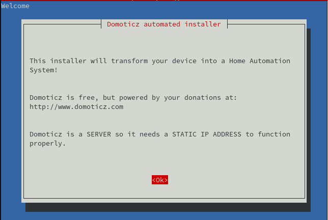{:width="300"}  
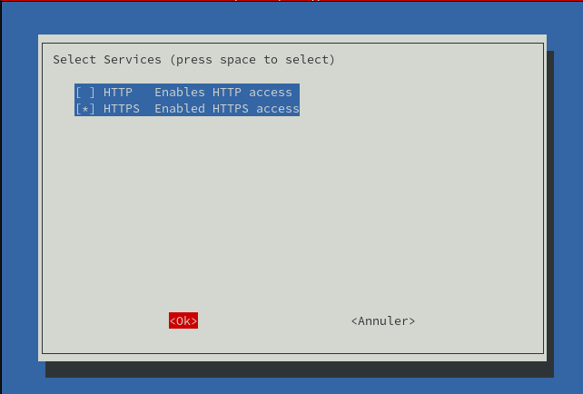{:width="300"}   
HTTPS est avec le port standard 443  
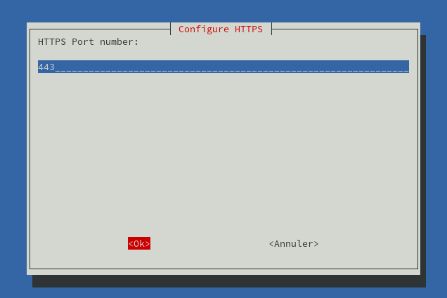{:width="300"}   
emplacement par défaut qui est sous le compte utilisateur **domoticz**  
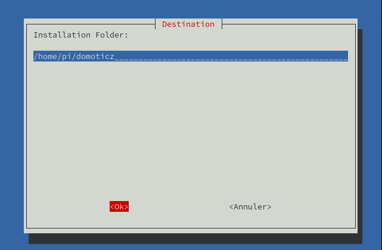{:width="300"}   
*Veuillez patienter quelques minutes...*   
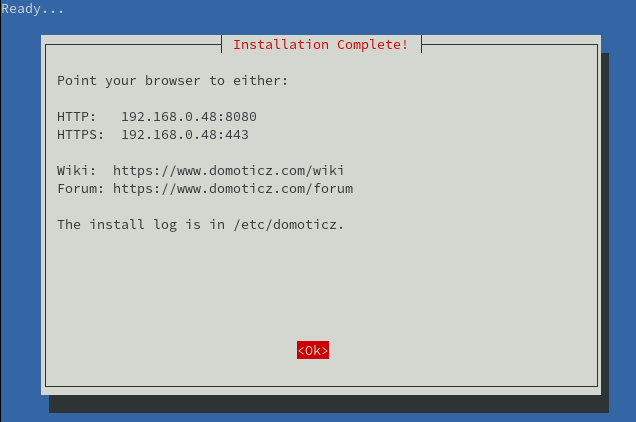{:width="300"}

Redémarrage des services...

```
Creating database...
::: Restarting services...
:::
::: Enabling domoticz.sh service to start on reboot... done.
:::
::: Starting domoticz.sh service... done.
::: done.
:::
::: Installation Complete! Configure your browser to use the Domoticz using:
:::     192.168.0.48:8080
:::     192.168.0.48:443
```

Droits sur le dossier (OK par défaut)

    sudo chown $USER.$USER -R $HOME/domoticz

### Domoticz/Systemd

Modifier les procédures pour une gestion **systemd**

Arrêt du service

    sudo service domoticz.sh stop

Supprimer le script

    sudo rm /etc/init.d/domoticz.sh

Déplacer le dossier

Retirer tous les liens d'un script (en supposant que truc a déjà été supprimé) :

    sudo update-rc.d domoticz.sh remove

Créer le service géré par systemd 

    sudo nano /etc/systemd/system/domoticz.service

```
[Unit]
       Description=domoticz_service
[Service]
       User=pi
       Group=pi
       ExecStart=/home/pi/domoticz/domoticz -www 8080 -sslwww 443
       WorkingDirectory=/home/pi
       #        
       # Give the right to open priviliged ports. This allows you to run on a port <1024 without root permissions (user/group setting above)
       #
       # The following line is for pre-16.04 systems.
       # ExecStartPre=setcap 'cap_net_bind_service=+ep' /home/domoticz/domoticz/domoticz
       #
       # The below works on Ubuntu 16.04 LTS
       # CapabilityBoundingSet=CAP_NET_BIND_SERVICE
       #
       # The following works on Ubuntu 18.04
       # AmbientCapabilities=CAP_NET_BIND_SERVICE
       #
       Restart=on-failure
       RestartSec=1m
       #StandardOutput=null
[Install]
       WantedBy=multi-user.target

```

Démarrer et activer le service

    sudo systemctl daemon-reload
    sudo systemctl start domoticz.service
    sudo systemctl enable domoticz.service

Status et erreurs

     systemctl status domoticz.service


Erreur *EventSystem - Python: Failed dynamic library load, install the latest libpython3.x library that is available for your platform.*   
Version python : `python3 --version`  &rarr; 3.7.3  
la libraire est installé *libpython3.7/stable,now 3.7.3-2+deb10u2 armhf  [installé, automatique]*  
Pour régler le problème, installer la librairie dev : `sudo apt install libpython3.7-dev`  
Redémarrer le service : `systemctl restart domoticz.service`  

     systemctl status domoticz.service

```
● domoticz.service - domoticz_service
   Loaded: loaded (/etc/systemd/system/domoticz.service; enabled; vendor preset: enabled)
   Active: active (running) since Fri 2021-02-26 11:13:45 CET; 3s ago
 Main PID: 1699 (domoticz)
    Tasks: 15 (limit: 2062)
   CGroup: /system.slice/domoticz.service
           └─1699 /home/pi/domoticz/domoticz -www 8080 -sslwww 443

févr. 26 11:13:45 raspberrypi domoticz[1699]: 2021-02-26 11:13:45.343  Starting shared server on: :::6144
févr. 26 11:13:45 raspberrypi domoticz[1699]: 2021-02-26 11:13:45.343  Status: TCPServer: shared server started...
févr. 26 11:13:45 raspberrypi domoticz[1699]: 2021-02-26 11:13:45.344  Status: RxQueue: queue worker started...
févr. 26 11:13:47 raspberrypi domoticz[1699]: 2021-02-26 11:13:47.362  Status: NotificationSystem: thread started...
févr. 26 11:13:47 raspberrypi domoticz[1699]: 2021-02-26 11:13:47.363  Status: EventSystem: reset all events...
févr. 26 11:13:47 raspberrypi domoticz[1699]: 2021-02-26 11:13:47.364  Status: EventSystem: reset all device statuses...
févr. 26 11:13:47 raspberrypi domoticz[1699]: 2021-02-26 11:13:47.456  Status: Python EventSystem: Initalizing event module.
févr. 26 11:13:47 raspberrypi domoticz[1699]: 2021-02-26 11:13:47.456  Status: EventSystem: Started
févr. 26 11:13:47 raspberrypi domoticz[1699]: 2021-02-26 11:13:47.456  Status: EventSystem: Queue thread started...
févr. 26 11:13:47 raspberrypi domoticz[1699]: 2021-02-26 11:13:47.650  Status: PluginSystem: Entering work loop.
```

### Accès domoticz local

Ouvrir un navigateur et saisir dans la barre d’adresse l’url  Raspberry:port <http://192.168.0.48:8080/>   
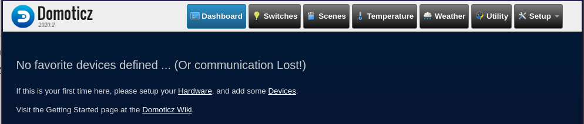{:width="500"}  

Pour configurer Domoticz en Français, c’est très simple. Allez à l’onglet **Setup** (le dernier onglet) puis **Settings**  
Sous User Interface -> Language, sélectionnez French  
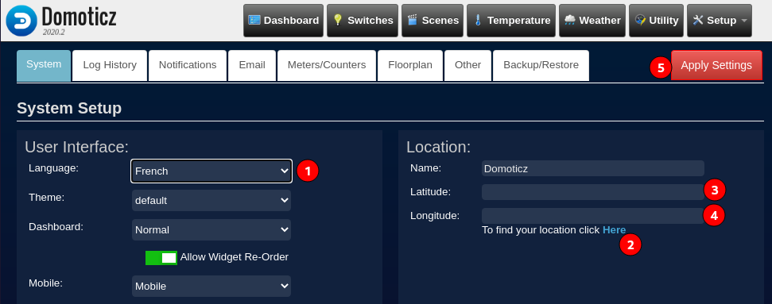{:width="500"}   
Avant de pouvoir enregistrer la modification, vous devrez indiquez vos coordonnées (c’est incontournable !!!).  
 Si vous connaissez pas vos coordonnées GPS (ce qui doit être le cas de 99,99% de la population !), cliquez sur **Here** à coté de **Find your location**. Indiquez votre ville puis cliquez sur **GetLatLong**  
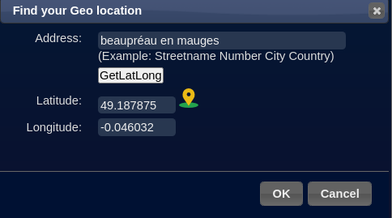{:width="200"}  

Vous pouvez enregistrer la configuration en appuyant sur **Apply Settings**.

### Réseau et sauvegardes automatiques

Retour sur le paramétrage,onglet **Configuration** &rarr; **Paramètres**  
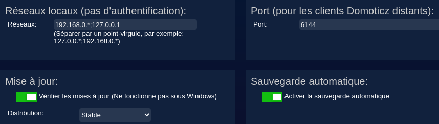{:width="500"}   
*le rôle du champ `192.168.0.*;127.0.0.1` est de ne pas demander de mot de passe de connexion à Domoticz aux utilisateurs au sein du même réseau  
Les utilisateurs « externes » à ces adresses réseau se verront demander le nom d’utilisateur et le mot de passe indiqués ici.  
Activez également la sauvegarde automatique des données, Domoticz effectue des backup de sa base de données toutes les heures,toutes les semaines et tous les mois https://easydomoticz.com/domoticz-backup-restaurations/*  

### Configuration des mails

*Domoticz possède un système de notifications par mail/notification sur smartphones, sms …*

Configurer Domoticz pour qu’il puisse envoyer des courrier électroniques.

Dans le menu **Email**  
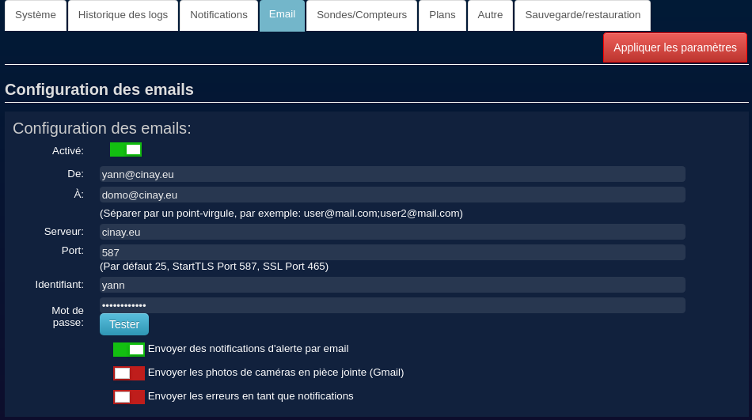{:width="500"}   

### Certificats Let's Encrypt

Les certficats sont générés par **acme.sh** , voir  [Domaine et certificats rnmkcy.eu](/posts/RaspberryPI-Bplus-Raspbian-FlashDriveUSB-FIT32GB/#domaine-et-certificats-rnmkcyeu)

On ajoute une authentification basique  dans **domoticz** pour les accès externes par le lien <https://domotic.rnmkcy.eu>  
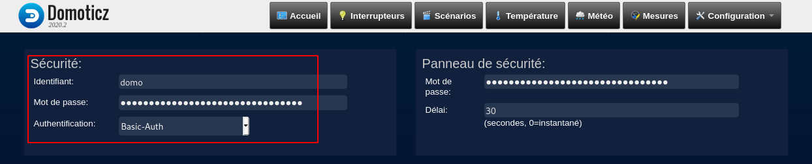{:width="500"}

Réseau local pas d'authentification ,accès lien <http://192.168.0.48:8080>  
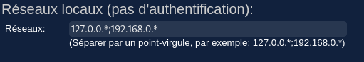{:width="300"}  


### Accès domoticz extérieur

*On ulise un proxy Nginx avec une identification basique*

Désactiver la configuration par défaut

    sudo rm /etc/nginx/sites-enabled/default 

On va utiliser une authentification basique    
Installer les outils : `sudo apt install apache2-utils`  
Créer le fichier mot de passe avec l'utilisateur **domo**  

    sudo htpasswd -c  /etc/nginx/.htpasswd domo
    sudo chmod 644 /etc/nginx/.htpasswd

 
Créer le fichier de configuration `/etc/nginx/conf.d/domotic.rnmkcy.eu.conf`

```
server {
    listen 443 ssl http2;
    listen [::]:443 ssl http2;
    server_name domotic.rnmkcy.eu;
    ssl_certificate /etc/ssl/private/domotic.rnmkcy.eu-fullchain.pem;
    ssl_certificate_key /etc/ssl/private/domotic.rnmkcy.eu-key.pem;

    # TLS 1.3 only
    ssl_protocols TLSv1.3;
    ssl_prefer_server_ciphers off;
 
    # HSTS (ngx_http_headers_module is required) (63072000 seconds)
    add_header Strict-Transport-Security "max-age=63072000" always;
 
    # OCSP stapling
    ssl_stapling on;
    ssl_stapling_verify on;
 
    # verify chain of trust of OCSP response using Root CA and Intermediate certs
    ssl_trusted_certificate /etc/ssl/private/domotic.rnmkcy.eu-fullchain.pem;
 
    # replace with the IP address of your resolver
    resolver 192.168.0.46;

    # Proxy audio navidrome server
    location / {

    auth_basic "Domotic Area";
    auth_basic_user_file /etc/nginx/.htpasswd; 

    	  #//normal proxy configuration
	  proxy_http_version 1.1;
	  proxy_pass_request_headers on;
	  proxy_set_header Host $host;
	  proxy_set_header X-Real-IP $remote_addr;
	  proxy_set_header X-Forwarded-For $proxy_add_x_forwarded_for;
	  proxy_set_header Accept-Encoding "";
	
	  proxy_pass http://localhost:8080;
    proxy_set_header Authorization "";
	  proxy_redirect default;
    }	
}
```

Vérification et relance

    sudo nginx -t
    sudo systemctl reload nginx

Lien <https://domotic.rnmkcy.eu>


## Z-Wave

* [Installation de la clé USB z-wave.me ZME_UZB1 sur Domoticz](https://itechnofrance.wordpress.com/2017/01/30/installation-de-la-cl-usb-z-wave-me-zme_uzb1-sur-domoticz/)
* [Utilisation du protocole Z-Wave sous Domoticz](https://blog.domadoo.fr/guides/utilisation-protocole-z-wave-domoticz/)

### Clé USB z-wave.me UZB

{:width="100"}  
<https://z-wave.me>  

**Installation de la clé USB z-wave.me ZME_UZB1 sur Domoticz**  
Cette clé va permettre de gérer les périphériques Z-wave et Z-wave+ à partir de Domoticz, brancher la clé sur le Raspberry et saisir la commande `lsusb` pour vérifier la détection de la clé  

```
Bus 001 Device 007: ID 0658:0200 Sigma Designs, Inc. Aeotec Z-Stick Gen5 (ZW090) - UZB
```

On voit apparaitre la clé en tant que **Sigma Designs**.  
Port utilisé  : `sudo -s; dmesg`

```
[14163.139243] usb 1-1.4: new full-speed USB device number 7 using dwc_otg
[14163.172933] usb 1-1.4: New USB device found, idVendor=0658, idProduct=0200, bcdDevice= 0.00
[14163.172955] usb 1-1.4: New USB device strings: Mfr=0, Product=0, SerialNumber=0
[14163.233053] cdc_acm 1-1.4:1.0: ttyACM0: USB ACM device
[14163.234123] usbcore: registered new interface driver cdc_acm
[14163.234138] cdc_acm: USB Abstract Control Model driver for USB modems and ISDN adapters
```

En mode su  
le périphérique `/dev/ttyACM0` est dans le groupe **dialout** 

    ls -l /dev/ttyACM0 
    crw-rw---- 1 root dialout 166, 0 févr. 25 08:15 /dev/ttyACM0

les comptes utilisateur qui sont dans le groupe **dialout** auront le droit d'accès en lecture/écrirure (rw) sur ce fichier de périphérique.

    sudo usermod -a -G dialout $USER


Domoticz, aller dans le menu **Configuration**  et **Matériel**  
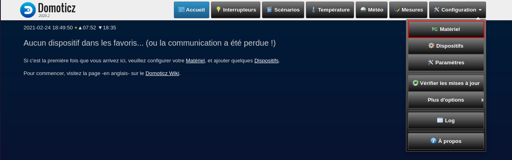{:width="500"}   

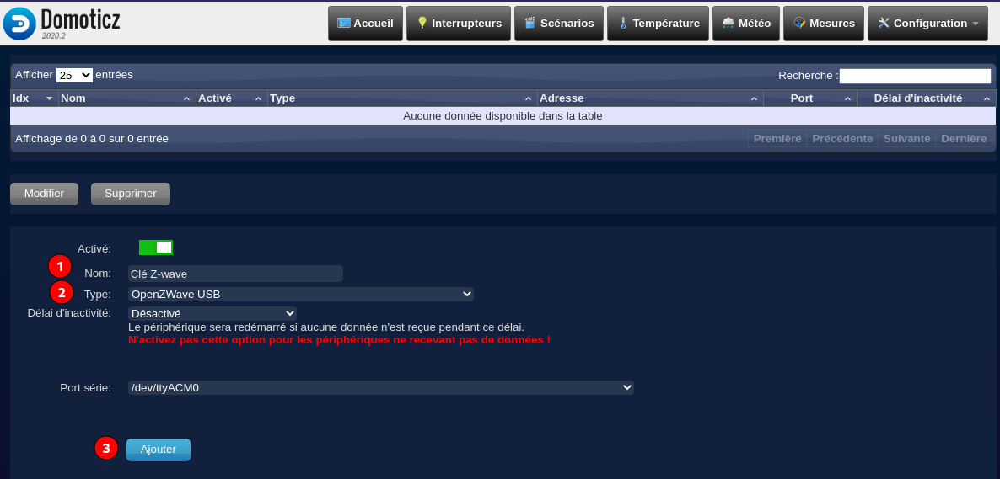{:width="500"}   
Entrer un nom **z-wave**, choisir le type **OpenZWave USB** cliquer sur **Ajouter**   

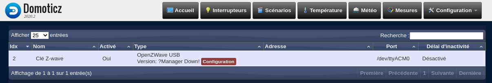{:width="500"}   
La clé est ajoutée, cliquer sur **Configuration** qui s’affiche en rouge au niveau de la clé  

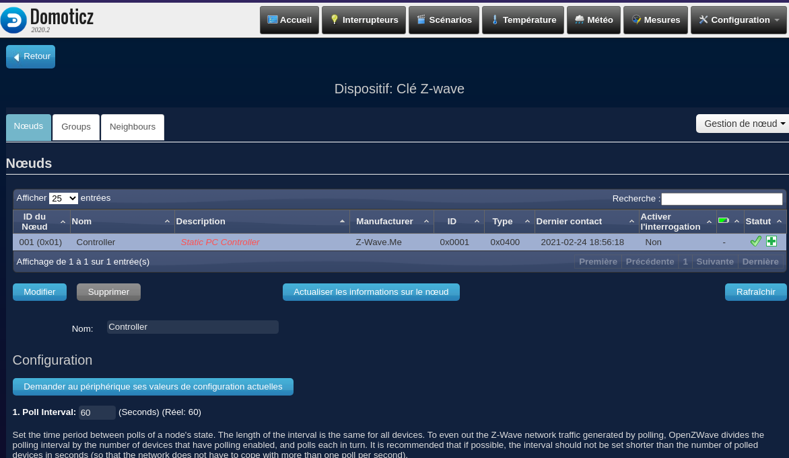{:width="500"}   
A titre d’information :

Dans les « Réglages », on peut voir le nom « controller », en cliquant dessus, la configuration apparaît et nous pouvons choisir la période entre les sondages de l’état d’un nœud où la durée de l’intervalle est la même pour tous les appareils et si possible, l’intervalle ne doit pas être plus court que le nombre de périphériques interrogés en secondes (de sorte que le réseau ne doive pas faire plus d’un sondage par seconde).

Nous pouvons aussi « Activer /Désactiver » l’historisation du débogage. A utiliser uniquement en cas de problème pour identifier la source.

Il est aussi possible d’« Activer / Désactiver » le réseau de traitement nocturne.

Si vous utilisez des périphériques de sécurité il est impératif de définir une clé réseau de longueur 16 octets. On peut aussi se permettre d’Activer / Désactiver les couleurs clignotantes du contrôleur lorsqu’il est branché sur USB.


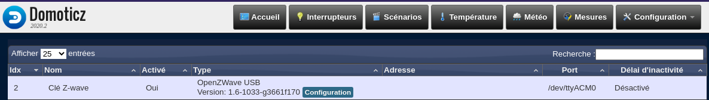{:width="500"}   

### Sensative strips+

{:width="200"}   
https://sensative.com/sensors/strips-zwave/zwave-resource-center/guard/

Votre Strips est livré en mode ajout automatique.    
Suivez la procédure ci-dessous pour ajouter Strips à votre réseau.  
Strips est un capteur magnétique qui peut être ajouté à n’importe quel système certifié Z-Wave et fonctionner avec tout appareil Z-Wave.  
Z-Wave est un standard international pour les communications sans fil   

1. Démarrer le mode ajout sur votre contrôleur Z-Wave  
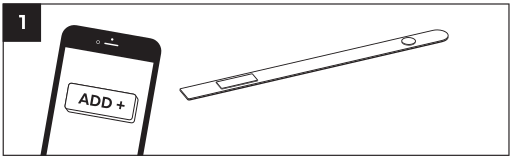{:width="500"}   
Controleur z-wave domoticz  
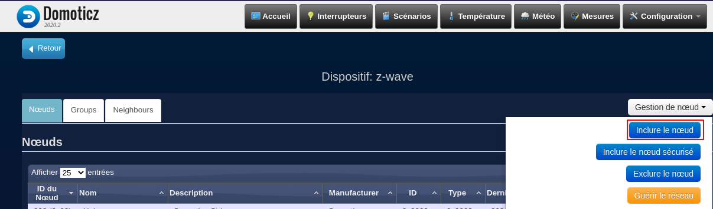{:width="500"}   
Le système se met en mode recherche d'un périphérique z-wave   
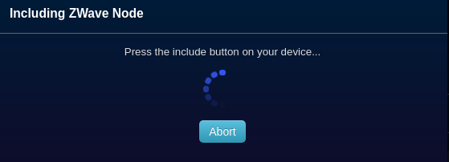{:width="200"}   
2. Restez dans la portée du contrôleur. Retirer les deux aimants du
Strips. 1 clignotement long confirme l’ajout.  
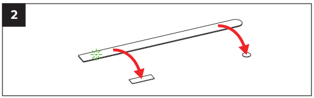{:width="200"}   
Si la procédure ci-dessus ne fonctionne pas!  
    * Mettre le contoleur en mode ajout (voit §1)  
    * Placer l'aimant sur le bord arrondi et quand la LED clignote, retirer l'aimant
    * Répéter l'opération ci-dessus 3 fois en moins de 10 secondes
    * Un long clignotement de la LED indiquera que l'ajout a réussi et le controleur affichera un message :   
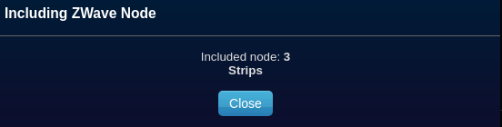{:width="200"}   
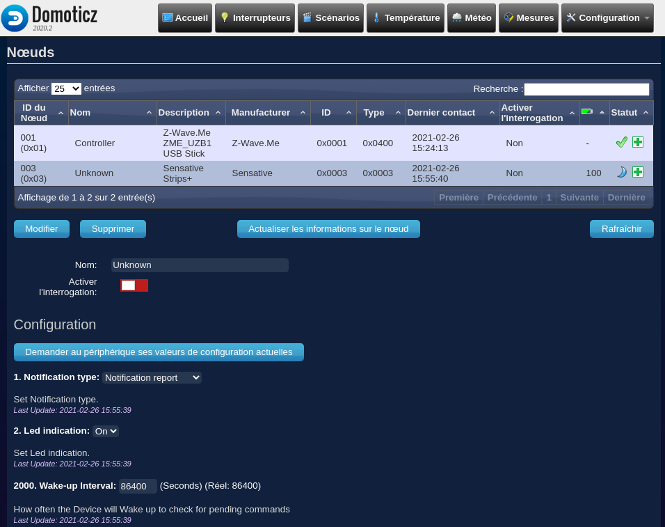{:width="500"}   
3. L’application de votre contrôleur Z-Wave doit maintenant être
capable de gérer l’état de votre capteur Strips.  
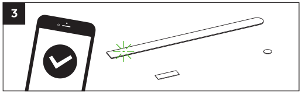{:width="200"}   
4. Aller dans **Configuration &rarr; Dispositifs**   
Déplacez l’aimant carré (A) comme indiqué sur les images. Vérifiez
que votre système Z-Wave indique le statut correctement.  
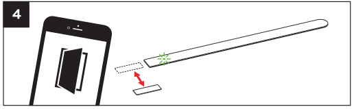{:width="200"}    
Aimant éloigné  
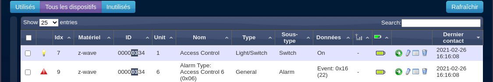{:width="500"}   
Aimant rapproché  
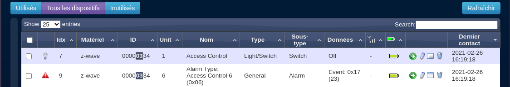{:width="500"}   

L'aimant permettant au Sensative Strips de détecter les ouvertures / fermetures doit être placé à un endroit situé autours de la zone indiquée en rouge sur ce schémas :   
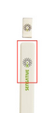{:width="70"}   


Modifier les paramètres du "Sensative strips+", **Configuration &rarr; Matériel**   
Cliquer sur Configuration  
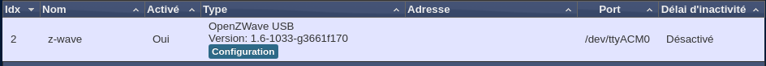{:width="500"}   
cliquer sur la ligne sensative   
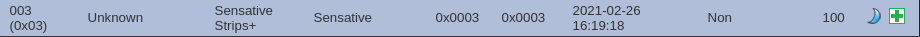{:width="500"}    
Saisir un Nom: Capteur Magnétique  
Cliquer sur modifier pour valider les changements

### Utiliser le capteur

Actuellement le "capteur Magnétique" est dans la rubrique "Tous les dispositifs"   
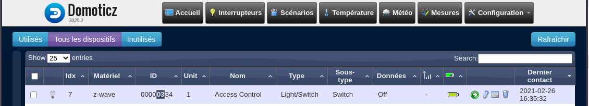{:width="500"}    
{:width="500"}    
Renommer le dispositif "Boîte aux lettres"  
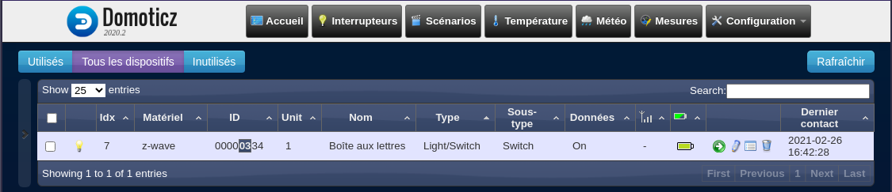{:width="500"}    
cliquer sur la flèche verte (ajouter un dispositif)  
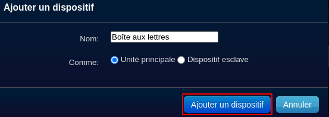{:width="300"}   
Le dispositif passe en rubrique utilisé  

Onglet "Interrupteurs"  
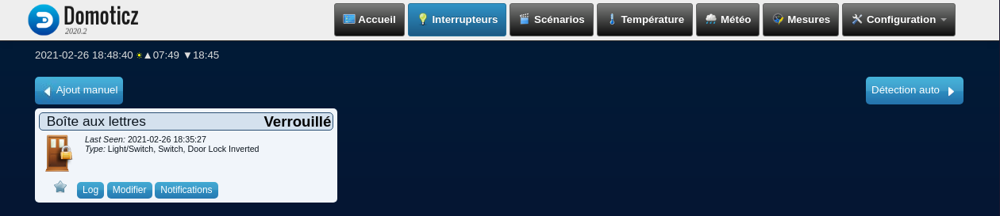{:width="500"}  
Cliquer sur Modifier  
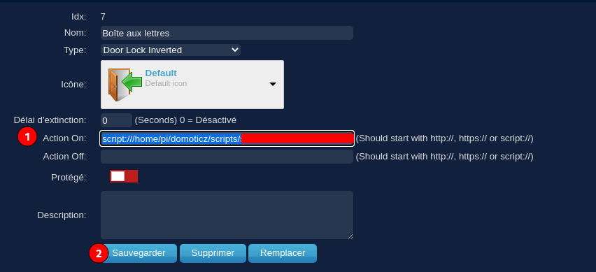{:width="500"}  
On envoie une notification quand la porte est ouverte


[Utilisation de scripts dans Domoticz](https://www.madeinfck.com/utilisation-de-scripts-dans-domoticz-6-6/)  

### Gestion des notifications

[Nouveau système de notification](https://easydomoticz.com/nouveau-systeme-de-notification/)

Envoi de sms par api free.fr

    nano ~/domoticz/scripts/smsfree.sh

```
#!/bin/sh
curl -s -i -k "https://smsapi.free-mobile.fr/sendmsg?user=$1&pass=$2&msg=$3"
```

Droits

    chmod +x ~/domoticz/scripts/smsfree.sh

