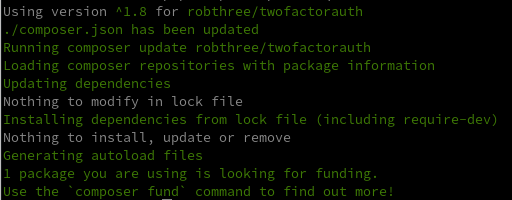

+++
title = 'PHP Authentification RobThree/TwoFactorAuth'
date = 2021-03-30 00:00:00 +0100
categories = ['virtuel', 'authentification']
+++
## Bibliothèque PHP 2FA

*Bibliothèque PHP pour l'authentification à deux facteurs*

### Prérequis

* Unzip : `sudo apt install unzip`
* Testé sur PHP 5.6 jusqu'à 8.0.
* [cURL](http://php.net/manual/en/book.curl.php) en utilisant le `QRServerProvider` (par défaut), `ImageChartsQRCodeProvider` ou `QRicketProvider` mais vous pouvez aussi fournir votre propre fournisseur de QR-code.
* [random_bytes()](http://php.net/manual/en/function.random-bytes.php), [MCrypt](http://php.net/manual/en/book.mcrypt.php), [OpenSSL](http://php.net/manual/en/book.openssl.php) ou [Hash](http://php.net/manual/en/book.hash.php) selon le RNG intégré que vous utilisez (TwoFactorAuth essaiera d'autodétecter et d'utiliser le meilleur disponible) ; cependant : n'hésitez pas à fournir votre propre (CS)RNG.

En option, vous pouvez avoir besoin de :

* [endroid/qr-code](https://github.com/endroid/qr-code) si vous utilisez `EndroidQrCodeProvider` ou `EndroidQrCodeWithLogoProvider`.
* [bacon/bacon-qr-code](https://github.com/Bacon/BaconQrCode) si vous utilisez `BaconQrCodeProvider`.


[Installer PHP composer](/posts/php-composer/)

Bash d’installation

    nano composer.sh

```
#!/bin/sh

EXPECTED_SIGNATURE="$(wget -q -O - https://composer.github.io/installer.sig)"
php -r "copy('https://getcomposer.org/installer', 'composer-setup.php');"
ACTUAL_SIGNATURE="$(php -r "echo hash_file('SHA384', 'composer-setup.php');")"

if [ "$EXPECTED_SIGNATURE" != "$ACTUAL_SIGNATURE" ]
then
    >&2 echo 'ERROR: Invalid installer signature'
    rm composer-setup.php
    exit 1
fi

php composer-setup.php --quiet
RESULT=$?
rm composer-setup.php
exit $RESULT
```


[PHP library for Two Factor Authentication](https://github.com/RobThree/TwoFactorAuth)  
Installation, exécutez la commande suivante :

    php composer.phar require robthree/twofactorauth



### Usage

Voici quelques extraits de code qui devraient vous aider à démarrer...

````php
// Créez une instance TwoFactorAuth
$tfa = new RobThree\Auth\TwoFactorAuth('My Company') ;
````

Le constructeur de la classe TwoFactorAuth accepte 7 arguments (tous facultatifs) :

Argument | Valeur par défaut | Utilisation
------------------|---------------|--------------------------------------------------
`$issuer` | `null` | Sera affiché dans l'application comme nom de l'émetteur.
`$digits` | `6` | Le nombre de chiffres des codes résultants.
`$period` | `30` | Le nombre de secondes pendant lesquelles le code sera valide.
`$algorithm` | `sha1` | L'algorithme utilisé (un parmi `sha1`, `sha256`, `sha512`, `md5`)
`$qrcodeprovider` | `null` | Fournisseur de code QR (plus d'informations à ce sujet plus tard)
`$rngprovider` | `null` | Fournisseur de générateur de nombres aléatoires (plus d'informations à ce sujet plus tard)
`$timeprovider` | `null` | Fournisseur de l'heure (plus sur ce sujet plus tard)

Ces arguments sont tous '`write once`' ; la classe utilisera ces valeurs, pour toute sa durée de vie, lors de la génération / du calcul des codes. Le nombre de chiffres, la période et l'algorithme sont tous définis en fonction des valeurs utilisées (et supportées) par l'application Authenticator de Google. Vous pouvez spécifier 8 chiffres, une période de 45 secondes et l'algorithme sha256, mais l'application d'authentification (qu'il s'agisse de l'application de Google, d'Authy ou d'une autre application) peut ou non prendre en charge ces valeurs. Votre expérience peut varier ; soyez prudent si vous ne contrôlez pas l'application utilisée par votre public.

#### Étape 1 : Créer une clé partagée secrète

Lorsqu'un utilisateur souhaite configurer l'authentification à deux facteurs (ou, plus correctement, l'authentification à plusieurs facteurs), vous devez créer un secret. Ce sera votre **secret partagé**. Ce secret devra être saisi par l'utilisateur dans son application. Cela peut être fait manuellement, auquel cas vous affichez simplement le secret et demandez à l'utilisateur de le saisir dans l'application :

````php
$secret = $tfa->createSecret() ;
````

La méthode `createSecret()` accepte deux arguments : `$bits` (par défaut : `80`) et `$requirecryptosecure` (par défaut : `true`). Le premier est le nombre de bits générés pour le secret partagé. Assurez-vous que cet argument est un multiple de 8 et, encore une fois, gardez à l'esprit que toutes les combinaisons ne sont pas forcément supportées par toutes les applications. L'authentificateur de Google semble satisfait avec 80 et 160, la valeur par défaut est 80 car c'est ce que la plupart des sites (que je connais) utilisent actuellement ; cependant une valeur de 160 ou plus est recommandée (voir [RFC 4226 - Algorithm Requirements](https://tools.ietf.org//rfc4226#section-4)). Ce dernier est utilisé pour s'assurer que le secret est cryptographiquement sécurisé ; si vous ne vous souciez pas beaucoup des secrets cryptographiquement sécurisés, vous pouvez spécifier `false` et utiliser un fournisseur de RNG **non**-cryptographiquement sécurisé.

```php
// Afficher le secret partagé
<p>Veuillez entrer le code suivant dans votre application : '<?php echo $secret ; ?>'</p>
```

Une autre façon, plus conviviale, de faire entrer le secret partagé dans l'application consiste à générer un [QR-code](http://en.wikipedia.org/wiki/QR_code) qui peut être scanné par l'application.  
Pour générer ces codes QR, vous pouvez utiliser l'une des classes intégrées `QRProvider` :

1. `QRServerProvider` (par défaut)
2. `ImageChartsQRCodeProvider`.
3. `QRicketProvider` (par défaut)
4. `EndroidQrCodeProvider` (nécessite l'installation de `endroid/qr-code`)
5. `EndroidQrCodeWithLogoProvider` (identique, mais supportant les images intégrées)
6. `BaconQrCodeProvider` (nécessite l'installation de `bacon/bacon-qr-code`)

...ou implémentez votre propre fournisseur. Pour implémenter votre propre fournisseur, tout ce que vous avez à faire est d'implémenter l'interface `IQRCodeProvider`.  

Vous pouvez utiliser les fournisseurs intégrés mentionnés précédemment pour servir d'exemple ou lire le chapitre suivant de ce fichier. Les classes intégrées utilisent toutes une troisième partie (par exemple externe) (Image-charts, QRServer et QRicket) pour le travail difficile de génération de QR-codes (note : chacun de ces services pourrait à un moment donné ne pas être disponible ou imposer des limitations au nombre de codes générés par jour, heure, etc.)  
Cependant, vous pouvez facilement utiliser un projet comme [PHP QR Code](http://phpqrcode.sourceforge.net/) (ou l'un des [nombreux autres](https://packagist.org/search/?q=qr)) pour générer vos QR-codes sans dépendre de sources externes. Plus tard, nous allons [démontrer](#qr-code-providers) comment faire cela.

Les fournisseurs intégrés ont tous des " réglages " spécifiques que vous pouvez " appliquer ". Certains prennent en charge différentes couleurs, d'autres vous permettent de spécifier le format d'image souhaité, etc. Ce qu'ils ont tous en commun, c'est qu'ils renvoient un code QR sous la forme d'un blob binaire qui, à son tour, sera transformé en [URI de données](http://en.wikipedia.org/wiki/Data_URI_scheme) par la classe `TwoFactorAuth`. Cela vous permet d'afficher facilement l'image sans nécessiter d'allers-retours supplémentaires entre le navigateur et le serveur et vice-versa.

````php
// Afficher le code QR à l'utilisateur
<p>Scannez l'image suivante avec votre application :</p>
<p>getQRCodeImageAsDataUri('Bob Ross', $secret) ; ?>"></p>
````

Lors de la sortie d'un QR-code, vous pouvez choisir un `$label` pour l'utilisateur (qui, lors de la saisie manuelle d'un secret partagé, devra être choisi par l'utilisateur). Ce label peut être une chaîne vide ou `null`. On peut aussi spécifier une `$taille` (en pixels, largeur == hauteur) pour laquelle nous utilisons une valeur par défaut de `200`.

#### Étape 2 : Vérification du secret partagé

Lorsque le secret partagé est ajouté à l'application, l'application sera prête à commencer à générer des codes qui "expirent" chaque "`$period`" nombre de secondes. Pour s'assurer que le secret a été saisi ou scanné correctement, vous devez le vérifier en demandant à l'utilisateur de saisir un code généré. Pour vérifier si le code généré est valide, appelez la méthode `verifyCode()` :

````php
// Vérifier le code
$result = $tfa->verifyCode($_SESSION['secret'], $_POST['verification']) ;
````

Si vous effectuez des validations supplémentaires avec vos valeurs `$_POST`, assurez-vous que le code est toujours soumis en tant que chaîne de caractères - même si c'est un code numérique, le convertir en entier n'est pas fiable. De plus, vous pouvez avoir besoin de stocker `$secret` dans une `$_SESSION` ou un autre stockage persistant entre les requêtes. `verifyCode()` retournera soit `true` (le code est valide) soit `false` (le code n'est pas valide ; aucun point pour vous !).

 La fonction `verifyCode()` accepte, en plus de `$secret` et `$code`, <u>trois arguments</u> supplémentaires.  

1. <u>Le premier</u> étant `$discrepancy`. Comme les codes TOTP sont basés sur le temps("tranches"), il est très important que le serveur (mais aussi le client) ait une date/heure correcte. Mais comme les deux peuvent différer un peu, nous accordons généralement une certaine marge de manœuvre. Parce que les codes générés sont valides pour une période spécifique (vous vous souvenez de l'argument `$period` dans le constructeur de `TwoFactorAuth` ?) nous vérifions généralement la période directement avant et la période directement après l'heure actuelle lors de la validation des codes. Ainsi, lorsque l'heure courante est `14:34:21`, ce qui donne une 'tranche de temps courante' de `14:34:00` à `14:34:30`, nous calculons/vérifions également les codes pour `14:33:30` à `14:34:00` et pour `14:34:30` à `14:35:00`. Cela nous donne une 'fenêtre' de `14:33:30` à `14:35:00`. L'argument `$discrepancy` spécifie le nombre de périodes (ou : tranches de temps) que nous vérifions dans les deux directions de l'heure actuelle. La valeur par défaut de `$discrepancy` est de `1`, ce qui donne (max.) 3 vérifications de périodes : -1, courant et +1 période. Un `$discrepancy` de `4` donne une fenêtre plus large (ou : une plus grande différence de temps entre le client et le serveur) de -4, -3, -2, -1, current, +1, +2, +3 et +4 périodes.
2. <u>Le second</u>, `$time`, vous permet de vérifier un code pour un moment précis dans le temps. Cet argument n'a pas de réelle utilité pratique mais peut être pratique pour unittesting etc. La valeur par défaut, `null`, signifie : utiliser le temps actuel.
3. <u>Le troisième</u>, `$timeslice`, est un argument de sortie ; la valeur retournée dans `$timeslice` est la valeur du timeslice qui correspond au code (s'il existe). Cette valeur sera 0 si le code ne correspond pas et non nulle si le code correspond. Cette valeur peut être stockée avec l'utilisateur et peut être utilisée pour empêcher les attaques par rejeu. Tout ce que vous avez à faire est de vous assurer, lors d'une connexion réussie, que `$timeslice` est plus grand que le timeslice précédemment stocké.

### Étape 3 : Stocker `$secret` avec l'utilisateur et c'est fini !

Ok, donc maintenant le code a été vérifié et trouvé correct. Maintenant nous pouvons stocker le `$secret` avec notre utilisateur dans notre base de données (ou ailleurs) et à chaque fois que l'utilisateur commence une nouvelle session nous lui demandons un code généré par l'application d'authentification de son choix. Tout ce que nous avons à faire est d'appeler `verifyCode()` à nouveau avec le secret partagé et le code entré et nous savons si l'utilisateur est légitime ou non.

Aussi simple que 1-2-3.

Tout ce dont nous avons besoin, c'est de 3 méthodes et d'un constructeur :

````php
public function __construct(
    $issuer = null,
    $digits = 6,
    $period = 30,
    $algorithm = 'sha1',
    RobThree\Auth\Providers\Qr\IQRCodeProvider $qrcodeprovider = null,
    RobThree\Auth\Providers\Rng\IRNGProvider $rngprovider = null
) ;
public function createSecret($bits = 80, $requirecryptosecure = true) : string ;
public function getQRCodeImageAsDataUri($label, $secret, $size = 200) : string ;
public function verifyCode($secret, $code, $discrepancy = 1, $time = null) : bool ;
````

### Fournisseurs de codes QR

Comme mentionné précédemment, cette bibliothèque est fournie avec cinq fournisseurs de codes QR "intégrés". Ce chapitre abordera un peu le sujet mais la plupart d'entre eux devraient être auto-explicatifs. La classe `TwoFactorAuth` accepte un argument `$qrcodeprovider` qui vous permet de spécifier un fournisseur de QR-code intégré ou personnalisé. Les cinq fournisseurs intégrés font une simple requête HTTP pour récupérer une image en utilisant cURL et implémentent l'interface [`IQRCodeProvider`](lib/Providers/Qr/IQRCodeProvider.php) qui est tout ce que vous devez implémenter pour écrire votre propre fournisseur de code QR.

Le fournisseur par défaut est le [`QRServerProvider`](lib/Providers/Qr/QRServerProvider.php) qui utilise l'API [goqr.me](http://goqr.me/api/doc/create-qr-code/) pour rendre les codes QR. Ensuite, nous avons le [`ImageChartsQRCodeProvider`](lib/Providers/Qr/ImageChartsQRCodeProvider.php) qui utilise le [remplacement de Google Image Charts par image-charts.com](https://image-charts.com) pour afficher les codes QR et le [`QRicketProvider`](lib/Providers/Qr/QRicketProvider.php) qui utilise l'[API QRickit](http://qrickit.com/qrickit_apps/qrickit_api.php). Ces trois fournisseurs héritent tous d'une classe de base commune (abstraite) appelée [`BaseHTTPQRCodeProvider`](lib/Providers/Qr/BaseHTTPQRCodeProvider.php) car ils partagent tous les trois la même fonctionnalité : récupérer une image d'un tiers via HTTP. Enfin, nous avons [`EndroidQrCodeProvider`](lib/Providers/Qr/EndroidQrCodeProvider.php), [`EndroidQrCodeWithLogoProvider`](lib/Providers/Qr/EndroidQrCodeWithLogoProvider. php) et [`BaconQrCodeProvider`](lib/Providers/Qr/BaconQrCodeProvider.php) qui nécessitent l'installation d'une dépendance optionnelle pour être utilisées (voir la section Exigences ci-dessus), mais qui génèrent les codes QR localement. Les cinq classes ont des constructeurs qui vous permettent de modifier certains paramètres et la plupart des arguments, sinon tous, devraient parler d'eux-mêmes. Si vous n'êtes pas sûr des valeurs prises en charge, cliquez sur les liens dans ce paragraphe pour obtenir de la documentation sur les API utilisées par ces classes.

Si vous n'aimez pas une des classes intégrées parce que vous ne voulez pas dépendre de ressources externes par exemple ou parce que vous êtes paranoïaque à l'idée d'envoyer le secret TOTP à ces tiers (ce qui leur est inutile puisqu'ils manquent *au moins un* autre facteur dans le [processus MFA] (http://en.wikipedia.org/wiki/Multi-factor_authentication)), n'hésitez pas à implémenter votre propre classe. L'interface `IQRCodeProvider` ne pourrait pas être plus simple. Tout ce que vous avez à faire est d'implémenter 2 méthodes :


````php
getMimeType();
getQRCodeImage($qrtext, $size);
````

La méthode `getMimeType()` doit retourner le [MIME type](http://en.wikipedia.org/wiki/Internet_media_type) de l'image qui est retournée par notre implémentation de `getQRCodeImage()`. Dans cet exemple, il s'agit simplement de `image/png`. Deux arguments sont passés à la méthode `getQRCodeImage()` : `$qrtext` et `$size`. Ce dernier, `$size`, est simplement la largeur/hauteur en pixels de l'image souhaitée par l'appelant. Le premier, `$qrtext`, est le texte qui doit être encodé dans le code QR. Un exemple d'un tel texte serait :

`otpauth://totp/LABEL:alice@google.com?secret=JBSWY3DPEHPK3PXP&issuer=ISSUER`

Il suffit de renvoyer le QR-code sous forme de données d'image binaires et le tour est joué. Toutes les parties du `$qrtext` ont été échappées pour vous (mais notez : vous *pourrez* avoir besoin d'échapper le `$qrtext` entier une fois de plus quand vous passerez les données à un autre serveur comme argument GET).

Voyons si nous pouvons utiliser [PHP QR Code](http://phpqrcode.sourceforge.net/) pour implémenter notre propre fournisseur d'accès, personnalisé, sans tiers autorisé. Nous commençons par télécharger le [fichier (unique) requis](https://github.com/t0k4rt/phpqrcode/blob/master/phpqrcode.php) et le placer dans le répertoire où se trouve `TwoFactorAuth.php`. Maintenant, implémentons le fournisseur : créez un autre fichier nommé `myprovider.php` dans le répertoire `Providers\Qr` et collez-y ce contenu :

````php
<?php
require_once '../../phpqrcode.php';                 // Yeah, we're gonna need that

namespace RobThree\Auth\Providers\Qr;

class MyProvider implements IQRCodeProvider {
  public function getMimeType() {
    return 'image/png';                             // This provider only returns PNG's
  }

  public function getQRCodeImage($qrtext, $size) {
    ob_start();                                     // 'Catch' QRCode's output
    QRCode::png($qrtext, null, QR_ECLEVEL_L, 3, 4); // We ignore $size and set it to 3
                                                    // since phpqrcode doesn't support
                                                    // a size in pixels...
    $result = ob_get_contents();                    // 'Catch' QRCode's output
    ob_end_clean();                                 // Cleanup
    return $result;                                 // Return image
  }
}
````

C'est fini. Nous avons terminé ! Nous avons implémenté notre propre fournisseur (avec l'aide de PHP QR Code). Plus de dépendances externes, plus de latences inutiles. Maintenant, nous allons *utiliser* notre fournisseur :

````php
<?php
$mp = new RobThree\Auth\Providers\Qr\MyProvider() ;
$tfa = new RobThree\Auth\TwoFactorAuth('My Company', 6, 30, 'sha1', $mp) ;
$secret = $tfa->createSecret() ;
?>
<p>getQRCodeImageAsDataUri('Bob Ross', $secret) ; ?>"></p>
````

Voilà. On ne pouvait pas faire plus simple.

### Fournisseurs de RNG

Cette bibliothèque est également fournie avec trois fournisseurs RNG "intégrés" ([Random Number Generator](https://en.wikipedia.org/wiki/Random_number_generation)). Le fournisseur RNG génère un certain nombre d'octets aléatoires et renvoie ces octets sous forme de chaîne. Ces valeurs sont ensuite utilisées pour créer le secret. Par défaut (aucun fournisseur RNG spécifié), TwoFactorAuth essaiera de déterminer le meilleur fournisseur RNG disponible à utiliser. Par défaut, il essaiera d'utiliser le [`CSRNGProvider`](lib/Providers/Rng/CSRNGProvider.php) pour PHP7+ ou le [`MCryptRNGProvider`](lib/Providers/Rng/MCryptRNGProvider. php) ; si ce dernier n'est pas disponible/pris en charge pour une raison quelconque, il essaiera d'utiliser le [`OpenSSLRNGProvider`](lib/Providers/Rng/OpenSSLRNGProvider.php) et si celui-ci n'est pas non plus disponible/pris en charge, il essaiera d'utiliser le dernier fournisseur de RNG : [`HashRNGProvider`](lib/Providers/Rng/HashRNGProvider.php). Chacun de ces fournisseurs utilise sa propre méthode pour générer une séquence aléatoire d'octets. Les trois premiers (`CSRNGProvider`, `OpenSSLRNGProvider` et `MCryptRNGProvider`) renvoient une séquence [cryptographiquement sûre](https://en.wikipedia.org/wiki/Cryptographically_secure_pseudorandom_number_generator) d'octets aléatoires tandis que le `HashRNGProvider` renvoie une séquence **non-cryptographiquement sûre**.

Vous pouvez facilement implémenter votre propre `RNGProvider` en implémentant simplement l'interface `IRNGProvider`. Chacun des fournisseurs de RNG "intégrés" possède des arguments de construction qui vous permettent de modifier certains des paramètres à utiliser lors de la création des octets aléatoires, comme la source à utiliser (`MCryptRNGProvider`) ou l'algorithme de hachage (`HashRNGProvider`). Je vous encourage à jeter un coup d'oeil à certains des fournisseurs de RNG intégrés](lib/Providers/Rng) pour plus de détails et à l'interface [`IRNGProvider`](lib/Providers/Rng/IRNGProvider.php).

### Fournisseurs de temps

Un autre ensemble de fournisseurs dans cette bibliothèque sont les fournisseurs de temps ; cette bibliothèque fournit trois fournisseurs 'intégrés'.  

1. Le fournisseur de temps par défaut est le [`LocalMachineTimeProvider`](lib/Providers/Time/LocalMachineTimeProvider.php) ; ce fournisseur retourne simplement la sortie de `Time()` et est *hautement recommandé* comme fournisseur par défaut.  
2. Le [`HttpTimeProvider`](lib/Providers/Time/HttpTimeProvider.php) exécute une requête `HEAD` contre un serveur web donné (par défaut : google.com) et essaie d'extraire l'en-tête `Date:`-HTTP et retourne sa date. D'autres url/domaines peuvent être utilisés en spécifiant l'url dans le constructeur.  
3. Le dernier fournisseur de temps est le [`NTPTimeProvider`](lib/Providers/Time/NTPTimeProvider.php) qui fait une requête NTP à un serveur NTP spécifié.

Vous pouvez facilement implémenter votre propre `TimeProvider` en implémentant simplement l'interface `ITimeProvider`.

Pour ce qui est de la raison pour laquelle ces fournisseurs de temps sont implémentés, ils permettent à la bibliothèque TwoFactorAuth de s'assurer que l'heure de l'hôte est correcte (ou plutôt : avec une marge). Vous pouvez utiliser la méthode `ensureCorrectTime()` pour vous assurer que l'heure de l'hôte est correcte. Par défaut, cette méthode va comparer l'heure de l'hôte (retournée par l'appel de `time()` sur le `LocalMachineTimeProvider`) avec les `NTPTimeProvider` et `HttpTimeProvider` par défaut. Vous pouvez passer un tableau de `ITimeProvider`s pour changer cela et spécifier la `l'indulgence` (deuxième argument) autorisée (par défaut : 5 secondes). La méthode sera lancée si le fournisseur de temps de TwoFactorAuth (qui peut être n'importe quel `ITimeProvider`, voir constructeur) diffère de plus de la quantité donnée de secondes de n'importe lequel des `ITimeProviders` donnés. Nous vous conseillons d'appeler cette méthode avec parcimonie lorsque vous vous appuyez sur des tiers (ce que font le `HttpTimeProvider` et le `NTPTimeProvider`) ou, si vous avez besoin de vous assurer que l'heure est correcte sur une base (très) régulière, d'implémenter un `ITimeProvider` qui soit plus efficace que les `intégrés' (comme utiliser un signal GPS). La méthode `ensureCorrectTime()` est surtout utilisée pour s'assurer que le serveur est configuré correctement.

### Intégrations

- CakePHP 3](https://github.com/andrej-griniuk/cakephp-two-factor-auth)

### Licence

Sous licence MIT. Voir [LICENSE](https://raw.githubusercontent.com/RobThree/TwoFactorAuth/master/LICENSE) pour plus de détails.

Logo / icône](http://www.iconmay.com/Simple/Travel_and_Tourism_Part_2/luggage_lock_safety_baggage_keys_cylinder_lock_hotel_travel_tourism_luggage_lock_icon_465) sous CC0 1.0 Universal (CC0 1.0) Dédicace du domaine public ([Page archivée](http://riii.nl/tm7ap))

