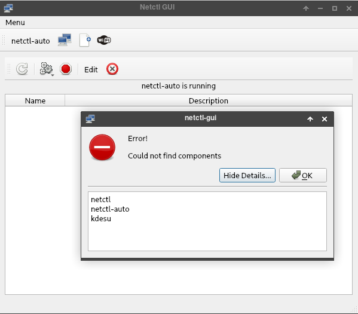

+++
title = 'Netctl remplace netcfg pour la configuration et la gestion des connexions réseaux par des profils'
date = 2021-04-03 00:00:00 +0100
categories = ['network']
+++
## Netctl

* [Netctl](https://wiki.archlinux.fr/netctl)   
* [Netctl GUI](https://arcanis.me/projects/netctl-gui)

### Bascule vers Netctl

Important : Pour éviter des problèmes de conflit, pensez à bien désactiver tout autre service réseau en action (dhcpcd.service, NetworkManager.service, wicd.service) avant de lancer un profil netctl sur une interface réseau donnée.
{: .prompt-warning }


Passer de  dhcpcd  à  netctl  
Arrêter et désactiver dhcpcd

    systemctl stop dhcpcd && systemctl disable dhcpcd

[Mettre un adressage IP fixe et une route avec netctl](https://computerz.solutions/archlinux-ip-fixe/)

    pacman -S netctl

```
résolution des dépendances…
:: Il y a 2 fournisseurs disponibles pour resolvconf :
:: Dépôt core
   1) openresolv  2) systemd-resolvconf

Entrer un nombre (par défaut, 1 est sélectionné): 
```

**Réseau Lan statique**  
Copier le profil ip lan statique

    cp /etc/netctl/examples/ethernet-static /etc/netctl/lan-yann

Configurer le profil

    nano /etc/netctl/lan-yann

```
Description='A basic static ethernet connection'
Interface=enp0s31f6
Connection=ethernet
IP=static
Address=('192.168.0.42/24')
Gateway='192.168.0.254'
DNS=('192.168.0.254')
```

Vous pouvez dès à présent lancer netctl et utiliser votre profil 

    netctl start lan-yann

Activation profil

    netctl enable lan-yann

Redémarrage pour prise en compte

## Netctl GUI

Installation sous archlinux

    yay -S netctl-gui

Premier lancement &rarr; Erreur  
{:width="400"}  

Correction, éditer le fichier `.config/netctl-gui.conf` et ajouter en début de fichier

```
[Common]
SKIPCOMPONENTS=true
```

L'option de configuration permet d'éviter l'erreur initiale, mais une autre erreur apparaît.  
{:width="200"}   
Vérifier la présence des binaires  

    which true /usr/bin/netctl /usr/bin/netctl-auto /usr/bin/kdesu

```
/usr/bin/true
/usr/bin/netctl
/usr/bin/netctl-auto
which: no kdesu in (/usr/bin)
```

il utilise kdesu comme frontal par défaut pour sudo. Vous pouvez le configurer en définissant l'option suivante dans le fichier `.config/netctl-gui.conf` :

```
[sudo]
SUDO_PATH=/usr/bin/sudo
```

L'installation et l'activation de l'aide devrait également résoudre ce problème. 

