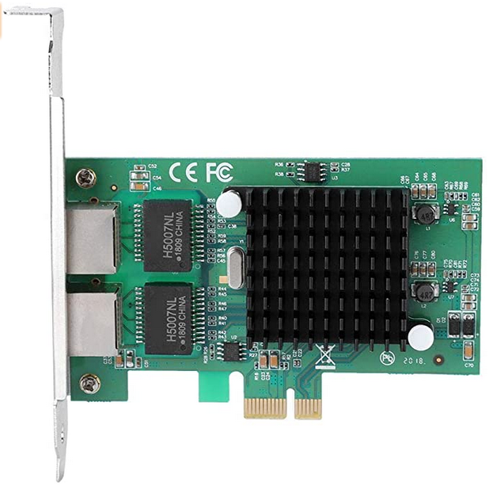

+++
title = 'Linux netctl ajout et configuration carte réseau ethernet + routage'
date = 2021-04-16 00:00:00 +0100
categories = ['network']
+++
## Liens

* [Routage sous Linux](https://doc.ubuntu-fr.org/routage)
* [Comment partager une connexion internet ?](https://doc.ubuntu-fr.org/partage_de_connexion_internet#avec_le_transfert_d_ip)


## Ajout carte réseau

*Linux, ajouter une carte réseau*

{:width="200"}

* Nom: Carte réseau Gigabit de serveur à deux ports
* Matériel: PCB + Metal
* Puce de commande principale: pour Intel82575EB
* Type d'interface: R45 * 2
* Interface de logement: PC | -EX1
* Vitesse de transmission: 10/100 / 1000Mbps
* Réseau applicable: pour Fast Ethernet
* Zones applicables: bureau, poste de travail, serveur duplex intégral / semi-duplex: adaptatif duplex intégral, semi-duplex
* Système de support: pour Windows, pour LINUX et autres systèmes grand public.
* Norme de réseau: EEE8021P, IEE8021Q, IEE8022, IEE802.3ac, EE8023az, IEEE802.3x 

Voir si la carte réseau est reconnu  

    lspci |grep -i 'network'

```
03:00.0 Ethernet controller: Intel Corporation 82575EB Gigabit Network Connection (rev 02)
03:00.1 Ethernet controller: Intel Corporation 82575EB Gigabit Network Connection (rev 02)
```

Le réseau

    ip link 

```
1: lo: <LOOPBACK,UP,LOWER_UP> mtu 65536 qdisc noqueue state UNKNOWN mode DEFAULT group default qlen 1000
    link/loopback 00:00:00:00:00:00 brd 00:00:00:00:00:00
2: enp3s0f0: <NO-CARRIER,BROADCAST,MULTICAST,UP> mtu 1500 qdisc mq state DOWN mode DEFAULT group default qlen 1000
    link/ether 6c:b3:11:32:04:c8 brd ff:ff:ff:ff:ff:ff
3: enp0s31f6: <BROADCAST,MULTICAST,PROMISC,UP,LOWER_UP> mtu 1500 qdisc fq_codel master br0 state UP mode DEFAULT group default qlen 1000
    link/ether 38:d5:47:7c:a0:6c brd ff:ff:ff:ff:ff:ff
4: enp3s0f1: <BROADCAST,MULTICAST> mtu 1500 qdisc mq state DOWN mode DEFAULT group default qlen 1000
    link/ether 6c:b3:11:32:04:c9 brd ff:ff:ff:ff:ff:ff
```

### Netctl Profil lan-enp3s0f1 

Activer le lien

    sudo ip link set enp3s0f1 up

Créer le profil de l'interface  

    sudo nano /etc/netctl/lan-enp3s0f1

```
Description='ethernet enp3s0f1'
Interface=enp3s0f1
Connection=ethernet
IP=static
Address=('192.168.2.2/24')
```

Lancement

    netctl start lan-enp3s0f1

Vérifier

    ip a

```
4: enp3s0f1: <BROADCAST,MULTICAST,UP,LOWER_UP> mtu 1500 qdisc mq state UP group default qlen 1000
    link/ether 6c:b3:11:32:04:c9 brd ff:ff:ff:ff:ff:ff
    inet 192.168.2.2/24 brd 192.168.2.255 scope global enp3s0f1
       valid_lft forever preferred_lft forever
    inet6 fdc4:62ff:57c6:0:6eb3:11ff:fe32:4c9/64 scope global dynamic mngtmpaddr 
       valid_lft forever preferred_lft forever
    inet6 fe80::6eb3:11ff:fe32:4c9/64 scope link 
       valid_lft forever preferred_lft forever
```

Activation profil

    netctl enable lan-enp3s0f1

Status

    netctl status lan-enp3s0f1

```
● netctl@lan\x2denp3s0f1.service - ethernet enp3s0f1
     Loaded: loaded (/usr/lib/systemd/system/netctl@.service; enabled; vendor preset: disabled)
    Drop-In: /etc/systemd/system/netctl@lan\x2denp3s0f1.service.d
             └─profile.conf
     Active: active (exited) since Fri 2021-04-16 13:43:18 CEST; 2min 12s ago
       Docs: man:netctl.profile(5)
    Process: 9078 ExecStart=/usr/lib/netctl/network start lan-enp3s0f1 (code=exited, status=0/SUCCESS)
   Main PID: 9078 (code=exited, status=0/SUCCESS)
     Status: "online"
        CPU: 101ms

avril 16 13:43:17 archyan systemd[1]: Starting ethernet enp3s0f1...
avril 16 13:43:17 archyan network[9078]: Starting network profile 'lan-enp3s0f1'...
avril 16 13:43:18 archyan systemd[1]: Started ethernet enp3s0f1.
avril 16 13:43:18 archyan network[9078]: Started network profile 'lan-enp3s0f1'
```

Les profils actifs , ligne qui débute avec `*`

    netctl list

```
  wlan-yann
* lan-enp3s0f1
  lan-yann
* bridge-yann
  lan-enp3s0f0
```

Pour les routes

    ip r

```
192.168.0.0/24 dev br0 proto kernel scope link src 192.168.0.42 
192.168.2.0/24 dev enp3s0f1 proto kernel scope link src 192.168.2.2 
```

