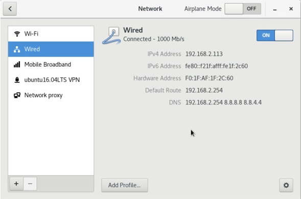
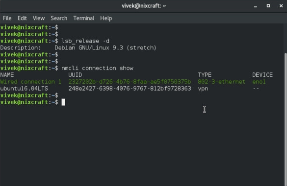
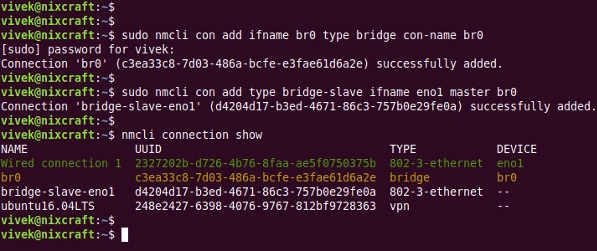
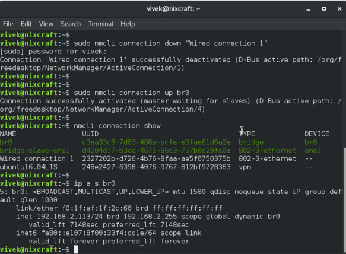

+++
title = 'KVM/QEMU Network Bridge (Pont réseau)'
date = 2021-05-04 00:00:00 +0100
categories = ['virtuel']
+++
*Un pont est un élément de logiciel utilisé pour unir deux ou plusieurs segments de réseau. Un pont se comporte comme un commutateur de réseau virtuel, fonctionnant de manière transparente (les autres machines n'ont pas besoin de connaître son existence). Tous les appareils réels (par exemple eth0) et virtuels (par exemple tap0) peuvent y être connectés.  
Cet article explique comment créer un pont qui contient au moins un dispositif ethernet. Cela est utile pour des choses comme le mode pont de la QEMU, la définition d'un point d'accès basé sur un logiciel, etc...*

Articles connexes

* [Bridge with netctl](https://wiki.archlinux.org/index.php/Bridge_with_netctl)
* [Network configuration#Bonding or LAG](https://wiki.archlinux.org/index.php/Network_configuration#Bonding_or_LAG)
* [KVM libvirt assign static guest IP addresses using DHCP on the virtual machine](https://www.cyberciti.biz/faq/linux-kvm-libvirt-dnsmasq-dhcp-static-ip-address-configuration-for-guest-os/)

## Créer un pont réseau (Network Bridge)

Il y a plusieurs façons de créer un pont.

### Avec iproute2

*Cette section décrit la gestion d'un pont réseau à l'aide de l'outil ip du paquet iproute2, qui est requis par le métapaquet de base.*

Créez un nouveau pont et modifiez son état pour le mettre à niveau :

    # ip link add name bridge_name type bridge
    # ip link set bridge_name up

Pour ajouter une interface (par exemple eth0) dans le pont, son état doit être en haut :

    # ip link set eth0 up

L'ajout de l'interface dans la passerelle se fait en réglant son maître sur bridge_name :

    # ip link set eth0 master bridge_name

Pour afficher les ponts existants et les interfaces associées, utilisez l'utilitaire de pont (qui fait également partie d'[iproute2](https://www.archlinux.org/packages/?name=iproute2)). Voir [bridge(8)](https://jlk.fjfi.cvut.cz/arch/manpages/man/bridge.8) pour plus de détails.

    # bridge link

Voici comment retirer une interface d'un pont :

    # ip link set eth0 nomaster

L'interface sera toujours en haut, donc vous pouvez aussi la faire descendre :

    # ip link set eth0 down

Pour supprimer un pont, lancez la commande suivante :

    # ip link delete bridge_name type bridge

Cela supprimera automatiquement toutes les interfaces de la passerelle. Les interfaces esclaves seront toujours en place, mais vous pouvez aussi les faire tomber après.

### Avec netctl

Voir [Bridge with netctl](https://wiki.archlinux.org/index.php/Bridge_with_netctl)

### Avec systemd-networkd

Voir [systemd-networkd#Bridge interface](https://wiki.archlinux.org/index.php/Systemd-networkd#Bridge_interface). 

### Avec NetworkManager

#### Alternative A

Les paramètres réseau de GNOME peuvent créer des passerelles, mais actuellement, ils ne se connectent pas automatiquement à celles-ci ni aux interfaces esclaves/attachées. Ouvrez les paramètres réseau, ajoutez une nouvelle interface de type pont, ajoutez une nouvelle connexion pontée et sélectionnez l'adresse MAC de l'appareil à attacher au pont.


[nm-connection-editor](https://www.archlinux.org/packages/?name=nm-connection-editor) peut créer des ponts de la même manière que les paramètres réseau de GNOME.

`nmcli` de [networkmanager](https://www.archlinux.org/packages/?name=networkmanager) peut créer des ponts.  

Création d'un pont avec [STP](https://en.wikipedia.org/wiki/Spanning_Tree_Protocol) désactivé (pour éviter que le pont ne soit annoncé sur le réseau) :

    nmcli connection add type bridge ifname br0 stp no

Faire de l'interface enp30s0 un esclave du pont :

    nmcli connection add type bridge-slave ifname enp30s0 master br0

En mettant la connexion existante en position basse :

    nmcli connection down Connexion

Mise en place du nouveau pont :

    nmcli connection up bridge-br0

Si l'interface par défaut de NetworkManager pour l'appareil que vous avez ajouté à la passerelle se connecte automatiquement, vous pouvez la désactiver en cliquant sur l'engrenage à côté dans les Paramètres du réseau, et en décochant "Se connecter automatiquement" sous "Identité".
{: .prompt-info }


#### Alternative B

Comment ajouter un pont réseau avec nmcli (NetworkManager) sous Linux

*Un pont n'est rien d'autre qu'un appareil qui relie deux réseaux locaux en un seul réseau. Il fonctionne au niveau de la couche liaison de données, c'est-à-dire la couche 2 du modèle OSI. Pont réseau souvent utilisé avec la virtualisation et d'autres logiciels. La désactivation de NetworkManager pour un simple pont, en particulier sur un ordinateur portable / de bureau Linux, n'a aucun sens. L'outil nmcli peut créer une configuration de pont persistant sans modifier aucun fichier. Cette page montre comment créer une interface de pont à l'aide de l'outil de ligne de commande Network Manager appelé nmcli*

La procédure pour ajouter une interface de pont sous Linux est la suivante lorsque vous souhaitez utiliser Network Manager:

1.    Ouvrez l'application Terminal
2.    Obtenez des informations sur la connexion actuelle: `nmcli con show`
3.    Ajouter un nouveau pont: `nmcli con add type bridge ifname br0`
4.    Créez une interface esclave: `nmcli con add type bridge-slave ifname eno1 master br0`
5.    Activez br0: `nmcli con up br0`

**Obtenir la configuration actuelle du réseau**

{:width="500"}

    nmcli con show
    nmcli connection show --active

{:width="500"}

J'ai une «connexion filaire 1» qui utilise l'interface Ethernet eno1. Mon système dispose également d'une interface VPN. Je vais configurer une interface de pont nommée br0 et ajouter (ou asservir) une interface à eno1.

**Comment créer un pont, nommé br0**

    sudo nmcli con add ifname br0 type bridge con-name br0
    sudo nmcli con add type bridge-slave ifname eno1 master br0
    nmcli connection show

{:width="500"}

Vous pouvez également désactiver STP: 

    sudo nmcli con modify br0 bridge.stp no
    nmcli con show
    nmcli -f bridge con show br0

La dernière commande affiche les paramètres du pont, y compris le STP désactivé:

```
bridge.mac-address: -
bridge.stp: non
bridge.priority:                         32768 
bridge.forward-delay:                    15 
bridge.hello-time:                       2 
bridge.max-age:                          20 
bridge.ageing-time:                      300 
bridge.multicast-snooping: oui
```

**Comment activer l'interface du pont**

Vous devez désactiver «Connexion filaire 1» et activer br0: 

    sudo nmcli con down "Wired connection 1"
    sudo nmcli con up br0
    nmcli con show

Utilisez la commande ip pour afficher les paramètres IP:

    ip a s
    ip a s br0

{:width="500"}

## KVM - Utiliser un pont (network bridge)

### utiliser bridge

**KVM déclarer et activer le pont réseau (Network Bridge)**

Déclarer le pont (bridge) à KVM.  
Créer un fichier de définition de réseau au format XML :

    nano host-bridge.xml

```xml
<network>
  <name>host-bridge</name>
  <forward mode="bridge"/>
  <bridge name="br0"/>
</network>
```

Appliquer la configuration :

    virsh net-define host-bridge.xml
    virsh net-start host-bridge
    virsh net-autostart host-bridge

Tout fonctionne ?

    virsh net-list --all

```
 Nom           État    Démarrage automatique   Persistent
-----------------------------------------------------------
 host-bridge   actif   Oui                     Oui
```

## Attribution d'une adresse IP

Lorsque la passerelle est entièrement configurée, une adresse IP peut lui être attribuée :

    ip addr add dev bridge_name 192.168.66.66/24


