+++
title = 'Mullvad linux Desktop et Android'
date = 2021-05-08 00:00:00 +0100
categories = vpn
+++
**Évitez les hackers et les traqueurs**  
Lors de vos connexions à Internet via Mullvad, nous chiffrons tout le trafic entrant et sortant de votre ordinateur selon les standards les plus élevés, et ce même si vous utilisez le réseau WiFi public d'un café ou d'un hôtel.

**Conservez votre anonymat**  
Nous ne conservons pas d'historique des connexions, nous ne demandons pas d'informations personnelles à nos utilisateurs et nous vous encourageons à payer de manière anonyme, en espèces ou avec l'une des crypto-monnaies acceptées. Votre adresse IP est remplacée par une adresse que nous vous fournissons, ce qui signifie que l'activité et la localisation de votre appareil ne sont pas associées à votre identité.

**Facilité d'utilisation**  
L'utilisation de Mullvad est simple et directe – il vous suffit de télécharger et d'installer l'application. Nous avons voulu faire de Mullvad un outil convivial : ne perdez pas de temps à gérer des configurations d'installation ou à suivre une procédure d'inscription en plusieurs étapes.


## Liens

* [Guides](https://mullvad.net/fr/help/guides/)
* [Mullvad](https://mullvad.net/en/) est un service VPN basé en Suède qui utilise [OpenVPN](https://wiki.archlinux.org/index.php/OpenVPN) et [WireGuard](https://wiki.archlinux.org/index.php/WireGuard), TUTO [Serveur VPN wireguard](/files/VPN-Wireguard.pdf)  
* [Les applications Mullvad téléchargeables desktop et android](https://mullvad.net/fr/download/)

## Mullvad - Android

[Lien de téléchargement client android .apk](https://mullvad.net/fr/download/#android)

>Veuillez noter que la première fois que vous utilisez l'application Mullvad VPN ou que vous remplacez la clé WireGuard, il vous faudra jusqu'à deux minutes pour vous connecter à un serveur.  
Nous sommes conscients que la connexion peut échouer / échouer si vous changez de serveur plusieurs fois.  
L'application ne fonctionnera pas non plus correctement si vous avez un autre tunnel VPN actif en même temps ou tout autre élément utilisant l'API VPN.

### Exigences d'installation

Vous avez besoin d'Android 6 ou version ultérieure et d'un compte Mullvad (le compte peut être créé sur https://mullvad.net)

Téléchargez et installez l'application

1. [Téléchargez](https://mullvad.net/download/) la dernière version de l'application sur notre site Web.
2. Ouvrez le fichier .apk téléchargé et suivez les instructions pour installer l'application.
3. Si vous recevez un avertissement semblable à celui ci-dessous, tapez sur **Settings**  (*Paramètres*)  
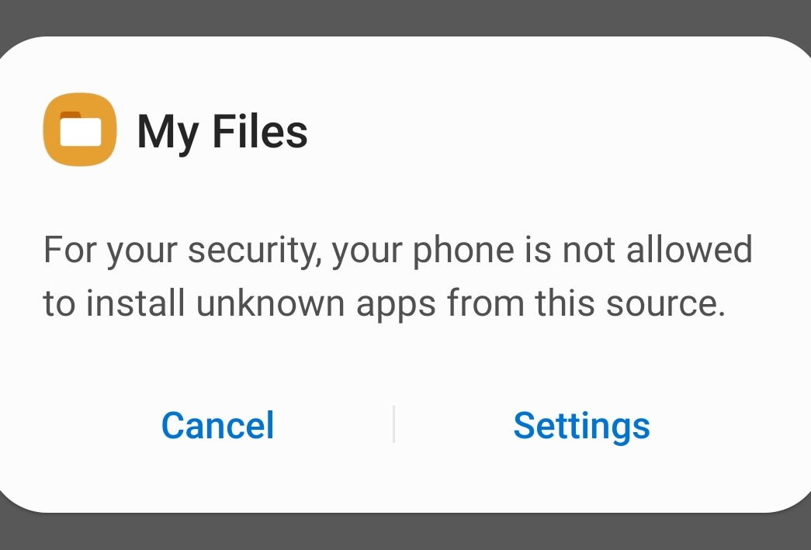{:width="200"}  
4. Activez **Allow from this source** (*Autoriser à partir de cette source*) , puis appuyez sur le bouton Précédent pour reprendre l'installation.  
{:width="200"}  
5. Une fois l'installation terminée, vous pouvez lancer l'application directement.

### Utiliser l'application

La version Android de l'application dispose actuellement d'un ensemble limité de fonctionnalités et de paramètres par rapport à la version de bureau. Veuillez suivre ces instructions simplifiées jusqu'à ce que nous ayons un guide utilisateur dédié. ( [guide de bureau (en)](http://mullvad.net/guides/using-mullvad-vpn-app/) . Voir également **Utiliser l'application Mullvad VPN**  

1. Ouvrez l'application "Mullvad VPN"
2. Entrez votre compte Mullvad et connectez-vous
3. Notez que cela peut prendre jusqu'à deux minutes pour que vos clés WireGuard soient envoyées à tous nos serveurs avant de pouvoir vous connecter - ceci se produit lors de votre première connexion ou si vous changez de clé.
4. Appuyez sur "Sécuriser ma connexion".
5. La première fois, il y aura une fenêtre pop-up "Demande de connexion - Mullvad VPN veut configurer un VPN ..." - Tapez sur OK.

### Désinstaller l'application

1. Ouvrez les **Paramètres** de votre appareil.
2. Faites défiler jusqu'à **Applications** et ouvrez-le.
3. Recherchez **Mullvad VPN** et appuyez sur pour l’ouvrir.
4. Appuyez sur **Désinstaller** . 

## Mullvad - Archlinux

### mullvad-vpn

Le nouveau [client d'interface graphique officiel](https://mullvad.net/download/) est disponible sous le nom de [mullvad-vpn AUR](https://aur.archlinux.org/packages/mullvad-vpn/).

    yay -S mullvad-vpn

En cas d'erreur importation clé

```
==> PGP keys need importing:
 -> A1198702FC3E0A09A9AE5B75D5A1D4F266DE8DDF, required by: mullvad-vpn
==> Import? [Y/n] 
:: Importing keys with gpg......
gpg: échec de réception depuis le serveur de clefs : Server indicated a failure
==> Error: Problem importing keys
```

Importer la clé 

    gpg --keyserver pool.sks-keyservers.net --recv-keys 66DE8DDF


Après l'installation, vous devez activer et démarrer le service systemd 

    sudo systemctl enable mullvad-daemon.service 
    sudo systemctl start mullvad-daemon.service

Vous pouvez également utiliser l'ancien client ou [OpenVPN](https://wiki.archlinux.org/index.php/OpenVPN) avec un fichier de configuration pour Mullvad, comme expliqué dans la section  **Configuration manuelle**

### Configuration manuelle

Assurez-vous d'abord que les packages [openvpn](https://www.archlinux.org/packages/?name=openvpn) et [openresolv](https://www.archlinux.org/packages/?name=openresolv) sont installés, puis téléchargez le package de fichier de configuration OpenVPN de Mullvad depuis [leur site Web](https://www.mullvad.net/download/config/) (NECESSITE UN COMPTE MULLVAD) 

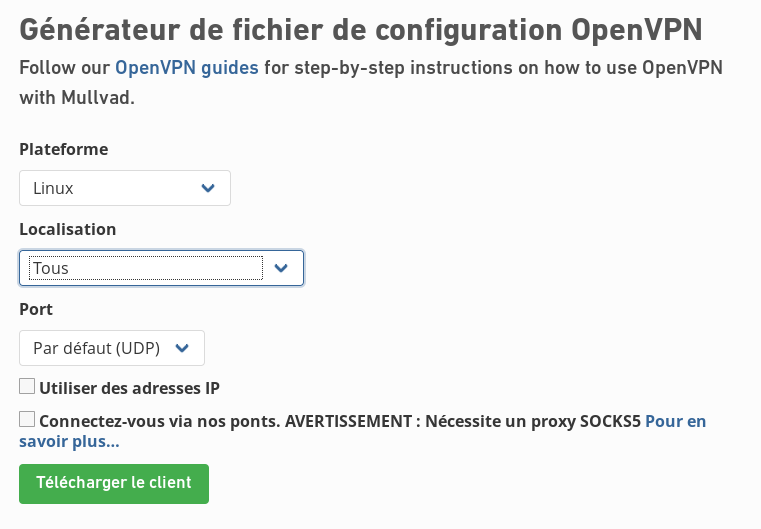{:width="400"}

et décompressez le fichier téléchargé dans **/etc/openvpn/client/** 

Renommez **mullvad_linux.conf** pour un nom plus court à utiliser avec le service systemd ultérieurement:

    mv /etc/openvpn/client/mullvad_linux.conf /etc/openvpn/client/mullvad.conf

Afin d'utiliser les serveurs de noms fournis par Mullvad, le script *update-resolv-conf* est appelé au démarrage et à l'arrêt de la connexion avec OpenVPN afin de modifier resolv.conf afin d'inclure les adresses IP correctes.  
Ce script est également inclus dans le fichier zip de configuration Mullvad, mais doit être déplacé vers **/etc/openvpn/** pour correspondre au chemin spécifié dans le fichier de configuration Mullvad:

    mv /etc/openvpn/client/update-resolv-conf /etc/openvpn/

Le script peut être maintenu à jour avec le script [openvpn-update-resolv-conf](https://github.com/masterkorp/openvpn-update-resolv-conf) , qui contient également un correctif pour les fuites DNS.

Après la configuration, la connexion VPN peut être gérée avec `openvpn-client@mullvad.service`  
Si le service ne parvient pas à démarrer avec une erreur telle que **Cannot open TUN/TAP dev /dev/net/tun: No such device (errno=19)** , vous devrez peut-être redémarrer le système pour permettre à OpenVPN de créer le périphérique réseau approprié pour la tâche. .

### Fuites DNS

Par défaut, les configurations openvpn de Mullvad autorisent les fuites DNS et, dans les cas d'utilisation VPN habituels, il s'agit d'un défaut de confidentialité défavorable.  
Le nouveau client d'interface graphique de Mullvad arrête automatiquement les fuites DNS en supprimant chaque adresse IP du serveur DNS de la configuration système et en les remplaçant par une adresse IP pointant vers le serveur DNS non connecté de Mullvad, valable lors de la connexion VPN. Ce correctif peut également être appliqué avec la méthode simple OpenVPN en configurant resolv.conf pour utiliser uniquement l'adresse IP du serveur DNS Mullvad spécifiée sur [leur site Web](https://www.mullvad.net/guides/dns-leaks/)

La version du script de mise à jour **resolv.conf** dans [openvpn-update-resolv-conf](https://github.com/masterkorp/openvpn-update-resolv-conf) implémente un correctif différent pour les fuites en utilisant le commutateur d'interface exclusif `-x` lors de l'exécution de la commande `resolvconf` , mais cela pourrait entraîner une autre forme de fuite DNS résolution de l'adresse réseau via le serveur DNS fourni par Mullvad, comme indiqué dans la [page de problème GitHub du script](https://github.com/masterkorp/openvpn-update-resolv-conf/issues/18)

### Voir également

*    [Code source du client Mullvad](https://github.com/mullvad/mullvadvpn-app)
*    [Mullvad FAQ](https://mullvad.net/en/faq/) 

## Utiliser l'application Mullvad VPN

### S'identifier

Entrez votre numéro de compte Mullvad et appuyez sur Entrée ou cliquez sur le bouton de connexion vert.  

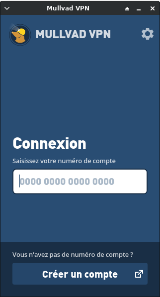{:height="300"}  
Écran de connexion pour l'application Mullvad VPN

Si vous n'avez pas encore de numéro de compte, cliquez simplement sur le bouton **Créer un compte** pour accéder à la page de création de compte de notre site Web.  
**L'application mémorise votre numéro de compte**  

Nous vous encourageons vivement à noter votre numéro de compte pour votre sécurité. Toutefois, l'application enregistrera localement les trois derniers numéros de compte que vous avez utilisés, ce qui facilite la connexion sans avoir à mémoriser le numéro à chaque fois.   

Chaque fois que vous êtes déconnecté, cliquez simplement dans le champ de connexion et une liste déroulante apparaîtra.  

Si vous souhaitez un jour supprimer un numéro de compte de cette liste, il vous suffit de cliquer sur l'icône en forme de X située à droite du numéro.  

### Connexion

Une fois que vous vous êtes connecté avec un numéro de compte valide, l'application tentera automatiquement d'établir une connexion sécurisée et <u>bloquera simultanément votre connexion Internet</u>. 

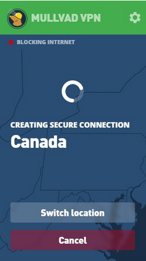{:height="300"}  

Par défaut, l'application se connectera initialement à un serveur en Suède pour augmenter les chances d'une connexion rapide et stable. Si vous choisissez un autre emplacement, l'application mémorisera votre dernière sélection pour la prochaine utilisation de l'application.

#### Savoir quand vous êtes connecté

Une fois connectée, l'application Mullvad le signalera de plusieurs manières:

* Le cadenas dans la barre d'état système/menu deviendra vert.
* "Connexion sécurisée" sera affiché sur l'écran de connexion.
* Un point GPS vert indiquera sur la carte où vous êtes connecté. 

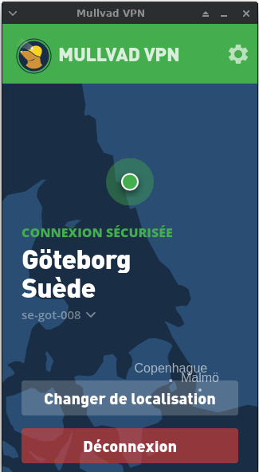{:height="300"}  

#### Détails de la connexion

Lorsque vous êtes connecté, vous pouvez cliquer sur le nom du serveur (par exemple, se-got-008) dans l'écran de connexion pour afficher les détails de la connexion, y compris les protocoles et les adresses IP utilisés.  
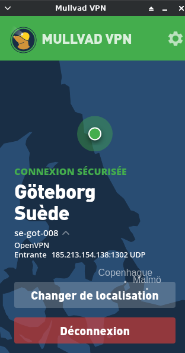{:height="300"}  

#### Votre navigateur présente-t-il des fuites?

Utilisez notre outil [Am I Mullvad](https://am.i.mullvad.net/) pour vérifier l’état de votre connexion et pour voir si votre navigateur contient des informations qui mettent en péril votre vie privée. Cela peut se produire même lorsque vous êtes connecté à Mullvad.

### Changer de lieu

Pour choisir un autre serveur, cliquez sur le bouton **Changer de localisation**

Sur l'écran Sélectionner un emplacement , faites défiler et cliquez sur le pays que vous préférez et l'application se reconnectera automatiquement.

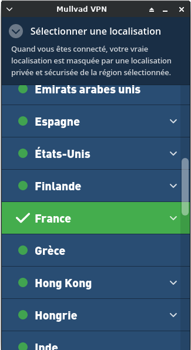{:height="300"}  

Certains pays ont une icône déroulante à droite. En cliquant dessus, vous obtiendrez une liste de villes ou de régions que vous pouvez choisir et auxquelles vous pouvez vous connecter.

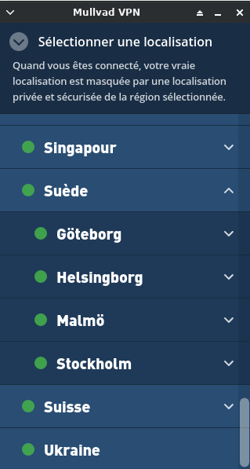{:height="300"}  

Si la ville ou la région possède également une icône déroulante, un clic sur celle-ci vous donnera une liste de serveurs spécifiques.

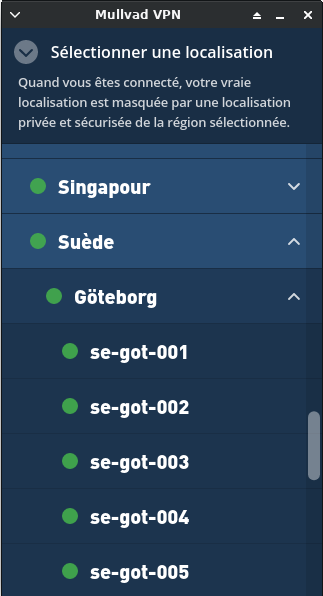{:height="300"}  

Parfois, vous ne pourrez pas sélectionner un emplacement car ses serveurs sont actuellement indisponibles. Un tel endroit aura un point rouge à côté et le nom sera grisé.

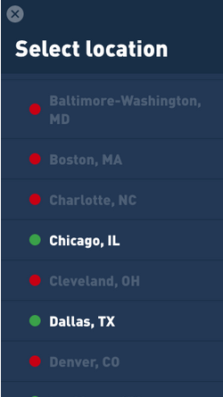{:height="300"}  

Vous pouvez toujours consulter la [liste des serveurs](https://mullvad.net/servers/) de notre site Web pour en savoir plus sur la situation.

### Déconnexion

Si vous souhaitez vous déconnecter, cliquez simplement sur le bouton **Déconnxion** de l'écran de connexion.

Savoir quand vous êtes déconnecté

Lorsque vous êtes déconnecté, l'application Mullvad le signalera de plusieurs manières:

* La barre du haut de l'application sera rouge.
* "Connexion non sécurisée" sera affiché en rouge sur l'écran de connexion.
* Le cadenas dans la barre d'état système / menu sera rouge.
* Le véritable emplacement de votre connexion Internet sera répertorié.
* Un point GPS rouge marquera votre emplacement Internet réel sur la carte. 

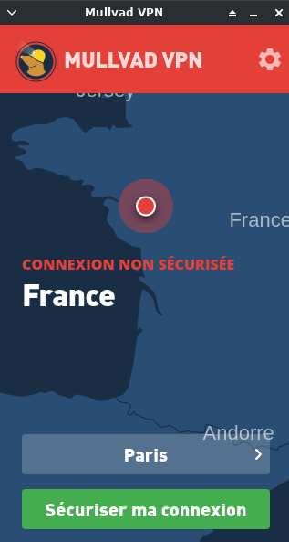{:height="300"}  

### Mettre à jour votre application

Si vous utilisez une version obsolète de l'application, vous verrez un message d'avertissement sur l'écran de connexion. En cliquant sur le message, vous accéderez à notre page Web de téléchargement. Nous vous recommandons vivement de toujours garder votre application à jour.

{:height="100"}    
L'application Mullvad VPN affichant un message indiquant que l'utilisateur exécute une version non prise en charge.

### Internet bloqué temporairement - kill switch on

Parfois, lorsque l'application Mullvad est connectée, vous pouvez remarquer que votre connexion Internet a soudainement cessé de fonctionner. Vérifiez si le <u>cadenas dans la barre d'état système/ barre de menus est devenu vert avec un point rouge</u>.   
Si tel est le cas, l'écran de connexion de l'application affichera également "blocage d'Internet".

Il s'agit de l'interrupteur de neutralisation intégré de l'application au travail, bloquant automatiquement Internet en cas d'échec de la connexion VPN afin d'éviter toute fuite accidentelle de trafic en dehors de notre tunnel sécurisé.

Échec de la connexion VPN afin d’éviter toute fuite accidentelle de votre trafic en dehors de notre tunnel sécurisé.
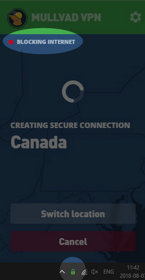{:height="300"}    
Mullvad VPN app soulignant les éléments visuels qui montrent que l'application bloque Internet tout en essayant de se connecter.

Vous en ferez l'expérience dans les situations suivantes

*    si l'application se déconnecte accidentellement d'elle-même, de problèmes de connectivité ou similaires
*    si vous manquez de temps sur votre compte lorsque vous êtes connecté
*    pendant que l’application établit une connexion lorsque vous démarrez l’application. 

>**L'application continuera à bloquer votre trafic Internet jusqu'à ce qu'une connexion sécurisée soit établie ou rétablie, ou jusqu'à ce que vous vous déconnectiez manuellement de l'application.**

Si vous êtes inquiet à propos de ces moments où vous oubliez de démarrer l'application (sans vous sécuriser), envisagez l'une des actions suivantes:

* activez le paramètre "Bloquer les déconnexions" (mentionné dans la section Paramètres avancés )
* Configurez votre navigateur avec notre [proxy SOCKS5](https://mullvad.net/guides/socks5-proxy/) qui servira de protection de sauvegarde. 

### Menu paramètres

Vous pouvez accéder au menu Paramètres en cliquant sur l’icône Paramètres (roue dentée) dans l’écran de connexion.

De là, vous avez accès à une variété d'informations.  
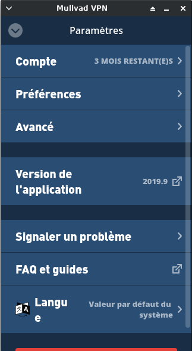{:height="300"}    

#### Compte

Vous pouvez y afficher des informations relatives à votre compte, y compris votre numéro de compte, le temps que vous avez payé, ainsi qu'un lien vers notre site Web pour Acheter plus de crédits . C'est aussi où vous pouvez vous déconnecter .

Trois jours avant l'expiration du crédit de votre compte, une notification s'affiche dans l'écran de connexion.


### Version de l'application

Cela vous indique quelle version de l'application vous utilisez actuellement. Cliquez dessus et vous serez redirigé vers notre site Web pour télécharger la dernière version (que nous recommandons toujours d'avoir!). Si vous ne possédez pas la dernière version, vous verrez un message d'avertissement ici et dans l'écran de connexion.

#### Signaler un problème

Si vous rencontrez des problèmes, vous pouvez facilement nous en informer à l'aide de notre formulaire d'assistance intégrée à l'application. Comme indiqué dans le formulaire, les fichiers journaux de votre application sont anonymisés avant de nous être envoyés en toute sécurité. Vous pouvez facilement afficher ces journaux en cliquant sur **Afficher les journaux des applications** .

Bien que facultatif, nous vous recommandons vivement de fournir une description du problème. Vous n'avez également pas besoin de renseigner une adresse électronique, mais si vous souhaitez une réponse de notre part, vous devrez en inclure une.

#### FAQ et guides

Ce lien vous mènera à la [section Aide](https://mullvad.net/guides/) de notre site Web.

#### La langue

Cette option vous permet de changer la langue d'affichage de l'application.

#### Quitter l'application

Un clic sur le bouton rouge **Quitter** ferme l'application. Cela vous déconnectera de toute connexion que vous aviez avec l'application, laissant votre trafic Internet exposé et non sécurisé, sauf si vous avez activé le paramètre Bloquer lorsque déconnecté.

### Préférences

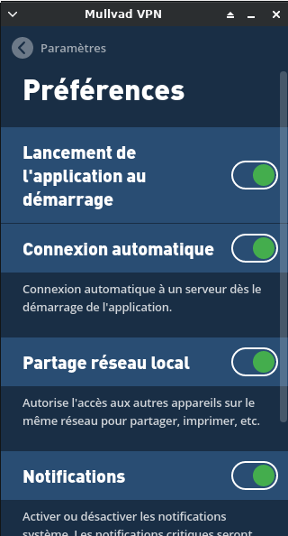{:height="300"}    
Le menu Préférences de l'application Mullvad VPN.

**Lancer l'application au démarrage**  
Cliquez sur le bouton bascule pour activer/désactiver ce paramètre.  

**Connexion automatique**  
Lorsque ce paramètre est activé, l'application se connectera automatiquement à un serveur lors de son lancement.

**Partage de réseau local**  
Activez ce paramètre pour accéder à d'autres périphériques du même réseau, tels que l'impression et le partage.

**Les notifications**  
Contrôlez si vous souhaitez ou non que les notifications système soient affichées. Les notifications critiques, telles que le moment où l'application se déconnecte temporairement, seront toujours affichées.  

Icône de bac monochrome (macOS uniquement)  
Ce paramètre permet de créer une icône de la barre d’échelle de gris au lieu de celle colorée par défaut.

**Démarrer réduit (Linux uniquement)**  
Activez ce paramètre si vous souhaitez uniquement afficher l'icône de la barre des tâches au démarrage de l'application.

>**NOTE : Sur archlinux , tout est activé (vert) dans préférences**

### Réglages avancés

{:height="300"}    

**Activer IPv6**  
Cela active / désactive la communication IPv6 via le tunnel.

**Bloquer quand déconnecté**  
Mise en garde! Avec ce paramètre activé, votre connexion Internet ne fonctionnera que si l'application a établi une connexion. Dans tous les autres cas, votre connexion Internet sera complètement bloquée, y compris si vous vous déconnectez ou quittez l'application.  
*Si vous craignez de ne pas être sécurisé pendant ces moments où vous oubliez de démarrer l'application, utilisez ce paramètre.*

**Protocole de tunnel (Linux et macOS uniquement)**  
Choisissez le protocole VPN que vous souhaitez utiliser avec votre connexion. Le paramètre par défaut est **Automatique**, qui sélectionne toujours OpenVPN , mais vous pouvez également spécifier WireGuard .   
Protocole de transport **OpenVPN**  
>Remarque : les utilisateurs Linux et macOS ne le verront que si le paramètre de protocole Tunnel a été défini sur Automatique ou sur OpenVPN.

Le paramètre par défaut est **Automatique** , mais vous pouvez également choisir **TCP** ou **UDP**  
Les protocoles réseau utiliseront par défaut le protocole UDP, car il est généralement plus rapide que TCP. Cependant, parfois, seul le protocole TCP fonctionne sur certains réseaux restreints.

**Port WireGuard (Linux et macOS uniquement)**  
Cela n’indiquera que si le paramétrage du protocole de tunnel a été défini sur WireGuard.  
Les options ici sont actuellement limitées mais seront étendues avec les futures mises à jour.

**Clé WireGuard (Linux et macOS uniquement)**   
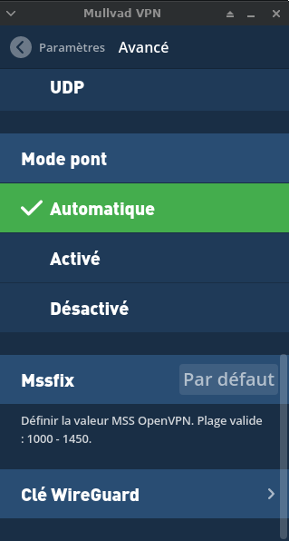{:height="300"}    
Ici, vous pouvez régénérer et vérifier votre **Clé WireGuard** la plus récente.

>**Important : Un clic sur la touche Régénérer remplacera également votre adresse IP statique interne.**

Pour avoir un aperçu de toutes vos clés, cliquez sur **Gérer les clés** pour être redirigé vers la page de votre compte sur notre site Web.  
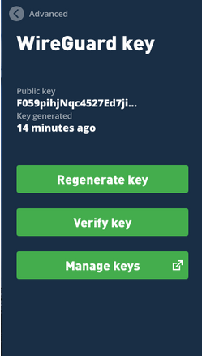{:height="300"}    


**Mode pont**  
{:height="300"}    
L'activation du mode pont route votre trafic sur deux serveurs - un serveur pont, puis un serveur VPN - au lieu d'un, essentiellement un multi-saut.

Suivez notre guide [Comment utiliser Bridge Mode](https://mullvad.net/guides/how-use-bridge-mode/) pour des instructions complètes.

**Mssfix**  
Définissez une valeur pour OpenVPN MSS. 

## Mullvad wireguard

*Comment activer WireGuard dans l'application Mullvad*


### Activation WireGuard

Suivez ces étapes simples pour vous connecter à nos serveurs WireGuard dans l'application VPN Mullvad :

1.    Dans l'application, naviguez vers Paramètres (icône en forme de roue dentée).
2.    Cliquez sur Avancé
3.    Sous le protocole Tunnel, sélectionnez WireGuard  
{:height="300"}  

Vous êtes connecté sur un serveur wireguard  
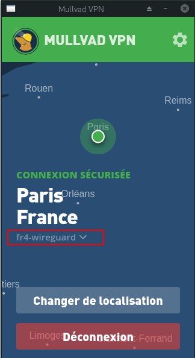{:height="300"}  


### Gérer les clés

Dans l'application Mullvad, vous pouvez gérer vos clés WireGuard.

Naviguez dans le menu via Paramètres > Avancés > Clé WireGuard.  
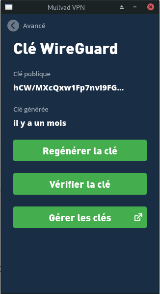{:height="300"}  
Vous verrez votre clé publique actuelle et sa date de création.

### Régénérer la clé

Cliquez sur le bouton **Regénérer la clé** pour remplacer votre clé actuelle.

>**Cela remplacera également votre adresse IP statique interne.**

### Vérifier la clé

Cela permettra de vérifier votre clé actuelle.  
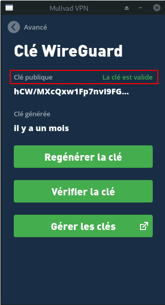{:height="300"}  

### Gérer les clés

Cette option ouvrira la page de votre compte sur notre site web afin que vous puissiez avoir un aperçu de toutes vos clés.  
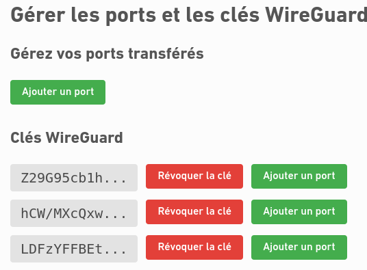{:width="300"}  

*"WireGuard" est une marque déposée de Jason A. Donenfeld.*


## Mullvad WireGuard CLI

Ce guide de l'interface en ligne de commande (CLI) explique comment se connecter aux serveurs WireGuard® de Mullvad en utilisant le terminal.  

Si vous utilisez l'application VPN de Mullvad, voir paragraphe précédent sur la façon d'activer WireGuard dans l'application.

1. Ouvrez le terminal  
Ouvrez une fenêtre de terminal.
2. Avez-vous une paire de clés ?  
Vérifiez si vous avez déjà une paire de clés.  
`mullvad tunnel wireguard key check`
3. Pas de paire de clés ? Générez-en une.  
Cette commande génère une nouvelle paire de clés mais ne renvoie aucune information.  
`mullvad tunnel wireguard key generate`
4. Nouvelle paire de clés ? Attendez.  
Si vous avez généré une nouvelle paire de clés, **vous devrez peut-être attendre jusqu'à deux minutes avant qu'elle ne commence à fonctionner**. Si l'application Mullvad ne parvient pas à se connecter dans les étapes suivantes, vous devez quand même attendre.
5. Activer WireGuard  
Cette commande active WireGuard.  
`mullvad relay set tunnel wireguard any`  
Une fois que vous avez exécuté cette commande, vous pouvez utiliser l'application comme vous le feriez normalement.
6. Utiliser WireGuard dans l'application  
Lancez l'application. Dans le menu de localisation, choisissez n'importe quel pays, ville ou serveur disponible. Les lieux qui n'ont pas de serveur WireGuard seront grisés et ne pourront pas être sélectionnés.
7. Désactiver WireGuard  
Cette commande terminale vous déconnectera de WireGuard.

mullvad relay set tunnel openvpn any

Si vous êtes connecté à l'application lorsque vous éteignez WireGuard, notez que l'application se reconnectera automatiquement afin de mettre en œuvre cette nouvelle configuration.
FAQ
Je reçois "BLOCKED CONNECTION" lorsque je lance l'application.

Il suffit de choisir un autre emplacement. Cela signifie simplement que lorsque vous avez utilisé l'application auparavant, avant d'activer WireGuard, vous étiez connecté à un endroit qui n'a pas de serveur WireGuard.

*"WireGuard" est une marque déposée de Jason A. Donenfeld.*


## Questions/Réponses

### Fuites de DNS (DNS leaks)

<u>Qu'est-ce qu'un serveur DNS ?</u>  
Chaque fois que vous entrez un nom de domaine dans la barre d'adresse de votre navigateur, cliquez sur un lien ou téléchargez une image ou une autre ressource à partir d'un site Web, vous utilisez très probablement le système de noms de domaine (DNS).  
Votre navigateur utilise son serveur DNS configuré pour rechercher l'adresse IP de cette ressource. L'adresse IP, à son tour, est utilisée pour télécharger les ressources que vous avez demandées.  
Un site Web normal est aujourd'hui plein de liens vers des ressources sur le même site et d'autres sites tiers. Cela signifie que votre ou vos serveurs DNS seront contactés fréquemment.
 
<u>Pourquoi les serveurs DNS sont-ils importants du point de vue de la confidentialité ?</u>  
Puisque votre navigateur contacte le serveur DNS pour chaque nouvelle requête de nom de domaine, le serveur DNS saura quelles pages vous visitez et quelles ressources vous consultez. Par conséquent, vous divulguez constamment des informations à votre fournisseur de serveur DNS sur ce que vous faites et quand.  
Habituellement, le serveur DNS appartient à votre fournisseur d'accès Internet (FAI) ou à une grande entreprise comme Google.

>Un moyen facile de vérifier si vous êtes à l'abri des fuites de DNS est de vous rendre sur notre site [Am I Mullvad](https://am.i.mullvad.net/).
 
<u>Solution - Utilisez les serveurs DNS Mullvad</u>  
En raison des problèmes de confidentialité mentionnés ci-dessus, Mullvad possède son propre serveur DNS public non connecté à l'adresse IP suivante : 193.138.219.228.  
Nous avons également un serveur DNS sur chaque serveur VPN qui n'est accessible que par le tunnel à cette adresse : 10.8.0.1 (ou toute autre adresse correspondant à 10.x.0.1).
 
<u>Comment utiliser le serveur DNS de Mullvad ?</u>  
Une fois que vous avez suivi les instructions ci-dessous pour votre système d'exploitation, utilisez notre outil en ligne Am I Mullvad pour vérifier que vous êtes à l'abri des fuites DNS.

<u>Utilisateurs Windows, MacOS et Linux</u>  
Si vous utilisez notre application VPN, vous n'avez rien à faire car la protection contre les fuites DNS est toujours activée. Il n'y a pas d'option pour le désactiver.

<u>Autres utilisateurs</u>  
Si vous utilisez un autre client VPN ou un routeur pour accéder à Mullvad, réglez votre DNS sur 193.138.219.228 pour indiquer le serveur DNS de Mullvad. Ceci garantit que vous ne divulguez pas d'informations à un serveur DNS sur les sites que vous visitez. Cela signifie que notre serveur DNS est toujours utilisé, donc si pour une raison quelconque votre trafic se retrouve sur l'Internet public, il va à notre serveur DNS non-logging.  

>Il est à noter que tous nos serveurs VPN détournent les appels vers notre serveur DNS public et que les requêtes DNS sont traitées sur un serveur DNS local non connecté installé sur ce serveur VPN. Ceci est fait pour traiter les demandes plus rapidement et pour divulguer moins d'informations à Internet.

### Analyse Connexion - DNS - WebRTC - Blacklisting

Se connecter en VPN et lancer le test sur depuis le site [Am I Mullvad](https://am.i.mullvad.net/)

{:width="600"}

Il ya risque avec le webrtc , il faut le désactiver de firefox   
Firefox - méthode avancée

Suivez ces instructions si vous souhaitez désactiver manuellement WebRTC :

1. Tapez "about:config" dans la barre d'adresse et appuyez sur Entrée.
2. Cliquez sur le bouton "J'accepte le risque !
3. Tapez "media.peerconnection.enabled" dans la barre de recherche. Une seule entrée doit apparaître.
4. Cliquez avec le bouton droit de la souris sur l'entrée et choisissez "Inverser" pour changer la colonne Valeur en "false".

Faire de nouveau le test

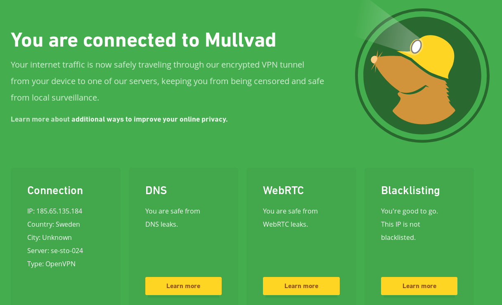{:width="600"}


### Proxy SOCKS5

<u>Pourquoi dois-je sans cesse répondre à des CAPTCHA ?</u>  
Ce problème survient fréquemment sur les sites utilisant Cloudflare

Pour atténuer le problème , on va utiliser un **proxy SOCKS5**  
Avec le proxy SOCKS5 sur tous les serveurs VPN de Mullvad, vous pouvez minimiser davantage l'identité de votre ordinateur. Cette fonction simple mais puissante réduit également les CAPTCHAs.  

>Pour les utilisateurs avancés, le proxy est situé sur IP 10.8.0.1, port 1080, accessible uniquement via Mullvad.

<u>Pourquoi le **proxy SOCKS5** est avantageux</u>  
Vous connaissez peut-être déjà la fonction de sécurité "kill switch" intégrée de l'application Mullvad. En d'autres termes, en cas d'interruption de la connexion Mullvad, tout votre trafic Internet est automatiquement bloqué, garantissant ainsi que votre trafic ne fuit pas accidentellement à l'extérieur de notre tunnel sécurisé.

<u>Cependant, que se passe-t-il si vous avez oublié de démarrer l'application Mullvad ?</u>  
C'est là que l'utilisation du proxy SOCKS5 s'avère utile, pour servir de protection de secours.

<u>Comment fonctionne le proxy</u>  
Si vous configurez votre navigateur, par exemple, pour utiliser le proxy SOCKS5, il dirigera tout votre accès Internet via le proxy qui n'est accessible que par Mullvad. Ainsi, si vous n'avez pas activé l'application, votre navigateur empêchera tout accès à Internet et ne divulguera donc aucune information.

>Le proxy fonctionne également avec les routeurs et tout autre VPN utilisé avec les serveurs Mullvad.

<u>Réduction des CAPTCHAs</u>  
Un autre avantage est une réduction du nombre de CAPTCHAs. De nombreux sites Web et services exigent cette identification lorsqu'ils détectent du trafic provenant d'un serveur VPN. Le proxy rend cette détection plus difficile.

<u>Démarrez avec le proxy SOCKS5</u>  
Suivez ces étapes pour configurer Firefox et Qbittorrent pour utiliser nos proxy SOCKS5.

<u>Utilisateurs de WireGuard</u>  
Si vous utilisez WireGuard, vous devrez remplacer 10.8.0.1 par 10.64.0.1 dans les instructions ci-dessous.

<u>Firefox</u>

1. Cliquez sur *Préférences* (sur certains systèmes d'exploitation, cliquez sur Options).
* Faites défiler vers le bas jusqu'à *Paramètres réseau*.
* Cliquez sur *Paramètres*.
* Sélectionnez *Configuration manuelle du proxy*.
* Assurez-vous que les champs proxy HTTP SSL et FTP sont vides.
* Dans le champ **Hôte SOCKS** :, entrez 10.8.0.1 avec le port 1080.
* Cliquez sur **SOCKS v5** et activez **Utiliser un DNS distant lorsque SOCKS v5 est actif**.
* Cliquez sur OK.

Pour désactiver cette fonction, passez à l'étape 5 et réglez le paramètre sur **Pas de proxy**.

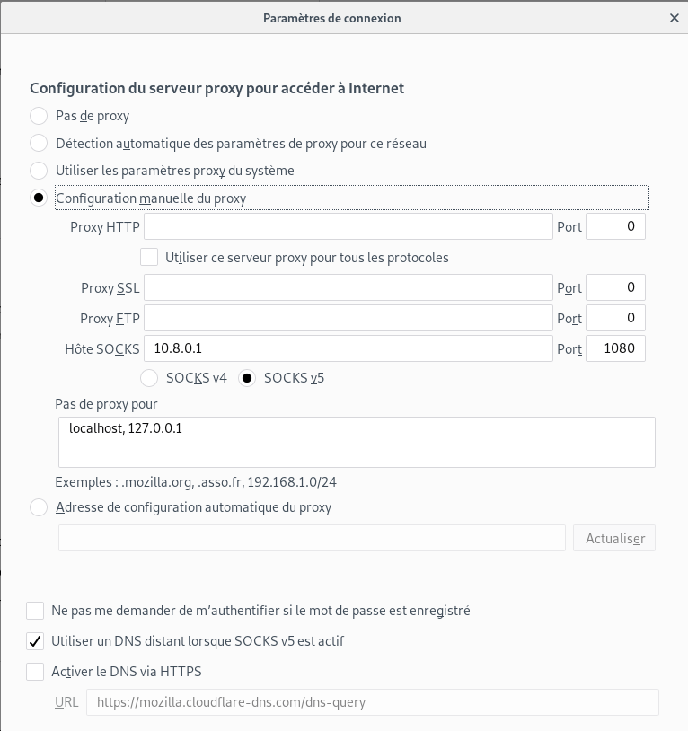{:height="400"}

<u>Firefox sur Android</u>

1. Entrez about:config dans la barre d'adresse et cliquez sur Envoyer.
* Dans le champ de recherche, entrez proxy.
* Faites défiler vers le bas jusqu'à network.proxy.socks et entrez 10.8.0.1.
* Faites défiler vers le bas jusqu'à network.proxy.socks_port et entrez 1080.
* Changez la valeur pour network.proxy.socks_remote_dns en True.
* Changez la valeur pour network.proxy.socks_version à 5.
* Changez le type de proxy.réseau en 1.
* Effacez le champ pour network.proxy.ftp.
* Effacez le champ pour network.proxy.http.
* Dégagez le champ pour network.proxy.ssl.
* Cliquez sur le bouton Précédent pour enregistrer les modifications.

Pour désactiver, passez à l'étape 7 et changez le réglage à 5.
 

<u>Qbittorrent</u>

1. Cliquez sur Outils, puis sur Options (Alt-O).
1. Cliquez sur Connexion.
1. Cliquez sur BitTorrent
1. Activer (Vérifier) Activer le mode anonyme
1. Désactiver (décocher) Activer DHT
1. Désactiver (décocher) Activer PeX
1. Désactiver (décocher) Activer la découverte locale par les pairs
1. Cliquez sur Connexion
1. Pour le protocole Activé : Utilisez la barre déroulante et sélectionnez TCP
1. Sous Serveur proxy, changez le type en SOCKS5.
1. Changer l'hôte : vers 10.8.0.1.
1. Changez Port sur 1080.
1. Cochez la case à côté de l'option Utiliser un proxy pour les connexions entre pairs.
1. Cochez la case à côté de Désactiver les connexions non prises en charge par les proxies.
1. Désactiver (décocher) Utiliser PNP / NAT - PMP
1. Cliquez sur Connexion

Pour désactiver, passez à l'étape 8 et changez le type en (aucun).

## DNS sur HTTPS et DNS sur TLS (Beta)

Notre service DNS public (actuellement en version bêta) offre le DNS sur HTTPS (DoH) et le DNS sur TLS (DoT), avec la minimisation des QNAME et le blocage basique des publicités. Il a été audité par les experts en sécurité d'Assured. [En savoir plus sur DoH et DoT](https://mullvad.net/blog/2021/3/3/mullvad-doh-and-dot-beta-release/).

**Deux services différents**  

1 - Version avec blocage des publicités - adblock.doh.mullvad.net  
2 - Sans blocage de la publicité - doh.mullvad.net
Comment utiliser notre service DNS

### Firefox

1. Dans une fenêtre du navigateur Firefox, cliquez sur le bouton de menu et choisissez Options ou Préférences.
2. Dans la boîte de recherche, tapez "réseau", puis cliquez sur le bouton Paramètres dans les résultats.
3. En bas, cochez la case à côté de Activer le DNS sur HTTPS.
4. À côté de Utiliser le fournisseur, choisissez Personnalisé.
5. Dans la zone de texte qui apparaît, entrez https://doh.mullvad.net/dns-query ou https://adblock.doh.mullvad.net/dns-query.  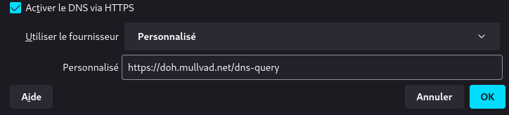
6. Cliquez sur OK.
7. Dans la barre d'adresse du navigateur, tapez about:config et appuyez sur Entrée.
8. Si un avertissement s'affiche, cliquez sur "Accepter le risque et continuer".
9. Dans la boîte de recherche, tapez network.trr.mode
10. Changez la valeur en 3 et appuyez sur Entrée. (cela désactivera la solution de repli non chiffrée).  
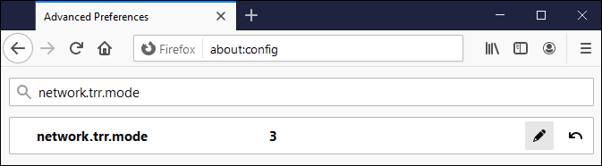

### Android

Suivez les étapes pour utiliser le DNS sur TLS :

1. Ouvrez les paramètres de votre appareil.
2. Naviguez jusqu'à Réseau et Internet > Avancé > Private DNS.
3. Sélectionnez Nom d'hôte du fournisseur de DNS privé.
4. Dans la zone de texte, tapez doh.mullvad.net ou adblock.doh.mullvad.net.
5. Cliquez sur Enregistrer.

