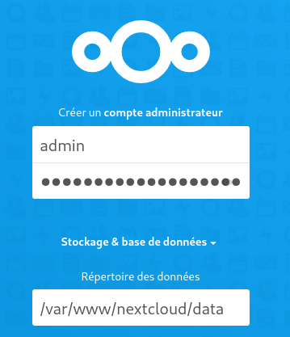
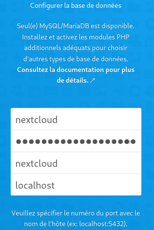
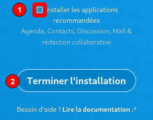
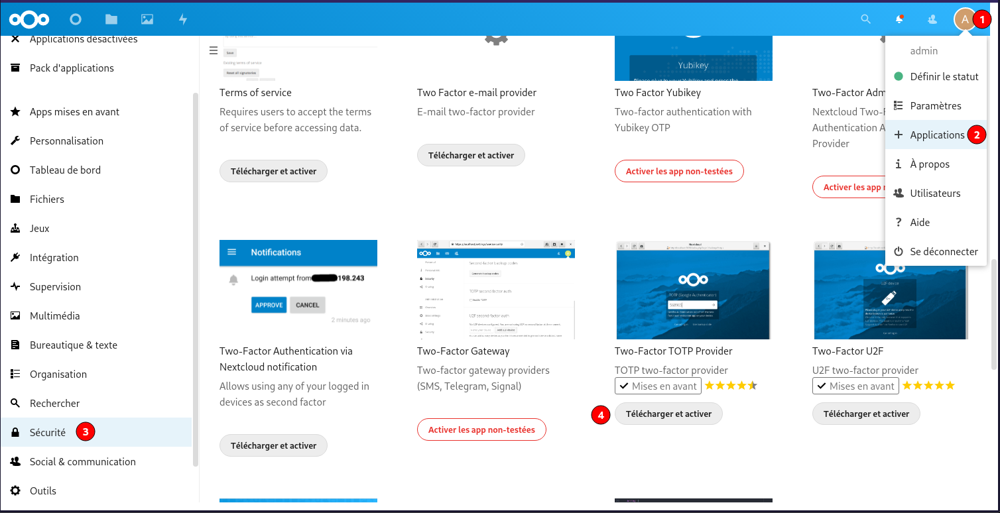
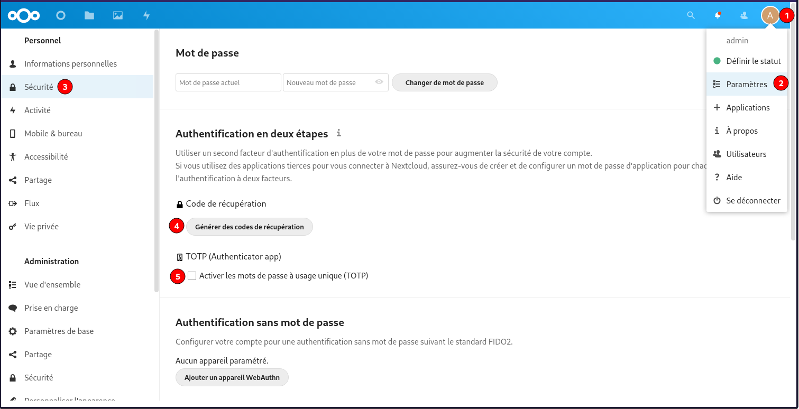
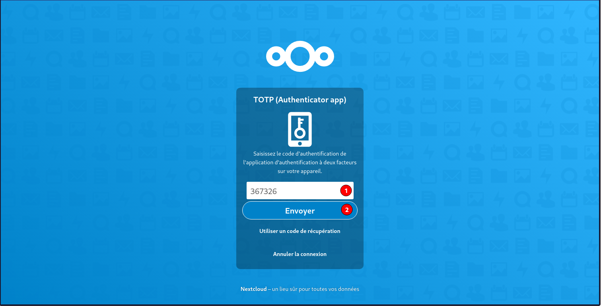

+++
title = 'Nextcloud Nginx, PHP7.4, MariaDB et SSL/TLS'
date = 2021-06-18 00:00:00 +0100
categories = ['nextcloud']
+++
*Nextcloud*

* [Ubuntu 20.04 & 21.04 - Installation de Nextcloud 20 (Nginx, PHP7-FPM, MariaDB et SSL/TLS)](/doc/Ubuntu%2020.04%20&%2021.04%20-%20Installation%20de%20Nextcloud%2020%20(Nginx,%20PHP7-FPM,%20MariaDB%20et%20SSL-TLS)/) 
* [Installer Nextcloud et MariaDB sur serveur Debian Stretch (Nginx, PHP7-FPM et SSL/TLS)](/posts/nextcloud-nginx-php7-mariadb-debian-stretch/#php-fpm-nginx-opcache-apcu--redis)
* Synchronisation de fichiers entre différents ordinateurs (clients dédiés multi-plateformes)
* Stockage sécurisé (chiffrage des fichiers) et ajout de services externes (Amazon, Google, Dropbox, NFS, FTP, SFTP, WebDAV...)
* Authentification LDAP/Active Directory, Kerberos et Shibboleth/SAML 2.0
* Partage de fichiers entre utilisateurs ou publiquement
* Éditeur de documents en ligne avec la suite Collabora Online (basée sur OpenOffice)
* Visionneuse de documents en ligne (PDF, Open document...)
* Gestion de différents workflows
* Calendrier (CalDAV) et gestionnaire de contacts (CardDAV)
* Conférences audio et vidéo sécurisées (WebRTC) avec possibilité de partage d'écran
* Galerie d'images
* ... et de nombreuses fonctionnalités supplémentaires grâce aux applications Nextcloud.  

Nextcloud peut être installé sur n'importe quel serveur supportant une version récente de PHP et supportant MariaDB (base de données par défaut), MySQL ou PostgreSQL.

Serveur debian/ubuntu à jour  
Utilisateur avec droits sudo  

## Nginx PHP7.4 MariaDb

### nginx

    sudo apt install nginx

Oter le commentaire de la ligne `server_tokens off;` dans la configuration de base `/etc/nginx/nginx.conf`

* **worker_processes** : laisser **auto** ou pour profiter pleinement de la puissance de votre serveur, il est recommandé de mettre autant de worker_processes que de cœurs disponibles sur votre serveur. Pour connaître le nombre de cœurs sur votre serveur, il suffit de lancer la commande : `grep processor /proc/cpuinfo | wc -l`
* **server_tokens** : pour des raisons de sécurité, il est recommandé de désactiver l'envoi d'informations telles que le numéro de version de votre Nginx. Pour cela, décommentez cette directive dans le bloc http.  

Relancer nginx : `sudo systemctl restart nginx`

### PHP 7.4

Outils

    sudo apt install gnupg

Mise à jour des dépôts  

```
sudo apt -y install lsb-release apt-transport-https ca-certificates 
sudo wget -O /etc/apt/trusted.gpg.d/php.gpg https://packages.sury.org/php/apt.gpg
```

Ajouter le dépôt

    echo "deb https://packages.sury.org/php/ $(lsb_release -sc) main" | sudo tee /etc/apt/sources.list.d/php.list

Mise à jour des dépôts

    sudo apt update

installer les paquets PHP nécessaires à nextcloud

    sudo apt install php7.4 php7.4-cli php7.4-gd php7.4-imap php7.4-mysql php7.4-soap php7.4-apcu php7.4-common php7.4-gmp  php7.4-intl php7.4-opcache php7.4-xml php7.4-apcu-bc php7.4-curl php7.4-igbinary php7.4-json php7.4-readline  php7.4-zip php7.4-bcmath php7.4-fpm php7.4-imagick php7.4-mbstring php7.4-redis

Création du pool nextcloud `/etc/php/7.4/fpm/pool.d/nextcloud.conf`

    sudo nano /etc/php/7.4/fpm/pool.d/nextcloud.conf 

```
[nextcloud]
listen = /run/php/nextcloud.sock

listen.owner = nextcloud
listen.group = www-data

user = nextcloud
group = www-data

pm = ondemand
pm.max_children = 56
pm.process_idle_timeout = 60s
pm.max_requests = 500

env[HOSTNAME] = $HOSTNAME
env[PATH] = /usr/local/bin:/usr/bin:/bin
env[TMP] = /tmp
env[TMPDIR] = /tmp
env[TEMP] = /tmp
```

### MariaDB

Installation de MariaDB

Comme d'habitude, on utilise la commande apt-get pour installer les paquets de MariaDB

    sudo apt install mariadb-server

Une fois que l'installation des composants est terminée 
Créer un mot de passe  

    tr -cd '[:alnum:]' < /dev/urandom | fold -w16 | head -n1 

finaliser la configuration.

    sudo mysql_secure_installation

Comme expliqué, tapez **Enter** directement à la première question car le mot de passe de l'utilisateur root de MariaDB (pas de votre Debian) est vide par défaut après l'installation.

Puis répondez `Y` à la question suivante pour spécifier le mot de passe de l'utilisateur root de MariaDB qui, une fois de plus, est différent de l'utilisateur root de votre Debian.
Cet utilisateur root de la base de données aura tous les droits d'accès. Pour des raisons évidentes de sécurité, je vous recommande d'utiliser un mot de passe complexe !

```
NOTE: RUNNING ALL PARTS OF THIS SCRIPT IS RECOMMENDED FOR ALL MariaDB
      SERVERS IN PRODUCTION USE!  PLEASE READ EACH STEP CAREFULLY!

In order to log into MariaDB to secure it, we'll need the current
password for the root user.  If you've just installed MariaDB, and
you haven't set the root password yet, the password will be blank,
so you should just press enter here.

Enter current password for root (enter for none): 
OK, successfully used password, moving on...

Setting the root password ensures that nobody can log into the MariaDB
root user without the proper authorisation.

Set root password? [Y/n] Y
New password: 
Re-enter new password: 
Password updated successfully!
Reloading privilege tables..
 ... Success!


By default, a MariaDB installation has an anonymous user, allowing anyone
to log into MariaDB without having to have a user account created for
them.  This is intended only for testing, and to make the installation
go a bit smoother.  You should remove them before moving into a
production environment.

Remove anonymous users? [Y/n] 
 ... Success!

Normally, root should only be allowed to connect from 'localhost'.  This
ensures that someone cannot guess at the root password from the network.

Disallow root login remotely? [Y/n] 
 ... Success!

By default, MariaDB comes with a database named 'test' that anyone can
access.  This is also intended only for testing, and should be removed
before moving into a production environment.

Remove test database and access to it? [Y/n] 
 - Dropping test database...
 ... Success!
 - Removing privileges on test database...
 ... Success!

Reloading the privilege tables will ensure that all changes made so far
will take effect immediately.

Reload privilege tables now? [Y/n] 
 ... Success!

Cleaning up...

All done!  If you've completed all of the above steps, your MariaDB
installation should now be secure.

Thanks for using MariaDB!
```

### base de données Nextcloud

Mot de passe base nextcloud

    tr -cd '[:alnum:]' < /dev/urandom | fold -w16 | head -n1 

Accès base

    sudo mysql   


Tout comme pour la gestion du répertoire nextcloud et pour plus de sécurité, vous allez tout d'abord créer un utilisateur MySQL **nextcloud** dédié à la base de données nextcloud, renseigner un mot de passe et ensuite lui donner les droits sur cette base de données.

```sql
CREATE DATABASE nextcloud; CREATE USER "nextcloud"@"localhost"; SET password FOR "nextcloud"@"localhost" = password('xxxxxxxxxxxxxxxxxx'); GRANT ALL PRIVILEGES ON nextcloud.* TO "nextcloud"@"localhost" IDENTIFIED BY "xxxxxxxxxxxxxxxxxx"; FLUSH PRIVILEGES;
```


## Nextcloud

### Installation

On télécharge Nextcloud 

    cd /var/www
    sudo wget https://download.nextcloud.com/server/releases/latest.tar.bz2

Télécharger le SHA256 

    sudo wget https://download.nextcloud.com/server/releases/latest.tar.bz2.sha256

Vérifier l'intégrité de l'archive téléchargée 

    sha256sum -c latest.tar.bz2.sha256 < latest.tar.bz2

Doit donner le résultat suivant : **latest.tar.bz2: Réussi**

Vérifier la signature PGP et la provenance de l'archive téléchargée :

```
sudo wget https://download.nextcloud.com/server/releases/latest.tar.bz2.asc
sudo wget https://nextcloud.com/nextcloud.asc
gpg --import nextcloud.asc
gpg --verify latest.tar.bz2.asc latest.tar.bz2
```

Donne le résultat suivant

```
gpg: Signature faite le jeu. 08 avril 2021 15:34:38 CEST
gpg:                avec la clef RSA 28806A878AE423A28372792ED75899B9A724937A
gpg: Bonne signature de « Nextcloud Security <security@nextcloud.com> » [inconnu]
gpg: Attention : cette clef n'est pas certifiée avec une signature de confiance.
gpg:             Rien n'indique que la signature appartient à son propriétaire.
Empreinte de clef principale : 2880 6A87 8AE4 23A2 8372  792E D758 99B9 A724 937A
```

Décompresser l'archive Nextcloud :

    sudo tar -xvf latest.tar.bz2

Supprimez les fichiers et signatures téléchargés :

    sudo rm latest.tar.bz2* nextcloud.asc

### Droits Unix

Lors du déploiement basique d’un serveur HTTP, l’utilisateur sous lequel fonctionne ce serveur (Apache, Nginx...) est la plupart du temps www-data, nobody ou apache. Cela signifie que si plusieurs sites existent sous la même instance de Nginx, tous utilisent le même utilisateur. Or si l’un des sites s’avère corrompu par un utilisateur malveillant alors l’assaillant peut profiter pleinement de tous les droits de l’utilisateur sous lequel tourne le serveur web. Tous les sites s'avèrent donc vulnérables.

Pour des raisons évidentes de sécurité, il est donc recommandé de cloisonner ces utilisateurs et d'avoir un utilisateur dédié à la gestion du dossier nextcloud. Cet utilisateur aura des droits aussi restreints que possible à ce répertoire.
Par défaut, les fichiers de Nextcloud possèdent les permissions suivantes :

*    répertoires : 755 (permission de lecture, d'écriture et d'exécution pour le propriétaire et permission de lecture et d'exécution pour le groupe et les autres)
*    fichiers : 644 (permission de lecture et d'écriture pour le propriétaire et permission de lecture uniquement pour le groupe et les autres).

Nous allons donc modifier le propriétaire du répertoire `/var/www/nextcloud` et l'attribuer à un nouvel utilisateur dédié : **nextcloud** 

Par ailleurs, Nginx est lancé sous l'utilisateur **www-data** et doit avoir accès en lecture au répertoire `/var/www/nextcloud` pour lire les ressources statiques (HTML, CSS, JS, etc.). Nous allons donc attribuer le répertoire `/var/www/nextcloud` au groupe **www-data**. Enfin nous retirerons toutes les permissions de ce répertoire aux autres utilisateurs.

Créez un utilisateur nextcloud 

    sudo useradd -r nextcloud

Modifiez le propriétaire et le groupe du répertoire /var/www/nextcloud :

    sudo chown -R nextcloud:www-data /var/www/nextcloud

Retirez toutes les permissions aux autres utilisateurs :

    sudo chmod -R o-rwx /var/www/nextcloud

### Domaine 

Nexcloud sur le domaine nextcloud.rnmkcy.eu avec certificats Let's Encrypt

Le fichier de configuration web `nextcloud.rnmkcy.eu.conf`

    sudo nano /etc/nginx/conf.d/nextcloud.rnmkcy.eu.conf

```
upstream php-handler {
    server unix:/var/run/php/nextcloud.sock;
}

server {
    listen 80;
    listen [::]:80;
    server_name nextcloud.rnmkcy.eu;
    # enforce https
    return 301 https://$server_name:443$request_uri;
}

server {
    listen 443 ssl http2;
    listen [::]:443 ssl http2;
    server_name nextcloud.rnmkcy.eu;

    # Use Mozilla's guidelines for SSL/TLS settings
    # https://mozilla.github.io/server-side-tls/ssl-config-generator/
    # NOTE: some settings below might be redundant
    ssl_certificate /etc/ssl/private/rnmkcy.eu-fullchain.pem;
    ssl_certificate_key /etc/ssl/private/rnmkcy.eu-key.pem;

    # TLS 1.3 only
    ssl_protocols TLSv1.3;
    ssl_prefer_server_ciphers off;
 
    # HSTS (ngx_http_headers_module is required) (63072000 seconds)
    add_header Strict-Transport-Security "max-age=63072000" always;
 
	# Virtual Host Configs
	include /etc/nginx/conf.d/rnmkcy.eu.d/*.conf;

    # OCSP stapling
    ssl_stapling on;
    ssl_stapling_verify on;
 
    # verify chain of trust of OCSP response using Root CA and Intermediate certs
    ssl_trusted_certificate /etc/ssl/private/rnmkcy.eu-fullchain.pem;
 
    # replace with the IP address of your resolver
    resolver 127.0.0.1;


    # Add headers to serve security related headers
    # Before enabling Strict-Transport-Security headers please read into this
    # topic first.
    #add_header Strict-Transport-Security "max-age=15768000; includeSubDomains; preload;" always;
    #
    # WARNING: Only add the preload option once you read about
    # the consequences in https://hstspreload.org/. This option
    # will add the domain to a hardcoded list that is shipped
    # in all major browsers and getting removed from this list
    # could take several months.
    add_header Referrer-Policy "no-referrer" always;
    add_header X-Content-Type-Options "nosniff" always;
    add_header X-Download-Options "noopen" always;
    add_header X-Frame-Options "SAMEORIGIN" always;
    add_header X-Permitted-Cross-Domain-Policies "none" always;
    add_header X-Robots-Tag "none" always;
    add_header X-XSS-Protection "1; mode=block" always;

    # Remove X-Powered-By, which is an information leak
    fastcgi_hide_header X-Powered-By;

    # Path to the root of your installation
    root /var/www/nextcloud;

    location = /robots.txt {
        allow all;
        log_not_found off;
        access_log off;
    }

    # The following 2 rules are only needed for the user_webfinger app.
    # Uncomment it if you're planning to use this app.
    #rewrite ^/.well-known/host-meta /public.php?service=host-meta last;
    #rewrite ^/.well-known/host-meta.json /public.php?service=host-meta-json last;

    # The following rule is only needed for the Social app.
    # Uncomment it if you're planning to use this app.
    #rewrite ^/.well-known/webfinger /public.php?service=webfinger last;

    location = /.well-known/carddav {
      return 301 $scheme://$host:$server_port/remote.php/dav;
    }
    location = /.well-known/caldav {
      return 301 $scheme://$host:$server_port/remote.php/dav;
    }

    # Anything else is dynamically handled by Nextcloud
    location ^~ /.well-known            { return 301 /index.php$uri; }

    # set max upload size
    client_max_body_size 512M;
    fastcgi_buffers 64 4K;

    # Enable gzip but do not remove ETag headers
    gzip on;
    gzip_vary on;
    gzip_comp_level 4;
    gzip_min_length 256;
    gzip_proxied expired no-cache no-store private no_last_modified no_etag auth;
    gzip_types application/atom+xml application/javascript application/json application/ld+json application/manifest+json application/rss+xml application/vnd.geo+json application/vnd.ms-fontobject application/x-font-ttf application/x-web-app-manifest+json application//+xml application/xml font/opentype image/bmp image/svg+xml image/x-icon text/cache-manifest text/css text/plain text/vcard text/vnd.rim.location.xloc text/vtt text/x-component text/x-cross-domain-policy;

    # Uncomment if your server is build with the ngx_pagespeed module
    # This module is currently not supported.
    #pagespeed off;

    location / {
        rewrite ^ /index.php;
    }

    location ~ ^\/(?:build|tests|config|lib|3rdparty|templates|data)\/ {
        deny all;
    }
    location ~ ^\/(?:\.|autotest|occ|issue|indie|db_|console) {
        deny all;
    }

    location ~ ^\/(?:index|remote|public|cron|core\/ajax\/update|status|ocs\/v[12]|updater\/.+|oc[ms]-provider\/.+|.+\/richdocumentscode\/proxy)\.php(?:$|\/) {
        fastcgi_split_path_info ^(.+?\.php)(\/.*|)$;
        set $path_info $fastcgi_path_info;
        try_files $fastcgi_script_name =404;
        include fastcgi_params;
        fastcgi_param SCRIPT_FILENAME $document_root$fastcgi_script_name;
        fastcgi_param PATH_INFO $path_info;
        fastcgi_param HTTPS on;
        # Avoid sending the security headers twice
        fastcgi_param modHeadersAvailable true;
        # Enable pretty urls
        fastcgi_param front_controller_active true;
        fastcgi_pass php-handler;
        fastcgi_intercept_errors on;
        fastcgi_request_buffering off;
    }

    location ~ ^\/(?:updater|oc[ms]-provider)(?:$|\/) {
        try_files $uri/ =404;
        index index.php;
    }

    # Adding the cache control header for js, css and map files
    # Make sure it is BELOW the PHP block
    location ~ \.(?:css|js|woff2?|svg|gif|map)$ {
        try_files $uri /index.php$request_uri;
        add_header Cache-Control "public, max-age=15778463";
        # Add headers to serve security related headers (It is intended to
        # have those duplicated to the ones above)
        # Before enabling Strict-Transport-Security headers please read into
        # this topic first.
        #add_header Strict-Transport-Security "max-age=15768000; includeSubDomains; preload;" always;
        #
        # WARNING: Only add the preload option once you read about
        # the consequences in https://hstspreload.org/. This option
        # will add the domain to a hardcoded list that is shipped
        # in all major browsers and getting removed from this list
        # could take several months.
        add_header Referrer-Policy "no-referrer" always;
        add_header X-Content-Type-Options "nosniff" always;
        add_header X-Download-Options "noopen" always;
        add_header X-Frame-Options "SAMEORIGIN" always;
        add_header X-Permitted-Cross-Domain-Policies "none" always;
        add_header X-Robots-Tag "none" always;
        add_header X-XSS-Protection "1; mode=block" always;

        # Optional: Don't log access to assets
        access_log off;
    }

    location ~ \.(?:png/|ttf|ico|jpg|jpeg|bcmap|mp4|webm)$ {
        try_files $uri /index.php$request_uri;
        # Optional: Don't log access to other assets
        access_log off;
    }
}

```

Vérifier et recharger nginx

    sudo nginx -t
    sudo systemctl reload nginx

### Paramétrage

Lancer  <https://nextcloud.rnmkcy.eu>  

Créer un compte administrateur et son mot de passe
admin 
Saisir les informations sur la base , utilisateur et mot de passe   
{:width="200"} {:width="200"} {:width="200"}  

Ne pas installer les applications recommandées  
Ne pas tenir compte de l'erreur d'adressage <https://apps/files/> à la fin de l'installation
{: .prompt-danger }

Réinitialiser le mot de passe admin nextcloud

    sudo -u nextcloud php /var/www/nextcloud/occ user:resetpassword admin

### Avertissements de sécurité...

**Votre installation n’a pas de préfixe de région par défaut.** , ajouter `'default_phone_region' => 'FR',` dans le  le fichier `/var/www/nextcloud/config/config.php`   

**mémoire pour PHP** , ajouter `memory_limit = 512M`  dans le fichier `/etc/php/7.4/fpm/php.ini`  

    sudo sed 's/memory_limit = 128M/memory_limit = 512M/g' /etc/php/7.4/fpm/php.ini   

**Cache PHP : OPcache**  

*OPcache (qui signifie Optimizer Plus Cache) est introduit depuis la version 5.5.0 de PHP. Il sert à cacher l’opcode de PHP, c’est-à-dire les instructions de bas niveau générées par la machine virtuelle PHP lors de l’exécution d’un script. Autrement dit, le code pré-compilé est stocké en mémoire. Cela évite ainsi l’étape de compilation à chaque requête PHP. De plus, OPcache va optimiser l’exécution du code afin d’en améliorer les performances.*

Éditez le fichier /etc/php/7.4/fpm/php.ini,ajouter les lignes suivantes dans la section [opcache] :

    sudo nano /etc/php/7.4/fpm/php.ini

```
[opcache]
opcache.enable=1
opcache.enable_cli=1
opcache.interned_strings_buffer=8
opcache.max_accelerated_files=10000
opcache.memory_consumption=128
opcache.save_comments=1
opcache.revalidate_freq=1
```

La nouvelle configuration sera prise en compte après redémarrage du service PHP-FPM :

    sudo systemctl restart php7.4-fpm.service

**Cache de données : APCu & Redis**  

*APCu permet notamment de mettre en cache les variables PHP et de les stocker en mémoire vive. Redis est un système de gestion de base de données NoSQL avec un système de clef-valeur scalable (s’adapte à la charge). Une des principales caractéristiques de Redis est de conserver l’intégralité des données en RAM. Cela permet d’obtenir d’excellentes performances en évitant les accès disques, particulièrement coûteux.*

Installez les paquets APCu et Redis :

	sudo apt install php-apcu redis-server php-redis -y
	
Ajoutez les lignes suivantes dans le fichier /var/www/nextcloud/config/config.php :

	sudo nano /var/www/nextcloud/config/config.php

```
  'memcache.local' => '\OC\Memcache\APCu',
  'memcache.distributed' => '\OC\Memcache\Redis',
  'memcache.locking' => '\OC\Memcache\Redis',
  'redis' => [
     'host'     => 'localhost',
     'port'     => 6379,
  ],
```

La nouvelle configuration sera prise en compte après redémarrage du service PHP-FPM :

	sudo systemctl restart php7.4-fpm.service

Si tout est bien paramétré , voici le message   
{:width="600"}

### Authentification à deux facteurs

Cette activation de la double authentification passe par plusieurs étapes. La première est d’installer une (ou plusieurs applications) permettant d’avoir un deuxième facteur d’authentification. Ces applications sont listées [le magasin des applications Nextcloud catégorie Sécurité](https://apps.nextcloud.com/categories/security). Il existe plusieurs applications, chacunes d’elles ayant une fonctionnalité précise.

Installer l'application [TOTP two-factor provider](https://apps.nextcloud.com/apps/twofactor_totp)  
{:width="600"}  
Ensuite se rendre dans las paramètres  
{:width="600"}   
Il faut sauver les code de récupération TOTP  
Paramétrer les applications TOTP avec le code ou QrCode  
Vérifier pour valider le passage en authorisation à deux facteurs TOTP  
Se reconnecter à l'application et après saisie login/Mot de passe , un code est exigé    
{:width="600"}   


