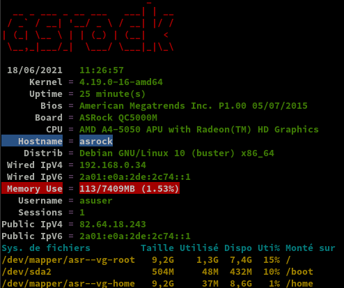
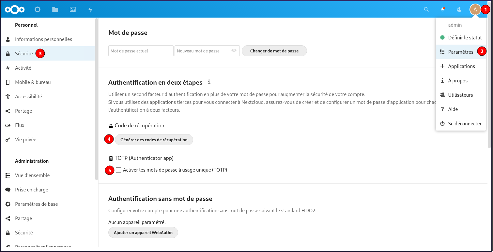

+++
title = 'Serveur Debian Buster carte mère ASRock QC5000M'
date = 2021-06-20 00:00:00 +0100
categories = ['debian', 'serveur']
+++
# ASRock QC5000M Quad-Core APU

[ASRock QC5000M (pdf)](/files/QC5000M.pdf)


* Platform
    * Micro ATX Form Factor
    * Solid Capacitor design
    * High Density Glass Fabric PCB
* CPU
    * AMD FT3 Kabini A4-5050/5000 Quad-Core APU
* Memory
    * 2 x DDR3 DIMM Slots
    * Supports DDR3 1600/1333/1066 non-ECC, un-buffered memory
    * Max. capacity of system memory: 32GB (see CAUTION1)
* Expansion  Slot
    * 1 x PCI Express 2.0 x16 Slot (PCIE2: x4 mode)
    * 2 x PCI Express 2.0 x1 Slot
* Graphics 
    * Integrated AMD RadeonTM HD 8330 Graphics  
    * DirectX 11.1, Pixel Shader 5.0
    * Max. shared memory 2GB
    * Dual graphics output: support D-Sub and HDMI ports by independent display controllers (see CAUTION2)
    * Supports HDMI with max. resolution up to 4K × 2K (4096x2160) @ 24Hz or 4K × 2K (3840x2160) @ 30Hz
    * Supports D-Sub with max. resolution up to 2048x1536 @ 60Hz
    * Supports Auto Lip Sync, Deep Color (12bpc), xvYCC and HBR (High Bit Rate Audio) with HDMI Port (Compliant HDMI monitor is required)
    * Supports HDCP with HDMI Port
    * Supports Full HD 1080p Blu-ray (BD) playback with HDMI Port 
* Audio
    * 7.1 CH HD Audio (Realtek ALC887 Audio Codec)  * To configure 7.1 CH HD Audio, it is required to use an HD front panel audio module and enable the multi-channel audio feature through the audio driver.
    * Supports Surge Protection (ASRock Full Spike Protection)
    * ELNA Audio Caps
* LAN
    * PCIE x1 Gigabit LAN 10/100/1000 Mb/s
    * Rea ltek RTL 8111GR
    * S u p p o r t s   Wa k e - O n -WA N
    * Suppor t s Wa ke- On-L A N
    * Supports Lightning/ESD Protection (ASRock Full Spike Protection)
    * Supports LAN Cable Detection
    * Supports Energy Efficient Ethernet 802.3az
    * Supports PXE
* Rear Panel I/O  
    * 1 x PS/2 Mouse/Keyboard Port
    * 1 x Serial Port: COM1
    * 1 x D-Sub Port
    * 1 x HDMI Port
    * 4 x USB 2.0 Ports (Supports ESD Protection (ASRock Full Spike Protection))
    * 2 x USB 3.0 Ports (Supports ESD Protection (ASRock Full Spike Protection))
    * 1 x RJ-45 LAN Port with LED (ACT/LINK LED and SPEED LED)
    * HD Audio Jacks: Line in / Front Speaker / Microphone
* Storage
    * 2 x SATA3 6.0 Gb/s Connectors, support NCQ, AHCI and Hot Plug
* Connector
    * 1 x TPM Header
    * 1 x CPU Fan Connector (3-pin)
    * 2 x Chassis Fan Connectors (1 x 4-pin, 1 x 3-pin)
    * 1 x 24 pin ATX Power Connector
    * 1 x Front Panel Audio Connector 
    * 2 x USB 2.0 Headers (Support 4 USB 2.0 ports) (Supports ESD Protection (ASRock Full Spike Protection))
* BIOS Feature
    * 32Mb AMI UEFI Legal BIOS with multilingual GUI support
    * Supports “Plug and Play”
    * ACPI 1.1 compliance wake up events
    * SMBIOS 2.3.1 support
    * DRAM Voltage multi-adjustment
* HardwareMonitor  
    * CPU/Chassis temperature sensing
    * CPU/Chassis Fan Tachometer
    * CPU/Chassis Quiet Fan
    * CPU/Chassis Fan multi-speed control
    * Voltage monitoring: +12V, +5V, +3.3V, Vcore
* OS
    * Microsoft® Windows® 10 64-bit / 8.1 32-bit / 8.1 64-bit / 8 32-bit / 8 64-bit / 7 32-bit / 7 64-bit / XP 32-bit / XP 64-bit* 
    * USB 3.0 is not supported by Windows® XP* For the updated Windows® 10 driver, please visit ASRock's    website for details: http://www.asrock.com
* Certifications
    * FCC, CE, WHQL
    * ErP/EuP ready (ErP/EuP ready power supply is required)


## Debian Buster 

{:width="100"}

### Partitionnement du disque

*Utilisation d'une clé Parted bootable.*

* 2MB, type EF02 (BIOS partition). Utilisé par GRUB2/BIOS-GPT. (/dev/sda1)
* 512MB, type 8300 (Linux). Pour le boot linux /boot (/dev/sda2)
* 4GB, type 8200 (swap). Partition swap (en dehors de lvm). (/dev/sda3)
* Espace restant, type 8E00 (LVM). Pour le root / et /home. (/dev/sda4).

Partitionnement du reste du disque SSD 120G GPT + LVM

    gdisk /dev/sda

On passe en mode expert : x  
On efface tout : z  
On relance gdisk  

    gdisk /dev/sda

```
GPT fdisk (gdisk) version 0.8.6
 
Partition table scan:
  MBR: not present
  BSD: not present
  APM: not present
  GPT: not present
 
Creating new GPT entries.
 
Command (? for help): o
This option deletes all partitions and creates a new protective MBR.
Proceed? (Y/N): y

Command (? for help): n
Partition number (1-128, default 1): 1
First sector (34-31457246, default = 2048) or {+-}size{KMGTP}: 
Last sector (2048-31457246, default = 31457246) or {+-}size{KMGTP}: +2M
Current type is 'Linux filesystem'
Hex code or GUID (L to show codes, Enter = 8300): ef02
Changed type of partition to 'BIOS boot partition'

Command (? for help): n
Partition number (2-128, default 2): 2
First sector (34-31457246, default = 6144) or {+-}size{KMGTP}: 
Last sector (6144-31457246, default = 31457246) or {+-}size{KMGTP}: +512M
Current type is 'Linux filesystem'
Hex code or GUID (L to show codes, Enter = 8300): 8300
Changed type of partition to 'Linux filesystem'

Command (? for help): n
Partition number (3-128, default 3): 3
First sector (34-31457246, default = 210944) or {+-}size{KMGTP}: 
Last sector (210944-31457246, default = 31457246) or {+-}size{KMGTP}: +2G
Current type is 'Linux filesystem'
Hex code or GUID (L to show codes, Enter = 8300): 8200
Changed type of partition to 'Linux swap'

Command (? for help): n
Partition number (4-128, default 4): 
First sector (34-31457246, default = 4405248) or {+-}size{KMGTP}: 
Last sector (4405248-31457246, default = 31457246) or {+-}size{KMGTP}: 
Current type is 'Linux filesystem'
Hex code or GUID (L to show codes, Enter = 8300): 8e00
Changed type of partition to 'Linux LVM'
 
Command (? for help): w

Final checks complete. About to write GPT data. THIS WILL OVERWRITE EXISTING
PARTITIONS!!
 
Do you want to proceed? (Y/N): y
OK; writing new GUID partition table (GPT) to /dev/sda.
The operation has completed successfully.
```

### Installation debian 10

* Boot et choix par F11 &rarr; USB CBM (NE PAS SELECTIONNER UEFI)
* Installation effectuée à partir d'une clé USB bootable , fichier ISO : **firmware-10.9.0-amd64-netinst.iso**
* Choix "partitionnement manuel" 
* Serveur virtuel 64 bits VirtualBox : **Debian Buster** 
* machine : **asrock** 
* domaine :   
* root : **ytreu49** 
* Utilisateur : **asuser** 
* Mot de passe : **asuser49** 
* Adresse IP : **192.168.0.45**
* Accès 
    * SSH : **ssh bust@192.168.0.45**
    * <s>SSH + clé : **ssh -i ~/.ssh/vbox-vmbust-ed25519 bust@192.168.0.49**  (facultatif)</s>
    * <s>Transfert de fichier : **scp -P 55022 -i ~/.ssh/vbox-vmbust-ed25519 fichiera fichierb bust@192.168.0.49:/home/bust** (facultatif)</s>  

Partitionnement  
Disque SCSI1(0,0,0)(sda) 120.0 GB 

Partition | Taille | _ | Type | Commentaire| _ 
----------|--------|---|------|------------|--
n°1 |2.1 MB|K|biosgrub Bios|boot pa|  
n°2 |536.9 MB| |ext2|boot| /boot 
n°3 |4.3 GB| F|swap |Linux swap | swap 
n°4 |115.2 GB|K|lvm|Linux lvm

Configurer le gestionnaire de voulumes logiques (LVM)  
Ecrire les modifications sur les disques et configurer LVM ? Oui  
Créer un groupe de volumes : **asr-vg**  
Choisir le périphériques pour le nouveau groupe : **/dev/sda4**  
Créer un volume logique **root** de 10GB  
Créer un volume logique **home** de 10GB  
Terminer  
Partitionnement des volumes logiques  

Partition | Taille | _ | Type | Commentaire| _ 
----------|--------|---|------|------------|--
n°1 |10.0 GB|F|ext4| | /home 
n°2 |10.0 GB|F |ext4| | /

Sélection des logiciels

* serveur SSH
* utilitaires usuels du système

Oter la clé après installation pour le reboot  
Se connecter en root  
Relever adresse IP : 192.168.0.34  
Adresse Mac enp3s0  70:85:c2:53:cb:80

**Erreurs** 

Message erreur

    [ 1281.828853] ICMPv6: RA: ndisc_router_discovery failed to add default route

Correction, désactiver l’annonce des routes : `sudo nano /etc/sysctl.conf`  
Ajouter `net.ipv6.conf.enp3s0.accept_ra=0`  
Puis `sudo sysctl -p` pour une validation immédiate  
*`enp3s0` est l'interface réseau concerné*

**carte graphique**  
Dans le journal de boot

```
[    5.588159] [drm:radeon_pci_probe [radeon]] *ERROR* radeon kernel modesetting for R600 or later requires firmware-amd-graphics.
```

Il faut installer un firmware et redémarrer

    apt update 
    apt install firmware-amd-graphics 
    reboot

### Adressage ipv6

{:width="50"}

inet6 fe80::7285:c2ff:fe53:cb80/64 scope link
Mac Adress : 70:85:c2:53:cb:80  

La carte n'est joignable de l'internet que par son adresse IPV6  
NextHop Freebox permet d'attribuer une adresse IPV6

Prefixe : **2a01:e0a:2de:2c74::/64**  
Next Hop: **fe80::7285:c2ff:fe53:cb80**  
Passerelle IPV6 Box : **fe80::8e97:eaff:fe39:66d6**  

Modifier interface réseau debian

    sudo nano /etc/network/interfaces

```
# Configuration static ipv4/ipv6
source /etc/network/interfaces.d/*

# The loopback network interface
auto lo
iface lo inet loopback

# The primary network interface
allow-hotplug enp3s0
iface enp3s0 inet static
 address 192.168.0.34
 netmask 255.255.255.0
 network 192.168.0.0
 broadcast 192.168.0.255
 gateway 192.168.0.254
	
# This is an autoconfigured IPv6 interface

iface enp3s0 inet6 static
  address 2a01:e0a:2de:2c74::1
  netmask 64
  post-up ip -6 route add default via fe80::8e97:eaff:fe39:66d6 dev enp3s0
```

Redémarrer la machine

    sudo systemctl reboot

Après reboot, connexion SSH  
Vérifier adresses IP V4 et V6  

    ip addr

```
1: lo: <LOOPBACK,UP,LOWER_UP> mtu 65536 qdisc noqueue state UNKNOWN group default qlen 1000
    link/loopback 00:00:00:00:00:00 brd 00:00:00:00:00:00
    inet 127.0.0.1/8 scope host lo
       valid_lft forever preferred_lft forever
    inet6 ::1/128 scope host 
       valid_lft forever preferred_lft forever
2: enp3s0: <BROADCAST,MULTICAST,UP,LOWER_UP> mtu 1500 qdisc pfifo_fast state UP group default qlen 1000
    link/ether 70:85:c2:53:cb:80 brd ff:ff:ff:ff:ff:ff
    inet 192.168.0.34/24 brd 192.168.0.255 scope global enp3s0
       valid_lft forever preferred_lft forever
    inet6 2a01:e0a:2de:2c74::1/64 scope global 
       valid_lft forever preferred_lft forever
    inet6 fe80::7285:c2ff:fe53:cb80/64 scope link 
       valid_lft forever preferred_lft forever
```

Vérifier avec un autre poste sur le même réseau local

    ping -6 -c5 2a01:e0a:2de:2c74::1

```
PING 2a01:e0a:2de:2c74::1(2a01:e0a:2de:2c74::1) 56 octets de données
64 octets de 2a01:e0a:2de:2c74::1 : icmp_seq=1 ttl=48 temps=56.8 ms
64 octets de 2a01:e0a:2de:2c74::1 : icmp_seq=2 ttl=48 temps=57.5 ms
64 octets de 2a01:e0a:2de:2c74::1 : icmp_seq=3 ttl=48 temps=55.9 ms
64 octets de 2a01:e0a:2de:2c74::1 : icmp_seq=4 ttl=48 temps=57.1 ms
64 octets de 2a01:e0a:2de:2c74::1 : icmp_seq=5 ttl=48 temps=56.5 ms

--- statistiques ping 2a01:e0a:2de:2c74::1 ---
5 paquets transmis, 5 reçus, 0% packet loss, time 4006ms
rtt min/avg/max/mdev = 55.937/56.749/57.471/0.520 ms
```

Mise à jour

    apt update && apt upgrade -y

Installer les outils et sudo  

    apt install rsync curl tmux jq figlet git sudo dnsutils net-tools tree imagemagick


### OpenSSH + Clés

{:width="100"}+{:width="40"}

Créer un jeu de clé sur PC1 pour se connecter à l'hôte en SSH

    ssh-keygen -t ed25519 -o -a 100 -f ~/.ssh/asrock

Le déploiement de la clé publique .pub sur l'hôte

    ssh-copy-id -i .ssh/asrock.pub asuser@192.168.0.34

Vérifier la connexion ssh `ssh asuser@192.168.0.34` et modifier le paramètre `PasswordAuthentication no` ainsi que le n° de port dans le fichier `/etc/ssh/sshd_config` de l'hôte et relancer le service sshd `sudo systemctl restart sshd`  
Tester la connexion avec clé depuis l'invité

    ssh -p 55034 -i ~/.ssh/asrock asuser@192.168.0.34

Passer en root

	su 

Visudo pour les accès root via utilisateur bust

	echo "asuser     ALL=(ALL) NOPASSWD: ALL" >> /etc/sudoers

Motd

    sudo rm /etc/motd && sudo nano /etc/motd

```
                  _     ____   ____               _                      
                 / \   / ___| |  _ \  ___    ___ | | __                  
                / _ \  \___ \ | |_) |/ _ \  / __|| |/ /                  
               / ___ \  ___) ||  _ <| (_) || (__ |   <                   
              /_/   \_\|____/ |_| \_\\___/  \___||_|\_\                  
   ___   _   _   ___  ___ | |_  _   _   __ _  _ __     __  __ _   _  ____
  / _ \ | | | | / _ \/ __|| __|| | | | / _` || '_ \    \ \/ /| | | ||_  /
 | (_) || |_| ||  __/\__ \| |_ | |_| || (_| || | | | _  >  < | |_| | / / 
  \___/  \__,_| \___||___/ \__| \__, | \__,_||_| |_|(_)/_/\_\ \__, |/___|
                                |___/                         |___/      
```            

Script ssh_rc_bash

>ATTENTION!!! Les scripts sur connexion peuvent poser des problèmes pour des appels externes autres que ssh

    wget https://static.xoyaz.xyz/files/ssh_rc_bash
    chmod +x ssh_rc_bash # rendre le bash exécutable
    ./ssh_rc_bash        # exécution



### Historique

**Historique de la ligne de commande**

Ajoutez la recherche d’historique de la ligne de commande au terminal.
Tapez un début de commande précédent, puis utilisez shift + up (flèche haut) pour rechercher l’historique filtré avec le début de la commande.

```
# Global, tout utilisateur
echo '"\e[1;2A": history-search-backward' | sudo tee -a /etc/inputrc
echo '"\e[1;2B": history-search-forward' | sudo tee -a /etc/inputrc
```

### Date et heure

En mode su  
Modifier le fichier `/etc/systemd/timesyncd.conf`

```
[Time]
NTP=145.238.203.14 145.238.203.10
```

Configurer la zone Europe/Paris et le ntp

    timedatectl set-timezone Europe/Paris
    timedatectl set-ntp true

Relancer le service

    systemctl daemon-reload
    systemctl restart systemd-timesyncd.service

Vérifier la zone et l'heure

    timedatectl status

```
               Local time: ven. 2021-06-18 11:17:30 CEST
           Universal time: ven. 2021-06-18 09:17:30 UTC
                 RTC time: ven. 2021-06-18 09:17:30
                Time zone: Europe/Paris (CEST, +0200)
System clock synchronized: yes
              NTP service: active
          RTC in local TZ: no
```

### Parefeu UFW 

*{:width="50"}  ou pare - feu simple , est une interface pour gérer les règles de pare-feu dans Arch Linux, Debian ou Ubuntu. UFW est utilisé via la ligne de commande (bien qu'il dispose d'interfaces graphiques disponibles), et vise à rendre la configuration du pare-feu facile (ou simple).*

Installation **Debian / Ubuntu**

    sudo apt install ufw

*Par défaut, les jeux de règles d'UFW sont vides, de sorte qu'il n'applique aucune règle de pare-feu, même lorsque le démon est en cours d'exécution.*   

Les règles 

    sudo ufw allow 55034/tcp  # port SSH , 55034
    sudo ufw allow http       # port 80
    sudo ufw allow https      # port 443
    sudo ufw allow DNS        # port 53

Activer le parefeu

    sudo ufw enable

```
Command may disrupt existing ssh connections. Proceed with operation (y|n)? y
Firewall is active and enabled on system startup
```

Status

     sudo ufw status verbose

```
Status: active
Logging: on (low)
Default: deny (incoming), allow (outgoing), disabled (routed)
New profiles: skip

To                         Action      From
--                         ------      ----
55034/tcp                  ALLOW IN    Anywhere                  
80/tcp                     ALLOW IN    Anywhere                  
443/tcp                    ALLOW IN    Anywhere                  
53 (DNS)                   ALLOW IN    Anywhere                  
55034/tcp (v6)             ALLOW IN    Anywhere (v6)             
80/tcp (v6)                ALLOW IN    Anywhere (v6)             
443/tcp (v6)               ALLOW IN    Anywhere (v6)             
53 (DNS (v6))              ALLOW IN    Anywhere (v6)             
```


## NFS et partage

  
 {:width="50"}*(Network File System) est un protocole qui permet d'accéder à des fichiers via le réseau. Il est basé sur le protocole RPC (Remote Procedure Call). Les clients montent la partition de la machine distante comme si c'était un disque local.*

En mode su

    sudo -s

### Installation serveur NFS

    apt install nfs-kernel-server

Vérification de l'installation

Exécuter rpcinfo pour confirmer que le serveur est lancé, et accepte les requêtes sur le port 2049 (UDP et TCP).  

    rpcinfo -p | grep nfs 

```
    100003    3   tcp   2049  nfs
    100003    4   tcp   2049  nfs
    100003    3   udp   2049  nfs
```

Vérifier que le système supporte effectivement NFS:  

    cat /proc/filesystems | grep nfs

```
nodev	nfsd
```

Si la commande précédente ne renvoie rien, il se peut que le module NFS ne soit pas chargé, auquel cas, il faut le charger `modprobe nfs`   
Enfin, vérifions que portmap attend les instructions sur le port 111  

    rpcinfo -p | grep portmap

```
    100000    4   tcp    111  portmapper
    100000    3   tcp    111  portmapper
    100000    2   tcp    111  portmapper
    100000    4   udp    111  portmapper
    100000    3   udp    111  portmapper
    100000    2   udp    111  portmapper
```


**Sécurisation NFS**

{:width="40"} 

Le protocole RPC n'a pas la réputation d'être bien sécurisé, mais la version 4 de NFS entend corriger ce problème, elle est donc à privilégier. Il est déconseillé d'effectuer un partage NFS via internet, ou bien dans ce cas, opter pour un tunnel crypté.

* S'assurer que les partages sont réservés à certaines IP dans /etc/exports
* S'appuyer sur rpcbind (/etc/hosts.deny et /etc/hosts.allow) pour sécuriser l'accès au serveur NFS
* Configurer convenablement iptables

**hosts.deny , hosts.allow**  
Tout le monde est interdit, puis le LAN est autorisé:  

```bash
echo "rpcbind mountd nfsd statd lockd rquotad : ALL" >> /etc/hosts.deny
echo "rpcbind mountd nfsd statd lockd rquotad: 192.168.0." >> /etc/hosts.allow
```

Par défaut, les différents services NFS (lockd, statd, mountd, etc.) demandent des assignations de ports aléatoires à partir du portmapper (portmap/rpcbind), ce qui signifie que la plupart des administrateurs doivent ouvrir une gamme de ports dans leur base de règles de pare-feu pour que NFS fonctionne.  

Il va donc falloir fixer les ports de ces services afin de créer les règles parefeu.  

```bash
echo 'STATDOPTS="--port 32765 --outgoing-port 32766"' >> /etc/default/nfs-common
echo 'RPCMOUNTDOPTS="-p 32767"' >> /etc/default/nfs-kernel-server
echo 'RPCRQUOTADOPTS="-p 32769"' >> /etc/default/quota
```

Relance sysctl  

	sysctl --system

```bash
* Applying /etc/sysctl.d/99-sysctl.conf ...
* Applying /etc/sysctl.d/protect-links.conf ...
fs.protected_hardlinks = 1
fs.protected_symlinks = 1
* Applying /etc/sysctl.conf ...
```

Relancer le service  

	systemctl restart nfs-kernel-server

**NFS - Ajout des règles parefeu UFW**

Voici les règles à fixer dans le parefeu

    sudo ufw allow from 192.168.0.0/24 to any port 111,2049,32764:32769 proto tcp
    sudo ufw allow from 192.168.0.0/24 to any port 111,2049,32764:32769 proto udp

Vérification 

    sudo ufw status

```bash
Status: active

To                         Action      From
--                         ------      ----
55034/tcp                  ALLOW       Anywhere                  
80/tcp                     ALLOW       Anywhere                  
443/tcp                    ALLOW       Anywhere                  
DNS                        ALLOW       Anywhere                  
111,2049,32764:32769/tcp   ALLOW       192.168.0.0/24            
111,2049,32764:32769/udp   ALLOW       192.168.0.0/24            
55034/tcp (v6)             ALLOW       Anywhere (v6)             
80/tcp (v6)                ALLOW       Anywhere (v6)             
443/tcp (v6)               ALLOW       Anywhere (v6)             
DNS (v6)                   ALLOW       Anywhere (v6)             
```

### Partage

**Côté serveur**  
En mode su  
Le disque à partager est paritionné LVM et on va utiliser la partie libre

	vgs

```
  VG     #PV #LV #SN Attr   VSize    VFree 
  asr-vg   1   2   0 wz--n- <116,74g 98,11g
```

Création du volume logique et formatage fichier ext4

    lvcreate -l 100%FREE -n lv-asrock asr-vg
    mkfs -t ext4 /dev/asr-vg/lv-asrock

**Ajout d'un second disque de 2To**  
Créer une partition lvm 8e avec fdisk  
Créer un volume physique et logique lvm

    pvcreate /dev/sdb1                          # Physical volume "/dev/sdb1" successfully created.
    vgcreate vg-ext2to /dev/sdb1                # Volume group "vg-ext2to" successfully created
    lvcreate -l 100%FREE -n lv-ext2to vg-ext2to # Logical volume "lv-ext2to" created.
    mkfs -t ext4 /dev/vg-ext2to/lv-ext2to

* [Les Access Control List : Gestion avancée des droits sous linux](https://doc.ubuntu-fr.org/acl)

Installer acl

    apt install acl

>si la partition concernée par le partage est de type ext4 le support des acl est actif par défaut: l'option de montage "acl" a été remplacée par "noacl", qui devient donc celle à utiliser si on veut… désactiver le support des acl.

**Configurer le partage NFS avec SetGID**

*Quand un répertoire est «setgidé », le comportement observé change. On ne parle alors plus de droits d’exécution mais d’appartenance. En effet, tous les fichiers ou sous-répertoires qui seraient créés dans un tel répertoire, appartiendraient automatiquement au groupe auquel appartient le dossier. Si plusieurs utilisateurs peuvent et/ou doivent travailler dans un même répertoire par exemple, on peut positionner le droit SETGID sur ce répertoire afin que tous les utilisateurs puissent accéder à son contenu sans restrictions liées au propriétaire qui a créé le fichier ou le sous-répertoire.*

Créer les dossiers qui seront partagés sur le réseau local 

    mkdir -p /asrockpart
    mkdir -p /asrock2to

Montage de la partition volume logique /dev/asr-vg/lv-asrock

    blkid | grep "/dev/mapper/asr--vg-lv--asrock"   # relever uuid 
    
```
/dev/mapper/asr--vg-lv--asrock: UUID="f04f2999-cdae-42e2-b11b-af3d43e43580" TYPE="ext4"
```

Ajout au fichier fstab

    nano /etc/fstab

```
# volume logique /dev/asr-vg/lv-asrock (/dev/mapper/asr--vg-lv--asrock)
UUID=f04f2999-cdae-42e2-b11b-af3d43e43580 /asrockpart         ext4    defaults 0 2
```        

Montage de la partition volume logique /dev/vg-ext2to/lv-ext2to

    blkid | grep "/dev/mapper/vg--ext2to-lv--ext2to"   # relever uuid 
    
```
/dev/mapper/vg--ext2to-lv--ext2to: UUID="6dbfde4d-2c48-4269-8998-2a095ceac4b4" TYPE="ext4"
```

Ajout au fichier fstab

    nano /etc/fstab

```
# volume logique /dev/vg-ext2to/lv-ext2to (/dev/mapper/vg--ext2to-lv--ext2to)
UUID=6dbfde4d-2c48-4269-8998-2a095ceac4b4 /asrock2to         ext4    defaults 0 2
```        

Montage manuel

    mount -a

**Partager /asrockpart/ et /asrock2to/**


indiquer au serveur les répertoires qui seront partagés, les machines qui y auront accès et les conditions de ce partage.  

	nano /etc/exports

Ajouter en fin de fichier **/etc/exports**  

```
/asrockpart                                   192.168.0.0/24(rw,no_subtree_check,no_root_squash)
/asrock2to                                    192.168.0.0/24(rw,no_subtree_check,no_root_squash)
```

Exporter

    exportfs -ar

Pour vérifier que l'export a bien eu lieu, taper sur le serveur NFS la commande :

    showmount -e 192.168.0.34

```
Export list for 192.168.0.34:
/asrock2to  192.168.0.0/24
/asrockpart 192.168.0.0/24
```

Nous devons configurer SetGID dans ce répertoire, comme indiqué ci-dessous.

    chmod 2775 /asrockpart
    chmod 2775 /asrock2to

Cela a également défini les autorisations 775 sur le répertoire, de sorte que l'utilisateur racine et le groupe défini disposent d'autorisations complètes. Le 2 permet setgid.

Ensuite, nous créons un groupe appelé 'local' et modifions le répertoire /asrockpart afin que le propriétaire du groupe soit ce groupe 'local'.  
Nous spécifions également manuellement le GID qui sera utilisé pour le groupe en tant que 9999; il doit s'agir d'un <u>numéro libre sur votre client et votre serveur</u>.

En mode NON su  
Exécuter `groupadd` sur le client et sur le serveur, et ajouter un (ou plusieurs) utilisateur à ce groupe.

```bash
sudo groupadd -g 9999 local      # sur client et serveur
# ajout utilisateur au groupe
sudo usermod -a -G local $USER   # sur client et serveur
sudo chown $USER.local /asrockpart           # serveur uniquement
sudo chown $USER.local /asrock2to            # serveur uniquement
```

**Droits ACL**  
Donner les droits ACL en lecture,écriture et exécution à l'utilisateur $USER et au groupe local

    sudo setfacl -Rm u:$USER:rwx,g:local:rwx /asrockpart/
    sudo setfacl -Rm u:$USER:rwx,g:local:rwx /asrock2to/

Désormais, tous les fichiers ou répertoires créés dans `/asrockpart` se verront automatiquement attribuer le propriétaire du groupe *'local*, ce qui permettra essentiellement la collaboration de groupe, car tout utilisateur appartenant au groupe *local* pourra désormais accéder aux fichiers créés par d'autres utilisateurs du même groupe dans le répertoire `/asrockpart`
{: .prompt-info }

>**NE PAS OUBLIER DE SE DECONNECTER/CONNECTER**

Nous pouvons confirmer que setgid est en place, comme indiqué ci-dessous, où le bit d'exécution pour les autorisations de groupe est une minuscule. Cela passera à une majuscule S si le groupe ne dispose pas de l'autorisation d'exécution et que seul setgid est en place.

    ls -la /asrockpart/  # signe + pour les acl

```
[...]
drwxrwsr-x+  3 root local  4096 juin  18 13:40 .
[...]
```

**Côté Client**  
[Partage de disques en réseau avec NFS](https://doc.fedora-fr.org/wiki/Partage_de_disques_en_r%C3%A9seau_avec_NFS)  

Installer nfs-utils avec la commande

    sudo pacman -S nfs-utils    # archlinux
    sudo apt install nfs-common # debian

Créer un point de montage NFS

    sudo mkdir -p /mnt/asrock
    sudo mkdir -p /mnt/asrock2to

Le partage NFS (`/etc/hosts` contient la définition du serveur : `192.168.0.46 xoyize.xyz`)

    sudo showmount -e 192.168.0.34

```
Export list for 192.168.0.34:
/asrock2to  192.168.0.0/24
/asrockpart 192.168.0.0/24
```

Montage manuel

    sudo mount -t nfs 192.168.0.34:/asrockpart /mnt/asrock
    sudo mount -t nfs 192.168.0.34:/asrock2to /mnt/asrock2to

Montage automatique à la demande avec timeout via fstab et x-systemd

    sudo nano /etc/fstab

```
192.168.0.34:/asrockpart/ /mnt/asrock/	nfs	x-systemd.automount,x-systemd.idle-timeout=300,async	0 0
192.168.0.34:/asrock2to/ /mnt/asrock2to/	 nfs	x-systemd.automount,x-systemd.idle-timeout=300,async	0 0
```

Vérifier 

    sudo mount -a

## Domaines et certificats

### Domaine ouestyan.xyz

{:width="30"}  
Zone dns OVH

```
$TTL 3600
@	IN SOA dns106.ovh.net. tech.ovh.net. (2021061802 86400 3600 3600000 60)
                          IN NS     dns106.ovh.net.
                          IN NS     ns106.ovh.net.
                          IN AAAA   2a01:e0a:2de:2c74::1
*                         IN AAAA   2a01:e0a:2de:2c74::1
```

### Certificats Let's Encrypt 

{:width="100"}  
Installer acme 

```
cd ~
sudo apt install socat git -y # prérequis
git clone https://github.com/acmesh-official/acme.sh.git
cd acme.sh
./acme.sh --install 
```

Déconnexion reconnexion 

    export OVH_AK="xxxxxxxxxxxxxxxxx"
    export OVH_AS="xxxxxxxxxxxxxxxxxxxxxxxxxxxxxxxxxxxx"

Domaine ouestyan.xyz

    acme.sh --dns dns_ovh --server letsencrypt --ocsp --issue --keylength ec-384 -d 'ouestyan.xyz' -d '*.ouestyan.xyz'

Les certificats

```
[vendredi 18 juin 2021, 16:59:18 (UTC+0200)] Your cert is in  /home/asuser/.acme.sh/ouestyan.xyz_ecc/ouestyan.xyz.cer 
[vendredi 18 juin 2021, 16:59:18 (UTC+0200)] Your cert key is in  /home/asuser/.acme.sh/ouestyan.xyz_ecc/ouestyan.xyz.key 
[vendredi 18 juin 2021, 16:59:18 (UTC+0200)] The intermediate CA cert is in  /home/asuser/.acme.sh/ouestyan.xyz_ecc/ca.cer 
[vendredi 18 juin 2021, 16:59:18 (UTC+0200)] And the full chain certs is there:  /home/asuser/.acme.sh/ouestyan.xyz_ecc/fullchain.cer 
```

Installation des certificats

```
sudo mkdir -p /etc/ssl/private/
sudo chown $USER -R /etc/ssl/private/
acme.sh --ecc --install-cert -d ouestyan.xyz --key-file /etc/ssl/private/ouestyan.xyz-key.pem --fullchain-file /etc/ssl/private/ouestyan.xyz-fullchain.pem --reloadcmd 'sudo systemctl reload nginx.service'
```

Vérification et mise à jour automatique  
$ `crontab -e`  # edite tous les jobs de l'utilisateur en cours

```
36 0 * * * "/home/asuser/.acme.sh"/acme.sh --cron --home "/home/asuser/.acme.sh" --renew-hook "/home/asuser/.acme.sh/acme.sh --ecc --install-cert -d ouestyan.xyz --key-file /etc/ssl/private/ouestyan.xyz-key.pem --fullchain-file /etc/ssl/private/ouestyan.xyz-fullchain.pem --reloadcmd 'sudo systemctl reload nginx.service'" > /dev/null
```

## nginx

{:width="50"}  
*On installe la version dans le dépôt*

**Nginx présent dans le dépôt debian buster**  
En mode su

    sudo -s

Installer nginx

    apt install nginx

Oter le commentaire de la ligne `server_tokens off;` dans la configuration de base `/etc/nginx/nginx.conf`

* **worker_processes** : laisser **auto** ou pour profiter pleinement de la puissance de votre serveur, il est recommandé de mettre autant de worker_processes que de cœurs disponibles sur votre serveur. Pour connaître le nombre de cœurs sur votre serveur, il suffit de lancer la commande : `grep processor /proc/cpuinfo | wc -l`
* **server_tokens** : pour des raisons de sécurité, il est recommandé de désactiver l'envoi d'informations telles que le numéro de version de votre Nginx. Pour cela, décommentez cette directive dans le bloc http.  

Relancer nginx : `systemctl restart nginx`

[Nextcloud Nginx, PHP7-FPM, MariaDB et SSL/TLS](/posts/Nextcloud_Nginx_PHP7-FPM_MariaDB_SSL-TLS/)

### ouestyan.xyz

en mode su

effacer la config par défaut

    rm /etc/nginx/sites-enabled/default

Créer un dossier et un fichier de configuration avec le nom du domaine et le dossier racine web

    mkdir -p /etc/nginx/conf.d/ouestyan.xyz.d
    touch /etc/nginx/conf.d/ouestyan.xyz.conf
    mkdir -p /var/www/default

Le fichier de configuration web `ouestyan.xyz.conf`

    nano /etc/nginx/conf.d/ouestyan.xyz.conf

```
server {
    listen 80;
    listen [::]:80;
    server_name ouestyan.xyz;
    return 301 https://$host$request_uri;
}
server {
    listen 443 ssl http2;
    listen [::]:443 ssl http2;
    server_name ouestyan.xyz;
    ssl_certificate /etc/ssl/private/ouestyan.xyz-fullchain.pem;
    ssl_certificate_key /etc/ssl/private/ouestyan.xyz-key.pem;

    root /var/www/default;
    index index/;

    # TLS 1.3 only
    ssl_protocols TLSv1.3;
    ssl_prefer_server_ciphers off;
 
    # HSTS (ngx_http_headers_module is required) (63072000 seconds)
    add_header Strict-Transport-Security "max-age=63072000" always;
 
	# Virtual Host Configs
	include /etc/nginx/conf.d/ouestyan.xyz.d/*.conf;

    # OCSP stapling
    ssl_stapling on;
    ssl_stapling_verify on;
 
    # verify chain of trust of OCSP response using Root CA and Intermediate certs
    ssl_trusted_certificate /etc/ssl/private/ouestyan.xyz-fullchain.pem;
 
    # replace with the IP address of your resolver
    resolver 127.0.0.1;

}
```

Vérification et relance

    nginx -t
    systemctl restart nginx

Image sur la page d'accueil (facultatif)  
Déposer une image (https://unsplash.com - https://www.elegantwallpapers.com) dans le dossier `/var/www/default`  
Créer un fichier `/var/www/default/index/`  

```hmtl
<!DOCTYPE/>
/>
<head>
 <meta charset="UTF-8"> 
 <title>debsrv</title>
<style type="text/css" media="screen" >
html { 
  margin:0;
  padding:0;
  background: url(wallpaper.jpg) no-repeat center fixed; 
  -webkit-background-size: cover; /* pour anciens Chrome et Safari */
  background-size: cover; /* version standardisée */
}
body { color: white; }
a:link {
  color: grey;
  background-color: transparent;
  text-decoration: none;
}
a:hover {
  color: red;
  background-color: transparent;
  text-decoration: underline;
}

</style>

</head>
<body>

<h1>ouestyan.xyz</h1>
<p>Carte mère ASRock QC5000 - debian buster.</p>


</body>
</>
```

Lien https://ouestyan.xyz  
{:width="500"}

## Nextcloud

[Nextcloud Nginx, PHP7-FPM, MariaDB et SSL/TLS](/posts/Nextcloud_Nginx_PHP7-FPM_MariaDB_SSL-TLS/)

Nexcloud sur le domaine cloud.ouestyan.xyz avec certificats Let's Encrypt

Le fichier de configuration web `cloud.ouestyan.xyz.conf`

    sudo nano /etc/nginx/conf.d/cloud.ouestyan.xyz.conf

```
upstream php-handler {
    server unix:/var/run/php/nextcloud.sock;
}

server {
    listen 80;
    listen [::]:80;
    server_name cloud.ouestyan.xyz;
    # enforce https
    return 301 https://$server_name:443$request_uri;
}

server {
    listen 443 ssl http2;
    listen [::]:443 ssl http2;
    server_name cloud.ouestyan.xyz;

    # Use Mozilla's guidelines for SSL/TLS settings
    # https://mozilla.github.io/server-side-tls/ssl-config-generator/
    # NOTE: some settings below might be redundant
    ssl_certificate /etc/ssl/private/ouestyan.xyz-fullchain.pem;
    ssl_certificate_key /etc/ssl/private/ouestyan.xyz-key.pem;

    # TLS 1.3 only
    ssl_protocols TLSv1.3;
    ssl_prefer_server_ciphers off;
 
    # HSTS (ngx_http_headers_module is required) (63072000 seconds)
    add_header Strict-Transport-Security "max-age=63072000" always;
 
	# Virtual Host Configs
	include /etc/nginx/conf.d/ouestyan.xyz.d/*.conf;

    # OCSP stapling
    ssl_stapling on;
    ssl_stapling_verify on;
 
    # verify chain of trust of OCSP response using Root CA and Intermediate certs
    ssl_trusted_certificate /etc/ssl/private/ouestyan.xyz-fullchain.pem;
 
    # replace with the IP address of your resolver
    resolver 127.0.0.1;


    # Add headers to serve security related headers
    # Before enabling Strict-Transport-Security headers please read into this
    # topic first.
    #add_header Strict-Transport-Security "max-age=15768000; includeSubDomains; preload;" always;
    #
    # WARNING: Only add the preload option once you read about
    # the consequences in https://hstspreload.org/. This option
    # will add the domain to a hardcoded list that is shipped
    # in all major browsers and getting removed from this list
    # could take several months.
    add_header Referrer-Policy "no-referrer" always;
    add_header X-Content-Type-Options "nosniff" always;
    add_header X-Download-Options "noopen" always;
    add_header X-Frame-Options "SAMEORIGIN" always;
    add_header X-Permitted-Cross-Domain-Policies "none" always;
    add_header X-Robots-Tag "none" always;
    add_header X-XSS-Protection "1; mode=block" always;

    # Remove X-Powered-By, which is an information leak
    fastcgi_hide_header X-Powered-By;

    # Path to the root of your installation
    root /var/www/nextcloud;

    location = /robots.txt {
        allow all;
        log_not_found off;
        access_log off;
    }

    # The following 2 rules are only needed for the user_webfinger app.
    # Uncomment it if you're planning to use this app.
    #rewrite ^/.well-known/host-meta /public.php?service=host-meta last;
    #rewrite ^/.well-known/host-meta.json /public.php?service=host-meta-json last;

    # The following rule is only needed for the Social app.
    # Uncomment it if you're planning to use this app.
    #rewrite ^/.well-known/webfinger /public.php?service=webfinger last;

    location = /.well-known/carddav {
      return 301 $scheme://$host:$server_port/remote.php/dav;
    }
    location = /.well-known/caldav {
      return 301 $scheme://$host:$server_port/remote.php/dav;
    }

    # Anything else is dynamically handled by Nextcloud
    location ^~ /.well-known            { return 301 /index.php$uri; }

    # set max upload size
    client_max_body_size 512M;
    fastcgi_buffers 64 4K;

    # Enable gzip but do not remove ETag headers
    gzip on;
    gzip_vary on;
    gzip_comp_level 4;
    gzip_min_length 256;
    gzip_proxied expired no-cache no-store private no_last_modified no_etag auth;
    gzip_types application/atom+xml application/javascript application/json application/ld+json application/manifest+json application/rss+xml application/vnd.geo+json application/vnd.ms-fontobject application/x-font-ttf application/x-web-app-manifest+json application//+xml application/xml font/opentype image/bmp image/svg+xml image/x-icon text/cache-manifest text/css text/plain text/vcard text/vnd.rim.location.xloc text/vtt text/x-component text/x-cross-domain-policy;

    # Uncomment if your server is build with the ngx_pagespeed module
    # This module is currently not supported.
    #pagespeed off;

    location / {
        rewrite ^ /index.php;
    }

    location ~ ^\/(?:build|tests|config|lib|3rdparty|templates|data)\/ {
        deny all;
    }
    location ~ ^\/(?:\.|autotest|occ|issue|indie|db_|console) {
        deny all;
    }

    location ~ ^\/(?:index|remote|public|cron|core\/ajax\/update|status|ocs\/v[12]|updater\/.+|oc[ms]-provider\/.+|.+\/richdocumentscode\/proxy)\.php(?:$|\/) {
        fastcgi_split_path_info ^(.+?\.php)(\/.*|)$;
        set $path_info $fastcgi_path_info;
        try_files $fastcgi_script_name =404;
        include fastcgi_params;
        fastcgi_param SCRIPT_FILENAME $document_root$fastcgi_script_name;
        fastcgi_param PATH_INFO $path_info;
        fastcgi_param HTTPS on;
        # Avoid sending the security headers twice
        fastcgi_param modHeadersAvailable true;
        # Enable pretty urls
        fastcgi_param front_controller_active true;
        fastcgi_pass php-handler;
        fastcgi_intercept_errors on;
        fastcgi_request_buffering off;
    }

    location ~ ^\/(?:updater|oc[ms]-provider)(?:$|\/) {
        try_files $uri/ =404;
        index index.php;
    }

    # Adding the cache control header for js, css and map files
    # Make sure it is BELOW the PHP block
    location ~ \.(?:css|js|woff2?|svg|gif|map)$ {
        try_files $uri /index.php$request_uri;
        add_header Cache-Control "public, max-age=15778463";
        # Add headers to serve security related headers (It is intended to
        # have those duplicated to the ones above)
        # Before enabling Strict-Transport-Security headers please read into
        # this topic first.
        #add_header Strict-Transport-Security "max-age=15768000; includeSubDomains; preload;" always;
        #
        # WARNING: Only add the preload option once you read about
        # the consequences in https://hstspreload.org/. This option
        # will add the domain to a hardcoded list that is shipped
        # in all major browsers and getting removed from this list
        # could take several months.
        add_header Referrer-Policy "no-referrer" always;
        add_header X-Content-Type-Options "nosniff" always;
        add_header X-Download-Options "noopen" always;
        add_header X-Frame-Options "SAMEORIGIN" always;
        add_header X-Permitted-Cross-Domain-Policies "none" always;
        add_header X-Robots-Tag "none" always;
        add_header X-XSS-Protection "1; mode=block" always;

        # Optional: Don't log access to assets
        access_log off;
    }

    location ~ \.(?:png/|ttf|ico|jpg|jpeg|bcmap|mp4|webm)$ {
        try_files $uri /index.php$request_uri;
        # Optional: Don't log access to other assets
        access_log off;
    }
}

```

Relancer php-fpm

    sudo systemctl restart php7.4-fpm

Vérifier et recharger nginx

    sudo nginx -t
    sudo systemctl reload nginx

Lancer  <https://cloud.ouestyan.xyz>  

Poursuivre la procédure [Nextcloud Nginx, PHP7-FPM, MariaDB et SSL/TLS](/posts/Nextcloud_Nginx_PHP7-FPM_MariaDB_SSL-TLS/)

### Authentification à deux facteurs

Cette activation de la double authentification passe par plusieurs étapes. La première est d’installer une (ou plusieurs applications) permettant d’avoir un deuxième facteur d’authentification. Ces applications sont listées [le magasin des applications Nextcloud catégorie Sécurité](https://apps.nextcloud.com/categories/security). Il existe plusieurs applications, chacunes d’elles ayant une fonctionnalité précise.

Installer l'application [TOTP two-factor provider](https://apps.nextcloud.com/apps/twofactor_totp)  
{:width="600"}  
Ensuite se rendre dans las paramètres  
{:width="600"}   
Il faut sauver les code de récupération TOTP  
Paramétrer les applications TOTP avec le code ou QrCode  
Vérifier pour valider le passage en authorisation à deux facteurs TOTP  
Se reconnecter à l'application et après saisie login/Mot de passe , un code est exigé    
{:width="600"}   

## [Monitorer un système linux avec Telegraf, InfluxDB et Grafana](/posts/InfluxDB-Telegraf-Grafana/)

Créer une configuration proxy nginx grafana

    sudo nano /etc/nginx/conf.d/ouestyan.xyz.d/proxy-grafana.conf

```
    location /grafana {
        proxy_pass http://localhost:3000;
    }
```

Recharger nginx `sudo systemctl reload nginx`  
Le lien <https://ouestyan.xyz/grafana>

