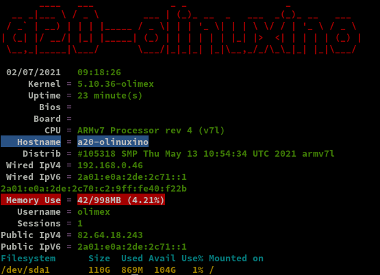

+++
title = 'Serveur Debian A20-OLinuXino-buster-minimal'
date = 2021-07-02 00:00:00 +0100
categories = ['olimex']
+++
# Olimex A20-olinuxino-Micro

[Documentation olimex](https://www.olimex.com/Products/olino/A20/A20-olinuxino-Micro-4GB/resources/A20-olinuxino-Micro.pdf)   
{:width="400"}

{:width="300"}  

## Installation A20-OLinuXino-buster-minimal

{:width="100"}

**Matériel**

* Carte olimex [A20-olinuxino-Micro ](https://www.olimex.com/Products/OLinuXino/A20/A20-OLinuXino-MICRO/open-source-hardware)
* Bloc Alimentation 10V 1A
* Dongle Wifi/USB RT5370
* Carte micro SD 4GO
* SSD 128GO
* Batterie Li-ion 3.7v 5000mAh

**SDcard**

SDcard créer avec les paquets debian armhf  
[Index of /release/a20](http://images.olimex.com/release/a20/)  

1. Télécharger **A20-OLinuXino-buster-minimal-20210513-112230.img.7z** (image du 06/11/2020) puis se rendre dans le répertoire contenant les fichiers 
2. Décompresser le fichier 
2. Insérer le lecteur USB/SDcard, relever le périphérique par `dmesg` , ex /dev/sdd
3. Ecriture image sur la SDcard :  
`sudo dd if=A20-OLinuXino-buster-minimal-20210513-112230.img of=/dev/sdd bs=4M`  

**Connexion liaison série**

Utilisation module USB/Série **/dev/ttyUSB0** et lancer **minicom** en root  
Insertion carte SD et mise sous tension A20-olinuxino-Micro   
L'image "debian" est prête à l'emploi sur la carte SD  

La connexion "root/olimex"

```
Linux a20-olinuxino 5.10.36-olimex #105318 SMP Thu May 13 10:54:34 UTC 2021 armv7l

The programs included with the Debian GNU/Linux system are free software;
the exact distribution terms for each program are described in the
individual files in /usr/share/doc/*/copyright.

Debian GNU/Linux comes with ABSOLUTELY NO WARRANTY, to the extent
permitted by applicable law.
root@a20-olinuxino:~# 
```

Relever l' adresse mac eth0 : `ip link`   
Activer la **DMZ de la Box internet** sur IP 192.168.0.46  
Ajout dans les baux statique de la box : **A20-olinuxino-micro** avec l'adresse IP 192.168.0.46 avec l'adresse mac `02:c2:09:40:f2:2b`
{: .prompt-info }


## Basculer SDcard vers HDD/SSD

### Préparer HDD/SSD /dev/sda

    fdisk /dev/sda

Effacer les partitions existantes ,option "d"  
 Créer une nouvelle partition primaire en tapant « n » puis « p ». Laisser par défaut la taille maximale. Sauvegarder les modifications en tapant « w ».

formater la partition du SSD sous le format .ext4

    mkfs.ext4 /dev/sda1

### Transfert SDcard &rarr; SSD

Le disque est formaté,  on va copier les données de la carte SD sur le SSD

    mkdir /tmp/ssd
    mount /dev/sda1 /tmp/ssd
    rsync -av --exclude 'tmp/*' --exclude 'boot' --exclude 'proc/*' --exclude 'sys/*' --exclude 'mnt/*'--exclude 'run/*' / /tmp/ssd/

Patienter plusieurs minutes...
{: .prompt-info }

Après transfert

    ls /tmp/ssd/

```
bin  etc   lib         media  opt   root  sbin  sys  uboot.env  var
dev  home  lost+found  mnt    proc  run   srv   tmp  usr
```

Démpontage /tmp/ssd/

    umount /tmp/ssd/

### Modifier le boot

boot à rediriger sur le disque `/dev/sda1`   

1. Ajouter `root=/dev/sda1` en fin du fichier `/boot/uEnv.txt`  &rarr; `echo "root=/dev/sda1" >> /boot/uEnv.txt`
2. Remplacer `root=PARTUUID=${partuuid}` par `root=${root}` dans le fichier `/boot/boot.cmd` &rarr; `sed -i s/root=PARTUUID=\$\{partuuid\}/root=\$\{root\}/g /boot/boot.cmd`

Compilation **boot.cmd** en **boot.scr**  
*u-boot-tools installé par défaut sinon : `apt install u-boot-tools`*

    mkimage -C none -A arm -T script -d /boot/boot.cmd /boot/boot.scr

```
Image Name:   
Created:      Fri Jul  2 06:42:59 2021
Image Type:   ARM Linux Script (uncompressed)
Data Size:    2197 Bytes = 2.15 KiB = 0.00 MiB
Load Address: 00000000
Entry Point:  00000000
Contents:
   Image 0: 2189 Bytes = 2.14 KiB = 0.00 MiB
```

Redémarrer : `reboot`
{: .prompt-info }

## Premier boot sur HDD/SSD

On se connecte en root 

    ssh root@192.168.0.46

Se connecter et vérifier avec `df-h` que sda1 est bien la partition principale

```
Filesystem      Size  Used Avail Use% Mounted on
udev            447M     0  447M   0% /dev
tmpfs           100M   11M   90M  11% /run
/dev/sda1       110G  690M  104G   1% /
tmpfs           500M     0  500M   0% /dev/shm
tmpfs           5.0M     0  5.0M   0% /run/lock
tmpfs           500M     0  500M   0% /sys/fs/cgroup
tmpfs           100M     0  100M   0% /run/user/0
```

**Freebox**  
NextHop Freebox permet d’attribuer une adresse IPV6  

Prefixe : 2a01:e0a:2de:2c71::/64  
Next Hop: fe80::c2:9ff:fe40:f22b  (fe80::7285:c2ff:fe53:cb80 carte ASRock QC5000M)  
Passerelle IPV6 Box : fe80::224:d4ff:fea6:aa20  

Pour une adresse IPV4 fixe relever Hwaddr adresse mac : `ip link`  
Ajout adresse ip 192.168.0.46 et Hwaddr : 02:c2:09:40:f2:2b dans les baux statiques  

**Adressage ipv4/ipv6**

{:width="70"}   

Modifier interface réseau debian pour l'adressage ip static sur IP V4 et V6

    nano /etc/network/interfaces.d/eth0

```bash
allow-hotplug eth0
iface eth0 inet dhcp

iface eth0 inet6 static
  address 2a01:e0a:2de:2c71::1
  netmask 64
```

**Date et heure serveur**  
Modifier le fichier `/etc/systemd/timesyncd.conf`

```
[Time]
NTP=145.238.203.14 145.238.203.10
```

Configurer la zone Europe/Paris et le ntp

    timedatectl set-timezone Europe/Paris
    timedatectl set-ntp true

Relancer le service

    systemctl daemon-reload
    systemctl restart systemd-timesyncd.service

Vérifier la zone et l'heure

    timedatectl status

```
               Local time: Fri 2021-07-02 08:52:32 CEST
           Universal time: Fri 2021-07-02 06:52:32 UTC
                 RTC time: Fri 2021-07-02 06:52:32
                Time zone: Europe/Paris (CEST, +0200)
System clock synchronized: yes
              NTP service: active
          RTC in local TZ: no
```

**Utilisateur olimex**  
Par défaut , dans l'image debian buster minimal, il y a un utilisateur nommé "olimex"  
Changer le mot de passe : `passwd olimex`  
Accès sudo `echo "olimex    ALL=(ALL) NOPASSWD: ALL" >> /etc/sudoers`  


Redémarrer : `reboot`
{: .prompt-info }


Vérifier les adresses IP : `ip a`

```bash
1: lo: <LOOPBACK,UP,LOWER_UP> mtu 65536 qdisc noqueue state UNKNOWN group default qlen 1000
    link/loopback 00:00:00:00:00:00 brd 00:00:00:00:00:00
    inet 127.0.0.1/8 scope host lo
       valid_lft forever preferred_lft forever
    inet6 ::1/128 scope host 
       valid_lft forever preferred_lft forever
2: eth0: <BROADCAST,MULTICAST,UP,LOWER_UP> mtu 1500 qdisc mq state UP group default qlen 1000
    link/ether 02:c2:09:40:f2:2b brd ff:ff:ff:ff:ff:ff
    inet 192.168.0.46/24 brd 192.168.0.255 scope global dynamic eth0
       valid_lft 43132sec preferred_lft 43132sec
    inet6 2a01:e0a:2de:2c71::1/64 scope global 
       valid_lft forever preferred_lft forever
    inet6 2a01:e0a:2de:2c70:c2:9ff:fe40:f22b/64 scope global dynamic mngtmpaddr 
       valid_lft 86329sec preferred_lft 86329sec
    inet6 fe80::c2:9ff:fe40:f22b/64 scope link 
       valid_lft forever preferred_lft forever
```

Version linux et debian: `uname -a`  

    Linux a20-olinuxino 5.10.36-olimex #105318 SMP Thu May 13 10:54:34 UTC 2021 armv7l GNU/Linux


Version debian : `cat /etc/debian_version`  

    10.9

**Historique de la ligne de commande**  
Ajoutez la recherche d’historique de la ligne de commande au terminal.
Tapez un début de commande précédent, puis utilisez shift + up (flèche haut) pour rechercher l’historique filtré avec le début de la commande.

```
# Global, tout utilisateur
echo '"\e[1;2A": history-search-backward' | sudo tee -a /etc/inputrc
echo '"\e[1;2B": history-search-forward' | sudo tee -a /etc/inputrc
```

**Hostname**

    hostnamectl

```
   Static hostname: a20-olinuxino
         Icon name: computer
        Machine ID: 4c47fd25b2354d7cb4076163658939ce
           Boot ID: 3a272b6297ab4f2fa17a54d8c4f84ccb
  Operating System: Debian GNU/Linux 10 (buster)
            Kernel: Linux 5.10.36-olimex
      Architecture: arm
```

Afficher les erreurs, le journal des logs

    sudo journalctl -p err

```
-- Logs begin at Fri 2021-07-02 08:54:41 CEST, end at Fri 2021-07-02 08:59:48 CEST. --
Jul 02 08:54:41 a20-olinuxino kernel: /cpus/cpu@0 missing clock-frequency property
Jul 02 08:54:41 a20-olinuxino kernel: /cpus/cpu@1 missing clock-frequency property
Jul 02 08:54:41 a20-olinuxino kernel: sun4i-usb-phy 1c13400.phy: Couldn't request ID GPIO
Jul 02 08:54:41 a20-olinuxino kernel: axp20x-i2c 0-0034: unsupported ramp value 1900
Jul 02 08:54:41 a20-olinuxino kernel: vddio-csi1: failed to set ramp_delay: -EINVAL
Jul 02 08:54:41 a20-olinuxino kernel: axp20x-regulator axp20x-regulator: Failed to register ldo3
Jul 02 08:54:44 a20-olinuxino kernel: sun4i-drm display-engine: attempt to add DMA range to existing map
```

Les erreurs ne sont pas critiques (pas de solution)
{: .prompt-warning }

### {:width=80"} OpenSSH, clé et script

**connexion avec clé**  
<u>sur un poste linux du réseau</u>
Générer une paire de clé curve25519-sha256 (ECDH avec Curve25519 et SHA2) nommé **xoyize-ed25519** pour une liaison SSH avec le serveur KVM.  

    ssh-keygen -t ed25519 -o -a 100 -f ~/.ssh/xoyize-ed25519

Le déploiement de la clé publique .pub sur l'hôte

    ssh-copy-id -i .ssh/xoyize-ed25519.pub olimex@192.168.0.46

Vérifier la connexion ssh `ssh olimex@192.168.0.46` et modifier le paramètre `PasswordAuthentication no` ainsi que le n° de port dans le fichier `/etc/ssh/sshd_config` de l'hôte et relancer le service sshd `sudo systemctl restart sshd`  
Tester la connexion ssh depuis le poste linux sur le réseau

    ssh olimex@192.168.0.46 -p 55035 -i /home/yann/.ssh/xoyize-ed25519

Mise à jour debian

    sudo apt update && sudo apt ugrade

Installer utilitaires et compléments 

    sudo apt install tmux figlet dnsutils net-tools tree git curl jq imagemagick -y

Motd

    sudo rm /etc/motd && sudo nano /etc/motd

```
        ___  __             _  _                  _            
  __ _ |_  )/  \  ___  ___ | |(_) _ _  _  _ __ __(_) _ _   ___ 
 / _` | / /| () ||___|/ _ \| || || ' \| || |\ \ /| || ' \ / _ \
 \__,_|/___|\__/      \___/|_||_||_||_|\_,_|/_\_\|_||_||_|\___/
       __ __ ___  _  _ (_) ___ ___    __ __ _  _  ___          
       \ \ // _ \| || || ||_ // -_) _ \ \ /| || ||_ /          
       /_\_\\___/ \_, ||_|/__|\___|(_)/_\_\ \_, |/__|          
                  |__/                      |__/               
```


Script ssh_rc_bash

>ATTENTION!!! Les scripts sur connexion peuvent poser des problèmes pour des appels externes autres que ssh

    wget https://static.xoyaz.xyz/files/ssh_rc_bash
    chmod +x ssh_rc_bash # rendre le bash exécutable
    ./ssh_rc_bash        # exécution



### {:width="30"} Domaine xoyize.xyz

Zone dns OVH

```
$TTL 3600
@	IN SOA dns106.ovh.net. tech.ovh.net. (2021050900 86400 3600 3600000 300)
              IN NS     ns106.ovh.net.
              IN NS     dns106.ovh.net.
              IN MX     10 xoyize.xyz.
              IN AAAA   2a01:e0a:2de:2c71::1
              IN CAA    128 issue "letsencrypt.org"
              IN TXT    "v=spf1 a mx -all"
*             IN AAAA   2a01:e0a:2de:2c71::1
_dmarc        IN TXT    "v=DMARC1; p=none"
```

### curl

**Problème lors de l'utilisation de curl**  
curl https://curl.haxx.se/ca/cacert.pem curl: (60) SSL certificate problem: unable to get local issuer certificate More details here: https://curl.haxx.se/docs/sslcerts/
{: .prompt-danger }

Correction issue du forum IBM [curl: (60) SSL certificate problem](https://www.ibm.com/mysupport/s/question/0D50z00005q4FheCAE/curl-60-ssl-certificate-problem-unable-to-get-local-issuer-certificate?language=fr)


This is the type of error you will get if your trusted CA list is out of date. Consult your operating system vendor and see if they have a solution like a CA updating utility. If you cannot find this information or if you really just want to do things the long manual way, do the following:  
Find your new SSL  
The commands below will output the SSL version that is found in your $PATH and report the version and the configuration directory.  
openssl version &rarr; `OpenSSL 1.1.1d  10 Sep 2019`   
openssl version -d &rarr; `OPENSSLDIR: "/usr/lib/ssl"`  

Update the trusted certificate directoryDownload the certificate pem file <https://curl.haxx.se/ca/cacert.pem>  
Copy the file or the contents of the file to the certificate directory directory.

```bash
sudo -s
cd /usr/lib/ssl/certs 
#cp /tmp/cacert.pem .
wget https://curl.haxx.se/ca/cacert.pem
```

Update the certificates directory so OpenSSL can use them

    c_rehash /usr/lib/ssl/certs

```
Doing /usr/lib/ssl/certs
WARNING: Skipping duplicate certificate ca-certificates.crt
WARNING: Skipping duplicate certificate ca-certificates.crt
WARNING: Skipping duplicate certificate cacert.pem
WARNING: Skipping duplicate certificate cacert.pem
```

That's it now it should be working as expected. If you have two ssl installations and you're not sure which certificate directory is in use you might want to do this to both of them.

### {:width="100"}Certificats xoyize.xyz

Installer acme 

```
cd ~
sudo apt install socat git -y # prérequis
git clone https://github.com/acmesh-official/acme.sh.git
cd acme.sh
./acme.sh --install 
```

Déconnexion reconnexion 

    export OVH_AK="xxxxxxxxxxxxxxxxx"
    export OVH_AS="xxxxxxxxxxxxxxxxxxxxxxxxxxxxxxxxxxxx"

Générer les certificats pour le domaine xoyize.xyz

    acme.sh --dns dns_ovh --server letsencrypt --ocsp --issue --keylength ec-384 -d 'xoyize.xyz' -d '*.xoyize.xyz'

Aller sur le lien qui est donné pour valider la demande et relancer la commande ci dessus.

```
[Tue 29 Dec 09:11:49 CET 2020] Your cert is in  /home/olimex/.acme.sh/xoyize.xyz_ecc/xoyize.xyz.cer 
[Tue 29 Dec 09:11:49 CET 2020] Your cert key is in  /home/olimex/.acme.sh/xoyize.xyz_ecc/xoyize.xyz.key 
[Tue 29 Dec 09:11:49 CET 2020] The intermediate CA cert is in  /home/olimex/.acme.sh/xoyize.xyz_ecc/ca.cer 
[Tue 29 Dec 09:11:49 CET 2020] And the full chain certs is there:  /home/olimex/.acme.sh/xoyize.xyz_ecc/fullchain.cer 
```

Installation des certificats

```
sudo mkdir -p /etc/ssl/private/
sudo chown $USER -R /etc/ssl/private/
acme.sh --ecc --install-cert -d xoyize.xyz -d map.xoyize.xyz --key-file /etc/ssl/private/xoyize.xyz-key.pem --fullchain-file /etc/ssl/private/xoyize.xyz-fullchain.pem --reloadcmd 'sudo systemctl reload nginx.service'
```

Vérification et mise à jour automatique  
$ `crontab -e`  # edite tous les jobs de l'utilisateur en cours

```
11 0 * * * "/home/olimex/.acme.sh"/acme.sh --cron --home "/home/olimex/.acme.sh" --renew-hook "/home/olimex/.acme.sh/acme.sh --ecc --install-cert -d xoyize.xyz --key-file /etc/ssl/private/xoyize.xyz-key.pem --fullchain-file /etc/ssl/private/xoyize.xyz-fullchain.pem --reloadcmd 'sudo systemctl reload nginx.service'" > /dev/null
```

### {:width="50"} Parefeu UFW (ACTIF)

*UFW, ou pare - feu simple , est une interface pour gérer les règles de pare-feu dans Arch Linux, Debian ou Ubuntu. UFW est utilisé via la ligne de commande (bien qu'il dispose d'interfaces graphiques disponibles), et vise à rendre la configuration du pare-feu facile (ou simple).*

Installation **Debian / Ubuntu**

    sudo apt install ufw

*Par défaut, les jeux de règles d'UFW sont vides, de sorte qu'il n'applique aucune règle de pare-feu, même lorsque le démon est en cours d'exécution.*   

Les règles 

```bash
sudo ufw allow 55035/tcp  # port SSH , 55035
#sudo ufw allow http       # port 80
sudo ufw allow https      # port 443
sudo ufw allow DNS        # port 53
```

Activer le parefeu

    sudo ufw enable

```
Command may disrupt existing ssh connections. Proceed with operation (y|n)? y
Firewall is active and enabled on system startup
```

Status

     sudo ufw status verbose

```
Status: active
Logging: on (low)
Default: deny (incoming), allow (outgoing), disabled (routed)
New profiles: skip

To                         Action      From
--                         ------      ----
55035/tcp                  ALLOW IN    Anywhere                  
443/tcp                    ALLOW IN    Anywhere                  
53 (DNS)                   ALLOW IN    Anywhere                  
55035/tcp (v6)             ALLOW IN    Anywhere (v6)             
443/tcp (v6)               ALLOW IN    Anywhere (v6)             
53 (DNS (v6))              ALLOW IN    Anywhere (v6)             
```

## {:width="50"} Nginx

Passer en mode su : `sudo -s`
{: .prompt-info }

**Nginx présent dans le dépôt debian buster**  
Installer nginx

    apt install nginx

Oter le commentaire de la ligne `server_tokens off;` dans la configuration de base `/etc/nginx/nginx.conf`

* **worker_processes** : laisser **auto** ou pour profiter pleinement de la puissance de votre serveur, il est recommandé de mettre autant de worker_processes que de cœurs disponibles sur votre serveur. Pour connaître le nombre de cœurs sur votre serveur, il suffit de lancer la commande : `grep processor /proc/cpuinfo | wc -l`
* **server_tokens** : pour des raisons de sécurité, il est recommandé de désactiver l'envoi d'informations telles que le numéro de version de votre Nginx. Pour cela, décommentez cette directive dans le bloc http.  

Relancer nginx : `systemctl restart nginx`


### xoyize.xyz

Configuration par défaut

    rm /etc/nginx/sites-enabled/default # effacer la config par défaut

Créer un dossier et un fichier de configuration avec le nom du domaine et le dossier racine web

    mkdir -p /etc/nginx/conf.d/xoyize.xyz.d
    touch /etc/nginx/conf.d/xoyize.xyz.conf
    mkdir -p /var/www/default

Le fichier de configuration web `xoyize.xyz.conf`

    nano /etc/nginx/conf.d/xoyize.xyz.conf

```
server {
    listen 80;
    listen [::]:80;
    server_name xoyize.xyz;
    return 301 https://$host$request_uri;
}
server {
    listen 443 ssl http2;
    listen [::]:443 ssl http2;
    server_name xoyize.xyz;
    ssl_certificate /etc/ssl/private/xoyize.xyz-fullchain.pem;
    ssl_certificate_key /etc/ssl/private/xoyize.xyz-key.pem;

    root /var/www/default;
    index index/;

    # TLS 1.3 only
    ssl_protocols TLSv1.3;
    ssl_prefer_server_ciphers off;
 
    # HSTS (ngx_http_headers_module is required) (63072000 seconds)
    add_header Strict-Transport-Security "max-age=63072000" always;
 
	# Virtual Host Configs
	include /etc/nginx/conf.d/xoyize.xyz.d/*.conf;

    # OCSP stapling
    ssl_stapling on;
    ssl_stapling_verify on;
 
    # verify chain of trust of OCSP response using Root CA and Intermediate certs
    ssl_trusted_certificate /etc/ssl/private/xoyize.xyz-fullchain.pem;
 
    # replace with the IP address of your resolver
    resolver 1.1.1.1;

}
```

Vérification et relance

    nginx -t
    systemctl start nginx

Image sur la page d'accueil (facultatif)  
Déposer une image (https://unsplash.com) dans le dossier `/var/www/default`  
Créer un fichier `/var/www/default/index/`  

```hmtl
<!DOCTYPE/>
/>
<head>
 <meta charset="UTF-8"> 
 <title>a20-olinuxino</title>
<style type="text/css" media="screen" >
html { 
  margin:0;
  padding:0;
  background: url(wallpaper.jpg) no-repeat center fixed; 
  -webkit-background-size: cover; /* pour anciens Chrome et Safari */
  background-size: cover; /* version standardisée */
}
body { color: white; }
a:link {
  color: grey;
  background-color: transparent;
  text-decoration: none;
}
a:hover {
  color: red;
  background-color: transparent;
  text-decoration: underline;
}

</style>

</head>
<body>

<h1>a20-olinuxino</h1>
<p>If you see this page, the nginx web server is successfully installed and
working. Further configuration is required.</p>

<p>For online documentation and support please refer to
<a href="http://nginx.org/">nginx.org</a>.<br/>
Commercial support is available at
<a href="http://nginx.com/">nginx.com</a>.</p>

<p><em>Thank you for using nginx.</em></p>

</body>
</>
```

Lien https://xoyize.xyz

---

### Cartographie

Une copie du dossier osm-new de PC1 et un domaine map.xoyize.xyz  
En mode sudo  
Le fichier de configuration web `map.xoyize.xyz.conf`

    nano /etc/nginx/conf.d/map.xoyize.xyz.conf

```
server {
    listen 80;
    listen [::]:80;
    server_name map.xoyize.xyz;
    return 301 https://$host$request_uri;
}
server {
    listen 443 ssl http2;
    listen [::]:443 ssl http2;
    server_name map.xoyize.xyz;
    ssl_certificate /etc/ssl/private/xoyize.xyz-fullchain.pem;
    ssl_certificate_key /etc/ssl/private/xoyize.xyz-key.pem;

    root /home/olimex/osm-new;
    index index/;

    # TLS 1.3 only
    ssl_protocols TLSv1.3;
    ssl_prefer_server_ciphers off;
 
    # HSTS (ngx_http_headers_module is required) (63072000 seconds)
    add_header Strict-Transport-Security "max-age=63072000" always;
 
	# Virtual Host Configs
	include /etc/nginx/conf.d/xoyize.xyz.d/*.conf;

    # OCSP stapling
    ssl_stapling on;
    ssl_stapling_verify on;
 
    # verify chain of trust of OCSP response using Root CA and Intermediate certs
    ssl_trusted_certificate /etc/ssl/private/xoyize.xyz-fullchain.pem;
 
    # replace with the IP address of your resolver
    resolver 1.1.1.1;

}
```

Vérification et relance

    nginx -t
    systemctl start nginx


## Monitorer débit internet (INACTIF)

Installation voir le lien [InfluxDB Telegraf Grafana NEW](/posts/InfluxDB-Telegraf-Grafana-NEW/)

Connexion sur la page "grafana" via ssh

    ssh -L 9000:localhost:3000 olimex@192.168.0.46 -p 55035 -i /home/yann/.ssh/xoyize-ed25519

Connexion locale <http://localhost:9000>, utilisateur "admin" avec mot de passe .  

## Hotspot Wifi + DHCP (INACTIF)

* [Point d'accès wifi sur Tor avec Raspberry](https://debian-facile.org/doc:reseau:wifi:raspberry:hotspot:tor)

#### Configuration serveur DHCP

Désactiver l'actuel service DHCP

    systemctl list-unit-files |grep "dhcp"
    #   dhcpcd.service                             enabled        
    sudo systemctl stop dhcpcd.service
    sudo systemctl disable dhcpcd.service

[Installer et configurer un serveur DHCP sous Debian](https://neptunet.fr/dhcp-linux/)  
Pour mettre en place le service DHCP dans notre réseau local, nous allons utiliser le paquet isc-dhcp-server.

    sudo apt install isc-dhcp-server

sur quel interface du serveur, le “démon” (le “service”) va écouter et donc attendre les requêtes des clients

    nano /etc/default/isc-dhcp-server

```
# On what interfaces should the DHCP server (dhcpd) serve DHCP requests?
#       Separate multiple interfaces with spaces, e.g. "eth0 eth1".
INTERFACESv4="wlx7cdd905f687b"
#INTERFACESv6=""
```

éditer le fichier dhcpd.conf pour configurer le service DHCP :

    sudo nano /etc/dhcp/dhcpd.conf

```
authoritative;
default-lease-time 600;
max-lease-time 7200;
subnet 192.168.42.0 netmask 255.255.255.0
{
        option subnet-mask 255.255.255.0;
        option broadcast-address 192.168.42.255;
        option routers 192.168.42.1;
        option domain-name-servers 192.168.42.1;
        range 192.168.42.1 192.168.42.100;
}

```

Relancer le service :`sudo systemctl restart isc-dhcp-server`

#### DNS Unbound

Ajouter la ligne suivante 

    access-control: 192.168.42.0/24 allow

au fichier de configuration unbound

    /etc/unbound/unbound.conf.d/olimex.conf

```
server:
    # Si aucun fichier journal n'est spécifié, syslog est utilisé
    # logfile: "/var/log/unbound/unbound.log"
    verbosity: 0

    interface: 0.0.0.0
    port: 53
    do-ip4: yes
    do-udp: yes
    do-tcp: yes

    # Peut être réglé sur oui si vous disposez d'une connectivité IPv6
    do-ip6: no

    # Vous voulez laisser cela à non, à moins d'avoir *l'IPv6 natif*. Avec 6to4 et
    # Les tunnels Terredo votre navigateur web devrait favoriser IPv4 pour les mêmes raisons
    prefer-ip6: no

    # N'utilisez ceci que lorsque vous avez téléchargé la liste des serveurs racine primaires !
    # Si vous utilisez le paquet dns-root-data par défaut, unbound le trouvera automatiquement
    root-hints: "/var/lib/unbound/root.hints"

    # Trust glue only if it is within the server's authority
    # Ne faire confiance à la colle que si elle est sous l'autorité du serveur
    harden-glue: yes

    # IPs authorisés à accéder au serveur DNS
    access-control: 0.0.0.0/0 refuse
    access-control: 127.0.0.1 allow
    access-control: 192.168.0.0/24 allow
    access-control: 192.168.42.0/24 allow
```

Relancer le service :`sudo systemctl restart unbound unbound-resolvconf`

#### Configuration interface wifi point d'accès

Installation d'un point d'accès Wifi avec dhcp pour fournir des adresses ip aux clients wifi  
Dongle USB/WIFI : `lsusb`  
Bus 001 Device 002: ID 148f:5370 Ralink Technology, Corp. RT5370 Wireless Adapter

On vérifie ensuite les modes supportés par l’adaptateur :

    sudo -s
    iw list

Dans la catégorie `Supported interface modes` il faut que le mode mode `AP (Access Point)` soit présent.

```
[...]
	Supported interface modes:
		 * IBSS
		 * managed
		 * AP
		 * monitor
		 * P2P-client
		 * P2P-GO
[...]
```

les interfaces réseau

	ip link

```
1: lo: <LOOPBACK,UP,LOWER_UP> mtu 65536 qdisc noqueue state UNKNOWN mode DEFAULT group default qlen 1000
    link/loopback 00:00:00:00:00:00 brd 00:00:00:00:00:00
2: dummy0: <BROADCAST,NOARP,UP,LOWER_UP> mtu 1500 qdisc noqueue state UNKNOWN mode DEFAULT group default qlen 1000
    link/ether 7e:f4:1e:57:1b:3e brd ff:ff:ff:ff:ff:ff
3: eth0: <BROADCAST,MULTICAST,UP,LOWER_UP> mtu 1500 qdisc mq state UP mode DEFAULT group default qlen 1000
    link/ether 02:c2:09:40:f2:2b brd ff:ff:ff:ff:ff:ff
4: wlx7cdd905f687b: <NO-CARRIER,BROADCAST,MULTICAST,UP> mtu 1500 qdisc mq state DOWN mode DORMANT group default qlen 1000
    link/ether 52:dc:f6:7d:31:94 brd ff:ff:ff:ff:ff:ff
```

**Interface WIFI**  
Définir l'interface WIFI avec une IP statique

    sudo nano /etc/network/interfaces.d/wlx7cdd905f687b 

```
#allow-hotplug wlx7cdd905f687b
iface wlx7cdd905f687b inet static
  address 192.168.42.1
  netmask 255.255.255.0
```

Ajout manuel de l'adresse IP

    sudo ip address add 192.168.42.1/24 dev wlx7cdd905f687b


#### Configuration point d'accès

**HostApd**  
[Configurer un hotspot ouvert (via hostapd) qui est filtré par adresse mac en utilisant UFW et DNS personnalisé via dnsmasq](https://ubuntuplace.info/questions/262318/configurer-un-hotspot-ouvert-hostapd-qui-est-filtre-par-adre)  
Installer  **hostapd** et les outils wifi

	sudo apt install hostapd wireless-tools wpasupplicant

**Configurer HostApd** , éditer ou créer le fichier **hostapd.conf**

	sudo nano /etc/hostapd/hostapd.conf 

```
interface=wlx7cdd905f687b
driver=nl80211
ssid=YanHotSpot
hw_mode=g
channel=5
macaddr_acl=0
auth_algs=1
ignore_broadcast_ssid=0
wpa=2
wpa_passphrase=passphrase_YanHotSpot
wpa_key_mgmt=WPA-PSK
wpa_pairwise=TKIP
rsn_pairwise=CCMP
```

Modifier le fichier **/etc/default/hostapd** 

	sudo nano /etc/default/hostapd

	DAEMON_CONF="/etc/hostapd/hostapd.conf"

Relancer le service :`sudo systemctl restart hostapd`

Si le servie est masqué, "unmask" service hostapd et lancement

    sudo systemctl unmask hostapd
    sudo systemctl start hostapd

#### Configuration du NAT iptables

relayer les paquets  vers l’internet et traiter les paquets retours (modifier /etc/sysctl.conf)

```
sudo -s
sed -i 's/^#net.ipv4.ip_forward=1/net.ipv4.ip_forward=1/' /etc/sysctl.conf
sed -i 's/^#net.ipv6.conf.all.forwarding=1/net.ipv6.conf.all.forwarding=1/' /etc/sysctl.conf
sysctl -p # prise en compte immédiate
```

**NAT - Iptables - IP Forwarding (ACTIF)**  
Ajouter au fichier `/sbin/iptables-firewall.sh`

```
# NAT
iptables -t nat -A POSTROUTING -o eth0 -j MASQUERADE
iptables -A FORWARD -i eth0 -o wlx7cdd905f687b -m state --state RELATED,ESTABLISHED -j ACCEPT
iptables -A FORWARD -i wlx7cdd905f687b -o eth0 -j ACCEPT
```

Relancer le service `sudo systemctl restart iptables-firewall`   
Vérification

    iptables -t nat -S

```
-P PREROUTING ACCEPT
-P INPUT ACCEPT
-P POSTROUTING ACCEPT
-P OUTPUT ACCEPT
-A POSTROUTING -o eth0 -j MASQUERADE
```

**NAT - UFW - IP Forwarding (INACTIF)**  
[How to set up UFW port forwarding](https://bobcares.com/blog/ufw-port-forwarding/)  
[Port forwarding et ufw](https://sulek.fr/index.php?article38/port-forwarding-et-ufw)  
Pour mettre en place le port forwarding avec ufw  
Ajouter en fin du fichier `/etc/ufw/before.rules`  

```
# règles pour la table NAT
*nat
:POSTROUTING ACCEPT [0:0]
# Forward traffic through eth0 
-A POSTROUTING -s 192.168.55.0/24 -o eth0 -j MASQUERADE

COMMIT
```

#### Désactiver le hotspot wifi

Arrêt et désactivation service hostapd

    sudo systemctl stop hostapd
    sudo systemctl disable hostapd

Supprimer l'interface wifi

    sudo rm /etc/network/interfaces.d/wlx7cdd905f687b 

Retirer le dongle USB/WIFI  
Redémarrer la machine

    sudo systemctl reboot

## Domotique

[A20-Olinuxino - Domoticz logiciel de gestion et de contrôle domotique](/posts/A20-Olinuxino-Domoticz-logiciel-de-gestion-et-de-controle-domotique/)


## {:width="50"} NFS

*NFS (Network File System) est un protocole qui permet d'accéder à des fichiers via le réseau. Il est basé sur le protocole RPC (Remote Procedure Call). Les clients montent la partition de la machine distante comme si c'était un disque local.*

En mode su

    sudo -s


### NFS - Serveur

**Installation serveur NFS**

    apt install nfs-kernel-server

Vérification de l'installation

Exécuter rpcinfo pour confirmer que le serveur est lancé, et accepte les requêtes sur le port 2049 (UDP et TCP).  

    rpcinfo -p | grep nfs 

```
    100003    3   tcp   2049  nfs
    100003    4   tcp   2049  nfs
    100003    3   udp   2049  nfs
```

Vérifier que le système supporte effectivement NFS:  

    cat /proc/filesystems | grep nfs

```
nodev	nfs
nodev	nfs4
nodev	nfsd
```

Si la commande précédente ne renvoie rien, il se peut que le module NFS ne soit pas chargé, auquel cas, il faut le charger `modprobe nfs`   
Enfin, vérifions que portmap attend les instructions sur le port 111  

    rpcinfo -p | grep portmap

```
    100000    4   tcp    111  portmapper
    100000    3   tcp    111  portmapper
    100000    2   tcp    111  portmapper
    100000    4   udp    111  portmapper
    100000    3   udp    111  portmapper
    100000    2   udp    111  portmapper
```


**Sécurisation NFS**

{:width="40"} 

Le protocole RPC n'a pas la réputation d'être bien sécurisé, mais la version 4 de NFS entend corriger ce problème, elle est donc à privilégier. Il est déconseillé d'effectuer un partage NFS via internet, ou bien dans ce cas, opter pour un tunnel crypté.

* S'assurer que les partages sont réservés à certaines IP dans /etc/exports
* S'appuyer sur rpcbind (/etc/hosts.deny et /etc/hosts.allow) pour sécuriser l'accès au serveur NFS
* Configurer convenablement iptables

**hosts.deny , hosts.allow**  
Tout le monde est interdit, puis le LAN est autorisé:  

```bash
echo "rpcbind mountd nfsd statd lockd rquotad : ALL" >> /etc/hosts.deny
echo "rpcbind mountd nfsd statd lockd rquotad: 192.168.0." >> /etc/hosts.allow
```

**iptables (NFS)**  
Par défaut, les différents services NFS (lockd, statd, mountd, etc.) demandent des assignations de ports aléatoires à partir du portmapper (portmap/rpcbind), ce qui signifie que la plupart des administrateurs doivent ouvrir une gamme de ports dans leur base de règles de pare-feu pour que NFS fonctionne.  

Il va donc falloir fixer les ports de ces services afin de créer les règles iptables.  

```bash
echo 'STATDOPTS="--port 32765 --outgoing-port 32766"' >> /etc/default/nfs-common
echo 'RPCMOUNTDOPTS="-p 32767"' >> /etc/default/nfs-kernel-server
echo 'RPCRQUOTADOPTS="-p 32769"' >> /etc/default/quota
```

Relance sysctl  

	sysctl --system

```bash
* Applying /etc/sysctl.d/99-sysctl.conf ...
* Applying /etc/sysctl.d/protect-links.conf ...
fs.protected_hardlinks = 1
fs.protected_symlinks = 1
* Applying /etc/sysctl.conf ...
```

Relancer le service  

	systemctl restart nfs-kernel-server

**NFS - Ajout des règles parefeu UFW**

Voici les règles à fixer dans le parefeu

    ufw allow from 192.168.0.0/24 to any port 111,2049,32764:32769 proto tcp
    ufw allow from 192.168.0.0/24 to any port 111,2049,32764:32769 proto udp

Vérification 

    ufw status

```bash
Status: active

To                         Action      From
--                         ------      ----
55035/tcp                  ALLOW       Anywhere                  
80/tcp                     ALLOW       Anywhere                  
443/tcp                    ALLOW       Anywhere                  
DNS                        ALLOW       Anywhere                  
111,2049,32764:32769/tcp   ALLOW       192.168.0.0/24            
111,2049,32764:32769/udp   ALLOW       192.168.0.0/24            
55035/tcp (v6)             ALLOW       Anywhere (v6)             
80/tcp (v6)                ALLOW       Anywhere (v6)             
443/tcp (v6)               ALLOW       Anywhere (v6)             
DNS (v6)                   ALLOW       Anywhere (v6)   
```

**NFS - Ajout des règles parefeu Iptables**

Ajouter au fichier `/sbin/iptables-firewall.sh`

```
# NFS
iptables -t filter -A INPUT -s 192.168.0.0/24 -p tcp -m multiport --ports 111,2049,32764:32769 -j ACCEPT
iptables -t filter -A INPUT -s 192.168.0.0/24 -p udp -m multiport --ports 111,2049,32764:32769 -j ACCEPT
```

Relancer le service `sudo systemctl restart iptables-firewall`

### NFS - partage

* [Les Access Control List : Gestion avancée des droits sous linux](https://doc.ubuntu-fr.org/acl)

Installer acl

    apt install acl

>si la partition concernée par le partage est de type ext4 le support des acl est actif par défaut: l'option de montage "acl" a été remplacée par "noacl", qui devient donc celle à utiliser si on veut… désactiver le support des acl.

**Configurer le partage NFS avec SetGID**

*Quand un répertoire est «setgidé », le comportement observé change. On ne parle alors plus de droits d’exécution mais d’appartenance. En effet, tous les fichiers ou sous-répertoires qui seraient créés dans un tel répertoire, appartiendraient automatiquement au groupe auquel appartient le dossier. Si plusieurs utilisateurs peuvent et/ou doivent travailler dans un même répertoire par exemple, on peut positionner le droit SETGID sur ce répertoire afin que tous les utilisateurs puissent accéder à son contenu sans restrictions liées au propriétaire qui a créé le fichier ou le sous-répertoire.*

Créer un dossier qui sera partagé sur le réseau local 

    mkdir -p /xoyipart

Montage de la partition 2 du disque SSD /dev/sda

    blkid | grep "/dev/sda2"   # relever uuid 
    
```
/dev/sda2: UUID="0a446c5a-ed92-45be-b56d-8306bc27b603" TYPE="ext4" PARTUUID="7a706cab-02"                     
```

Ajout au fichier fstab

    nano /etc/fstab

```
# /dev/sda2
UUID=0a446c5a-ed92-45be-b56d-8306bc27b603 /xoyipart         ext4    defaults 0 2
```        

Montage manuel

    mount -a

**Partager /xoyipart/**


indiquer au serveur les répertoires qui seront partagés, les machines qui y auront accès et les conditions de ce partage.  

	nano /etc/exports

Ajouter en fin de fichier **/etc/exports**  

```
#/xoyipart                                   192.168.0.0/24(rw,sync,no_subtree_check,no_root_squash)
/xoyipart                                   192.168.0.0/24(rw,no_subtree_check,no_root_squash)

```

Exporter

    exportfs -ar

Pour vérifier que l'export a bien eu lieu, taper sur le serveur NFS la commande :

    showmount -e 192.168.0.46

```
Export list for xoyize.xyz:
/xoyipart 192.168.0.0/24
```

Nous devons configurer SetGID dans ce répertoire, comme indiqué ci-dessous.

    chmod 2775 /xoyipart

Cela a également défini les autorisations 775 sur le répertoire, de sorte que l'utilisateur racine et le groupe défini disposent d'autorisations complètes. Le 2 permet setgid.

Ensuite, nous créons un groupe appelé 'local' et modifions le répertoire /xoyipart afin que le propriétaire du groupe soit ce groupe 'local'.  
Nous spécifions également manuellement le GID qui sera utilisé pour le groupe en tant que 9999; il doit s'agir d'un <u>numéro libre sur votre client et votre serveur</u>.

Exécuter `groupadd` sur le client et sur le serveur, et ajouter un (ou plusieurs) utilisateur à ce groupe.

```bash
sudo groupadd -g 9999 local      # sur client et serveur
# ajout utilisateur au groupe
sudo usermod -a -G local $USER   # sur client et serveur
sudo chgrp local /xoyipart           # serveur uniquement
```

**Droits ACL**  
Donner les droits ACL en lecture,écriture et exécution à l'utilisateur $USER et au groupe local

    sudo setfacl -Rm u:$USER:rwx,g:local:rwx /xoyipart/

Désormais, tous les fichiers ou répertoires créés dans `/xoyipart` se verront automatiquement attribuer le propriétaire du groupe *'local*, ce qui permettra essentiellement la collaboration de groupe, car tout utilisateur appartenant au groupe *local* pourra désormais accéder aux fichiers créés par d'autres utilisateurs du même groupe dans le répertoire `/xoyipart`
{: .prompt-info }

>**NE PAS OUBLIER DE SE DECONNECTER/CONNECTER**

Nous pouvons confirmer que setgid est en place, comme indiqué ci-dessous, où le bit d'exécution pour les autorisations de groupe est une minuscule. Cela passera à une majuscule S si le groupe ne dispose pas de l'autorisation d'exécution et que seul setgid est en place.

    ls -la /xoyipart/  # signe + pour les acl

```
[...]
drwxrwsr-x+  2 root local 4096 Mar 11 08:30 .
[...]
```

### NFS - Client

[Partage de disques en réseau avec NFS](https://doc.fedora-fr.org/wiki/Partage_de_disques_en_r%C3%A9seau_avec_NFS)  

Installer nfs-utils avec la commande

    sudo pacman -S nfs-utils    # archlinux
    sudo apt install nfs-common # debian

Créer un point de montage NFS

    sudo mkdir -p /mnt/xoyipart

Le partage NFS (`/etc/hosts` contient la définition du serveur : `192.168.0.46 xoyize.xyz`)

    sudo showmount -e xoyize.xyz

```
Export list for xoyize.xyz:
/xoyipart 192.168.0.0/24
```

Montage manuel

    sudo mount -t nfs 192.168.0.46:/xoyipart /mnt/xoyipart

Montage automatique à la demande avec timeout via fstab et x-systemd

    sudo nano /etc/fstab

```
192.168.0.46:/xoyipart/ /mnt/xoyipart/	nfs	x-systemd.automount,x-systemd.idle-timeout=300,async	0 0
```

Vérifier 

    sudo mount -a

### Partage manuel de fichier via SSHFS

On va utiliser SSHFS pour partager un dossier hôte avec l'invité debian  
Installer sshfs sur l'invité

    sudo apt install sshfs

Créer un jeu de clé pour se connecter à l'hote en SSH

    ssh-keygen -t ed25519 -o -a 100 -f ~/.ssh/accesspc1

Le déploiement de la clé publique .pub sur l'hôte

    ssh-copy-id -i .ssh/accesspc1.pub yann@192.168.0.42 # ou par copier/coller la clé publique dans le fichier .ssh/authorized_keys du distant

```
Number of key(s) added: 1

Now try logging into the machine, with:   "ssh 'yann@192.168.0.42'"
and check to make sure that only the key(s) you wanted were added.
```

Vérifier la connexion ssh `ssh yann@192.168.0.42`

Pour une connexion avec clé sans mot de passe, modifier le paramètre `PasswordAuthentication no` dans le fichier `/etc/ssh/sshd_config` de l'hôte et relancer le service sshd `sudo systemctl restart sshd`  
Tester la connexion avec clé depuis l'invité

    ssh -i ~/.ssh/accesspc1 yann@192.168.0.42

Création dossier sur l'invité et droits

    sudo mkdir /var/www/devel
    sudo chown $USER.www-data -R /var/www/devel

Montage manuel

    # montage syntaxe: sshfs -oIdentityFile=<clé privée> utilisateur@domaine.tld:<dossier distant> <dossier local> -C -p <port si différent de 22>
    sshfs -oIdentityFile=~/.ssh/accesspc1 yann@192.168.0.42:/home/yann/media/devel /var/www/devel -C 
    # démontage syntaxe: fusermount -u <dossier local>
    fusermount -u /var/www/devel

## DNS Unbound

Unbound est un résolveur de DNS validant, récursif, et mettant en cache. Il est conçu pour être rapide et simple et intègre des fonctionnalités modernes basées sur des normes ouvertes.   
La configuration de Unbound DNS avec votre installation Pi-hole nous permet d'exploiter notre propre petit serveur DNS récursif au lieu de dépendre (et d'envoyer des données à) de grands acteurs comme Google ou Cloudflare.  
[[Tuto] Qu'est-ce qu'un serveur DNS et comment en installer un ?](https://www.pofilo.fr/post/20180630-dns-unbound/)

Pour installer Unbound 

    sudo apt install unbound

Ensuite, nous devrons télécharger un fichier `root.hints` pour remplacer les hints intégrés :

    wget https://www.internic.net/domain/named.root -qO- | sudo tee /var/lib/unbound/root.hints

**Configurer le DNS Unbound**  
Unbound comprend de nombreuses options de configuration différentes que vous pouvez ajuster et essayer. N'hésitez pas à consulter la [documentation du fichier de configuration de Unbound (en)](https://www.nlnetlabs.nl/documentation/unbound/unbound.conf/) pour obtenir des détails sur chaque option.

Pour commencer, créer le fichier de configuration Unbound 

    sudo nano /etc/unbound/unbound.conf.d/olimex.conf

```
server:
    # Si aucun fichier journal n'est spécifié, syslog est utilisé
    # logfile: "/var/log/unbound/unbound.log"
    verbosity: 0

    interface: 0.0.0.0
    port: 53
    do-ip4: yes
    do-udp: yes
    do-tcp: yes

    # Peut être réglé sur oui si vous disposez d'une connectivité IPv6
    do-ip6: no

    # Vous voulez laisser cela à non, à moins d'avoir *l'IPv6 natif*. Avec 6to4 et
    # Les tunnels Terredo votre navigateur web devrait favoriser IPv4 pour les mêmes raisons
    prefer-ip6: no

    # N'utilisez ceci que lorsque vous avez téléchargé la liste des serveurs racine primaires !
    # Si vous utilisez le paquet dns-root-data par défaut, unbound le trouvera automatiquement
    root-hints: "/var/lib/unbound/root.hints"

    # Trust glue only if it is within the server's authority
    # Ne faire confiance à la colle que si elle est sous l'autorité du serveur
    harden-glue: yes

    # IPs authorisés à accéder au serveur DNS
    access-control: 0.0.0.0/0 refuse
    access-control: 127.0.0.1 allow
    access-control: 192.168.0.0/24 allow

```

**Détails de la configuration**  
Le port par défaut pour Unbound est 53 mais nous le changeons ici en 5335. N'hésitez pas à le changer pour ce que vous voulez, mais vous devrez vous en souvenir plus tard lorsque nous indiquerons à Pi-hole où envoyer les requêtes DNS en amont :

    port : 5335

Cela pointe vers le fichier `root.hints` que vous venez de télécharger :

```
# N'utilisez ce fichier que lorsque vous avez téléchargé la liste des serveurs racine primaires !
root-hints : "/var/lib/unbound/root.hints"
```

Ici, nous refusons les connexions à toutes les interfaces, puis nous autorisons tout ce qui provient de cet appareil et tout ce qui provient de notre sous-réseau local  192.168.0.0  

```
# IPs autorisées à accéder au serveur DNS
access-control: 0.0.0.0/0 refuse
access-control: 127.0.0.1 allow
access-control: 192.168.0.0/24 allow
```

### Modifier Interface réseau

Pour tenir compte de la résolution DNS Unbound qui est accessible via 127.0.0.1

    sudo nano /etc/network/interfaces.d/eth0 

```
allow-hotplug eth0
iface eth0 inet static
  address 192.168.0.46
  netmask 255.255.255.0
  gateway 192.168.0.254
  dns-nameservers 127.0.0.1 9.9.9.9

iface eth0 inet6 static
  address 2a01:e0a:2de:2c71::1
  netmask 64
```

Pour la prise en compte ,redémarrer...

### Unbound vérification

Une fois le fichier de configuration enregistré, démarrez le serveur DNS Unbound :

    systemctl status unbound unbound-resolvconf

```
[...]
Dec 31 17:31:34 a20-olinuxino systemd[1]: Starting Unbound DNS server...
Dec 31 17:31:40 a20-olinuxino package-helper[1138]: /var/lib/unbound/root.key has content
Dec 31 17:31:40 a20-olinuxino package-helper[1138]: success: the anchor is ok
Dec 31 17:31:40 a20-olinuxino unbound[1142]: [1609432300] unbound[1142:0] error: Could not open logfile /var/log/unbound/unbound.log: No such fi
Dec 31 17:31:40 a20-olinuxino unbound[1142]: [1609432300] unbound[1142:0] info: start of service (unbound 1.9.0).
Dec 31 17:31:40 a20-olinuxino systemd[1]: Started Unbound DNS server.

[...]
Dec 31 17:31:40 a20-olinuxino systemd[1]: Started Unbound DNS server via resolvconf.
```


Et testez pour vous assurer que le DNS Unbound fonctionne (assurez-vous d'utiliser le port que vous avez défini ci-dessus) :

    dig pi-hole.net @127.0.0.1 -p 5335

Qui devrait renvoyer certaines informations, notamment une SECTION QUESTION et une SECTION RÉPONSE qui comprend pi-hole.net et une adresse IP.

```
; <<>> DiG 9.11.5-P4-5.1+deb10u2-Debian <<>> pi-hole.net @127.0.0.1 -p 5335
;; global options: +cmd
;; Got answer:
;; ->>HEADER<<- opcode: QUERY, status: NOERROR, id: 19820
;; flags: qr rd ra; QUERY: 1, ANSWER: 1, AUTHORITY: 0, ADDITIONAL: 1

;; OPT PSEUDOSECTION:
; EDNS: version: 0, flags:; udp: 4096
;; QUESTION SECTION:
;pi-hole.net.			IN	A

;; ANSWER SECTION:
pi-hole.net.		3600	IN	A	192.124.249.118

;; Query time: 365 msec
;; SERVER: 127.0.0.1#5335(127.0.0.1)
;; WHEN: Thu Dec 31 17:34:17 CET 2020
;; MSG SIZE  rcvd: 56
```

**Tester la validation DNSSEC**

Exécutez la commande suivante :

    dig sigfail.verteiltesysteme.net @127.0.0.1 

Ce qui devrait retourner un statut de SERVFAIL et aucune SECTION RÉPONSE :

```
;; ->>HEADER<<- opcode: QUERY, status: SERVFAIL, id: 36591
```

Et ensuite, exécutez cette commande :

    dig sigok.verteiltesysteme.net @127.0.0.1 

Qui devrait retourner un statut de NOERROR et une SECTION RÉPONSE :

```
;; ->>HEADER<<- opcode: QUERY, status: NOERROR, id: 64444
```

### Vérifier les signatures DNSSEC

Pour vous assurer que Unbound est correctement configuré, visitez [DNSSEC Resolver Test](https://dnssec.vs.uni-due.de/) dans un navigateur web en utilisant un appareil qui se trouve actuellement dans votre réseau et en utilisant votre *a20-olinuxino (192.168.0.46)* comme serveur DNS. Utilisez le bouton "Start test" et ce site web vous indiquera si Unbound valide ou non les signatures DNSSEC.

