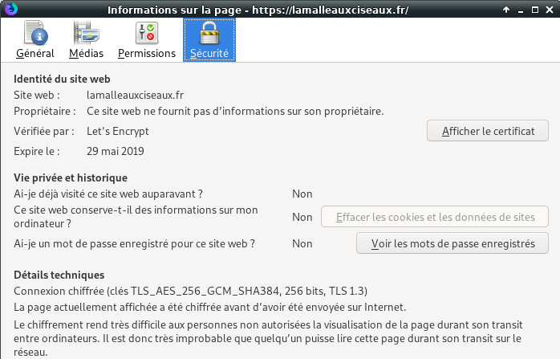
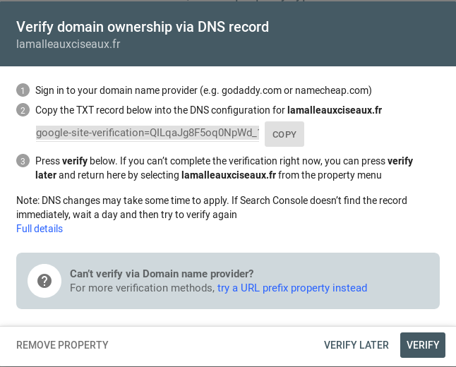
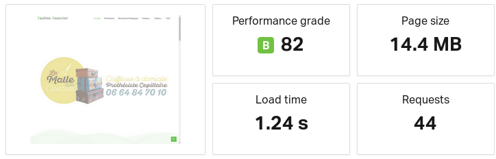
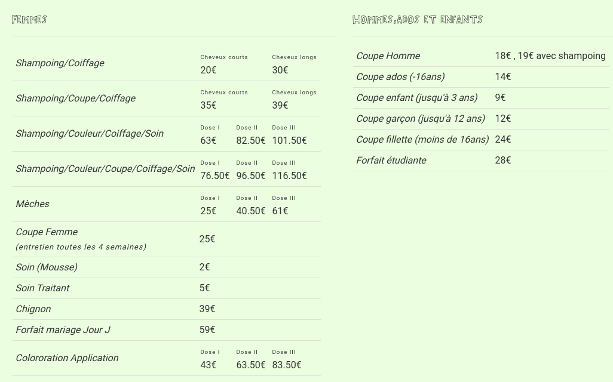

+++
title = 'OVH VPS SSD 1 KVM OpenStack (1 vCore/2GoRam/20GoSSD) domaine lamalleauxciseaux.fr'
date = 2021-07-05 00:00:00 +0100
categories = ['serveur']
+++
## KVM Debian Stretch lamalleauxciseaux.fr

{:width="100"}

Package: 2 GB Mémoire, 1 CPU, 20 GB SSD, 100 Mbps  
Selected Location: Gravelines  
Debian Stretch 64  
Livraison : vps655643 

* IPv4 du serveur : 54.38.65.40
* IPv6 du serveur : 2001:41d0:0305:2100:0000:0000:0000:6896
* IPV6 gateway    : 2001:41d0:0305:2100:0000:0000:0000:0001

### VPS OVH , activation IPV6

Connexion sur "OVH8 VPS SSD 3 KVM 2 vCore(s) Ram 8Go SSD 40Go Debian Stretch"  

    ssh root@54.38.65.40

Sur le VPS OVH il faut désactiver l'initialisation réseau par le cloud  

```
# To disable cloud-init's network configuration capabilities, write a file
# /etc/cloud/cloud.cfg.d/99-disable-network-config.cfg with the following:
# network: {config: disabled}
```

Création du fichier **/etc/cloud/cloud.cfg.d/99-disable-network-config.cfg** en mode su

    echo "network: {config: disabled}" > /etc/cloud/cloud.cfg.d/99-disable-network-config.cfg

Le fichier **/etc/network/interfaces** 

```
auto lo
iface lo inet loopback

auto ens3
iface ens3 inet dhcp
iface ens3 inet6 static
 address 2001:41d0:0305:2100:0000:0000:0000:6896
 netmask 128
 post-up /sbin/ip -6 route add 2001:41d0:0305:2100:0000:0000:0000:0001 dev ens3
 post-up /sbin/ip -6 route add default via 2001:41d0:0305:2100:0000:0000:0000:0001 dev ens3
 pre-down /sbin/ip -6 route del default via 2001:41d0:0305:2100:0000:0000:0000:0001 dev ens3
 pre-down /sbin/ip -6 route del 2001:41d0:0305:2100:0000:0000:0000:0001 dev ens3
```

>Redémarrer la machine `systemctl reboot` pour la prise en compte des modifications du réseau

Vérifier le réseau `ip addr` 

```
1: lo: <LOOPBACK,UP,LOWER_UP> mtu 65536 qdisc noqueue state UNKNOWN group default qlen 1
    link/loopback 00:00:00:00:00:00 brd 00:00:00:00:00:00
    inet 127.0.0.1/8 scope host lo
       valid_lft forever preferred_lft forever
    inet6 ::1/128 scope host 
       valid_lft forever preferred_lft forever
2: ens3: <BROADCAST,MULTICAST,UP,LOWER_UP> mtu 1500 qdisc pfifo_fast state UP group default qlen 1000
    link/ether fa:16:3e:3c:72:17 brd ff:ff:ff:ff:ff:ff
    inet 54.38.65.40/32 brd 54.38.65.40 scope global ens3
       valid_lft forever preferred_lft forever
    inet6 2001:41d0:305:2100::6896/128 scope global 
       valid_lft forever preferred_lft forever
    inet6 fe80::f816:3eff:fe3c:7217/64 scope link 
       valid_lft forever preferred_lft forever
```

### Mise à jour Debian et installation des utilitaires

Màj  

    apt update && apt upgrade


Installer utilitaires  

    apt install rsync curl tmux jq figlet git mailutils dnsutils -y

### Configurer Locales (fr et en)

Locales : **fr_FR.UTF-8** et **en_US.UTF-8**  

    dpkg-reconfigure locales

```bash
Generating locales (this might take a while)...
  fr_FR.UTF-8... done
  en_US.UTF-8... done
Generation complete.
```

### Europe/Paris (TimeZone tzdata)

Europe/Paris  

    dpkg-reconfigure tzdata

```
Current default time zone: 'Europe/Paris'
Local time is now:      Thu Feb 28 09:43:15 CET 2019.
Universal Time is now:  Thu Feb 28 08:43:15 UTC 2019.
```

### Création utilisateur

Utilisateur **usera**  

    useradd -m -d /home/usera/ -s /bin/bash usera

Mot de passe **usera**  

    passwd usera

Visudo pour les accès root via utilisateur **usera**  

```bash
apt install sudo  # installé par défaut
echo "usera     ALL=(ALL) NOPASSWD: ALL" >> /etc/sudoers
```

Changer le mot de passe root

    passwd root

Déconnexion puis connexion ssh en mode utilisateur  

    ssh usera@54.38.65.40

Les instructions suivantes se font en mode su

### Hostname

Exécuter les instructions suivantes en mode su  
Configuration OVH à modifier **/etc/cloud/cloud.cfg** 

    preserve_hostname: true
    manage_etc_hosts: false

Modifier **hostname**  

    hostnamectl set-hostname --static lamalleauxciseaux.fr

Modifier **/etc/hosts**  

    nano /etc/hosts

```
127.0.1.1 	lamalleauxciseaux.fr vps655643
127.0.0.1       localhost
...
```

Vérifications

    hostnamectl

```
   Static hostname: lamalleauxciseaux.fr
         Icon name: computer-vm
           Chassis: vm
        Machine ID: 8eb48cbca3054aedbe960bdd3103476a
           Boot ID: ed23cfb73fe44706a25cb1d6e24be9f9
    Virtualization: kvm
  Operating System: Debian GNU/Linux 9 (stretch)
            Kernel: Linux 4.9.0-8-amd64
      Architecture: x86-64
```

	hostname --fqdn
		lamalleauxciseaux.fr

### OVH DNS fournisseur domaine

Domaine **lamalleauxciseaux.fr** distribué par OVH

```
$TTL 3600
@	IN SOA dns110.ovh.net. tech.ovh.net. (2019051000 86400 3600 3600000 300)
      3600 IN NS     ns110.ovh.net.
      3600 IN NS     dns110.ovh.net.
      3600 IN A      54.38.65.40
      3600 IN AAAA   2001:41d0:0305:2100:0000:0000:0000:6896
www   3600 IN CNAME  lamalleauxciseaux.fr.
```


### OpenSSH, clé et script

{:width="100"}

**connexion avec clé**  
<u>sur l'ordinateur de bureau</u>
Générer une paire de clé curve25519-sha256 (ECDH avec Curve25519 et SHA2) nommé **kvm-cinay** pour une liaison SSH avec le serveur KVM.  

    ssh-keygen -t ed25519 -o -a 100 -f ~/.ssh/kvm-vps655643

Envoyer la clé publique sur le serveur KVM   

    scp ~/.ssh/kvm-vps655643.pub usera@54.38.65.40:/home/usera/

<u>sur le serveur KVM</u>
On se connecte  

    ssh usera@54.38.65.40

Copier le contenu de la clé publique dans /home/$USER/.ssh/authorized_keys  

    cd ~

Sur le KVM ,créer un dossier .ssh  

```bash
mkdir .ssh
cat $HOME/kvm-vps655643.pub >> $HOME/.ssh/authorized_keys
```

et donner les droits  

    chmod 600 $HOME/.ssh/authorized_keys

effacer le fichier de la clé  

    rm $HOME/kvm-vps655643.pub

Modifier la configuration serveur SSH  

    sudo nano /etc/ssh/sshd_config

Modifier

```conf
Port = 55033
PermitRootLogin no
PasswordAuthentication no
```


<u>session SSH ne se termine pas correctement lors d'un "reboot" à distance</u>  
Si vous tentez de **redémarrer/éteindre** une machine distance par **ssh**, vous pourriez constater que votre session ne se termine pas correctement, vous laissant avec un terminal inactif jusqu'à l'expiration d'un long délai d'inactivité. Il existe un bogue 751636 à ce sujet. Pour l'instant, la solution de contournement à ce problème est d'installer :  

    sudo apt-get install libpam-systemd

cela terminera la session ssh avant que le réseau ne tombe.  
Veuillez noter qu'il est nécessaire que PAM soit activé dans sshd.  

Relancer openSSH  

    sudo systemctl restart sshd

Accès depuis le poste distant avec la clé privée  

    ssh -p 55033 -i ~/.ssh/kvm-vps655643 usera@lamalleauxciseaux.fr

>**ATTENTION!!! Les scripts sur connexion peuvent poser des problèmes pour des appels externes autres que ssh**


**Exécution script sur connexion**  
Exécuter un fichier *utilisateur* nommé **$HOME/.ssh/rc** si *présent*  
Pour *tous les utilisateurs* exécuter un fichier nommé **/etc/ssh/sshrc** si *présent*  
Installer les utilitaires *curl jq figlet*  

Le batch  

    nano ~/.ssh/rc

```bash
#!/bin/bash

#clear
PROCCOUNT=`ps -Afl | wc -l`  		# nombre de lignes
PROCCOUNT=`expr $PROCCOUNT - 5`		# on ote les non concernées
GROUPZ=`users`
ipinfo=$(curl -s ipinfo.io) 		# info localisation format json
publicip=$(echo $ipinfo | jq -r '.ip')  # extraction des données , installer préalablement "jq"
ville=$(echo $ipinfo | jq -r '.city')
pays=$(echo $ipinfo | jq -r '.country')
cpuname=`cat /proc/cpuinfo |grep 'model name' | cut -d: -f2 | sed -n 1p`
iplink=`ip link show |grep -m 1 "2:" | awk '{print $2}' | cut -d: -f1`

echo "\033[0m\033[1;31m"  
figlet "`hostname --fqdn`"
echo "\033[0m
\033[1;35m    \033[1;37mHostname \033[1;35m= \033[1;32m`hostname`
\033[1;35m  \033[1;37mWired IpV4 \033[1;35m= \033[1;32m`ip addr show $iplink | grep 'inet\b' | awk '{print $2}' | cut -d/ -f1`
\033[1;35m  \033[1;37mWired IpV6 \033[1;35m= \033[1;32m`ip addr show $iplink | grep -E 'inet6' |grep -E 'scope link' | awk '{print $2}' | cut -d/ -f1`
\033[1;35m      \033[1;37mKernel \033[1;35m= \033[1;32m`uname -r`
\033[1;35m      \033[1;37mDebian \033[1;35m= \033[1;32m`cat /etc/debian_version`
\033[1;35m      \033[1;37mUptime \033[1;35m= \033[1;32m`uptime | sed 's/.*up ([^,]*), .*/1/' | sed -e 's/^[ \t]*//'`
\033[1;35m         \033[1;37mCPU \033[1;35m= \033[1;32m`echo $cpuname`
\033[1;35m  \033[1;37mMemory Use \033[1;35m= \033[1;32m`free -m | awk 'NR==2{printf "%s/%sMB (%.2f%%)\n", $3,$2,$3*100/$2 }'`
\033[1;35m    \033[1;37mUsername \033[1;35m= \033[1;32m`whoami`
\033[1;35m    \033[1;37mSessions \033[1;35m= \033[1;32m`who | grep $USER | wc -l`
\033[1;35m \033[1;37mPublic IpV4 \033[1;35m= \033[1;32m`echo $publicip`
\033[1;35m \033[1;37mPublic IpV6 \033[1;35m= \033[1;32m`ip addr show $iplink | grep -m 1 'inet6\b'  | awk '{print $2}' | cut -d/ -f1`
\033[0m"
df -h /
#curl fr.wttr.in/$ville?0
```

Recréer motd  

    sudo rm /etc/motd && sudo nano /etc/motd  

```
                  __  ___  ___   __  _ _  ____
 __ __ _ __  ___ / / | __|| __| / / | | ||__ /
 \ V /| '_ \(_-</ _ \|__ \|__ \/ _ \|_  _||_ \
  \_/ | .__//__/\___/|___/|___/\___/  |_||___/
   | ||_| _   _ __   __ _ | || | ___          
   | |/ _` | | '  \ / _` || || |/ -_)         
   |_|\__,_| |_|_|_|\__,_||_||_|\___|         
```

Déconnexion puis connexion  

### systemd/journal

Ajout de l'utilisateur courant au groupe systemd-journal  

    sudo gpasswd -a $USER systemd-journal

Accès utilisateur aux fichiers log     

    sudo gpasswd -a $USER adm

Après déconnexion puis reconnexion , l'utilisateur a accès au journal:  

    journalctl

Pour avoir les lignes NON TRONQUEES  

    export SYSTEMD_LESS=FRXMK journalctl

Pour un mode permanent ,modifier **~/.bashrc**

    echo "export SYSTEMD_LESS=FRXMK journalctl" >> ~/.bashrc

### Certificats SSL letsencrypt (acme)

{:width="100"}  

* [Serveur , installer et renouveler les certificats SSL Let's encrypt](https://yann.cinay.eu/2017/08/31/Acme-Certficats-Serveurs.html)

Domaines **lamalleauxciseaux.fr** et **www.lamalleauxciseaux.fr**

```
acme.sh --dns dns_ovh --issue --keylength ec-384 -d 'lamalleauxciseaux.fr' -d 'www.lamalleauxciseaux.fr'
```

Résultat

```
[jeudi 10 octobre 2019, 09:15:20 (UTC+0200)] Your cert is in  /home/usera//.acme.sh/lamalleauxciseaux.fr_ecc/lamalleauxciseaux.fr.cer 
[jeudi 10 octobre 2019, 09:15:20 (UTC+0200)] Your cert key is in  /home/usera//.acme.sh/lamalleauxciseaux.fr_ecc/lamalleauxciseaux.fr.key 
[jeudi 10 octobre 2019, 09:15:20 (UTC+0200)] The intermediate CA cert is in  /home/usera//.acme.sh/lamalleauxciseaux.fr_ecc/ca.cer 
[jeudi 10 octobre 2019, 09:15:20 (UTC+0200)] And the full chain certs is there:  /home/usera//.acme.sh/lamalleauxciseaux.fr_ecc/fullchain.cer 
```

Les liens pour les certificats

```
sudo -s
ln -s /home/usera//.acme.sh/lamalleauxciseaux.fr_ecc/fullchain.cer /etc/ssl/private/lamalleauxciseaux.fr-fullchain.pem   # full chain certs
ln -s /home/usera//.acme.sh/lamalleauxciseaux.fr_ecc/lamalleauxciseaux.fr.key /etc/ssl/private/lamalleauxciseaux.fr-key.pem     # cert key
ln -s /home/usera//.acme.sh/lamalleauxciseaux.fr_ecc/lamalleauxciseaux.fr.cer /etc/ssl/private/lamalleauxciseaux.fr-chain.pem   # cert
ln -s /home/usera//.acme.sh/lamalleauxciseaux.fr_ecc/ca.cer /etc/ssl/private/lamalleauxciseaux.fr-ca.pem                 # intermediate CA cert
```

Renouvellement automatique

    crontab -l
    28 0 * * * "/home/usera//.acme.sh"/acme.sh --cron --home "/home/usera//.acme.sh" > /dev/null

### Nginx PHP 

{:width="100"}


* [Debian Stretch, Compilation Nginx (modules-dynamiques) + TLSv1.3 + PHP7.3 + MariaDb ](404.html)

Télécharger le script , l'exécuter

	wget https://yann.cinay.eu/files/debian9-compilation-nginx-tls1.3-php7.3-MariaDB.sh.txt -O debian9-compilation-nginx-tls1.3-php7.3-MariaDB.sh
	chmod +x debian9-compilation-nginx-tls1.3-php7.3-MariaDB.sh
	./debian9-compilation-nginx-tls1.3-php7.3-MariaDB.sh

Les fichiers de configurations ssl headers et nginx

    sudo nano /etc/nginx/ssl_params

```
    ssl_certificate /etc/ssl/private/lamalleauxciseaux.fr-fullchain.pem;
    ssl_certificate_key /etc/ssl/private/lamalleauxciseaux.fr-key.pem;
    ssl_session_timeout 5m;
    ssl_session_cache shared:SSL:50m;
    ssl_prefer_server_ciphers on;

    # Ciphers with modern compatibility
    # New protocol TLSv1.3
    ssl_protocols TLSv1.3 TLSv1.2;
    ssl_ciphers 'TLS13-CHACHA20-POLY1305-SHA256:TLS13-AES-256-GCM-SHA384:TLS13-AES-128-GCM-SHA256:EECDH+AESGCM:EDH+AESGCM:AES256+EECDH:AES256+EDH';
```

entêtes

    sudo nano /etc/nginx/header_params

```
    # Follows the Web Security Directives from the Mozilla Dev Lab and the Mozilla Obervatory + Partners
    # https://wiki.mozilla.org/Security/Guidelines/Web_Security
    # https://observatory.mozilla.org/ 
    add_header Strict-Transport-Security "max-age=63072000; includeSubDomains; preload"; 
    add_header Content-Security-Policy "upgrade-insecure-requests";
    add_header Content-Security-Policy-Report-Only "default-src https: data: 'unsafe-inline' 'unsafe-eval'";
    add_header X-Content-Type-Options nosniff;
    add_header X-XSS-Protection "1; mode=block";
    add_header X-Download-Options noopen;
    add_header X-Permitted-Cross-Domain-Policies none;
    add_header X-Frame-Options "SAMEORIGIN";
```

On change le dossier racine

```
sudo mkdir /var/www/default-www
sudo mv /var/www/index* /var/www/default-www/
```

Configuration de base avec SSL et sécurité + letsencrypt (renouvellement)

    sudo nano /etc/nginx/conf.d/lamalleauxciseaux.fr.conf

```
server {
    listen 80;
    listen [::]:80;

    ## redirect http to https ##
    server_name www.lamalleauxciseaux.fr lamalleauxciseaux.fr;
    return  301 https://$server_name$request_uri;
}

server {
    listen 443 ssl http2;
    listen [::]:443 ssl http2;
    server_name www.lamalleauxciseaux.fr lamalleauxciseaux.fr;

    ####    Locations
    # On cache les fichiers statiques
    location ~* \.(html|css|js|png|jpg|jpeg|gif|ico|svg|eot|woff|ttf)$ { expires max; }
    # On interdit les dotfiles
    location ~ /\. { deny all; }

    include ssl_params;
    include header_params;
    # Diffie-Hellmann
    # Uncomment the following directive after DH generation
    # > openssl dhparam -out /etc/ssl/private/dh4096.pem -outform PEM -2 4096
    # ssl_dhparam /etc/ssl/private/dh4096.pem;

    root /var/www/default-www ;
    index index.php index.html index.htm;
        location ~ \.php$ {
           fastcgi_split_path_info ^(.+\.php)(/.+)$;
           fastcgi_pass unix:/run/php/php7.3-fpm.sock;   # PHP7.3
           fastcgi_index index.php;
           include fastcgi_params;
	   fastcgi_param SCRIPT_FILENAME $request_filename;
        }

    # if folder lamalleauxciseaux.fr.d , uncomment the following directive
    #include conf.d/lamalleauxciseaux.fr.d/*.conf;

    access_log /var/log/nginx/lamalleauxciseaux.fr-access.log;
    error_log /var/log/nginx/lamalleauxciseaux.fr-error.log;
}
```

Effacer ancien fichier de config

    sudo rm /etc/nginx/conf.d/default.conf

Vérifier et relancer nginx

    sudo nginx -t
    sudo systemctl restart nginx

Vérifier le lien https://lamalleauxciseaux.fr , le tls 1.3

{:width="500"}

### parefeu (iptables V4 V6)

{:width="100"}  

Le script de base **/usr/local/sbin/config_firewall**

    sudo -s
    nano /usr/local/sbin/config_firewall

```
#!/bin/sh

###################
#      IPv4       #
###################

# refuser input et forward par défaut, accepter output
iptables -t filter -P INPUT DROP
iptables -t filter -P FORWARD DROP
iptables -t filter -P OUTPUT ACCEPT

# interface lo (loop) accessible
iptables -A INPUT -i lo -j ACCEPT
iptables -A OUTPUT -o lo -j ACCEPT

# maintenir les connexions établies
iptables -A INPUT -m state --state RELATED,ESTABLISHED -j ACCEPT
iptables -A OUTPUT -m state --state RELATED,ESTABLISHED -j ACCEPT

# accepter en entrée le ping (icmp), et les
# connexions sur les ports nécessaires.
iptables -A INPUT -p icmp --icmp-type echo-request -m conntrack --ctstate NEW -m limit --limit 1/s --limit-burst 1 -j ACCEPT
iptables -A INPUT -p tcp --dport 80 -j ACCEPT
iptables -A INPUT -p tcp --dport 443 -j ACCEPT
iptables -A INPUT -p tcp --dport 55033 -j ACCEPT
iptables -A INPUT -p udp --dport 55033 -j ACCEPT

# accepter en sortie le ping, les requêtes HTTP(S), DNS,
# et les connexions sur les ports nécessaires.
iptables -A OUTPUT -p icmp --icmp-type echo-request -m conntrack --ctstate NEW -j ACCEPT
iptables -A OUTPUT -p tcp --dport 80 -j ACCEPT
iptables -A OUTPUT -p tcp --dport 443 -j ACCEPT


###################
#      IPv6       #
###################

# refuser input et forward par défaut, accepter output
ip6tables -t filter -P INPUT DROP
ip6tables -t filter -P FORWARD DROP
ip6tables -t filter -P OUTPUT ACCEPT

# interface lo (loop) accessible
ip6tables -A INPUT -i lo -j ACCEPT
ip6tables -A OUTPUT -o lo -j ACCEPT

# maintenir les connexions établies
ip6tables -A INPUT -m state --state RELATED,ESTABLISHED -j ACCEPT
ip6tables -A OUTPUT -m state --state RELATED,ESTABLISHED -j ACCEPT

# NDP pour toute interface de type broadcast
ip6tables -A INPUT -p icmpv6 --icmpv6-type neighbour-solicitation -m hl --hl-eq 255 -j ACCEPT
ip6tables -A INPUT -p icmpv6 --icmpv6-type neighbour-advertisement -m hl --hl-eq 255 -j ACCEPT
ip6tables -A INPUT -p icmpv6 --icmpv6-type router-advertisement -m hl --hl-eq 255 -j ACCEPT

ip6tables -A OUTPUT -p icmpv6 --icmpv6-type neighbour-solicitation -j ACCEPT
ip6tables -A OUTPUT -p icmpv6 --icmpv6-type neighbour-advertisement -j ACCEPT
ip6tables -A OUTPUT -p icmpv6 --icmpv6-type router-solicitation -j ACCEPT

# accepter en entrée le ping (icmpv6), les
# connexions entrantes déjà établies et les connexions sur les ports nécessaires.
ip6tables -A INPUT -p icmpv6 --icmpv6-type echo-request -m conntrack --ctstate NEW -m limit --limit 1/s --limit-burst 1 -j ACCEPT
ip6tables -A INPUT -p tcp --dport 80 -j ACCEPT
ip6tables -A INPUT -p tcp --dport 443 -j ACCEPT
ip6tables -A INPUT -p tcp --dport 55033 -j ACCEPT
ip6tables -A INPUT -p udp --dport 55033 -j ACCEPT

# accepter en sortie le ping, les requêtes HTTP(S), DNS,
# et les connexions sur les ports nécessaires.
ip6tables -t filter -A OUTPUT -p icmpv6 --icmpv6-type echo-request -j ACCEPT
ip6tables -A OUTPUT -p tcp --dport 80 -j ACCEPT
ip6tables -A OUTPUT -p tcp --dport 443 -j ACCEPT
```

Droits + exécution

    chmod +x /usr/local/sbin/config_firewall
    /usr/local/sbin/config_firewall

Pour la sauvegarde et la restauration des règles, on installe le paquet iptables-persistent

    sudo apt-get install iptables-persistent

Répondre au 2 questions pour sauvegarder les règles de base mises en place par le script précédent  
Faut-il enregistrer les règles IPv4 actuelles ? Oui  
Faut-il enregistrer les règles IPv6 actuelles ? Oui

## Site lamalleauxciseaux.fr

{:width="200"}  
<https://lamalleauxciseaux.fr> ou <https://www.lamalleauxciseaux.fr>

Structure

```
/var/www/
└── default-www
    ├── css
    ├── img
    ├── index.html
    ├── js
    ├── lib
    └── sitemap.xml
```

## Référencement 

* [Référencer un site web : les vraies réponses, la bonne méthode](https://legissa.ovh/internet-referencement-site-web.html)

### Création du fichier “sitemap.xml”

Si vous utilisez un CMS, blog, forum, e-commerce, etc, il est probable qu’une fonction créant ce fichier automatiquement existe. Sinon, un plug-in, module, extension devrait exister. Allez sur le site web de votre CMS, blog, e-commerce pour en savoir plus.
Des logiciels à installer soit sur le serveur web, soit sur votre ordinateur peuvent aussi le faire. Enfin, des sites web proposent la création automatique du fichier. Certains de ces services sont gratuits, d’autres payants.
Pour les petits sites web, j’utilise ce service gratuit : <www.xml-sitemaps.com> , mais il y en a d’autres.

### Référencement Google

>NOTE : il faut un compte google pour  accéder au référencement

<http://www.google.com/ping?sitemap=https://lamalleauxciseaux.fr/sitemap.xml>

*Notification de réception de sitemap  
Votre sitemap a été ajouté à notre liste de fichiers à explorer. Si vous signalez ce sitemap à Google pour la première fois, nous vous invitons à l’ajouter par l'intermédiaire de <http://www.google.com/webmasters/tools/> afin de pouvoir suivre son état. Notez que nous n'ajoutons pas dans notre index toutes les URL qui nous sont communiquées et ne pouvons ni prévoir ni garantir le moment ou l'éventualité de leur inclusion.*


<http://www.google.com/webmasters/tools/>

{:width="500"}  
Il faut modifier la zone dns OVH du domaine *lamalleauxciseaux.fr* avant de lancer la vérification.

OVH Modifier la zone dns lamalleauxciseaux.fr  
[OVH.com : valider votre domaine ](https://support.google.com/a/answer/1389262?hl=fr)

Ce qui suit est à ajouter à la dns :  
`google-site-verification=QILqaJg8F5oq0NpWd_1rKmiSQfjquZ2U651enGVHyBI`

Enregistrement DNS OVH après modification  

```
$TTL 3600
@	IN SOA dns110.ovh.net. tech.ovh.net. (2019030100 86400 3600 3600000 300)
   3600 IN NS     ns110.ovh.net.
   3600 IN NS     dns110.ovh.net.
   3600 IN A      54.38.65.40
   3600 IN AAAA   2001:41d0:0305:2100:0000:0000:0000:6896
        IN TXT    "google-site-verification=QILqaJg8F5oq0NpWd_1rKmiSQfjquZ2U651enGVHyBI"
```

On y retourne pour valider:  
<https://search.google.com/search-console/welcome>

Si tout est ok on peut accéder à Google Search Console (il faut un compte google pour y accéder):  
<https://search.google.com/search-console?resource_id=sc-domain:lamalleauxciseaux.fr>


### Test performance

* [Pingdom Website Speed Test](https://tools.pingdom.com/)

{:width="500"}

## Liens

* [Optimiser les images](https://lehollandaisvolant.net/tuto/html.php)
* [Serveur dédié : optimiser toutes les images JPG et PNG avec OptiPNG et JpegOptim](https://www.skyminds.net/serveur-dedie-optimiser-toutes-les-images-jpg-et-png-avec-optipng-et-jpegoptim/)
* [Free Stock Images & Videos ~ AllTheFreeStock.com](https://allthefreestock.com/)

## Modifications

### 17 mai 2019 

    * Ajout "perruques médicales" dans les champs `meta` du fichier index.html

### 5 juillet 2021

Modifications des tarifs   
{:width="600"}
