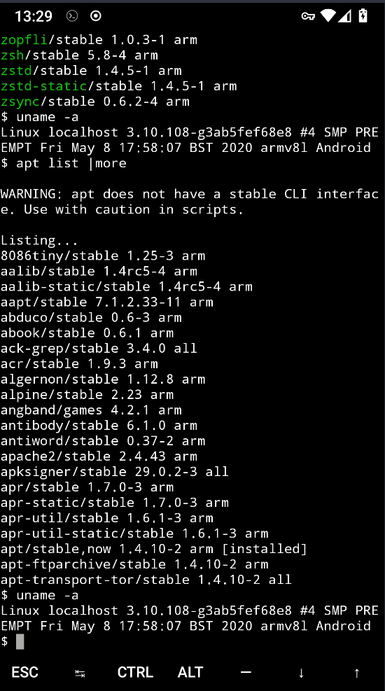
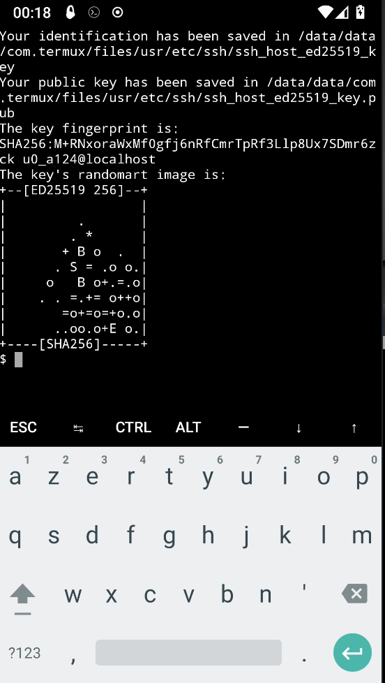
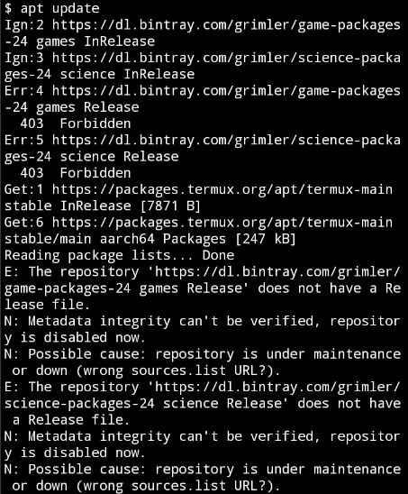
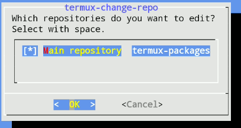
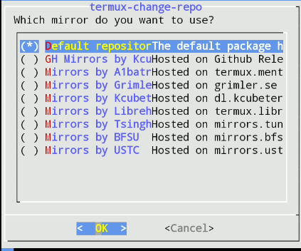

+++
title = 'Termux - Linux sur Android'
date = 2021-07-05 00:00:00 +0100
categories = ['android']
+++
# Comment utiliser la ligne de commande Linux sur Android avec Termux 

L'application Termux, puissante et puissante, vous permet de transformer votre appareil Android en un émulateur Linux. L'application est livrée avec un grand nombre d'outils installables tels que **bzip2** , **cmake** , **dnsutils** , **emacs** , **gcc** , **jet** , **Gnupg** , **ack-grep** , **htop** , **min** , **nano** , **php** , **ssh** , **goudron** Et plus encore



Une solution consiste à tirer parti de l'infrastructure Linux cachée sur Android. Termux fournit un environnement [Pour la ligne de commande](https://www.dz-techs.com/fr/copy-paste-files-linux-command-line)  
Vous êtes autorisé à installer des applications [Linux sur un appareil Android](https://www.dz-techs.com/fr/cast-android-screen-linux-desktop)

## Pourquoi utiliser Termux?

Il existe déjà des applications dans le Play Store qui sont des ports Android pour les applications Linux. Ceci est différent de Termux en ce qu'il copie les applications Linux, mais est en quelque sorte conçu pour "Android".  
En revanche, Termux est un environnement Linux autonome. Ses programmes (à toutes fins utiles) sont les mêmes que ceux pour Linux. Cela présente certains avantages :

* **Cohérence**: Les applications Linux transférées vers Android nécessitent une sorte d'interface utilisateur. L'expérience utilisateur Android dépend dans une large mesure de la quantité d'efforts déployés par le développeur. Inversement, les applications Termux sont les mêmes versions de Linux, des raccourcis clavier à la façon de les installer.
* **Compatibilité**: L'ajout de code Android peut rendre plus difficile la gestion de certaines applications fines. Par exemple, la taille du client SSH Android peut aller de 2 Mo à 12 Mo. Comparez cela au Dropbear, disponible dans Termux, qui a un 396 kilo-octets (Ko) installé. Le serveur SSH fournit également
* **Mises à jour**: Lorsqu'une application reçoit une mise à jour, vous restez à la merci du développeur d'application Android pour une mise à niveau. En revanche, les applications Termux sont des packages Linux standard qui nécessitent moins de maintenance. Il peut être créé automatiquement avec les versions de bureau. Vous pouvez obtenir de nouvelles fonctionnalités plus rapidement avec Termux.
* **Prix**: Il est possible que toute application que vous achetez sur le Play Store soit associée à des frais. Toutes les applications de Termux sont gratuites (et open source), tout comme Termux lui-même.

## Comment utiliser Termux

Avant de plonger, vous devez comprendre que Termux est principalement un environnement de ligne de commande. Pas d'interface utilisateur cool avec des boutons brillants ici. Cela s'applique non seulement au package Termux de base, mais également à ses applications.Plus important encore, vous devriez être à l'aise avec la ligne de commande pour installer ces programmes et les utiliser sur l'application Termux.Lorsque vous êtes prêt, prenez votre téléphone ou votre tablette et installez Termux.  
Télécharger et installer [Termux](https://termux.com/) android disponible sur [F-droid](https://f-droid.org/fr)  


## Commandes Termux de base que vous devez connaître

L'exécution de Termux vous déposera directement dans l'environnement de ligne de commande. De là, vous pouvez installer de nouveaux outils. Termux utilise le même installateur de packages que Debian, Ubuntu et les distributions Linux associées.

Des outils d'emballage avancés sont utilisés (plus communément appelés **APT**) Pour rechercher, installer et supprimer des programmes dans l'application Termux.

Ouvrir Termux et faire la mise à jour  

```bash
apt update # On met à jour la liste des paquets
apt upgrade # On met à jour les paquets
apt install nano rsync # On installe les paquets dont on a besoin, à noter que vi est l'éditeur par défaut
```

Découvrez ensuite les applications disponibles:

    apt list

Pour en savoir plus sur l'un de ces packages, utilisez

    apt show [package name]

Cela affichera: nom, administrateur, taille du fichier, dépendances et autres détails utiles. Pour installer une application, utilisez simplement:

    apt install [package name]

Notre guide privé vous parlera de [Utilisation d'APT](https://www.dz-techs.com/fr/install-pip-ubuntu)  
Plus d'informations sur cet outil, telles que la mise à niveau des packages. Vous pouvez exécuter un outil installé en entrant son nom dans Terminal sur la ligne de commande Termux.

En plus d'APT, ce menu de commandes intégré dans Termux fonctionne sur Android:

* Vous laisse **cp** Copiez un fichier
* La commande **mv** Transférer un fichier
* Listes **ls** Contenu du guide
* **rm** Supprime (supprime) les données
* Crée **ln** Lien symbolique (par exemple, **Dans /data/data/com.termux/files/home/documents vers / sdcard / Documents**)

Avec ces outils intégrés, vous pouvez réduire le besoin d'un gestionnaire de fichiers Android. De plus, cette application vous évitera d'avoir [Des pouvoirs root sur votre téléphone](https://www.dz-techs.com/fr/do-you-need-root-android-phone) pour profiter de cette fonctionnalité 

## Applications Linux que vous pouvez installer à l'aide de la ligne de commande Termux

Utilisation **apt** Avec Termux, vous pouvez installer de nombreuses applications Linux utiles sur Android. Ceux-ci se répartissent en plusieurs catégories - regardons quelques faits saillants.

### Editeurs de texte

Termux fournit des versions modernes de grandes applications d'édition de texte Linux: VIM et Emacs. D'autres applications d'édition sont également disponibles, comme le simple nano.

Bien sûr, Android a déjà beaucoup d'applications d'édition de texte. Qu'apporte donc Emacs et Vim à la plateforme? Eh bien, si vous voulez travailler avec <a href="https://www.dz-techs.com/fr/markdown-editors-linux" target="_blank">Markdown</a> Les deux le soutiennent bien.

As-tu besoin de quelque chose [Prendre des notes](https://www.dz-techs.com/fr/digital-bullet-journal-spreads-apps) Et livrer [Liste des tâches](https://www.dz-techs.com/fr/task-list-apps)? Le mode org dans Emacs couvrira cela. Vous pouvez même utiliser Emacs [En tant que gestionnaire de fichiers](https://www.dz-techs.com/fr/goto/?url=https%3A%2F%2Fgithub.com%2Fescherdragon%2Fsunrise-commander) Ou  [Application de scénarisatio](href="https://www.dz-techs.com/fr/goto/?url=https%3A%2F%2Fgithub.com%2Frnkn%2Ffountain-mode%2F) Ou [Client Trello](https://www.dz-techs.com/fr/goto/?url=https%3A%2F%2Fgithub.com%2Forg-trello%2Forg-trello) Ou [Lecteur de musique](https://www.dz-techs.com/fr/goto/?url=https%3A%2F%2Fwww.gnu.org%2Fsoftware%2Femms%2F) Ou pour courir [dragueur de mines](https://www.dz-techs.com/fr/goto/?url=https%3A%2F%2Fbitbucket.org%2Fzck%2Fminesweeper.el) 


**Pourquoi changer?** Les éditeurs de texte Android ont tendance à se concentrer sur une seule fonctionnalité. Par exemple, l'un peut se concentrer sur une formulation sans distraction, l'autre peut prévisualiser Markdown et d'autres formats, et d'autres peuvent être conçus pour la prise de notes (bien que ce ne soient que des applications pour l'édition de texte par essence).  
Les applications d'édition basées sur un terminal peuvent répondre à ces besoins dans une seule application, tout en étant également disponibles sur les plates-formes de bureau. 

## Utilitaires de ligne de commande Termux

Les packages Termux incluent plusieurs outils de ligne de commande Linux utiles:

* **gnuplot**Programme de graphisme mathématique
* **ImageMagick**: Outil de traitement et de conversion d'images
* **p7zip**: Outil de compression Zip</li><li>**UNRAR**: Divers outil de compression pour le format RAR
* **Wget**: Programme pour importer des fichiers depuis Internet via HTTP ou FTP

**Pourquoi changer?** Ce sont des applications dédiées qui ont beaucoup à offrir.

## Installer des serveurs dans Termux

Nous avons déjà montré comment convertir un appareil [Android à un serveur Web](https://www.dz-techs.com/fr/cast-your-android-screen)  
Avec des applications spécifiques. Termux fournit également des serveurs Web Linux natifs comme Apache, nginx et Lighttpd.

### Mais pourquoi voulez-vous exécuter un serveur Web sur votre appareil Android?

En plus de la programmation, gardez à l'esprit que bon nombre des meilleures applications d'aujourd'hui sont des applications Web. Par exemple, vous pouvez installer la base de données nginx, PostgreSQL et Python, puis utiliser la plateforme de gestion de projet [Taïga](https://www.dz-techs.com/fr/goto/?url=https%3A%2F%2Ftaiga.io%2F). Cela fournit de nombreux services, le tout sans avoir à vous inscrire à des services ou à un hébergement tiers.   
Termux comprend également Dropbear, qui fournit [Serveur SSH](https://www.dz-techs.com/fr/mount-remote-directories-linux-sshfs) (Et client) pour vous connecter à votre téléphone / tablette et transférer des fichiers. Ceci est utile dans les situations où vous souhaitez partager certains fichiers mais ne souhaitez pas utiliser les services cloud. Allumez simplement le serveur Dropbear et utilisez le client SSH pour obtenir ce dont vous avez besoin et fermez-le.  
**Pourquoi changer?** Des applications comme Tiny Web Server vous permettent de développer un serveur Web. Mais quoi de plus intéressant que d'avoir un serveur léger que vous pouvez démarrer à partir de la ligne de commande? 

## Développer des applications sur la ligne de commande Termux

Bien que de nombreuses applications Android (répertoriées comme «éditeurs de code») offrent la possibilité d'écrire du code, elles peuvent ne pas fournir les langues elles-mêmes. Avec Termux, vous pouvez tester le code sur votre téléphone ou tablette.  
Il fournit des distributions standard à partir de langages de programmation tels que:

* Shell BASH (un excellent moyen de commencer le piratage)
* Python (v2 et v3 disponibles)
* PHP
* Ruby

Des systèmes de contrôle de source Git et Subversion sont également disponibles, qui ont des utilisations au-delà du développement uniquement. Si vous souhaitez contrôler vos données privées, le contrôle de source vous permet de stocker vos fichiers où vous le souhaitez. Vous pouvez également contrôler l'envoi de mises à jour vers d'autres appareils, et vous pouvez utiliser des «balises» pour nommer les versions.  
**Pourquoi changer?** Il existe des packs de langage de programmation pour Android, comme [QPython](https://www.dz-techs.com/fr/goto/?url=https%3A%2F%2Fplay.google.com%2Fstore%2Fapps%2Fdetails%3Fid%3Dorg.qpython.qpy). Mais cela fournit une interface utilisateur spéciale. Il peut également nécessiter des applications supplémentaires pour être complètement utile.  
Les applications basées sur Android sont disponibles pour git et svn. Cependant, vous devez avoir une application distincte pour chaque type de contrôle de source. Termux propose les deux dans le même package gratuitement. En continuant à contrôler vos sources, vous pouvez également réduire le nombre de clients de services de synchronisation cloud comme Dropbox. 

## Ajouter Linux à Android avec les commandes Termux

Termux est un écran compact qui déverrouille de nombreuses fonctionnalités pour l'appareil Android. La ligne de commande est l'une des fonctionnalités les plus puissantes de Linux, et Termux a été développé en utilisant le noyau Linux sur votre appareil pour vous rendre plus efficace en déplacement. 

## Liens

* [Terminal et packages Linux sur Android : Termux](https://www.blog-libre.org/2016/03/06/terminal-et-packages-linux-sur-android-termux-for-the-win/)  


## Termux - openssh

Installer l'application openssh

    apt install openssh

Le paquet openssh contient le serveur SSH et le client. Des clés SSH pour le client seront automatiquement créées durant l’installation de ce paquet.  
La clé privée **ssh_host_ed25519_key** et la clé publique **ssh_host_ed25519_key.pub** se trouvent dans `/data/data/com.termux/files/usr/etc/ssh/`  



Connexion sur un serveur extérieur depuis android  
Exporter la clé publique **ssh_host_ed25519_key.pub** sur le serveur distant **exemple.fr** et l'ajouter au fichier `~/.ssh/authorized_keys`  
Se connecter au serveur **exemple.fr** depuis le terminal android Termux 

    ssh -i ../usr/etc/ssh/ssh_host_ed25519_key user@exemple.fr

## Problèmes

Problème de mise à jour `apt update`  


Supprimer les listes "game.list' et 'science.list' : `rm /data/data/com.termux/files/usr/etc/apt/sources.list.d/*.list`  

Exécuter :  `termux-change-repo`  
  
Valider après modifications par clic sur OK  
  

Lancer la mise à jour : `apt upgrade`


